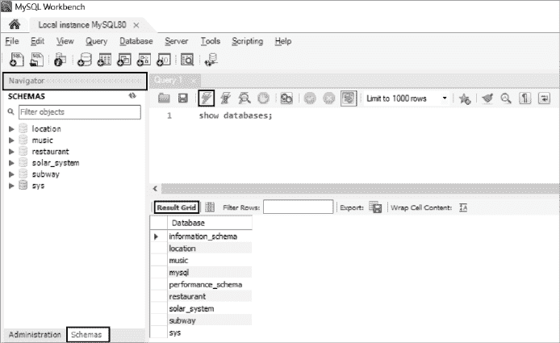
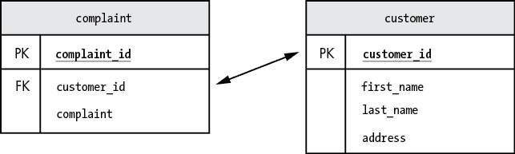
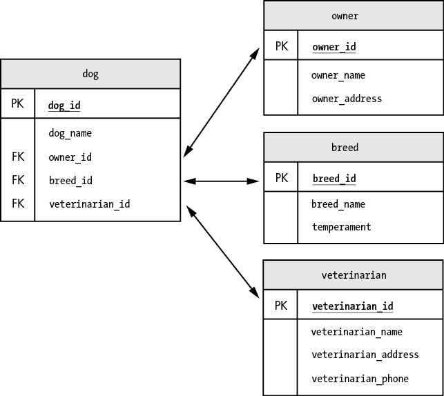
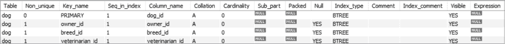

# 第二章：创建数据库和表格


在本章中，你将使用 MySQL Workbench 查看和创建 MySQL 数据库。接下来，你将学习如何创建表格来存储数据。你将定义表格的名称及其列，并指定列可以包含的数据类型。掌握这些基础知识后，你将通过 MySQL 的两个有用功能——约束和索引——来优化你的表格。

## 使用 MySQL Workbench

正如你在第一章中学到的，MySQL Workbench 是一个可视化工具，你可以用它来输入和运行 SQL 命令，并查看它们的结果。在这里，我们将介绍如何使用 MySQL Workbench 查看数据库的基础知识。

你将通过双击 MySQL Workbench 图标来启动它。该工具看起来像图 2-1 所示。



图 2-1：使用 MySQL Workbench 查看数据库

在右上角面板中，输入 `show databases;` 命令。确保包括分号，它表示语句的结束。然后点击闪电图标，图中高亮显示了图 2-1，以执行该命令。结果，显示可用 MySQL 数据库的列表，将出现在结果网格面板中（你的结果会与我的不同）：

```
Database
--------
information_schema
location
music
mysql
performance_schema
restaurant
solar_system
subway
sys
```

该列表中的一些数据库是系统数据库，这些数据库在安装 MySQL 时自动创建——例如 `information_schema`、`mysql` 和 `performance_schema`——而其他的则是我创建的数据库。你创建的任何数据库都应该出现在此列表中。

你也可以通过左侧的导航面板浏览数据库。点击面板底部的 **Schemas** 标签，显示数据库列表，然后点击右箭头 (▶) 调查数据库的内容。请注意，默认情况下，导航面板不会显示 MySQL 安装时自动创建的系统数据库。

现在你已经看到了如何查看 MySQL 中的数据库列表，是时候尝试创建你自己的数据库了。

## 创建新数据库

要创建新数据库，可以使用 `create database` 命令，并为你想要创建的数据库指定一个名称：

```
create database circus;

create database finance;

create database music;
```

数据库的名称应该描述其中存储的数据类型。例如，名为 `circus` 的数据库可能包含关于小丑、走钢丝演员和高空秋千的表格。`finance` 数据库可能包含应收账款、收入和现金流的表格。有关乐队、歌曲和专辑的数据可能会存储在 `music` 数据库中。

要删除数据库，请使用 `drop database` 命令：

```
drop database circus;

drop database finance;

drop database music;
```

这些命令将删除你刚创建的三个数据库、这些数据库中的所有表格，以及这些表格中的所有数据。

当然，你还没有真正创建任何表格。现在，你将开始创建表格。

## 创建新表格

在这个示例中，你将创建一个新表格来存储全球人口数据，并指定该表格可以包含的数据类型：

```
create database land;

use land;

create table continent
(
   continent_id      int,
   continent_name    varchar(20),
   population        bigint
);
```

首先，你使用之前看到的`create database`命令创建一个名为`land`的数据库。在下一行，`use`命令告诉 MySQL 使用`land`数据库来执行随后的 SQL 语句。这确保了你创建的新表将在`land`数据库中创建。

接下来，你使用`create table`命令，并为表命名为`continent`。在括号内，你在`continent`表中创建了三列——`continent_id`、`continent_name`和`population`——并为每一列选择了一个 MySQL 数据类型，控制该列允许的数据类型。我们来详细讨论一下这个过程。

你将`continent_id`列定义为`int`，使其接受整数（数字）数据。每个大洲将在这一列中拥有自己独特的 ID 号码（1、2、3 等）。然后，你将`continent_name`列定义为`varchar(20)`，使其接受最多 20 个字符的字符数据。最后，你将`population`列定义为`bigint`，以接受大整数，因为整个大洲的人口可能是一个非常大的数字。

当你运行这个`create table`语句时，MySQL 会创建一个空的表。该表具有表名并且定义了列，但尚未包含任何行。你可以随时添加、删除和修改表中的行。

然而，如果你尝试添加一行数据，而这些数据与某一列的数据类型不匹配，MySQL 将拒绝整个行。例如，由于`continent_id`列被定义为`int`，MySQL 不允许该列存储像`Continent #1`或`A`这样的值，因为这些值包含字母。MySQL 也不会允许你在`continent_name`列中存储像`The Continent of Atlantis`这样的值，因为这个值的字符数超过了 20 个。

### 约束

当你创建自己的数据库表时，MySQL 允许你为它们包含的数据设置*约束*，或者说规则。一旦定义了约束，MySQL 将强制执行这些规则。

约束有助于维护*数据完整性*；也就是说，它们帮助保持数据库中数据的准确性和一致性。例如，你可能想在`continent`表上添加一个约束，以确保该表中的某一列不能有两个相同的值。

MySQL 中可用的约束有`primary key`、`foreign key`、`not null`、`unique`、`check`和`default`。

#### 主键

在表中识别主键是数据库设计中的一个重要部分。主键由一列或多列组成，用于唯一标识表中的行。当你创建一个数据库表时，你需要确定哪些列应该组成主键，因为这些信息将帮助你稍后检索数据。如果你将来自多个表的数据结合起来，你需要知道从每个表中预期返回多少行，并且如何连接这些表。你不希望在结果集中出现重复或缺失的行。

考虑这个包含`customer_id`、`first_name`、`last_name`和`address`列的`customer`表：

```
customer_id   first_name   last_name   address
-----------   ----------   ---------   ---------------------------
     1        Bob          Smith       12 Dreary Lane
     2        Sally        Jones       76 Boulevard Meugler
     3        Karen        Bellyacher  354 Main Street
```

要决定表的主键应该是什么，你需要识别出哪个列能够唯一标识表中的每一行。对于这个表，主键应该是`customer_id`，因为每个`customer_id`仅对应表中的一行。

无论未来可能向表中添加多少行，都不会有两行具有相同的`customer_id`。其他列则不能保证这一点。多个人可能拥有相同的名字、姓氏或地址。

主键可以由多个列组成，但即便是`first_name`、`last_name`和`address`这三列的组合，也不能保证唯一标识每一行。例如，住在 12 Dreary Lane 的 Bob Smith 可能和同名的儿子住在一起。

要将`customer_id`列指定为主键，在创建`customer`表时使用`primary key`语法，如示例 2-1 所示：

```
create table customer
(
    customer_id     int,
    first_name      varchar(50),
    last_name       varchar(50),
    address         varchar(100),
    **primary key (customer_id)**
);
```

示例 2-1：创建主键

在这里，你将`customer_id`定义为接受整数值的列，并作为表的主键。

将`customer_id`设置为主键对你有三方面的好处。首先，它防止了重复的客户 ID 被插入到表中。如果某个使用你数据库的人尝试在`customer_id`为`3`的情况下再次插入该 ID，MySQL 会报错并拒绝插入该行。

其次，将`customer_id`设置为主键可以防止用户为`customer_id`列插入空值（即缺失或未知值）。当你将某列定义为主键时，它会被指定为一个特殊列，其值不能为 null。（稍后在本章你会了解更多关于 null 值的内容。）

这两个好处属于数据完整性类别。一旦你定义了主键，就可以确保表中的所有行都有唯一的`customer_id`，且没有`customer_id`为 null 的情况。MySQL 将强制执行这一约束，有助于保持数据库中数据的高质量。

创建主键的第三个优点是它会促使 MySQL 创建一个索引。索引将有助于加速从表中选择数据时的 SQL 查询性能。我们将在本章稍后的“索引”部分详细讲解索引。

如果一个表没有明显的主键，通常可以添加一个新列作为主键（就像这里展示的`customer_id`列）。为了性能考虑，最好将主键值保持尽可能简短。

现在让我们看看由多个列组成的主键，这种主键称为*复合主键*。示例 2-2 中展示的`high_temperature`表存储了每个城市及其按年份划分的最高温度。

```
city                      year   high_temperature
-----------------------   ----   ----------------
Death Valley, CA          2020   130
International Falls, MN   2020   78
New York, NY              2020   96
Death Valley, CA          2021   128
International Falls, MN   2021   77
New York, NY              2021   98
```

示例 2-2：创建多个主键列

对于这个表格，主键应该由`city`和`year`两列组成，因为表格中同一城市和年份应该只有一行数据。例如，目前有一行记录显示 2021 年死亡谷的最高气温为 128，所以当你将`city`和`year`定义为主键时，MySQL 将防止用户为 2021 年死亡谷添加第二行数据。

要将`city`和`year`设置为该表的主键，使用 MySQL 的`primary key`语法，并包含两个列名：

```
create table high_temperature
(
    city              varchar(50),
    year              int,
    high_temperature  int,
    **primary key (city, year)**
);
```

`city`列被定义为最多容纳 50 个字符，而`year`和`high_temperature`列被定义为容纳整数。然后，主键被定义为`city`和`year`两列。

MySQL 并不要求你为所创建的表定义主键，但为了数据完整性和性能的考虑，你应该定义主键。如果你无法确定新表的主键应该是什么，这可能意味着你需要重新考虑你的表设计。

每个表格最多只能有一个主键。

#### 外键

外键是表中的一个（或多个）列，这些列与另一个表的主键列匹配。定义外键在两个表之间建立了关系，以便你能够获取一个包含两个表数据的结果集。

你在清单 2-1 中看到过，使用`primary key`语法可以在`customer`表中创建主键。你将使用类似的语法在`complaint`表中创建外键：

```
create table complaint
    (
    complaint_id  int,
    customer_id   int,
    complaint     varchar(200),
    primary key (complaint_id),
    **foreign key (customer_id) references customer(customer_id)**
    );
```

在这个例子中，首先你创建`complaint`表格，定义其列和数据类型，并指定`complaint_id`为主键。接着，使用`foreign key`语法可以将`customer_id`列定义为外键。通过`references`语法，你指定`complaint`表的`customer_id`列引用`customer`表的`customer_id`列（稍后你将了解这意味着什么）。

这里是`customer`表格：

```
customer_id   first_name   last_name   address
-----------   ----------   ---------   ---------------------------
     1        Bob          Smith       12 Dreary Lane
     2        Sally        Jones       76 Boulevard Meugler
     3        Karen        Bellyacher  354 Main Street
```

这是`complaint`表的数据显示：

```
complaint_id  customer_id  complaint
------------  -----------  -------------------------------
       1            3      I want to speak to your manager
```

外键让你能看到`complaint`表中`customer_id 3`指向的是`customer`表中的哪一条记录；在这种情况下，`customer_id 3`指向 Karen Bellyacher。这个结构，如图 2-2 所示，允许你跟踪哪些客户做出了哪些投诉。



图 2-2：主键和外键

在`customer`表中，`customer_id`列被定义为主键（标记为 PK）。在`complaint`表中，`customer_id`列被定义为外键（FK），因为它将用于将`complaint`表连接到`customer`表。

事情变得有趣了。因为你定义了外键，MySQL 不允许你在 `complaint` 表中添加新行，除非它是针对一个有效的客户——即，除非 `customer` 表中有一行 `customer_id` 与 `complaint` 表中的 `customer_id` 相关联。例如，如果你尝试为 `customer_id` 为 `4` 的客户在 `complaint` 表中添加一行，MySQL 会报错。为一个不存在的客户在 `complaint` 表中添加行没有意义，因此 MySQL 会阻止该行的添加，以保持数据完整性。

此外，现在你已经定义了外键，MySQL 将不允许你从 `customer` 表中删除 `customer_id 3`。删除此 ID 会导致 `complaint` 表中出现一个 `customer_id 3` 的行，而该行将不再与 `customer` 表中的任何行对应。限制数据删除是参照完整性的一部分。

每个表只能有一个主键，但一个表可以有多个外键（见 图 2-3）。



图 2-3：一个表只能有一个主键，但可以有多个外键。

图 2-3 显示了一个名为 `dog` 的表格示例，该表有三个外键，每个外键都指向不同表的主键。在 `dog` 表中，`owner_id` 是用来引用 `owner` 表的外键，`breed_id` 是用来引用 `breed` 表的外键，`veterinarian_id` 是用来引用 `veterinarian` 表的外键。

与主键一样，当你创建外键时，MySQL 会自动创建一个索引，这将加速对表的访问。稍后将详细说明。

#### not null

空值（null）表示空或未定义的值。它与零、空字符字符串或空格字符不同。

允许列中有空值在某些情况下是合适的，但有时候允许缺少关键信息可能导致数据库丢失必要的数据。看看这个名为 `contact` 的表，它包含了联系信息：

```
contact_id    name          city       phone      email_address
-----------   ----------    ---------  -------    -----------------
     1        Steve Chen    Beijing    123-3123   steve@schen21.org
     2        Joan Field    New York   321-4321   jfield@jfny99.com
     3        Bill Bashful  Lincoln    **null**       bb@shyguy77.edu
```

`contact_id 3` 的 `phone` 列值为 `null`，因为 Bill Bashful 没有电话。允许 `contact` 表中的 `phone` 列为空是合理的，因为某些联系人的电话号码可能无法提供或不适用。

另一方面，`name` 列不应允许空值。最好不要允许以下行被添加到 `contact` 表中：

```
contact_id    name          city       phone      email_address
-----------   ----------    ---------  -------    ---------------
     3        null          Lincoln    null       bb@shyguy77.edu
```

除非你知道联系人的姓名，否则保存联系人信息没有太大意义，因此你可以为 `name` 列添加 `not null` 约束，以防止这种情况发生。

按如下方式创建 `contact` 表：

```
create table contact
(
    contact_id     int,
    name           varchar(50) **not null**,
    city           varchar(50),
    phone          varchar(20),
    email_address  varchar(50),
    primary key(contact_id)
);
```

当你定义`name`列时使用`not null`语法，可以防止存储`null`值，从而保持数据的完整性。如果你尝试添加一个`name`为 null 的行，MySQL 将显示错误信息并拒绝该行。

对于定义为表主键的列，例如本例中的`contact_id`列，指定`not null`并不是必须的。MySQL 会自动防止主键列中的 null 值。

#### unique

如果你想防止列中出现重复的值，可以在列定义中添加`unique`约束。让我们回到前面的`contact`表：

```
create table contact
(
    contact_id     int,
    name           varchar(50)  not null,
    city           varchar(50),
    phone          varchar(20),
    email_address  varchar(50)  **unique**,
    primary key(contact_id)
);
```

在这里，你通过在`email_address`列上使用`unique`语法，防止输入重复的电子邮件地址。现在 MySQL 将不再允许表中有两个联系人拥有相同的电子邮件地址。

#### check

你可以使用`check`约束来确保某个列包含特定的值或特定范围的值。例如，让我们重新查看来自 Listing 2-2 的`high_temperature`表：

```
create table high_temperature
(
    city              varchar(50),
    year              int,
    high_temperature  int,
    **constraint check (year between 1880 and 2200),**
 **constraint check (high_temperature < 200),**
    primary key (city, year)
);
```

在本例中，你在`year`列上添加了`check`约束，确保输入表中的年份在 1880 年到 2200 年之间。1880 年之前没有准确的温度跟踪数据，而且你的数据库在 2200 年之后可能不会再使用。尝试添加一个超出该范围的年份很可能是一个错误，因此该约束会防止这种情况发生。

你还在`high_temperature`列上添加了`check`约束，将温度值限制在 200 度以下，因为超过这个温度的值很可能是数据错误。

#### default

最后，你可以为列添加`default`约束，这样如果没有提供值，将使用默认值。看看以下的`job`表：

```
create table job
(
    job_id     int,
    job_desc   varchar(100),
    shift      varchar(50) **default '9-5'**,
    primary key (job_id)
);
```

在本例中，你为存储工作时间表数据的`shift`列添加了`default`约束。默认班次是`9-5`，意味着如果某行没有包含班次数据，`9-5`将写入该列。如果提供了`shift`的值，则不会使用默认值。

你已经看到不同的约束如何帮助你提高和保持表中数据的完整性。接下来，让我们看看另一个 MySQL 特性，它同样能为你的表提供性能上的好处：索引。

### 索引

MySQL 允许你在表上创建索引，以加速检索数据的过程；在某些情况下，例如在定义了主键或外键的表中，MySQL 会自动创建索引。就像书本后面的索引可以帮助你找到信息，而无需扫描每一页，索引帮助 MySQL 在表中找到数据，而无需读取每一行。

假设你创建了一个`product`表，如下所示：

```
create table product
(
    product_id      int,
    product_name    varchar(100),
    supplier_id     int
);
```

如果你想使检索供应商信息的过程更加高效，以下是创建索引的语法：

```
create index product_supplier_index on product(supplier_id);
```

在这个例子中，你在 `product` 表的 `supplier_id` 列上创建了一个名为 `product_supplier_index` 的索引。现在，当用户使用 `supplier_id` 列从 `product` 表中检索数据时，索引应该能使检索更快速。

一旦你创建了索引，就不需要通过名称引用它——MySQL 会在后台使用它。新的索引不会改变你使用表的方式；它只是加速了对表的访问。

尽管添加索引可以显著提高性能，但为每一列添加索引并没有意义。维护索引会有性能成本，而创建没有被使用的索引实际上可能会降低性能。

当你创建表时，MySQL 会自动创建你所需的大多数索引。对于已经定义为主键、外键或具有 `unique` 约束的列，你无需创建索引，因为 MySQL 会自动为这些列创建索引。

让我们来看一下如何从 Figure 2-3 中创建 `dog` 表：

```
use pet;

create table dog
(
    dog_id            int,
    dog_name          varchar(50),
    owner_id          int,
    breed_id          int,
 veterinarian_id   int,
    primary key (dog_id),
    foreign key (owner_id) references owner(owner_id),
    foreign key (breed_id) references breed(breed_id),
    foreign key (veterinarian_id) references veterinarian(veterinarian_id)
);
```

表的主键是 `dog_id`，外键是 `owner_id`、`breed_id` 和 `veterinarian_id`。注意，你没有使用 `create index` 命令创建任何索引。MySQL 已经自动为标记为主键和外键的列创建了索引。你可以使用 `show indexes` 命令来确认这一点：

```
show indexes from dog;
```

结果如 Figure 2-4 所示。



图 2-4：MySQL 为 `dog` 表自动创建的索引

你可以在 `Column_name` 列中看到，MySQL 已经为该表自动创建了你所需要的所有索引。

## 删除和修改表

要*删除*一个表，移除该表及其所有数据，请使用 `drop table` 语法：

```
drop table product;
```

在这里，你告诉 MySQL 删除你在前一节创建的 `product` 表。

要对表进行更改，请使用 `alter table` 命令。你可以添加列、删除列、更改列的数据类型、重命名列、重命名表、添加或删除约束以及进行其他更改。

尝试修改 Listing 2-1 中的 `customer` 表：

```
alter table customer add column zip varchar(50);
alter table customer drop column address;
alter table customer rename column zip to zip_code;
alter table customer rename to valued_customer;
```

在这里，你通过四种方式修改了 `customer` 表：添加了一个名为 `zip` 的列，用于存储邮政编码；删除了 `address` 列；将 `zip` 列重命名为 `zip_code`，使其更具描述性；将表名从 `customer` 改为 `valued_customer`。

## 总结

在这一章中，你学习了如何使用 MySQL Workbench 执行命令并查看数据库。你创建了自己的数据库表，并学会了如何通过使用索引和添加约束来优化它们。

在下一章，即本书第二部分的开始部分，你将学习如何使用 SQL 从 MySQL 表中检索数据，按顺序显示数据，格式化 SQL 语句，并在 SQL 中使用注释。
