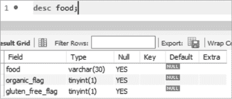

# 第四章：MySQL 数据类型


在本章中，你将了解所有可用的 MySQL 数据类型。你已经看到`int`和`varchar`可以用于整数和字符数据，但 MySQL 也有用于存储日期、时间甚至二进制数据的数据类型。你将探索如何选择最适合列的数据类型以及每种类型的优缺点。

创建表时，你根据列中将存储的数据类型来定义每一列的数据类型。例如，对于存储名称的列，你不会使用仅允许数字的数据类型。你还可能考虑列需要容纳的值的范围。如果某列需要存储像 3.1415 这样的值，你应选择允许小数点后四位的数值数据类型。最后，如果多种数据类型都可以处理该列需要存储的值，你应选择占用最少存储空间的数据类型。

假设你想创建一个名为`solar_eclipse`的表，包含关于日全食的数据，包括日全食的日期、发生时间、类型及其亮度。你的原始数据可能如下所示：表 4-1。

表 4-1：太阳日全食数据

| **日全食日期** | **日全食最大时间** | **日全食类型** | **日全食亮度** |
| --- | --- | --- | --- |
| 2022-04-30 | 20:42:36 | 部分 | 0.640 |
| 2022-10-25 | 11:01:20 | 部分 | 0.862 |
| 2023-04-20 | 04:17:56 | 混合型 | 1.013 |

为了将这些数据存储到 MySQL 数据库中，你将创建一个包含四列的表：

```
create table solar_eclipse
(
    eclipse_date                date,
    time_of_greatest_eclipse    time,
    eclipse_type                varchar(10),
    magnitude                   decimal(4,3)
);
```

在此表中，四列的每一列都定义了不同的数据类型。由于`eclipse_date`列将存储日期，因此使用`date`数据类型。`time`数据类型专门用于存储时间数据，应用于`time_of_greatest_eclipse`列。

对于`eclipse_type`列，使用`varchar`数据类型，因为你需要存储变长的字符数据。你预计这些值不会很长，因此使用`varchar(10)`将最大字符数设置为 10。

对于`magnitude`列，使用`decimal`数据类型，并指定值的总位数为四位，小数点后有三位。

让我们更深入地了解这些以及其他一些数据类型，并探讨在何种情况下使用每种数据类型是合适的。

## 字符串数据类型

*字符串*是一组字符，包括字母、数字、空白字符（如空格和制表符）以及符号（如标点符号）。对于仅包含数字的值，你应该使用数值数据类型而非字符串数据类型。你会使用字符串数据类型来存储类似`I love MySQL 8.0!`的值，而对于类似`8.0`的值则使用数值数据类型。

本节将探讨 MySQL 的字符串数据类型。

### char

`char` 数据类型用于 *固定长度* 字符串——即存储确切数量字符的字符串。为了在 `country_code` 表中定义一个列来存储三字符国家代码，比如 `USA`、`GBR` 和 `JPN`，使用 `char(3)`，如下所示：

```
create table country_code
(
    country_code    **char(3)**
);
```

在定义 `char` 数据类型的列时，你在括号内指定字符串的长度。如果省略括号，`char` 数据类型默认为一个字符，尽管在你只需要一个字符的情况下，明确指定 `char(1)` 比仅仅写 `char` 更清晰。

字符串的长度不能超过括号内定义的长度。如果你尝试将 `JAPAN` 插入 `country_code` 列，MySQL 会拒绝该值，因为该列已定义为最多存储三个字符。然而，MySQL 会允许你插入少于三个字符的字符串，比如 `JP`；它只会在 `JP` 的末尾添加一个空格并将值保存在该列中。

你可以定义一个最多包含 255 个字符的 `char` 数据类型。如果你尝试定义一个 `char(256)` 类型的列，你会收到错误信息，因为它超出了 `char` 的范围。

### varchar

`varchar` 数据类型，你之前见过，是用于 *可变长度* 字符串，或者可以存储 *最多* 指定数量字符的字符串。当你需要存储字符串，但不确定它们的具体长度时，它非常有用。例如，创建一个 `interesting_people` 表，然后定义一个名为 `interesting_name` 的列来存储各种名字，你需要能够容纳像 `Jet Li` 这样的短名字，也要能存储像 `Hubert Blaine Wolfeschlegelsteinhausenbergerdorff` 这样的长名字：

```
create table interesting_people
(
    interesting_name    **varchar(100)**
);
```

在括号中，你为 `interesting_name` 列定义了一个字符限制 100，因为你预计数据库中的任何名字都不会超过 100 个字符。

`varchar` 能接受的字符数取决于你的 MySQL 配置。你的数据库管理员（DBA）可以帮助你，或者你可以使用这个快速技巧来确定你的最大值。编写一个包含极长 `varchar` 最大值的 `create table` 语句：

```
create table test_varchar_size
(
    huge_column **varchar(999999999)**
);
```

`create table` 语句会失败，给出类似这样的错误信息：

```
Error Code: 1074\. Column length too big for column 'huge_column'
(max = 16383);
use BLOB or TEXT instead
```

表没有创建，因为 `varchar` 定义过大，但错误信息告诉你在这个环境中，`varchar` 可以接受的最大字符数是 16,383，或者 `varchar(16383)`。

`varchar` 数据类型主要用于存储小字符串。当你存储超过 5,000 个字符时，我建议使用 `text` 数据类型（稍后我们会介绍它）。

### enum

`enum` 数据类型，缩写为 *枚举*，允许你创建一个你想在字符串列中允许的值的列表。下面是如何创建一个名为 `student` 的表，并定义一个 `student_class` 列，该列只接受以下值之一——`Freshman`（大一）、`Sophomore`（大二）、`Junior`（大三）或 `Senior`（大四）：

```
create table student
    (
    student_id     int,
    student_class  **enum('Freshman','Sophomore','Junior','Senior')**
    );
```

如果你尝试向列中添加不在允许值列表中的值，它将被拒绝。你只能向 `student_class` 列添加允许的一个值；学生不能同时是新生和二年级生。

### set

`set` 数据类型与 `enum` 数据类型相似，但 `set` 允许你选择多个值。在以下的 `create table` 语句中，你为名为 `interpreter` 的表中的 `language_spoken` 列定义了一个语言列表：

```
create table interpreter
    (
    interpreter_id     int,
    language_spoken    **set('English','German','French','Spanish')**
    );
```

`set` 数据类型允许你将集合中的任何语言或所有语言添加到 `language_spoken` 列中，因为某人可能会说一种或多种这些语言。然而，如果你尝试向该列添加任何列表中没有的值，这些值将被拒绝。

### tinytext, text, mediumtext 和 longtext

MySQL 包括四种文本数据类型，用于存储可变长度的字符串：

| `tinytext` | 存储最多 255 个字符 |
| --- | --- |
| `` `text` `` | 存储最多 65,535 个字符，约 64KB |
| `mediumtext` | 存储最多 16,777,215 个字符，约 16MB |
| `longtext` | 存储最多 4,294,967,295 个字符，约 4GB |

以下 `create table` 语句创建了一个名为 `book` 的表，该表包含四个列。最后三个列 `author_bio`、`book_proposal` 和 `entire_book` 都使用了不同大小的文本数据类型：

```
create table book
    (
    book_id            int,
    author_bio         tinytext,
    book_proposal      text,
    entire_book        mediumtext
    );
```

你使用 `tinytext` 数据类型为 `author_bio` 列，因为你预计不会有超过 255 个字符的作者简介。这也强制用户确保他们的简介少于 255 个字符。你为 `book_proposal` 列选择了 `text` 数据类型，因为你不预期任何书籍提案会超过 64KB。最后，你选择了 `mediumtext` 数据类型为 `entire_book` 列，这样可以将书籍的大小限制在 16MB 内。

## 二进制数据类型

MySQL 提供了用于存储 *二进制* 数据或原始字节格式数据的类型，这些数据不可人类直接读取。

### tinyblob, blob, mediumblob 和 longblob

*二进制大对象（BLOB）* 是一个可变长度的字节字符串。你可以使用 BLOB 来存储二进制数据，如图像、PDF 文件和视频。BLOB 数据类型的大小与文本数据类型相同。虽然 `tinytext` 最多可以存储 255 个字符，但 `tinyblob` 最多只能存储 255 字节。

| `tinyblob` | 存储最多 255 字节 |
| --- | --- |
| `` `blob` `` | 存储最多 65,535 字节，约 64KB |
| `mediumblob` | 存储最多 16,777,215 字节，约 16MB |
| `longblob` | 存储最多 4,294,967,295 字节，约 4GB |

### binary

`binary` 数据类型用于定长的二进制数据。它类似于 `char` 数据类型，不同之处在于它用于存储二进制数据字符串，而不是字符字符串。你可以通过括号内指定字节字符串的大小，像这样：

```
create table encryption
    (
    key_id          int,
    encryption_key  **binary(50)**
    );
```

对于 `encryption` 表中的名为 `encryption_key` 的列，你将字节字符串的最大大小设置为 50 字节。

### varbinary

`varbinary`数据类型用于存储可变长度的二进制数据。你可以在括号内指定字节字符串的最大大小：

```
create table signature
    (
    signature_id    int,
    signature       varbinary(400)
    );
```

在这里，你创建了一个名为`signature`（同名表）的列，最大大小为 400 字节。

### bit

其中一个不常用的数据类型是`bit`，用于存储位值。你可以指定要存储多少位，最多可以存储 64 位。定义`bit(15)`可以存储最多 15 位。

## 数值数据类型

MySQL 提供了不同大小的数字数据类型。使用哪种数字类型也取决于你要存储的数字是否包含小数点。

### tinyint、smallint、mediumint、int 和 bigint

整数是没有小数或分数的整数值。整数值可以是正数、负数或零。MySQL 包括以下整数数据类型：

| `tinyint` | 存储从-128 到 127 的整数值，或占用 1 字节存储空间 |
| --- | --- |
| `smallint` | 存储从-32,768 到 32,767 的整数值，或占用 2 字节存储空间 |
| `mediumint` | 存储从-8,388,608 到 8,388,607 的整数值，或占用 3 字节存储空间 |
| `int` | 存储从-2,147,483,648 到 2,147,483,647 的整数值，或占用 4 字节存储空间 |
| `bigint` | 存储从-9,223,372,036,854,775,808 到 9,223,372,036,854,775,807 的整数值，或占用 8 字节存储空间 |

如何确定哪种整数类型适合你的数据？查看 Listing 4-1 中的`planet_stat`表。

```
create table planet_stat
(
    planet            varchar(20),
    miles_from_earth  bigint,
    diameter_km       mediumint
);
```

Listing 4-1：创建行星统计信息表

该表包含有关行星的统计信息，其中使用`varchar(20)`存储行星的名称，使用`bigint`存储行星与地球的距离（以英里为单位），使用`mediumint`存储行星的直径（以千米为单位）。

从结果来看，你可以看到海王星距离地球的距离是 2,703,959,966 英里。在这种情况下，`bigint`是该列的合适选择，因为`int`无法容纳这个数值。

```
planet   miles_from_earth  diameter_km
-------  ----------------  -----------
Mars             48678219         6792
Jupiter         390674712       142984
Saturn          792248279       120536
Uranus         1692662533        51118
Neptune        2703959966        49528
```

考虑到`int`占用 4 字节存储空间，而`bigint`占用 8 字节，若使用`bigint`来存储本应使用`int`就能足够的列，会浪费更多的磁盘空间。在小表中，若使用`int`来代替`smallint`或`mediumint`，不会引起问题。但是如果你的表有 2000 万行，花时间正确设置列的大小就显得非常重要——那些多余的字节会累积起来。

一个提高空间效率的技巧是将整数数据类型定义为`unsigned`。默认情况下，整数数据类型允许你存储负数和正数。如果你不需要负数，可以使用`unsigned`来防止负值，并增加正数的范围。例如，`tinyint`数据类型默认的取值范围是-128 到 127，但如果指定`unsigned`，取值范围会变成 0 到 255。

如果你将 `smallint` 指定为 `unsigned`，你的范围将变为 0 到 65,535。指定 `mediumint` 数据类型会给你 0 到 16,777,215 的范围，而指定 `int` 会将范围变为 0 到 4,294,967,295。

在 清单 4-1 中，你将 `miles_from_earth` 列定义为 `bigint`，但如果你利用更大的 `unsigned` 上限值，你可以将这些值存入 `int` 数据类型。你可以放心地使用 `unsigned`，因为这个列永远不需要存储负数——没有行星会离地球小于零英里：

```
create table planet_stat
(
    planet            varchar(20),
    miles_from_earth  **int unsigned, -- Now using int unsigned, not bigint**
    diameter_km       mediumint
);
```

通过将列定义为 `unsigned`，你可以使用更紧凑的 `int` 类型，并节省磁盘空间。

### 布尔值

布尔值只有两种状态：true 或 false；开或关；1 或 0。技术上，MySQL 并没有一个专门的数据类型来存储布尔值；它们在 MySQL 中作为 `tinyint(1)` 存储。你可以使用同义词 `bool` 来创建列以存储布尔值。当你将列定义为 `bool` 时，后台实际创建的是一个 `tinyint(1)` 列。

这个名为 `food` 的表有两个布尔列，`organic_flag` 和 `gluten_free_flag`，用来告诉你某种食物是否是有机的或无麸质的：

```
create table food
(
    food              varchar(30),
    organic_flag      bool,
    gluten_free_flag  bool
);
```

通常做法是给包含布尔值的列添加后缀 `_flag`，例如 `organic_flag`，因为将值设置为 `true` 或 `false` 可以类比于分别升起或放下旗帜。

要查看表的结构，你可以使用 `describe` 或 `desc` 命令。图 4-1 显示了在 MySQL Workbench 中运行 `desc food;` 的结果。



图 4-1：在 MySQL Workbench 中描述 `food` 表

你可以看到，尽管 `organic_flag` 和 `gluten_free_flag` 列是使用 `bool` 同义词创建的，但实际用于创建这些列的数据类型是 `tinyint(1)`。

## 十进制数据类型

对于包含小数点的数字，MySQL 提供了 `decimal`、`float` 和 `double` 数据类型。`decimal` 存储精确值，而 `float` 和 `double` 存储近似值。因此，如果你存储的值可以被 `decimal`、`float` 或 `double` 同样处理，我建议使用 `decimal` 数据类型。

**`decimal`**

1.  `decimal` 数据类型允许你定义精度和比例。*精度* 是你可以存储的总数字个数，*比例* 是小数点后的数字个数。`decimal` 数据类型通常用于具有两位小数的货币值。

    例如，如果你将 `price` 列定义为 `decimal(5,2)`，你可以存储介于 -999.99 和 999.99 之间的值。精度 `5` 表示你可以存储五个总数字，比例 `2` 表示你可以存储小数点后的两个数字。

    以下是 `decimal` 类型的可用同义词：`numeric(5,2)`、`dec(5,2)` 和 `fixed(5,2)`。这些都是等效的，都会创建一个 `decimal(5,2)` 数据类型。

**`float`**

1.  `float` 数据类型用于存储具有浮动小数点的数字数据。与 `decimal` 数据类型不同，后者的精度是固定的，浮动小数点数字的精度和小数点的位置是不固定的—小数点可以在数字中 *浮动*。`float` 数据类型可以表示数字 1.234、12.34 或 123.4。

**`double`**

1.  `double` 数据类型是 `double precision` 的缩写，也允许你存储一个具有未定义小数位的数字，该数字的某个地方有小数点。`double` 数据类型类似于 `float`，但 `double` 可以更精确地存储数字。在 MySQL 中，存储一个 `float` 使用 4 字节，而存储一个 `double` 使用 8 字节。对于具有多个数字的浮动小数，建议使用 `double` 数据类型。

## 日期和时间数据类型

对于日期和时间，MySQL 提供了 `date`、`time`、`datetime`、`timestamp` 和 `year` 数据类型。

**`date`**

1.  `date` 数据类型以 `YYYY-MM-DD` 格式存储日期（分别表示年、月、日）。

**`time`**

1.  `time` 数据类型以 `hh:mm:ss` 格式存储时间，表示小时、分钟和秒。

**`datetime`**

1.  `datetime` 数据类型用于存储日期和时间的组合，格式为 `YYYY-MM-DD hh:mm:ss`。

**`timestamp`**

1.  `timestamp` 数据类型也存储日期和时间的组合，格式为 `YYYY-MM-DD hh:mm:ss`，不过 `timestamp` 存储的是 *当前* 的日期和时间，而 `datetime` 设计用于其他日期和时间值。

    `timestamp` 接受的日期范围较小；日期必须介于 1970 年至 2038 年之间。`datetime` 数据类型接受更广泛的日期范围，从公元 1000 年到 9999 年。你应该仅在需要记录当前日期和时间值时使用 `timestamp`，例如保存某行数据更新时间的日期和时间。

**`year`**

1.  `year` 数据类型以 `YYYY` 格式存储年份。

## JSON 数据类型

*JavaScript 对象表示法 (JSON)* 是一种流行的格式，用于在计算机之间传输数据。MySQL 提供了 `json` 数据类型，允许你在数据库中存储和检索整个 JSON 文档。MySQL 会检查 JSON 文档是否包含有效的 JSON 格式，然后才允许将其保存在 `json` 列中。

一个简单的 JSON 文档可能如下所示：

```
{
   "department":"Marketing",
   "city":"Detroit",
   "managers":[
      {
         "name":"Tom McBride",
         "age":29
      },
      {
         "name":"Jill Hatfield",
 "age":25
      }
   ]
}
```

JSON 文档包含键值对。在这个示例中，`department` 是键，`Marketing` 是值。这些键值对与表中的行和列无关；相反，整个 JSON 文档可以保存在一个具有 `json` 数据类型的列中。稍后，你可以使用 MySQL 查询从 JSON 文档中提取属性。

## 空间数据类型

MySQL 提供了表示地理位置数据或 *地理数据* 的数据类型。这类数据有助于回答类似“我在哪个城市？”或“离我位置 5 英里内有多少家中餐馆？”的问题。

| `geometry` | 存储任何地理类型的位置信息，包括 `point`、`linestring` 和 `polygon` 类型 |
| --- | --- |
| `point` | 表示一个特定的经纬度位置，例如你当前的位置 |
| `linestring` | 表示点与点之间的曲线，例如高速公路的位置 |
| `polygon` | 表示边界，例如国家或城市的边界 |
| `multipoint` | 存储一组无序的`point`类型集合 |
| `multilinestring` | 存储一组`linestring`类型集合 |
| `emultipolygon` | 存储一组`polygon`类型集合 |
| `geometrycollection` | 存储一组`geometry`类型集合 |

## 总结

在本章中，你了解了可用的 MySQL 数据类型及其使用场景。在下一章中，你将学习如何通过不同的 MySQL 连接类型从多个表中检索数据，并将这些数据显示在单一的结果集中。
