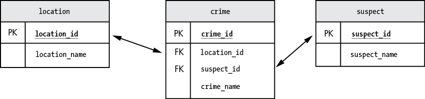
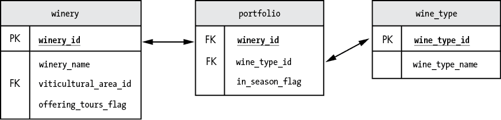

# 第六章：使用多个表进行复杂连接


在第五章中，你学会了如何连接两个表并将数据显示在一个结果集中。在这一章，你将学习如何进行多个表的复杂连接，了解关联表，了解如何合并或限制查询结果。然后，你将探索将查询结果临时保存为类似表格的格式的不同方法，包括临时表、派生表和公共表表达式（CTEs）。最后，你将学习如何使用子查询，子查询允许你在一个查询中嵌套另一个查询，以获得更精细的结果。

## 使用两种连接类型编写一个查询

连接三个或更多的表比连接两个表更加复杂，因为你可能在同一个查询中使用不同类型的连接（例如内连接和外连接）。例如，图 6-1 展示了`police`数据库中的三个表，包含关于犯罪的信息，包括嫌疑人和位置。



图 6-1：`police`数据库中的三个表

`location`表包含犯罪发生地点的信息：

```
location_id  location_name
-----------  -------------------------
    1        Corner of Main and Elm
    2        Family Donut Shop
    3        House of Vegan Restaurant
```

`crime`表包含犯罪描述信息：

```
crime_id  location_id  suspect_id  crime_name
--------  -----------  ----------  -------------------------------------
    1          1           1       Jaywalking
    2          2           2       Larceny: Donut
    3          3          null     Receiving Salad Under False Pretenses
```

`suspect`表包含关于嫌疑人的信息：

```
suspect_id  suspect_name
----------  ---------------
     1      Eileen Sideways
     2      Hugo Hefty
```

假设你想编写一个查询，将所有三个表连接起来，获取犯罪列表、犯罪发生地点以及嫌疑人姓名。`police`数据库的设计保证了`crime`表中的每个犯罪案件在`location`表中都有一个匹配的地点。然而，`suspect`表中可能没有匹配的嫌疑人，因为警方并未为每个案件确定嫌疑人。

你将对`crime`和`location`表进行内连接，因为你知道它们一定会匹配。但是由于并非每个犯罪案件都有嫌疑人，因此你将在`crime`表和`suspect`表之间进行外连接。你的查询可能是这样的：

```
select c.crime_name,
       l.location_name,
       s.suspect_name
from   crime c
❶ join   location l
  on   c.location_id = l.location_id
❷ left join suspect s
  on   c.suspect_id = s.suspect_id;
```

在这个示例中，你将`crime`表别名为`c`，`location`表别名为`l`，`suspect`表别名为`s`。你使用`join`语法进行`crime`和`location`表的内连接❶，使用`left join`语法进行`crime`和`suspect`表的外连接❷。

在这个上下文中使用左连接可能会引起一些困惑。当你在第五章中使用只有两个表的`left join`时，很容易理解哪个是左表，哪个是右表，因为只有两种可能性。但是现在你连接了三个表，应该怎么理解呢？

要理解多个表的连接，假设 MySQL 在执行查询时构建临时表。MySQL 首先连接前两个表`crime`和`location`，连接的结果成为左表。然后，MySQL 在`crime`/`location`合并表和`suspect`表之间执行`left join`。

你使用了*左*连接进行外连接，因为你希望所有的犯罪和地点都显示出来，无论右侧的`suspect`表中是否有匹配项。此查询的结果如下：

```
crime_name                             location_name           suspect_name
-------------------------------------  ----------------------  ---------------
Jaywalking                             Corner of Main and Elm  Eileen Sideways
Larceny: Donut                         Family Donut Shop       Hugo Hefty
Receiving Salad Under False Pretenses  Green Vegan Restaurant  null
```

最后一宗犯罪的嫌疑人成功逃脱，因此最后一行的`suspect_name`值为`null`。如果你使用了内连接，查询就不会返回最后一行，因为内连接只会返回有匹配的行。

你可以利用外连接返回的`null`值。假设你想编写一个查询，仅显示嫌疑人未知的犯罪。你可以在查询中指定仅显示`suspect_name`为`null`的行：

```
select c.crime_name,
       l.location_name,
       s.suspect_name
from   crime c
join   location l
  on   c.location_id = l.location_id
left join suspect s
  on   c.suspect_id = s.suspect_id
where  **s.suspect_name is null**;
```

此查询的结果为：

```
crime_name                             location_name           suspect_name
-------------------------------------  ----------------------  ---------------
Receiving Salad Under False Pretenses  Green Vegan Restaurant  null
```

在查询的最后一行添加`where`子句后，结果只显示了那些在`suspect`表中没有匹配行的记录，这将列表限制为嫌疑人未知的犯罪。

## 连接多个表

MySQL 允许在连接中使用最多 61 个表，尽管你很少需要编写包含这么多表的查询。如果你发现自己连接了超过 10 个表，这通常是数据库结构需要重设计的信号，以简化查询编写。

`wine`数据库有六个表，你可以用它们来帮助规划参观酒厂的行程。让我们逐一查看这六个表。

`country`表存储酒厂所在的国家：

```
country_id  country_name
----------  ------------
    1       France
    2       Spain
    3       USA
```

`region`表存储这些国家中酒厂所在的地区：

```
region_id  region_name         country_id
---------  -----------         ----------
    1      Napa Valley             3
    2      Walla Walla Valley      3
    3      Texas Hill              3
```

`viticultural_area`表存储酒厂所在的葡萄酒种植子区域：

```
viticultural_area_id  viticultural_area_name  region_id
--------------------  ----------------------  ---------
          1           Atlas Peak                  1
          2           Calistoga                   1
          3           Wild Horse Valley           1
```

`wine_type`表存储关于可用葡萄酒种类的信息：

```
wine_type_id  wine_type_name
------------  ------------------
       1      Chardonnay
       2      Cabernet Sauvignon
       3      Merlot
```

`winery`表存储关于酒厂的信息：

```
winery_id  winery_name            viticultural_area_id  offering_tours_flag
---------  ---------------------  --------------------  -------------------
    1      Silva Vineyards                   1                    0
    2      Chateau Traileur Parc             2                    1
    3      Winosaur Estate                   3                    1
```

`portfolio`表存储酒厂酒品组合的信息——也就是酒厂提供哪些酒：

```
winery_id  wine_type_id  in_season_flag
---------  ------------  --------------
    1            1             1
    1            2             1
    1            3             0
    2            1             1
    2            2             1
    2            3             1
    3            1             1
    3            2             1
    3            3             1
```

例如，`winery_id`为`1`（Silva Vineyards）的酒厂提供`wine_type_id`为`1`（Chardonnay）的酒，这款酒在季节中（其`in_season_flag`—一个布尔值—为`1`，表示是真的）。

列表 6-1 展示了一个查询，通过连接所有六个表，找出在美国有季节性梅洛酒并提供酒厂参观的酒厂。

```
select c.country_name,
       r.region_name,
       v.viticultural_area_name,
       w.winery_name
from   country c
join   region r
  on   c.country_id = r.country_id
 and   c.country_name = 'USA'
join   viticultural_area v
  on   r.region_id = v.region_id
join   winery w
  on   v.viticultural_area_id = w.viticultural_area_id
 and   w.offering_tours_flag is true
join   portfolio p
  on   w.winery_id = p.winery_id
 and   p.in_season_flag is true
join   wine_type t
  on   p.wine_type_id = t.wine_type_id
 and   t.wine_type_name = 'Merlot';
```

列表 6-1：查询列出季节性梅洛酒的美国酒厂

虽然这个查询比你平时用的要长，但你已经见过大部分的语法。在查询中，你为每个表名创建了表别名（`country`、`region`、`viticultural_area`、`winery`、`portfolio`和`wine_type`）。当在查询中引用列时，你会在列名之前加上表别名和一个点。例如，你会在`offering_tours_flag`列之前加上`w`，因为它在`winery`表中，所以结果是`w.offering_tours_flag`。（记住在第四章中提到的最佳实践，应该为包含布尔值（如`true`或`false`）的列添加`_flag`后缀，这就是`offering_tours`列的情况，因为酒庄要么提供游览，要么不提供。）最后，你使用`join`执行内连接，因为在连接这些表时应该有匹配的值。

与我们之前的查询不同，这个查询包含了表之间的连接，其中需要满足多个条件。例如，当你连接`country`和`region`表时，需要满足*两个*条件：

+   `country`表中的`country_id`列的值必须与`region`表中的`country_id`列的值匹配。

+   `country`表中的`country_name`列必须等于`USA`。

你使用`on`关键字处理了第一个条件：

```
from   country c
join   region r
  **on**   c.country_id = r.country_id
```

然后你使用了`and`关键字来指定第二个条件：

```
 **and**   c.country_name = 'USA'
```

你可以添加更多的`and`语句来指定你需要的多个连接条件。

查询结果如下所示：清单 6-1：

```
country_name   region_name     viticultural_area_name   winery_name
------------   -------------   ----------------------   ---------------------
    USA        Napa Valley     Calistoga                Chateau Traileur Parc
    USA        Napa Valley     Wild Horse Valley        Winosaur Estate
```

## 关联表

在清单 6-1 中，大部分表格都是直观的：`winery`表存储酒庄列表，`region`表存储地区列表，`country`表存储国家，`viticultural_area`表存储葡萄种植区（葡萄种植子区域）。

然而，`portfolio`表略有不同。记住，它存储的是关于哪些酒在每个酒庄的酒单中的信息。这里再次展示：

```
winery_id  wine_type_id  in_season_flag
---------  ------------  --------------
    1            1             1
    1            2             1
 1            3             0
    2            1             1
    2            2             1
    2            3             1
    3            1             1
    3            2             1
    3            3             1
```

它的`winery_id`列是`winery`表的主键，`wine_type_id`列是`wine_type`表的主键。这使得`portfolio`成为一个*关联表*，因为它通过引用主键，将存储在其他表中的行相互关联，如图 6-2 所示。



图 6-2：`portfolio`表是一个关联表。

`portfolio` 表表示 *多对多关系*，因为一个酒庄可以生产多种葡萄酒类型，而一种葡萄酒类型可以在多个酒庄生产。例如，酒庄 `1`（Silva Vineyards）提供多种葡萄酒类型：`1`（Chardonnay）、`2`（Cabernet Sauvignon）和 `3`（Merlot）。葡萄酒类型 `1`（Chardonnay）由多个酒庄提供：`1`（Silva Vineyards）、`2`（Chateau Traileur Parc）和 `3`（Winosaur Estate）。`portfolio` 表包含了每个 `winery_id` 和 `wine_type_id` 之间的关系，告诉我们哪些酒庄提供哪些葡萄酒类型。作为附加内容，它还包含了 `in_season_flag` 列，正如你所见，它跟踪该葡萄酒是否在该酒庄的当季生产。

接下来，我们将探讨不同的方式来处理查询返回的数据。我们将从一些简单的选项开始，管理结果集中的数据，然后在本章后半部分介绍一些更复杂的方法。

## 管理结果集中的数据

有时你需要控制查询返回的数据在结果集中如何显示。例如，你可能希望缩小结果范围或合并多个 `select` 语句的结果。SQL 提供了关键字来实现这些功能。

### `limit` 关键字

`limit` 关键字允许你限制结果集中显示的行数。例如，假设有一个名为 `best_wine_contest` 的表格，记录了一个葡萄酒品鉴比赛的结果，品鉴师为自己最喜欢的葡萄酒投票。如果你查询该表并使用 `order by` 对 `place` 列排序，你将看到排名最好的葡萄酒排在最前面：

```
select *
from   best_wine_contest
order by place;
```

结果是：

```
wine_name     place
------------  -----
Riesling        1
Pinot Grigio    2
Zinfandel       3
Malbec          4
Verdejo         5
```

如果你只想查看前 3 名的葡萄酒，可以使用 `limit 3`：

```
select *
from   best_wine_contest
order by place
limit 3;
```

现在结果是：

```
wine_name     place
------------  -----
Riesling        1
Pinot Grigio    2
Zinfandel       3
```

`limit` 关键字将结果限制为三行。若要查看仅获胜的葡萄酒，你可以使用 `limit 1`。

### `union` 关键字

`union` 关键字将多个 `select` 语句的结果合并成一个结果集。例如，以下查询从两个不同的表 `wine_type` 和 `best_wine_contest` 中选择所有葡萄酒类型，并将它们显示在一个列表中：

```
select wine_type_name from wine_type
union
select wine_name from best_wine_contest;
```

结果是：

```
wine_type_name
------------------
Chardonnay
Cabernet Sauvignon
Merlot
Riesling
Pinot Grigio
Zinfandel
Malbec
Verdejo
```

`wine_type` 表有一个名为 `wine_type_name` 的列，其中包括 Chardonnay、Cabernet Sauvignon 和 Merlot。`best_wine_contest` 表有一个名为 `wine_name` 的列，其中包括 Riesling、Pinot Grigio、Zinfandel、Malbec 和 Verdejo。使用 `union` 可以将所有葡萄酒一并显示在一个结果集中。

你只能在每个 `select` 语句具有相同列数时使用 `union`。在这个例子中，`union` 是可行的，因为你在每个 `select` 语句中都只指定了一个列。结果集中的列名通常来自第一个 `select` 语句。

`union` 关键字将从结果集中移除重复值。例如，如果 `wine_type` 和 `best_wine_contest` 表中都有 Merlot，使用 `union` 将只列出一次 Merlot 的独特酒种。如果你希望看到包含重复值的列表，可以使用 `union all`：

```
select wine_type_name from wine_type
union all
select wine_name from best_wine_contest;
```

结果如下：

```
wine_type_name
------------------
Chardonnay
Cabernet Sauvignon
Merlot
Riesling
Pinot Grigio
Zinfandel
Malbec
Verdejo
Merlot
```

现在你可以看到 Merlot 被列出了两次。

接下来，你将更深入地探讨如何通过创建类似表格格式的临时结果集来使查询更加高效。

## 临时表

MySQL 允许你创建临时表——即仅在当前会话中存在并在会话结束时自动删除的临时结果集。例如，你可以使用像 MySQL Workbench 这样的工具创建临时表，然后在该工具中查询该表。然而，如果你关闭并重新打开 MySQL Workbench，临时表将会消失。在一个会话中，你可以多次重用临时表。

你可以像创建常规表一样定义临时表，只是你使用 `create temporary table` 而不是 `create table` 语法：

```
create temporary table wp1
(
    winery_name            varchar(100),
    viticultural_area_id   int
)
```

`wp1` 临时表会根据你指定的列名和数据类型创建，但不会包含任何行。

要基于查询结果创建临时表，只需在查询前添加相同的 `create temporary table` 语法，如 Listing 6-2 所示，结果的临时表将包含从查询中选取的行数据。

```
 create temporary table winery_portfolio
 select w.winery_name,
        w.viticultural_area_id
 from   winery w
 join   portfolio p
❶  on   w.winery_id = p.winery_id
❷ and   w.offering_tours_flag is true
  and   p.in_season_flag is true
 join   wine_type t
❸  on   p.wine_type_id = t.wine_type_id
❹ and   t.wine_type_name = 'Merlot';
```

Listing 6-2：创建临时表

在这里，你创建了一个名为 `winery_portfolio` 的临时表，用来存储来自 Listing 6-1 和 Figure 6-2 的查询结果，该查询将 `winery`、`portfolio` 和 `wine_type` 表连接起来。`winery` 和 `portfolio` 表是基于两个条件连接的：

+   表中的 `winery_id` 列的值匹配 ❶。

+   酒庄提供参观服务。为此，你需要检查 `winery` 表中的 `offering_tours_flag` 是否设置为 `true` ❷。

这些结果根据两个条件与 `wine_type` 表连接：

+   表中的 `wine_type_id` 列的值匹配 ❸。

+   `wine_type` 表中的 `wine_type_name` 是 `Merlot` ❹。

一旦你创建了临时表，你可以像查询永久表一样查询其内容，通过从中选择数据：

```
select * from winery_portfolio;
```

结果如下：

```
winery_name            viticultural_area_id
---------------------  --------------------
Chateau Traileur Parc          2
Winosaur Estate                3
```

现在你可以写第二个查询，从 `winery_portfolio` 临时表中选择数据，并将其与来自 Listing 6-1 的其他三个表连接：

```
select c.country_name,
       r.region_name,
       v.viticultural_area_name,
 w.winery_name
from   country c
join   region r
  on   c.country_id = r.country_id
 and   c.country_name = 'USA'
join   viticultural_area v
  on   r.region_id = v.region_id
join   **winery_portfolio** w
  on   v.viticultural_area_id = w.viticultural_area_id;
```

在这里，你将 `winery_portfolio` 临时表与原始查询中其他三个表（来自 Listing 6-1）连接：`country`、`region` 和 `viticultural_area`。通过这种方式，你将一个大型的六表查询简化为将三个表的数据隔离到临时表中，然后再将该临时表与另外三个表连接。这条查询返回的结果与 Listing 6-1 相同。

## 公共表表达式

公共表表达式（CTE），是 MySQL 8.0 版本中引入的一项功能，它是一个临时结果集，你可以为其命名，并像查询表一样从中选择数据。CTE 只能在一个查询的生命周期内使用（与临时表不同，临时表可以在整个会话中使用）。清单 6-3 展示了如何使用 CTE 简化清单 6-1 中的查询：

```
❶ with winery_portfolio_cte as
(
    select w.winery_name,
           w.viticultural_area_id
    from   winery w
 join   portfolio p
      on   w.winery_id = p.winery_id
     and   w.offering_tours_flag is true
     and   p.in_season_flag is true
    join   wine_type t
      on   p.wine_type_id = t.wine_type_id
     and   t.wine_type_name = 'Merlot'
)
❷ select c.country_name,
       r.region_name,
       v.viticultural_area_name,
       wp.winery_name
from   country c
join   region r
  on   c.country_id = r.country_id
 and   c.country_name = 'USA'
join   viticultural_area v
  on   r.region_id = v.region_id
❸ join   winery_portfolio_cte wp
  on   v.viticultural_area_id = wp.viticultural_area_id;
```

清单 6-3：命名并查询一个 CTE

首先，你使用`with`关键字为 CTE 命名；在这里，你为查询结果定义了`winery_portfolio_cte`这个名称，查询结果位于括号之间 ❶。然后你添加另一个查询 ❷，该查询将`winery_portfolio_cte`作为表进行连接 ❸。结果与清单 6-1 中的查询相同。

CTE 和临时表都将查询的结果临时保存在类似表的格式中。然而，虽然临时表可以在一个会话中多次使用（即在多个查询中），但 CTE 只能在定义它的查询生命周期内使用。在运行清单 6-3 后，尝试运行另一个查询从`winery_portfolio_cte`中选择数据：

```
select * from winery_portfolio_cte;
```

你会遇到一个错误：

```
Error Code: 1146\. Table 'wine.winery_portfolio_cte' doesn't exist
```

MySQL 正在寻找一个名为`winery_portfolio_cte`的*表*，所以它无法找到你的 CTE 也就不足为奇了。此外，CTE 只在查询期间存在，因此它不再可用。

## 递归公共表表达式

递归是一种当对象引用自身时使用的技术。当我想到递归时，我会想到俄罗斯套娃。你打开最大的一个娃娃，发现里面有一个更小的娃娃；然后你打开那个娃娃，发现里面有一个更小的娃娃；依此类推，直到你找到最小的娃娃。换句话说，要查看所有的娃娃，你从最大的娃娃开始，然后依次打开每个更小的娃娃，直到找到一个不包含其他娃娃的娃娃。

递归在数据以层次结构或一系列值的形式组织时非常有用，在这种情况下，你需要知道前一个值才能得出当前值。

递归 CTE 引用自身。递归 CTE 包含两个`select`语句，二者之间用`union`语句连接。看看这个名为`borg_scale_cte`的递归 CTE，它包含了 6 到 20 之间的一系列数字：

```
❶ with recursive borg_scale_cte as
(
  ❷ select    6 as current_count
    union
  ❸ select    current_count + 1
    from      borg_scale_cte
  ❹ where     current_count < 20
)
select * from borg_scale_cte;
```

首先，你定义 CTE 为`recursive`并命名为`borg_scale_cte` ❶。然后，第一个`select`语句返回包含数字`6`的第一行 ❷。第二个`select`语句返回所有其他包含`7`到`20`之间的值的行。它不断地将`current_count`列的值加`1`，并选择得到的数字 ❸，只要`current_count`小于`20` ❹。

在最后一行，你使用通配符字符`*`来选择 CTE 中的所有值，返回的结果是：

```
current_count
-------------
      6
      7
      8
      9
     10
     11
     12
     13
     14
     15
     16
     17
     18
     19
     20
```

你还可以像使用表一样使用递归 CTE，并将其与其他表连接，例如。

## 派生表

派生表是创建仅供查询使用的结果表的替代方案。创建派生表的 SQL 放在括号内：

```
select   wot.winery_name,
         t.wine_type_name
from     portfolio p
join wine_type t
on       p.wine_type_id = t.wine_type_id
join (
     select *
     from   winery
     where  offering_tours_flag is true
     ) wot
On       p.winery_id = wot.winery_id;
```

括号中的查询生成一个别名为`wot`（即*提供旅游的酒厂*）的派生表。你可以像对待其他表一样将`wot`与`portfolio`和`wine_type`表连接，并从中选择列。与 CTE 类似，派生表仅在查询执行期间可用。

选择使用派生表而不是 CTE 通常是风格问题。一些开发者更喜欢使用 CTE，因为他们认为 CTE 更具可读性。然而，如果你需要使用递归，就必须使用 CTE。

## 子查询

子查询（或内查询）是嵌套在另一个查询中的查询。子查询用于返回主查询将要使用的数据。当查询中包含子查询时，MySQL 首先执行子查询，从数据库中选择结果值，然后将其返回给外部查询。例如，这条 SQL 语句使用子查询从`wine`数据库中返回美国所有葡萄酒种植区的列表：

```
❶ select region_name
from   region
where  country_id =
(
  ❷ select country_id
    from   country
    where  country_name = 'USA'
);
```

这个查询的结果如下：

```
region_name
------------------
Napa Valley
Walla Walla Valley
Texas Hill
```

这个查询有两个部分：外部查询❶和子查询❷。尝试单独运行子查询，而不带外部查询：

```
 select country_id
    from   country
    where  country_name = 'USA';
```

结果显示，返回的美国`country_id`是`3`：

```
country_id
----------
     3
```

在你的查询中，`3`从子查询传递到外部查询，这使得整个 SQL 语句的结果为：

```
select region_name
from   region
where  country_id = 3;
```

这会返回`country_id 3`（即美国）地区的列表：

```
region_name
------------------
Napa Valley
Walla Walla Valley
Texas Hill
```

### 返回多行的子查询

子查询可以返回多行数据。以下是与之前相同的查询，这次包含了所有国家，而不仅仅是美国：

```
select region_name
from   region
❶ where  country_id =
(
    select country_id
    from   country
❷ --  where  country_name = 'USA' -  line commented out
);
```

现在，注释掉了指定只获取美国地区的子查询行❷，因此所有国家的`country_id`都会被返回。当你运行这个查询时，MySQL 返回一个错误，而不是地区列表：

```
Error Code: 1242\. Subquery returns more than 1 row
```

问题在于外部查询期望只返回一行数据，因为你使用了`=`语法❶。然而，子查询返回了三行数据：美国的`country_id`为`3`，法国为`1`，西班牙为`2`。你应该只在子查询不可能返回多行数据时使用`=`。

这是一个常见的错误，你应该注意。有很多开发者写了一个查询，当他们测试时运行正常，但突然有一天它开始出现`子查询返回多于一行`的错误。查询本身没有变化（不像这个例子中，某行已被注释掉），但是数据库中的数据发生了变化。例如，可能往表中添加了新行，导致开发者的子查询现在返回多行，而以前返回的是一行。

如果你想编写一个可以从子查询返回多行的查询，可以使用`in`关键字替代`=`：

```
select region_name
from   region
where  country_id **in**
(
    select country_id
    from   country
--  where  country_name = 'USA' -  line commented out
);
```

现在你已将 `=` 替换为 `in`，外部查询可以接受子查询返回的多行结果，而不会出错，并且你将得到所有国家的地区列表。

### 关联子查询

在关联子查询中，子查询中的表列与外部查询中的表列进行连接。

让我们看看 `pay` 数据库中的两个表：`best_paid` 和 `employee`。`best_paid` 表显示，销售部门的最高薪资是 $200,000，制造部门的最高薪资是 $80,000：

```
department      salary
----------      ------
Sales           200000
Manufacturing    80000
```

`employee` 表存储了员工列表、他们的部门和薪资：

```
employee_name   department      salary
--------------  --------------  ------
Wanda Wealthy   Sales           200000
Paul Poor       Sales            12000
Mike Mediocre   Sales            70000
Betty Builder   Manufacturing    80000
Sean Soldering  Manufacturing    80000
Ann Assembly    Manufacturing    65000
```

你可以使用关联子查询来查找每个部门薪水最高的员工：

```
select employee_name,
       salary
from   employee e
where  salary =
       (
       select  b.salary
       from    best_paid b
       where   b.department = e.department
       );
```

在外部查询中，你从 `employee` 表中选择员工和薪资。在子查询中，你将外部查询的结果与 `best_paid` 表连接，以确定该员工是否在其部门中拥有最高薪资。

结果是：

```
employee_name   salary
--------------  ------
Wanda Wealthy   200000
Betty Builder    80000
Sean Soldering   80000
```

结果显示，Wanda 是销售部门薪水最高的员工，而 Betty 和 Sean 在制造部门并列最高薪资。

## 总结

在这一章中，你编写了使用多个表的复杂 SQL 语句。你了解了如何限制或合并结果行，并探索了多种方式来编写查询，将结果集当作表来使用。

在下一章中，你将比较查询中的值；例如，你将检查一个值是否大于另一个值，比较不同数据类型的值，并检查某个值是否匹配某个模式。
