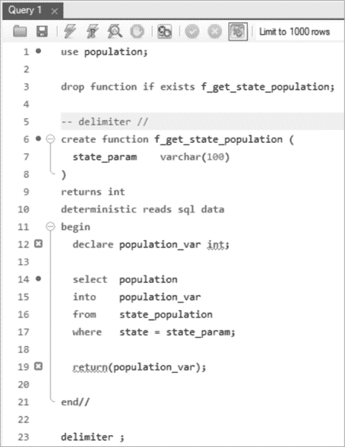
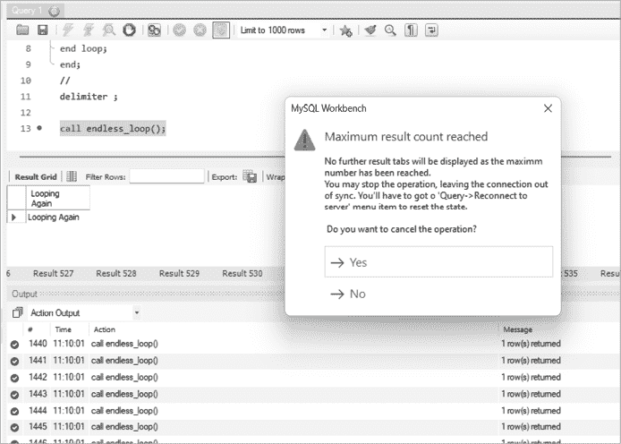

# 第十一章：创建函数和存储过程


在第八章，你学习了如何调用内置的 MySQL 函数；在这一章，你将编写自己的函数。你还将学习如何编写存储过程，并探索两者的主要区别。

你将通过`if`语句、循环、游标和`case`语句，向你的函数和存储过程添加逻辑，根据数据的值执行不同的任务。最后，你将练习在函数和存储过程中接收值并返回值。

## 函数与存储过程

函数和存储过程是可以通过名称调用的程序。由于它们保存在你的 MySQL 数据库中，因此有时也称为*存储*函数和存储过程。统称它们为*存储例程*或*存储程序*。当你编写一个复杂的 SQL 语句或包含多个步骤的语句时，你应该将其保存为一个函数或存储过程，以便以后可以方便地通过名称调用。

函数和存储过程的主要区别在于，函数可以从 SQL 语句中调用，并始终返回一个值。而存储过程则是通过显式的`call`语句调用的。存储过程与函数不同，它们返回值的方式也不同。（请注意，调用者可能是使用像 MySQL Workbench 这样的工具的人，或是用 Python、PHP 等编程语言编写的程序，或者是另一个 MySQL 存储过程。）存储过程可以不返回值、返回一个值或返回多个值，而函数接受参数，执行某些任务，并返回单个值。例如，你可以通过`select`语句调用`f_get_state_population()`函数，传入州名作为参数，从而得到纽约的州人口：

```
select f_get_state_population('New York');
```

你通过将参数放在括号中来向函数传递参数。如果要传递多个参数，用逗号分隔。函数接收参数，执行你在创建函数时定义的处理，然后返回一个值：

```
f_get_state_population('New York')
----------------------------------
              19299981
```

`f_get_state_population()`函数以文本`New York`作为参数，查询数据库找到人口信息，并返回`19299981`。

你还可以在 SQL 语句的`where`子句中调用函数，例如以下示例，返回每个`state_population`大于纽约州的人口：

```
select  *
from    state_population
where   population > f_get_state_population('New York');
```

在这里，你调用了`f_get_state_population()`函数，传入参数`New York`。该函数返回了值`19299981`，这使得你的查询结果评估为以下内容：

```
select  *
from    state_population
where   population > 19299981;
```

你的查询返回了来自`state`表的数据，数据包含人口超过 19,299,981 的州：

```
state       population
----------  ----------
California   39613493
Texas        29730311
Florida      21944577
```

存储过程与函数不同，它们不能从 SQL 查询中调用，而是通过`call`语句调用。你传入存储过程设计时需要的任何参数，存储过程执行你定义的任务，然后控制权返回给调用者。

例如，你调用一个名为`p_set_state_population()`的过程，并传入`New York`作为参数，如下所示：

```
call p_set_state_population('New York');
```

你将在 Listing 11-2 中看到如何创建`p_set_state_population()`过程并定义其任务。目前，你只需知道这是调用过程的语法。

过程通常用于通过更新、插入和删除表中的记录来执行业务逻辑，也可以用来显示数据库中的数据集。函数则用于执行较小的任务，比如从数据库获取一条数据或格式化一个值。有时，你可以用过程或函数来实现相同的功能。

像表和视图一样，函数和过程也保存在你创建它们的数据库中。你可以使用`use`命令来设置当前数据库；然后，当你定义过程或函数时，它将被创建在该数据库中。

现在你已经了解了如何调用函数和过程，让我们来看看如何创建它们。

## 创建函数

Listing 11-1 定义了`f_get_state_population()`函数，它接受一个州的名称并返回该州的人口。

```
❶ use population;

❷ drop function if exists f_get_state_population;

delimiter //

❸ create function f_get_state_population(
    state_param    varchar(100)
)
returns int
deterministic reads sql data
begin
    declare population_var int;

    select  population
    into    population_var
 from    state_population
    where   state = state_param;

    return(population_var);
❹ end//

delimiter ;
```

Listing 11-1: 创建`f_get_state_population()`函数

在第一行，你通过`use`命令 ❶ 设置当前数据库为`population`，这样你的函数就会创建在该数据库中。

在创建函数之前，你需要使用`drop function`语句，以防该函数已经存在。如果你尝试创建一个函数，而旧版本已存在，MySQL 会发送一个`function already exists`的错误，并且不会创建该函数。同样，如果你尝试删除一个不存在的函数，MySQL 也会发送错误。为了避免出现该错误，你可以在`drop function`后加上`if exists` ❷，这样如果函数已存在，它将被删除，但如果不存在，则不会发送错误。

函数本身在`create function` ❸ 和 `end` 语句 ❹ 之间定义。我们将在接下来的章节中详细讲解它的组成部分。

### 重新定义分隔符

函数定义还包括几行代码，用于重新定义然后重置分隔符。*分隔符*是一个或多个字符，用来分隔一个 SQL 语句和另一个 SQL 语句，并标记每个语句的结束。通常，你会使用分号作为分隔符。

在 Listing 11-1 中，你使用`delimiter //`语句暂时将 MySQL 的分隔符设置为`//`，因为你的函数由多个以分号结尾的 SQL 语句组成。例如，`f_get_state_population()`包含三个分号，分别位于`declare`语句、`select`语句和`return`语句之后。为了确保 MySQL 从`create function`语句开始，到`end`语句结束时正确创建你的函数，你需要告诉它不要将这两个语句之间的分号视为函数的结束。这就是你重新定义分隔符的原因。

让我们看看如果你不重新定义分隔符会发生什么。如果你删除或注释掉代码开头的`delimiter //`语句，并在 MySQL Workbench 中查看它，你会注意到第 12 行和第 19 行出现了红色 X 标记，表示错误（图 11-1）。



图 11-1：MySQL Workbench 显示第 12 行和第 19 行的错误

你通过在第 5 行的`delimiter`语句前添加两个短横线和空格（`--`）注释掉了该语句，这导致 MySQL Workbench 在第 12 行和第 19 行报告错误，因为分号已成为分隔符字符。因此，每当 MySQL 遇到分号时，它会认为这是 SQL 语句的结束。MySQL Workbench 试图通过显示带有红色 X 的错误标记来帮助你，让你知道以分号结尾的语句无效。

将分隔符重新定义为`//`（或其他不是`;`的字符）告诉 MySQL Workbench，在遇到第 21 行的`//`之前，创建函数的语句尚未结束。你可以通过取消注释第 5 行（移除行首的两个短横线和空格`--`），重新插入`delimiter //`命令，从而修复错误。

函数创建后，你将分隔符设置回第 23 行的分号。

尽管在这里重新定义分隔符为`//`是必要的，因为你的函数体包含了三个分号，但在其他情况下你不需要重新定义分隔符。例如，你可以简化以下函数：

```
delimiter //
create function f_get_world_population()
returns bigint
deterministic no sql
begin
    return(7978759141);
end//

delimiter ;
```

`begin`和`end`关键字将函数体内的语句分组。由于这个函数体只有一条 SQL 语句，即返回世界人口，你不需要在这里使用`begin`和`end`。而且，你也不需要重新定义分隔符，因为只有一个分号——位于`return`语句的末尾。你可以删除重新定义和重置分隔符的代码，并将函数简化为以下形式：

```
create function f_get_world_population()
returns bigint
deterministic no sql
return(7978759141);
```

虽然这种写法更简洁，但你可能希望保留`begin`和`end`语句并重新定义分隔符，因为这样未来添加第二条 SQL 语句会更容易。选择权在你。

### 添加参数并返回值

内建函数和自定义函数都可以接受参数。在清单 11-1 中，你创建了`f_get_state_population()`函数，接受一个名为`state_param`的参数，其数据类型为`varchar(100)`。你可以在第四章中定义带有数据类型的参数，包括`int`、`date`、`decimal`和`text`，用于定义表的列。

因为函数会将值返回给函数的调用者，所以在清单 11-1 中，你使用`returns`关键字告诉 MySQL 你的函数将返回的值的数据类型。在这种情况下，函数将返回一个整数，表示某个州的人口。

### 指定特性

在示例 11-1 中，一旦你确定函数返回一个整数，你就可以指定该函数的一些特性。*特性*是函数的一个属性或特性。在此示例中，你使用了`deterministic`和`reads sql data`特性：

```
deterministic reads sql data
```

你可以在一行中列出所有特性，也可以将每个特性列在单独的行上，如下所示：

```
deterministic
reads sql data
```

你需要从两个特性集选择：`deterministic`或`not deterministic`，以及`reads sql data`、`modifies sql data`、`contains sql`或`no sql`。你必须为所有函数指定至少一个特性：`deterministic`、`no sql`或`reads sql data`。如果你没有这样做，MySQL 会返回错误信息并且不会创建该函数。

#### 确定性或非确定性

选择`deterministic`意味着该函数在相同的参数和数据库状态下会返回相同的值。这通常是情况。`f_get_state_population()`函数是确定性的，因为，除非数据库中的数据发生变化，否则每次调用`f_get_state_population()`并传入`New York`作为参数时，函数都会返回值`19299981`。

`not deterministic`特性意味着该函数在相同的参数和数据库状态下可能不会返回相同的值。例如，对于一个返回当前日期的函数来说，今天调用它会得到与明天调用它不同的返回值。

如果将一个非确定性函数标记为`deterministic`，调用该函数时可能会得到错误结果。如果将一个确定性函数标记为`not deterministic`，则函数可能会比必要的运行得更慢。如果你没有将函数定义为`deterministic`或`not deterministic`，MySQL 默认将其视为`not deterministic`。

MySQL 使用`deterministic`或`not deterministic`有两个目的。首先，MySQL 有一个查询优化器，它确定执行查询的最快方式。指定`deterministic`或`not deterministic`有助于查询优化器做出更好的执行选择。

其次，MySQL 有一个二进制日志，它跟踪数据库中数据的变化。二进制日志用于执行*复制*，即将来自一个 MySQL 数据库服务器的数据复制到另一个服务器（称为*副本*）。指定`deterministic`或`not deterministic`有助于 MySQL 执行这个复制过程。

#### 读取 SQL 数据，修改 SQL 数据，包含 SQL，或无 SQL

`reads sql data` `data`特性意味着该函数通过`select`语句从数据库中读取数据，但不会更新、删除或插入任何数据；而`modifies sql data`则意味着该函数确实会更新、删除或插入数据。对于过程来说，这种情况更为常见，因为过程通常用于修改数据库中的数据，而函数则较少用于此。

`contains sql` 特性意味着该函数至少包含一个 SQL 语句，但不会从数据库读取或写入任何数据，而 `no sql` 则意味着该函数不包含任何 SQL 语句。`no sql` 的例子是一个返回硬编码数字的函数，在这种情况下它不会查询数据库。例如，你可以编写一个总是返回 `212` 的函数，这样你就不需要记住水的沸点温度。

如果你没有指定 `reads sql data`、`modifies sql data`、`contains sql` 或 `no sql`，MySQL 默认使用 `contains sql`。

### 定义函数体

列出特性之后，你需要定义函数体，这是在函数被调用时执行的代码块。你使用 `begin` 和 `end` 语句来标记函数体的开始和结束。

在 列表 11-1 中，你使用 `declare` 关键字声明了一个名为 `population_var` 的变量。变量是可以保存值的命名对象。你可以使用任何 MySQL 数据类型来声明它们；在这个例子中，你使用了 `int` 类型。你将在本章稍后的“定义本地变量和用户变量”一节中了解不同类型的变量。

然后，你添加一个 `select` 语句，它从数据库中选择人口数据并将其写入 `population_var` 变量中。这个 `select` 语句类似于你之前使用过的，只是这次你使用了 `into` 关键字，将从数据库中获取的值选择到一个变量中。

然后，你使用 `return` 语句将 `population_var` 的值返回给函数的调用者。由于函数总是返回一个值，因此你的函数中必须有一个 `return` 语句。返回值的数据类型必须与函数开始时的 `returns` 语句匹配。你使用 `returns` 来声明返回值的数据类型，而使用 `return` 来实际返回值。

你的 `end` 语句后面跟着 `//`，因为你之前将分隔符重新定义为 `//`。一旦到达 `end` 语句，函数体就完成了，因此你将分隔符重新定义回分号。

## 创建过程

与函数类似，过程接受参数，包含由 `begin` 和 `end` 包围的代码块，可以定义变量，并可以重新定义分隔符。

与函数不同，过程不使用 `returns` 或 `return` 关键字，因为过程不像函数那样返回一个值。此外，你可以使用 `select` 关键字在过程中显示值。另外，虽然 MySQL 在创建函数时要求指定像 `deterministic` 或 `reads sql data` 等特性，但这对于过程来说不是必须的。

清单 11-2 创建了一个名为 `p_set_state_population()` 的存储过程，该存储过程接受一个州名作为参数，从 `county_population` 表中获取该州各县的最新人口数据，求和并将总人口写入 `state_population` 表。

```
❶ use population;

❷ drop procedure if exists p_set_state_population;

❸ delimiter //

❹ create procedure p_set_state_population(
  ❺ in state_param varchar(100)
)
begin
  ❻ delete from state_population
    where state = state_param;

  ❼ insert into state_population
    (
           state,
           population
    )
    select state,
         ❽ sum(population)
    from   county_population
    where  state = state_param
    group by state;

❾ end//

delimiter ;
```

清单 11-2：创建 `p_set_state_population()` 存储过程

首先，你通过 `use` 将当前数据库设置为 `population`，这样存储过程将在 `population` 数据库中创建 ❶。在创建存储过程之前，你会检查该存储过程是否已经存在，如果存在，则使用 `drop` 命令删除旧版本 ❷。然后，像创建函数时一样，你将分隔符重新定义为 `//` ❸。

接下来，你创建存储过程并将其命名为 `p_set_state_population()` ❹。与函数相似，你将参数命名为 `state_param`，并赋予其 `varchar(100)` 数据类型，同时指定 `in` 以将 `state_param` 设置为输入参数 ❺。让我们更详细地看一下这一步。

与函数不同，存储过程可以接受参数值作为输入，并且还可以将值作为输出返回给调用者。存储过程还可以接受多个输入和输出参数。（你将在本章稍后深入探讨输出参数。）在编写存储过程时，你使用 `in` 关键字指定输入参数，`out` 关键字指定输出参数，或者使用 `inout` 关键字指定既是输入又是输出的参数。对于函数来说，这种指定是没有必要的，因为函数的参数默认总是作为输入。如果你没有为存储过程的参数指定 `in`、`out` 或 `inout`，MySQL 默认将其视为 `in`。

接下来，存储过程的主体位于 `begin` 和 `end` 语句之间。在该主体中，你删除 `state_population` 表中该州的现有行（如果存在） ❻，然后向 `state_population` 表中插入新的一行 ❼。如果你不先删除现有行，表中将为每次运行存储过程时都生成一行数据。你希望在写入当前信息到 `state_population` 表之前先清理干净。

你通过从 `county_population` 表中对该州所有县的人口进行求和，来获取该州的人口数据 ❽。

与函数创建时一样，当你完成存储过程的定义后，你会将分隔符重新定义为分号 ❾。

### 使用 `select` 显示值

当你创建存储过程和函数时，可以使用 `select...into` 语法将数据库中的值写入变量中。但与函数不同，存储过程还可以使用不带 `into` 关键字的 `select` 语句来显示值。

清单 11-3 创建了一个名为 `p_set_and_show_state_population()` 的存储过程，该存储过程将州的人口选择到一个变量中，并向存储过程的调用者显示一条消息。

```
use population;

drop procedure if exists p_set_and_show_state_population;

delimiter //

create procedure p_set_and_show_state_population(
    in state_param varchar(100)
)
begin
  ❶ declare population_var int;

    delete from state_population
    where state = state_param;

  ❷ select sum(population)
    into   population_var
    from   county_population
    where  state = state_param;

  ❸ insert into state_population
    (
           state,
           population
    )
    values
    (
           state_param,
           population_var
    );

  ❹ select concat(
               'Setting the population for ',
               state_param,
 ' to ',
               population_var
            );
end//

delimiter ;
```

清单 11-3：创建 `p_set_and_show_state_population()` 存储过程

在这个存储过程中，你声明了一个名为`population_var`的整数变量 ❶，并使用`select...into`语句 ❷ 将县人口的总和插入其中。然后，你将`state_param`参数值和`population_var`变量值插入到`state_population`表中 ❸。

当你调用存储过程时，它不仅会在`state_population`表中设置正确的纽约人口，还会显示一条信息性消息：

```
call p_set_and_show_state_population('New York');
```

显示的消息是：

```
Setting the population for New York to 20201249
```

你使用了`select`来显示消息，通过连接（使用`concat()`函数）文本`Setting the population for`、`state_param`值、单词`to`和`population_var`值 ❹。

### 定义局部变量和用户变量

`population_var`变量是一个局部变量。*局部变量*是你在存储过程和函数中使用`declare`命令和数据类型定义的变量：

```
declare population_var int;
```

局部变量只在包含它们的存储过程或函数执行期间有效或*在作用范围内*。由于你将`population_var`定义为`int`，它只接受整数值。

你还可以使用*用户变量*，它以 at 符号（`@`）开头，并且可以在整个会话期间使用。只要你连接到 MySQL 服务器，用户变量就会在作用范围内。例如，如果你从 MySQL Workbench 创建用户变量，它将一直有效，直到你关闭工具。

创建局部变量时，必须指定其数据类型；而创建用户变量时则不需要。

你可能会在函数或存储过程中看到同时使用局部变量和用户变量的代码：

```
declare local_var int;
set local_var = 2;
set @user_var = local_var + 3;
```

你从未为`@user_var`变量声明过数据类型，如`int`、`char`或`bool`，但因为它被设置为一个整数值（`local_var`值加上 3），MySQL 自动将其设置为`int`。

### 在存储过程中的逻辑使用

在存储过程中，你可以使用类似于 Python、Java 或 PHP 等编程语言中的编程逻辑。例如，你可以使用`if`和`case`等条件语句控制执行流，以便在特定条件下执行代码的某些部分。你还可以使用循环反复执行代码的某些部分。

#### if 语句

`if`语句是一个决策语句，当条件为真时执行特定的代码行。列表 11-4 创建了一个名为`p_compare_population()`的存储过程，用于比较`state_population`表中的人口与`county_population`表中的人口。如果人口值匹配，它返回一条消息。如果不匹配，它返回另一条消息。

```
use population;

drop procedure if exists p_compare_population;

delimiter //

create procedure p_compare_population(
    in state_param varchar(100)
)
begin
    declare state_population_var int;
    declare county_population_var int;

    select  population
  ❶ into    state_population_var
    from    state_population
    where   state = state_param;

 select sum(population)
  ❷ into   county_population_var
    from   county_population
    where  state = state_param;

  ❸ if (state_population_var = county_population_var) then
       select 'The population values match';
  ❹ else
       select 'The population values are different';
    end if;

end//

delimiter ;
```

列表 11-4：`p_compare_population()`存储过程

在第一个`select`语句中，你从`state_population`表中选择州的人口，并将其写入`state_population_var`变量❶。然后，在第二个`select`语句中，你从`county_population`表中选择该州每个县的人口总和，并将其写入`county_population_var`变量❷。你使用`if...then`语法比较这两个变量。你在说，`if`值匹配❸，`then`执行显示消息`The population values match`的行；`else`（否则）❹，执行下一行，显示消息`The population values are different`。然后你使用`end if`标记`if`语句的结束。

你可以使用以下`call`语句调用该过程：

```
call p_compare_population('New York');
```

结果是：

```
The population values are different
```

该过程显示两个表中的值不匹配。可能是县级人口表包含了更新的数据，但`state_population`表还没有更新。

MySQL 提供了`elseif`关键字来检查更多的条件。你可以扩展你的`if`语句，显示三个消息中的一个：

```
if (state_population_var = county_population_var) then
    select 'The population values match';
**elseif (state_population_var > county_population_var) then**
 **select 'State population is more than the sum of county population';**
else
    select 'The sum of county population is more than the state population';
end if;
```

第一个条件检查`state_population_var`值是否等于`county_population_var`值。如果该条件为真，代码将显示文本`The population values match`，然后控制流将进入`end if`语句。

如果第一个条件不满足，代码将检查`elseif`条件，查看`state_population_var`是否大于`county_population_var`。如果该条件为真，代码显示文本`State population is more than the sum of county population`，然后控制流进入`end if`语句。

如果两个条件都不满足，控制流将进入`else`语句，代码显示`The sum of county population is more than the state population`，然后控制流下降到`end if`语句。

#### `case`语句

`case`语句是一种编写复杂条件语句的方式。例如，Listing 11-5 定义了一个使用`case`语句的过程，用于判断一个州的人口是超过 3000 万、在 1000 万到 3000 万之间，还是低于 1000 万。

```
use population;

drop procedure if exists p_population_group;

delimiter //

create procedure p_population_group(
    in state_param varchar(100)
)
begin
    declare state_population_var int;

    select population
    into   state_population_var
    from   state_population
    where  state = state_param;

    case
    ❶ when state_population_var > 30000000 then select 'Over 30 Million';
    ❷ when state_population_var > 10000000 then select 'Between 10M and 30M';
    ❸ else select 'Under 10 Million';
    end case;

end//

delimiter ;
```

Listing 11-5：`p_population_group()`过程

你的`case`语句以`case`开头，以`end case`结尾。它有两个`when`条件——类似于`if`语句——和一个`else`语句。

当条件`state_population_var > 30000000`为真时，过程将显示`Over 30 Million`❶，控制流将进入`end case`语句。

当条件`state_population_var > 10000000`为真时，过程将显示`Between 10M and 30M`❷，控制流将进入`end case`语句。

如果没有满足任何`when`条件，`else`语句将被执行，过程显示`Under 10 Million`❸，控制流下降到`end case`语句。

你可以调用你的过程来查看一个州属于哪个人口组：

```
call p_population_group('California');
Over 30 Million

call p_population_group('New York');
Between 10M and 30M

call p_population_group('Rhode Island');
Under 10 Million
```

根据从数据库中检索到的该州人口，`case`语句会显示该州的正确人口分组。

#### 循环

你可以在过程里创建*循环*，以反复执行代码的一部分。MySQL 允许你创建简单循环、`repeat`循环和`while`循环。这个过程使用了一个简单循环，不断显示`Looping Again`：

```
drop procedure if exists p_endless_loop;

delimiter //
create procedure p_endless_loop()
begin
**loop**
 **select 'Looping Again';**
**end loop;**
end;
//
delimiter ;
```

现在调用这个过程：

```
call p_endless_loop();
```

你通过`loop`和`end loop`命令标记你的循环的开始和结束。它们之间的命令将被反复执行。

这个过程会不断显示文本`Looping Again`，理论上会一直持续下去。这就是所谓的*无限循环*，应该避免。你创建了循环，但没有提供停止的方式。哎呀！

如果你在 SQL Workbench 中运行这个过程，它会打开一个不同的结果标签，每次经过循环时都会显示`Looping Again`文本。幸运的是，MySQL 最终会检测到已经打开了太多结果标签，并会给你停止运行过程的选项（图 11-2）。



图 11-2：在 MySQL Workbench 中运行无限循环

为了避免创建无限循环，你必须设计循环在满足某个条件时结束。这个过程使用了一个更合理的简单循环，它循环 10 次后停止：

```
drop procedure if exists p_more_sensible_loop;

delimiter //
create procedure p_more_sensible_loop()
begin
❶ set @cnt = 0;
❷ msl: loop
  select 'Looping Again';
❸ set @cnt = @cnt + 1;
❹ if @cnt = 10 then
  ❺ leave msl;
  end if;
end loop msl;
end;
//
delimiter ;
```

在这个过程里，你定义了一个用户变量`@cnt`（简写为*counter*）并将其设置为`0` ❶。你通过在`loop`语句前加上`msl:`来标记循环为`msl`（*更合理的循环*）❷。每次循环时，你将`@cnt`加 1 ❸。为了使循环结束，`@cnt`的值必须达到`10` ❹。一旦达到，你通过`leave`命令退出循环，并指定要退出的循环名`msl` ❺。

当你调用这个过程时，它会执行`loop`和`end loop`语句之间的代码 10 次，每次显示`Looping Again`。在代码执行 10 次后，循环停止，控制权会转到`end loop`语句之后的行，然后过程将控制权返回给调用者。

你还可以使用`repeat...until`语法编写一个`repeat`循环，如下所示：

```
drop procedure if exists p_repeat_until_loop;

delimiter //
create procedure p_repeat_until_loop()
begin
set @cnt = 0;
**repeat**
 **select 'Looping Again';**
 **set @cnt = @cnt + 1;**
**until @cnt = 10**
**end repeat;**
end;
//
delimiter ;
```

`repeat`和`end repeat`之间的代码是你循环的主体。它们之间的命令会被反复执行，直到`@cnt`等于`10`，然后控制权会跳转到`end`语句。`until`语句在循环的末尾，因此你的循环中的命令至少会执行一次，因为在第一次通过循环时，条件`until @cnt = 10`并没有被检查。

你还可以使用`while`和`end while`语句编写一个`while`循环：

```
drop procedure if exists p_while_loop;

delimiter //
create procedure p_while_loop()
begin
set @cnt = 0;
**while @cnt < 10 do**
 **select 'Looping Again';**
 **set @cnt = @cnt + 1;**
**end while;**
end;
//
delimiter ;
```

你的`while`命令指定了必须满足的条件，才能执行循环中的命令。如果条件`@cnt < 10`满足，程序将`do`循环中的命令。当达到`end while`语句时，控制流回到`while`命令，并再次检查`@cnt`是否仍小于`10`。一旦计数器不再小于 10，控制流将转到`end`命令，循环结束。

循环是一个方便的方式，当你需要一遍又一遍地执行相似任务时，可以使用它。别忘了给你的循环设置退出条件，这样你就能避免写出无休止的循环，如果你需要循环至少执行一次，可以使用`repeat...until`语法。

### 使用`select`显示过程结果

由于你可以在过程里使用`select`语句，你可以编写查询数据库并显示结果的过程。当你编写一个需要再次运行的查询时，可以将其保存为过程，并在需要时调用该过程。

比如你写了一个查询，选择所有县的总人口，并用逗号格式化它们，同时按人口从大到小排序。你可能想把这个工作保存为一个过程，并命名为`p_get_county_population()`，如下所示：

```
use population;

drop procedure if exists p_get_county_population;

delimiter //

create procedure p_get_county_population(
    in state_param varchar(100)
)
begin
    select county,
           format(population, 0)
    from   county_population
    where  state = state_param
    order by population desc;
end//

delimiter ;
```

有了这个过程，你可以在每次需要该信息时调用它：

```
call p_get_county_population('New York');
```

结果显示了纽约州的所有 62 个县，并适当地格式化了它们的人口：

```
Kings          2,736,074
Queens         2,405,464
New York       1,694,251
Suffolk        1,525,920
Bronx          1,472,654
Nassau         1,395,774
Westchester    1,004,457
Erie             954,236
`--snip--`
```

下次你想查看该数据的最新版本时，只需再次调用这个过程。

在你的过程里使用`select`来显示结果。你还可以通过`output`参数将值传回过程的调用者。

### 使用游标

虽然 SQL 非常擅长快速更新或删除表中的多行数据，但有时你需要循环遍历数据集并一次处理一行。你可以通过游标来实现这一点。

*游标*是一个数据库对象，它从数据库中选择行，将它们保存在内存中，并允许你一次处理一行。要使用游标，首先声明游标，然后打开它，从中获取每一行，最后关闭它。这些步骤如图 11-3 所示。


图 11-3：使用游标的步骤

创建一个名为`p_split_big_ny_counties()`的过程，它使用游标。该过程将使用`county_population`表，其中包含每个州的各个县的人口。纽约州有 62 个县，最大的一些县如下所示：

```
county       population
-----------  ----------
Kings         2,736,074
Queens        2,405,464
New York      1,694,251
Suffolk       1,525,920
Bronx         1,472,654
Nassau        1,395,774
Westchester   1,004,457
```

假设你是一个为纽约州工作的数据库开发者。你被要求将人口超过 200 万的县划分为两个更小的县，每个县的人口是原县的一半。

例如，Kings 县的人口为 2,736,074 人。你被要求创建一个名为`Kings-1`的县，人口为 1,368,037 人，另一个名为`Kings-2`的县，人口也是 1,368,037 人。然后，你需要删除原来的`Kings`行，原始人口为 2,736,074 人。你可以编写列表 11-6 中所示的过程来完成这个任务。

```
drop procedure if exists p_split_big_ny_counties;

delimiter //

create procedure p_split_big_ny_counties()
begin
❶ declare  v_state       varchar(100);
  declare  v_county      varchar(100);
  declare  v_population  int;

❷ declare done bool default false;

❸ declare county_cursor cursor for
    select  state,
            county,
            population
    from    county_population
    where   state = 'New York'
    and     population > 2000000;

❹ declare continue handler for not found set done = true;

❺ open county_cursor;

❻ fetch_loop: loop
    fetch county_cursor into v_state, v_county, v_population;

  ❼ if done then
      leave fetch_loop;
    end if;

  ❽ set @cnt = 1;

  ❾ split_loop: loop

      insert into county_population
      (
        state,
        county,
        population
      )
 values
      (
        v_state,
        concat(v_county, '-', @cnt),
        round(v_population/2)
      );

      set @cnt = @cnt + 1;

      if @cnt > 2 then
        leave split_loop;
      end if;

    end loop split_loop;

    -- delete the original county
  ❿ delete from county_population where county = v_county;

  end loop fetch_loop;

  close county_cursor;
end;
//

delimiter ;
```

列表 11-6：创建`p_split_big_ny_counties()`过程

这个过程使用游标从`county_population`表中选择原始的州、县和人口值。你每次从游标中获取一行，并循环执行`fetch_loop`，直到所有行都处理完毕。让我们逐步讲解。

首先，你声明`v_state`、`v_county`和`v_population`变量，用来存储每个超过 200 万人的县的`state`、`county`和`population`值 ❶。你还声明了一个名为`done`的变量，用来判断游标是否还有更多行可获取。你将`done`变量定义为布尔型，并将其默认值设置为`false` ❷。

然后你声明一个名为`county_cursor`的游标，它的`select`语句从`county_population`表中获取所有人口超过 200 万的县：以此示例中的 Kings 和 Queens 县为例 ❸。

接下来，你声明一个条件处理程序，当游标没有更多行可读取时，它会自动将`done`变量设置为`true` ❹。*条件处理程序*定义了 MySQL 在过程运行中遇到各种情况时的响应。你的条件处理程序处理`not found`条件；如果`fetch`语句找不到更多行，过程将执行`set done = true`语句，这将把`done`变量的值从`false`改为`true`，告诉你没有更多行可获取。

当你声明一个条件处理程序时，你可以选择让它`continue`—继续执行过程，或者在处理完条件后`exit`。你在列表 11-6 中选择了`continue`。

接下来，你`open`之前声明的`county_cursor`，准备开始使用 ❺。你创建一个`fetch_loop`循环，每次从`county_cursor`中获取一行并进行迭代 ❻。之后，你将游标中的一行的州、县和人口值获取到`v_state`、`v_county`和`v_population`变量中。

你检查`done`变量 ❼。如果所有行都已从游标中获取，你将退出`fetch_loop`，控制流转到`end loop`语句之后的行。然后，你关闭游标并退出过程。

如果你还没有完成从游标中获取所有行，设置一个用户变量`@cnt`为`1` ❽。然后，你进入一个名为`split_loop`的循环，负责将县分割成两个部分 ❾。

在`split_loop`中，你向`county_population`表插入了一行数据，其中县名加上了`-1`或`-2`后缀，`population`值是原县人口的一半。`-1`或`-2`后缀由你的`@cnt`用户变量控制。你将`@cnt`初始化为`1`，每次循环通过`split_loop`时，你会将它加 1。然后，你将原县名与一个短横线和`@cnt`变量拼接。通过将原人口（保存在`v_population`变量中）除以 2，你就得到了新的县的半人口。

你可以从过程调用函数；例如，你可以使用`concat()`将后缀添加到县名，使用`round()`确保新的`population`值没有小数部分。如果原县的人口是一个奇数，你不希望新县的人口是像 1368036.5 这样的小数。

当`@cnt`变量大于 2 时，你的分割县工作的任务完成，此时你`离开`了`split_loop`，控制流跳转到`end loop split_loop`语句之后的那一行。然后，你从数据库中删除原县的记录❿。

你到达了`fetch_loop`的结束，这也标志着你完成了这个县的工作。控制流返回到`fetch_loop`的开头，开始获取并处理下一个县的数据。

现在你可以调用你的过程了

```
call p_split_big_ny_counties();
```

然后像这样查看数据库中纽约州最大的人口县：

```
select *
from   county_population
order by population desc;
```

结果是：

```
state     county       population
--------  -----------  ----------
New York  New York       1694251
New York  Suffolk        1525920
New York  Bronx          1472654
New York  Nassau         1395774
New York  Kings-1        1368037
New York  Kings-2        1368037
New York  Queens-1       1202732
New York  Queens-2       1202732
New York  Westchester    1004457
`--snip--`
```

你的过程成功了！你现在拥有`Kings-1`、`Kings-2`、`Queens-1`和`Queens-2`这几个县，它们的规模是原始`Kings`和`Queens`县的一半。没有县的人口超过 200 万，原始的`Kings`和`Queens`记录已从表中删除。

### 声明输出参数

到目前为止，你在过程里使用的所有参数都是输入参数，但过程也允许你使用输出参数，将值传回给过程调用者。如前所述，调用者可以是使用像 MySQL Workbench 这样的工具的人员，或是用其他编程语言如 Python 或 PHP 编写的程序，或者是另一个 MySQL 过程。

如果过程的调用者是一个仅需查看某些值但不需要进一步处理这些值的最终用户，你可以使用`select`语句来显示这些值。但如果调用者需要使用这些值，你可以通过输出参数将它们从过程传递回来。

这个过程，叫做`p_return_state_population()`，通过输出参数将一个州的人口返回给过程调用者：

```
use population;

drop procedure if exists p_return_state_population;

delimiter //

create procedure p_return_state_population(
  ❶ in  state_param         varchar(100),
  ❷ out current_pop_param   int
)
begin
  ❸ select population
    into   current_pop_param
    from   state_population
    where  state = state_param;
end//

delimiter ;
```

在过程内，你声明了一个名为`state_param`的`in`（输入）参数，其类型为`varchar(100)`，即一个最多包含 100 个字符的字符串❶。然后，你定义了一个名为`current_pop_param`的`out`（输出）参数，其类型为`int`❷。你将州的人口选入输出参数`current_pop_param`，因为你将其声明为`out`参数，所以它会自动返回给调用者❸。

现在，使用`call`语句调用过程并传递`New York`作为输入参数。声明你希望将过程的输出参数作为一个新的用户变量`@pop_ny`返回：

```
call p_return_state_population('New York', @pop_ny);
```

你传递给过程的参数顺序与创建过程时定义的参数顺序匹配。该过程被定义为接受两个参数：`state_param`和`current_pop_param`。当你调用该过程时，你为`state_param`输入参数提供`New York`的值。然后，你提供`@pop_ny`，这是将接受过程的`current_pop_param`输出参数值的变量名称。

你可以通过编写`select`语句来查看过程的结果，该语句显示`@pop_ny`变量的值：

```
select @pop_ny;
```

结果是：

```
20201249
```

纽约的人口已保存至`@pop_ny`用户变量中。

### 编写调用其他过程的过程

过程可以调用其他过程。例如，这里你创建了一个名为`p_population_caller()`的过程，它调用`p_return_state_population()`，获取`@pop_ny`变量的值，并对其进行一些额外处理：

```
use population;

drop procedure if exists p_population_caller;

delimiter //

create procedure p_population_caller()
begin
  call p_return_state_population('New York', @pop_ny);
  call p_return_state_population('New Jersey', @pop_nj);

  set @pop_ny_and_nj = @pop_ny + @pop_nj;

  select concat(
     'The population of the NY and NJ area is ',
     @pop_ny_and_nj);

end//

delimiter ;
```

`p_population_caller()`过程调用了`p_return_state_population()`过程两次：一次使用`New York`作为输入参数，返回值给`@pop_ny`变量，另一次使用`New Jersey`作为输入参数，返回值给`@pop_nj`变量。

然后，你创建了一个新的用户变量`@pop_ny_and_nj`，并用它保存纽约和新泽西的合并人口，将`@pop_ny`和`@pop_nj`相加。接着，你显示`@pop_ny_and_nj`变量的值。

使用`call`语句运行你的调用过程：

```
call p_population_caller();
```

结果是：

```
The population of the NY and NJ area is 29468379
```

从调用过程显示的总人口为 29,468,379 人，这是 20,201,249 名纽约人和 9,267,130 名新泽西人之和。

## 列出数据库中的存储过程

要获取存储在数据库中的函数和过程列表，可以查询`information_schema`数据库中的`routines`表：

```
select routine_type,
       routine_name
from   information_schema.routines
where  routine_schema = 'population';
```

结果是：

```
routine_type  routine_name
------------  -------------------------------
FUNCTION      f_get_state_population
PROCEDURE     p_compare_population
PROCEDURE     p_endless_loop
PROCEDURE     p_get_county_population
PROCEDURE     p_more_sensible_loop
PROCEDURE     p_population_caller
PROCEDURE     p_repeat_until_loop
PROCEDURE     p_return_state_population
PROCEDURE     p_set_and_show_state_population
PROCEDURE     p_set_state_population
PROCEDURE     p_split_big_ny_counties
PROCEDURE     p_while_loop
```

如你所见，此查询返回了`population`数据库中的函数和过程列表。

## 总结

在本章中，你学会了创建和调用过程及函数。你使用了`if`语句、`case`语句，并通过循环反复执行功能。你还看到了使用游标逐行处理数据的好处。

在下一章中，您将创建触发器，以便根据诸如行插入或删除等事件自动触发并执行处理。
