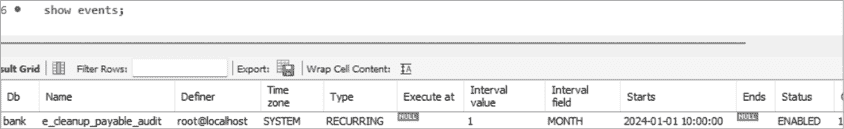
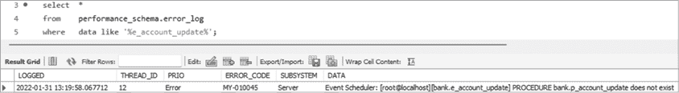

# 第十三章：创建事件


在本章中，你将创建*事件*。这些事件也称为调度事件，是根据设置的时间表触发的数据库对象，执行你在创建事件时定义的功能。

事件可以安排为一次性触发或按某个间隔触发，如每天、每周或每年；例如，你可能会创建一个事件来执行每周的工资处理。你可以使用事件安排在非高峰时间进行长时间运行的处理，比如基于当天订单更新账单表。有时你会安排在非高峰时间执行事件，因为你的功能需要在特定时间发生，比如在夏令时开始的凌晨 2 点对数据库进行更改。

## 事件调度器

MySQL 有一个*事件调度器*，用于管理事件的调度和执行。事件调度器可以启用或禁用，但默认情况下应启用。要确认调度器是否启用，可以运行以下命令：

```
show variables like 'event_scheduler';
```

如果你的调度器已启用，结果应如下所示：

```
Variable_name    Value
---------------  -----
event_scheduler    ON
```

如果显示的`Value`是`OFF`，你（或数据库管理员）需要使用以下命令启用调度器：

```
set global event_scheduler = on;
```

如果返回的`Value`是`DISABLED`，说明你的 MySQL 服务器在启动时禁用了事件调度器。有时这样做是为了临时停止调度器。你仍然可以调度事件，但在调度器重新启用之前，事件不会被触发。如果事件调度器被禁用，必须通过数据库管理员管理的配置文件来进行更改。

## 创建没有结束日期的事件

在清单 13-1 中，你创建了一个事件，该事件会从`payable_audit`表中移除旧行，`payable_audit`表位于`bank`数据库中。

```
use bank;

drop event if exists e_cleanup_payable_audit;

delimiter //

❶ create event e_cleanup_payable_audit
❷ on schedule every 1 month
❸ starts '2024-01-01 10:00'
❹ do
begin
❺ delete from payable_audit
  where audit_datetime < date_sub(now(), interval 1 year);
end //

delimiter ;
```

清单 13-1：创建一个每月事件

要在`bank`数据库中创建事件，首先使用`use`命令将当前数据库设置为`bank`。然后，删除该事件的旧版本（如果存在），以便创建新的事件。接下来，你创建事件`e_cleanup_payable_audit` ❶，并设置一个每月运行一次的调度。

每个事件都以`on schedule`开始；对于一次性事件，后面跟上`at`关键字和事件触发的时间戳（日期和时间）。对于定期事件，`on schedule`后面应该跟上`every`一词以及触发的间隔。例如，`every 1 hour`、`every 2 week`或`every 3 year`。（间隔以单数形式表示，如`3 year`，而不是`3 years`。）在这种情况下，你指定`every 1 month` ❷。你还将定义定期事件的`start`和`end`时间。

对于你的事件，你将`start`定义为`2024-01-01 10:00` ❸，这意味着事件将在 2024 年 1 月 1 日上午 10 点开始触发，并将在每月的这个时间触发。你没有使用`ends`关键字，因此该事件将每月触发——理论上是永久的——直到使用`drop event`命令删除该事件。

然后，使用 `do` 命令 ❹ 定义事件的操作，并在事件体内添加执行功能的 SQL 语句。事件体以 `begin` 开始，以 `end` 结束。在这里，你删除 `payable_audit` 表中超过一年的行 ❺。虽然这里只使用了一个语句，但也可以在事件体中放置多个 SQL 语句。

`show events` 命令显示当前数据库中计划的事件列表，如图 13-1 所示。



图 13-1：MySQL Workbench 中显示的 `show events` 命令

定义事件的用户账户被列为定义者。这为你提供了审计跟踪，告诉你是谁安排了哪些事件。

要仅显示特定数据库的事件（即使你当前不在该数据库中），可以使用 `show events in` `database` 命令。例如，在本例中，命令将是 `show events in bank`。

要获取所有数据库中的所有事件列表，可以使用以下查询：

```
select * from information_schema.events;
```

MySQL 提供了 `information_schema` 数据库中的 `events` 表，你可以查询该表来实现此目的。

## 创建具有结束日期的事件

对于需要在有限时间内运行的事件，可以使用 `ends` 关键字。例如，你可能想要创建一个事件，每年 1 月 1 日从上午 9 点到下午 5 点，每小时运行一次：

```
on schedule every 1 hour
starts '2024-01-01 9:00'
ends '2024-01-01 17:00'
```

要安排一个在接下来的 1 小时内每 5 分钟运行一次的事件，你可以输入以下内容：

```
on schedule every 5 minute
starts current_timestamp
ends current_timestamp + interval 1 hour
```

你立即启动了事件。它将每 5 分钟触发一次，并将在 1 小时后停止触发。

有时候你需要一个事件在特定的日期和时间只触发一次。例如，你可能需要等到午夜过后，再进行一次性的账户更新，更新你的 `bank` 数据库，以便其他进程先计算利率。你可以这样定义一个事件：

```
use bank;

drop event if exists e_account_update;

delimiter //

create event e_account_update
on schedule at '2024-03-10 00:01'
do
begin
  call p_account_update();
end //

delimiter ;
```

你的 `e_account_update` 事件计划在 2024 年 3 月 10 日午夜过后 1 分钟执行。

当时钟切换到夏令时时，安排一次性事件可能会很有用。例如，在 2024 年 3 月 10 日，时钟将提前一小时。而在 2024 年 11 月 6 日，夏令时结束，时钟将回拨一小时。在许多数据库中，数据可能需要进行相应的更改。

安排一个一次性事件，在 2024 年 3 月 10 日，数据库在夏令时开始时进行更改。在当天 2 点，系统时钟将变为 3 点。将事件安排在时钟变化前 1 分钟：

```
use bank;

drop event if exists e_change_to_dst;

delimiter //

create event e_change_to_dst
on schedule
at '2024-03-10 1:59'
do
begin
  -- Make any changes to your application needed for DST
  update current_time_zone
  set    time_zone = 'EDT';
end //

delimiter ;
```

你不必熬夜到凌晨 1:59 才能更改时钟，你可以安排一个事件来为你执行这项操作。

## 检查错误

在事件运行后检查错误，可以查询 `performance_schema` 数据库中的一个名为 `error_log` 的表。

`performance_schema` 数据库用于监控 MySQL 的性能。`error_log` 表存储诊断信息，如错误、警告和 MySQL 服务器启动或停止的通知。

例如，你可以通过查找`data`列包含`Event Scheduler`文本的行来检查所有事件错误：

```
select *
from   performance_schema.error_log
where  data like '%Event Scheduler%';
```

此查询查找表中所有`data`列包含`Event Scheduler`文本的行。回顾第七章，`like`操作符可以检查字符串是否匹配某个模式。在这里，你使用`%`通配符来检查`data`列的值是否以任意字符开头，包含`Event Scheduler`文本，然后以任意字符结尾。

要查找特定事件的错误，可以搜索事件名称。假设`e_account_update`事件调用了名为`p_account_update()`的过程，但该过程并不存在。你可以像这样找到`e_account_update`事件的错误：

```
select  *
from    performance_schema.error_log
where   data like '%e_account_update%';
```

该查询返回一行，显示`logged`列，记录事件触发时的日期和时间，`data`列显示错误信息（图 13-2）。



图 13-2：在 MySQL Workbench 中显示事件错误

该消息告诉你，`bank`数据库中的`e_account_update`事件失败，因为`p_account_update`不存在。

你可以使用`alter`命令禁用事件：

```
alter event e_cleanup_payable_audit disable;
```

该事件不会再次触发，直到你重新启用它，如下所示：

```
alter event e_cleanup_payable_audit enable;
```

当事件不再需要时，你可以使用`drop event`命令将其从数据库中删除。

## 总结

在本章中，你安排了事件在一次性和定期的基础上触发。你学习了如何检查事件调度器中的错误，禁用并删除事件。下一章将重点介绍一些技巧和窍门，帮助提升 MySQL 的生产力和使用体验。
