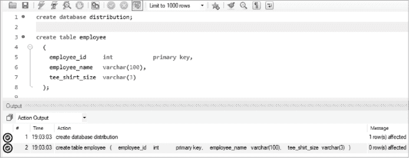
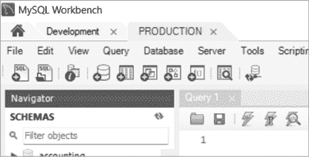
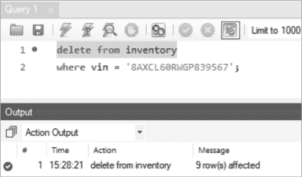
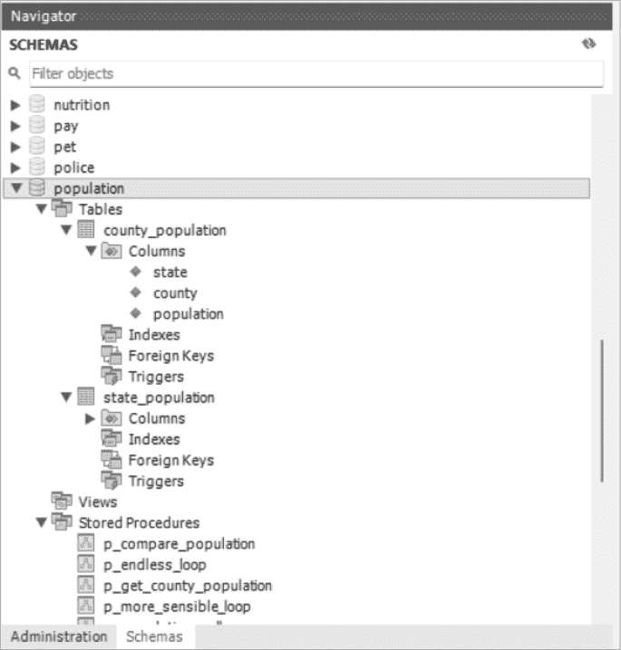

# 第十四章：提示与技巧


在本章中，你将通过回顾常见的陷阱及其避免方法，增强你对 MySQL 技能的信心。然后，你将学习事务和 MySQL 命令行客户端。你还将学习如何从文件中加载数据或将数据加载到文件中。

## 常见错误

MySQL 可以非常快速地处理大量信息。你可以在眨眼之间更新成千上万行。虽然这给你带来了很大的能力，但也意味着更容易出现错误，比如在错误的数据库或服务器上运行 SQL，或运行部分 SQL 语句。

### 在错误的数据库中工作

在使用像 MySQL 这样的关系型数据库时，你需要时刻注意自己在使用哪个数据库。将 SQL 语句运行在错误的数据库中是一个相当常见的错误。让我们来看看一些可以避免它的方法。

假设你被要求创建一个名为`distribution`的新数据库，并创建一个名为`employee`的表。

你可能会使用以下 SQL 命令：

```
create database distribution;

create table employee
  (
    employee_id     int            primary key,
    employee_name   varchar(100),
    tee_shirt_size  varchar(3)
  );
```

如果你使用 MySQL Workbench 来运行这些命令，你会看到下方面板中有两个绿色勾号，告诉你数据库和表已经成功创建（图 14-1）。



图 14-1：你使用 MySQL Workbench 在`distribution`数据库中创建了一个`employee`表……对吧？

一切看起来都很顺利，因此你宣布任务完成并开始下一个任务。然后你开始接到电话，说表格没有创建。到底哪里出了问题？

尽管你创建了`distribution`数据库，但在创建表之前没有将当前数据库设置为`distribution`。你的新`employee`表实际上是在你当时所在的任何当前数据库中创建的。你应该在创建表之前使用`use`命令，像这样：

```
create database distribution;

**use distribution;**

create table employee
 (
    employee_id     int            primary key,
    employee_name   varchar(100),
    tee_shirt_size  varchar(3)
  );
```

避免在错误数据库中创建表的一种方法是*完全限定*表名。你可以指定创建表所在的数据库名称，即使你当前不在那个数据库中，表也会在那里创建。在此，你指定要在`distribution`数据库中创建`employee`表：

```
create table distribution.employee
```

你可以通过在创建表之前检查当前数据库来避免将表创建在错误的数据库中，方法如下：

```
select database();
```

如果你的结果不是`distribution`，这将提醒你忘记使用`use`命令正确设置当前数据库。

你可以通过查明`employee`表创建在哪个数据库中，删除该表，并在`distribution`数据库中重新创建`employee`表来修复这个错误。

要确定哪个数据库或数据库中有`employee`表，请运行以下查询：

```
select table_schema,
       create_time
from   information_schema.tables
where  table_name = 'employee';
```

你查询了`information_schema`数据库中的`tables`表，并选择了`create_time`列来查看该表是否是最近创建的。输出如下：

```
TABLE_SCHEMA  CREATE_TIME
------------  -------------------
     bank     2024-02-05 14:35:00
```

可能在多个数据库中都有名为`employee`的表。如果是这种情况，你的查询将返回多行。但在这个例子中，唯一有`employee`表的数据库是`bank`，所以表被错误地创建在这里。

作为额外的检查，查看`employee`表中有多少行：

```
use bank;

select count(*) from employee;

count(*)
--------
    0
```

这个表中没有任何行，这对于一个错误创建的表来说是可以预期的。你已经确认`bank`数据库中的`employee`表是你错误创建在错误位置的那个表，现在你可以运行这些命令来纠正你的错误：

```
use bank;

-- Remove the employee table mistakenly created in the bank database
drop table employee;

use distribution;

-- Create the employee table in the bank database
create table employee
  (
    employee_id     int            primary key,
    employee_name   varchar(100),
    tee_shirt_size  varchar(3)
  );
```

你在`bank`数据库中的`employee`表已经被删除，而在`distribution`数据库中创建了一个`employee`表。

你本可以使用`alter table`命令将表从一个数据库移动到另一个数据库，像这样：

```
alter table bank.employee rename distribution.employee;
```

最好是删除并重新创建表，而不是修改表，特别是如果表中有触发器或外键关联，可能仍然指向错误的数据库。

### 使用错误的服务器

有时，SQL 语句可能会在错误的 MySQL 服务器上执行。公司通常会为生产和开发设置不同的服务器。*生产*环境是最终用户访问的实时环境，因此你需要小心其数据。*开发*环境是开发者测试新代码的地方。由于该环境中的数据只有开发者可见，因此你应该始终在这里测试 SQL 语句，然后再发布到生产环境。

开发者有两个窗口同时打开的情况并不罕见：一个连接到生产服务器，另一个连接到开发服务器。如果不小心，你可能会在错误的窗口中进行更改。

如果你使用的是像 MySQL Workbench 这样的工具，建议将连接命名为*生产*和*开发*，这样它的标签可以清晰地标明哪个环境是哪个（见图 14-2）。



图 14-2：命名 MySQL Workbench 标签为开发和生产

要在 MySQL Workbench 中命名连接，请进入**数据库**▶**管理连接**。在打开的设置新连接窗口中，输入一个连接名称，如 Development 或 Production，以指定环境。

其他工具也有类似的方式来标记生产和开发环境。有些允许你更改背景色，因此你可以考虑将生产环境的背景色设置为红色，提醒自己在该环境下要小心。

### 离开不完整的 `where` 子句

当你插入、更新或删除表中的数据时，确保你的`where`子句完整至关重要。如果不完整，你可能会更改到不希望更改的行。

假设你经营一家二手车经销商，并且你将库存中的车辆存储在`inventory`表中。查看表中的内容：

```
select * from inventory;
```

结果是：

```
vin                mfg         model     color
----------         ----------  --------  ------
1ADCQ67RFGG234561  Ford        Mustang   red
2XBCE65WFGJ338565  Toyota      RAV4      orange
3WBXT62EFGS439561  Volkswagen  Golf      black
4XBCX68RFWE532566  Ford        Focus     green
5AXDY62EFWH639564  Ford        Explorer  yellow
6DBCZ69UFGQ731562  Ford        Escort    white
7XBCX21RFWE532571  Ford        Focus     black
8AXCL60RWGP839567  Toyota      Prius     gray
9XBCX11RFWE532523  Ford        Focus     red
```

看着场地上的一辆福特福克斯，你注意到它被列为绿色，但它的颜色实际上更接近蓝色。你决定在数据库中更新它的颜色（清单 14-1）。

```
update inventory
set    color = 'blue'
where  mfg = 'Ford'
and    model = 'Focus';
```

清单 14-1：`update`语句中`where`子句缺少条件

当你运行`update`语句时，你惊讶地看到 MySQL 返回了`3 row(s) affected`的消息。你原本只打算更新一行，但似乎有三行被更改了。

你运行查询以查看发生了什么：

```
select *
from   inventory
where  mfg = 'Ford'
and    model = 'Focus';
```

结果是：

```
4XBCX68RFWE532566  Ford  Focus  blue
7XBCX21RFWE532571  Ford  Focus  blue
9XBCX11RFWE532523  Ford  Focus  blue
```

因为`update`语句中的`where`子句缺少条件，你错误地将表中所有福特福克斯的颜色更新为`blue`。

你在清单 14-1 中的`update`语句应该是：

```
update inventory
set    color = 'blue'
where  mfg = 'Ford'
and    model = 'Focus'
**and    color = 'green';**
```

最后一行在清单 14-1 中缺失。添加这个条件后，`update`语句只会将*绿色*福特福克斯更新为蓝色。因为你场地上只有一辆绿色福特福克斯，所以只会更新正确的车辆。

更高效的更新方式是使用`where`子句中的 VIN（车辆识别号码）：

```
update inventory
set    color = 'blue'
**where  vin = '4XBCX68RFWE532566';**
```

由于每辆车都有独特的 VIN，采用这种方法，你可以确保`update`语句只会更新一辆车。

这两个`update`语句都提供了足够的条件来识别你想要更改的那一行，因此你只会更新该行。

在插入、更新或删除行之前，你可以执行一个简单的完整性检查，即使用相同的`where`子句从表中`select`。例如，如果你计划运行清单 14-1 中的`update`语句，你应该首先运行这个`select`语句：

```
select *
from   inventory
where  mfg = 'Ford'
and    model = 'Focus';
```

结果应该是：

```
vin                mfg         model     color
----------         ----------  --------  ------
4XBCX68RFWE532566  Ford        Focus     green
7XBCX21RFWE532571  Ford        Focus     black
9XBCX11RFWE532523  Ford        Focus     red
```

查询会生成你即将更新的行列表。如果你确实想更新所有三行，那么你可以运行使用相同`where`子句的`update`语句。在这种情况下，你会发现`select`语句中的`where`子句匹配了太多行，能够避免更新超过你预期的单行。

### 运行部分 SQL 语句

MySQL Workbench 有三个闪电图标，可以用于以不同方式执行 SQL 语句。每个图标的操作列在表 14-1 中。

表 14-1：MySQL Workbench 中的闪电图标

| 简单闪电图标  | 执行选定的语句，或者如果没有选定语句，则执行所有语句 |
| --- | --- |
| 光标闪电图标  | 执行键盘光标下的语句 |
| 放大镜闪电图标  | 执行光标下语句的 EXPLAIN 计划 |

大多数 MySQL Workbench 用户会使用简单和光标闪电图标来进行日常工作。放大镜闪电图标使用得较少，因为它是一个优化工具，用于解释 MySQL 执行查询时将采取的步骤。

如果你使用简单的闪电图标而没有注意到 SQL 语句的部分被高亮显示，你会无意中执行被高亮的部分。例如，假设你想从`inventory`表中删除一辆丰田普锐斯。你写了以下`delete`语句来删除具有普锐斯 VIN 的那辆车：

```
delete from inventory
where vin = '8AXCL60RWGP839567';
```

现在，你将使用 MySQL Workbench 来执行你的`delete`语句（图 14-3）。



图 14-3：使用 MySQL Workbench 错误地删除表中的所有行

当你点击简单的闪电图标时，MySQL 告诉你表中的所有行都已被删除。发生了什么？

在执行`delete`语句之前，你错误地高亮了 SQL 命令的第一行。这导致 MySQL 删除了表中的所有行，而不是你原本想要删除的那一行。

## 事务

通过将语句作为事务的一部分执行，你可以减少错误的发生概率。一个*事务*是一组可以被*提交*（使永久）或*回滚*（取消）的一个或多个 SQL 语句。例如，在更新`inventory`表之前，你可以使用`start transaction`命令开始一个事务，稍后可以提交或回滚该事务：

```
start transaction;

update inventory
set    color = 'blue'
where  mfg = 'Ford'
and    model = 'Focus';
```

`begin`命令是`start transaction`的别名，你可以使用任意一个。

如果你运行`update`语句时，MySQL 返回`3 row(s) affected`的消息，但你本来预期只有一行被修改，你可以回滚事务：

```
rollback;
```

你的`update`语句被回滚，所有更改都被取消，表中的行保持不变。要使更改生效，请提交事务：

```
commit;
```

在使用数据操作语言（DML）语句，如`insert`、`update`或`delete`时，事务是很有帮助的。数据定义语言（DDL）语句，如`create function`、`drop procedure`或`alter table`，不应在事务中执行。这些语句无法回滚，执行时会自动提交事务。

在你提交或回滚`update`语句之前，MySQL 会保持表的锁定。例如，如果你运行以下命令：

```
start transaction;

update inventory
set    color = 'blue'
where  mfg = 'Ford'
and    model = 'Focus';
```

`inventory`表将保持锁定，直到你提交或回滚更改，其他用户无法修改表中的数据。如果你开始事务后去吃午餐，却没有提交或回滚，可能会回来面对一些愤怒的数据库用户。

## 支持现有系统

你可能会遇到需要支持一个已经开发好的 MySQL 系统。理解现有系统的一个好方法是通过 MySQL Workbench 浏览其数据库对象（图 14-4）。

你可以通过使用 MySQL 的导航面板，了解现有系统的许多信息。数据库里是有许多包含少量表的数据库，还是有一个或两个包含大量表的数据库？你应该遵循什么命名规范？是否有许多存储过程，还是大部分业务逻辑是通过像 PHP 或 Python 这样的编程语言在 MySQL 外部处理的？大部分表是否已经设置了主键和外键？是否使用了很多触发器？查看存储过程、函数和触发器时，使用了什么分隔符？检查现有数据库对象，并在你为系统添加任何新代码时遵循它们的命名规范。



图 14-4：探索现有的 MySQL 数据库

有时，支持现有系统最困难的部分是理解应用程序的问题集和术语。你可以提出的第一个好问题是：“最重要的表是什么？”首先将注意力集中在了解这些表上。你可以从表中选择，并理解这些主键值如何唯一地标识表中的行。检查这些表上的触发器，查看触发器代码，了解当表中的数据发生更改时会自动执行哪些操作。

MySQL Workbench 还以图形化的方式展示了 MySQL 对象之间的关系。例如，你可以在图 14-4 中看到，数据库包含表、存储过程和函数。表包含列、索引、外键和触发器。

## 使用 MySQL 命令行客户端

MySQL 命令行客户端`mysql`允许你从计算机的命令行界面（通常叫做*控制台*、*命令提示符*或*终端*）运行 SQL 命令。这在你希望对 MySQL 数据库执行 SQL 语句，但又不需要像 MySQL Workbench 这样的图形用户界面时非常有用。

在你计算机的命令行界面输入`mysql`来启动 MySQL 命令行客户端工具，并提供更多信息，例如：

```
mysql --host `localhost` --database `investment` --user `rick` --password=`icu2`
```

你也可以使用单个字母选项并且只加一个短横线——例如，使用`-h`代替`--host`；`-D`代替`--database`；`-u`和`-p`分别代替`--user`和`--password=`。

你可以通过`--host`指定 MySQL 服务器所在的主机。在这个例子中，MySQL 服务器安装在我的计算机上，所以我提供了`localhost`作为值。如果你要连接的是安装在另一台计算机上的服务器，可以指定该主机，例如`--host www.nostarch.com`，或者提供一个 IP 地址。

然后，在`--database`后输入你想要连接的数据库名称，在`--user`后输入你的 MySQL 用户 ID，在`--password=`后输入你的 MySQL 密码。

你应该看到以下警告：

```
[Warning] Using a password on the command line interface can be insecure.
```

这是因为你以明文形式提供了数据库密码。这样做并不好，因为任何在你肩膀后面的人都能看到你的密码。更安全的做法是让 `mysql` 提示你输入密码。如果你在命令行中使用 `-p` 而不指定密码，工具会提示你输入密码。当你输入密码时，星号将显示出来：

```
mysql -h localhost -D investment -u rick -p
Enter password: ********
```

另一种方法是使用 MySQL 配置工具来安全地存储你的凭证：

```
> mysql_config_editor set --host=localhost --user=investment --password
Enter password: ****
```

你可以通过 `--host` 和 `--user` 选项来指定主机和用户。`--password` 选项允许你输入密码。

一旦你保存了凭证，你可以使用 `print --all` 选项来显示它们：

```
mysql_config_editor print --all
```

密码会以星号的形式显示：

```
[client]
user = "investment"
password = ****
host = "localhost"
```

现在，你可以在命令行中输入 `mysql` 进入 MySQL 命令行客户端，而不需要输入用户名、密码或主机：

```
**mysql -D investment**
```

换句话说，你只需提供数据库的名称即可登录到 MySQL。

你可能会想，既然有更复杂的图形工具如 MySQL Workbench，为什么还要使用像 `mysql` 这样的基于文本的工具。`mysql` 工具特别有用当你想要运行保存在脚本文件中的 SQL 语句时。*脚本文件* 是一组 SQL 命令，保存在你计算机上的文件中。例如，你可以创建一个名为 *max_and_min_indexes.sql* 的文件，文件中包含以下 SQL 语句，用来获取市场指数中最小和最大的值：

```
use investment;

select *
from   market_index
where  market_value =
(
  select  min(market_value)
  from    market_index
);

select *
from   market_index
where  market_value =
(
  select  max(market_value)
  from    market_index
);
```

然后，你可以使用 `mysql` 从命令行运行 SQL 脚本：

```
mysql –h localhost -D investment -u rick -picu2 < min_and_max.sql > min_and_max.txt
```

你使用 `<` 让 `mysql` 从 *min_and_max.sql* 脚本中获取输入，使用 `>` 让它将输出写入 *min_and_max.txt* 文件。如果你提供密码，这里是 `icu2`，不要在 `-p` 后加空格。奇怪的是，`-picu2` 可用，但 `-p icu2` 不行。

执行命令后，输出文件 *min_and_max.txt* 应该如下所示：

```
market_index    market_value
S&P             500 4351.77
market_index                    market_value
Dow Jones Industrial Average    34150.66
```

`mysql` 工具在文件的列之间插入一个制表符。

## 从文件加载数据

通常情况下，你会以文件的形式获取数据，例如接受来自其他组织的数据流。`load data` 命令从文件中读取数据并将其写入表中。

为了测试从文件加载数据到表中，我在我的计算机上创建了一个数据文件，名为 *market_indexes.txt*，存放在 *C:\Users\rick\market\* 目录中。文件内容如下：

```
Dow Jones Industrial Average   34150.66
Nasdaq                         13552.93
S&P 500                         4351.77
```

文件包含了三个金融市场指数的名称和当前值。它是 *制表符分隔* 的，这意味着文件中的字段由制表符分隔。

在 MySQL 中，将文件加载到表中，如下所示：

```
use investment;

load data local
infile 'C:/Users/rick/market/market_indexes.txt'
into table market_index;
```

你使用 `load data` 命令并指定 `local`，这会告诉 MySQL 在你的本地计算机上查找数据文件，而不是在安装了 MySQL 的服务器上。默认情况下，`load data` 会加载以制表符分隔的文件。

在 `infile` 关键字之后，你提供要加载的输入文件名。在这个例子中，你使用的是 Windows 计算机上的文件路径。为了指定 Windows 上文件所在的目录，使用正斜杠，因为反斜杠会导致错误。在 Mac 或 Linux 环境中加载文件时，照常使用正斜杠。

看一下加载到表中的数据：

```
select * from market_index;
```

结果是：

```
market_index                  market_value
----------------------------  ------------
Dow Jones Industrial Average     34150.66
Nasdaq                           13552.93
S&P 500                           4351.77
```

文件中有两个字段，表中有两列，所以左边的字段加载到表的第一列，右边的字段加载到表的第二列。

另一种常见的数据文件格式是*逗号分隔值（CSV）*文件。你可以加载一个名为*market_indexes.csv*的数据文件，内容如下：

```
Dow Jones Industrial Average, 34150.66
Nasdaq, 13552.93
S&P 500, 4351.77
```

要加载这个文件，添加语法 `fields terminated by ","` 来声明该文件中的分隔符为逗号。MySQL 使用数据文件中的逗号来标识字段的开始和结束。

```
load data local
infile 'C:/Users/rick/market/market_indexes.csv'
into table market_index
**fields terminated by ",";**
```

偶尔，你需要加载一个包含标题行的数据文件，如下所示：

```
Financial Index, Current Value
Dow Jones Industrial Average, 34150.66
Nasdaq, 13552.93
S&P 500, 4351.77
```

你可以通过使用 `ignore` 关键字让 `load data` 跳过标题行：

```
load data local
infile 'C:/Users/rick/market/market_indexes.csv'
into table market_index
fields terminated by ","
**ignore 1 lines;**
```

数据文件中有一行标题，所以你使用 `ignore 1 lines` 语法来防止第一行加载到表中。三行数据被加载，但数据文件中的 `Financial Index` 和 `Current Value` 标题被忽略。

## 加载数据到文件

你可以通过发送数据文件将数据提供给其他部门或组织。将数据库中的数据写入文件的一种方式是使用 `select...into outfile` 语法。你可以运行查询并将结果保存到文件中，而不是显示在屏幕上。

你可以指定希望使用的分隔符来格式化输出。创建一个 CSV 文件，包含 `market_index` 表中的值，如下所示：

```
select * from market_index
into outfile 'C:/ProgramData/MySQL/MySQL Server 8.0/Uploads/market_index.csv'
fields terminated by ',' optionally enclosed by '"';
```

你从 `market_index` 表中选择所有值，并将它们写入主机计算机上的*market_index.csv*文件，该文件位于 *C:/ProgramData/MySQL/MySQL Server 8.0/Uploads* 目录中。

你通过使用语法 `fields terminated by ','`，在输出文件中使用逗号作为分隔符。

`optionally enclosed by` `'"'` 这一行告诉 MySQL 将所有具有 `string` 数据类型的列字段用引号括起来。

你的*market_index.csv*文件是这样创建的：

```
"Dow Jones Industrial Average",34150.66
"Nasdaq",13552.93
"S&P 500",4351.77
```

`select...into outfile` 语法只能在 MySQL 运行的服务器上创建文件，不能在你的本地计算机上创建文件。

## MySQL Shell

虽然 MySQL 命令行客户端（`mysql`）是一种经过验证的、已经使用了数十年的 SQL 命令执行方式，但 MySQL Shell（`mysqlsh`）是一个较新的 MySQL 命令行客户端工具，可以运行 SQL、Python 或 JavaScript 命令。

你之前看到的，使用 `mysql` 语法运行名为*min_and_max.sql*的脚本是：

```
mysql –h localhost -D investment -u rick -picu2 < min_and_max.sql > min_and_max.txt
```

如果你愿意，可以使用 MySQL Shell 通过以下命令运行相同的脚本：

```
mysqlsh --sql –h localhost -D investment -u rick -picu2 < min_and_max.sql > min_and_max.txt
```

语法类似，唯一的区别是你调用的是`mysqlsh`而不是`mysql`。此外，由于`mysqlsh`可以在 SQL、Python 或 JavaScript 模式下运行，你需要指定`--sql`来运行 SQL 模式。（默认模式是 JavaScript。）

MySQL Shell 自带一个名为*parallel table import*（`import-table`）的实用工具，可以比`load data`更快地将大数据文件加载到表中。

```
mysqlsh ❶ --mysql -h localhost -u rick -picu2 ❷ -- util import-table c:\Users
\rick\market_indexes.txt --schema=investment --table=market_index
```

当你使用`import-table`工具时，需要用`--mysql`语法❶来调用`mysqlsh`，以使用经典的 MySQL 协议连接进行客户端和 MySQL 服务器之间的通信。

要运行并行表导入工具，请使用`-- util`语法，然后提供你想要使用的工具名称——在这种情况下是`import-table`❷。你需要提供要加载的文件名称，*c:\Users\rick\market_indexes.txt*，以及数据库`investment`和你想要将数据加载到的表`market_index`。

使用`mysql`还是`mysqlsh`由你自己决定。随着`mysqlsh`的逐渐成熟，更多的开发者将转向使用它，而不再使用`mysql`。如果你有一个数据量大且运行缓慢的任务，使用`mysqlsh`的并行表导入工具会比使用`load data`快得多。

你可以在[`dev.mysql.com/doc/mysql-shell/8.0/en/`](https://dev.mysql.com/doc/mysql-shell/8.0/en/)了解更多关于 MySQL Shell 的信息。

## 概述

在本章中，你学习了一些技巧和窍门，包括如何避免常见错误、使用事务、支持现有系统以及如何从文件中加载数据。

在下一章中，你将学习如何从 PHP、Python 和 Java 等编程语言调用 MySQL。
