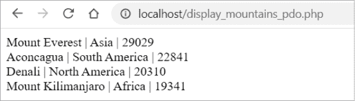
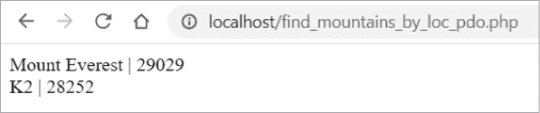
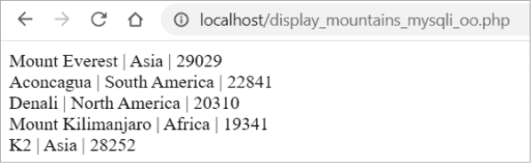
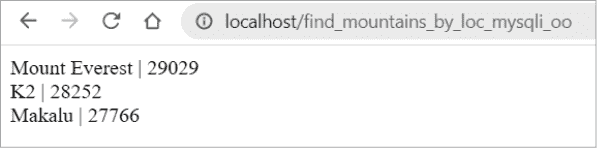
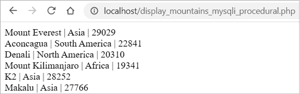
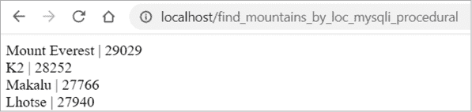

# 第十五章：从编程语言调用 MySQL


在本章中，你将编写使用 MySQL 的计算机程序，重点介绍三种开源编程语言：PHP、Python 和 Java。你将在每种语言中编写程序，进行从表格中选择数据、向表格插入行以及调用存储过程等操作。

无论使用哪种编程语言，调用 MySQL 的基本步骤都是相同的。首先，你需要使用 MySQL 数据库凭证建立与 MySQL 数据库的连接，其中包括 MySQL 服务器的主机名、数据库、用户 ID 和密码。然后，你使用该连接执行 SQL 语句，操作数据库。

你在程序中嵌入 SQL 语句，当程序运行时，SQL 会执行并与数据库交互。如果你需要向 SQL 语句传递参数值，可以使用 *预处理语句*，这是一种可重用的 SQL 语句，使用占位符暂时表示参数。然后，你将参数值绑定到预处理语句，用实际值替换占位符。

如果你需要从数据库中检索数据，你会遍历结果并执行某些操作，例如显示结果。当操作完成后，你需要关闭与 MySQL 的连接。

让我们看一些使用 PHP、Python 和 Java 的示例。

## PHP

PHP（PHP：超文本预处理器的递归缩写）是一种开源编程语言，主要用于 Web 开发。数百万个网站是用 PHP 构建的。

PHP 通常与 MySQL 一起使用。两者都属于 *LAMP 堆栈*，这是一种流行的软件开发架构，包括 Linux、Apache、MySQL 和 PHP。（*P* 也可以指 Python 编程语言，较少情况下指 Perl。）许多网站使用 Linux 作为操作系统；Apache 作为接收请求并返回响应的 Web 服务器；MySQL 作为关系型数据库管理系统；PHP 作为编程语言。

要在 PHP 中使用 MySQL，你需要一个 PHP *扩展*，该扩展使你能够在 PHP 程序中使用核心语言中未包含的功能。由于并非所有 PHP 应用程序都需要访问 MySQL，因此该功能作为扩展提供，你可以加载它。有两种扩展选择：*PHP 数据对象（PDO）* 和 *MySQLi*。你可以在 *php.ini* 配置文件中列出你想加载的扩展，如下所示：

```
extension=pdo_mysql
extension=mysqli
```

PDO 和 MySQLi 扩展提供了不同的方式，在你的 PHP 程序中创建数据库连接并执行 SQL 语句。这些是面向对象的扩展。（MySQLi 也可以作为过程化扩展使用；你将在本章稍后的“过程化 MySQLi”部分了解这意味着什么。）*面向对象编程（OOP）*依赖于包含数据并能够以方法形式执行代码的对象。*方法*相当于过程化编程中的函数；它是一组可以调用以执行某些操作的指令，例如运行查询或执行存储过程。

要使用 PHP 的面向对象 MySQL 扩展，你需要在 PHP 代码中创建一个新的 `PDO` 或 `MySQLi` 对象，并使用 `->` 符号来调用该对象的方法。

让我们先从 PDO 开始，看看这些扩展的使用。

### PDO

PDO 扩展可以与许多关系数据库管理系统一起使用，包括 MySQL、Oracle、Microsoft SQL Server 和 PostgreSQL。

#### 从表中选择数据

在 Listing 15-1 中，你编写了一个名为 *display_mountains_pdo.php* 的 PHP 程序，使用 PDO 从名为 `topography` 数据库中的 `mountain` 表中选择数据。

```
<?php

❶ $conn = new PDO(
    'mysql:host=localhost;dbname=topography',
    'top_app',
    'pQ3fgR5u5'
);

❷ $sql = 'select mountain_name, location, height from mountain';

❸ $stmt = $conn->query($sql);

while ($row = $stmt->fetch(❹ PDO::FETCH_ASSOC)) {
  ❺ echo(
        $row['mountain_name'] . ' | ' .
        $row['location'] . ' | ' .
        $row['height'] . '<br />'
    );
}
$conn = ❻ null;
?>
```

Listing 15-1：使用 PDO 从 `mountain` 表中显示数据 (*display_mountains_pdo.php*)

程序从开标签 `<?php` 开始，结束标签 `?>` 结束。标签告诉 Web 服务器将其中的代码作为 PHP 进行解析。

要在 PHP 中使用 MySQL，你需要通过创建一个新的 `PDO` 对象 ❶ 并传入你的数据库凭证来建立与 MySQL 数据库的连接。在这种情况下，你的主机名是 `localhost`，数据库名称是 `topography`，数据库用户 ID 是 `top_app`，MySQL 数据库的密码是 `pQ3fgR5u5`。

你还可以通过将端口号添加到主机和数据库名称的末尾来指定端口，例如：

```
 'mysql:host=localhost;dbname=topography;port=3306',
```

如果你没有提供端口号，默认值为 `3306`，这是连接 MySQL 服务器时通常使用的端口。如果你的 MySQL 服务器实例配置为在另一个端口上运行，向你的数据库管理员询问配置文件中的端口号。

你将连接保存为一个名为`$conn`的变量。PHP 变量前面有一个美元符号。这一变量现在代表了你的 PHP 程序和 MySQL 数据库之间的连接。

接下来，你创建一个名为`$sql`的 PHP 变量，用于存储你的 SQL 语句 ❷。

你调用 PDO 的 `query()` 方法，并将你想要运行的 SQL 语句传递给它。在面向对象编程中，`->` 符号通常用于调用对象的实例方法，例如 `$conn->query()`。你将语句及其结果保存为名为 `$stmt` 的数组变量 ❸。

*数组*是你可以用来存储一组值的变量类型。它使用*索引*来标识组中的一个值。你使用 PDO 的`fetch()`方法从`$stmt`中获取每一行，并使用*模式*来控制数据返回的方式。在这里，模式`PDO::FETCH_ASSOC`❹返回一个由数据库表的列名索引的数组，比如`$row['mountain_name']`、`$row['location']`和`$row['height']`。如果你使用了`PDO::FETCH_NUM`模式，它会返回一个由列的编号（从零开始）索引的数组，比如`$row[0]`、`$row[1]`和`$row[2]`。更多的模式可以在 PHP 的在线手册中找到，[`php.net`](https://php.net)。

接下来，`while`循环将遍历每一行已获取的数据。你使用`echo()`命令❺来显示每一列，列与列之间通过竖线（`|`）分隔。`echo()`语句末尾的`<br />` HTML 标签将在浏览器中为每行数据创建换行符。

最后，你通过将连接设置为`null`❻来关闭连接。

访问[`localhost/display_mountains_pdo.php`](http://localhost/display_mountains_pdo.php)查看你的 PHP 程序的结果，结果显示在图 15-1 中。



图 15-1: *display_mountains_pdo.php*的结果

你已经成功通过 PDO 访问 MySQL，选择了`mountain`表中的数据，并返回每列数据，列与列之间由竖线字符分隔。

#### 向表中插入一行数据

现在你将创建一个新的 PHP 程序，名为*add_mountain_pdo.php*，它使用 PDO 向`mountain`表插入一行新数据。

在代码清单 15-2 中，你将使用准备语句，正如之前所提到的，它使用占位符来表示 SQL 语句中的值。然后，你会用来自 PHP 变量的实际值替换这些占位符。使用准备语句是一种良好的安全实践，因为它有助于防止 SQL 注入攻击，这是一种黑客通过运行恶意 SQL 代码来攻击你数据库的常见方式。

```
<?php

❶ $conn = new PDO(
    'mysql:host=localhost;dbname=topography',
    'top_app',
    'pQ3fgR5u5'
);

$new_mountain = 'K2';
$new_location = 'Asia';
$new_height = 28252;

$stmt = $conn->❷prepare(
    'insert into mountain (mountain_name, location, height)
     values (❸:mountain, :location, :height)'
);

❹ $stmt->bindParam(':mountain', $new_mountain, PDO::PARAM_STR);
$stmt->bindParam(':location', $new_location, PDO::PARAM_STR);
$stmt->bindParam(':height',   $new_height,   PDO::PARAM_INT);

$stmt->❺execute();

$conn = null;
?>
```

代码清单 15-2: 使用 PDO 向`mountain`表插入一行数据（*add_mountain_pdo.php*）

如代码清单 15-1 所示，你首先创建一个与 MySQL 数据库的连接❶。你有三个 PHP 变量，分别是`$new_mountain`、`$new_location`和`$new_height`，它们分别保存你要插入到`mountain`表中的山名、位置和高度。

你使用连接的`prepare()`方法❷来创建一个准备语句，该语句使用命名占位符来表示你的值。你编写`insert` SQL 语句，但并不是直接包含你想插入的实际值，而是使用占位符❸。你的命名占位符是`:mountain`、`:location`和`:height`。命名占位符前面会有一个冒号。

接下来，你使用 `bindParam()` 方法 ❹ 替换占位符为实际值，该方法将占位符与变量绑定。你将第一个占位符绑定到 `$new_mountain` 变量，它将 `:mountain` 替换为值 `K2`。你将第二个占位符绑定到 `$new_location` 变量，它将 `:location` 替换为值 `Asia`。你将第三个占位符绑定到 `$new_height` 变量，它将 `:height` 替换为值 `28252`。

然后，你需要指定变量代表的数据类型。山脉和位置是字符串，所以你使用 `PDO::PARAM_STR`。高度是整数，因此你使用 `PDO::PARAM_INT`。

当你调用语句的 `execute()` 方法 ❺ 时，语句会执行，你的新行将被插入到 `mountain` 表中。

#### 调用存储过程

接下来，你将编写一个名为 *find_mountains_by_loc_pdo.php* 的 PHP 程序，调用一个 MySQL 存储过程 `p_get_mountain_by_loc()`。

你将为存储过程提供一个参数，用于指定你想要搜索的地点；在本例中，你将搜索位于 `Asia` 的山脉。你的 PHP 程序将调用存储过程，并返回位于亚洲的 `mountain` 表中的山脉数量（参见列表 15-3）。

```
<?php

$conn = new PDO(
    'mysql:host=localhost;dbname=topography',
    'top_app',
    'pQ3fgR5u5'
);

$location = 'Asia';

$stmt = $conn->prepare('❶call p_get_mountain_by_loc(❷:location)');
$stmt->❸bindParam(':location', $location, PDO::PARAM_STR);

$stmt->❹execute();

❺ while ($row = $stmt->fetch(PDO::FETCH_ASSOC)) {
    echo(
        $row['mountain_name'] . ' | ' .
        $row['height'] . '<br />'
    );
}
$conn = null;
?>
```

列表 15-3：使用 PDO 调用存储的 MySQL 存储过程 (*find_mountains_by_loc_pdo.php*)

你在预处理语句中使用 `call` 语句 ❶ 调用存储过程。然后，你创建一个命名占位符 `:location` ❷，并使用 `bindParam` ❸ 将 `:location` 替换为 `$location` 变量中的值，该值为 `Asia`。

接下来，你执行存储过程 ❹。然后，你使用 `while` 语句 ❺ 选择从存储过程中返回的行，并使用 `echo` 命令将它们显示给用户。最后，你结束连接。结果如图 15-2 所示。



图 15-2：*find_mountains_by_loc_pdo.php* 的结果

你可以为这些程序添加更多功能。例如，你可能会选择允许用户选择他们希望查看的地点，而不是在 PHP 程序中硬编码 `Asia`。你甚至可以检查与数据库连接或调用存储过程时是否有错误，并在出现问题时向用户显示详细的错误信息。

### 面向对象的 MySQLi

MySQL 改进版（MySQLi）扩展是旧版 PHP 扩展 MySQL 的升级版。在本节中，你将学习如何使用 MySQLi 的面向对象版本。

#### 从表中选择

在列表 15-4 中，你编写了一个使用面向对象的 MySQLi 的 PHP 程序，从 `mountain` 表中选择数据。

```
<?php

$conn = ❶ new mysqli(
          'localhost',
          'top_app',
          'pQ3fgR5u5',
          'topography'
);

$sql = 'select mountain_name, location, height from mountain';

$result = $conn->❷query($sql);

while ($row = ❸ $result->fetch_assoc()) {
  echo(
    $row['mountain_name'] . ' | ' .
    $row['location'] . ' | ' .
    $row['height'] . '<br />'
  );
}
❹ $conn->close();
?>
```

列表 15-4：使用面向对象的 MySQLi 显示来自 `mountain` 表的数据 (*display_mountains_mysqli_oo.php*)

您通过创建一个 `mysqli` 对象 ❶ 并传入主机、用户 ID、密码和数据库，来建立与 MySQL 的连接。然后，使用连接的 `query()` 方法 ❷ 执行查询，并将结果保存到名为 `$result` 的 PHP 变量中。

您遍历结果行，调用 `$result` 的 `fetch_assoc()` 方法 ❸，这样您可以通过索引引用列，例如 `$row['mountain_name']`。然后打印这些列的值，并通过 `close()` 方法 ❹ 关闭连接。

结果显示在 图 15-3 中。



图 15-3：*display_mountains_mysqli_oo.php* 的结果

#### 向表中插入一行数据

现在，您将创建一个 PHP 程序，使用面向对象的 MySQLi 向 `mountain` 表中插入一行数据（请参见 列表 15-5）。

```
<?php

$conn = new mysqli(
          'localhost',
          'top_app',
          'pQ3fgR5u5',
          'topography'
);

$new_mountain = 'Makalu';
$new_location = 'Asia';
$new_height = 27766;

❶ $stmt = $conn->prepare(
    'insert into mountain (mountain_name, location, height)
     values (**?, ?, ?**)'
);

❷ $stmt->bind_param(**'ssi'**,$new_mountain,$new_location,$new_height);
$stmt->execute();
$conn->close();
?>
```

列表 15-5：使用面向对象的 MySQLi 向 `mountain` 表插入一行数据（*add_mountain_mysqli_oo.php*）

一旦建立了连接，您使用准备好的语句，并用问号作为占位符 ❶。然后，您使用 `bind_param()` 方法 ❷ 替换问号占位符为值。

使用 MySQLi，您可以作为字符串提供绑定变量的数据类型。您发送给 `bind_param()` 的第一个参数是值 `ssi`，这表示您希望将第一个和第二个占位符替换为字符串（`s`）类型的值，第三个占位符替换为整数（`i`）类型的值。如果绑定变量的数据类型是 `double`（双精度浮动小数），您还可以选择使用 `d`，如果是 `blob`（二进制大对象）类型，则使用 `b`。

最后，您通过 `execute()` 执行准备好的语句，并关闭连接。当您运行该程序时，它会在 `mountain` 表中插入一座新的山脉——`Makalu`。

#### 调用存储过程

列表 15-6 显示了一个使用面向对象的 MySQLi 执行存储过程的 PHP 程序。

```
<?php

$conn = new mysqli(
          'localhost',
 'top_app',
          'pQ3fgR5u5',
          'topography'
);

$location = 'Asia';

$stmt = $conn->prepare('call p_get_mountain_by_loc(?)');
❶ $stmt->bind_param(**'s'**, $location);
$stmt->execute();

$result = $stmt->get_result();

while ($row = $result->fetch_assoc()) {
  echo(
    $row['mountain_name'] . ' | ' .
    $row['height'] . '<br />'
  );
}

$conn->close();
?>
```

列表 15-6：使用面向对象的 MySQLi 调用存储的 MySQL 过程（*find_mountains_by_loc_mysqli_oo.php*）

您使用一个准备好的语句来调用 `p_get_mountain_by_loc()` 存储过程。它有一个问号占位符，表示您要搜索的山脉位置。您将位置绑定，并用 `Asia` 替换 `?`。您将 `s` 作为第一个参数发送给 `bind_param()` 方法，以指示位置是字符串类型 ❶。

一旦您执行了语句并遍历结果，表中显示的将是亚洲山脉的名称和高度。

结果显示在 图 15-4 中。



图 15-4：*find_mountains_by_loc_mysqli_oo.php* 的结果

### 过程化 MySQLi

MySQLi 也可以作为过程式扩展使用。MySQLi 的过程式版本与面向对象的版本相似，但不同之处在于，调用方法时不使用`->`语法（如`$conn->close()`），而是使用以`mysqli_`开头的函数，如`mysqli_connect()`、`mysqli_query()`和`mysqli_close()`。

*过程式编程*将数据和过程视为两个不同的实体。它采用自上而下的方法，按照从头到尾的顺序编写代码，并调用包含处理特定任务代码的过程或函数。

#### 从表中查询数据

在清单 15-7 中，你编写了一个 PHP 程序，使用 MySQLi 的过程式版本从`mountain`表中查询数据。

```
<?php

$conn = mysqli_connect(
          'localhost',
          'top_app',
          'pQ3fgR5u5',
          'topography'
);

$sql = 'select mountain_name, location, height from mountain';

$result = mysqli_query($conn, $sql);

while ($row = mysqli_fetch_assoc($result)) {
  echo(
    $row['mountain_name'] . ' | ' .
    $row['location'] . ' | ' .
    $row['height'] . '<br />'
  );
}
mysqli_close($conn);
?>
```

清单 15-7：使用过程式 MySQLi 显示`mountain`表中的数据（*display_mountains_mysqli_procedural.php*）

你使用 MySQLi 的`mysqli_connect()`函数，使用数据库凭证连接到数据库。你定义一个名为`$sql`的变量，保存你的 SQL 语句。接下来，你使用 MySQLi 的`mysqli_query()`函数，通过连接运行查询，并将结果保存到`$result`变量中。

然后，使用`mysql_fetch_assoc()`函数获取结果，这样你就可以通过与数据库列名匹配的索引引用结果的`$row`变量，例如`$row['mountain_name']`。

你使用`echo`命令打印结果，并在值之间添加管道符号（`|`）作为分隔符。HTML 的`<br />`标签将在浏览器中每一行后添加换行符。

最后，使用`mysqli_close()`函数关闭连接。

查询结果显示在图 15-5 中。



图 15-5：*display_mountains_mysqli_procedural.php*的结果

#### 向表中插入一行

现在，你将创建一个 PHP 程序，通过使用过程式 MySQLi（清单 15-8）将一行插入到你的`mountain`表中。

```
<?php

$conn = mysqli_connect(
          'localhost',
          'top_app',
          'pQ3fgR5u5',
          'topography'
);

$new_mountain = 'Lhotse';
$new_location = 'Asia';
$new_height = 27940;

$stmt = mysqli_prepare(
    $conn,
    'insert into mountain (mountain_name, location, height)
     values (?, ?, ?)'
);

mysqli_stmt_bind_param(
    $stmt,
    'ssi',
    $new_mountain,
 $new_location,
    $new_height
);

mysqli_stmt_execute($stmt);
mysqli_close($conn);
?>
```

清单 15-8：使用过程式 MySQLi 向`mountain`表插入一行（*add_mountain_mysqli_procedural.php*）

该程序将一个名为`Lhotse`的新山插入到`mountain`表中。程序的逻辑与之前看到的程序相似：你使用数据库凭证创建连接，使用带有`?`占位符的预处理语句，将值绑定到占位符以替换，执行语句，并关闭连接。

#### 调用存储过程

使用过程式 MySQLi 执行存储过程的 PHP 代码显示在清单 15-9 中。

```
<?php

$conn = mysqli_connect(
          'localhost',
          'top_app',
          'pQ3fgR5u5',
          'topography'
);

$location = 'Asia';

$stmt = mysqli_prepare($conn, 'call p_get_mountain_by_loc(?)');
mysqli_stmt_bind_param($stmt, 's', $location);
mysqli_stmt_execute($stmt);
$result = mysqli_stmt_get_result($stmt);

while ($row = mysqli_fetch_assoc($result)) {
  echo(
    $row['mountain_name'] . ' | ' .
    $row['height'] . '<br />'
  );
}
mysqli_close($conn);
?>
```

清单 15-9：使用过程式 MySQLi 调用存储的 MySQL 过程（*find_mountains_by_loc_mysqli_procedural.php*）

你使用预处理语句调用存储过程，并使用问号占位符表示存储过程的参数。你将`$location` PHP 变量绑定，并指定`s`（字符串）作为数据类型。然后，你执行该语句并获取结果，遍历每一行，打印出`mountain`表中位于亚洲的每座山的名称和高度。最后，你关闭连接。  

结果显示在图 15-6 中。  

  

图 15-6：*find_mountains_by_loc_mysqli_procedural.php*的结果  

## Python  

Python 是一种开源编程语言，具有简洁且易读的语法。学习 Python 非常值得，因为它可以用于许多不同类型的编程——从数据科学和数学，到视频游戏、网页开发，甚至人工智能！  

Python 的语法独特，特别注重缩进。其他语言使用大括号来分组代码块，正如下面的 PHP 代码所示：

```
if ($temp > 70) **{**
    echo "It's hot in here. Turning down the temperature.";
    $new_temp = $temp - 2;
    setTemp($new_temp);
**}**
```

因为你的 PHP 代码块是以`{`开始并以`}`结束，所以代码块内的缩进不影响运行，它仅仅是为了可读性。以下代码在 PHP 中同样能够正常运行：  

```
if ($temp > 70) {
    echo "It's hot in here. Turning down the temperature.";
$new_temp = $temp - 2;
setTemp($new_temp);
}
```

另一方面，Python 不使用大括号来标识代码块。它依赖于缩进：  

```
if temp > 70:
    print("It's hot in here. Turning down the temperature.");
    new_temp = temp - 2
    set_temp(new_temp)
```

如果温度超过 70 度，示例将打印`It's hot in here`，并将温度调低 2 度。  

但是，如果你更改了 Python 中的缩进，程序将会做出不同的响应：  

```
if temp > 70:
    print("It's hot in here. Turning down the temperature.")
new_temp = temp - 2
set_temp(new_temp)
```

只有当温度超过 70 度时，消息`It's hot in here`才会打印，但现在不管怎样，温度都会调低 2 度。这可能不是你所期望的结果。  

### 从表中选择数据  

在列表 15-10 中，你编写了一个名为*display_mountains.py*的 Python 程序，从`mountain`表中选择数据并显示结果。  

```
import mysql.connector

❶ conn = mysql.connector.connect(
    user='top_app',
    password='pQ3fgR5u5',
    host='localhost',
    database='topography')

❷ cursor = conn.cursor()

cursor.execute('select mountain_name, location, height from mountain')

❸ for (mountain, location, height) in cursor:
    print(mountain, location, height)

conn.close()
```

列表 15-10：使用 Python 显示`mountain`表中的数据（*display_mountains.py*）  

在代码的第一行，你通过`mysql.connector`导入了 MySQL Connector/Python。然后，你通过调用`connect()`方法，并提供数据库凭证来创建一个与 MySQL 数据库的连接 ❶。你将这个连接保存为一个名为`conn`的 Python 变量。  

你使用连接来创建一个游标，并将其保存为名为`cursor`的变量 ❷。接下来，你使用`cursor`的`execute()`方法来运行一个 SQL 查询，从`mountain`表中选择数据。`for`循环是一种允许你循环或遍历值的循环类型。在这里，你使用`for`循环 ❸遍历游标中的行，并打印每座山的名称、位置和高度。循环将持续进行，直到游标中没有更多的行可供遍历。  

最后，你使用`conn.close()`关闭连接。  

你可以进入操作系统的命令提示符并运行 Python 程序，查看结果：  

```
> **python display_mountains.py**
Mount Everest Asia 29029
Aconcagua South America 22841
Denali North America 20310
Mount Kilimanjaro Africa 19341
K2 Asia 28252
Makalu Asia 27766
Lhotse Asia 27940
```

你的 Python 程序从 `mountain` 表中选择了所有行并显示了表中的数据。

虽然在这个示例中，你的数据库凭据包含在 Python 程序中，但通常你会将敏感信息放在名为 *config.py* 的 Python 文件中，将它们与其余代码分开。

### 向表中插入一行数据

现在，你将编写一个名为 *add_mountain.py* 的 Python 程序，将一行数据插入到 `mountain` 表中（列表 15-11）。

```
import mysql.connector

conn = mysql.connector.connect(
    user='top_app',
    password='pQ3fgR5u5',
    host='localhost',
    database='topography')

cursor = conn.cursor(prepared=True)
❶ sql = "insert into mountain(mountain_name, location, height) values (?,?,?)"
❷ val = ("Ojos Del Salado", "South America", 22615)
cursor.execute(sql, val)
❸ conn.commit()
cursor.close()
```

列表 15-11：使用 Python 向 `mountain` 表插入一行数据 (*add_mountain.py*)

使用你的连接，你创建了一个 `cursor`，使你能够使用预处理语句。

你创建了一个名为 `sql` 的 Python 变量，它包含了 `insert` 语句❶。Python 可以在预处理语句中使用 `?` 或 `%s` 作为占位符。（字母 *s* 与数据类型或值无关；也就是说，占位符 `%s` 不仅仅用于字符串。）

你创建了一个名为 `val` 的变量❷，它包含了你想插入到表中的值。然后，你调用 `cursor` 的 `execute()` 方法，将 `sql` 和 `val` 变量传入。`execute()` 方法绑定变量，将 `?` 占位符替换为对应的值，并执行 SQL 语句。

你需要通过调用 `connection` 的 `commit()` 方法❸来提交语句到数据库。默认情况下，MySQL Connector/Python 不会自动提交，因此如果你忘记调用 `commit()`，更改将不会应用到数据库中。

### 调用存储过程

列表 15-12 显示了一个名为 *find_mountains_by_loc.py* 的 Python 程序，该程序调用 `p_get_mountain_by_loc()` 存储过程，并传入 `Asia` 参数值，仅显示表中位于亚洲的山脉。

```
import mysql.connector

conn = mysql.connector.connect(
    user='top_app',
    password='pQ3fgR5u5',
    host='localhost',
    database='topography')

cursor = conn.cursor()

❶ cursor.callproc('p_get_mountain_by_loc', ['Asia'])

❷ for results in cursor.stored_results():
    for record in results:
        print(record[0], record[1])

conn.close()
```

列表 15-12：使用 Python 调用存储过程 (*find_mountains_by_loc.py*)

你调用 `cursor` 的 `callproc()` 方法来调用存储过程，并传入 `Asia` 的值❶。然后，你调用 `cursor` 的 `stored_results()` 方法来获取存储过程的结果，并使用 `for` 循环遍历这些结果，以获取每个山脉的记录❷。

Python 使用从零开始的索引，因此 `record[0]` 表示从存储过程返回的行中的第一列——在这个例子中是山脉名称。要打印第二列，也就是山脉的高度，你可以使用 `record[1]`。

从命令行运行 Python 程序查看结果：

```
> **python find_mountains_by_loc.py**
Mount Everest 29029
K2 28252
Makalu 27766
Lhotse 27940
```

## Java

Java 是一种开源、面向对象的编程语言，广泛用于从移动应用开发到桌面应用程序，再到 Web 应用程序的各种场景。

Java 有许多构建工具和集成开发环境（IDEs），但在这些示例中，你将从命令行进行操作。在开始查看示例之前，让我们先了解一些基础知识。

你将创建一个以*.java*为文件扩展名的 Java 程序。要运行 Java 程序，你首先需要使用`javac`命令将它编译成*.class*文件。这个文件是字节码格式的。*字节码*是一个机器级格式，它在 Java 虚拟机（JVM）中运行。一旦程序被编译，你可以使用`java`命令来运行它。

这里你创建一个名为*MountainList.java*的 Java 程序并将其编译为字节码：

```
javac MountainList.java
```

该命令会创建一个名为*MountainList.class*的字节码文件。要运行它，你可以使用以下命令：

```
java MountainList
```

### 从表中选择数据

和其他编程语言一样，你将开始编写一个名为*MountainList.java*的 Java 程序，从 MySQL 的`mountain`表中选择一组山脉（列表 15-13）。

```
import java.sql.*; ❶

public class MountainList {
public static void main(String args[]) { ❷ 
    String url = "jdbc:mysql://localhost/topography";
    String username = "top_app";
    String password = "pQ3fgR5u5";

    try { ❸
      Class.forName("com.mysql.cj.jdbc.Driver"); ❹
      Connection ❺ conn = DriverManager.getConnection(url, username, password);
      Statement stmt = conn.createStatement(); ❻
      String sql = "select mountain_name, location, height from mountain";
      ResultSet rs = stmt.executeQuery(sql); ❼
      while (rs.next()) {
        System.out.println(
          rs.getString("mountain_name") + " | " +
          rs.getString("location") + " | " +
          rs.getInt("height");
 );
      }
      conn.close();
    } catch (Exception ex) {
      System.out.println(ex);
    }
  }
}
```

列表 15-13：使用 Java 从`mountain`表中显示数据（*MountainList.java*）

首先，你导入`java.sql`包 ❶，以便访问用于操作 MySQL 数据库的 Java 对象，如`Connection`、`Statement`和`ResultSet`。

你创建一个名为`MountainList`的 Java 类，它有一个`main()`方法，当你运行程序时该方法会自动执行 ❷。在`main()`方法中，你通过提供数据库凭证创建到 MySQL 数据库的连接。你将这个连接保存为一个名为`conn`的 Java 变量 ❺。

你使用`Class.forName`命令 ❹加载 MySQL Connector/J 的 Java 类`com.mysql.cj.jdbc.Driver`。

使用`Connection`的`createStatement()`方法，你创建一个`Statement` ❻来执行 SQL 语句。`Statement`返回一个`ResultSet` ❼，你遍历它以显示数据库表中每个山脉的名称、位置和高度。完成后，你关闭连接。

请注意，许多 Java 命令都被包裹在`try`块中 ❸。这样，如果执行这些命令时出现问题，Java 将抛出一个*异常*（或错误），你可以在相应的`catch`语句中捕获该异常。在这种情况下，当抛出异常时，控制权会转移到`catch`块，你可以将异常信息显示给用户。

在 Python 和 PHP 中，将代码包裹在`try...catch`块中是最佳实践，但它是可选的。（Python 中的语法是`try/except`。）但在 Java 中，你*必须*使用`try...catch`块。如果你尝试在没有它的情况下编译 Java 代码，你会收到一个错误，提示异常`必须被捕获或声明抛出`。

从命令行编译并运行你的 Java 程序，查看结果：

```
> **javac MountainList.java**
> **java MountainList**
Mount Everest | Asia | 29029
Aconcagua | South America | 22841
Denali | North America | 20310
Mount Kilimanjaro | Africa | 19341
K2 | Asia | 28252
Makalu | Asia | 27766
Lhotse | Asia | 27940
Ojos Del Salado | South America | 22615
```

### 向表中插入一行数据

在列表 15-14 中，你将编写一个 Java 程序，将一行数据插入到`mountain`表中。

```
import java.sql.*;

public class MountainNew {
  public static void main(String args[]) {
    String url = "jdbc:mysql://localhost/topography";
    String username = "top_app";
    String password = "pQ3fgR5u5";

    try {
      Class.forName("com.mysql.cj.jdbc.Driver");
      Connection conn = DriverManager.getConnection(url, username, password);
      String sql = "insert into mountain(mountain_name, location, height) " +
                    "values (?,?,?)";
    ❶ PreparedStatement stmt = conn.prepareStatement(sql);
      stmt.setString(1, "Kangchenjunga");
      stmt.setString(2, "Asia");
      stmt.setInt(3, 28169);
    ❷ stmt.executeUpdate();
      conn.close();
    } catch (Exception ex) {
      System.out.println(ex);
    }
  }
}
```

列表 15-14：使用 Java 向`mountain`表中插入一行数据（*MountainNew.java*）

你的 SQL 语句使用问号作为占位符。这次你使用`PreparedStatement`❶而不是`Statement`，这样可以发送参数值。你通过`setString()`和`setInt()`方法绑定参数值。然后，你调用`executeUpdate()`方法❷，该方法用于插入、更新或删除 MySQL 表中的行。

### 调用存储过程

Listing 15-15 展示了一个执行 MySQL 存储过程的 Java 程序。

```
import java.sql.*;

public class MountainAsia {
  public static void main(String args[]) {
    String url = "jdbc:mysql://localhost/topography";
    String username = "top_app";
    String password = "pQ3fgR5u5";

    try {
      Class.forName("com.mysql.cj.jdbc.Driver");
      Connection conn = DriverManager.getConnection(url, username, password);
      String sql = "call p_get_mountain_by_loc(?)";
    ❶ CallableStatement stmt = conn.prepareCall(sql);
      stmt.setString(1, "Asia");
      ResultSet rs = stmt.executeQuery();
 while (rs.next()) {
        System.out.println(
          rs.getString("mountain_name") + " | " +
          rs.getInt("height")
        );
      }
      conn.close();
    } catch (Exception ex) {
      System.out.println(ex);
    }
  }
}
```

Listing 15-15: 使用 Java 调用 MySQL 存储过程（*MountainAsia.java*）

这次，你使用`CallableStatement`❶而不是`Statement`来调用存储过程。你将第一个（也是唯一的）参数设置为`Asia`，并通过`CallableStatement`的`executeQuery()`方法执行查询。然后，你遍历结果，显示每个山脉的名称和高度。

结果如下：

```
Mount Everest | 29029
K2 | 28252
Makalu | 27766
Lhotse | 27940
Kangchenjunga | 28169
```

## 总结

在这一章中，你学习了如何从编程语言调用 MySQL。你了解到 SQL 语句通常会嵌入到程序中并执行。你还看到了，可以通过 MySQL Workbench 访问的同一数据库表，也可以使用 PHP、Python、Java 或其他各种工具或语言进行访问。

在下一章中，你将开始使用 MySQL 进行第一个项目：创建一个功能完整的天气数据库。你将编写脚本，每小时接收天气数据流并将其加载到 MySQL 数据库中。
