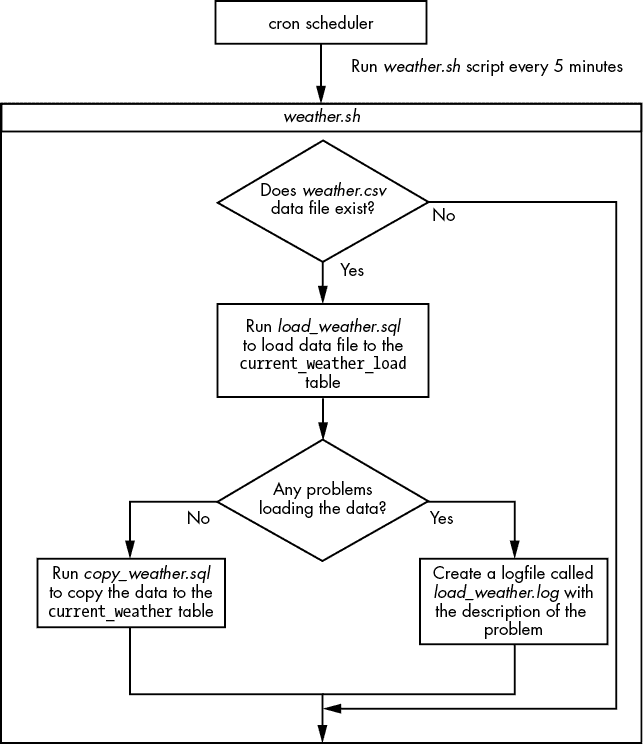
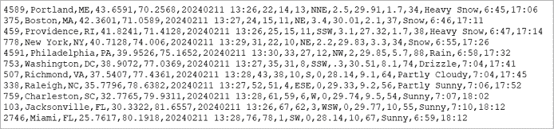
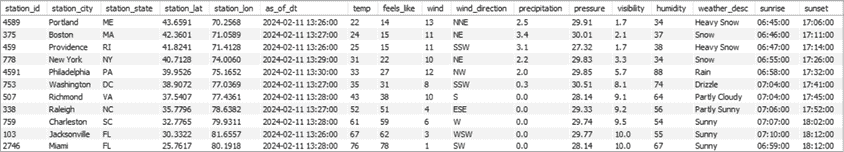

# 第十六章：构建天气数据库


在这个项目中，你将为一家卡车公司构建一个天气数据库。该公司在美国东海岸上下运输物品，需要一种方法来获取驾驶员前往的主要城市的当前天气情况。

公司已经设置了一个包含卡车数据的 MySQL 数据库，但是你需要添加一个新的数据库，详细描述卡车司机驾驶经过的当前天气情况。这将允许你将天气数据整合到现有的卡车应用程序中，以显示天气对调度的影响，并警告驾驶员有关黑冰、雪和极端温度等危险条件。

你将从一个第三方公司获取这些天气数据文件。该公司已同意每小时发送给你一个 CSV 文件。从 第十四章 回忆，CSV 文件是一个文本文件，包含数据，并使用逗号作为字段之间的分隔符。

提供天气数据的公司将使用 FTP（文件传输协议），这是一种标准的通信协议，允许在计算机之间传输文件，将 *weather.csv* 文件发送到你的 Linux 服务器的 */home/weather_load/ 目录。数据文件将大约每小时到达一次，但可能会有延迟，这意味着文件可能不会准确地每小时到达。因此，你将编写一个程序，每 5 分钟运行一次，检查文件是否可用，并在其可用时将其加载到你的数据库中。*

*一旦你审查了必要的技术，你将通过创建一个名为`weather`的新数据库开始你的项目，其中包含两个表：`current_weather_load`和`current_weather`。你将从文件中加载数据到`current_weather_load`表中。一旦确保数据加载没有任何问题，你将把数据从`current_weather_load`复制到`current_weather`表中，这是你的卡车应用程序将使用的表。你可以在 [`github.com/ricksilva/mysql_cc/tree/main/chapter_16`](https://github.com/ricksilva/mysql_cc/tree/main/chapter_16) 找到 *weather.csv* 数据文件。

## 你将使用的技术

对于这个项目，除了 MySQL，你还将使用 cron 和 Bash 等其他技术。这些技术允许你安排加载天气数据，检查数据文件是否可用，并创建包含任何加载错误的日志文件。

### cron

为了安排一个脚本每 5 分钟运行一次，你将使用 *cron*，这是一种在类 Unix 操作系统（Unix、Linux 和 macOS）上可用的调度程序。它也可以通过 Windows 子系统来在 Windows 上使用，该子系统允许你在 Windows 计算机上运行 Linux 环境。要安装 WSL，请在命令行中输入 `wsl --install`。

你在 cron 中安排的任务称为 *cron jobs*，它们在后台运行，而不是与终端连接。你可以通过将任务添加到名为 *crontab* (*cron 表*) 的配置文件中来安排任务。

你可以通过输入 `crontab -l` 获取已安排的 cron 任务列表。如果你需要编辑 crontab 配置文件，可以输入 `crontab -e`。`-e` 选项将打开文本编辑器，你可以在其中添加、修改或删除 crontab 文件中的任务。

要安排一个 cron 任务，你必须提供六项信息，按照以下顺序：

1.  分钟 (0–59)

1.  小时 (0–23)

1.  日期 (1–31)

1.  月份 (1–12)

1.  一周中的天数 (0–6) （星期天到星期六）

1.  要运行的命令或脚本

例如，如果你想安排一个名为 *pi_day.sh* 的脚本运行，你可以输入 `crontab -e` 并添加一个类似下面的 crontab 条目：

```
14 3 14 3 * /usr/local/bin/pi_day.sh
```

设置好这个 cron 任务后，位于 */usr/local/bin/* 目录中的 *pi_day.sh* 脚本将每年 3 月 14 日凌晨 3:14 执行一次。由于星期几已设置为 `*`（通配符），该任务将在每年 3 月 14 日所在的任意星期几执行。

### Bash

*Bash* 是一种在 Unix 和 Linux 环境中可用的 shell 和命令语言。你可以使用多种工具或语言，但我选择了 Bash，因为它的流行性和相对简洁。Bash 脚本通常以 *.sh* 为扩展名，像前面示例中的 *pi_day.sh*。在本章的项目中，你将编写一个名为 *weather.sh* 的 Bash 脚本，cron 每 5 分钟运行一次。这个脚本将检查是否有新数据文件到达，并在有新文件时调用 SQL 脚本将数据加载到数据库中。

### SQL 脚本

SQL 脚本是包含 SQL 命令的文本文件。对于这个项目，你将编写两个 SQL 脚本，分别是 *load_weather.sql* 和 *copy_weather.sql*。*load_weather.sql* 脚本将数据从 CSV 文件加载到 `current_weather_load` 表中，并在出现加载问题时提醒你。*copy_weather.sql* 脚本将把天气数据从 `current_weather_load` 表复制到 `current_weather` 表中。

## 项目概述

你将安排一个 cron 任务，每 5 分钟运行一次 *weather.sh* 脚本。如果存在新的 *weather.csv* 数据文件，它将被加载到 `current_weather_load` 表中。如果没有错误地加载数据，`current_weather_load` 表中的数据将被复制到 `current_weather` 表中，供你的应用使用。图 16-1 显示了该项目的流程。



图 16-1：你的天气项目概览

如果没有新的 *weather.csv* 文件可用，*weather.sh* 脚本将退出，不会运行 Bash 脚本中剩余的加载数据和记录错误的命令。如果文件已加载且 *load_weather.log* 中没有错误，Bash 脚本将调用 *copy_weather.sql* 将你刚刚加载的 `current_weather_load` 表中的数据复制到 `current_weather` 表中。

## 数据文件

由于卡车公司在美国东海岸上下来回行驶，你已经请求以下地点的天气数据：

+   波特兰，缅因州

+   波士顿，马萨诸塞州

+   普罗维登斯，罗德岛州

+   纽约，纽约州

+   费城，宾夕法尼亚州

+   华盛顿特区

+   里士满，弗吉尼亚州

+   罗利，北卡罗来纳州

+   查尔斯顿，南卡罗来纳州

+   杰克逊维尔，佛罗里达州

+   迈阿密，佛罗里达州

CSV 数据文件将包括 表 16-1 中列出的字段。

表 16-1：CSV 数据文件中的字段

| **字段名称** | **描述** |
| --- | --- |
| `station_id` | 该数据来源的天气站 ID |
| `station_city` | 天气站所在的城市 |
| `station_state` | 天气站所在州的两位字符代码 |
| `station_lat` | 天气站的纬度 |
| `station_lon` | 天气站的经度 |
| `as_of_datetime` | 数据收集的日期和时间 |
| `temp` | 温度 |
| `feels_like` | 当前“体感温度” |
| `wind` | 风速（单位：千米每小时） |
| `wind_direction` | 风的方向 |
| `precipitation` | 过去一小时的降水量（单位：毫米） |
| `pressure` | 大气压力 |
| `visibility` | 能清晰看到的距离（单位：英里） |
| `humidity` | 空气中的相对湿度百分比 |
| `weather_desc` | 当前天气的文字描述 |
| `sunrise` | 今日该地点的日出时间 |
| `sunset` | 今日该地点的日落时间 |

大约每小时，你请求的位置的数据将通过 CSV 文件发送给你。CSV 文件的格式应类似于 图 16-2。



图 16-2：*weather.csv* 数据文件

该文件为你请求的 11 个天气站的每一个生成一行，每个字段都用逗号分隔。

## 创建天气表

创建一个名为 `weather` 的 MySQL 数据库，用于存储天气数据：

```
create database weather;
```

现在你将创建一个名为 `current_weather_load` 的表格，用于加载 CSV 文件中的数据。`_load` 后缀表明该表格是用于加载当前天气数据的。

清单 16-1 显示了创建 `current_weather_load` 表的 SQL 语句。

```
create table current_weather_load
(
  station_id      int             primary key,
  station_city    varchar(100),
  station_state   char(2),
  station_lat     decimal(6,4)    not null,
  station_lon     decimal(7,4)    not null,
  as_of_dt        datetime,
  temp            int             not null,
  feels_like      int,
  wind            int,
  wind_direction  varchar(3),
  precipitation   decimal(3,1),
  pressure        decimal(6,2),
  visibility      decimal(3,1)    not null,
  humidity        int,
  weather_desc    varchar(100)    not null,
  sunrise         time,
  sunset          time,
  constraint check(station_lat between -90 and 90),
  constraint check(station_lon between -180 and 180),
  constraint check(as_of_dt between (now() - interval 1 day) and now()),
  constraint check(temp between -50 and 150),
 constraint check(feels_like between -50 and 150),
  constraint check(wind between 0 and 300),
  constraint check(station_lat between -90 and 90),
  constraint check(wind_direction in
    (
     'N','S','E','W','NE','NW','SE','SW',
     'NNE','ENE','ESE','SSE','SSW','WSW','WNW','NNW'
    )
  ),
  constraint check(precipitation between 0 and 400),
  constraint check(pressure between 0 and 1100),
  constraint check(visibility between 0 and 20),
  constraint check(humidity between 0 and 100)
);
```

清单 16-1：创建 `current_weather_load` 表

现在创建第二个表，名为 `current_weather`，其结构与 `current_weather_load` 相同：

```
create table current_weather like current_weather_load;
```

有了这两个表之后，你就可以将 CSV 文件加载到一个表中，同时在确保数据加载干净后，你还将把天气数据复制到一个最终的、面向用户的表格中。

让我们更详细地看一下 清单 16-1。

### 数据类型

你应该始终为列选择与 CSV 文件中的数据尽可能匹配的数据类型。例如，你将`station_id`、`temp`、`feels_like`、`wind`和`humidity`列定义为`int`数据类型，因为它们将作为不带小数点的数字值传入。你将`station_lat`、`station_lon`、`precipitation`、`pressure`和`visibility`定义为`decimal`数据类型，因为它们将包含小数点。

你还应该考虑列值的大小。例如，你将`station_lat`列定义为`decimal(6,4)`，因为纬度需要存储小数点前最多两位和小数点后四位的数字。你将`station_lon`定义为`decimal(7,4)`，因为经度需要存储小数点前最多*三*位和小数点后四位的数字。经度列需要能够存储比纬度列更大的数值。

你需要为`as_of_dt`列动动脑筋。它的数据以`YYYYMMDD hh:mm`的格式给你。MySQL 没有存储这种格式数据的数据类型，因此你创建了一个`as_of_dt`列，并为其设置了`datetime`数据类型。当你将数据文件加载到加载表时，你将把这个值转换为`datetime`格式。（我们将在下一节讨论如何处理这个问题。）

`station_state`列将始终包含两个字符，因此你将其定义为`char(2)`。由于`station_city`和`weather_desc`列的字符数是可变的，你将这两列定义为`varchar`类型，最多包含 100 个字符。没有城市或描述的字符数应该超过 100，所以如果你在这些列中获得超过 100 的值，你可以放心地认为数据是错误的。

`sunrise`和`sunset`值将以小时和分钟的格式提供给你。你为这些值使用`time`数据类型，即使数据文件中没有秒数。你将这些值加载到具有`time`数据类型的列中，并让秒数自动默认为零。例如，你将加载值`17:06`，它将被保存为`17:06:00`。这对你的用途来说完全可行，因为你的应用程序不需要精确到秒的日出和日落时间。

### 约束

你在`station_id`列上创建主键以确保唯一性。如果数据文件中有两条记录来自同一个气象站，你不希望加载这两条记录。将`station_id`设置为主键将阻止第二行数据的加载，并生成警告信息，提醒你数据文件存在问题。

你为列添加了一些其他约束，作为加载到表中的数据质量检查。

`station_lat`列必须在有效的纬度值范围内：–90.0000 到 90.0000。你已经将`station_lat`定义为`decimal(6,4)`数据类型，这样总共有六个数字，其中四个小数位，但这并不能阻止像`95.5555`这样的无效值被写入该列。添加`check`约束将强制要求该值在适当的范围内。这样可以确保只存储合法的纬度值，并拒绝任何超出该范围的值。同样，`station_lon`列必须在有效的经度值范围内：–180.0000 到 180.0000。

`wind_direction`列也有一个`check`约束，确保该列只包含你在列表中提供的 16 个可能值之一（例如`N`表示北，`SE`表示东南，`NNW`表示北北西，等等）。

其他`check`约束确保你的数据在天气数据的合理范围内。例如，温度超出-50 华氏度到 150 华氏度的范围可能是一个错误，所以你会拒绝它。湿度是百分比，因此你要求它必须在 0 到 100 之间。

你还在加载表中的一些列上声明了`not null`约束。这些列非常重要，若未提供这些数据，加载将会失败。`station_id`列必须是非空的，因为它是该表的主键。

你将`station_lat`和`station_lon`定义为`not null`，因为你希望在你的卡车运输应用中绘制天气站的位置地图。你希望在地图上显示每个天气站的当前温度、能见度和天气状况，如果没有提供该站的纬度和经度，就无法实现这一点。

`temperature`、`visibility`和`weather_desc`列也是本项目中的关键数据，因此你也将它们定义为`not null`。

## 加载数据文件

在你创建*weather.sh* Bash 脚本之前，该脚本检查是否有新的 CSV 天气文件可用，你将编写*load_weather.sql* SQL 脚本，将 CSV 文件加载到`current_weather_load`表中（请参见 Listing 16-2）。

```
use weather;

delete from current_weather_load;

load data local infile '/home/weather_load/weather.csv'
into table current_weather_load
❶ fields terminated by ','
(
    station_id,
    station_city,
    station_state,
    station_lat,
    station_lon,
  ❷ @aod,
    temp,
    feels_like,
    wind,
    wind_direction,
    precipitation,
    pressure,
    visibility,
    humidity,
    weather_desc,
    sunrise,
    sunset
)
❸ set as_of_dt = str_to_date(@aod,'%Y%m%d %H:%i');

❹ show warnings;

❺ select concat('No data loaded for ',station_id,': ',station_city)
from    current_weather cw
where   cw.station_id not in
(
    select cwl.station_id
    from   current_weather_load cwl
);
```

Listing 16-2：*load_weather.sql*脚本

首先，你将当前数据库设置为`weather`数据库，并删除`current_weather_load`表中可能残留的上次加载的数据行。

然后你使用在第十四章中看到的`load data`命令，将*weather.csv*文件加载到`current_weather_load`表中。因为你正在加载一个以逗号分隔的文件，所以你需要指定`fields terminated by ','` ❶，这样`load data`就知道每个字段的结束位置，以及下一个字段的开始位置。你指定数据文件名为*weather.csv*，并且文件位于*/home/weather_load/*目录下。

在括号内，你列出了所有你希望加载数据字段的表格列，只有一个例外：你不是直接从文件将值加载到 `as_of_dt` 列，而是将其加载到一个名为 `@aod` 的变量中❷。该变量保存的是 CSV 文件中格式化的 `as of date` 值，如前所述，其格式为 `YYYYMMDD hh:mm`。你使用 MySQL 的 `str_to_date()` 函数❸将 `@aod` 变量的值从字符串转换为 `datetime` 数据类型。你使用格式说明符 `%Y`、`%m`、`%d`、`%H` 和 `%i` 来指定字符串的格式。通过指定 `str_to_date(@aod,'%Y%m%d %H:%i')`，你表示 `@aod` 变量由以下部分组成：

+   `%Y`，四位数的年份

+   `%m`，两位数的月份

+   `%d`，两位数的日期

+   一个空格

+   `%H`，两位数的小时（0–23）

+   一个冒号

+   `%i`，两位数的分钟（0–59）

有了这些信息，`str_to_date()` 函数就能够将 `@aod` 字符串转换为 `current_weather_load` 表中的 `as_of_date datetime` 字段。

接下来，你检查加载数据时是否存在任何问题。`show warnings` 命令❹列出你上次运行命令时的任何错误、警告或备注。如果数据文件中的问题导致 `load data` 命令失败，`show warnings` 会告诉你问题所在。

然后，你添加了一个查询作为第二次检查，确保数据已正确加载❺。在这个查询中，你列出所有上次你将数据写入 `current_weather` 表时的天气站。如果这些天气站中的任何一个不在你刚加载的 `current_weather_load` 表中，这可能意味着数据文件中缺少了该天气站的数据，或者该天气站的数据存在问题，导致数据未能加载。在任何一种情况下，你都希望能够收到通知。

你现在已经编写了 *load_weather.sql* 脚本，来通知你加载数据时是否有任何问题。如果 *load_weather.sql* 执行后没有任何输出，则表示数据已经成功加载到 `current_weather_load` 表中。

## 将数据复制到最终表

一旦数据从 CSV 数据文件成功加载到 `current_weather_load` 表中，你将运行另一个名为 *copy_weather.sql* 的 SQL 脚本，将数据复制到最终的 `current_weather` 表中（列表 16-3）。

```
use weather;

delete from current_weather;

insert into current_weather
(
       station_id,
       station_city,
       station_state,
       station_lat,
       station_lon,
       as_of_dt,
       temp,
       feels_like,
       wind,
       wind_direction,
       precipitation,
       pressure,
       visibility,
       humidity,
       weather_desc,
       sunrise,
       sunset
)
select station_id,
       station_city,
       station_state,
       station_lat,
       station_lon,
       as_of_dt,
       temp,
       feels_like,
       wind,
       wind_direction,
       precipitation,
       pressure,
       visibility,
       humidity,
       weather_desc,
       sunrise,
       sunset
from   current_weather_load;
```

列表 16-3：*copy_weather.sql* 脚本

该 SQL 脚本将当前数据库设置为 `weather` 数据库，删除 `current_weather` 表中的所有旧行，并从 `current_weather_load` 表加载数据到 `current_weather` 表中。

现在你已经编写了 SQL 脚本，可以编写调用它们的 Bash 脚本（列表 16-4）。

```
#!/bin/bash ❶
cd /home/weather/ ❷

if [ ! -f weather.csv ]; then ❸
   exit 0
fi

mysql --local_infile=1 -h 127.0.0.1 -D weather -u trucking -pRoger -s \
       < load_weather.sql > load_weather.log ❹

if [ ! -s load_weather.log ]; then ❺
   mysql -h 127.0.0.1 -D weather -u trucking -pRoger -s < copy_weather.sql > copy_weather.log
fi

mv weather.csv weather.csv.$(date +%Y%m%d%H%M%S) ❻
```

列表 16-4：*weather.sh* 脚本

Bash 脚本的第一行❶称为 *shebang*。它告诉系统，这个文件中的命令应该使用位于 */bin/bash* 目录中的解释器。

接下来，使用`cd`命令切换到*/home/weather/*目录❷。

在第一个`if`语句❸中，检查*weather.csv*文件是否存在。在 Bash 脚本中，`if`语句以`if`开始，以`fi`结束。`-f`命令用于检查文件是否存在，`!`是表示`not`的语法。语句`if [ ! -f weather.csv ]`用于检查*weather.csv*文件是否不存在。如果不存在，意味着没有新的 CSV 数据文件可以加载，因此会退出 Bash 脚本并返回退出码`0`。按照惯例，退出码`0`表示成功，`1`表示错误。在这里退出 Bash 脚本，防止脚本继续执行；因为没有数据文件可供处理，所以不需要执行后续脚本。

使用 MySQL 命令行客户端❹（`mysql`命令，详见第十四章）运行*load_weather.sql* SQL 脚本。如果*load_weather.sql*脚本在加载数据到`current_weather_load`表时出现问题，您将把这些问题记录到一个名为*load_weather.log*的文件中。

在 Bash 中，左箭头（`<`）和右箭头（`>`）用于*重定向*，它们允许你从文件中获取输入并将输出写入另一个文件。语法`< load_weather.sql`告诉 MySQL 命令行客户端从*load_weather.sql*脚本中运行命令。语法`> load_weather.log`表示将任何输出写入*load_weather.log*文件。

`local_infile=1`选项允许你使用本地计算机上的数据文件（而不是安装 MySQL 的服务器上的数据文件）运行`load data`命令（该命令在*load_weather.sql*脚本中使用）。根据你的配置设置，这在你的环境中可能不是必须的。（你的 DBA 可以通过命令`set global local_infile = on`将此选项设置为配置参数。）

`-h`选项告诉 MySQL 命令行客户端 MySQL 安装的主机服务器。在这种情况下，`-h 127.0.0.1`表示 MySQL 主机服务器与当前正在运行脚本的计算机相同。也被称为*localhost*，127.0.0.1 是当前（本地）计算机的 IP 地址。你也可以在这里直接输入`-h` `localhost`。

接下来，提供数据库名称`weather`，你的 MySQL 用户 ID`trucking`，以及密码`Roger`。奇怪的是，MySQL 不允许`-p`后面有空格，因此输入密码时不要在前面加空格。

使用`-s`选项以*静默模式*运行 SQL 脚本。这可以防止脚本在输出中显示过多的信息。例如，如果波士顿气象站没有加载数据，您希望在*load_weather.log*文件中看到`No data loaded for 375: Boston`的消息。但如果没有`-s`，日志文件还会显示生成该消息的`select`语句的开始部分：

```
concat('No data loaded for ',station_id,': ',station_city)
No data loaded for 375: Boston
```

使用`-s`选项可以防止文本`concat('No data loaded for ',station_id,': ',station_city)`写入*load_weather.log*文件中。

在 Bash 中，反斜杠字符（`\`）允许你将命令继续到下一行。`-s`后，你使用反斜杠继续下一行，因为你的代码行太长了。

接下来，你的 Bash 脚本检查是否在*load_weather.log*文件中列出了任何加载问题❺。在`if`语句中，`-s`检查文件大小是否大于 0 字节。只有当数据没有问题加载到`current_weather_load`加载表格时，你才会将数据加载到最终表格`current_weather`中。换句话说，只有当*load_weather.log*文件为空或大小为 0 字节时，才会将数据复制到`current_weather`表格。你通过使用语法`if [ ! -s load_weather.log ]`来检查日志文件的大小是否大于 0。

最后，在*weather.sh* Bash 脚本的最后一行，你将重命名*weather.csv*文件，添加当前日期和时间作为后缀。例如，你将*weather.csv*重命名为*weather.csv.20240412210125*，这样下次运行 Bash 脚本时，它就不会再尝试重新加载相同的*weather.csv*文件❻。`mv`命令代表*move*，用于重命名或将文件移动到另一个目录。

现在让我们来看一下结果。如果你收到一个包含有效数据的*weather.csv*数据文件，运行*load_weather.sql*脚本将导致`current_weather_load`表格填充数据。这应该类似于图 16-3。

你在`current_weather_load`表中的数据看起来很好。CSV 数据文件中的所有 11 行现在都已存入表格，并且所有列的值看起来合理。

另一方面，如果你收到的*weather.csv*数据文件包含重复值，或者值格式不正确或超出范围，运行*load_weather.sql*脚本的结果是你的*load_weather.log*文件会包含问题列表。



图 16-3：`current_weather_load`表格

假设你收到了有效数据并且*copy_weather.sql*已运行，`current_weather`表格应该与图 16-3 一致。

接下来，你将使用 cron 创建调度任务来运行这个 Bash 脚本。

## 在 cron 上调度 Bash 脚本

使用命令`crontab -e`，创建以下的 crontab 条目：

```
*/5 * * * * /home/weather/weather.sh
```

`*/5`在`minutes`列中告诉 cron 每 5 分钟运行一次这个任务。你可以对所有其他值（小时、月、日期和星期几）使用通配符（`*`）字符，因为你希望脚本在所有小时、月份、日期和星期几运行。图 16-4 展示了每个 crontab 条目部分的含义。


图 16-4：将*weather.sh*脚本调度到 cron 上每 5 分钟运行一次

然后，你保存 crontab 文件并退出由`crontab -e`命令启动的文本编辑器。

## 替代方法

正如谚语所说，有很多种方法可以剥猫皮。同样，你可以使用到目前为止学到的知识，用许多其他方式来处理这个项目。

你本可以直接将数据从 CSV 文件加载到最终的`current_weather`表中，但使用临时加载表可以让你在后台修正任何数据问题，而不影响面向用户的数据。如果 CSV 文件中存在重复记录、格式不正确的列值或超出范围的值等数据问题，那么加载到`current_weather_load`表中的操作会失败。在你与 CSV 文件供应商合作获得修正文件的同时，你的应用程序将继续使用`current_weather`表中的现有数据，用户不会受到影响（尽管他们看到的天气数据不会像通常那样是最新的）。

如果你的天气数据提供者提供了*应用程序编程接口（API）*，你本可以通过 API 接收天气数据，而不是加载 CSV 数据文件。API 是两种系统之间交换数据的另一种方式，但深入讨论 API 超出了本书的范围。

你在`current_weather_load`表上创建了主键和其他约束。在需要从文件加载大量记录到表中的情况下，你不会这么做。出于性能考虑，你会选择将数据加载到没有约束的表中。因为在每一行写入表时，MySQL 需要检查约束是否被违反，这会消耗时间。然而，在你的天气项目中，只有 11 行数据被加载，所以即使有约束，加载时间几乎是瞬时的。

你本可以在 Bash 脚本*weather.sh*中添加一行代码，以便每当加载数据时出现问题时，通过电子邮件或短信通知你和数据提供者。这个功能没有包含在项目中，因为它需要一些设置。想了解更多，可以使用`man`命令查阅`mailx`、`mail`或`sendmail`命令（例如，`man mailx`）。

此外，你的数据库凭证被硬编码在*weather.sh* Bash 脚本中，以便脚本可以调用 MySQL 命令行客户端。当你加载数据时，MySQL 会给出警告`Using a password on the command line interface can be insecure`。值得重新构建代码，使其隐藏你的数据库用户 ID 和密码，或者使用第十四章中展示的`mysql_config_editor`工具。

## 总结

在这个项目中，你安排了一个 cron 作业来执行一个 Bash 脚本，该脚本检查包含当前天气数据的 CSV 数据文件是否已到达。当文件到达时，你将其加载到 MySQL 数据库中。你还检查了加载数据时是否存在问题，并且在数据成功加载后，将数据转移到最终的天气表中。

在下一个项目中，你将使用触发器来跟踪 MySQL 数据库中选民数据的变化。
