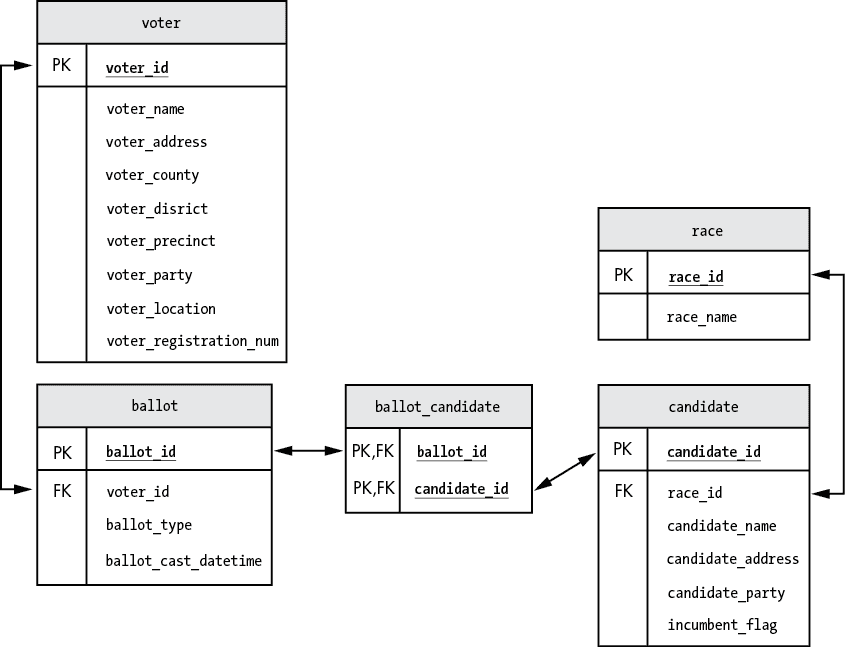
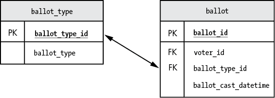

# 第十七章：使用触发器跟踪选民数据的变化


在本章中，你将构建一个用于存储选举数据的投票数据库。你将通过设计带有约束条件的数据库（包括主键和外键），并使用触发器防止错误数据的录入，从而提高数据的质量。你还将使用触发器来跟踪数据库的变化，以便在数据质量问题出现时，可以记录是谁在何时做了更改。

你将允许投票工作人员在适当时更改数据，因此构建一个防止错误发生的系统非常重要。本章中的技术可以应用于各种不同的应用和场景。数据质量至关重要，因此值得以一种尽可能保持数据准确性的方式来设置你的数据库。

## 设置数据库

首先，你将创建数据库并查看其表。你的选举选票包括市长、财务主管、学校委员会、卫生委员会和规划委员会等职位。图 17-1 显示了你将用于数据库的选票。


图 17-1：你的选举选票

本次选举使用光学扫描投票机，这些投票机读取选票并将投票数据保存到你的 MySQL 数据库中。

创建 `voting` 数据库：

```
create database voting;
```

现在你可以开始添加表格了。

## 创建表

你将在 `voting` 数据库中创建以下表：

| `beer` | 一个包含关于啤酒数据的表。 |
| --- | --- |
| `voter` | 有资格在本次选举中投票的人 |
| `ballot` | 选民的选票 |
| `race` | 选票上的竞选职位（例如，市长、财务主管） |
| `candidate` | 竞选中的候选人 |
| `ballot_candidate` | 选民在选票上选择的候选人 |

图 17-2 中的 *实体关系图* *(ERD)* 显示了这些表及其列，以及它们之间的主键和外键关系。



图 17-2：你 `voting` 数据库中的表

选民将投下他们为每个职位选择的候选人的选票。

### 选民表

`voter` 表将存储每个选民的信息，如姓名、地址和县。按如下方式创建该表：

```
use voting;

create table voter
    (
    voter_id                int             primary key    auto_increment,
 voter_name              varchar(100)    not null,
    voter_address           varchar(100)    not null,
    voter_county            varchar(50)     not null,
    voter_district          varchar(10)     not null,
    voter_precinct          varchar(10)     not null,
    voter_party             varchar(20),
    voting_location         varchar(100)    not null,
    voter_registration_num  int             not null       unique
    );
```

`voter_id` 列是该表的主键。创建此主键不仅可以加速使用 `voter` 表的连接操作，还能确保表中没有两行具有相同的 `voter_id` 值。

你将 `voter_id` 设置为 `auto_increment`，这样 MySQL 会在你每次向表中添加新选民时自动增加 `voter_id` 值。

你不能有两个选民具有相同的登记号，因此你将 `voter_registration_num` 列设置为 `unique`。如果向表中添加一个具有与现有选民相同的 `voter_registration_num` 的新选民，该行将被拒绝。

除了 `voter_party` 列之外，所有列都被定义为 `not null`。你允许一行在表中保存 `voter_party` 为 null 的情况，但如果其他任何列包含 null 值，该行将被拒绝。

### 选票表

`ballot` 表保存每张选票的信息，包括选票号码、完成选票的选民、选票投下的时间以及选票是亲自投下还是缺席投票。创建 `ballot` 表如下：

```
create table ballot
    (
    ballot_id              int          primary key    auto_increment,
    voter_id               int          not null       unique,
    ballot_type            varchar(10)  not null,
    ballot_cast_datetime   datetime     not null       default now(),
    constraint foreign key (voter_id) references voter(voter_id),
    constraint check(ballot_type in ('in-person', 'absentee'))
    );
```

`ballot_id` 列是该表的主键，当你向表中插入新的选票行时，它的值会自动递增。

你为 `voter_id` 列使用了 `unique` 约束，以确保每个选民在表中只有一张选票。如果选民尝试投票超过一次，只有第一次选票会被计入，之后的选票将被拒绝。

`ballot_cast_datetime` 列保存选票投下的日期和时间。你设置了一个 `default`，以便如果该列没有提供值，`now()` 函数将自动写入当前日期和时间。

你在 `ballot` 表的 `voter_id` 列上设置了外键约束，拒绝任何来自 `voter` 表中没有记录的选民提交的选票。

最后，你在 `ballot_type` 列上添加一个 `check` 约束，只允许值为 `in-person` 或 `absentee`。任何其他类型的选票将被拒绝。

### 竞选表

`race` 表存储有关你选举中每个竞选的信息，包括竞选名称以及选民在竞选中可以投票的候选人数量。你将像这样创建它：

```
create table race
    (
    race_id                 int             primary key     auto_increment,
    race_name               varchar(100)    not null        unique,
    votes_allowed           int             not null
    );
```

`race_id` 列是该表的主键，并设置为自动递增。你为 `race_name` 列定义了 `unique` 约束，以确保相同名称的竞选（如 `Treasurer`）不会被重复插入到表中。

`votes_allowed` 列保存选民在该竞选中可以选择的候选人数量。例如，选民可以在市长竞选中选择一位候选人，在学校委员会竞选中选择两位候选人。

### 候选人表

接下来，你将创建 `candidate` 表，存储所有参与竞选的候选人信息：

```
create table candidate
    (
    candidate_id            int             primary key     auto_increment,
    race_id                 int             not null,
    candidate_name          varchar(100)    not null        unique,
    candidate_address       varchar(100)    not null,
    candidate_party         varchar(20),
    incumbent_flag          bool,
    constraint foreign key (race_id) references race(race_id)
    );
```

`candidate_id` 列是该表的主键。这不仅防止了重复行被误插入，而且还强制执行了一个 *业务规则*——即候选人只能参加一个竞选。例如，如果一个候选人试图同时竞选市长和财务主管，第二行将会被拒绝。你还将 `candidate_id` 列设置为自动递增。

`race_id` 列存储候选人参与的竞选的 ID。`race_id` 被定义为指向 `race` 表中 `race_id` 列的外键。这意味着 `candidate` 表中不能有一个 `race_id` 值，除非该值也出现在 `race` 表中。

你将`candidate_name`定义为唯一，以确保表中不会有两个候选人使用相同的名字。

### `ballot_candidate` 表

现在，你将创建最终的表格`ballot_candidate`。该表用于跟踪哪些候选人在哪些选票中获得了选票。

```
create table ballot_candidate
    (
    ballot_id       int,
    candidate_id    int,
    primary key (ballot_id, candidate_id),
    constraint foreign key (ballot_id) references ballot(ballot_id),
    constraint foreign key (candidate_id) references candidate(candidate_id)
    );
```

这是一个关联表，引用了`ballot`和`candidate`表。该表的主键由`ballot_id`和`candidate_id`列组成。这样可以强制执行一个规则，即同一张选票上不能为同一候选人投超过一票。如果有人尝试插入一个重复的行，`ballot_id`和`candidate_id`相同，则该行会被拒绝。两个列也是外键。`ballot_id`列用于与`ballot`表连接，`candidate_id`则用于与`candidate`表连接。

通过在表格中定义这些约束，你可以提高数据库中数据的质量和完整性。

## 添加触发器

你将为表格创建多个触发器，以执行业务规则并跟踪数据变更以进行审计。这些触发器将在插入、更新或删除行之前或之后触发。

### `Before`触发器

你将使用触发器，这些触发器会在数据变动*之前*触发，以防止不符合业务规则的数据被写入表格中。在第十二章中，你创建了一个触发器，它会在数据保存到表格之前，将低于 300 的信用分数改为恰好 300。对于这个项目，你将使用`before`触发器来确保选民不会*超额投票*，即投票给比该竞选项目允许的更多的候选人。你还将使用`before`触发器来防止特定用户对某些表格进行更改。并不是所有表格都需要`before`触发器。

#### 业务规则

你将使用`before`触发器强制执行一些业务规则。首先，尽管所有选举工作人员都可以对`ballot`和`ballot_candidate`表进行更改，但只有州务卿可以更改`voter`、`race`和`candidate`表中的数据。你将创建以下`before`触发器来执行这个业务规则：

| `tr_voter_bi` | 防止其他用户插入选民 |
| --- | --- |
| `tr_race_bi` | 防止其他用户插入竞选项目 |
| `tr_candidate_bi` | 防止其他用户插入候选人 |
| `tr_voter_bu` | 防止其他用户更新选民信息 |
| `tr_race_bu` | 防止其他用户更新竞选项目 |
| `tr_candidate_bu` | 防止其他用户更新候选人信息 |
| `tr_voter_bd` | 防止其他用户删除选民 |
| `tr_race_bd` | 防止其他用户删除竞选项目 |
| `tr_candidate_bd` | 防止其他用户删除候选人 |

这些触发器将阻止用户进行更改，并显示一条错误消息，解释只有州务卿可以更改这些数据。

其次，选民可以为每个竞选选择一定数量的候选人。选民可以选择不为某个竞选选择任何候选人，或者选择少于最大允许数量的候选人，但他们不能选择超过最大允许数量的候选人。你将通过创建`tr_ballot_candidate_bi`触发器来防止选民过度投票。

这些就是你为这个项目所需的所有插入前触发器。记住，并不是所有表都需要插入前触发器。

#### 插入前触发器

你需要为你的项目创建四个*插入前*触发器。其中三个触发器将阻止除了州务卿以外的用户在`voter`、`race`和`candidate`表中插入数据。另一个插入前触发器将防止选民在某个竞选中投票给过多的候选人。

在列表 17-1 中，你编写了插入前触发器，防止除了州务卿以外的用户在`voter`表中插入新记录。

```
drop trigger if exists tr_voter_bi;

delimiter //

create trigger tr_voter_bi
  before insert on voter
  for each row
begin
  if user() not like 'secretary_of_state%' then
  ❶ signal sqlstate '45000'
    set message_text = 'Voters can be added only by the Secretary of State';
  end if;
end//

delimiter ;
```

列表 17-1：定义`tr_voter_bi`触发器

首先，为了防止触发器已存在，你会在重新创建之前删除它。你将`tr_voter_bi`触发器定义为`before insert`触发器。对于每一行插入到`voter`表中的数据，你会检查插入新选民的用户姓名是否以`secretary_of_state`开头。

`user()`函数返回用户名和主机名，例如`secretary_of_state@localhost`。如果该字符串不以`secretary_of_state`开头，意味着是除了州务卿以外的其他人试图插入选民记录。在这种情况下，你将使用`signal`语句发送错误信息❶。

你可能还记得在第十二章中提到过，`sqlstate`是一个五字符代码，用于标识错误和警告。你使用的值`45000`表示一种错误状态，这会导致触发器退出，从而防止该行被写入`voter`表。

你可以使用`set message_text`语法来定义要显示的消息。注意，这一行是`signal`命令的一部分，因为`signal`行末没有分号。你本可以将这两行合并成一行，如下所示：

```
signal sqlstate '45000' set message_text = 'Voters can be added only...';
```

这个`tr_voter_bi`触发器防止除州务卿以外的用户插入选民记录。

现在，编写你的`tr_ballot_candidate_bi`触发器，以防止选民在竞选中投票给过多的候选人（列表 17-2）。

```
drop trigger if exists tr_ballot_candidate_bi;

delimiter //

create trigger tr_ballot_candidate_bi
  before insert on ballot_candidate
  for each row
begin
  declare v_race_id int;
  declare v_votes_allowed int;
  declare v_existing_votes int;
  declare v_error_msg varchar(100);
  declare v_race_name varchar(100);

❶ select r.race_id,
         r.race_name,
         r.votes_allowed
❷ into   v_race_id,
         v_race_name,
         v_votes_allowed
  from   race r
  join   candidate c
  on     r.race_id = c.race_id
  where  c.candidate_id = new.candidate_id;

❸ select count(*)
  into   v_existing_votes
  from   ballot_candidate bc
  join   candidate c
  on     bc.candidate_id = c.candidate_id
  and    c.race_id = v_race_id
  where  bc.ballot_id = new.ballot_id;

  if v_existing_votes >= v_votes_allowed then
     select concat('Overvoting error: The ',
              v_race_name,
              ' race allows selecting a maximum of ',
              v_votes_allowed,
              ' candidate(s) per ballot.'
            )
     into v_error_msg;

  ❹ signal sqlstate '45000' set message_text = v_error_msg;
  end if;
end//

delimiter ;
```

列表 17-2：定义`tr_ballot_candidate_bi`触发器

在新记录插入到`ballot_candidate`表之前，你的触发器会查找该竞选中的投票数限制。然后，它会检查该投票和竞选对应的`ballot_candidate`表中现有的行数。如果现有的投票数大于或等于最大允许数，新记录将被阻止插入。（现有的投票数不应超过最大允许数，但你仍会检查以确保完整性。）

你在触发器中声明了五个变量：`v_race_id` 存储选举 ID，`v_race_name` 存储选举名称，`v_existing_votes` 存储该选票上已经投给该选举候选人的投票数，`v_votes_allowed` 存储选民可以在该选举中选择的候选人数量，`v_error_msg` 变量则存储错误消息，以便在选了太多候选人时显示给用户。

在第一个 `select` 语句 ❶ 中，你使用即将插入到表中的 `candidate_id`（即 `new.candidate_id`）来获取候选人参选的选举信息。你通过连接 `race` 表，获取 `race_id`、`race_name` 和 `votes_allowed`，并将它们保存到变量中 ❷。

在你的第二个 `select` 语句中，你会获取已经存在于 `ballot_candidate` 表中的投票数量，用于该选举和该选票 ❸。你通过连接 `candidate` 表，获取参选该选举的候选人列表。然后，你统计 `ballot_candidate` 表中与这些候选人之一和该选票 ID 相关的行数。

如果 `ballot_candidate` 表已经有该选票和选举的最大投票数，你将使用 `signal` 命令，并带上 `sqlstate` 代码 `45000` 来退出触发器，并防止新行被写入 `ballot_candidate` 表 ❹。你将显示存储在 `v_error_msg` 变量中的错误信息给用户：

```
Overvoting error: The Mayor race allows selecting a maximum of 1 candidate(s) per ballot.
```

#### 更新前触发器

你还需要通过编写 `tr_voter_bu` 触发器来防止除州务卿外的其他用户更新选民行，如 清单 17-3 所示。

```
drop trigger if exists tr_voter_bu;

delimiter //

create trigger tr_voter_bu
  before update on voter
 for each row
begin
  if user() not like 'secretary_of_state%' then
    signal sqlstate '45000'
    set message_text = 'Voters can be updated only by the Secretary of State';
  end if;
end//

delimiter ;
```

清单 17-3：定义 `tr_voter_bu` 触发器

这个触发器将在 `voter` 表中的一行被更新之前触发。

尽管插入前触发器和更新前触发器类似，但没有办法将它们合并成一个触发器。MySQL 没有办法编写 `before insert or update` 类型的触发器；它要求你编写两个单独的触发器。不过，你可以从触发器中调用存储过程。如果两个触发器有类似的功能，你可以将该功能添加到存储过程中，并让每个触发器调用该过程。

#### 删除前触发器

接下来，你将编写 `tr_voter_bd` 触发器，以防止除州务卿以外的任何用户删除选民数据（清单 17-4）。

```
drop trigger if exists tr_voter_bd;

delimiter //

create trigger tr_voter_bd
  before delete on voter
  for each row
begin
  if user() not like 'secretary_of_state%' then
    signal sqlstate '45000'
    set message_text = 'Voters can be deleted only by the Secretary of State';
  end if;
end//

delimiter ;
```

清单 17-4：定义 `tr_voter_bd` 触发器

### 更新后触发器

你将编写在数据插入、更新或删除后触发的触发器，以跟踪对表所做的更改。但由于 `after` 触发器的目的是将行写入审计表，因此你需要首先创建这些审计表。这些审计表保存对你表中数据所做更改的记录，类似于你在 第十二章 中看到的内容。

#### 审计表

为审计表命名时，使用`_audit`后缀。例如，你将跟踪对`voter`表所做的更改，并将其记录在`voter_audit`表中。你将以这种方式命名所有审计表，以便明确它们跟踪的数据。

按照列表 17-5 中的示例创建审计表。

```
create table voter_audit
(
  audit_datetime  datetime,
  audit_user      varchar(100),
  audit_change    varchar(1000)
);

create table ballot_audit
(
  audit_datetime  datetime,
  audit_user      varchar(100),
  audit_change    varchar(1000)
);

create table race_audit
(
  audit_datetime  datetime,
  audit_user      varchar(100),
  audit_change    varchar(1000)
);

create table candidate_audit
(
  audit_datetime  datetime,
  audit_user      varchar(100),
  audit_change    varchar(1000)
);

create table ballot_candidate_audit
(
  audit_datetime  datetime,
  audit_user      varchar(100),
  audit_change    varchar(1000)
);
```

列表 17-5：在定义后触发器之前创建审计表

所有审计表的结构都是一样的。每个表都有一个`audit_datetime`列，用于存储更改的日期和时间，一个`audit_user`列，用于存储进行更改的用户的姓名，以及一个`audit_change`列，用于存储更改的数据描述。当你在投票应用程序中发现数据似乎不对时，可以查看这些审计表，获取更多信息。

接下来，对于每个数据表，你将创建三个触发器，这些触发器在`insert`、`update`或`delete`操作后触发。触发器的名称显示在表 17-1 中。

表 17-1：后触发器名称

| **表** | **后插入触发器** | **后更新触发器** | **后删除触发器** |
| --- | --- | --- | --- |
| `voter` | `tr_voter_ai` | `tr_voter_au` | `tr_voter_ad` |
| `ballot` | `tr_ballot_ai` | `tr_ballot_au` | `tr_ballot_ad` |
| `race` | `tr_race_ai` | `tr_race_au` | `tr_race_ad` |
| `candidate` | `tr_candidate_ai` | `tr_candidate_au` | `tr_candidate_ad` |
| `ballot_candidate` | `tr_ballot_candidate_ai` | `tr_ballot_candidate_au` | `tr_ballot_candidate_ad` |

你将从每个表的`after_insert`触发器开始。

#### 后插入触发器

`tr_voter_ai`触发器将在向`voter`表中插入新行后触发，向`voter_audit`表添加行，以跟踪新数据（参见列表 17-6）。

```
drop trigger if exists tr_voter_ai;

delimiter //

create trigger tr_voter_ai
  after insert on voter
❶ for each row
begin
  insert into voter_audit
  (
    audit_datetime,
    audit_user,
    audit_change
 )
  values
  (
  ❷ now(),
    user(),
    concat(
    ❸ 'New Voter added -',
         ' voter_id: ',                   new.voter_id,
         ' voter_name: ',                 new.voter_name,
         ' voter_address: ',              new.voter_address,
         ' voter_county: ',               new.voter_county,
         ' voter_district: ',             new.voter_district,
         ' voter_precinct: ',             new.voter_precinct,
         ' voter_party: ',                new.voter_party,
         ' voting_location: ',            new.voting_location,
         ' voter_registration_num: ',     new.voter_registration_num
    )
  );
end//

delimiter ;
```

列表 17-6：定义`tr_voter_ai`触发器

要创建触发器，首先检查`tr_voter_ai`触发器是否已经存在。如果存在，则先删除它，然后再重新创建。由于 SQL `insert`语句可以插入一行或多行数据，因此你需要指定，对于每一行插入到`voter`表中的数据，你希望在`voter_audit`表中写入一行数据 ❶。

在`audit_datetime`列中，使用`now()`函数插入当前日期和时间 ❷。在`audit_user`列中，使用`user()`函数插入进行更改的用户名称。`user()`函数还会返回用户的主机名，因此用户名后面会跟随一个@符号和主机名，如`clerk_238@localhost`。

你在`audit_change`列中使用`concat()`函数构建一个字符串，显示被插入的值。你以文本`New voter added -` ❸开始，通过使用`insert`触发器中可用的`new`关键字获取插入的值。例如，`new.voter_id`显示刚刚插入到`voter`表中的`voter_id`。

当向`voter`表中添加一行新数据时，`tr_voter_ai`触发器会触发，并将像以下这样的值写入`voter_audit`表：

```
audit_datetime:  2024-05-04 14:13:04

audit_user:      secretary_of_state@localhost

audit_change:    New voter added – voter_id: 1 voter_name: Susan King
                 voter_address: 12 Pleasant St. Springfield
                 voter_county: Franklin voter_district: 12A voter_precinct: 4C
                 voter_party: Democrat voting_location: 523 Emerson St.
                 voter_registration_num: 129756
```

该触发器将新选民的日期时间、用户（和主机名）以及详细信息写入审计表。

#### 删除后触发器

在示例 17-7 中，你编写了删除后触发器`tr_voter_ad`，它将在`voter`表中的行被删除后触发，并追踪这些删除到`voter_audit`表中。

```
drop trigger if exists tr_voter_ad;

delimiter //

create trigger tr_voter_ad
❶ after delete on voter
  for each row
begin
  insert into voter_audit
  (
    audit_datetime,
    audit_user,
    audit_change
  )
  values
  (
    now(),
    user(),
    concat(
      'Voter deleted -',
         ' voter_id: ',                   old.voter_id,
         ' voter_name: ',                 old.voter_name,
         ' voter_address: ',              old.voter_address,
         ' voter_county: ',               old.voter_county,
         ' voter_district: ',             old.voter_district,
         ' voter_precinct: ',             old.voter_precinct,
         ' voter_party: ',                old.voter_party,
         ' voting_location: ',            old.voting_location,
         ' voter_registration_num: ',     old.voter_registration_num
    )
  );
end//

delimiter ;
```

示例 17-7：定义`tr_voter_ad`触发器

你将此触发器定义为`voter`表上的`after delete`触发器 ❶。你使用`user()`和`now()`函数获取删除`voter`行的用户及该行被删除的日期和时间。你构建一个字符串，使用`concat()`函数，显示已删除的值。

删除后触发器看起来与插入后触发器类似，但你使用`old`关键字代替`new`。你可以在列名之前加上`old`和句点来获取它们的值。例如，使用`old.voter_id`来获取刚删除的行中`voter_id`列的值。

当一行从`voter`表中删除时，`tr_voter_ad`触发器被触发，并将一行像以下这样的值写入`voter_audit`表：

```
audit_datetime:  2024-05-04 14:28:54

audit_user:      secretary_of_state@localhost

audit_change:    Voter deleted – voter_id: 87 voter_name: Ruth Bain
                 voter_address: 887 Wyoming St. Centerville
                 voter_county: Franklin voter_district: 12A voter_precinct: 4C
                 voter_party: Republican voting_location: 523 Emerson St.
                 voter_registration_num: 45796
```

该触发器将删除选民记录的日期时间、用户（和主机名）以及详细信息写入审计表。

#### 更新后触发器

现在你将编写更新后触发器`tr_voter_au`，该触发器将在`voter`表中的行被更新后触发，并将变更追踪到`voter_audit`表中（示例 17-8）。

```
drop trigger if exists tr_voter_au;

delimiter //

create trigger tr_voter_au
  after update on voter
  for each row
begin
  set @change_msg = concat('Voter ',old.voter_id,' updated: ');

❶ if (new.voter_name != old.voter_name) then
  ❷ set @change_msg =
        concat(
            @change_msg,
            'Voter name changed from ',
            old.voter_name,
            ' to ',
 new.voter_name
        );
  end if;

  if (new.voter_address != old.voter_address) then
    set @change_msg =
        concat(
            @change_msg,
            '. Voter address changed from ',
            old.voter_address,
            ' to ',
            new.voter_address
    );
  end if;

  if (new.voter_county != old.voter_county) then
    set @change_msg =
        concat(
            @change_msg,
            '. Voter county changed from ', old.voter_county, ' to ',
            new.voter_county
        );
  end if;

  if (new.voter_district != old.voter_district) then
    set @change_msg =
        concat(
            @change_msg,
            '. Voter district changed from ',
            old.voter_district,
            ' to ',
            new.voter_district
        );
  end if;

  if (new.voter_precinct != old.voter_precinct) then
    set @change_msg =
        concat(
            @change_msg,
            '. Voter precinct changed from ',
            old.voter_precinct,
            ' to ',
            new.voter_precinct
        );
  end if;

  if (new.voter_party != old.voter_party) then
    set @change_msg =
        concat(
            @change_msg,
            '. Voter party changed from ',
            old.voter_party,
            ' to ',
 new.voter_party
        );
  end if;

  if (new.voting_location != old.voting_location) then
    set @change_msg =
        concat(
            @change_msg,
            '. Voting location changed from ',
            old.voting_location, '
            to ',
            new.voting_location
        );
  end if;

  if (new.voter_registration_num != old.voter_registration_num) then
     set @change_msg =
         concat(
             @change_msg,
             '. Voter registration number changed from ',
             old.voter_registration_num,
             ' to ',
             new.voter_registration_num
         );
  end if;

insert into voter_audit(
    audit_datetime,
    audit_user,
    audit_change
    )
values (
    now(),
    user(),
  ❸ @change_msg
    );

end//

delimiter ;
```

示例 17-8：定义`tr_voter_au`触发器

因为更新后触发器会在行被更新后触发，所以它可以同时使用`new`和`old`关键字。例如，你可以通过检查`new.voter_name != old.voter_name` ❶来查看`voter`表中的`voter_name`列值是否已更新。如果选民的名字的新值与旧值不同，则表示该值已更新，你将保存此信息并写入`audit`表。

对于你的`insert`和`delete`触发器，你将`voter`表中*所有*列的值写入`voter_audit`表，但对于`update`触发器，你只会报告已更改的列值。

例如，如果你运行了这个`update`语句

```
update voter
set    voter_name = 'Leah Banks-Kennedy',
       voter_party = 'Democrat'
where  voter_id = 5876;
```

你的`update`触发器将只把这些更改写入`voter_audit`表：

```
audit_datetime:  2024-05-08 11:08:04

audit_user:      secretary_of_state@localhost

audit_change:    Voter 5876 updated: Voter name changed from Leah Banks
                 to Leah Banks-Kennedy. Voter party changed from Republican
                 to Democrat
```

由于只有`voter_name`和`voter_party`这两个列值发生了变化，你将把这两个更改写入审计表。

为了捕捉所做的更改，你创建了一个名为`@change_msg`的变量❷。通过`if`语句，你检查每个列值是否发生了变化。当某列的值发生变化时，你使用`concat()`函数将该列变化的信息添加到现有`@change_msg`字符串变量的末尾。检查完所有列值的变化后，你将`@change_msg`变量的值写入审计表的`audit_change`列❸。你还会将做出更改的用户名写入`audit_user`列，并将更改的日期和时间写入`audit_datetime`列。

你已经成功构建了一个数据库，它不仅存储了选举数据，还包括了约束和触发器，确保数据保持高质量。

## 替代方法

就像上一章中的`weather`数据库项目一样，编写这个`voter`数据库有很多不同的方法。

### 审计表

在这个项目中，你创建了五个不同的审计表。你本可以只创建一个审计表，并将所有审计记录写入其中。或者，你本可以创建 15 个审计表：每个表三个。例如，与其审计`voter_audit`表中的选民插入、删除和更新，你本可以将新选民的记录审计到名为`voter_audit_insert`的表中，将选民更改记录审计到`voter_audit_update`，将删除操作审计到`voter_audit_delete`。

### 触发器与权限

与其使用触发器来控制哪些用户可以更新哪些表，数据库管理员本可以通过授予和撤销这些权限来控制数据库用户。使用触发器的优势在于，你可以向用户显示自定义消息，解释问题，例如`只有州务卿才能添加选民`。

### 用新表替代检查约束

当你创建`ballot`表时，使用了以下`check`约束，确保`ballot_type`列的值为`in-person`或`absentee`：

```
constraint check(ballot_type in ('in-person', 'absentee'))
```

另一种方法是创建一个`ballot_type`表，其中包含每种选票类型的行，像这样：

```
ballot_type_id  ballot_type
--------------  ---------------
       1        in-person
       2        absentee
```

你本可以添加一个名为`ballot_type`的表，并将`ballot_type_id`列设为主键。如果这样做，你将会在`ballot`表中保存`ballot_type_id`，而不是`ballot_type`。这将如下所示：图 17-3。



图 17-3：创建一个`ballot_type`表以存储选票类型

这种方法的一个优点是，你可以添加新的选票类型，比如`military`或`overseas`，而无需更改`ballot`表的定义。对于`ballot`表的每一行来说，保存一个代表选票类型的 ID，比如`3`，而不是保存完整的名称，如`absentee`，也是更高效的。

你本可以对`voter`表使用类似的方法。与其创建包含`voter_county`、`voter_district`、`voter_precinct`和`voter_party`列的`voter`表，不如只保存 ID：`voter_county_id`、`voter_district_id`、`voter_precinct_id`和`voter_party_id`，然后引用名为`county`、`district`、`precinct`和`party`的新表来获取有效 ID 的列表。

在创建数据库时有足够的创意空间，因此不必觉得需要严格按照我在本项目中使用的方法来操作。尝试这些替代方法，看看它们对你是否有效！

## 总结

在本章中，你构建了一个投票数据库，用于存储选举数据。你通过使用约束和触发器防止了数据完整性问题，并通过审计表跟踪了数据的变化。你还看到了这个项目的一些可能替代方案。在第三个也是最后一个项目中，你将使用视图来隐藏敏感的薪资数据。
