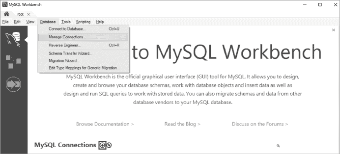
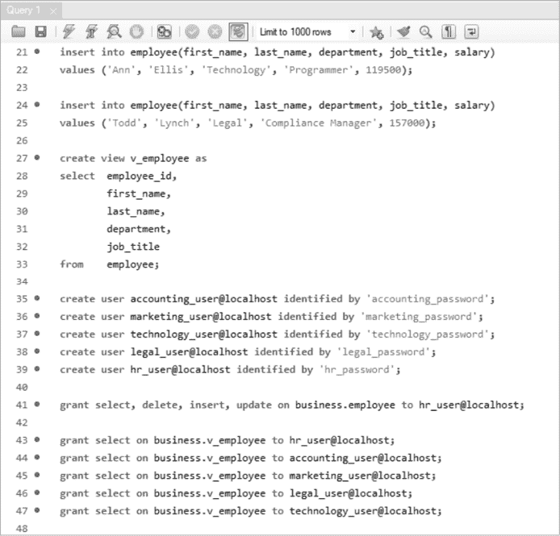
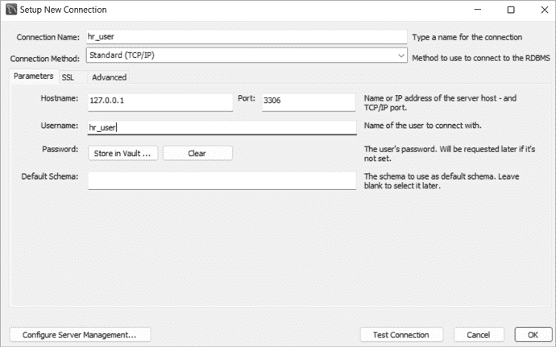
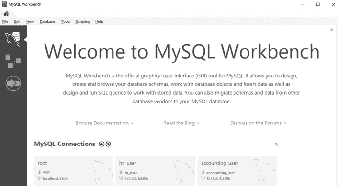
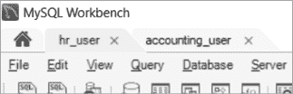
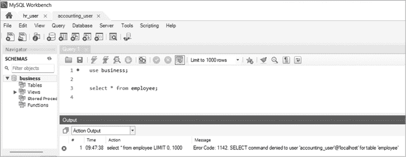
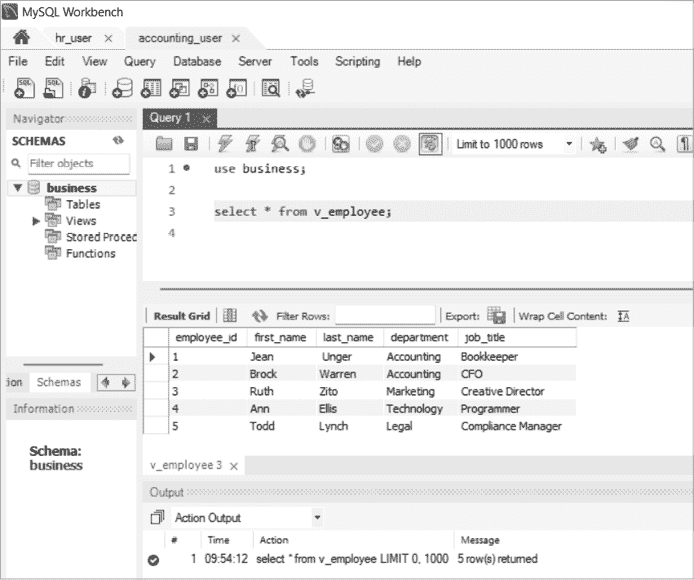

# 第十八章：使用视图保护工资数据


在这个项目中，你将使用视图来隐藏员工表中的敏感工资数据。该公司在每个部门（人力资源、营销、会计、技术和法律）都有一个数据库用户，他们被允许访问大多数员工数据。然而，只有人力资源的用户可以访问员工的工资数据。

视图可以隐藏敏感数据，但也可以用于简化对复杂查询的访问，或选择表中仅相关的数据——例如，只显示某个特定部门的表行。

## 创建员工表

首先创建你的`business`数据库：

```
create database business;
```

接下来，创建一个`employee`表，用于存储公司中每个员工的信息，包括全名、职位和工资：

```
use business;

create table employee
(
  employee_id      int             primary key    auto_increment,
  first_name       varchar(100)    not null,
  last_name        varchar(100)    not null,
  department       varchar(100)    not null,
  job_title        varchar(100)    not null,
  salary           decimal(15,2)   not null
);
```

由于你将`employee_id`列设置为`auto_increment`，因此在向`employee`表中插入新行时，不需要提供`employee_id`的值。MySQL 会为你跟踪该值，并确保每插入一行，`employee_id`值会递增。将以下数据添加到你的表中：

```
insert into employee(first_name, last_name, department, job_title, salary)
values ('Jean',' Unger', 'Accounting', 'Bookkeeper', 81200);

insert into employee(first_name, last_name, department, job_title, salary)
values ('Brock', 'Warren', 'Accounting', 'CFO', 246000);

insert into employee(first_name, last_name, department, job_title, salary)
values ('Ruth', 'Zito', 'Marketing', 'Creative Director', 178000);

insert into employee(first_name, last_name, department, job_title, salary)
values ('Ann', 'Ellis', 'Technology', 'Programmer', 119500);

insert into employee(first_name, last_name, department, job_title, salary)
values ('Todd', 'Lynch', 'Legal', 'Compliance Manager', 157000);
```

现在，查询表以查看插入的行：

```
select * from employee;
```

结果如下：

```
employee_id  first_name  last_name  department      job_title         salary
-----------  ----------  ---------  ----------  ------------------  ---------
1            Jean        Unger      Accounting  Bookkeeper           81200.00
2            Brock       Warren     Accounting  CFO                 246000.00
3            Ruth        Zito       Marketing   Creative Director   178000.00
4            Ann         Ellis      Technology  Programmer          119500.00
5            Todd        Lynch      Legal       Compliance Manager  157000.00
```

`employee`表的数据看起来不错，但你希望隐藏`salary`列，除人力资源用户外，其他人不能访问同事的敏感信息。

## 创建视图

你将不允许所有数据库用户访问`employee`表，而是让他们访问一个名为`v_employee`的视图，该视图包含`employee`表中的所有列，除了`salary`列。如第十章所讨论，视图是基于查询的虚拟表。创建视图的方法如下：

```
create view v_employee as
select employee_id,
       first_name,
       last_name,
       department,
       job_title
from   employee;
```

你在`select`语句中遗漏了`salary`列，因此当你查询视图时，结果中不应出现该列：

```
select * from v_employee;
```

结果如下：

```
employee_id  first_name  last_name  department      job_title
-----------  ----------  ---------  ----------  ------------------
1            Jean        Unger      Accounting  Bookkeeper
2            Brock       Warren     Accounting  CFO
3            Ruth        Zito       Marketing   Creative Director
4            Ann         Ellis      Technology  Programmer
5            Todd        Lynch      Legal       Compliance Manager
```

如预期的那样，`v_employee`视图包含除了`salary`以外的每一列。

接下来，你将更改`employee`数据库的权限，以允许人力资源部门在底层`employee`表中进行更改。由于`v_employee`是视图，`employee`表的更改将在视图中立即反映出来。

## 控制权限

为了调整数据库中的权限，你将使用`grant`命令，该命令授予 MySQL 数据库用户特权，并控制哪些用户可以访问哪些表。

每个部门有一个数据库用户：`accounting_user`、`marketing_user`、`legal_user`、`technology_user`和`hr_user`。通过输入以下命令，只授予`hr_user`对`employee`表的访问权限：

```
grant select, delete, insert, update on business.employee to hr_user;
```

你已授予`hr_user`在`business`数据库中选择、删除、插入和更新`employee`表的权限。你不会将这些权限授予其他部门的用户。例如，如果`accounting_user`尝试查询`employee`表，他们将收到以下错误消息：

```
Error Code: 1142\. SELECT command denied to user 'accounting_user'@'localhost'
for table ‘employee’
```

现在，您将授予所有部门的用户对 `v_employee` 视图的查询访问权限：

```
grant select on business.v_employee to hr_user@localhost;
grant select on business.v_employee to accounting_user@localhost;
grant select on business.v_employee to marketing_user@localhost;
grant select on business.v_employee to legal_user@localhost;
grant select on business.v_employee to technology_user@localhost;
```

所有部门的用户都可以从 `v_employee` 视图中选择数据，以访问他们需要的员工信息。

对于这个项目，您可以使用安装 MySQL 时创建的 `root` 超级用户帐户授予权限（请参见 第一章）。在实际生产环境中，您的数据库管理员（DBA）通常会创建其他帐户，而不是使用具有所有权限并可以做任何事的 `root` 帐户。在专业环境中，很少有人知道 `root` 密码。DBA 还可以将权限定义为一个 *角色*，然后将用户添加或移除该角色的成员，但关于角色的详细讨论超出了本书的范围。

## 使用 MySQL Workbench 测试用户访问权限

您将在这个项目中使用 MySQL Workbench，并作为 `root` 连接以创建数据库、表格和部门用户。然后，您将分别创建 `hr_user` 和 `accounting_user` 的连接，查看他们的访问权限有何不同。

首先，为 `root` 用户创建一个连接，使用安装 MySQL 时创建的密码。要创建连接，请点击欢迎界面上 MySQL Connections 文字旁边的 `+` 图标，如 图 18-1 所示。



图 18-1：创建 MySQL Workbench 连接

设置新连接窗口将会打开，如 图 18-2 所示。在这里，输入一个连接名称（我选择将连接命名为与用户名相同：`root`），并将 `root` 作为用户名输入。


图 18-2：为 `root` 创建 MySQL Workbench 连接

要保存连接，点击 **OK**。现在您可以通过点击该连接来以 `root` 用户身份登录。

由于 `root` 是一个超级用户帐户，具有所有权限并可以授予其他用户权限，您将使用此连接运行脚本来为您的部门创建数据库、表格、视图和用户。图 18-3 显示了该脚本的结尾部分，但您需要运行完整的脚本，脚本位于 [`github.com/ricksilva/mysql_cc/blob/main/chapter_18.sql`](https://github.com/ricksilva/mysql_cc/blob/main/chapter_18.sql)。



图 18-3：使用 MySQL Workbench 创建表格、视图和用户并授予访问权限

现在您已经运行脚本为您的部门创建了用户名，接下来将为 `hr_user` 和 `accounting_user` 创建 MySQL Workbench 连接。图 18-4 显示了如何为 `hr_user` 设置新连接。

要为 `hr_user` 创建连接，您输入了一个连接名称和用户名 `hr_user`。您将以相同的方式为 `accounting_user` 创建连接，使用 `accounting_user` 作为连接名称和用户名。



图 18-4：为 `hr_user` 创建 MySQL Workbench 连接

现在，你在 MySQL Workbench 中有三个可以使用的连接，如图 18-5 所示。



图 18-5：`root`、`hr_user` 和 `accounting_user` 的 MySQL Workbench 连接

连接会以你创建时使用的名称显示。你可以通过点击相应的连接登录到 MySQL。

你还可以同时打开多个连接。首先以 `hr_user` 身份打开一个连接，然后点击左上角的主页图标返回欢迎界面。在这里，点击 `accounting_user` 的连接，打开另一个连接。

现在你应该在 MySQL Workbench 中看到两个标签页，分别标注为 `hr_user` 和 `accounting_user`，如图 18-6 所示。



图 18-6：你可以在 MySQL Workbench 中同时打开多个连接。

只需点击相应的标签页，以该用户身份运行查询。点击 `hr_user` 标签页，以 `hr_user` 身份查询 `employee` 表（见图 18-7）。


图 18-7：以 `hr_user` 身份查询 `employee` 表

现在，点击 `accounting_user` 标签页，再次查询 `employee` 表，如图 18-8 所示。



图 18-8：`accounting_user` 无法查看 `employee` 表。

因为你作为 `root` 用户没有为 `accounting_user` 授予 `employee` 表的访问权限，返回了错误信息 `SELECT command denied`。然而，`accounting_user` 可以从 `v_employee` 视图中进行选择，因此该用户可以查看员工数据，但不包括薪资（见图 18-9）。



图 18-9：`accounting_user` 能够查询 `v_employee` 视图。

你的其他数据库用户与 `accounting_user` 拥有相同的权限，这意味着他们也无法查询 `employee` 表，因为你没有为他们授予访问权限。

## 另一种方法

还有另一种方法可以隐藏数据，防止特定用户访问。MySQL 允许你在列级别授予权限；例如，你可以在 `employee` 表的所有列上授予 `select` 权限，除了 `salary` 列：

```
grant select(employee_id, first_name, last_name, department, job_title)
on employee
to technology_user@localhost;
```

这允许 `technology_user` 从 `employee` 表中选择任何或所有的 `employee_id`、`first_name`、`last_name`、`department` 或 `job_title` 列，如下所示：

```
select employee_id,
       first_name,
       last_name
from   employee;
```

结果是：

```
employee_id  first_name  last_name
-----------  ----------  ---------
     1       Jean        Unger
     2       Brock       Warren
     3       Ruth        Zito
     4       Ann         Ellis
     5       Todd        Lynch
```

由于你没有为 `salary` 列授予 `select` 权限，MySQL 将阻止 `technology_user` 选择该列：

```
select salary
from   employee;
```

结果是一个错误信息：

```
SELECT command denied to user 'technology_user'@'localhost' for table 'employee'
```

如果 `technology_user` 尝试使用 `*` 通配符选择所有列，他们将收到相同的错误信息，因为他们无法返回 `salary` 列。因此，我不推荐这种方法，因为它可能会导致混淆。更直观的做法是通过视图允许用户访问所有允许的表。

## 总结

在这个项目中，你使用了视图来隐藏特定用户的薪资信息。这种技术可以用来隐藏表中任何类型的敏感数据。你还学习了如何授予和撤销数据库用户的权限，帮助通过将特定数据暴露给特定用户来创建安全的数据库。

完成这三个项目后，你将能够构建自己的数据库，从文件加载数据，创建触发器以维护数据质量，并使用视图来保护敏感数据。

祝你在 MySQL 之旅的下一阶段好运！
