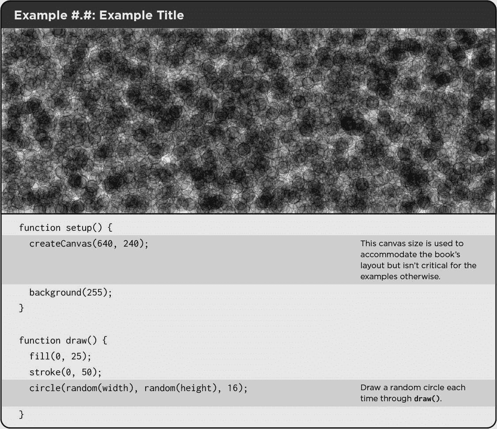
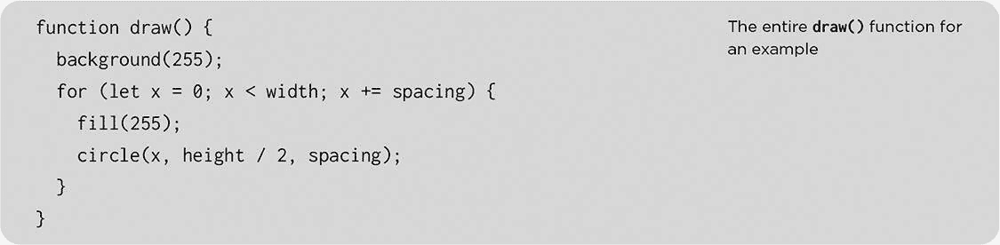
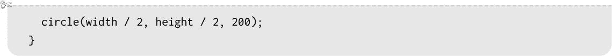
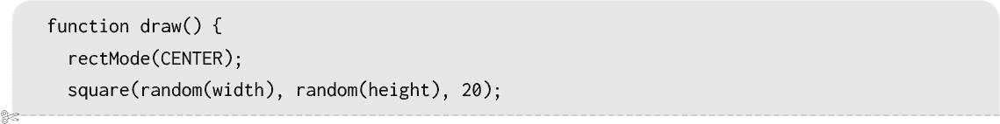

## **导言**

十多年前，我自费出版了*The Nature of Code*，一本在线资源和印刷书籍，通过创意编程框架 Processing 探讨软件中自然界的不可预测的进化和涌现特性。从那时起，技术和创意媒体的世界发生了翻天覆地的变化，简直可以说是本世纪的轻描淡写。现在，我再次带着这本书的新版本和重启版出现，这次围绕 JavaScript 和 p5.js 库构建。书中有一些新的编程技巧，但本质上还是那个熟悉的自然——鸟儿仍然拍打翅膀，苹果依旧会掉到我们的头上。

### **这本书是什么？**

在 ITP/IMA（纽约大学 Tisch 艺术学院），我自 2004 年起教授名为《计算媒体导论》的课程。这个课程的起源可以追溯到 1987 年，源自 Mike Mills 和 John Henry Thompson（Lingo 编程语言的发明者）的工作。在这门课程中，学生们学习编程基础（变量、条件语句、循环、对象、数组），以及与制作互动媒体项目相关的概念（像素、数据、声音、网络、3D 等）。2008 年，我将这些课程材料汇编成一本入门书籍《Learning Processing》，2015 年，我制作了一系列视频教程，内容与这本书相似，不过这次是在 JavaScript 和 p5.js 库下进行的。

一旦学生掌握了基础知识，并见识了各种应用，他们的下一步可能是深入研究某个特定领域。也许他们想专注于计算机视觉、数据可视化或生成诗歌。我的《Nature of Code》课程（自 2008 年起在 ITP/IMA 教授）代表了另一个可能的下一步。该课程正好接续了我的入门课程，展示了一系列集中于算法和仿真的编程技巧。你现在阅读的这本书正是从那门课程演变而来。

本书的目标很简单：我想探讨物理世界中自然发生的现象，并找出如何编写代码来模拟它们。

那么，这本书到底是什么？它是一本科学书籍吗？答案是否定的。确实，我可能会研究一些源自物理学或生物学的主题，但我不会以特别高的学术严谨度来探讨这些主题。相反，这本书是“受到实际事件的启发”。我会挑选科学和数学中需要的部分来构建自然的计算机软件解释，并根据需要偏离主题或跳过一些细节。

这是一本艺术或设计书吗？我也会说不是。尽管我的方式可能比较非正式，但我依然专注于算法及其相关的编程技术。没错，结果展示是可视的（以 p5.js 动画示例的形式呈现），但它们仅仅是算法和编程技术的字面可视化，全部用基本的图形和灰度色彩绘制。然而，我的希望是，你，亲爱的读者，能通过你的创意和视觉构思，利用这些示例创造出新的、引人入胜的作品。（如果你把每个示例都变成彩虹，我不会抱怨。）

归根结底，如果这本书有什么特点，那就是它是一本文法较为传统的编程教材。尽管某些科学话题（如牛顿物理学、细胞生长、进化）可能会为某一章节提供灵感，并且结果可能会启发艺术项目，但内容本身始终会归结为代码实现，特别侧重于面向对象编程。

### **关于 p5.js 的说明**

p5.js 库是对 Processing 创意编码环境在现代 Web 上的重新构想。我在这本书中使用它有几个原因。首先，它是我非常熟悉的环境。虽然最初基于 Java 的 Processing 是我的初恋，仍然是我尝试新想法时常用的工具，但 p5.js 是我现在用来教授许多编程课程的工具。它是免费的、开源的，并且非常适合初学者，且由于它是 JavaScript 编写的，所有内容都直接在 Web 浏览器中运行——无需安装。

然而，对我来说，Processing 和 p5.js 首先是一个由人组成的社区，而非编码库或框架。那些人无私地奉献了无数小时来制作和共享软件。我为这个社区，以及所有热衷于通过代码探索好奇心和玩乐的朋友们写了这本书。

话虽如此，本书的内容并不严格依赖于 p5.js——或者说 Processing。其实，这本书也可以用“原生” JavaScript 或 Java 编写，或者用任何其他开源创意编码环境，如 openFrameworks、Cinder 等。我的希望是，在完成这本书后，我能发布可以在其他环境中运行的示例版本。如果有人有兴趣帮助移植这些示例，欢迎通过电子邮件联系我，*邮箱：daniel@natureofcode.com*。来吧，你知道你想把*The Nature of Code* 移植到 PHP！

本书中的所有示例都已使用 p5.js 版本 1.9.0 进行过测试，但大部分示例应该也能在早期版本中运行。我会保持它们与最新版本同步更新。最新的代码始终可以在本书的网站上找到（* [`natureofcode.com`](https://natureofcode.com) *）以及其关联的 GitHub 仓库（* [`github.com/nature-of-code`](https://github.com/nature-of-code) *）。

### **你需要了解什么？**

理解本书内容的前提条件可以表述为：“学习过一学期的 p5.js、Processing 或任何其他创意编程环境的编程课程。” 也就是说，即便你用其他语言或开发环境学过编程，也完全可以阅读这本书。

如果你以前从未写过代码，虽然你可以通过这本书来学习概念和获得灵感，但你可能会在理解代码时遇到困难，因为我假设你已经掌握了基础知识：变量、条件语句、循环、函数、对象和数组。如果这些概念对你来说是新的，我的“Code! 使用 p5.js 编程”（* [`thecodingtrain.com/p5js`](https://thecodingtrain.com/p5js) *）和“学习 Processing”（* [`thecodingtrain.com/processing`](https://thecodingtrain.com/processing) *）视频课程提供了你需要了解的基础知识。

如果你是经验丰富的程序员，但没有使用过 p5.js，你可以通过查阅 p5.js 的文档（* [`p5js.org`](https://p5js.org) *），浏览示例，并阅读库的“入门”页面（* [`p5js.org/get-started`](https://p5js.org/get-started) *）来学习它。

我还应该指出，面向对象编程的经验非常关键。我将在第零章中回顾一些基础知识，但如果你对类和对象不熟悉，我建议观看我的 p5.js 和 Processing 面向对象编程的视频教程，这些教程也可以在 Coding Train 网站找到（* [`thecodingtrain.com/oop`](https://thecodingtrain.com/oop) *）。

### **你是怎么阅读这本书的？**

你是在 Kindle 上阅读这本书吗？打印版纸质书？在笔记本电脑上以 PDF 格式阅读？在平板电脑上观看 HTML5 动画版本？还是你被绑在椅子上，通过一系列电极、电缆和卡带将内容直接传输到大脑中？

我的梦想一直是将这本书写成一个统一的格式（在本例中是 Notion 文档集合），然后，在按下一个神奇的按钮（`npm run build`）后，书就能以你可能需要的任何格式输出——PDF、HTML5、打印版、Kindle 版等等。这在很大程度上得益于 Magic Book 项目（* [`github.com/magicbookproject`](https://github.com/magicbookproject) *），这是一个最初由 Rune Madsen 和 Steve Klise 在 ITP 开发的开源自出版框架。所有内容都使用 CSS 进行设计和排版——没有手动排版或布局。

编写这本书的过程并不像那么简单，背后的故事也很漫长。如果你有兴趣了解更多，记得阅读书中的致谢部分，然后去雇佣我感谢过的人，帮助你出版一本书！我还会在相关的 GitHub 仓库中提供更多细节（* [`github.com/nature-of-code`](https://github.com/nature-of-code) *）。

底线是，无论你以何种形式阅读，内容都是相同的。唯一的区别在于你体验代码示例的方式——更多内容请参见“如何阅读代码”一节，见第 xxxiii 页。

#### **The Coding Train 连接**

就个人而言，我仍然喜欢由纸浆精心拼装而成、坚韧脊背牢牢装订在一起的书籍，上面以色素化合物艺术性地传达文字和思想。然而，自 2012 年以来，当时我在 ITP 办公室里冲动地录制了我的第一节编程视频课后，我发现通过动态图像传递思想和课程具有巨大的价值和乐趣。

总之，我有一个名为 The Coding Train 的 YouTube 频道（*[`www.youtube.com/thecodingtrain`](https://www.youtube.com/thecodingtrain)*）。我在前面提到过它，用来讨论学习本书先决条件的选项，如果你继续阅读，你会发现我会不断引用相关的视频。我可能会提到我制作的关于某个相关算法或特定编程示例的替代技术的视频，或者推荐一个系列讲解与我正在探索的主题相关的旁支概念，提供额外的上下文。

如果你喜欢通过视频学习，我也在制作一套与本书内容完全相同的视频教程。我十年前用 Processing 制作了很多视频，最近我开始发布使用 p5.js 更新的系列教程。在撰写本文时，我大约完成了第五章。

#### **附加资源**

还有大量优秀的教育材料，讲解模拟和生成算法，这些我并没有编写或录制。我总是推荐你在尝试学习新知识时，探索不同的视角和声音。可能我所写的内容与你不太契合，甚至看到我在视频中重复同样的信息，也许无论我如何在镜头前做表情，效果都不大。有时最好的方式是找一个你能产生共鸣的人，用不同的语言、不同的风格来阐述或演示相同的概念。为此，我在本书网站上加入了一个“附加资源”部分。如果你创作了自己的材料或有任何推荐内容，希望能够纳入其中，请与我联系！

我现在有两个快速推荐，分别是由 Gary William Flake（麻省理工学院出版社，1998 年）所著的*《自然的计算美》*——这本书是我最初学习这本书中许多概念的来源——以及 Taru Muhonen 和 Raphaël de Courville 精心组织的在线资源*[That Creative Code Page](https://thatcreativecode.page)*。

### **这本书的“故事”**

如果你浏览一下本书的目录，你会注意到有 12 章（第 0 到第十一章！），每一章都涵盖了不同的主题。从某种意义上来说，这本书就是这样的——对一打概念和相关代码示例的概览。尽管如此，在编排这些材料时，我总是想象出一个线性的叙事结构。在你开始阅读之前，我想带你走一遍这个故事。

#### **第一部分：无生命物体**

一颗足球躺在草地上。一记踢击将它踢向空中。重力将它拉回地面。一阵强风让它在空中停留了片刻，直到它落下并弹跳到一个跳跃球员的头上。足球并不是活的；它不会自行选择如何在世界中运动。相反，它是一个没有生命的物体，等待着被环境的力量推拉。

你如何在数字画布上建模一个移动的足球？如果你曾编写过让圆形在屏幕上移动的程序，你可能写过以下这行代码：

```
x = x + 1;
```

你在位置`x`处绘制一个形状。在每一帧动画中，你增加`x`的值，重新绘制形状，哇——就创造出了运动的假象！也许你更进一步，增加了`y`位置，并为沿 x 轴和 y 轴的速度设置了变量：

```
x = x + xspeed;
y = y + yspeed;
```

本故事的第一部分将进一步拓展这个想法。在探索如何使用不同类型的随机性来驱动物体的运动（**第零章**）后，我将展示如何将这些`xspeed`和`yspeed`变量结合起来，并说明它们如何共同形成一个向量（**第一章**）。你不会从中获得任何新的功能，但它将为本书其余部分的运动编程奠定坚实的基础。

一旦你了解了有关向量的基本知识，你会很快意识到，力（**第二章**）是一个向量。踢足球时，你就在施加力。力会导致物体做什么呢？根据艾萨克·牛顿爵士的说法，力等于质量乘以加速度，因此力会使物体加速。建模力将使你能够创建具有动态运动的系统，其中物体根据多种规则移动。

现在，你施加了力的那颗足球可能也在旋转。如果一个物体根据其*线性*加速度运动，它也可以根据其*角加速度*旋转（**第三章**）。理解角度和三角学的基础知识将帮助你建模旋转物体，并理解诸如摆动的钟摆或弹跳的弹簧等振荡运动的原理。

一旦你掌握了单个无生命物体的运动和力学基础，我将向你展示如何制作成千上万的这些物体，并将它们作为一个单元进行管理，称之为*粒子系统*（**第四章**）。粒子系统也是一个很好的借口来研究面向对象编程的额外特性——即继承和多态。

#### **第二部分：它活了！**

模拟生命是什么意思？这个问题不容易回答，但我将从构建能够感知环境的物体开始。我们先想一想。一块从桌子上掉下来的木块是根据力的作用运动的，就像一只在水中游泳的海豚一样。但是有一个关键的区别：那块木块不能决定从桌子上跳下，而海豚可以决定跃出水面。海豚有梦想和欲望。它感到饥饿和恐惧，这些情感会影响它的运动。通过研究建模自主体的技术（**第五章**），你将学会为无生命的物体注入生命，让它们根据对环境的理解做出运动决策。

在第一章到第五章中，所有的示例将“从头开始”编写——意味着驱动物体运动的算法代码将直接用 p5.js 编写。我当然不是第一个考虑在动画中模拟物理和生命的程序员，因此接下来我将探讨如何使用物理库（**第六章**）来模拟更复杂的行为。我将介绍两个库的特点：Matter.js 和 Toxiclibs.js。

第五章的结尾将探讨表现复杂性特征的群体行为。复杂系统通常被定义为一个整体大于其部分之和的系统。虽然系统的各个元素可能非常简单并且容易理解，但整个系统的行为可能非常复杂、智能且难以预测。追求复杂性会使你不再仅仅考虑模拟运动，而是进入基于规则的系统领域。你可以用细胞自动机（**第七章**）来模拟什么？这些是生活在网格上的细胞系统。你可以用分形（**第八章**）——自然几何——生成什么样的模式？

#### **第三部分：智能**

你让事物开始运动。然后，你赋予这些事物希望、梦想和恐惧，并制定了生活规则。本书的最后一步将把智能决策引入到你的创作中。你能否将生物进化过程应用到计算系统中（**第九章**），从而让自主代理的行为进化？受到人类大脑启发，你能否编写人工神经网络（**第十章**）？代理如何做出决策、从错误中学习并适应环境（**第十一章**）？

### **使用本书作为大纲**

尽管本书的内容无疑会带来紧张且高度压缩的学期，但我已将其设计为适应 14 周的课程。我发现，有些章节在多周展开时效果更好，而其他章节可以合并在一周内一起探讨。这里是一个可能的大纲：

| 第 1 周 | 随机性与向量（第零章–1 章） |
| --- | --- |
| 第 2 周 | 力学（第二章） |
| 第 3 周 | 振荡（第三章） |
| 第 4 周 | 粒子系统（第四章） |
| 第 5 周 | 自主代理（第五章） |
| 第 6 周 | 物理学库（第六章） |
| 第 7 周 | 学期中期运动项目 |
| 第 8 周 | 复杂系统：二维元胞自动机与分形（第七章–8 章） |
| 第 9 周 | 遗传算法（第九章） |
| 第 10 周 | 神经网络与神经进化（第十章–11 章） |
| 第 11 周 | 最终项目讨论 |
| 第 12–13 周 | 最终项目研讨会 |
| 第 14 周 | 最终项目展示 |

如果你打算将此书用作课程或研讨会教材，欢迎随时与我联系。我希望最终能完成伴随视频集，并将有用的幻灯片作为补充教材。如果你自己制作了相关材料，也希望能听到你的反馈！

### **如何阅读代码**

代码是本书的主要媒介，它贯穿整个叙述并被剖析和检视。有时它以完整的独立示例出现，其他时候它作为一两行代码出现，往往它会通过许多简短的片段分布在整个章节中，解释也夹在其中。不管它以什么形式出现，代码总是以`等宽字体`展示。下面是关于如何阅读本书中不同类型代码的简要指南。

#### **完整示例**

每一章都包含了使用 p5.js 库编写的完整功能代码示例。它们的样子如下：



示例在每一章中按顺序编号，帮助你在线查找对应的代码。在书籍的打印版中，你会看到一个截图，位于示例标题正下方。在线版则直接在页面上嵌入了运行中的草图。对于动画示例（几乎所有示例都是），截图通常会展示“运动轨迹”。这一效果是通过在`background(255, 10)`函数中添加透明度来实现的，尽管随附的代码并未包括这一增强功能。

在示例下方，你会看到代码，但它不一定是*完整的*代码。由于许多示例相当长，并且涉及多个文件，我会尽量提供一个突出了示例的主要部分或本节中没有早先讨论过的新组件的片段。

你可以在本书的网站上找到完整版本的代码。在那里，你可以与代码互动、修改并在 p5.js Web 编辑器中进行实验 (*[`editor.p5js.org`](https://editor.p5js.org)*)。此外，所有内容都包含在本书的 GitHub 仓库中。以下是所有材料的链接：

+   本书的网站 (*[`natureofcode.com`](https://natureofcode.com)*) 包含了完整的书籍文本、额外的阅读材料和参考资料，以及所有代码示例。

+   GitHub 仓库 (*[`github.com/nature-of-code`](https://github.com/nature-of-code)*) 包含了本书网站的原始源代码、本书的构建过程以及所有代码示例。

+   除了网站和 GitHub 仓库，你还可以通过查看 p5.js 网页编辑器中的草图列表来访问代码 (*[`editor.p5js.org/natureofcode/sketches`](https://editor.p5js.org/natureofcode/sketches)*).

注意，我在示例中使用了注释来解释代码的作用。这些注释会漂浮在代码旁边（具体显示效果可能会因你阅读的方式不同而有所变化）。背景阴影将注释与其对应的代码行分组。

#### **完整代码片段**

尽管很少见，偶尔会有“完整”的代码部分与正文混合在一起。有时候，像前一节中的示例 Example #.#那样，我可能会列出与完整的 p5.js 草图相关的所有代码。然而，在大多数情况下，我认为“完整”的代码片段是指一个完整函数或类的代码——一个完整的代码块，包括了开头和结尾的花括号以及其中的所有内容。就像这样：



这个代码片段展示了整个`draw()`函数，但它仍然不是一个完整的草图。它假定存在一个名为`spacing`的全局变量，以及一个调用`createCanvas()`的`setup()`函数。

#### **无上下文代码**

偶尔，你会看到一些代码行出现在页面上，而没有被包含在任何函数或上下文中。这些代码片段是用来阐明某个观点的，不一定是要直接运行的。它们可能代表一个概念、一小段算法，或者一种编程技巧。


请注意，这个没有上下文的代码片段与前一个“完整”代码片段中的`fill(255)`保持了相同的缩进。当代码被确认为之前演示的一部分时，我会这样做。虽然这并不总是能做到如此干净或完美，但我尽力而为！

#### **代码片段**

留意剪刀图标！这个设计元素表示代码片段是前一部分的继续，或者会在一些解释性文字之后继续。有时它实际上并没有继续，而只是被截断，因为所有代码并不适合当前讨论。剪刀图标的作用是：“嘿，可能上面或下面还有更多代码，或者至少，这是某个更大部分的一部分！”这可能会在一些上下文的配合下体现出来。

构建 p5.js 草图的第一步是创建一个画布：


然后是时候绘制背景了：


我还喜欢在画布的中心添加一个圆圈：



在`draw()`中，我可能想要开始将方形放置在背景和固定圆圈上方的随机位置。其余的代码可以是任何你想要的内容！



请注意，我在保持缩进一致性，以帮助建立上下文，而且，我再次使用剪刀图标来标示代码是继续的部分或已被截断的部分。

使用代码片段的一个特定副作用是，你会经常发现某个代码片段中的左花括号，直到几个代码片段后才会有对应的右花括号（如果有的话）。如果你习惯了查看 JavaScript 代码，刚开始可能会让你有些惊慌，但希望你能逐渐习惯。

### **练习**

每一章都包含编号的练习，作为你的练习场地，让你应用、实验并超越本章中提供的概念和代码。以下是一个练习的样子：

 **练习 #.#**

尝试调整示例 #.#，使得每个圆圈具有随机大小：

```
function draw() {
  fill(0, 25);
  stroke(0, 50);
  circle(random(width), random(height), random(16, 64));
}
```

为了让你保持警觉，练习题有多种格式。有些提出了技术挑战，要求你编写特定算法的变体或解决某个特定问题。其他则是开放性问题，促使你进行创作和实验，按照自己的想法进行探索。有些包括代码片段，其中有空白部分，邀请你直接填写。不要犹豫，在这本书中写下、涂鸦或随意勾画！

#### **解决方案**

练习的解答可以在本书网站上找到。或者我应该说，我希望能够在本书网站上提供所有练习的解答。截至目前，只有少数解答可用，但希望等你读到这时，解答会有更多。如果你愿意贡献一个练习的解答，我很希望你能通过本书的 GitHub 仓库来提交！

#### **生态系统项目**

尽管我很想假装你可以通过蜷缩在舒适的椅子上阅读一些散文来学习一切，但要学会编程，你实际上必须动手编程。每章中散布的练习是一个起点，但你可能会发现，牢记一个更为实际的项目想法（或两个），并在每一章的学习过程中逐步开发它，会对你有所帮助。事实上，当我在 ITP 教授《代码的本质》课程时，我发现学生们喜欢在一个学期中，逐步地、每周地构建一个项目。

在每一章的末尾，你会看到一系列针对这样一个项目的提示——这些练习是相互关联的，每次只涉及一个主题。这个项目基于以下情境：你受到了一个科学博物馆的委托，开发一个新的展览的软件，*数字生态系统*，这是一个充满动画的、程序生成的生物世界，它们生活在一个计算机仿真中，供游客在进入博物馆时欣赏。我并不是要暗示这是一个特别创新或有创意的概念。相反，我将使用这个生态系统项目的例子，作为本书内容的字面表现，展示这些元素如何在一个程序中结合在一起。我鼓励你开发自己的想法，可能是更抽象、更非传统的。

### **获取帮助与提交反馈**

编程可能既艰难又令人沮丧，本书中的一些想法也不总是直接明了的。你不必独自一人走这条路。现在可能有人正在阅读本书，他们也希望共同组织一个学习小组或书友会，在那里你们可以见面、聊天，并分享各自的困难与成功。如果你找不到一个本地社区一起走这段旅程，如何考虑一个在线社区呢？我建议的两个地方是官方的 Processing 论坛 (*[`discourse.processing.org`](https://discourse.processing.org)*) 和 Coding Train 的 Discord 服务器 (*[`thecodingtrain.com/discord`](https://thecodingtrain.com/discord)*)。

我认为本书的在线版本是一本活文档，欢迎您的反馈。有关本书的所有信息，请访问《代码的本质》网站 (*[`natureofcode.com`](https://natureofcode.com)*)。本书的原始文本和所有插图都可以在 GitHub 上找到 (*[`github.com/nature-of-code`](https://github.com/nature-of-code)*)。请通过 GitHub issues (*[`github.com/nature-of-code/noc-book-2/issues`](https://github.com/nature-of-code/noc-book-2/issues)*) 提交反馈和修改意见。

更重要的是，我想看到你创造的东西！你可以通过将你的想法提交到 Coding Train 网站上的乘客展示区 (*[`thecodingtrain.com/showcase`](https://thecodingtrain.com/showcase)*) 或者在前面提到的 Discord 频道中分享。YouTube 评论中的问候也始终欢迎（尽管说实话，最好还是不要读 YouTube 的评论），而且随时可以在任何社交媒体平台上@我——无论哪个平台最友好、最少毒性！我想享受你们生态系统中所有的小失误。无论它们是自豪地跃过创意的波浪，还是在学习的池塘中溅起一丝涟漪，让我们一起享受它们在编程本质中激起的涟漪！
