## **0 随机性**

*随机数的生成太重要了，不能交给运气。*

—罗伯特·R·科维尤

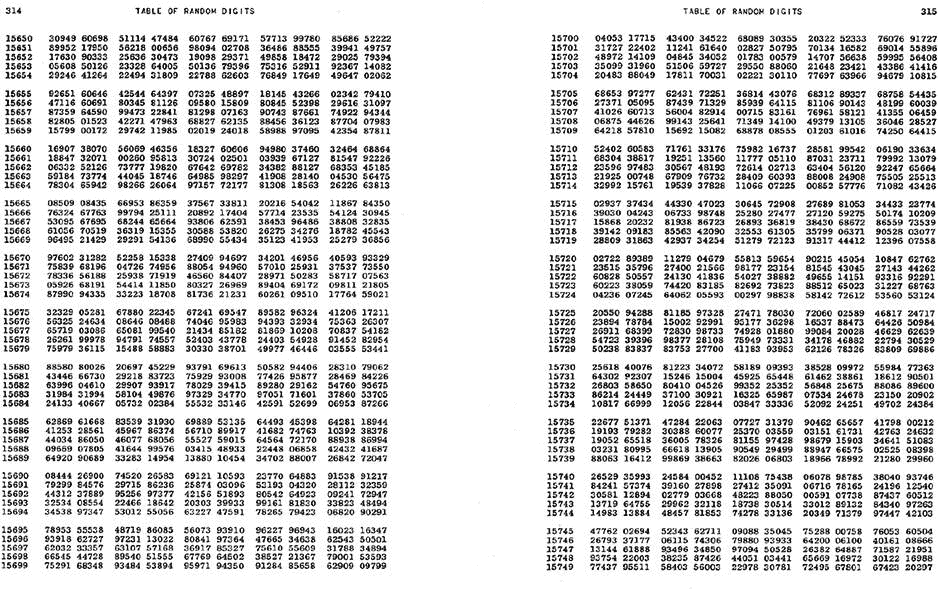

**《百万随机数字与 100,000 个正态偏差》中的随机数字表，由兰德公司提供**

1947 年，兰德公司出版了一本名为*《百万随机数字与 100,000 个正态偏差》*的奇特书籍。这本书不是一部文学作品，也不是关于随机性的哲学论文。而是一本包含随机数字的表格，这些数字是通过电子模拟的轮盘赌产生的。这本书是从 20 世纪 20 年代中期到 50 年代，兰德公司出版的最后一部随机数字表之一。随着高速计算机的发展，生成伪随机数字比从表格中读取它们更快，因此这时代的打印随机数字表最终也走向了终结。

现在我们在这里：起点。如果你有一段时间没有编写 JavaScript 代码（或者做任何数学运算），这一章将帮助你重新熟悉计算思维。为了开始你的自然编程之旅，我将向你介绍一些编程模拟的基础工具：随机数、随机分布和噪声。把这看作是组成本书的数组中的第一个（零）元素——一个复习和通往未来可能性的门户。

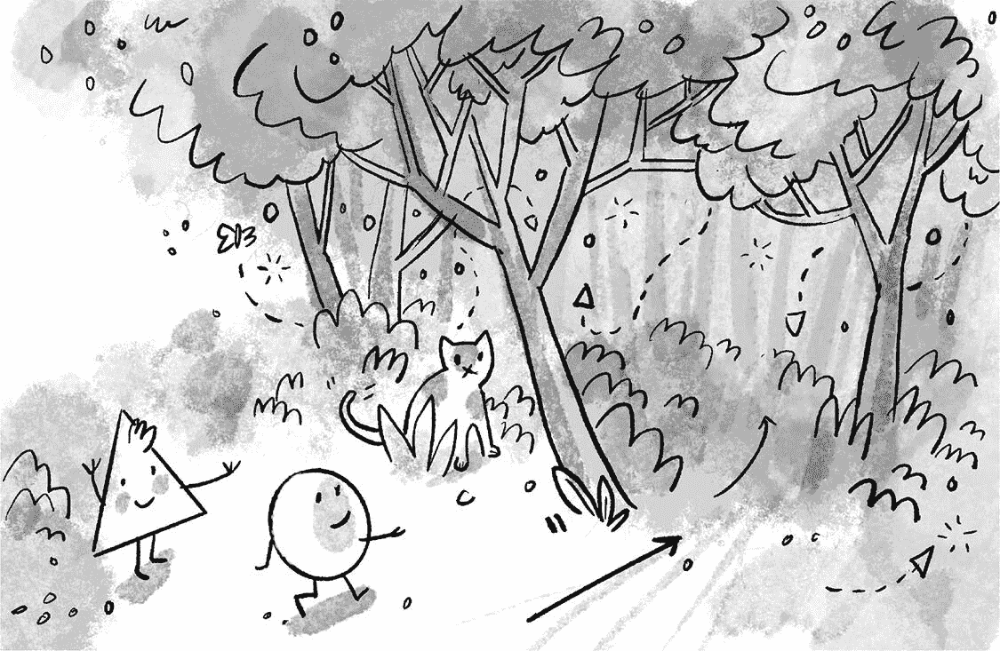

在第一章中，我将讨论向量的概念，以及它如何成为本书中模拟运动的构建块。但在我迈出这一步之前，让我们先思考一下让某物在数字画布上移动意味着什么。我将从最著名且最简单的运动模拟之一开始：随机漫步。

### **随机漫步**

想象一下，你站在一根平衡木的中央。每隔 10 秒钟，你就抛一次硬币。正面，向前迈一步。反面，向后退一步。这就是**随机漫步**，一条由一系列随机步骤定义的路径。小心地从平衡木上走到地面上，你可以将你的随机漫步从一维（仅向前和向后移动）扩展到二维（向前、向后、向左、向右移动）。现在有了四种可能性，你需要抛两次硬币来确定每一步。

| **投掷 1** | **投掷 2** | **结果** |
| --- | --- | --- |
| 正面 | 正面 | 向前迈步。 |
| 正面 | 反面 | 向右迈步。 |
| 反面 | 正面 | 向左迈步。 |
| 反面 | 反面 | 向后退步。 |

这可能看起来是一个简单的算法，但你可以使用随机漫步来模拟现实世界中发生的各种现象，从气体中分子运动，到动物觅食，再到赌徒在赌场度过的一天。对于我们的目的来说，随机漫步是一个完美的起点，原因有三：

+   我想回顾一下本书的核心编程概念：面向对象编程（OOP）。我即将创建的随机行走者将作为使用面向对象设计在计算机图形画布上制作移动对象的模板。

+   随机游走引出了我将在本书中反复提问的两个问题：“如何定义支配对象行为的规则？”然后是，“如何在代码中实现这些规则？”

+   本书的项目中，您将定期需要了解基本的随机性、概率和 Perlin 噪声。随机游走将帮助我展示一些关键点，这些点稍后会派上用场。

我将通过编写一个`Walker`类来回顾一下面向对象编程（OOP），创建可以进行随机行走的`Walker`对象。这将只是一个简要回顾。如果你以前没有使用过 OOP，你可能需要更全面的讲解；我建议你停下来，查看我的“Code! Programming with p5.js”视频课程中的“对象”章节，网址是(*[`thecodingtrain.com/objects`](https://thecodingtrain.com/objects)*)。

### **随机行走者类**

在 JavaScript 中，**对象**是一个具有数据和功能的实体。在这个例子中，`Walker`对象应该包含关于其在画布上位置的数据和一些功能，比如能够绘制自己或执行一步。

**类**是构建实际对象实例的模板。可以把类想象成饼干模具，而对象则是实际的饼干。为了创建一个`Walker`对象，我将首先定义`Walker`类——即什么是一个行走者。

一个行走者只需要两块数据：一个是它的 x 坐标，另一个是它的 y 坐标。我将把它们初始化为画布的中心，设置对象的起始位置。我可以在类的**构造函数**中完成这项工作，构造函数的名称是`constructor()`。你可以将构造函数看作对象的`setup()`函数。它负责定义对象的初始属性，类似于`setup()`函数为整个草图所做的工作：

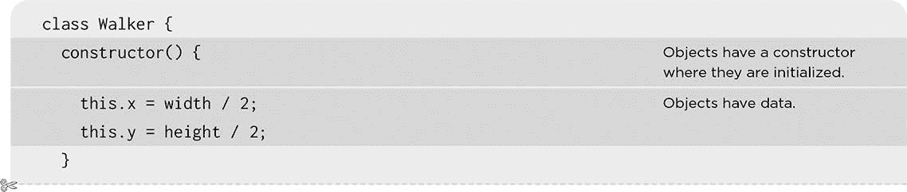

注意使用关键字`this`来将属性附加到新创建的对象本身：`this.x`和`this.y`。

除了数据，类还可以定义功能。在这个例子中，`Walker`对象有两个函数，在面向对象编程（OOP）中称为**方法**。虽然方法本质上是函数，但区别在于方法是在类内部定义的，因此与对象或类相关联，而函数则不是。`function`关键字是一个很好的线索：当定义独立的函数时，你会看到它，但在类内部不会出现它。我会尽力在本书中始终如一地使用术语，但程序员常常将*函数*和*方法*交替使用。

第一个方法，`show()`，包含了绘制对象（作为一个黑点）的代码。再次强调，引用该对象的属性（变量）时，切记使用`this.`：

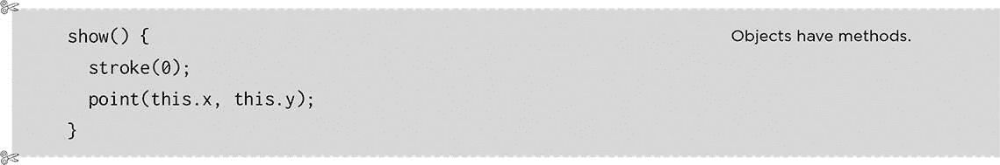

接下来的方法，`step()`，指示 `Walker` 对象迈出一步。这时事情就变得更加有趣了。记得在地板上随机走步吗？现在我会使用 p5.js 画布来表示这个地板。有四个可能的步伐。向右走可以通过增加 `x` 来模拟，即 `x++`；向左走通过减少 `x` 来模拟，即 `x--`；向前走是通过上移一个像素（`y--`）；向后走是通过下移一个像素（`y++`）。但是，代码如何从这四个选择中做出选择呢？

之前我提到过，你可以抛两枚硬币。然而，在 p5.js 中，当你想从一组选项中随机选择时，你可以简单地使用`random()`函数生成一个随机数。它会在你指定的任何范围内生成一个随机的浮动小数值。这里，我使用 4 来表示从 0 到 4 的范围：

```
let choice = floor(random(4));
```

我声明了一个变量 `choice`，并通过使用 `floor()` 函数去除随机浮动小数中的小数部分，来为它赋一个随机整数（整数）。从技术上讲，`random(4)` 生成的数值在 0（包含）到 4（不包含）之间，这意味着它永远不可能是 4.0。它生成的最大值为接近 4 的数——3.999999999（后面跟着尽可能多的 9，直到 JavaScript 所允许的精度），然后 `floor()` 将其舍去小数部分，变成 3。因此，我实际上已经将 `choice` 赋值为 0、1、2 或 3。

 **编码约定**

在 JavaScript 中，变量可以使用 `let` 或 `const` 来声明。一种典型的方法是，首先使用 `const` 声明所有变量，并在需要时切换为 `let`。在这个例子中，使用 `const` 声明 `choice` 是合适的，因为它在每次调用 `step()` 时从未被重新赋值。虽然这种区分很重要，但我选择遵循 p5.js 的示例约定，所有变量都使用 `let` 来声明。

我认识到 JavaScript 中有 `const` 和 `let` 这两个关键字是有重要原因的。然而，这种区别可能会让初学者感到困惑并分散注意力。我鼓励你深入探讨这个话题，并自行决定如何在自己的草图中声明变量。更多信息，请阅读 p5.js GitHub 仓库中关于问题 #3877 的讨论 (*[`github.com/processing/p5.js/issues/3877`](https://github.com/processing/p5.js/issues/3877)*)。

我还选择使用 JavaScript 的严格相等（`===`）运算符（以及其不等于的对立运算符`!==`）。这个布尔运算符会测试值和类型的相等性。例如，`3 === '3'`将返回`false`，因为两者类型不同（数字与字符串），即使它们看起来相似。另一方面，使用宽松相等（`==`）运算符时，`3 == '3'`会返回`true`，因为这两种不同类型会被转换成可比较的类型。虽然宽松比较通常能正常工作，但有时会导致意外的结果，因此`===`可能是更安全的选择。

接下来，行走者根据选择的随机数，采取适当的步伐（向左、向右、向上或向下）。下面是完整的`step()`方法，结束了`Walker`类的定义：

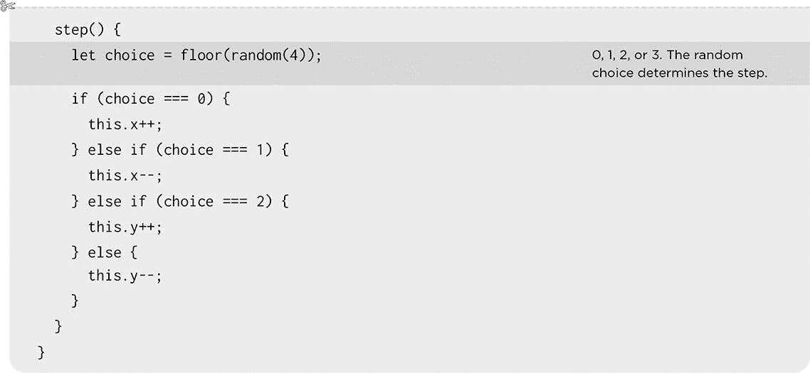

现在我已经编写了类，接下来是时候在草图中实际创建一个`Walker`对象了。假设你想要模拟一个单一的随机行走，从一个全局变量开始：

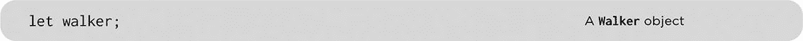

然后在`setup()`中通过`new`操作符引用类名来创建对象：

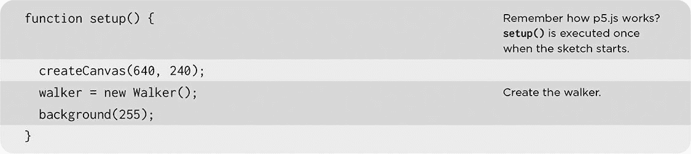

最后，在每次通过`draw()`时，行走者会迈出一步并画出一个点。

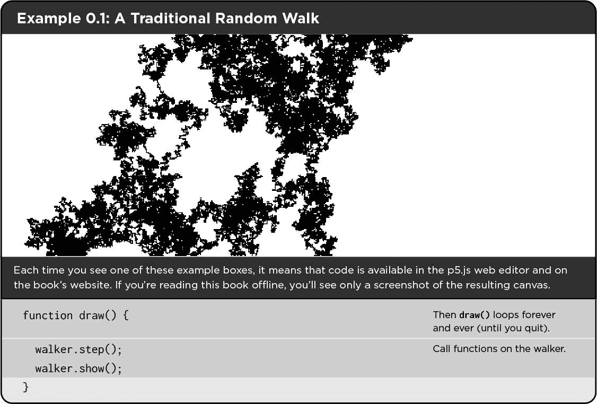

由于背景只在`setup()`中绘制，而不是在每次通过`draw()`时都清除，所以随机行走的轨迹在画布上可见。

我可以对随机行走者做几个调整。首先，这个`Walker`对象的步伐被限制为四个选项：上、下、左、右。但画布上的任何给定像素都有八个可能的邻居，包括对角线（见图 0.1）。第九个可能性是保持在同一位置。

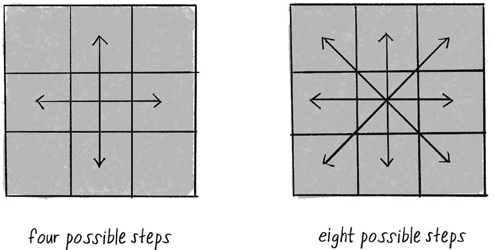

图 0.1：随机行走者的步伐，包含与不包含对角线的情况

为了实现一个可以步进到任何邻近像素（或保持原地）的`Walker`对象，我可以从 0 到 8 中随机选择一个数字（九个可能的选择）。不过，另一种编写代码的方式是，从 x 轴的三个可能步伐（–1、0 或 1）和 y 轴的三个可能步伐中选择一个：

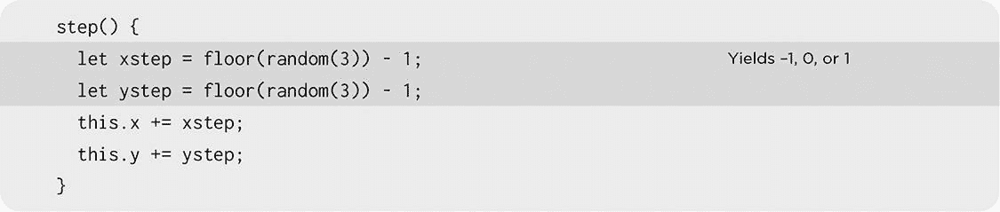

更进一步，我可以去掉`floor()`，使用`random()`函数的原始浮点数，创建从 –1 到 1 的连续范围的可能步长，如下所示。


所有这些对传统随机行走的变种有一个共同点：在任何时刻，行走者采取某一方向的步伐的概率与行走者采取任何其他方向的步伐的概率是相等的。换句话说，如果有四个可能的步伐，那么行走者采取某一特定步伐的概率是 1/4（即 25%）。如果有九个可能的步伐，那么概率是 1/9（大约 11.1%）。

方便的是，这就是`random()`函数的工作方式。p5.js 的随机数生成器（在后台运行）产生**均匀分布**的数字。你可以通过统计每次随机数被选中时的次数并将这些值绘制成图来测试这种分布。


请注意，图表的每个柱子在高度上略有不同。样本量（随机数的选择次数）较小，因此偶尔会出现差异，因为某些数字被选中的频率高于其他数字。随着时间的推移，使用良好的随机数生成器，这种分布会趋于平衡。

 **伪随机数**

`random()`函数生成的随机数并不是真正的随机数；相反，它们是**伪随机**的，因为它们是数学函数的结果，模拟了随机性。这个函数随着时间推移会产生一个模式，从而不再看起来是随机的。然而，这段时间非常长，以至于`random()`对于本书中的示例来说足够随机。

 **练习 0.1**

创建一个随机行走者，它更倾向于向下和向右移动。（解决方案将在下一节提供。）

### **概率与非均匀分布**

均匀的随机性往往不是设计问题的最周到解决方案——特别是那些涉及构建有机或自然外观模拟的问题。然而，使用一些技巧，`random()`函数可以生成**非均匀分布**的随机数，其中某些结果比其他结果更有可能出现。这种类型的分布能够产生更有趣、更自然的结果。

想想你第一次使用 p5.js 编程时。也许你想在屏幕上画很多圆形，于是你对自己说：“哦，我知道了！我会随机选择位置、大小和颜色来画这些圆形。”将随机性引入系统是学习计算机图形学基础时一个完全合理的起点，但在本书中，我希望建立模拟自然界的系统，均匀的随机性并不总是足够的。有时候，你得稍微“加点偏”。

创建一个非均匀分布的随机数在全书中都会非常有用。例如，在第九章的遗传算法中，我需要一种执行选择的方法——哪些个体应该被选中，将它们的 DNA 传递给下一代？这类似于达尔文的“适者生存”概念。假设你有一个不断演化的猴子种群，并不是每只猴子都有相等的繁殖机会。为了模拟达尔文的自然选择，你不能仅仅随机挑选两只猴子作为父母。更“适应”的个体应该更有可能被选中。这可以视为*最适者的概率*。

让我在这里暂停一下，看看概率的基本原理，这样我就能对接下来的编码示例使用更准确的词汇。我将从**单事件概率**开始——某个事件发生的可能性。在概率论中，**结果**指的是随机过程的所有可能结果，而**事件**是指被考虑的特定结果或结果组合。

如果你有一个每个结果都和其他结果一样可能发生的场景，那么某个事件发生的概率等于匹配该事件的结果数除以所有潜在结果的总数。硬币投掷是一个简单的例子：它只有两个可能的结果，正面或反面。正面只有一个，因此硬币正面朝上的概率是 1 除以 2：1/2，或者 50%。

拿一副 52 张牌的牌堆。从这副牌中抽到一张王牌的概率如下：

王牌的数量 / 牌的数量 = 4/52 = 0.077 ≈ 8%

抽到方块的概率在这里显示：

方块的数量 / 牌的数量 = 13/52 = 0.25 = 25%

你还可以通过将每个事件的个别概率相乘来计算多个事件按顺序发生的概率。例如，以下是硬币连续三次正面朝上的概率：

(1/2) × (1/2) × (1/2) = 1/8 = 0.125 = 12.5%

这表明硬币连续三次正面朝上的平均概率是八分之一。如果你连续三次投掷硬币 500 次，你会预期大约八分之一的时间，或者大约 63 次，出现三次连续正面。

 **练习 0.2**

如果你从一副 52 张牌的牌堆中连续抽两张王牌，而在第二次抽牌前将第一次抽到的牌放回去，抽到两张王牌的概率是多少？如果你在第一次抽牌后不将牌放回去，那么这个概率是多少？

你可以通过几种方式使用`random()`函数，在代码中应用概率的概念来实现不均匀分布。一种方法是用数字填充一个数组，其中一些数字是重复的，然后从这个数组中选择随机元素，并根据这些选择生成事件：

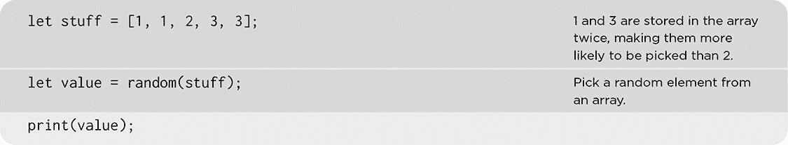

这个五元素数组有两个 1，所以运行这段代码将产生五分之二的机会，或者 40%的机会打印值为 1。同样，打印 2 的概率为 20%，打印 3 的概率为 40%。

你也可以请求一个随机数（我们简单起见，只考虑 0 到 1 之间的随机浮点值），并仅当随机数在某个范围内时才允许事件发生。例如：

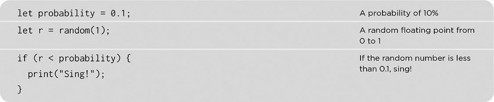

从 0 到 1 的浮点数中有十分之一小于 0.1，所以这段代码只会有 10%的概率会唱歌。

你可以使用相同的方法为多个结果应用不等的权重。假设你想让唱歌的概率是 60%；跳舞的概率是 10%；睡觉的概率是 30%。同样，你可以从 0 到 1 之间选择一个随机数，看看它落在哪个区间：

+   从 0.0 到 0.6（60%）→ 唱歌

+   从 0.6 到 0.7（10%）→ 跳舞

+   从 0.7 到 1.0（30%）→ 睡觉

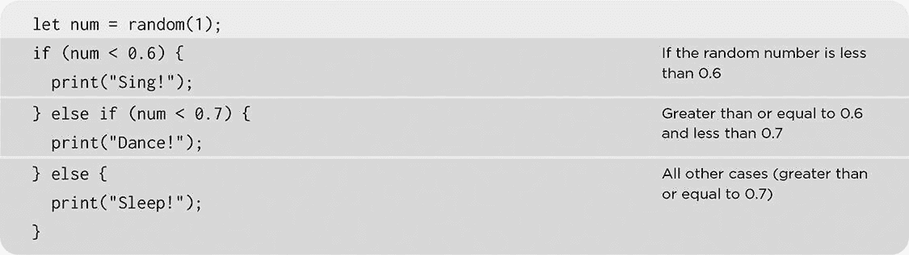

现在让我们将这种方法应用到随机漫步者上，让它倾向于朝某个特定方向移动。下面是一个`Walker`对象的示例，它具有以下概率：

+   向上移动的概率：20%

+   向下移动的概率：20%

+   向左移动的概率：20%

+   向右移动的概率：40%

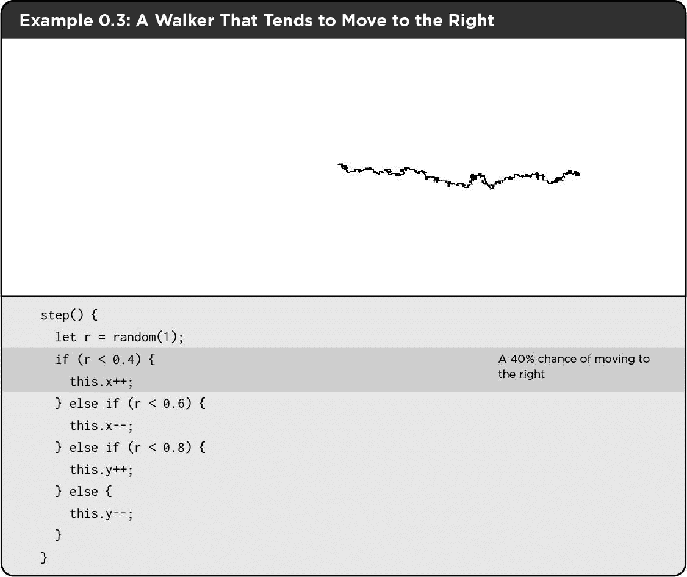

这种技术的另一个常见用途是控制你希望在代码中偶尔发生的事件的概率。例如，假设你创建了一个草图，每隔固定的时间间隔（每 100 帧）启动一个新的随机漫步者。使用`random()`，你可以将一个新的漫步者的启动概率设为 1%。最终结果是相同的（平均每 100 帧启动一个新的漫步者），但后者引入了随机性，感觉更动态和不可预测。

 **练习 0.3**

创建一个具有动态概率的随机漫步者。例如，你能否让它有 50%的机会朝鼠标的方向移动？记住，你可以使用`mouseX`和`mouseY`来获取当前鼠标的位置，p5.js 中就是这样！

### **随机数的正态分布**

创建非均匀分布的随机数的另一种方式是使用**正态分布**，其中数字会围绕平均值聚集。为了理解为什么这有用，让我们回到模拟猴子的人群，并假设你的草图生成了 1000 个`Monkey`对象，每个对象都有一个随机的身高值在 200 到 300 之间（因为这是一个身高为 200 到 300 像素的猴子世界）：

```
let h = random(200, 300);
```

这是创建猴子身高人群的准确算法吗？想象一下纽约市繁忙的街道。随便挑一个路人，他们的身高可能看起来是随机的。然而，这并不是`random()`默认生成的那种随机。人的身高分布并不是均匀的；大约身高平均的人远多于非常高或非常矮的人。为了准确反映这种人群，接近**均值**（即*平均值*）的身高应该更有可能被选择，而极端身高（非常矮或非常高）则应更少见。

这正是正态分布（有时称为高斯分布，源自数学家卡尔·弗里德里希·高斯）的工作原理。该分布的图形非正式地被称为**钟形曲线**。该曲线由一个数学函数生成，该函数定义了某个给定值出现的概率，这个概率是均值（通常写作µ，希腊字母 mu）和标准差（σ，希腊字母 sigma）的函数。

如果考虑身高值在 200 到 300 之间，你可能已经直观地知道均值（平均值）大约是 250。但是，如果我告诉你标准差是 3？或者是 15？这对数据意味着什么？图 0.2 给出的图表应该能给你一些提示。

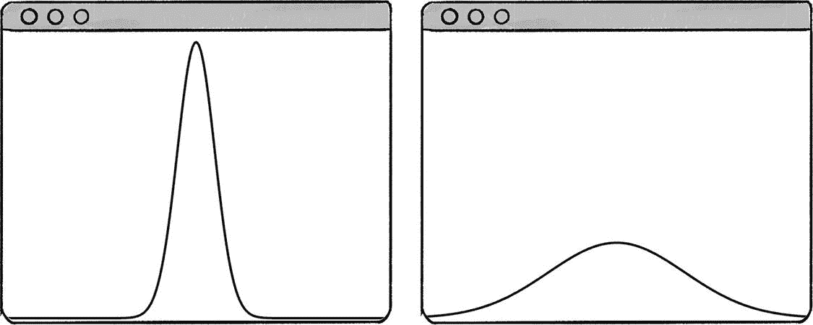

图 0.2：正态分布的两个示例钟形曲线，分别具有低（左）和高（右）标准差

左侧是一个标准差非常低的分布，绝大多数值都集中在均值附近（它们与标准差的偏差很小）。右侧的版本有更高的标准差，因此值更加均匀地分布在均值周围（它们的偏差较大）。

数字的计算结果如下：假设一个群体，其中 68%的成员的值位于均值的一个标准差范围内，95%的值位于两个标准差范围内，99.7%的值位于三个标准差范围内。假设标准差为 5 像素，那么只有 0.3%的猴子身高会低于 235 像素（低于均值 250 的三个标准差）或高于 265 像素（高于均值 250 的三个标准差）。同时，68%的猴子身高会在 245 到 255 像素之间。

幸运的是，在 p5.js 草图中使用正态分布的随机数时，你无需手动进行这些计算。相反，`randomGaussian()` 函数会处理这些数学运算，并返回具有正态分布的随机数：

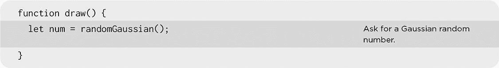

 **计算均值和标准差**

假设有一个包含 10 个学生的班级，他们在一次考试中的成绩（满分 100）如下：85、82、88、86、85、93、98、40、73 和 83。

均值是平均数：81.3。

标准差的计算方法是对偏差平方的平均值开方。换句话说，取均值与每个人成绩之间的差值，并对其进行平方，得到该人的平方偏差。接下来，计算所有这些值的平均值以获得平均方差。然后，对平均方差开方，你就得到了标准差。

| **分数** | **与均值的差异** | **方差** |
| --- | --- | --- |
| 85 | 85 − 81.3 = 3.7 | (3.7)² = 13.69 |
| 40 | 40 - 81.3 = -41.3 | (-41.3)² = 1,705.69 |
| . . . |  |  |
|  | **平均方差：** | 228.21 |

标准差是方差的平方根：15.13。

接下来该做什么？例如，目标是为绘制的形状分配 x 位置，应该怎么办？

默认情况下，`randomGaussian()`函数返回一个正态分布的随机正负数，均值为 0，标准差为 1。这也被称为**标准正态分布**。然而，通常这些默认参数无法满足需求。例如，假设你希望使用均值为 320（宽度为 640 的窗口中的中心水平像素）和标准差为 60 像素的正态分布来随机分配一个形状的 x 位置。在这种情况下，你可以通过传递`randomGaussian()`函数两个参数来调整参数：均值和标准差。

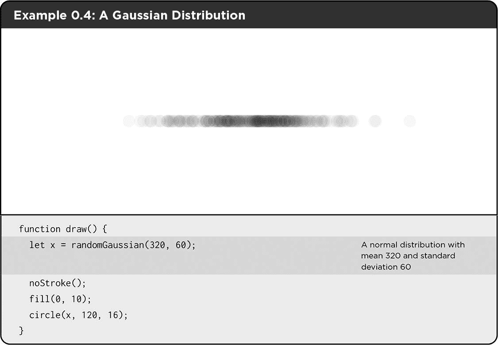

这里我使用了参数来定制对`randomGaussian()`的调用，但请注意，实现这一定制的数学原理非常简单：你所需要做的就是将标准正态分布的值乘以标准差，然后加上均值。换句话说，将`x`赋值为`randomGaussian(320, 60)`与以下操作是等价的：

```
let x = 60 * randomGaussian() + 320;
```

通过将圆圈以透明度叠加在一起，你可以开始看到分布情况。最暗的区域位于中心，那里大多数值聚集，但偶尔会有圆圈绘制在中心的左右更远位置。

 **练习 0.4**

考虑一个模拟的油漆飞溅效果，表现为一系列彩色的点。大多数油漆聚集在中心位置，但有些点会向边缘飞溅。你能使用正态分布的随机数来生成这些点的位置吗？你能否也使用正态分布的随机数来生成颜色调色板？尝试创建一个滑块来调整标准差。

 **练习 0.5**

高斯随机漫步是指其中步长（对象在给定方向上移动的距离）是通过正态分布生成的。实现这种`Walker`类的变体。

### **自定义的随机数分布**

在你的人生中，会有某个时刻你不希望使用均匀分布的随机值，甚至也不希望使用高斯分布。假设一下，你是一个在寻找食物的随机漫步者。在空间中随机移动似乎是寻找食物的合理策略。毕竟，你并不知道食物在哪，所以你不如随机寻找，直到找到它。然而，问题是，正如你可能在观察你的`Walker`对象的行动时注意到的，随机漫步者会多次返回之前访问过的位置，这种现象被称为**过度采样**。这可能导致你的寻找食物的过程毫无成果，或者至少低效。

避免此类问题的一种策略是每隔一段时间迈出一个非常大的步伐。这样，步态者可以在特定位置附近随机游走，同时偶尔跳得很远，以减少过度采样。这种随机漫步的变体，称为**Lévy 飞行**，需要一组自定义的概率。虽然这并不是 Lévy 飞行的精确实现，但你可以这样表示概率分布：步伐越长，被选中的可能性越小；步伐越短，被选中的可能性越大。

之前我写过，你可以通过填充一个数组来生成自定义概率分布（其中一些值会重复，以便更频繁地被选中），或者通过测试`random()`的结果来实现。一种实现 Lévy 飞行的方法可能是指定 1%的机会让步态者迈出一大步：

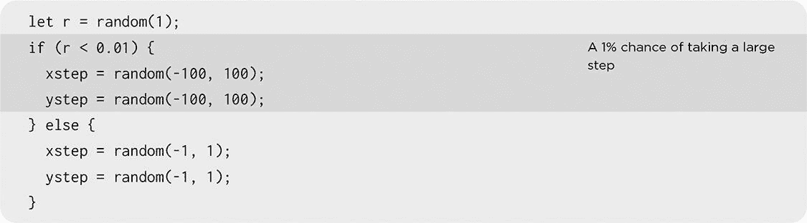

然而，这会将概率限制为固定的选项数量：99%的时间，小步前进；1%的时间，大步前进。如果你想制定一个更通用的规则呢？比如数字越大，被选中的可能性越大。例如，0.8791 比 0.8532 更可能被选中，即使这种可能性只是略微更高。换句话说，如果*x*是随机数，它被选中的可能性可以通过函数*y* = *x*映射到 y 轴上（见图 0.3）。

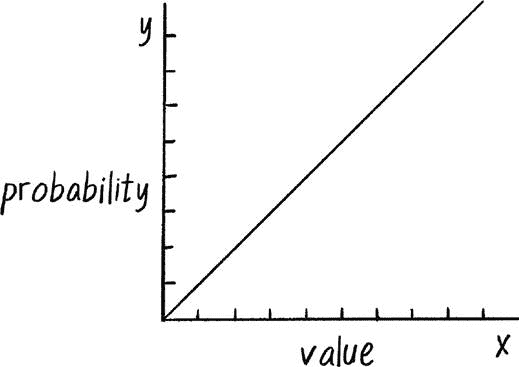

图 0.3：*y* = *x*的图形，其中*y*是值*x*被选中的概率

如果可以根据图 0.3 中的图形生成随机数分布，那么你也应该能够生成一个符合任何你用公式定义的曲线的随机分布。

自定义分布的一种解决方案是选择两个随机数而不是一个。第一个随机数就是一个随机数。而第二个随机数，我称之为**合格随机值**。该值由程序用来决定是否使用第一个数，还是丢弃它并选择另一个。那些更容易合格的数字会更频繁地被选中，而那些很少合格的数字则会很少被选中。以下是步骤（暂时我只考虑从 0 到 1 的随机值）：

1.  选择一个随机数：`r1`。

1.  计算概率`p`，让`r1`符合的概率。我们试试：`p = r1`。

1.  再挑一个随机数：`r2`。

1.  如果`r2`小于`p`，那么你已经找到了你的数字：`r1`！

1.  如果`r2`不小于`p`，返回第 1 步重新开始。

在这里，一个随机值符合的概率等于该随机数本身，就像你在图 0.3 中看到的那样。例如，如果`r1`等于 0.1，那么`r1`有 10%的机会符合。如果`r1`等于 0.83，它有 83%的机会符合。数字越大，被选中的概率越高。

这个过程被称为**接受-拒绝算法**，是一种蒙特卡洛方法（以蒙特卡洛赌场命名）。以下示例展示了一个实现接受-拒绝算法的函数，返回一个介于 0 和 1 之间的随机值。

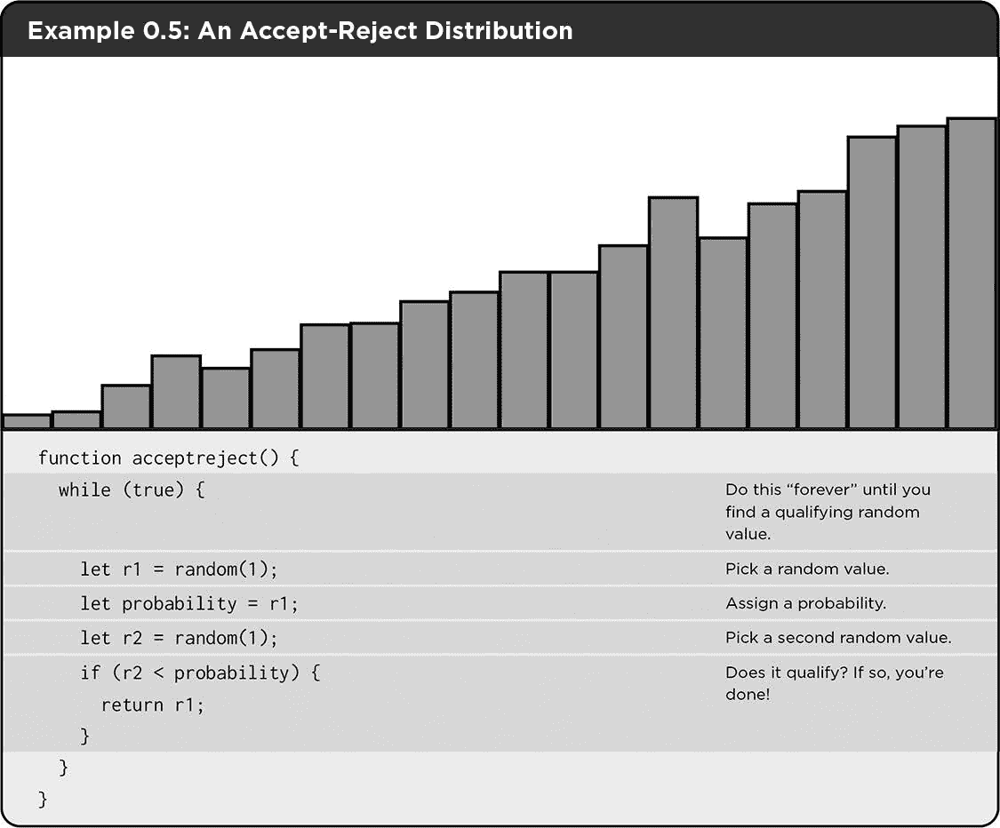

尽管接受-拒绝算法确实能用来生成自定义的随机数分布，但这种技术效率不高。当大量随机值被拒绝时，尤其是在合格概率非常低的情况下，可能会浪费大量计算资源。到我在第九章讲解遗传算法时，我将采取一种不同且更优的方式。

 **练习 0.6**

使用自定义的概率分布来改变随机游走者步伐的大小。步伐的大小可以通过影响所选随机值的范围来确定。你能通过将选中某个值的可能性设为该值的平方，来将概率映射到一个二次函数吗？

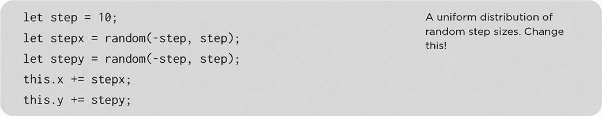

（在第一章中，我将展示如何使用向量更高效地改变步伐大小。）

### **使用 Perlin 噪声的更平滑方法**

一个好的随机数生成器应当生成彼此之间没有关系且无明显模式的数字。然而，正如我所暗示的，虽然在编程模拟自然、有生命的行为时，适度的随机性是有益的，但单纯以均匀随机作为唯一指导原则并不一定符合自然规律。一个叫做**Perlin 噪声**的算法，正是考虑到这一点，它生成一系列自然排序的伪随机数，其中每个数值都与前一个数值非常接近。这种方式在随机数之间创建了“平滑”的过渡，且比纯噪声呈现出更自然的外观，因此，Perlin 噪声非常适合用于生成具有自然特性的各种效果，如云彩、景观和大理石等纹理图案。

为了说明 Perlin 噪声与均匀随机之间的差异，考虑图 0.4。左侧的图展示了 Perlin 噪声随时间变化的情况，x 轴表示时间；注意曲线的平滑性。右侧的图则展示了纯随机数形式的噪声随时间变化的情况，结果明显更加崎岖不平。（生成这些图的代码可以在本书网站上找到。）

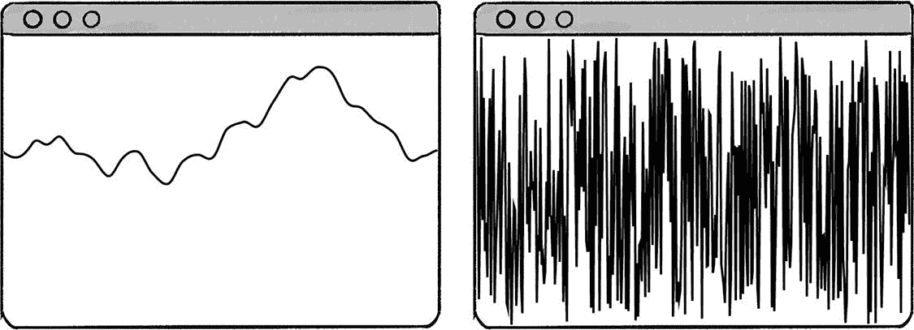

图 0.4：Perlin 噪声值随时间变化的图（左）和随机噪声值随时间变化的图（右）

Ken Perlin 在 1980 年代初期为电影 *Tron* 工作时开发了最初的 Perlin 噪声算法；他因这项工作获得了技术成就的奥斯卡奖。该算法旨在为计算机生成的特效创建程序化纹理。（*程序化*指的是通过算法生成视觉元素，而不是艺术家手工设计它们。）多年来，许多不同的噪声变种由不同的作者开发出来。一些著名的变种包括值噪声、Worley 噪声和 simplex 噪声（由 Perlin 本人于 2001 年开发）。您可以在 Ken Perlin 的网站上了解更多关于 Perlin 噪声的历史 (*[`mrl.nyu.edu/~perlin/doc/oscar.html`](https://mrl.nyu.edu/~perlin/doc/oscar.html)*)，并在我在 Coding Train 网站上的视频“什么是 OpenSimplex 噪声？”中了解它在这些年中的变种 (*[`thecodingtrain.com/opensimplexnoise`](https://thecodingtrain.com/opensimplexnoise)*).

p5.js 库包含了经典 1983 年 Perlin 噪声算法的实现，该实现位于名为 `noise()` 的函数中。它可以接受一个、两个或三个参数，因为噪声是计算在一维、二维或三维空间中的。我将从展示一维（1D）噪声开始。

假设您想在画布上绘制一个位于随机 x 位置的圆。出于习惯，您可能会使用 `random()` 函数：

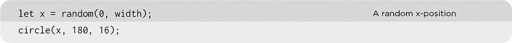

现在，您不再需要一个随机的 x 位置，而是需要一个更平滑的 Perlin 噪声 x 位置。您可能会认为，只需要将 `random()` 替换为一个相同的 `noise()` 调用，如下所示：

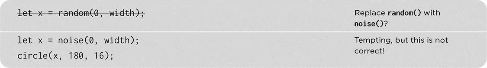

从概念上讲，这正是您想要做的——根据 Perlin 噪声计算一个从 0 到宽度范围的 x 值——但这不是正确的实现。虽然 `random()` 函数的参数指定了一个最小值和最大值之间的范围，但 `noise()` 并不是这样工作的。相反，它的输出范围是固定的：它总是返回一个 0 到 1 之间的值。稍后您将看到，可以通过 p5.js 的 `map()` 函数轻松解决这个问题，但首先我们来看看 `noise()` 期望您传入的参数到底是什么。

一维 Perlin 噪声可以被视为随时间变化的线性数值序列。例如：

| **时间** | **噪声值** |
| --- | --- |
| 0 | 0.365 |
| 1 | 0.363 |
| 2 | 0.363 |
| 3 | 0.364 |
| 4 | 0.366 |

要访问特定的噪声值，您必须选择一个“时间点”，并将其传递给 `noise()` 函数。例如：

```
let n = noise(3);
```

根据上表，`noise(3)` 返回 0.364。下一步是使用一个时间变量，并在 `draw()` 中持续请求噪声值：

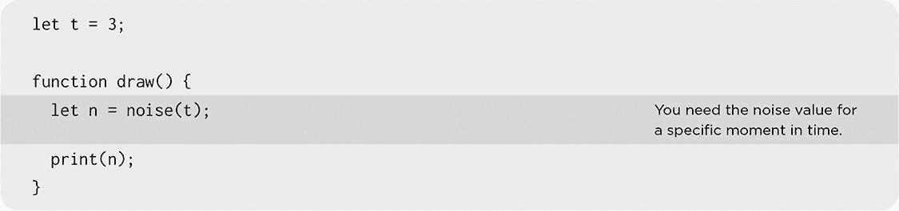

接近，但还不完全正确。这段代码只是重复输出相同的值，因为它不断请求 `noise()` 函数在相同的时间点 3 的结果。然而，如果时间变量 `t` 递增，你每次调用该函数时都会得到不同的噪声值：

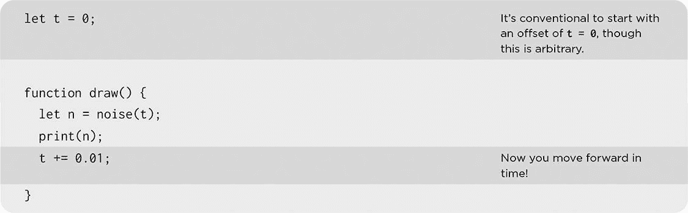

我选择将 `t` 增量为 0.01，但使用不同的增量值会影响噪声的平滑度。通过噪声空间跳跃较大的时间间隔会产生不那么平滑、更加随机的值（图 0.5）。

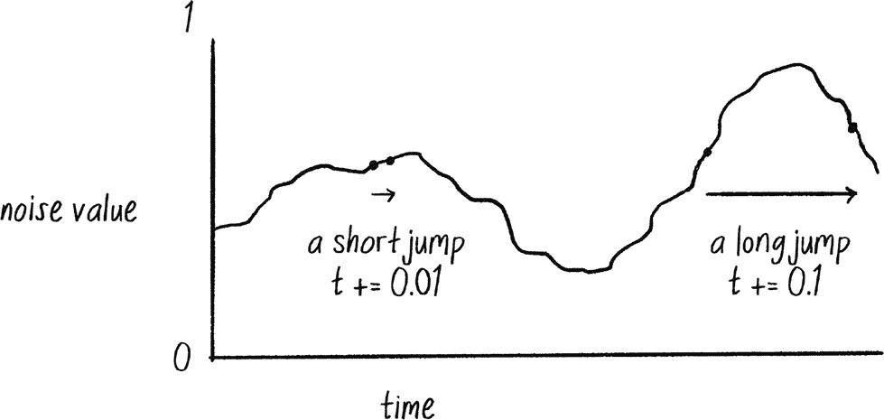

图 0.5：演示 Perlin 噪声中的短跳跃和长跳跃

在即将到来的代码示例中，使用了 Perlin 噪声，请注意随着 `t` 值变化，动画是如何变化的。

#### **噪声范围**

一旦你获得了从 0 到 1 的噪声值，你就可以将该范围映射到任何适合你目的的大小。最简单的方法是使用 p5.js 的 `map()` 函数（图 0.6）。它需要五个参数。第一个是你要映射的值——在这个例子中是 `n`。接下来是该值的当前范围（最小值和最大值），然后是目标范围。

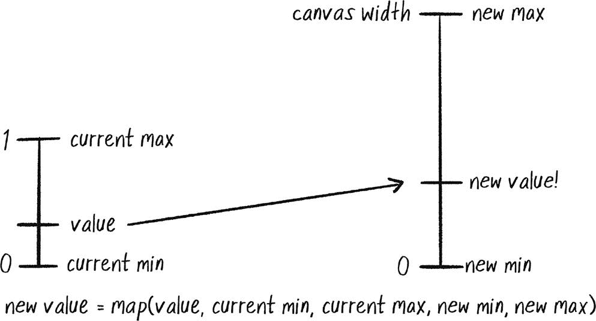

图 0.6：将一个值从一个范围映射到另一个范围

在这个例子中，虽然噪声的范围是从 0 到 1，我想画一个 x 位置范围从 0 到画布宽度的圆：

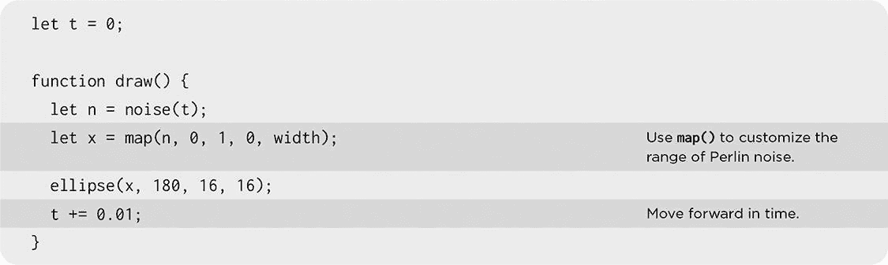

相同的逻辑也可以应用于随机行走者，将其 x 和 y 值都根据 Perlin 噪声分配。这会创造一个更加平滑、更加自然的随机漫步。

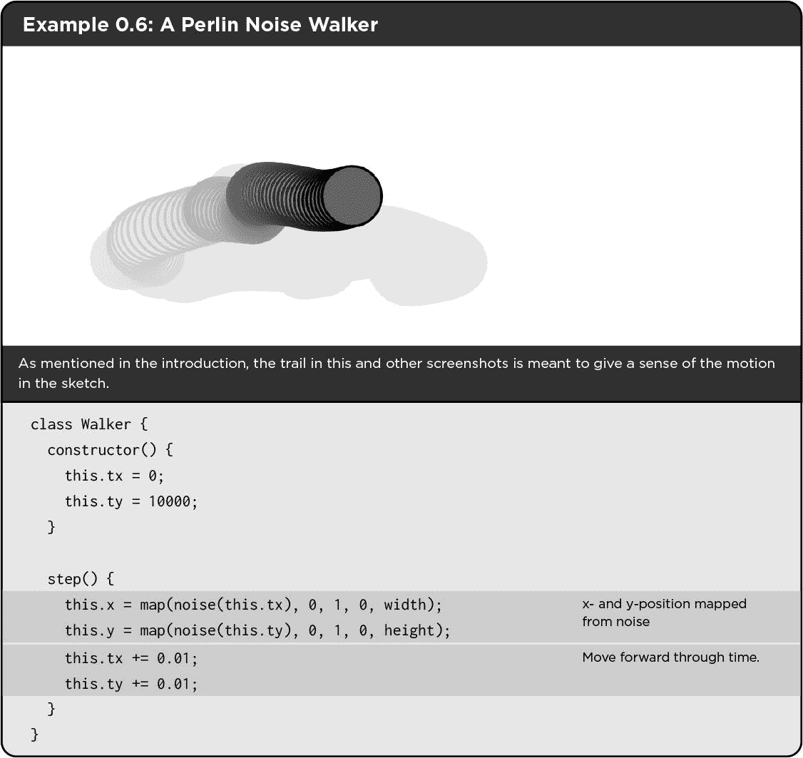

请注意，这个例子需要一对新变量：`tx` 和 `ty`。这是因为我需要跟踪两个时间变量，一个用于 `Walker` 对象的 x 位置，另一个用于 y 位置。但这些变量有点奇怪。为什么 `tx` 从 0 开始，而 `ty` 从 10,000 开始？

尽管这些数字是随意选择的，但我故意将这两个时间变量初始化为这种方式，因为噪声函数是确定性的：它始终在特定时间 `t` 给出相同的结果。如果我要求在相同时间 `t` 获取 `x` 和 `y` 的噪声值，那么 `x` 和 `y` 将始终相等，这意味着 `Walker` 对象将仅沿对角线移动。相反，我使用噪声空间的两个不同部分，`x` 从 0 开始，`y` 从 10,000 开始，这样 `x` 和 `y` 看起来彼此独立地行动（图 0.7）。

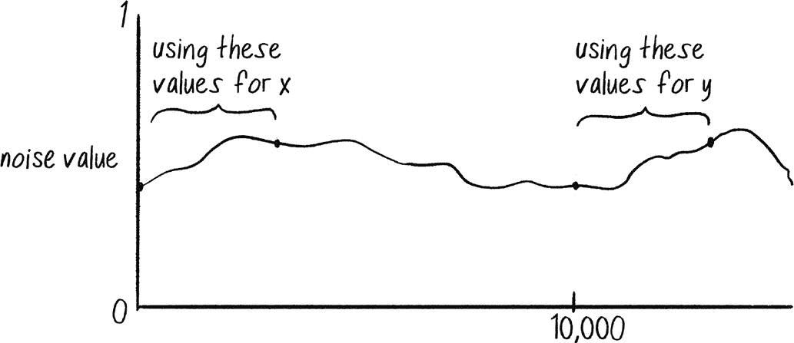

图 0.7：使用不同的 x 轴偏移量来变化 Perlin 噪声值

事实上，这里并没有真正的时间概念在起作用。它是一个有用的隐喻，用来帮助描述噪声函数是如何工作的，但实际上，你所拥有的是空间，而不是时间。图表 Figure 0.7 描绘了一个在一维空间中排列的噪声值的线性序列——也就是说，这些值沿着一条直线排列。值是在特定的 x 位置被提取的，这就是为什么你在示例中经常会看到一个变量名为 `xoff`，用来表示噪声图中的 x 偏移量，而不是 `t` 来表示时间。

 **练习 0.7**

在 Perlin 噪声随机行走器中，`noise()` 函数的结果直接映射到行走器的位置。创建一个随机行走器，但将 `noise()` 函数的结果映射到行走器的步长上。

#### **二维噪声**

在探索了单维噪声值的概念之后，让我们考虑它们如何在二维（2D）空间中存在。对于一维噪声来说，有一系列的值，其中任何给定的值与其邻居相似。想象一张图纸（或电子表格！），在一行中写着一维噪声的值，每个单元格一个值。由于这些值存在于一维空间中，每个值只有两个邻居：一个在它之前的值（左边）和一个在它之后的值（右边），如图 Figure 0.8 左侧所示。

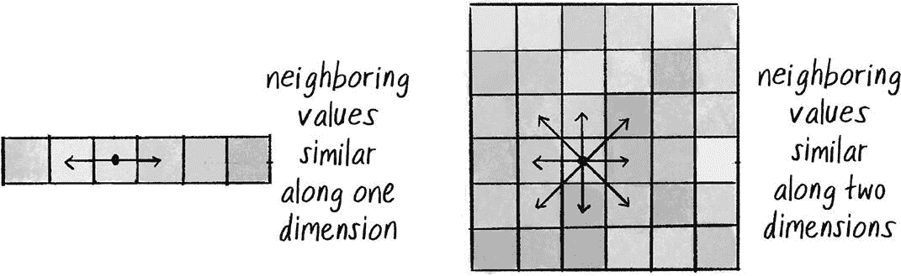

图 0.8：比较邻近的 Perlin 噪声值，在一维（左）和二维（右）中。单元格根据它们的 Perlin 噪声值进行着色。

二维噪声的工作方式在概念上与一维噪声完全相同。不同之处在于，值并不是沿着图纸的单一行线性排列，而是填充整个网格。给定的值将与它所有的邻居相似：上、下、右、左以及任何对角线方向，如 Figure 0.8 右侧所示。

如果你将这个图纸可视化，每个值映射为一种颜色的亮度，你会看到类似云彩的效果。白色旁边是浅灰色，浅灰色旁边是灰色，灰色旁边是深灰色，深灰色旁边是黑色，然后是深灰色，以此类推（见 Figure 0.9）。

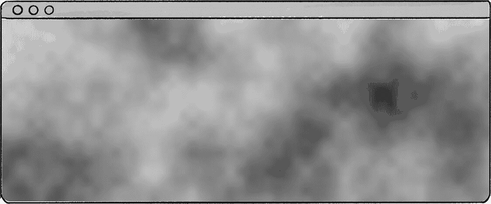

图 0.9：在这个 p5.js 草图的输出中，视觉化了二维噪声，每个像素表示一个噪声值，以灰度色显示。

这种效果正是噪声最初发明的原因。如果你调整参数并玩弄颜色，得到的图像看起来更像大理石、木材或任何其他有机纹理。

 **噪声细节**

p5.js 的噪声参考解释了噪声是通过多个八度（*octaves*）计算的(*[`p5js.org/reference/#/p5/noise`](https://p5js.org/reference/#/p5/noise)*)。调用`noiseDetail()`函数(*[`p5js.org/reference/#/p5/noiseDetail`](https://p5js.org/reference/#/p5/noiseDetail)*)可以改变八度的数量及其相对重要性。这会改变生成的噪声值的质量。

如果你想用`random()`函数为画布上的每个像素随机上色，你需要一个嵌套循环来遍历像素的行列，并为每个像素选择一个随机亮度。请注意，在 p5.js 中，像素以数组的形式排列，每个像素包含四个值：红色、绿色、蓝色和透明度。详情请见“像素”教程中的像素数组视频，网址是(*[`thecodingtrain.com/pixels`](https://thecodingtrain.com/pixels)*)。

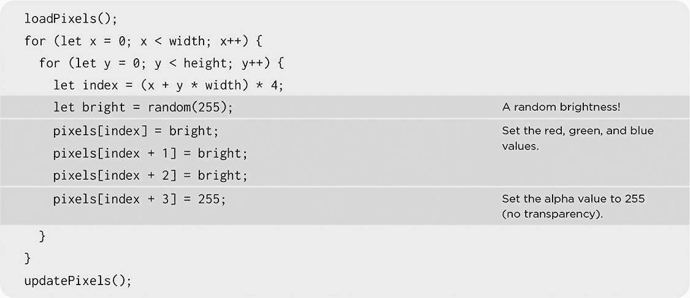

为了根据`noise()`函数更平滑地给每个像素着色，你可以做同样的事情，只不过不是调用`random()`，而是调用`noise()`：

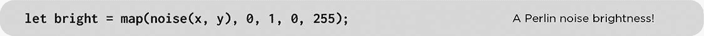

从概念上来说，这是一个不错的起点——代码为 2D 空间中的每个（*x*，*y*）位置计算噪声值。问题在于，这不会有你想要的平滑、云雾状的效果。从一个像素到下一个像素在噪声空间中增加 1 的跨度太大了。记住，在 1D 噪声中，我每帧将时间变量增加了 0.01，而不是增加 1！

解决这个问题的一个不错的办法是，使用与访问画布上像素的变量不同的变量来表示噪声参数。例如，每次`x`在水平方向上增加 1 时，可以将一个名为`xoff`的变量增加 0.01，每次`y`在垂直方向上增加 1 时，可以将`yoff`变量增加 0.01，具体实现见下方的嵌套循环。

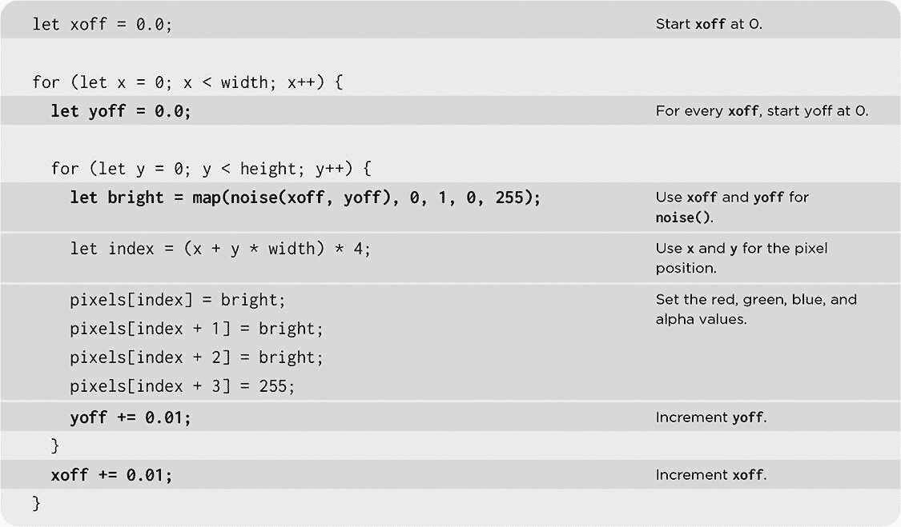

我得承认，我做了一些相当令人困惑的事情。我用*1D*噪声来设置控制 2D 行走者运动的*两个*变量（`this.x`和`this.y`）。然后，我立即转而使用*2D*噪声来设置控制画布上每个像素亮度的*一个*变量（`bright`）。

这里的关键区别是，对于行走者，我的目标是拥有两个独立的*1D*噪声值；我使用它们来移动一个物体通过*2D*空间，完全是巧合。实现这一点的方法是使用两个偏移量（`this.tx` 和 `this.ty`），从同一个 1D 噪声空间的不同部分提取值。同时，在 2D 噪声示例中，`xoff`和`yoff`都从 0 开始，因为我正在寻找一个特定点在 2D 噪声空间中的单一值（像素亮度）。行走者实际上是在导航两个独立的 1D 噪声*路径*，而像素则是 2D 空间中的单一值。

 **练习 0.8**

调整颜色、`noiseDetail()`，以及 `xoff` 和 `yoff` 增量的速率，以实现不同的视觉效果。

 **练习 0.9**

为 `noise` 添加第三个参数，在 `draw()` 每次循环时递增，以便对 2D 噪声进行动画处理。

 **练习 0.10**

使用噪声值作为景观的高度。

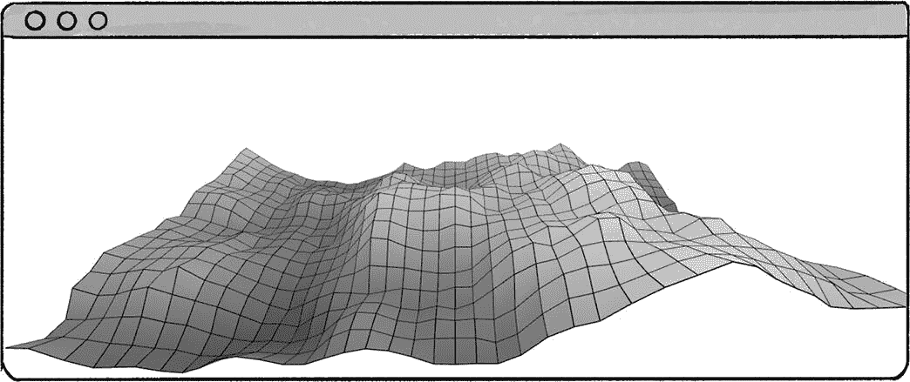

我在本节中建议了几种 Perlin 噪声的传统用途。我将 1D 噪声的平滑值分配给物体的位置，呈现出一种漂移的效果。使用 2D 噪声，我通过对像素平面上的平滑值进行处理，生成了云雾状的图案。然而，重要的是要记住，Perlin 噪声值只是值而已——它们并不直接与像素位置或颜色相关联。

本书中的任何例子，只要有变量，都可以通过 Perlin 噪声进行控制。例如，在模拟风力时，其强度可以通过 Perlin 噪声来控制。同样，分形树形图中枝条之间的角度，或者在流场模拟中沿网格移动的物体的速度和方向，也可以使用 Perlin 噪声来控制（见 图 0.10）。

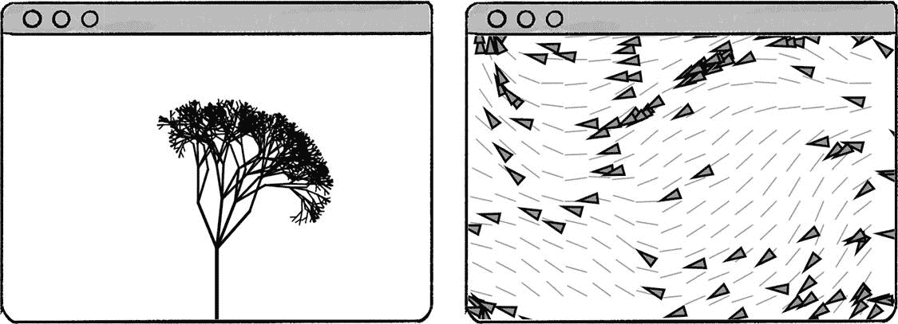

图 0.10：左侧为带有 Perlin 噪声的树，右侧为带有 Perlin 噪声的流场

然而，正如你可以过度使用随机性一样，也很容易陷入过度使用 Perlin 噪声的陷阱。物体应该如何移动？Perlin 噪声！物体应该是什么颜色？Perlin 噪声！物体应该如何生长？Perlin 噪声！如果这成了你对每个问题的答案，继续阅读下去吧。我的目标是向你介绍一个全新的可能性宇宙，用来定义你系统的规则。毕竟，这些规则由你来定义，拥有更多的可能性，你将能够做出更深思熟虑、有根据的选择。随机性和 Perlin 噪声只是我在本书中将要探索的广阔创意宇宙中的第一颗星星。

正如在介绍中提到的，使用本书的一种方式是在阅读过程中构建一个单一的项目，将每一章中的元素逐步融入其中。一个这样的项目可能是生态系统的模拟。假设有一群计算生物生活在一个数字池塘及其周围，按照各种规则相互作用。在每一章的结尾，你都会看到相同的提示。我的目标是提供如何利用本章所探讨的概念，逐步扩展你自己模拟生态系统的思路。但也可以尽情发挥自己的创意！

 **生态系统项目**

在你的第一步中，制定一套规则来模拟生物的现实行为，基于随机游走或其他噪声驱动运动的原则。你能模拟一个飞行轨迹不规则、颤动的昆虫吗？或者模拟一片被不稳定微风吹动的漂浮叶子？从探索如何通过行为完全表达一个生物的个性开始。然后，你可以再考虑它的视觉特征。

这里有一张插图，帮助你根据本书中涵盖的主题构建一个生态系统。观察插图在每一章中如何随着新概念和技术的引入而逐步演变。

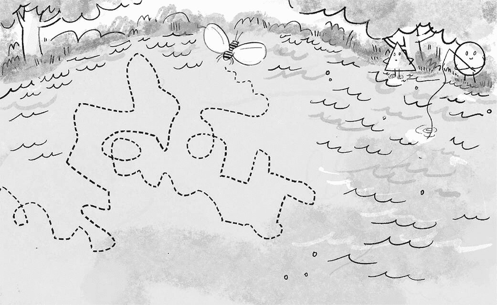

本书的目标是展示算法和行为，因此我的示例几乎总是只包含一个简单的基本形状，比如圆形。然而，我完全相信你内心充满创造力，我鼓励你通过挑战自己设计画布上的元素。如果将设计转化为代码对你来说是新事物，本书的插画师 Zannah Marsh 已经编写了一本关于如何为代码绘图的实用指南，你可以在附录中找到它。
