## 第二章：**1 向量**

*我正在犯下既有方向又有大小的罪行。*

—向量，*卑鄙的我*

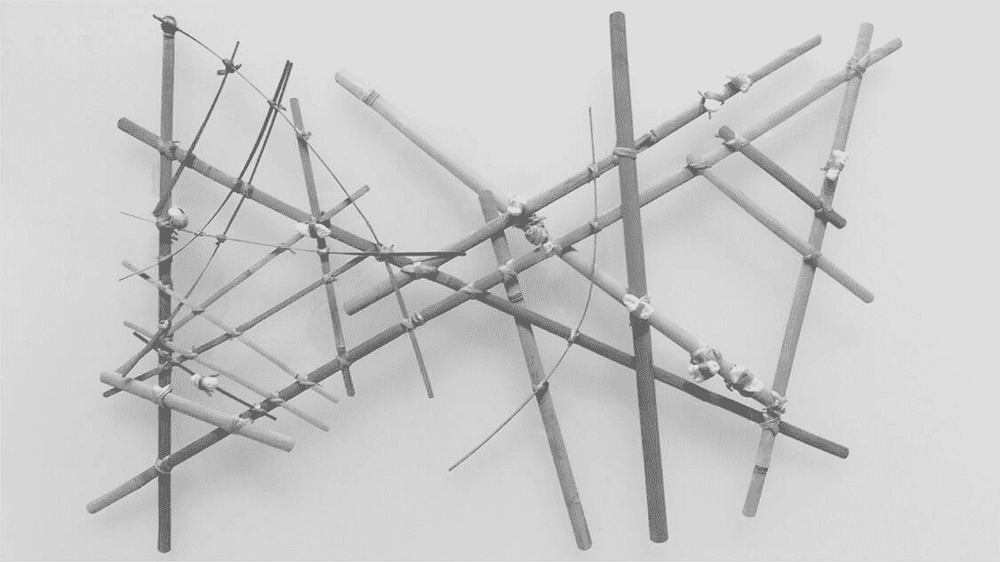

**马绍尔群岛的航海图（由 Jim Heaphy 拍摄，展出于伯克利艺术博物馆）**

这张航海图是马绍尔群岛土著人民制作的导航工具，马绍尔群岛位于中太平洋。这种古老的工具是通过精心绑扎椰子叶的中脉制成的。图表上的贝壳标记表示该地区岛屿的位置。叶脉和贝壳的布局作为地理指引，提供了一种抽象的向量表示，捕捉了海洋波动模式及其方向流动。

本书的核心内容是观察我们周围的世界，并开发用代码模拟它的方法。在本书的第一部分，我将从基础物理学开始：例如一个苹果从树上掉下来，一个摆钟在空气中摆动，地球围绕太阳转动，等等。书中的前五章涵盖的所有内容，都需要使用编程运动的最基本构建块——**向量**。因此，我将从这里开始讲解。

“*向量*”这个词可以有很多含义。它是 1980 年代初在加利福尼亚州萨克拉门托成立的一支新浪潮摇滚乐队的名字，也是加拿大凯洛格公司生产的一种早餐谷物的名字。在流行病学领域，向量是指传递感染的有机体。在 C++编程语言中，向量（`std::vector`）是动态可调整大小的数组数据结构的实现。

尽管所有这些定义都值得探讨，但它们并不是本章的重点。相反，本章深入探讨了**欧几里得向量**（以希腊数学家欧几里得命名），也被称为**几何向量**。当你在本书中看到“*向量*”这个词时，你可以假设它指的是欧几里得向量，即具有大小和方向的实体。

向量通常绘制为箭头，如图 1.1 所示。箭头的指向表示向量的方向，箭头的长度则表示向量的大小。

图 1.1 中的向量被绘制为从 A 点指向 B 点的箭头。它表示从 A 到 B 的旅行方向。

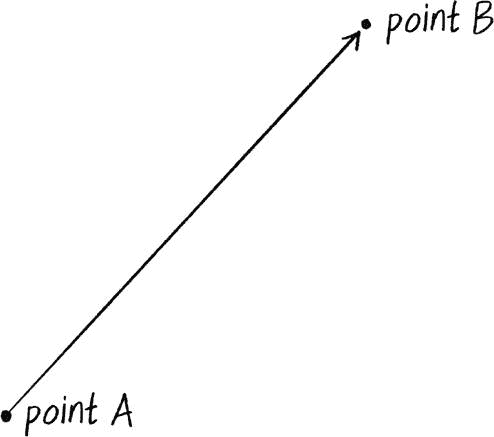

图 1.1：一个作为箭头从 A 点指向 B 点的向量

### **向量的意义**

在深入了解向量的更多细节之前，我想创建一个 p5.js 的示例，演示为什么你应该首先关心向量。如果你曾看过任何初学者 p5.js 教程，阅读过任何介绍性的 p5.js 教材，或参加过创意编码入门课程（希望你在准备这本书时做过其中一项！），你可能在某个时刻学过如何编写一个弹跳球的草图。

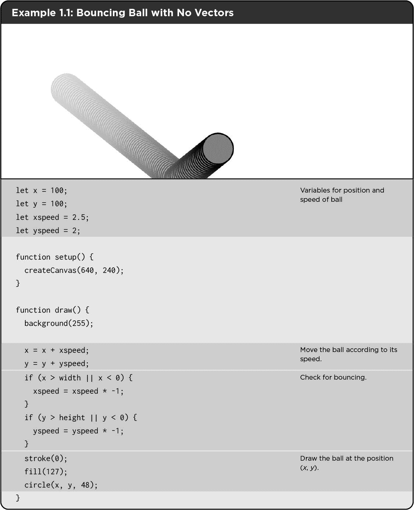

在这个例子中，有一个平面二维世界——一块空白画布——其中一个圆形物体（“球”）在四处移动。这个球有位置、速度等属性，这些属性在代码中以变量的形式表示：

| **属性** | **变量名** |
| --- | --- |
| 位置 | `x` 和 `y` |
| 速度 | `xspeed` 和 `yspeed` |

在一个更复杂的草图中，你可能会有更多的变量来表示球和它的环境的其他属性：

| **属性** | **变量名** |
| --- | --- |
| 加速度 | `xacceleration` 和 `yacceleration` |
| 目标位置 | `xtarget` 和 `ytarget` |
| 风速 | `xwind` 和 `ywind` |
| 摩擦力 | `xfriction` 和 `yfriction` |

你可能会注意到，在这个世界中的每个概念（风速、位置、加速度等）都有两个变量。这只是一个二维世界。在三维（3D）世界中，每个属性都需要三个变量：位置用 `x`、`y` 和 `z` 表示；速度用 `xspeed`、`yspeed` 和 `zspeed` 表示；依此类推。是不是很想简化代码，减少使用变量的数量？而不是像这样开始程序

```
let x;
let y;
let xspeed;
let yspeed;
```

你将能够像这样开始它：

```
let position;
let speed;
```

将球的属性视为向量，而不是将它们作为一组分离的值，将帮助你做到这一点。

迈出使用向量的第一步，并不会让你做出什么新奇的事物，也不会将 p5.js 草图 magically 转换为完整的物理仿真。然而，使用向量将帮助你组织代码，并为你在编程运动时需要反复使用的常见数学操作提供一套方法。

作为向量的介绍，我将长期坚持使用二维（至少前几章）。所有这些例子都可以相对容易地扩展到三维（并且我将使用的类 `p5.Vector` 支持三维）。然而，为了学习基础，第三维度带来的额外复杂性会分散注意力。

### **p5.js 中的向量**

将向量视为两点之间的差异，或者将其视为从一个点走到另一个点的指令。例如，图 1.2 展示了一些向量及其可能的解释。

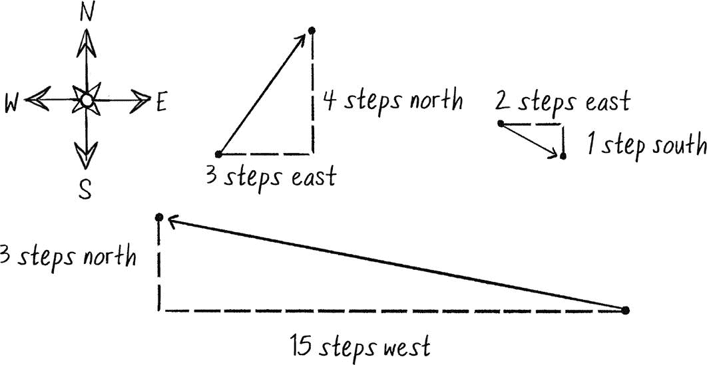

图 1.2：三条示例向量以箭头的形式绘制，附带的指令指示向北、南、东或西方向行走。

这些向量可以按以下方式理解：

| **向量** | **说明** |
| --- | --- |
| (–15, 3) | 向西走 15 步；转身并向北走 3 步。 |
| (3, 4) | 向东走 3 步；转身并向北走 4 步。 |
| (2, –1) | 向东走 2 步；转身并向南走 1 步。 |

你可能已经在编程运动时考虑过这种方式。对于每一帧动画（即每次通过 p5.js 的`draw()`循环），你会指示每个对象将自己重新定位到一个新的位置，水平和垂直方向分别移动一定的像素数。这个指令本质上就是一个向量，如图 1.3 所示；它有大小（你移动了多远？）和方向（你朝哪个方向移动？）。

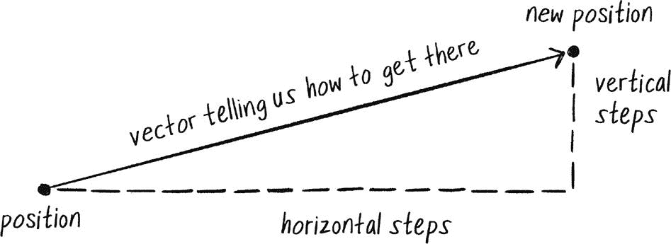

图 1.3：一个向量，表示从一个位置到新位置的水平和垂直步数

向量设置了对象的**速度**，定义为对象位置随时间变化的速率。换句话说，速度向量决定了对象在每一帧动画中的新位置，根据这个基本的运动算法：*新位置等于将速度应用到当前的位置的结果*。

如果速度是一个向量（表示两个点之间的差异），那么位置呢？位置也是向量吗？从技术上讲，你可以辩称位置不是向量，因为它并不描述从一个点到另一个点的移动；它描述的是空间中的一个单一位置。然而，另一种描述位置的方式是将其视为从原点（0, 0）到当前点所经过的路径。当你以这种方式考虑位置时，它就变成了一个向量，就像速度一样，正如图 1.4 所示。

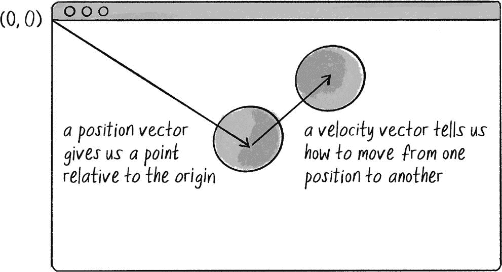

图 1.4：一个计算机图形窗口，左上角是（0，0），显示了位置向量和速度向量

在图 1.4 中，向量被放置在计算机图形画布上。不同于图 1.2，原点（0, 0）不在中心，而是在左上角。而且，不再是北、南、东、西方向，而是沿着 x 轴和 y 轴有正负方向（y 轴的正方向指向下方）。

让我们来看看位置和速度的底层数据。在弹跳球的例子中，我最初有以下变量：

| **属性** | **变量名** |
| --- | --- |
| 位置 | `x`，`y` |
| 速度 | `xspeed`，`yspeed` |

现在，我将位置和速度视为向量，每个向量由具有`x`和`y`属性的对象表示。如果我自己编写一个`Vector`类，我会从类似这样的代码开始：

```
class Vector {
  constructor(x, y) {
    this.x = x;
    this.y = y;
  }
}
```

请注意，这个类设计用于存储与之前相同的数据——每个向量有两个浮动小数值，一个是`x`值，一个是`y`值。从根本上讲，`Vector`对象只是一个方便的方式，通过一个名称存储两个值（或在 3D 示例中存储三个值）。

恰好，p5.js 已经有一个内建的`p5.Vector`类，因此我不需要自己编写。于是，这

```
let x = 100;
let y = 100;
let xspeed = 1;
let yspeed = 3.3;
```

变成这样：

```
let position = createVector(100, 100);
let velocity = createVector(1, 3.3);
```

请注意，`position` 和 `velocity` 向量对象并没有像你可能预期的那样，通过调用构造函数来创建。与其写 `new p5.Vector(x, y)`，我使用了 `createVector(x, y)`。`createVector()` 函数作为 p5.js 中的辅助函数，在创建向量时处理幕后细节。除特殊情况外，你应该始终通过 `createVector()` 来创建 `p5.Vector` 对象。我需要指出，像 `createVector()` 这样的 p5.js 函数不能在 `setup()` 或 `draw()` 之外执行，因为库还未加载。我将在示例 1.2 中演示如何处理这个问题。

现在我有了两个向量对象（`position` 和 `velocity`），我准备实现基于向量的运动算法：**position = position + velocity**。在示例 1.1 中，没有使用向量时，代码如下：

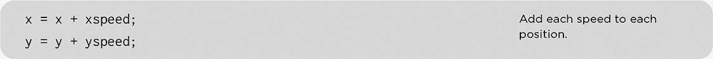

在理想情况下，我将能够像这样重新编写：


然而，在 JavaScript 中，加法运算符 `+` 是为原始值（整数、浮点数等）保留的。JavaScript 不知道如何将两个 `p5.Vector` 对象相加，就像它不知道如何将两个 `p5.Font` 对象或 `p5.Image` 对象相加一样。幸运的是，`p5.Vector` 类包含了用于常见数学运算的方法。

### **向量加法**

在继续使用 `p5.Vector` 类和 `add()` 方法之前，让我们先用数学和物理课本中常见的符号来研究向量加法。向量通常以粗体字或上面加箭头的形式书写。为了本书的目的，为了区分**向量**（具有大小和方向）和**标量**（单一值，例如整数或浮动小数），我将使用箭头符号表示：

+   向量：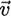

+   标量：*x*

假设我有图 1.5 中显示的两个向量。

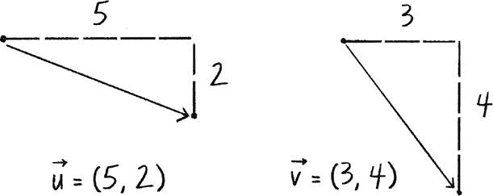

图 1.5：两个向量 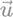 和 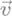 以三角形形式表示

每个向量有两个**分量**，*x* 和 *y*。为了将两个向量相加，将 x 分量和 y 分量分别相加，得到一个新的向量，如图 1.6 所示。

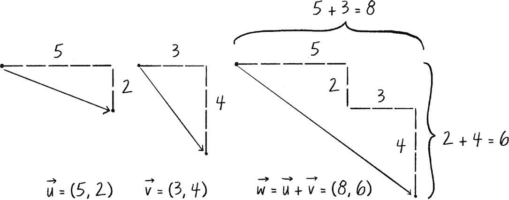

图 1.6：通过组合 x 和 y 分量来加法向量

换句话说， 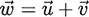 可以写成如下形式：

*w[x]* = *u[x]* + *v[x]*

*w[y]* = *u[y]* + *v[y]*

然后，将 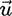 和 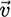 替换为来自图 1.6 的值，你将得到：

*w[x]* = 5 + 3 = 8

*w[y]* = 2 + 4 = 6

最后，将结果写成一个向量：

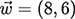

 **向量加法性质**

向量加法遵循与实数相同的代数规则。

可交换性规则：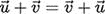

结合性规则：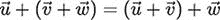

抛开复杂的术语和符号，这些规则归结为一个非常简单的概念：无论向量加法的顺序如何，结果是相同的。将向量替换为常规的数字（标量），这些规则就很容易理解：

可交换性：3 + 2 = 2 + 3

结合性：(3 + 2) + 1 = 3 + (2 + 1)

现在我已经讲解了将两个向量相加的理论，我可以开始讲解如何在 p5.js 中添加向量对象。再假设一次，我正在创建我自己的`Vector`类。我可以为它定义一个名为`add()`的函数，接收另一个`Vector`对象作为参数：

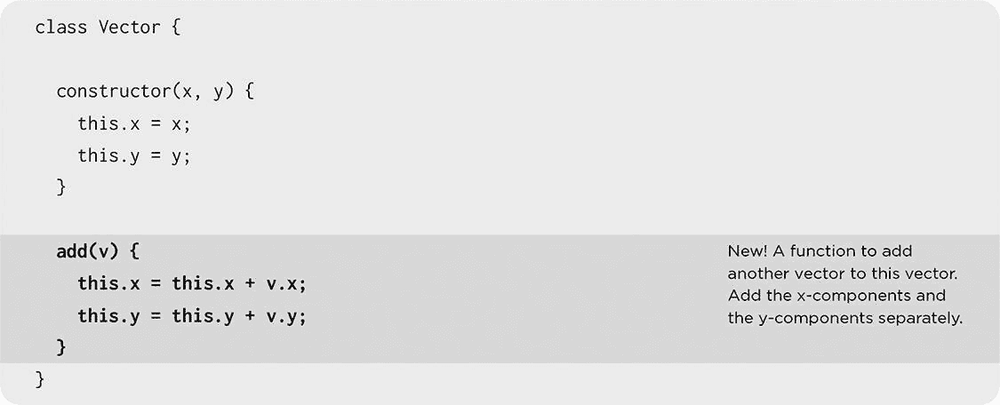

这个函数查找两个向量的 x 和 y 分量，并分别相加。这正是内建的`p5.Vector`类的`add()`方法的写法。了解了它的工作原理后，我现在可以回到反弹球的例子，使用**位置 + 速度**算法并实现向量加法：

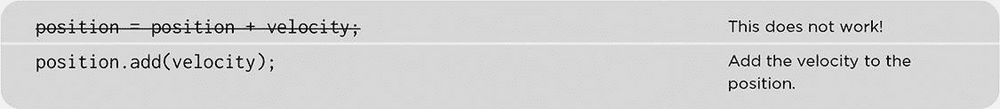

现在，你已经具备了重写反弹球示例并使用向量的必要条件。

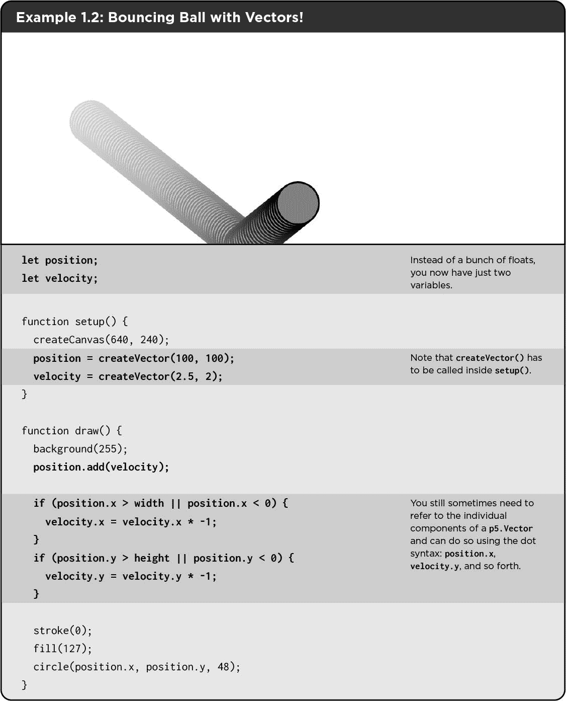

在这个阶段，你可能会感到有些失望。毕竟，这些变化看起来让代码变得比原来更复杂了。虽然这是一个完全合理且有效的批评，但理解向量编程的强大功能尚未完全展现是非常重要的。仅仅实现一个反弹球并进行向量加法只是第一步。当我进入一个更复杂的世界，多个物体和多个*力*（我将在第二章中介绍）作用于这些物体时，向量的优势会变得更加明显。

然而，我需要注意到，过渡到使用向量编程时的一个重要方面。即使我使用`p5.Vector`对象来封装两个值——球的位置的`x`和`y`，或球的速度的`x`和`y`——在一个单一的变量名下，我仍然常常需要单独引用每个向量的 x 和 y 分量。

`circle()`函数不允许将`p5.Vector`对象作为参数传递。一个圆只能用两个标量值，x 坐标和 y 坐标来绘制。因此，我必须深入到`p5.Vector`对象中，通过面向对象的点语法提取出 x 和 y 分量：

```
circle(position, 48);
circle(position.x, position.y, 48);
```

在测试圆形是否已经到达窗口边缘时，也会出现相同的问题。在这种情况下，我需要访问`position`和`velocity`两个向量的各个分量：

```
if ((position.x > width) || (position.x < 0)) {
  velocity.x = velocity.x * -1;
}
```

有时直接访问对象的属性与将对象作为整体引用或使用其方法之间的区别并不总是显而易见。本章（以及本书的大部分内容）的目标是通过提供各种示例和使用案例，帮助你区分这些场景。

 **练习 1.1**

从第零章中取一个行走者示例，并将其转换为使用向量。

 **练习 1.2**

找一个你之前在 p5.js 中使用单独的 `x` 和 `y` 变量制作的东西，并用向量代替它。

 **练习 1.3**

将示例 1.2 扩展为 3D。你能让一个球体在盒子中反弹吗？

### **更多向量数学**

加法实际上只是第一步。许多数学运算通常与向量一起使用。以下是 `p5.Vector` 类中可用的操作的完整表格。请记住，这些不是独立的函数，而是与 `p5.Vector` 类关联的方法。当你看到以下表格中的 *this* 时，它指的是该方法正在操作的特定向量。

| **方法** | **任务** |
| --- | --- |
| add()       | 将一个向量加到此向量上 |
| sub()       | 从此向量中减去另一个向量 |
| mult()       | 通过乘法缩放此向量 |
| div()       | 通过除法缩放此向量 |
| mag()       | 返回此向量的大小 |
| setMag()     | 设置此向量的大小 |
| normalize()   | 将此向量归一化为单位长度 1 |
| limit()     | 限制此向量的大小 |
| heading()    | 返回此向量的 2D 方向角度 |
| rotate()     | 按角度旋转此 2D 向量 |
| lerp()       | 线性插值到另一个向量 |
| dist()      | 返回两个向量（视为点）之间的欧几里得距离 |
| angleBetween() | 计算两个向量之间的角度 |
| dot()       | 返回两个向量的点积 |
| cross()     | 返回两个向量的叉积（仅在三维中相关） |
| random2D()    | 返回一个随机的 2D 向量 |
| random3D()    | 返回一个随机的 3D 向量 |

我现在将介绍一些关键方法。随着例子的逐步复杂化，在后面的章节中，我会继续揭示更多的细节。

#### **向量减法**

在已经讲解了加法之后，我现在来讲解减法。其实不难；只需将加号替换为减号即可！不过，在处理减法之前，先考虑一下向量变成–的意义。标量 3 的负数是–3，而负向量也是类似的：每个向量分量的极性都会被反转。所以，如果有分量（*x*, *y*），那么–就是(–*x*, –*y*)。从视觉上来看，这会生成一个长度与原始向量相同的箭头，指向相反的方向，如图 1.7 所示。

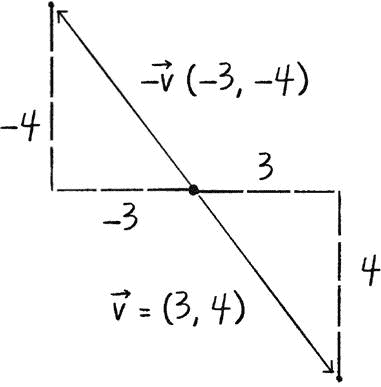

图 1.7：与–之间的关系

因此，减法和加法是相同的，只不过方程中的第二个向量被视为其负数版本：

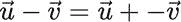

就像向量相加时，将它们“头尾相接”——也就是将一个向量的头部（或终点）与下一个向量的尾部（或起点）对齐——向量相减时，第二个向量的方向会反转，并将它放置在第一个向量的末尾，如图 1.8 所示。

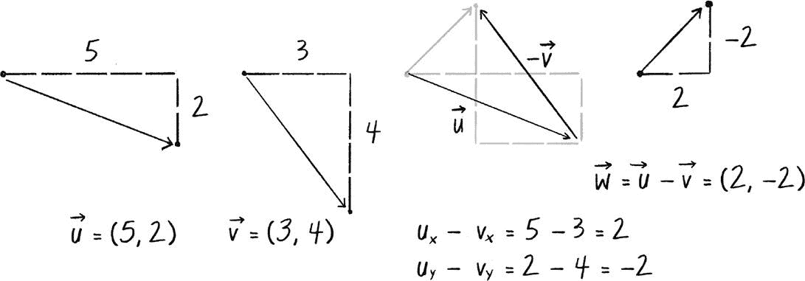

图 1.8：向量减法将一个向量放置在另一个向量的末端，但方向相反。

要实际解决减法问题，计算向量分量的差值。即，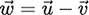可以写成如下所示：

*w[x]* = *u[x]* – *v[x]*

*w[y]* = *u[y]* – *v[y]*

在`p5.Vector`中，代码如下所示：

```
sub(v) {
  this.x = this.x - v.x;
  this.y = this.y - v.y;
}
```

以下示例通过计算两个点之间的差来演示向量减法（这两个点被视为向量）：鼠标位置和窗口的中心。


注意使用`translate()`来将结果向量可视化为从中心 `(width / 2, height / 2)` 到鼠标的线。向量减法是一种特殊的平移操作，它移动位置向量的“原点”。在这里，通过将中心向量从鼠标向量中减去，我实际上是在将结果向量的起点移动到画布的中心。因此，我还需要通过使用`translate()`来移动原点。如果没有这个操作，线条将从左上角绘制，视觉上的连接就不那么清晰了。

#### **向量乘法与除法**

进入乘法部分，你需要从不同的角度思考。乘法向量通常指的是**缩放**向量的过程。如果我想将一个向量缩放为其大小的两倍或三分之一，同时保持其方向不变，我会说：“将向量乘以 2”或“将向量乘以 1/3。”与加法和减法不同，我是在将向量乘以一个标量（一个数），而不是另一个向量。图 1.9 说明了如何通过 3 的倍数缩放一个向量。

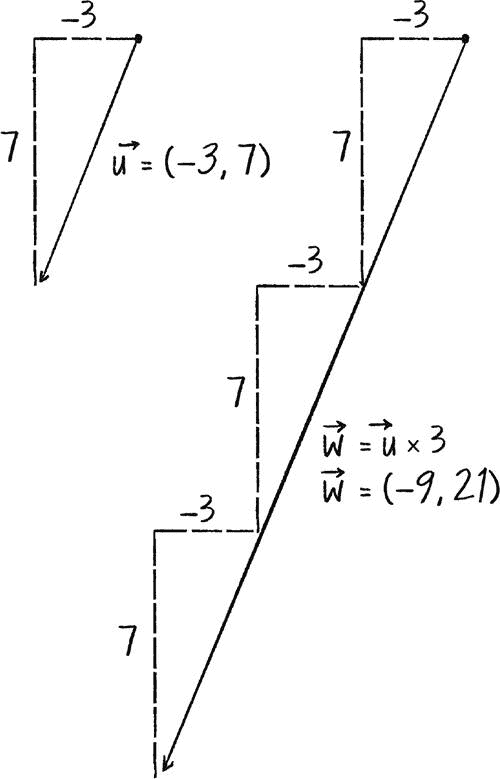

图 1.9：通过乘法缩放一个向量

要缩放一个向量，可以将每个分量（*x* 和 *y*）乘以一个标量。也就是说，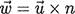 可以写成如下形式：

*w[x]* = *u[x]* × *n*

*w[y]* = *u[y]* × *n*

作为一个例子，假设 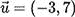 和 *n* = 3。你可以按照以下方式计算 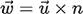：

*w[x]* = −3 × 3

*w[y]* = 7 × 3

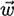 = (− 9, 21)

这正是 `p5.Vector` 类中的 `mult()` 函数的工作原理：

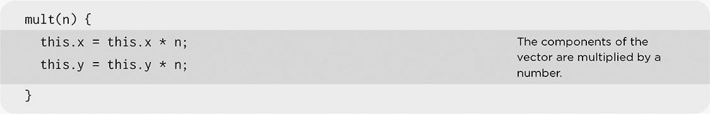

在代码中实现乘法非常简单，代码如下：

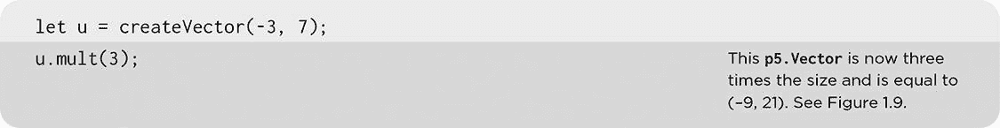

示例 1.4 通过在鼠标和画布中心之间画一条线来说明向量乘法，正如前一个示例所示，然后将该线缩放为 0.5。

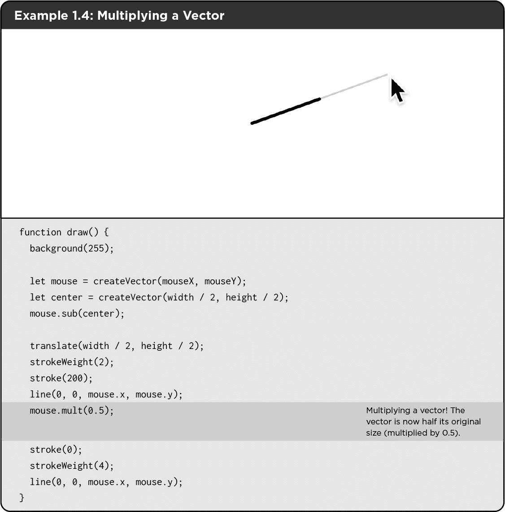

得到的向量是原始大小的一半。与其将向量乘以 0.5，我也可以通过将向量除以 2 来达到相同的效果，就像在图 1.10 中所示。

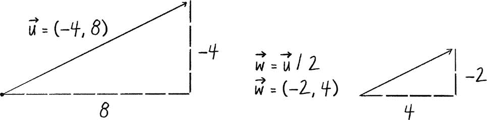

图 1.10：通过除法缩放一个向量

向量除法的运作方式和向量乘法一样——只需将乘法符号（`*`）替换为除法符号（`/`）。以下是 `p5.Vector` 类如何实现 `div()` 函数：

```
div(n) {
  this.x = this.x / n;
  this.y = this.y / n;
}
```

以下是如何在草图中使用 `div()` 函数：

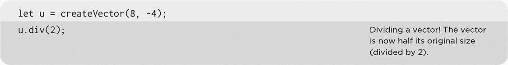

这将向量 `u` 除以 2。

 **更多与向量相关的数值属性**

与加法一样，乘法的基本代数规则也适用于向量。

结合律：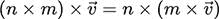

两个标量和一个向量的分配律：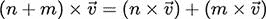

两个向量和一个标量的分配律：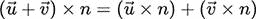

### **向量大小**

如前所述，乘法和除法可以改变向量的长度，而不影响其方向。你可能会想：“好吧，那我怎么知道一个向量的长度是多少呢？我知道这个向量的分量（*x* 和 *y*），但是这个实际的箭头有多长（单位：像素）？”理解如何计算向量的长度，也就是它的**大小**，是非常有用且重要的。

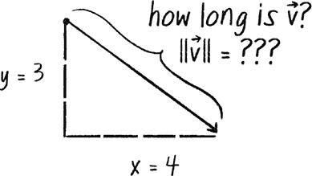

图 1.11：向量的长度或大小！Image 通常表示为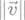。

请注意在图 1.11 中，向量以箭头和两个分量（*x* 和 *y*）表示，形成了一个直角三角形。三角形的边是分量，而斜边是箭头。我们很幸运有这个直角三角形，因为曾经有位名叫毕达哥拉斯的希腊数学家发现了一个优美的公式，描述了直角三角形的边和斜边之间的关系。这个公式就是**勾股定理**，即*a*² + *b*² = *c*²（见图 1.12）。

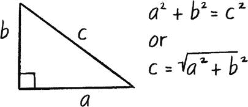

图 1.12：勾股定理通过使用向量的分量来计算向量的长度。

有了这个公式，我们现在可以计算的大小，如下所示：

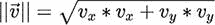

在`p5.Vector`类中，`mag()`函数使用相同的公式定义：

```
mag() {
  return sqrt(this.x * this.x + this.y * this.y);
}
```

下一个示例中的草图计算了鼠标和画布中心之间的向量大小，并将其可视化为一条穿过窗口顶部的矩形。

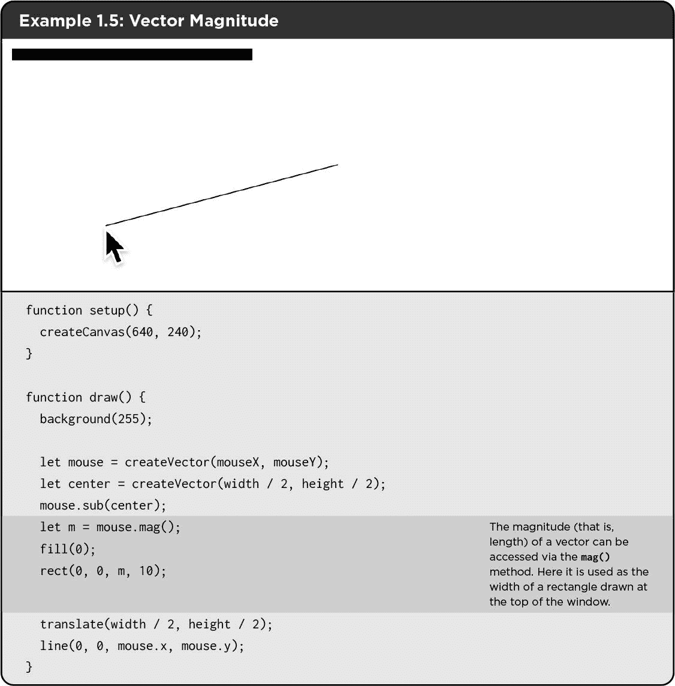

请注意，向量的大小（长度）始终为正，即使向量的分量是负数。

### **归一化向量**

计算向量的大小只是开始。它打开了许多可能性的大门，其中第一个是**归一化**（图 1.13）。这是将某物标准化或称为“正常化”的过程。对于向量来说，约定是标准向量的长度为 1。因此，归一化一个向量就是将任何长度的向量改为长度为 1，而不改变其方向。归一化后的向量被称为**单位向量**。

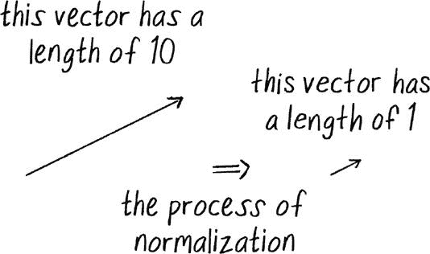

图 1.13：当一个向量被归一化时，它仍然指向相同的方向，但其长度已经调整为单位长度 1。

单位向量描述了向量的方向，而不考虑其长度。一旦你开始处理第二章中的力时，你会发现它特别有用。

对于任何给定的向量，其单位向量（写作*û*）的计算方式如下：

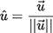

换句话说，要归一化一个向量，将每个分量除以向量的大小。为了理解为什么这样做有效，考虑一个向量（4, 3），其大小为 5（见图 1.14）。一旦归一化，向量的大小将为 1。将向量视为直角三角形，归一化的过程通过除以 5 来缩小斜边（因为 5/5 = 1）。在这个过程中，每一边也按 5 的比例缩小。边长从 4 和 3 分别变为 4/5 和 3/5。

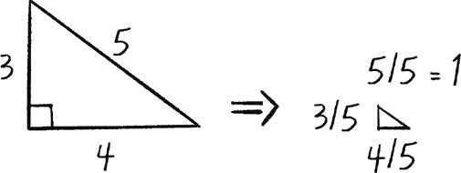

图 1.14：为了标准化一个向量，其分量将被其大小除以。

在`p5.Vector`类中，标准化方法写作如下：

```
normalize() {
  let m = this.mag();
  this.div(m);
}
```

当然，这里有一个小问题。如果向量的大小是 0 怎么办？你不能除以 0！一些快速的错误检查（如下所示）可以解决这个问题。

```
normalize() {
  let m = this.mag();
  if (m > 0) {
    this.div(m);
  }
}
```

本示例使用标准化来使鼠标和画布中心之间的向量长度固定，不管原始向量的实际大小如何。


注意，在将`mouse`向量标准化为 1 后，我将其乘以了 50。标准化通常是创建具有特定长度的向量的第一步，即使目标长度不是 1。你将在本章稍后看到更多相关内容。

所有这些向量数学的内容听起来像是你应该了解的东西，但为什么呢？它如何帮助你编写代码？耐心点，使用`p5.Vector`的强大功能将在一段时间后完全显现出来。这在学习新数据结构时是很常见的现象。例如，当你第一次学习数组时，可能会觉得使用数组比用几个变量表示多个东西要麻烦。但当你需要处理 100、1000 或 10000 个元素时，这种做法就会迅速崩溃。

向量的情况也一样。现在看起来像是更多的工作，稍后会得到回报，而且回报会非常不错。而且你不必等太久，因为你的奖励将在下一章到来。不过现在，我将专注于*向量是如何工作的*，以及如何通过使用它们提供一种不同的思维方式来处理运动。

### **使用向量进行运动**

使用向量编程运动是什么意思？你在示例 1.2 中体验过了，那个是弹跳球。屏幕上的圆圈有一个位置（它在任何给定时刻的位置），以及一个速度（指示它如何从一个时刻移动到下一个时刻）。速度被加到位置上：

```
position.add(velocity);
```

然后，物体会绘制在新的位置：

```
circle(position.x, position.y, 48);
```

这些步骤合起来构成了运动基础 101：

1.  将速度添加到位置。

1.  在该位置绘制物体。

在弹跳球的示例中，所有这些代码都在`setup()`和`draw()`中完成。现在我想做的是将一个物体的运动逻辑封装到一个**类**中。这样，我就可以为编程运动物体创建一个基础，便于我反复使用。（有关面向对象编程的简要回顾，请参见第 3 页的《随机行走类》一节。）

首先，我将创建一个通用的`Mover`类，用于描述一个形状在画布上的移动。为此，我必须考虑以下两个问题：

1.  一个移动器包含哪些数据？

1.  一个移动器具备什么功能？

《运动 101》算法回答了这两个问题。首先，一个`Mover`对象有两部分数据，`position`和`velocity`，它们都是`p5.Vector`对象。这些数据在对象的构造函数中初始化。在这种情况下，我随意决定通过给`Mover`对象一个随机的位置和速度来初始化它。注意所有属于`Mover`对象的变量都使用了`this`关键字：

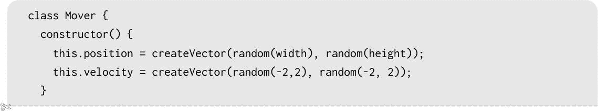

功能也跟着变化。`Mover`对象需要移动（通过将速度应用到位置）并且需要可见。我将把这些需求实现为名为`update()`和`show()`的函数。我会把所有运动逻辑的代码放在`update()`中，并在`show()`中绘制对象：

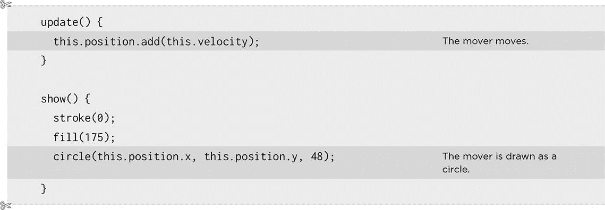

`Mover`类还需要一个函数，用来决定当对象到达画布边缘时应该做什么。目前，我做了一件简单的事情，让它在边缘处绕回来：

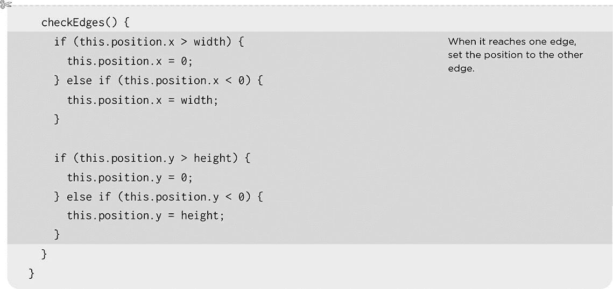

现在`Mover`类已经完成，但该类本身不是一个对象；它是用来创建对象实例的模板。要实际创建一个`Mover`对象，我首先需要声明一个变量来存储它：

```
let mover;
```

然后，在`setup()`函数中，我通过调用类名和`new`关键字来创建对象。这会触发类的构造函数，从而创建该对象的实例：

```
mover = new Mover();
```

现在剩下的就是在`draw()`中调用适当的方法：

```
mover.update();
mover.checkEdges();
mover.show();
```

这是完整的示例，供参考。

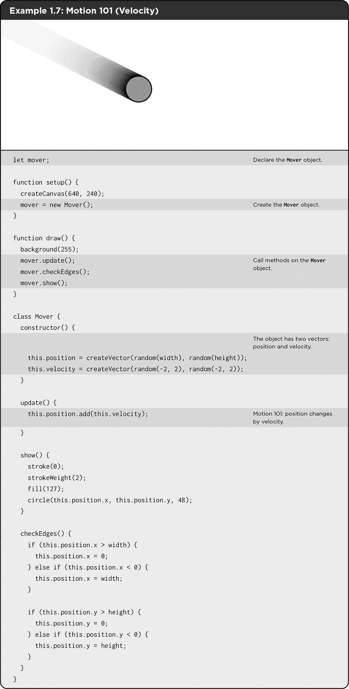

如果面向对象编程（OOP）对你来说是全新的，这里有一点可能看起来有些奇怪。我在本章开头讨论了`p5.Vector`类，而这个类是用来创建`position`对象和`velocity`对象的模板。那么，这些对象为什么会出现在另一个对象——`Mover`对象里呢？

事实上，这几乎是最正常不过的事了。一个对象就是用来存储数据（和功能）的。这些数据可以是数字，也可以是其他对象（包括数组）！你会在本书中反复看到这一点。例如，在第四章中，我将编写一个类来描述一个粒子系统。那个`ParticleSystem`对象将包含一个`Particle`对象的列表……而每个`Particle`对象的数据将包含几个`p5.Vector`对象！

你可能还注意到，在`Mover`类中，我直接在构造函数内设置了初始位置和速度，而没有使用任何参数。虽然这种做法目前保持了代码的简洁，但我将在第二章中探讨在构造函数中添加参数的好处。

到此为止，希望你已经熟悉了两个概念：（1）什么是向量，以及（2）如何在对象内使用向量来跟踪其位置和运动。这是一个很好的第一步，值得小小鼓掌。然而，在真正的热烈掌声到来之前，你还需要再迈出一步，这一步有些大。毕竟，观看“运动 101”示例相当无聊。圆形从未加速，从未减速，也从未转动。为了实现更复杂的运动——那种在我们周围的世界中出现的运动——需要向类中添加一个额外的向量：`加速度`。

### **加速度**

**加速度**是速度变化的速率。稍微思考一下这个定义。这是一个全新的概念吗？不完全是。之前我将速度定义为位置变化的速率，因此，本质上，我正在开发一个渐变效应。加速度影响速度，而速度反过来影响位置。（为了稍作铺垫，这一点将在下一章变得更加关键，当我展示摩擦力等力量如何影响加速度，从而影响速度，再影响位置时。）在代码中，这个渐变效应是这样的：

```
velocity.add(acceleration);
position.add(velocity);
```

作为一个练习，从现在开始，我给自己定个规则：我会尽量在本书余下的示例中，避免直接接触速度和位置的值（除了初始化它们）。换句话说，编程运动的目标是提出一个计算加速度的算法，然后让它的渐变效应发挥作用。（事实上，会有许多理由打破这个规则，而我也会打破它。尽管如此，作为一个起点，这个限制还是很有用的，它有助于通过加速度的运动算法原理进行说明。）

接下来的步骤是想出一种计算加速度的方法。以下是几种可能的算法：

+   恒定加速度

+   随机加速度

+   朝向鼠标的加速度

我将用本章的剩余部分来向你展示如何实现这些算法。

#### **算法 1：恒定加速度**

加速度算法 1，恒定加速度，虽然并不特别有趣，但它是最简单的，因此是将加速度引入代码的绝佳起点。第一步是向`Mover`类添加另一个变量：

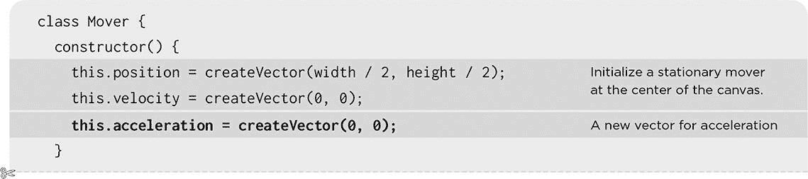

接下来，将加速度整合到`update()`函数中：

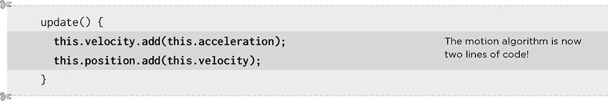

我快完成了。唯一缺少的部分就是让那个移动器动起来！在构造函数中，初始速度被设置为 0，而不是之前做的随机向量。因此，当草图开始时，物体是静止的。为了让它动起来，而不是直接改变速度，我将通过物体的加速度来更新它。根据算法 1，加速度应该是恒定的，因此我现在选择一个值：

```
    this.acceleration = createVector(-0.001, 0.01);
```

这意味着动画的每一帧，物体的速度在 x 方向应该增加 -0.001 像素，在 y 方向增加 0.01 像素。也许你会想，“天哪，这些值看起来太小了！”确实，它们非常微小，但这是有意设计的。加速度值随着时间在速度中累积，每秒约 30 次，这取决于草图的帧速率。为了防止速度矢量的大小增长过快并失控，加速度值应保持相当小。

通过使用 `p5.Vector` 函数 `limit()`，我还可以帮助保持速度在合理范围内，它限制了向量的大小：


这转化为以下内容：

*速度的大小是多少？如果小于 10，没问题；保持原样。如果大于 10，则将其减小到 10！*

 **练习 1.4**

为 `p5.Vector` 类编写 `limit()` 函数：

```
  limit(max) {
    if (this.mag() > max) {
      this.normalize();
      this.mult(max);
    }
  }
```

让我们来看看 `Mover` 类的更改，包括 `acceleration` 和 `limit()`。

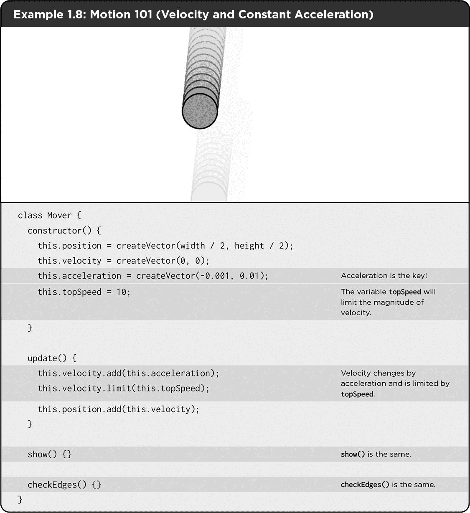

结果是物体向下和向左移动，逐渐加速，直到达到最大速度。

 **练习 1.5**

创建一个物体的模拟（想象一辆车），按向上箭头加速，按向下箭头刹车。

#### **算法 2：随机加速**

现在进入加速度算法 2，随机加速。在这种情况下，我不想在对象的构造函数中初始化 `acceleration`，而是希望在 `update()` 方法内随机设置其值。这样，每帧动画对象将获得一个不同的加速度向量：

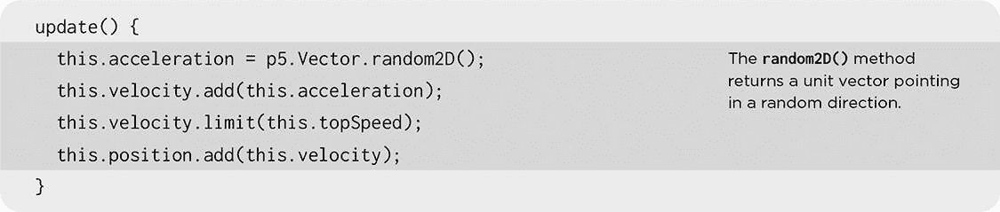

`random2D()` 方法生成一个归一化向量，意味着它具有随机的方向，但其大小始终为 1。为了增加趣味性，我可以尝试将随机向量按照一个常数值进行缩放：


或者，为了更大的变化，我可以将加速度缩放到一个随机值。在 示例 1.9 中，`acceleration` 向量既具有随机方向又具有 0 到 2 的随机大小。

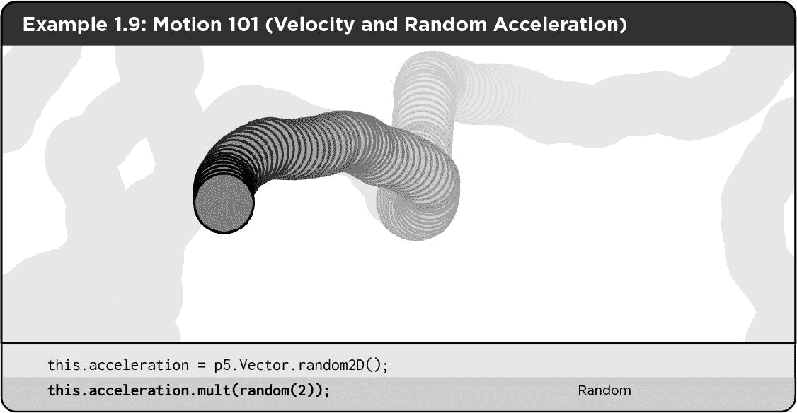

很重要的一点是要理解，加速度不仅仅指*加速*或*减速*。正如这个例子所显示的，它指的是速度的*任何变化*——大小或方向。加速度用于控制物体的运动，你将在未来的章节中再次看到这一点，当我开始编写能够决定如何移动的对象时。

你可能还会注意到，这个例子是另一种类型的随机游走。然而，和上一章的例子不同，关键在于 *随机化的内容*。在传统的随机游走中，我是直接操作速度，也就是说每一步都与上一部完全独立。而在 例子 1.9 中，是加速度（速度的变化率）在随机化，而不是速度本身。这使得物体的运动依赖于其之前的状态：速度根据随机加速度逐步变化。由此产生的物体运动具有连续性和流畅性，而原始的随机游走缺乏这种特性。这个差异可能看起来很微妙，但它从根本上改变了物体在画布上的运动方式。

 **练习 1.6**

回到 练习 0.6，实现一个基于 Perlin 噪声计算的加速度。

#### **静态方法与非静态方法**

你可能注意到在上一个例子中有些奇怪而陌生的地方。用于创建随机单位向量的 `random2D()` 方法是通过类名调用的，像这样 `p5.Vector.random2D()`，而不是通过类的当前实例调用，像这样 `this.random2D()`。这是因为 `random2D()` 是一个 **静态方法**，意味着它是与整个类相关的，而不是与个别对象（即该类的实例）相关的。

当你编写自己的类（如 `Walker` 或 `Mover`）时，通常不需要静态方法，所以你可能没有接触过它们。然而，在一些预写的类中，如 `p5.Vector`，静态方法有时是非常重要的一部分。事实上，加速算法 3（朝向鼠标加速）需要进一步使用这个概念，所以让我们退一步，考虑一下静态方法和非静态方法之间的区别。

暂时抛开向量，看看以下代码：

```
let x = 0;
let y = 5;
x = x + y;
```

这可能是你习惯的方式，对吗？我给 `x` 赋值为 0，将 `y` 加到它上面，现在 `x` 等于 5。我可以写类似的代码来添加两个向量：

```
let v = createVector(0, 0);
let u = createVector(4, 5);
v.add(u);
```

向量 `v` 的值为 (0, 0)，我将向量 `u` 加到它上面，现在 `v` 的值变为 (4, 5)。有道理，对吧？

现在来看这个例子：

```
let x = 0;
let y = 5;
let z = x + y;
```

我给 `x` 赋值为 0，将 `y` 加到它上面，并将结果存储到一个新变量 `z` 中。这里 `x` 的值没有改变（`y` 也没有改变）！这看起来可能是一个微不足道的点，对于简单数字的数学运算来说，它非常直观。然而，当我们使用 `p5.Vector` 对象进行数学运算时，这就不那么显而易见了。让我们尝试基于我到目前为止介绍的 `p5.Vector` 类，重写这个例子：

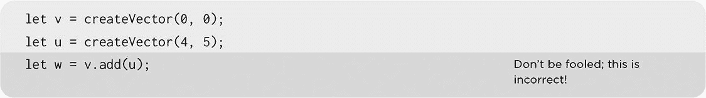

这看起来可能是一个不错的猜测，但这不是 `p5.Vector` 类的工作方式。如果你查看 `add()` 方法的定义，你就能明白原因：

```
add(v) {
  this.x = this.x + v.x;
  this.y = this.y + v.y;
}
```

这段代码有两个问题。首先，`add()` 方法不会返回一个新的 `p5.Vector` 对象；其次，`add()` 会改变它调用时所在向量的值。为了将两个向量对象相加并返回结果作为一个新的向量，我必须使用 `add()` 方法的静态版本，调用时是类名而非特定对象实例的非静态版本。

如果我自己声明这个类，下面是如何编写 `add()` 的静态版本：

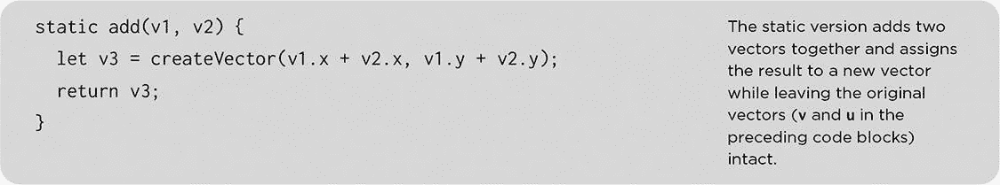

这里的关键区别是，方法返回一个新的向量（`v3`），它是通过 `v1` 和 `v2` 的分量之和创建的。因此，方法不会对任何原始向量做出修改。

调用静态方法时，你不是引用对象实例，而是引用类的名称。下面是实现向量加法示例的正确方式：

```
let v = createVector(0, 0);
let u = createVector(4, 5);
let w = v.add(u);
let w = p5.Vector.add(v, u);
```

`p5.Vector` 类有 `add()`、`sub()`、`mult()` 和 `div()` 的静态版本。这些静态方法允许你对向量执行通用的数学运算，而不会在过程中改变任何输入向量的值。

 **练习 1.7**

将以下伪代码转化为代码，根据需要使用静态或非静态函数：

+   向量 `v` 等于 (1, 5)。

+   向量 `u` 等于 `v` 乘以 2。

+   向量 `w` 等于 `v` 减去 `u`。

+   将向量 `w` 除以 3。

```
let v = createVector(1, 5);
let u = p5.Vector.mult(v, 2);
let w = p5.Vector.sub(v, u);
w.div(3);
```

#### **算法 3：交互式运动**

为了完成本章内容，让我们尝试一些更复杂、也更有用的内容。我将根据加速度算法 3 中所述的规则动态计算一个对象的加速度：对象朝向鼠标加速。

每当你需要根据规则或公式计算一个向量时，你需要计算两个属性：大小和方向。我将从方向开始。我知道加速度向量应该从对象的位置指向鼠标位置（图 1.15）。假设对象位于位置向量 (*x*, *y*)，而鼠标位于 (*mouseX*, *mouseY*)。

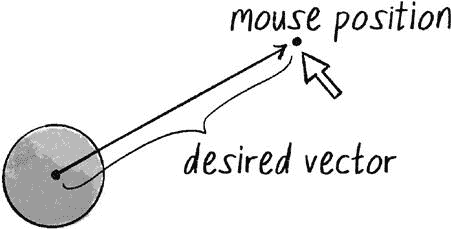

图 1.15：从对象到鼠标位置的向量

在图 1.16 中，你可以看到加速度向量（*dx*，*dy*）可以通过从对象位置中减去鼠标位置来计算：

+   *dx = mouseX - x*

+   *dy = mouseY - y*

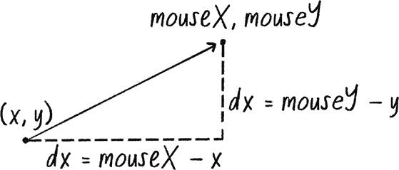

图 1.16：通过取鼠标和位置向量的差来计算初始加速度向量

让我们通过使用 `p5.Vector` 语法来实现这个。假设代码位于 `Mover` 类内，因此可以访问对象的 `position`，我可以这样写：

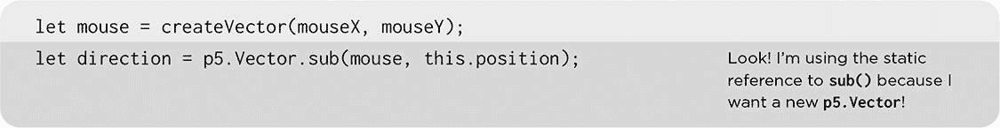

我使用了`sub()`的静态版本来创建一个新的向量`direction`，它指向从物体的位置到鼠标的位置。然而，如果物体实际使用该向量加速，它会瞬间出现在鼠标位置，因为`direction`的大小等于物体与鼠标之间的距离。当然，这样做并不会产生平滑的动画。因此，下一步是决定物体应该以多快的速度向鼠标加速，通过改变向量的大小。

要设置加速度向量的大小（无论它是多少），我必须先 ______ 该向量。没错，你说对了：*归一化*！如果我能将向量缩小到单位向量（长度为 1），我就可以轻松地将它缩放到任何其他值，因为 1 乘以任何东西都等于任何东西：

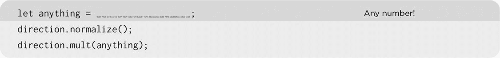

总结一下，按照以下步骤让物体向鼠标加速：

1.  计算一个指向物体到目标位置（鼠标）的向量。

1.  归一化该向量（将其长度缩小到 1）。

1.  将那个向量缩放到适当的值（通过将其乘以某个值）。

1.  将该向量分配给加速度。

我得承认，归一化然后缩放是如此常见的向量操作，以至于`p5.Vector`包含了一个可以同时完成这两个操作的函数，用一个函数调用即可将向量的大小设置为给定值。那个函数就是`setMag()`：

```
let anything = ?????
dir.setMag(anything);
```

在下一个示例中，为了强调数学部分，我将使用`normalize()`和`mult()`来编写代码，但这可能是我最后一次这样做了。你会在之后的示例中看到`setMag()`。


你可能会想，为什么圆圈在到达目标时不会停止。需要注意的是，运动物体并不了解试图停在目的地这一点；它只知道目的地的位置。物体会以固定速率向该位置加速，无论距离有多远。这意味着它不可避免地会超越目标，然后必须转过头来，再次加速朝向目的地，再次超越目标，如此反复。敬请期待；在后续章节中，我会向你展示如何编程让物体**到达**目标（在接近时减速）。

 **练习 1.8**

示例 1.10 非常接近引力吸引的概念，物体被吸引到鼠标位置。然而，在这个示例中，吸引的强度是恒定的，而在现实中的引力中，强度与距离成反比：物体越接近吸引点，它加速的速度越快。我将在下一章详细讲解引力吸引的内容，但现在，请尝试实现你自己的版本，示例 1.10，并使用可变的加速度强度，物体离得越近或越远，吸引力越强。

 **生态系统项目**

将向量引入，以进一步发展和精炼你生态系统中元素的运动。探索如何通过单纯操控物体的加速度向量来引导运动。

你如何计算加速度来模拟某些行为——一只紧张的苍蝇不规则的嗡嗡声、一只兔子轻盈的跳跃，或者一条蛇的滑行？加速度在自然界中扮演着什么角色？考虑一下鸟类起飞时如何加速，或者鱼类游泳时如何突然改变方向。再次思考，生物的个性能有多少是通过其行为塑造的？通过引入更多视觉设计元素，除了简单的形状外，还能添加（或去除）什么？

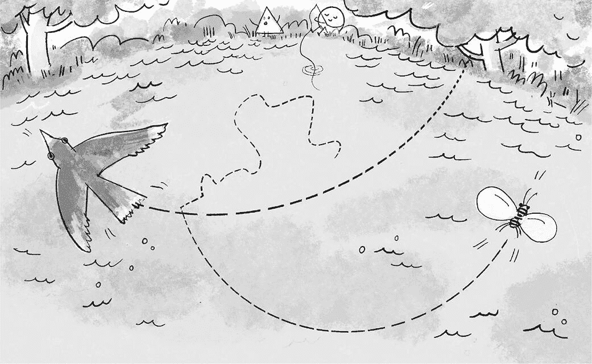
