## 第三章：**2 力**

*不要低估力量。*

—达斯·维达

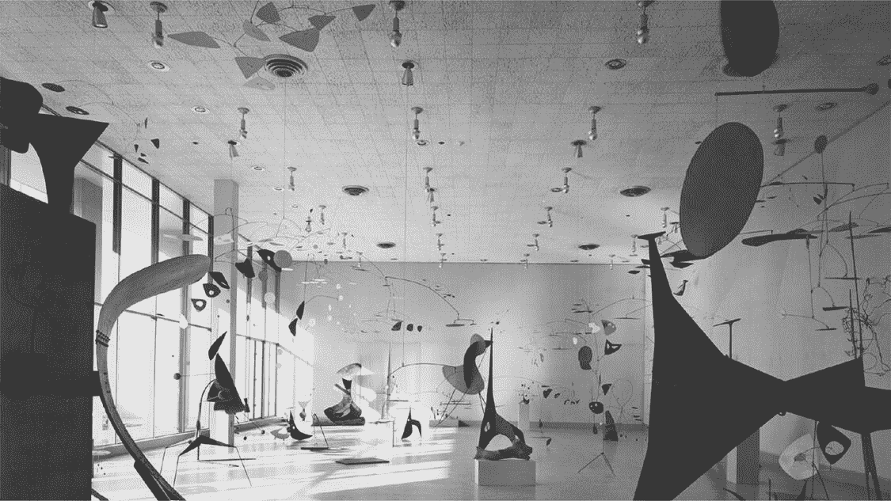

***卡尔德* 装置，位于麻省理工学院查尔斯·海登纪念图书馆新画廊，1950 年（照片由埃兹拉·斯托勒拍摄）**

亚历山大·卡尔德是 20 世纪美国艺术家，以其平衡形态与运动的动感雕塑而闻名。他的“星座”系列是由互相连接的形状和金属丝构成的雕塑，展示了张力、平衡和无处不在的重力吸引力。

在第一章的最后一个例子中，我演示了如何根据从画布上的一个圆形到鼠标位置的向量计算动态加速度。结果的运动类似于形状和鼠标之间的磁力吸引，好像有一个*力*正在将圆形拉向鼠标。在这一章中，我将详细阐述力的概念及其与加速度的关系。通过这一章的学习，目标是构建一个简单的物理引擎，并理解物体如何在画布上移动，响应各种环境力。

**物理引擎**是一个计算机程序（或代码库），用于模拟物体在物理环境中的行为。在 p5.js 草图中，物体是二维形状，环境是一个矩形画布。物理引擎可以开发得非常精确（需要高性能计算）或实时（使用简单快速的算法）。本章的重点是构建一个基础的物理引擎，强调速度和易于理解。

### **力与牛顿的运动定律**

让我们首先从概念上探讨什么是现实世界中的力。就像“向量”这个词一样，“力”这个词也可以有多种含义。它可以指强大的物理强度，像是“他们以极大的力量推动巨石”，也可以指强大的影响力，像是“他们是不可忽视的力量！”我在本章中感兴趣的**力**的定义更加正式，源自艾萨克·牛顿的三大运动定律：

力是一个向量，它使具有质量的物体加速。

希望你能认出定义的第一部分：*力是一个向量*。谢天谢地，你刚刚花了一整章学习向量是什么以及如何使用它们编程！我将从这里开始，解释牛顿的三大运动定律与向量之间的关系；然后，我会在接下来的讲解中展示力的其余定义。

#### **牛顿的第一定律**

牛顿的第一定律通常是这样表述的：

一个静止的物体保持静止，运动中的物体保持运动。

然而，这里缺少一个与力相关的重要元素。我可以通过以下方式扩展定义：

一个静止的物体保持静止，运动中的物体保持运动，以恒定的速度和方向，除非受到不平衡力的作用。

当牛顿提出理论时，流行的运动理论——由亚里士多德提出——已经有近 2000 年的历史。它认为，如果一个物体在运动，就需要某种力来保持它的运动。除非这个物体正在被推动或拉动，否则它会减速或停止。这个理论通过对世界的观察得到了验证。例如，如果你扔一个球，它会掉到地上并最终停止运动，似乎是因为投掷的力不再作用于它。

当然，这个旧理论并不正确。正如牛顿所确立的，在没有任何外力作用的情况下，不需要任何力来保持物体的运动。当物体（比如前面提到的球）在地球大气中被投掷时，它的速度会因为空气阻力和重力等看不见的力而发生变化。只有在没有任何力作用的情况下，物体的速度才会保持恒定，或者只有当作用于物体的各个力相互抵消时，物体的速度才会保持不变，这意味着净力的合力为零。这通常被称为**平衡**（见图 2.1）。当空气阻力与重力的作用力相等时，掉落的球将达到终端速度（并保持恒定）。

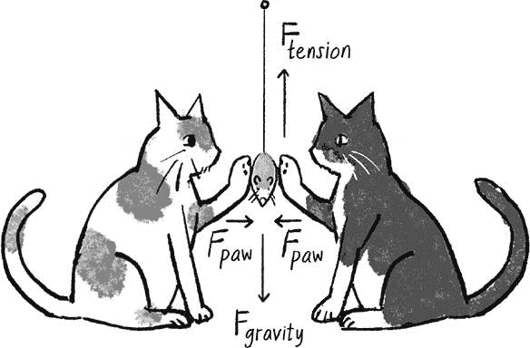

图 2.1：玩具鼠标不动，因为所有的力相互抵消（即它们的合力为零）。

考虑到 p5.js 画布，我可以这样重新表述牛顿的第一定律：

如果物体处于平衡状态，它的速度向量将保持恒定。

换句话说，在`Mover`类中，`update()`函数不应该对速度向量进行任何数学运算，除非存在非零的净力。

#### **牛顿的第三定律**

让我暂时搁置牛顿的第二定律（可以说是本书中最重要的定律），转而讨论他的第三定律。这个定律通常表述如下：

每一个作用力，都会有一个大小相等、方向相反的反作用力。

这种定律的表述经常引起混淆。首先，它听起来像是一个力引起另一个力。是的，如果你推一个人，这个人可能会*主动*决定反推你。但这并不是牛顿第三定律所指的作用和反作用。

假设你推墙。墙并不会主动决定反推你，但它仍然会以相等的反向力提供抵抗。没有“原始”力。你的推动同时包含了这两个力，这被称为*作用/反作用对*。因此，更准确地表述牛顿的第三定律可能是以下内容：

力总是成对出现。两个力的大小相等，但方向相反。

这仍然会引起混淆，因为它听起来像这些力总是会相互抵消。但事实并非如此。记住，这些力作用在不同的物体上。而且仅仅因为这两个力相等，并不意味着物体的运动是相等的（或物体会停止运动）。

想象一下推一个静止的卡车。尽管卡车的质量远大于你，但静止的卡车（与运动中的卡车不同）永远不会把你压倒并把你甩到后面。你双手对卡车施加的力与卡车对你双手施加的力大小相等、方向相反。结果取决于许多其他因素。如果卡车小且停在冰冻的街道上，你可能能够推动它。如果卡车很大，而且停在一条土路上，即使你用尽全力（甚至可能需要助跑），你也可能会伤到手。

如果你像图 2.2 那样穿着滑轮鞋推卡车呢？

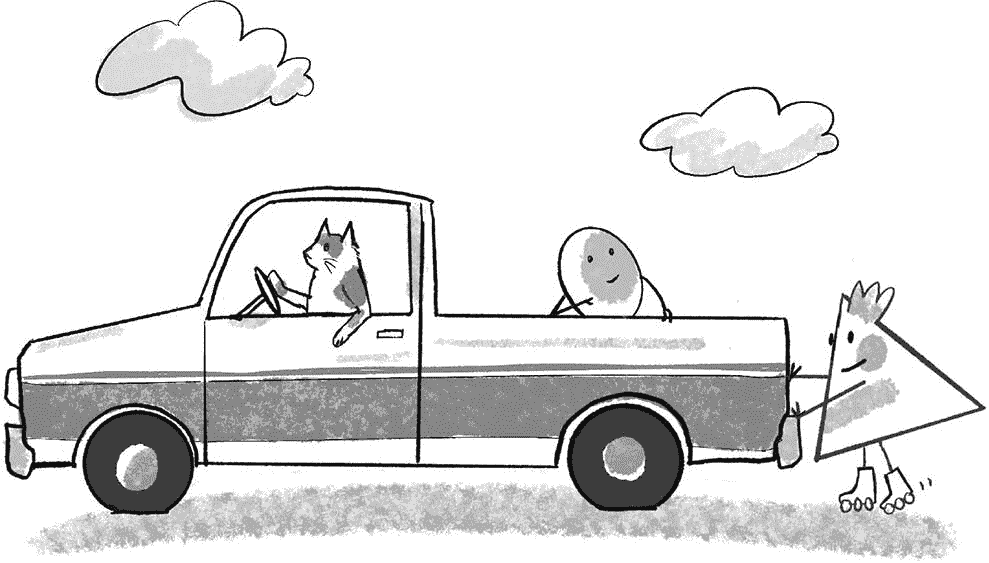

图 2.2：通过穿着滑轮鞋推重卡车来演示牛顿的第三定律

你会从卡车上加速滑开，沿着路面滑行，而卡车则保持不动。为什么你会滑动而卡车不会？首先，卡车的质量要大得多（我将在牛顿的第二定律中进一步解释）。还有其他的力在起作用——即卡车轮胎与你的滑轮鞋与路面之间的摩擦力。

再次考虑 p5.js，我可以这样重新表述牛顿的第三定律：

如果你计算了一个名为`f`的`p5.Vector`，表示物体 A 对物体 B 的力，你也必须施加物体 B 对物体 A 的反向力。你可以通过`p5.Vector.mult(f, -1)`来计算这个反向力。

你很快会发现，在编码仿真世界中，往往不需要严格遵循牛顿的第三定律。有时，例如在描述物体之间的引力时（参见示例 2.8），我会在示例代码中建模等大且反向的力。其他时候，比如说，“嘿，环境中有风”，我就不会去模拟物体对空气施加的反作用力。事实上，我甚至不会模拟空气！记住，本书中的示例从自然界的物理学中汲取灵感，目的是为了创意和互动性。它们不要求完全的精确性。

#### **牛顿的第二定律**

现在是时候为你，p5.js 编程者，介绍最重要的定律了：牛顿的第二定律。它的表述如下：

力等于质量乘以加速度。

或者：

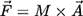

为什么这是本书中最重要的定律？嗯，我们换一种方式写出来：

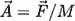

加速度与力成正比，与质量成反比。考虑一下如果你被推了会意味着什么。你越用力推，你的加速（加快或减速）就越快。另一方面，你越大，力对你的加速效果就越小！

 **重量与质量**

质量不能与重量混淆。**质量**是物体中物质的数量的度量（以千克为单位）。在地球上质量为 1 千克的物体，在月球上的质量仍然是 1 千克。

**重量**虽然常常被误认为是质量，但从技术上讲，它是物体所受的重力。根据牛顿第二定律，你可以通过质量乘以重力加速度（*w* = *m* × *g*）来计算重量。重量的单位是牛顿，它表示重力的大小。因为重量与重力相关，月球上的物体重量是地球的六分之一。

与质量相关的是**密度**，它被定义为单位体积内的质量（例如，克/立方厘米）。

在 p5.js 的世界里，质量到底是什么呢？我们不是在处理像素吗？让我们从简单的开始，假设在一个虚拟的像素世界里，所有物体的质量都等于 1。任何东西除以 1 都等于它本身，因此，在这个简单的世界里，我们就得到了这个：

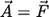

我实际上是将质量从方程中移除了，使得物体的加速度等于力。这是个好消息。毕竟，第一章描述了加速度是控制画布上物体运动的关键。我说过位置会根据速度变化，速度会根据加速度变化。加速度似乎是一切的起点。现在你可以看到，*力*才是真正的一切起点。

让我们看一下 `Mover` 类，其中包含位置、速度和加速度：

```
class Mover {
  constructor() {
    this.position = createVector();
    this.velocity = createVector();
    this.acceleration = createVector();
  }
}
```

现在的目标是能够将力应用到这个物体上，代码类似于这样：

```
mover.applyForce(wind);
```

或者像这样：

```
mover.applyForce(gravity);
```

这里，`wind` 和 `gravity` 是 `p5.Vector` 对象。根据牛顿的第二定律，我可以按如下方式实现 `applyForce()` 方法：

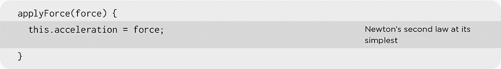

这个看起来挺不错的。毕竟，*加速度 = 力* 是牛顿第二定律的字面翻译（在没有质量的世界里）。不过，这段代码有一个相当大的问题，我将在回到我的原始目标时遇到：创建一个能够响应风力和重力的物体。考虑这段代码：

```
mover.applyForce(wind);
mover.applyForce(gravity);
mover.update();
```

假设你是计算机，先调用 `applyForce()` 并传入 `wind`，这样 `Mover` 对象的加速度就被赋值为 `wind` 向量。然后，调用 `applyForce()` 并传入 `gravity`，此时 `Mover` 对象的加速度就被赋值为 `gravity` 向量。最后，调用 `update()`。在 `update()` 中会发生什么？加速度被加到速度上：

```
this.velocity.add(this.acceleration);
```

如果你运行这段代码，你不会在控制台看到错误，但是哎呀！出现了一个大问题。当 `acceleration` 被加到 `velocity` 上时，它的值是多少？它等于 `gravity` 向量，意味着 `wind` 被忽略了！每次调用 `applyForce()` 时，`acceleration` 都会被覆盖。那我该如何处理多个力呢？

### **力的累积**

答案是这些力必须**累积**，或加在一起。这是牛顿第二定律完整定义中的内容，我现在承认自己简化了它。这里有一种更准确的表述方式：

净力等于质量乘以加速度。

换句话说，加速度等于*所有力的总和*除以质量。在任何给定时刻，可能有 1 个、2 个、6 个、12 个或 303 个力作用在物体上。只要物体知道如何将它们加在一起（累积它们），那么不管有多少个力都无所谓。总和会给出物体的加速度（再次忽略质量）。这完全合情合理。毕竟，正如你在牛顿第一定律中看到的那样，如果作用在物体上的所有力加起来为零，那么物体就处于平衡状态（即没有加速度）。

现在，我可以修改`applyForce()`方法来考虑力的累积：

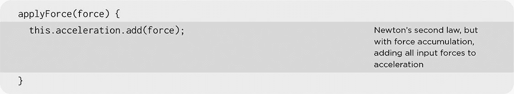

不过，我还没有完成。力的累积还有最后一部分。由于我在任何给定时刻都在将所有力加在一起，我必须确保在每次调用`update()`之前清除`acceleration`（将其设为`0`）。想象一下风的作用力。有时候风很强，有时候风很弱，有时候根本没有风。例如，你可能会写一段代码，当按住鼠标时会产生一阵风：

```
if (mouseIsPressed) {
  let wind = createVector(0.5, 0);
  mover.applyForce(wind);
}
```

当鼠标释放时，风应该停止，并且根据牛顿的第一定律，物体应该以恒定速度继续运动。然而，如果我忘记将`acceleration`重置为`0`，风的作用力仍然会继续生效。更糟的是，它会从前一帧叠加上去！在基于时间的物理模拟中，加速度是没有记忆的；它是根据任何给定时刻（帧）存在的环境力来计算的。这与位置不同。物体必须记住它的上一个位置，才能正确地移动到下一个位置。

清除每帧加速度的一种方法是在`update()`的末尾将`acceleration`向量乘以`0`：

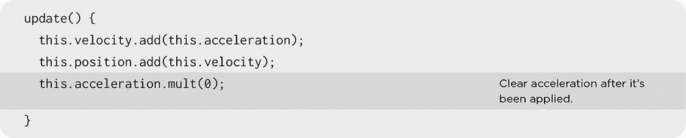

能够累积并应用力让我更接近一个可工作的物理引擎，但此时我应该指出我一直忽略的另一个细节，除了质量之外。那就是**时间步长**，即模拟更新的速率。时间步长的大小会影响模拟的准确性和行为，这也是为什么许多物理引擎将时间步长作为一个变量（通常表示为`dt`，即*delta time*，或时间的变化量）。为了简化，我选择假设每次通过`draw()`的循环代表一个时间步长。这个假设可能不是最准确的，但它让我能集中精力关注模拟的关键原理。

我会保持这个假设，直到第六章，那时我会探讨不同时间步长的影响，并介绍第三方物理库。不过，现在，我可以并且应该解决目前一直忽视的一个重大问题：质量。

 **练习 2.1**

使用力学模拟一个充气的氦气球向上浮动并碰到窗户顶端反弹的过程。你能否加入一个随时间变化的风力，可能是按照 Perlin 噪声的方式变化？

### **考虑质量**

牛顿的第二定律实际上是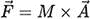，而不是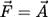。那么，如何将质量纳入模拟中呢？首先，通过向 `Mover` 类添加一个 `this.mass` 实例变量就能轻松实现，但我需要花更多时间探讨，因为有另一个即将出现的复杂问题。

但首先，我将加入质量：

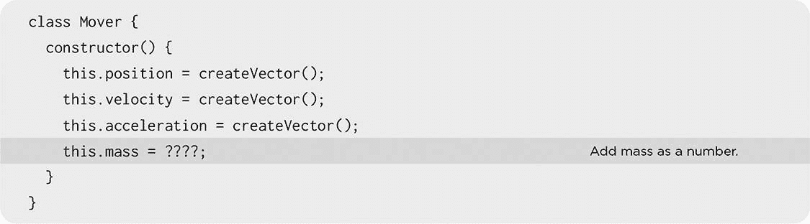

 **测量单位**

现在我在介绍质量时，重要的是要快速说明一下测量单位。在现实世界中，事物是用特定的单位来衡量的：两个物体相距 3 米，棒球的速度是每小时 90 英里，或者这个保龄球的质量是 6 千克。有时候，你确实需要考虑现实世界的单位。然而，在本章中，我将坚持使用像素作为测量单位（“这两个圆形相距 100 像素”）和动画帧数（“这个圆形每帧移动 2 像素”，即前面提到的时间步长）。

在质量的情况下，p5.js 没有可以使用的测量单位。那么每个像素的质量是多少呢？你或许可以发明一个属于你自己的 p5.js 质量单位，比如“10 像素体”或“10 尤克尔”。

为了演示，我将质量与像素挂钩（一个圆形的直径越大，其质量也越大）。这将让我能够可视化物体的质量，尽管这种做法并不准确。在现实世界中，大小并不意味着质量。一个小金属球的质量可能比一个大气球的质量要大得多，因为它的密度更高。对于两个具有相等密度的圆形物体，我还会指出，质量应该与圆的面积公式相关：π*r²。（这将在练习 2.11 中讨论，我会在第三章中详细讲解π和圆形的内容。）

质量是一个标量，而不是一个向量，它只是一个数字，用来描述物体中物质的多少。我可以使用复杂的方式，计算形状的面积作为它的质量，但更简单的方法是直接说：“嘿，这个物体的质量是……嗯，我不知道……那就定为 10 吧。”

```
constructor() {
  this.position = createVector(random(width), random(height));
  this.velocity = createVector(0, 0);
  this.acceleration = createVector(0, 0);
  this.mass = 10;
}
```

这样并不完美，因为只有当我拥有具有不同质量的物体时，事物才会变得有趣，但这足以让我们开始。质量在何处起作用呢？我需要将力除以质量，以便将牛顿的第二定律应用到物体上：

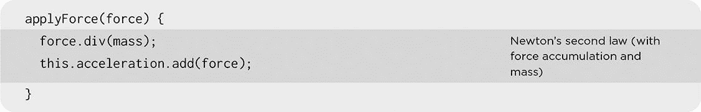

再次强调，尽管代码看起来相当合理，但它仍然存在一个重大问题。考虑以下情形，两个`Mover`对象都被风力吹走：

```
let moverA = new Mover();
let moverB = new Mover();

let wind = createVector(1, 0);

moverA.applyForce(wind);
moverB.applyForce(wind);
```

再次假设你是计算机。物体`moverA`接收到风力—(1, 0)—将其除以`mass`（10），然后将其添加到加速度中：

| **动作** | **向量分量** |
| --- | --- |
| `moverA`接收到风力。 | (1, 0) |
| `moverA`将风力除以 10 的质量。 | (0.1, 0) |

现在你继续到物体`moverB`。它也会收到风力—(1, 0)。等等，稍等一下。风力的值是多少？仔细看看，它实际上现在是(0.1, 0)! 记住，当你把一个物体（在这个案例中是`p5.Vector`）传入函数时，你传递的是该对象的引用，而不是它的副本！因此，如果一个函数对该对象做了修改（在这种情况下，它通过除以质量来修改），那么这个对象会被永久改变。但我不想让`moverB`收到由物体`moverA`的质量所除的力。我希望它收到的力是原始状态的—(1, 0)。因此，我必须保护原始向量，并在除以质量之前先复制它。

幸运的是，`p5.Vector`类有一个方便的方法来制作副本：`copy()`。它返回一个包含相同数据的新`p5.Vector`对象。所以，我可以按如下方式修改`applyForce()`：

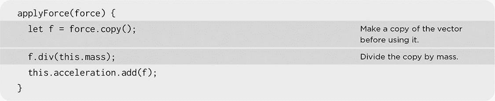

让我花点时间回顾一下到目前为止的内容。我已经定义了力是什么（一个向量），并且展示了如何将力应用到物体上（将其除以质量并加到物体的加速度向量中）。还缺少什么呢？嗯，我还没有弄清楚如何计算一个力。力到底来自哪里？

 **练习 2.2**

你可以用另一种方式编写`applyForce()`，使用静态方法`div()`而不是`copy()`。通过使用静态方法重写`applyForce()`。有关此练习的帮助，请参考第 64 页的“静态方法与非静态方法”部分。

```
applyForce(force) {
  let f = p5.Vector.div(force, this.mass);
  this.acceleration.add(f);
}
```

### **创建力**

本节介绍了两种在 p5.js 世界中创建力的方法：

+   **制造一个力！** 毕竟，你是程序员，你是你世界的创造者。没有理由你不能直接编造一个力并应用它。

+   **模拟一个力！** 力在物理世界中存在，物理学教科书中通常包含这些力的公式。你可以把这些公式转化成源代码，在 JavaScript 中模拟现实世界的力。

首先，我将专注于第一种方法。制造一个力的最简单方法就是选择一个数字（或者两个数字）。我们从模拟风力开始。假设一个风力向右并且相当弱，怎么样？假设有一个物体`mover`，那么代码如下所示：

```
let wind = createVector(0.01, 0);
mover.applyForce(wind);
```

结果并不特别有趣，但这是一个很好的起点。我创建了一个`p5.Vector`对象，初始化它，并将其传递给`Mover`对象（后者将其应用到自己的加速度中）。为了完成这个示例，我会再添加一个力——重力（指向下方），并且只有在按下鼠标时才激活风力。

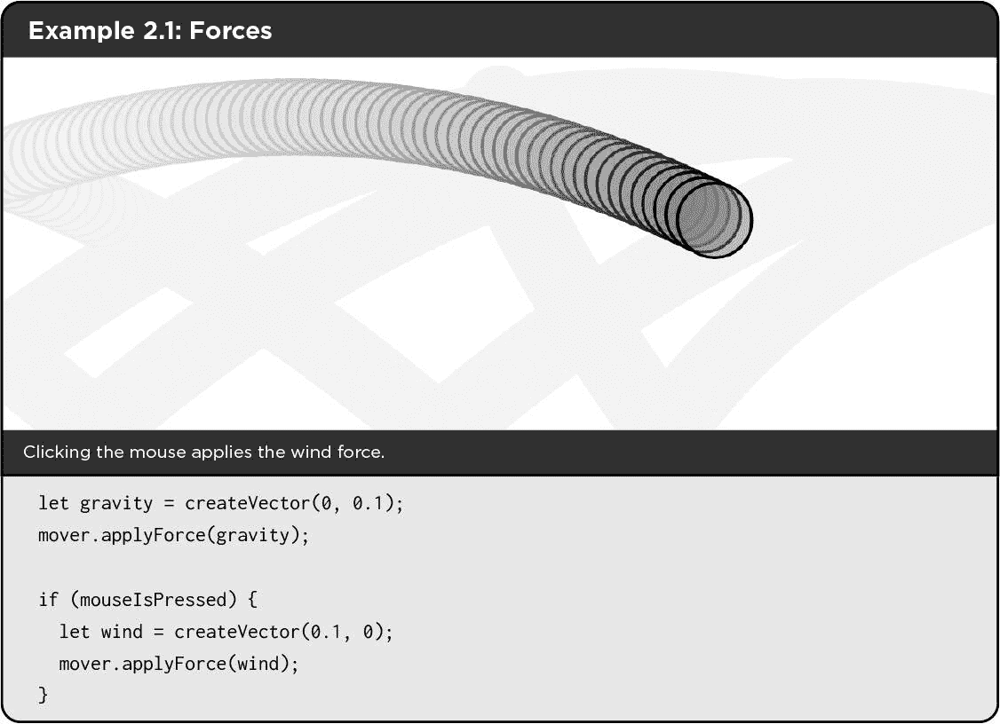

现在，我有两个力，分别指向不同的方向，并且大小不同，这两个力都作用在`mover`对象上。我已经有所进展了。我创建了一个世界，一个充满力的环境，这些力作用于物体！

让我们来看一下，当我添加一个具有可变质量的第二个对象时会发生什么。为了做到这一点，你可能需要快速回顾一下面向对象编程（OOP）。再说一遍，我不会在这里覆盖所有编程基础（如果需要了解这些，可以参考《The Coding Train Connection》中的任何 p5.js 入门书籍或视频教程，详情见页面 xxx）。然而，由于创建一个充满物体的世界是本书所有示例的基础，因此值得花点时间走一遍从一个对象到多个对象的步骤。

这是我在`Mover`类中的进展。注意，它与在第一章中创建的`Mover`类完全相同，只是增加了两个内容：`mass`和一个新的`applyForce()`方法：

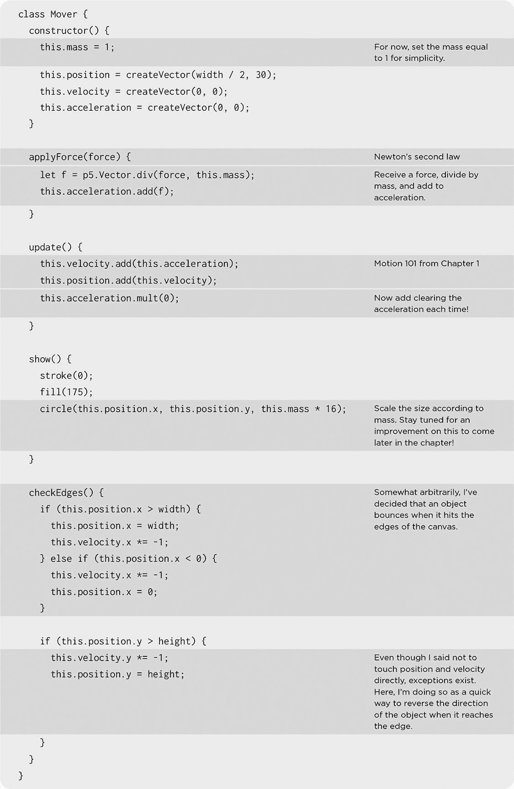

既然类已经写好，我可以创建多个`Mover`对象了：

```
let moverA = new Mover();
let moverB = new Mover();
```

但是有一个问题。再看看`Mover`对象的构造函数：

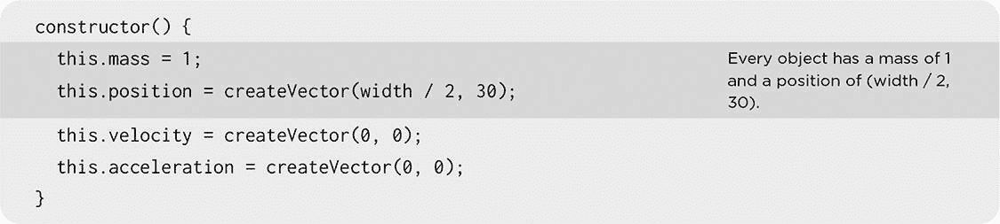

现在，每个`Mover`对象都是完全相同的。我想要的是具有*可变*质量并且从*可变*位置开始的`Mover`对象。一种实现这个目标的好方法是使用构造函数参数：

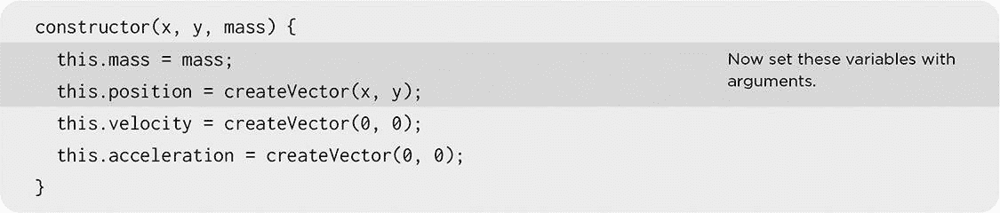

注意，质量和位置不再设置为硬编码的数字，而是通过传递给构造函数的`x`、`y`和`mass`参数来初始化。这意味着我可以创建各种各样的`Mover`对象——大号的、小号的、从画布左侧开始的、从右侧开始的，以及介于两者之间的各种对象：

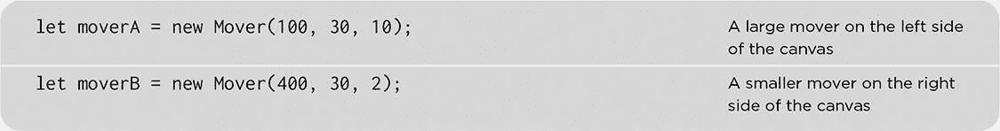

我可以选择以各种方式初始化值（随机、Perlin 噪声、网格等）。在这里，我只是选择了一些数字用于演示目的。接下来我会在整本书中介绍其他初始化模拟的方法。

一旦对象被声明并初始化，剩下的代码就像以前一样继续。对于每个对象，将环境中的力传递给`applyForce()`方法，享受过程吧！

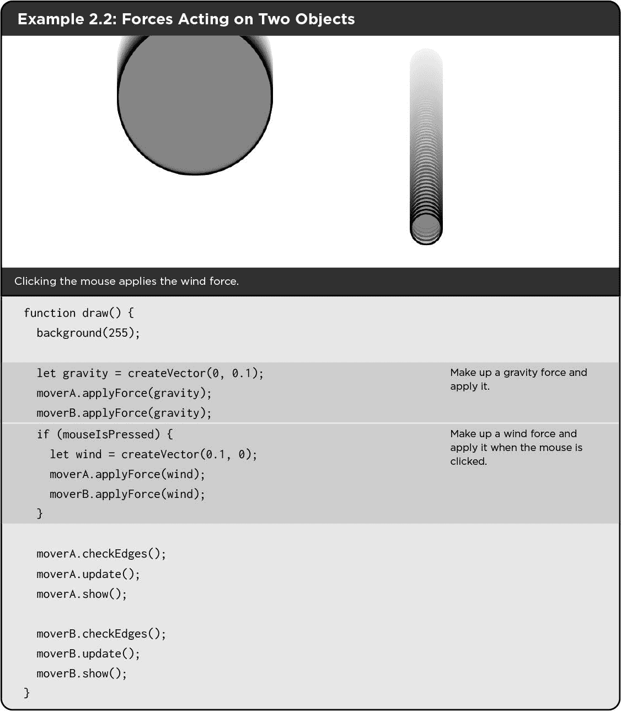

请注意，代码中的每个操作都写了两遍，一次用于`moverA`，一次用于`moverB`。实际上，使用数组管理多个`Mover`对象比使用单独的变量更合适，尤其是当这些对象的数量增加时。这样，我只需写一次操作，并使用循环将其应用于数组中的每个`Mover`。我将在本章稍后演示这一点，并在第四章中更详细地讲解数组。

 **练习 2.3**

不再让物体从墙的边缘弹回，而是创建一个示例，加入一个看不见的力，推动物体保持在窗口内。你能根据物体距离边缘的远近来调整这个力的大小吗？也就是说，物体越靠近边缘，受到的力越大？

 **练习 2.4**

修复画布边缘的反弹问题，使得当圆的边缘碰到边界时改变方向，而不是它的中心。

 **练习 2.5**

创建一个可变的风力。你能使它具有交互性吗？例如，可以考虑鼠标所在位置的风扇，并让风扇朝着圆形物体吹。

当你运行示例 2.2 中的代码时，会注意到小圆对施加的力的反应比大圆更为剧烈。这是因为公式 *加速度 = 力除以质量*。质量在分母中，因此质量越大，加速度越小。这对于风力来说是合理的——物体的质量越大，风推它的难度越大——但这种解释对模拟地球引力是否准确呢？

如果你爬到比萨斜塔的顶部，扔下两个质量不同的球，哪个会先落地？根据传说，伽利略在 1589 年进行了这项实验，发现它们以相同的加速度下落，同时撞击地面。为什么会这样？我稍后会深入探讨这个问题，简短的答案是，虽然重力的大小是根据物体的质量来计算的——物体越大，重力越强——但当你通过质量来确定加速度时，这个力会被质量抵消。因此，不同物体的重力加速度是相等的。

对草图的一个快速修正——它更接近于真实地模拟一个力，而不仅仅是编造一个力——就是通过将重力力与质量相乘来实现这种缩放。

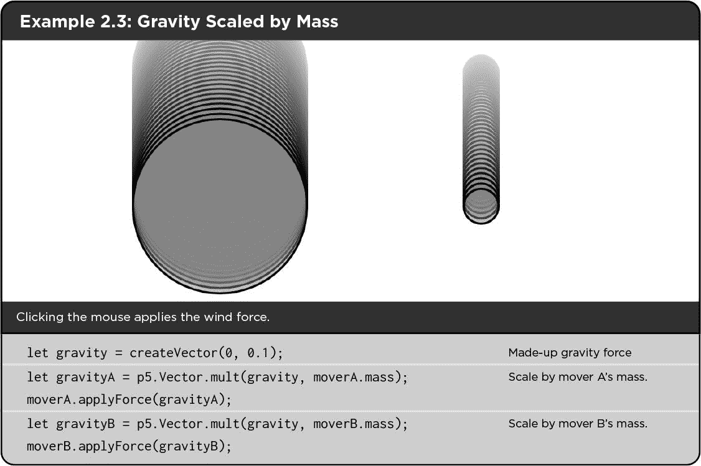

现在这些物体以相同的速度下落。我仍然基本上是通过任意将重力设定为 0.1 来构造重力力，但通过根据物体的质量来调整力，我让它的表现更接近地球实际的引力。与此同时，由于风力的强度与质量无关，当按下鼠标时，较小的圆仍然加速向右移动得更快。（这个示例的在线代码也包含了练习 2.4 的解决方案，添加了一个`radius`变量到`Mover`类中。）

### **建模一个力**

构造力实际上可以让你走得很远——毕竟，我刚刚构造了一个相当好的地球重力近似。最终，p5.js 的世界是一个像素的交响乐，而你是指挥，所以无论你认为应该是什么样的力，嗯，那就应该是那种力！然而，可能会有这么一刻，你会想，“但这一切*究竟*是如何运作的？”那时，建模力而不是单纯构造它们就变得至关重要了。

 **解析公式**

稍后，我将写出摩擦力的公式。这不是你第一次在本书中看到公式；我刚刚完成了对牛顿第二定律的讨论，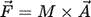（或者说力等于质量乘以加速度）。希望你没有花太多时间担心那个公式，因为它只是几个字符和符号。然而，外面的世界是可怕的。只要看看正态分布的方程式，我在“随机数的正态分布”一节中讲解过（没有给出公式），请见第 13 页：

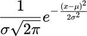

公式通常由许多符号表示（通常包括希腊字母）。这是摩擦力的公式（如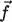所示）：

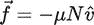

如果你有一段时间没有查看过数学或物理课本中的公式，那么在继续之前，有三个关键点需要讲清楚：

+   **评估右侧；赋值给左侧。** 这就像在编程中一样！在前面的例子中，左侧表示我要计算的内容——摩擦力——右侧则详细说明了如何计算它。

+   **我是在谈论一个向量还是标量？** 重要的是要意识到，在某些情况下，你将计算一个向量；在其他情况下，计算的是标量。例如，在这种情况下，摩擦力是一个向量。它由*f*上方的箭头表示。它有一个大小和方向。方程式的右侧也有一个向量，如符号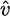所示，这在此情况下代表速度单位向量。

+   **当符号放在一起时，通常表示它们相乘。** 摩擦力公式的右侧有四个元素：–、*µ*、*N* 和 。

    它们应该相乘，公式可以读作

    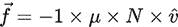。

打开任何一本高中物理教科书，你会看到描述各种力的图示和公式——重力、电磁力、摩擦力、拉力、弹性力等等。在本章的剩余部分，我将考虑三种力——摩擦力、阻力和重力吸引力，并展示如何使用 p5.js 对它们建模。我要强调的不是这些力是你在模拟中总是需要的基本力，而是将这些力作为案例研究，展示以下过程：

1.  理解力背后的概念

1.  将力的公式分解成两部分：

    1.  如何计算力的方向？

    1.  如何计算力的大小？

1.  将这个公式翻译成 p5.js 代码，计算一个向量并传递给 `Mover` 对象的 `applyForce()` 方法

如果你能跟随我提供的这些示例力的步骤，那么希望当你在凌晨三点谷歌查询*原子核弱核力*时，你能够具备将找到的信息转换并应用于 p5.js 的技能。

#### **摩擦力**

我们从摩擦力开始，遵循前面的步骤。每当两个表面接触时，它们都会经历**摩擦力**。摩擦力是一种**耗散力**，意味着它会将物体的动能转化为另一种形式，给人以损失或耗散的印象。

假设你正在开车。当你踩下刹车踏板时，汽车的刹车系统通过摩擦力减慢轮胎的运动。动能（运动）被转化为热能（热量）。一个完整的摩擦力模型会包括静摩擦力（物体静止在表面上）和动摩擦力（物体在表面上运动）的不同情况，但为了简化起见，我这里只会处理动摩擦力的情况。图 2.3 展示了摩擦力的公式。

由于摩擦力是一个向量，让我将这个公式分成两部分，来确定摩擦力的方向和大小。图 2.3 表明，*摩擦力与速度的方向相反*。实际上，这正是公式中说的！图片，或者说是速度单位向量的负一倍。在 p5.js 中，这意味着将一个物体的速度向量乘以`-1`：

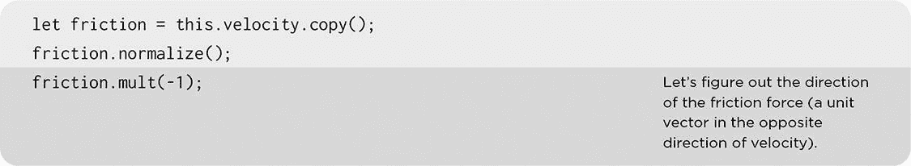

注意这里有两个额外的步骤。首先，重要的是要复制速度向量，因为我不希望不小心反转物体的运动方向。其次，向量被标准化。这是因为摩擦力的大小与物体的速度无关，我希望从长度为 1 的向量开始，以便可以轻松缩放。

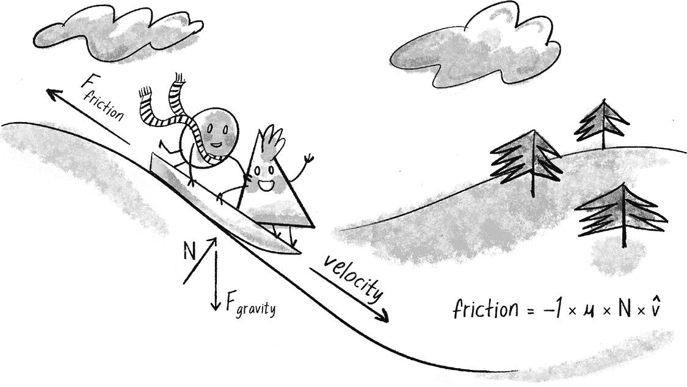

图 2.3：摩擦力是指在雪橇与山坡接触滑行时，摩擦力与雪橇的速度方向相反。

根据公式，大小为*µ* × *N*。这里使用希腊字母*mu*（*µ*，发音为*mew*）来表示**摩擦系数**。摩擦系数决定了特定表面的摩擦力强度。它越高，摩擦力越强；越低，摩擦力越弱。例如，一块冰的摩擦系数远低于砂纸。由于这是一个假想的 p5.js 世界，我可以任意设置摩擦系数来调整摩擦力的强度：

```
let c = 0.01;
```

现在进入第二部分。*N*表示**法向力**，是与物体沿表面运动方向垂直的力。可以把它想象成一辆车沿道路行驶的情形。车子在重力作用下压向道路，牛顿的第三定律告诉我们，路面会反过来对车辆施加一个力，这就是法向力。重力越大，法向力也越大。

如你将在下一部分看到的，重力吸引与质量相关，因此一辆轻量级的跑车将比一辆重型拖车卡车遭遇更少的摩擦力。然而，在图 2.3 中，由于物体沿斜面运动，计算法向力的大小和方向会更加复杂，因为它并不指向与重力相反的方向。你需要了解一些角度和三角学的知识。

所有这些细节都很重要；然而，若不考虑这些，也能实现一个“足够好的”模拟。例如，我可以假设法向力的大小始终为 1，从而让摩擦力起作用。当我在下一章学习三角学时，你可以回到这个问题，将摩擦力的例子做得更复杂。因此：

```
let normal = 1;
```

现在，我已经得到了摩擦力的大小和方向，可以将它们整合到代码中：

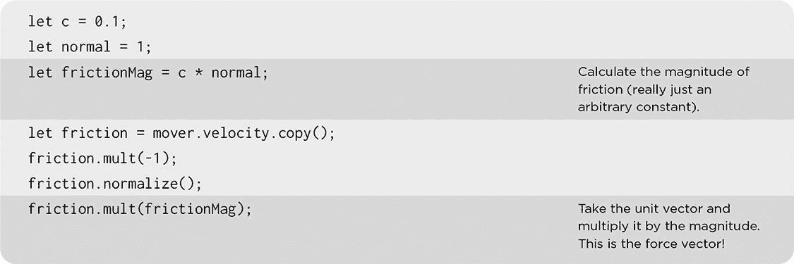

这段代码计算了摩擦力，但没有回答*何时*应用摩擦力的问题。这个问题没有答案，当然，因为这一切都只是一个在 2D p5.js 画布上可视化的虚构世界！我会做出一个任意但合乎逻辑的决定：当圆形与画布底部接触时应用摩擦力，我可以通过向`Mover`类中添加一个名为`contactEdge()`的函数来检测这一点：

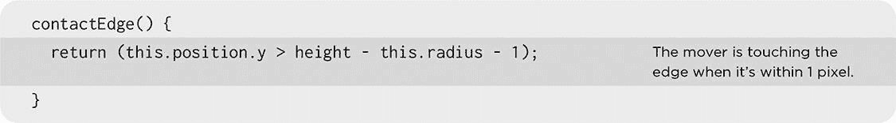

现在正是我要提到的时候，这里的实际边缘反弹模拟了*理想化的弹性碰撞*，这意味着当圆圈和边缘碰撞时不会损失动能。在真实世界中很少见；拿起一个网球并将其抛到任何表面，它反弹的高度将逐渐降低直到靠在地面上。这里有许多因素在起作用（包括下一节将涵盖的空气阻力），但模拟非弹性碰撞的快速方法是通过每次反弹减少速度的百分比来减少速度大小：

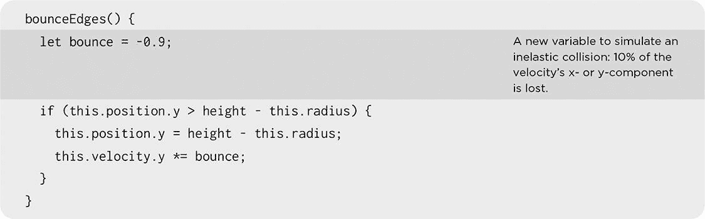

最后，我可以将所有这些部分添加到示例 2.3 的代码中，并模拟物体经历三种力：风（当点击鼠标时）、重力（始终）、以及现在的摩擦力（当接触到画布底部时）。

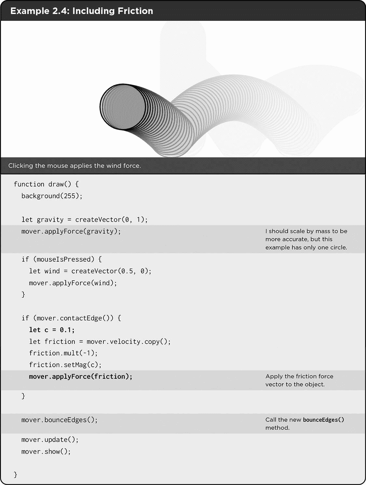

运行此示例，您会注意到圆圈最终会停止。通过调整摩擦系数以及在`bounceEdges()`方法中失速速度的百分比，可以使此过程更快或更慢。

 **练习 2.6**

向示例 2.4 添加第二个对象。如何处理具有不同质量的两个对象？如果每个对象相对于底部表面都有自己的摩擦系数，那么怎么处理？将摩擦力计算封装到`Mover`方法中是否有意义？

 **练习 2.7**

而不是风，您是否可以添加功能以通过鼠标交互抛掷圆圈？

#### **空气和流体阻力**

当物体穿过液体或气体时，也会产生摩擦。所产生的力有许多名称，实际上都是指同一件事情：*粘性力*、*阻力*、*空气阻力*或*流体阻力*（参见图 2.4）。

阻力的效果与我们以前摩擦示例中的效果最终相同：物体减速。然而，阻力的确切行为和计算略有不同。以下是公式：

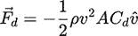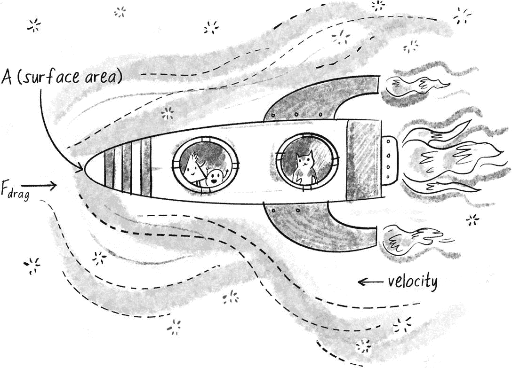

图 2.4：阻力（空气或流体阻力）与物体速度成比例，以及其表面积方向相反于物体速度的矢量。

让我解释一下，看看在 p5.js 中实现有效模拟的真正必要条件，同时简化公式：

+    指的是*阻力*，这个向量用于计算并传递给`applyForce()`方法。

+   –1/2 是一个常数：–0.5。虽然它是一个缩放力的重要因子，但在这里并不特别相关，因为我将为其他缩放常数指定数值。然而，它是负数这一点很重要，因为它表示力指向与速度相反的方向（就像摩擦力一样）。

+   *ρ*是希腊字母*rho*，另一个常数，表示液体的密度。现在我决定忽略它，假设它的值为 1。

+   *v*指的是运动物体的速度。好吧，这个你应该明白！物体的速度是速度向量的大小：`velocity.mag()`。*v*²则表示*v*的平方，或*v × v*。（我会注意到，这假设液体或气体是静止的，如果你把物体投入流动的河水中，你还必须考虑水流的相对速度。）

+   *A*指的是物体在液体或气体中推动的正面表面积。想象一张平纸从空中掉下，和一支尖锐的铅笔直线向下比较。铅笔会遇到较少的拖曳力，因为它的正面表面积在运动方向上较小。同样，这也是一个常数，为了保持实现的简单性，我将假设所有物体都是球形的，并忽略这个因素。

+   *C[d]*是拖曳系数，和摩擦系数（µ）完全相同。这个常数将决定拖曳力的相对强度。

+   看起来应该很熟悉。这是速度单位向量，通过`velocity.normalize()`得到。就像摩擦力一样，拖曳力是一个指向速度相反方向的力。

现在，我已经分析了这些部分并确定了我的仿真所需的内容，我可以简化公式，如图 2.5 所示。

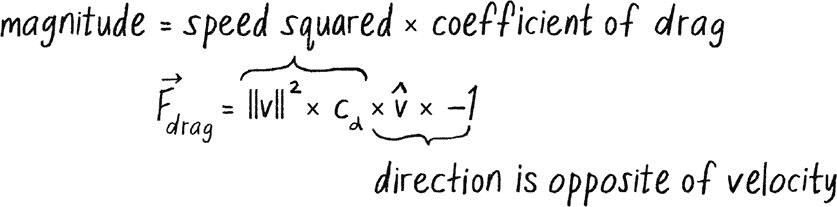

图 2.5：我的简化拖曳力公式

虽然我已经把简化公式写成只有*C[d]*作为唯一的常数，代表拖曳系数，但我也可以把它看作是所有常数的组合（−1/2，*ρ*，*A*）。一个更复杂的仿真可能会分别处理这些常数；你可以尝试将它们分别考虑作为练习。

下面是简化拖曳公式的 p5.js 版本：

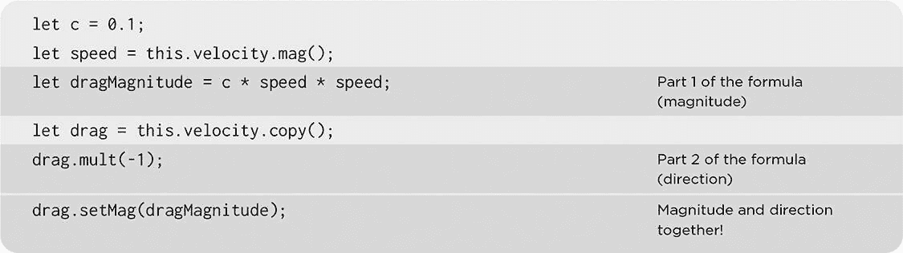

让我们在`Mover`示例中实现这个力。但我应该什么时候应用它呢？之前，我启用了摩擦力，以便当物体与画布底边接触时减速。现在，我将为环境引入一个新的元素：一个`Liquid`对象，当物体穿过它时，它会施加一个阻力。这个“液体”将作为一个矩形绘制，具有位置、宽度和高度，并且会有一个阻力系数，决定物体是否容易穿过它（像空气一样）或难以穿过它（像糖浆一样）。此外，`Liquid`将包含一个`show()`方法，这样我们就可以在画布上看到液体：

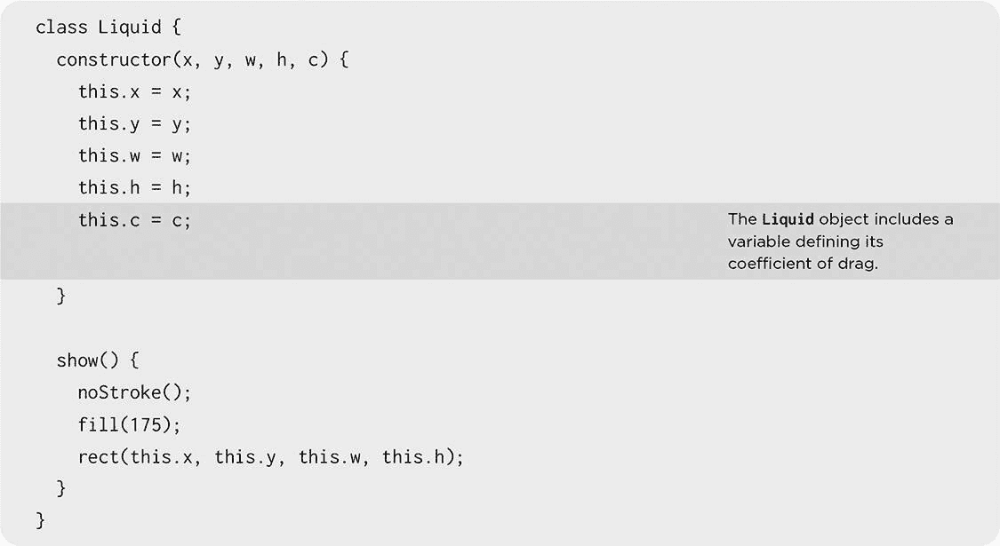

现在，草图需要一个`liquid`变量，在`setup()`中初始化。我将在画布的下半部分放置液体：

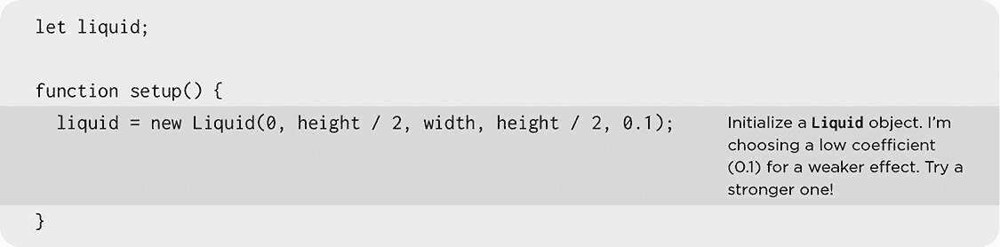

现在来了一个有趣的问题：`Mover`对象如何与`Liquid`对象进行交互呢？我想实现以下功能：

*当一个移动物体穿过液体时，那个物体会经历一个阻力。*

用面向对象的术语来翻译：

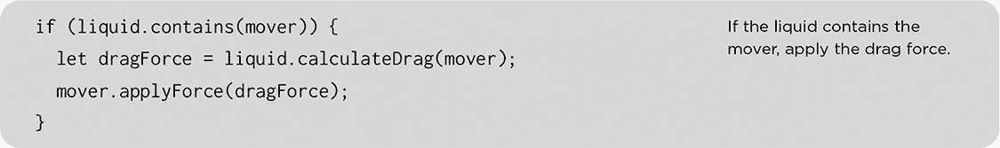

这段代码是我需要添加到`Liquid`类中的指令：（1）一个`contains()`方法，判断一个`Mover`对象是否位于`Liquid`对象的区域内，和（2）一个`drag()`方法，计算并返回应施加于`Mover`的适当阻力。

第一个很简单；我可以使用布尔表达式来判断`position`向量是否位于液体定义的矩形内部：

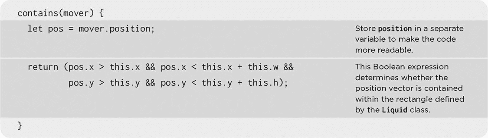

`calculateDrag()`方法也很简单：当我实现简化的阻力公式时，实际上我已经为它写好了代码！阻力等于*阻力系数乘以物体速度的平方，并且方向与速度相反*：

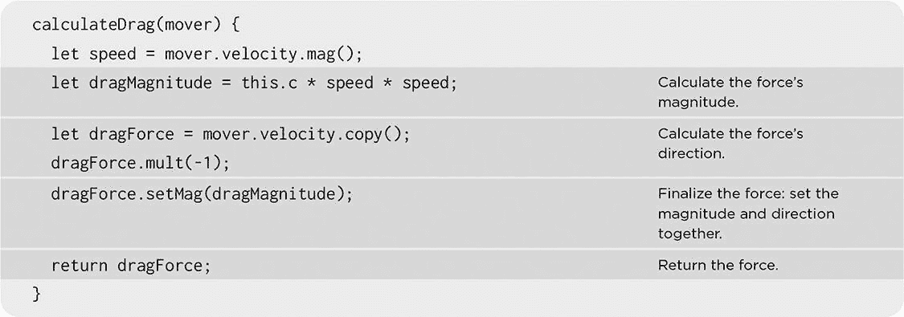

添加了这两个方法到`Liquid`类之后，我准备好将所有代码整合在一起了！在下面的示例中，我将扩展代码，使用一个均匀间隔的`Mover`对象数组，来展示不同质量物体在阻力作用下的行为。这也展示了除随机初始化外的另一种模拟初始化方法。请在代码中查找`40 + i * 70`。`40`的初始偏移提供了从画布边缘的小间隔，而`i * 70`则使用对象的索引来均匀地间隔这些移动物体。间隔和乘数是任意的；你可以尝试其他值，或者考虑根据画布尺寸计算间隔的其他方法。


运行示例时，你可能会注意到它似乎模拟了物体掉入水中的过程。物体只有在穿越窗口底部的灰色区域（代表液体）时才会减速。你还会注意到，较小的物体比较大的物体减速得更多。记得牛顿的第二定律吗？加速度等于力*除以质量* 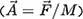，所以质量大的物体加速较慢，而较小的物体加速较快。在这种情况下，加速度是由于阻力导致的减速。较小的物体比较大的物体减速得更快。

 **练习 2.8**

你可能会注意到，如果你在示例 2.5 中将阻力系数设置得太高，圆圈可能会从液体中反弹出来！这是由于我在本章前面提到的大时间步长的不准确性。阻力会让物体停止，但永远不会改变方向。你如何使用`limit()`方法来修正这个问题？你也可以尝试从不同高度掉落物体。这会如何影响它们碰到液体时的阻力？

 **练习 2.9**

原始的阻力公式包括了表面积。你能创建一个模拟让箱子掉入水中，并且其阻力与碰撞水面的边长有关的效果吗？

 **练习 2.10**

除了阻力是与速度矢量方向相反的力外，阻力还可以是垂直的。这个被称为**升力引起的阻力**，它会导致机翼倾斜的飞机升高。试着创建一个升力的模拟。

#### **引力**

可能最著名的力就是引力。我们地球上的人类把重力看作是物体掉下去，比如苹果砸在艾萨克·牛顿爵士的头上。但这只是我们对重力的*经验*。现实要复杂得多。

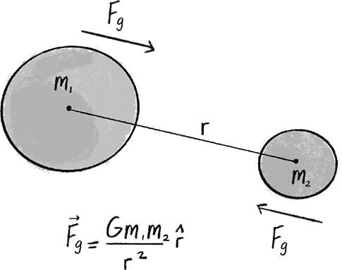

图 2.6：两物体之间的引力与这些物体的质量成正比，与它们之间距离的平方成反比。

事实上，就像地球由于引力将苹果拉向它一样，苹果也会拉地球（这是牛顿第三定律）。地球太庞大了，以至于它压倒了所有其他的重力作用。事实上，每一个有质量的物体都会对每个其他物体施加引力。计算这些力的强度的公式如图 2.6 所示。

让我们更仔细地检查一下这个公式：

+   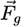 指的是引力力，计算该力并传递给`applyForce()`方法。

+   *G* 是*万有引力常数*，在我们的世界中等于 6.67428 × 10^(–11) 立方米每千克每秒平方。如果你是人类，这个数字非常重要，但如果你只是一个在 p5.js 画布上游荡的形状，那它就不那么重要了。它仍然是一个常数，可以用来缩放世界中的引力，使其变强或变弱。将其设置为 1 并忽略它也不是一个糟糕的选择。

+   *m*[1] 和 *m*[2] 分别是物体 1 和物体 2 的质量。正如我在最初使用牛顿第二定律时所做的那样 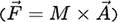，质量也是我可以选择忽略的东西。毕竟，屏幕上绘制的形状没有物理质量。然而，如果你跟踪这个值，你可以创建更有趣的模拟，其中“更大”的物体比“更小”的物体施加更强的引力。

+    指的是从物体 1 指向物体 2 的单位向量。正如你马上会看到的，这个方向向量可以通过将一个物体的位置减去另一个物体的位置来计算。

+   *r*² 是两个物体之间的距离的平方。

花点时间思考这个公式。公式顶部的所有内容——*G*、*m*[1]、*m*[2]——其值越大，力就越强。大质量，大力。大 *G*，大力。然而，底部的 *r*² 则相反：其值越大（物体越远），力就越弱。从数学上讲，引力的强度与距离的平方**成反比**。

现在是时候弄清楚如何将这个公式转换成 p5.js 代码了。为此，我做出以下假设：

+   这里有两个物体。

+   每个物体都有一个位置：`position1` 和 `position2`。

+   每个物体都有一个质量：`mass1` 和 `mass2`。

+   变量 `G` 代表万有引力常数。

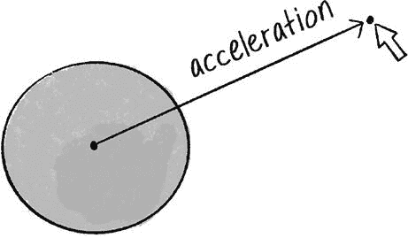

图 2.7：指向鼠标位置的加速度向量

在这些假设下，我想计算一个向量，即引力。我会分两部分来计算。首先，我将计算力的方向 ( 在公式中)。其次，我将根据质量和距离计算力的大小。

记得在第一章中，我创建了一个朝向鼠标加速的物体（见图 2.7）吗？正如我当时所展示的，一个向量可以被看作是两个点之间的差异，所以要计算一个从圆圈指向鼠标的向量，我将一个点减去另一个点：

```
let direction = p5.Vector.sub(mouse, position);
```

现在我可以做同样的事情来计算 。物体 1 对物体 2 施加的引力方向等于以下内容：

```
let direction = p5.Vector.sub(position1, position2);
direction.normalize();
```

别忘了，因为我需要一个单位向量，它只表示方向，所以在减去位置后，*标准化*向量是很重要的。（稍后，我可能会跳过这一步，直接使用 `setMag()`。）

现在我已经有了力的方向，接下来需要计算它的大小，并相应地缩放这个向量：

```
let magnitude = (G * mass1 * mass2) / (distance * distance);
dir.mult(magnitude);
```

唯一的问题是我不知道距离。`G`、`mass1` 和 `mass2` 的值都是已知的，但我需要计算 `distance`，才能让前面的代码生效。但是等等，我不是刚才创建了一个从一个对象位置指向另一个对象的向量吗？这个向量的长度应该就是这两个对象之间的距离（见图 2.8）。

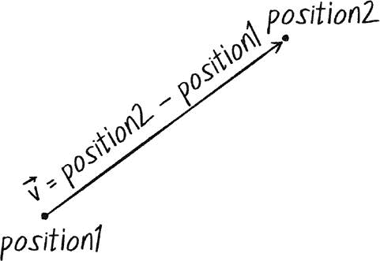

图 2.8：一个从一个位置指向另一个位置的向量是通过计算两个位置之间的差值得出的。

的确，如果我再加一行代码，在归一化向量之前获取该向量的大小，就能得到距离。这个时候，我将跳过 `normalize()` 步骤，改用 `setMag()`：

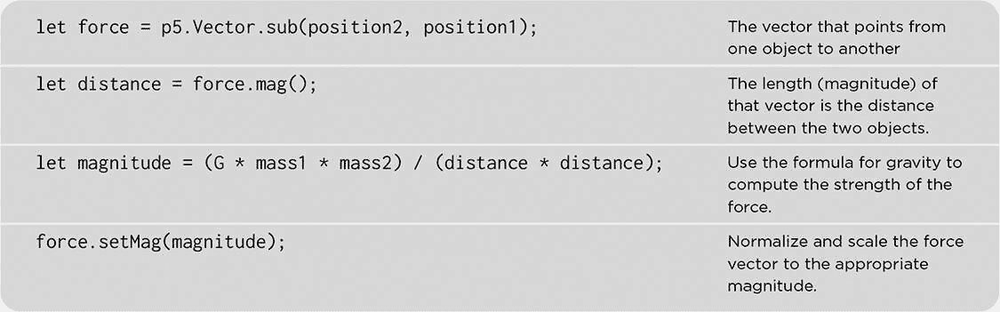

请注意，我还将 `direction` 向量的名称更改为 `force`。毕竟，当计算完成后，我最初创建的向量最终成为了我一直想要的实际力向量。

现在，我已经完成了计算吸引力的数学公式和代码（模拟引力作用），让我们将注意力转向在实际的 p5.js 草图中应用这一技巧。我将继续使用 `Mover` 类作为起点——一个模板，用来创建具有位置、速度和加速度向量的对象，以及一个 `applyForce()` 方法。我将把这个类放到草图中，并添加以下内容：

+   一个单一的 `Mover` 对象

+   一个单一的 `Attractor` 对象（一个具有固定位置的新类）

`Mover` 对象将会受到朝向 `Attractor` 对象的引力作用，如图 2.9 所示。

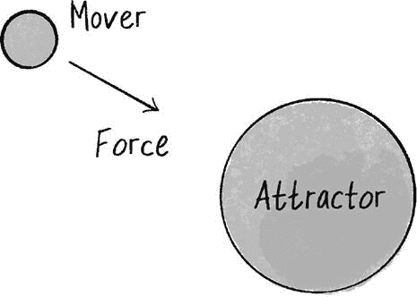

图 2.9：一个 `mover` 和一个 `attractor`。`mover` 受到朝向 `attractor` 的引力作用。

我将从创建一个基本的 `Attractor` 类开始，赋予它一个位置和质量，并添加一个绘制自身的方法（将质量与大小挂钩）：

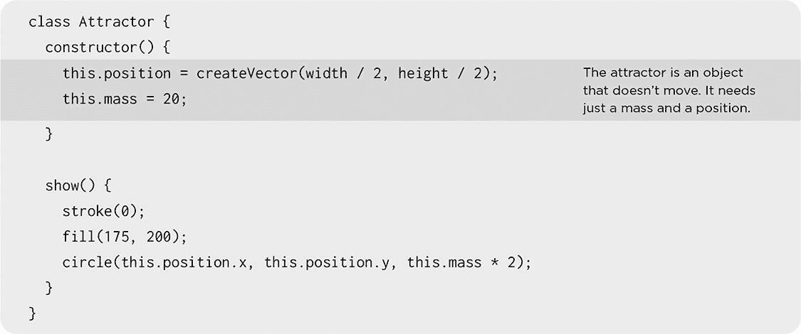

在草图中，我将添加一个变量来保存 `Attractor` 对象的实例：

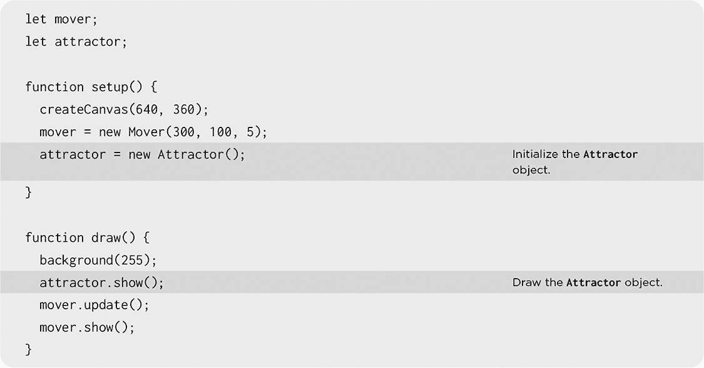

这是一个不错的开始：一个包含 `Mover` 对象和 `Attractor` 对象的草图，它们是通过类来管理 `movers` 和 `attractors` 的变量和行为。最后的难题是如何让一个对象吸引另一个对象。这两个对象如何进行通信呢？这可以通过多种方式实现。以下是其中的一些可能性：

| **任务** | **功能** |
| --- | --- |

|

1.  一个全局函数，接收 `Attractor` 和 `Mover` 两个对象。

|

```
attraction(attractor, mover);  
```

|

|

1.  `Attractor` 类中的一个方法，接收一个 `Mover`。

|

```
attractor.attract(mover);  
```

|

|

1.  `Mover` 类中的一个方法，接收一个 `Attractor`。

|

```
mover.attractedTo(attractor);  
```

|

|

1.  `Attractor` 类中的一个方法，它接收一个 `Mover` 对象并返回一个 `p5.Vector`，也就是引力。然后，这个引力会传入 `Mover` 对象的 `applyForce()` 方法。

|

```
let force = attractor.attract(mover);
mover.applyForce(force);  
```

|

考虑各种选项是有益的，你或许能为每种方法提出论据。我至少想排除第一种方法，因为我倾向于选择面向对象的方法，而不是一个与 `Mover` 或 `Attractor` 类都没有关联的任意函数。选择第二种还是第三种方法，区别在于说，“引力源吸引了移动物体”和“移动物体被引力源吸引”之间的不同。然而，第四种方法才是我最喜欢的。我花了大量时间设计 `applyForce()` 方法，我认为继续使用这种方法来应用力会让例子更加清晰。

换句话说，我曾经写过


现在我有了这个：

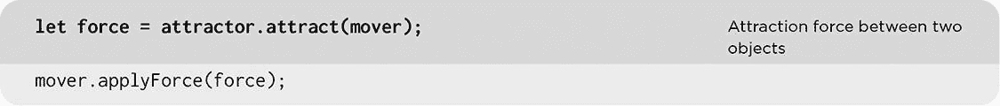

所以 `draw()` 函数可以按如下所示编写：

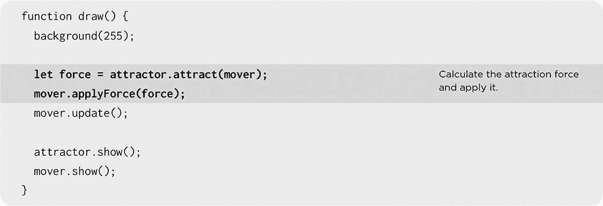

我差不多完成了。既然我决定将 `attract()` 方法放入 `Attractor` 类中，我还需要实际编写这个方法。它应该接收一个 `Mover` 对象并返回一个 `p5.Vector`：

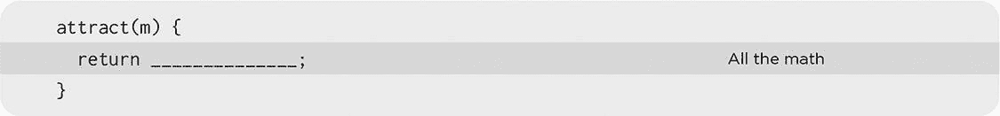

方法内部包含什么？所有那些关于引力的美妙数学！

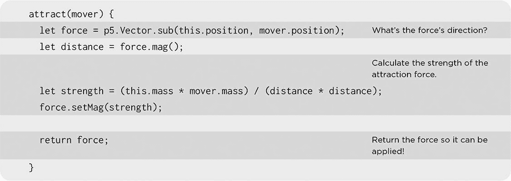

好了，我完成了。差不多吧，几乎完成了。我还需要解决一个小问题。再看看 `attract()` 方法的代码。看到那个斜杠符号表示除法吗？每当你遇到这样的符号时，你应该问自己一个问题：如果距离是一个非常非常小的数字，或者（更糟糕的是！）是 0 会发生什么呢？你不能将一个数字除以 0，如果你将一个数字除以像 0.0001 这样的小数，这等同于将该数字乘以 10,000！这或许是现实世界中引力公式的一个合理结果，但 p5.js 不是现实世界。在 p5.js 的世界里，移动物体可能会非常接近引力源，结果力可能会变得非常强，导致物体飞出画布。

相反，如果移动物体距离引力源，比如说，500 像素（在 p5.js 中并不算不合理）呢？你在平方距离，这将导致将力除以 250,000。这个力可能会变得非常弱，几乎就像根本没有施加任何力一样。

为了避免这两种极端情况，实际操作中可以在将 `distance` 输入公式之前，先约束其范围。也许无论 `Mover` *实际* 位于何处，在计算引力时都不应考虑它距离引力源少于 5 像素或超过 25 像素：

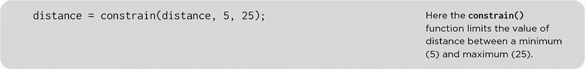

最终，选择你希望模拟的行为由你决定。但如果你决定要一个合理的引力效果，既不显得过弱也不显得过强，限制距离是一个不错的技术。

`Mover`类没有变化，所以我们只需查看主草图和`Attractor`类，整体上添加一个变量`G`表示万有引力常数。（在本书网站上，你会发现这个示例也有允许你用鼠标移动`Attractor`对象的代码。）

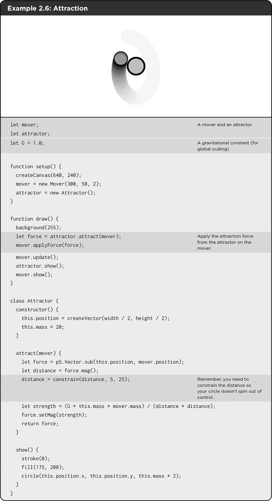

在这段代码中，mover 和 attractor 的直径是根据每个物体的质量来缩放的。然而，这并不准确地反映质量和大小在我们物理世界中的关系。圆的面积是用公式π*r²计算的，其中*r*代表半径（直径的一半）。(关于π的更多内容将在第三章中讨论！) 因此，为了更准确地通过圆的面积来表示物体的质量，我实际上应该取质量的平方根，并将其作为圆的直径来缩放。

 **练习 2.11**

适配示例 2.6，将`Attractor`和`Mover`的质量映射到它们各自圆的面积上：

```
circle(this.position.x, this.position.y, sqrt(this.mass) * 2);
```

当然，你可以扩展代码，加入一个`Attractor`和多个`Mover`对象的数组，就像我之前在示例 2.5 中加入了`Mover`对象的数组一样。

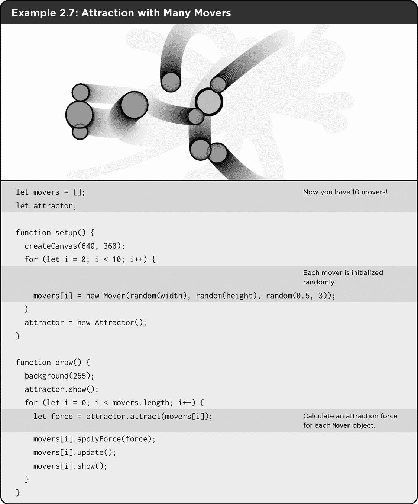

这只是使用对象数组的一个小小展示。敬请期待在第四章中对从画布上添加和移除多个对象的更深入探讨，该章涵盖了粒子系统。

 **练习 2.12**

在示例 2.7 中，有一个`Mover`对象的系统（一个数组）和一个`Attractor`对象。构建一个同时包含多个 mover 和 attractor 的系统。如果你让 attractors 变得不可见呢？你能从围绕 attractors 移动的物体轨迹中创造出某种模式或设计吗？

 **练习 2.13**

本章并没有建议每一个好的 p5.js 模拟都必须涉及引力吸引。相反，你应该创造性地思考如何设计你自己的规则来驱动物体的行为，将我模拟引力吸引的方法作为一个模型。例如，如果你设计了一种吸引力，物体靠近时变弱，远离时变强，会发生什么？或者，如果你设计一个 attractor，能够吸引远离的物体但排斥靠近的物体呢？

### **n 体问题**

我开始用一个简单的场景探索引力吸引，*一个物体吸引另一个物体*，然后转向稍微复杂一点的*一个物体吸引多个物体*。接下来的逻辑步骤是探索当*多个物体吸引多个物体*时会发生什么！

开始时，尽管分开使用`Mover`和`Attractor`类在目前为止很有帮助，但这种区分有点误导。毕竟，根据牛顿第三定律，所有的力都是成对出现的：如果一个吸引者吸引了一个移动物体，那么那个移动物体也应该吸引吸引者。在这里，我真正想要的不是两个类，而是一个单一的物体类型——例如，称之为`Body`——每个物体都吸引其他所有物体。

我描述的场景通常被称为***n***体问题。它涉及通过引力相互作用的一组物体的运动求解。*二*体问题是一个著名的已解问题，意味着当只有两个物体时，可以通过数学方程精确计算出它们的运动。然而，再加入一个物体后，*二*体问题变成了*三*体问题，并且突然间没有正式的解存在（参见图 2.10）。

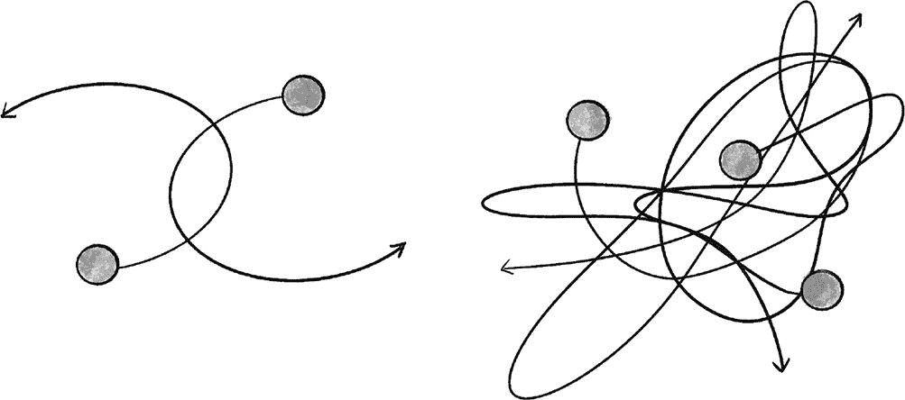

图 2.10：二体（可预测）与三体（复杂）问题的示例路径

尽管比使用精确的运动方程更不准确，但本章中构建的示例可以模拟二体和三体问题。首先，我将把`Attractor`类中的`attract()`方法移到`Mover`类（现在我将其称为`Body`）中：

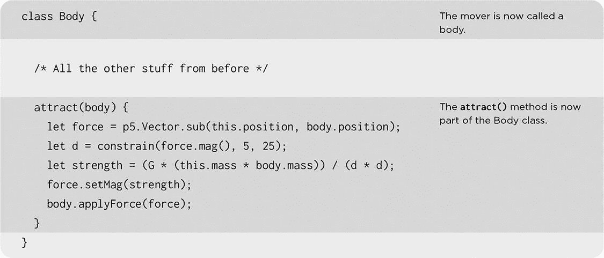

现在，只需要创建两个`Body`对象（我们称它们为`bodyA`和`bodyB`），并确保它们相互吸引：


对于任何* n *体问题，结果的运动和模式完全依赖于初始条件。例如，如果我在`setup()`中为每个物体分配特定的速度向量，一个指向右边，一个指向左边，结果是一个圆形轨道。

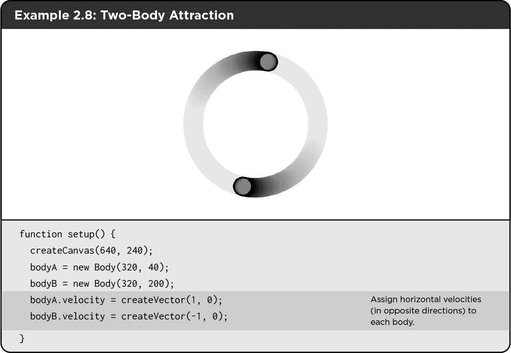

示例 2.8 可以通过重构代码来改进，加入构造函数参数以分配物体速度。然而，暂时来说，这种方法作为一种快速实验基于不同初始位置和速度的模式的方式是可行的。

 **练习 2.14**

詹姆斯·蒙塔尔迪（James Montaldi）和卡特里娜·斯特克尔斯（Katrina Steckles）发表的论文《平面 *n* 体编舞对称群的分类》（*Classification of Symmetry Groups for Planar *n*-Body Choreographies*）探讨了 *n* 体问题的 *编舞* 解（定义为物体以规则间隔相互跟随的周期性运动）。教育者和艺术家丹·格里斯（Dan Gries）创建了这些编舞的互动演示（*[`dangries.com/rectangleworld/demos/nBody`](https://dangries.com/rectangleworld/demos/nBody)*）。尝试在示例 2.8 中添加第三个（或更多）物体，并尝试设置初始位置和速度。你能实现什么样的编舞？

我现在准备通过引入一个数组来继续进行 *n* 体的例子：


`draw()` 函数是我需要发挥魔法的地方，让每个物体对每个其他物体施加引力。目前，代码是“对于每个物体`i`，更新并绘制。”为了让每个物体`i`吸引每个其他物体`j`，我需要嵌套第二个循环并调整代码为“对于每个物体`i`，吸引每个其他物体`j`（并更新和绘制）。”

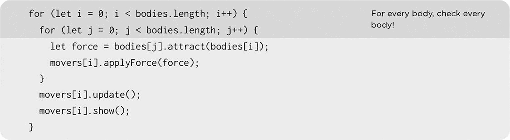

代码有一个小问题。当每个物体`i`吸引每个物体`j`时，当`i`等于`j`时会发生什么？物体索引 3 应该吸引物体索引 3 吗？答案当然是否定的。如果有五个物体，你希望物体索引 3 只吸引物体 0、1、2 和 4，而跳过自己。我会通过添加一个条件语句来跳过当`i`等于`j`时应用力的情况。

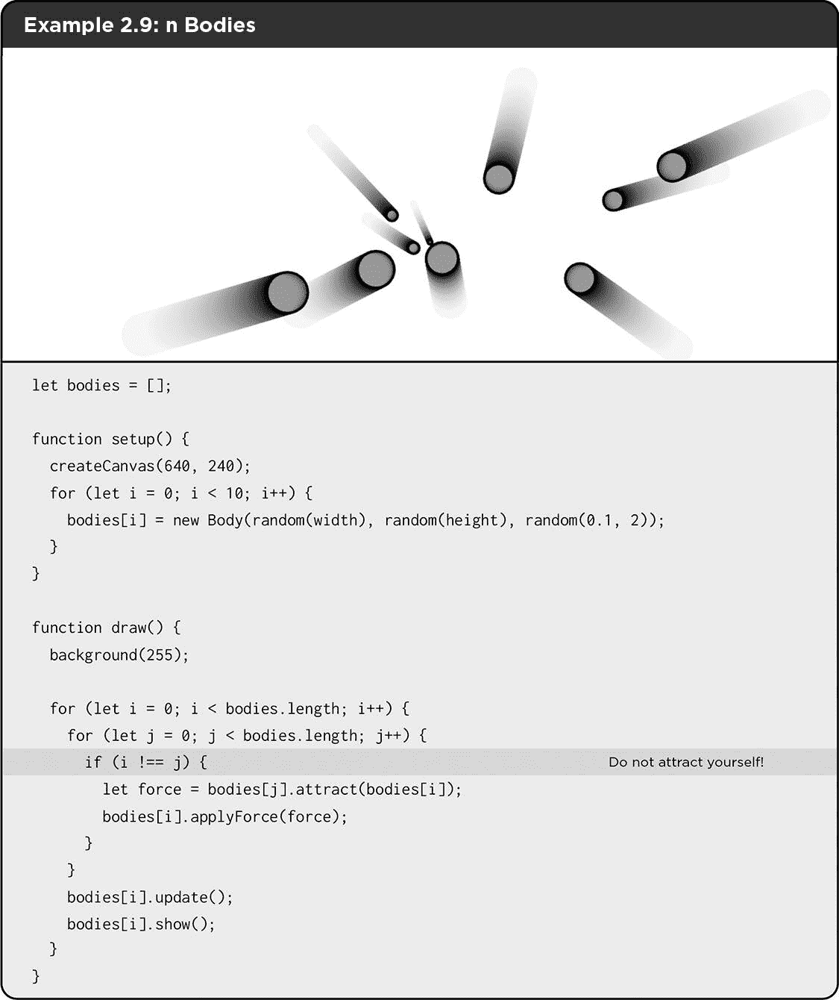

示例 2.9 中的嵌套循环解决方案导致了所谓的 *n* 平方算法，这意味着计算的数量等于物体数量的平方。如果我增加物体的数量，模拟将因为所需的计算量而开始显著变慢。

在第五章中，我将探讨优化像这样的草图的策略，特别关注空间细分算法。空间细分结合四叉树的概念和一个名为 Barnes-Hut 的算法，对于提高像这里讨论的 *n* 体模拟的效率特别有效。

 **习题 2.15**

将示例 2.9 中的引力改为排斥力。你能否创建一个例子，其中所有的`Body`对象都被鼠标吸引，但彼此之间相互排斥？思考一下如何平衡力的相对强度，以及如何在力的计算中最有效地利用距离。

 **习题 2.16**

你能否将*n*-体模拟中的物体排列成一种类似螺旋星系的轨迹，使其围绕画布的中心旋转？你可能需要在中心加入一个额外的大型物体以保持整体的稳定。在我的“相互吸引”视频中提供了解决方案，视频属于《编码之美》系列，发布在 Coding Train 网站上（*[`thecodingtrain.com/nbody`](https://thecodingtrain.com/nbody)*）。

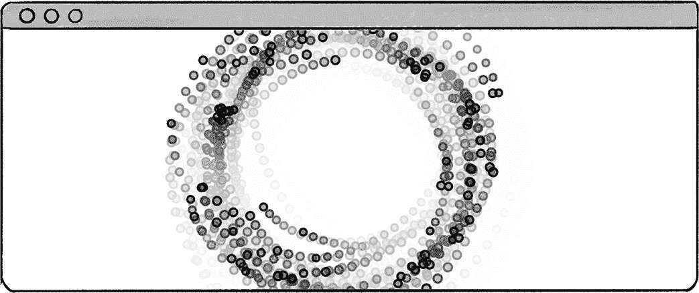

 **生态系统项目**

将力的概念融入到你的生态系统中。其他环境因素（例如水与泥土，或河流的水流）会如何影响角色在生态系统中的移动方式？

尝试在环境中引入其他元素（食物、捕食者等）供生物互动。生物是否对其世界中的事物产生吸引或排斥的反应？你能否更加抽象地思考，并根据生物的欲望或目标设计力量？

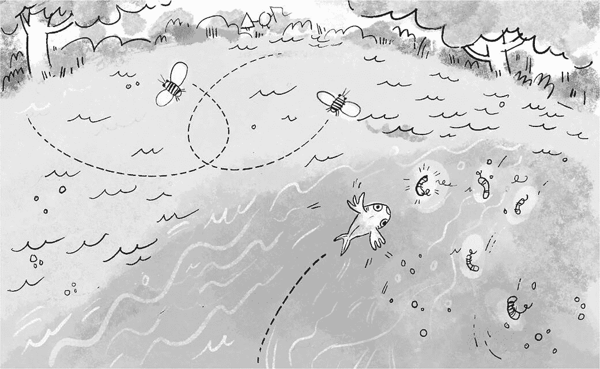
