## **3 振荡**

*三角学是时代的象征。*

—匿名

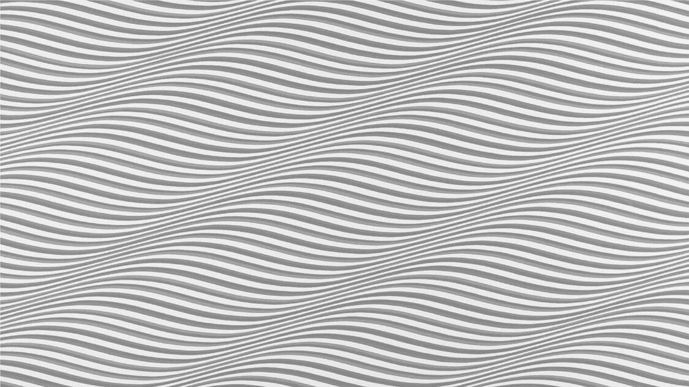

***Gala* by Bridget Riley, 1974; 丙烯画布，159.7 × 159.7 cm**

布里奇特·赖利（Bridget Riley），一位著名的英国艺术家，是 1960 年代光学艺术（Op Art）运动的推动力之一。她的作品以几何图案为特色，挑战观众的感知，并唤起运动或震动的感觉。她 1974 年的作品《Gala》展示了一系列曲线形态，像波纹一样在画布上扩散，唤起了正弦波的自然节奏。

在第一章和第二章中，我仔细制定了一个面向对象的结构，用于在 p5.js 画布中动画化形状，使用一个向量来表示位置、速度和加速度，这些都由环境中的力驱动。从这里我可以直接进入粒子系统、引导力、群体行为等主题。然而，若这样做就意味着跳过了自然界运动的一个基本方面：**振荡**，即物体围绕一个中心点或位置的往返运动。

要模拟振荡，你需要了解一些**三角学**，即三角形的数学。学习一些三角学将为你提供生成图案和创建新的运动行为的工具。在 p5.js 草图中，你将学会利用角速度和加速度来旋转物体，同时物体在移动。你将能够使用正弦和余弦函数来模拟平滑的加速、减速波动模式。你还将学会计算涉及角度的更复杂的力，例如钟摆的摆动或箱子沿斜面下滑的情况。

我将从在 p5.js 中使用角度的基础知识开始，然后介绍三角学的几个方面。最后，我会将三角学与在第二章中学到的关于力的内容联系起来。本章的内容将为书中后续需要使用三角学的更复杂示例铺路。

### **角度**

在继续之前，我需要确保你理解**角度**这一概念是如何融入到 p5.js 创意编码中的。如果你有使用 p5.js 的经验，在使用`rotate()`函数来旋转和旋转物体时，你无疑已经遇到过这个问题。你很可能熟悉角度作为**度数**的概念（见图 3.1）。

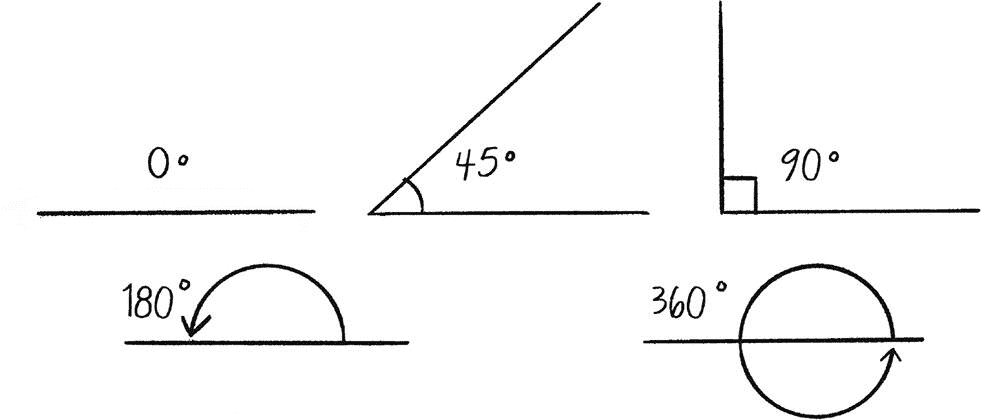

图 3.1：以度数为单位的角度

一个完整的旋转从 0 度到 360 度，而 90 度（直角）是 360 的四分之一，如图 3.1 所示，图中有两条垂直线。

角度在计算机图形学中常用于指定形状的旋转。例如，图 3.2 中的正方形绕其中心旋转了 45 度。

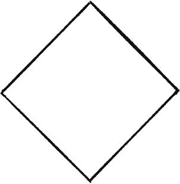

图 3.2：旋转了 45 度的正方形

问题是，默认情况下，p5.js 测量角度时使用的是弧度而不是**度数**。这个替代的计量单位由圆的弧长（圆周的一部分）与圆的半径的比值定义。一个弧度是当这个比值等于 1 时的角度（见图 3.3）。一个完整的圆（360 度）相当于 2π弧度，180 度相当于π弧度，90 度相当于π/2 弧度。

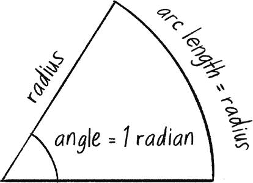

图 3.3：1 弧度角的弧长等于半径。

从度数转换为弧度的公式如下：

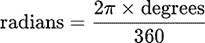

令人庆幸的是，如果你更倾向于以度数表示角度，你可以调用`angleMode(DEGREES)`，或者使用便捷函数`radians()`将度数转换为弧度。常量`PI`、`TWO_PI`和`HALF_PI`也可以使用（分别等同于 180 度、360 度和 90 度）。例如，在 p5.js 中，以下是旋转一个形状 60 度的两种方式：

```
let angle = 60;
rotate(radians(angle));

angleMode(DEGREES);
rotate(angle);
```

 **什么是π？**

数学常数**π**（或希腊字母π）是一个实数，定义为圆的周长（圆周的外侧距离）与直径（通过圆心的直线段）的比值。它大约等于 3.14159，并且可以通过 p5.js 中的内建`PI`变量访问。

虽然度数可能很有用，但在本书中，我将使用弧度，因为它们是许多编程语言和图形环境中的标准计量单位。如果它们对你来说是新的，这是一个很好的练习机会！此外，如果你不熟悉 p5.js 中旋转的实现方式，我建议观看我关于 p5.js 变换的 Coding Train 视频系列（*[`thecodingtrain.com/transformations`](https://thecodingtrain.com/transformations)*）。

 **练习 3.1**

使用`translate()`和`rotate()`围绕物体的中心旋转一个类似指挥棒的物体。

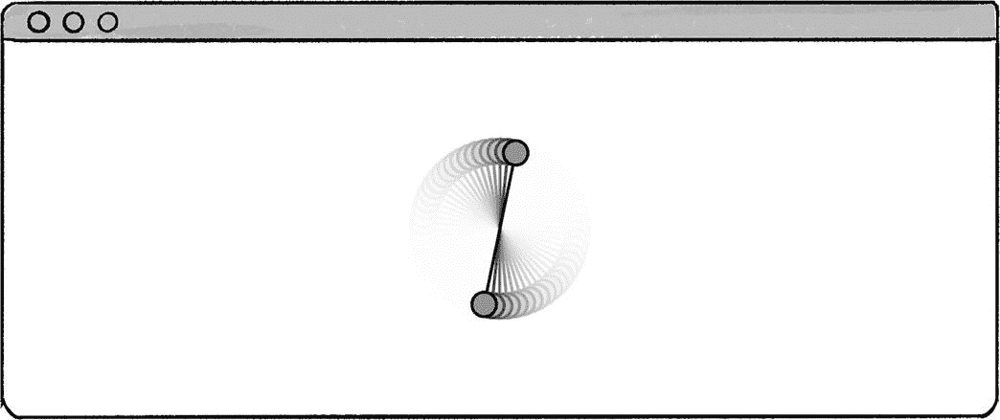

### **角动量**

旋转的另一个术语是**角动量**——即围绕一个角度的运动。正如线性运动可以用速度来描述——即物体位置随时间变化的速率——角动量可以用**角速度**来描述——即物体角度随时间变化的速率。通过扩展，**角加速度**描述物体的角速度变化。

幸运的是，你已经具备了理解角动量所需的所有数学知识。记得我在第一章和第二章中几乎全部讲解的内容吗？

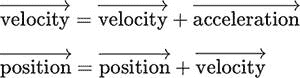

你可以将相同的逻辑应用于旋转物体：

角速度 = 角速度 + 角加速度

角度 = 角度 + 角速度

事实上，这些角运动的公式比线性运动的公式更简单，因为这里的角度是一个*标量*量（单一数值），而不是向量！这是因为在二维空间中，只有一个旋转轴；在三维空间中，角度会变成一个向量。（请注意，在大多数情况下，这些公式会包括时间变化的乘法，通常称为*增量时间*。我假设增量时间为 1，对应于 p5.js 中的一帧动画。）

使用练习 3.1 中的答案，假设你想要在 p5.js 中让指挥棒旋转一定角度。最初，代码可能是这样的：

```
translate(width / 2, height / 2);
rotate(angle);
line(-60, 0, 60, 0);
circle(60, 0, 16);
circle(-60, 0, 16, 16);

angle = angle + 0.1;
```

融入角运动的原理后，我可以改写以下示例（这是练习 3.1 的解决方案）。

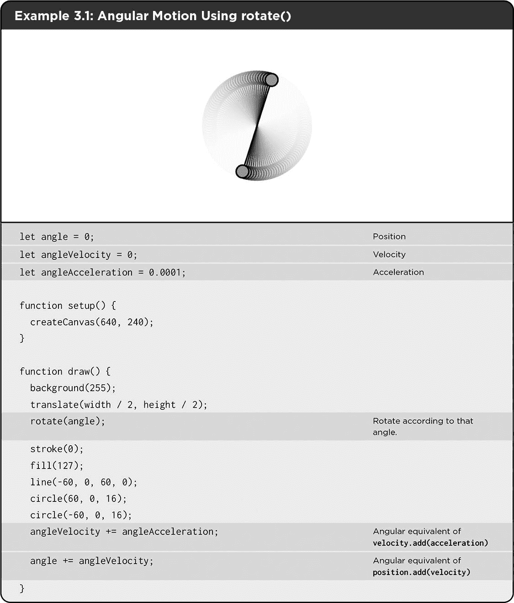

不像通过固定增量逐步旋转指挥棒，我在每一帧中将`angleAcceleration`加到`angleVelocity`，然后将`angleVelocity`加到`angle`。结果是，指挥棒一开始没有旋转，随着角速度加速，旋转越来越快。

 **练习 3.2**

给旋转的指挥棒添加互动。如何通过鼠标控制加速度？你能引入拖拽的概念，通过减少角速度来让指挥棒最终停下来吗？

合理的下一步是将这个角运动的概念融入到`Mover`类中。首先，我需要在类的构造函数中添加一些变量：

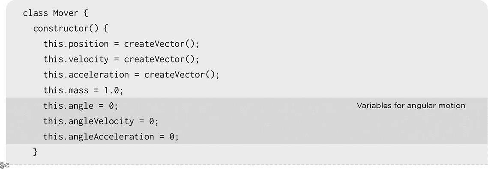

然后，在`update()`中，根据我刚刚演示的算法更新移动者的位置和角度：

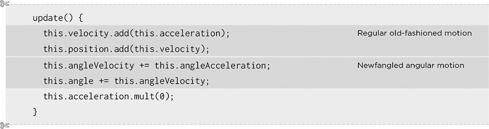

当然，所有这些要生效，我还需要在`show()`方法中绘制物体时进行旋转。（我会在圆心到圆边添加一条线，使旋转可见。你也可以将物体绘制成除圆形以外的其他形状。）

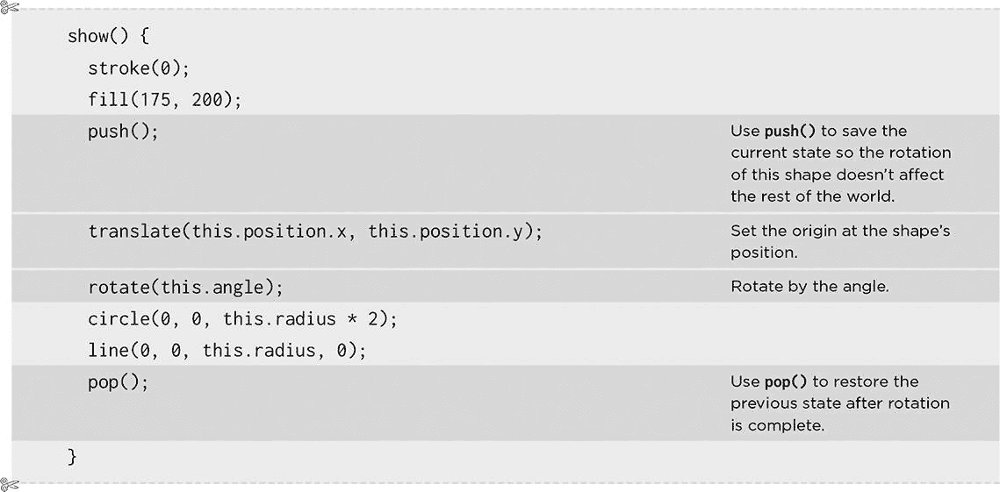

到目前为止，如果你真的创建了一个`Mover`对象，你不会看到它有任何不同的表现。这是因为角加速度被初始化为零（`this.angleAcceleration = 0;`）。为了让物体旋转，它需要一个非零的加速度！当然，一种选择是在构造函数中硬编码一个数字：

```
    this.angleAcceleration = 0.01;
```

然而，你可以通过在`update()`方法中根据环境中的力动态地分配角加速度，从而得到更有趣的结果。这可能是我开始研究基于力矩（*[`en.wikipedia.org/wiki/Torque`](https://en.wikipedia.org/wiki/Torque)*)和转动惯量（*[`en.wikipedia.org/wiki/Moment_of_inertia`](https://en.wikipedia.org/wiki/Moment_of_inertia)*）的角加速度物理学的信号，但在这个阶段，这种模拟的复杂度可能会有些“无底洞”。（我将在《摆锤》章节中更详细地介绍如何使用摆锤建模角加速度，见第 154 页，并在第六章中讨论第三方物理库如何真实地模拟旋转运动。）

相反，一个快速且粗糙的解决方案，能够产生创造性结果，就足够了。一个合理的做法是将角加速度计算为物体的线性加速度的函数，即沿路径向量的速度变化率，而不是它的旋转。下面是一个例子：


是的，这个是任意的，但它确实能*产生一些效果*。如果物体向右加速，它的角旋转会朝顺时针方向加速；向左加速会导致逆时针旋转。当然，在这种情况下，考虑比例是非常重要的。加速度向量的`x`分量可能过大，导致物体旋转看起来非常荒谬或不现实。你甚至可能会注意到一种视觉错觉，叫做*马车轮效应*：由于每一帧动画之间的变化较大，物体看起来旋转得更慢，甚至是朝相反方向旋转。

将`x`分量除以一个值，或者将角速度限制在一个合理的范围内，可能真的会有所帮助。以下是整个`update()`函数，已添加这些调整。

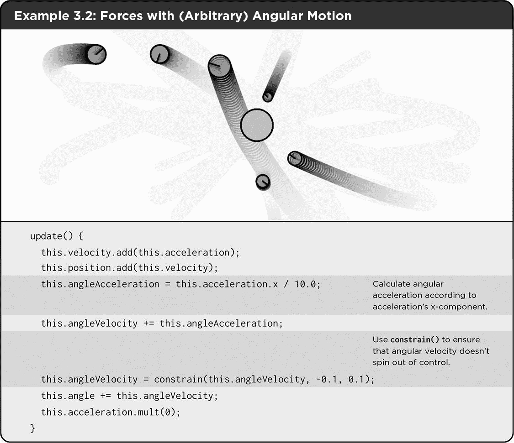

请注意，我使用了多种策略来防止物体旋转失控。首先，我将`acceleration.x`除以`10`，然后再赋值给`angleAcceleration`。接着，为了确保安全，我还使用了`constrain()`将`angleVelocity`限制在`(-0.1, 0.1)`范围内。

 **练习 3.3**

第 1 步：创建一个物体从大炮中发射的模拟。每个物体在发射时应该经历一次突然的力（仅一次），以及重力（始终存在）。

第 2 步：给物体添加旋转，模拟它从大炮中发射时的旋转。你能让它看起来有多真实？

### **三角函数**

我想我准备好揭示三角学的秘密了。我已经讨论过角度，已经转过棒子。现在是时候...等等... *sohcahtoa* 了。是的，*sohcahtoa*！这个看似毫无意义的词实际上是计算机图形学工作的重要基础。基本理解三角学是计算角度、测量点之间距离，以及处理圆形、弧线或直线的关键。如果你想要计算角度，弄清楚点之间的距离，或者处理圆、弧线或直线，三角学是必不可少的。而 *sohcahtoa* 是一个记忆法（尽管有些荒谬）用来记住三角函数正弦、余弦和正切的含义。它指的是直角三角形的各边，如图 3.4 所示。

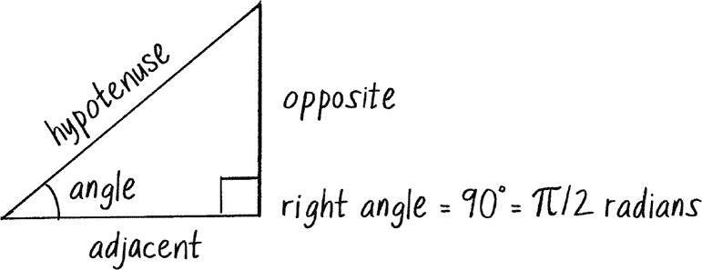

图 3.4：一个直角三角形，展示了邻边、对边和斜边

取三角形中的一个非直角。*邻边* 是与该角相接的那条边，*对边* 是不与该角相接的那条边，*斜边* 是与直角相对的那条边。*Sohcahtoa* 告诉你如何根据这些边的长度来计算角度的三角函数：

+   **soh:** **s**ine(角度) = **o**pposite/**h**ypotenuse

+   **cah:** **c**osine(角度) = **a**djacent/**h**ypotenuse

+   **toa:** **t**angent(角度) = **o**pposite/**a**djacent

再看一下图 3.4。你不需要背诵它，但可以看看自己是否感觉舒适。试着自己重新画一遍。接下来，让我们以稍微不同的方式来看它（见图 3.5）。

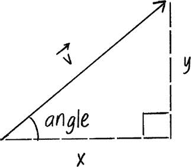

图 3.5：一个向量 ，包含分量 *x*、*y* 和 *角度*

看看一个直角三角形是如何从这个向量 中生成的？向量箭头是斜边，向量的分量（*x* 和 *y*）是三角形的两条边。角度是确定向量方向（或 *航向*）的附加手段。以这种方式来看，三角函数建立了向量的分量与其方向 + 大小之间的关系。因此，三角学将在本书中非常有用。为了说明这一点，我们来看看一个需要用到正切函数的例子。

### **指向运动的方向**

想回例子 1.10，那是一个`Mover`对象朝鼠标加速的例子（图 3.6）。

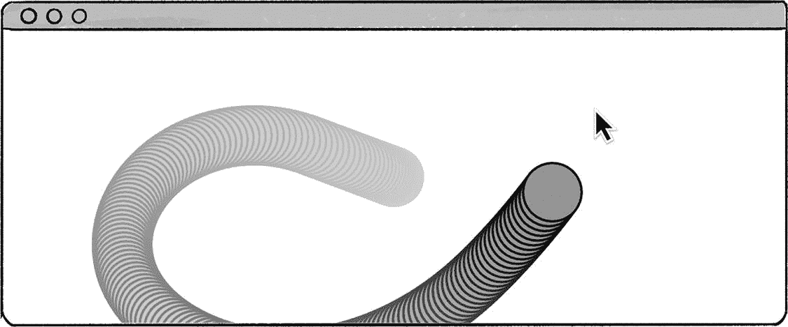

图 3.6：一个朝鼠标加速的移动物体（来自例子 1.10）

你可能会注意到，到目前为止我画的大部分形状都是圆形的。这是很方便的，原因有几个，其中之一就是使用圆形可以避免旋转的问题。旋转一个圆形，嗯，它看起来完全一样。然而，所有运动程序员的生活中总会有那么一刻，他们想要在屏幕上移动一些不是圆形的物体。也许是蚂蚁，或者是汽车，或者是飞船。为了看起来更真实，这个物体应该指向它的运动方向。

当我说“指向它的运动方向”时，我的意思是“根据它的速度向量进行旋转。”速度是一个向量，具有 x 和 y 分量，但要在 p5.js 中进行旋转，你只需要一个数字，一个角度。让我们再看一遍三角函数图，这次聚焦在物体的速度向量上（见图 3.7）。

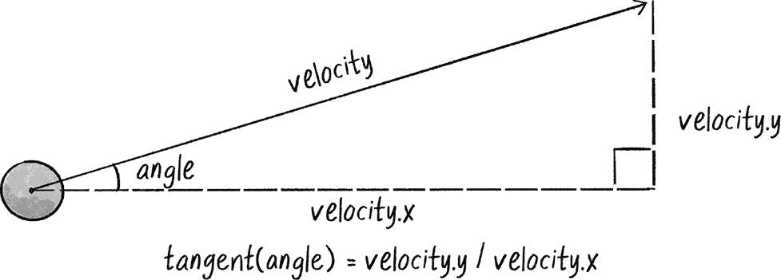

图 3.7：速度向量的角度的正切是 *y* 除以 *x*。

向量的 x 和 y 分量与其角度通过正切函数相关联。使用 *toa* 在 *sohcahtoa* 中，我可以将关系写为：

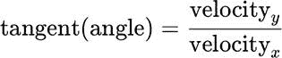

这里的问题是，虽然我知道速度向量的 x 和 y 分量，但我不知道它的方向角度。我必须求解这个角度。这就是另一个函数——*反正切*，或称为 *反正切函数*（简称 *arctan* 或 *atan*）派上用场的地方。（还有 *反正弦* 和 *反余弦* 函数，分别称为 *arcsine* 和 *arccosine*。）

如果 *a* 的正切值等于 *b*，那么 *b* 的反正切值等于 *a*。例如：

| 如果 | tan(*a*) = *b* |
| --- | --- |
| 然后 | *a* = arctan(*b*) |

看到一个是另一个的反向吗？这使我能够求解向量的角度：

| 如果 | 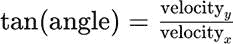 |
| --- | --- |
| 然后 | 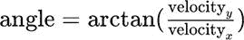 |

现在我已经有了公式，让我们看看它应该放在哪里，在 `Mover` 类的 `show()` 方法中，以便让运动物体（现在绘制为一个矩形）指向它的运动方向。请注意，在 p5.js 中，反正切函数是 `atan()`：

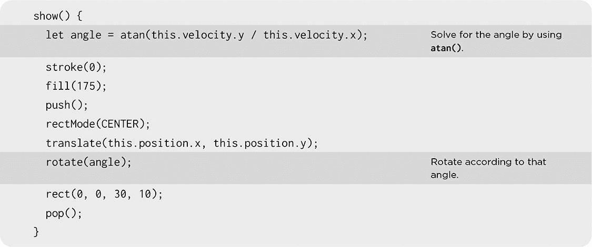

这段代码非常接近，几乎可以正常工作。不过，存在一个大问题。考虑图 3.8 中展示的两个速度向量。

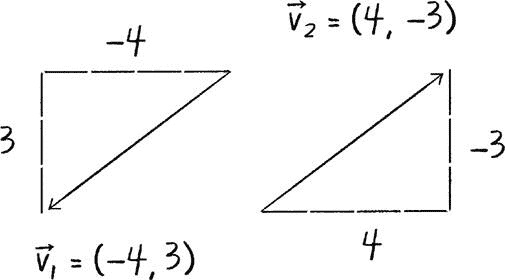

图 3.8：这两个向量 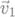 和 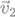，它们的分量分别是 (4, –3) 和 (–4, 3)，指向相反的方向。

虽然表面上看起来相似，但这两个向量指向的方向完全不同——实际上是相反的方向！尽管如此，看看如果我应用反正切公式来求解每个向量的角度，会发生什么：

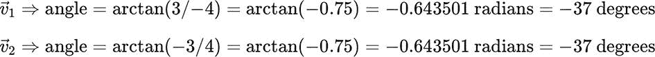

我得到了相同的角度！不过，这样不对，因为这些向量指向的方向是相反的。事实证明，这是计算机图形学中一个相当常见的问题。我本可以使用`atan()`结合条件语句来处理正负情况，但 p5.js（以及大多数编程环境）有一个很有用的函数叫做`atan2()`，它可以为我解决这个问题。

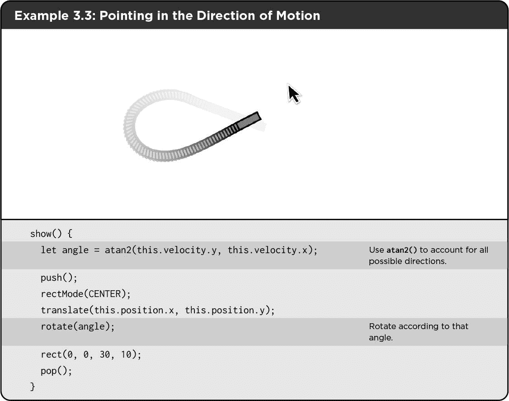

为了进一步简化，`p5.Vector` 类提供了一个名为 `heading()` 的方法，该方法负责调用 `atan2()` 并返回任何 `p5.Vector` 的二维方向角，以弧度表示：


使用 `heading()` 后，实际上你并不需要在代码中实现三角学函数，但理解它们是如何工作的仍然是有帮助的。

 **练习 3.4**

创建一个可以通过箭头键控制移动的车辆模拟：左箭头加速车辆向左，右箭头加速车辆向右。车辆应该朝着当前移动的方向指向。

### **极坐标与笛卡尔坐标**

每当你在 p5.js 中绘制形状时，你都需要指定一个像素位置，即一组 x 和 y 坐标。这些被称为**笛卡尔坐标**，得名于法国数学家勒内·笛卡尔，他发展了笛卡尔空间的相关思想。

另一个有用的坐标系，称为**极坐标系**，通过描述空间中一个点到原点的距离（如圆的半径）和围绕原点旋转的角度（通常叫做*θ*，希腊字母θ）来定义一个点的位置。从向量的角度来看，笛卡尔坐标描述了一个向量的 x 和 y 分量，而极坐标描述了一个向量的大小（长度）和方向（角度）。

在 p5.js 中工作时，你可能会发现思考极坐标更为方便，特别是在创建涉及旋转或圆形运动的图形时。然而，p5.js 的绘图函数只理解（*x*，*y*）笛卡尔坐标。幸运的是，三角学为你提供了从极坐标和笛卡尔坐标之间相互转换的关键（见图 3.9）。这使得你可以根据自己的需求设计坐标系，同时始终使用笛卡尔坐标进行绘图。

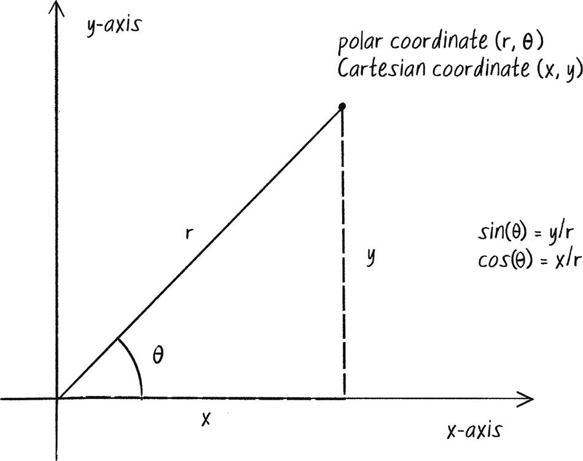

图 3.9：希腊字母 *θ*（theta）通常用来表示角度。由于极坐标通常表示为（*r*，*θ*），因此在提到 p5.js 中的角度时，我将使用 `theta` 作为变量名。

例如，给定一个半径为 75 像素，角度为 45 度（或π/4 弧度）的极坐标，可以按以下方式计算笛卡尔坐标的 *x* 和 *y*：

cos(*θ*) = *x/r* ⇒ *x = r* × cos(*θ*)

sin(*θ*) = *y/r* ⇒ *y = r* × sin(*θ*)

在 p5.js 中，正弦和余弦的函数分别是 `sin()` 和 `cos()`。每个函数接受一个参数，表示一个以弧度为单位的角度。因此，这些公式可以像下面这样编码：

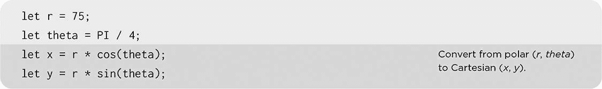

这种类型的转换在某些应用中可能非常有用。例如，使用笛卡尔坐标系移动一个形状沿圆形路径并不容易。然而，使用极坐标就简单多了：只需增加角度即可！以下是使用全局 `r` 和 `theta` 变量来实现的方式。

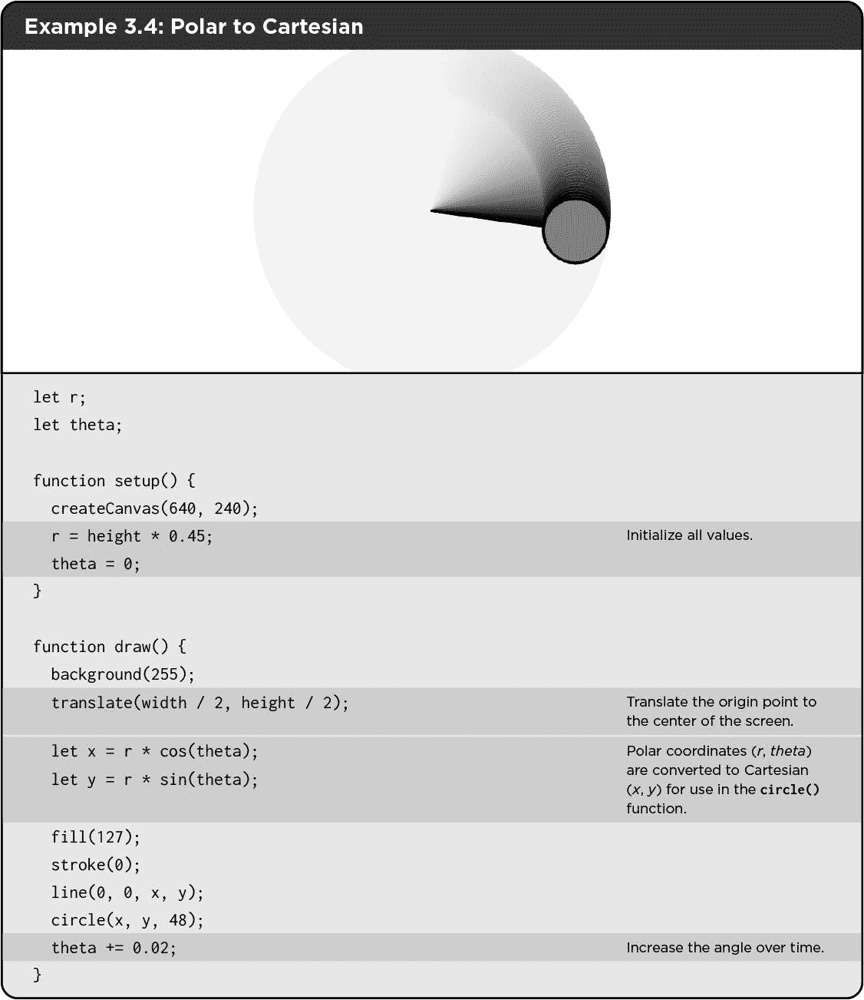

极坐标到笛卡尔坐标的转换已经足够常见，以至于 p5.js 提供了一个便捷的函数来处理这个问题。它作为 `p5.Vector` 类的一个静态方法 `fromAngle()` 被包含进来。它接受一个弧度表示的角度，并在笛卡尔空间中创建一个单位向量，指向由该角度指定的方向。这就是 示例 3.4 中的实现：

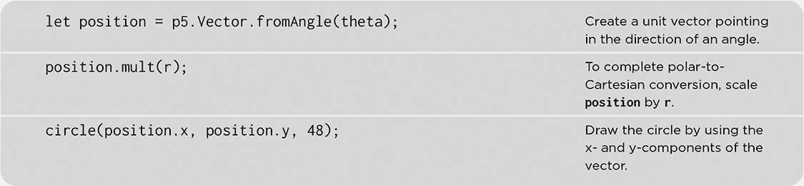

你已经惊讶了吗？我展示了一些切线（用于找出向量的角度）以及正弦和余弦（用于从极坐标转换为笛卡尔坐标系）的非常棒的应用。我可以在这里停下来并感到满足。但我不会这么做。这仅仅是个开始。正如我接下来将展示的，正弦和余弦能够为你做的远不止数学公式和直角三角形。

 **练习 3.5**

以 示例 3.4 为基础，绘制一个螺旋路径。从中心开始，向外移动。请注意，这只需更改一行代码并添加一行代码！

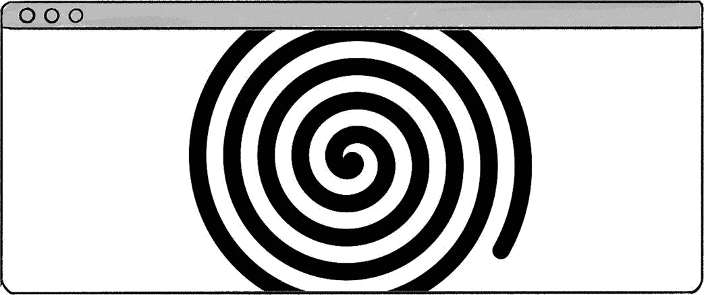

 **练习 3.6**

模拟游戏 *Asteroids* 中的飞船。如果你不熟悉 *Asteroids*，这里有一个简短的介绍：飞船（表示为一个三角形）漂浮在二维空间中。左箭头键将飞船逆时针旋转；右箭头键将其顺时针旋转。Z 键在飞船指向的方向上施加推力。

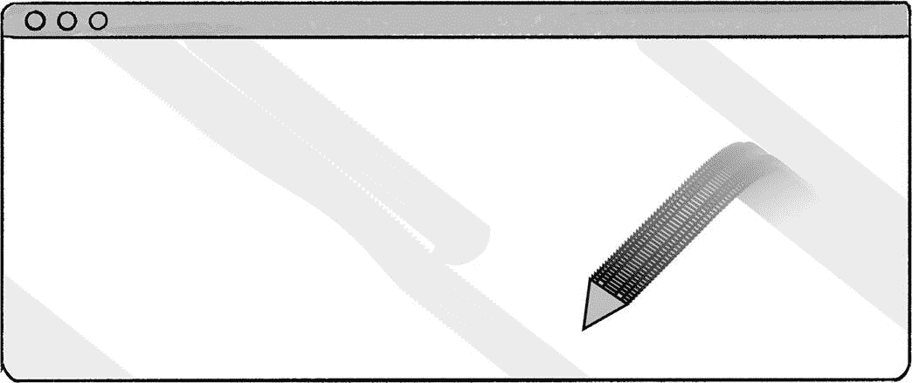

### **振荡的性质**

查看 图 3.10 中的正弦函数图，其中 *y* = sin(*x*)。

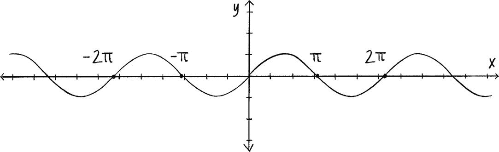

图 3.10：*y* = sin(*x*) 的图像

正弦函数的输出是一个平滑的曲线，在 -1 和 1 之间交替变化，也称为 **正弦波**。这种行为是周期性地在两个点之间运动，这就是我在章节开始时提到的 **振荡**。拨动吉他弦、摆动钟摆、在弹跳棒上跳跃——这些都是可以通过正弦函数模拟的振荡运动的例子。

在 p5.js 草图中，你可以通过将正弦函数的输出赋值给一个物体的位置来模拟振荡。我将从一个基本的场景开始：我希望一个圆在画布的左侧和右侧之间振荡（图 3.11）。

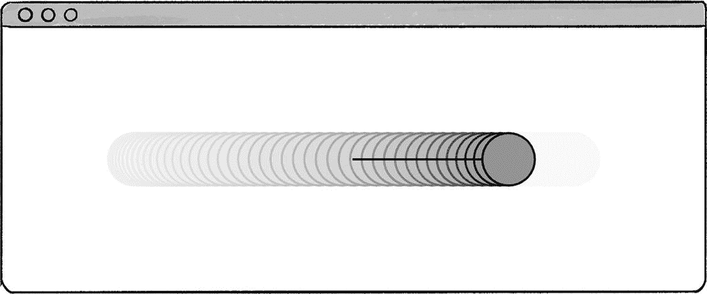

图 3.11：一个振荡的圆形

这种围绕中心点来回振荡的模式被称为**简谐运动**（或者，准确一点，物体的周期性正弦振荡）。实现这一点的代码非常简单，但在进入之前，我想介绍一些与振荡（和波动）相关的关键术语。

当一个物体表现出简谐运动时，它的位置（在此情况下是 x 位置）可以表示为时间的函数，包含以下两个要素：

+   **振幅：** 从运动中心到任一极端的距离

+   **周期：** 完整运动周期所需的时间

要理解这些术语，请再看一眼图 3.10 中的正弦函数图。曲线在 y 轴上从不超过 1 或低于 -1，因此正弦函数的振幅为 1。同时，曲线的波形在 x 轴上每 2π 单位重复一次，因此正弦函数的周期为 2π。（按照惯例，这里的单位是弧度，因为正弦函数的输入值通常是以弧度衡量的角度。）

以上是抽象正弦函数的振幅和周期，那么在 p5.js 中，一个振荡圆的振幅和周期是什么呢？嗯，振幅可以相对容易地用像素来衡量。例如，如果画布的宽度是 200 像素，我可能会选择围绕画布中心进行振荡，从中心向右 100 像素到向左 100 像素。换句话说，振幅是 100 像素。


周期是完成一个振荡周期所需的时间。然而，在 p5.js 草图中，*时间*到底意味着什么呢？理论上，我可以说我希望圆形每三秒振荡一次，然后根据现实世界的时间设计一个复杂的算法来移动物体，使用 `millis()` 来跟踪毫秒的流逝。然而，对于我在这里要完成的任务，现实世界的时间并不必要。在 p5.js 中，更有用的时间衡量方式是已过去的**帧数**，这可以通过内置的 `frameCount` 变量获得。我希望振荡运动每 30 帧重复一次？每 50 帧重复一次？目前，假设周期为 120 帧：


一旦我有了振幅和周期，就该写一个公式来计算圆的 x 位置，作为时间（当前帧数）的函数：

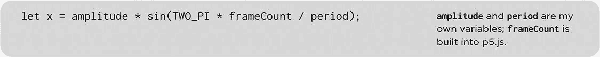

想想这里发生了什么。首先，无论`sin()`函数返回什么值，都将乘以`amplitude`。正如你在图 3.10 中看到的，正弦函数的输出在–1 和 1 之间振荡。将这个值乘以我选择的振幅——我们称之为*a*——就得到了所需的结果：一个在–*a*和*a*之间振荡的值。（这里也是你可以使用 p5.js 的`map()`函数，将`sin()`的输出映射到自定义范围的地方。）

现在，想一想`sin()`函数内部发生了什么：

```
TWO_PI * frameCount / period
```

这里发生了什么？从你已知的开始。我已经解释过，正弦的周期是 2π，这意味着它将在 0 处开始，并在 2π、4π、6π等位置重复。如果我希望振荡的周期为 120 帧，那么当`frameCount`达到 120 帧、240 帧、360 帧等时，圆形应处于相同位置。在这里，`frameCount`是唯一随着时间变化的值；它从 0 开始并递增。让我们看看当`frameCount`增加时公式会产生什么结果。

|  `frameCount`  | `frameCount / period` | `TWO_PI * frameCount / period` |
| --- | --- | --- |
| 0 | 0 | 0 |
| 60 | 0.5 | π |
| 120 | 1 | 2π |
| 240 | 2 | 4π |
| . . . | . . . | . . . |

将`frameCount`除以`period`可以告诉我已完成的周期数。（波形是否已完成第一个周期的一半？是否已完成两个周期？）将这个数值乘以`TWO_PI`，我就得到了所需的结果，适合输入到`sin()`函数中，因为`TWO_PI`是正弦（或余弦）函数完成一个完整周期所需的值。

将它们结合起来，下面是一个示例，它通过振荡`x`坐标，产生一个振幅为 100 像素、周期为 120 帧的圆形运动。

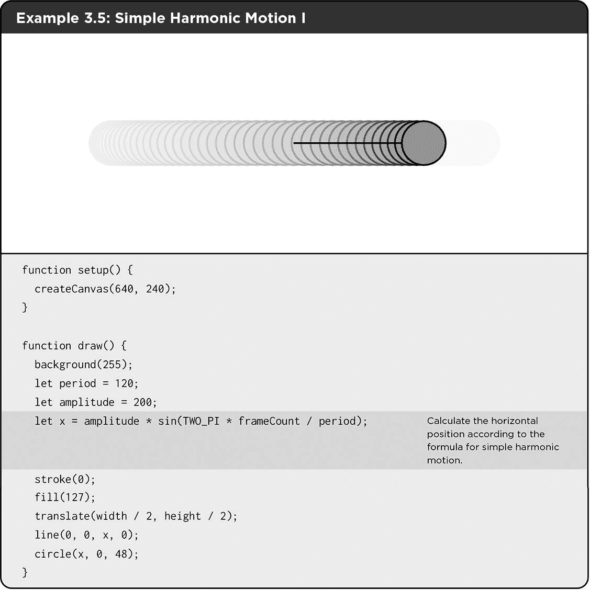

在继续之前，我不得不提一下**频率**，即每单位时间内振荡的周期数。频率是周期的倒数——也就是说，1 除以周期。例如，如果周期是 120 帧，那么在 1 帧中完成的是周期的 1/120，因此频率是 1/120。在示例 3.5 中，我选择了通过周期来定义振荡速率，因此不需要为频率定义变量。然而，有时候，考虑频率而不是周期更有帮助。

 **练习 3.7**

使用正弦函数，创建一个挂在窗口顶部的弹簧上的物体（有时称为*摆锤*）的模拟。使用`map()`函数计算摆锤的垂直位置。在第 147 页的《弹簧力》一节中，我将展示如何根据胡克定律创建这种模拟。

### **角速度振荡**

理解振动、振幅和周期（或频率）在模拟现实世界行为时可能至关重要。然而，有一种稍微简单的方法来实现示例 3.5 中的简谐运动，这种方法通过更少的变量达成相同的结果。再看看振动公式：

```
let x = amplitude * sin(TWO_PI * frameCount / period);
```

现在我将以稍微不同的方式重写它：

```
let x = amplitude * sin( some value that increments slowly );
```

如果你关心精确定义振荡周期（以动画帧为单位），你可能需要我最初写的公式。然而，如果你不关心准确的周期——例如，如果你将随机选择它——那么你真正需要的只是`sin()`函数内部的一个值，该值增加得足够慢，以便物体的运动在每一帧之间看起来是平滑的。每当这个值越过 2π的倍数时，物体就完成了一个振荡周期。

这种技术与我在第零章中使用 Perlin 噪声时做的类似。在那种情况下，我增加了一个偏移量变量（我称它为`t`或`xoff`）来从`noise()`函数中采样不同的输出，创建平滑的值过渡。现在，我将增加一个值（我称它为`angle`），并将其输入到`sin()`函数中。不同之处在于，`sin()`的输出是平滑重复的正弦波，没有任何随机性。

你可能会想，为什么我把增量值称为`angle`，因为物体没有明显的旋转。之所以使用*角度*这个术语，是因为这个值被传递到`sin()`函数中，而角度是三角函数的传统输入值。考虑到这一点，我可以重新引入角速度（和加速度）的概念，将示例重写为根据变化的角度计算`x`位置。我假设这些全局变量：

```
let angle = 0;
let angleVelocity = 0.05;
```

然后我可以写出如下代码：

```
function draw() {
  angle += angleVelocity;
  let x = amplitude * sin(angle);
}
```

在这里，`angle`是我“缓慢增加的值”，它缓慢增加的量是`angleVelocity`。

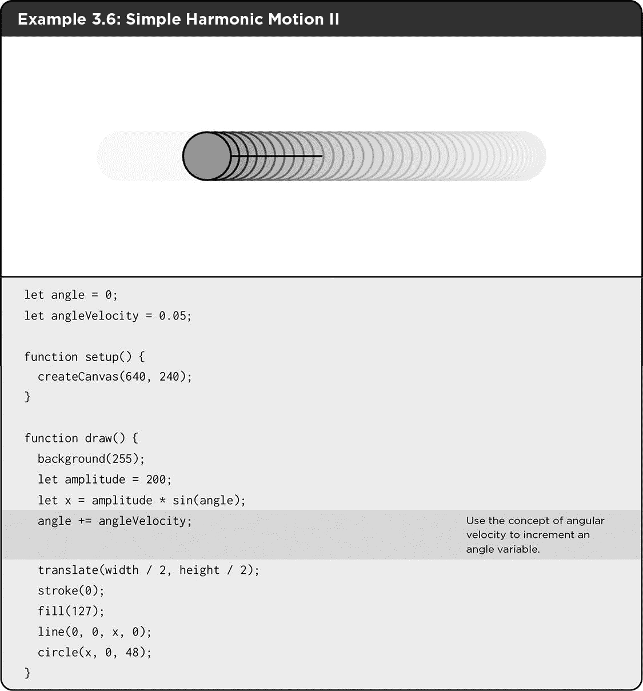

仅仅因为我没有直接引用周期，并不意味着我已经消除了这个概念。毕竟，角速度越大，圆形的振动越快（因此周期越短）。事实上，周期是`angle`增量达到 2π所需的帧数。由于`angle`的增量由角速度控制，我可以通过以下方式计算周期：

period = 2π/角速度

为了说明将振动视为角速度的强大力量，我将通过创建一个`Oscillator`类来进一步扩展示例，其对象可以沿 x 轴（如前所述）*和* y 轴独立振荡。该类需要两个角度、两个角速度和两个振幅（每个轴一个）。

这是一个绝佳的机会，可以使用`createVector()`将每对值打包在一起！与之前的向量不同，这些向量中的值将不再是笛卡尔坐标集。然而，`p5.Vector`类提供了一种方便的方式来管理值对——在这种情况下，是一对对的角度（以及它们的相关速度、加速度等）。

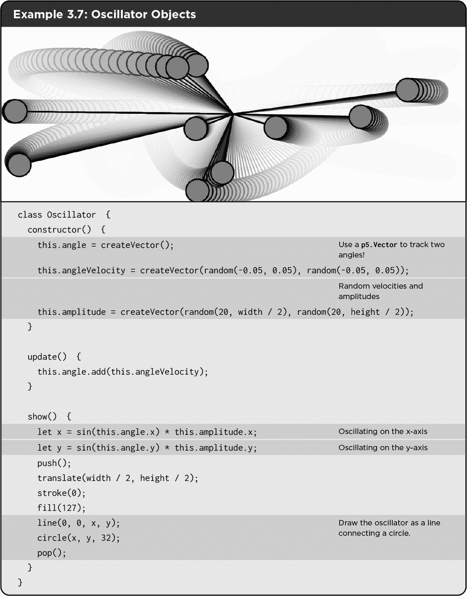

为了更好地理解`Oscillator`类，集中注意力观察动画中单个振荡器的运动可能会很有帮助。首先，观察其水平运动。你会注意到它沿 x 轴规律地前后振荡。将注意力转向其垂直运动，你会看到它沿 y 轴上下振荡。每个振荡器都有自己独特的节奏，因为它的角度、角速度和振幅是随机初始化的。

关键在于认识到`p5.Vector`对象`this.angle`、`this.angleVelocity`和`this.amplitude`的`x`和`y`属性不再与空间向量相关联。相反，它们用于存储两个独立振荡的相应属性（一个沿 x 轴，另一个沿 y 轴）。最终，当`x`和`y`在`show()`方法中计算时，这些振荡在空间上得以体现，将振荡映射到物体的位置上。

 **练习 3.8**

尝试用非随机的速度和振幅初始化每个`Oscillator`对象，以创建某种规律性的图案。你能让振荡器看起来像昆虫的腿吗？

 **练习 3.9**

将角加速度加入到`Oscillator`对象中。

### **波动**

想象一个单独的圆圈根据正弦函数上下振荡。这相当于模拟波的 x 轴上的一个点。稍微加点花样，配合一个`for`循环，你可以通过将一系列振荡圆圈排成一行来动画化整个波形（见图 3.12）。

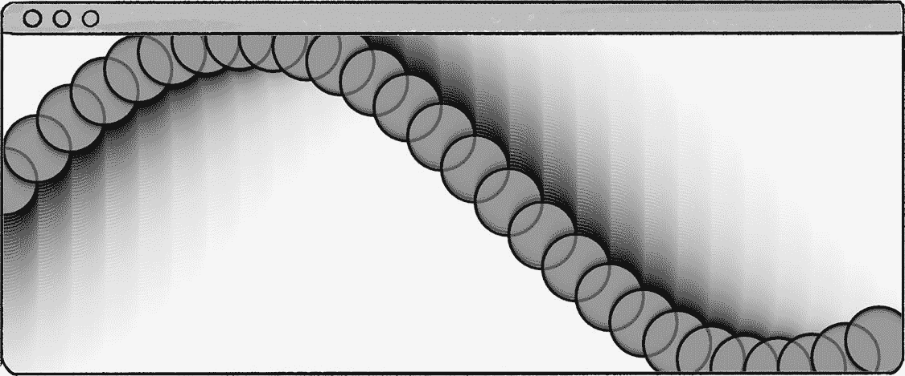

图 3.12：通过振荡圆圈来动画化正弦波

你可以使用这种波动图案来设计生物的身体或附肢，或者模拟一个柔软的表面（如水面）。让我们深入了解这个草图代码的工作原理。

在这里，振幅（波的高度）和周期（波的持续时间）这两个概念同样适用。然而，当绘制整个波时，术语*周期*的含义发生了变化，它不再表示时间，而是描述一个完整波动周期的宽度（以像素为单位）。波的空间周期（与时间周期相对）称为**波长**——即波完成一个完整振荡周期所经过的距离。就像前面振荡的例子一样，你可以选择根据精确的波长来计算波形，或者通过为波上的每个点随意递增角度值（*delta angle*）来进行计算。

我将选择更简单的情况，递增角度。我知道我需要三个变量：角度、增量角度（类似于之前的角速度），和振幅：

```
let angle = 0;
let deltaAngle = 0.2;
let amplitude = 100;
```

接下来，我将循环遍历波上每个点的`x`值。目前，我将相邻的`x`值之间间隔 24 像素。对于每个`x`，我将执行以下三个步骤：

1.  根据振幅和角度的正弦值计算 y 坐标。

1.  在(*x*, *y*)位置画一个圆。

1.  按`deltaAngle`递增角度。

以下示例将这些步骤转化为代码。

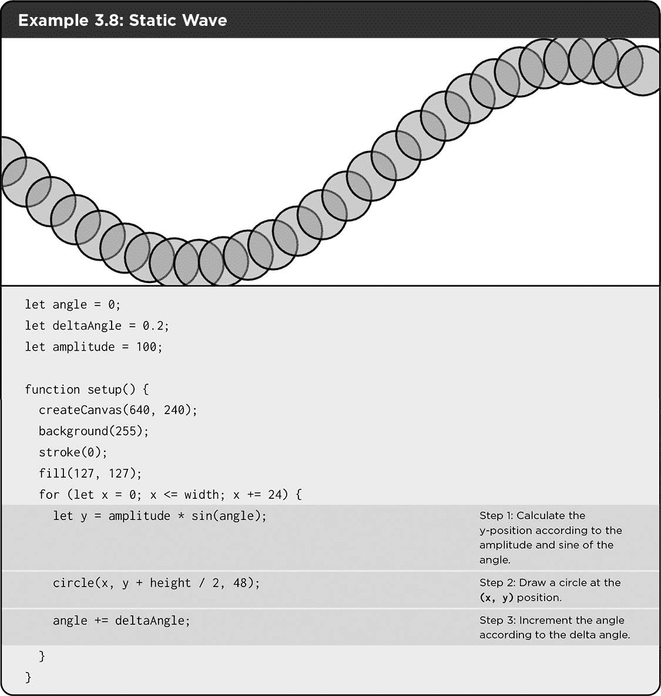

如果你尝试不同的`deltaAngle`值会发生什么呢？图 3.13 展示了几种选择。

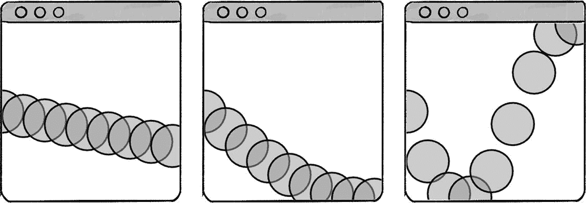

图 3.13：三个不同`deltaAngle`值的正弦波（从左到右分别是 0.05，0.2 和 0.6）

尽管我没有精确计算波长，但你可以看到，角度变化越大，波长越短。还值得注意的是，随着波长的减小，波变得越来越难以辨认，因为各个点之间的垂直距离增加了。

请注意，示例 3.8 中的所有内容都发生在`setup()`内部，因此结果是静态的。波动永远不会改变或起伏。添加运动会有点棘手。你第一反应可能是说：“嘿，没问题，我只需将`for`循环放入`draw()`函数中，让`angle`从一个周期递增到下一个。”

这是一个不错的想法，但它行不通。如果你尝试一下，结果会显得极为不稳定和故障频发。要理解为什么，回顾一下示例 3.8。波的右边缘与左边缘的高度不匹配，因此波在一次`draw()`循环中的结束位置不能是下一个循环的起始位置。相反，你需要一个专门用于追踪每一帧动画中起始`angle`值的变量。这个变量（我将其称为`startAngle`）按自己的节奏递增，控制波从一帧到下一帧的进展。

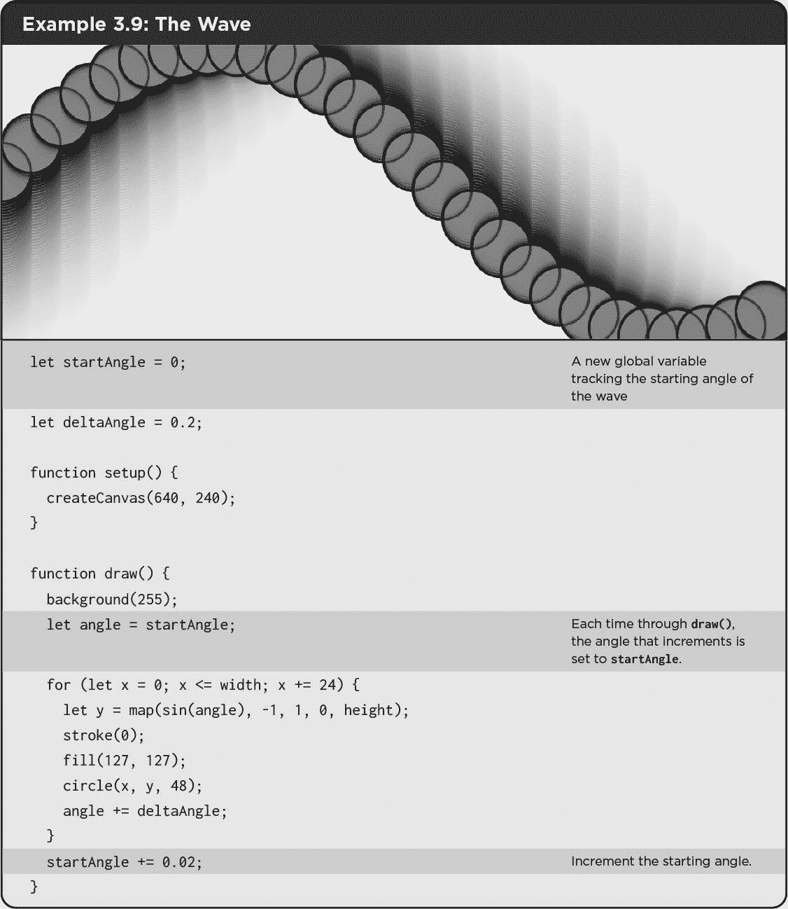

在这个代码示例中，`startAngle`的增量被硬编码为`0.02`，但你可能想考虑重用`deltaAngle`或创建一个第二个变量。通过重用`deltaAngle`，波形的空间进展将与时间进展紧密关联，可能会创造出更同步的运动。如果引入一个单独的变量，或许叫做`startAngleVelocity`，则可以独立控制波形的速度。这里使用*速度*一词是合适的，因为起始角度是随着时间变化的。

 **练习 3.10**

尝试使用 Perlin 噪声函数代替正弦或余弦函数来设置示例 3.9 中的`y`值。

 **练习 3.11**

将波形生成代码封装到一个`Wave`类中，并创建一个显示两个波形（具有不同振幅/周期）的草图，如下图所示。尝试超越简单的圆形和线条，以更具创意的方式可视化波形。如何通过使用`beginShape()`、`endShape()`和`vertex()`连接这些点呢？

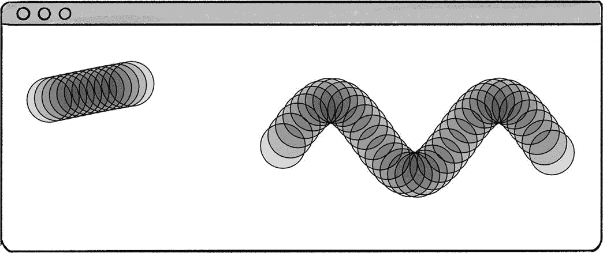

 **练习 3.12**

为了创建更复杂的波形，你可以将多个波形叠加在一起。计算多个波形的高度（或`y`）值，并将这些值加在一起，得到一个单一的`y`值。结果是一个新的波形，它融合了每个单独波形的特征。

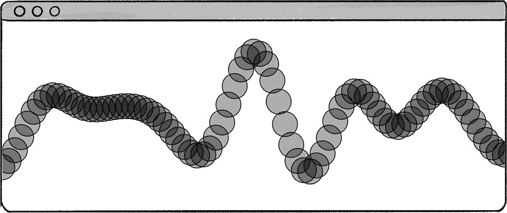

### **弹簧力**

探索三角形和波的数学非常有趣，但也许你开始怀念牛顿的运动定律和向量了。毕竟，本书的核心内容是模拟运动物体的物理。在《振荡性质》一章中（见第 134 页），我通过将正弦波映射到画布上的像素范围来模拟简谐运动。练习 3.7 要求你使用这种技术来创建一个由`sin()`函数驱动的悬挂在弹簧上的摆。然而，如果你真正想要的是一个响应环境中其他力（如风力、重力等）的弹簧摆，单靠这种快速简洁的代码解决方案就不够了。要实现这样的模拟，你需要使用向量来模拟弹簧的力。

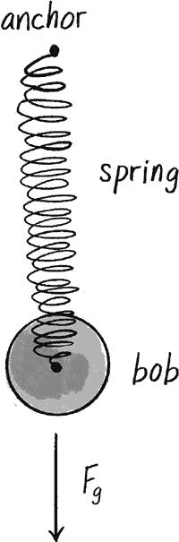

图 3.14：带有锚点和摆的弹簧

我将弹簧视为一个连接可移动的摆（或重物）和固定的锚点之间的连接（见图 3.14）。

弹簧的力是根据胡克定律计算的，这一定律以英国物理学家罗伯特·胡克的名字命名，他于 1660 年提出了这个公式。胡克最初用拉丁语表述了这个定律：“*Ut tensio, sic vis*”，意思是“伸长多少，力就有多少”。可以这样理解：

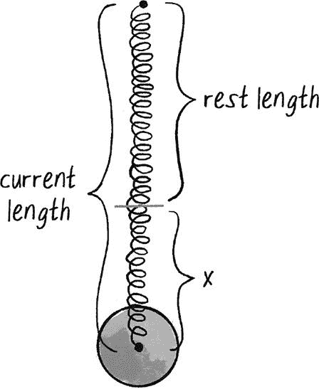

图 3.15：弹簧的伸长（*x*）是其当前长度与静止长度之间的差值。

弹簧的力与弹簧的伸长量成正比。

伸长量是衡量弹簧被拉伸或压缩的程度：如图 3.15 所示，它是弹簧当前长度与静止长度（其平衡状态）之间的差值。因此，胡克定律表明，如果你用力拉动摆锤，弹簧的力会很强，而如果拉动摆锤的力较小，弹簧的力就会较弱。

数学上，这一定律可以表述如下：

*F[spring]* = −*kx*

这里的*k*是*弹簧常数*。它的值决定了力的大小，设置了弹簧的弹性或刚性。同时，*x*是伸长量，即当前长度减去静止长度。

现在记住，力是一个向量，所以你需要计算其大小和方向。对于代码，我将从以下三个变量开始——两个表示锚点和摆锤位置的向量，以及一个静止长度：

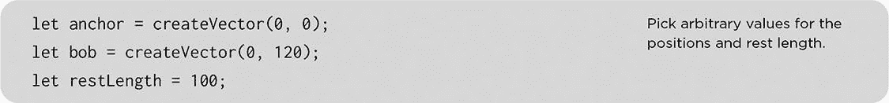

然后我将使用胡克定律来计算力的大小。为此，我需要`k`和`x`。计算`k`很简单，它只是一个常数，所以我将虚构一个值：

```
let k = 0.1;
```

求解`x`或许有些困难。我需要知道当前长度和静止长度之间的差异。静止长度被定义为变量`restLength`。当前长度是多少？是锚点和摆锤之间的距离。那么我该如何计算这个距离呢？如何通过从锚点到摆锤的向量大小来计算呢？（请注意，这与我在第二章中用来计算物体之间的引力的过程完全相同。）

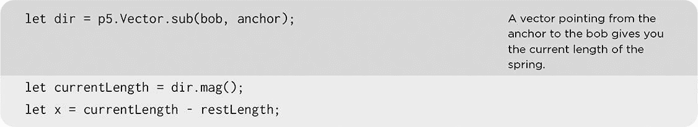

现在我已经整理出了计算力的大小（–*kx*）所需的元素，接下来我需要搞清楚方向，即指向力方向的单位向量。好消息是，我已经有了这个向量。对吧？就在刚才，我问过一个问题，“如何计算那个距离？”然后我回答，“如何通过从锚点到摆锤的向量大小来计算？”嗯，那个向量描述了力的方向！

图 3.16 显示，如果你将弹簧拉伸到超过其静止长度，就会有一个力将其拉回锚点。如果弹簧收缩到低于其静止长度，就会有一个力将其推离锚点。胡克定律公式通过–1 来考虑这种方向的反转。

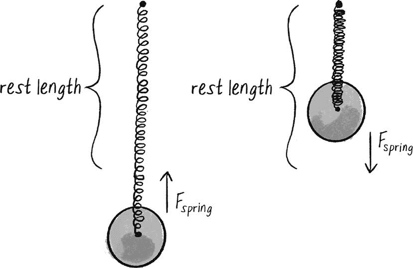

图 3.16：弹簧的力指向位移的相反方向。

现在我所需要做的就是设置用于计算距离的向量的大小。让我们来看一下代码，并将该向量变量重命名为`force`：

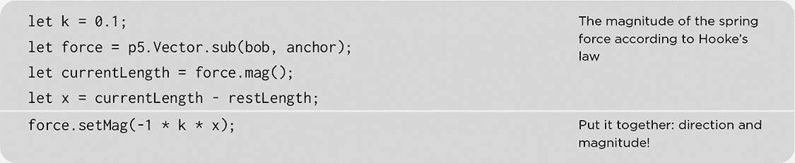

现在我已经有了计算弹簧力的算法，问题依然存在：我应该使用什么 OOP 结构？这是那种没有唯一正确答案的情况。存在多种可能性，我选择的方案取决于我的目标和个人编码风格。

由于我一直在使用`Mover`类，所以我将继续使用这个框架。我会把`Mover`类看作是弹簧的摆锤。摆锤需要`position`、`velocity`和`acceleration`向量来在画布上移动。完美——我已经有了这些！而且也许摆锤通过`applyForce()`方法经历了一个重力力。这只剩下最后一步了，施加弹簧力：

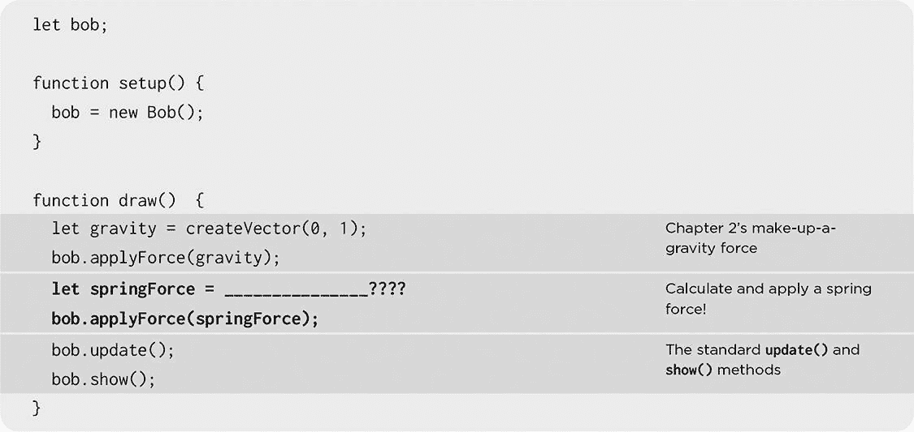

一个选项是将所有弹簧力的代码写在主`draw()`循环中。但考虑到未来可能有多个摆锤和弹簧连接，明智的做法是创建一个额外的类，`Spring`类。正如图 3.17 所示，`Bob`类跟踪摆锤的运动；`Spring`类跟踪弹簧的锚点位置及其静止长度，并计算施加在摆锤上的弹簧力。

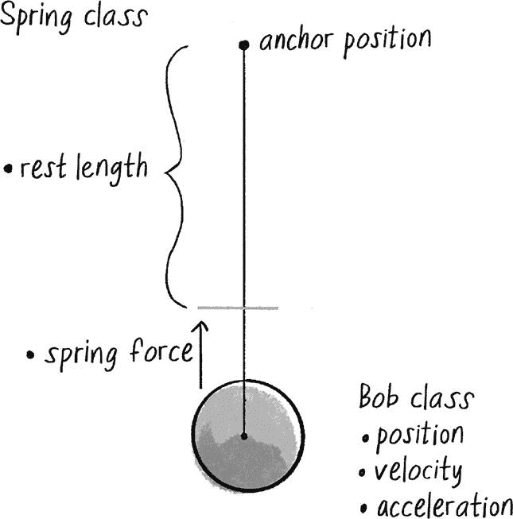

图 3.17：`Spring`类有锚点和静止长度；`Bob`类有位置、速度和加速度。

这使我能够写出如下漂亮的草图：

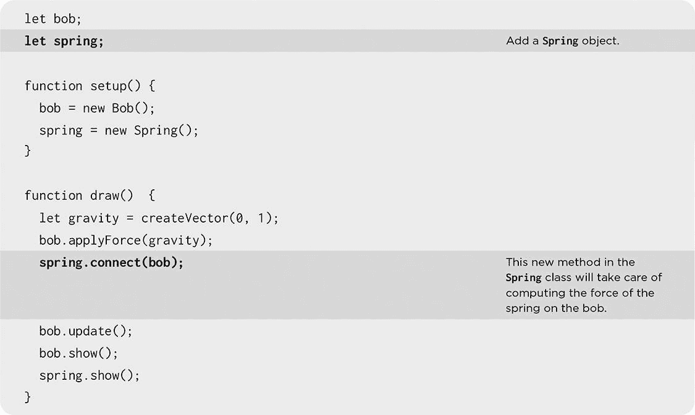

想想这和我在示例 2.6 中第一次尝试重力吸引的情况有何异同，那时我有单独的`Mover`和`Attractor`类。在那里，我写了类似这样的代码：

```
  let force = attractor.attract(mover);
  mover.applyForce(force);
```

弹簧的类似情况可能如下所示：

```
  let force = spring.connect(bob);
  bob.applyForce(force);
```

相反，在这个示例中，我有以下内容：

```
  spring.connect(bob);
```

怎么回事？为什么我不需要在摆锤上调用`applyForce()`？答案当然是，我*确实*需要在摆锤上调用`applyForce()`。只不过，我不是在`draw()`中调用它，而是展示了一个完全合理（有时更可取）的替代方案，那就是让`connect()`方法在内部调用`applyForce()`：

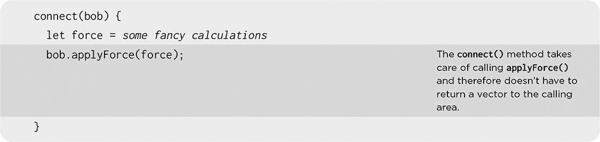

为什么在`Attractor`类中用一种方式，而在`Spring`类中用另一种方式？当我第一次讨论力时，在`draw()`循环中显示所有施加的力是一种更清晰的方式，帮助你了解力的累积。现在你已经更熟悉了，或许将一些细节嵌入到对象内部更简单一些。

让我们看看`Spring`类中的其他元素。

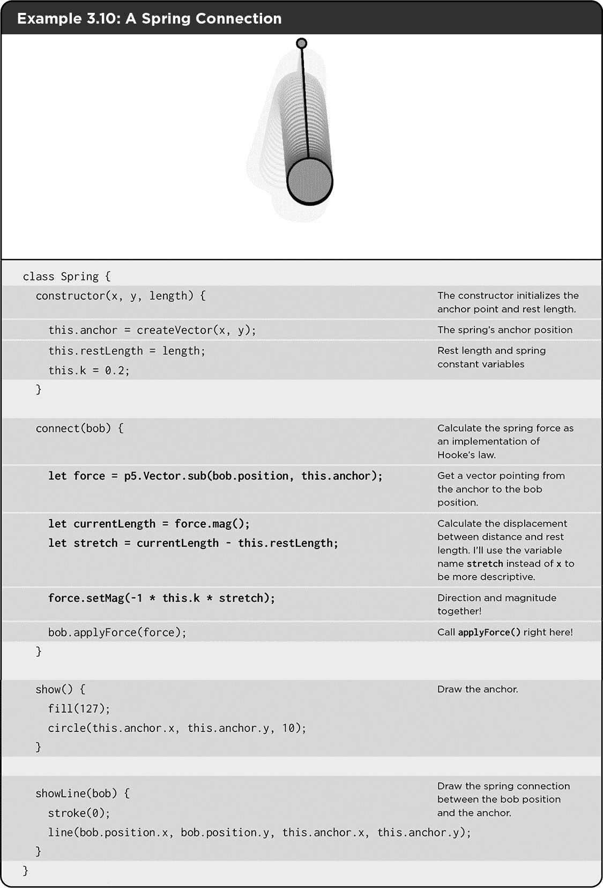

这个示例的完整代码可以在本书的网站上找到，并加入了两个附加功能：（1）`Bob`类包括鼠标交互方法，允许你在窗口中拖动摆锤，（2）`Spring`类包括一个方法，用于将连接的长度限制在最小值和最大值之间。

 **练习 3.13**

在去在线查看示例之前，先看一下这个`constrainLength`方法，看看你是否能填补其中的空白：

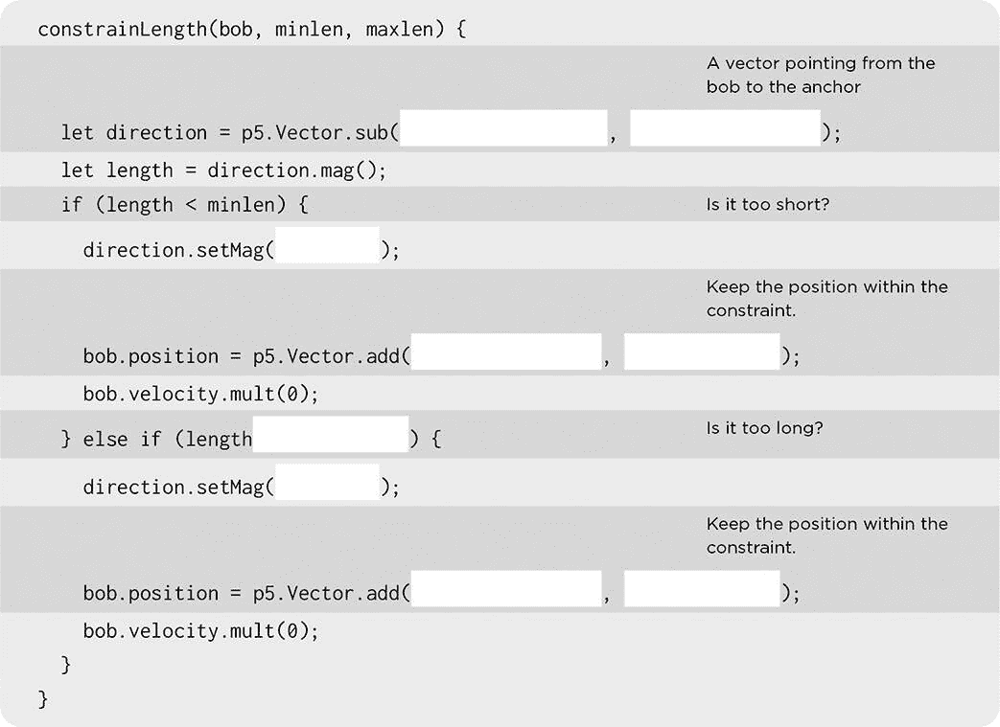

 **练习 3.14**

创建一个包含多个钟摆球和弹簧连接的系统。怎么样，把一个钟摆球连接到另一个没有固定锚点的钟摆球上？

### **钟摆**

你可能已经注意到，在示例 3.10 的弹簧代码中，我从未使用过正弦或余弦。然而，在你把所有这些三角学内容当作旁枝末节时，请允许我展示一个例子，说明这一切是如何结合在一起的。想象一个吊坠从一个锚点悬挂，锚点通过弹簧与其相连，且连接是完全刚性的，既不能压缩也不能伸展。这个理想化的情景描述了一个钟摆，并提供了一个绝佳的机会，让你练习将所学的力学和三角学知识结合起来。

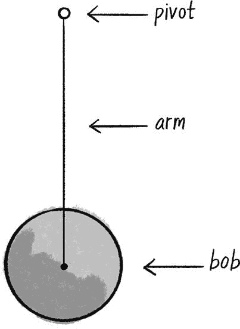

图 3.18：一个带有支点、摆臂和钟摆球的钟摆

一个**钟摆**是一个通过摆臂悬挂在支点上的钟摆球（在弹簧中曾被称为*锚点*）。当钟摆静止时，它会垂直向下悬挂，如图 3.18 所示。然而，如果你将钟摆从静止状态抬起到一个角度，然后释放它，它就会开始来回摆动，划出一个弧形轨迹。现实中的钟摆会生活在三维空间中，但我将研究一个更简单的情景：一个位于 p5.js 画布二维空间中的钟摆。图 3.19 显示了一个非静止位置的钟摆，并添加了作用力：重力和张力。

当钟摆摆动时，它的摆臂和钟摆球基本上是绕着固定的支点旋转的。如果没有摆臂连接钟摆球和支点，钟摆球会在重力的作用下直接掉到地面上。显然，这并不是发生的事情。相反，摆臂的固定长度产生了第二个力——张力。然而，我不会按照这些力来处理这个情景，至少不像我处理弹簧情景那样。

我将不使用*线性*加速度和速度，而是用*角加速度*和*角速度*来描述钟摆的运动，这指的是摆臂相对于钟摆静止位置的角度*θ*的变化。我应该先警告你，尤其是如果你是一个经验丰富的物理学家，我将方便地忽略几个重要的概念：能量守恒、动量、向心力等等。这并不是对钟摆物理的全面描述。我的目标是给你一个机会，练习你新学的三角学技巧，并通过一个具体的例子进一步探索力和角度之间的关系。

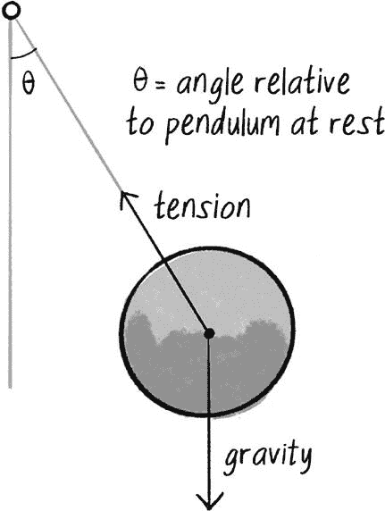

图 3.19：一个钟摆，显示*θ*为相对于其静止位置的角度

为了计算摆的角加速度，我将使用牛顿第二定律，但会加上一些三角学的技巧。看看图 3.19，并将头倾斜，使得摆的臂变成垂直轴。重力的方向突然发生偏移，稍微向左—it’s at an angle with respect to your tilted head。如果这开始让你的脖子有点疼，别担心。我会重新绘制倾斜后的图形，并重新标注力*F[g]*代表重力，*T*代表张力（图 3.20，左侧）。

现在让我们将重力分解为 x 轴和 y 轴的分量，以摆臂为新的 y 轴。这些分量形成一个直角三角形，重力作为斜边（图 3.20，右侧）。我将它们称为*F[gx]*和*F[gy]*，但这些分量是什么意思呢？嗯，*F[gy]*分量代表与*F[gy]*反向的张力力。记住，张力力就是使摆锤不会掉下来的力。

另一个分量*F[gx]*垂直于摆臂，它正是我一直在寻找的力！它使摆锤旋转。当摆锤摆动时，y 轴（摆臂）将始终垂直于运动方向。因此，我可以忽略张力和*F[gy]*力，专注于*F[gx]*，它是沿运动方向的**合力**。而且，因为这个力是直角三角形的一部分，所以我可以用……你猜对了，三角学来计算它！

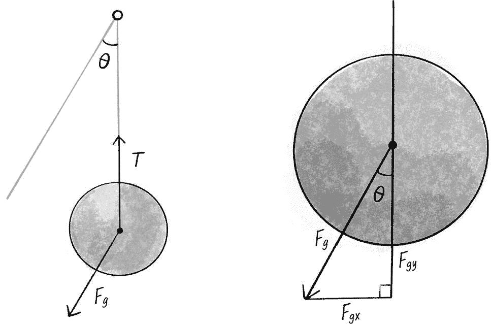

图 3.20：左侧是摆的图形被旋转，使得摆臂为 y 轴。右侧显示了*F[g]*的放大图，并将其分解为*F[gx]*和*F[gy]*的分量。

这里的关键是，右三角形的顶角与摆的臂和其静止位置之间的角度*θ*相同。正如我在讨论极坐标时所示，正弦和余弦函数允许我根据这个角度将重力的分量（斜边）分解出来。对于*F[gx]*，我需要使用正弦：

*sin(θ*) = *F[gx]* / *F[g]*

解出*F[gx]*，我得到了这个结果：

*F[gx]* = *F[g]* × sin(*θ*)

现在，我将这个力重新命名为*F[p]*，代表*摆的力*。在图 3.21 中，我已将图形恢复到原始方向并重新标注了分量。我还将*F[p]*的起点从右三角形的底部移到摆锤的中心，以便更清楚地表示这个力如何使摆锤运动。

就是这样。导致摆锤旋转的合力计算如下：

*F[p]* = *F[g]* × sin(*θ*)

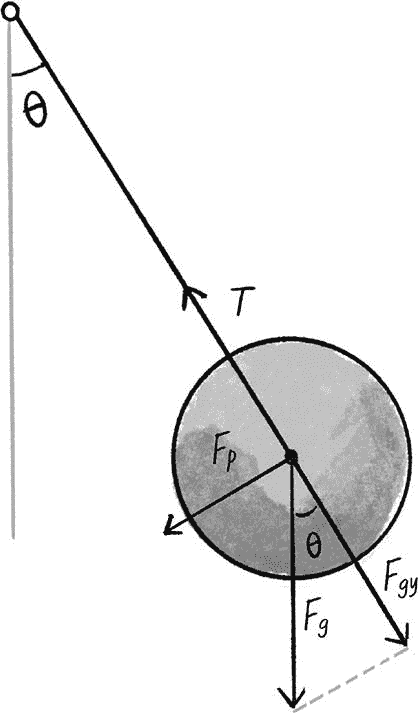

图 3.21：*F[gx]*现在被标为*F[p]*，是沿运动方向的合力。

然而，免得你忘记，我的目标是确定摆的角加速度。一旦我得到了这个，我就能应用运动规则，为每一帧动画找到新的角度*θ*：

角速度 = 角速度 + 角加速度

角度 = 角度 + 角速度

好消息是，牛顿的第二定律建立了力与加速度之间的关系——即，*F* = *M* × *A*，或者 *A* = *F / M*。因此，如果摆的力等于重力与角度的正弦的乘积，那么我就得到了这个公式：

摆的角加速度 = 重力加速度 × sin(*θ*)

现在是提醒大家一下的时候了，这里讨论的背景是创造性编码，而不是纯粹的物理学。是的，地球上的重力加速度是 9.8 米每秒平方。但这个数字在我们像素的世界中并不相关。相反，我将使用一个任意常数（称为`gravity`）作为一个变量来调整加速度（顺便提一下，角加速度通常写作*α*，以便与线性加速度*A*区分）：

*α* = 重力 × sin(*θ*)

在我把所有内容整合之前，还有一个细节我没有提到。或者说，实际上有很多小细节。想一下摆臂。它是金属杆吗？一根绳子？橡皮筋？它是如何固定在支点上的？它的长度是多少？它的质量是多少？今天是风大的日子吗？我可以继续提出很多会影响模拟的问题。然而，我选择生活在一个幻想世界里，在这个世界里，摆臂是一个理想化的杆，永远不会弯曲，而摆锤的质量集中在一个微小的点上。

即使我不太愿意过多担心这些问题，但有一个关键部分仍然缺失，和角加速度的计算有关。为了简化摆的角加速度的推导，我假设摆臂的长度是 1。然而，实际上，摆臂的长度会影响摆的加速度，因为力矩和转动惯量的概念。

**力矩**（或 τ）是作用在物体上的旋转力的度量。在摆的情况下，力矩与摆锤的质量和摆臂的长度成正比（*M* × *r*）。摆的**转动惯量**（或 *I*）是衡量绕支点旋转摆的难度的度量。它与摆锤的质量和摆臂长度的*平方*成正比（*Mr*²）。

记得牛顿的第二定律，*F* = *M* × *A* 吗？它有一个旋转的对应公式，*τ* = *I* × *α*。通过重新排列这个方程来解角加速度 *α*，我得到了 *α* = *τ* /*I*。进一步简化，这变成了 *Mr*/*Mr*² 或者 1/*r*。角加速度与摆锤的质量无关！

这就像是伽利略的比萨斜塔实验，演示了线性加速度，在这个实验中，不同的物体以相同的速度下落，与它们的质量无关。在这里，摆锤的质量同样不影响其角加速度——只有摆臂的长度会影响。所以，最终的公式是这样的：

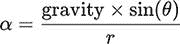

太棒了！最后，这个公式是如此简单，你可能会想知道我为什么要详细讲解这些。我的意思是，学习是好事，但我本来可以简单地说：“嘿，摆锤的角加速度是一个常数乘以角度的正弦值，再除以臂长。”那样就错过了重点。本书的目的不是学习摆锤如何摆动或重力如何运作。重点是要富有创意地思考如何在基于计算的图形系统中让形状在屏幕上移动。摆锤只是一个案例研究。如果你能理解编程摆锤的方法，你可以将相同的技巧应用到其他场景中，无论你选择如何设计你的 p5.js 画布世界。

现在，我还没有完成。也许我对我简单优雅的角加速度公式感到满意，但我仍然需要在代码中应用它。这是一个很好的机会，练习一些面向对象编程（OOP）技巧，创建一个`Pendulum`类。首先，考虑一下我提到过的所有摆锤属性：

+   臂长

+   角度

+   角速度

+   角加速度

`Pendulum`类也需要这些属性：

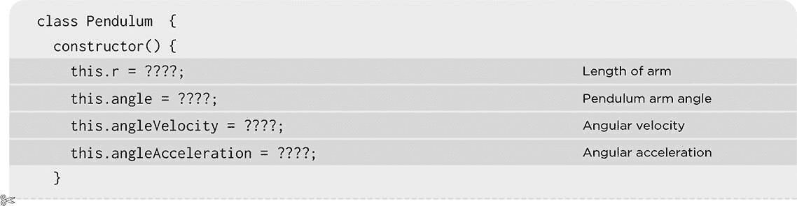

接下来，我需要编写一个`update()`方法，根据公式更新摆锤的角度：

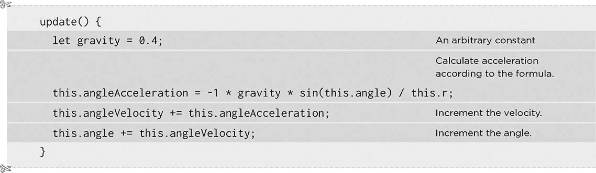

请注意，当前的加速度计算已经包含了乘以 –1 的操作。当摆锤位于其静止位置的右侧时，角度为正，因此角度的正弦值也是正的。然而，重力应该将摆锤拉回到静止位置。相反，当摆锤位于静止位置的左侧时，角度为负，因此其正弦值也为负。在这种情况下，拉力应该是正的。在这两种情况下，乘以 –1 是必要的。

接下来，我需要一个`show()`方法来在画布上绘制摆锤。但究竟应该在哪里绘制它呢？如何计算摆锤支点（我们称之为`pivot`）和摆锤位置（我们称之为`bob`）的 x 和 y 坐标（笛卡尔坐标！）？这可能有点让人感到乏味，但答案还是三角学，如图 3.22 所示。

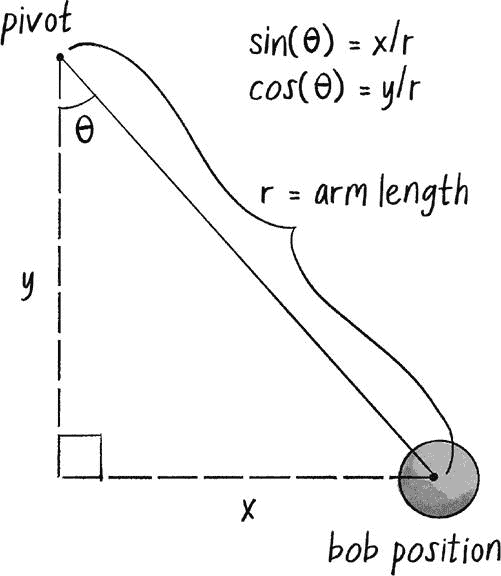

图 3.22：摆锤相对于支点的位置，在极坐标和笛卡尔坐标中的表示

首先，我需要在构造函数中添加一个`this.pivot`属性，以指定在画布上绘制摆锤的位置：

```
this.pivot = createVector(100, 10);
```

我知道摆锤应该与支点保持一个固定的距离，这个距离由臂长决定。这就是我的变量`r`，我现在将其设置为：

```
this.r = 125;
```

我还知道摆锤相对于支点的当前角度：它存储在变量`angle`中。通过臂长和角度，我得到了摆锤的极坐标（*r*，*θ*）。我真正需要的是笛卡尔坐标，但幸运的是，我已经知道如何使用正弦和余弦将极坐标转换为笛卡尔坐标。因此：

```
this.bob = createVector(r * sin(this.angle), r * cos(this.angle));
```

请注意，我正在使用 `sin(this.angle)` 来计算 *x* 值，使用 `cos(this.angle)` 来计算 *y* 值。这与我在《极坐标与笛卡尔坐标》一节中 第 130 页 所展示的内容相反。原因是我现在要寻找的是指向下方的直角三角形的顶角，如 图 3.21 所示。这个角位于 y 轴和斜边之间，而不是像你在 图 3.9 中看到的那样位于 x 轴和斜边之间。

现在，`this.bob` 的值假设支点在点 (0, 0) 处。为了得到摆球相对于支点 *实际* 位置的坐标，我只需要把 `pivot` 加到 `bob` 向量中：

```
this.bob.add(this.pivot);
```

现在剩下的小问题就是画一条线和一个圆圈（当然，你应该更有创意）：

```
stroke(0);
fill(127);
line(this.pivot.x, this.pivot.y, this.bob.x, this.bob.y);
circle(this.bob.x, this.bob.y, 16);
```

最后，现实中的摆锤会遇到一定量的摩擦（在支点处）和空气阻力。按照当前的代码，摆锤将永远摆动下去。为了使其更加真实，我可以通过阻尼技巧来减慢摆锤的运动。我说是 *技巧*，因为与其通过某种方式精确地模拟阻力（就像我在 第二章 中做的那样），我可以通过在每个循环中随意减少角速度的方式来实现类似的效果。以下代码会将速度减少 1%（或将其乘以 0.99），并在每一帧动画中应用：

```
this.angleVelocity *= 0.99;
```

把所有的部分结合在一起，我得到了以下示例（摆锤从 45 度角开始）。

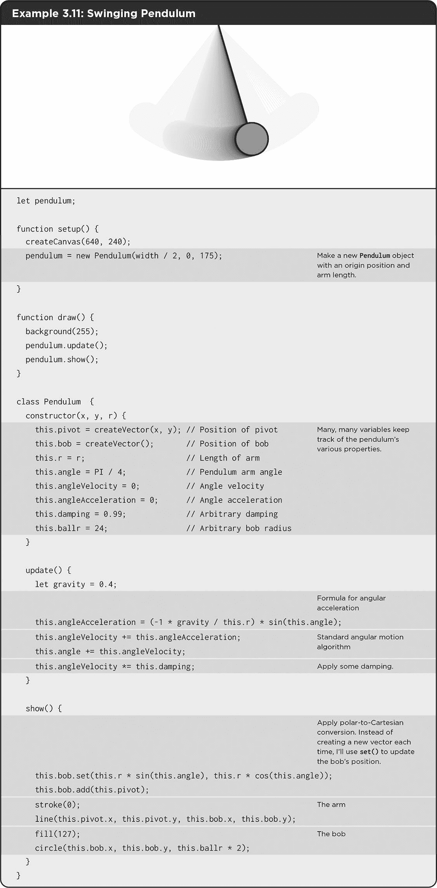

在书籍的官方网站上，这个例子有额外的代码，允许用户用鼠标抓取摆锤并让它摆动。

 **练习 3.15**

将一系列摆锤串联起来，使得一个摆锤的摆球成为另一个摆锤的支点。请注意，尽管这样做可能会产生有趣的结果，但在物理上会极其不准确。模拟实际的双摆需要复杂的方程。你可以在 Wolfram Research 的双摆文章中阅读相关内容 (*[`scienceworld.wolfram.com/physics/DoublePendulum.html`](https://scienceworld.wolfram.com/physics/DoublePendulum.html)*) 或观看我关于编码双摆的视频 (*[`thecodingtrain.com/doublependulum`](https://thecodingtrain.com/doublependulum)*)。

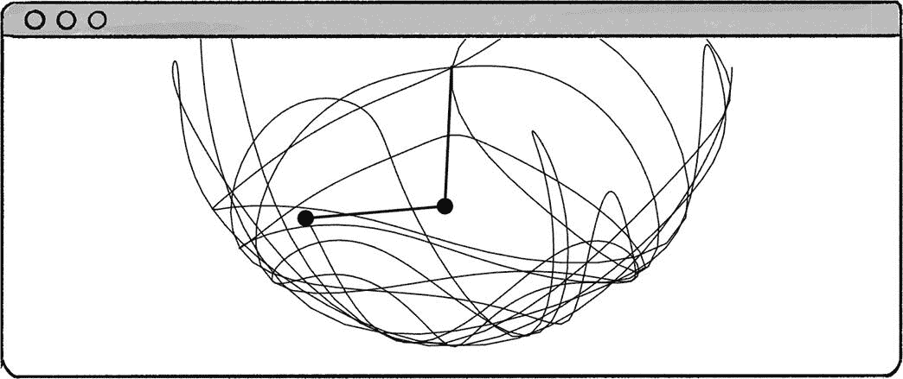

 **练习 3.16**

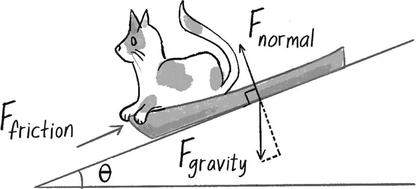

使用三角学，你如何计算这里所示的 **法向力**（垂直于雪橇所处斜面的力）？你可以认为 *F*[gravity] 的大小是已知的常数。寻找一个直角三角形来帮助你开始计算。毕竟，法向力等于并且与重力的一个分量方向相反。如果有帮助的话，你可以在图上画更多的直角三角形，尽管这样做！

 **练习 3.17**

创建一个带有摩擦力的箱子滑下斜面的模拟。请注意，摩擦力的大小与法向力成正比，如前一个练习中所讨论的那样。

 **生态系统项目**

选取你其中一个生物并将振荡融入其运动中。你可以使用示例 3.7 中的`Oscillator`类作为模型。然而，`Oscillator`对象是围绕一个固定点（窗口的中间）进行振荡的。试着围绕一个移动的点进行振荡。

换句话说，设计一种根据位置、速度和加速度在屏幕上移动的生物。但这个生物不仅仅是一个静态的形状；它是一个振荡的物体。考虑将振荡的速度与运动速度联系起来。想想蝴蝶的翅膀扑动或者昆虫的腿。你能否让这个生物的内部机制（振荡）推动它的运动？参见本书网站，了解结合了来自第二章的吸引力和振荡的额外示例。

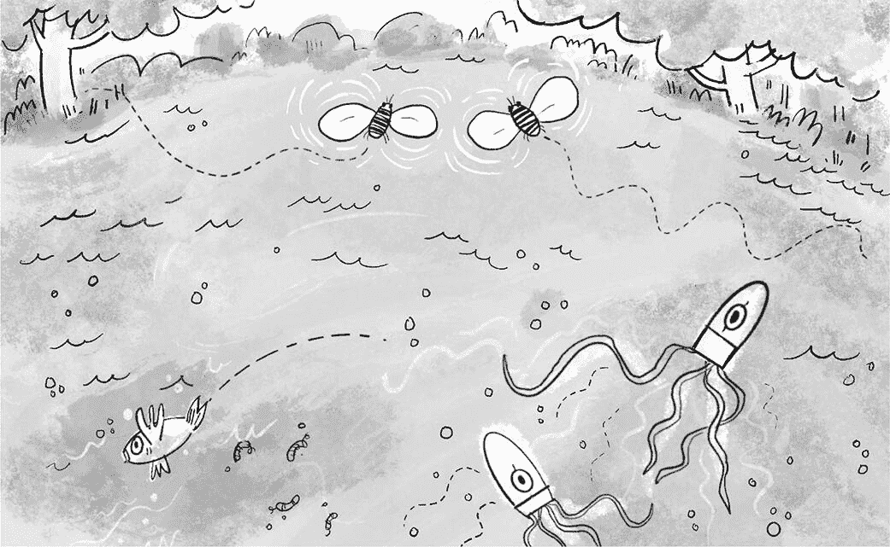
