## **4 粒子系统**

*这是明智的。然而，如果我引用逻辑，逻辑显然表明，众人的需求超过少数人的需求。*

—斯波克

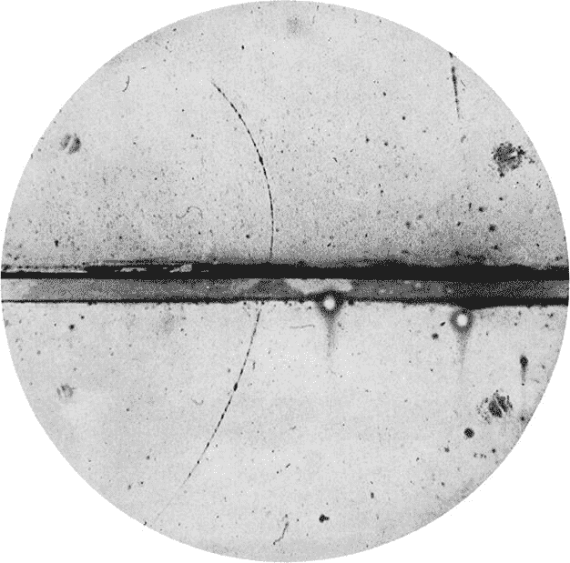

**正电子（照片由卡尔·D·安德森提供）**

这张来自云室的 20 世纪初照片提供了对亚原子粒子世界的一个 glimpse，捕捉到了第一次观察到的正电子。云室是一种装置，能够使带电粒子在超饱和蒸气中移动时的路径变得可见。

1982 年，卢卡斯影业的研究员威廉·T·里维斯正在为《星际迷航 II：可汗的愤怒》工作。电影的大部分情节围绕基因装置展开，这是一种鱼雷，当它被发射到一个荒芜、无生命的星球时，能够重新组织物质，创造一个适合殖民的宜居世界。在这个情节中，随着星球的“地球化”，一堵火墙波动覆盖了星球。**粒子系统**这一在计算机图形学中极其常见且有用的技术，正是在制作这个特效时诞生的。正如里维斯所说：

*粒子系统是许许多多微小粒子的集合，这些粒子共同代表一个模糊的物体。在一段时间内，粒子被生成到系统中，在系统内部移动和变化，并从系统中消亡。*

自 1980 年代初以来，粒子系统已被广泛应用于无数视频游戏、动画、数字艺术作品和装置中，用于模拟各种不规则类型的自然现象，如火焰、烟雾、瀑布、雾气、草地、气泡等等。

本章旨在探讨编码粒子系统和管理相关数据的策略。你如何组织代码？你将与单个粒子相关的信息和与整个系统相关的信息存储在哪里？我将介绍的示例将使用简单的点表示粒子，并只应用最基本的行为。然而，这些特性不应限制你的想象力。粒子系统通常看起来闪闪发光、向前飞行或在重力作用下下落，并不意味着你的系统也必须具备这些特征。通过在本章的框架基础上构建，并添加更多创意的方法来渲染粒子并计算它们的行为，你可以实现各种效果。

换句话说，本章的重点是*如何*跟踪一个包含许多元素的系统。这些元素的行为和外观完全由你决定。

### **粒子系统的重要性**

粒子系统是一组独立的对象，通常通过点或其他简单的形状来表示。但这有什么重要的呢？当然，模拟一些列出的现象（比如瀑布！）的前景非常吸引人，也可能有用。但更广泛地说，当你开始开发更复杂的模拟时，你很可能会遇到处理*许多*事物的情况——弹跳的球、聚集的鸟群、进化的生态系统，所有这些都是以复数形式出现的事物。这里讨论的粒子系统策略将帮助你应对所有这些情况。

事实上，从这一章开始的每一章几乎都会包含使用对象列表的草图，而这基本上就是粒子系统的形式。是的，我已经在前面的一些章节示例中稍微接触过数组的使用。但现在是时候去探索那些数组未曾涉足的领域了（至少在本书中是如此）。

首先，我想适应灵活数量的元素。有些示例可能没有任何物体，有时是一个物体，有时是十个物体，有时是万千物体。其次，我想采用一种更复杂的面向对象的方法。除了编写一个描述单个粒子的类，我还想编写一个描述整个粒子集合——即粒子系统本身——的类。这里的目标是能够写出如下的草图：

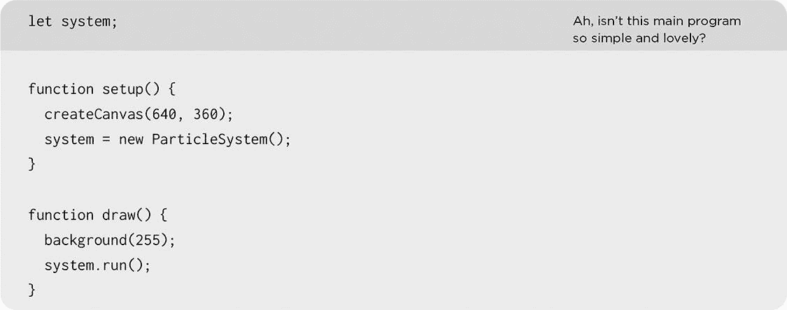

代码中没有引用单个粒子，但结果是画布上到处飞舞着粒子。这之所以能实现，是因为细节被隐藏在`ParticleSystem`类中，它持有对许多`Particle`类实例的引用。习惯于使用多类编写草图的这种技巧，包括那些保存其他类实例列表的类，在你进入本书后面的章节时将非常有用。

最后，处理粒子系统也是一个解决其他两种面向对象编程技术的机会：继承和多态。到目前为止，你所看到的示例中，我总是使用单一类型对象的数组，比如`mover`数组或`oscillator`数组。通过继承和多态，我将展示一种方便的方法，使用单一列表来存储不同类型的对象。这样，粒子系统就不必是只有一种粒子的系统了。

### **单个粒子**

在我开始编写粒子系统的代码之前，我需要写一个类来描述单个粒子。好消息是：我已经做过了！第二章中的`Mover`类就是一个完美的模板。粒子是一个独立的物体，在画布上移动，因此就像一个`mover`一样，它有`position`、`velocity`和`acceleration`变量；一个构造函数来初始化这些变量；还有方法来`show()`自己和`update()`位置。

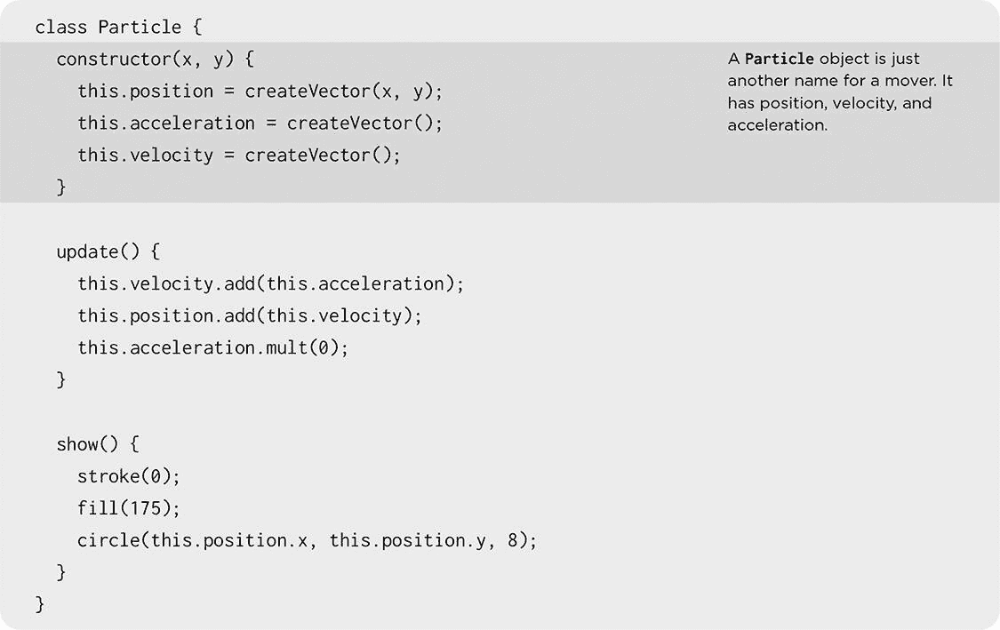

这就是粒子最简单的形式。从这里开始，我可以将粒子引导到多个方向。我可以添加`applyForce()`方法来影响粒子的行为（我将在未来的示例中做这个）。我还可以添加描述颜色和形状的变量，或者加载`p5.Image`来以更有趣的方式绘制粒子。不过，目前我会专注于添加一个额外的细节：**生命周期**。

一些粒子系统包含一个**发射器**，它作为粒子的源。发射器控制粒子的初始设置：位置、速度等。它可能会发射一批粒子、连续的粒子流，或者其他某种变化。这里的新特性是，发射器出生的粒子不能永远活着。如果它们能永生，那么 p5.js 的草图最终会因为粒子数目随时间增加而停滞不前。随着新粒子的诞生，旧粒子需要被移除，从而创造出一个粒子无限流动的假象，而不影响草图的性能。

决定粒子何时准备被移除有很多方法。例如，它可以在与另一个物体接触时“死亡”，或者当它离开画布的边框时“死亡”。目前，我选择给粒子一个`lifespan`变量，像一个计时器一样。它将从 255 开始，在草图进程中逐渐减小到 0，到那时粒子就会被视为死亡。以下是`Particle`类中的新增代码：

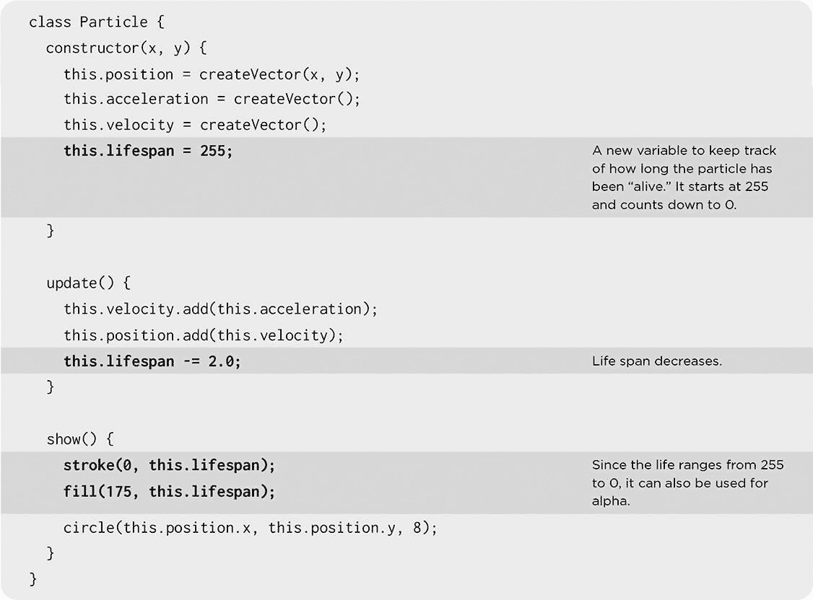

由于`lifespan`的范围从 255 到 0，它还可以方便地充当表示粒子的圆形的透明度。这样，当粒子死亡时，它就会字面上消失。

随着`lifespan`属性的加入，我还需要一个方法，这个方法可以查询（返回真或假）以确定粒子是活着还是死了。当我编写一个单独的类来管理粒子列表时，这将派上用场。编写这个方法其实很简单：我只需要检查`lifespan`的值是否小于 0。如果是，返回`true`；否则，返回`false`：

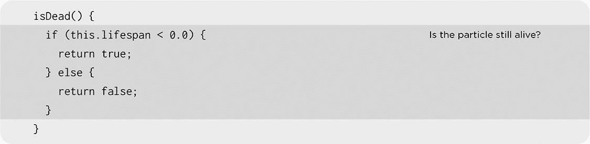

更简单地说，我可以直接返回布尔表达式的结果！


在进入下一步制作许多粒子之前，值得花点时间确认粒子是否能正确工作。为此，我将创建一个只包含单个`Particle`对象的草图。以下是完整代码，做了一些小改动：给粒子一个随机的初始速度，并添加`applyForce()`来模拟重力。

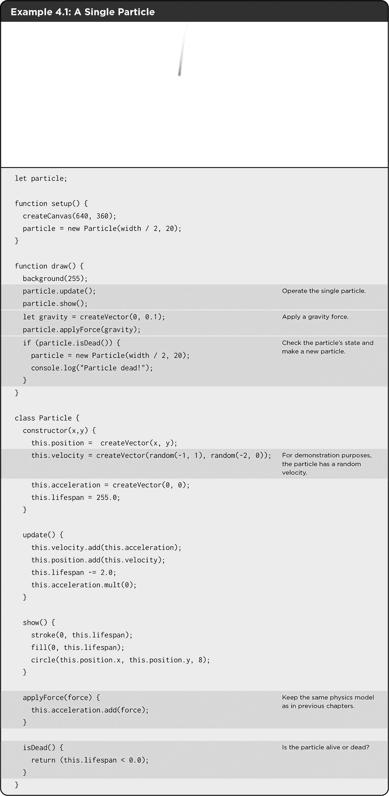

这个示例为了简化和测试，每次只创建一个粒子。每当粒子达到其生命周期的末尾时，`particle` 变量将被一个新的 `Particle` 类实例覆盖。这实际上是替换了先前的 `Particle` 对象。需要理解的是，先前的 `Particle` 对象并没有被真正删除，而是变得无法访问或不再在代码中使用。这个草图实际上是忘记了旧的粒子，从新创建的粒子开始。

 **练习 4.1**

在 `Particle` 类中创建一个 `run()` 方法，用于处理 `update()`、`show()` 和 `applyForce()`。这种方法的优缺点是什么？

 **练习 4.2**

为粒子添加角速度（旋转），并设计一个不是圆形的粒子，使其旋转可见。

### **粒子数组**

现在我已经有了描述单个粒子的类，接下来是下一个大步骤：如何在不事先知道具体有多少粒子的情况下跟踪多个粒子？答案是 JavaScript 数组，这是一种存储任意长度值列表的数据结构。在 JavaScript 中，数组实际上是从 `Array` 类创建的对象，因此它具有许多内建的方法。这些方法提供了我需要的所有功能，用于维护一个 `Particle` 对象的列表，包括添加粒子、删除粒子或以其他方式操作它们。如需复习数组，请参阅 MDN Web Docs 网站上的 JavaScript 数组文档 (*[`developer.mozilla.org/en-US/docs/Web/JavaScript/Reference/Global_Objects/Array`](https://developer.mozilla.org/en-US/docs/Web/JavaScript/Reference/Global_Objects/Array)*).

当我引入数组时，我将使用解决方案来处理 练习 4.1，并假设有一个 `Particle.run()` 方法来管理每个粒子所有的功能。虽然这种方法也有一些缺点，但它将使后续的代码示例更加简洁。首先，我将在 `setup()` 中使用 `for` 循环来填充一个粒子数组，然后在 `draw()` 中使用另一个 `for` 循环来运行每个粒子：

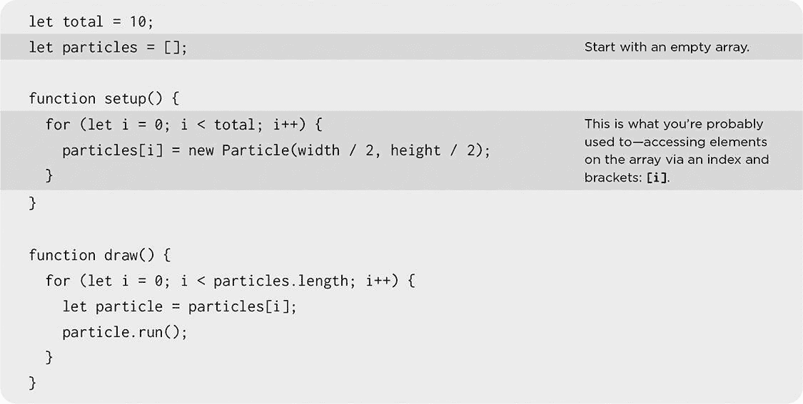

`draw()` 中的 `for` 循环演示了如何通过访问每个索引来调用数组中每个元素的方法。我将变量 `i` 初始化为 `0`，并将其递增 `1`，访问数组的每个元素，直到 `i` 达到 `particles.length` 并到达数组的末尾。实际上，还有其他几种方法可以实现相同的操作。这也是我既喜欢又讨厌使用 JavaScript 编程的地方——它有如此多的风格和选项需要考虑。一方面，这使得 JavaScript 成为一种高度灵活且适应性强的语言，另一方面，选择的多样性可能令人不知所措，学习时可能会感到困惑。

让我们来体验一下用于遍历数组的循环选择过山车：

+   传统的`for`循环，如刚才所示。这可能是你最熟悉的，它的语法与其他编程语言（如 Java 和 C）类似。

+   `for...in`循环。这种循环允许你遍历对象的所有属性。它对于数组并不是特别有用，所以在这里我不会详细介绍。

+   `forEach()`循环。这是一个很棒的循环，我鼓励你去探索它！它是一个高阶函数的例子，稍后我会在本章中解释高阶函数的概念。

+   `for...of`循环。这是我接下来将要详细扩展的技术。与传统的`for`循环相比，它在处理对象数组时提供了更简洁、清晰的语法。

`for...of`循环的样子如下：

```
function draw() {
  for (let particle of particles) {
    particle.run();
  }
}
```

要翻译这段代码，应该用*each*代替*let*，用*in*代替*of*。合起来就是：“对于每个粒子在粒子数组中，更新并显示该粒子。”

简单、优雅、简洁、可爱。但是在你对`for...of`循环感到过于兴奋之前，请先稍作停顿，深呼吸，因为我有一个坏消息要告诉你：它们并不适用于所有情况。是的，我喜欢`for...of`循环，在接下来的示例中，我将使用它们来遍历数组中的项目，但现在还不行。最终，我希望创建一个连续的粒子流，每个循环通过`draw()`向数组中添加一个新粒子，并在粒子死亡时从数组中移除旧粒子。正如你很快会看到的，这正是`for...of`循环让我失望的地方。

在每一帧创建一个新粒子非常简单：我只需在`draw()`中调用`Array`类的`push()`方法，将一个新的`Particle`对象添加到数组的末尾。这也避免了在`setup()`中创建任何粒子：

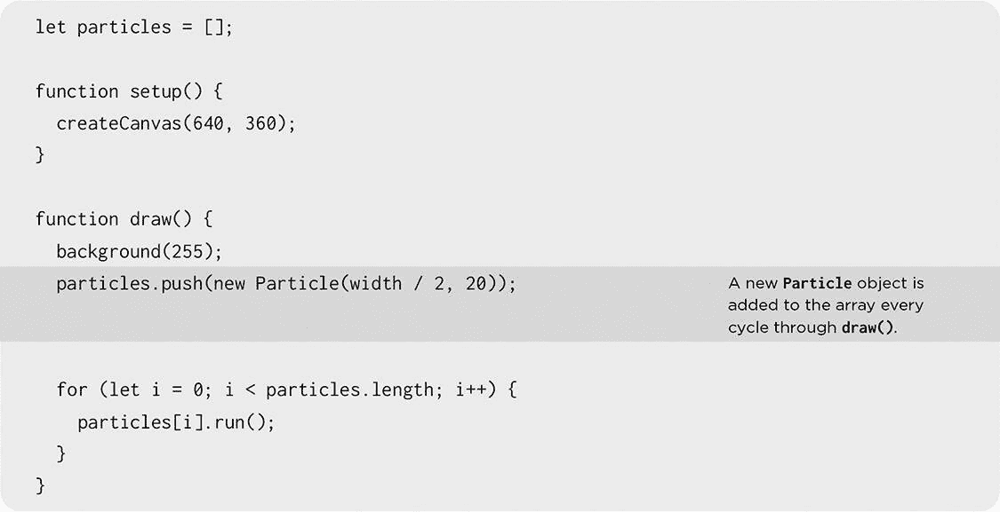

运行这段代码几分钟，你会发现帧率越来越慢，直到程序完全停滞。（我的测试在 15 分钟后表现出可怕的性能问题。）问题当然是，我没有移除任何粒子，只是在不断添加更多的粒子。

为了解决这个问题，我可以使用`splice()`方法，在粒子死亡时将其从数组中移除。该方法从给定的索引开始，移除一个或多个元素。这就是我不能在这里使用`for...of`循环的原因；`splice()`需要一个指向正在被移除粒子索引的引用，而`for...of`循环并没有提供这种引用。所以，我只能改用常规的`for`循环：

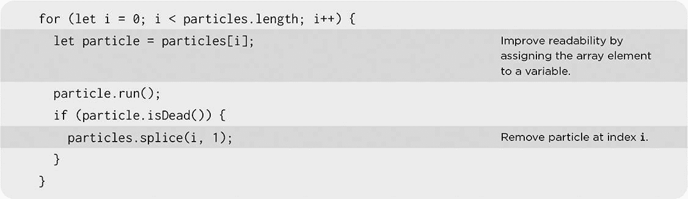

虽然这段代码能够正常运行，并且永远不会停止，但是我通过尝试在遍历数组时操作数组内容，打开了一个中等大小的“麻烦盒子”。这无疑是在自找麻烦。例如，看看以下代码：

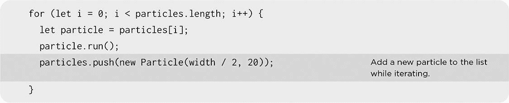

这是一个有些极端的场景（逻辑存在缺陷），但它证明了这个问题。对于列表中的每个粒子，这段代码都会向列表中添加一个新的粒子，从而导致数组的 `length` 增加。这将导致一个无限循环，因为我永远无法超过数组的大小！

虽然在循环中从数组中移除元素并不会导致程序崩溃（就像添加元素时会崩溃一样），但问题可能更为隐蔽，因为它没有留下任何证据。为了发现这个缺陷，我必须先确定一个重要事实：当通过 `splice()` 从数组中删除一个元素时，所有后续元素都会向左移动。图 4.1 展示了当粒子 C（索引 2）被移除时发生的情况。粒子 A 和 B 保持相同的索引，而粒子 D 和 E 则分别从位置 3 和 4 移动到位置 2 和 3。

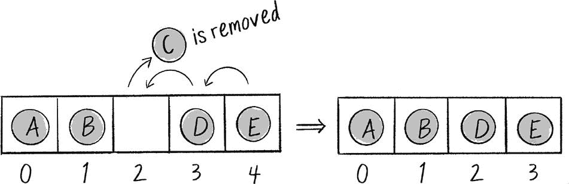

图 4.1：当从数组中移除一个元素时，后续元素会向左移动以填补空缺。

考虑一下当计数器 `i` 遍历数组中的元素时会发生什么：

| i | **粒子** | **操作** |
| --- | --- | --- |
| 0 | 粒子 A | 不删除！ |
| 1 | 粒子 B | 不删除！ |
| 2 | 粒子 C | 删除！将粒子 D 和 E 从位置 3 和 4 移动到位置 2 和 3。 |
| 3 | 粒子 E | 不删除！ |

注意到问题了吗？粒子 D 从未被检查！当 C 从位置 2 被删除时，D 移动到位置 2 代替它，但 `i` 已经移动到位置 3。实际上，这可能不会导致灾难性后果，因为粒子 D 会在下一次通过 `draw()` 时被检查。不过，期望是代码应该遍历数组中的每一个元素，跳过一个元素是不可接受的！

这个问题有两种解决方案。第一种是反向遍历数组。由于当其他元素被移除时，元素会从右到左滑动，因此跳过元素变得不可能。以下是代码的写法：

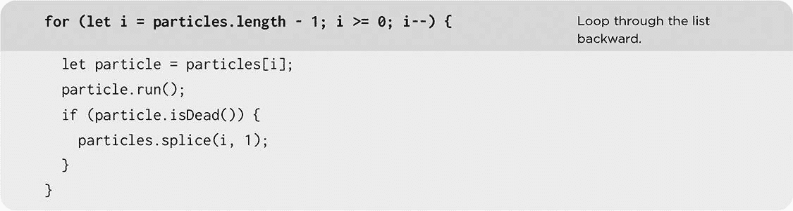

第二种解决方案是使用**高阶函数**。这是一种接受另一个函数作为参数（或将一个函数作为返回值）的函数。JavaScript 数组使用了许多高阶函数。例如，一个常见的高阶函数是 `sort()`，它接受一个定义如何比较数组中两个元素的函数作为参数，然后根据该比较对数组进行排序。

对于粒子数组，我可以使用 `filter()`。这个高阶函数接受一个指定某种条件的函数作为参数，检查数组中的每个项目是否符合该条件，并返回符合条件的项目（排除那些返回 false 的项目）：

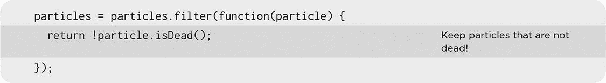

这个通常使用 JavaScript 的箭头函数语法来书写。要了解更多，你可以观看我关于高阶函数和箭头函数语法的 Coding Train 教程（*[`thecodingtrain.com/hof`](https://thecodingtrain.com/hof)*）。

```
  particles = particles.filter(particle => !particle.isDead());
```

就本书而言，我将继续使用`splice()`方法，但我鼓励你探索使用高阶函数和箭头表示法编写代码。

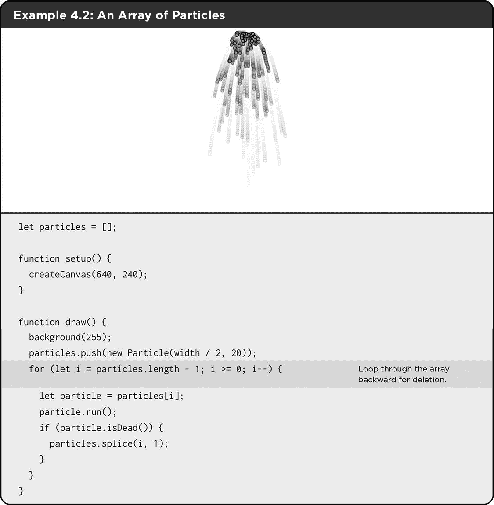

你可能会想，为什么我不在检查每个粒子时单独处理，而是在一定时间后（通过检查`frameCount`或数组长度来确定）直接移除最旧的粒子。在这个示例中，粒子以与出生顺序相同的顺序死亡，这种方法实际上是有效的。我甚至可以使用一个名为`shift()`的数组方法，它会自动移除数组中的第一个元素。然而，在许多粒子系统中，其他条件或相互作用可能导致“年轻”的粒子比“老”的粒子更早死亡。结合使用`isDead()`和`splice()`是一个很好的综合解决方案，它在各种场景下提供了管理粒子的灵活性。

### **粒子发射器**

我已经征服了数组，并用它来管理一个`Particle`对象的列表，能够随意地添加和删除粒子。我本可以在这里停下，满足于现状，但我可以并且应该采取进一步的步骤：编写一个类来描述`Particle`对象的列表。在本章开始时，我使用了一个假设性的类名`ParticleSystem`来表示粒子的总体集合。然而，描述粒子发射功能的更合适术语是`Emitter`，从现在起我将使用这个名称。

`Emitter`类将使我能够简化`draw()`函数，移除循环遍历所有粒子的庞大逻辑。作为额外的好处，它还将为拥有多个粒子发射器提供可能性。

回想一下，我在本章开始时设定的目标之一是编写`setup()`和`draw()`函数时不引用任何单独的粒子。在设定这个目标时，我曾暗示了主草图文件可能变得简单美观的可能性。现在，它已经变成了这个样子，只不过现在采用了`Emitter`的命名惯例。

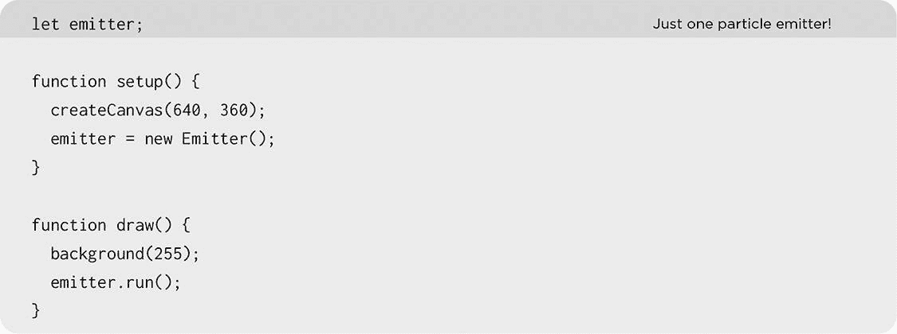

要达到这一点，查看示例 4.2 中`setup()`和`draw()`的每个部分，思考它们如何更适合放入`Emitter`类中。代码行为不应该发生任何变化——唯一的区别是它的组织方式：

| **setup() 和 draw() 中的数组** | **Emitter 类中的数组** |
| --- | --- |

|

```

let particles = [];

function setup() {
  createCanvas(640, 240);
}

function draw() {
  particles.push(new Particle());

  let length = particles.length - 1;
  for (let i = length; i >= 0; i--) {
    let particles = particles[i];
    particle.run();
    if (particle.isDead()) {
      particles.splice(i, 1);
    }
  }
}
```

|

```
class Emitter {
  constructor() {
    this.particles = [];
  }

  addParticle() {
    this.particles.push(new Particle());
  }

  run() {
    let length = this.particles.length - 1;
    for (let i = length; i >= 0; i--) {
      let particle = this.particles[i];
      particle.run();
      if (particle.isDead()) {
        this.particles.splice(i, 1);
      }
    }
  }
}
```

|

我还可以为粒子系统本身添加新特性。例如，`Emitter`类可能会跟踪一个粒子出生的原点。这个原点可以在构造函数中初始化。

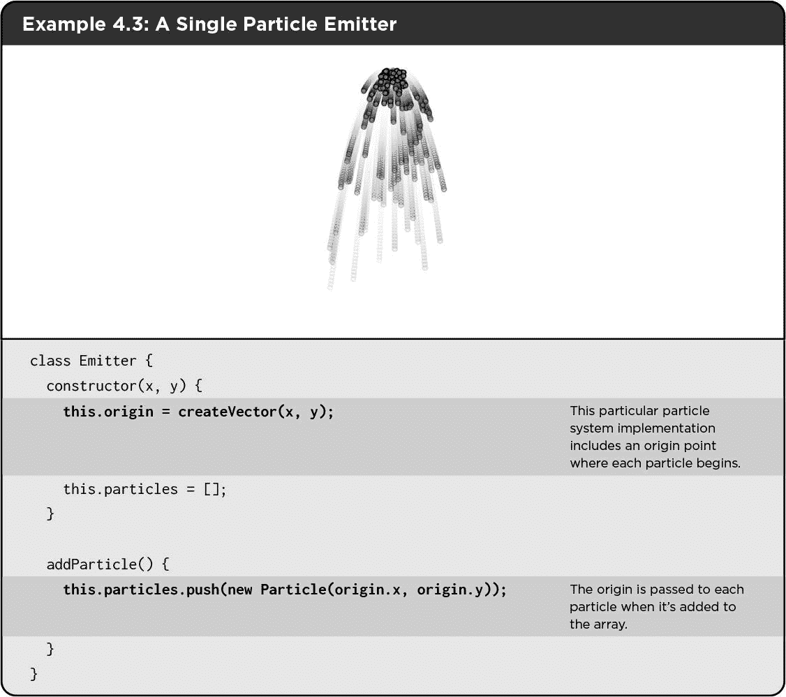

示例发射器是一个静态的粒子源，这是开始处理粒子系统的一个不错的方式。然而，事情不必总是这样。发射器可以有自己的行为：经历物理变化、振荡、响应用户输入，或者表现出前几章中展示的任何其他类型的运动。然后，粒子可以从不同的位置发射，随着时间的推移形成轨迹或其他更复杂、更有趣的图案。

 **练习 4.3**

如果发射器移动怎么办？你能从鼠标位置发射粒子，或者利用速度和加速度的概念让系统自主移动吗？

 **练习 4.4**

基于第三章的*小行星*示例，使用粒子系统从飞船的推进器中发射粒子，每当施加推力时。粒子的初始速度应与飞船的当前方向相关。

### **发射器系统**

到目前为止，我描述了一个单独的粒子，并将其代码组织到一个`Particle`类中。我还描述了一个粒子系统，并将其代码组织到一个`Emitter`类中。这个粒子系统不过是一个独立的`Particle`对象的集合。但作为`Emitter`类的实例，粒子系统不也是一个对象吗？如果是这样（而且确实如此），那就没有理由我不能再构建一个包含多个粒子发射器的集合：一个系统的系统！

我可以进一步思考，甚至把自己锁在地下室里几天，画出一个系统的系统的系统的系统的系统的系统的图……直到我把这整个系统的概念从我的系统中“清除”出去。毕竟，我可以用类似的方式描述这个世界：一个器官是由细胞组成的系统，一个人体是由器官组成的系统，一个社区是由人体组成的系统，一个城市是由社区组成的系统，依此类推。虽然我还没准备好做得那么深入，但仍然有必要看看如何编写一个可以追踪多个粒子系统的草图，而每个粒子系统又可以追踪多个粒子。

考虑以下场景：你从一个空白的屏幕开始（图 4.2）。

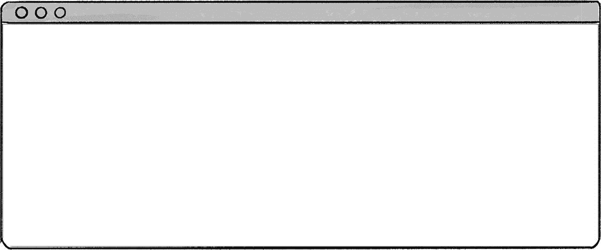

图 4.2：从空白屏幕开始

你点击鼠标，并在鼠标位置生成一个粒子系统（图 4.3）。

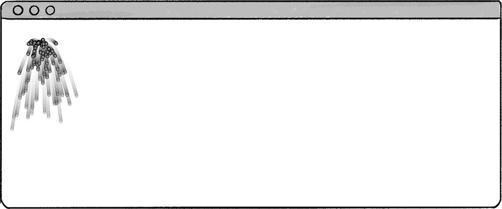

图 4.3：添加粒子系统

你不断点击鼠标。每次点击，都会在你点击的位置弹出另一个粒子系统（图 4.4）。

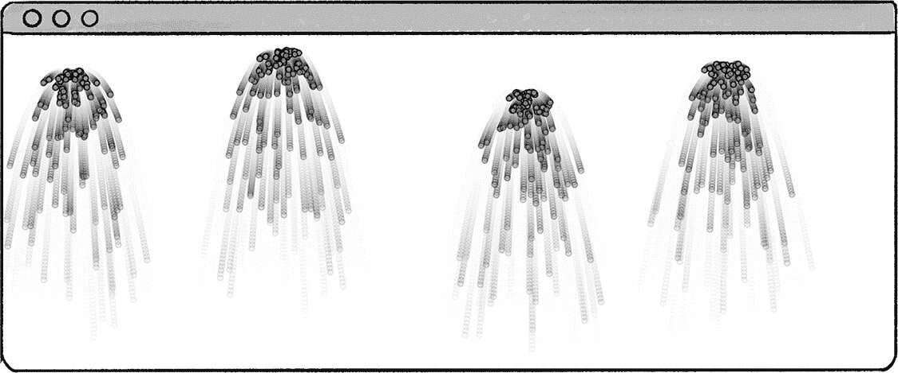

图 4.4：添加更多粒子系统

如何做到这一点？在示例 4.3 中，我将一个`Emitter`对象的引用存储在变量`emitter`中：

```
let emitter;

function setup() {
  createCanvas(640, 240);
  emitter = new Emitter(width / 2, 20);
}
 function draw() {
  background(255);
  emitter.addParticle();  
  emitter.run();
}
```

现在，我将变量命名为`emitters`（复数），并将其设为数组，以便跟踪多个`Emitter`对象。草图开始时，数组为空。

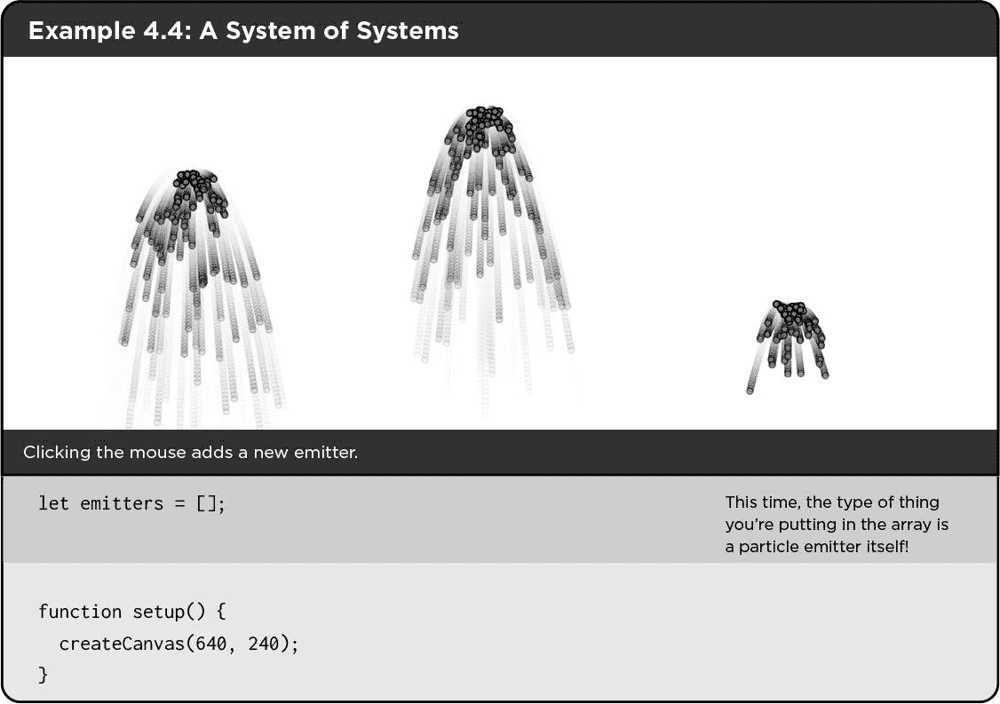

每当鼠标点击时，一个新的`Emitter`对象被创建并放入数组中：

```
function mousePressed() {
  emitters.push(new Emitter(mouseX, mouseY));
}
```

然后，在`draw()`中，我不再引用单个`Emitter`对象，而是遍历所有的发射器，并对每个发射器调用`run()`：


注意，我又回到使用`for...of`循环，因为没有元素从`emitters`数组中被移除。

 **练习 4.5**

重写示例 4.4，使每个粒子系统不会永远存在。为每个粒子系统生成的粒子数量设置限制。然后，当一个粒子系统为空（没有剩余粒子）时，从`emitters`数组中移除它。

 **练习 4.6**

创建一个物体破碎成许多碎片的模拟。你如何将一个大形状转化为许多小粒子？你能否在屏幕上创建几个大形状，每个形状在被点击时都会破碎？

### **继承和多态**

到目前为止，我的系统中的所有粒子都是相同的，具有相同的基本外观和行为。谁说一定要这样呢？通过利用两个基本的面向对象编程（OOP）原则——继承和多态，我可以创建具有更多种类和趣味的粒子系统。

也许在你编程的过程中，已经遇到过这两个术语。例如，我的初学者书籍《学习处理》（*Learning Processing*）中有近一整章（第二十二章）专门讲解这两个概念。不过，也许你只是抽象地了解过继承和多态，但从未有机会真正应用它们。如果是这样，你来对地方了。没有这些技术，你编程多样粒子和粒子系统的能力会非常有限。（在第六章中，我还会演示如何理解这些概念能够帮助你使用物理库。）

想象一下，这是一个周六早晨。你刚刚去跑步，享受了一碗美味的麦片，正在电脑前安静地坐着，手里拿着一杯温暖的洋甘菊茶。今天是你老朋友某某的生日，你决定用 p5.js 做一张贺卡。怎么样，模拟一下五彩纸屑？紫色纸屑、粉色纸屑、星形纸屑、方形纸屑、快速飘落的纸屑、轻盈飘动的纸屑——各种各样的纸屑，各有不同的外观和行为，全部在屏幕上同时爆发出来。

你现在看到的显然是一个粒子系统：由多个单独的片段（粒子）组成的彩纸。你可能会聪明地重新设计`Particle`类，使用变量来存储颜色、形状、行为等。为了创建各种粒子，你可能会用随机值初始化这些变量。但如果某些粒子差异非常大呢？如果把各种不同的粒子行为都放在同一个类中，代码会变得非常凌乱。另一种选择可能是这样做：

```
class HappyConfetti {
}

class FunConfetti {
}

class WackyConfetti {
}
```

这是一个不错的解决方案：创建三个类来描述你的粒子系统中不同种类的彩纸。然后，`Emitter`构造函数可以包含一些代码，在填充数组时从这三个类中随机选择（注意，这种概率方法与我在第零章中的随机漫步示例中使用的相同）：

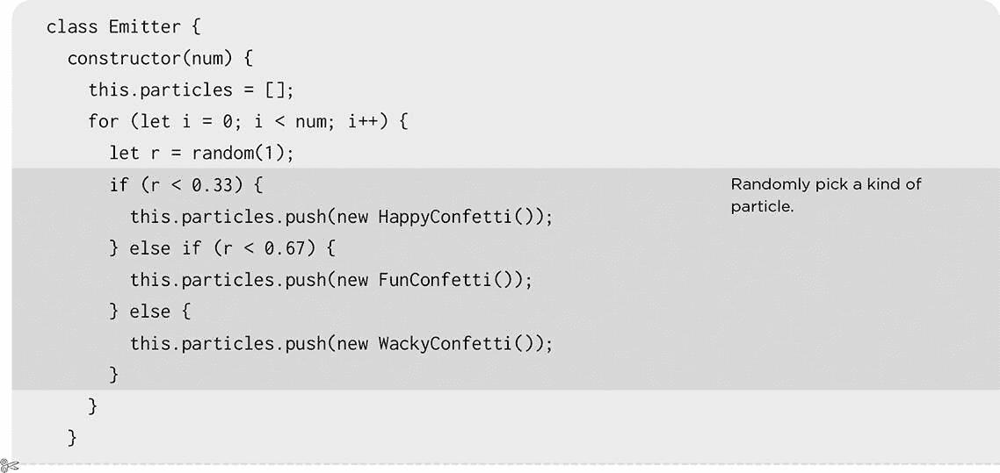

让我稍作停顿。你没有做错什么。你只不过是想祝朋友生日快乐，并享受编写代码的乐趣。但尽管这种方法的思路是合理的，还是存在一个问题：你不是要在各个彩纸类之间复制和粘贴大量代码吗？

是的，你可能会这样想。即使粒子的种类足够不同，值得将它们分开成不同的类，它们很可能会共享大量的代码。例如，它们都会有向量来跟踪位置、速度和加速度；一个实现运动算法的`update()`函数；等等。

这就是**继承**的作用。继承让你能够编写一个类，从另一个类中(*继承*)变量和方法，同时也实现自己的定制功能。你可能还会想知道，把所有这些类型的彩纸放进一个`particles`数组中是否真的可行。毕竟，我通常不会把不同种类的对象放在同一个数组中，因为这可能会让人感到困惑。`Emitter`类中的代码如何知道哪个粒子是哪种彩纸呢？分开数组不更容易管理吗？

```
 constructor() {
   this.happyParticles = [];
   this.funParticles = [];
   this.wackyParticles = [];
 }
```

事实上，将粒子分成不同的数组并不方便；一个包含所有粒子的单一数组要实用得多。幸运的是，JavaScript 具有将不同类型的对象混合在一个数组中的能力，而**多态性**使得这些混合的对象可以像同一种类型的对象一样进行操作。我可以用不同类型的粒子填充一个数组，每个粒子仍然会保持它在各自类中定义的独特行为和特征。

在这一节中，我将更详细地说明继承和多态的概念，然后我会创建一个结合这些概念的粒子系统。

#### **继承基础**

为了展示继承是如何工作的，我将以动物世界中的一个例子为例：狗、猫、猴子、熊猫、袋熊、海蜇等等。我将从编写一个`Dog`类开始。一个`Dog`对象将拥有一个`age`变量（一个整数），以及`eat()`、`sleep()`和`bark()`方法：

```
class Dog {
  constructor() {
    this.age = 0;
  }

  eat() {
    print("Yum!");
  }
 sleep() {
    print("Zzzzzz");
  }

  bark() {
    print("WOOF");
  }
}
```

现在我来创建一只猫：

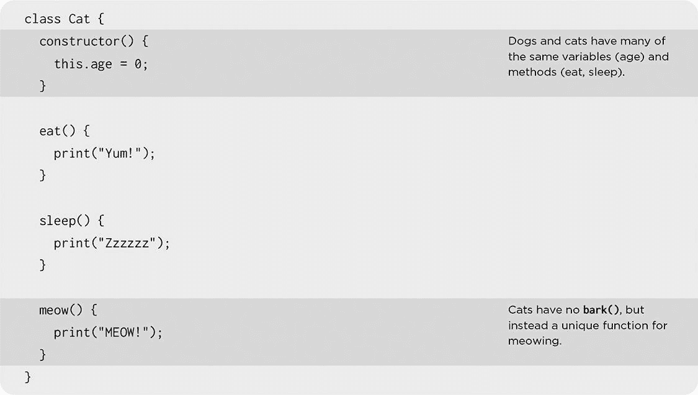

当我继续为鱼、马、考拉和狐猴编写相同的代码时，这个过程会变得相当繁琐。一个更好的解决方案是开发一个通用的`Animal`类，可以描述任何类型的动物。毕竟，所有动物都会吃和睡。我可以这样写：

+   一只狗是动物，并且拥有所有动物的属性，可以做所有动物能做的事情。此外，狗还可以叫。

+   一只猫是动物，并且拥有所有动物的属性，可以做所有动物能做的事情。此外，猫还可以喵喵叫。

继承使这一切成为可能，允许`Dog`和`Cat`被指定为`Animal`类的子类（**子类**）。子类自动继承父类（**超类**）的所有变量和方法，但它们也可以包含父类中没有的方法和变量。像生命的系统发育树一样，继承遵循树状结构（见图 4.5）：狗继承自哺乳动物，哺乳动物继承自动物，依此类推。

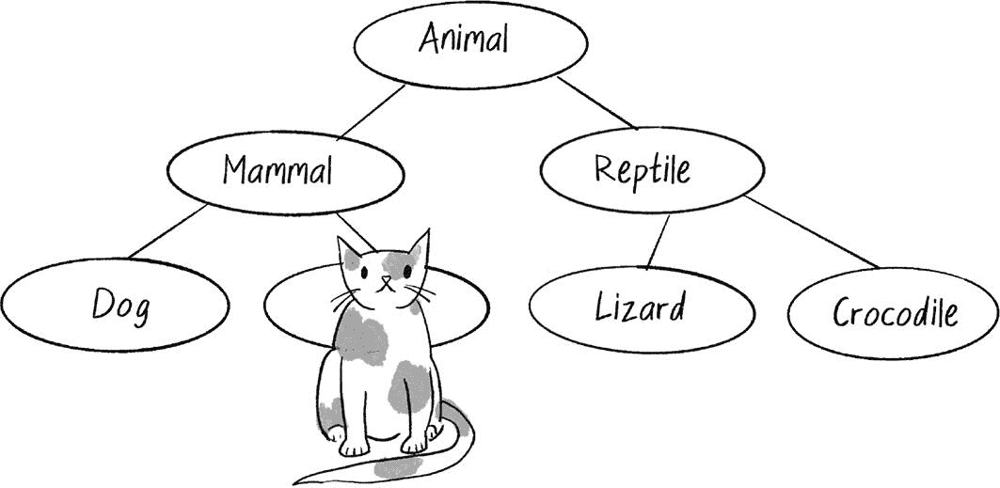

图 4.5：继承树

下面是继承语法如何工作的：


这段代码使用了两个新的 JavaScript 特性。首先，注意到`extends`关键字，它指定了类的父类。一个子类只能继承一个父类。然而，类可以继承继承其他类的类；例如，`Dog extends Animal`，`Terrier extends Dog`。从`Animal`到`Terrier`，一切都被继承下来。

其次，注意在`Dog`和`Cat`构造函数中调用了`super()`。这会调用父类中的构造函数。换句话说，无论你在父类构造函数中做了什么，都要在子类构造函数中做同样的事。在这种情况下，这并不是必要的，但如果父类构造函数定义了需要匹配参数的构造函数，`super()`也可以接收参数。

你可以扩展一个子类，包含超类中没有的额外方法。在这里，我为`Dog`类添加了`bark()`方法，为`Cat`类添加了`meow()`方法。你还可以在子类的构造函数中，除了调用`super()`，添加额外的代码，以给该子类添加额外的变量。例如，假设除了`age`之外，一个`Dog`对象还应该有一个`haircolor`变量。这个类现在会像这样：

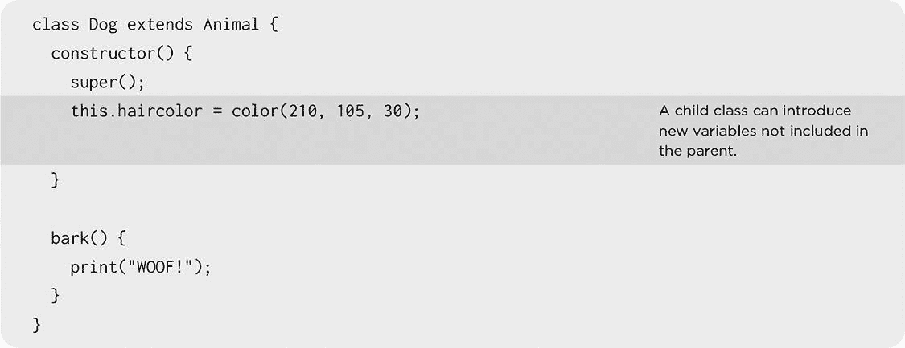

注意，父类构造函数首先通过`super()`调用，这会将`age`设置为`0`，然后在`Dog`构造函数中设置`haircolor`。

如果`Dog`对象的吃饭方式与普通`Animal`对象不同，可以通过在子类中创建不同的定义来*覆盖*父类方法：


但如果一只狗吃东西的方式与普通动物差不多，只是多了一些额外的功能怎么办？子类可以既执行父类方法中的代码，也可以加入自定义代码：

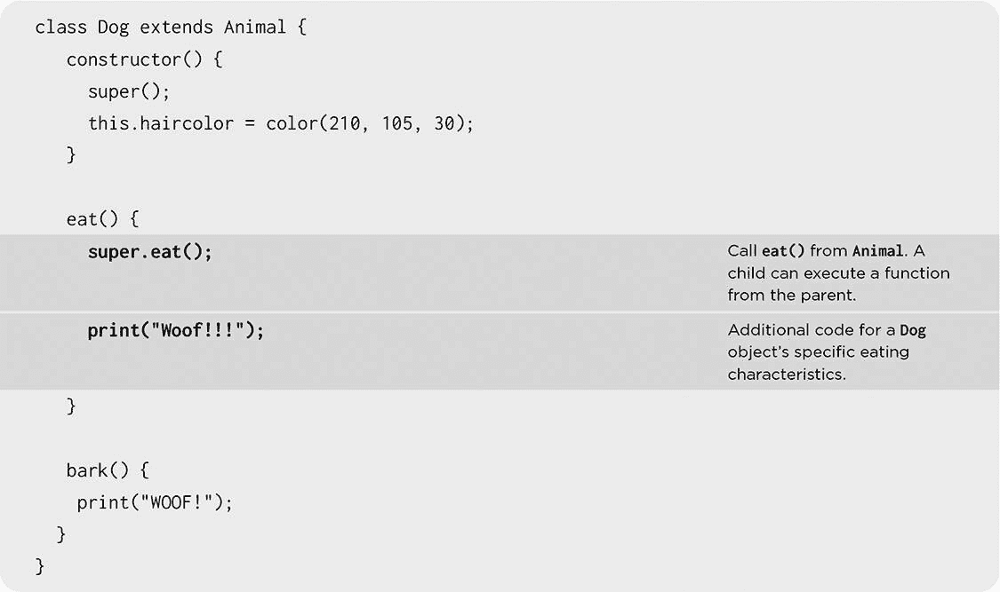

类似于在构造函数中调用`super()`，在`Dog`类的`eat()`方法中调用`super.eat()`将会调用`Animal`类的`eat()`方法。然后，子类的方法定义可以继续执行任何额外的自定义代码。

#### **多态基础**

你已经使用继承创建了一堆动物子类。现在试着想象一下，如何管理这个包含狗、猫、乌龟和奇异鸟等各种动物的庞大动物王国：


当一天开始时，动物们都很饿，准备进食。现在是（增强版！）循环时间：


这样做是可行的，但随着世界扩展到更多动物物种，你将不得不写很多独立的循环。这真的是必要的吗？毕竟，这些生物都是动物，而且它们都喜欢吃东西。为什么不只用一个数组，填充所有种类的动物呢？

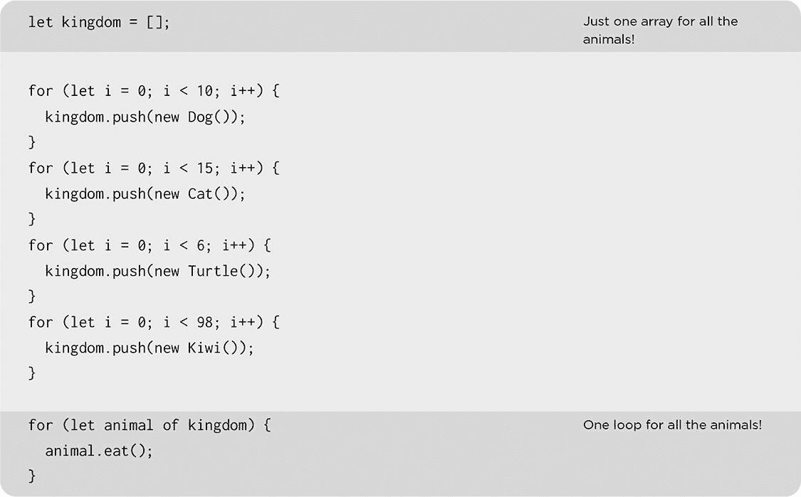

这就是多态（来自希腊语*polymorphos*，意为“多种形式”）的实际应用。虽然所有动物都被放在一个数组中，并在一个`for`循环中处理，JavaScript 仍然能够识别它们的真实类型，并为每个对象调用适当的`eat()`方法。就是这么简单！

#### **继承与多态中的粒子**

现在我已经介绍了继承和多态的理论和语法，准备在 p5.js 中写出一个基于`Particle`类的实际示例。首先，再看一眼一个基本的`Particle`实现，改编自示例 4.1：

```
class Particle {
  constructor(x, y) {
    this.acceleration = createVector(0, 0);
    this.velocity = createVector(random(-1, 1), random(-2, 0));
    this.position = createVector(x, y);
    this.lifespan = 255.0;
  }
 run() {
    this.update();
    this.show();
  }

  update() {
    this.velocity.add(this.acceleration);
    this.position.add(this.velocity);
    this.lifespan -= 2.0;
    this.acceleration.mult(0);
  }

  applyForce(force) {
    this.acceleration.add(force);
  }

  isDead() {
    return (this.lifespan < 0);
  }

  show() {
    fill(0, this.lifespan);
    circle(this.position.x, this.position.y, 8);
  }
}
```

这个类包含了粒子系统中任何参与者应该具备的变量和方法。接下来，我将创建一个继承自`Particle`的`Confetti`子类。它将使用`super()`执行父类构造函数中的代码，并继承大部分`Particle`类的方法。然而，我将为`Confetti`定义一个自己的`show()`方法，覆盖父类的方法，这样`Confetti`对象将被绘制为方形，而不是圆形：

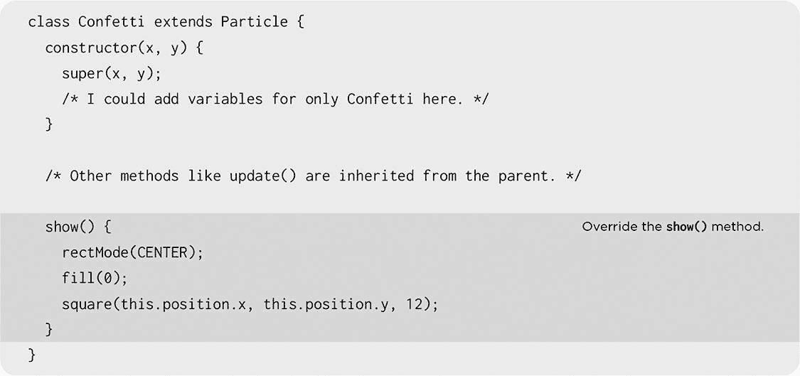

让我们把这个做得更复杂一些。假设我想让每个`Confetti`粒子在飞行时旋转。一种选择是模拟角速度和加速度，如第三章所述。然而，为了简便，我将实现一种不那么正式的方式。

我知道一个粒子的 x 坐标在 0 到画布宽度之间。那么，如果我说，当粒子的 x 坐标为 0 时，它的旋转角度应该是 0；当它的 x 坐标等于宽度时，它的旋转角度应该是 4π呢？这听起来熟悉吗？正如在第零章中讨论的那样，当你需要将一个范围的值映射到另一个范围时，可以使用`map()`函数：

```
    let angle = map(this.position.x, 0, width, 0, TWO_PI * 2);
```

以下是这段代码如何融入到`show()`方法中的：

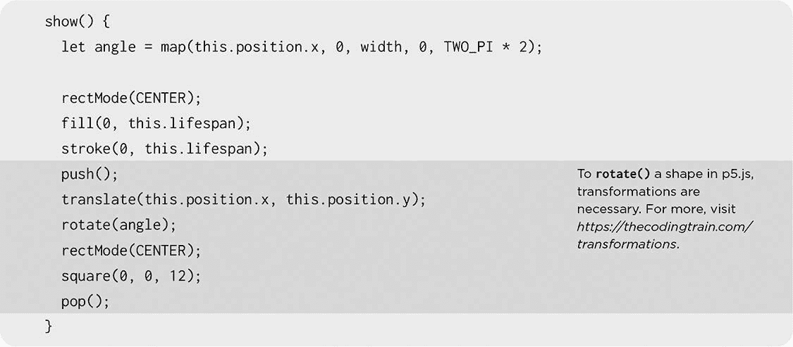

选择 4π可能看起来有些任意，但其实是故意为之——两次完整的旋转相较于一次旋转能给粒子带来更强的旋转效果。

 **练习 4.7**

不要使用`map()`来计算`angle`，尝试建模角速度和加速度。

现在，我已经有了一个扩展自基础`Particle`类的`Confetti`子类，接下来的步骤是将`Confetti`对象添加到`Emitter`类中定义的粒子数组里。

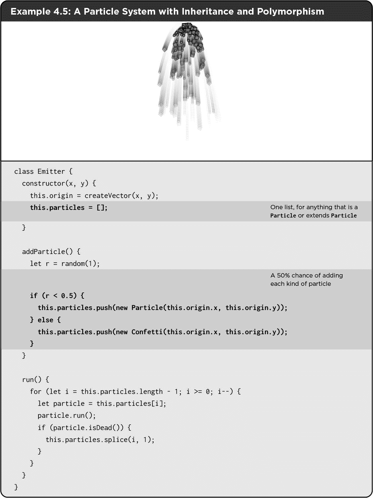

你能发现这个例子是如何利用多态性的吗？正是它让`Particle`和`Confetti`对象可以在`Emitter`类中的同一个`particles`数组里混合。由于继承关系，它们都可以被视为同一类型`Particle`，因此可以安全地遍历数组并对每个对象调用像`run()`和`isDead()`这样的函数。继承和多态性一起使得可以在一个数组中管理各种粒子类型，而不管它们最初属于哪个类。

 **练习 4.8**

创建一个包含两种以上粒子的粒子系统。除了设计外，尝试改变粒子的行为。

### **带有力的粒子系统**

到目前为止，本章的重点是以面向对象的方式构建代码，以管理一组粒子。虽然我在`Particle`类中保留了`applyForce()`函数，但我为了简化代码采取了一些捷径。现在，我将重新添加一个`mass`属性，并在此过程中更改`constructor()`和`applyForce()`方法（类的其他部分保持不变）：

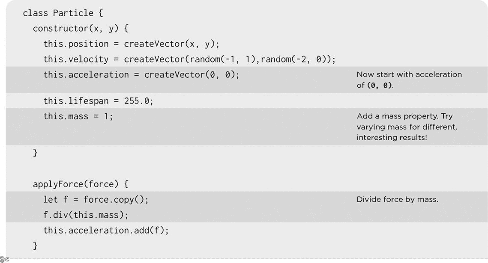

既然`Particle`类已经完成，我有一个重要的问题要问：我应该在哪里调用`applyForce()`方法？在代码中的哪一部分应用力到粒子上才合适？在我看来，没有对错之分，这真的取决于特定 p5.js 草图的功能和目标。我在前面的示例中的简单解决方案是，在每个粒子的`run()`方法中创建并应用一个`gravity`力：

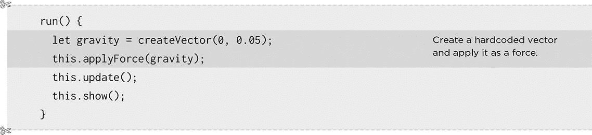

现在，我想考虑一个更广泛、更通用的解决方案，允许对系统中的单个粒子应用不同的力。例如，如果我在每次通过`draw()`时全球性地对所有粒子应用一个力，会怎样？

```
function draw() {
  background(255);

  /* Apply a force to all particles? */

  emitter.addParticle();
  emitter.run();
}
```

嗯，似乎有个小问题。`applyForce()`方法是在`Particle`类内部写的，但这里并没有对单个粒子本身的引用，只有对`emitter`（`Emitter`对象）的引用。然而，我希望所有粒子都能接受这个力，所以我可以把力传递给发射器，让它来管理所有粒子：

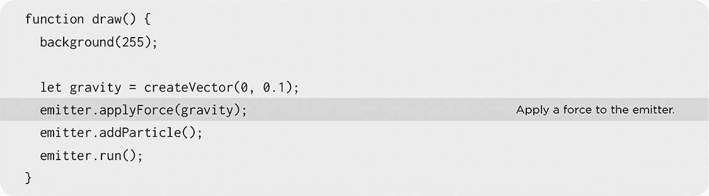

当然，如果我在`draw()`方法中调用了`Emitter`对象的`applyForce()`方法，那么我就必须在`Emitter`类中定义该方法。该方法需要能够接收一个`p5.Vector`类型的力，并将这个力应用到所有粒子上。以下是代码实现：

```
 applyForce(force) {
    for (let particle of this.particles) {
      particle.applyForce(force);
    }
  }
```

写这个方法几乎有点傻。代码本质上是在说：“将力施加到粒子系统中，这样系统就能把力施加到所有单个粒子上。”虽然这听起来有点绕，但这种方法是相当合理的。毕竟，发射器负责管理粒子，所以如果你想与粒子交互，就必须通过它们的管理者来交互。（另外，这也是使用`for...of`循环的好机会，因为没有粒子被删除！）

这是完整的示例，包括了这个更改。（代码假设之前已存在`Particle`类；由于没有变化，因此无需再次展示。）

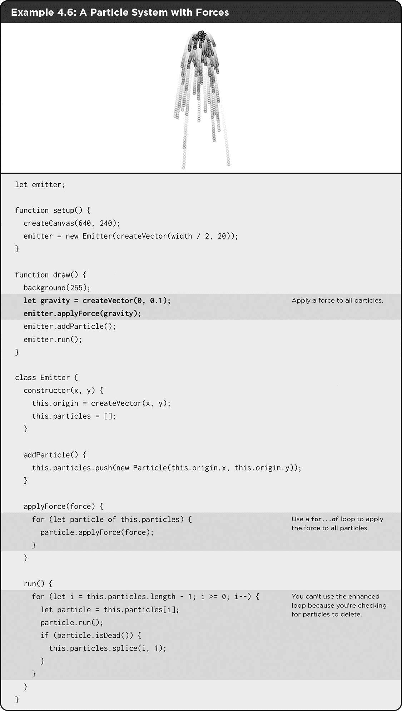

虽然这个例子展示了一个硬编码的重力力场，但值得考虑如何将前几章中的其他力（如风力或阻力）引入到粒子系统中。你还可以尝试不同的方式和时机来应用这些力。如果不是每一帧都持续作用于粒子，而是在特定条件下或者某些特定时刻才作用力会怎样呢？在粒子系统的设计中，这里还有很大的创意和互动空间！

### **带有排斥器的粒子系统**

如果我想进一步提升我的代码，加入一个`Repeller`对象——它是第二章中讲到的`Attractor`对象的反向——它将推开任何靠得太近的粒子，这该怎么做呢？这比简单地应用重力力场要复杂一些，因为排斥器对特定粒子施加的力是独特的，必须为每个粒子单独计算（见图 4.6）。

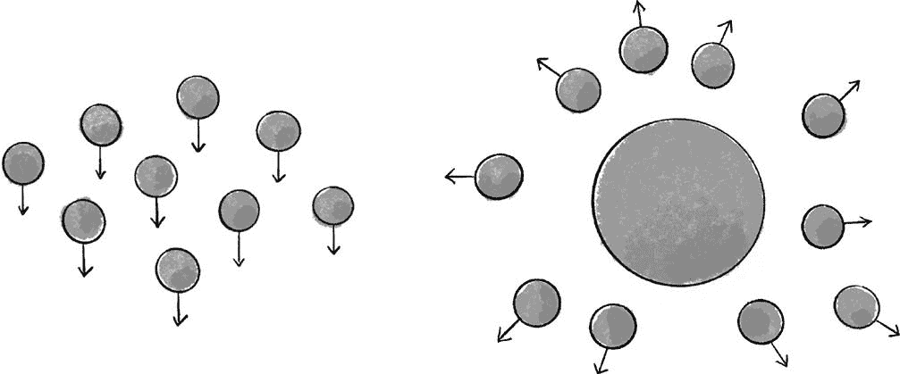

图 4.6：重力力场，其中所有向量相同（左），排斥力场，其中所有向量指向不同方向（右）

要在粒子系统草图中加入一个新的`Repeller`对象，我需要对代码进行两个主要的扩展：

+   一个`Repeller`对象（已声明、初始化并显示）

+   一个方法，用于将`Repeller`对象传递给粒子发射器，以便排斥器可以对每个粒子施加力

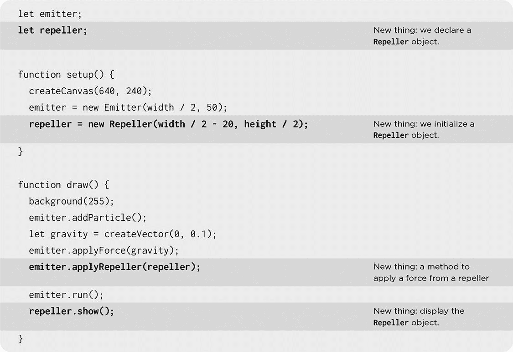

创建`Repeller`对象很简单；它是示例 2.6 中`Attractor`类的复制版。由于这一章不涉及`mass`概念，我将为`Repeller`类添加一个名为`power`的属性。这个属性可用于调整排斥力的强度：

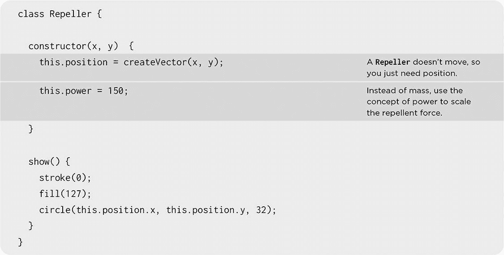

更困难的任务是编写`applyRepeller()`方法。与`applyForce()`不同，我不是将`p5.Vector`对象作为参数传递，而是需要将`Repeller`对象传递给`applyRepeller()`，并要求该方法计算排斥器与每个粒子之间的力。请看一下这两个方法的对比：

|

```
applyForce(force) {
  for (let particle of this.particles) {
    particle.applyForce(force);
  }
}
```

|

```
applyRepeller(repeller) {
  for (let particle of this.particles) {
    let force = repeller.repel(particle);
    particle.applyForce(force);
  }
}
```

|

这两个几乎相同的方法只有两个区别。我之前提到过其中一个：`applyRepeller()`的参数是一个`Repeller`对象，而不是`p5.Vector`对象。第二个区别是更重要的：我必须为每一个粒子计算一个自定义的`p5.Vector`力并施加这个力。这个力是如何计算的？在`Repeller`类的方法`repel()`中，它是通过取`Attractor`类的`attract()`方法的反向来计算的：

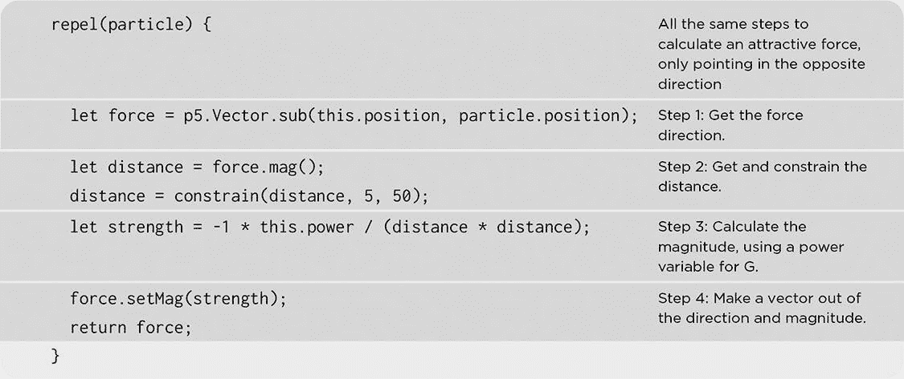

注意，在整个将排斥器添加到环境的过程中，我从未考虑编辑`Particle`类本身。粒子不需要了解其环境的任何细节；它只需管理其位置、速度和加速度，并能接收外部力并对其进行作用。

我现在准备将这个示例完整地写出，再次省略了`Particle`类，因为它没有变化。

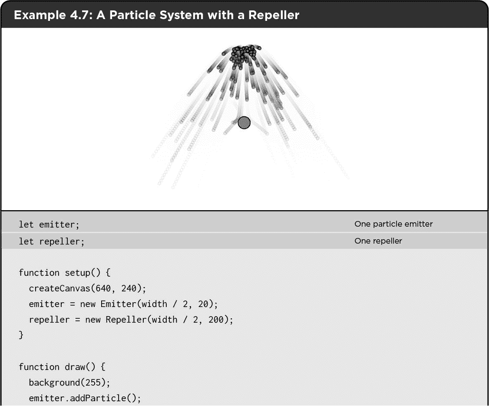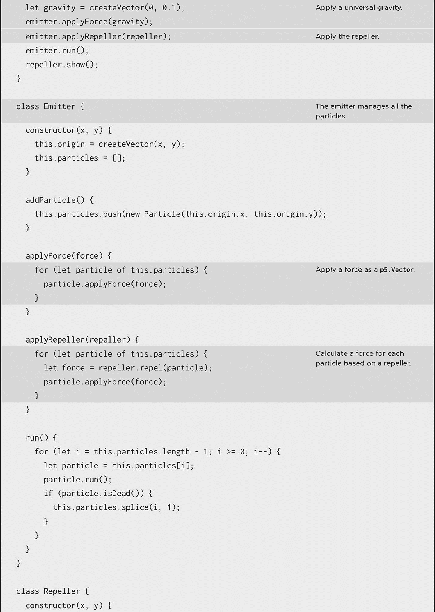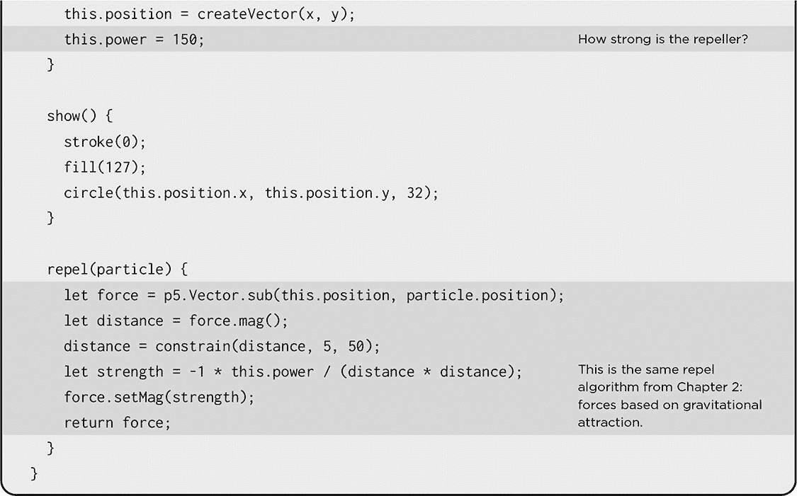

注意到在`Repeller`类中添加了`power`变量，它控制施加的排斥力的强度。当你有多个吸引器和排斥器，每个都有不同的力量值时，这个属性变得尤其有趣。例如，强吸引器和弱排斥器可能导致粒子聚集在吸引器周围，而更强的排斥器可能会展现出类似路径或通道的图案。这些都是第五章中将要探讨的复杂系统概念的暗示。

 **练习 4.9**

扩展示例 4.7，包括多个排斥器和吸引器。你如何使用继承和多态来创建独立的`Repeller`和`Attractor`类，而不重复代码？

 **练习 4.10**

创建一个粒子系统，使每个粒子都能响应其他每个粒子。（我将在第五章中详细解释如何实现这一点。）

### **图像纹理和加法混合**

尽管本书几乎专注于行为和算法，而非计算机图形学和设计，但如果我在讨论粒子系统时没有提供一个用图像为每个粒子贴图的示例，我觉得自己一定会不甘心。毕竟，渲染粒子的方式在设计某些类型的视觉效果时是一个关键因素。例如，比较图 4.7 中展示的两种烟雾模拟。

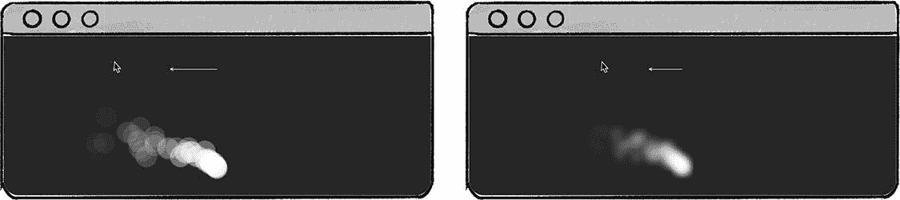

图 4.7：白色圆圈（左）和带有透明度的模糊图像（右）

这两张图像是通过相同的算法生成的。唯一的区别是，左图中的每个粒子都绘制为一个普通的白色圆圈，而右图中的每个粒子则绘制为一个模糊的斑点。图 4.8 展示了这两种粒子纹理。


图 4.8：两种图像纹理：全白圆圈（左）和向边缘渐隐的模糊圆圈（右）

使用图像为粒子贴图，在视觉效果的真实感上能以极少的成本获得很大的回报。然而，在编写任何代码之前，你必须先制作好你的图像纹理。我推荐使用 PNG 格式，因为 p5.js 会保留绘制图像时的 alpha 通道（透明度），这对于在粒子相互叠加时进行纹理混合是必需的。你可以通过多种方式制作这些纹理：你确实可以在 p5.js 中通过编程生成它们（我在本书网站上提供了一个示例），但你也可以使用其他开源或商业的图形编辑工具。

一旦你制作了一个 PNG 文件并将其放入草图的*data*文件夹中，你只需要几行额外的代码。

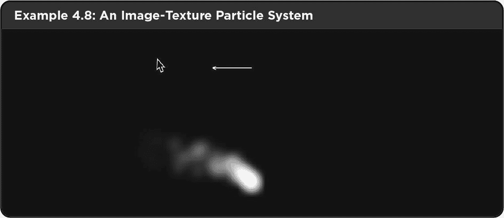

首先，声明一个变量来存储图像：

```
let img;
```

然后，在`preload()`中加载图像：

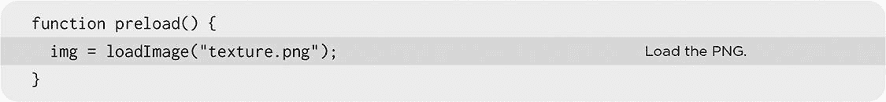

接下来，在绘制粒子时，使用`img`变量，而不是绘制圆圈或矩形：

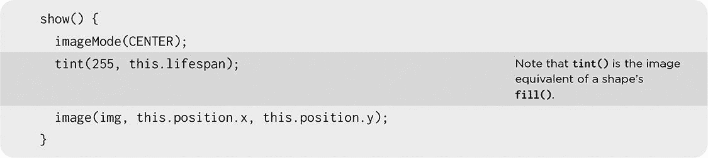

这个烟雾示例也是一个很好的借口，让我们重新审视一下《随机数的正态分布》中关于高斯分布的内容，见第 13 页。与直接将粒子发射到完全随机的方向（会产生类似喷泉的效果）不同，如果初始速度向量大多集中在一个均值附近，且远离该均值的速度出现概率较低，最终效果看起来更像烟雾。

使用`randomGaussian()`函数，可以如下初始化粒子速度：

```
    let vx = randomGaussian(0, 0.3);
    let vy = randomGaussian(-1, 0.3);
    this.velocity = createVector(vx, vy);
```

最后，在这个示例中，我对烟雾应用了一个风力，风力映射自鼠标的水平位置：

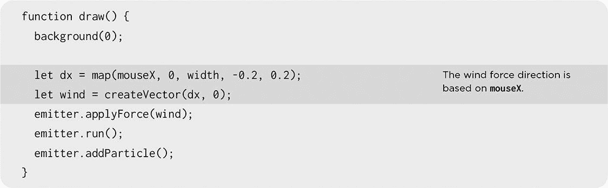

除了设计纹理之外，你还应考虑其分辨率。渲染大量高分辨率纹理可能会显著影响性能，尤其是当代码需要动态调整它们的大小时。为了获得最佳速度的理想情况，是将纹理的大小精确调整为你打算在画布上绘制粒子的分辨率。如果你希望粒子的大小不同，那么理想的做法是将纹理的大小设置为粒子最大尺寸的大小。

 **练习 4.11**

尝试为不同类型的效果创建其他纹理。你能让你的粒子系统看起来像火焰而不是烟雾吗？

 **练习 4.12**

使用一组图像，并为每个`Particle`对象分配不同的图像。多个粒子将绘制相同的图像，因此确保你不要重复调用`loadImage()`，每个图像文件调用一次就足够了！

最后，值得注意的是，许多算法可以用来在计算机图形中混合颜色，这些算法通常被称为**混合模式**。通常，当你在 p5.js 中绘制某物时，它会覆盖在另一个物体上，你只能看到最上面的一层——这是默认的“混合”行为，即根本不进行混合。同时，当像素具有透明度值（就像在烟雾示例中一样）时，p5.js 会自动使用一个 alpha 合成算法，将背景像素的一部分与前景像素的比例混合，这个比例由 alpha 值决定。

然而，也可以使用其他混合模式进行绘制。例如，粒子系统中非常受欢迎的一种技术是**加法混合**。这种模式由 Robert Hodgin 在他的经典粒子系统中首次提出，并在探索项目《Magnetosphere》(*[`roberthodgin.com/project/magnetosphere`](https://roberthodgin.com/project/magnetosphere)*)中得到了应用，该项目后来成为早期版本 iTunes 的可视化工具，展示了与声音响应的动态视觉效果。

加法混合是一种简单的混合算法，它将一个层的像素值加到另一个层中，所有值都限制在 255 以内。这样会产生一种未来感的光晕效果，随着更多层的叠加，颜色会变得越来越亮。

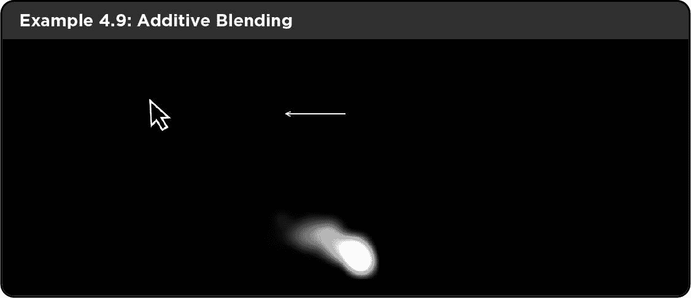

在开始绘制任何内容之前，使用`blendMode()`设置混合模式：

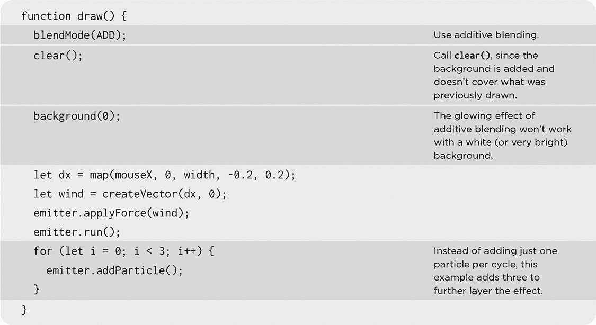

加法混合和粒子系统提供了一个讨论计算机图形渲染器的机会。**渲染器**是代码中负责在屏幕上绘制内容的部分。你一直在使用的 p5.js 库的默认渲染器，实际上是建立在现代网页浏览器中包含的标准 2D 绘图和动画渲染器之上的。然而，还有一个名为`WEBGL`的额外渲染选项可供选择。WebGL，即*Web 图形库*，是一种基于浏览器的高性能渲染器，支持 2D 和 3D 图形。它利用你计算机显卡的附加功能。要启用它，可以在`createCanvas()`中添加第三个参数：

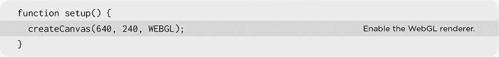

通常，只有在你在 p5.js 草图中绘制 3D 图形时，才需要 WebGL 渲染器。然而，即使是 2D 草图，在某些情况下 WebGL 渲染器也很有用—根据你电脑的硬件和草图的具体细节，它可以显著提高绘图性能。粒子系统（尤其是启用了加法混合的粒子系统）正是这种可以在`WEBGL`模式下绘制更多粒子而不会减慢草图的场景之一。请记住，`WEBGL`模式改变了绘图的原点，使得`(0,0)`成为画布的中心，而不是左上角。`WEBGL`模式还改变了某些函数的行为，可能会影响渲染质量。此外，一些旧设备或浏览器不支持 WebGL，尽管这种情况很少见。你可以在 Coding Train 网站上的 WebGL 视频中了解更多内容（*[`thecodingtrain.com/webgl`](https://thecodingtrain.com/webgl)*）。

 **练习 4.13**

在示例 4.9 中，每次通过`draw()`中的`for`循环添加三个粒子，从而创建更具层次感的效果。更好的解决方案是修改`addParticle()`方法，接受一个参数—例如，`addParticle(3)`，以确定要添加的粒子数量。请在此处填写新方法的定义。如果未提供值，如何使其默认为添加一个粒子呢？

```
  addParticle(amount = 1) {
    for (let i = 0; i < amount; i++) {         
      this.particles.push(new Particle(this.origin.x, this.origin.y));
    }
  }
```

 **练习 4.14**

使用` tint()`结合加法混合来创建彩虹效果。如果你尝试使用其他模式进行混合，例如`SUBTRACT`、`LIGHTEST`、`DARKEST`、`DIFFERENCE`、`EXCLUSION`或`MULTIPLY`，会发生什么？

 **生态系统项目**

从第三章中取出你的生物，并构建一个生物系统。它们是如何相互作用的？你能否使用继承和多态来创建从相同代码库派生的各种生物？制定一种方法来模拟它们如何竞争资源（例如，食物）。你能像追踪粒子生命周期一样追踪生物的健康状态，适时移除生物吗？你可以加入什么规则来控制生物如何进入系统？

此外，你可能会考虑在生物的设计中使用粒子系统。如果将发射器与生物的位置绑定，会发生什么情况？

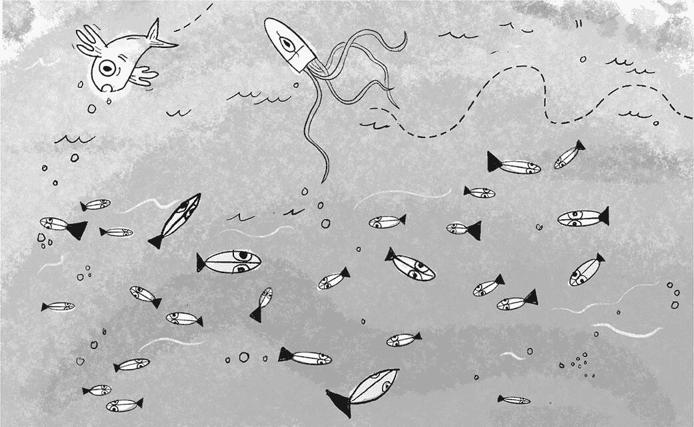
