## 第六章：**5 自主代理**

*生活是一场旅程，而非目的地。*

—拉尔夫·沃尔多·爱默生

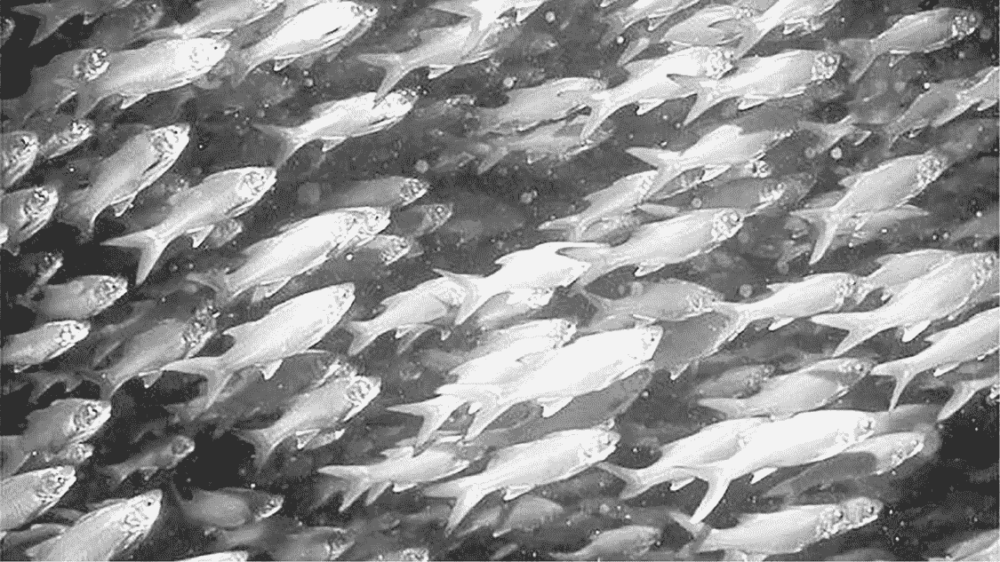

**莫伊鱼（图片由美国国家海洋和大气管理局提供）**

六指丝鳞鱼（*Polydactylus sexfilis*），也叫“王鱼”，或在夏威夷语中称为*mo’i*，它们在群体中游动。莫伊鱼在夏威夷王室中享有特殊地位，专门在养殖池中培育，以确保它们的种群增长并防止灭绝。这些鱼在集体运动中展示出精妙而协调的舞蹈，每条莫伊鱼都在微妙地影响并被邻近的鱼所影响。

到目前为止，我一直在展示没有生命的物体、静止的形状，它们在外界力量的作用下摇摆不定。但这就是*代码的**本质**。*如果我能为这些形状注入生命呢？如果这些形状能够按照自己的规则生存呢？形状能有希望、梦想和恐惧吗？这些问题是本章的主题。它们是将无意识的物体与更有趣的事物区分开来的关键：自主代理。

### **来自内部的力量**

**自主代理**是一个能够在其环境中做出自己行动决定的实体，而不受任何领导者或全球计划的影响。在本书中，*行动*通常指的是移动。例如，我不再模拟一个被重力等力吸引或排斥的粒子，而是希望设计一个具有能力——甚至是“愿望”——做出自己移动决策的实体。它可以*决定*朝着某个目标移动或远离目标，就像一只飞蛾被火焰吸引，或一条小鱼躲避捕食者一样。

从无生命物体到自主代理的转变是一个重要的概念飞跃，但代码本身几乎没有变化。自主代理想要移动的欲望只是另一种力，就像重力或风力一样。只不过现在这种力是*来自内部*的。

在我构建本章示例时，有三个自主代理的关键组成部分需要牢记：

+   **自主智能体对其环境的感知能力是有限的。** 生活和呼吸的生物应该能够意识到其环境的存在是合理的。然而，这种意识不仅仅指外部环境，还包括智能体的内部状态——如位置、速度，甚至可能包括其他属性或模拟的情感。在本章中，我将探讨智能体在做出决策时如何考虑自身状态。我还将介绍一些编程技术，使对象能够存储对其他对象的引用，从而“感知”其周围环境。这里的*有限*一词很重要。你是在设计一个全知的圆形对象，它可以在画布上飞行，意识到画布中的一切吗？还是你在创建一个只能观察到自己 15 像素范围内其他形状的形状？当然，这个问题没有唯一的正确答案；一切取决于你的需求。在本章中，我将探讨几种可能性，但总的来说，局限性有助于创建一个更“自然”的模拟。例如，一只昆虫可能只会感知到立即围绕它的景象和气味。要模拟一种真实的生物，你可以研究这些局限性的确切科学。幸运的是，我只需凭空想象并进行尝试。

+   **自主智能体处理来自环境的信息并计算出一个行动。** 这一部分相对简单，因为行动本身就是一种力。环境可能会告诉智能体，有一只巨大的、看起来很可怕的鲨鱼正向它游来，那么它的行动将是朝相反方向施加的强大力量。

+   **自主智能体没有领导者。** 这个第三条原则根据上下文，我可能不太关心。例如，如果你在设计一个系统，在这个系统中让领导者向各个实体发号施令是合适的，那么你就可以这样实现。然而，本章中的许多示例将没有领导者，这是有重要原因的：在本章的最后，我将研究群体行为，并探讨如何设计表现出**复杂系统**特性的自主智能体集合。这些是智能的、有结构的群体动态，它们并非来自领导者，而是来自元素之间局部互动的结果。

我可以从许多地方开始探索自主智能体。例如，人工模拟的蚂蚁和白蚁群体是智能体系统的极好示范。关于这个话题，我鼓励你阅读 Mitchel Resnick 的《*乌龟、白蚁与交通堵塞*》（Bradford Books，1997）。然而，我想从本书前四章的工作基础上出发，首先探讨建立在向量和力的运动建模上的智能体行为。因此，我将回到本书那本不断变化的英雄类——最初是`Walker`，然后是`Mover`，再到`Particle`——并赋予它全新的形式。

### **车辆与转向**

在 1980 年代末，计算机科学家 Craig Reynolds (*[`www.red3d.com/cwr`](https://www.red3d.com/cwr)*) 为动画角色开发了算法化的 **转向** 行为。这些行为允许个体元素以生动的方式在其数字环境中导航，拥有逃跑、徘徊、到达、追踪、躲避等策略。后来，在他 1999 年的论文《自主角色的转向行为》中，Reynolds 使用 *车辆* 一词来描述他的自主代理。我将效仿他，称我的自主代理类为 `Vehicle`：

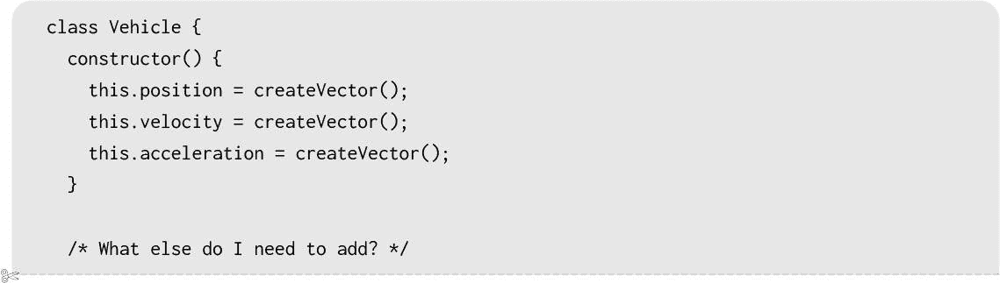

和之前的 `Mover` 类和 `Particle` 类一样，`Vehicle` 类的运动是通过其位置、速度和加速度向量来控制的。这将使单个自主代理的转向行为变得易于实现。然而，通过构建一个由多个车辆组成的系统，这些车辆根据简单的局部规则自行转向，会产生惊人的复杂性。最著名的例子是 Reynolds 的鸟群模型，它展示了群体或集群行为，我将在 示例 5.11 中展示。

 **为什么是车辆？**

在他的书《车辆：合成心理学实验》（Bradford Books，1986 年）中，意大利神经科学家和控制论学者 Valentino Braitenberg 描述了一系列假设的车辆，具有简单的内部结构，他写道：“这是一个虚构科学的练习，或者如果你更喜欢，可以称之为科幻小说。”Braitenberg 认为，他那些极其简单的机械车辆展现了诸如恐惧、攻击、爱情、预见和乐观等行为。Reynolds 从 Braitenberg 中汲取了灵感，而我将从 Reynolds 中获得我的灵感。

Reynolds 描述了 *理想化* 车辆的运动——理想化是因为他不关心它们的实际工程，而是从它们能够正常工作并响应所定义规则的假设出发。这些车辆有三个层次：

1.  **动作选择：** 一辆车有一个目标（或多个目标），并可以根据该目标选择一个动作（或多个动作的组合）。这本质上是我在讨论自主代理时的停顿点。车辆观察环境并基于一种欲望来*选择*一个动作：“我看到一个僵尸朝我走来。因为我不想让我的大脑被吃掉，我要从僵尸那里逃跑。”目标是保住自己的大脑，动作是逃跑。Reynolds 的论文描述了许多目标和相关的动作，比如寻找目标、避开障碍物和跟踪路径。稍后，我将用 p5.js 代码展开这些示例。

1.  **转向：** 一旦选择了一个动作，车辆就必须计算其下一步行动。下一步将是一个力——更具体地说，是一个转向力。幸运的是，Reynolds 提出了一个简单的转向力公式，我将在本章的例子中使用：**转向力 = 期望速度 - 当前速度**。我将在下一节详细讨论这个公式以及它为何如此有效。

1.  **运动方式：** 大多数情况下，我将忽略这一第三层。在逃避僵尸的情况下，运动方式可以描述为“左脚，右脚，左脚，右脚，尽可能快。”然而，在画布中，一个矩形、圆形或三角形在窗口中的实际运动并不重要，因为运动本身就是一种幻觉。但这并不是说你应该完全忽视运动方式。你会发现，思考你车辆的运动设计以及如何选择动画呈现它会非常有价值。本章中的示例将保持视觉上的简洁；一个不错的练习是展开动画风格。例如，你能为它添加旋转的轮子、摆动的桨板，或者是走动的腿吗？

最终，最重要的层次是你需要考虑的第一层，动作选择。你的系统元素是什么，它们的目标是什么？在本章中，我将涵盖一系列转向行为（即动作）：寻找目标、逃避、跟随路径、跟随流场、与邻居集群等等。然而，正如我在其他章节中所说，重点不是你在所有项目中都使用这些具体的行为。而是，重点是教你*如何*在代码中建模转向行为——*任何*转向行为——并为你设计和开发具有新目标和行为的车辆提供基础。

更重要的是，尽管本章中的示例非常直观（跟着那个像素走！），你应该允许自己更加抽象地思考（就像 Braitenberg 一样）。如果你的车辆的目标是“爱”或者其驱动力是“恐惧”，那会意味着什么呢？最后（我将在第 265 页的“结合行为”部分讨论这个问题），仅仅通过开发一个单一动作的模拟，你是走不远的。是的，第一个示例的动作将是寻找目标。但通过发挥创意——通过让这些转向行为*成为你自己的*——最终的关键是将多个动作结合在同一辆车中。将接下来的示例视为一个更大拼图中的一部分，而不是单一的行为模仿。

#### **转向力**

什么是转向力？为了回答这个问题，考虑以下情境：一辆具有当前速度的车辆正在寻找目标。为了趣味，我们可以把这辆车想象成一只像虫子一样的生物，想要品尝一颗美味的草莓，如图 5.1 所示。

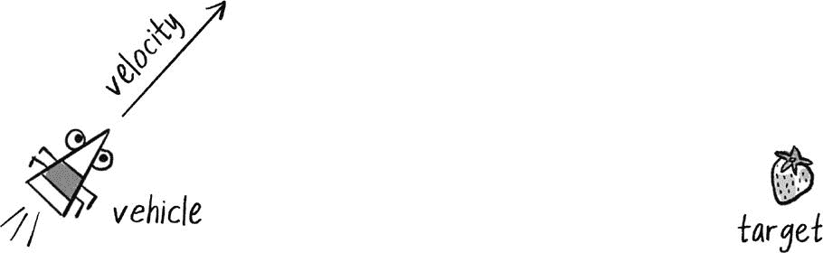

图 5.1：具有速度和目标的车辆

该车辆的目标和后续行动是寻找目标。回想一下第二章，你可能会从将目标设为吸引物并应用引力将车辆拉向目标开始。这是一个完全合理的解决方案，但从概念上讲，这并不是我在这里想要的。

我不想简单地计算一个推动车辆向目标移动的力；相反，我希望要求车辆根据它对自身状态（其速度和当前运动的方向）以及环境（目标的位置）的感知做出智能决策，朝向目标行驶。车辆应考虑它希望如何移动（指向目标的向量），将这个目标与当前的运动状态（其速度）进行比较，并相应地施加力。这正是 Reynolds 的转向力公式所表达的：

转向力 = 期望速度 − 当前速度

或者，你可以在 p5.js 中这样写：

```
let steer = p5.Vector.sub(desired, velocity);
```

*当前*速度并不是问题：`Vehicle`类已经有一个变量来表示这一点。然而，*期望*速度需要计算。看看图 5.2。如果车辆的目标定义为*寻找到目标*，那么它的期望速度就是一个从当前位置指向目标位置的向量。

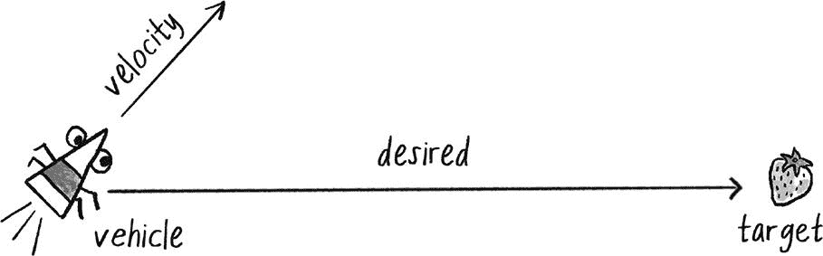

图 5.2：车辆期望的速度从其当前位置指向目标。（期望的向量应该从车辆的中心指向目标的中心，但为了说明简化了长度。）

假设有一个`p5.Vector`变量叫做`target`，定义了目标的位置，那么我就有了：

```
let desired = p5.Vector.sub(target, position);
```

然而，故事还有更多的内容。如果这是一个高分辨率的画布，而目标距离数千个像素远呢？当然，车辆可能希望以极大的速度瞬间传送到目标位置，但这不会产生有效的动画。我将愿望重新表述如下：

*车辆希望以最大可能的速度朝向目标移动*。

换句话说，`期望`向量应该从车辆的当前位置指向目标位置，大小等于车辆的最大速度，如图 5.3 所示。

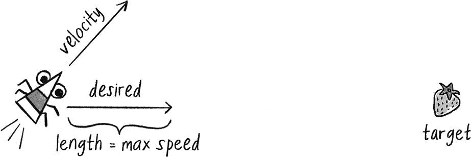

图 5.3：车辆期望速度的大小是*最大速度*。

最大速度的概念在第一章中被引入，用以确保移动者的速度保持在合理范围内。然而，在随后的章节中我并未始终使用这一概念。在第二章中，摩擦力和阻力等其他力量限制了速度，而在第三章中，相反的力量导致了振荡，从而保持了速度限制。在本章中，最大速度是控制转向代理行为的关键参数，因此我将在所有示例中包含它。

虽然我鼓励你思考如何将摩擦力和阻力等其他力与转向行为结合起来，但目前我将只关注转向力。因此，我可以将最大速度的概念作为力计算中的限制因素。首先，我需要在`Vehicle`类中添加一个属性，设置最大速度：

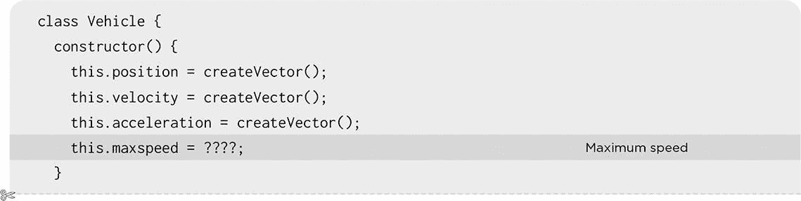

然后，在期望速度的计算中，我将根据最大速度进行缩放：

```
let desired = p5.Vector.sub(target, this.position);
desired.setMag(this.maxspeed);
```

综合这些内容，我现在可以编写一个名为`seek()`的方法，该方法接收一个`p5.Vector`目标并计算指向该目标的转向力：

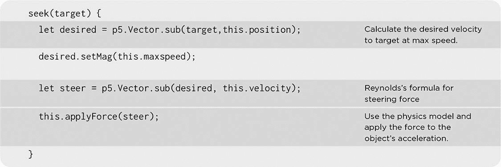

请注意，我在方法结束时将转向力传递给`applyForce()`。这假设代码是建立在我在第二章中开发的基础之上的。

要了解为什么 Reynolds 的转向公式如此有效，看看图 5.4。它展示了转向力相对于车辆和目标位置的表现。

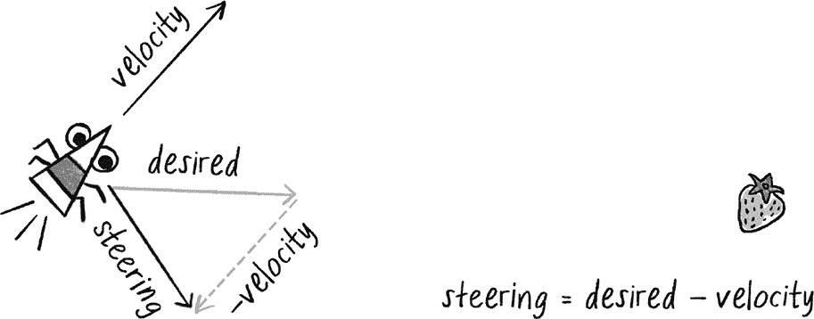

图 5.4：车辆施加的转向力等于期望速度减去当前速度。

这种力与引力的吸引力看起来有很大的不同。记住自主代理的一个原则：自主代理有*有限*的感知环境的能力，包括对自身状态的感知。这个能力被巧妙而有力地嵌入到 Reynolds 的转向公式中。在引力吸引的情况下，吸引物体的力是相同的，无论物体如何运动。但在这里，车辆是主动感知自己速度的，并且其转向力会做出相应的补偿。这为模拟增加了一种逼真的质量，因为车辆向目标移动的方式依赖于它对当前运动状态的理解。

在这一切兴奋之中，我错过了最后一步。这个车辆是什么类型的？是拥有惊人操控性能的超级跑车吗？还是需要大量预警才能转弯的大型城市公交车？是一只优雅的熊猫，还是一只笨拙的大象？目前的示例代码并没有考虑到这一转向能力的差异。为此，我需要限制转向力的大小。我将这个限制称为最大转向力（或简称`maxforce`）：

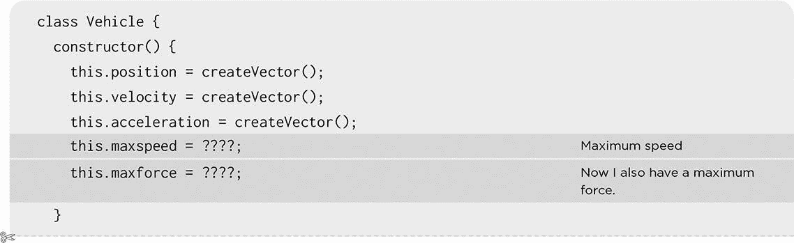

现在，我只需要在施加转向力之前设定这个限制：

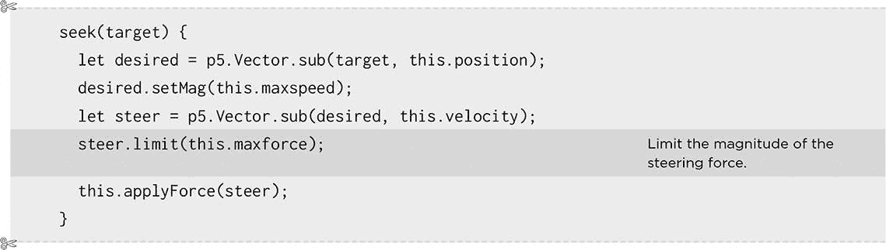

限制转向力提出了一个重要的观点：目标不是尽可能快地将车辆送到目标位置。如果是这样，我只需要说，“将位置设置为目标”，车辆就会立刻传送到那个位置！相反，正如雷诺兹所说，目标是让车辆以一种“逼真且即兴的方式”移动。

我试图让车辆看起来像是在朝目标方向转向，所以我需要调整系统中的力和变量来模拟给定的行为。例如，较大的最大转向力会导致与较小转向力截然不同的路径（见图 5.5）。这两者并没有哪一个天生更好或更差；它取决于所需的效果。（当然，这些值不必是固定的，可以根据其他条件变化。也许车辆有一个*能量*属性：能量越高，转向性能越好。）

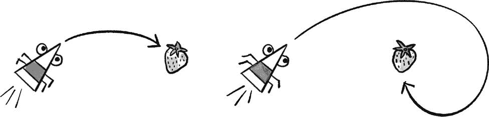

图 5.5：更强的最大力（左）与较弱的最大力（右）路径对比

这是完整的`Vehicle`类，包含了来自第二章 `Mover`类的其余部分。

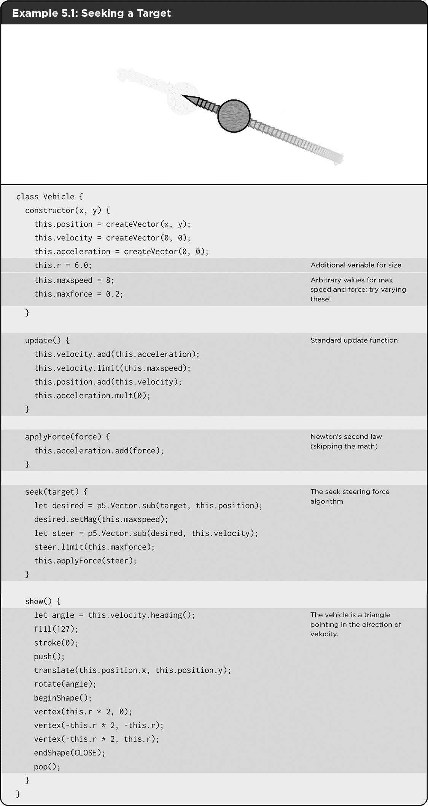

请注意，与之前章节中用来表示移动器和粒子的圆形不同，`Vehicle`对象被绘制为一个三角形，定义为使用`beginShape()`和`endShape()`设置的三个自定义顶点。这允许车辆以一种能够表示其方向的方式呈现，方向是通过`heading()`方法确定的，正如在第三章中展示的那样。

 **练习 5.1**

实现一个*逃避*转向行为（期望的速度与*寻求*相同，但指向相反的方向）。

 **练习 5.2**

创建一个草图，在其中，车辆的最大力和最大速度不是保持不变的，而是根据环境因素发生变化。

 **练习 5.3**

实现一个带有移动目标的追寻行为，通常称为*追逐*。在这种情况下，你的目标向量不会指向物体的当前位置，而是指向从其当前速度推算出的未来位置。你将在后续的示例中看到车辆如何“预测未来”。解决方案在《追逐与逃避》视频中有介绍，视频链接为(*[`thecodingtrain.com/pursuit`](https://thecodingtrain.com/pursuit)*).


#### **到达行为**

在使用寻路行为工作了一段时间后，你可能会问自己：“如果我希望车辆在接近目标时减速呢？”在我开始回答这个问题之前，我应该先解释为什么寻路行为会导致车辆飞越目标，迫使它转身回去。考虑一下寻路车辆的大脑。在每一帧动画中，它在想什么？

+   我想尽可能快地朝目标前进。

+   我想尽可能快地朝目标前进。

+   我想尽可能快地朝目标前进。

+   我想尽可能快地朝目标前进。

+   我想尽可能快地朝目标前进。

+   依此类推……

这辆车对到达目标感到非常兴奋，以至于它不去做任何关于速度的智能决策。不管离目标多远，它总是想尽可能快地行驶。当车辆非常接近目标时，它最终会超越目标（见图 5.6，顶部）。

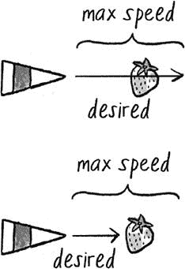

图 5.6：上方的车辆目标速度设为最大速度，并且会超越目标。下方的车辆示范了根据与目标的距离来缩放目标速度。（虽然我鼓励你继续将车辆想象成一只可爱的虫子，但从这一点开始，它被画成三角形，以简化问题。）

在某些情况下，这是期望的行为。（想想小狗去追它最喜欢的玩具：无论离玩具多近，它都不会减速！）然而，在许多其他情况下（如汽车驶入停车位、蜜蜂停在花上），车辆的思维过程需要考虑与目标之间的距离相对的速度（见图 5.6，底部）。例如：

+   我离得很远。我想尽可能快地朝目标前进。

+   我离目标还有一段距离。我仍然希望尽可能快地朝目标前进。

+   我快接近了。我想更慢地朝目标前进。

+   我快到了。我想很慢地朝目标前进。

+   我到了。我想停下来！

如何在代码中实现这种*到达*行为？回想一下`seek()`方法。代码中的哪部分设置了目标速度的大小？

```
   let desired = p5.Vector.sub(target, this.position);
   desired.setMag(this.maxspeed);
```

这总是将`desired`向量的大小设置为`maxspeed`，如图 5.7 所示。

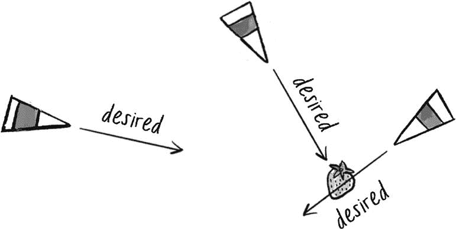

图 5.7：车辆的目标速度的大小设置为最大速度，无论它们与目标的相对距离如何。

如果相反，目标速度的大小等于距离的一半呢？

```
   let desired = p5.Vector.sub(target, this.position);
   desired.mult(0.5);
```

我仍然希望将`desired`的大小限制在最大速度之内，以防止那些远距离的车辆行驶得过快（见图 5.8）。

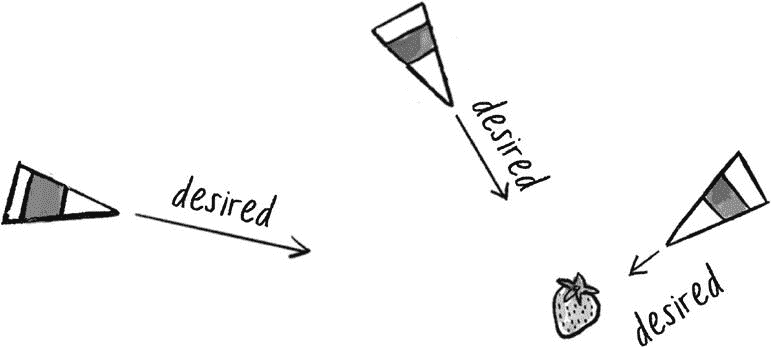

图 5.8：每个车辆的期望速度大小等于到目标的距离的一半。在最左侧的车辆的情况下，速度被限制为最大速度。

尽管这一变化很好地展示了将期望速度与目标距离相联系的目标，但它并不是一个特别好的解决方案。毕竟，10 像素的距离已经相当近，而期望速度为 5 则显得太大。像期望速度的大小等于距离的 5% 这样的方式可能效果更好：

```
  let desired = p5.Vector.sub(target, this.position);
  desired.mult(0.05);
```

Reynolds 描述了一种更为复杂的方法。设想在目标周围画一个半径为 *r* 的圆。如果车辆在该圆内，它会逐渐减速——从圆的最边缘的最大速度到目标处的零速度（图 5.9）。

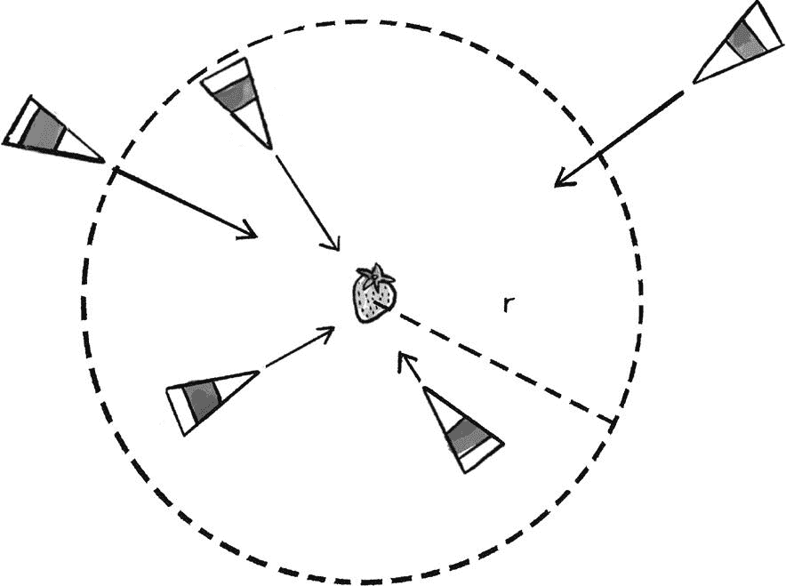

图 5.9：在圆外，车辆的期望速度大小设置为最大速度。随着车辆进入圆内并接近目标，其期望速度的大小逐渐减小。

换句话说，如果目标的距离小于*r*，期望速度的范围从 0 到根据该距离映射的最大速度。

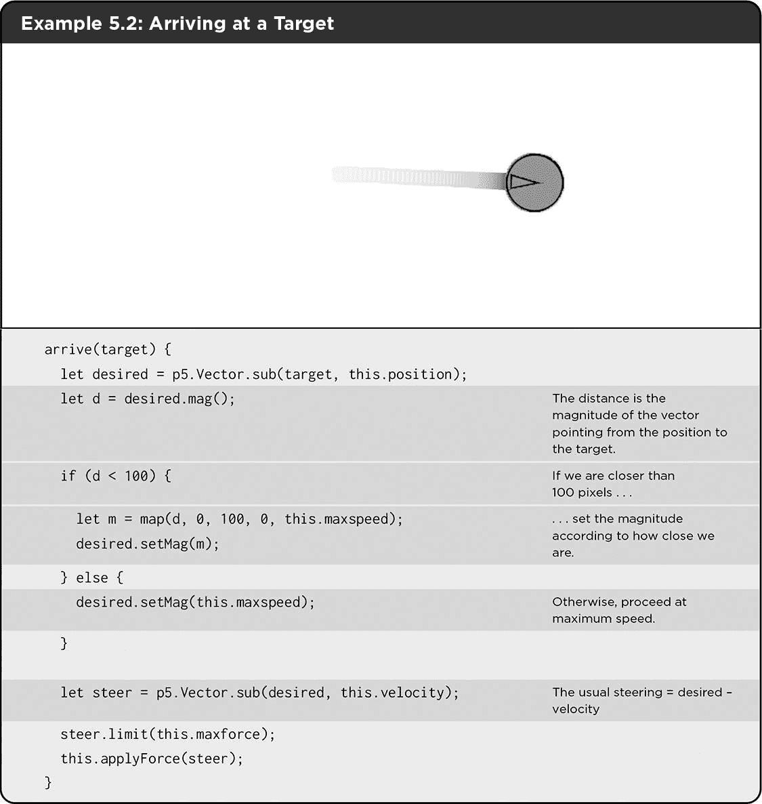

到达行为是一个很好的示范，展示了自主体对环境的感知——包括自身的状态。这个模型不同于第二章中的无生命力：一个天体被另一个天体吸引时并不知道自己正在经历引力，而一只猎豹追逐它的猎物时则知道自己正在追赶。

关键在于力的计算方式。例如，在引力吸引示意图中（示例 2.6），力总是直接从物体指向目标——也就是期望速度的确切方向。与此相反，这里车辆感知到与目标的距离，并根据该距离调整期望速度，随着接近目标而减速。因此，车辆所受的力不仅基于期望速度，还基于*相对于当前速度的期望速度*。车辆在评估环境时考虑到自身的状态。

换句话说，Reynolds 的 *期望速度减去当前速度* 方程的神奇之处在于，它本质上将转向力表现为当前速度的*误差*：“我应该朝这个方向以这个速度前进，但实际上我在朝另一个方向以这个速度前进。我的误差就是我想去的地方和我目前去的地方之间的差距。”有时这会导致看似意外的结果，如图 5.10 所示。

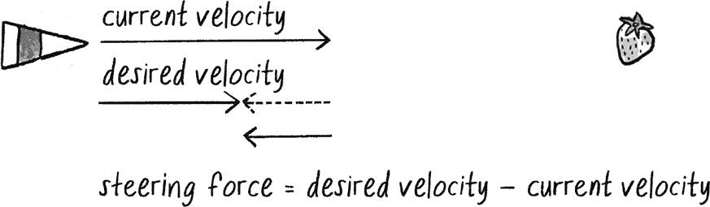

图 5.10：一个朝目标移动的车辆，如果速度快于其期望速度，将导致一个指向远离目标的转向力。

在这个“到达”行为的示例中，车辆朝目标移动的速度过快。转向力或误差告诉车辆通过实际上朝相反方向（远离目标）来减速。相比之下，利用引力吸引时，无论目标多么接近，力都不会指向远离目标的方向。通过将误差应用为转向力，结果是更加动态、逼真的模拟。

#### **你自己的行为**

我所讨论的前两个示例——“寻路”和“到达”——归结为为每个行为计算一个单一的矢量：*期望*速度。事实上，雷诺兹的每一个转向行为都遵循相同的模式。在本章中，我将介绍更多雷诺兹的行为——流场跟随、路径跟随和集群行为。然而，首先，我想再次强调，这些是*示例*——展示了常见的转向行为，这些行为在程序化动画中非常有用。它们并不是你能做的事情的全部。只要你能够提出一个描述车辆*期望*速度的矢量，你就创造了自己的转向行为。

例如，看看雷诺兹是如何定义游荡行为的期望速度的：

*游荡是一种具有一定长期规律的随机转向：一帧中的转向方向与下一帧中的转向方向相关。这比例如每帧都生成一个随机转向方向更能产生有趣的运动。*

对雷诺兹来说，游荡的目标不是随机运动，而是希望车辆先朝一个方向移动一段时间，然后再朝下一个方向游荡一段时间，如此循环。图 5.11 展示了雷诺兹如何计算一个目标来实现这种效果。

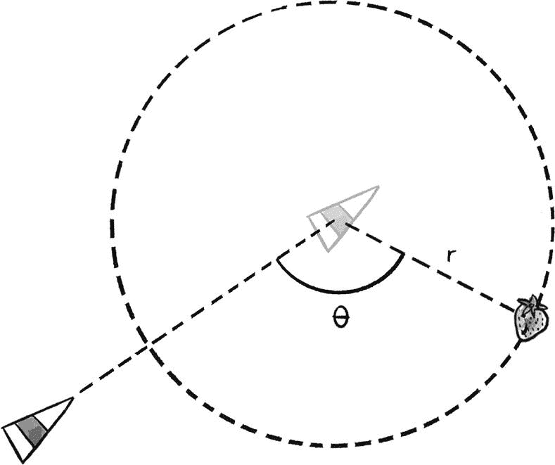

图 5.11：游荡转向行为被计算为寻求一个目标，该目标在车辆前方的圆形周围随机移动。

首先，车辆预测其未来位置，距离其当前速度方向固定的距离。然后，它在该位置画一个半径为 *r* 的圆，并从圆的周长上随机选择一个点。这个点会在每一帧动画中沿着圆周随机移动，它就是车辆的目标，因此它的期望速度指向那个方向。

听起来荒谬，对吧？或者至少有些任意。事实上，这是一种巧妙且深思熟虑的解决方案——它利用随机性来驱动车辆的转向，但将这种随机性限制在一个圆形路径上，以防止车辆的运动看起来颤抖或完全随机。

这个看似随机和任意的解决方案应该强调我想表达的观点：这些是*虚构*的行为，尽管它们受现实世界运动的启发。你完全可以编造另一个复杂的场景来计算期望速度。而且你应该这样做！

 **练习 5.4**

编写 Reynolds 的漫游行为代码。使用极坐标来计算车辆沿圆形路径的目标。

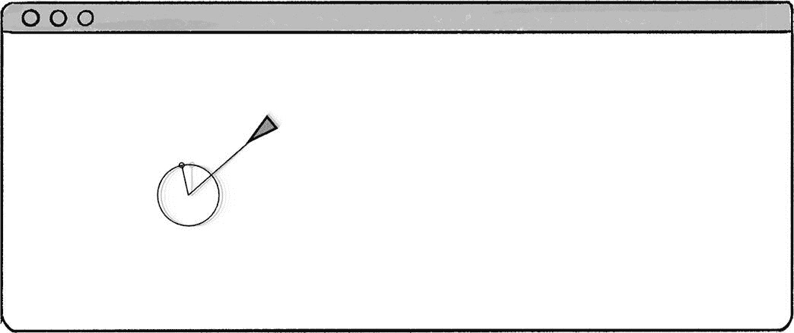

另一个例子是，假设我想创建一个叫做*保持在墙内*的转向行为。为了定义期望的速度，我将制定一个规则：如果车辆接近墙壁的距离为*d*，那么该车辆希望以最大速度朝向墙壁的反方向移动（参见图 5.12）。


图 5.12：如果车辆靠得太近，期望的速度会远离墙壁。

如果我将空间的墙壁定义为画布的边缘，并且将`offset`距离设置为 25，我可以通过一系列的`if`语句编写这段代码。

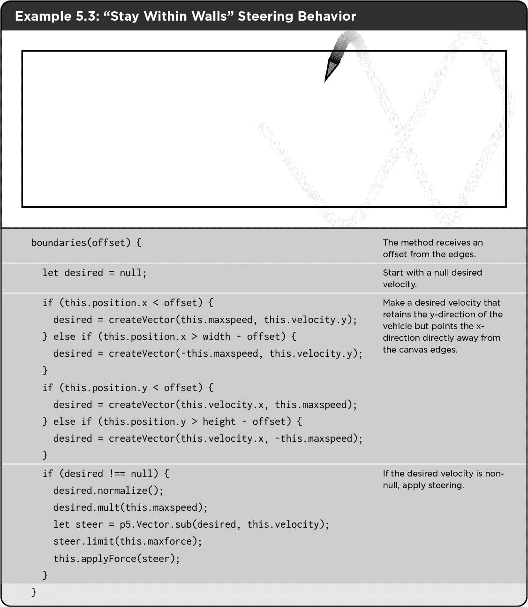

在这个`boundaries()`方法中，你可能会想知道为什么我一开始将`desired`速度设置为`null`。为什么不直接将`desired`设置为一个零向量呢？记住，转向力等于期望速度减去当前速度！如果车辆希望以 0 速度移动，产生的力将使车辆减速至停止。通过将`desired`初始化为`null`，并在应用转向力之前检查它是否为非`null`，车辆在远离画布边缘时就不会受到任何影响。

 **练习 5.5**

想出你自己任意的方案来计算期望的速度。

### **流场**

Reynolds 的另一个转向行为是**流场跟随**。但什么是流场呢？将画布看作是一个网格（图 5.13）。在网格的每个单元格里，都有一个指向某个方向的箭头——你知道，就是一个向量。当车辆在画布上移动时，它会问：“嘿，下面的箭头是什么？那就是我期望的速度！”

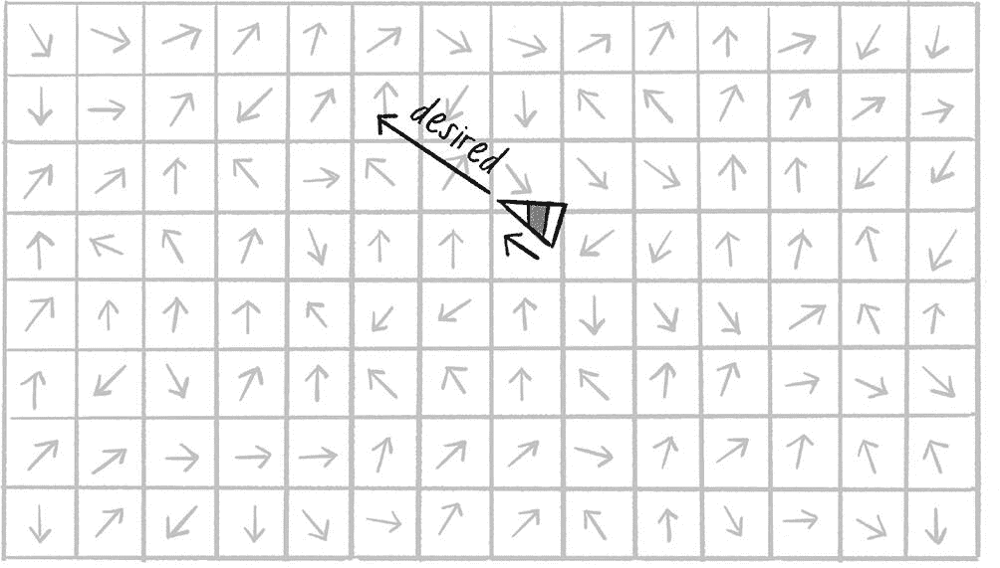

图 5.13：一个充满指向随机方向的单位向量的二维网格

Reynolds 的流场示例中，车辆会查看其未来位置并跟随该位置的向量。然而，为了简单起见，我将让车辆跟随当前所在位置的向量。

在我编写`Vehicle`类的附加代码，使其跟随流场之前，我首先需要一个描述流场的类。由于流场本质上是一个向量网格，2D 数组是一个方便的数据结构，可以用来表示流场，因为我可以通过两个索引来引用每个元素，即网格中单元格的列和行。如果你不熟悉 2D 数组，建议你查看我关于“JavaScript 中的 2D 数组”的视频教程（*[`thecodingtrain.com/2d-array`](https://thecodingtrain.com/2d-array)*）。

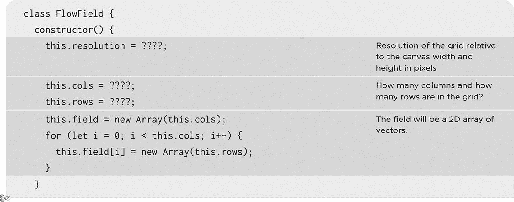

我应该如何填充缺失的值呢？假设我有一个宽度为 200 像素，高度为 200 像素的画布。理论上，我可以创建一个流场，每个像素都有一个向量，也就是说，总共有 40,000 个向量（200 × 200）。这个数字并不是特别不合理，但在这个上下文中，每个像素一个向量有些过头了。我完全可以通过每隔 10 个像素设置一个向量来解决问题（20 × 20 = 400）。我的`resolution`变量设置了每个单元格的像素大小。然后，我可以根据画布的大小除以分辨率来计算列和行的数量：

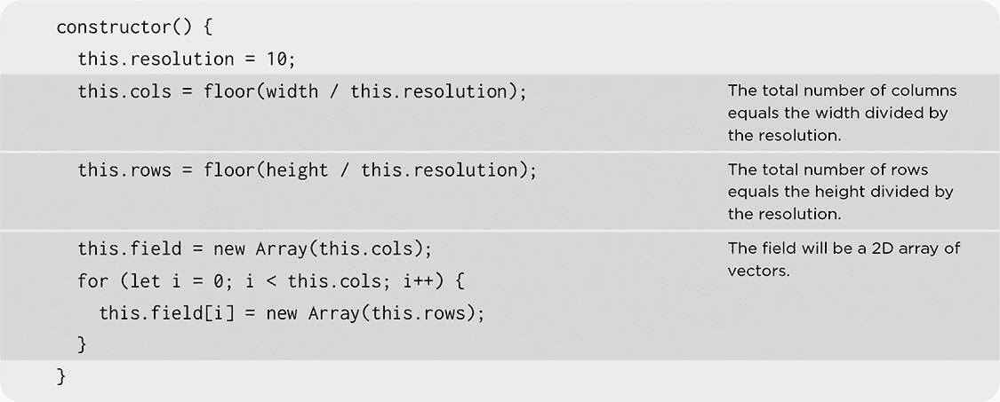

现在，我已经为流场设置了数据结构，是时候计算流场的向量了。我该怎么做呢？随我怎么想吧！也许我希望流场中的每个向量都指向右侧（图 5.14）。

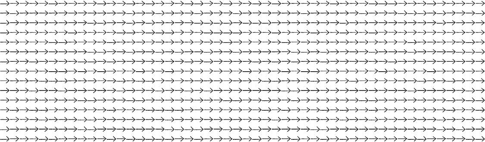

图 5.14：一个所有向量指向右侧的流场

对此，我可以直接将每个向量设置为`(1, 0)`。

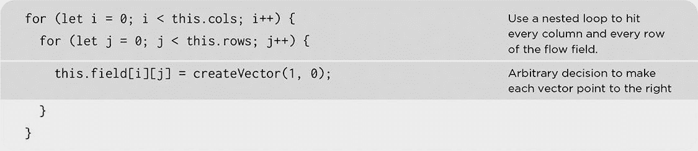

也许我更喜欢让向量朝随机方向指向（图 5.15）。

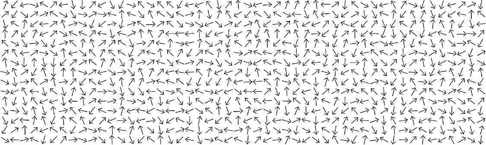

图 5.15：一个向量指向随机方向的流场

很简单。只需使用`p5.Vector`类的`random2D()`方法为每个向量分配值：

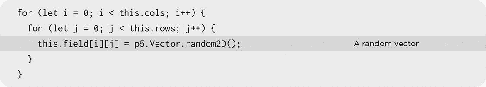

使用 2D Perlin 噪声怎么样呢？（图 5.16）

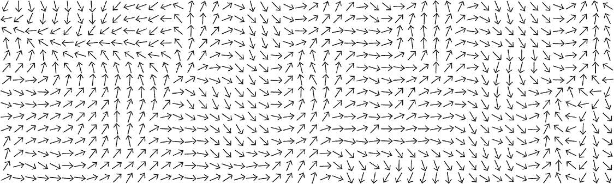

图 5.16：一个使用 Perlin 噪声计算的流场

只需将每个噪声值映射到从 0 到 2π的角度，然后根据该角度创建一个向量：

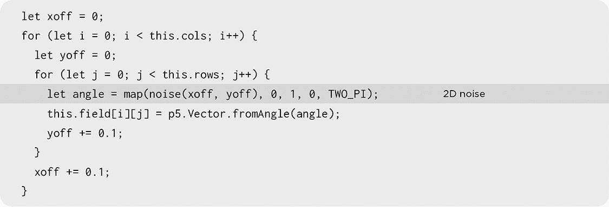

现在我有了一些进展。通过使用 Perlin 噪声计算向量的方向是一种很好的方法来模拟各种自然效果，比如不规则的阵风或河流的蜿蜒路径。然而，我要指出的是，这种噪声映射生成了一个偏好向左流动的场。由于 Perlin 噪声具有类似高斯分布的特性，靠近π的角度更容易被选择。对于图 5.16，我使用了 0 到 4π的范围来抵消这种倾向，类似于我在第四章中应用 4π来表示旋转纸屑粒子的角度范围。当然，最终并没有一种计算流场向量的正确方法；这取决于你希望模拟的内容。

 **练习 5.6**

编写代码以计算流场，使得向量围绕画布中心旋转。

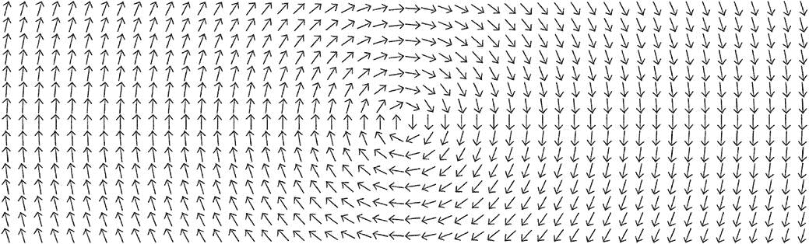

```
let x = i * width / cols;
let y = j * height / rows;
flowfield[i][j] = createVector(width / 2 - x, height / 2 - y);
flowfield[i][j].rotate(PI / 2);
```

现在我有一个存储流场向量的二维数组，我需要一种方法让车辆查找它所需的速度。为此，我简单地将车辆的 x 和 y 坐标除以网格的分辨率。这将给我二维数组中所需向量的索引。例如，如果分辨率为 10，车辆位于(100, 50)位置，我想查找第 10 列和第 5 行：

```
let column = floor(this.position.x / this.resolution);
let row = floor(this.position.y / this.resolution);
```

因为车辆理论上可能会偏离 p5.js 画布，使用`constrain()`函数有助于确保我不会在流场数组的边界之外查找。下面是一个名为`lookup()`的方法，我将把它添加到`FlowField`类中，该方法接收一个向量（车辆的位置）并返回该位置对应的流场向量：

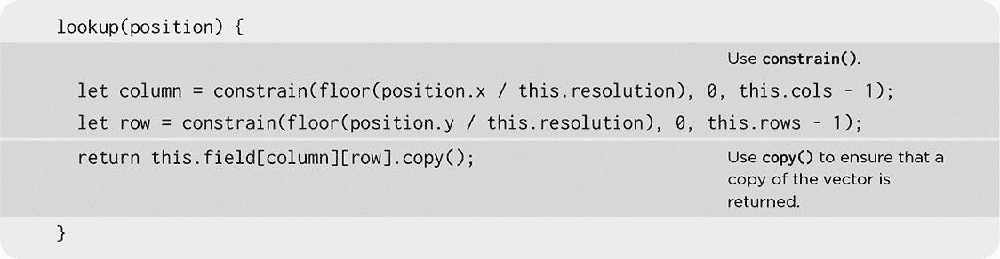

在继续讨论`Vehicle`类之前，让我们将`FlowField`类的代码全部放在一起，这次使用 Perlin 噪声来计算向量的方向：

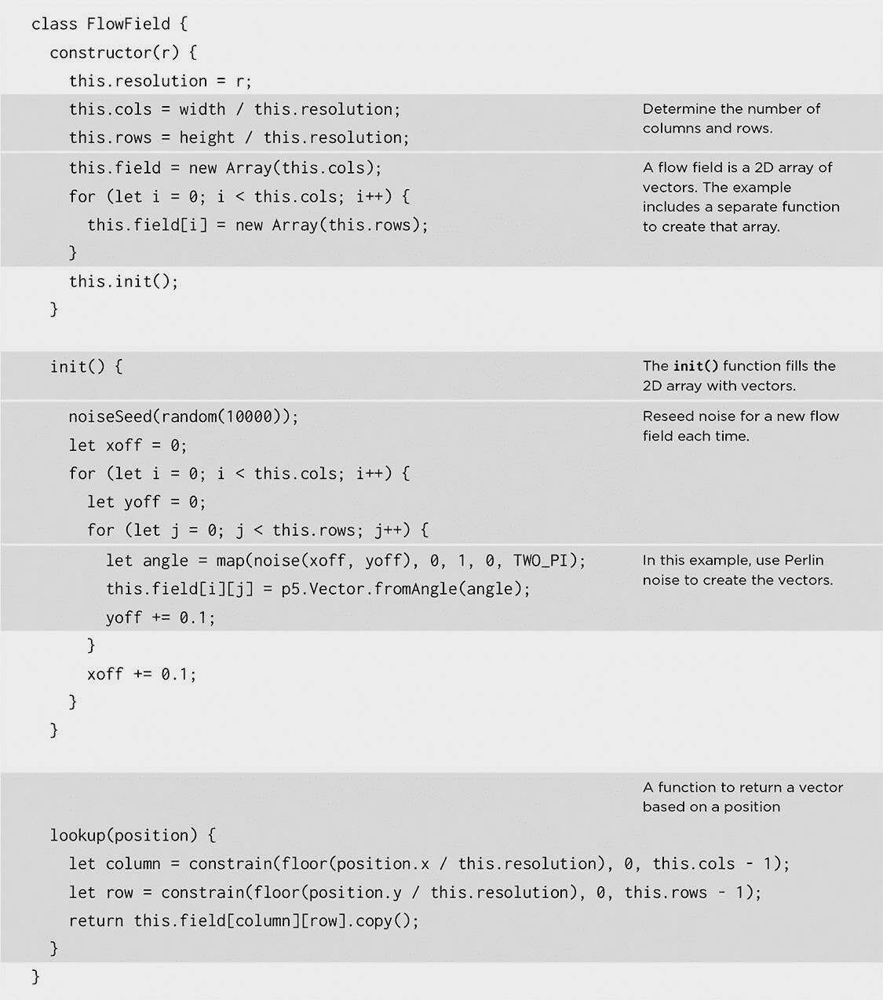

现在假设有一个名为`flow`的`FlowField`对象。通过该对象的`lookup()`方法，车辆可以从流场中检索所需的速度，并使用雷诺兹的转向公式计算一个力。

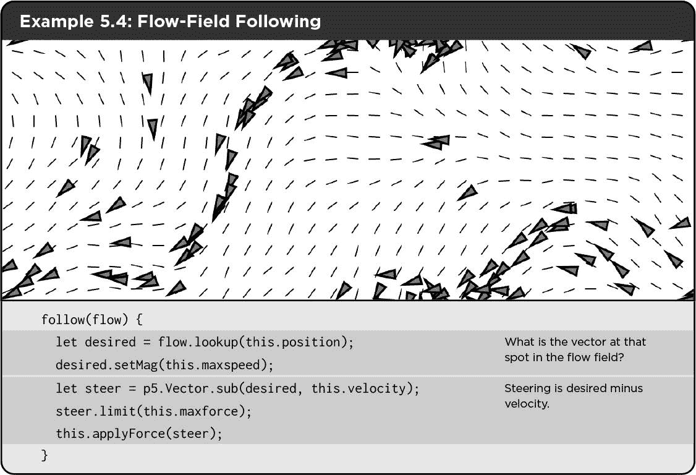

请注意，`lookup()`是`FlowField`类的方法，而不是`Vehicle`类的方法。虽然你完全可以将`lookup()`放到`Vehicle`类中，但从我的角度来看，将它放在`FlowField`中最符合面向对象编程的封装原则。查找任务是基于流场中的位置检索向量的，它本质上与`FlowField`对象的数据密切相关。

你也许会注意到一些来自第四章的熟悉元素，比如使用车辆数组。尽管这里的车辆独立运行，但这是朝着思考群体行为迈出的重要第一步，这些群体行为我将在本章稍后介绍。

 **练习 5.7**

修改流场示例，使向量随时间变化。（提示：试着使用 Perlin 噪声的第三维！）

 **练习 5.8**

你能从一张图像中创建一个流场吗？例如，试着让向量从暗色到亮色（或反之）指向。

### **路径跟随**

接下来我想探讨的 Reynolds 提出的另一个引导行为是路径跟随。但让我先澄清一件事：这里的行为是路径 *跟随*，而不是路径 *寻找*。路径寻找指的是一种算法，用于解决两点之间最短距离的问题，通常在迷宫中使用。而 **路径跟随**，则是指预定义的路线或路径已经存在，车辆只需要尝试跟随它。

在这一部分，我将讲解算法，包括相关的数学和代码。然而，在此之前，重要的是要介绍一个我在第一章中跳过的向量数学关键概念：**点积**。到目前为止我还没有用到它，但在这里它是必要的，并且很可能不仅在这个示例中对你非常有用。

#### **点积**

还记得第一章中讲过的所有向量数学吗？加法、减法、乘法和除法？图 5.17 回顾了其中的一些操作。

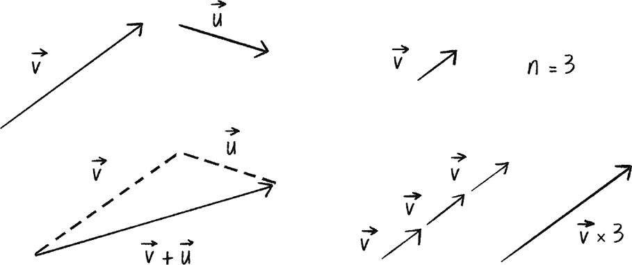

图 5.17：向量相加和将向量与标量相乘

注意，乘法涉及将向量与标量值相乘。这是有道理的；当你想让一个向量变成原来两倍大（但方向不变）时，将它乘以 2；当你想让它变为原来的一半大小时，将它乘以 0.5。然而，还有一些其他类似乘法的操作，涉及一对向量，在某些情况下非常有用——点积、叉积和一种叫做 Hadamard 乘积的运算。目前，我将专注于点积。

假设有向量 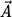 和 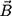：

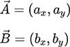

点积的公式（用 · 符号表示）如下：


至关重要的是，点积的结果是一个标量值（一个单一的数字），而不是一个向量，即使输入的是两个向量。例如，假设你有这两个向量：

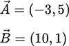

它们的点积如图所示：

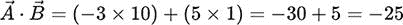

在 p5.js 中，这转换为以下内容：

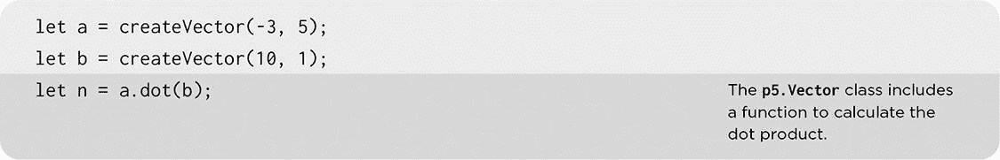

如果你查看 `p5.Vector` 源代码的核心部分，你会发现一个相当简单的 `dot()` 方法实现：

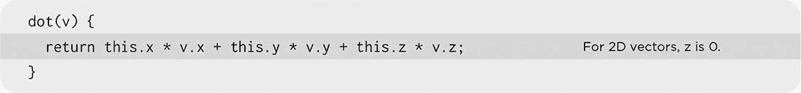

这个公式足够简单，但点积为什么是必要的，什么时候在编码中有用呢？好吧，点积的一个常见用途是找出两个向量之间的角度。事实上，点积也可以表达为如下形式：

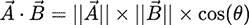

换句话说，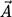和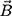的点积等于的大小乘以的大小，再乘以 theta 的余弦值（其中 theta 是两个向量和之间的角度）。

这两个点积公式可以通过三角学（*[`mathworld.wolfram.com/DotProduct.html`](https://mathworld.wolfram.com/DotProduct.html)*）相互推导出来，但我很高兴不走这条路，而是基于以下假设进行操作：

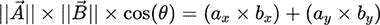

这样是可行的，因为方程的两边都等于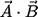。这个假设对我有什么帮助呢？假设我有两个向量和：

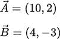

在这种情况下，我知道向量的分量，但不知道它们之间的角度*θ*（见图 5.18）。使用点积公式，我可以解出*θ*的余弦值：

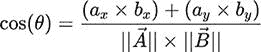

图 5.18：两个向量和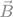之间的角度

为了解出*θ*，我可以对方程右侧取反余弦，或者说反余弦（p5.js 中的`acos`）：

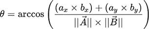

现在我用实际的数字来做一下数学计算：

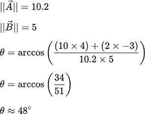

这是 p5.js 的版本：

```
let a = createVector(10, 2);
let b = createVector(4, -3);
let angle = acos(a.dot(b) / (a.mag() * b.mag()));
```

结果证明，如果你再次深入查看 p5.js 的源代码，你会找到一个叫做`angleBetween`的方法，它实现了这个精确的算法。

```
 angleBetween(v) {
    let dot = this.dot(v);
    let angle = Math.acos(dot / (this.mag() * v.mag()));
    return angle;
  }
```

当然，我本可以一开始就告诉你这个`angleBetween()`方法，但详细理解点积会更好地为你接下来的路径跟踪示例做准备，并帮助你理解点积如何融入一个叫做*标量投影*的概念中。

 **练习 5.9**

创建一个草图，展示两个向量之间的角度。

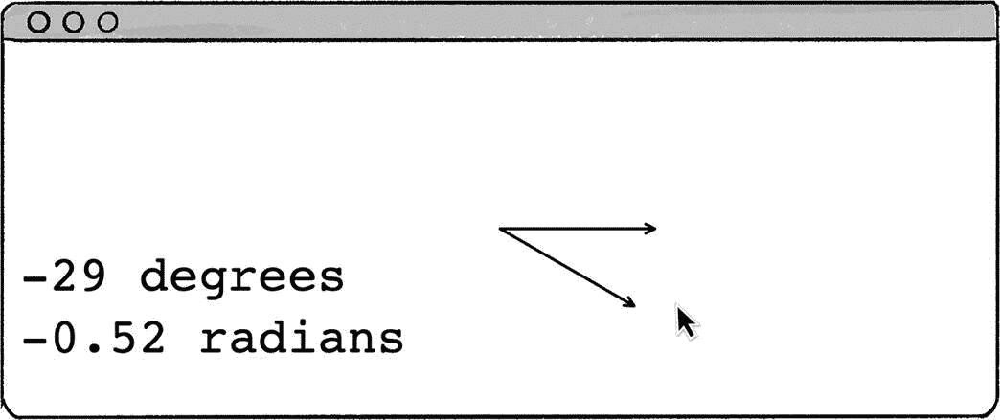

关于点积有几点需要注意：

+   如果两个向量（和）是正交的（即垂直的），它们的点积（）等于 0。

+   如果两个向量是单位向量，它们的点积等于它们之间夹角的余弦值。换句话说，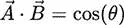，如果和的长度都是 1。

现在我已经讲解了点积的基础知识，可以回到雷诺兹的路径跟踪算法。

#### **简单的路径跟踪**

图 5.19 描述了路径跟踪行为的所有组成部分。这里有很多组件不仅仅是车辆和目标，因此请花些时间查看完整的图表。然后，我将慢慢地逐步解释算法。

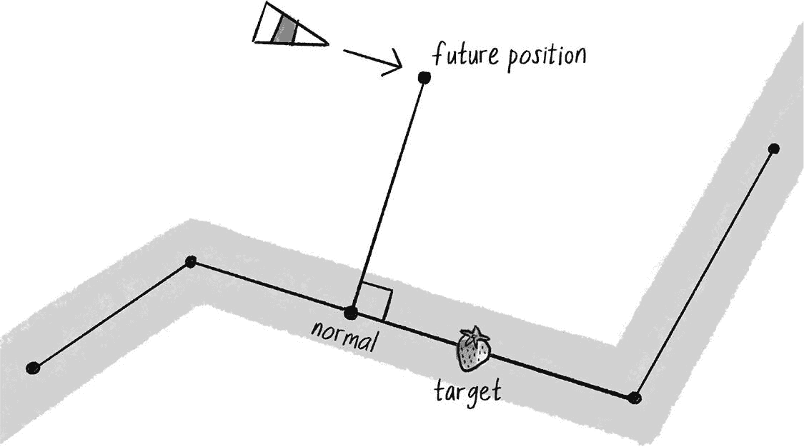

图 5.19：路径跟踪需要路径、车辆、未来位置、*法线*和目标。

首先，*路径*是什么意思？可以使用多种技术来实现路径，但一种简单的方法是将路径定义为一系列连接的点，如图 5.20 所示。

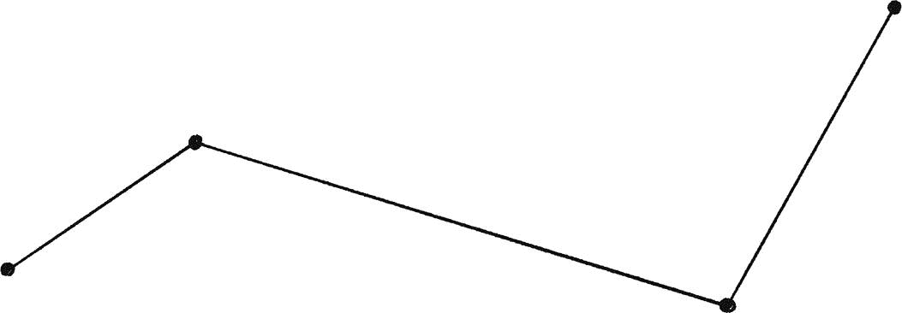

图 5.20：路径是由连接点组成的序列。

这条路径的最简单版本将是两点之间的直线（图 5.21）。

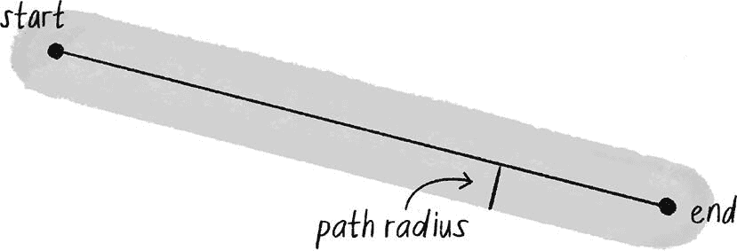

图 5.21：一条具有起点、终点和半径的路径

我还将考虑路径具有*半径*。如果路径是一条道路，半径就是道路的宽度。半径越小，车辆必须更紧密地跟随路径；较大的半径则允许它们稍微偏离路径的两侧。

现在我将把它放入一个类中。

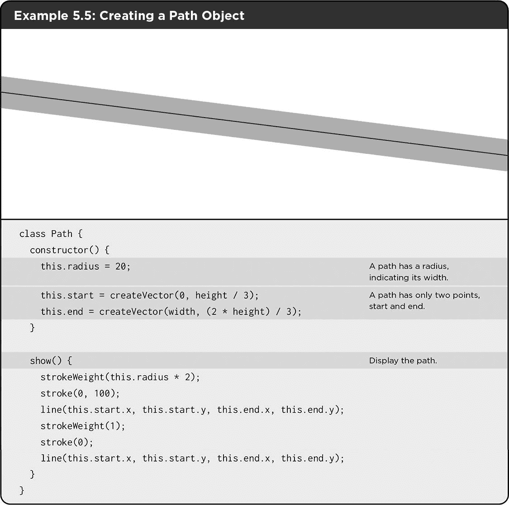

现在，假设一辆车在路径的半径之外，以一定速度行驶，如图 5.22 所示。

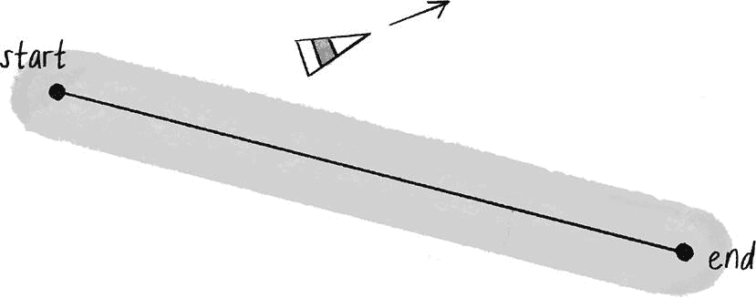

图 5.22：添加一辆偏离路径并远离路径行驶的车辆

第一步是预测（假设恒定速度）那个车辆未来将会在哪里：

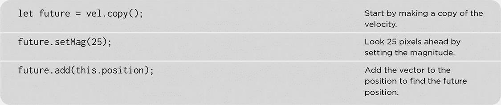

一旦我得到那个位置，就该确定从预测位置到路径的距离。如果它远离路径，说明车辆已经偏离，需要重新调整方向。如果车辆在路径上，一切正常，车辆可以继续行驶。

本质上，我需要计算一个点（未来位置）和一条线（路径）之间的距离。这个距离定义为**法线**的长度，法线是一个从点到线并垂直于线的向量（图 5.23）。

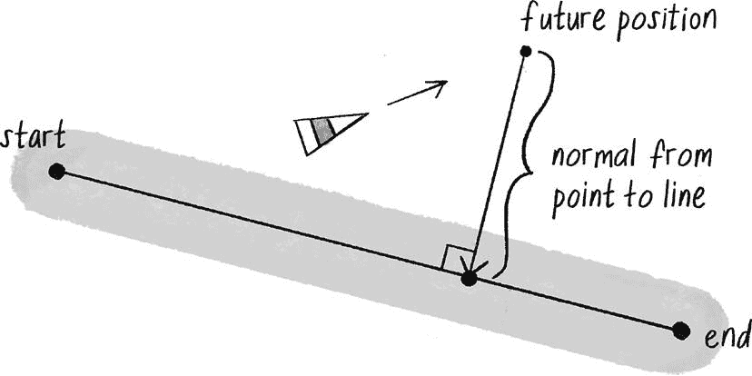

图 5.23：法线是一个从未来位置到路径并垂直于路径的向量。

如何找到法线？首先，我可以定义一个向量（称之为 ），它从路径的起点延伸到车辆的未来位置：

```
let a = p5.Vector.sub(future, path.start);
```

接下来，我可以定义一个向量（称之为 ），它指向路径的起点到终点：

```
let b = p5.Vector.sub(path.end, path.start);
```

现在，通过一点三角学（*cah* 在 *sohcahtoa* 中），我可以计算从路径的起点到法线点的距离。如图 5.24 所示，距离是 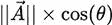。

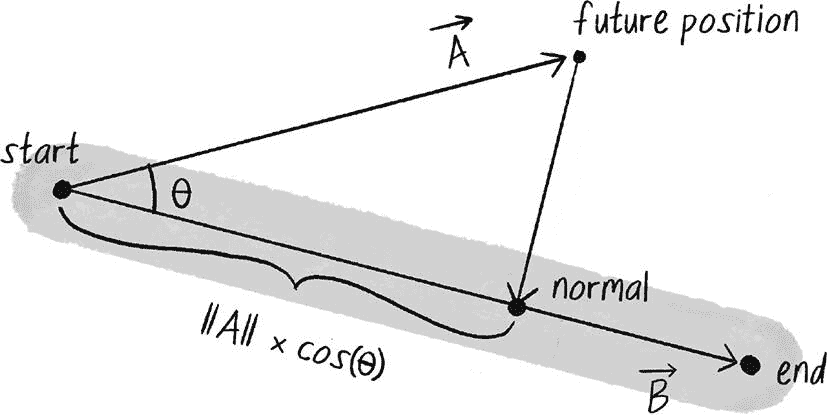

图 5.24：从路径起点到法线的距离是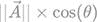。

如果我只知道*θ*，我可以通过下面显示的代码找到那个法线点。

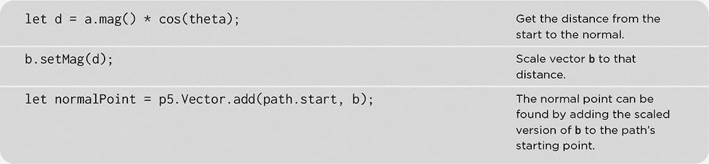

幸运的是，如果点积教会了我什么，那就是给定两个向量，我可以计算这两个向量之间的角度！

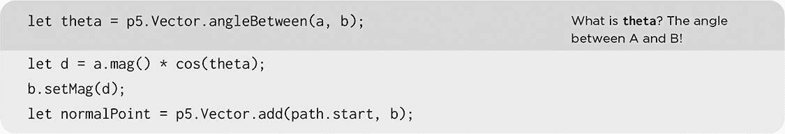

虽然这段代码能工作，但我可以再做一个简化。再次查看，你会看到向量的大小被设置为`a.mag() * cos(theta)`，这是下面代码的翻译：

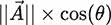

并且，回想一下这个：

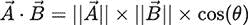

现在，假设是长度为 1 的单位向量？那么你将得到以下结果：

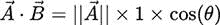

或者，更简单地：

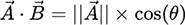

当是单位向量时，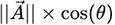等于和的点积。将`b`转换为单位向量只需调用`normalize()`。因此，我可以绕过使用`angleBetween()`计算`theta`，并将代码简化如下：

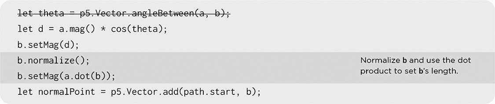

根据法线点缩放的过程通常被称为**标量投影**。我们说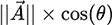 *是* *在* *上的标量投影*，如图 5.25 所示。

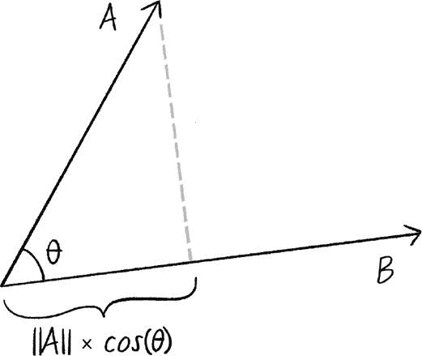

图 5.25：在上的标量投影等于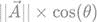。

一旦我沿着路径找到了法线点，下一步就是决定车辆是否应该朝路径方向转向以及如何转向。雷诺兹算法指出，只有当车辆有可能偏离路径时——即法线点与预测的未来位置之间的距离大于路径的半径时——车辆才应朝路径转向。如图 5.26 所示。

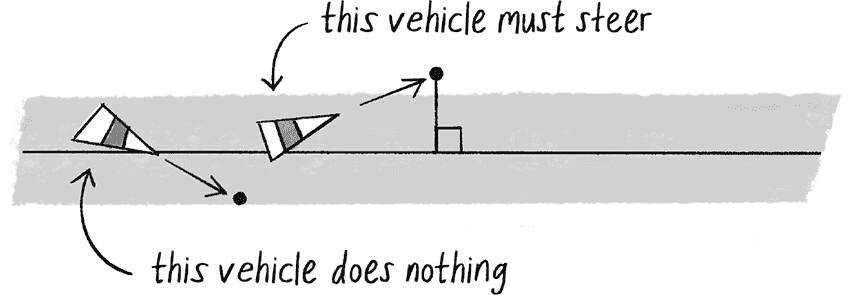

图 5.26：一辆在路径上的未来位置的车辆（上图）和一辆在路径外的车辆（下图）

我可以通过一个简单的`if`语句编码这个逻辑，并在必要时使用我之前的`seek()`方法来引导车辆。

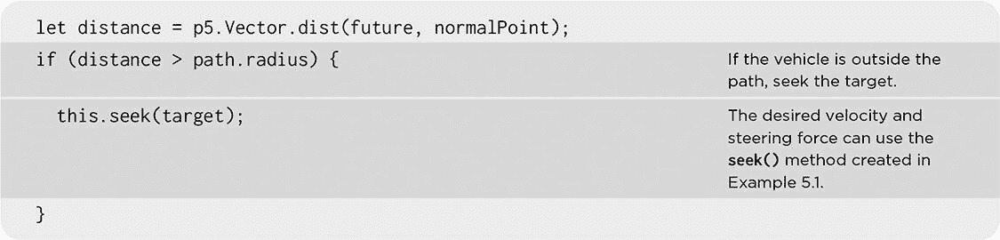

但路径跟随者寻找到的目标是什么呢？Reynolds 的算法包括在路径的法线前方选择一个点。由于我知道定义路径的向量 ()，我可以通过将指向方向的向量添加到表示法线点的向量，来实现这个前方点，如图 5.27 所示。

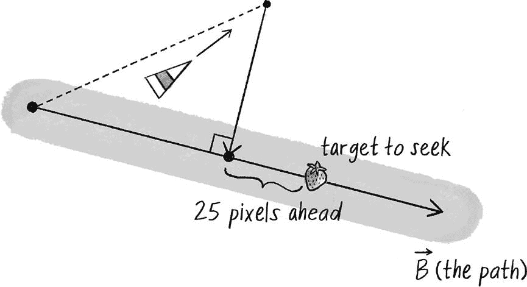

图 5.27：目标点在路径的法线点前方 25 像素（一个任意选择的值）。

我随便说目标点应该在法线前方 25 像素：

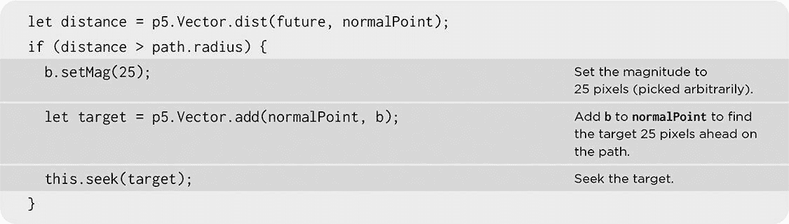

把这一切整合起来，下面是`Vehicle`类中的路径跟随方法。

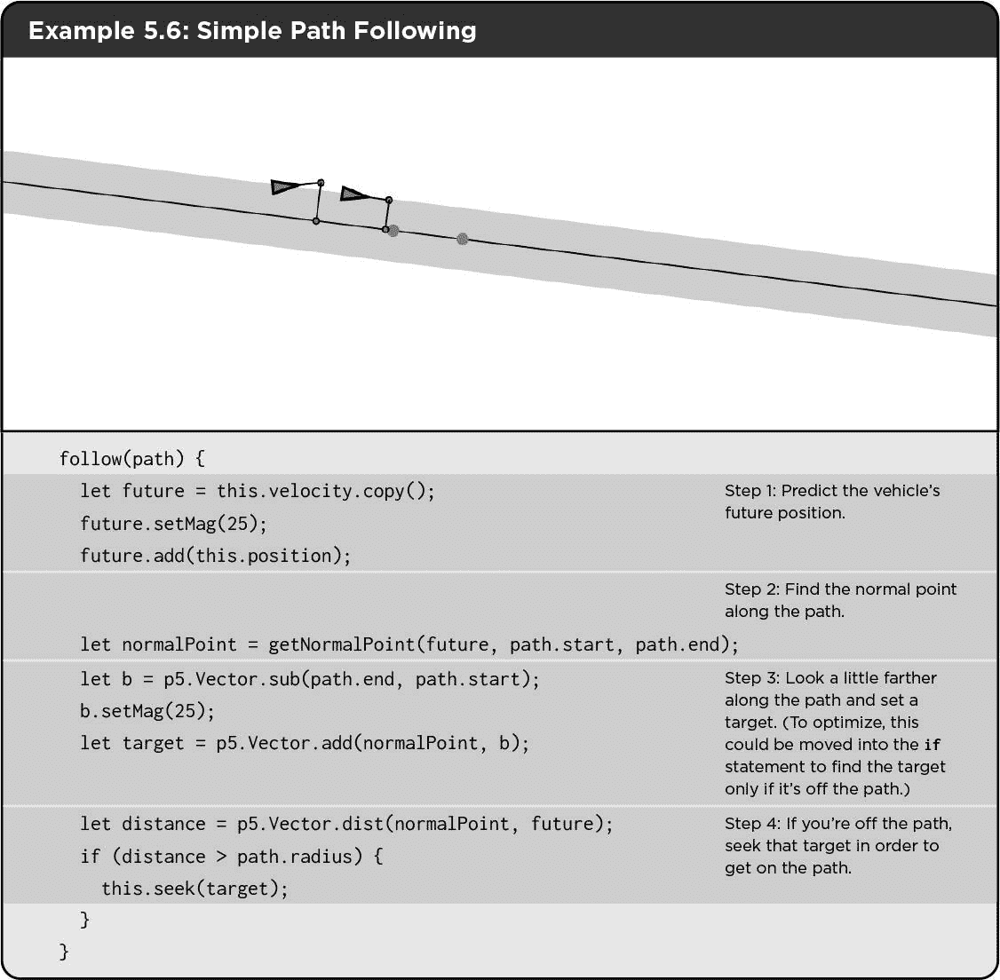

请注意，和以前使用所有点积和标量投影代码来找到法线点不同，我现在调用了`getNormalPoint()`函数。在这种情况下，将执行特定任务（如寻找法线点）的代码拆分成一个函数，并在需要时调用是很有用的。这个函数接受三个向量参数（见图 5.28）：第一个定义了一个点*p*在笛卡尔空间中的位置（即车辆的未来位置），第二和第三个则定义了两个点*a*和*b*之间的线段（即路径）。


图 5.28：`getNormalPoint()`函数的元素：`position`、`a`和`b`

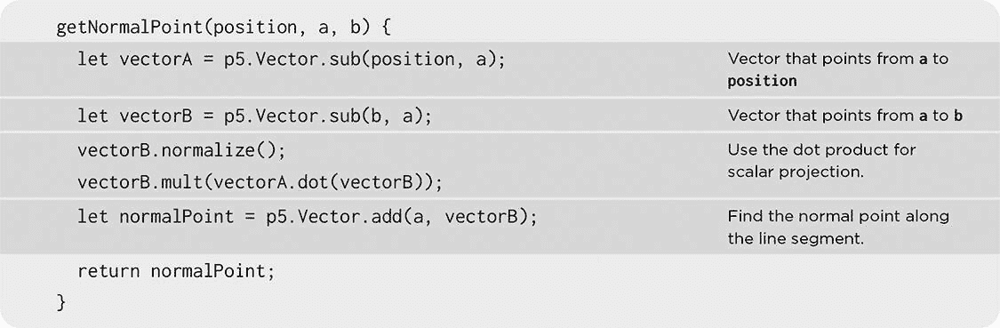

到目前为止我有什么？我有一个`Path`类，它将路径定义为两点之间的线。我还有一个`Vehicle`类，里面有一个方法可以沿路径行驶（通过转向来寻找沿路径的目标）。总的来说，这是一个不错的示例，但它仍然有些局限。缺少了什么？

深呼吸一下，你快完成了。

#### **多个线段的路径跟随**

如果我想让一辆车跟随比单一直线更复杂的路径呢？也许是一条曲线路径，沿着多个方向移动，像图 5.29 中那样？

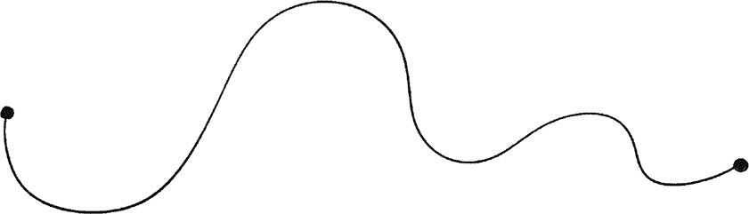

图 5.29：更复杂的路径

也许我有点太雄心勃勃了。我*可以*研究跟随曲线路径的算法，但如果我坚持使用直线段，比如图 5.30 中的那些，我可能更不容易需要在额头上敷上冰袋。即使我仍然*画*出路径作为曲线，但最好在后台用简化的几何形状来近似它，以进行必要的计算。

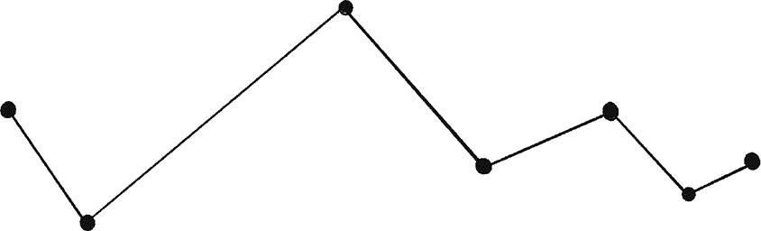

图 5.30：相同的曲线路径，但近似为连接的线段

如果我让路径跟随只在一段线段上工作，那我怎么才能让它在一系列连接的线段上工作呢？关键在于我如何沿路径找到目标点。

为了仅通过一条线段找到目标，我需要计算该线段的法线。现在我有了一系列的线段，我也有了一系列需要计算的法线点——每个线段一个（见图 5.31）。车辆该选择哪一个呢？Reynolds 提出的解决方案是选择（a）最近的法线点，并且（b）在路径上的那个点。

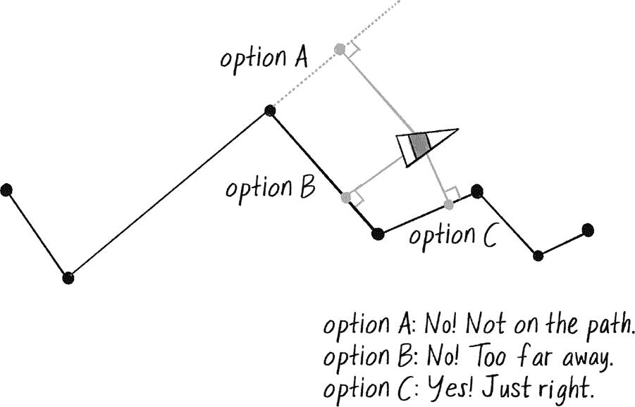

图 5.31：在一系列连接的线段中找到最近的法线点

如果你有一个点和一条无限长的直线，你总能找到一个与直线相交的法线点。但如果你有一个点和一条有限的线段，你不一定能找到一个位于线段上的法线。如果在任何线段上发生这种情况，我可以排除这些法线。一旦只剩下那些位于路径上的法线（在图 5.31 中只有两个），我选择最短的那个。

为了编写这段代码，我将扩展`Path`类，使其拥有一个点的数组（而不仅仅是起点和终点）。

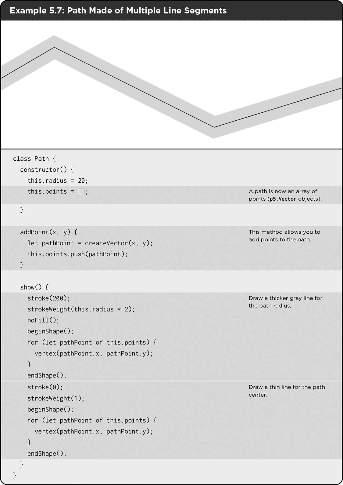

现在`Path`类已经更新，轮到车辆学习如何适应多个线段了。它之前只是在一条线上找到法线。通过使用循环，它可以为所有线段找到法线：

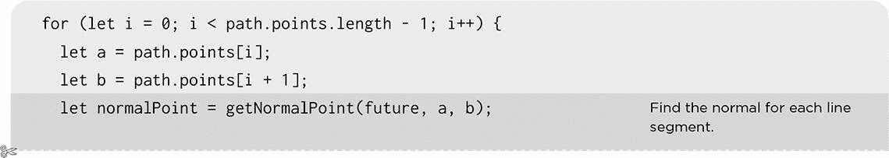

下一步是测试法线点是否确实位于点`a`和`b`之间。由于在这个示例中我知道路径是从左到右的，所以我可以测试`normalPoint`的`x`分量是否超出了`a`和`b`的`x`分量范围。

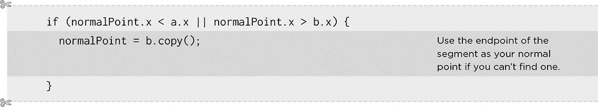

如果法线点不在线段内，我会假设该线段的终点就是法线。（你也可以尝试起始点，具体取决于你的路径特点。）这将确保车辆始终保持在路径上，即使它偏离了线段的边界。

 **练习 5.10**

一种更通用的方式来测试法线点是否位于线段上，是将`normalPoint`与`a`和`b`之间的距离相加。如果结果大于线段的长度，则法线点在该线段之外。你能用 p5.js 编写这个算法吗？

最后，我需要找到离车辆最近的法线点。为此，我可以从一个非常高的“世界纪录”距离开始，逐个检查每个法线点，看它是否打破（小于）纪录。每当一个法线点打破纪录时，世界纪录会被更新，获胜的点会存储在名为`target`的变量中。在循环结束时，`target`将保存离车辆最近的法线点。

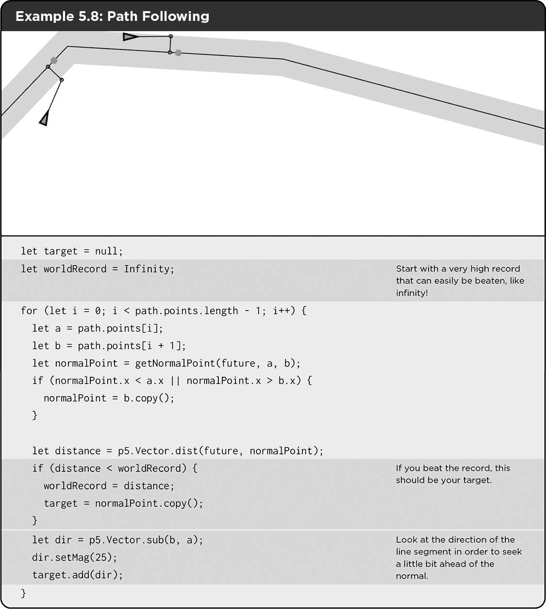

你可能已经注意到，`Infinity` 被用来初始化 `worldRecord`。在 JavaScript 中，`Infinity` 是一个特殊的数值，表示无限大。之所以这样做，是因为我需要一个起始值，这个值始终大于代码中计算出的任何可能的距离。第一个计算出的距离将总是设定新的世界纪录，所有其他的距离都会以此为基准进行比较。

我还想强调 `25` 的硬编码值，它设置了目标路径上正常位置前方的距离。Reynolds 指出，这个值应该是动态的，并且基于车辆到路径的距离和速度进行计算。试试看这个改动，看看它是如何改善路径跟随行为的准确性或响应性的！

 **练习 5.11**

创建一个随着时间变化的路径。定义路径的各个点能否拥有各自的引导行为？

### **复杂系统**

我曾说过，本章的目的是为在 p5.js 画布上移动的事物赋予生命。通过学习编写自主代理的代码并玩弄该代理的个体行为示例，你已经取得了很大的进展。但这还不是结束。是的，车辆是一个模拟存在，它会做出如何寻求、流动和跟随的决策。但一个独自生活的生命，能没有他人的爱与支持吗？

因此，作为一个逻辑上的下一步，我将把我在开发单个自主代理行为方面所做的工作，应用到涉及 *多个* 自主代理并行操作的仿真中——这些代理不仅能感知它们的物理环境，还能感知其他代理的行为，并相应地做出反应。换句话说，我想用 p5.js 创建复杂系统。

**复杂系统** 通常被定义为一个整体大于其部分之和的系统。虽然系统中的单个元素可能非常简单且易于理解，但作为一个整体，系统的行为可以是高度复杂的、智能的，且难以预测。

比如，想象一只微小的、爬行的蚂蚁——一只蚂蚁。蚂蚁是一个自主代理；它能感知环境（通过触角收集关于化学信号的方向和强度的信息），并根据这些信号做出如何移动的决策。但单独一只蚂蚁能建造巢穴、收集食物或保护它的女王吗？蚂蚁是一个只能感知其周围环境的简单单元。然而，一群蚂蚁（*蚁群*）是一个复杂的系统，是由多个组件组成的超有机体，这些组件协同工作以完成困难且复杂的目标。

以下是三个将指导我处理复杂系统的关键原则：

+   **简单的单元具有短程关系。** 这正是我一直在构建的内容：具有有限环境感知能力的车辆。

+   **简单单元并行工作。** 每次通过`draw()`循环时，每个单元都会计算自己的驱动力。这将产生所有单元并行工作的效果。

+   **系统整体表现出涌现现象。** 复杂的行为、模式和智能可以通过简单单元之间的相互作用涌现出来。这一现象在自然界中普遍存在，例如蚁群、迁徙模式、地震和雪花。问题是，是否能够在 p5.js 草图中实现相同的结果。

除了这些核心原则外，复杂系统的三个额外特性将帮助框定讨论，并为软件模拟中应包括的功能提供指导。需要注意的是，这是一组模糊的特征，并非所有复杂系统都具备这些特性：

+   **非线性：** 复杂系统的这个特性通常被随意称为*蝴蝶效应*，该术语由数学家和气象学家爱德华·诺顿·洛伦兹（Edward Norton Lorenz）提出，洛伦兹是混沌理论研究的先驱。1961 年，洛伦兹第二次运行计算机天气模拟时，可能为了节省一点时间，他输入了 0.506 作为初始值，而不是 0.506127。最终结果与第一次模拟的结果完全不同。更具表现力地说，这一理论认为，在世界的另一端，一只蝴蝶扇动翅膀，可能引起巨大的天气变化，最终影响到你在海滩度过的周末。它被称为*非线性*，因为初始条件的变化与结果之间没有线性关系。初始条件的微小变化可能会对结果产生巨大的影响。非线性系统是混沌系统的超集。在第七章中，你将看到即便是在一个由许多 0 和 1 组成的系统中，只要改变一个比特，结果也会完全不同。

+   **竞争与合作：** 使复杂系统运转的一个重要因素是元素之间同时存在竞争和合作。即将实现的群体行为系统将有三个规则：对齐、凝聚和分离。对齐和凝聚将要求元素“合作”，尽量保持在一起并共同移动。然而，分离将要求元素“竞争”空间。当这个时刻来临时，可以尝试去除合作或竞争中的任何一个，你会看到系统失去了其复杂性。竞争与合作共同存在于生物的复杂系统中，但在非生物复杂系统（如天气）中并不存在。

+   **反馈：** 复杂系统通常包括一个反馈循环，将系统的输出反馈到系统中，以积极或消极的方向影响其行为。假设你决定每天乘坐公共交通工具上班，因为它是最可靠且成本效益最好的解决方案，而你又对交通拥堵和驾车的环境影响感到厌烦。你并不孤单，其他人也选择了公共交通。这个系统变得更高效、更具吸引力，能够用相同的资源服务更多的人，同时减少了车辆交通。然而，随着时间的推移，系统可能会难以适应日益增长的需求，导致过度拥挤、延误，以及提高票价以资助基础设施改善。因此，你和其他人开始重新选择开车，从而再次增加交通拥堵，减少公共交通的效率。随着交通状况的恶化，票价上涨的资金（希望）被用来改善公共交通基础设施，使其再次变得更具吸引力。通过这种方式，公共交通的成本和效率既是系统的输入（决定你是否选择使用它），也是输出（交通拥堵的程度以及随之而来的成本和效率）。经济模型只是人类复杂系统的一个例子，其他例子包括时尚潮流、选举、群众行为和交通流动。

复杂性将作为本书剩余部分的一个关键主题。在这一部分，我将开始为`Vehicle`类引入一个新特性：感知邻近车辆的能力。这个增强功能将为一个复杂系统的终极示例铺平道路，在这个系统中，简单的个体行为相互作用，产生了一个涌现行为：群体飞行。

#### **实现群体行为（或者：我们不要互相撞上）**

管理一组对象无疑不是一个新概念。你之前见过这个概念——在第四章中，我开发了`Emitter`类来表示一个整体粒子系统。在那里，我使用数组来存储单个粒子的列表。在这里，我也会用相同的技术，并将`Vehicle`对象存储在数组中：


现在，当需要在`draw()`中操作所有车辆时，我可以遍历数组并调用必要的方法：

```
function draw() {
  for (let vehicle of vehicles) {
    vehicle.update();
    vehicle.show();
  }
}
```

也许我想加入一个行为，即应用于所有车辆的力。这可能是寻求鼠标的位置：

```
    vehicle.seek(mouseX, mouseY);
```

但那是*个体*行为，而我已经在本章的大部分内容中讨论了个体行为。你之所以在这里，是因为你想应用*群体*行为。我将从**分离**行为开始，这种行为的命令是：“避免与邻居发生碰撞！”

```
    vehicle.separate();
```

看起来不错，但还不完全正确。缺少了什么呢？在`seek()`的情况下，我说，“寻求`mouseX`和`mouseY`。”在`separate()`的情况下，我说，“与*其他所有人*分开。”谁是其他所有人？就是所有其他车辆的列表：

```
    vehicle.separate(vehicles);
```

这是超越之前粒子系统的重大进展。与每个元素（粒子或车辆）独立操作不同，我现在说，“嘿，你，那辆车！当你该操作的时候，你需要在意识到其他所有人的情况下操作。所以我将把所有其他人的列表传给你。”

把到目前为止做的整理一下，这里是展示群体行为的草图的`setup()`和`draw()`函数：

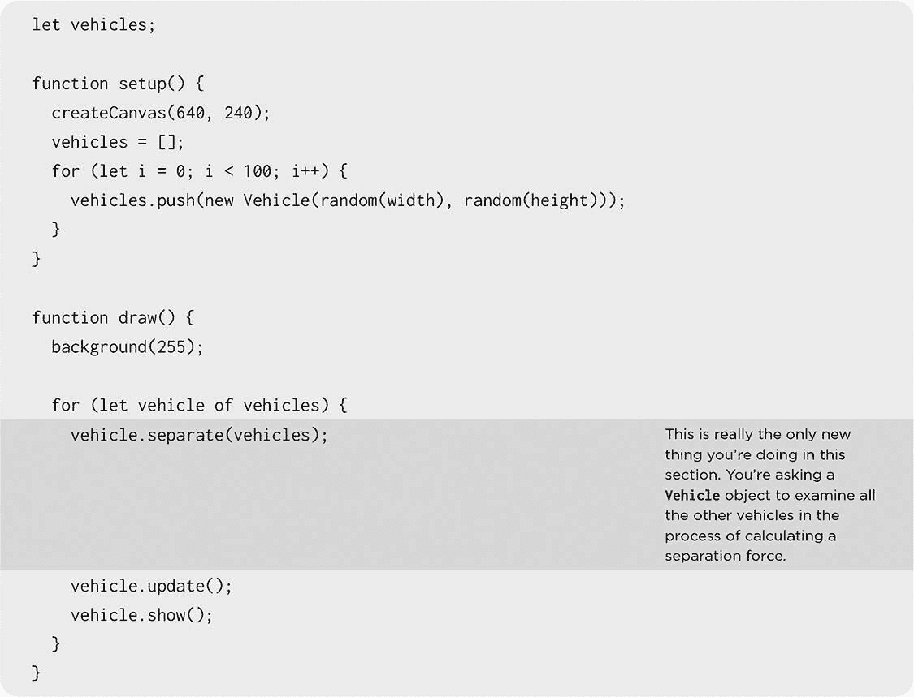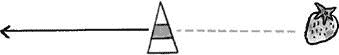

图 5.32：分离所需的速度（相当于逃离）是一个指向目标相反方向的向量。

当然，这只是开始。真正的工作发生在`separate()`方法内部。Reynolds 将分离行为定义为“调整方向以避免拥挤”。换句话说，如果某辆车离你太近，向那辆车的反方向转向。听起来熟悉吗？记得寻求行为吗，车辆向目标驶去？把那个力反转，你就得到了逃离行为，这就是在这里实现分离所需要的行为（见图 5.32）。

但是如果有多个车辆太近呢？在这种情况下，我会将分离定义为所有指向远离任何近距离车辆的向量的平均值（图 5.33）。

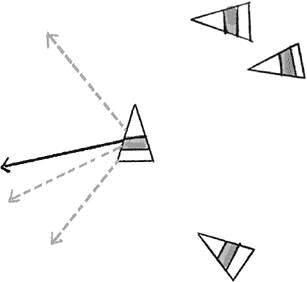

图 5.33：分离所需的速度是多个逃离速度的平均值。

我如何把它转化为代码呢？记住，我正在写一个叫做`separate()`的方法，它接收一个`Vehicle`对象数组作为参数：

```
separate(vehicles) {

}
```

在这个方法中，我将循环遍历所有车辆，看看是否有任何车辆离得太近：

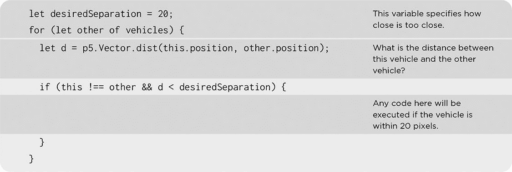

请注意，我不仅在检查距离是否小于所需的分离距离，还在检查`this`是否不等于`other`。这是一个关键要素。记住，所有的车辆都在数组中；如果没有这个额外的检查，车辆将试图从自己身边逃离！

如果车辆太近，我会计算一个指向远离干扰车辆的向量：

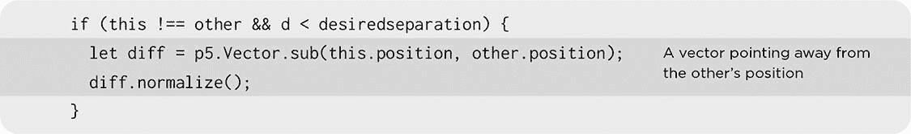

这还不够。我现在有了一个逃离向量，但我真正需要的是所有离得太近的车辆的逃离向量的平均值。我该如何计算平均值呢？将所有向量加起来，然后除以总数：

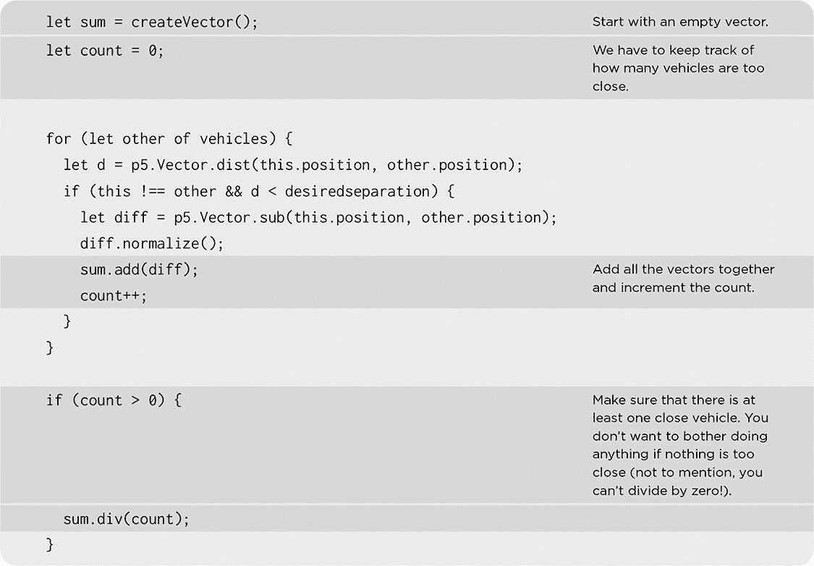

一旦我获得了平均向量（存储在变量`sum`中），这个向量可以被缩放到最大速度，成为所需的速度——车辆*希望*以最大速度朝那个方向移动！（实际上，我真的不需要再除以`count`，因为大小是手动设置的。）一旦我得到所需的速度，就进入了典型的 Reynolds 模型——转向等于所需速度减去当前速度：

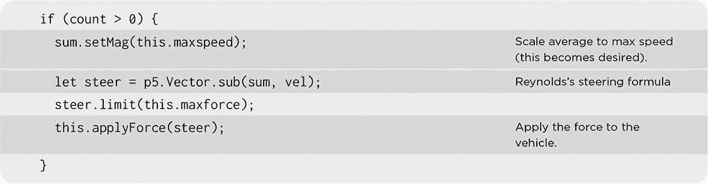

以下示例展示了方法的完整实现。

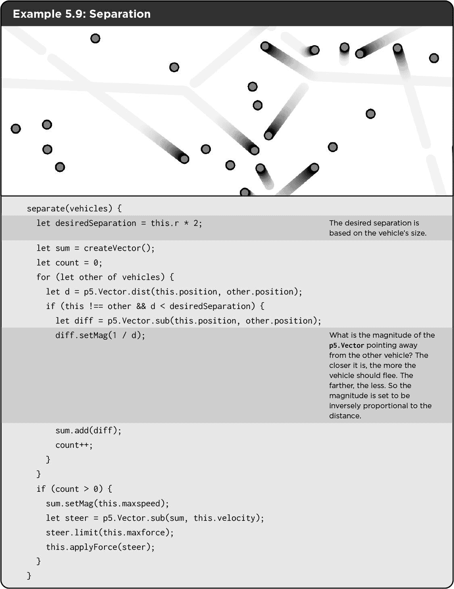

`separate()`方法包含了两个额外的改进。首先，所需的分离距离现在依赖于车辆的大小，而不是一个任意常数。这样，分离行为会根据车辆的个体特征动态适应。其次，指向邻近车辆的向量的大小被设置为与距离成反比。这意味着邻居越近，车辆越想逃离，反之亦然。

 **练习 5.12**

创建一个`cohere()`方法，它遵循与`separate()`相反的逻辑：如果一辆车与其他车的距离超过某个值，则向该车方向转向。这将保持群体的整体性。（稍后，我将查看当凝聚力和分离力同时在同一模拟中发挥作用时会发生什么。）

 **练习 5.13**

将分离力添加到路径跟随中，创建一个模拟 Reynolds 群体路径跟随的效果。

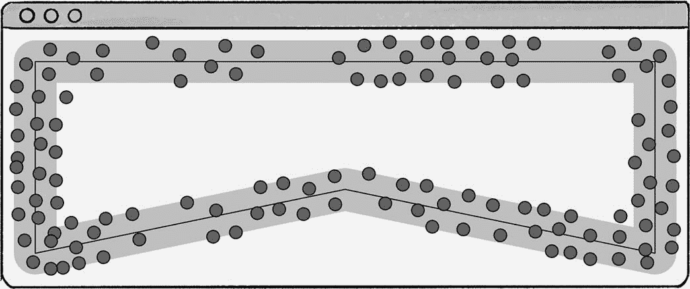

#### **结合行为**

最令人兴奋和有趣的群体行为来自于混合和匹配多种转向力。毕竟，如何通过只有一个规则的草图来模拟一个复杂系统中的涌现现象呢？

当多个转向力同时作用时，我需要一种机制来管理它们。你可能会想：“这没什么新鲜的。我们一直在处理多个力。”你说得对。事实上，这种技术早在第二章中就出现过：

```
  let wind = createVector(0.001, 0);
  let gravity = createVector(0, 0.1);
  mover.applyForce(wind);
  mover.applyForce(gravity);
```

在这里，一个`Mover`对象响应两种力。之所以能顺利工作，是因为`Mover`类的设计使得力向量能够汇聚到它的加速度向量中。然而，在本章中，这些力来源于`mover`（现在称为*车辆*）的内部需求。这些需求可以赋予不同的权重，使某些需求比其他需求更具影响力。例如，考虑一个草图，其中所有车辆都有两个需求：

+   寻找老鼠的位置。

+   与任何过于接近的车辆保持分离。

想象这些车辆代表着一群鱼。尽管鱼类希望避免彼此碰撞，但它们的首要任务是寻找食物来源（例如老鼠）。能够调整两种转向力的权重对实现这一效果至关重要。

首先，我将在`Vehicle`类中添加一个名为`applyBehaviors()`的方法来管理所有行为：

```
applyBehaviors(vehicles) {
  this.separate(vehicles);
  this.seek(createVector(mouseX, mouseY));
}
```

在这里，单一的方法负责调用其他应用力的方法——`separate()` 和 `seek()`。我本可以开始调整这些方法中计算的力的强度，但不如让这些方法简单地计算并返回这些力。然后，我可以在 `applyBehaviors()` 中调整这些力的强度，并将它们应用于车辆的加速度：

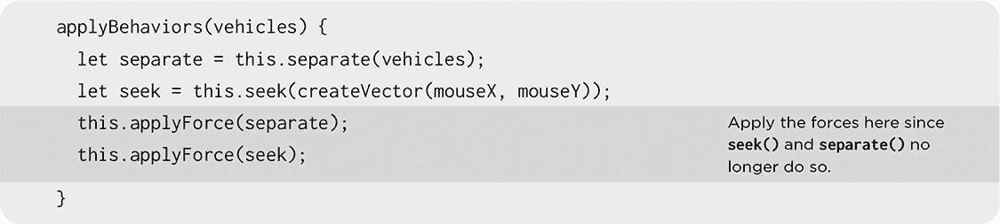

这就是新方法如何改变 `seek()` 方法的方式：

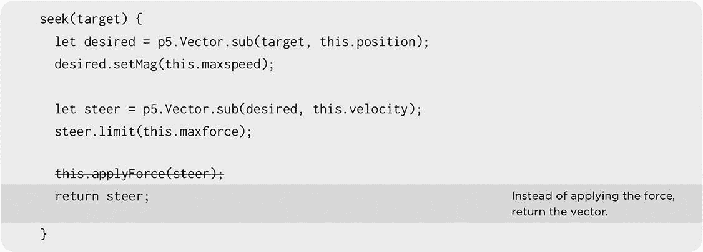

这个变化微妙但极其重要：它允许在一个地方对这些力的强度进行加权。

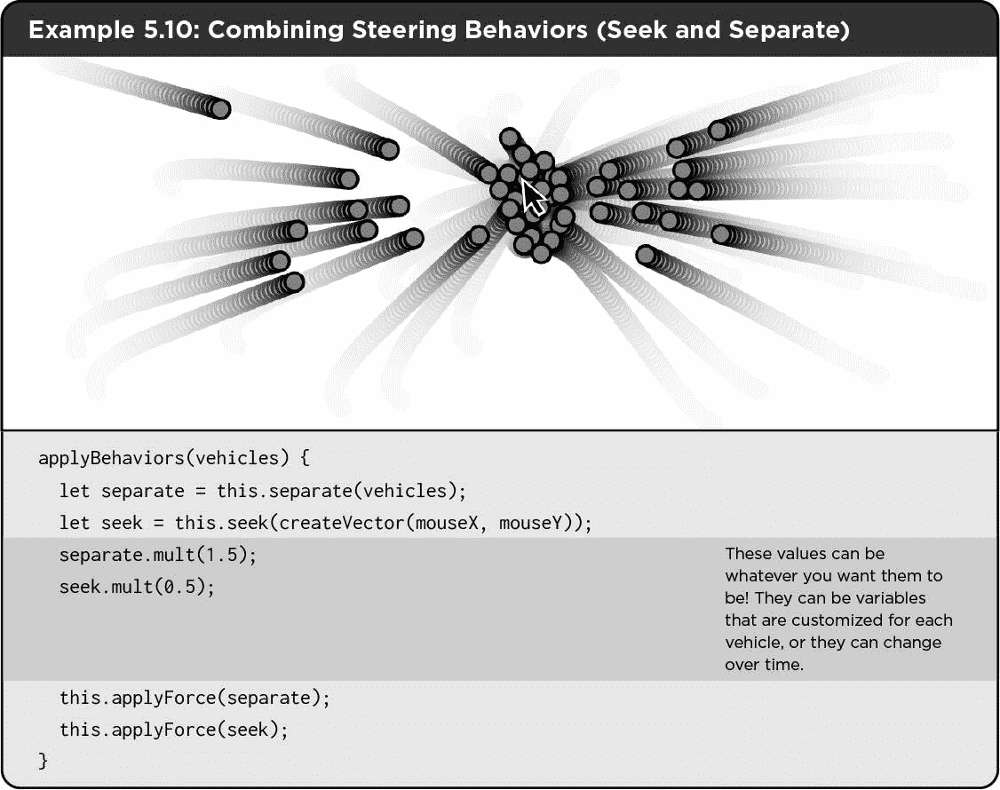

在这段代码中，我使用 `mult()` 来调整各个力的大小。通过将每个力向量乘以一个系数，它的大小会相应地缩放。这些系数（在这种情况下，`separate` 的系数是 1.5，`seek` 的系数是 0.5）代表了分配给每个力的权重。然而，权重并不一定是常数。你可以考虑它们如何根据环境条件或车辆的特性动态变化。例如，当车辆探测到附近有食物时，`seek` 的权重可能会增加（可以将车辆想象成一个拥有 `hunger` 属性的生物），或者当车辆进入拥挤区域时，`separate` 的权重可能会变大。这种动态调整权重的灵活性允许出现更加复杂和微妙的行为。

 **练习 5.14**

修改 示例 5.10，使得行为权重随时间变化。例如，假设权重是根据正弦波或 Perlin 噪声计算的呢？或者假设某些车辆更关注寻求行为，而其他车辆则更关注分离行为？你能引入其他转向行为吗？

#### **集群行为**

**集群行为**是许多生物中都能观察到的一种群体行为，如鸟类、鱼类和昆虫等。1986 年，Reynolds 创建了一个关于集群行为的计算机模拟，并在他的论文《群体、兽群和鱼群：一种分布式行为模型》中详细记录了这个算法。在 p5.js 中重新创建这个模拟将结合本章中的所有概念：

1.  我将使用转向力公式（steer = desired – velocity）来实现集群行为的规则。

1.  这些转向力将形成群体行为，需要每个车辆感知到所有其他车辆。

1.  我将结合并加权多个力。

1.  结果将是一个复杂的系统——智能群体行为将从简单的集群规则中涌现出来，而无需集中系统或领导者的存在。

好消息是，我已经在本章中演示了第 1 到第 3 项内容，所以这一部分只需要将这些内容整合起来并查看结果。

在开始之前，我应该提一下，我将再次更改`Vehicle`类的名称。Reynolds 使用了*boid*这个术语（一个虚构的词，指代类似鸟的物体）来描述鸟群系统中的元素。我也将采用这个术语。

鸟群聚集有三条规则：

+   **分离**（又称避让）：引导避免与邻居发生碰撞。

+   **对齐**（又称复制）：朝着与邻居相同的方向引导。

+   **凝聚**（又称中心）：朝着邻居的中心引导（保持与群体在一起）。

图 5.34 说明了这些规则。

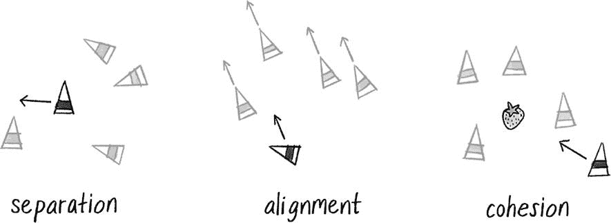

图 5.34：鸟群聚集的三条规则：分离、对齐和凝聚。示例车辆和期望速度为粗体。

就像在示例 5.10 中，我将分离和寻求结合在一起一样，我希望`Boid`对象有一个方法来管理这三种行为。我将其命名为`flock()`：

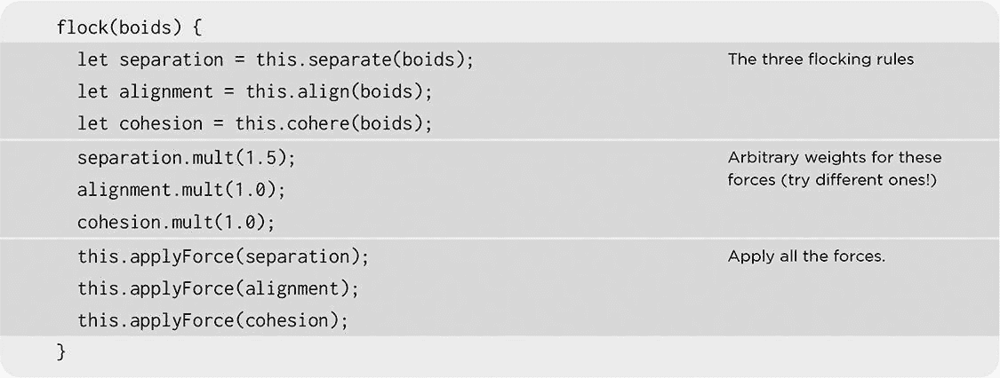

现在，问题只是如何实现这三条规则。我已经应用了分离规则；它与前面的示例相同。接下来，我将重点关注对齐，或者说是与相邻的鸟群保持相同的方向。和其他所有的引导行为一样，我需要将这个概念表达为一种愿望：鸟群的期望速度是其邻居的平均速度。因此，算法就是计算所有其他鸟群的平均速度，并将其设置为期望速度：

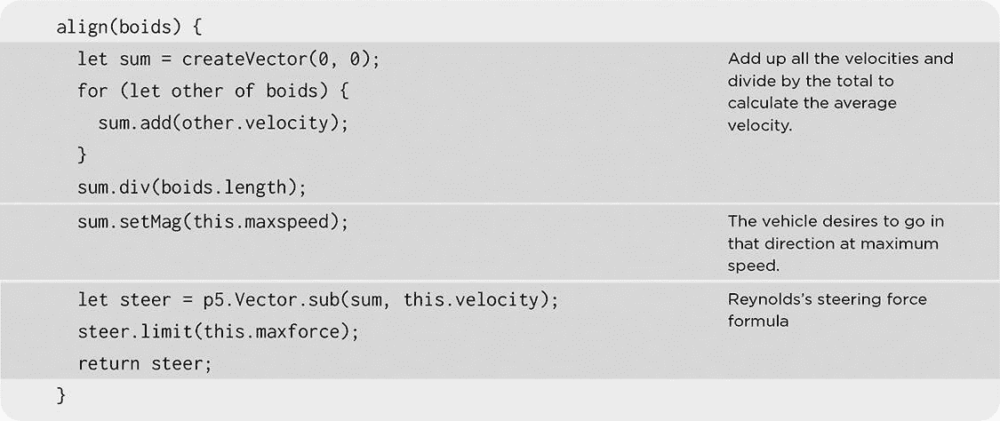

这已经相当不错，但缺少一个非常关键的细节。复杂系统（如鸟群聚集）的一个关键原理是，系统中的元素（在这里是鸟群）具有*短程*关系。再想想蚂蚁，想象蚂蚁能够感知它的直接环境是容易的，但要想象一只蚂蚁能够知道几百英尺外另一只蚂蚁的行为就不那么容易了。实际上，正是蚂蚁通过这些邻近关系展现出复杂的集体行为的能力，才使得它们如此令人兴奋。

在`align()`方法中，我目前正在计算*所有*鸟群的平均速度，而我实际上应该只考虑某个特定距离内的鸟群（见图 5.35）。当然，这个距离阈值是可以变化的。你可以设计只看到 20 像素远的鸟群，也可以设计看到 100 像素远的鸟群。


图 5.35：示例车辆（粗体）只与其邻域内的车辆互动（圆圈内）。

在实现分离时，我已经应用了类似的逻辑，只计算一定距离内其他车辆的作用力。现在，我希望对对齐做同样的处理（最终还包括凝聚）：

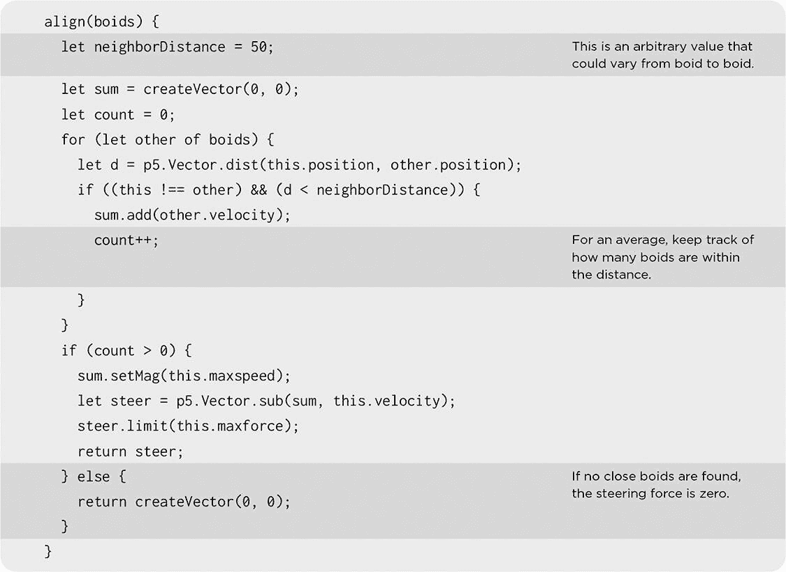

与`separate()`方法一样，我加入了条件`this !== other`，以确保鸟群在计算平均速度时不会考虑自己。虽然不加这个条件可能也能工作，但如果每只鸟群不断受到自身速度的影响，可能会导致一个反馈循环，从而破坏整体行为。

 **练习 5.15**

你能重新编写`align()`方法，使得鸟群只会看到那些在直接视线范围内的其他鸟群吗？

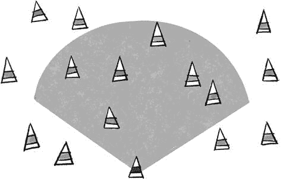

凝聚的代码与对齐的代码非常相似。唯一的区别是，我不再计算鸟群邻居的平均*速度*，而是计算鸟群邻居的平均*位置*（并将其作为目标进行寻求）。

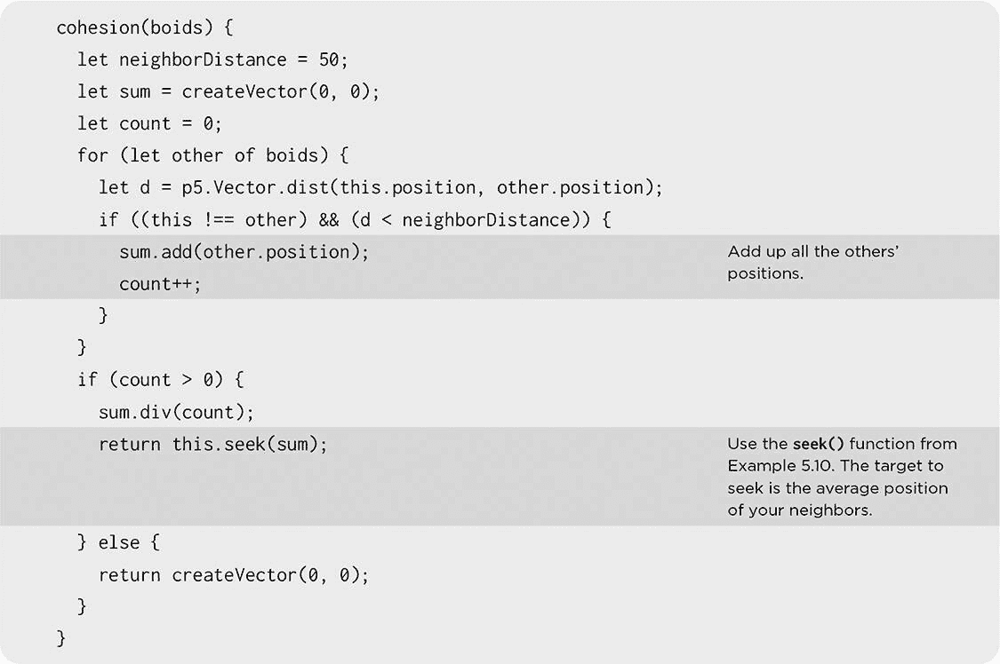

你还可以花些时间编写一个名为`Flock`的类来管理整个鸟群。它将与第四章中的`ParticleSystem`类几乎完全相同，唯一的微小变化是：当我对每个`Boid`对象调用`run()`时（就像对每个`Particle`对象做的一样），我将传入整个鸟群数组的引用：

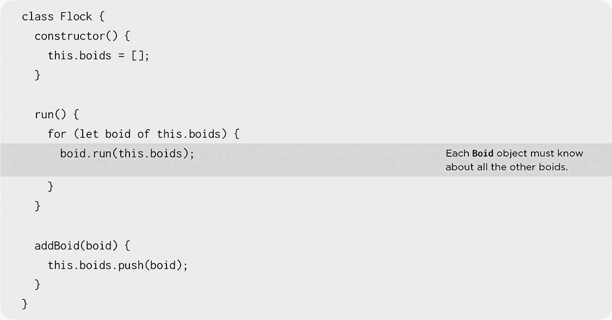

剩下的就是在`setup()`中初始化鸟群，并在`draw()`中运行它。

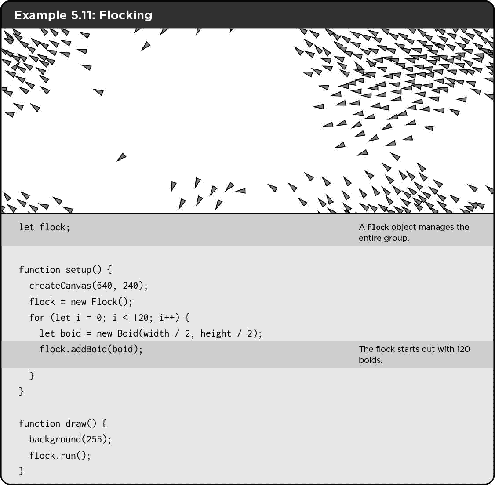

就像第四章中的粒子系统一样，你可以看到面向对象编程（OOP）在简化`setup()`和`draw()`函数方面的优雅。

 **练习 5.16**

将鸟群行为与其他控制行为结合起来。

 **练习 5.17**

在他的书《*自然的计算美*》（Bradford Books，2000 年）中，Gary Flake 描述了鸟群行为的第四条规则，**视野**：“从任何挡住视线的鸟群那里横向移动。”让你的鸟群遵循这一规则。

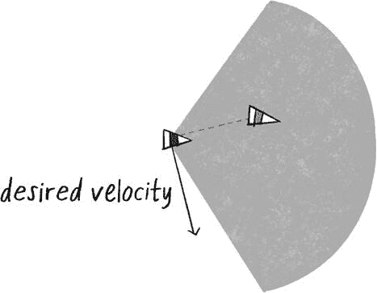

 **练习 5.18**

创建一个鸟群模拟，其中所有参数（*分离权重*、*凝聚权重*、*对齐权重*、*最大力*、*最大速度*）随时间变化。它们可以通过 Perlin 噪声或用户交互来控制。（例如，你可以使用 p5.js 的`createSlider()`函数将这些值与可以实时调整的滑块位置绑定。）

 **练习 5.19**

以完全不同的方式可视化鸟群。

### **算法效率（或：为什么我的草图运行这么慢？）**

群体行为非常有趣，但我必须带着沉重的心情承认，它们也可能很慢。事实上，群体越大，草图的运行速度就越慢。我很想隐藏这个黑暗的真相，因为我希望你能快乐，过上充实而有意义的生活，不必为代码的效率而烦恼。但我也希望能在晚上安心入睡，而不是担心当你尝试运行包含太多 boid 的集群模拟时，你会感到无法避免的失望。

通常，当我谈到 p5.js 草图运行缓慢时，原因是绘制到画布可能会很慢——你绘制的越多，草图运行就越慢。正如你可能从第四章回忆到的那样，切换到 WebGL 这样的不同渲染器有时可以缓解这个问题，从而允许更快速地绘制更大的粒子系统。然而，对于像集群模拟这样的东西，慢速的根本原因来自于算法。计算机科学家用一种叫做**大** *Ο* **记法**的术语来描述这个问题，其中的*O*代表“阶”。这是描述算法效率的简写：算法完成所需的计算周期数是多少？

考虑一个简单的搜索问题。你有一个装有 100 个巧克力糖果的篮子，只有一个是纯黑巧克力。那是你想吃的。为了找到它，你一颗颗挑出巧克力糖果。你可能很幸运，一开始就找到它，但在最坏的情况下，你必须检查所有 100 个糖果才能找到黑巧克力。在 100 个物品中找到一个，你必须检查 100 个物品（或者在*N*个物品中找到一个，你必须检查*N*次）。这里的大 *O* 记法是 *O(N*)。顺便提一下，这也是描述一个简单粒子系统的大 *O* 记法。如果你有*N*个粒子，你就必须运行并显示这些粒子*N*次。

现在，让我们思考一种群体行为，比如集群。对于每一个`Boid`对象，你需要在计算其转向力之前，检查每一个其他`Boid`对象的速度和位置。假设你有 100 只 boid。对于 boid 1，你需要检查 100 只 boid；对于 boid 2，你需要检查 100 只 boid；以此类推。总之，对于 100 只 boid，你需要进行 10,000 次检查（100 × 100 = 10,000）。

你可能会想，“没问题，计算机很快。它们可以很轻松地处理 10,000 个任务。”但如果有 1,000 只 boid 呢？那你就得这样处理：

1,000 × 1,000 = 1,000,000 次循环

这开始变得相当慢，但仍然可以勉强应付。那么，10,000 个元素呢？

10,000 × 10,000 = 100,000,000 次循环

现在事情变得真的很慢，真的，真的，非常慢。

注意到一个规律了吗？随着元素数量增加 10 倍，所需的循环次数增加 100 倍。更广泛地说，当元素数量增加*N*倍时，循环次数增加*N* × *N*，即*N*²。在大 *O* 记法中，这被称为 *O*(*N*²)。

也许你在想，“没问题，使用群集时，我只需要考虑靠近当前个体的其他个体。所以即使我有 1000 个个体，我也可以只看每个个体的 5 个最近邻，这样我总共就只需要 5,000 个周期。”你停顿了一下，开始思考，“所以对于每个个体，我只需要检查所有个体，找出 5 个最近的就好了！”看到了问题所在了吗？即使你只想查看最近的个体，唯一知道哪些是最近的方式就是检查所有的个体。

或者有没有其他方法？

#### **空间划分**

在他 2000 年的论文《与自主角色群体的互动》（* [`www.red3d.com/cwr/papers/2000/pip.pdf`](https://www.red3d.com/cwr/papers/2000/pip.pdf) *）中，Reynolds（意料之中）提出了一种被称为**bin-lattice 空间划分**（通常简称为*binning*）的技术，用于优化群集算法和其他群体行为。该技术的关键是将仿真空间划分为一个更小单元（或称“箱子”）的网格。

为了演示，假设画布被划分为 10 行 10 列的网格，总共有 100 个单元格（10 × 10 = 100）。假设你有 2,000 个个体——这个数量足够小，以便你实际希望它，但又足够大，以致运行得太慢（2,000 × 2,000 = 4,000,000 个周期）。在任何给定时刻，每个个体都会落在网格中的一个单元格内，如图 5.36 所示。对于 2,000 个个体和 100 个单元格，平均每个单元格大约会有 20 个个体（2,000 ÷ 100 = 20）。

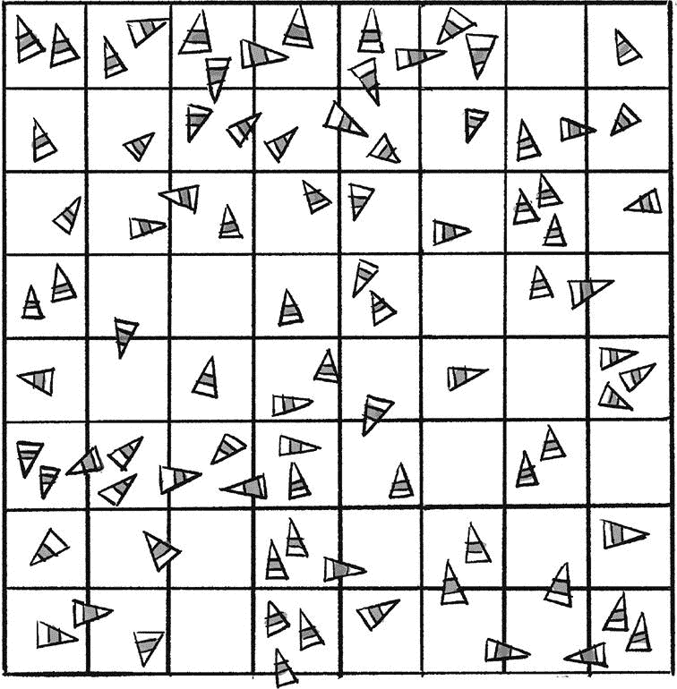

图 5.36：一个充满车辆的方形画布，划分为一个方形单元格的网格

现在假设，为了将群集规则应用到给定的个体，你只需要查看该个体所在单元格中的其他个体。每个单元格平均包含 20 个个体，那么每个单元格将需要 400 个周期（20 × 20 = 400），而有 100 个单元格时，总共需要 40,000 个周期（400 × 100 = 40,000）。这将节省超过 4,000,000 个周期！

为了在 p5.js 中实现 bin-lattice 空间划分算法，我需要多个数组。第一个数组用于跟踪所有个体，就像原始的群集示例一样：

```
let boids = [];
```

第二个是一个二维数组（重新使用示例 5.4 中的代码），表示网格中的单元格：

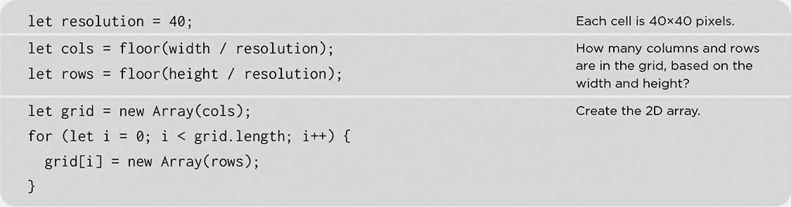

该二维数组中的每个值本身是一个数组，里面包含当前在该单元格内的`Boid`对象的引用。如果你在记录的话，这就是一个嵌套数组：数组中的数组中的数组：

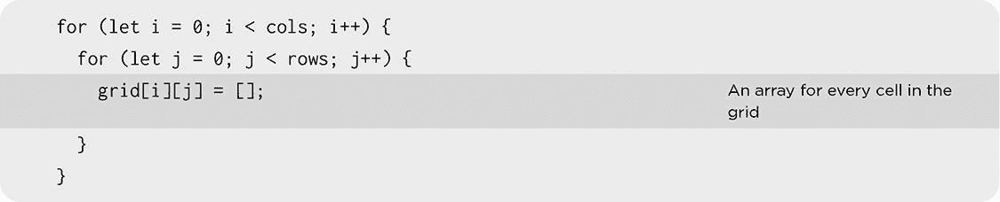

每次通过`draw()`时，每个网格单元的数组都会首先被清除。然后，每个个体根据其位置将自己注册到适当的单元格中。这样，随着个体的移动，其所在单元格的分配会被更新：

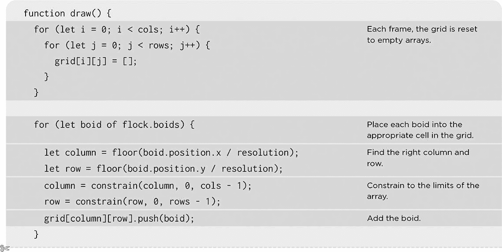

最后，当需要让群体检查它们的邻居时，它们只需查看自己所在单元格中的群体。


我这里只介绍了 bin-lattice 算法的基础知识。在实际应用中，每个群体还应该检查相邻单元格（上、下、左、右以及对角线方向）中的群体，以及它自己单元格中的群体。（如果想了解如何实现这一点，可以查看本书网站上的完整代码。）然而，即使增加了这种额外的检查，算法仍然比检查每一个群体更高效。

然而，这种方法仍然存在缺陷。例如，如果所有的群体聚集在角落并生活在同一个单元格中呢？这不就意味着我又回到了检查所有 2,000 个群体与所有 2,000 个群体吗？事实上，bin-lattice 空间细分在元素均匀分布于画布时最有效。然而，一种名为**四叉树**的数据结构可以处理不均匀分布的系统，避免了所有群体都挤进一个单元格的最坏情况。

四叉树通过根据群体（boids）的分布动态调整网格，扩展了空间细分策略。与固定网格不同，四叉树从一个大的单元格开始，这个单元格包含整个空间。如果这个单元格内的群体太多，它会分裂成四个更小的单元格。这个过程会对每个新的单元格进行重复，当它变得过于拥挤时，就会继续分裂，从而创建一个灵活的网格，在需要时提供更精细的分辨率。

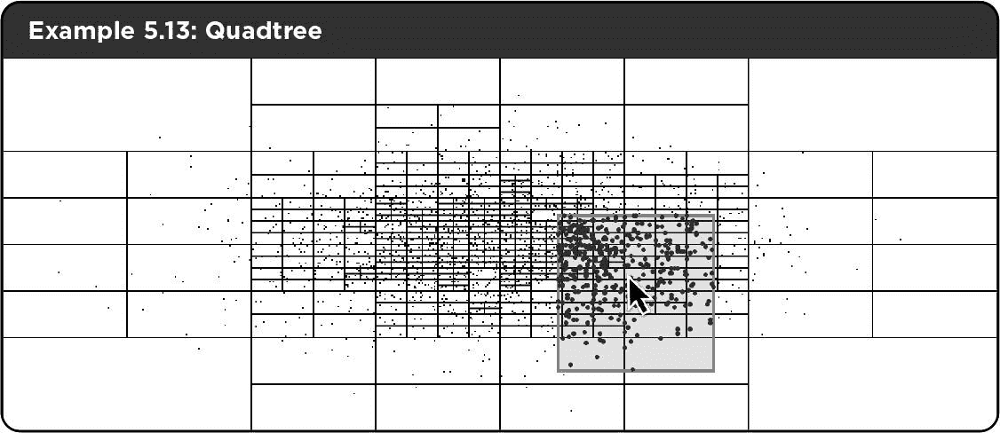

四叉树数据结构是 Barnes-Hut 算法的关键，我在构建 n-body 模拟时简要提到过这个算法。该方法使用四叉树将一组物体近似为一个单独的物体，从而在计算引力时减少计算量。这大大减少了所需的计算次数，使得拥有大量物体的模拟运行得更加高效。你可以通过访问 Coding Train 网站的[挑战 98](https://thecodingtrain.com/quadtree)了解更多关于构建四叉树并将其应用于群体系统的内容。

 **练习 5.20**

扩展 bin-lattice 空间细分群体模拟，参考示例 5.12，使用四叉树。

#### **更多优化技巧**

在这个过程中，这里还有一些与保持代码高效、快速相关的额外提示：

+   使用平方的大小（magnitude squared）（有时也称为平方的距离）。

+   计算正弦和余弦查找表。

+   不要创建无数不必要的 p5.Vector 对象。

接下来将详细介绍这些技巧。

##### **使用平方的大小**

什么是平方的大小（magnitude squared），以及何时使用它？回想一下如何计算一个向量的大小。

```
function mag() {
  return sqrt(x * x + y * y);
}
```

大小需要平方根运算。这是应该的！毕竟，如果你想要一个向量的大小，你得用到勾股定理（我们在第一章中做过）。然而，如果你能 somehow 跳过平方根的计算，你的代码将运行得更快。

假设你只想知道一个向量`v`的*相对*大小。例如，大小是否大于 10？

```
if (v.mag() > 10) {
  /* Do something! */
}
```

好吧，这等价于以下说法：

```
if (v.magSq() > 100) {
  /* Do something! */
}
```

那么，如何计算平方后的大小呢？

```
function magSq() {
  return x * x + y * y;
}
```

它的计算方式与大小相同，但不包含平方根。对于单个向量而言，使用`magSq()`而不是`mag()`不会显著提高 p5.js 草图的性能。然而，如果你每次通过`draw()`计算成千上万个向量的大小，使用平方后的大小可能会让你的代码运行稍微更快一点。

##### **计算正弦和余弦查找表**

取平方根并不是唯一计算上慢的数学函数。正弦、余弦和正切等三角函数也很慢。如果你只是在代码中偶尔需要一个单独的正弦或余弦值，你永远不会遇到问题。但是，如果你有类似下面的情况呢？

```
function draw() {
  for (let i = 0; i < 10000; i++) {
    print(sin(PI));
  }
}
```

当然，这是一个完全荒谬的代码片段，你永远不会写出来。但它说明了一个问题：如果你要计算π的正弦 10,000 次，为什么不一次性计算，保存该值，并在需要时引用它呢？

这就是正弦和余弦**查找表**的原理。你可以通过构建一个数组，存储从 0 到 2π之间的角度对应的正弦和余弦结果，而不是每次在代码中调用正弦和余弦函数。然后，在需要时，只需查找预计算的值。例如，以下是两个数组，分别存储从 0 到 359 度的每个整数角度对应的正弦和余弦值。我在这里使用`angleMode(DEGREES)`来简化讨论，但同样的技术也可以应用于弧度：

```
angleMode(DEGREES);
let sinvalues = [];
let cosvalues = [];
for (let i = 0; i < 360; i++) {
  sinvalues[i] = sin(i);
  cosvalues[i] = cos(i);
}
```

现在，假设你需要打印π的正弦值（或 180 度的正弦）呢？

```
let angle = 180;
for (let i = 0; i < 10000; i++) {
  print(sinvalues[angle]);
}
```

关键在于，从数组中查找一个预计算的值比进行像正弦或余弦这样的复杂操作要快得多。

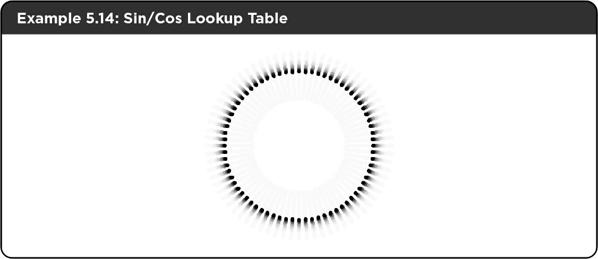

示例 5.14 中的代码通过引入查找表精度的变量，增强了初始代码片段，使其能够以小于 1 度的增量存储值。

##### **不要创建成千上万不必要的 p5.Vector 对象**

在任何草图中，你创建的每个对象都会占用计算机内存的空间。对于少量对象，这可能不会构成问题，但当草图生成大量对象时，尤其是在循环或时间推移中，可能会影响性能。有时，事实证明并非所有的对象都是必需的。

我必须承认，当涉及到创建过多对象时，我可能是最大的罪魁祸首。为了编写清晰易懂的示例，我经常在完全不需要的情况下创建额外的`p5.Vector`对象。大多数情况下，这根本不是问题。但有时它可能会成为问题。看看这个例子：

```
function draw() {
  for (let v of vehicles) {
    let mouse = createVector(mouseX, mouseY);
    v.seek(mouse);
  }
}
```

假设`vehicles`数组包含 1,000 辆车。这意味着每次通过`draw()`时，我都会为鼠标的位置创建 1,000 个新的`p5.Vector`对象。在最近购买的任何标准笔记本或台式电脑上，这个草图很可能不会出现任何问题，运行也不会变慢。毕竟，现代计算机有大量的内存，JavaScript 能够处理创建和销毁大约 1,000 个临时对象的问题。

然而，如果对象的数量变得更大（而且它很可能会变大），几乎肯定会出现问题。因此，你应该寻找减少创建`p5.Vector`对象数量的方法。在这种情况下，这里有一个简单的解决方法：

```
function draw() {
  let mouse = createVector(mouseX, mouseY);
  for (let v of vehicles) {
    v.seek(mouse);
  }
}
```

现在，我只创建了一个向量，而不是 1,000 个。更好的是，我可以将这个向量变成一个全局变量，然后在`draw()`中仅通过`set()`赋值`x`和`y`：

```
let mouse;

function setup() {
  mouse = createVector();
}

function draw() {
  mouse.set(mouseX, mouseY);
  for (let v of vehicles) {
    v.seek(mouse);
  }
}
```

现在，在草图开始后，我再也不会创建新的`p5.Vector`对象；我只是使用同一个对象贯穿整个草图！

在本书的示例中，你会发现有很多机会可以减少临时对象的数量。（我告诉过你，我是个重大罪犯。）例如，以下是本章`seek()`方法中的一段代码：

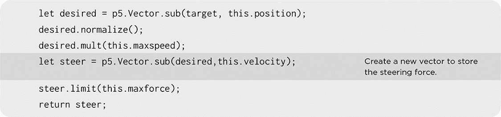

看看我是如何创建两个向量对象的？首先，我计算出所需的速度向量，然后是转向力。为了提高效率，我可以重写代码，仅创建一个向量：

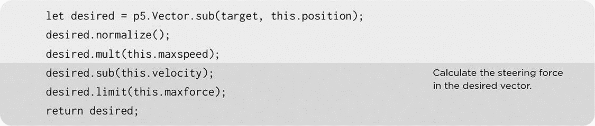

我其实不需要一个名为`steer`的第二个向量。我可以重用`desired`向量对象，并通过减去`velocity`将其转变为转向力。我在示例中没有这么做，因为这样会让代码变得更难阅读。但在某些情况下，像这样的改动可能会提高效率。

 **练习 5.21**

尽可能减少在群体行为示例中创建临时的`p5.Vector`对象。并且尽可能使用`magSq()`。

 **生态系统项目**

使用转向力来驱动你生态系统中生物的行为。以下是一些可能性：

+   创建生物的群体或鸟群。

+   使用寻求行为让生物寻找食物（对于追逐移动猎物，可以考虑*追击*）。

+   为生态系统环境使用流场。例如，如果生物生活在一条流动的河流中，你的系统将如何表现？

+   创建一个具有无数转向行为的生物（尽可能多地添加）。思考如何改变这些行为的权重，以便可以随时调节它们，灵活地混合和匹配。生物的初始权重是如何设置的？有哪些规则驱动权重随时间变化？

+   复杂系统可以是嵌套的。你能否设计出由一群鸟群组成的单个生物？然后你能否再让这些生物组成一群？

+   复杂系统可以具有记忆（并且具有适应性）。你的生态系统的历史是否会影响其当前状态下的行为？（这可能是生物如何调整其转向力权重的驱动力。）

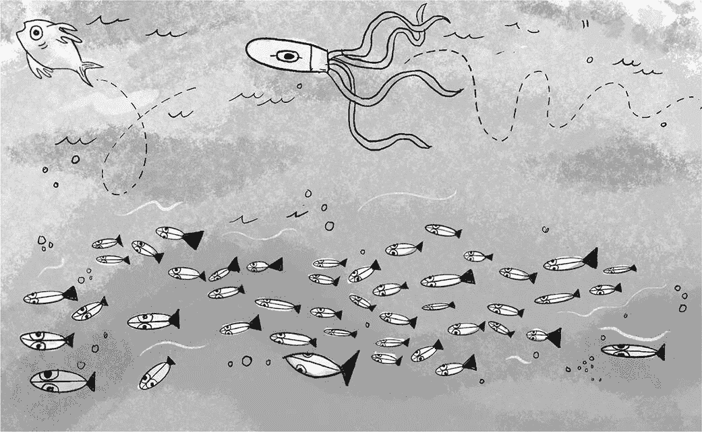
