## **6 个物理学库**

*图书馆意味着一种信念的行为，几代人依然在黑暗中隐藏，签署他们的夜晚，以见证黎明的到来。*

—维克多·雨果


**活根桥（照片由 Arshiya Urveeja Bose 提供）**

在印度梅加拉亚邦，卡西族和贾因提亚族生活在世界上降雨量最高的地区之一。在季风季节，洪水常常使得村庄之间的交通变得不可能。因此，建造活根桥的古老传统应运而生。这些桥梁，如这里展示的东卡西的双层活根桥，是通过引导和生长树根穿过竹子、棕榈树干或钢架搭建而成的。随着树根与环境的互动，它们不断生长并变得更强，形成适应性强、如弹簧般的连接。

想一想你在这本书中迄今为止所取得的成就。你已经完成了以下内容：

1.  学习了物理学中的一些概念（什么是向量？什么是力？什么是波动？）

1.  理解了这些概念背后的数学和算法

1.  使用面向对象的方法在 p5.js 中实现了这些算法，最终构建了自动导航代理的模拟

这些活动已经产生了一套运动模拟，允许你创造性地定义你所构建世界中的物理规律（无论是现实的还是幻想的）。但当然，你和我并不是第一个或唯一这样做的人。计算机图形学和编程的世界充满了为物理模拟提供的预编写代码库。

只要搜索一下 *开源物理引擎*，你可能会花上整天的时间去研究一堆丰富而复杂的代码库。这引出了一个问题：如果现有的代码库已经处理了物理模拟，为什么你还要费心学习如何自己编写这些算法呢？这就是本书背后哲学思想的体现。虽然许多库提供了现成的物理效果供你实验（而且这些物理效果超级棒、复杂且强大），但在深入使用这些库之前，学习基础知识有几个充分的理由。

首先，如果不理解向量、力和三角学的知识，仅仅阅读库的文档就容易迷失方向，更不用说使用它了。其次，尽管库可能会处理幕后的一些数学运算，但它并不一定会简化你的代码。在理解库如何工作以及它对你的代码有何期望方面，可能需要大量的额外努力。最后，尽管物理引擎可能非常棒，但如果你深入内心，你可能会发现你希望创造的是突破想象力极限的世界和可视化。库可能很棒，但它只提供有限的功能集。重要的是，要知道何时在追求创意编程项目的过程中，接受这些限制，何时这些限制将变得束缚你。

本章将重点介绍两个 JavaScript 开源物理库：Matter.js (*[`brm.io/matter-js`](https://brm.io/matter-js)*) 和 Toxiclibs.js (*[`haptic-data.com/toxiclibsjs`](http://haptic-data.com/toxiclibsjs)*). 我并不是暗示这些是你在任何和所有需要物理引擎的创意编程项目中唯一应该使用的库（有关其他替代库，请参见第 290 页的“其他物理库”，并查看本书网站上的例子，看看如何将本章的示例移植到其他库中）。然而，这两个库与 p5.js 很好地集成，并且将使我能够展示物理引擎的基本概念以及它们如何与我迄今为止介绍的内容相关联和相互补充。

最终，本章的目的不是教你某个具体物理库的细节，而是为你提供一个使用*任何*物理库的基础。你在这里获得的技能将使你能够浏览和理解文档，为你打开通向使用任何库的能力的大门。

### **为什么使用物理库？**

我已经提出了编写你自己物理仿真的理由（正如你在前几章中学到的那样），但是为什么要使用物理库呢？毕竟，将任何外部框架或库添加到项目中会引入复杂性和额外的代码。额外的开销值得吗？例如，如果你只是想模拟一个因为重力而下落的圆形物体，你真的需要导入一个完整的物理引擎并学习它的 API 吗？正如本书的前几章所展示的那样，可能并不需要。许多这样的场景足够简单，你完全可以通过自己编写代码来解决。

但请考虑另一个场景。如果你想要让 100 个圆形物体掉落呢？如果它们根本不是圆形，而是不规则形状的多边形呢？而且，如果你希望这些多边形在碰撞时能够以一种现实的方式互相反弹呢？

或许你已经注意到，虽然我详细介绍了运动和力量，但到目前为止，我却略过了物理模拟中一个相当重要的方面：**碰撞**。假设一下，你现在不是在阅读关于物理库的章节，而是我决定立即解释如何在粒子系统中处理碰撞。我必须讨论两种不同的算法来解决这些问题：

1.  如何确定两个形状是否发生碰撞（或相交）？这被称为**碰撞检测**。

1.  如何确定碰撞后形状的速度？这被称为**碰撞解决**。

如果你在处理简单的几何形状，第一个问题并不太难。事实上，也许你之前已经遇到过类似的情况。例如，对于两个圆来说，如果它们的中心之间的距离小于它们半径的和，你就知道它们是相交的（见图 6.1）。

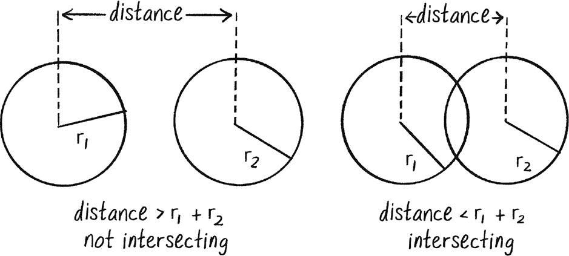

图 6.1：两个半径分别为 *r*[1] 和 *r*[2] 的圆，如果它们之间的距离小于 *r*[1] + *r*[2]，则它们发生碰撞。

这很简单，但是计算碰撞后圆的速度怎么样呢？这就是我要停止讨论的地方。为什么，你问？不是因为理解碰撞背后的数学不重要或没有价值。（事实上，我在网站上还包含了关于不使用物理库的碰撞的额外例子。）停止的原因是生命是短暂的！（这也是你考虑出去玩一会儿然后再坐下来写下一个草图的一个理由。）你不能指望掌握物理模拟的每一个细节。虽然你可能喜欢学习圆形碰撞的碰撞解决方案，但这只会让你想要处理下一个矩形。然后是奇怪形状的多边形。然后是曲面。然后是摆动的钟摆和弹簧的碰撞。然后，然后，然后……

将像碰撞这样的复杂特性纳入 p5.js 的草图中，同时还有时间与朋友和家人在一起——这就是本章的原因。人们花了多年时间开发解决这类问题的解决方案，而像 Matter.js 和 Toxiclibs.js 这样美妙的 JavaScript 库就是这些努力的成果。至少现在你不需要重新发明“轮子”。

总之，如果你发现自己在描述一个 p5.js 草图的想法时，提到了“碰撞”这个词，那么现在可能是时候学习使用物理引擎了。

 **其他物理库**

还有许多其他物理库值得与本章的两个案例一起探索，每个库都有独特的优势，可能在某些类型的项目中提供优势。事实上，当我刚开始写这本书时，Matter.js 还不存在，因此我最初用来展示示例的物理引擎是 Box2D。它曾是（并且可能仍然是）最著名的物理引擎。

Box2D (*[`box2d.org`](https://box2d.org)*) 最初是由 Erin Catto 为 2006 年的游戏开发者大会编写的一系列 C++物理教程。自那时以来，Box2D 已经发展成一个丰富且复杂的开源物理引擎。它已被用于无数项目中，最著名的包括获奖游戏*Crayon Physics*和风靡一时的*Angry Birds*。

Box2D 的一个重要特性是它是一个真正的物理引擎：它对计算机图形和像素世界一无所知，而是以真实世界的单位进行所有的测量和计算，如米、千克和秒。它的“世界”（Box2D 中的一个关键术语）是一个具有上下左右边界的二维平面。你告诉它诸如“世界的重力是每千克 9.81 牛顿，半径为 4 米、质量为 50 千克的圆形物体位于距离世界底部 10 米的地方。” Box2D 然后会告诉你“1 秒钟后，矩形距离底部 5 米；2 秒钟后，它距离底部 10 米。”依此类推。

虽然这提供了一个极其准确和强大的物理引擎（一个对 C++项目高度优化且快速的引擎），但它也需要大量复杂的代码来在 Box2D 的物理世界与你想绘制的世界——即图形画布的像素世界——之间进行转换。这对程序员来说是一个巨大的负担。我将尽力继续为本书维护一组与 Box2D 兼容的示例（有几个 JavaScript 移植版本），但我相信，使用像 Matter.js 这样的库，它本土支持 JavaScript 并使用像素作为度量单位，将为我 p5.js 示例提供一个更直观、更友好的桥梁。

另一个值得注意的库是 p5play (*[`p5play.org`](https://p5play.org)*)，这是由 Paolo Pedercini 发起、目前由 Quinton Ashley 领导的项目，专门为游戏开发设计。它简化了视觉对象——即精灵（sprites）的创建，并管理它们之间的交互（即碰撞和重叠）。正如你从名称中可能猜到的，p5play 被量身定制以便与 p5.js 无缝配合使用。它在底层使用 Box2D 进行物理模拟。

### **导入 Matter.js 库**

稍后，我将开始使用由 Liam Brummitt 于 2014 年创建的 Matter.js。不过，在你可以在 p5.js 项目中使用外部 JavaScript 库之前，你需要先将它导入到你的草图中。正如你已经非常清楚的那样，我正在使用官方的 p5.js 网页编辑器来开发和分享本书的代码示例。添加库的最简单方法是编辑每个新创建的 p5.js 草图中的*index.html*文件。

为此，首先展开编辑器左侧的文件导航栏，并选择*index.html*，如图 6.2 所示。

该文件包含一系列位于 HTML 标签`<head>`和`</head>`之间的`<script>`标签。这是如何在 p5.js 草图中引用 JavaScript 库的方式。它与在页面的`<body>`中包含`sketch.js`或`particle.js`没有什么不同，只是在这里，我们通过内容分发网络（**CDN**）的 URL 引用库，而不是保存和编辑 JavaScript 代码的副本。这是一种用于托管文件的服务器类型。对于那些在成千上万的网页中使用并被数百万用户访问的 JavaScript 库，CDN 必须非常擅长提供这些库。


图 6.2：访问草图的*index.html*文件

你应该已经看到一个引用 p5.js CDN 的`<script>`标签（当你阅读本文时，它可能是更新版本）：

```
<script src="https://cdnjs.cloudflare.com/ajax/libs/p5.js/1.9.0/p5.js"></script>
```

要使用 Matter.js，请在 p5 的`<script>`标签下面再添加一个引用其 CDN 的`<script>`标签：

```
<script src="https://cdnjs.cloudflare.com/ajax/libs/p5.js/1.9.0/p5.js"></script>
<script src="https://cdnjs.cloudflare.com/ajax/libs/matter-js/0.19.0/matter.min.js"></script>
```

在写这篇文章时，Matter.js 的最新版本是`0.19.0`，我在这个代码片段中引用的就是这个版本。随着 Matter.js 的更新和新版本的发布，通常升级是个好主意，但通过引用一个特定的版本（你知道它与你的草图兼容），你就不必担心库的新特性会破坏你现有的代码。

### **Matter.js 概述**

当你在 p5.js 中使用 Matter.js（或任何物理引擎）时，你的代码看起来会有些不同。以下是第一章到第五章所有示例的伪代码概括：

setup()

1.  创建世界中的所有物体。

draw()

1.  计算世界中的所有力。

1.  对物体应用所有的力（*F* = *M* × *A*）。

1.  根据物体的加速度更新它们的位置。

1.  绘制所有物体。

相比之下，以下是一个 Matter.js 示例的伪代码：

setup()

1.  创建世界中的所有物体。

draw()

1.  绘制所有物体。

当然，这就是物理引擎的魅力所在。我已经消除了所有那些根据速度和加速度来计算物体如何运动的痛苦步骤。Matter.js 将为我处理这一切！

虽然还会有更多的细节揭示，但好消息是，这段伪代码的简单性准确反映了整个过程。从这个意义上来说，Matter.js 有点像一个魔法盒子。在`setup()`中，我将对 Matter 说：“你好，这里是我在世界中想要的所有东西。”然后，在`draw()`中，我将礼貌地对 Matter 说：“哦，又见面了。如果不麻烦的话，我想把这些东西画出来。能告诉我它们在哪里吗？”

坏消息是：这个过程并不像伪代码所暗示的那样简单。实际上，创建进入 Matter.js 世界的东西需要几个步骤，这些步骤与构建和配置不同种类的形状有关。

学会使用 Matter.js 的语言配置世界中各种力和其他参数也是必要的。以下是核心概念：

+   **引擎：** 管理物理模拟本身的实体。引擎持有模拟世界以及各种表示世界如何随着时间推移更新的属性。

+   **物体：** 世界中的主要元素，对应于正在被模拟的物理对象。物体有位置和速度。听起来很熟悉吧？它基本上是我在第一章到第五章中一直在构建的类的另一种版本。它还具有定义形状的几何属性。需要注意的是，*物体*是物理引擎用来描述世界中*事物*的通用术语（类似于*粒子*这个术语）；它与拟人化的身体无关。

+   **复合体：** 一个容器，允许创建复杂的实体（由多个物体组成）。世界本身就是一个复合体的例子，且每个创建的物体都必须被添加到世界中。

+   **约束：** 作为物体之间的连接。

在接下来的章节中，我将详细介绍这些元素，并在此过程中构建几个示例。但首先，还有一个重要的元素需要简要讨论：

+   **向量：** 使用 x 和 y 分量描述一个具有大小和方向的实体，定义在 Matter.js 世界中的位置、速度和力。

这把我们带到了一个重要的交叉点。任何物理库的基础都是向量，取决于你如何看待，它可以是好事也可以是坏事。好的一面是，你刚刚花了好几章时间熟悉如何用向量描述运动和力，因此在概念上你不需要学习新的内容。坏的一面——让我眼中掉下了一滴泪——是，一旦你跨越了进入物理库的这道门槛，你就不再能使用`p5.Vector`了。

很高兴 p5.js 有内建的向量表示，但每次你使用物理库时，你很可能会发现它包括了自己独立的向量实现，设计上特别兼容库的其他代码。这是有道理的。毕竟，为什么 Matter.js 应该了解`p5.Vector`对象呢？

这一切的结果是，虽然你不需要学习任何新的概念，但你确实需要习惯新的命名约定和语法。为了说明这一点，我将展示一些现在已熟悉的`p5.Vector`操作，以及等效的`Matter.Vector`代码。首先，如何创建一个向量？

| **p5.js** | **Matter.js** |
| --- | --- |

|

```
let v = createVector(1, -1);
```

|

```
let v = Matter.Vector.create(1, -1);
```

|

那么，两个向量相加怎么办？

| **p5.js** | **Matter.js** |
| --- | --- |

|

```
let a = createVector(1, -1);
let b = createVector(3, 4);
a.add(b);
```

|

```
let a = Matter.Vector.create(1, -1);
let b = Matter.Vector.create(3, 4);
Matter.Vector.add(a, b, a);
```

|

这会用结果覆盖向量`a`。以下是如何将结果放入一个单独向量的方法：

| **p5.js** | **Matter.js** |
| --- | --- |

|

```
let a = createVector(1, -1);
let b = createVector(3, 4);
let c = p5.Vector.add(a, b);
```

|

```
let a = Matter.Vector.create(1, -1);
let b = Matter.Vector.create(3, 4);
let c = Matter.Vector.add(a, b);
```

|

如果你想缩放向量（乘以标量值）怎么办？

| **p5.js** | **Matter.js** |
| --- | --- |

|

```
let v = createVector(1, -1);
v.mult(4);
```

|

```
let v = Matter.Vector.create(1, -1);
v = Matter.Vector.mult(v, 4);
```

|

大小和归一化？

| **p5.js** | **Matter.js** |
| --- | --- |

|

```
let v = createVector(3, 4);
let m = v.mag();
v.normalize();
```

|

```
let v = Matter.Vector.create(3, 4);
let m = Matter.Vector.magnitude(v);
v = Matter.Vector.normalise(v);
```

|

正如你所看到的，概念是相同的，但代码的具体实现不同。首先，每个方法名称前面现在都加上了`Matter.Vector`，这定义了源代码的**命名空间**。这在 JavaScript 库中很常见；p5.js 与其他库不同，它没有始终如一地使用命名空间。例如，在 p5.js 中画一个圆，你调用`circle()`而不是`p5.circle()`。`circle()`函数位于全局命名空间中。我认为这是 p5.js 在易用性和对初学者友好的方面的一个特点。然而，这也意味着在使用 p5.js 编写的任何代码中，你不能使用`circle`作为变量名。为库使用命名空间可以防止这类错误和命名冲突，这也是为什么你会看到 Matter.js 中的所有内容都带有`Matter`前缀的原因。

此外，与 p5.js 中的静态和非静态版本的向量方法如`add()`和`mult()`不同，Matter.js 中的所有向量方法都是静态的。如果你想在操作`Matter.Vector`时更改它，可以将其作为可选参数添加：`Matter.Vector.add(a, b, a)`将`a`和`b`相加并将结果放入`a`（第三个参数）。你也可以将一个现有的变量设置为由计算结果生成的新向量对象，像这样`v = Matter.Vector.mult(v, 2)`。然而，这个版本仍然会在内存中创建一个新向量，而不是更新旧的向量。

在本章中我会介绍更多关于`Matter.Vector`的基础知识，但如果你需要详细信息，可以在 Matter.js 的官方网站上找到完整文档（* [`brm.io/matter-js`](https://brm.io/matter-js) *）。

#### **引擎**

许多物理库都包含一个*world*对象来管理所有的内容。世界通常负责坐标空间，保持模拟中所有物体的列表，控制时间等。在 Matter.js 中，世界是在`Engine`对象内创建的，这是你物理世界和模拟的主要控制器：

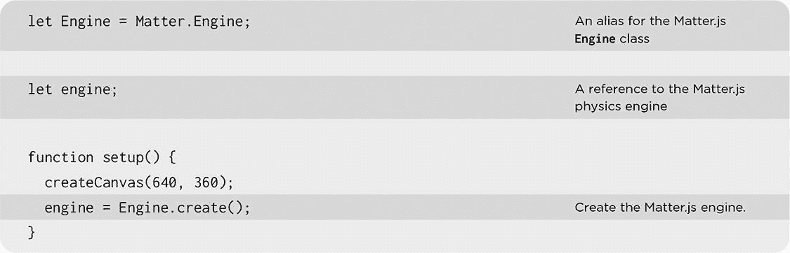

请注意，第一行代码创建了一个`Engine`变量，并将其设置为`Matter.Engine`。在这里，我决定将单个关键字`Engine`指向 Matter.js 中命名空间内的`Engine`类，以便让我的代码更加简洁。之所以这样做，是因为我知道后面不会再用到`Engine`这个词作为其他变量名，而且它也不会和 p5.js 中的某个东西冲突。在接下来的示例中，我还会对`Vector`、`Bodies`、`Composite`等进行类似的处理。（不过，虽然关联的源代码中会始终包括所有别名，但书中的文本不会每次都展示它们。）

当你在`Engine`上调用`create()`时，Matter.js 会返回一个新的物理引擎和世界，并赋予默认的重力——一个指向下方的(0, 1)向量。你可以通过访问`gravity`变量来改变这个默认值：

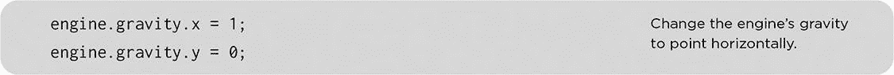

当然，重力不必在整个模拟过程中保持固定；你可以在程序运行时调整重力向量。你还可以通过将其设置为(0, 0)向量完全关闭重力。

 **对象解构**

**对象解构**是 JavaScript 中一种从对象中提取属性并将其赋值给变量的技术。在 Matter.js 中，`Matter`对象包含了`Engine`属性。通常，可以使用`let Engine = Matter.Engine`为这个属性设置别名，但使用解构后，可以更简洁地创建别名：

```
const { Engine } = Matter;
```

等一下，你注意到我偷偷用了一个`const`吗？我记得在第零章中说过，整本书中我只会使用`let`来声明变量。不过，使用外部库正是一个很好地尝试`const`的机会。在 JavaScript 中，`const`用于声明那些初始化后永远不应被重新赋值的变量。在这种情况下，我希望保护自己避免在代码后面不小心覆盖掉`Engine`变量，这样可能会把一切弄坏！

话说完了，接下来我们来看一下，当你需要为同一对象的多个属性创建别名时，解构语法是如何发挥作用的：

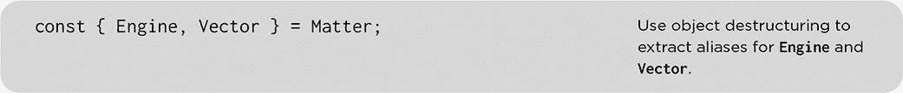

这行代码将`Engine`设置为`Matter.Engine`的别名，将`Vector`设置为`Matter.Vector`的别名，所有这些都在一个语句中完成。我将在本章的示例中使用这种技术。

一旦世界初始化完成，就该往里面放东西——物体！

#### **物体**

**物体**是 Matter.js 世界中的主要元素。它相当于我在之前章节中创建的`Vehicle`（前身为`Particle`，再前身为`Mover`）类——也就是在空间中移动并经历力的东西。物体也可以是静态的（固定的，不会移动）。

Matter.js 物体是通过在`Matter.Bodies`中找到的工厂方法创建的，创建不同类型物体的方法也有所不同。**工厂方法**是创建对象的函数。虽然你可能更熟悉使用构造函数来创建对象——例如，使用`new Particle()`——但你之前也见过工厂方法：`createVector()`是一个创建`p5.Vector`对象的工厂方法。无论一个对象是通过构造函数还是工厂方法创建，都是库作者的风格和设计选择问题。

创建物体的所有工厂方法都可以在`Matter.Bodies`文档页面中找到（*[`brm.io/matter-js/docs/classes/Bodies.html`](https://brm.io/matter-js/docs/classes/Bodies.html)*）。我将从`rectangle()`方法开始：

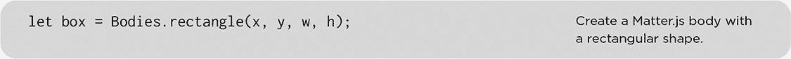

真幸运！`rectangle()`方法的签名与 p5.js 的`rect()`函数完全相同。然而，在这个例子中，该方法不是*绘制*一个矩形，而是为`Body`对象构建几何形状来存储。（注意，调用`Bodies.rectangle()`只有在你首先将`Bodies`作为`Matter.Bodies`的别名时才有效。）

一个物体现在已经被创建，并具有一个位置和大小，并且对它的引用存储在变量`box`中。然而，物体还有许多其他影响其运动的属性。例如，密度最终决定了物体的质量。摩擦力和恢复力（弹性）影响物体与其他物体接触时的相互作用。对于大多数情况，默认值已经足够，但 Matter.js 确实允许你通过向工厂方法传递额外的参数来指定这些属性，这些参数的形式是一个 JavaScript**对象字面量**，它是由逗号分隔并被花括号括起来的键值对集合：


对象字面量中的每个键（例如，`friction`）作为一个唯一的标识符，而它的值（`0.5`）是与该键相关的数据。你可以将对象字面量看作一个简单的字典或查找表——在这个例子中，它保存了用于创建新 Matter.js 物体的设置。请注意，虽然`options`参数对于配置物体非常有用，但其他初始条件，例如线性或角速度，可以通过`Matter.Body`类的静态方法来设置：

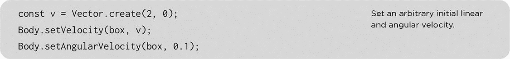

创建一个物体并将其存储在变量中并不足够。任何物体必须显式地添加到世界中，才能通过物理模拟。物理世界是一个名为`world`的`Composite`对象，存储在`engine`内部。可以通过静态的`add()`方法将`box`添加到这个世界中：


这个额外的步骤很容易被忘记——这是我无数次犯过的错误。如果你曾经想知道为什么你的物体没有出现或者没有随着世界物理的变化而移动，记得检查你是否已经将它添加到世界中了！

 **练习 6.1**

了解了目前关于 Matter.js 的知识后，请填写以下代码中的空白部分，以展示如何创建一个圆形物体：

```
let options = {
  friction: 0.5,    
  restitution: 0.8,
};
let ball = Bodies.circle(x, y, radius, options);
```

#### **Render**

一旦一个物体被添加到世界中，Matter.js 将始终知道它的存在，检查它是否发生碰撞，并根据环境中的任何力更新它的位置。所有这些都不需要你动一根手指！但你怎么画出这个物体呢？

在下一部分，我将向你展示如何查询 Matter.js 中各种物体的位置，以便用 p5.js 渲染世界。这种方法对于能够控制你自己的动画外观至关重要。这是你大展拳脚的时候：你可以成为你世界的设计师，利用你的创造力和 p5.js 技能来可视化物体，同时礼貌地让 Matter.js 在后台计算所有物理。

也就是说，Matter.js 确实包括一个非常简单直观的`Render`类，这对于快速查看和调试你设计的世界非常有用。它提供了自定义*调试绘图*样式的方法，但我发现默认设置足以快速检查我是否正确配置了世界。

第一步是调用`Matter.Render.create()`（或者如果用了别名则是`Render.create()`）。这个方法需要一个包含渲染器所需设置的对象，我将其称为`params`。

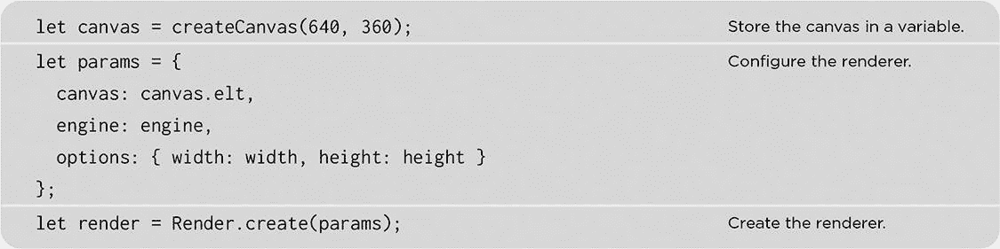

请注意，我将 p5.js 画布的引用存储在`canvas`变量中。这是必要的，因为我需要告诉渲染器在特定的画布上绘制。Matter.js 并不知道 p5.js，所以它所分配的画布是一个原生的 HTML5 画布，存储在 p5.js 画布对象的`elt`属性中。引擎是我之前创建的`engine`。Matter.js 的默认画布尺寸为 800×600，如果我希望使用不同的尺寸，我需要配置一个包含`width`和`height`的`options`属性。

一旦我有了`render`对象，我需要告诉 Matter.js 去运行它：


还有一个重要的步骤：物理引擎必须被告知在时间上向前推进。由于我使用的是内置渲染器，我还可以使用内置的运行器，它以每秒 60 帧的默认帧率运行引擎。运行器也是可以自定义的，但由于目标是在接下来的部分中改用 p5.js 的 `draw()` 循环（将在下一节介绍），所以这些细节并不那么重要：


这是完整的 Matter.js 代码，其中新增了一个 `ground` 对象——另一个矩形物体。注意在创建地面物体时使用了 `{ isStatic: true }` 选项，以确保它保持在固定位置。关于静态物体的更多细节，我将在第 307 页的《静态 Matter.js 物体》一节中介绍。

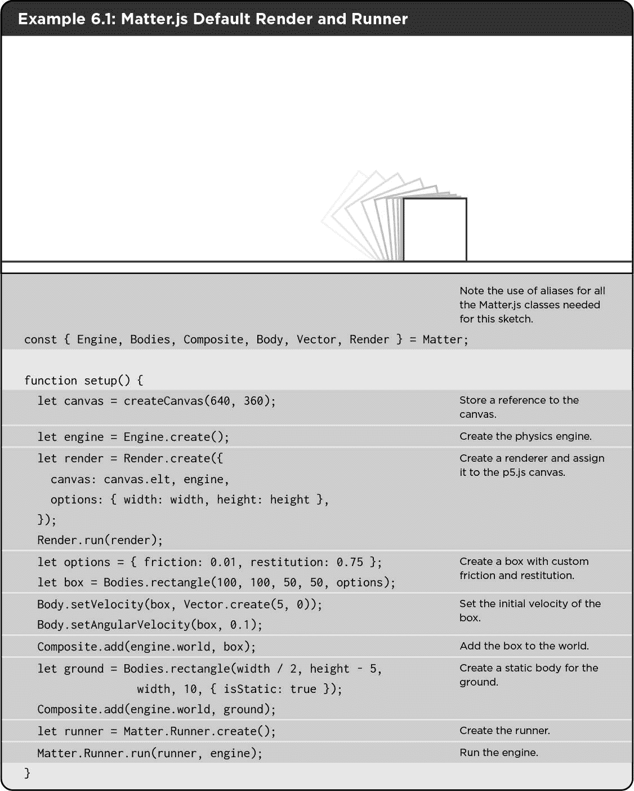

这里没有 `draw()` 函数，所有变量都在 `setup()` 中是局部的。实际上，我并没有使用任何 p5.js 的功能（除了将画布注入到页面中）。这正是我接下来要解决的问题！

### **Matter.js 与 p5.js**

Matter.js 会保持一个所有物体的列表，正如你刚才看到的，它可以通过 `Render` 和 `Runner` 对象来处理物体的绘制和动画。顺便提一下，这个列表存储在 `engine.world.bodies` 中。不过，我现在想展示的是一种技术，用于维护你自己的 Matter.js 物体列表，以便你可以使用 p5.js 来绘制它们。

是的，这种方法可能会增加冗余并牺牲一些效率，但它通过简便的使用和定制弥补了这一点。通过这种方法，你将能够像在 p5.js 中一样进行编码，跟踪哪些物体是哪个，并适当地绘制它们。请参阅图 6.3 中显示的草图文件结构。

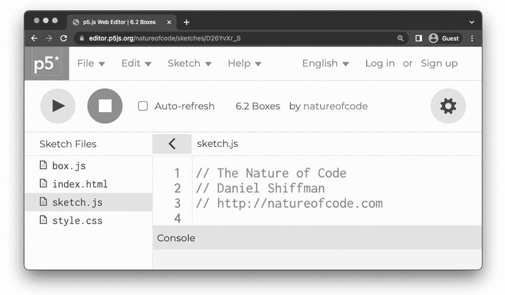

图 6.3：典型 p5.js 草图的文件结构

从结构上看，这看起来只是另一个 p5.js 草图。它包含一个主要的*sketch.js* 文件，还有 *box.js* 文件。这样的额外文件通常是用来声明草图中需要的类——在这个例子中，是描述世界中矩形物体的 `Box` 类：

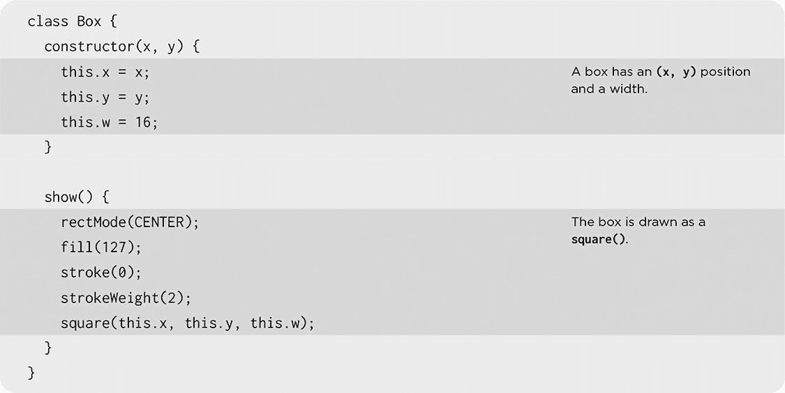

现在，我将编写一个 *sketch.js* 文件，每当点击鼠标时创建一个新的 `Box` 并将所有 `Box` 对象存储在一个数组中。（这与我在第四章的粒子系统示例中采用的方法相同。）

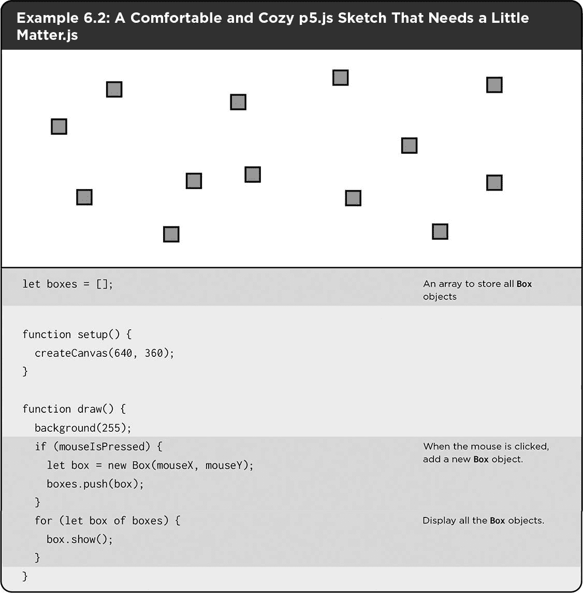

现在，这个草图会将固定的盒子绘制到屏幕上。挑战是：我如何才能绘制出那些一出现就会经历物理计算（由 Matter.js 计算）的盒子，同时尽量少修改代码？

为了实现这个目标，我需要三步。

#### **第 1 步：将 Matter.js 添加到 p5.js 草图中**

目前，草图中没有引用 Matter.js。这显然需要改变。幸运的是，这部分不算太难：我已经展示了构建 Matter.js 世界所需的所有元素。（别忘了，为了让这个工作正常进行，确保在*index.html*中导入了这个库。）

首先，我需要为必要的 Matter.js 类添加别名，并在`setup()`中创建一个`Engine`对象：

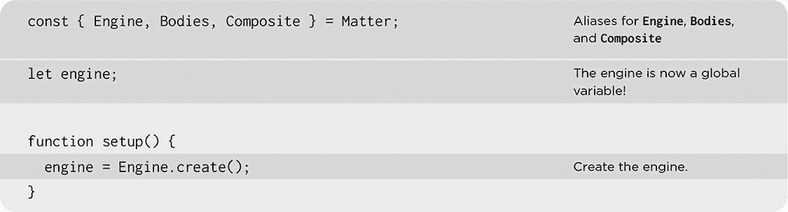

然后，在`draw()`中，我需要确保调用一个关键的 Matter.js 方法，`Engine.update()`：

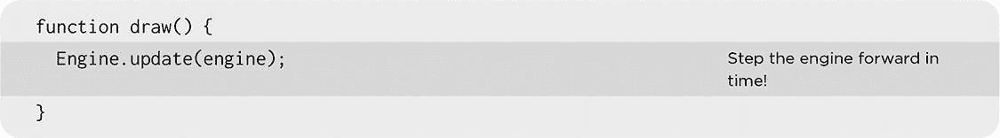

`Engine.update()`方法将物理世界推进一步。将其放在 p5.js 的`draw()`循环中调用，确保物理引擎在每一帧动画中都进行更新。这个机制取代了我在示例 6.1 中使用的内建 Matter.js `Runner`对象。现在`draw()`循环就是运行器！

在内部，当调用`Engine.update()`时，Matter.js 会遍历世界，查看其中的所有物体，并决定如何处理它们。仅仅调用`Engine.update()`会将世界按默认设置向前推进。然而，与`Render`一样，这些设置是可以自定义的，并在 Matter.js 文档中有所说明（* [`brm.io/matter-js/docs/classes/Engine.html#method_update`](https://brm.io/matter-js/docs/classes/Engine.html#method_update)*）。

#### **步骤 2：将每个 Box 对象与 Matter.js 物体链接**

我已经设置好了我的 Matter.js 世界；现在，我需要将每个`Box`对象在我的 p5.js 草图中与那个世界中的物体链接起来。原始的`Box`类包含位置和宽度的变量。我现在想说的是：“我在此放弃对这个对象位置的控制，交给 Matter.js。我不再需要跟踪任何与位置、速度或加速度相关的内容。相反，我只需要跟踪一个 Matter.js 物体的存在，并相信物理引擎会完成剩下的事情。”

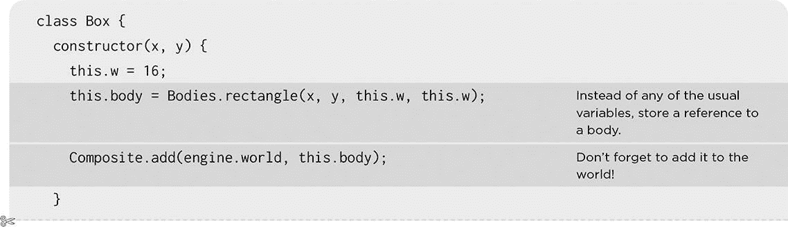

我不再需要`this.x`和`this.y`位置变量了。`Box`构造函数接收起始的 x 和 y 坐标，将它们传递给`Bodies.rectangle()`以创建一个新的 Matter.js 物体，然后忘记这些值。正如你将看到的，物体本身会在幕后跟踪其位置。物体理论上也可以跟踪其尺寸，但由于 Matter.js 将它们存储为一个顶点列表，因此在绘制方框时，保留方块的宽度在`this.w`变量中会更方便。

#### **步骤 3：绘制物体**

快完成了。在我将 Matter.js 引入草图之前，绘制`Box`是很简单的。该对象的位置存储在`this.x`和`this.y`变量中：

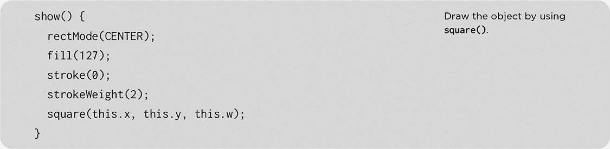

既然 Matter.js 管理物体的位置，我就不能再使用我自己的`x`和`y`变量来绘制该形状了。但别担心！`Box`对象有一个对 Matter.js 物体的引用，而该物体知道自己的位置。我所需要做的就是礼貌地问物体：“不好意思，请问你在哪里？”

```
let position = this.body.position;
```

然而，仅仅知道物体的位置是不够的。物体是一个方形，所以我还需要知道它的旋转角度：

```
let angle = this.body.angle;
```

一旦我得到了位置和角度，我就可以通过使用本地的 p5.js `translate()`、`rotate()`和`square()`函数来渲染该物体：

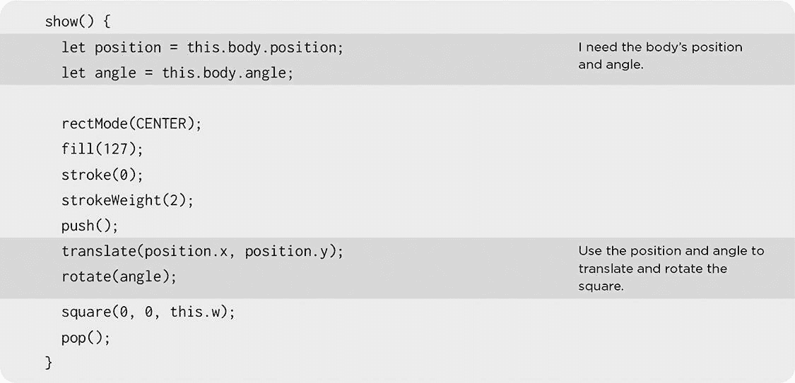

在这里需要注意的是，如果你从`boxes`数组中删除了一个`Box`对象——可能是因为它移动出了画布边界或达到了其生命周期的终点，如第四章中所示——你还必须显式地从 Matter.js 世界中移除与该`Box`对象关联的物体。这可以通过在`Box`类中使用`removeBody()`方法来完成：

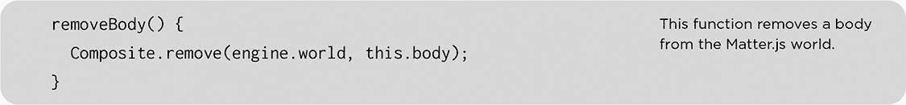

在`draw()`中，你将按逆序遍历数组，就像粒子系统示例那样，调用`removeBody()`和`splice()`，以便从 Matter.js 世界和你的盒子数组中删除该对象。

 **练习 6.2**

从示例 6.2 的代码开始，按照本章中概述的方法，添加代码以实现 Matter.js 物理。删除离开画布的物体。结果应该如下图所示。你可以在绘制盒子时发挥创意！

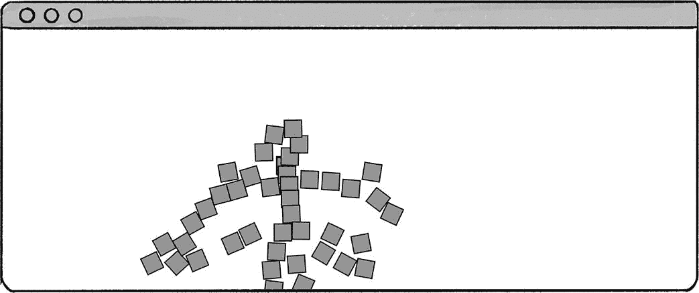

### **静态 Matter.js 物体**

在我刚刚创建的示例中，`Box`对象出现在鼠标位置，并因默认的重力作用而向下掉落。如果我想为世界添加不可移动的边界来阻挡下落的`Box`对象怎么办？Matter.js 通过`isStatic`属性使这一切变得简单：


我仍然是使用`Bodies.rectangle()`工厂方法创建物体，但设置`isStatic`属性确保该物体永远不会移动。我将在练习 6.2 的解决方案中加入此功能，创建一个单独的`Boundary`类，将 p5.js 矩形与静态 Matter.js 物体连接起来。为了增加变化，我还将随机化每个掉落盒子的尺寸。（请参阅在线代码，了解`Box`类的更改。）


静态物体不会包含如`恢复力`或`摩擦力`等物理属性。请确保在动态物体中设置这些属性。

### **多边形和形状组**

现在我已经演示了如何使用像矩形或圆形这样的基本形状与 Matter.js，假设你想创建一个更有趣的物体，比如图 6.4 中的抽象人物。

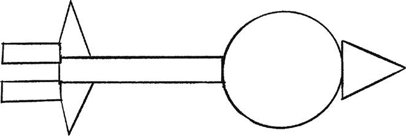

图 6.4：由多个形状组成的复合体

可以使用两种策略来制作这种复杂的形状。通用的`Bodies.polygon()`方法可以创建任何规则的多边形（如五边形、六边形等）。另外，`Bodies.trapezoid()`可以创建一个至少有一对平行边的四边形：

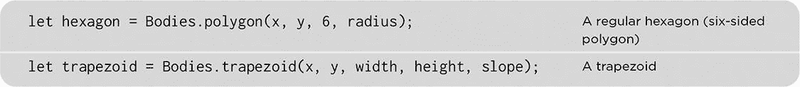

更通用的选项是`Bodies.fromVertices()`。它通过一个向量数组构建一个形状，将它们视为一系列连接的顶点。我将把这个逻辑封装在`CustomShape`类中。

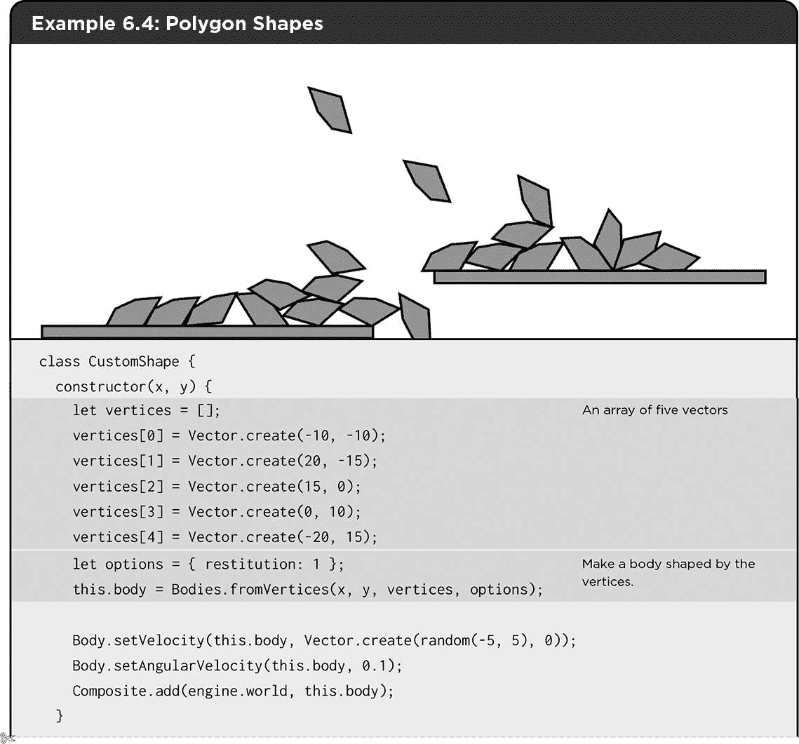

在 Matter.js 中创建自定义多边形时，你必须记住两个重要细节。首先，顶点必须按顺时针顺序指定。例如，图 6.5 展示了用来创建示例 6.4 中物体的五个顶点。注意，示例将它们按从左上角开始的顺时针顺序添加到`vertices`数组中。

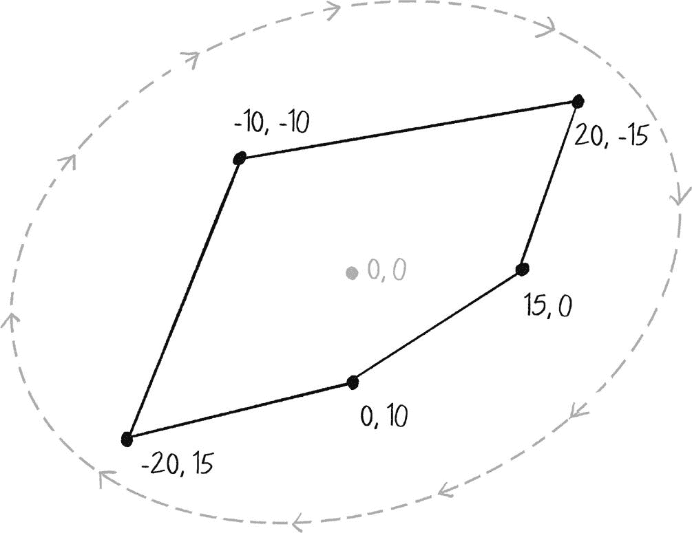

图 6.5：按顺时针顺序排列的自定义多边形顶点

其次，每个形状必须是凸形的，而不是凹形的。如图 6.6 所示，**凹形**的形状表面向内弯曲，而**凸形**则相反。每个凸形的内角必须小于或等于 180 度。Matter.js 可以处理凹形状，但你需要将它们由多个凸形状组成（稍后会详细介绍）。

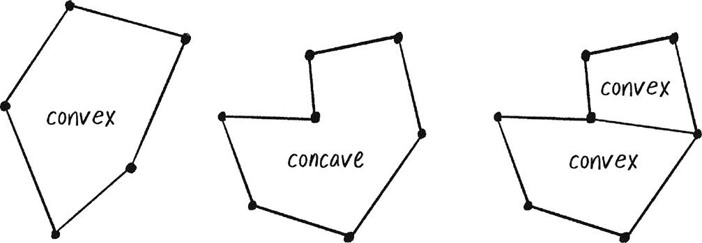

图 6.6：凹形状可以通过多个凸形状绘制。

由于形状是由自定义顶点构建的，所以在绘制物体时，你可以使用 p5.js 的`beginShape()`、`endShape()`和`vertex()`函数。`CustomShape`类*可以*包括一个数组，用于存储顶点的像素位置，相对于 (0, 0)，以便绘制。不过，最好是直接查询 Matter.js 来获取位置。这样，就不需要使用`translate()`或`rotate()`，因为 Matter.js 物体将顶点存储为绝对世界坐标：

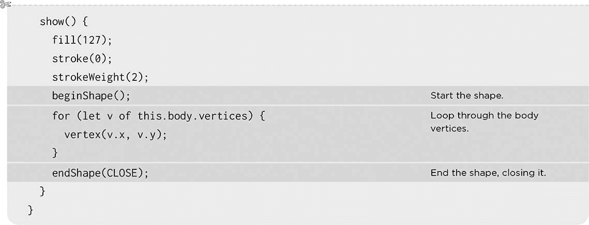

Matter.js 物体将其顶点位置数组存储在一个`vertices`属性中。注意，我可以使用`for...of`循环在`beginShape()`和`endShape()`之间遍历这些顶点。

 **练习 6.3**

使用`Bodies.fromVertices()`创建你自己的多边形设计（记住，它必须是凸形的）。这里展示了一些可能的形状。

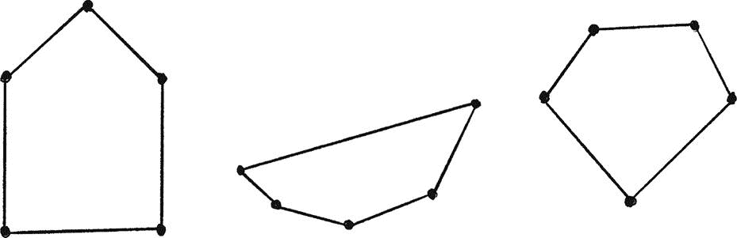

从一个顶点数组构建的自定义形状会让你走得很远。然而，凸形状的要求确实限制了可能性范围。好消息是，你可以通过创建由多个形状组成的**复合体**来消除这一限制！比如，使用一个细长的矩形和一个圆形在上面，做一个美味的棒棒糖怎么样？

我将首先创建两个独立的物体，一个矩形和一个圆形。然后，我可以通过将它们放入一个`parts`数组，并将该数组传递给`Body.create()`来将它们合并：

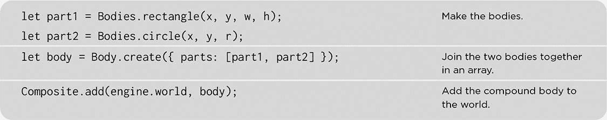

虽然通过组合两个形状创建了一个复合体，但代码并不完全正确。如果你运行它，你会发现两个形状都位于相同的(*x*, *y*)位置，正如图 6.7 所示。

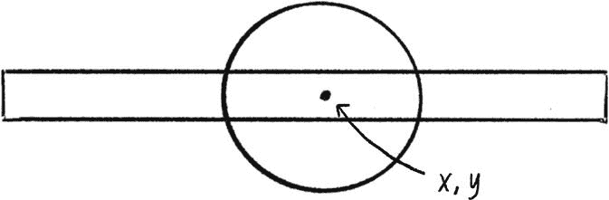

图 6.7：一个矩形和一个圆形具有相同的(*x*, *y*)参考点

相反，我需要将圆形的中心在水平方向上从矩形的中心偏移，如图 6.8 所示。

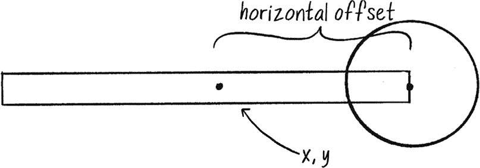

图 6.8：一个相对于矩形水平偏移的圆形

我将使用矩形宽度的一半作为偏移量，这样圆形就会被居中在矩形的边缘：

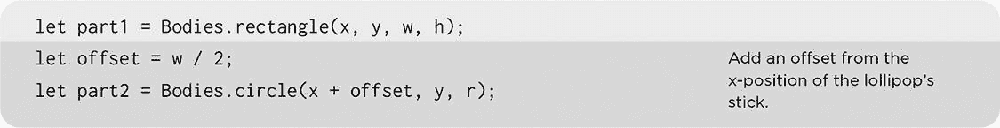

由于棒棒糖的身体有两个部分，绘制它稍微复杂一点。我可以采用多种方法。例如，我可以使用物体的`vertices`数组，将棒棒糖绘制为一个自定义形状，就像示例 6.4 一样。（每个物体都会存储一个顶点数组，即使它不是通过`fromVertices()`方法创建的。）然而，由于棒棒糖的每个部分都是原始形状，我更倾向于分别平移到每个部分的位置，并按照整体物体的角度进行旋转。

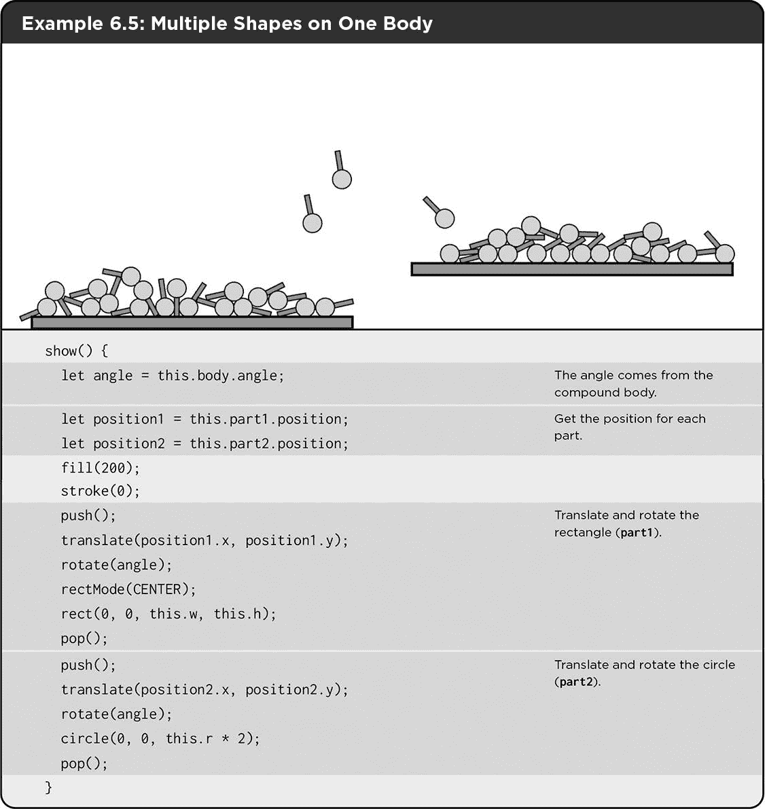

在继续之前，我想强调的是，单纯通过创建 Matter.js 物体并不会让你在画布窗口中绘制的内容自动表现出完美的物理效果。本章中的示例之所以有效，是因为我小心地匹配了每个 p5.js 物体的绘制方式与我为每个 Matter.js 物体定义的几何形状。如果你不小心以不同的方式绘制了一个形状，你不会收到错误提示——无论是来自 p5.js 还是 Matter.js。不过，你的画面看起来会很奇怪，物理效果也会不正常，因为你看到的世界与 Matter.js 理解的世界不一致。

为了说明这一点，让我回到示例 6.5。一个棒棒糖是由两个部分组成的复合体，一个矩形（`this.part1`）和一个圆形（`this.part2`）。我一直是通过分别获取两个部分的位置来绘制每个棒棒糖：`this.part1.position`和`this.part2.position`。然而，整体复合体也有一个位置，`this.body.position`。使用这个位置来绘制矩形，并手动计算圆形的位置并使用偏移量，看起来很诱人。毕竟，这就是我最初设想复合形状的方式（回顾图 6.8）：

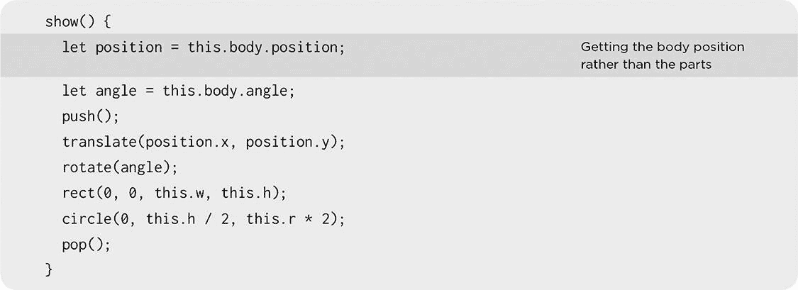

图 6.9 展示了这一变化的结果。

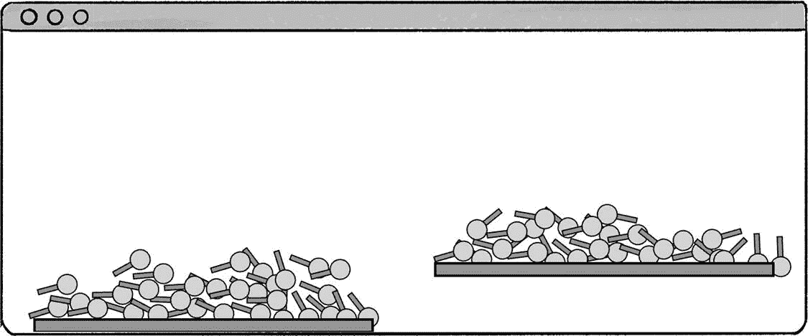

图 6.9：当形状与它们在 Matter.js 中的配置不同绘制时会发生什么

乍一看，这个新版本可能看起来没问题，但如果仔细观察，碰撞就会出现偏差，形状也会以奇怪的方式重叠。这并不是物理引擎出了问题，而是我没有在 p5.js 和 Matter.js 之间正确地进行通信。事实证明，物体的整体位置不是矩形的中心，而是矩形与圆形之间的质心。Matter.js 正在像以前一样计算物理和管理碰撞，但我把每个物体绘制在了错误的位置！（在在线版本中，你可以通过点击鼠标切换正确和错误的渲染效果。）

 **练习 6.4**

通过使用多个附加到单一物体的形状，制作你自己的小外星生物。记住，你不仅限于在 p5.js 中使用基本的形状绘制功能；你还可以使用图片和颜色，添加用线条表示的头发等。把 Matter.js 的形状想象成你原创幻想设计的骨架！

### **Matter.js 约束**

Matter.js 的**约束**是将一个物体与另一个物体连接的机制，用于模拟摆动的钟摆、弹性桥梁、软体角色、在轴上旋转的车轮等。约束有三种类型：距离约束和转动约束，都通过`Constraint`类进行管理；以及鼠标约束，通过`MouseConstraint`类进行管理。

#### **距离约束**

**距离约束**是两个物体之间的固定长度连接，类似于第三章中连接两个形状的弹簧力。约束附加在每个物体的**锚点**上，锚点是相对于物体中心的位置（见图 6.10）。根据约束的刚度特性，“固定”长度可能会有所变化，就像弹簧可以更硬或更软一样。

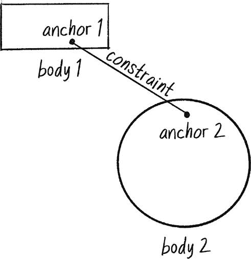

图 6.10：约束是两个物体之间的连接，每个物体都有一个锚点。

定义一个约束的方法与创建物体类似，只不过你需要准备好两个物体。假设两个`Particle`对象分别在一个名为`body`的属性中存储着指向 Matter.js 物体的引用。我将它们称为`particleA`和`particleB`：

```
let particleA = new Particle();
let particleB = new Particle();
```

我想在这些粒子之间创建一个约束。为此，我需要定义一系列选项来决定约束的行为：

+   `bodyA`：约束连接的第一个物体，建立约束的一端。

+   `bodyB`：约束连接的第二个物体，形成另一端。

+   `pointA`：约束附加在第一个物体上的位置，相对于`bodyA`。

+   `pointB`：约束附加在第二个物体上的位置，相对于`bodyB`。

+   `length`：约束的静止或目标长度。约束会在仿真过程中尽力保持这个长度。

+   `stiffness`：一个从 0 到 1 的值，表示约束的刚性，1 为完全刚性，0 为完全柔软。

这些设置会打包成一个对象字面量：

```
let options = {
  bodyA: particleA.body,
  bodyB: particleB.body,
  pointA: Vector.create(0, 0),
  pointB: Vector.create(0, 0),
  length: 100,
  stiffness: 0.5
};
```

从技术上讲，唯一需要的选项是 `bodyA` 和 `bodyB`，即由约束连接的两个物体。如果你没有指定任何其他选项，Matter.js 会为其他属性选择默认值。例如，它会使用 `(0, 0)` 作为每个相对锚点（物体的中心），将 `length` 设置为两个物体之间的当前距离，并为 `stiffness` 赋默认值 `0.7`。还有两个我没有包括的重要选项是 `damping` 和 `angularStiffness`。`damping` 选项影响约束对运动的阻力，值越高，约束失去能量的速度越快。`angularStiffness` 选项控制约束的角运动刚性，值越高，物体之间的角度灵活性越小。

配置好选项后，就可以创建约束条件。像往常一样，这假定另一个别名——`Constraint` 等于 `Matter.Constraint`：

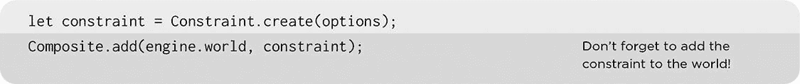

我可以在一个类中包含一个约束来封装和管理多个物体之间的关系。下面是一个代表摆锤摆动的类示例（模仿 示例 3.11 来自 第三章）。

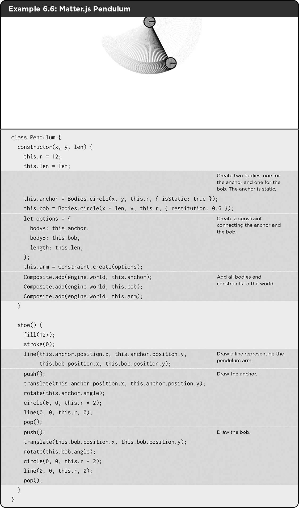

示例 6.6 使用默认的 `stiffness` 值 `0.7`。如果你尝试更低的值，摆锤会更像是一个软弹簧。

 **练习 6.5**

创建一个桥梁模拟，通过使用约束将一系列圆形（或矩形）连接起来，如下图所示。使用 `isStatic` 属性将端点固定在原地。尝试不同的值，使桥梁更加或不那么有弹性。关节没有物理几何形状，因此为了避免桥梁出现间隙，节点之间的间距非常重要。

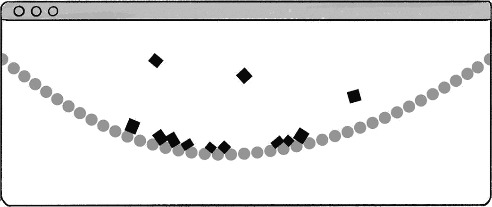

#### **转动约束**

另一种在物理引擎中常见的物体连接方式是 **转动关节**。这种类型的约束将两个物体连接在一个共同的锚点，也称为 **铰链**（见 图 6.11）。虽然 Matter.js 没有单独的转动约束，但你可以通过一个长度为 0 的常规 `Constraint` 来实现。这样，物体就可以围绕一个共同的锚点旋转。

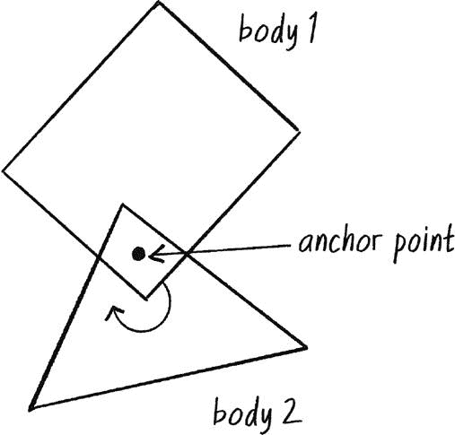

图 6.11：转动约束是两个物体在单一锚点或铰链处的连接。

第一步是创建连接的物体。以第一个例子为例，我想创建一个旋转的矩形（类似于螺旋桨或风车），并固定在某个位置。对于这种情况，我只需要一个物体连接到一个点。这简化了代码，因为我不必担心两个连接在铰链上的物体之间的碰撞。


接下来，我可以创建约束。设置`length`为`0`时，它需要一个`stiffness`为`1`；否则，约束可能不够稳定，无法将物体固定在锚点上：


将代码组合在一起，我将编写一个名为`Windmill`的类，表示一个旋转的物体。该草图还包括一个`Particle`类，用于将粒子投放到风车上。

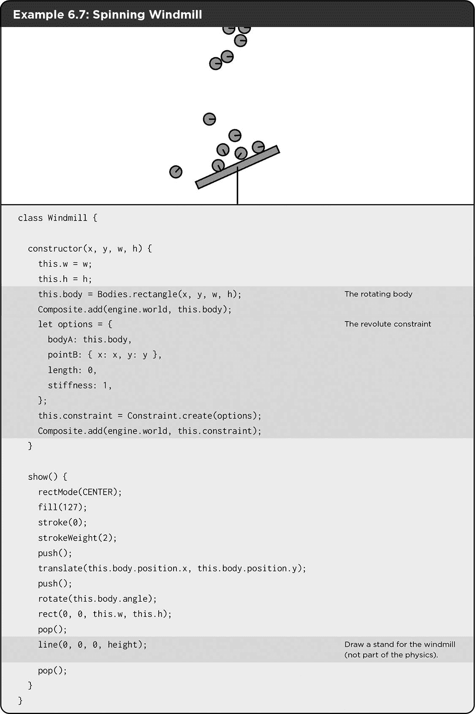

请注意这个例子中的线条，表示风车的支架。它不是 Matter.js 物理世界的一部分，我也从未为它创建物体。这说明了一个重要的概念：在与 p5.js 一同使用物理引擎时，你可以向画布添加元素，这些元素有助于视觉设计，但不会影响物理模拟，只要你不需要这些元素参与模拟本身。

 **练习 6.6**

创建一个具有转动关节的车辆，考虑车轮的大小和位置。改变`stiffness`属性如何影响它们的运动？

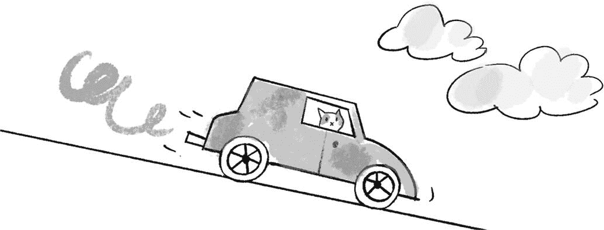

#### **鼠标约束**

在介绍`MouseConstraint`类之前，先考虑一个问题：如何将 Matter.js 中的物体位置设置为鼠标位置？更进一步，为什么需要一个约束呢？毕竟，你可以访问物体的位置，也可以访问鼠标的位置。那么，将一个位置赋值给另一个位置有什么问题呢？

```
body.position.x = mouseX;
body.position.y = mouseY;
```

虽然这段代码会移动物体，但它也会带来一个不幸的结果——破坏物理效果。想象一下，你已经建造了一台传送机，可以让你从卧室瞬间移动到厨房（对深夜小吃来说很有用）。这个场景很容易想象，但现在请重新编写牛顿的运动定律，来考虑瞬移的可能性。现在就不那么容易了，对吧？

Matter.js 也有同样的问题。如果你手动设置物体的位置，就像是在说：“瞬移这个物体”，然后 Matter.js 就不知道如何正确计算物理效果了。然而，Matter.js *确实*允许你在腰间绑上一根绳子，让你的朋友站在厨房里并把你拖过去。将你的朋友换成鼠标，那就是鼠标约束的原理。

想象一下，当你点击鼠标在一个形状上时，鼠标会通过一根绳子与那个物体连接。现在你可以移动鼠标，它会把物体一起拖动，直到你松开鼠标。这与转动关节类似，你可以将“绳子”的长度设置为 0，从而有效地用鼠标移动形状。

然而，在你能附加鼠标之前，你需要创建一个 Matter.js `Mouse`对象，它会监听与 p5.js 画布的鼠标交互：

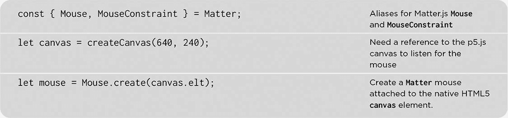

接下来，使用`mouse`对象创建一个`MouseConstraint`：

```
let mouseConstraint = MouseConstraint.create(engine, { mouse });
Composite.add(engine.world, mouseConstraint);
```

这将立即允许你通过鼠标与所有 Matter.js 物体进行交互。你不需要显式地将约束附加到特定的物体；你点击的任何物体都会被约束到鼠标上。

你还可以通过在传递给`MouseConstraint.create()`方法的选项中添加`constraint`属性，来配置所有常见的约束变量：

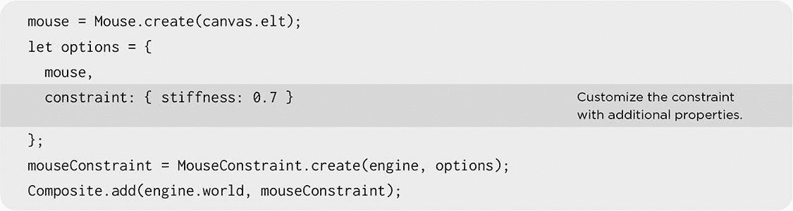

下面是一个示例，演示了一个包含两个`Box`物体的`MouseConstraint`。静态物体充当画布边界的墙壁。

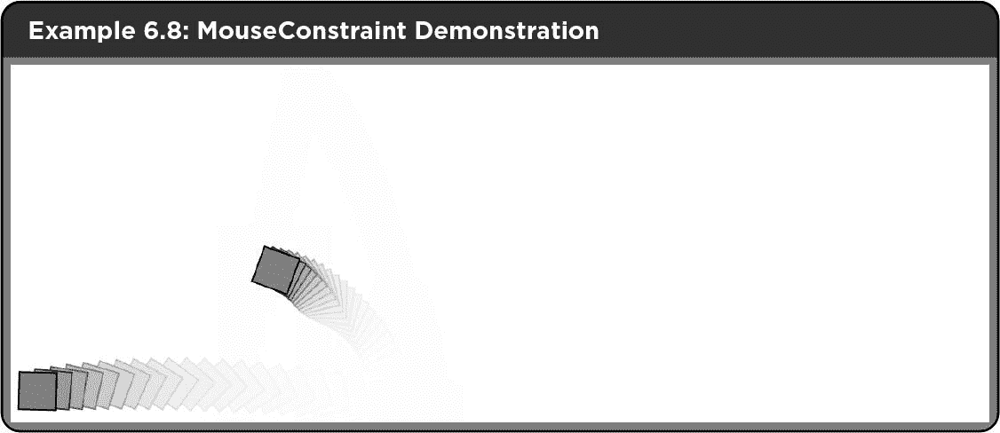

在这个例子中，你会看到约束的`stiffness`属性被设置为`0.7`，给虚拟的鼠标绳子增加了一些弹性。其他属性，如`angularStiffness`和`damping`，也可以影响鼠标的互动。如果你调整这些值会发生什么？

### **添加更多的力**

在第二章中，我介绍了如何构建一个具有多重力作用的环境。一个物体可能会受到重力、风力、空气阻力等的影响。显然，在 Matter.js 中，力正在起作用，矩形和圆形物体在屏幕上旋转和飞行！但是到目前为止，我只展示了如何操控单一的全局力：重力。

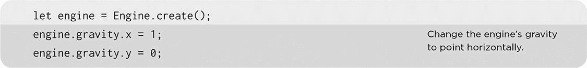

如果我想在 Matter.js 中使用第二章中的任何技术，我只需使用可靠的`applyForce()`方法，这个方法是我在`Mover`类中编写的。它接收一个向量，将其除以质量，并将其累加到移动物体的加速度中。在 Matter.js 中，存在相同的方法，因此我不再需要自己编写所有细节！我可以通过静态的`Body.applyForce()`来调用它。下面是现在在`Box`类中的实现：


在这里，`Box`类的`applyForce()`方法接收一个力向量，并将其传递给 Matter.js 的`applyForce()`方法，以将其应用到相应的物体上。与这种方法的关键区别在于，Matter.js 是一个比第二章中的示例更复杂的引擎。早期的示例假设力总是作用于驱动器的中心位置。在这里，我指定了力应用于物体的确切位置。在这个例子中，我像之前一样将力应用于物体的中心，通过询问物体的位置来实现，但这也可以进行调整——例如，施加在箱子边缘的力，使其像掷骰子一样旋转在画布上。

如何将力引入一个由 Matter.js 驱动的草图中？假设我想使用重力吸引力。还记得`Attractor`类中的示例 2.6 代码吗？

```
  attract(mover) {
    let force = p5.Vector.sub(this.position, mover.position);
    let distance = force.mag();
    distance = constrain(distance, 5, 25);
    let strength = (G * this.mass * mover.mass) / (distance * distance);
    force.setMag(strength);
    return force;
  }
```

我可以使用`Matter.Vector`重写完全相同的方法，并将其集成到一个新的`Attractor`类中。

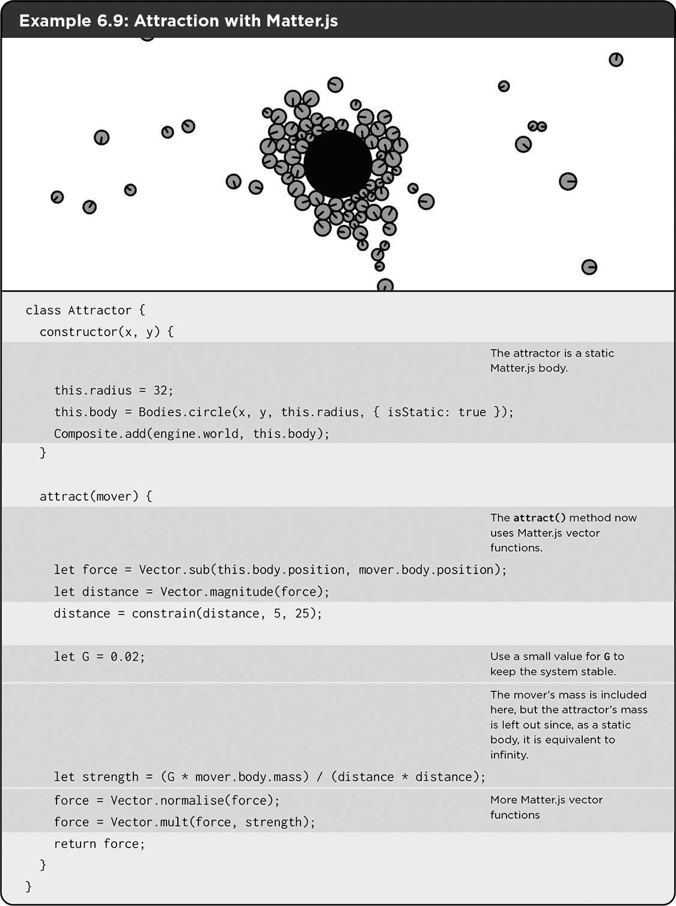

除了为示例 6.9 编写自定义的`attract()`方法外，还需要另外两个关键元素，才能使草图的行为更像第二章中的示例。首先，记住 Matter.js 的`Engine`有一个默认的向下重力。我需要在`setup()`中通过`(0, 0)`向量禁用它：

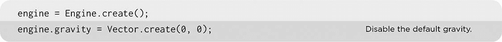

第二，Matter.js 中的物体默认具有空气阻力，会导致它们在移动时减速。我还需要将其设置为`0`，以模拟物体处于真空中的状态：

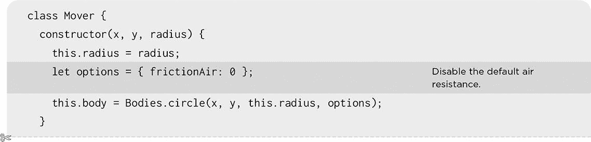

这是重新审视质量概念的好时机。虽然我在`attract()`方法中访问了与驱动器相关的物体的`mass`属性，但我从未显式地设置过它。在 Matter.js 中，物体的质量是根据其大小（面积）和密度自动计算的。因此，较大的物体会有更大的质量。为了增加质量相对于大小的比重，你可以尝试在`options`对象中设置`density`属性（默认值为`0.001`）。对于静态物体，例如引力源，质量被认为是无限的。这就是为什么引力源即使在驱动器不断撞击它时，仍然保持锁定位置。

 **练习 6.7**

将`Body.applyForce()`集成到新的`spin()`方法中，用于示例 6.7 的`Windmill`类，以模拟电动机持续旋转风车。

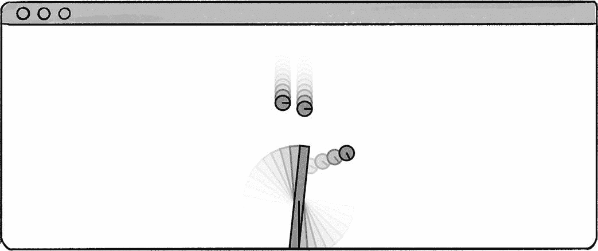

 **练习 6.8**

将第五章中的任何一个引导行为示例转换为 Matter.js。带有碰撞的群体行为看起来如何？

### **碰撞事件**

这本书的名字不是《Matter.js 的本质》，所以我不会涵盖 Matter.js 库的所有可能特性。到目前为止，我已经讲解了如何创建物体和约束，并展示了库的一些功能。通过你所获得的技能，希望在使用 Matter.js 的其他方面时，学习过程会变得不那么痛苦。然而，在继续之前，库的另一个值得介绍的功能是：碰撞事件。

你可能一直在想一个问题：“如果我希望在两个物体碰撞时发生一些额外的事情怎么办？我的意思是，不要误会我——我很高兴 Matter.js 在后台处理所有的碰撞。但是，如果它为我处理了碰撞，我怎么知道它们发生了呢？”

你可能会这样回答这个问题：“嗯，我知道系统中的所有物体，我也知道它们的位置。我可以开始比较物体的位置，看看哪些物体发生了相交。然后我可以为那些确定发生碰撞的物体做一些额外的事情。”

这是个不错的想法，但喂？使用像 Matter.js 这样的物理引擎的重点就是它会为你处理所有这些工作。如果你打算实现计算几何算法来检测相交，那基本上就是在自己实现一个 Matter.js！

当然，想知道物体何时发生碰撞是一个相当常见的问题，因此 Matter.js 早就考虑到了这一点。它可以通过**事件监听器**提醒你发生碰撞的时刻。如果你曾在 p5.js 中处理过鼠标或键盘交互，那么你已经有了使用事件监听器的经验。请考虑以下内容：

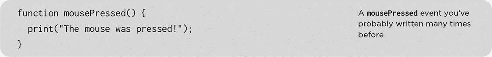

p5.js 中的全局`mousePressed()`函数在每次点击鼠标时都会执行。这被称为**回调函数**，即在某个事件发生时，稍后被调用的函数。Matter.js 的碰撞事件也以类似的方式操作。然而，和 p5.js 只需在鼠标事件发生时查找名为`mousePressed()`的函数不同，在 Matter.js 中，你需要明确地为碰撞回调函数定义名称：

```
Matter.Events.on(engine, 'collisionStart', handleCollisions);
```

这段代码指定了一个名为`handleCollisions`的函数，当两个物体发生碰撞时就会执行。Matter.js 还有用于`'collisionActive'`（在持续碰撞的过程中反复执行）和`'collisionEnd'`（当两个物体停止碰撞时执行）的事件，但对于一个基本的演示，知道碰撞何时开始已经足够。

就像在点击鼠标时会触发`mousePressed()`一样，当两个物体发生碰撞时，`handleCollisions()`（或者你选择的回调函数名）也会被触发。它可以写成如下形式：

```
function handleCollisions(event) {

}
```

请注意，这个函数包括一个 `event` 参数。这个对象包含与碰撞相关的所有数据（如果在那个时间步骤内发生了多个碰撞，它会包含多次碰撞的数据），例如涉及到哪些物体。Matter.js 会自动创建这个对象，并在每次碰撞发生时将其传递给 `handleCollisions()` 回调函数。

假设我有一个 `Particle` 对象的草图。每个 `Particle` 都存储一个 Matter.js 物体的引用，我希望粒子在碰撞时改变颜色。以下是实现这一目标的步骤。

**步骤 1：事件，你能告诉我是哪两个物体发生了碰撞吗？**

那么，到底发生了什么碰撞呢？Matter.js 会检测一对物体之间的碰撞。任何发生碰撞的物体对都会出现在 `event` 对象中的 `pairs` 数组里。在 `handleCollisions()` 中，我可以使用 `for...of` 循环遍历这些物体对：

```
for (let pair of event.pairs) {

}
```

**步骤 2：配对，你能告诉我你包含了哪两个物体吗？**

`pairs` 数组中的每一对物体都是一个包含碰撞中涉及的两个物体引用的对象，分别是 `bodyA` 和 `bodyB`。我会提取出这些物体：

```
for (let pair of event.pairs) {
  let bodyA = pair.bodyA;
  let bodyB = pair.bodyB;
}
```

**步骤 3：物体，你能告诉我你与哪些粒子相关联吗？**

从相关的 Matter.js 物体获取它们所关联的 `Particle` 对象稍微有点困难。毕竟，Matter.js 对我的代码一无所知。它确实在做各种操作来跟踪物体和约束之间的关系，但管理我自己的对象及其与 Matter.js 元素的关联是我自己的责任。话虽如此，每个 Matter.js 物体都会实例化一个空对象——`{ }`——叫做 `plugin`，它用来存储关于该物体的任何自定义数据。我可以通过将该对象的引用存储在 `plugin` 属性中，将物体与自定义对象（在这个例子中是 `Particle`）链接起来。

看看在 `Particle` 类中更新后的构造函数，其中物体是如何创建的。请注意，创建物体的过程已经通过增加一行代码进行扩展，往 `plugin` 中添加了一个 `particle` 属性。非常重要的一点是，确保你是给现有的 `plugin` 对象添加一个新属性（在这个例子中是 `plugin.particle = this`），而不是覆盖整个 `plugin` 对象（例如，使用 `plugin = this`）。后者可能会干扰其他功能或自定义设置。

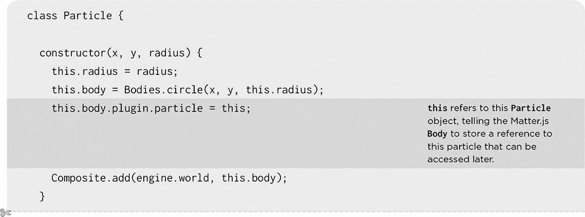

在稍后的 `handleCollision()` 回调函数中，可以通过 `plugin` 从 `Body` 中访问到那个 `Particle` 对象。

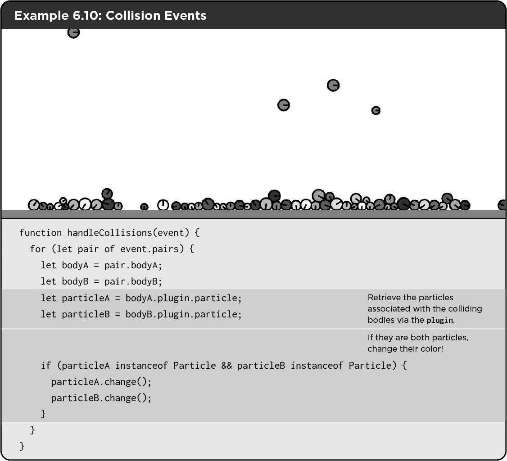

在大多数情况下，你不能假设发生碰撞的对象都是 `Particle` 对象。毕竟，粒子可能与一个 `Boundary` 对象发生碰撞（根据你世界里的内容，这可能是另一种类型的对象）。你可以使用 JavaScript 的 `instanceof` 操作符检查一个对象的类型，正如我在这个例子中所做的那样。

 **练习 6.9**

创建一个模拟，其中`Particle`对象在相互碰撞时消失。你应该在哪里以及如何删除这些粒子？你能让它们碎成更小的粒子吗？

### **简短插曲：积分方法**

你有没有经历过这样的情境？你正在一个高级鸡尾酒会上，和朋友们分享你那令人难以置信的软件物理模拟的精彩故事。突然，有人插话说：“太迷人了！你使用的是什么积分方法？”

*什么？！*你心里想，*积分？*

或许你之前听说过这个术语。与微分一起，它是微积分中的两大基本操作之一。哦，对了，微积分。

我已经成功地完成了与物理模拟相关的大部分内容，而几乎没有真正深入微积分。然而，在我完成本书的上半部分时，值得花点时间来审视我所展示的内容背后的微积分原理，以及它如何与某些物理库（如 Box2D、Matter.js，以及即将发布的 Toxiclibs.js）中的方法论相关联。这样，当有人在下次鸡尾酒会上问你关于积分的问题时，你就能知道该怎么回答。

我先来问一个问题：“积分和位置、速度、加速度有什么关系？”为了回答这个问题，我应该首先定义**微分**，即求导的过程。**导数**是衡量一个函数随时间变化的程度。考虑位置和它的导数。位置是空间中的一个点，而速度是位置随时间的变化。因此，速度可以描述为位置的导数。那么加速度是什么？是速度随时间的变化。加速度是速度的导数。

**积分**，即求积分的过程，是微分的逆过程。例如，物体速度随时间的**积分**告诉我们物体在该时间段结束时的新位置。位置是速度的积分，速度是加速度的积分。

由于本书中的物理模拟是基于通过力来计算加速度的概念，因此需要使用积分来计算物体在一定时间（例如一个`draw()`循环周期）后的位置。换句话说，你一直在做积分！

```
velocity.add(acceleration);
position.add(velocity);
```

这种方法叫做**欧拉积分**，或称欧拉方法（以数学家莱昂哈德·欧拉的名字命名，发音为*Oiler*）。它本质上是最简单的积分形式，并且非常容易在代码中实现——只需两行！然而，尽管它在计算上很简单，但对于某些类型的模拟来说，它并不是最准确或最稳定的选择。

为什么欧拉法不准确？可以这样想：当你用蹦床棒在 sidewalk 上蹦跳时，蹦床棒会在时间等于 1 秒时停在一个位置，然后消失，并在时间等于 2 秒时突然出现在一个新位置，接着在 3 秒、4 秒、5 秒时继续这样做吗？当然不是。蹦床棒是持续不断地在时间中移动的。

那么在 p5.js 草图中发生了什么？一个圆形在第 0 帧时在一个位置，第 1 帧时在另一个位置，第 2 帧时又在另一个位置，依此类推。当然，在每秒 30 帧的情况下，你会看到运动的*假象*。但是，新的位置只有在每 *N* 个时间单位时才会计算出来，而现实世界是完全连续的。这会导致一些不准确性，如图 6.12 所示。

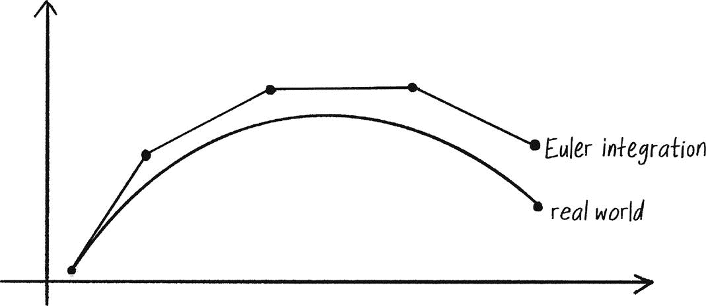

图 6.12：曲线的欧拉近似

“现实世界”是平滑的曲线；欧拉模拟则是由一系列直线段组成。改进欧拉法的一个选择是使用更小的时间步长——而不是每帧计算一次，你可以每帧重新计算 20 次物体的位置。但这并不实际，因为草图可能会运行得太慢。

我仍然认为欧拉方法是学习基础的最佳方法，而且对于你可能用 p5.js 做的大多数项目，它也完全足够。任何在效率或准确性上的损失，都会在易用性和可理解性上得到补偿。为了更高的准确性，例如，Box2D 引擎使用了辛欧拉方法，或者说是半显式欧拉法，这是欧拉法的一种轻微修改。其他引擎使用了一种叫做龙格-库塔（Runge-Kutta）的方法，它以德国数学家卡尔·龙格（Carl Runge）和马丁·库塔（Martin Kutta）命名。

在物理库中，包括 Matter.js 和 Toxiclibs.js，另一个常用的积分方法是**Verlet 积分**。描述 Verlet 积分的一个简单方式是将其看作一种典型的运动算法，不需要显式存储速度。毕竟，你实际上并不需要存储速度；只要你始终知道一个物体在某个时间点的位置以及它当前的位置，你就可以推算出它的速度。Verlet 积分正是这样做的，它在程序运行时动态计算速度，而不是维护一个单独的速度变量。

Verlet 积分特别适合粒子系统，尤其是那些粒子之间有弹簧连接的系统。物理库将细节隐藏在你面前，这样你就不必担心它如何工作，但如果你有兴趣深入了解 Verlet 物理学，我建议阅读这篇关于该主题的开创性论文，几乎所有 Verlet 计算机图形学模拟都源自这篇论文：“Advanced Character Physics” by Thomas Jakobsen (*[`www.cs.cmu.edu/afs/cs/academic/class/15462-s13/www/lec_slides/Jakobsen.pdf`](https://www.cs.cmu.edu/afs/cs/academic/class/15462-s13/www/lec_slides/Jakobsen.pdf)*)。

### **Toxiclibs.js 中的 Verlet 物理**

大约在 2005 年，Karsten Schmidt 开始了 Toxiclibs 的开发，这是一个广泛而开创性的计算设计开源库，专门为 Processing 的 Java 版本而构建。尽管它已经超过 10 年没有积极维护，但该库展示的概念和技术在今天的无数创意编码项目中仍然可以找到。它的网站是这样描述的：

*Toxiclibs 是由 Karsten “toxi” Schmidt 开发的，专为计算设计任务而设计的独立开源库，支持 Java 和 Processing。类的设计故意保持通用，以最大化在不同环境中的重用，涵盖了从生成设计、动画、交互/界面设计、数据可视化到建筑和数字化制造、教学工具等多个领域。*

Schmidt 通过他最近的项目，[thi.ng](http://thi.ng) umbrella (*[`thi.ng/umbrella`](https://thi.ng/umbrella)*)，继续为创意编码领域做出贡献。这项工作可以被视为 Toxiclibs 的间接继任者，但其范围和细节远远更广泛。如果你喜欢这本书，你可能会特别喜欢探索[thi.ng](http://thi.ng)向量库 (*[`thi.ng/vectors`](https://thi.ng/vectors)*)，它提供了使用纯粹的 JavaScript 数组的 800 多个向量代数函数。

尽管[thi.ng/umbrella](http://thi.ng/umbrella)可能是一种更现代、更复杂的方法，但 Toxiclibs 仍然是一个多功能的工具，我继续使用与最新版本 Processing 兼容的版本（截至本文写作时为 4.3）。对于这本书，我们应该感谢我们的幸运星，感谢 Toxiclibs.js，它是由 Kyle Phillips（hapticdata）创建的库的 JavaScript 版本。我将只介绍与 Verlet 物理学相关的少数几个示例，但 Toxiclibs.js 还包括一套与颜色、几何、数学等相关的其他功能包。

我接下来要展示的示例也可以使用 Matter.js 创建，但我决定转向 Toxiclibs.js，原因有很多。这个库在我心中占有特殊的地位，是我的个人最爱，而且它具有历史意义。我还认为展示多个物理库对于提供更广泛的工具和方法理解非常重要。

然而，从 Matter.js 切换到 Toxiclibs.js 提出了一个重要的问题：你应该如何决定在项目中使用哪个库？是 Matter.js，Toxiclibs.js，还是其他的库？如果你属于以下两类之一，那么你的决定就简单一些：

+   **我的项目涉及碰撞。我有圆形、方形和其他奇形怪状的物体，它们相互碰撞并弹开。** 在这种情况下，你会希望使用 Matter.js，因为 Toxiclibs.js 不处理刚体碰撞。

+   **我的项目涉及大量粒子在屏幕上飞动。有时它们相互吸引，有时相互排斥。有时它们还通过弹簧连接。** 在这种情况下，Toxiclibs.js 可能是最佳选择。从某些方面来说，它比 Matter.js 更易于使用，尤其适合处理粒子连接系统。它的性能也非常高，因为它可以忽略所有的碰撞几何。

这里有一个小表格，展示了每个物理库的一些特性：

| **特性** | **Matter.js** | **Toxiclibs.js** |
| --- | --- | --- |
| 刚体碰撞 | 是 | 否 |
| 3D 物理 | 否 | 是 |
| 粒子吸引与排斥力 | 否 | 是 |
| 弹簧连接（基于力） | 是 | 是 |
| 约束（通用连接） | 是 | 否 |

所有库文件的文档和下载可以在 Toxiclibs.js 官网找到 (*[`haptic-data.com/toxiclibsjs`](http://haptic-data.com/toxiclibsjs)*)。对于本书中的示例，我将使用托管的 CDN 版本的库，参考 *index.html*，就像我之前为 Matter.js 演示的那样。这里是需要添加的 `<script>` 元素：

```
<script src="https://cdn.jsdelivr.net/gh/hapticdata/toxiclibsjs@0.3.2/build/toxiclibs.js"></script>
```

我对 Matter.js 的概述集中在该库的几个关键特性上：世界、向量、物体、约束。这也为你理解 Toxiclibs.js 奠定了基础，因为它遵循类似的结构。下表展示了相应的 Toxiclibs.js 特性：

|  **Matter.js**  | **Toxiclibs.js** |
| --- | --- |

|

```
World
```

|

```
VerletPhysics2D
```

|

|

```
Vector
```

|

```
Vec2D
```

|

|

```
Body
```

|

```
VerletParticle2D
```

|

|

```
Constraint
```

|

```
VerletSpring2D
```

|

我会讨论一些这些特性如何转化到 Toxiclibs.js 中，然后将它们组合起来创建一些有趣的示例。

#### **向量**

又来了。记得曾经花了很多时间学习`p5.Vector`类的细节吗？然后记得你如何必须重新学习这些概念，应用到 Matter.js 和`Matter.Vector`类上吗？好吧，现在是时候再来一遍了，因为 Toxiclibs.js 也包含了自己的向量类。它有一个二维的和一个三维的：`Vec2D`和`Vec3D`。它们都在`toxi.geom`包中，并且可以像在 Matter.js 中使用`Vector`那样进行别名化：

```
let { Vec2D, Vec3D } = toxi.geom;
```

再次强调，Toxiclibs.js 的向量在概念上与我们熟知并喜爱的 p5.js 向量相同，但它们有自己独特的风格和语法。以下是一些基本的向量数学操作从`p5.Vector`转化为`Vec2D`的概览（我坚持使用 2D，以与本书的其余部分保持一致，但我鼓励你也探索 3D 向量）。

| **p5.Vector** | **Vec2D** |
| --- | --- |

|

```
let a = createVector(1, -1);
let b = createVector(3, 4);
a.add(b);
```

|

```
let a = new Vec2D(1, -1);
let b = new Vec2D(3, 4);
a.addSelf(b);
```

|

|

```
let a = createVector(1, -1);
let b = createVector(3, 4);
let c = p5.Vector.add(a, b);
```

|

```
let a = new Vec2D(1, -1);
let b = new Vec2D(3, 4);
let c = a.add(b);
```

|

|

```
let a = createVector(1, -1);
let m = a.mag();
a.normalize();
```

|

```
let a = new Vec2D(1, -1);
let m = a.magnitude();
a.normalize();
```

|

特别注意，Toxiclibs.js 的向量是通过调用`Vec2D`构造函数并使用`new`关键字来创建的，而不是像`Matter.Vector()`或`createVector()`那样使用工厂方法。

#### **物理世界**

用于描述 Toxiclibs.js 中世界、粒子和弹簧的类位于`toxi.physics2d.`。我还将使用一个`Rect`对象（用于描述一个通用的矩形边界）和`GravityBehavior`来施加全局重力。包括`Vec2D`后，我现在有了以下所有类的别名：

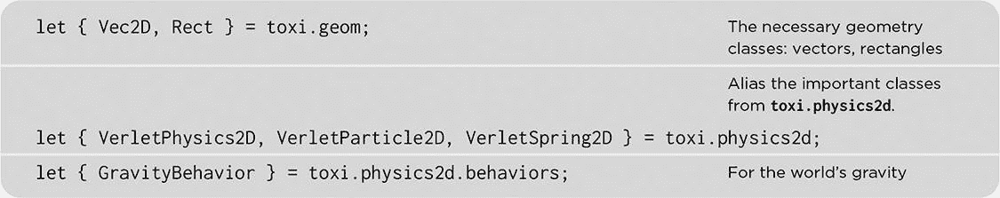

第一步是创建世界：

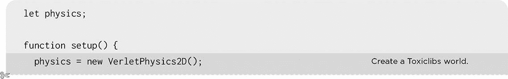

一旦我有了`VerletPhysics`世界，我就可以设置全局属性。例如，如果我想要设置硬边界，防止粒子穿越，我可以提供矩形边界：

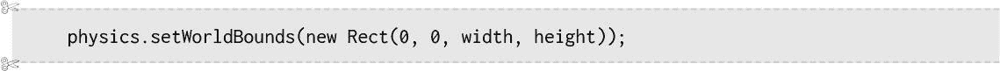

此外，我可以通过`GravityBehavior`对象来添加重力。重力行为需要一个向量——重力的强度和方向是多少？

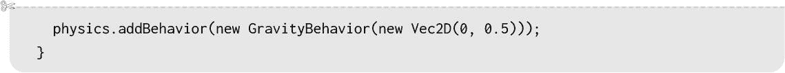

最后，为了计算世界的物理并移动世界中的物体，我必须调用世界的`update()`方法。通常，这会在`draw()`中每帧执行一次：


现在，剩下的就是填充世界了。

#### **粒子**

Toxiclibs.js 中相当于 Matter.js 物体的——一个在世界中存在并经历物理的东西——是一个**粒子**，由`VerletParticle2D`类表示。然而，与 Matter.js 物体不同，Toxiclibs.js 粒子不存储几何形状。它们只是空间中的点。

如何将 Toxiclibs.js 粒子集成到 p5.js 草图中？在 Matter.js 的示例中，我创建了自己的类（称为`Particle`），并包含了对 Matter.js 物体的引用：

```
class Particle {
  constructor(x, y, r) {
    this.body = Bodies.circle(x, y, r);
  }
}
```

这个技术有点冗余，因为 Matter.js 会跟踪其世界中的物体。然而，它让我可以管理哪个物体是什么（因此如何绘制每个物体），而不必依赖于遍历 Matter.js 的内部列表。我可能会采用同样的方法使用 Toxiclibs.js，创建自己的`Particle`类，存储对`VerletParticle2D`对象的引用。这样，我就能给粒子添加自定义属性，并按照我希望的方式绘制它们。我可能会将代码写成如下：

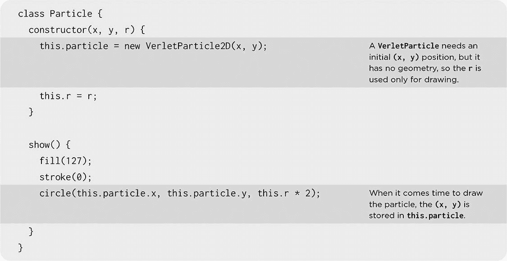

看这段代码，你可能会首先注意到，绘制粒子就像抓取`x`和`y`属性并用`circle()`来绘制一样简单。其次，你可能会注意到，这个`Particle`类除了存储对`VerletParticle2D`对象的引用外，并没有做什么。这暗示了一个重要的点。回想一下第四章中关于继承的讨论，然后问问自己：一个`Particle`对象除了是一个扩展过的`VerletParticle2D`对象外，还有什么？为什么要为世界中的每个粒子创建两个对象——一个`Particle`和一个`VerletParticle2D`，而我完全可以通过扩展`VerletParticle2D`类，加入绘制粒子所需的额外代码？

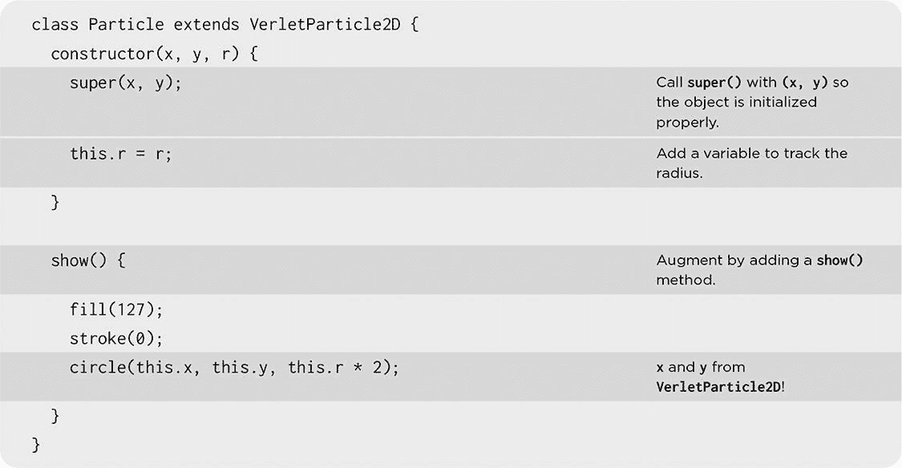

此外，冒险地告诉你一件事，`VerletParticle2D`类实际上是`Vec2D`类的子类。这意味着除了继承`VerletParticle2D`的所有内容外，`Particle`类还继承了所有`Vec2D`的方法！

我现在可以创建新的粒子了：

```
let particle = new Particle(width / 2, height / 2, 8);
```

然而，仅仅创建一个粒子还不够。就像在 Matter.js 中一样，我必须显式地将新粒子添加到世界中。在 Toxiclibs.js 中，这是通过`addParticle()`方法完成的：

```
physics.addParticle(particle);
```

如果你查看 Toxiclibs.js 的文档，你会看到`addParticle()`方法期望的是一个`VerletParticle2D`对象。但我传入的是一个`Particle`对象。这样可以吗？

是的！记住面向对象编程（OOP）的一个原则：多态性。在这里，由于`Particle`类继承了`VerletParticle2D`，我可以将粒子以两种方式处理：作为一个`Particle`或者作为一个`VerletParticle2D`。这是 OOP 中一个非常强大的特性。如果你创建自定义类继承自 Toxiclibs.js 的类，你可以将这些类的对象与 Toxiclibs.js 提供的所有方法一起使用。

#### **弹簧**

除了`VerletParticle2D`类外，Toxiclibs.js 还提供了一组可以用弹簧力连接粒子的类。Toxiclibs.js 有三种类型的弹簧：

+   `VerletSpring2D`：两个粒子之间的弹簧连接。弹簧的属性可以配置成创造一个刚性、类似棒子的连接，或者一个高度弹性、可伸展的连接。还可以锁定某个粒子，使得弹簧的另一端只能移动。

+   `VerletConstrainedSpring2D`：一种可以限制最大距离的弹簧。这有助于使整个弹簧系统达到更好的稳定性。

+   `VerletMinDistanceSpring2D`：一种只在当前距离小于其静止长度时才会强制执行静止长度的弹簧。如果你希望确保物体之间至少保持一定的距离，但不在乎距离超过强制最小值的情况，这个弹簧很有用。

继承和多态性再次在创建弹簧时发挥了作用。一个弹簧在创建时期望两个`VerletParticle2D`对象，但和之前一样，两个`Particle`对象也能工作，因为`Particle`继承了`VerletParticle2D`。

这里有一段创建弹簧的示例代码。这个代码假设已经存在两个粒子，`particle1`和`particle2`，并通过给定的静止长度和强度在它们之间创建一个连接。

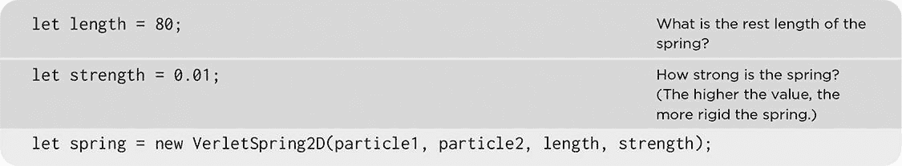

就像粒子一样，为了让连接成为物理世界的一部分，它必须显式地添加到世界中：

```
physics.addSpring(spring);
```

我几乎具备了构建一个简单 Toxiclibs.js 示例所需的一切：两个粒子连接在一起形成一个弹簧摆。但我还想添加一个元素：鼠标交互。

使用 Matter.js 时，我解释过，如果手动通过将物体的位置设置为鼠标位置来覆盖物体的位置，物理模拟会崩溃。但在 Toxiclibs.js 中，这不是问题。如果我愿意，可以手动设置粒子的 (*x*, *y*) 位置。然而，在这样做之前，通常建议调用粒子的 `lock()` 方法，这会将粒子固定在当前位置。这与在 Matter.js 中将 `isStatic` 属性设置为 `true` 是相同的。

这个想法是暂时锁定粒子，使其停止响应世界的物理作用，改变其位置，然后解锁它（使用 `unlock()` 方法），这样它就可以从新的位置开始重新运动。例如，假设我想在每次点击鼠标时重新定位一个粒子：

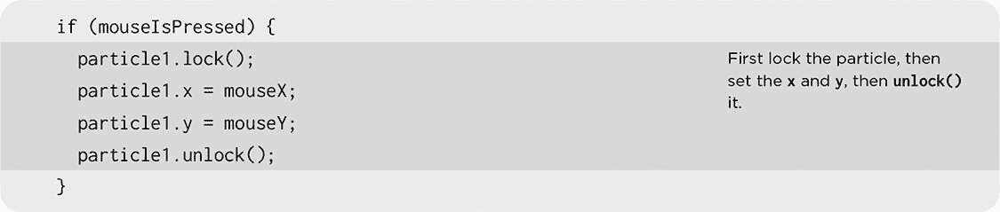

有了这些，我准备将所有这些元素结合在一个简单的草图中，图中有两个粒子通过弹簧连接。一个粒子永久锁定在原位，另一个可以通过拖动鼠标来移动。这个示例与 第三章 中的 示例 3.11 几乎完全相同。

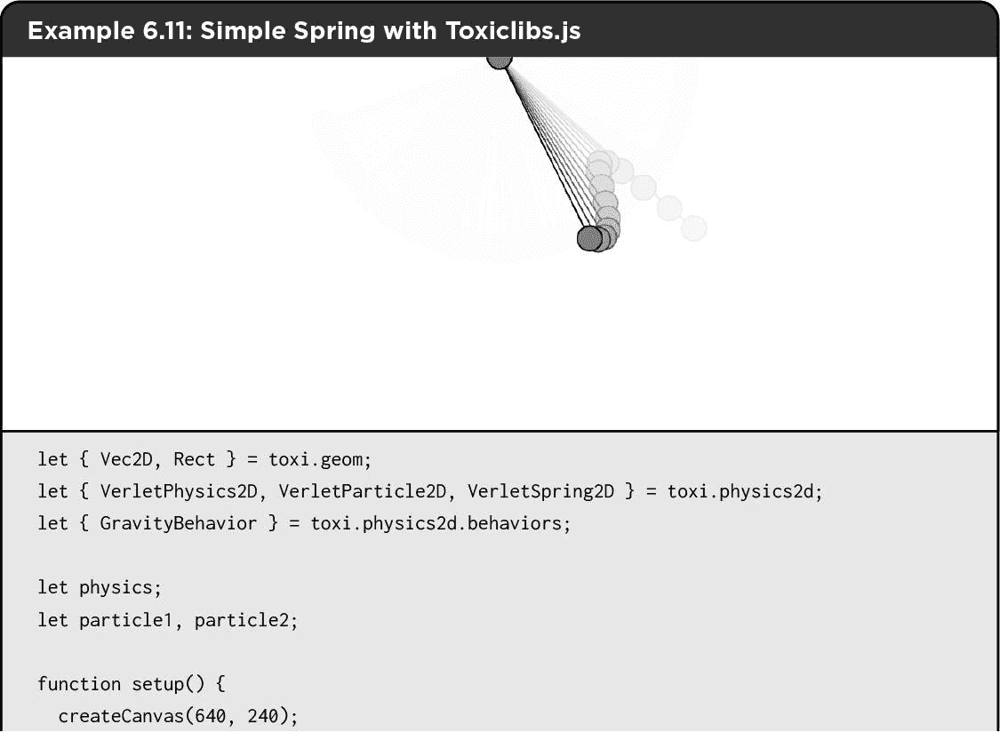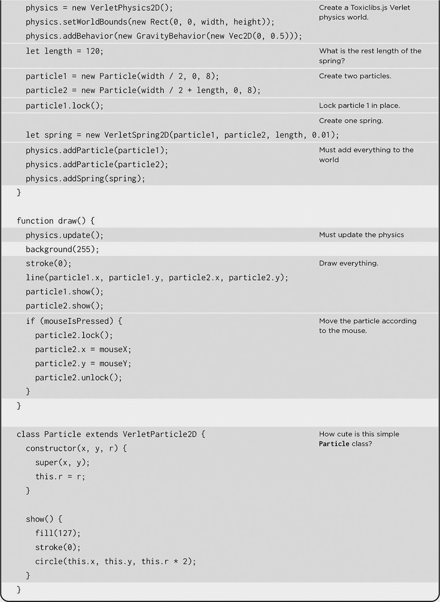

在这个示例中，我继续用一条线来直观表示连接粒子的弹簧。然而，请记住，无论你是否选择将其可视化，弹簧的行为仍然存在。这为创造性可能性打开了大门。例如，你可以决定让弹簧不可见，或者以完全不同的方式表现它，也许用一系列点或者你自己发明的形状来表示。

### **软体模拟**

Verlet 物理学特别适合一种被称为软体模拟的计算机图形学类型。与 **刚体** 模拟不同，刚体模拟中，硬边框的盒子相互碰撞并保持形状，而 **软体** 模拟则涉及能够变形并随着物理作用而改变形状的物体。软体物体允许更灵活、更流畅、更有机的运动。它们能在受力和碰撞时拉伸、挤压、抖动，并且看起来...嗯，就是软的。

软体物理学的第一个流行示例之一是 *SodaConstructor*，这是一款在 2000 年代初期创建的游戏。玩家可以构建并动画化由质量和弹簧组成的自定义 2D 生物。多年来，其他一些例子包括 *LocoRoco*、*World of Goo*，以及最近的 *JellyCar*。

软体模拟的基本构建块是由弹簧连接的粒子——就像 示例 6.11 中的成对粒子一样。图 6.13 展示了如何配置粒子-弹簧连接的网络来创建各种形态。

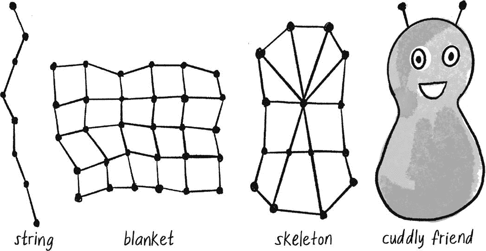

图 6.13：软体模拟设计

如图所示，字符串可以通过用弹簧连接一排粒子来模拟；毛毯可以通过用弹簧连接一网格粒子来模拟；而一个可爱、柔软、弹性十足的卡通角色则可以通过用弹簧连接粒子的自定义布局来模拟。从一个到另一个并不是很大的飞跃。

#### **一根弦**

我将从模拟一个*软摆锤*开始——它是一个悬挂在柔性弦上的摆锤，而不是悬挂在刚性臂上的摆锤。事实上，Toxiclibs.js 提供了一个方便的`ParticleString2D`类，可以通过一次构造函数调用来创建由弹簧连接的粒子链。不过，为了演示，我将通过使用数组和`for`循环来创建我自己的粒子链。通过这种方式，您将对系统有更深的理解，未来可以设计出超出单一弦的自定义设计。

首先，我需要一个粒子数组。我将使用示例 6.11 中构建的相同`Particle`类：

```
let particles = [];
```

现在，假设我想要有 20 个粒子，每个粒子之间间隔 10 个像素，就像图 6.14 那样。

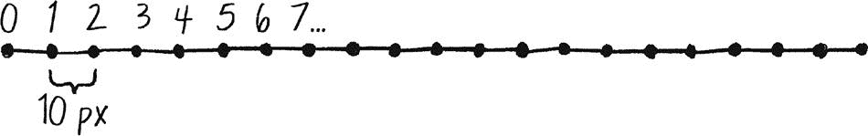

图 6.14：二十个粒子，每个粒子之间间隔 10 个像素

我可以从`i`等于`0`开始循环，直到`total`，在此过程中创建新的粒子并将每个粒子的`y`位置设置为`i * 10`。第一个粒子在(0, 10)，第二个粒子在(0, 20)，第三个粒子在(0, 30)，以此类推：

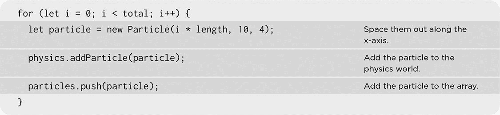

即使这有些冗余，我还是将粒子添加到 Toxiclibs.js 的`physics`世界和`particles`数组中。这将有助于我管理草图（特别是当我可能有不止一根粒子链时）。

现在是有趣的部分：是时候连接所有粒子了。粒子索引 0 将与粒子 1 连接，粒子 1 与粒子 2 连接，粒子 2 与粒子 3 连接，依此类推（见图 6.15）。

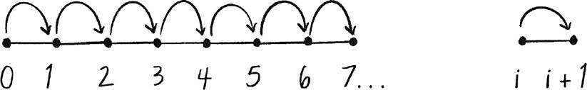

图 6.15：每个粒子与数组中的下一个粒子连接。

换句话说，粒子`i`需要与粒子`i+1`连接（除了当`i`是数组的最后一个元素时）：

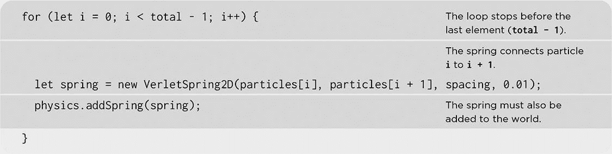

现在，如果我想让弦从一个固定点悬挂该怎么办？我可以固定一个粒子——可能是第一个、最后一个或中间的粒子。我选择第一个粒子：

```
particles[0].lock();
```

最后，我需要绘制这些粒子。然而，我并不打算将它们绘制成圆形，而是希望将它们视为一条线上的点。为此，我可以使用`beginShape()`、`endShape()`和`vertex()`，并从数组中获取各个粒子的位置。我将使用`show()`方法将最后一个粒子绘制为圆形，从而在弦的末端创建一个摆锤。

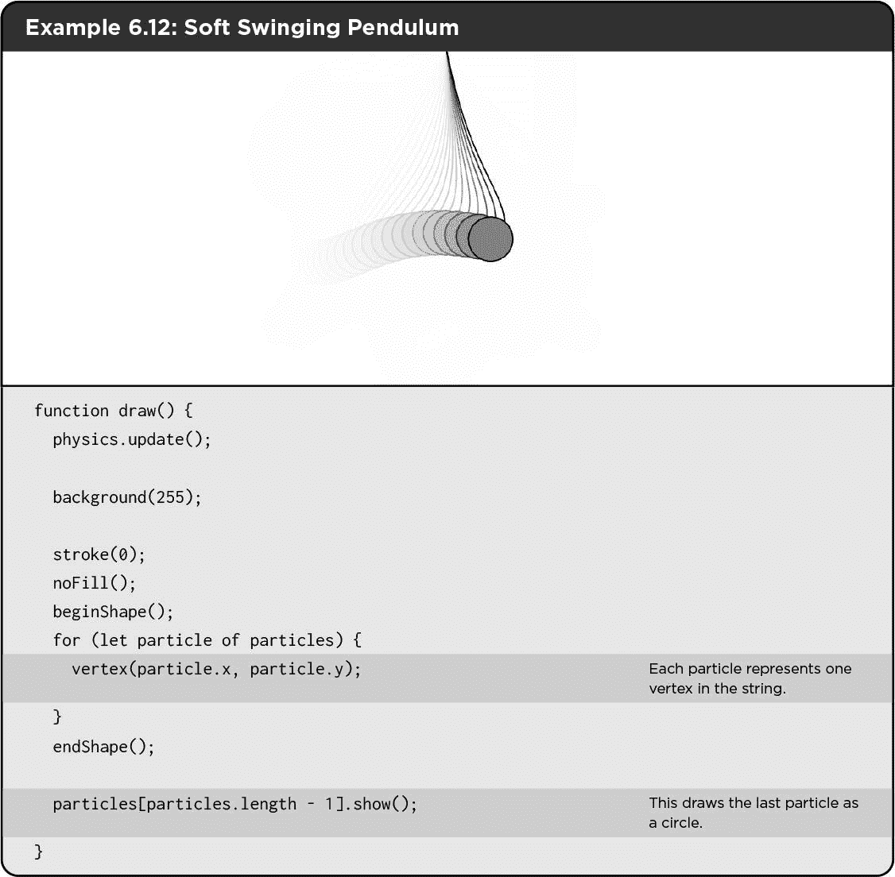

书本网站上提供的完整代码还演示了如何用鼠标拖动摆锤粒子。

 **练习 6.10**

创建一个悬挂布料的模拟，使用粒子和弹簧。你需要将每个粒子与其垂直和水平方向的邻居连接起来。

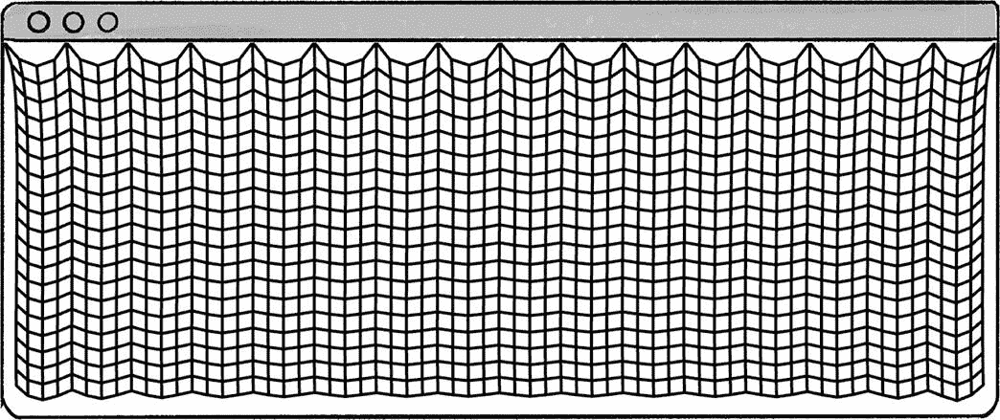

#### **软体角色**

现在我已经建立了一个简单的连接系统——一串粒子——接下来我将在 p5.js 中扩展这个思路，创建一个软乎乎、可爱的朋友，也就是**软体角色**。第一步是设计一个连接粒子的骨架。我将从一个非常简单的设计开始，只有六个顶点，如图 6.16 所示。每个顶点（绘制为一个点）代表一个`Particle`对象，每个连接（绘制为一条线）代表一个`Spring`对象。

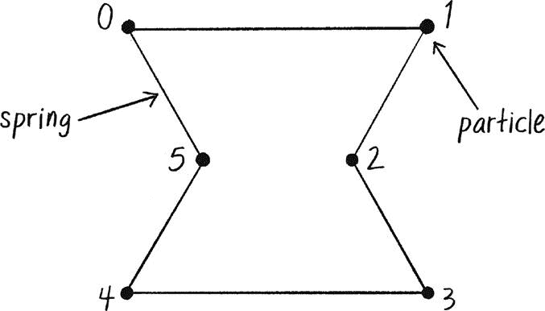

图 6.16：软体角色的骨架。顶点按照它们在数组中的位置编号。

创建粒子是简单的部分；它与之前完全相同！不过，我想做一个小的改变。与其让`setup()`函数将粒子和弹簧添加到物理世界中，不如将这个责任合并到`Particle`构造函数中：

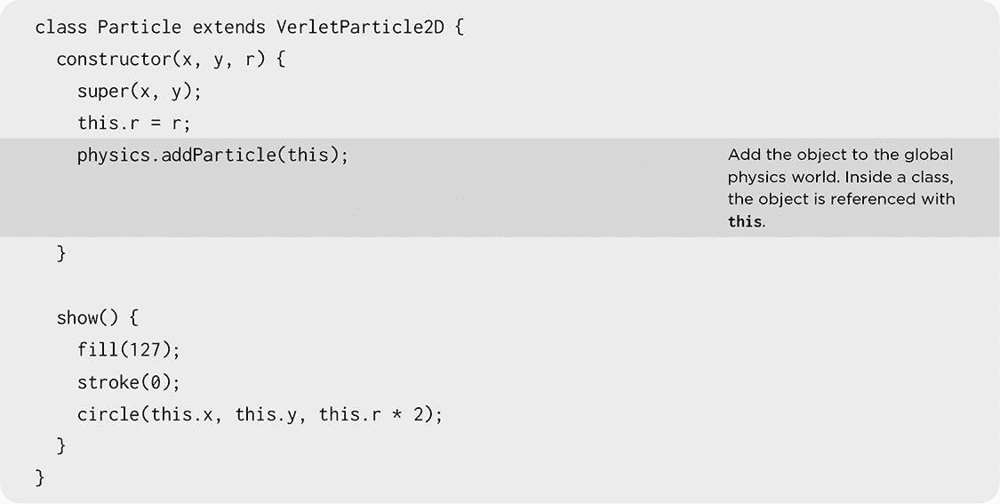

虽然严格来说不是必要的，但我还想创建一个`Spring`类，它继承自`VerletSpring2D`类。在这个示例中，我希望弹簧的静止长度始终等于骨架粒子在创建时的距离。此外，为了保持实现的简单性，我在`Spring`构造函数中硬编码了一个统一的弹簧强度值`0.01`。你可能想用一个更复杂的设计来增强这个示例，为软体角色的不同部分设置不同的弹性。

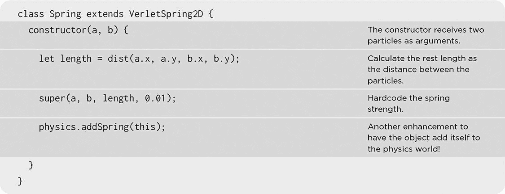

现在我有了`Particle`和`Spring`类，我可以通过将一系列具有硬编码起始位置的粒子添加到`particles`数组中，和一系列弹簧连接添加到`springs`数组中，来组合这个角色。

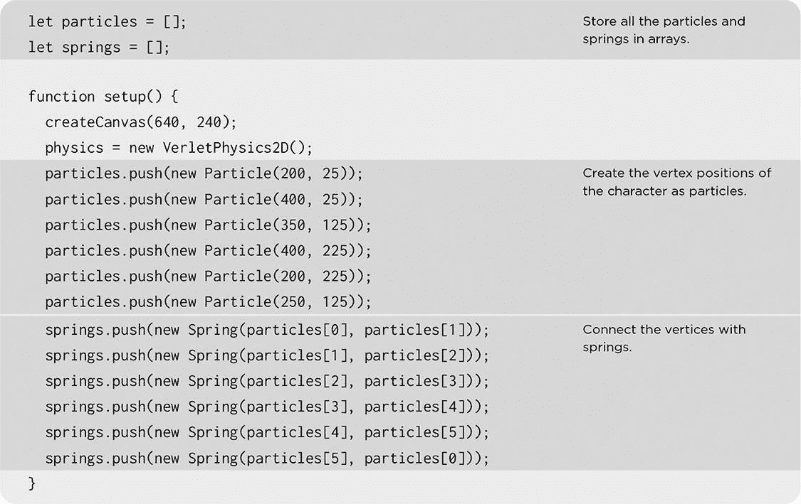

这个系统的美妙之处在于，你可以通过添加更多的粒子和弹簧，轻松扩展并创造出属于你自己的设计！然而，这里有一个主要问题：我只在角色的外围做了连接。如果我对身体施加力（如重力），它会立即塌陷。这就是额外的内部弹簧发挥作用的地方，如图 6.17 所示。它们保持角色的结构稳定，同时仍然允许其以现实的方式移动和挤压。


图 6.17：内部弹簧防止结构坍塌。这只是一个可能的设计，尝试其他设计吧！

最终示例包含了图 6.17 中的附加弹簧、重力和鼠标交互。

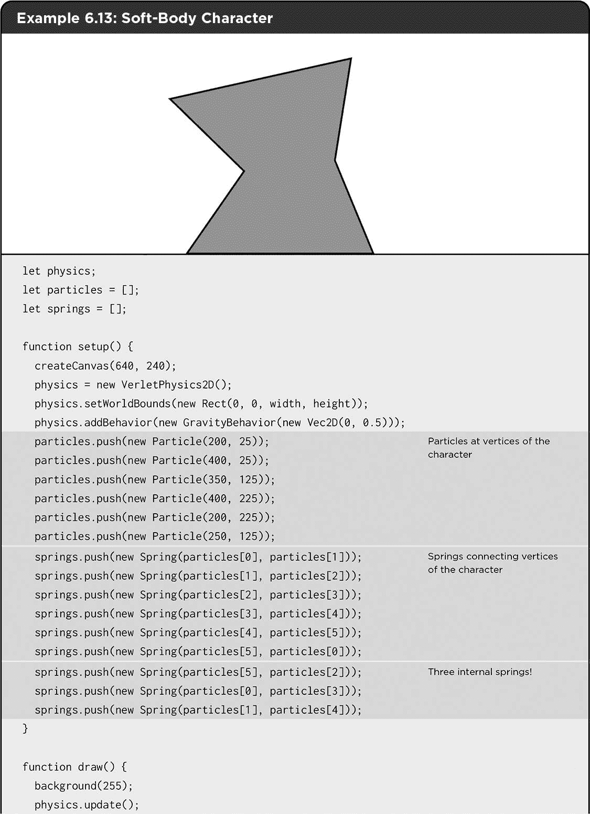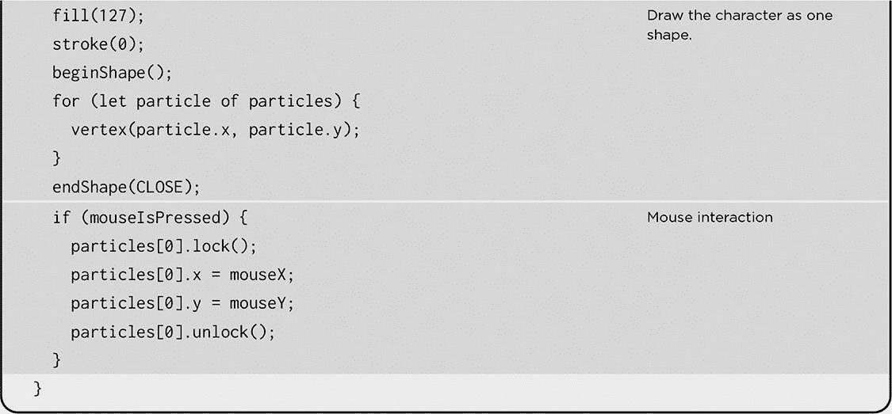

在软体角色的例子中，你会注意到我不再在画布上绘制物理模拟的所有元素！粒子的`show()`方法没有被调用，而赋予角色结构的内部弹簧也没有用线条进行渲染。事实上，弹簧本身在`setup()`之后从未被引用过，因为角色的形状是由其粒子的位置构建的。因此，弹簧数组在这个例子中并不是严格需要的，尽管考虑到将来可能需要增强草图，我觉得它有一定的用处。

将绘图视为一个独立的问题，而不是角色骨架结构的一部分，也为添加其他设计元素如眼睛或触角打开了可能性。这些创意增强不需要直接与角色的物理性质连接，尽管如果你愿意，也可以将它们与物理性相连！

 **练习 6.11**

设计你自己的软体角色，增加额外的顶点和连接。你可以添加哪些其他设计元素？你可以融入哪些其他力量和交互？

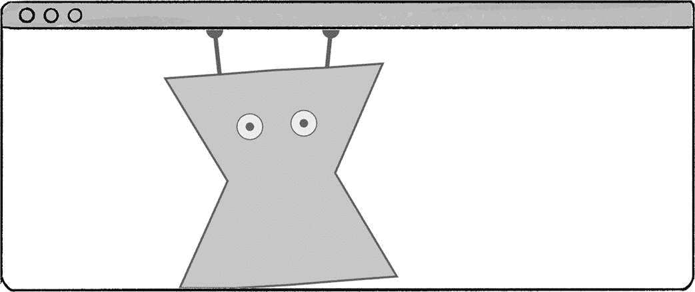

#### **力导向图**

你有没有想过以下这种情况？“我有一大堆东西想要绘制，并且我希望所有的东西都能均匀地分布在一个漂亮、整洁、有序的方式中。否则，我晚上就没法好好睡觉。”

这在计算设计中并不罕见。一个解决方案是**力导向图**，它是一个元素的可视化——我们称它们为*节点*——这些节点的位置不是手动指定的。相反，节点会根据一组力来排列自己。虽然可以使用任何类型的力，但经典方法使用的是弹簧力：每个节点通过弹簧与其他所有节点相连，当弹簧达到平衡时，节点会均匀分布（见图 6.18）。听起来像是 Toxiclibs.js 的工作！

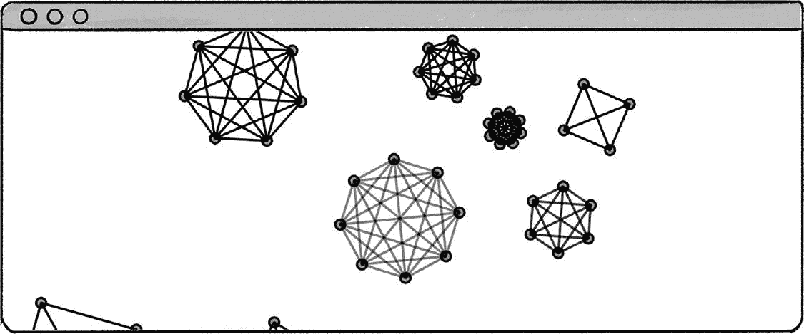

图 6.18：在这个力导向图中，粒子群通过弹簧力相连接。

为了创建一个力导向图，我首先需要一个类来描述系统中的每个节点。由于“节点”这个术语与 JavaScript 框架 Node.js 相关，我将使用*粒子*这个术语，以避免任何混淆，并且继续使用我在早期软体例子中创建的`Particle`类。

接下来，我将把一个*N*粒子的列表封装到一个新的类`Cluster`中，该类表示整个图形。所有粒子最初都靠近画布的中心：

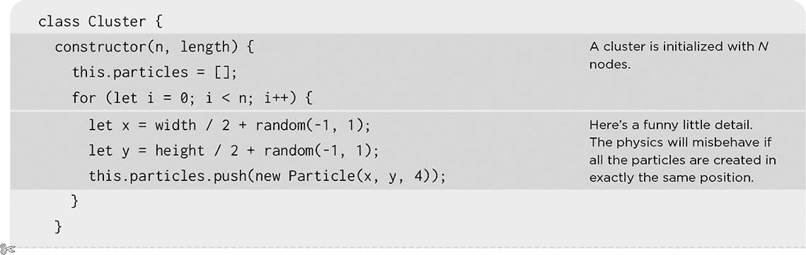

假设 `Cluster` 类也有一个 `show()` 方法来绘制集群中的所有粒子，并且我将在 `setup()` 中创建一个新的 `Cluster` 对象，并在 `draw()` 中渲染它。如果我直接运行这个草图，什么也不会发生。为什么？因为我还没有实现整个基于力的图形部分！我需要将每个节点与其他所有节点通过弹簧连接起来。这有点类似于创建一个软体角色，但与其手工制作一个骨架，我更希望编写一个算法来自动创建所有连接。

这到底是什么意思呢？假设我有五个 `Particle` 对象：0、1、2、3 和 4。 图 6.19 展示了这些连接。

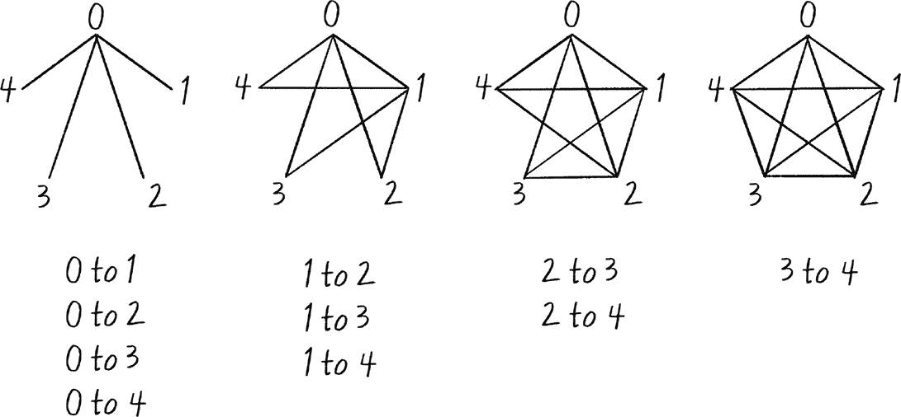

图 6.19：一个网络图，显示了每个节点与其他所有节点的连接

注意关于连接列表的两个重要细节：

+   **没有粒子连接到它自身。** 也就是说，0 不连接到 0，1 不连接到 1，依此类推。

+   **连接不会反向重复。** 例如，如果 0 连接到 1，我就不需要明确地说 1 也连接到 0。我已经知道这一点，基于弹簧工作原理的定义！

如何编写代码来为 *N* 个粒子创建这些连接？看看 图 6.19 中展示的四列。它们迭代了从粒子 0 到粒子 3 的所有连接。这告诉我，我需要访问列表中从 0 到 *N* – 1 的每个粒子：

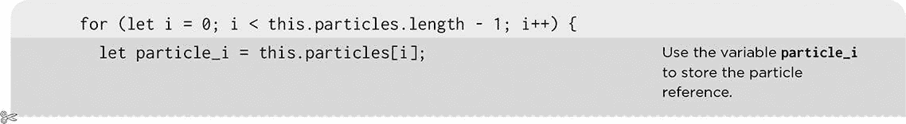

现在看看 图 6.19 中列出的连接。我需要将节点 0 连接到节点 1、2 和 3。对于节点 1，我将其连接到 2 和 3。对于节点 2，仅连接到 3。一般来说，对于每个节点 `i`，我需要从 `i + 1` 开始，直到数组的末尾。我将使用计数器变量 `j` 来实现这个目的：

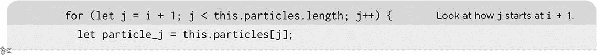

对于每一对粒子 `i` 和 `j`，我可以创建一个弹簧。我将回到直接使用 `VerletSpring2D`，但你也可以结合一个自定义的 `Spring` 类：

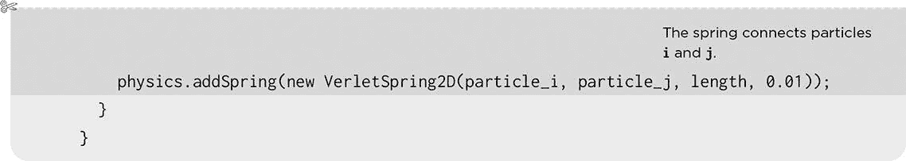

假设这些连接是在 `Cluster` 构造函数中创建的，那么剩下的就是在 `setup()` 中创建集群并在 `draw()` 循环中调用 `show()`！

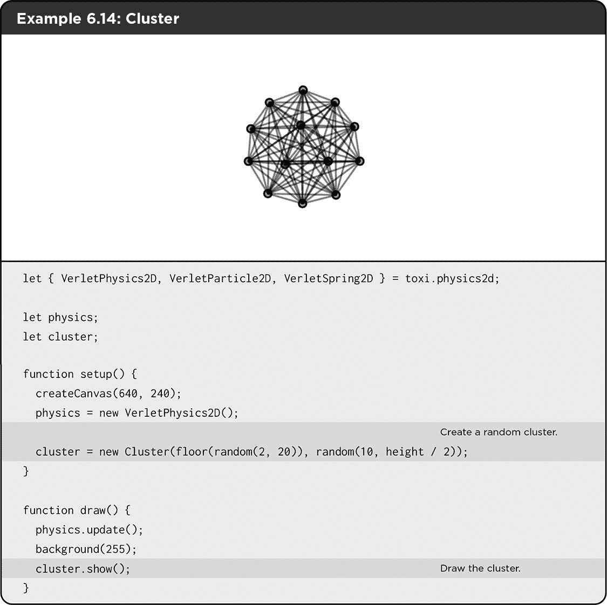

这个例子展示了一个基于力的图形，但并没有涉及任何实际数据！在这里，每个集群中的节点数量和节点之间的平衡长度是随机分配的，而弹簧的强度恒定为 `0.01`。在实际应用中，这些值可以根据你的特定数据来确定，希望能够形成一个有意义的可视化，展示数据之间的关系。

 **练习 6.12**

设计一个类似集群的结构，作为一个可爱、柔软、黏糊糊的生物的骨架。加入重力和鼠标交互。

 **练习 6.13**

扩展力导向图，使其拥有多个`Cluster`对象。使用`VerletMinDistanceSpring2D`对象连接簇与簇。你可能会使用这种技术可视化什么样的数据？

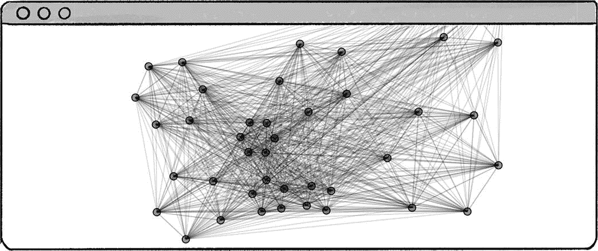

### **吸引力与排斥力行为**

在为 Matter.js 创建吸引力示例时，我展示了`Matter.Body`类如何包括一个`applyForce()`方法。然后我只需做的就是将吸引力公式 *F[g]* = (*G* × *m*[1] × *m*[2]) ÷ *d*² 作为一个向量计算并应用到物体上。同样，Toxiclibs.js 的`VerletParticle2D`类也包括一个名为`addForce()`的方法，可以将任何计算出的力应用到粒子上。

然而，Toxiclibs.js 进一步提升了这一想法，提供了内建的常见力（称为行为）功能，例如吸引力！例如，如果你将一个`AttractionBehavior`对象添加到某个`VerletParticle2D`对象，物理世界中的所有其他粒子都会受到向该粒子的吸引力作用。

假设我创建了一个`Particle`类的实例（该类继承自`VerletParticle2D`类）：

```
let particle = new Particle(320, 120);
```

现在，我可以创建一个与该粒子关联的`AttractionBehavior`：

```
let distance = 20;
let strength = 0.1;
let behavior = new AttractionBehavior(particle, distance, strength);
```

请注意，行为是通过三个参数创建的：一个粒子、一个距离和一个强度。距离指定行为将应用的范围。在这种情况下，只有 20 像素范围内的粒子才会受到吸引力的作用。强度当然指定了力的大小。

最后，为了激活力，行为需要添加到物理世界中：

```
physics.addBehavior(behavior);
```

现在，物理模拟中的所有对象只要在距离阈值范围内，都会始终被吸引到该粒子上。

`AttractionBehavior`类是一个非常强大的工具。例如，尽管 Toxiclibs.js 不像 Matter.js 那样自动处理碰撞，但你可以通过为每个粒子添加一个负强度的`AttractionBehavior`—即排斥行为—来创建一个类似碰撞的模拟。如果力很强并且仅在短范围内激活（缩放到粒子的半径），其效果就像刚体碰撞。以下是如何修改`Particle`类来实现这一点：

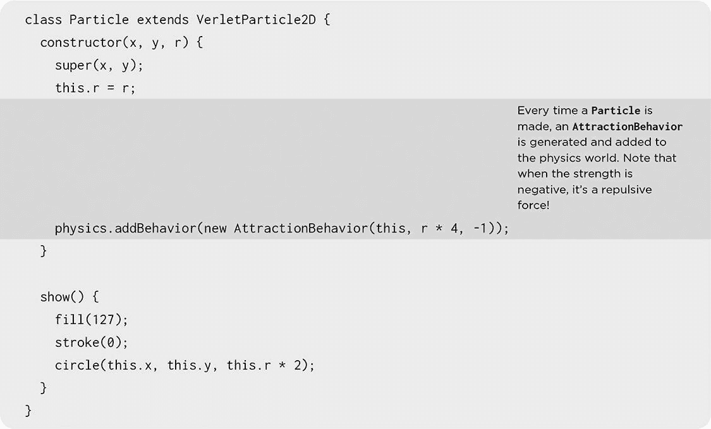

现在，我可以使用一个单一的`Attractor`对象重建第二章的吸引力示例，使其在画布上的任何地方施加吸引力行为。尽管吸引体位于中心，我使用了整个`width`的距离阈值来考虑吸引体的任何移动，以及位于画布边界之外的粒子。

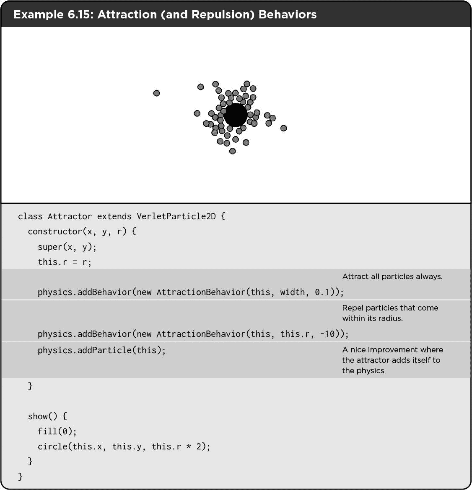

正如在第 275 页的“空间划分”中讨论的那样，带有大量相互作用粒子的 Toxiclibs.js 项目可能会运行得非常慢，因为算法的*N*²特性（每个粒子都要检查其他所有粒子）。为了加速模拟，你可以结合使用手动`addForce()`方法和分箱算法。请记住，这也要求你手动计算引力，因为内置的`AttractionBehavior`将不再适用。

 **练习 6.14**

将`AttractionBehavior`与弹簧力结合使用。

 **生态系统项目**

从第五章获取你的生物系统，并使用物理引擎驱动它们的运动和行为。以下是一些可能的选项：

+   使用 Matter.js 允许生物之间发生碰撞。考虑在两只生物碰撞时触发事件。

+   使用 Matter.js 来增强你生物的设计。使用带有距离关节的骨架或用转动关节做附肢。

+   使用 Toxiclibs.js 来增强你生物的设计。用 Toxiclibs.js 粒子链做触手，或用弹簧网状结构做骨架。

+   使用 Toxiclibs.js 为你的生物添加引力和排斥行为。

+   在物体之间使用弹簧（或关节）连接来控制它们的相互作用。动态创建和删除这些弹簧。考虑将这些连接设置为可见或不可见。


