## **7 个细胞自动机**

*单独来看，我们是一个水滴。一起，我们就是一片海洋。*

—— 佐藤龙之介

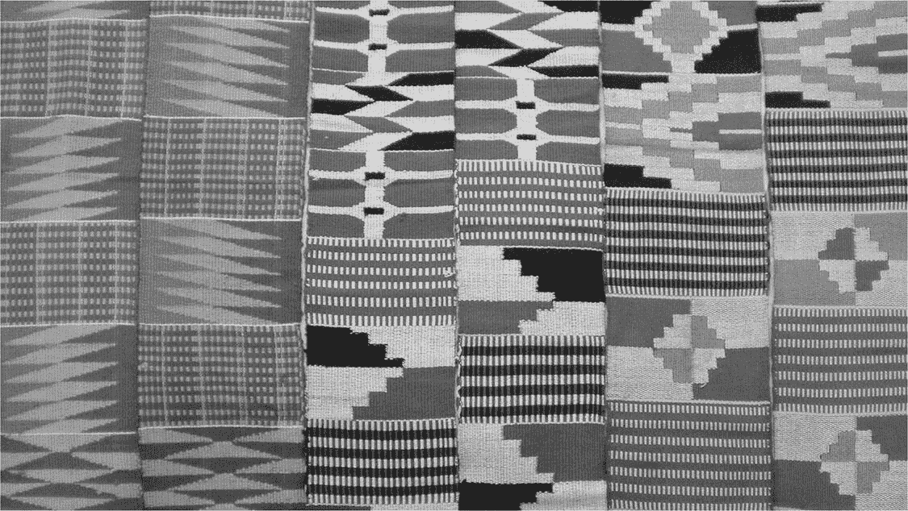

**肯特布（照片由 ZSM 提供）**

起源于加纳的阿干族，肯特布是一种因其鲜艳的色彩和复杂的图案而备受赞誉的织物。布料由狭窄的条纹织成，每种设计都是独一无二的，当这些条纹拼接在一起时，便形成了一幅复杂且不断变化的挂毯，讲述一个故事或传递信息。图像展示了三条典型的埃维肯特布条纹，突出了反映加纳丰富文化图景的多样编织传统。

在第五章中，我定义了复杂系统为一组具有短程关系、并行运作的元素网络，这些元素表现出涌现行为。我创建了一个群体行为模拟，展示了复杂系统如何比单纯的部分之和更为复杂。在本章中，我将转向开发另一类复杂系统，即细胞自动机。

从某些方面来看，这一转变可能似乎是一步倒退。我的系统中的个体元素将不再是物理世界的成员，不再受到力和向量的驱动在画布上移动。相反，我将从最简单的数字元素——一个比特开始构建系统。这个比特被称为**细胞**，它的值（0 或 1）被称为它的**状态**。使用这样简单的元素有助于揭示复杂系统的运作方式，并为阐述一些适用于基于代码的项目的编程技巧提供机会。构建细胞自动机还为本书的其余部分奠定了基础，我将在后续章节中更多地关注系统和算法，而不是向量和运动——尽管这些系统和算法我可以并且会应用于运动物体。

### **什么是细胞自动机？**

**细胞自动机**（复数形式为**细胞自动机**，简称**CA**）是一个由细胞对象组成的系统模型，具有以下特点：

+   细胞生活在一个**网格**中。（本章中我会提供一维和二维的示例，尽管细胞自动机可以存在于任何有限维度的空间中。）

+   每个细胞都有一个**状态**，尽管细胞的状态可以随时间变化。状态的可能数量通常是有限的。最简单的例子只有 1 和 0 两种可能（也称为*开*和*关*，或*生*与*死*）。

+   每个细胞都有一个**邻域**。邻域可以通过多种方式定义，但通常是指与该细胞相邻的所有细胞。

需要强调的是，细胞自动机中的细胞并不指生物学上的细胞（尽管你将看到细胞自动机如何模仿生物行为，并在生物学中有所应用）。相反，它们仅仅代表网格中的离散单元，类似于电子表格中的单元格（如 Microsoft Ex*cel*）。图 7.1 展示了一个细胞自动机及其各个特点。

我列出的第二个元胞自动机特性——即单元格的状态可以随着时间变化——是一个重要的新发展。到目前为止，在本书中，物体（如移动物体、粒子、车辆、群体、物体）通常只存在于一种状态下。它们可能具有复杂的行为和物理特性，但最终它们在其数字生命周期中保持相同的物体类型。我曾提到这些实体可以随着时间变化（例如，转向“愿望”的权重可以变化），但我尚未完全实践这一点。现在，通过元胞自动机，你将看到一个物体的状态如何根据一套规则发生变化。

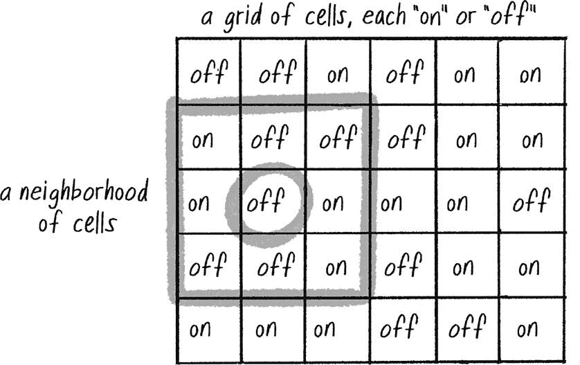

图 7.1：一个 2D 网格的单元格，每个单元格的状态为*开*或*关*。邻域是大网格的一个子区域，通常由所有与给定单元格相邻的单元格组成（以圆圈标出）。

元胞自动机系统的发展通常归功于斯坦尼斯瓦夫·乌拉姆和约翰·冯·诺依曼，他们都是 20 世纪 40 年代新墨西哥州洛斯阿拉莫斯国家实验室的研究人员。乌拉姆研究的是晶体的生长，而冯·诺依曼则设想了一个自我复制的机器人世界。没错，你没有看错：机器人可以建造出自己的复制品。

冯·诺依曼最初的单元格有 29 种可能的状态，因此自我复制机器人这一想法可能是一个过于复杂的起点。相反，想象一排多米诺骨牌；每个骨牌可以处于两种状态之一：竖立（1）或倒下（0）。正如多米诺骨牌会受到相邻骨牌的影响一样，元胞自动机中每个单元格的行为也会受到其邻近单元格状态的影响。

本章探讨了即使是像多米诺骨牌这样最基本的规则，也能引发一系列复杂的模式和行为，类似于自然过程中的生物繁殖和进化。冯·诺依曼在自我复制和元胞自动机方面的工作在概念上与可能是最著名的元胞自动机——生命游戏相似，我将在本章稍后详细讨论。

也许最重要（而且最冗长）的关于元胞自动机的科学工作出现在 2002 年：斯蒂芬·沃尔夫勒姆的 1280 页著作《新科学的种类》（*[`www.wolframscience.com/nks`](https://www.wolframscience.com/nks)*）。这本书可以在网上完全免费阅读，沃尔夫勒姆的书讨论了元胞自动机不仅仅是一些巧妙的技巧，而是与生物学、化学、物理学以及所有科学分支的研究相关的。稍后，我将转向构建沃尔夫勒姆工作的模拟，尽管我仅仅触及了他所阐述的理论的皮毛——我的重点将放在代码实现上，而非哲学含义。如果这些例子激发了你的好奇心，你会在沃尔夫勒姆的书中以及他在沃尔夫勒姆物理学项目中的持续研究中找到更多值得阅读的内容（*[`www.wolframphysics.org`](https://www.wolframphysics.org)*）。

### **基础元胞自动机**

你能想象的最简单的 CA 是什么？对于沃尔夫勒姆来说，一个基本的 CA 有三个关键元素：

+   网格

+   状态

+   邻域

最简单的网格是 1D：一行单元（图 7.2）。


图 7.2：一行 1D 单元

最简单的状态集合（除了只有一个状态）是两种状态：0 或 1（图 7.3）。也许初始状态是随机设置的。

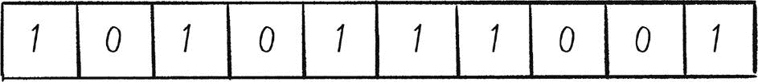

图 7.3：一行 1D 单元，标记为状态 0 或 1。哪个熟悉的编程数据结构可以表示这个序列？

对于任何给定单元，一维的最简单邻域是单元本身以及它的两个相邻邻居：一个在左边，一个在右边（图 7.4）。我必须决定如何处理左右边缘的单元，因为这些单元只有一个邻居，但我可以稍后再处理这个细节。


图 7.4：一维邻域是三个单元。

我有一行单元，每个单元有一个初始状态，并且每个单元有两个邻居。令人兴奋的是，即使是这个最简单的 CA，也可以出现复杂系统的特性。但我还没有讨论可能是 CA 工作中最重要的细节：随时间变化。

我不是在谈论现实世界的时间，而是在谈论 CA 在一系列离散的时间步骤中发展，这些步骤也可以称为**代**。在 p5.js 中的 CA，时间可能与动画的帧数相关。如图 7.5 所示，问题是这样的：给定时间为 0（或第一代）时单元的状态，如何计算第一代所有单元的状态？然后，如何从第一代到第二代？依此类推。

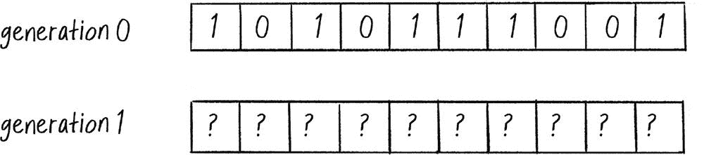

图 7.5：第一代的状态是通过使用第二代单元的状态来计算的。

假设 CA 有一个叫做 cell 的独立单元。计算某一时刻 *t* （cell[*t*]）单元状态的公式如下：

cell[*t*] = *f*(cell neighborhood[*t*−1])

换句话说，单元的新状态是上一代单元邻域中所有单元状态的函数（时间 *t* − 1）。通过查看上一代邻域的状态，可以计算出新的状态值（图 7.6）。

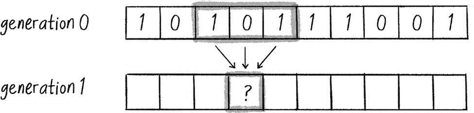

图 7.6：第一代的单元状态是上一代邻域的函数。

你可以通过多种方式计算一个单元格的状态，依据的是它邻居的状态。考虑模糊处理图像。（猜猜看？图像处理也使用类似 CA 的规则！）一个像素的新状态（颜色）是其邻居颜色的平均值。同样，单元格的新状态可以是所有邻居状态的总和。然而，在沃尔夫勒姆的基础 CA 中，过程采用了不同的方法：不是数学运算，而是通过预定义的规则来确定新状态，这些规则涵盖了单元格及其邻居的每一种可能配置。这些规则统称为**规则集**。

这种方法一开始可能看起来很荒谬——难道不会有太多可能性，使得它不切实际吗？好吧，让我们试试看。一个邻域由三个单元格组成，每个单元格的状态是 0 或 1。一个邻域的状态可以有多少种可能的配置？一种快速的方法是将每个邻域配置看作一个二进制数。二进制数使用*基数 2*，意味着它们只用两个可能的数字（0 和 1）来表示。在这种情况下，每个邻域配置对应一个 3 位的数字，你可以用 3 位表示多少个值？八个，从 0（000）到 7（111）。图 7.7 展示了这一点。

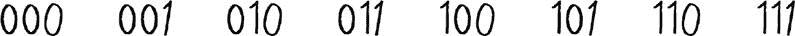

图 7.7：用 3 位二进制进行计数，或者说是三单元格邻域的八种可能配置

一旦定义了所有可能的邻域配置，就为每种配置指定一个结果（新状态值：0 或 1）。在沃尔夫勒姆的原始符号和其他常见的参考资料中，这些配置是按降序排列的。图 7.8 遵循了这个惯例，从 111 开始，倒数到 000。

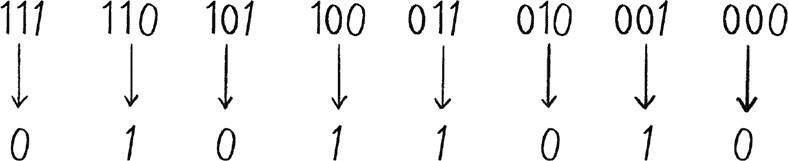

图 7.8：规则集展示了三个单元格每种可能配置的结果。

请记住，不像求和或平均方法，基础 CA 中的规则集不遵循任何算术逻辑——它们只是输入到输出的任意映射。输入是当前邻域的配置（八种可能性之一），输出是邻域中间单元格的下一个状态（0 或 1——由你来定义规则）。

一旦你有了规则集，就可以让 CA 开始运作。标准的沃尔夫勒姆模型是从第 0 代开始，除了中间单元格的状态为 1 外，其他单元格的状态都是 0。你可以使用任何大小（长度）的网格来实现这一点，但为了清晰起见，我将使用一个 9 单元格的 1D CA，这样可以轻松识别中间单元格（见图 7.9）。

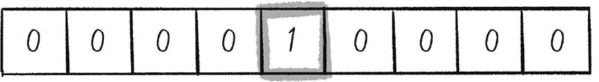

图 7.9：沃尔夫勒姆 CA 的第 0 代，其中间单元格的状态设为 1

基于图 7.8 中的规则集，细胞如何从第 0 代变为第 1 代？图 7.10 展示了如何通过邻域 010，使中心细胞从 1 变为 0。试着应用规则集到剩余的细胞，以填充第 1 代的其余状态。

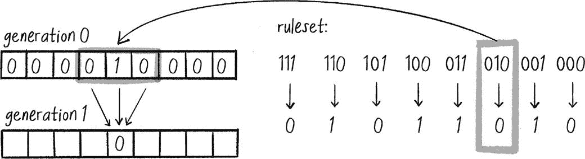

图 7.10：通过使用 CA 规则集确定第 1 代的状态

现在稍作改变：我将不再用 0 和 1 来表示细胞的状态，而是用视觉提示来表示——白色代表 0，黑色代表 1（参见图 7.11）。虽然这看起来可能不符合直觉，因为在计算机图形学中，0 通常表示黑色，但我使用这种约定是因为本书中的示例背景是白色的，所以“激活”一个细胞就意味着将其颜色从白色变为黑色。

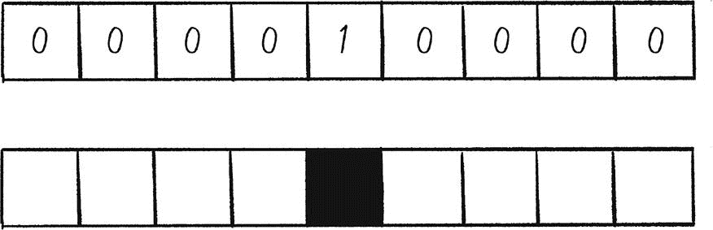

图 7.11：白色细胞表示 0，黑色细胞表示 1。

通过将数值表示转变为视觉形式，CA 的迷人动态和模式将展现出来！为了更清晰地展示它们，我不再一次画出一代，而是开始叠加各代，每一代都出现在前一代的下方，如图 7.12 所示。

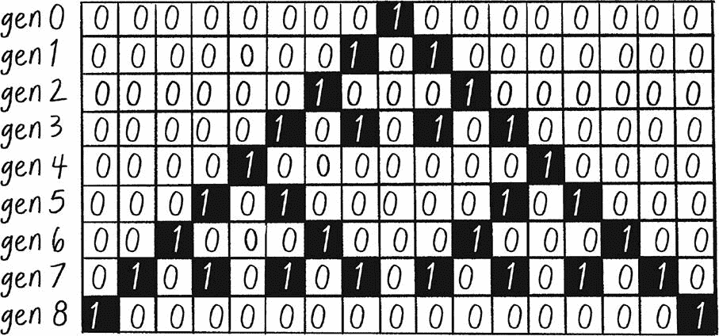

图 7.12：将 0 和 1 的网格转换为白色和黑色方块

图 7.12 中出现的低分辨率形状是**谢尔宾斯基三角形**。它以波兰数学家瓦茨瓦夫·谢尔宾斯基命名，是一个著名的**分形**示例。我将在第八章中更详细地探讨分形，但简而言之，分形是一些在不同尺度上重复相同形状的模式。为了更好地理解这一点，图 7.13 展示了经过几代演化后的元胞自动机（CA），并且使用了更大的网格。

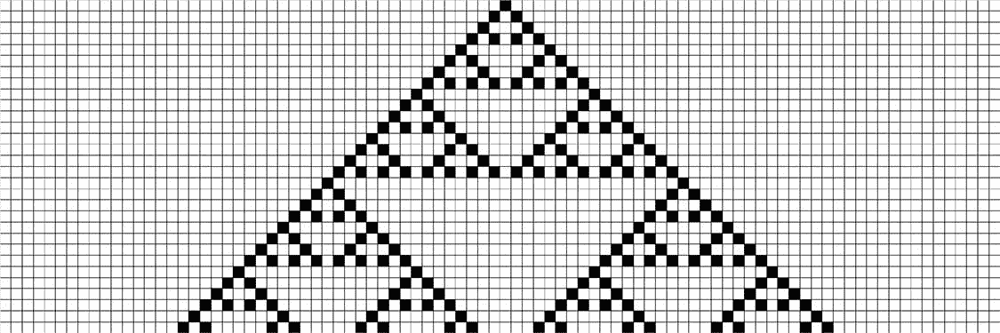

图 7.13：沃尔夫勒姆基础元胞自动机

图 7.14 再次展示了 CA，这一次每个细胞的宽度仅为一个像素，因此分辨率大大提高。

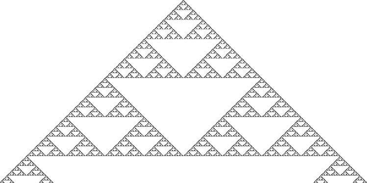

图 7.14：高分辨率下的沃尔夫勒姆基础元胞自动机

花点时间让你刚刚看到的这一切沉淀下来。通过使用一个极其简单的 0 和 1 系统，配合三个细胞的小邻域，我能够生成一个像谢尔宾斯基三角形这样复杂且精细的形状。这就是复杂系统的美妙之处。

当然，这个特定的结果并不是偶然发生的。我选择了图 7.8 中的规则集，因为我知道它将生成的模式。仅仅定义一个规则集并不能保证产生令人兴奋的视觉效果。事实上，对于一个 1D CA，其中每个单元格可以有两个可能的状态，共有 256 种可能的规则集可供选择，只有少数几种能够与谢尔宾斯基三角形相媲美。我怎么知道有 256 种可能的规则集呢？这涉及到更多的二进制数学运算。

#### **定义规则集**

再回头看看图 7.7，再次注意到八种可能的邻域配置，从 000 到 111。这些是规则集的输入，它们在不同的规则集中保持不变。只有输出在不同的规则集中有所变化——即与每个邻域配置配对的单个 0 或 1。图 7.8 用 0 和 1 完全表示了一个规则集。现在，图 7.15 则用黑白方块来可视化同一个规则集。

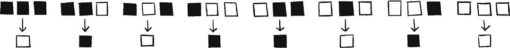

图 7.15：用黑白方块表示相同的规则集（来自图 7.8）

由于八种可能的输入无论如何都相同，因此指示规则集的简写方式是仅指定输出，并将其写成一串八个 0 或 1——换句话说，就是一个 8 位的二进制数字。例如，图 7.15 中的规则集可以写作 01011010。右侧的 0 对应输入配置 000，紧接着的 1 对应输入 001，依此类推。在 Wolfram 的网站上，CA 规则通常使用二进制简写和黑白方块表示法的组合来展示，形成像图 7.16 这样的图像。

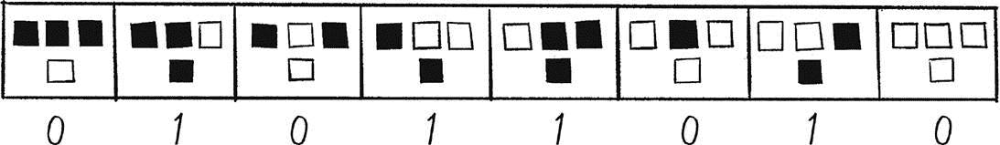

图 7.16：Wolfram 网站如何表示一个规则集

我之前提到过，每个规则集本质上可以简化为一个 8 位数字，那么八个 0 和 1 的组合有多少种呢？正好是 2⁸，即 256 种。你可能还记得在学习 p5.js 中的 RGB 颜色时学到过这一点。当你写下 `background(r, g, b)` 时，每个颜色分量（红色、绿色和蓝色）都由一个从 0 到 255 的 8 位数字表示，或者说是从 00000000 到 11111111 的二进制数。

图 7.16 中的规则集可以称为规则 01011010，但 Wolfram 反而称它为规则 90。90 是怎么来的？为了使规则集命名更加简洁，Wolfram 使用十进制（或基数 10）表示法，而不是二进制。命名规则时，你需要将其 8 位二进制数字转换为十进制数字。二进制数字 01011010 转换为十进制数字 90，因此它被命名为规则 90。

由于八个 0 和 1 的组合有 256 种可能性，因此也有 256 种独特的规则集。让我们来看另一个例子。比如规则 11011110，或者更常见的规则 222？图 7.17 展示了它的样子。

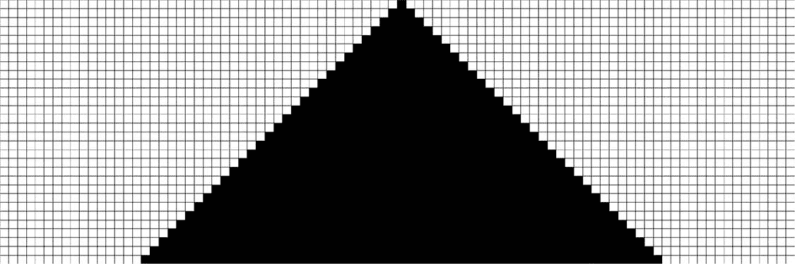

图 7.17：Wolfram 基础元胞自动机，规则 222

结果是一个可识别的形状，尽管它显然不像谢尔宾斯基三角形那样激动人心。正如我之前所说，大部分 256 个基础规则集不会产生令人信服的结果。然而，令人惊讶的是，即便是其中的一些规则集——由仅有两种可能状态的简单细胞系统构成——也能产生大自然中每天都能看到的迷人图案。例如，图 7.18 展示了一个类似 Wolfram 规则 30 的蜗牛壳。这展示了元胞自动机在仿真和模式生成中的巨大价值。

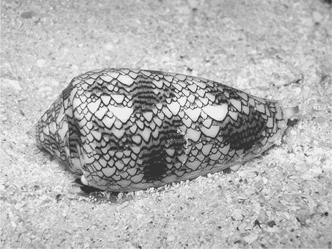

图 7.18：一只纺织圆锥螺（*Conus textile*），科德霍尔，澳大利亚大堡礁（理查德·林拍摄）

然而，在我进一步探讨不同规则集的结果之前，先让我们看看如何构建一个 p5.js 草图，生成并可视化一个 Wolfram 基础元胞自动机。

#### **编程一个基础元胞自动机**

你可能会想：“好吧，我有了这个细胞的概念。这个细胞有一些属性，比如状态、它所在的代数、它的邻居是谁，以及它在屏幕上的像素位置。它可能还有一些函数，比如显示自己和确定它的新状态。”这种思路非常好，可能会引导你编写类似如下的代码：

```
class Cell {

}
```

然而，这并不是我现在想要走的道路。在本章稍后的部分，我会讨论面向对象的方法在开发元胞自动机（CA）仿真中的潜在价值，但一开始，使用更基础的数据结构会更容易。毕竟，一个基础的元胞自动机不就是由一列 0 和 1 组成的列表吗？为什么不通过使用数组来描述一代 1D 元胞自动机呢？

```
let cells = [1, 0, 1, 0, 0, 0, 0, 1, 0, 1, 1, 1, 0, 0, 0, 1, 1, 1, 0, 0];
```

这个数组对应于图 7.19 中显示的细胞行。

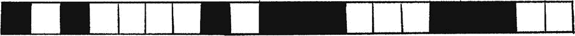

图 7.19：一代 1D 元胞自动机

为了展示这个数组，我会检查每个元素是 0 还是 1，然后选择相应的填充颜色，并绘制一个矩形：

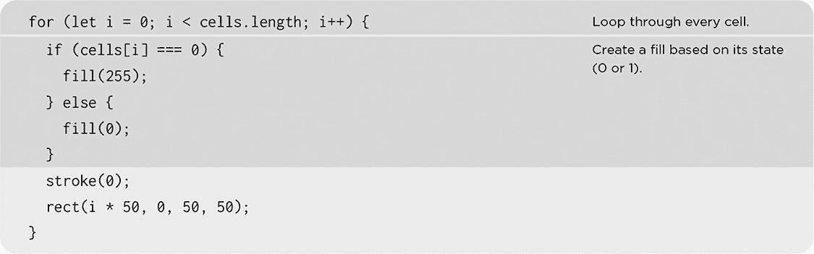

这个数组描述了当前代的细胞状态。现在，我需要一个机制来计算下一代的状态。这里是描述我想要实现的伪代码：

对于数组中的每个细胞：

1.  看看邻域的状态：左侧、中间、右侧。

1.  根据规则集查找细胞状态的新值。

1.  将细胞的状态设置为这个新值。

这个伪代码可能暗示着编写类似以下的代码：

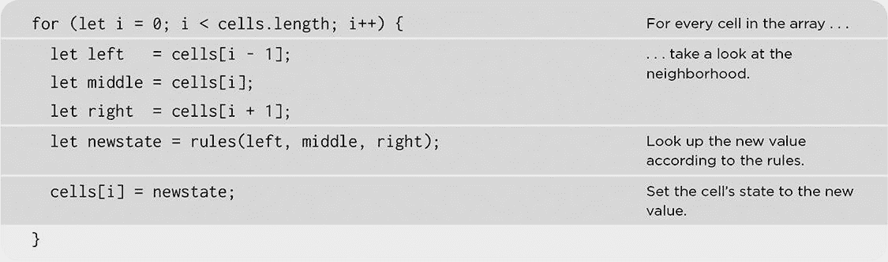

我离正确的解决方案已经很接近了，但还有一些问题需要解决。首先，我把计算新状态值的工作交给了一个叫做`rules()`的函数。显然，我需要编写这个函数，所以我的工作还没完成，但我这里的目标是模块化。我希望有一个`for`循环，它提供一个基本框架来管理任何 CA，无论具体的规则集是什么。如果我想尝试不同的规则集，我不应该修改这个框架；我只需重写`rules()`函数，改变计算新状态的方式。

所以我仍然需要编写`rules()`函数，但更重要的是，我在`for`循环中犯了一个小错误和一个大错误。让我们仔细检查一下代码。

首先，注意观察一个单元格的邻居是多么简单。因为数组是一个有序的数据列表，我可以通过索引的编号来知道哪些单元格是相邻的。例如，我知道单元格 15 的左边是单元格 14，右边是单元格 16。更一般地说，我可以说，对于任何单元格`i`，它的邻居是`i - 1`和`i + 1`。

事实上，事情并没有那么简单。我错在哪里了？想想看代码是如何执行的。第一次进入循环时，单元格索引`i`等于`0`。代码希望查看单元格 0 的邻居。左边是`i - 1`，即`-1`。哎呀！数组的定义中没有索引为`-1`的元素。它从索引`0`开始！

我在本章早些时候提到过边缘情况的问题，并说我可以稍后再处理。现在，稍后就是现在了。我应该如何处理那些没有左右邻居的边缘单元格呢？这里有三种可能的解决方案：

1.  **边缘保持恒定。** 这或许是最简单的解决方案。不必评估边缘，始终保持它们的状态值不变（0 或 1）。

1.  **边缘环绕。** 把 CA 看作是一条纸带，然后将这条纸带变成一个环。左边缘的单元格是右边缘单元格的邻居，反之亦然。这样可以创建一个看起来像是无限网格的效果，并且这可能是最常用的解决方案。

1.  **边缘有不同的邻域和规则。** 如果需要，我可以将边缘单元格与其他单元格区分开，制定适用于只有两个邻居而不是三个邻居的规则。在某些情况下，你可能会这么做，但在本例中，这将增加很多额外的代码行，而收益却很小。

为了让代码现在更容易阅读和理解，我会选择第一种方法，跳过边缘情况，保持值恒定。可以通过让循环从下一个单元格开始，到前一个单元格结束来实现：

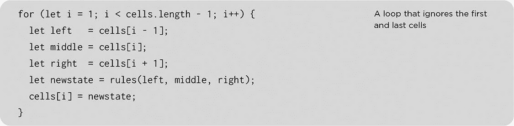

在完成之前，我需要修复另一个问题，而识别这个问题对编程 CA 模拟背后的技术至关重要。这个 bug 非常隐蔽，不会触发错误；CA 只是不能正确执行。问题全在这行代码中：

```
  cells[i] = newstate;
```

这看起来可能完全无害。毕竟，一旦我计算出了一个新的状态值，我就想给单元格分配它的新状态。但想一想接下来`for`循环的下一次迭代。假设单元格 5 的新状态刚刚计算出来，循环开始处理单元格 6。那么接下来会发生什么呢？

单元格 6，第 1 代 = **单元格 5**、单元格 6 和单元格 7 在**第 0 代**的状态的函数

一个单元格的新状态是前一个相邻单元格状态的函数，因此在这种情况下，需要第 0 代单元格 5 的值才能计算第 1 代单元格 6 的新状态。我是否保存了第 0 代单元格 5 的值？没有！记住，这行代码是刚刚对`i`等于`5`时执行的：

```
  cells[i] = newstate;
```

一旦发生这种情况，第 0 代单元格 5 的状态就消失了；`cells[5]`现在存储的是第 1 代的值。我不能在处理数组时覆盖数组中的值，因为我需要这些值来计算新的值！

解决这个问题的一种方法是使用两个数组，一个存储当前代的状态，另一个存储下一代的状态。为了省去重新初始化数组的步骤，我将使用 JavaScript 的`slice()`数组方法，它可以创建一个数组的副本：

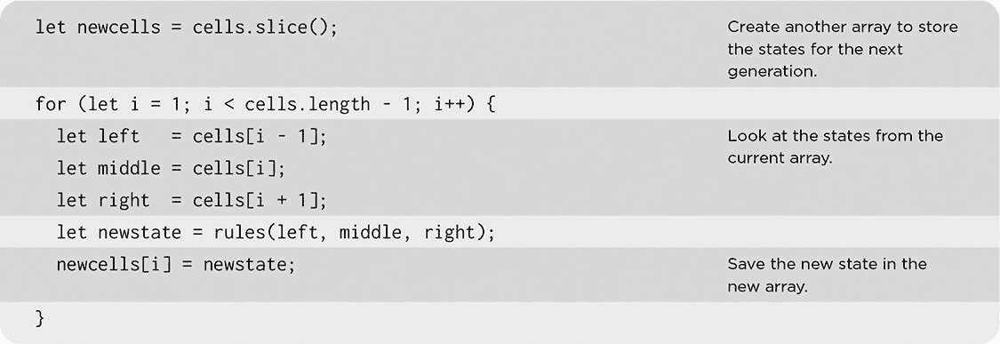

一旦当前代的值数组完全处理完毕，`cells`变量就可以被赋值为新的状态数组，从而有效地丢弃前一代的值：


我快完成了，但我仍然需要定义`rules()`，这个函数根据邻域（左边、中间和右边的单元格）计算新的状态值。我知道该函数需要返回一个整数（0 或 1），并且需要接收三个参数（代表三个邻居）：


我可以用许多方法来编写这个函数，但我想从一个冗长的版本开始，这样或许可以清楚地说明发生了什么。我该如何存储这个规则集？记住，规则集是一系列 8 位（0 或 1），它们定义了每个可能邻域配置的结果。如果你需要复习一下，图 7.20 展示了 Sierpiński 三角形规则集的沃尔夫勒姆符号表示，以及按顺序列出的对应的 0 和 1。这应该能给你一些关于我所设想的数据结构的提示！

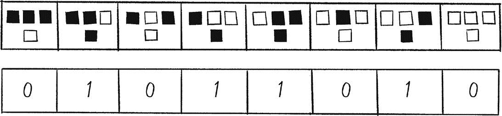

图 7.20：一个带有数字编码的沃尔夫勒姆规则集的可视化表示

我可以将这个规则集存储在一个数组中：

```
let ruleset = [0, 1, 0, 1, 1, 0, 1, 0];
```

然后我可以说，例如，像这样：

```
if (a === 1 && b === 1 && c === 1) return ruleset[0];
```

如果左、中、右三个状态都是 1，这与配置 111 匹配，因此新状态应该等于`ruleset`数组中的第一个值。对所有八种可能的情况重复这个策略如下所示：

```
  function rules(a, b, c) {
    if      (a === 1 && b === 1 && c === 1) return ruleset[0];
    else if (a === 1 && b === 1 && c === 0) return ruleset[1];
    else if (a === 1 && b === 0 && c === 1) return ruleset[2];
    else if (a === 1 && b === 0 && c === 0) return ruleset[3];
    else if (a === 0 && b === 1 && c === 1) return ruleset[4];
    else if (a === 0 && b === 1 && c === 0) return ruleset[5];
    else if (a === 0 && b === 0 && c === 1) return ruleset[6];
    else if (a === 0 && b === 0 && c === 0) return ruleset[7];
  }
```

我喜欢以这种方式编写`rules()`函数，因为它逐行描述了每种邻域配置的发生情况。然而，这并不是一个很好的解决方案。毕竟，如果一个细胞自动机有四个可能的状态（从 0 到 3）而不是两个呢？突然间，有 64 种可能的邻域配置。如果有 10 种可能的状态，那就是 1000 种配置。想象一下，如果要编程冯·诺依曼的 29 种可能状态，我将不得不输入成千上万的`else...if`语句！

另一种解决方案，尽管不那么透明，是将邻域配置（三位二进制数）转换为一个普通整数，并使用该值作为`ruleset`数组的索引。这可以通过以下方式实现，使用 JavaScript 内置的`parseInt()`函数：

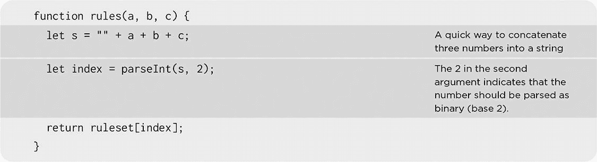

然而，这个解决方案有一个小问题。考虑规则 222：

```
let ruleset = [1, 1, 0, 1, 1, 1, 1, 0];
```

假设正在测试的邻域是 111。根据我最初编写的`rules()`函数，结果状态应该等于规则集索引 0：

```
  if (a === 1 && b === 1 && c === 1) return ruleset[0];
```

二进制数 111 转换为十进制数 7。但我不想要`ruleset[7]`，我想要`ruleset[0]`。为了使其有效，我需要在查找`ruleset`数组中的状态之前反转索引：


我现在已经拥有计算沃尔夫勒姆基本细胞自动机世代所需的一切。以下是整个代码：


这很棒，但还有一个部分缺失：如果你看不见细胞自动机，它又有什么用呢？

#### **绘制基本细胞自动机**

绘制基本细胞自动机的标准技术是将世代一层层叠加起来，每个单元格绘制为一个方形，黑色表示状态 1，白色表示状态 0，如图 7.21 所示。然而，在实现这种特定的可视化之前，我想指出两点。

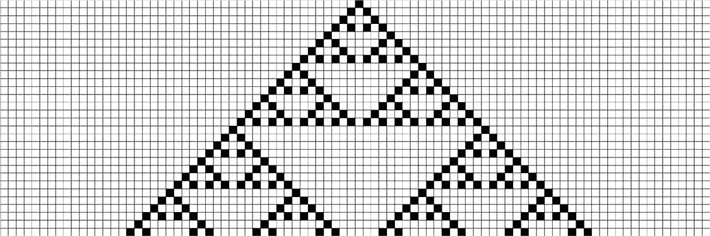

图 7.21：规则 90 的世代堆叠可视化

首先，这种数据的可视化解释完全是字面上的。它有助于展示沃尔夫勒姆的基本细胞自动机算法和结果，但它不一定应该驱动你个人的工作。你不太可能构建一个需要精确这个算法和这种可视化风格的项目。所以，虽然以这种方式学习绘制细胞自动机有助于你理解和实现细胞自动机系统，但这个技能应该仅仅作为一个基础存在。

第二点是，1D CA 用 2D 图像来可视化可能会误导人。非常重要的一点是要记住，这*不是*一个 2D CA。我只是选择将所有代数的历史记录垂直堆叠显示。这个技术通过将多次 1D 数据的实例合成一个 2D 图像，但系统本身仍然是 1D 的。稍后，我会展示一个真正的 2D CA（生命游戏），并介绍如何可视化这样的系统。

好消息是，绘制一个基本的 CA（元胞自动机）并不特别困难。我将从绘制单一的世代开始。假设每个单元格应为 10×10 的正方形：

```
let w = 10;
```

假设画布宽度为 640 像素，那么 CA 将有 64 个单元格。当然，我可以在 `setup()` 中初始化 `cells` 数组时动态计算这个值：


现在，绘制单元格的过程涉及遍历数组并根据每个单元格的状态绘制一个正方形：

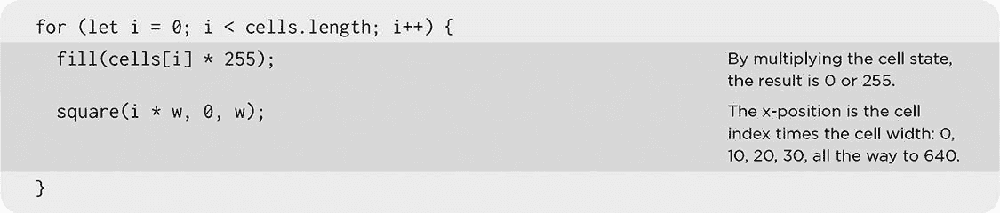

这段代码有两个问题。首先，当将状态乘以 255 时，状态为 1 的单元格将变为白色，状态为 0 的单元格将变为黑色，这与我最初的意图相反！虽然这当然没问题，因为颜色表示是任意的，但我将在完整的示例中纠正这一点。

更紧迫的问题是每个正方形的 y 位置被硬编码为 0。如果我希望各代排列成堆叠的形式，每一行单元格表示一个新的世代，那么我还需要根据世代编号计算 y 位置。我可以通过添加一个 `generation` 变量，并在 `draw()` 每次执行时将其递增来实现。通过这些改动，我现在可以查看整个草图。

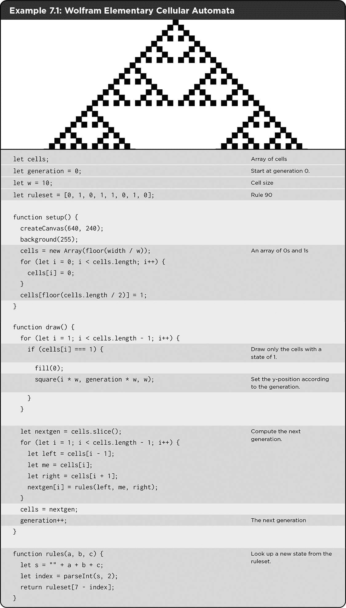

你可能已经注意到我在这个例子中所做的优化，以简化绘制过程：我加入了一个白色背景，并只绘制了黑色正方形，这节省了绘制许多正方形的工作。这个解决方案并不适用于所有情况——如果我想要多色单元格怎么办？——但是在这个简单的情况下，它提供了性能上的提升。（我还要指出，如果每个单元格的大小是 1 像素，我不会使用 p5.js 的 `square()` 函数，而是直接访问像素数组。）

尽管进行了优化，绘制代码的另一个方面依然非常低效：草图不断绘制一代又一代，延伸至画布底部之外。书中网站上的代码包括一个简单的停止条件，但你可能会想出其他方法来解决这个问题（一些方法在接下来的练习中提到）。

 **练习 7.1**

扩展 示例 7.1，使其具有以下功能：当 CA 到达画布底部时，CA 重新开始并使用新的随机规则集。

 **练习 7.2**

检查如果你用随机状态初始化第 0 代的单元格，出现的模式。

 **练习 7.3**

以非传统的方式可视化细胞自动机（CA）。打破你能打破的所有规则；不要拘泥于使用完美网格上的黑白方块。

 **练习 7.4**

创建一个细胞自动机的可视化，随着代数的增加而向上滚动，这样你就可以看到“无限”代数。提示：与其一次跟踪一代，你需要存储一代代的历史，每帧都添加一代并删除最旧的一代。

### **Wolfram 分类**

现在你已经有了可视化一个基本细胞自动机的草图，你可以为其提供任何规则集并查看结果。你可以期待哪些结果呢？正如我之前提到的，绝大多数基本细胞自动机规则集会产生视觉上乏味的结果，而一些则产生如同自然界中那样奇妙复杂的模式。Wolfram 将结果范围分为四类。

#### **类别 1：均匀性**

类别 1 的细胞自动机在经过一定代数后，最终每个单元格的状态都会保持不变。看起来并不特别激动人心。规则 222 是一个类别 1 的细胞自动机；如果你运行它足够多的代数，最终每个单元格都会变为黑色并保持不变（见 图 7.22）。

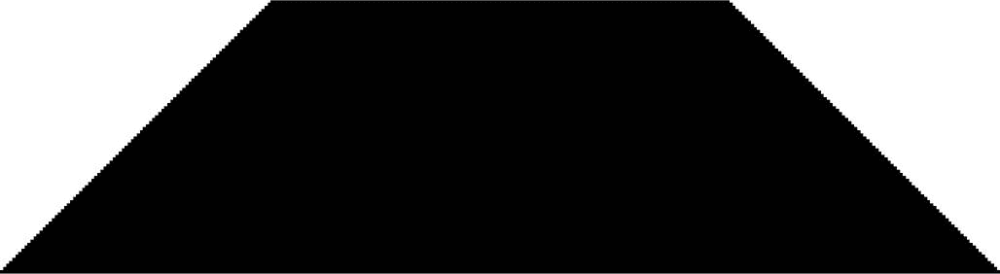

图 7.22：规则 222

#### **类别 2：重复**

像类别 1 的细胞自动机一样，类别 2 的细胞自动机保持稳定，但单元格的状态并不是恒定的。相反，它们在 0 和 1 的重复模式中振荡。在规则 190 中，每个单元格遵循序列 `11101110111011101110` （图 7.23）。

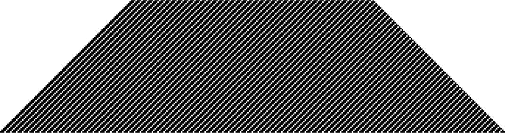

图 7.23：规则 190

#### **类别 3：随机**

类别 3 的细胞自动机看起来是随机的，并且没有明显的可辨认模式。实际上，规则 30 （图 7.24）被用作 Wolfram Mathematica 软件中的随机数生成器。你可能会惊讶地发现，像这样的简单系统，遵循简单规则，却能发展成混乱和随机的模式。

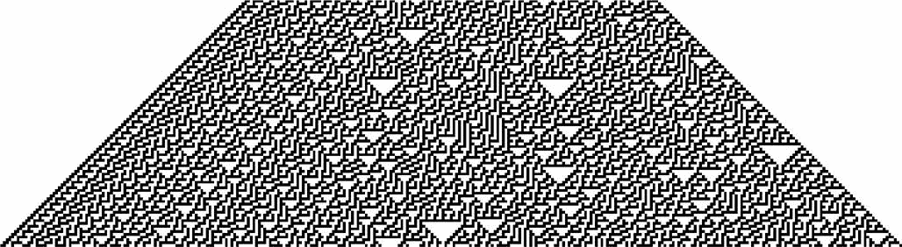

图 7.24：规则 30

#### **类别 4：复杂性**

类别 4 的细胞自动机可以看作是类别 2 和类别 3 的混合体。你可以在细胞自动机中找到重复的、振荡的模式，但这些模式出现的时间和位置是不可预测的，似乎是随机的。如果类别 3 的细胞自动机让你感到惊讶，那么像规则 110 （图 7.25）这样的类别 4 一定会让你大吃一惊！

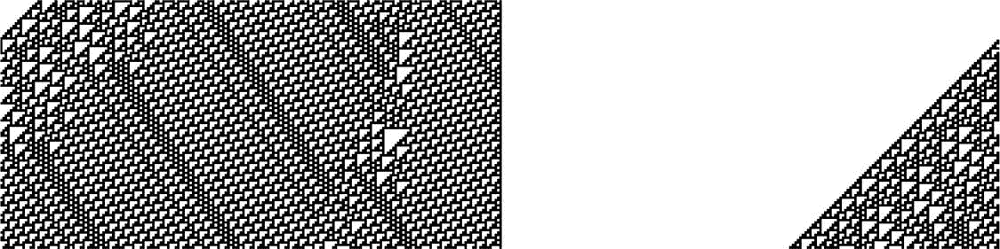

图 7.25：规则 110

在 第五章 中，我介绍了复杂系统的概念，并用群聚行为展示了简单规则如何导致涌现行为。类别 4 的细胞自动机显著地展示了复杂系统的特征，是模拟森林火灾、交通模式和疾病传播等现象的关键。细胞自动机的研究和应用始终强调类别 4 作为细胞自动机与自然之间桥梁的重要性。

### **生命游戏**

下一步是将一维元胞自动机（CA）扩展到二维：生命游戏。这将引入额外的复杂性——每个单元格将拥有更大的邻域——但随着复杂性的增加，可能的应用范围也变得更广。毕竟，大多数计算机图形学中的现象都发生在二维空间，而本章展示了如何将元胞自动机的思维方式应用于二维的 p5.js 画布。

1970 年，马丁·加德纳在《*科学美国人*》上撰写了一篇文章，记录了数学家约翰·康威的新生命游戏，并将其描述为*娱乐数学*：“要玩生命游戏，你必须有一个相当大的棋盘，并且需要大量两种颜色的平面棋子。虽然用铅笔和图纸也能操作，但特别是对于初学者来说，使用棋子和棋盘要容易得多。”

生命游戏已经变成了一种计算上的陈词滥调，许多项目展示了在 LED、屏幕、投影面等上的游戏。然而，使用代码实践构建这个系统仍然非常有价值，原因有几个。

首先，生命游戏为练习二维数组、嵌套循环等技能提供了很好的机会。然而，更重要的是，这个元胞自动机的核心原理直接与本书的核心目标相联系：用代码模拟自然世界。生命游戏的算法和技术实现将为你提供灵感和基础，帮助你构建表现出生物系统繁殖特征和行为的模拟。

与冯·诺依曼不同，后者创建了一个极其复杂的状态和规则系统，康威希望用尽可能简单的规则集来实现类似的生命般的结果。让我们看看加德纳是如何概述康威的目标的。

1.  *应该没有任何初始模式，它能够简单证明人口可以无限增长。*

1.  *应该有一些初始模式，显然会无限增长。*

1.  *应该有一些简单的初始模式，它们会持续增长并变化，经过相当长的时间后以三种方式之一结束：完全消失（由于过度拥挤或变得过于稀疏），稳定在一个配置中且之后保持不变，或进入振荡阶段，重复两种或更多周期的无尽循环。*

这听起来可能有些晦涩，但它本质上描述了沃尔夫拉姆第四类元胞自动机。该元胞自动机应该是有规律的，但随着时间推移变得不可预测，最终会趋于均匀或振荡状态。换句话说，尽管康威没有使用这个术语，生命游戏应该具备*复杂系统*的所有特性。

#### **游戏规则**

让我们看看“生命游戏”是如何运作的。这不会占用太多时间或空间，因为我可以基于沃尔夫拉姆的基础元胞自动机进行构建。首先，代替一行细胞，我现在有一个二维的细胞矩阵。与基础元胞自动机一样，可能的状态是 0 或 1。然而，在这个系统中，由于它是关于生命的，0 表示“死亡”，1 表示“存活”。

由于“生命游戏”是二维的，每个细胞的邻域现在已经扩展。如果一个邻居是相邻的细胞，那么邻域现在是九个细胞，而不是三个，正如在图 7.26 中所示。

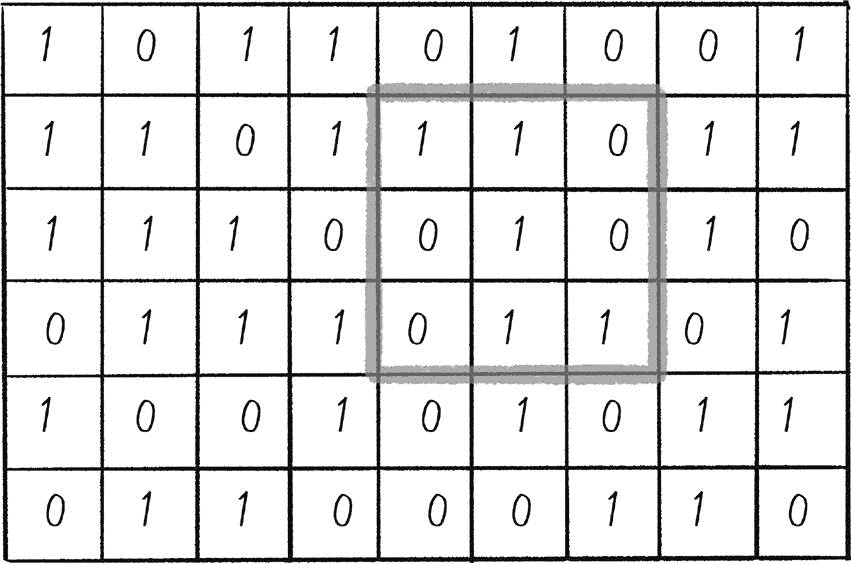

图 7.26：一个二维元胞自动机，显示九个细胞的邻域

对于三个细胞，3 位数字有八种可能的配置。对于九个细胞，有 9 位，也就是 512 种可能的邻域。在大多数情况下，为每种可能性定义一个结果是不可行的。生命游戏通过根据邻域的总体特征来定义一套规则来解决这个问题：邻域是过度拥挤，还是被死亡包围，还是刚刚好？以下是生命规则：

1.  **死亡：** 如果一个细胞存活（状态 = 1），在以下情况下它将死亡（状态变为 0）：

    +   **过度拥挤：** 如果该细胞有四个或更多的活邻居，它将死亡。

    +   **孤独：** 如果该细胞的活邻居少于或等于一个，它将死亡。

1.  **诞生：** 如果一个细胞死亡（状态 = 0），当它恰好有三个活邻居时，它将复生（状态变为 1）。

1.  **静止：** 在所有其他情况下，细胞的状态不变。两种情况是可能的：

    +   **保持存活：** 如果一个细胞存活并且有恰好两个或三个活邻居，它将保持存活。

    +   **保持死亡：** 如果一个细胞死亡并且有除了恰好三个活邻居之外的任何其他邻居，它将保持死亡。

图 7.27 展示了这些规则的一些示例。重点关注中心细胞发生了什么。

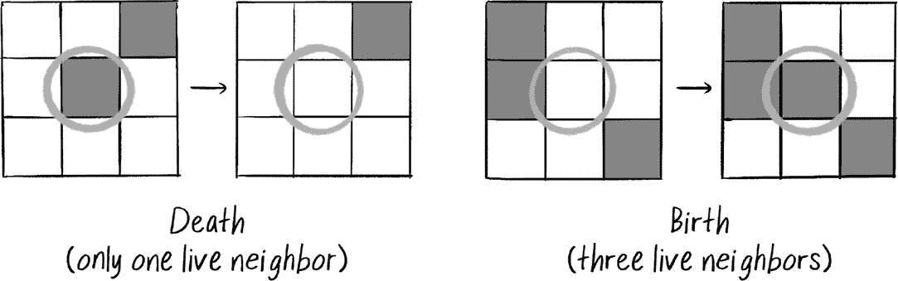

图 7.27：生命游戏中的死亡和诞生示例场景

在基础元胞自动机中，我一次可视化多个世代，按行堆叠在二维网格中。然而，在“生命游戏”中，元胞自动机是二维的。我可以尝试创建一个复杂的三维可视化结果，并将所有世代堆叠在一个立方体结构中（实际上，你可能想将此作为一个练习来尝试），但可视化生命游戏的更典型方法是将每一代视为动画中的一个单独画面。这样，你不是一次性查看所有世代，而是一次查看一个，结果看起来像是在培养皿中快速发展的细菌。

生命游戏的一个令人兴奋的方面是，一些已知的初始模式会产生有趣的结果。例如，图 7.28 中显示的模式是静止的，永远不会改变。

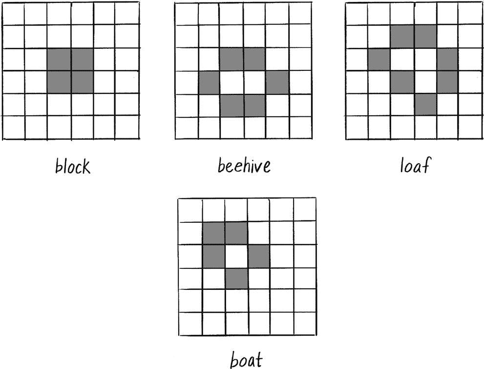

图 7.28：保持稳定的细胞初始配置

图 7.29 中的模式在两个状态之间来回振荡。

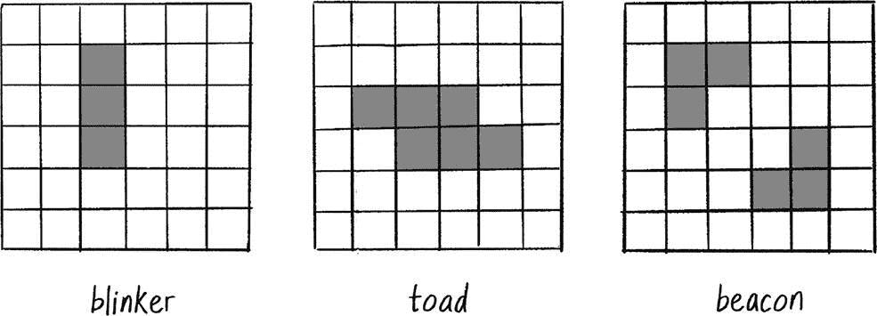

图 7.29：在两个状态之间振荡的细胞初始配置

图 7.30 中的模式看起来像是从一代到下一代在网格中移动。细胞本身并没有实际移动，但你可以看到由于相邻细胞的开关，产生了运动的错觉。

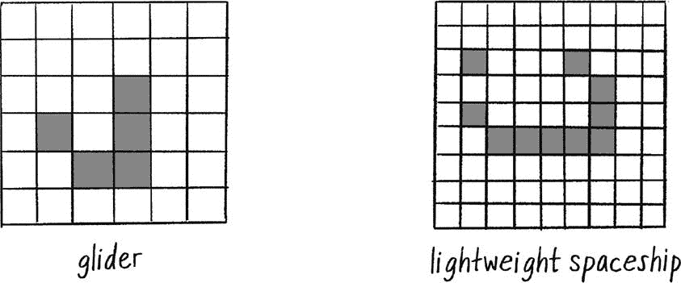

图 7.30：看似在移动的细胞初始配置

如果你对这些模式感兴趣，一些不错的“生命游戏”在线演示允许你配置 CA 的初始状态，并以不同速度观看它运行。以下是两个示例：

+   《通过 Mitchel Resnick 和 Brian Silverman，终身幼儿园小组，麻省理工学院媒体实验室探索涌现》（* [`www.playfulinvention.com/emergence`](https://www.playfulinvention.com/emergence) *）

+   Steven Klise 的 p5.js 版本的康威“生命游戏”（* [`sklise.github.io/conways-game-of-life`](https://sklise.github.io/conways-game-of-life) *）

在接下来的部分中，我将专注于随机初始化每个细胞的状态。

#### **实现**

我已经拥有了在 p5.js 中实现生命游戏所需的大部分内容：主要是，我只需要将 Wolfram CA 草图的代码扩展到二维。我之前使用了一个一维数组来存储细胞状态列表。现在，我将使用一个二维数组：

```
let w = 8;
let columns = width / w;
let rows = height / w;
let board = new Array(columns);
for (let i = 0; i < columns; i++) {
  board[i] = new Array(rows);
}
```

我将从为每个细胞初始化一个随机状态（0 或 1）开始：

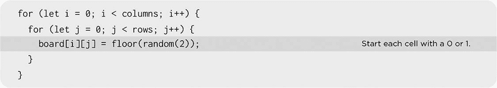

和之前一样，我需要一个额外的二维数组来接收下一代的状态，这样在处理当前代的二维数组时，就不会覆盖它。然而，与其在`setup()`和`draw()`中写出所有创建二维数组的步骤，不如编写一个根据列数和行数返回二维数组的函数。我还会将数组中的每个元素初始化为`0`，这样就不会填充`undefined`：

```
function create2DArray(columns, rows) {
  let arr = new Array(columns);
  for (let i = 0; i < columns; i++) {
    arr[i] = new Array(rows);
    for (let j = 0; j < rows; j++) {
      arr[i][j] = 0;
    }
  }
  return arr;
}
```

现在，每当需要一个新的二维数组时，我只需调用这个函数：


接下来，我需要解决如何计算每个细胞的新状态。为此，我需要确定如何引用细胞的邻居。在一维 CA 的情况下，这很简单：如果一个细胞的索引是`i`，它的邻居就是`i-1`和`i+1`。在这里，每个细胞没有单一的索引，而是有一个列和行的索引：`i,j`。如图 7.31 所示，邻居是`i-1,j-1`、`i,j-1`、`i+1,j-1`、`i-1,j`、`i+1,j`、`i-1,j+1`、`i,j+1`和`i+1,j+1`。

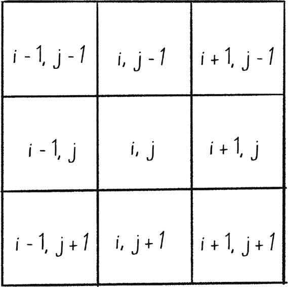

图 7.31：细胞邻域的索引值

生命游戏的规则是通过了解有多少个邻居处于“生存”状态来运作的。如果我创建一个变量`neighborSum`并对每个状态为 1 的邻居进行递增，我就能得到活着的邻居总数：

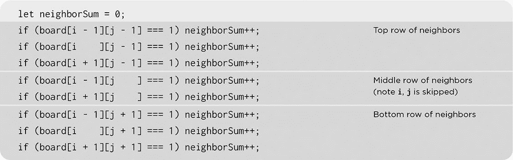

就像在沃尔夫勒姆 CA 中一样，我发现自己写了一堆`if`语句。这是另一个情况，对于教学目的，将代码写成这样逐步明确每个步骤（每当一个邻居的状态为 1 时，计数器增加）既有用又清晰。然而，说“如果单元格状态等于 1，就将 1 加到计数器”其实有点傻，因为我可以直接说：“将每个单元格状态加到计数器。”毕竟，如果状态只能是 0 或 1，那么所有邻居状态的总和将给出活跃单元格的总数。由于邻居排列成一个小的 3×3 网格，我可以引入另一个嵌套循环来更高效地计算总和：

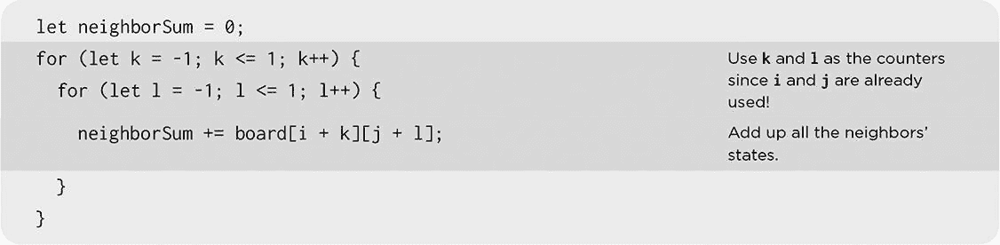

当然，我犯了一个重大错误。在生命游戏中，当前单元格不算作邻居之一。我可以加入一个条件，跳过当`k`和`l`都等于`0`时的状态添加，但另一种选择是在循环完成后再减去单元格状态：

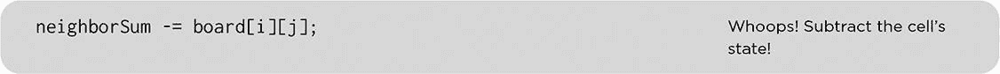

最后，当我知道了活跃邻居的总数，我可以根据规则决定单元格的新状态——出生、死亡或静止：

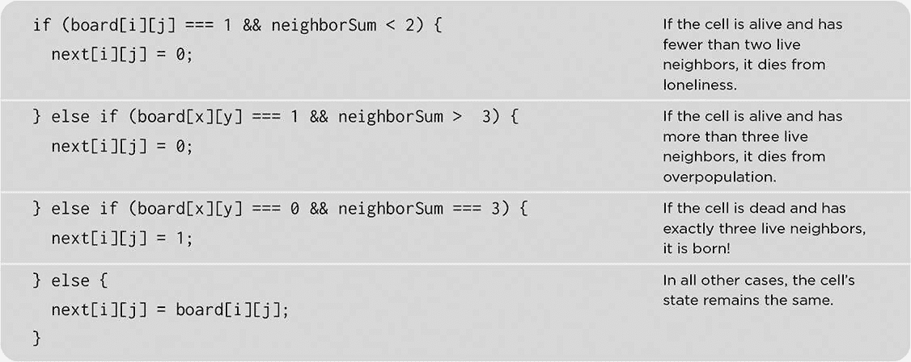

将这些内容组合起来：

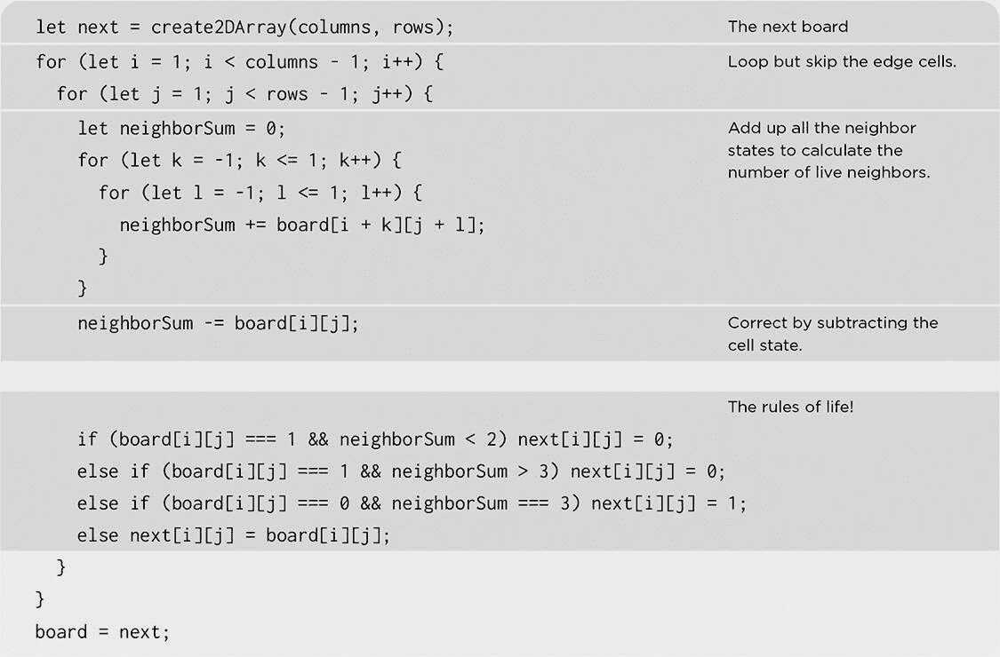

现在我只需要绘制棋盘了。我将为每个位置绘制一个方块：*关闭*时为白色，*开启*时为黑色。

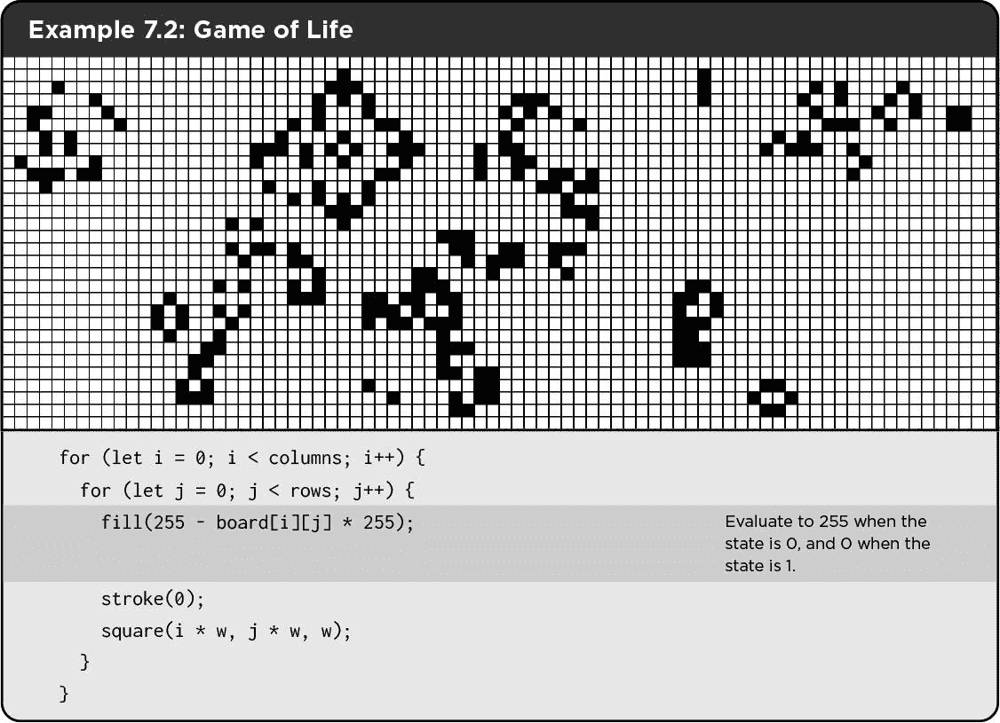

在这个例子中，我介绍了另一种根据单元格状态绘制方块的方法。记住，将单元格状态乘以 255 会给出白色填充色表示*开启*，黑色表示*关闭*。为了反转这个过程，我从 255 开始，减去单元格状态乘以 255：*开启*时为黑色，*关闭*时为白色。

 **练习 7.5**

创建一个生命游戏模拟器，允许你手动配置网格，可以通过硬编码初始单元格状态或直接在画布上绘制来配置。利用这个模拟器探索一些已知的生命游戏模式。

 **练习 7.6**

为生命游戏实现一个环绕功能，使得位于边缘的单元格在网格的另一侧也能找到邻居。

 **练习 7.7**

示例 7.2 中的代码虽然很方便，但并不是特别节省内存。它为每一帧动画创建了一个新的二维数组！对于 p5.js 应用程序来说，这影响不大，但如果你在微控制器或移动设备上实现生命游戏，你可能需要更加小心。一个解决方案是只使用两个数组，并不断交换它们，将下一个状态集写入当前数组之外的那个数组。实现这个特定的解决方案。

### **面向对象的单元格**

在本书的过程中，我建立了多个具有属性并在画布上移动的*对象*系统示例。在这一章中，尽管我一直在把单元格当作对象来讨论，但我并没有在代码中使用面向对象的原则。之所以能够这样工作，是因为单元格是一个非常简单的对象；它唯一的属性就是状态，0 或 1。但我可以在此基础上进一步开发元胞自动机系统，超越这里讨论的简单模型，通常这些开发可能涉及为每个单元格跟踪多个属性。例如，如果单元格需要记住其状态历史怎么办？或者如果你想对元胞自动机应用运动和物理学，并让单元格在画布上移动，动态地改变它们的邻居，从一帧到另一帧怎么办？

为了实现这些想法（以及更多），了解如何将每个单元格视为对象，而不是数组中的单个 0 或 1，将会非常有帮助。例如，在生命游戏模拟中，我将不再像这样初始化每个单元格：

```
     board[i][j] = floor(random(2));
```

相反，我希望得到如下的效果：

```
     board[i][j] = new Cell(floor(random(2)));
```

这里，`Cell`是我将编写的新类。一个`Cell`对象的属性是什么？在生命游戏的例子中，我可能选择创建一个存储其位置和大小以及状态的单元格：

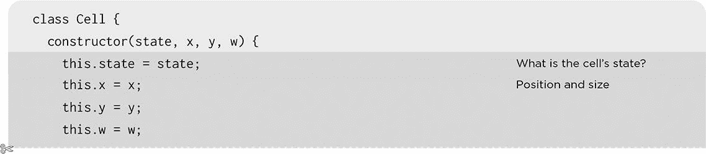

在非面向对象版本中，我使用了单独的二维数组来跟踪当前和下一代的状态。然而，通过将单元格作为对象，每个单元格可以通过引入一个“前一状态”变量来跟踪两个状态：

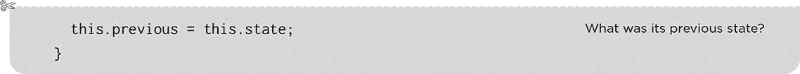

突然之间，借助这些额外的属性，单元格的可视化可以包含更多关于状态的信息。例如，如果每个单元格的颜色根据其状态是否从一个帧变化到另一个帧而变化，会怎么样？

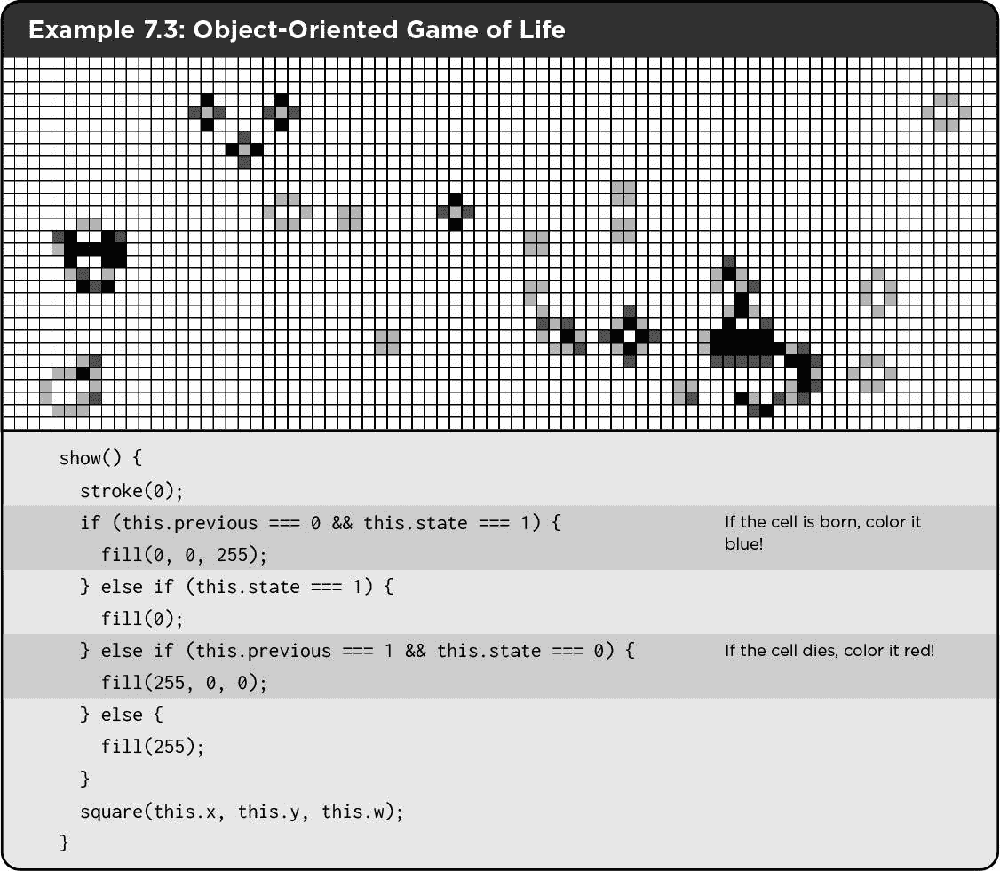

代码的其他部分不需要改变（至少对于我这里的目的来说）。邻居的计算方式仍然相同；不同之处在于，邻居的`previous`状态会被计数，单元格的新`state`属性会被更新。将这个逻辑封装到一个以`board`为参数的`calculateState()`方法中，可能也是有益的。我将这个留给你作为练习。

以下是生命游戏的逻辑，已根据单元格对象进行了调整，但不包括`calculateState()`增强功能：

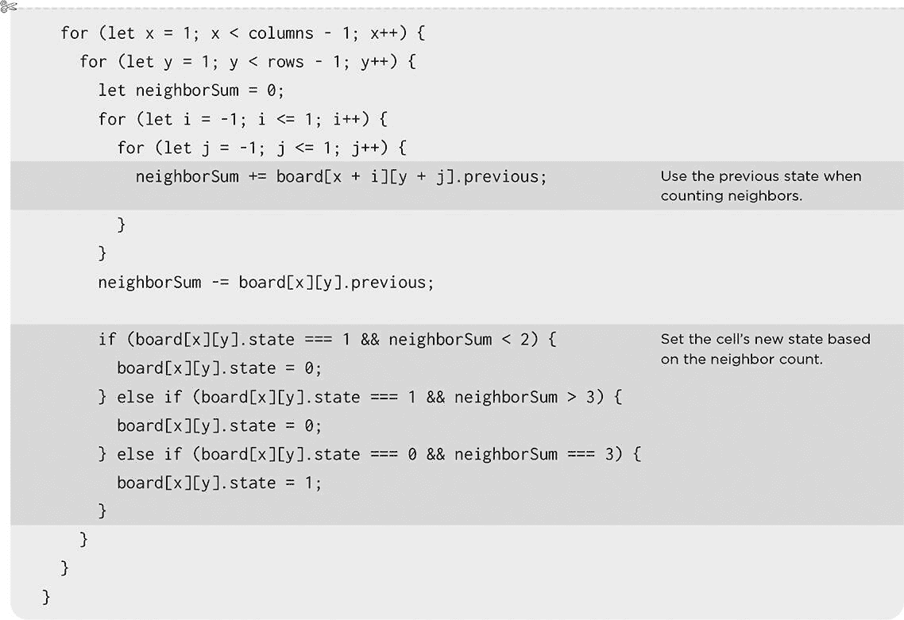

通过将单元格转换为对象，出现了许多增强单元格属性和行为的可能性。例如，假设每个单元格都有一个`lifespan`属性，该属性随着每个周期递增，并随着时间推移影响单元格的颜色或形状？或者，假设单元格有一个`terrain`属性，可能是`land`、`water`、`mountain`或`forest`。二维元胞自动机如何融入基于瓦片的战略游戏或其他场景中？

### **传统元胞自动机的变体**

现在我已经介绍了最著名的一维和二维元胞自动机的基本概念、算法和编程策略，是时候思考如何在这个代码基础上进行扩展，开发出自己工作中的创意应用。在本节中，我将讨论一些扩展元胞自动机功能的想法。有关这些习题的示范答案，请访问本书的官方网站。

#### **非矩形网格**

没有必要将单元格局限于放置在矩形网格中。如果你设计一个使用其他形状的元胞自动机会发生什么？

 **习题 7.8**

使用六边形网格（如图所示）创建一个元胞自动机，每个六边形有六个邻居。

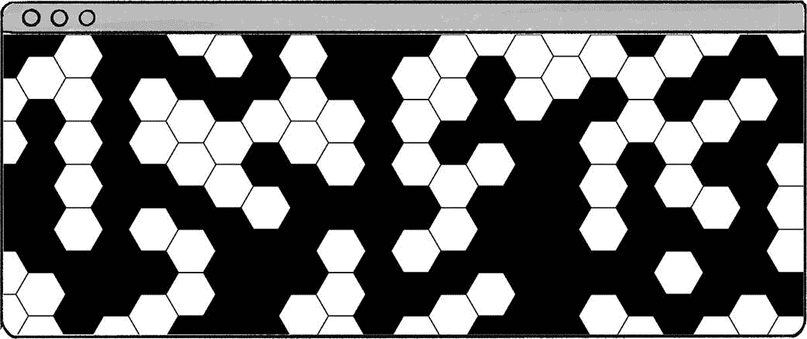

提示：你可以使用极坐标到笛卡尔坐标的转换来找到六边形的六个顶点！

```
function drawHexagon(x, y, r) {
  push();
  translate(x, y);
  stroke(0);
  beginShape();
  for (let angle = 0; angle < TWO_PI; angle += PI / 3) {
    let xoff = cos(angle) * r;
    let yoff = sin(angle) * r;
    vertex(xoff, yoff);
  }
  endShape(CLOSE);
  pop();
}
```

#### **概率性**

元胞自动机的规则不一定需要定义一个确定的结果。

 **习题 7.9**

按照以下方式重写生命游戏的规则：

+   过度拥挤：如果单元有四个或更多的生存邻居，它有 80%的概率死亡。

+   孤独：如果单元有一个或更少的生存邻居，它有 60%的概率死亡。

或者你可以自己编写概率规则！

#### **连续性**

本章重点讨论了具有有限个离散单元状态的示例——状态为 0 或 1。假如单元的状态可以是 0 到 1 之间的任何浮动数值，会怎么样呢？

 **习题 7.10**

使沃尔夫拉姆的基本元胞自动机（CA）适应浮动状态。你可以定义诸如“如果状态大于 0.5”或“如果状态小于 0.2”这样的规则。

#### **图像处理**

我之前简要提到过这一点，但许多图像处理算法的工作原理类似于元胞自动机规则。例如，模糊图像需要根据像素邻域的平均值创建新的像素。墨水在纸上扩散或水面在图像上泛起涟漪的模拟也可以通过元胞自动机规则来实现。

 **习题 7.11**

创建一个元胞自动机，其中每个像素是一个单元，且像素的颜色即为其状态。

#### **历史性**

在面向对象的生命游戏示例中，我使用了两个变量来追踪单元当前和之前的状态。如果你使用数组来追踪单元在较长时间内的状态历史会怎么样？这与*复杂适应系统*的概念有关，即一个可以通过从历史中学习，随着时间的推移改变其规则的系统。（更多关于这个概念的内容，请参见第九章和第十章。）

 **习题 7.12**

通过根据每个单元生存或死亡的时间长度为其上色来可视化生命游戏。你能否还利用单元的历史来更新规则？

#### **移动单元**

在这些基本示例中，单元格在网格上的位置是固定的，但你也可以构建一个元胞自动机，单元没有固定位置，而是可以在画布上移动。

 **习题 7.13**

在群体系统中使用元胞自动机（CA）规则。如果每个个体（boid）都有一个状态（可能影响其转向行为），并且随着它靠近或远离其他个体，邻域会从帧到帧发生变化，这会怎样呢？

#### **嵌套**

如第五章所讨论，复杂系统的一个特征是它们可以是嵌套的。城市是一个由人组成的复杂系统，一个人是由器官组成的复杂系统，一个器官是由细胞组成的复杂系统，依此类推。如何将这一点应用到元胞自动机（CA）中？

 **习题 7.14**

设计一个元胞自动机（CA），其中每个单元格都是一个较小的元胞自动机（CA）。

 **生态系统项目**

将元胞自动机（CA）融入到你的生态系统中。以下是一些可能性：

+   给每个生物一个状态。这个状态如何驱动它的行为？从元胞自动机（CA）中获取灵感，如何让这个状态根据邻居的状态随时间变化？

+   将生态系统的世界视为一个元胞自动机（CA）。生物从一个方块移动到另一个方块，每个方块都有一个状态。是陆地？水域？食物？

+   使用元胞自动机（CA）来为你的生态系统中生物的设计生成一个模式。


