## 第九章：**8 分形**

*“病态的怪物！”害怕的数学家喊道 每一个都是我眼中的刺 我讨厌皮亚诺空间和科赫曲线 我害怕康托尔三元集 谢尔宾斯基垫片让我想哭 而在百万英里外，一只蝴蝶扇动了翅膀 在一个寒冷的十一月的日子里，一个叫 Benoit Mandelbrot 的男人出生了*

—Jonathan Coulton，歌曲《Mandelbrot Set》的歌词


**查克里·玛哈·普拉萨德大厅，泰国曼谷（摄影：Saad Akhtar）**

查克里·玛哈·普拉萨德大厅位于泰国曼谷市中心的大皇宫内，是一座因其复杂细节和宏伟而闻名的建筑杰作。每一层多层屋顶都反映出自己更小或更大的版本，代表着佛教宇宙中心的梅鲁山的不同层次。

从前，我在高中上过一门叫做几何学的课，也许你也上过这样的课，学习了一维、二维甚至三维的经典形状。圆的周长是多少？矩形的面积呢？点与直线之间的距离是多少？这种几何学通常被称为**欧几里得几何**，以希腊数学家欧几里得命名，想一想，这也是我在本书中一直在讲的内容。每当我用向量描述笛卡尔空间中物体的运动时，那就是欧几里得几何。

然而，对于我们这些自然编码者，我想问一下，我们的世界*真的*能用欧几里得几何来描述吗？我现在盯着的笔记本屏幕看起来确实是一个矩形。而我今天早上吃的李子是球形的。但如果我进一步观察，考虑街道旁的树木、树上挂着的叶子、昨晚雷暴中的闪电、我晚餐吃的花椰菜、我身体中的血管，以及定义地貌的山脉和海岸线呢？正如图 8.1 所示，许多自然界中的事物与欧几里得几何的理想化几何形态相差甚远。

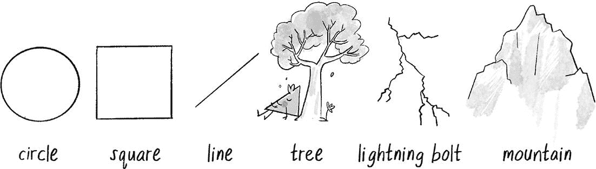

图 8.1：将理想化的欧几里得几何与自然界中的形态进行比较

如果你想开始构建具有超越基本形状（如`circle()`、`square()`和`line()`）的计算设计，是时候了解一种不同的几何学了，即*自然的几何学*：分形。本章探讨了分形背后的概念以及模拟分形几何的编程技巧。

### **什么是分形？**

**分形**（来自拉丁语*fractus*，意为“破碎”）这一术语是由数学家 Benoit Mandelbrot 于 1975 年创造的。在他的开创性著作《自然的分形几何》中，他将分形定义为“一个粗糙或碎片化的几何形状，可以被分割成多个部分，每个部分（至少大致上）是整体的一个缩小版。”

我将用两个简单的例子来说明这个定义。首先，想想树的分支结构，如图 8.2 所示。（在示例 8.6 中，我将展示如何编写代码来绘制这棵树。）

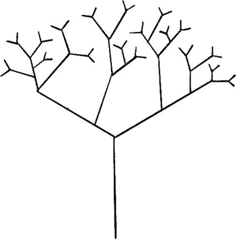

图 8.2：一棵分支的分形树

注意，这棵树有一个主干，末端连接着分支。每一根分支的末端都有新的分支，而这些分支又有分支，依此类推。如果你从树上摘下一根分支，并单独仔细观察它，就像在图 8.3 中展示的那样，会怎样呢？

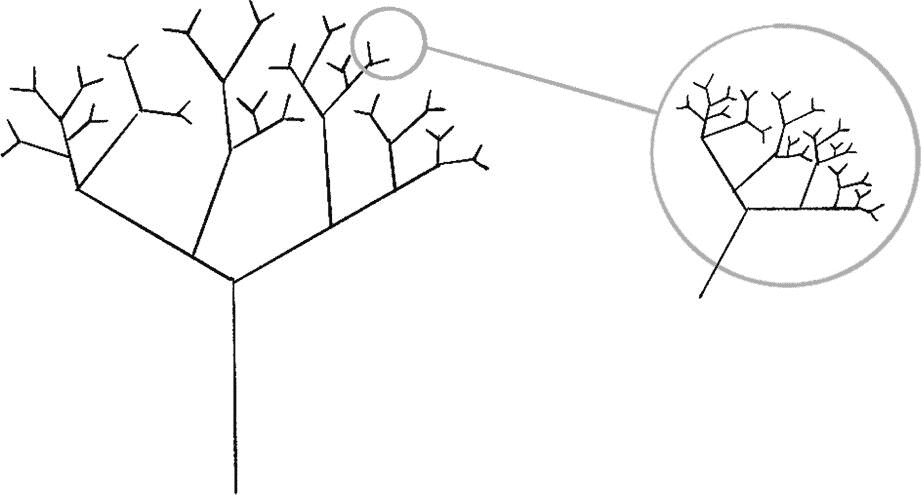

图 8.3：放大分形树的一根分支

放大的分支是整体的精确复制品，就像曼德尔布罗特所描述的那样。然而，并不是所有的分形都必须像这棵树一样完全自相似。例如，看看图 8.4，其中展示了格林兰岛（或在本土 Kalaallisut 语言中称为 Kalaallit Nunaat）海岸线的两幅插图。

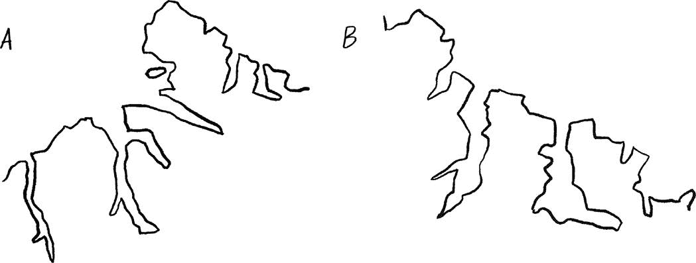

图 8.4：两条海岸线

这些插图中缺少比例尺并非偶然。我展示的是整个海岸线还是它的一小部分？没有比例尺参照，你无法知道，因为作为分形，海岸线在任何尺度下看起来本质上都是一样的。（顺便提一下，海岸线 B 展示了海岸线 A 的一个特定部分的约 3 倍放大视图。我已在图 8.5 中添加了比例尺。）

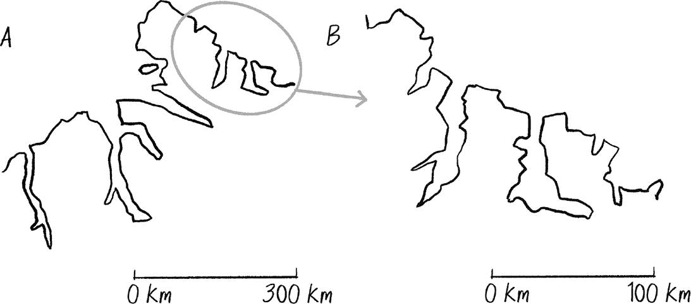

图 8.5：两条海岸线，带有比例尺

海岸线是一个**随机**分形的例子，这意味着它是由概率和随机性构建的。与**确定性**（或可预测）树状分支结构不同，随机分形是*统计上*自相似的。这意味着，即使一个模式在每个尺度上不是完全相同，形状的总体特征和感觉在你放大或缩小时依然保持不变。本章中的示例探讨了生成分形图案的确定性和随机技术。

虽然自相似性是分形的一个关键特征，但重要的是要意识到，仅凭自相似性并不能定义一个分形。毕竟，直线也是自相似的：它在任何尺度下看起来都一样，并且可以被认为由很多小直线组成。但直线并不是分形。分形的特点是，在小尺度下有精细的结构（继续放大海岸线，你会发现不断变化的波动），并且无法用欧几里得几何来描述。通常，如果你能说“那是条线！”那么它就不是分形。

 **曼德尔布罗特集**

最著名且最具辨识度的分形图案之一，以**曼德尔布罗特**命名。生成**曼德尔布罗特集合**涉及在将复杂数通过迭代函数后，测试其特性。它们是否趋向于无穷大？它们是否保持在某个范围内？

虽然这是一个引人入胜的数学讨论，但这种逃逸时间算法生成分形的方式，比我们在本章中将要探讨的递归技术更不实用。然而，生成曼德尔布罗特集合的代码已包含在在线示例中。

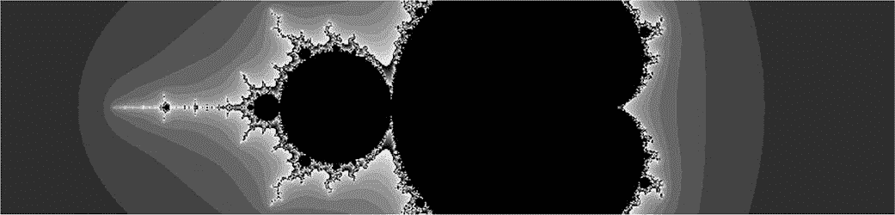

分形有着比曼德尔布罗特 1975 年出版的书籍更悠久的历史，早在各种文化中就以不同形式出现。它们几乎和自然本身一样古老。许多土著和古代社会早在西方数学正式研究分形之前，就已经将分形图案融入到他们的艺术、建筑和纺织品中。例如，赞比亚传统的巴伊拉村布局和伊斯兰建筑中的复杂几何图案，都展现了分形的特性。这些图案突显了分形在不同文化背景下的重要性以及它们的永恒魅力。

### **递归**

除了自相似性，分形几何学的另一个基本组成部分是**递归**：反复应用一个规则的过程，称为**生成规则**，即每一次迭代的结果成为下一次迭代的起点。自从分形在现代数学中首次出现以来，递归就一直是其中的核心概念。当时，德国数学家乔治·康托尔在 1883 年提出了生成无限集合的简单规则。康托尔的生成规则在图 8.6 中进行了说明。

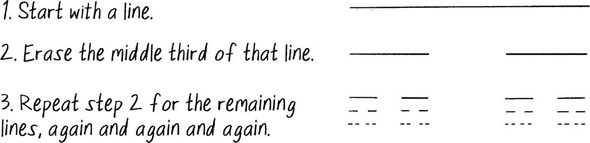

图 8.6：生成康托尔集合分形的递归指令

在康托尔的规则中，存在一个反馈循环。取一条线，将其分成两段。然后回到这两条线，应用相同的规则，每条线再分成两段。现在你有了四条线。再回到这四条线，应用规则。现在你有了八条。以此类推。这就是递归的工作方式：一个过程的输出再次输入到该过程本身，反复进行。在这种情况下，结果被称为**康托尔集合**。就像图 8.3 中的分形树一样，它是一个确定性的、完全可预测的分形，其中每一部分都是整体的精确复制品。

Cantor 对应用递归规则集进行无限次迭代后的结果非常感兴趣。然而，你我并没有无限的时间。另外，p5.js 草图的像素空间是有限的，因此最终绘制越来越小的线条变得不可能。因此，在本书中，我将主要忽略由无限递归引发的问题和悖论。相反，代码将以某种方式构建，使得规则不是“永远”应用（导致无限循环和电脑死机），而是在满足某个条件时停止。

#### **实现递归函数**

一会儿我会写一个草图，递归实现 Cantor 集。但首先，代码中的递归是什么意思？归根结底，就是在一个函数内部调用另一个函数。这本身并不新鲜。毕竟，你可能经常在函数内部调用其他函数。例如：

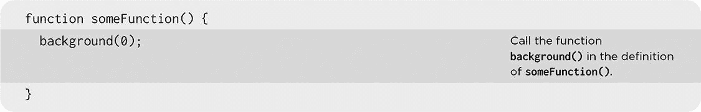

这里是递归的关键区别：如果你在定义的函数内部调用这个函数会发生什么？`someFunction()`能否调用`someFunction()`？

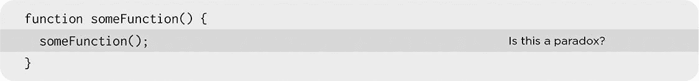

这不仅被允许，实际上还被鼓励！事实上，这对于我实现 Cantor 集的方式至关重要。调用自身的函数被称为**递归函数**，它们非常适合解决某些问题。例如，一些数学计算是递归实现的；最著名的例子就是**阶乘**。

任何数字 *n* 的阶乘，通常写作 *n*!，定义如下：

*n*! = *n* × (*n* − 1) × . . . × 3 × 2 × 1

0! = 1

这是一个使用`for`循环来计算阶乘的 JavaScript 非递归函数：

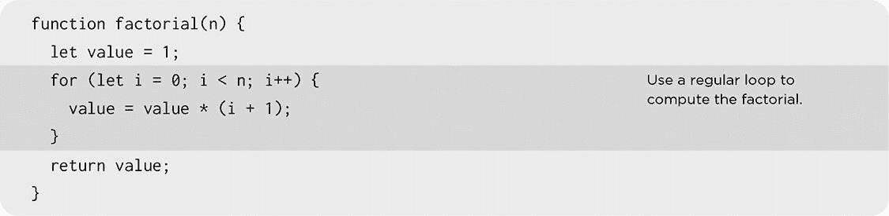

仔细观察，你会发现阶乘的运作方式很有趣。想一想 4!和 3!是如何定义的：

4! = 4 × 3 × 2 × 1

3! = 3 × 2 × 1

3! 的整个定义包含在 4! 的定义中：

4! = 4 × 3!

更一般地说，对于任何正整数 *n*，以下公式成立：

*n*! = *n* × (*n* − 1)!

0! = 1

写下来，我可以说 *n* 的阶乘定义为 *n* 乘以 *n* - 1 的阶乘。

*阶乘*的定义中包括了*阶乘*？这有点像将*比萨*定义为“包含比萨片的美味餐点”。虽然这种比萨的定义显然是荒谬的，但它突出了定义中的自引用概念，这正是递归的本质。当这种自引用应用到代码中的函数定义时，它能产生非常优雅的解决方案，比如这个递归定义的`factorial()`函数：

```
function factorial(n) {
  if (n <= 1) {
    return 1;
  } else {
    return n * factorial(n - 1);
  }
}
```

`factorial()`函数在其自身的定义中调用自己。起初看起来有些奇怪，但只要存在停止条件（在此例中为`n <= 1`），它就能工作，避免了无限递归（我使用`<=`而非`===`作为防止无限递归的保护措施，不过我应该增加额外的错误检查来处理非整数或负数输入，这样可以更符合数学上的准确性。）图 8.7 展示了当调用`factorial(4)`时所展开的步骤。

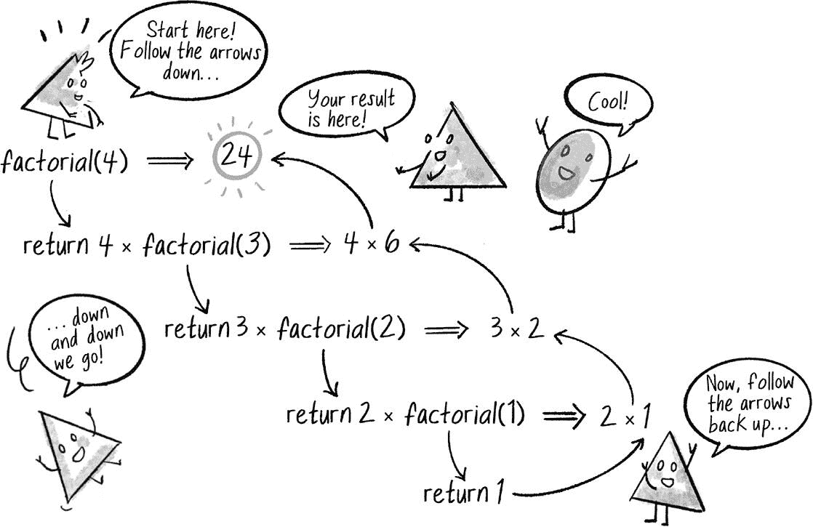

图 8.7：可视化调用递归`factorial()`函数的过程

该函数不断递归调用自身，深入嵌套的函数调用的“兔子洞”，直到达到停止条件。然后它开始从洞中向上回溯，返回值，直到回到最初的`factorial(4)`调用处。

你可以将`factorial()`函数中所示的递归原理应用到画布中的图形上，只不过这次不是返回值，而是绘制图形。这正是本章例子所展示的。首先，这里有一个简单的递归函数，用来绘制逐渐变小的圆形。

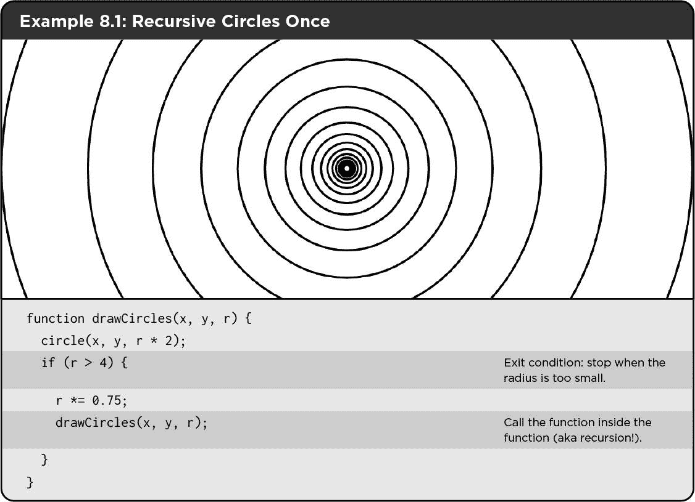

`drawCircles()`函数根据它接收的参数集合绘制一个圆形。然后，它用相同的参数调用自己，并对参数做些微调。结果是一系列圆形，每个圆形都绘制在前一个圆形内部。

就像`factorial()`函数在`n`等于`0`时停止递归一样，注意`drawCircles()`只有在半径大于`4`时才会递归调用自身。这是一个关键点。和迭代一样，*所有递归函数必须有退出条件！*你可能已经知道，所有的`for`和`while`循环必须包含一个最终会变为`false`的布尔表达式，从而退出循环。如果没有退出条件，草图将陷入无限循环。同样地，递归也如此。如果一个递归函数无限次地调用自身而没有退出条件，通常你会看到一个冻结的屏幕。然而，浏览器内置了保护机制，它不会冻结，而是会以错误信息`Maximum call stack size exceeded`退出草图。这只是另一种方式在说：“递归调用次数过多，是时候停止了！”

示例 8.1 相对简单；通过使用`for`或`while`循环的简单迭代就能轻松实现。然而，当一个函数被定义为调用自己多次时，结果变得更加有趣。在这种情况下，递归变得非常优雅。为了演示这一点，我将使`drawCircles()`稍微复杂一点：每绘制一个圆形，就在其中绘制两个半径为原来一半的新圆形，一个位于中心左侧，另一个位于中心右侧。

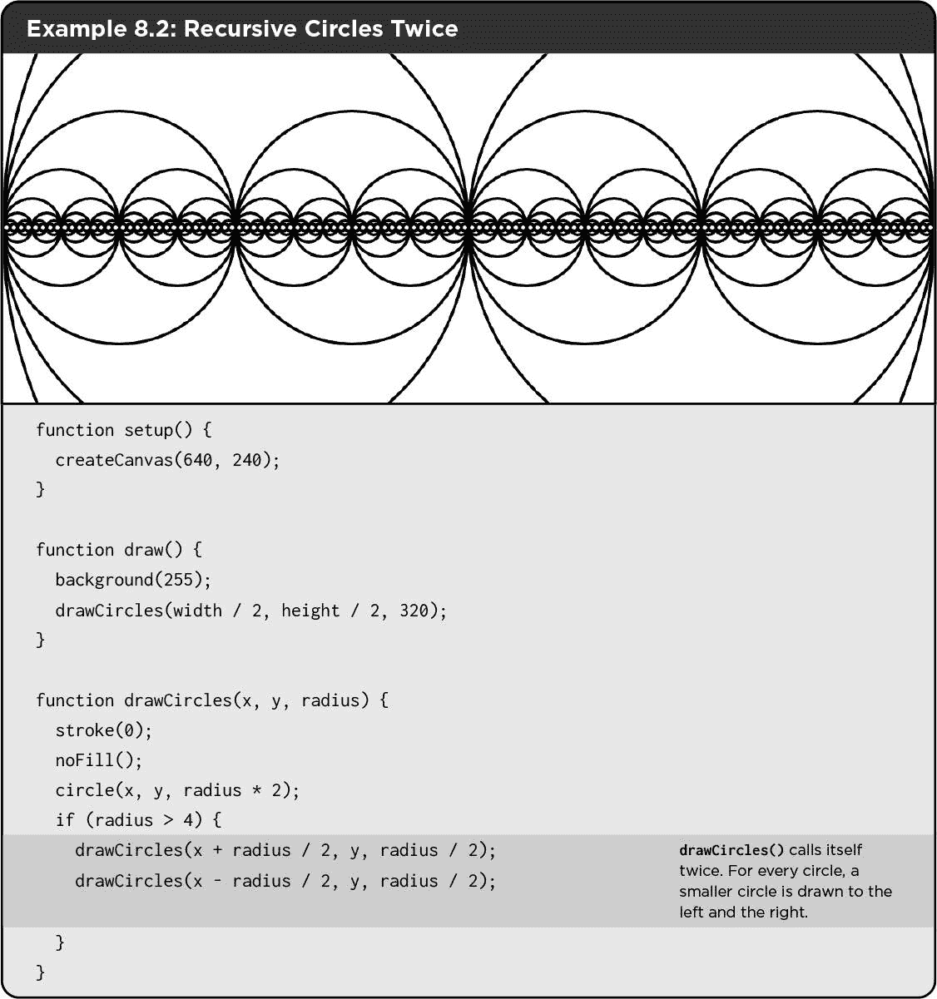

再添加两行代码，现在每个圆圈里包含了四个圆圈——分别是左、右、上和下。

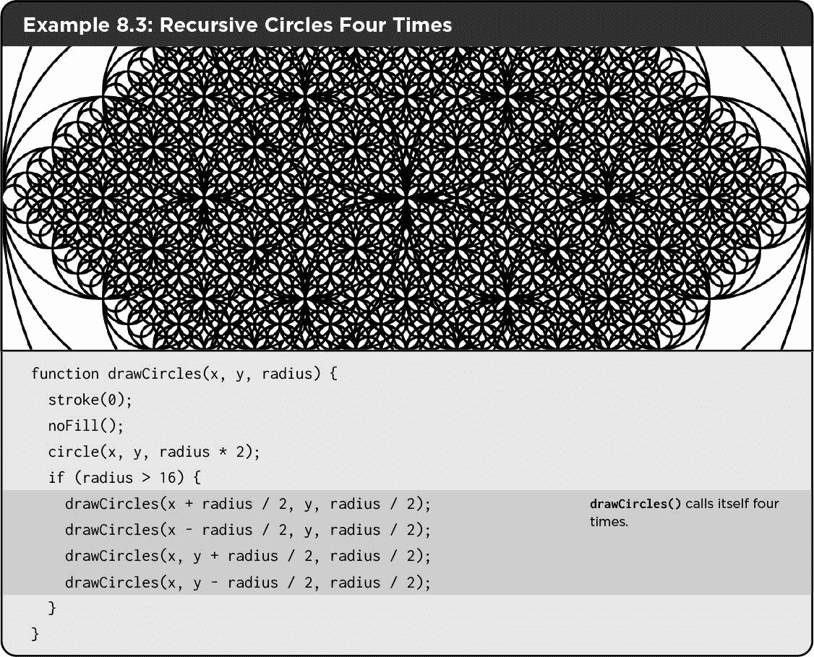

尝试用迭代代替递归来重现这个草图——我敢打赌你做不到！

#### **使用递归绘制 Cantor 集**

现在我已经展示了如何使用递归函数，我准备好在 p5.js 中可视化 Cantor 集了。我该从哪里开始呢？嗯，我知道 Cantor 集是从一条线开始的，所以我从这开始，编写一个画线的函数：

```
function cantor(x, y, length) {
  line(x, y, x + length, y);
}
```

这个函数绘制了一条长度为`length`的线，起点是像素坐标(*x*, *y*)。这条线是水平绘制的，但这是一个任意的决定。假设这个函数是这样调用的：

```
cantor(10, 20, width - 20);
```

你会看到类似于图 8.8 的结果。


图 8.8：调用一次`cantor()`的结果是一条线。

Cantor 规则通过复制原始线条并删除其中的三分之一部分来操作，剩下两条线——一条从起点到三分之一的位置，另一条从三分之二的位置到线的末端（见图 8.9）。我可以通过手动调用`line()`两次来实现这个规则，并将 y 位置下移 20 像素，这样下一代线条就会出现在第一代线条的下方。

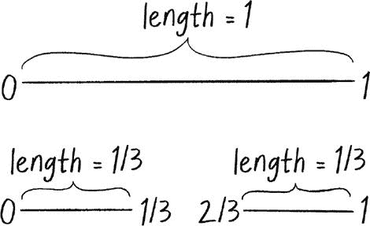

图 8.9：Cantor 集中下一代的线条是前一条线的三分之一长度。

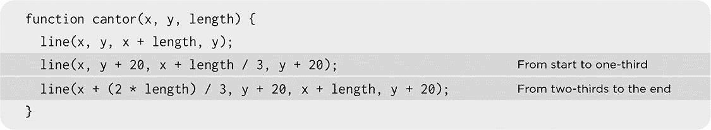

图 8.10 展示了结果。

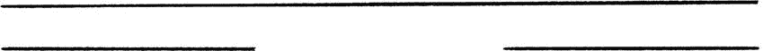

图 8.10：使用 Cantor 集规则绘制的两代线条

这种方法适用于两代，但继续手动调用`line()`会很快变得笨重。对于后续的几代，我需要调用 4 次、8 次、16 次`line()`。`for`循环通常是解决这种问题的方式，但尝试一下，你会发现为每次迭代计算数学公式变得异常复杂。不过别灰心：这时候递归就能派上用场！

看看我如何绘制第二代的第一条线，从起点到三分之一的位置：

```
  line(x, y + 20, x + length / 3, y + 20);
```

与其直接调用`line()`函数，为什么不调用`cantor()`函数呢？毕竟，`cantor()`函数到底做什么呢？它在(*x*, *y*)位置画一条给定`length`的线。`x`值保持不变，`y`值增加 20，而长度是`length / 3`：

```
  cantor(x, y + 20, length / 3);
```

这次调用`cantor()`与之前调用`line()`完全等价。而对于第二代中的下一条线，我可以再次调用`cantor()`：

```
  cantor(x + (2 * length / 3), y + 20, length / 3);
```

现在`cantor()`函数看起来是这样的：

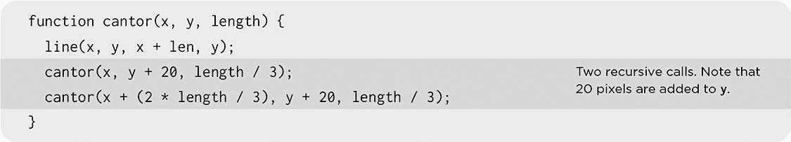

由于`cantor()`函数现在是递归的，因此相同的规则将应用于下一条线，接着是下下一条，依此类推，直到`cantor()`一次又一次地调用自己！但是，别急着运行这段代码。草图缺少一个至关重要的元素：退出条件。递归必须在某个时刻停止。在这里，我选择当线段长度小于或等于 1 像素时停止。换句话说，当`length`大于`1`时继续。


编写一个递归调用自身的函数是生成分形模式的一种简单优雅的技术，但它只允许我做绘制模式这一件事。例如，如果我想让康托集中的线条作为独立的对象存在并且可以独立移动呢？为此，我需要使用一种不同的编程方法，将递归与一个数组结合使用，该数组跟踪所有的独立部分。这正是我接下来要做的！

 **习题 8.1**

使用示例 8.2 和 8.3 作为模型，设计你自己的递归模式。以下是一个使用线条的示例。

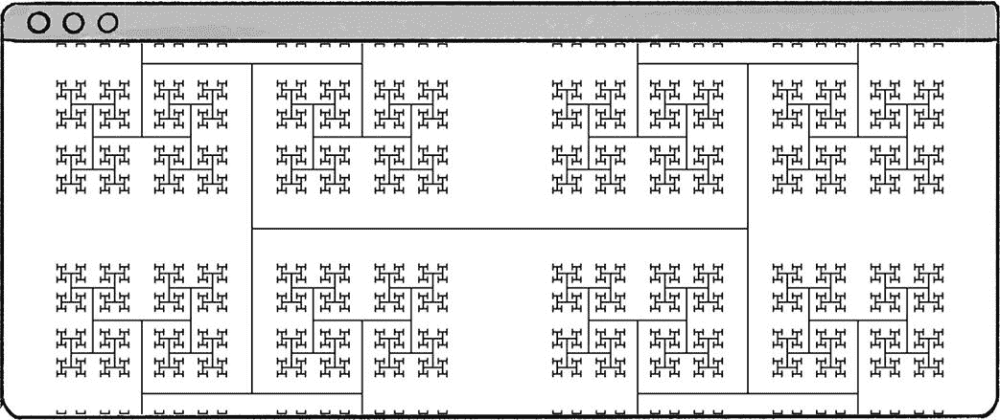

### **科赫曲线**

我现在将转向另一个著名的分形模式——**科赫曲线**，它是由瑞典数学家赫尔格·冯·科赫于 1904 年发现的。图 8.11 概述了绘制这个分形的生成规则。注意，这些规则的开始方式与康托集相同，首先是一条线，然后将其分成三等分。

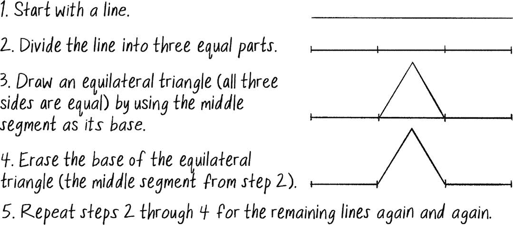

图 8.11：绘制科赫曲线的规则

图 8.12 展示了通过多次重复这些步骤后，分形的演化过程。

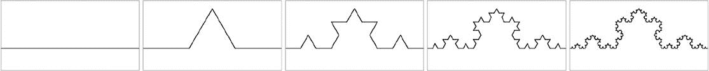

图 8.12：科赫曲线的演变

我可以像处理康托集那样进行操作，编写一个递归函数，反复迭代应用科赫规则。但我打算换一种方式解决这个问题，把科赫曲线的每一段当作一个独立的对象。这将打开一些令人兴奋的设计可能性。例如，如果每一段都是一个对象，它可以独立于原始位置移动，并参与物理模拟。此外，每一段的外观也可以有所不同，如果对象包含可自定义的属性，如颜色、线条粗细等。

 **怪物曲线**

科赫曲线和其他分形图案常被称为*数学怪物*，因为当你将递归定义应用无限次时，会出现一个奇怪的悖论。如果原始起始线段的长度为 1，那么科赫曲线的第一次迭代将得到一条长度为四分之三的线（每段长度为起始线的三分之一）。再迭代一次，你将得到十六分之九的长度。随着迭代趋向于无穷大，科赫曲线的长度也接近无穷大，但它仍然可以适应这个纸面（或屏幕）上的有限空间！

由于你在 p5.js 的有限像素空间中工作，这个理论悖论不会成为问题。你只需要限制递归应用科赫规则的次数，以免程序耗尽内存或崩溃。

为了实现将每个段落视为一个独立对象的目标，我首先必须决定这个对象应该是什么。它应该存储什么数据？它应该具备什么功能？科赫曲线是一系列相连的线段，因此我会将每个段落视为一个*KochLine*。每个`KochLine`对象都有一个起点（a）和一个终点（b）。这些点被表示为`p5.Vector`对象，线段则通过`line()`函数绘制：

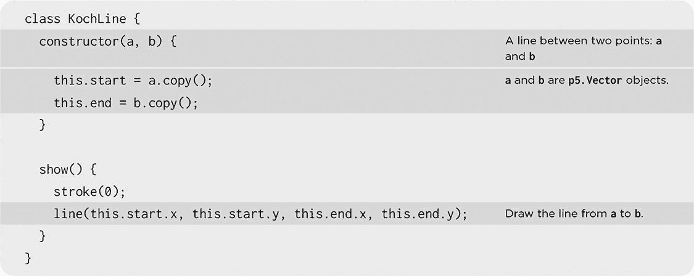

现在我有了`KochLine`类，我可以开始编写`setup()`和`draw()`了。我需要一个数据结构来追踪最终会成为许多`KochLine`对象的内容，而一个 JavaScript 数组就能很好地完成这项任务（请参见第四章以复习数组）：

```
let segments = [];
```

在`setup()`中，我将希望将第一条线段添加到数组中，这条线段从 0 延伸到画布的宽度：

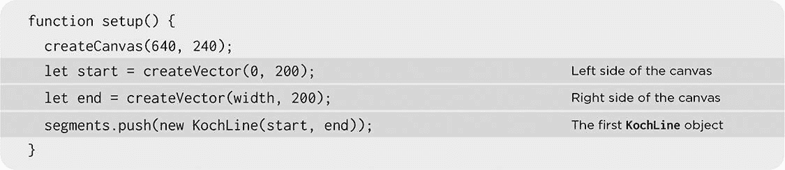

然后在`draw()`中，所有`KochLine`对象（目前只有一个）可以通过`for...of`循环渲染：

```
function draw() {
  background(255);
  for (let segment of segments) {
    segment.show();
  }
}
```

这是我草图的基础。我有一个`KochLine`类，它追踪从起点`start`到终点`end`的线段，我还有一个数组追踪所有`KochLine`对象。有了这些元素，我该如何以及在哪里应用科赫规则和递归原理呢？

还记得第七章中的生命游戏元胞自动机吗？在那个模拟中，我始终追踪着两代细胞：当前代和下一代。当我计算完下一代后，*下一代*变成*当前代*，然后我继续计算新的下一代。我将在这里应用类似的技巧。我有一个`segments`数组列出当前的线段集合（在程序开始时，只有一条）。现在我需要一个第二个数组（我叫它`next`），在这里我可以放置所有通过应用科赫规则生成的新`KochLine`对象。对于当前数组中的每一个`KochLine`，将会有四个新的线段被添加到`next`中。当我完成时，`next`数组将成为新的`segments`数组（请参见图 8.13）。

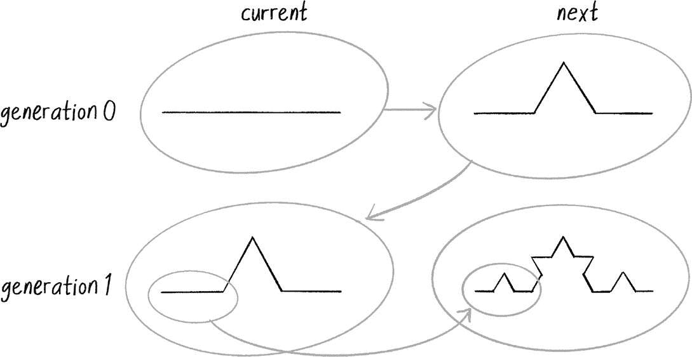

图 8.13：分形的下一代是通过当前一代计算得出的。然后，*next*变为新的*current*，在一代到另一代的过渡中。

代码如下所示：

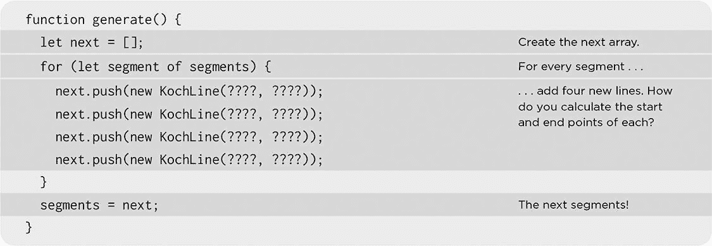

通过反复调用`generate()`，Koch 曲线的规则将递归应用到现有的`KochLine`线段集合中。但是，当然，我跳过了函数的真正工作：我如何将一条线段按照规则分割成四个部分？我需要一种方法来计算每条线段的起点和终点。

因为`KochLine`类使用`p5.Vector`对象来存储起点和终点，这是一个很好的机会，来练习第一章中的所有向量数学知识，以及第三章中的一些三角学知识。首先，我需要确定问题的范围：每个`KochLine`对象需要计算多少个点？图 8.14 给出了答案。


图 8.14：两个点变成五个点。

正如图中所示，我需要将两个点（*start*，*end*）转化为五个点（*a*，*b*，*c*，*d*，*e*），从而生成四个新的线段（*a* → *b*，*b* → *c*，*c* → *d*，*d* → *e*）：

```
    next.add(new KochLine(a, b));
    next.add(new KochLine(b, c));
    next.add(new KochLine(c, d));
    next.add(new KochLine(d, e));
```

那么，我从哪里获得这些点呢？为什么不直接让`KochLine`对象为我计算它们呢？


等等，让我们仔细看看这一行代码：


正如你可能记得的，在第六章中，我解释了**对象解构**，这是一种从对象中提取属性并将它们分配给各个变量的方法。猜猜看？你也可以对数组做同样的事情！在这里，只要`kochPoints()`方法返回一个包含五个元素的数组，我就可以方便地将它们解构并分别赋值给：`a`、`b`、`c`、`d`和`e`。这是一种处理多个返回值的漂亮方法。就像对象解构一样，**数组解构**使得代码保持整洁。

现在，我只需要在`KochLine`类中写一个新的`kochPoints()`方法，返回一个`p5.Vector`对象数组，表示图 8.15 中的点*a*到*e*。我将首先处理最简单的*a*和*e*——它们只是原始线段的`start`和`end`点的副本：

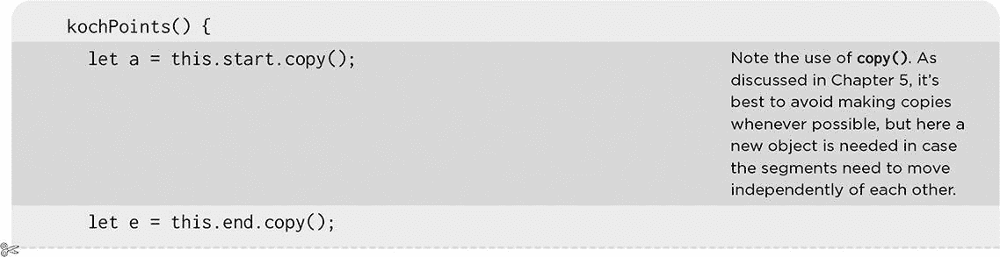

那么，点*b*和*d*呢？点*b*在线段上是三分之一的位置，点*d*则在两分之二的位置。如图 8.15 所示，如果我创建一个指向原始*start*到*end*的向量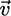，我可以通过将其大小缩放为三分之一来获得新的*b*，将其大小缩放为三分之二来获得新的*d*。

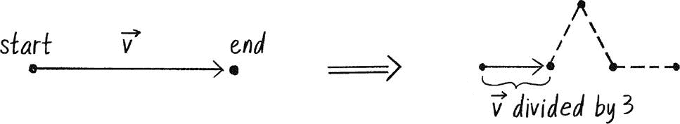

图 8.15：原始线段作为向量 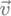，可以通过三等分来找到下一代点的位置。

下面是代码实现：

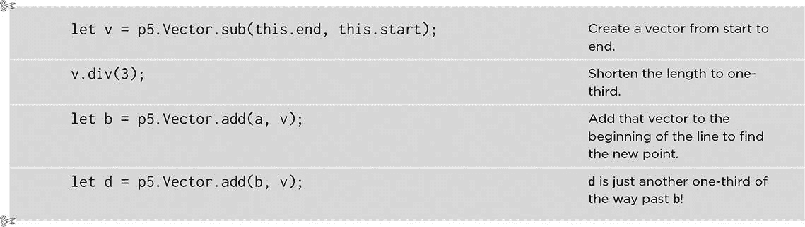

最后的点，*c*，是最难计算的。然而，如果你考虑到等边三角形的角度都是 60 度，这就使得你的工作突然变得容易了。如果你知道如何通过一个三分之一长度的向量找到新的*b*，那么如果你将这个相同的向量旋转 60 度（或π/3 弧度）并加到*b*上，就像在图 8.16 中那样，你就能得到*c*！

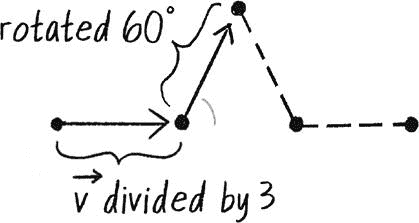

图 8.16：向量  旋转 60 度来找到第三个点。

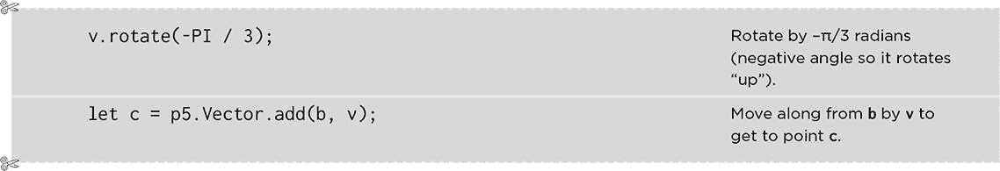

最后，在计算出五个点后，我可以将它们一起返回一个数组。这将匹配之前概述的将数组解构成五个独立变量的代码：

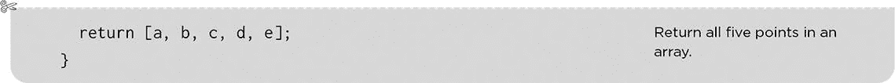

现在剩下的就是在`setup()`中调用`generate()`一定次数（比如五次），以计算出该代的科赫线段。

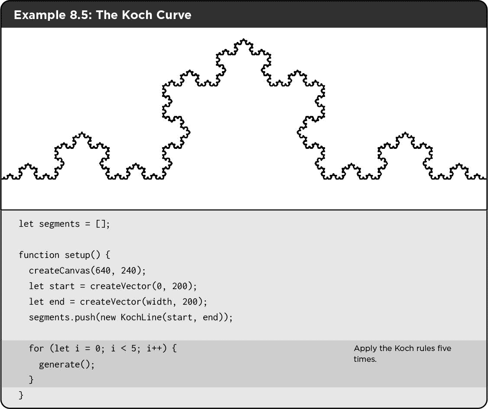

在这个例子中，我选择调用`generate()`五次。每次应用科赫规则时，线段的数量会呈指数增长。这是一个任意的决定，但经过五次迭代后，我得到了 1,024 个线段，这为观察模式提供了相当多的细节。不过，你也可以选择使用前面示例中的方法，设定最小线段长度的阈值，并在线段变得过小之前一直调用`generate()`。另外，你也可以考虑一个交互选项，设置一个按钮，每按一次按钮就将形状推进到下一代。

 **练习 8.2**

绘制科赫雪花，它由三个科赫曲线组成，排列成一个三角形。或者绘制科赫曲线的其他变体。

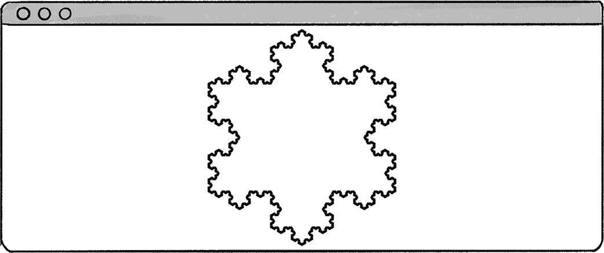

 **练习 8.3**

尝试动画化科赫曲线。例如，你能从左到右绘制它吗？你能改变线段的视觉设计吗？你能使用前面章节中的技术移动线段吗？如果你将每个线段做成弹簧（Toxiclibs.js）或约束（Matter.js）会怎么样？

 **练习 8.4**

使用对象和数组重写康托集示例。

 **练习 8.5**

使用递归绘制谢尔宾斯基三角形（如第七章中的沃尔夫勒姆初等 CA 所示）。

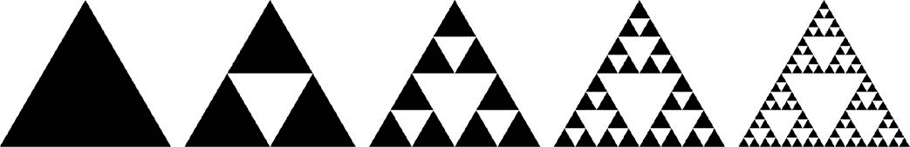

### **树**

本章迄今为止呈现的分形是确定性的：它们没有内建的随机性，每次运行时都会产生相同的结果。虽然这为经典分形模式和绘制它们的编程技巧提供了很好的介绍，但结果看起来过于精确，似乎不够有机。

在本节中，我将进一步接近自然世界，通过一个分支分形树的案例研究。我将从一个确定性版本开始。然后，我会引入随机性元素，说明生成随机（或非确定性）分形的技巧，这些分形的结果每次运行时都可能不同。

#### **确定性版本**

图 8.17 概述了绘制分形树的确定性生成规则。

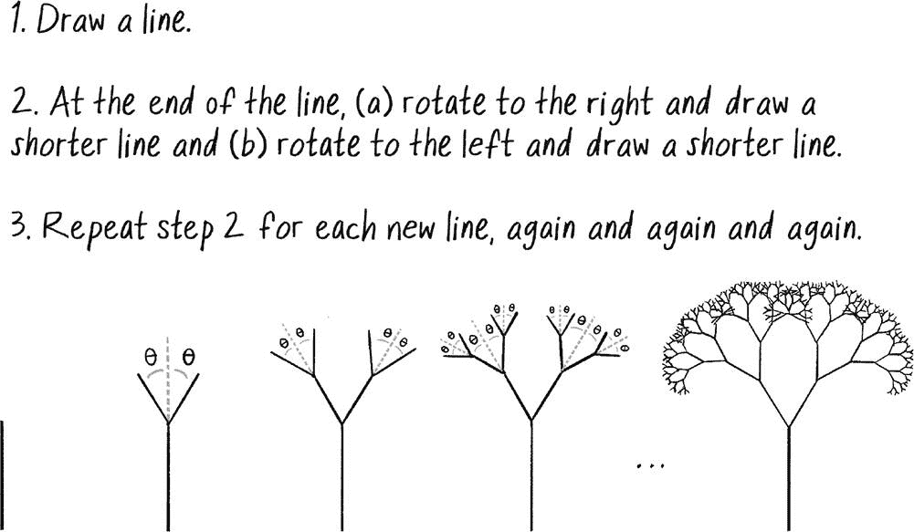

图 8.17：每一代分形树，遵循给定的生成规则。最终的树是几代之后的结果。

我再次得到一个很好的分形，其递归定义是：一根树枝是一条线，且有两根树枝与之相连。与之前的分形相比，这个分形稍微复杂一些，因为在分形规则中使用了*rotate*一词。每一根新树枝必须相对于上一根树枝进行旋转，而上一根树枝又是相对于它所有的前一根树枝进行旋转。幸运的是，p5.js 提供了一个机制来跟踪旋转：**变换**。

我在第三章中简要介绍了变换。它们是一组函数，如`translate()`、`rotate()`、`scale()`、`push()`和`pop()`，这些函数允许你改变草图中形状的位置、方向和大小。`translate()`函数用于平移坐标系，`rotate()`用于旋转坐标系，`push()`和`pop()`帮助保存和恢复当前的变换状态。如果你不熟悉这些函数，我在 Coding Train 网站上提供了一组关于 p5.js 变换的视频 (*[`thecodingtrain.com/transformations`](https://thecodingtrain.com/transformations)*)。

我将从画一根树枝开始，即树干。由于我将使用`rotate()`函数，我需要确保在绘制过程中不断地沿着树枝进行平移。记住，在 p5.js 中，当你进行旋转时，你总是围绕原点（即点 (0, 0)）进行旋转，所以在这里，原点必须始终平移到下一根正在绘制的树枝的起点（相当于上一根树枝的末端）。由于树干从窗口的底部开始，我首先需要平移到那个位置：

```
translate(width / 2, height);
```

然后，我可以将树干画成一条向上的线：

```
line(0, 0, 0, -100);
```

一旦我画完了这条线，我必须平移到这条线的末端并进行旋转，以便绘制下一根树枝，正如图 8.18 中所示。（最终，我需要将目前的操作封装成一个递归函数，但我会先理清单个步骤。）


图 8.18：绘制一条线的过程，平移到线的末端，并按一个角度旋转

这里是图 8.18 中所示过程的代码。我使用了 30 度的角度，或者π/6 弧度：


现在我已经有了一个向右的分支，我需要一个向左的分支（见图 8.19）。为此，我应该在旋转并绘制右侧分支之前使用`push()`保存变换状态。然后，我可以在绘制完右侧分支后调用`pop()`恢复该状态，使我回到正确的位置来旋转并绘制左侧分支。

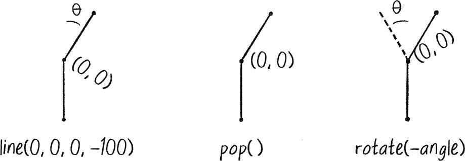

图 8.19：在“弹出”回去后，一个新的分支旋转到左侧。

下面是所有代码的完整版本：

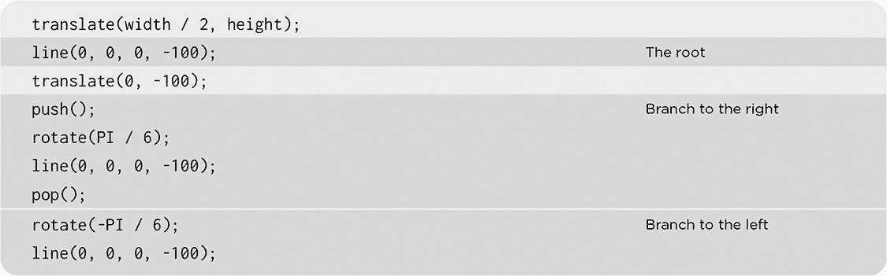

把每次调用`line()`函数当作一个分支，你就能开始看到这段代码是如何实现分支定义的：一条线的末端连接着两条线。我可以不断地添加更多的`line()`调用，绘制更多的分支，但就像 Cantor 集合和 Koch 曲线一样，我的代码很快就会变得极其复杂且难以管理。相反，我将使用已编写的代码作为`branch()`函数的基础，用递归调用`branch()`来替代第二和第三个`line()`调用：

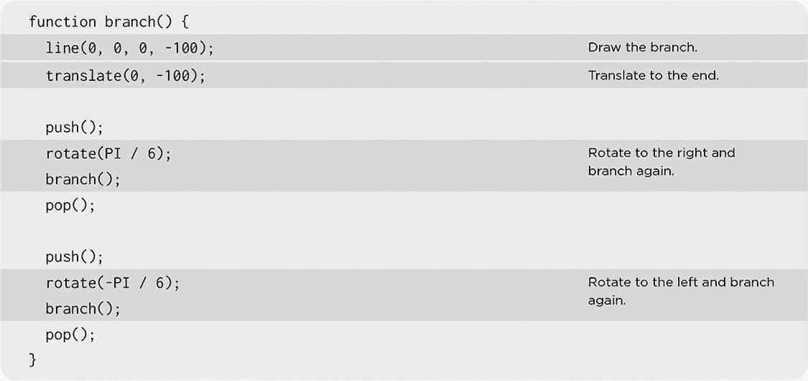

注意，我在每对`rotate()`和`branch()`函数调用之间使用了`push()`和`pop()`。这是一个优雅的代码解决方案，感觉像是魔法。在每次调用`branch()`之前，代码会花一点时间记住该分支的起始位置，以便稍后返回。如果你暂时把自己当作 p5.js，并试图用铅笔和纸跟踪递归函数，你会注意到你首先会把所有的分支绘制到右边。在右边的最末端，`pop()`会让你回到所有已经绘制的分支，这样你就可以绘制左边的分支。

 **练习 8.6**

跟踪绘制分支的递归算法，并在图中按 p5.js 实际绘制的顺序为每个分支编号。

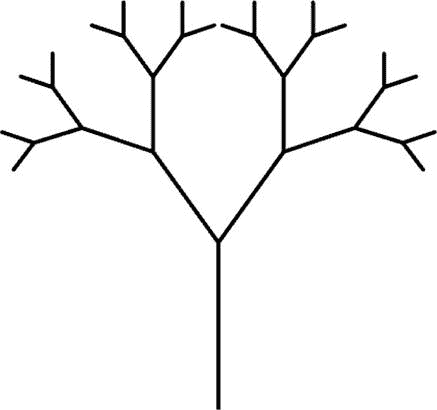

你可能已经注意到，当前写的递归函数存在一个重大问题：它没有退出条件，因此会陷入无限递归调用。此外，树的分支在每一层应该变短，但到目前为止，我将每个分支的长度硬编码为 100 像素。这两个问题的解决方案是相互关联的——如果分支在每一代中变短，我就可以在分支变得太短时让函数停止递归：

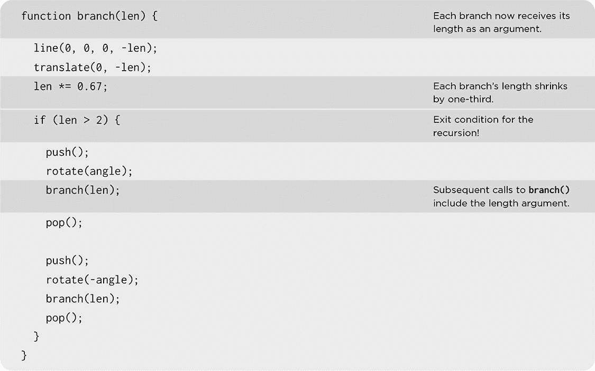

我还添加了一个`angle`变量。在完成的示例中，角度由`mouseX`位置控制。

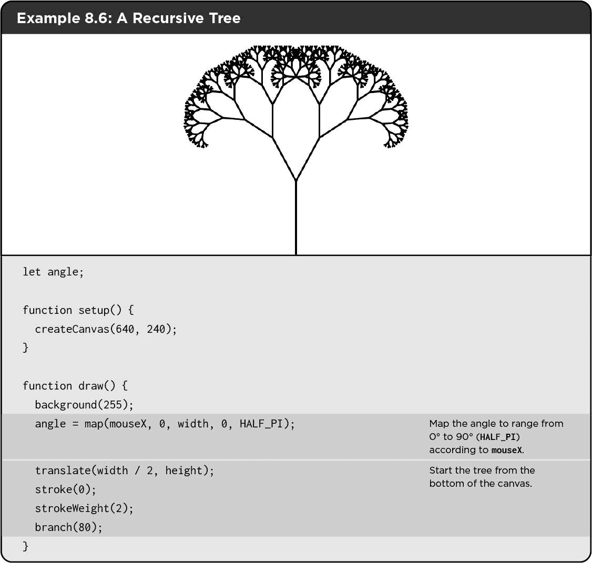

递归的`branch()`函数提供了一种简洁优雅的方式来绘制树，且代码量非常少。然而，这种方法限制了动画的潜力。通过采用类似 Koch 曲线的方法，将每个分支段作为对象存储在数组中，你可以探索创意的方式来为树的生长添加动画，甚至可以为分支加入物理效果！

 **练习 8.7**

为每个分支设置不同的`strokeWeight()`。让树干粗壮，随后每个分支逐渐变细。

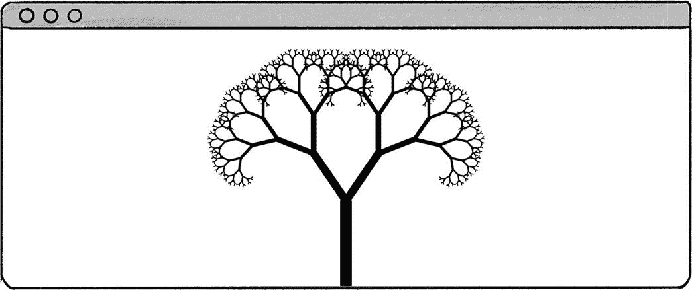

 **练习 8.8**

使用`Branch`类和一个数组来重新创建树，并跟踪各个分支。（提示：你需要使用向量数学来跟踪分支的方向和长度，而不是使用 p5.js 的变换。）你能为树的生长做动画吗？怎么在分支的末端画叶子？

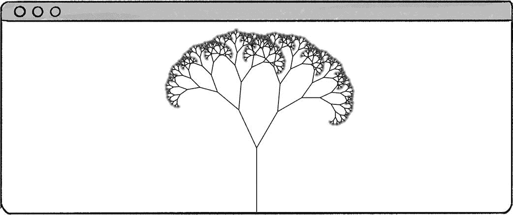

#### **随机版本**

初看之下（且在合适的角度下），可能会觉得我在前面的示例中画了一棵很逼真的树，但仔细观察会发现结果有点过于完美。走到外面看看真实的树，你会发现每个分支的长度和角度都不一样，更别提并非所有的分支都完全分成两根较小的分支。分形树是一个很好的例子，它展示了加入一点随机性如何让最终的效果看起来更加自然。这点随机性也把分形从确定性转变为随机性——每次绘制的结果都会有所不同，但依然保留了树状结构的整体特点。

首先，试着为每个分支的角度加上一些随机性？这很容易，只需要加入`random()`就可以：

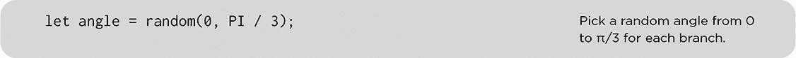

在原始示例中，`branch()`函数总是调用自己两次。现在，为了增加多样性，我会为每个分支随机选择一个分支数量（每个分支有一个随机角度）。

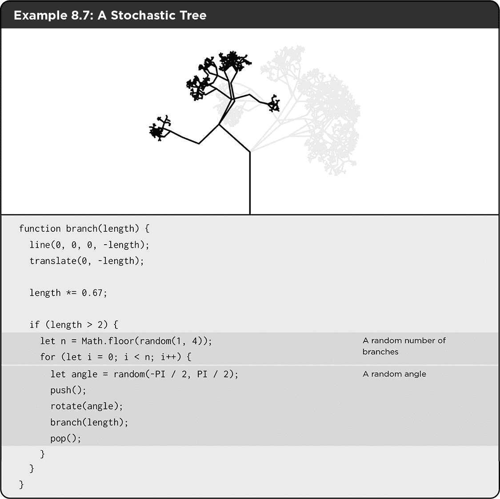

示例 8.7 展示了角度和分支数量的随机性使用，但也许它做得过头了：结果中的树依然看起来不够自然。为了让树看起来更自然，你可以尝试缩小随机角度的范围，或者使用 Perlin 噪声来实现更平滑的角度变化。

 **练习 8.9**

根据 Perlin 噪声值设置树枝的角度。随着时间推移调整噪声值，给树添加动画。看看你能不能让它看起来像是在风中摇摆。

 **练习 8.10**

使用 Toxiclibs.js 模拟树木的物理效果。树的每个分支可以由两个粒子通过弹簧连接起来。你怎么让树保持直立而不倒下？

### **L-系统**

1968 年，匈牙利植物学家阿里斯提德·林登迈尔（Aristid Lindenmayer）开发了一种基于语法的系统，用于模拟植物的生长模式。这个系统使用文本符号和一组特定的规则来生成模式，类似于语言的语法定义了用单词构建句子的规则。这个被称为**L 系统**（**林登迈尔系统**）的技术，可以用来生成本章至今展示的递归分形模式。L 系统还具有额外的价值，因为它们提供了一种机制，使用简单的符号跟踪需要复杂且多面的生成规则的分形结构。

在 p5.js 中实现 L 系统需要使用递归、变换和文本字符串。本章已经介绍了递归和变换，但字符串是新的概念。这里有一段简短的代码示例，展示了与文本相关的 L 系统的三个重要方面：创建、连接和迭代字符串。你可以参考本书网站获取更多字符串的资源和教程。

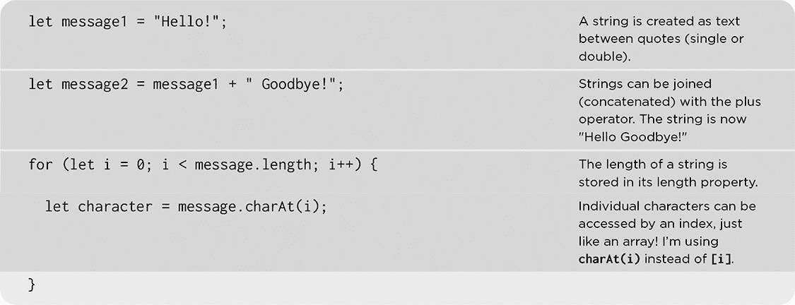

一个 L 系统有三个主要组成部分：

+   **字母表：** 一个 L 系统的字母表包括可以包含的有效字符。例如，我可以说字母表是 ABC，这意味着 L 系统中任何有效的“句子”（一串字符）只能包含这三个字符。

+   **公理：** 公理是一个句子（由字母表中的字符创建），描述系统的初始状态。例如，使用字母表 ABC，一个可能的公理可以是 AAA、B 或 ACBAB。

+   **规则：** L 系统的生成规则描述了变换句子的方法。这些规则是递归应用的，从公理开始，一次又一次地生成新的句子。L 系统的规则包括两个句子，一个是*前驱*，另一个是*后继*。例如，规则 A → AB 表示在句子中每个出现 A（前驱）的地方，在下一代中应该用 AB（后继）替换。

我将从一个简单的 L 系统开始。事实上，这是林登迈尔的原始 L 系统，它模拟了藻类的生长。以下是它的组成部分：

| 字母表 | A, B |
| --- | --- |
| 公理 | A |
| 规则 | A → AB B → A |

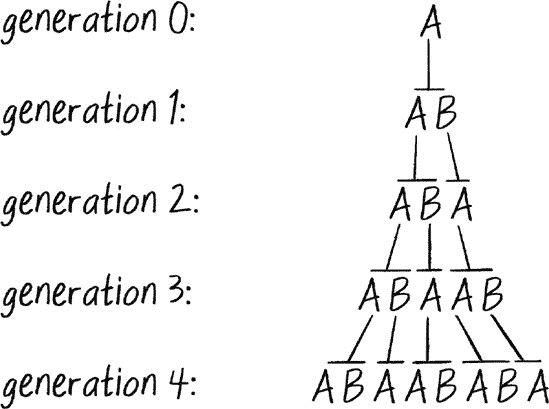

图 8.20：依此类推……

这个 L 系统的字母表包含两个字符，并且有两个简单的规则：将 A 替换为 AB，将 B 替换为 A。与递归分形图形一样，我可以将 L 系统规则的每次应用视为一次世代。世代 0 按定义是公理（A），每个后续的世代显示将生成规则应用于当前世代的结果。图 8.20 展示了这个 L 系统发展的几个世代。

如何用代码实现这个 L 系统呢？我将从将包含公理的字符串存储在一个变量中开始。这个变量我命名为`current`，因为它将始终存储当前代际（从公理开始）：

```
let current = "A";
```

再次像在生命游戏和科赫曲线中一样，我现在需要一个完全独立的字符串来表示下一代：

```
let next = "";
```

现在是时候将生产规则应用到`current`并将结果写入`next`了：

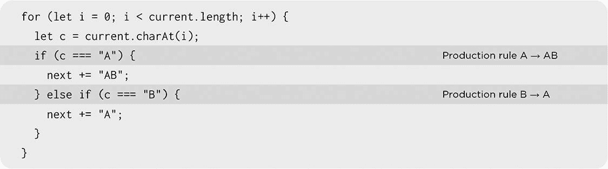

当`for`循环结束时，`current`被设置为`next`：

```
current = next;
```

为了确保这段代码有效，我将其打包成一个名为`generate()`的函数，并使用循环多次调用`generate()`，将当前字符串绘制到画布上。

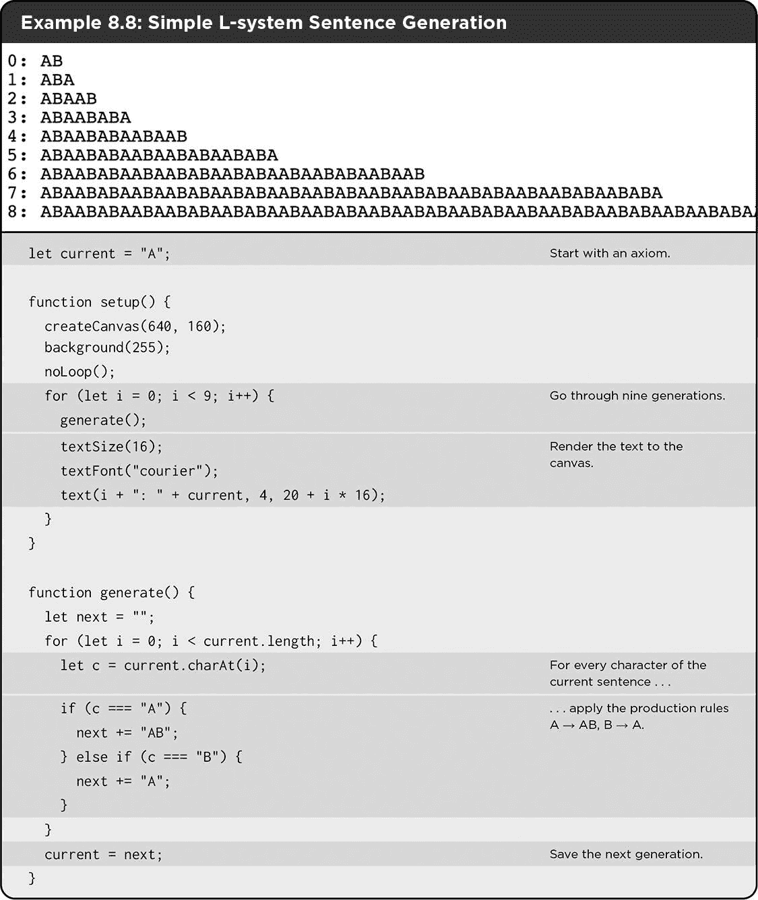

现在，你可能在想：“这一切都很有趣，但到底有什么意义呢？毕竟，这一章不就是应该讲如何*绘制*分形图案吗？我能理解 L 系统句子结构的递归性与分形的递归性有关系，但它是如何在视觉上模拟植物生长的呢？据我所知，没有植物会长出 A 和 B。”

直到现在我还没有提到的一点是，这些 L 系统的句子中嵌入了绘图指令，这就是林登梅耶（Lindenmayer）能够将字符串转换为植物的有机结构的原因。为了展示这如何工作，下面是另一个示例系统：

| 字母表 | A, B |
| --- | --- |
| 公理 | A |
| 规则 | A → ABA B → BBB |

以下是这个 L 系统在几代中的演变过程：

| 代际 0 | A |
| --- | --- |
| 第一代 | ABA |
| 第二代 | ABABBBABA |
| 第三代 | ABABBBABABBBBBBBBBABABBBABA |

为了将其转化为绘图，我将按如下方式翻译系统的字母表：

| A | 向前画一条线。 |
| --- | --- |
| B | 向前移动（不画线）。 |

拥有这个翻译后，我可以将每一代的句子视为绘图指令。图 8.21 展示了结果。

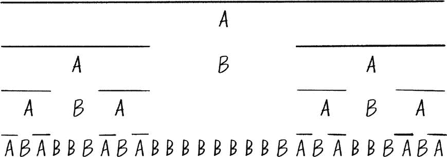

图 8.21：使用 L 系统字母表表示的 Cantor 集

看起来熟悉吗？这个 L 系统生成了 Cantor 集！

为了简化，我一直在使用 AB 作为字母表，但许多 L 系统使用字符 F、G、+、–、[和]。它们的意义如下：

| F | 画一条线并向前移动。 |
| --- | --- |
| G | 向前移动（不画线）。 |
| + | 向右转。 |
| – | 向左转。 |
| [ | 保存当前状态。 |
| ] | 恢复当前状态。 |

这种类型的绘图框架通常被称为**海龟图形**（源自 Logo 编程的早期）。想象一下，一只海龟坐在你的 p5.js 画布上，能够接受一小套命令：向左转，向右转，向前移动，画线等等。虽然 p5.js 默认并没有这样设置，但我可以通过`translate()`、`rotate()`和`line()`轻松模拟一个海龟图形引擎。以下是如何将这个 L 系统的字母表转换为 p5.js 代码的方式：

| F |
| --- |

```
line(0, 0, 0, length);
translate(0, length);
```

|

| G |
| --- |

```
translate(0, length);
```

|

| + |
| --- |

```
rotate(angle);
```

|

| – |
| --- |

```
rotate(-angle);
```

|

| [ |
| --- |

```
push();
```

|

| ] |
| --- |

```
pop();
```

|

假设我已经生成了一个 L 系统句子，我可以逐个字符地遍历该句子，并为每个字符执行相应的代码：

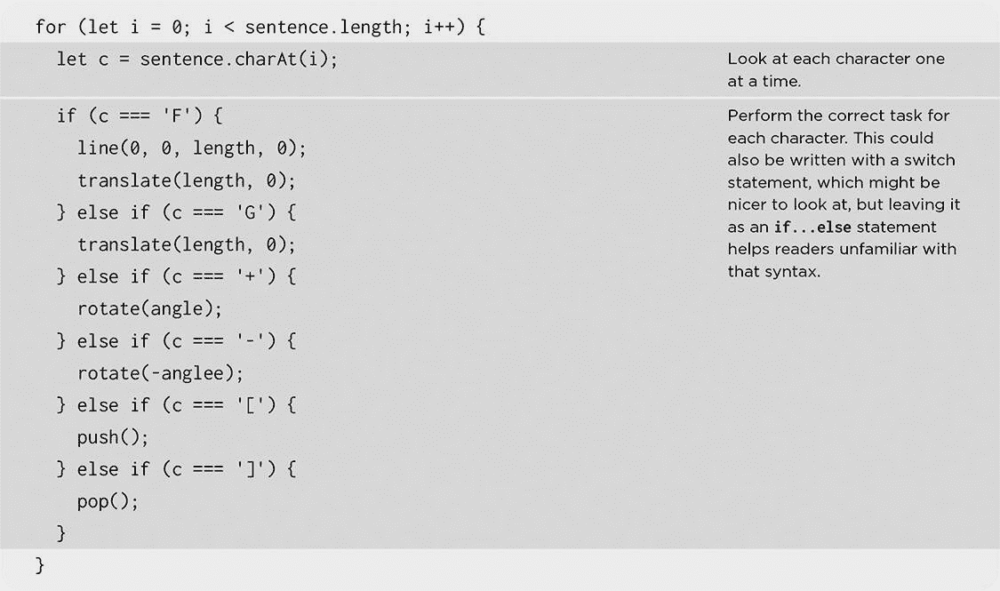

有了这些代码和合适的 L 系统条件，我可以绘制出极其复杂、类植物的结构。以下是我将使用的 L 系统：

| 字母表 | F, G, +, –, [, ] |
| --- | --- |
| 公理 | F |
| 规则 | F → FF + [+ F – F – F] – [– F + F + F] |

本书网站上提供的可下载草图将本节中提供的所有 L 系统代码组织为三个部分：

+   `rules`：一个 JavaScript 对象，用于存储 L 系统规则中的前驱和后继字符串对

+   `LSystem`：一个类，用于迭代生成新的 L 系统代

+   `Turtle`：一个类，用于管理读取 L 系统句子并按照指令在屏幕上绘制

我不会在这里写出这些类，因为它们只是重复了我在本章中已经写过的代码。相反，我会展示如何在主文件*sketch.js*中将所有元素组合在一起。

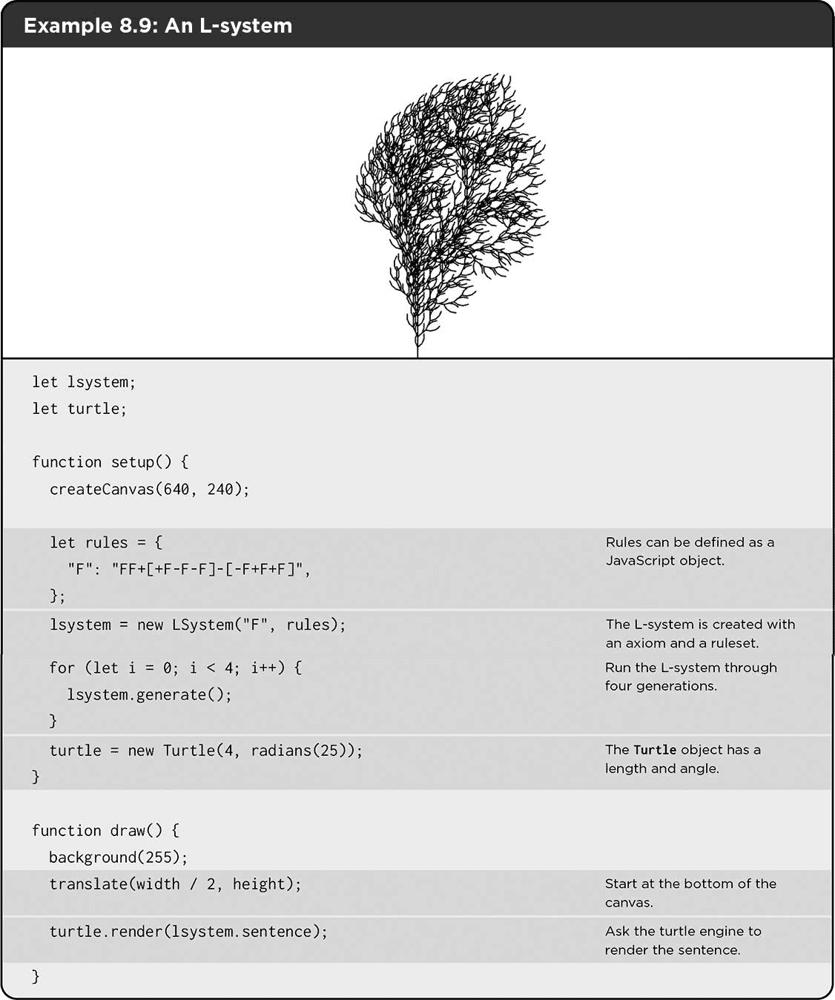

本书中，我广泛地介绍了面向对象编程（OOP），并以`Particle`和`p5.Vector`等类为例。然而，在示例 8.9 中，你可能注意到我在初始化`rules`变量时采取了一个简便的方法。我没有定义一个`Rule`类并使用`new`关键字调用构造函数，而是用一个 JavaScript 对象字面量来初始化这个变量。通过其键值对，这种数据结构非常方便，用于定义 L 系统的变换规则。每个键代表当前代中需要被替换的字符（在这个例子中，只有一个字符`"F"`），该键的值定义了替换内容（`"FF+[+F-F-F]-[-F+F+F]"`）。虽然这个例子只有一个规则，但你可以在对象字面量中创建更多的规则，通过其他键值对来实现。

 **习题 8.11**

将 L 系统作为一组指令来创建存储在数组中的对象。使用三角函数和向量数学来进行旋转，而不是使用变换（就像我在示例 8.5 中处理科赫曲线时一样）。

 **习题 8.12**

L 系统和植物结构的开创性著作，《植物的算法美学》（*The Algorithmic Beauty of Plants*）（*[`algorithmicbotany.org`](http://algorithmicbotany.org)）由 Przemysław Prusinkiewicz 和 Aristid Lindenmayer（Springer）于 1990 年出版。第一章描述了许多复杂的 L 系统，包含了额外的绘制规则和可用的字母表字符。它还描述了生成随机 L 系统的几种方法。扩展示例 8.9 中的 L 系统代码，加入 Prusinkiewicz 和 Lindenmayer 所描述的一个或多个额外特性。

 **习题 8.13**

在这一章中，我强调了使用分形算法生成视觉图案。然而，分形也可以在其他创意媒介中找到。例如，它们在约翰·塞巴斯蒂安·巴赫的《大提琴组曲第三号》中显而易见，大卫·福斯特·华莱士的小说*无限的玩笑*（Little, Brown，1996）的结构也受到分形的启发。可以考虑使用本章中的示例来生成音频或文本。

 **生态系统项目**

将分形融入到你的生态系统中。以下是一些可能性：

+   向生态系统环境中添加类似植物的生物。

+   假设你的某个植物像一棵分形树。你能在树枝的末端添加叶子或花朵吗？如果这些叶子可以根据风力从树上飘落呢？如果你添加可以被生物采摘并食用的果实呢？

+   设计一个具有分形图案的生物。

+   使用 L 系统生成关于生物如何移动或行为的指令。

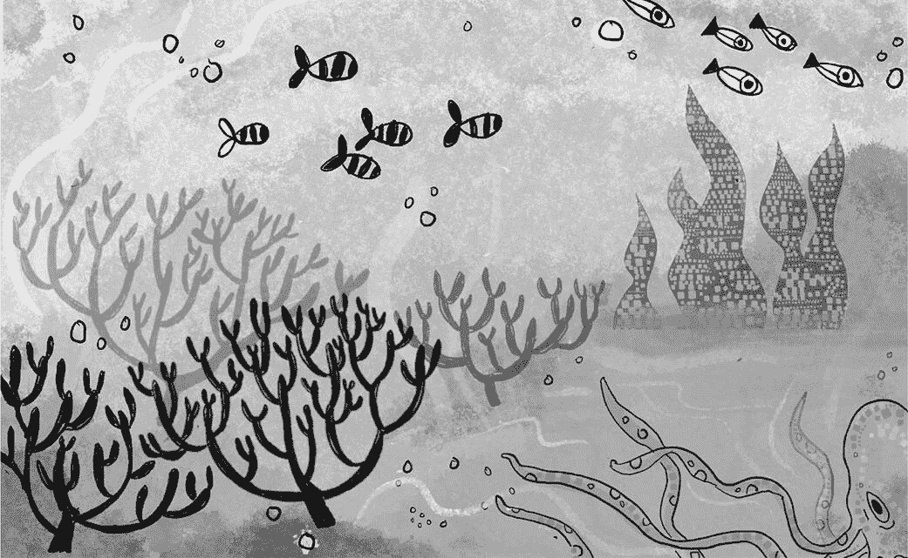
