## **9 进化计算**

*光阴似箭；果蝇爱香蕉。*

—未知


**普韦布洛陶器（图片由国家公园管理局提供）**

几个世纪以来，美国西南部和墨西哥北部的祖先普韦布洛人和莫戈永文化所创造的陶器在仪式和日常生活中都具有重要意义。像制作这个查科祖先普韦布洛碗所使用的技术和设计元素一样，这些传统代代相传，每一位陶艺家都在学习、保存并微妙地调整这些设计。这一持续的过程孕育了一个不断发展的家族和文化表达的画卷。

花点时间回想一下那个简单的时光，当时你编写了第一个 p5.js 草图，生活自由且轻松。你在这些第一个草图中可能使用了哪个基本的编程概念，并且一直反复使用到今天呢？*变量*。变量允许你在程序运行时保存数据并重用它。

当然，这并不是什么新鲜事。在这本书中，你已经远远超越了仅有一两个简单变量的草图，逐渐过渡到围绕更复杂数据结构组织的草图：变量持有包含数据和功能的自定义对象。你已经使用这些复杂的数据结构——类——构建了属于你自己的小世界，包括移动物体、粒子、车辆、细胞和树木。但有一个问题：在本书的每个例子中，你都必须担心初始化这些对象的属性。也许你创建了一组具有随机颜色和大小的粒子，或者一个所有车辆都从相同的 (*x*, *y*) 位置开始的列表。

如果你不再充当智能设计师，通过随机或深思熟虑的方式赋予物体属性，而是让自然界中的一个过程——**进化**——*为你决定这些值呢？你能将 JavaScript 对象的变量看作该对象的 DNA 吗？对象能否生成其他对象并将它们的 DNA 传递给新一代？一个 p5.js 草图能进化吗？*

所有这些问题的答案都是响亮的“是”，而得出这个答案正是本章的重点。毕竟，如果不处理一个自然界中最强大的算法过程——生物进化的模拟，这本书几乎不可能完整。本章致力于研究进化过程背后的原理，并寻找将这些原理应用于代码中的方法。

### **遗传算法：灵感来自现实事件**

发展进化型代码系统的主要手段是**遗传算法**（简称**GA**），它们受到达尔文进化论核心原则的启发。在这些算法中，问题的潜在解决方案群体通过模拟生物进化中的自然选择过程，在几代人中逐步演化。尽管进化过程的计算机模拟可以追溯到 20 世纪 50 年代，但我们对遗传算法的现代理解大多源于密歇根大学的约翰·霍兰德教授，他在 1975 年出版的《自然与人工系统中的适应》（MIT 出版社）一书中开创了遗传算法研究。今天，遗传算法已经成为一个更广泛领域的一部分，这个领域通常被称为**进化计算**。

为了明确，遗传算法只是受到遗传学和进化理论的*启发*，并不打算精确实现这些领域背后的科学原理。在本章探讨遗传算法时，我不会制作庞内特方格（抱歉让你失望），也不会讨论核苷酸、蛋白质合成、RNA 或其他与生物进化过程相关的主题。我更关心的不是如何创造一个科学上精确模拟物理世界中的进化过程，而是如何将进化策略应用于软件开发。

这并不是说具有更高科学深度的项目就没有价值。事实上，计算生物学研究领域*确实*承担着更准确地模拟生物进化过程的挑战！我鼓励那些对这个主题特别感兴趣的读者，探索如何在提供的示例中增加更多进化特征。然而，为了确保项目可管理，我将坚持基础知识。而且，正如实际情况所示，基础知识将足够复杂且充满趣味。

我还应该指出，严格来说，*遗传算法*一词指的是一种以特定方式实现的特定算法，用来解决特定类型的问题，而这些具体细节并不是本书关注的重点。虽然正式的遗传算法将作为本章示例的基础，但由于我更注重在代码中创造性地应用进化理论，所以我不会过分强调算法实现的精确度。因此，本章将分为以下三个部分：

+   **传统遗传算法：** 我将从传统的教材中介绍遗传算法（GA）。该算法是为了处理计算机科学中那些解空间非常庞大、采用*暴力搜索*方法需要过长时间的问题而开发的。举个例子：我在想一个介于一和十亿之间的数字。你需要多长时间才能猜出来？采用暴力搜索的方法，你必须检查每一个可能的答案。是 1 吗？是 2 吗？是 3 吗？是 4 吗？。。。运气也起到了一定作用（也许我碰巧选了 5！），但平均下来，你会在从 1 开始数起的过程中花费数年时间才能找到正确答案。然而，如果我能告诉你你的答案是对是错？是温暖还是冷？非常温暖？热？冰冷？如果你能评估你猜测的接近程度（或*适应度*），你就能相应地调整你的选择，更快地得到正确答案。你的答案将会*进化*。

+   **交互式选择：** 在探索了传统的计算机科学版本之后，我将探讨遗传算法在视觉艺术中的其他应用。*交互式选择*指的是通过用户互动来进化某种事物（通常是计算机生成的图像）的过程。假设你走进一个博物馆的展厅，看到 10 幅画。通过交互式选择，你可能会挑选出你最喜欢的几幅，然后让算法根据你的偏好生成（或*进化*）新的画作。

+   **生态系统模拟：** 传统的计算机科学遗传算法和交互式选择技术是你在网上搜索或阅读人工智能教科书时常见的内容。但正如你将很快看到的，它们并没有真正模拟物理世界中进化的过程。在本章中，我还将探讨模拟人工生物生态系统进化的技术。如何让在画布上移动的物体相遇、交配并将基因传递给下一代？这可以直接应用于每章结尾处提到的生态系统项目。在我探讨第十一章中的神经进化时，这也将特别相关。

### **为什么使用遗传算法？**

为了帮助说明传统遗传算法的实用性，我将从猫咪开始。不，不是你每天看到的那些猫咪。我将从一些“嗡嗡叫”的猫咪开始，它们具备打字的天赋，目标是生成完整的莎士比亚作品集（见图 9.1）。

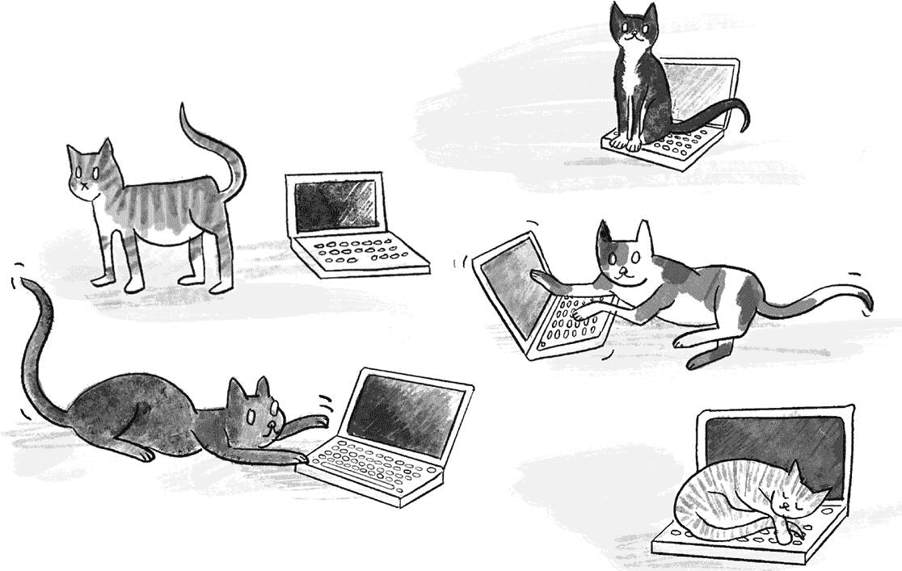

图 9.1：无限只猫在无限键盘上打字

这是我对**无限猴子定理**的妙趣横生的解读，定理内容如下：一只猴子在打字机上随机敲击键盘，最终会打出莎士比亚的完整作品，前提是有无限的时间。之所以只是一个理论，是因为在实际情况下，字母和单词的可能组合数量使得猴子*实际上*打出莎士比亚作品的可能性微乎其微。为了让你理解，即便这只猴子从宇宙诞生之初开始打字，到现在，它打出*哈姆雷特*的概率，别说打出莎士比亚的*完整作品*，依然是极为不可能的。

假设有一只名叫 Clawdius 的猫。Clawdius 在一个简化的打字机上打字，这台打字机只有 27 个字符：26 个英文字母和空格键。Clawdius 按下任意一个键的概率是 1/27。

接下来，考虑短语“to be or not to be that is the question”（为了简单起见，我忽略了大小写和标点符号）。这个短语包含 39 个字符，包括空格。如果 Clawdius 开始打字，他按下第一个字符正确的概率是 1/27。由于他按下第二个字符正确的概率也是 1/27，他成功输入前两个字符正确的概率是 1/729（27 × 27）。(这一点直接来自我们在第零章中关于概率的讨论。)因此，Clawdius 输入完整短语的概率是 1/27 乘以自身 39 次，或者(1/27)³⁹。这等于一个概率值……

1 in 66,555,937,033,867,822,607,895,549,241,096,482,953,017,615,834,735,226,163

不用说，连打对这一个短语，更不用说打出整部戏剧，甚至是莎士比亚的 38 部戏剧（没错，甚至是*《两位贵族亲戚》*）都是极不可能的。即便 Clawdius 是一个计算机模拟，每秒能打出一百万个随机短语，要使 Clawdius 最终以 99%的概率打出这一短语，他需要打字 9,719,096,182,010,563,073,125,591,133,903,305,625,605,017 年。（为了做个对比，宇宙的估计年龄仅为 137.5 亿年。）

这些无法想象的大数字的意义，并不是让你头疼，而是为了说明暴力破解算法（打出每一个可能的随机短语）并不是一个合理的随机生成“to be or not to be that is the question”短语的策略。于是，遗传算法（GAs）应运而生，它们从随机短语开始，通过模拟进化迅速找到解决方案，让 Clawdius 有足够的时间享受一场舒适的小猫午睡。

公正地说，这个问题（要得到短语“to be or not to be that is the question”）本身是荒谬的。因为你已经知道答案了，所有你需要做的就是打出来。这里有一个 p5.js 的示例程序，能解决这个问题：

```
let s = "to be or not to be that is the question";
console.log(s);
```

然而，这是一个很好的起步问题，因为有了已知的答案，你可以轻松测试代码并评估遗传算法的成功。一旦你成功解决了这个问题，就可以更有信心地使用遗传算法做一些真正有用的事情：解决*未知*答案的问题。这个第一个示例除了演示遗传算法的工作原理外并没有其他实际用途。如果你将遗传算法的结果与已知答案进行对比，得到“生存还是毁灭”，那你就成功编写了一个遗传算法。

 **练习 9.1**

创建一个生成随机字符串的草图。你需要知道如何做到这一点，才能实现接下来的遗传算法示例。p5.js 生成字符串`cat`需要多长时间？你如何使用 p5.js 的形状绘制函数将其改编为生成一个随机设计？

### **遗传算法的工作原理**

在我介绍任何代码之前，我想先以一种更通用的方式讲解经典遗传算法的步骤。我将展示如何通过一系列的世代演变，一个*生物群体*（模拟中的元素的通用术语）是如何进化的。为了理解这一过程，首先需要概述达尔文进化论的三个核心原则。如果自然选择要像自然界中那样在代码中发生，必须具备以下三种要素：

+   **遗传性：** 必须有一种机制，让某一代的*父母*生物将它们的特征传递给下一代的*子代*生物。

+   **变异：** 在生物群体中必须存在各种不同的特征，或者需要引入某种变异机制，以便进化得以发生。想象一个甲虫群体，它们完全相同：相同的颜色、相同的大小、相同的翼展、相同的一切。如果群体中没有任何变异，那么子代总是与父母以及彼此完全相同。新的特征组合永远不会出现，也无法发生进化。

+   **选择：** 必须有一个机制，使得某些生物有机会成为父母并传递其遗传信息，而其他生物则没有机会。这个过程通常被称为*适者生存*。举个例子，假设有一群羚羊被狮子追逐。更快速的羚羊有更大的机会逃脱狮子的追击，从而增加其生存的机会，延长寿命，繁殖并将遗传信息传递给后代。然而，*适者*一词可能会产生误导。人们通常认为它意味着最大、最快或最强壮，但虽然它有时可以包括体型、速度或力量等身体特征，它并不一定非要如此。自然选择的核心在于任何最适应生物环境的特征，并增加其生存几率，最终促进繁殖。与其说是“优越性”，不如说*适者*更好理解为“能够繁殖”。以*Dolania americana*（即美国沙穴蜉蝣）为例，它被认为是寿命最短的昆虫之一。成年雌性只活五分钟，但只要它成功地将卵产入水中，它就能将遗传信息传递给下一代。对于打字猫来说，一个更*适应*的猫——我将其定义为更可能繁殖的猫——是那种输入了莎士比亚某一短语中更多字符的猫。

我想强调的是，我应用这些达尔文概念的背景：一个模拟的人工环境，在这个环境中，特定的目标可以量化，所有这一切都是为了创造性的探索。纵观历史，遗传学原理曾被用来伤害那些被主导社会结构边缘化和压迫的人群。我认为，在处理涉及遗传算法（GAs）的项目时，必须小心谨慎地使用语言，并确保工作文档和描述以包容性框架呈现。

在这些概念建立之后，我将开始讲解遗传算法的叙述。我会在打字猫的背景下进行讲解。该算法将分为几个步骤，分为两部分展开：初始化条件集，以及在找到正确短语之前反复进行的步骤。

#### **步骤 1: 种群创建**

对于打字猫，遗传算法的第一步是创建一个短语种群。我使用*短语*这个词比较宽泛，指的是任何字符的字符串。这些短语就是这个例子中的生物，尽管它们当然不像生物。

在创建短语种群时，达尔文原理中的**变异**适用。为了简单起见，假设我正在进化短语*cat*，并且我有一个包含三个短语的种群：

| rid |
| --- |
| won |
| hug |

当然，这些短语有各种各样的变化，但尝试将字符随意混合搭配，你永远也得不到*cat*。这里的变化*不足*以进化出最佳解。然而，如果我有一个包含数千个随机生成短语的种群，至少有一个短语的第一个字符是*c*，第二个是*a*，第三个是*t*。一个大规模的种群很可能提供足够的变化来生成所需的短语。（在算法的第 3 步中，我还将展示另一种机制，以便在第一步没有足够变化时引入更多变化。）因此，步骤 1 可以描述如下：

创建一个随机生成元素的种群。

*元素*可能是比*生物*更好的、更通用的术语。但什么是元素呢？当你在本章中浏览示例时，你会看到几种不同的场景；你可能有一个图像的种群，或者像第五章那样有一个交通工具的种群。本章的新内容是，每个元素，每个种群成员，都有*虚拟 DNA*，一组属性（你也可以称之为*基因*），描述一个元素的外观或行为。例如，对于打字的猫来说，DNA 可能是一串字符。考虑到这一点，我可以更具体地描述遗传算法的第 1 步如下：

创建一个包含*N*个元素的种群，每个元素都有随机生成的 DNA。

遗传学领域对基因型和表现型这两个概念做出了重要的区分。实际的基因代码——DNA 中分子序列的特定排列——是一个生物体的**基因型**。这就是从一代传到下一代的东西。相比之下，**表现型**是这些数据的*表达*——这只猫会很大，那只猫会很小，另一只猫则会是一个特别快速且高效的打字员。

基因型/表现型的区分对于创造性地使用遗传算法至关重要。你的世界中的对象是什么？你将如何为这些对象设计基因型——存储每个对象属性的数据结构，以及这些属性可能具有的值？你将如何利用这些信息来设计表现型？也就是说，*你*希望这些变量实际表达什么？

我们在图形编程中经常做这件事，将值（基因型）以可视化的方式呈现（表现型）。最简单的例子可能就是颜色：

| **基因型** | **表现型** |
| --- | --- |
| 0 |  |
| 127 |  |
| 255 |  |

把基因型看作是数字信息，表示颜色的数据——在灰度值的情况下，是从 0 到 255 的整数。你选择如何表达这些数据是任意的：一个红色值，一个绿色值，和一个蓝色值。甚至不需要是颜色——在不同的方案中，你也可以用这些值来描述线的长度、力的重量等等：

| **相同基因型** | **不同表型（行长）** |
| --- | --- |
| 0 |  |
| 127 | ___________________________ |
| 255 | ______________________________________________ |

打字猫示例的一个好处是，基因型和表型之间没有区别。DNA 数据是一个字符串，而这些数据的表现形式就是这个字符串本身。

#### **步骤 2：选择**

遗传算法的第二步是应用达尔文的**选择**原则。这包括评估种群并确定哪些成员适合被选为下一代的父母。选择过程可以分为两步：

1.  **评估适应度。**

1.  **创建配对池。**

对于这些步骤中的第一个，我需要设计一个**适应度函数**，一个生成数值评分的函数，用来描述种群中某个元素的适应度。当然，这并不是现实世界中的运作方式。生物体并不会被赋予一个分数；它们只是繁殖或不繁殖。然而，传统的遗传算法旨在进化出问题的最佳解决方案，因此需要一个机制来数值化地评估任何给定的可能解决方案。

考虑当前的场景——打字猫。为了简便起见，我假设目标短语是*cat*。假设种群中有三个成员：*hut*、*car* 和 *box*。显然，*car* 是最适合的，因为它在正确的位置上有两个正确的字符，*hut* 只有一个，*box* 则没有正确的字符。就这样，适应度函数如下：

fitness = 正确字符的数量

| **DNA** | **适应度** |
| --- | --- |
| car | 2 |
| hut | 1 |
| box | 0 |

我最终会希望看到更多具有复杂适应度函数的例子，但这是一个很好的起点。

一旦计算出所有种群成员的适应度，选择过程的下一步就是选择哪些成员适合成为父母，并将他们放入配对池中。这个步骤有多种方法。例如，我可以使用**精英主义**方法，假设，“种群中得分最高的两位成员是谁？你们俩将为下一代繁殖所有的后代。”这是编程中最简单的方法之一，但它违背了变异的原则。如果种群中的两名成员（可能只有几千个成员中的两位）是唯一能够繁殖的个体，那么下一代将缺乏多样性，这可能会阻碍进化过程。

我也可以从更多元素中创建一个交配池——例如，人口中排名前 50%的个体。这是另一个容易编写的代码，但它也不会产生最优结果。在这种情况下，得分最高的个体与中等位置的个体有相同的被选中概率。在 1000 个短语的种群中，为什么排名第 500 的短语和排名第 1 的短语有相同的繁殖机会？更进一步，为什么排名第 500 的短语有很大的繁殖机会，而排名第 501 的短语完全没有机会？

交配池的一个更好的解决方案是使用**概率**方法，我称之为*命运之轮*（也叫*轮盘赌*）。为了说明这种方法，假设一个种群有五个元素，每个元素都有一个适应度分数。

| **元素** | **适应度** |
| --- | --- |
| A | 3 |
| B | 4 |
| C | 0.5 |
| D | 1 |
| E | 1.5 |

第一步是**标准化**所有分数。记得标准化一个向量吗？那时涉及将向量的长度标准化，将其设置为 1。标准化一组适应度分数是将其范围标准化为从 0 到 1，以总适应度的百分比表示。为此，首先将所有适应度分数加起来：

total fitness = 3 + 4 + 0.5 + 1 + 1.5 = 10

接下来，将每个分数除以总适应度，得到标准化的适应度。

| **元素** | **适应度** | **标准化适应度** | **以百分比表示** |
| --- | --- | --- | --- |
| A | 3 | 0.3 | 30% |
| B | 4 | 0.4 | 40% |
| C | 0.5 | 0.05 | 5% |
| D | 1 | 0.1 | 10% |
| E | 1.5 | 0.1 | 15% |

现在是时候使用命运之轮了，见图 9.2。

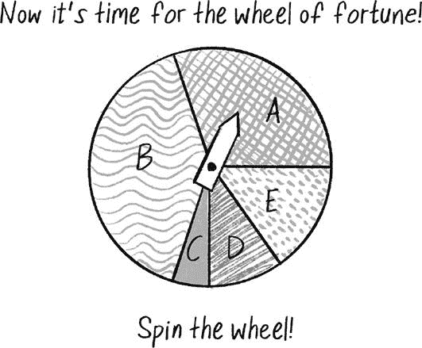

图 9.2：在这个命运之轮中，每个切片的大小是根据适应度值来设定的。

转动命运之轮，你会注意到元素 B 的被选中概率最高，其次是 A，然后是 E，再是 D，最后是 C。根据适应度进行的这种基于概率的选择是一个很好的方法。它保证了得分最高的元素最有可能繁殖，同时也不会完全消除种群中的任何变异。与精英主义方法不同，即使是最低得分的元素（在这种情况下是 C）也至少有一些机会将其信息传递到下一代。这一点很重要，因为有可能（而且经常是这种情况）某些低得分的元素拥有一些真正有用的基因代码，应该保留在种群中。例如，在进化“是还是不是”的情况下，我们可能会有以下元素：

| **元素** | **DNA** |
| --- | --- |
| A | 是或不是去 |
| B | 是还是不是派 |
| C | 咕噜咕噜咕噜 |

如你所见，元素 A 和 B 显然是最适应的，得分最高。但它们都没有正确的字符来完成短语的结尾。元素 C，尽管得分非常低，但恰好具有短语结尾的遗传数据。虽然我可能希望 A 和 B 被选择以生成下一代的大多数，但我仍希望 C 也有一定机会参与繁殖过程。

#### **步骤 3：繁殖**

现在我已经展示了选择父母的策略，最后一步是使用**繁殖**来创造种群的下一代，牢记达尔文的遗传原则——孩子从父母那里继承特性。同样，可以在这里使用多种技术。例如，一种合理（且容易编程）的策略是**克隆**，即只选择一个父母，并创建一个该父母的精确副本作为子代元素。然而，和精英选择方法一样，这种方法与变异的目标相悖。相反，遗传算法的标准方法是选择两个父母，并通过两个步骤创造一个孩子：

1.  **交叉**

1.  **变异**

第一步，**交叉**，是从两个父母的遗传代码中创建一个子代。以猫打字为例，假设我从配对池中选出了以下两个父母短语，如选择步骤所示（我简化了，使用长度为 6 的字符串，而不是“to be or not to be”所需的 18 个字符）：

| 父母 A | 编码 |
| --- | --- |
| 父母 B | 自然 |

现在的任务是从这两个父母中创造一个子短语。也许最明显的方法（称之为*50/50 方法*）是从 A 取前三个字符，从 B 取后面三个字符，如图 9.3 所示。

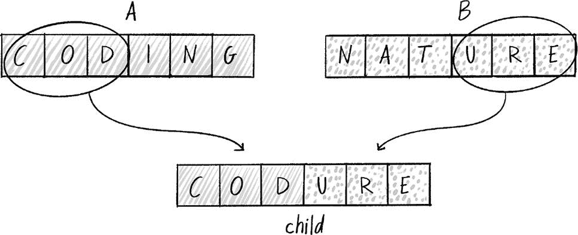

图 9.3：50/50 交叉

这种技术的一种变体是选择一个随机的中点。换句话说，我不必总是从每个父母那里选择一半的字符。我可以选择 1 和 5，或 2 和 4 的组合。这比 50/50 方法更可取，因为它增加了下一代的可能性多样性（见图 9.4）。

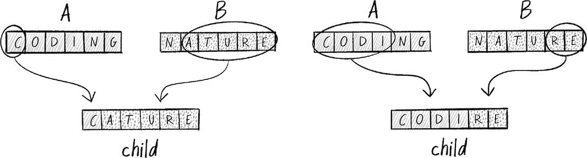

图 9.4：来自随机中点的两个交叉示例

另一种可能性是为子字符串中的每个字符随机选择一个父母，如图 9.5 所示。你可以将其视为抛硬币六次：正面，取父母 A 的一个字符；反面，取父母 B 的一个字符。这样就会产生更多可能的结果：*codurg*，*natine*，*notune*，等等。

这种策略不会显著改变随机中点方法的结果；然而，如果遗传信息的顺序在适应度函数中起到了作用，你可能会偏向于选择某个解决方案。其他问题则可能更多地受益于通过抛硬币方式引入的随机性。

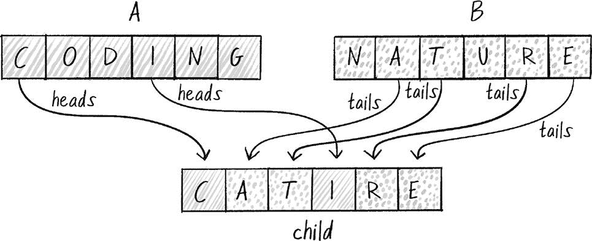

图 9.5：使用抛硬币的方法进行交叉

一旦通过交叉创建了子代 DNA，在将子代加入到下一代之前，可以应用一个额外的可选过程：**变异**。这个第二次繁殖阶段在某些情况下是没有必要的，但它的存在是为了进一步维持达尔文的变异原则。最初的人口是随机创建的，确保了开头有各种不同的元素。然而，这种变异会受到人口规模的限制，随着选择的进行，变异会逐渐缩小。变异在整个进化过程中引入了额外的多样性。

变异是通过*变异率*来描述的。给定的遗传算法可能会有 5%的变异率，1%的变异率，或者 0.1%的变异率。例如，假设我通过交叉得到了子代短语*catire*。如果变异率是 1%，这意味着该短语中的每个字符都有 1%的概率在进入下一代之前发生变异。那么，字符变异是什么意思呢？在这种情况下，变异可以定义为选择一个新的随机字符。1%的概率相对较低，因此在六个字符的字符串中，大部分时间（实际上大约 94%的时间）变异不会发生。然而，当变异发生时，变异的字符将被一个随机生成的字符替代（见图 9.6）。

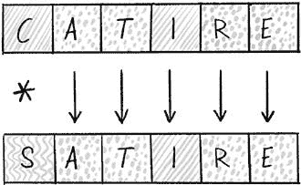

图 9.6：变异子代短语

正如你在接下来的示例中看到的，变异率可以大大影响系统的行为。非常高的变异率（比如 80%）会使整个进化过程失效，留下的结果更像是一个暴力破解算法。如果大多数子代基因是随机生成的，就无法保证随着每一代的到来，更适应的基因会以更高的频率出现。

总体而言，选择（选择两个父代）和繁殖（交叉和变异）过程会重复*N*次，直到生成一个新的*N*个子代元素的种群。

#### **步骤 4：重复！**

此时，新的子代种群将成为当前种群。然后，过程返回到步骤 2，再次开始，评估每个元素的适应度，选择父代，并产生另一个子代种群。希望随着算法循环经过越来越多的代数，系统会越来越接近理想的解决方案。

### **编写遗传算法代码**

现在我已经描述了遗传算法的所有步骤，是时候将它们转化为代码了。在深入实施细节之前，让我们思考一下这些步骤如何融入到 p5.js 草图的标准结构中。`setup()`中应该包含什么内容，`draw()`中又应该包含什么内容？

setup()

第一步，**初始化**：创建一个包含*N*个元素的初始种群，每个元素都拥有随机生成的 DNA。

draw()

步骤 2，**选择**：评估种群中每个元素的适应度，并构建配对池。

步骤 3，**繁殖**：重复*N*次：

+   按照相对适应度的概率选择两个父母。

+   **交叉：**通过结合这两个父母的 DNA 创建一个孩子。

+   **突变：**根据给定的概率修改孩子的 DNA。

+   将新生成的孩子添加到新的种群中。

步骤 4：用新种群替换旧种群，并返回到步骤 2。

有了这个计划，我可以开始编写代码了。

#### **步骤 1：初始化**

如果我要创建一个种群，我需要一个数据结构来存储种群中元素的列表：

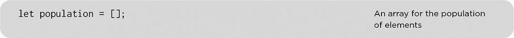

选择一个数组来表示一个列表是直接的，但问题仍然是：一个数组存储什么呢？对象是存储遗传信息的一个很好的选择，因为它可以包含多个属性和方法。这些遗传对象将根据一个我称之为`DNA`的类来构建：

```
class DNA {

}
```

`DNA`类应该包含什么？对于一个打字猫来说，它的 DNA 将是它打出的随机短语，一个字符的字符串。然而，使用字符数组（而不是字符串对象）提供了一个更通用的模板，可以轻松扩展到其他数据类型。例如，物理系统中生物体的 DNA 可以是一个向量数组，或者对于图像来说，是一个数字数组（RGB 像素值）。任何一组属性都可以列在一个数组中，尽管字符串在这种特定情境下很方便，但数组将作为未来进化示例的更好基础。

GA 要求我创建一个*N*个元素的种群，每个元素具有*随机生成的基因*。因此，DNA 构造函数包括一个循环来填充`genes`数组的每个元素：

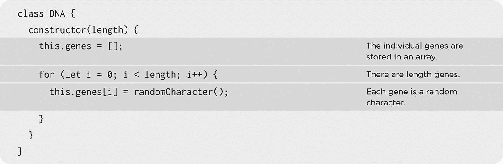

为了随机生成一个字符，我将为每个基因编写一个名为`randomCharacter()`的辅助函数：


选择的随机数字对应一个特定的字符，这一标准被称为**ASCII**（美国信息交换标准代码），而`String.fromCharCode()`是一个原生的 JavaScript 方法，用于根据该标准将数字转换为对应的字符。我指定的范围包括大小写字母、数字、标点符号和特殊字符。另一种方法可以使用 Unicode 标准，它包含表情符号和来自各种世界语言的字符，为目标字符串提供更多种类的字符。

现在我有了构造函数，可以返回到`setup()`并初始化`population`数组中的每个`DNA`对象：

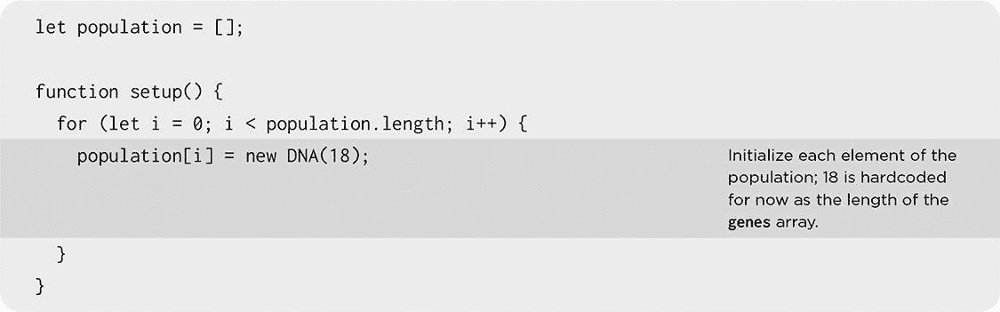

`DNA`类还远远不完整。我需要给它添加执行 GA 中其他所有任务的方法。在我走过步骤 2 和步骤 3 时，我会做到这一点。

#### **步骤 2：选择**

第 2 步写道：“评估种群中每个个体的适应度并建立配对池。”我将从第一部分开始，评估每个对象的适应度。之前我提到过，类型化短语的一个可能适应度函数是正确字符的总数。现在，我稍微修改一下这个适应度函数，表述为正确字符的*百分比*——也就是正确字符的数量除以字符总数：

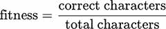

我应该在哪里计算适应度呢？由于`DNA`类包含遗传信息（我要用来与目标短语进行比较的短语），我可以在`DNA`类内部编写一个方法来计算其自身的适应度。假设有一个目标短语：

```
let target = "to be or not to be";
```

现在，我可以将每个基因与目标短语中相应的字符进行比较，每次找到正确位置上的正确字符时，就增加一个计数器。例如，`target`中有多个`t`字符，但只有当它在`genes`数组中的正确位置时，它才会增加适应度：

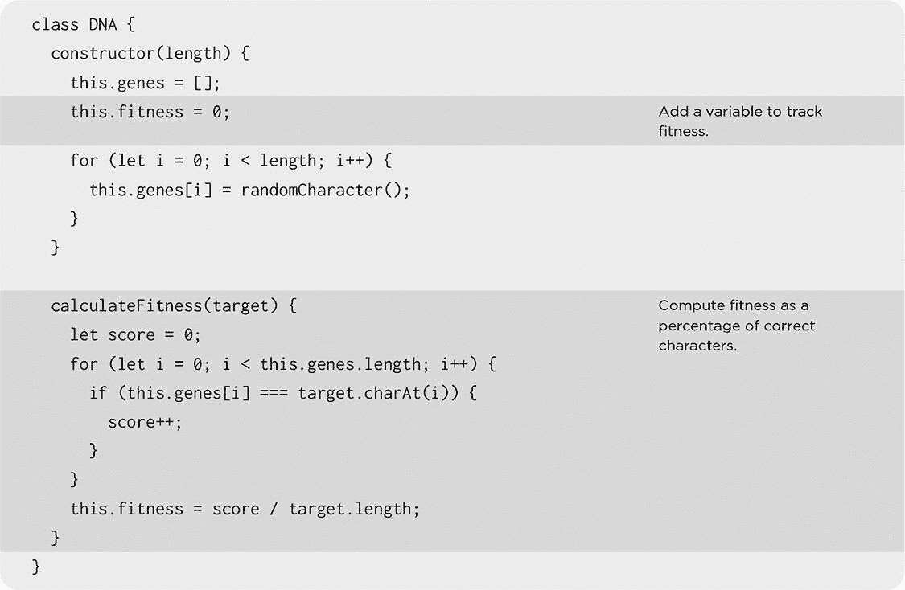

由于适应度是针对每一代计算的，我在`draw()`循环内的第一步就是调用适应度函数，计算每个种群成员的适应度：

```
function draw() {
  for (let phrase of population) {
    phrase.calculateFitness(target);
  }
}
```

一旦计算出适应度得分，下一步就是为繁殖过程建立*配对池*。配对池是一个数据结构，从中反复选择两个父母。回顾选择过程的描述，目标是按照适应度计算的概率选择父母。适应度得分最高的种群成员应该是最有可能被选择的；得分最低的，则最不可能被选择。

在第零章中，我介绍了概率的基础知识以及如何生成自定义的随机数分布。我将在这里使用相同的技术，为每个种群成员分配一个概率，通过转动幸运轮来选择父母。重新查看图 9.2，你可能会立刻想起第三章，并思考如何编写一个模拟实际转盘的程序。虽然这可能很有趣（你应该做一个！），但其实并不必要。

一个可行的解决方案是根据图 9.2 中所示的五个选项（A、B、C、D、E）按概率选择父母，方法是用每个父母的多个实例填充一个数组。换句话说，想象一下你有一个木制字母桶，像图 9.7 中那样。根据之前的概率，它应该包含 30 个 A，40 个 B，5 个 C，10 个 D 和 15 个 E。如果你从桶中随机挑选一个字母，你将有 30% 的几率得到 A，5% 的几率得到 C，依此类推。

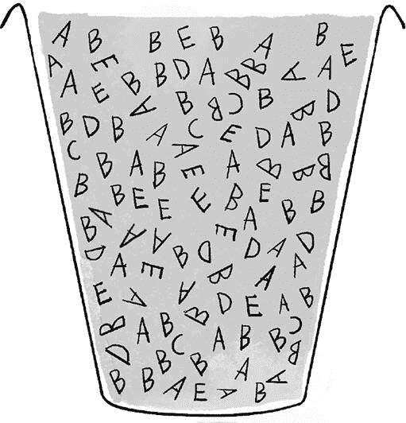

图 9.7：一个装满字母 A、B、C、D 和 E 的桶。适应度越高，桶中某个字母的出现次数越多。

对于 GA 代码来说，这个桶可以是一个数组，每个木制字母都是一个潜在的父母`DNA`对象。因此，配对池是通过根据每个父母的适应度分数，按一定次数将每个父母添加到数组中来创建的：

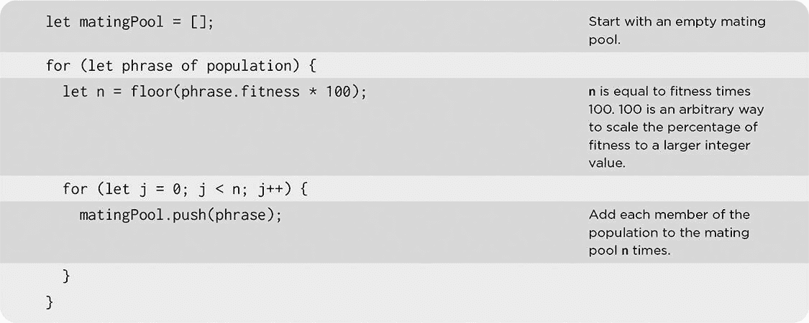

准备好配对池后，接下来是选择两个父母！为每个孩子挑选两个父母是一个有些任意的决定。这确实反映了人类的生殖过程，并且是教科书中遗传算法的标准方法，但在创意应用方面，这里并没有限制。你可以选择只有一个父母进行克隆，或者设计一种繁殖方法，从三个或四个父母中挑选，生成子代 DNA。为了演示，我将坚持使用两个父母，并称它们为`parentA`和`parentB`。

我可以使用 p5.js 的`random()`函数从配对池中选择两个随机 DNA 实例。当一个数组作为参数传递给`random()`时，该函数返回数组中的一个随机元素：

```
  let parentA = random(matingPool);
  let parentB = random(matingPool);
```

这种构建配对池并从中选择父母的方法是有效的，但这并不是执行选择的唯一方式。其他一些更节省内存的技术不需要额外的数组来存储对每个元素的多个引用。例如，回想一下第零章中关于随机数非均匀分布的讨论。在那里，我实现了接受-拒绝方法。如果应用到这里，这种方法将是从原始的`population`数组中随机挑选一个元素，然后再挑选一个符合条件的随机数来与该元素的适应度值进行对比。如果适应度小于符合条件的数字，就重新开始，选择一个新的元素。一直重复，直到选出两个适应度足够高的父母。

另一个值得探索的优秀替代方案，类似地利用了适应度比例选择的原理。为了理解它是如何工作的，想象一下一个接力赛，每个种群成员跑的距离与其适应度相关。适应度越高，跑得越远。假设适应度值已经标准化，所有的适应度值加起来为 1（就像幸运转盘一样）。第一步是选择一个*起跑线*——从终点到起点的随机距离。这个距离是一个从 0 到 1 的随机数。（你会马上看到，终点被假设为 0。）

```
let start = random(1);
```

然后接力赛从起点开始，由种群的第一位成员起跑：

```
let index = 0;
```

赛跑者按照其标准化的适应度分数跑一定的距离，然后将接力棒交给下一个跑者：

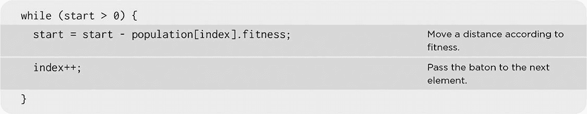

这些步骤会在`while`循环中反复执行，直到比赛结束（`start`小于或等于`0`，即终点）。跨过终点线的跑者被选为父母。

以下是将所有步骤组合在一起的函数，返回选定的元素：

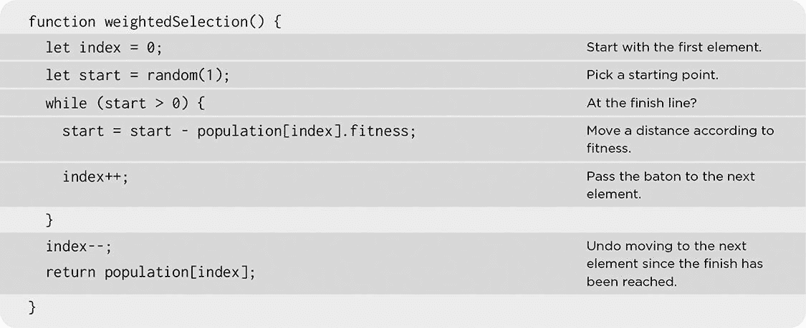

这种方法在选择中表现良好，因为每个成员都有机会跨越终点线（元素的适应度分数总和为 1），但是跑得更远的那些（即适应度分数更高的）更有机会到达终点。然而，尽管这种方法在内存上更高效，但它可能在*计算*上更为繁重，尤其是在大型种群中，因为每次选择时都需要遍历种群。相比之下，原始的`matingPool`数组方法每个父代只需进行一次随机查找。

根据遗传算法（GAs）应用的具体需求和约束，某种方法可能比另一种更合适。我将在本章中的示例中交替使用这两种方法。

 **练习 9.2**

回顾第零章中的接受-拒绝算法，并将`weightedSelection()`函数重写为使用接受-拒绝方法。像接力赛方法一样，这种技术也可能会变得计算密集，因为在最终选择一个父代之前，可能会有多个潜在父代被拒绝。

 **练习 9.3**

在某些情况下，幸运轮算法可能会对某些元素的偏好异常高。考虑以下概率：

| **元素** | **概率** |
| --- | --- |
| A | 98% |
| B | 1% |
| C | 1% |

这有时是不可取的，因为它会减少系统中的多样性。解决这个问题的一种方法是用评分的序号（即它们的排名）来替换计算出来的适应度分数：

| **元素** | **排名** | **概率** |
| --- | --- | --- |
| A | 1 | 50% (1/2) |
| B | 2 | 33% (1/3) |
| C | 3 | 17% (1/6) |

你如何实现像这样的一个方法？提示：你不需要修改选择算法。相反，你的任务是从排名而不是原始适应度分数计算概率。

对于这些算法中的任何一个，给定的子代可能会选择相同的父代两次。如果需要，我可以改进算法，确保不会发生这种情况。这可能对最终结果几乎没有影响，但作为一个练习，值得探索。

 **练习 9.4**

选择任何一个加权选择算法，并调整该算法，确保选择两个不同的父代。

#### **步骤 3：繁殖（交叉与变异）**

一旦得到两个父代，下一步就是执行**交叉**操作生成子代 DNA，然后进行**变异**：

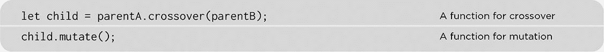

当然，`crossover()`和`mutate()`方法并不是在`DNA`类中自动存在的；我必须自己编写它们。我调用`crossover()`的方式表明它应该接收一个`DNA`实例作为参数（`parentB`），并返回一个新的`DNA`实例，也就是`child`：

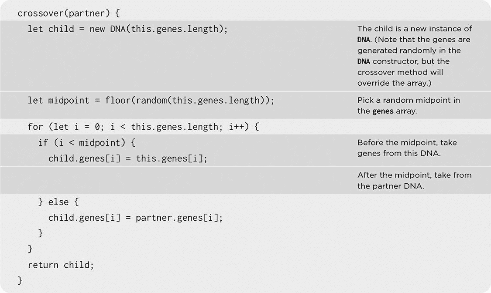

这个实现使用了随机中点交叉法，其中基因的第一部分来自父母 A，第二部分来自父母 B。

 **练习 9.5**

将交叉函数改写为使用抛硬币法，其中每个基因有 50% 的机会来自父母 A，也有 50% 的机会来自父母 B。

`mutate()`方法比`crossover()`更简单。我要做的就是遍历基因数组，并根据定义的突变率随机选择一个新字符。例如，在 1% 的突变率下，新的字符每 100 次中只会生成一次：

```
let mutationRate = 0.01;

if (random(1) < mutationRate) {
  /* Any code here would be executed 1% of the time. */
}
```

因此，整个方法的代码如下：

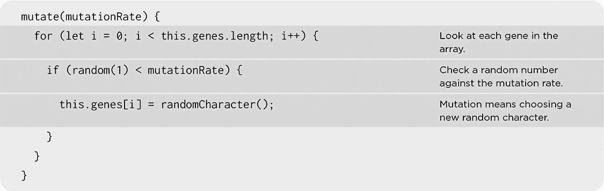

再次，我可以使用`randomCharacter()`辅助函数来简化突变过程。

#### **将一切组合在一起**

我现在已经走过了两遍遗传算法的步骤——一次是描述算法的叙述形式，另一次是用代码片段实现每个步骤。现在，我准备将它们结合起来，向你展示完整的代码以及算法的基本步骤。

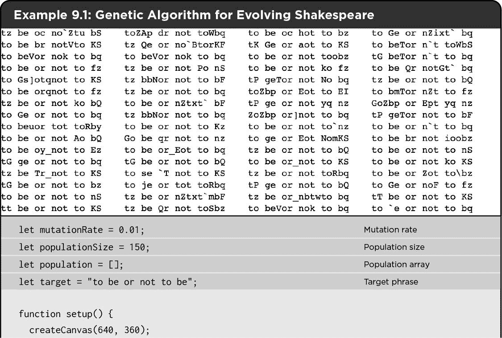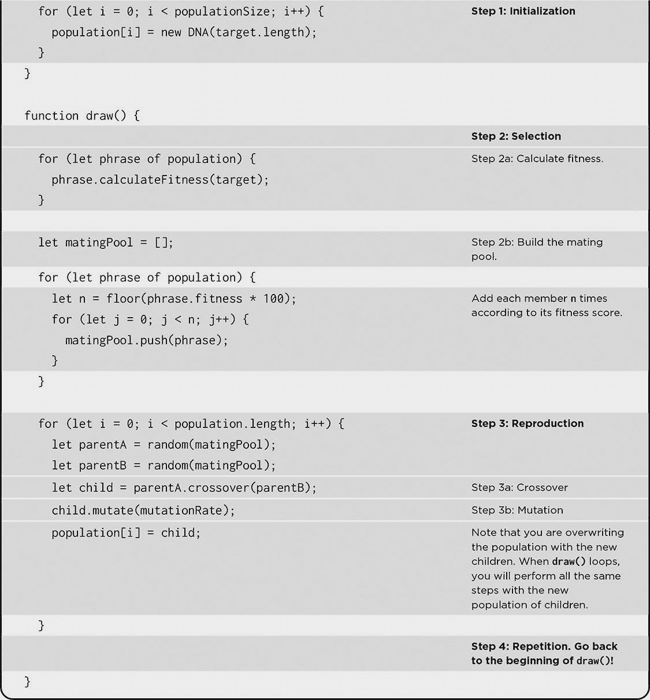

*sketch.js* 文件精确地反映了遗传算法的步骤。然而，大部分被调用的功能都封装在`DNA`类中。

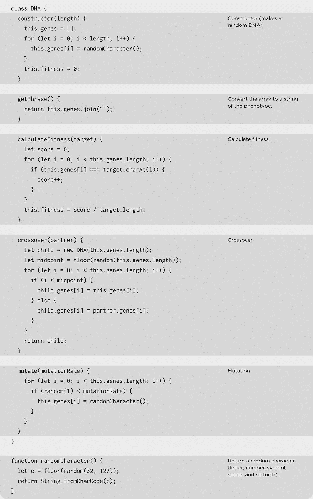

在示例 9.1 中，你可能会注意到新子代元素直接添加到`population`数组中。这种做法之所以可行，是因为我有一个单独的交配池数组，里面包含了指向原始父母元素的引用。然而，如果我改为使用接力赛式的`weightedSelection()`函数，那么我需要创建一个临时数组来存放新一代的种群。这个临时数组将保存子代元素，只有在繁殖步骤完成后才会用它替换原来的种群数组。你将在示例 9.2 中看到这种实现。

 **练习 9.6**

为示例 9.1 添加功能，以报告更多关于遗传算法进展的信息。例如，显示每一代中最接近目标的短语，并报告代数、平均适应度等信息。解决了目标短语后停止遗传算法。考虑编写一个`Population`类来管理遗传算法，而不是将所有代码都包含在`draw()`中。

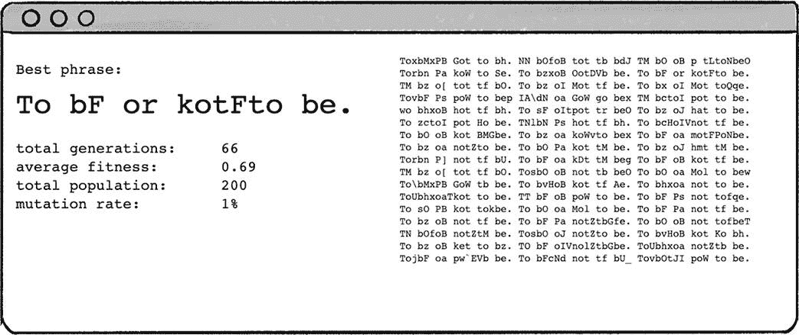

 **练习 9.7**

探索动态突变率的概念。例如，尝试计算与父代短语的平均适应度成反比的突变率，以便适应度更高时突变较少。这个改变会影响系统的整体行为以及目标短语被找到的速度吗？

### **定制遗传算法**

使用 GA 在项目中的一个好处是，示例代码可以轻松地从一个应用移植到另一个应用。选择和繁殖的核心机制不需要改变。然而，你，作为创建者，需要为每次使用定制 GA 的三个关键组件。这对于将进化模拟的平凡演示（如莎士比亚示例）发展到在 p5.js 和其他编程环境中创造性地应用于项目至关重要。

#### **关键 1：全局变量**

GA 的变量不多。如果你查看 示例 9.1 中的代码，你会看到只有两个全局变量（不包括用于存储种群和交配池的数组）：

```
let mutationRate = 0.01;
let populationSize = 150;
```

这两个变量会极大地影响系统的行为，随意赋值并不是一个好主意（尽管通过反复试验调整它们是达到最佳值的完全合理方式）。

我为莎士比亚示例选择了这些值，以几乎可以保证 GA 能够解决短语，但不会太快（平均约 1,000 代），以便在合理的时间内演示该过程。然而，更大的种群会产生更快的结果（如果目标是算法效率而不是演示的话）。以下是一些结果的表格：

| **种群** | **突变率** | **解决短语所需的代数** | **解决短语所需的总时间（秒）** |
| --- | --- | --- | --- |
| 150 | 1% | 1,089 | 18.8 |
| 300 | 1% | 448 | 8.2 |
| 1,000 | 1% | 71 | 1.8 |
| 50,000 | 1% | 27 | 4.3 |

注意到，增加种群规模会大幅减少解决短语所需的代数。然而，这并不一定减少所需的时间。一旦种群膨胀到 50,000 个元素，草图开始变得缓慢，因为处理适应度和从这么多元素中建立交配池所需的时间。 （当然，如果你需要如此大的种群，可以进行优化。）

除了种群规模外，突变率还会极大地影响性能。

| **种群** | **突变率** | **解决短语所需的代数** | **解决短语所需的总时间（秒）** |
| --- | --- | --- | --- |
| 1,000 | 0% | 37 或从未？ | 1.2 或从未？ |
| 1,000 | 1% | 71 | 1.8 |
| 1,000 | 2% | 60 | 1.6 |
| 1,000 | 10% | 从未？ | 从未？ |

完全没有变异（0％），你只需要运气好。如果初始种群中的某个元素中恰好有所有正确的字符，你将非常迅速地进化出这个短语。如果没有，草图就无法达到精确的短语。运行几次，你会看到两种情况。此外，一旦变异率足够高（例如 10％），每个新子代中会有很多随机性（每 10 个字母中就有 1 个是随机的），模拟几乎就回到了一个随机打字的猫。理论上，它最终会解出这个短语，但你可能需要等待比合理时间长得多的时间。

#### **关键 2：适应度函数**

调整变异率或种群规模是相当容易的，通常只需要在草图中输入数字。开发遗传算法的真正难点在于编写适应度函数。如果你不能定义问题的目标并数值化地评估这些目标的实现程度，你的模拟就不会有成功的进化。

在我继续探索更多复杂适应度函数的其他场景之前，我想先看看我这个莎士比亚式适应度函数的缺陷。假设要解的是一个不是 18 个字符，而是 1000 个字符的短语。并且取种群中的两个元素，一个正确字符数为 800，另一个为 801。它们的适应度得分如下：

| **短语** | **正确字符数** | **适应度** |
| --- | --- | --- |
| A | 800 | 80.0% |
| B | 801 | 80.1% |

这种情况有几个问题。首先，我将元素添加到交配池中*N*次，其中*N*等于适应度乘以 100。但是对象只能以整数次加入数组，因此 A 和 B 都会被添加 80 次，给它们相等的被选择概率。即使是一个考虑浮动概率的改进解决方案，80.1％也仅比 80％稍微高一点。但在进化场景中，得到 801 个正确字符比 800 个要好得多。我确实想让那额外的字符算数。我希望 801 个字符的适应度得分比 800 个的得分*显著*更高。

换句话说，图 9.8 展示了两种可能的适应度函数图。

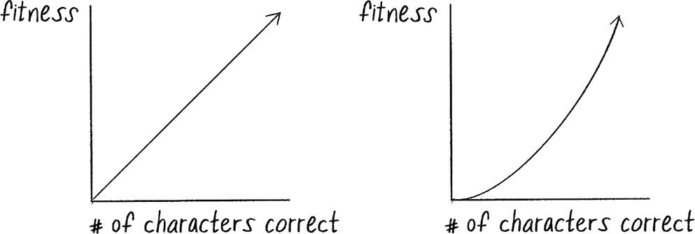

图 9.8：适应度图，*y* = *x*（左）和 *y* = *x*²（右）

左边是线性图；随着正确字符数的增加，适应度得分也增加。相反，在右边的图中，随着正确字符数的增加，适应度得分*大幅*上升。也就是说，适应度随着正确字符数的增加而加速增长。

我可以通过各种方式实现第二种类型的结果。例如，我可以这样说：

fitness = (正确字符数)²

这里，适应度得分**呈二次增长**，即与正确字符数量的平方成正比。假设我有两个个体，一个有五个正确字符，另一个有六个。数字 6 比 5 大 20%。然而，通过对正确字符进行平方，适应度值将从 25 增加到 36，增加了 44%：

| **正确字符** | **适应度** |
| --- | --- |
| 5 | 25 |
| 6 | 36 |

这是另一个公式：

fitness = 2^(正确字符)

这是当正确字符数量增加时，公式的演示：

| **正确字符** | **适应度** |
| --- | --- |
| 1 | 2 |
| 2 | 4 |
| 3 | 8 |
| 4 | 16 |

这里，适应度得分**呈指数增长**，每增加一个正确字符，适应度得分就翻倍。

 **练习 9.8**

重写适应度函数，使其根据正确字符的数量以二次或指数方式增长。请注意，您可能需要将适应度值标准化到 0 到 1 的范围，以便它们可以合理地多次添加到交配池中，或者使用其他加权选择方法。

虽然关于指数和线性方程的这种具体讨论在设计一个好的适应度函数时是一个重要的细节，但我不希望你错过这里更重要的要点：*设计你自己的适应度函数！* 我真的怀疑你在 p5.js 中使用遗传算法时，任何项目都会涉及计算字符串中的正确字符数量。在本书的背景下，你更可能是希望演化一个物理系统中的生物体。也许你正在优化一个生物体的转向行为权重，以便它能够最好地逃避捕食者、避免障碍物或穿越迷宫。你必须问自己，最终你希望评估什么。

考虑一个赛车模拟，其中车辆正在演化一种优化速度的设计：

fitness = 车辆达到赛道终点所需的总帧数

那么，如何看待一只小鼠正在演化出寻找奶酪的最佳方式呢？

fitness = 小鼠到奶酪的距离

计算机控制玩家的设计也是常见的场景。假设你正在编写一个足球游戏，其中用户扮演守门员。其余的玩家由你的程序控制，并有一组参数决定他们如何将球踢向球门。那么，任何给定玩家的适应度得分是什么呢？

fitness = 总进球数

当然，这只是对足球游戏的简化描述，但它阐明了要点。一个球员进的球越多，适应度越高，其遗传信息在下一场比赛中出现的可能性也就越大。即使像这里描述的那么简单的适应度函数，这个场景也展示了一个强大的概念——系统的适应性。如果球员们在一场又一场比赛中不断进化，当一个全新的*人类*用户进入游戏并采用完全不同的策略时，系统将迅速发现适应度得分下降，并进化出新的最佳策略。它将会适应。（别担心，几乎没有什么危险会导致足球机器人变得有知觉并奴役全人类。）

最终，如果你没有一个有效评估种群中个体元素表现的适应度函数，你将无法进行任何进化。而且一个示例的适应度函数可能无法应用于一个完全不同的项目。你必须设计一个函数，有时需要从头开始，适用于你的特定项目。那么你在哪里做这些呢？你只需要编辑那些计算`fitness`变量的方法中的几行代码：

```
calculateFitness() {
  ????????????
  ????????????
  this.fitness = ??????????
}
```

填写这些问号就是你大展身手的地方！

#### **关键 3：基因型和表型**

设计你自己的遗传算法（GA）的最终关键与选择如何编码你系统的属性有关。你想要表达什么？如何将这个表达式转换成一堆数字？什么是基因型和表型？

我之所以从莎士比亚的例子开始，是因为设计基因型（字符数组）及其表达——表型（显示在画布上的字符串）非常简单。然而，这并不总是如此。例如，在讨论足球游戏的适应度函数时，我乐观地假设了存在计算机控制的踢球者，每个踢球者都有一组“决定如何将球踢向球门的参数”，但实际上，确定这些参数是什么以及如何选择编码它们，需要一些思考和创造力。当然，并没有一个正确的答案：你如何设计系统完全取决于你。

好消息是——我在本章中稍早提到过——你一直在将基因型（数据）转化为表型（表达）。每当你在 p5.js 中编写类时，你就创建了很多变量：

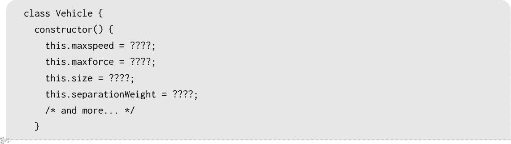

你要做的就是将这些变量转换为数组，这样数组就可以与`DNA`类中的所有方法（如`crossover()`、`mutate()`等）一起使用。一个常见的解决方案是使用一个从 0 到 1 的浮点数数组：

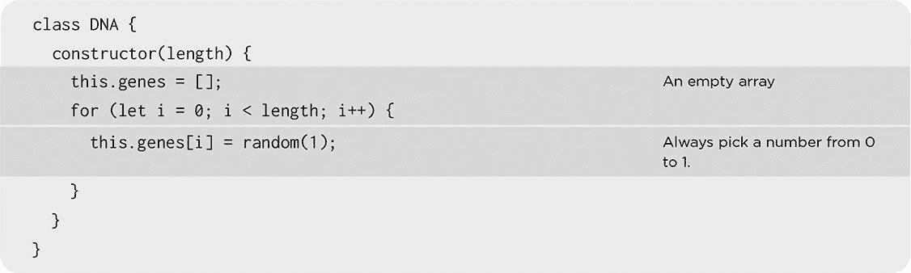

请注意，我现在已经将原始的遗传数据（基因型）和它的表现（表型）分成了两个类。`DNA` 类是基因型——它只是一些数字。`Vehicle` 类是表型——它是将这些数字转化为动画和视觉行为的表达方式。这两者可以通过在 `Vehicle` 类中包含一个 `DNA` 实例来链接：

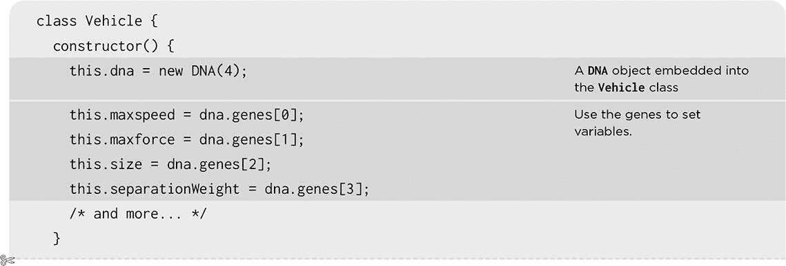

当然，你可能并不希望所有的变量都在 0 到 1 的范围内。但是与其记住如何在 `DNA` 类中调整这些范围，不如直接从 `DNA` 对象中获取原始遗传信息，然后使用 p5.js 的 `map()` 函数，根据需要调整范围。例如，如果你希望 `size` 变量在 10 到 72 之间，你可以这样写：

```
    this.size = map(this.dna.genes[2], 0, 1, 10, 72);
```

在其他情况下，你可能希望设计一个基因型，即一系列对象的数组。考虑设计一个配备多个推进器的火箭。你可以将每个推进器看作是一个向量，描述它的方向和相对强度：

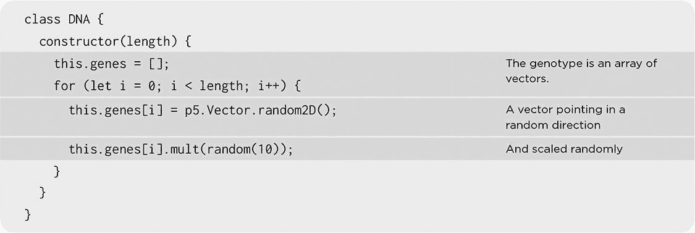

表型将是一个参与物理系统的`Rocket`类：

```
class Rocket {
  constructor() {
    this.dna = ????;
    /* and more... */
  }
}
```

将基因型和表型分成不同的类（例如 `DNA` 和 `Rocket` 类）是非常有益的。因为当你开始编写所有代码时，你会发现我之前开发的 `DNA` 类保持不变。唯一变化的是数组中存储的数据类型（数字、向量等），以及这些数据在表型类中的表现。

在接下来的部分，我将进一步跟随这一思路，逐步讲解如何实现一个涉及运动物体和一系列向量作为 DNA 的示例。

### **进化力量：智能火箭**

我提到火箭是有原因的：2009 年，Jer Thorp 在他的博客上发布了一个名为“智能火箭”的遗传算法示例。Thorp 指出，美国国家航空航天局（NASA）使用进化计算技术解决各种问题，从卫星天线设计到火箭发射模式。这激发了他创建了一个 Flash 演示，展示了火箭的进化。

这是一个场景：一群火箭从屏幕底部发射，目标是击中屏幕顶部的靶子。障碍物阻挡了通往目标的直线路径（见图 9.9）。

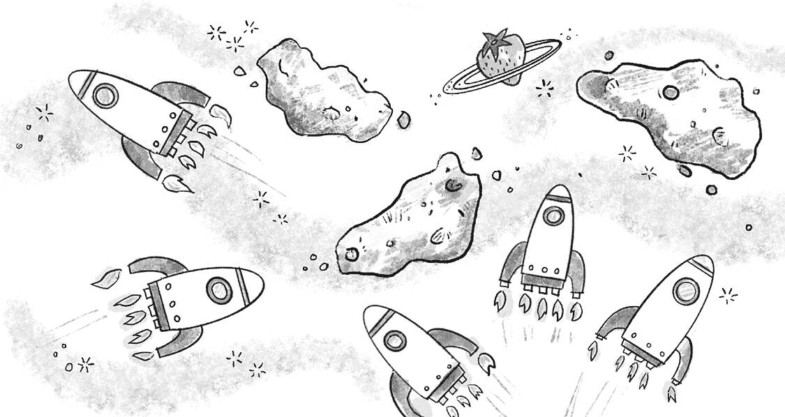

图 9.9：一群智能火箭寻找美味的草莓星球

每个火箭都配备了五个可调强度和方向的推进器（见图 9.10）。这些推进器不是同时连续发射的，而是按自定义顺序逐一发射。

在本节中，我将基于 Thorp 的思路，演化我自己的简化版智能火箭。等我讲到这一节的最后，我会把实现 Thorp 额外的高级功能留作练习。

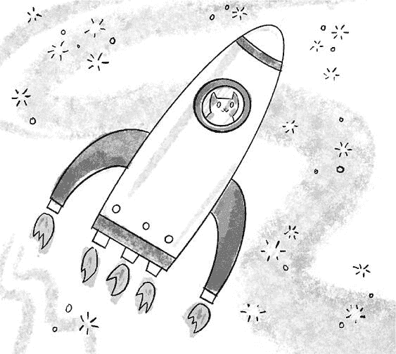

图 9.10：一枚智能火箭，配有五个推进器，载着宇航员 Clawdius

我的火箭将只有一个推进器，它能在每一帧动画中以任意方向和任意强度发射。这在现实中并不特别逼真，但它会使得构建这个示例变得稍微简单一些。（你可以稍后将火箭和推进器做得更加先进和真实。）

#### **开发火箭**

为了实现我不断发展的智能火箭，我将从第二章中提取`Mover`类，并将其重命名为`Rocket`：

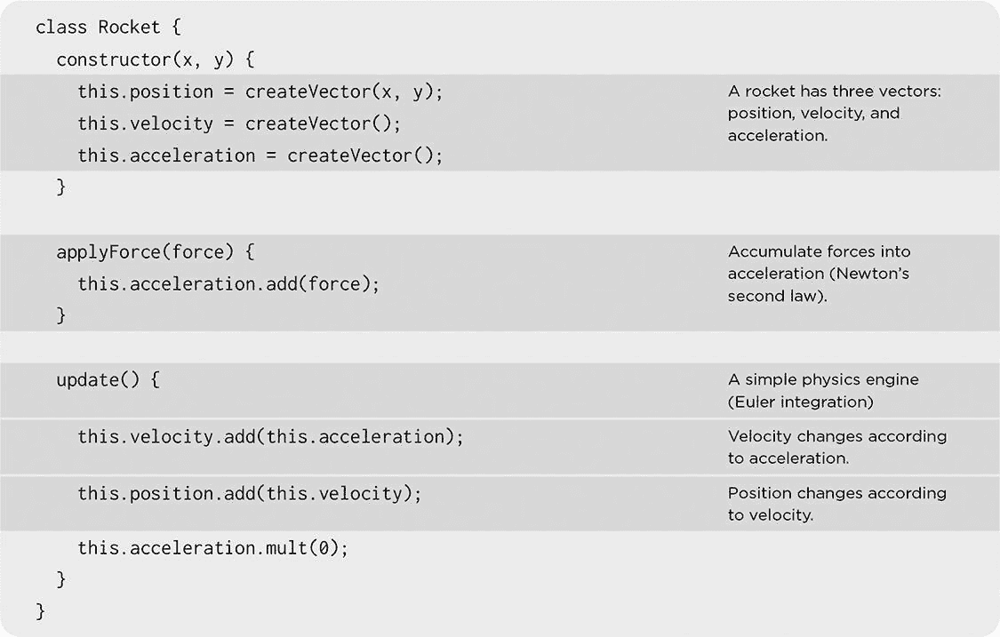

有了这个类，我可以通过每一帧动画调用`applyForce()`来移动火箭。推进器每次通过`draw()`向火箭施加一个力。但在这时，我离完成还有很长的路要走。为了使我的火箭“智能”并且可进化，我需要考虑上一节中提到的编写自定义 GA 的三个关键。

**关键 1**是为种群大小和变异率定义正确的全局变量。现在我先不太担心这些变量，随便选择一些合理的数字——也许是 50 个火箭的种群和 1%的变异率。一旦我构建了系统并且草图运行起来，我就可以开始尝试这些数字。

**关键 2**是开发一个合适的适应度函数。在这种情况下，火箭的目标是到达目标。火箭离目标越近，其适应度越高。因此，适应度与距离成反比：距离越小，适应度越大；距离越大，适应度越小。

为了付诸实践，我首先需要为`Rocket`类添加一个属性来存储其适应度：

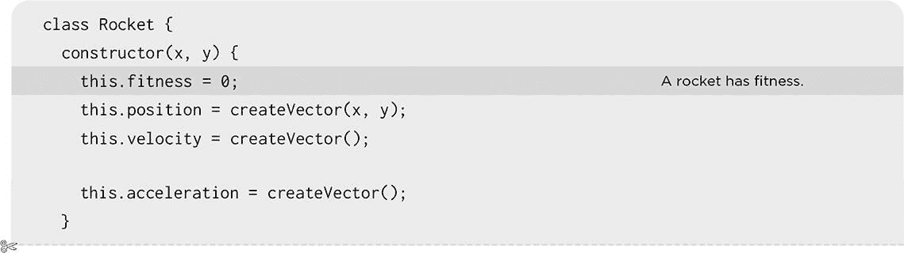

接下来，我需要为`Rocket`类添加一个方法来计算适应度。毕竟，只有`Rocket`对象知道如何计算与目标的距离，因此适应度函数应该在这个类中实现。假设我有一个`target`向量，我可以编写以下代码：

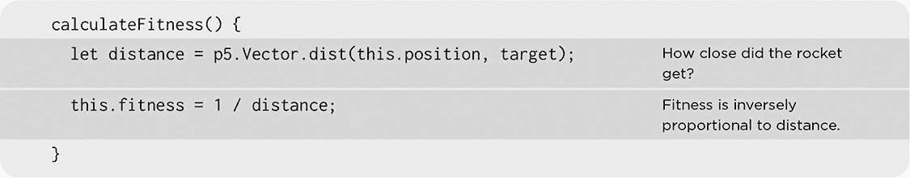

这是我能编写的最简单的适应度函数。通过将`1`除以距离，较大的距离变成较小的数字，较小的距离变成较大的数字。如果我想使用上一节中的二次技巧，我可以改为将`1`除以距离的平方：

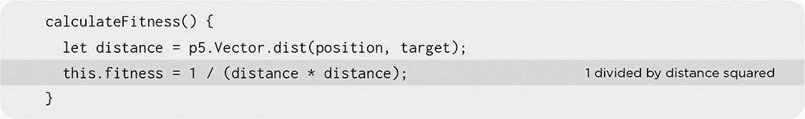

我还需要对适应度函数进行一些额外的改进，但这已经是一个不错的开始。

最后，**关键 3**是考虑基因型和表现型之间的关系。我已经说明，每个火箭都有一个推进器，它在一个可变的方向上以可变的强度发射——换句话说，这是一个向量！因此，基因型，也就是编码火箭行为所需的数据，是一个向量数组，每个向量对应动画中的一帧：

```
class DNA {
  constructor(length) {
    this.genes = [];
    for (let i = 0; i < length; i++) {
      this.genes[i] = createVector();
    }
  }
}
```

这里的好消息是，我实际上不需要对`DNA`类做任何其他修改。打字猫的所有功能（交叉和变异）仍然适用。唯一需要考虑的区别是如何初始化基因数组。在打字猫中，我有一个字符数组，并为数组的每个元素随机选择一个字符。现在我将做完全相同的事情，将 DNA 序列初始化为一个随机向量数组。

你在创建随机向量时的直觉可能是这样的：

```
let v = createVector(random(-1, 1), random(-1, 1));
```

这段代码完全没问题，很可能能达到预期效果。然而，如果我绘制出所有可能的向量，结果将填满一个正方形（见图 9.11，左）。在这种情况下，可能没什么大碍，但由于从正方形中心到角落的向量比垂直或水平方向的向量长，因此对角线方向会有轻微的偏差。

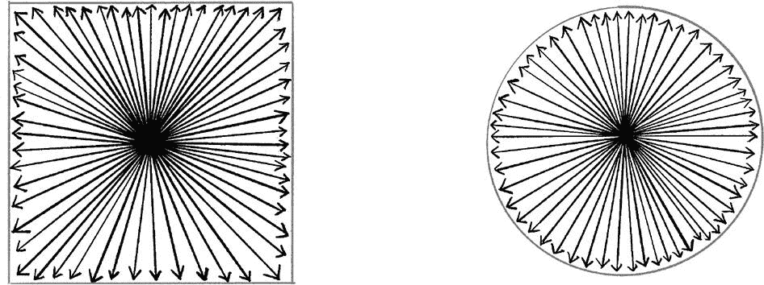

图 9.11：使用随机的 *x* 和 *y* 值（左）以及使用`p5.Vector.random2D()`（右）创建的向量

正如你可能还记得的第三章，更好的选择是选择一个随机角度，并从该角度创建一个长度为 1 的向量。这会生成一个形成圆形的结果（见图 9.11 右侧），可以通过极坐标到笛卡尔坐标的转换或可靠的`p5.Vector.random2D()`方法实现：

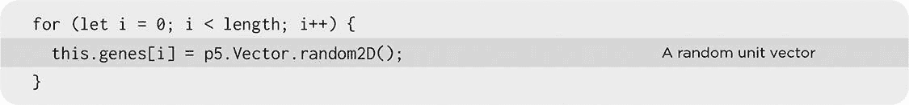

一个长度为 1 的向量实际上会产生相当大的力。记住，力是作用于加速度的，而加速度每秒 30 次（或根据帧率）累积成速度。因此，在这个例子中，我将在`DNA`类中添加另一个变量——最大力，并随机缩放所有向量，使它们的大小在 0 到最大值之间。这样就能控制推进器的功率：

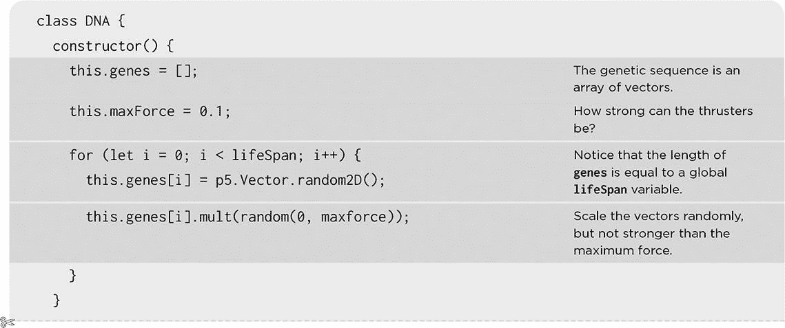

注意，我正在使用`lifeSpan`来设置`genes`（向量数组）的长度。这个全局变量存储每代生命周期中的总帧数，使我能够为火箭的每一帧创建一个向量。

这个向量数组的表现形式，即表型，是我的`Rocket`类。为了巩固这个联系，我需要在类中添加一个`DNA`对象的实例：

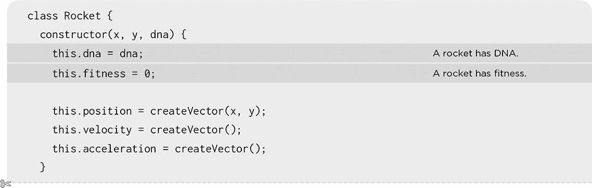

我用`this.dna`做什么？随着火箭的发射，它会依次遍历向量数组，并将它们逐个应用为力。为了实现这一点，我需要包含变量`this.geneCounter`来帮助逐步遍历数组：

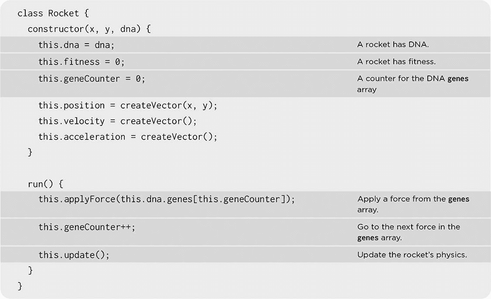

现在，我有了一个`DNA`类（基因型）和一个`Rocket`类（表型）。最后一步是实现一个机制，用于管理火箭种群并进行选择与繁殖。

#### **管理种群**

为了让我的*sketch.js*文件更整洁，我将把管理`Rocket`对象数组的代码放在`Population`类中。和`DNA`类一样，好消息是我几乎不需要修改打字猫示例中的任何内容。我只是以更面向对象的方式组织代码，新增了`selection()`方法和`reproduction()`方法。为了展示不同的技术，我还将在`selection()`中标准化适应度值，并在`reproduction()`中使用加权选择（接力赛）算法。这消除了对单独配对池数组的需求。`weightedSelection()`代码与本章早些时候编写的代码相同：

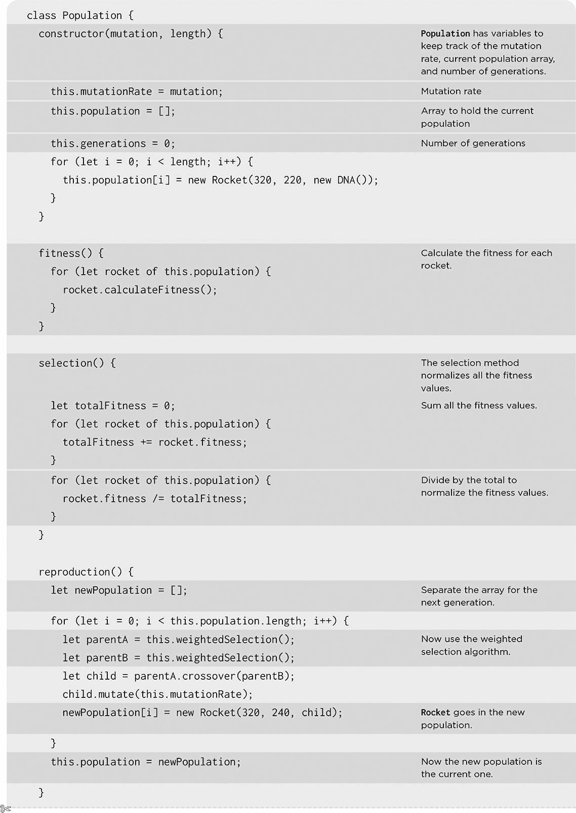

然而，我需要做一个相当重要的更改。在打字猫示例中，一旦生成了随机短语，就会立即对其进行评估。字符字符串没有生命周期；它纯粹是为了计算其适应度而存在。然而，火箭需要在被评估之前活跃一段时间——也就是说，它们需要有机会尝试达到目标。因此，我需要在`Population`类中添加一个方法来运行物理模拟。这与我在粒子系统的`run()`方法中所做的完全相同——更新所有粒子的位置并绘制它们：

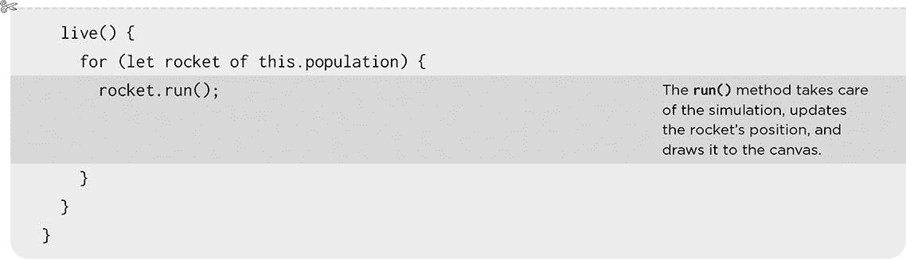

最后，我准备好`setup()`和`draw()`了。在这里，我的主要任务是按正确的顺序调用`Population`类中的方法，来实现 GA 的各个步骤：

```
 population.fitness();
    population.selection();
    population.reproduction();
```

然而，与莎士比亚示例不同，我不希望每一帧都做这个。相反，我的步骤如下：

1.  创建火箭种群。

1.  让火箭在*N*帧内存活。

1.  进化下一代：

    +   选择

    +   繁殖

1.  返回到步骤 2。

为了知道何时从步骤 2 转到步骤 3，我需要一个`lifeCounter`变量来跟踪当前世代的进展，以及`lifeSpan`变量。在`draw()`中，当`lifeCounter`小于`lifeSpan`时，会调用种群的`live()`方法来运行模拟。一旦`lifeCounter`达到`lifeSpan`，就该调用`fitness()`、`selection()`和`reproduction()`来进化出新一代火箭。

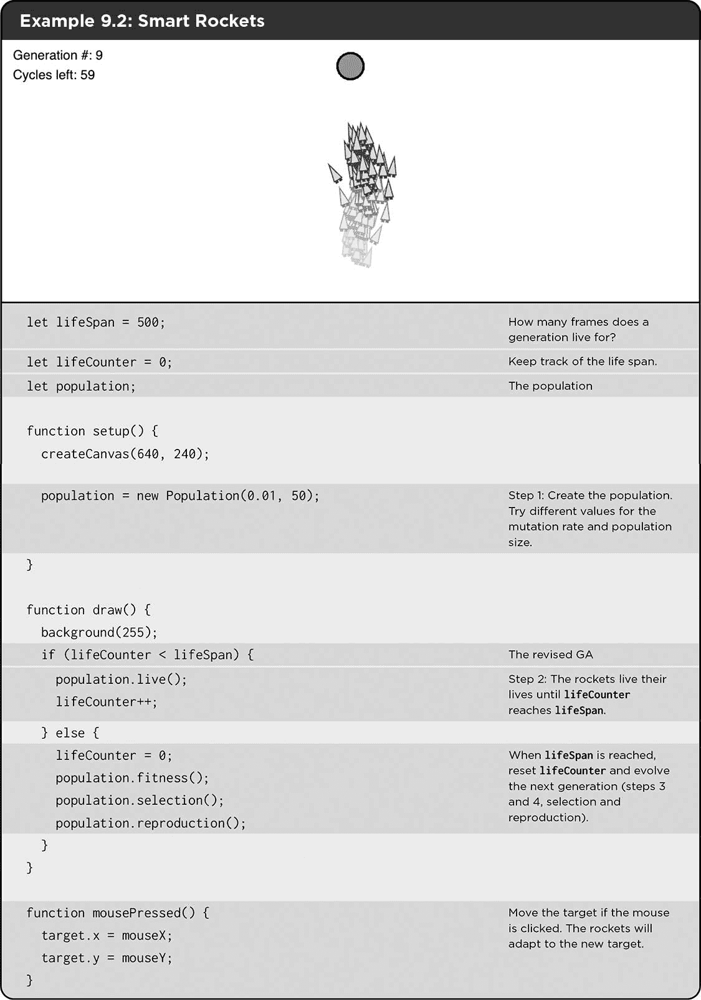

在代码的底部，你会看到我添加了一个新功能：当鼠标点击时，目标位置会移动到鼠标光标的坐标。这一变化让你可以观察火箭如何适应并调整它们的轨迹，以向新的目标位置靠近，同时系统在实时不断进化。

#### **进行改进**

我的智能火箭虽然有效，但还没有特别令人兴奋。毕竟，火箭只是简单地朝着目标进化，拥有指向目标的多个向量。为了让这个例子更有趣，我打算提出两个改进。首先，当我首次介绍智能火箭场景时，我提到火箭应该进化出避开障碍物的能力。添加这一功能将使系统更加复杂，并更有效地展示进化算法的强大能力。

为了实现障碍物避让，我需要一些障碍物来避开。我可以通过实现一个`Obstacle`对象类来轻松创建矩形的静态障碍物，该类存储它们自己的位置和尺寸：

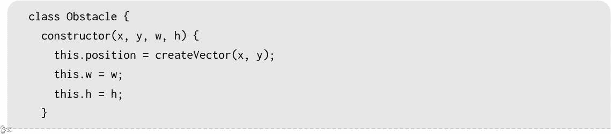

我会在`Obstacle`类中添加一个`contains()`方法，如果火箭撞到了障碍物，则返回`true`，否则返回`false`：

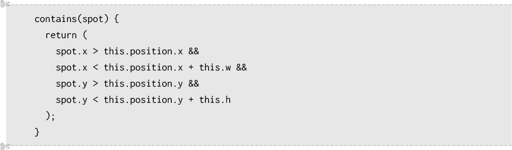

如果我创建一个`Obstacle`对象数组，那么每个火箭就可以检查它是否与每个障碍物发生碰撞。如果发生碰撞，火箭可以将布尔标志`hitObstacle`设置为`true`。为此，我需要在`Rocket`类中添加一个方法：

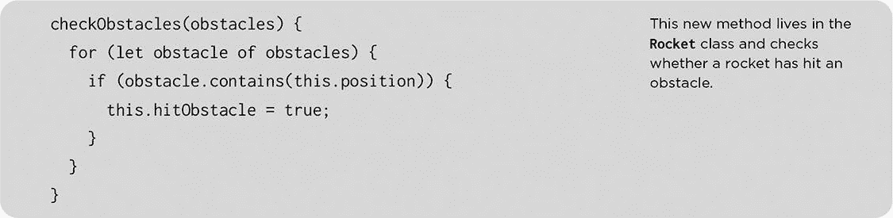

如果火箭撞到障碍物，我会停止火箭更新它的位置。修改后的`run()`方法现在接收一个`obstacles`数组作为参数：

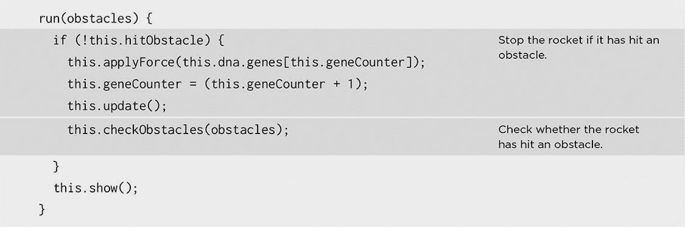

我还有机会调整火箭的适应度。如果火箭撞到了障碍物，适应度应该被惩罚并大幅减少：

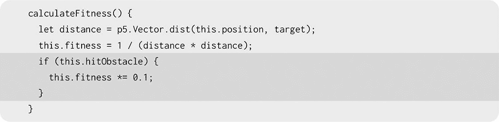

这样，火箭就应该能够进化出避开障碍物的能力。但我不会停下。我还想做另一个改进。

如果仔细看看示例 9.2，你会注意到火箭并没有因为更快地到达目标而获得奖励。适应度计算中唯一的变量是世代生命周期结束时与目标的距离。事实上，如果火箭非常接近目标，但因为飞过目标而超过了它，它可能会因为更快地到达目标而受到惩罚。在这种情况下，慢而稳才能赢得比赛。

我可以通过几种方式改进算法，以优化到达目标的速度。首先，我可以基于火箭在其生命周期中任何时刻最接近目标的距离来计算火箭的适应度，而不是使用它在世代结束时与目标的距离。我将这个变量称为火箭的`recordDistance`，并将其作为`Rocket`类中`checkTarget()`方法的一部分进行更新：

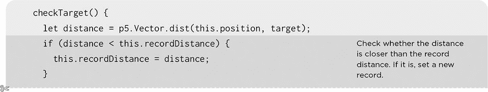

此外，火箭应该根据它到达目标的速度获得奖励。为此，我需要一种方式来知道火箭是否击中了目标。事实上，我已经有了一种方法：`Obstacle` 类有一个 `contains()` 方法，目标也可以实现为障碍物，没理由不能这样做。这只是一个火箭*想要*击中的障碍物！我可以使用 `contains()` 方法在每个 `Rocket` 对象上设置一个新的 `hitTarget` 标志。如果火箭击中目标，它将停止，就像它撞到障碍物时一样：

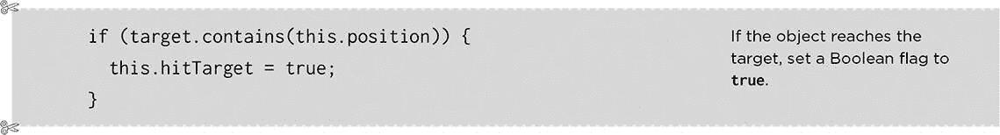

记住，我还希望火箭到达目标的速度越快，其适应度越高。相反，越慢到达目标，适应度得分越低。为了实现这一点，可以在火箭生命周期的每个周期中递增 `finishCounter`，直到它到达目标。生命结束时，计数器将等于火箭到达目标所花费的时间：

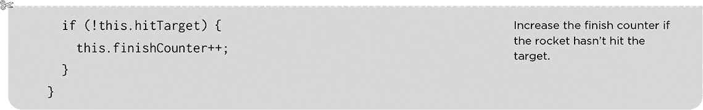

我还希望将适应度与`finishCounter`成反比。为了实现这一点，我可以通过以下修改来改进适应度函数：


这两个改进已经融入到例子 9.3 的代码中。

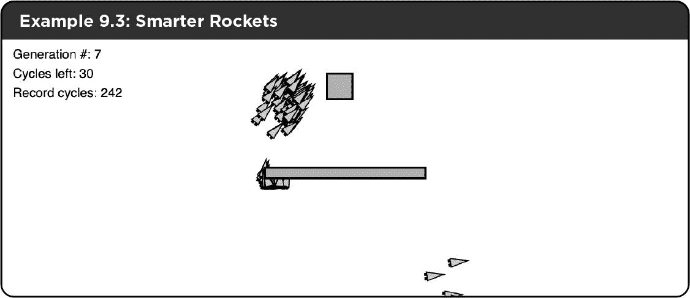

这个例子可以通过多种方式改进和扩展。以下习题提供了深入探索遗传算法的想法和挑战。你还能尝试什么？

 **习题 9.9**

创建一个更复杂的障碍课程。随着你增加火箭到达目标的难度，是否需要改进遗传算法的其他方面——例如，适应度函数？

 **习题 9.10**

实现 Thorp 原始智能火箭的发射模式。每个火箭只有五个推进器（可以是任意方向和强度），并且有一个发射顺序（长度可任意）。Thorp 的模拟还为火箭提供了有限的燃料。

 **习题 9.11**

以不同的方式可视化模拟。你能画出到目标的最短路径吗？你能以更有趣的方式画出火箭吗？如何添加粒子系统，模拟火箭推进器方向上的烟雾？

 **习题 9.12**

另一种教火箭到达目标的方法是进化一个流场。你能把火箭的基因型变成一个向量流场吗？

### **互动选择**

卡尔·西姆斯是计算机图形学研究员和视觉艺术家，他与遗传算法有着广泛的合作。（他还因其在粒子系统方面的工作而广为人知！）他的一个创新性进化项目是博物馆装置*加拉帕戈斯*。这个装置最初于 1997 年安装在东京的 NTT 互动通信中心，包含 12 台显示器，展示计算机生成的图像。这些图像随着时间的推移不断进化，遵循选择和繁殖的遗传算法步骤。

这里的创新不在于使用遗传算法（GA），而在于适应度函数背后的策略。在每台显示器前面都有一个地面传感器，可以检测到观众是否正在观看屏幕。图像的适应度与观众观看图像的时间长度相关。这被称为**交互式选择**，即由人类分配适应度值的遗传算法。

交互式选择并不仅限于艺术装置，它在数字时代的用户生成评级和评论中非常普遍。你能想象根据你的 Spotify 评分进化出完美的歌曲吗？或者根据 Goodreads 的评论进化出理想的书籍吗？然而，为了与本书的自然主题保持一致，我将通过使用一群数字花朵（如图 9.12 中的花朵）来说明交互式选择是如何工作的。

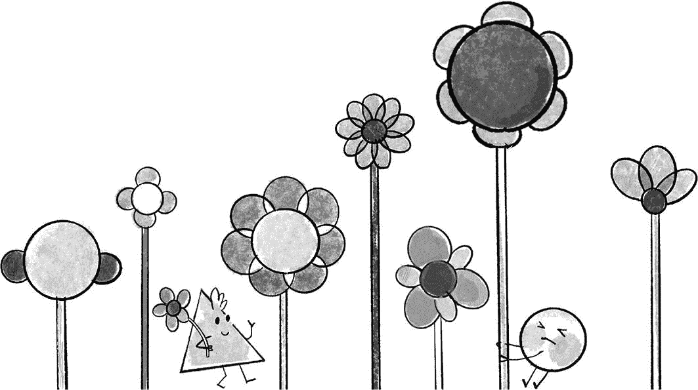

图 9.12：交互式选择的花朵设计

每朵花都有一组属性：花瓣颜色、花瓣大小、花瓣数量、花蕊颜色、花蕊大小、茎长和茎色。花的 DNA（基因型）是一个浮动的数字数组，范围从 0 到 1，每个属性都有一个单独的数值：

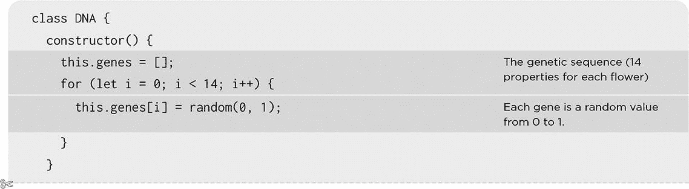

表型是一个`Flower`类，其中包含一个`DNA`对象的实例：


当需要绘制花朵时，我将使用 p5.js 的`map()`函数，将任何基因值转换为适当的像素尺寸或颜色值范围。（我还将使用`colorMode()`将 RGB 范围设置为 0 到 1。）


到目前为止，我还没有做任何新的事情。这和我迄今为止在每个遗传算法示例中所做的流程相同。不同之处在于，我将不会编写一个`fitness()`函数，通过数学公式计算得分。相反，我将要求用户分配适应度。

如何要求用户分配适应度，最好作为一个交互设计问题来解决，这实际上不在本书的讨论范围内。我不会展开详细讨论如何编程滑块，或是制作自己的硬件旋钮，或者创建一个允许人们提交在线评分的网页应用。如何获取适应度分数取决于你和你正在开发的具体应用。为了本次演示，我将借鉴 Sims 的*加拉帕戈斯*装置的灵感，当鼠标悬停在花朵上时，便增加其适应度。然后，当按下“进化下一代”按钮时，下一代花朵就会被创建。

看看 GA 的步骤——选择和繁殖——是如何应用在`nextGeneration()`函数中的，该函数由附加在 p5.js`button`元素上的`mousePressed()`事件触发。适应度的增加是`Population`类的`rollover()`方法的一部分，该方法检测鼠标是否悬停在某个花朵设计上。你可以在本书的网站上的示例代码中找到更多关于这个草图的细节。

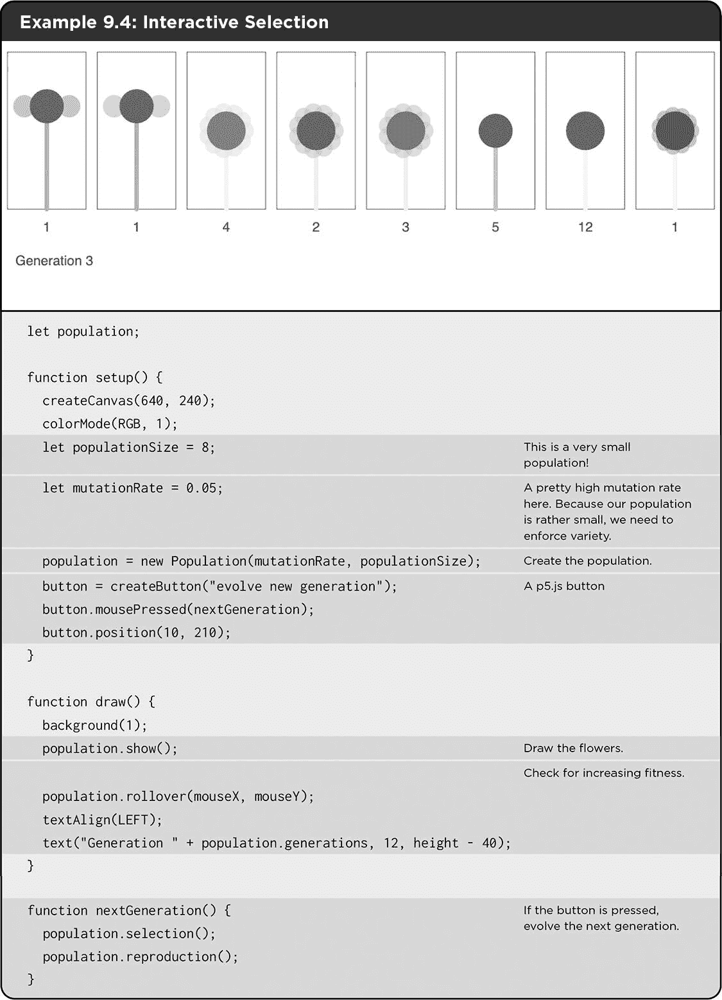

这个例子只是演示了交互选择的思想，并没有达到特别有意义的结果。首先，我没有特别注意花朵的视觉设计；它们只是一些不同大小和颜色的简单形状。（不过，看看你能否在代码中找到极坐标的使用！）Sims 为他的图像使用了更复杂的数学函数作为基因型。你也可以考虑使用基于向量的方法，其中设计的基因型是一组点或路径。

然而，这里更为重要的问题是时间问题。在自然界中，进化发生在数百万年的时间跨度里。而在本章的第一个例子中的计算机模拟世界里，种群能够相对较快地进化出行为，因为新一代是通过算法生成的。在打字猫的例子中，每经过一次`draw()`（大约每秒 60 次），便会产生一个新一代。每一代智能火箭的寿命是 250 帧——在进化的时间尺度上，依然只是眨眼间的事。然而，在互动选择的情况下，你必须坐下来等着一个人对种群中的每一个成员进行评分，才能进入下一代。一个大种群对于用户来说，评估起来会变得非常繁琐——更不用说，能忍受多少代的评分了？

你当然可以通过巧妙的方法绕过这个问题。Sims 的*加拉帕戈斯*展览将评分过程隐藏在观众的视线之外，因为它通过正常的艺术观赏行为在画廊中发生。创建一个允许多人分布式评分的网页应用也是一种快速为大种群获取评分的好策略。

最终，成功的交互式选择系统的关键归结为之前所确立的相同关键点。基因型和表现型是什么？你如何计算适应度——或者在这种情况下，你的策略是什么，根据交互来分配适应度？

 **练习 9.13**

构建你自己的交互式选择项目。除了视觉设计外，考虑进化声音——例如，一段短的音调序列。你能设计一个策略吗，比如一个网络应用或物理传感器系统，用来随着时间的推移从很多人那里获取评分？

 **练习 9.14**

卡尔·西姆斯（Karl Sims）在遗传算法领域的另一部开创性作品是“进化虚拟生物”。在这个项目中，一群数字生物在一个模拟物理环境中被评估其执行任务的能力，例如游泳、奔跑、跳跃、跟随和争夺一个绿色立方体。该项目使用基于节点的基因型：生物的 DNA 不是一个线性的向量或数字列表，而是一个节点图（就像第六章中的软体物理模拟）。表现型是生物的身体本身，一个由肌肉连接的肢体网络。

你能否将花、植物或生物的 DNA 设计成一个零件网络？其中一个想法是使用交互式选择来进化设计。或者，你可以结合弹簧力，或许使用 Toxiclibs.js 或 Matter.js，创建一个简化的 2D 版《模拟人生》生物。如果它们根据与特定目标相关的适应度函数进化会怎样呢？想了解更多关于《模拟人生》技术的内容，你可以阅读他 1994 年的论文 (*[`www.karlsims.com/papers/siggraph94.pdf`](https://www.karlsims.com/papers/siggraph94.pdf)*)，并观看 YouTube 上的“进化虚拟生物”视频 (*[`youtu.be/RZtZia4ZkX8`](https://youtu.be/RZtZia4ZkX8)*)。


### **生态系统模拟**

你可能已经注意到，在本章中我所构建的进化系统有些奇怪。在现实世界中，一群婴儿并不会同时出生。这些婴儿也不会同时长大，并且在同一时间繁殖，然后瞬间死去，保持种群数量的完美稳定。那样的话，简直是荒谬的。更不用说，肯定没有人在森林里拿着计算器， crunch 数字并为所有生物分配适应度值了。

在现实世界中，正如我在本章开头所讨论的，你并不是真的有“适者生存”，你有的是*繁殖者生存*。那些恰巧活得更久的生物，在很多情况下，拥有更大的繁殖机会。婴儿出生了，它们活了一段时间，也许它们自己有孩子，也许没有，然后它们死去。我能否编写一个捕捉这种更现实的进化生物学视角的草图呢？

你不一定会在人工智能教科书中找到现实世界进化的模拟。遗传算法（GA）通常用于本章前面更为正式的方式。然而，由于你正在阅读本书以开发自然系统的模拟，因此值得看看如何使用 GA 构建类似于我在每章末尾项目提示中描述的那种生物生态系统。

我将从想象一个简单的场景开始。我将创建一个名为*bloop*的生物，一个根据 Perlin 噪声在画布上移动的圆形生物。这个生物会有一个半径和一个最大速度。它越大，移动越慢；越小，移动越快：

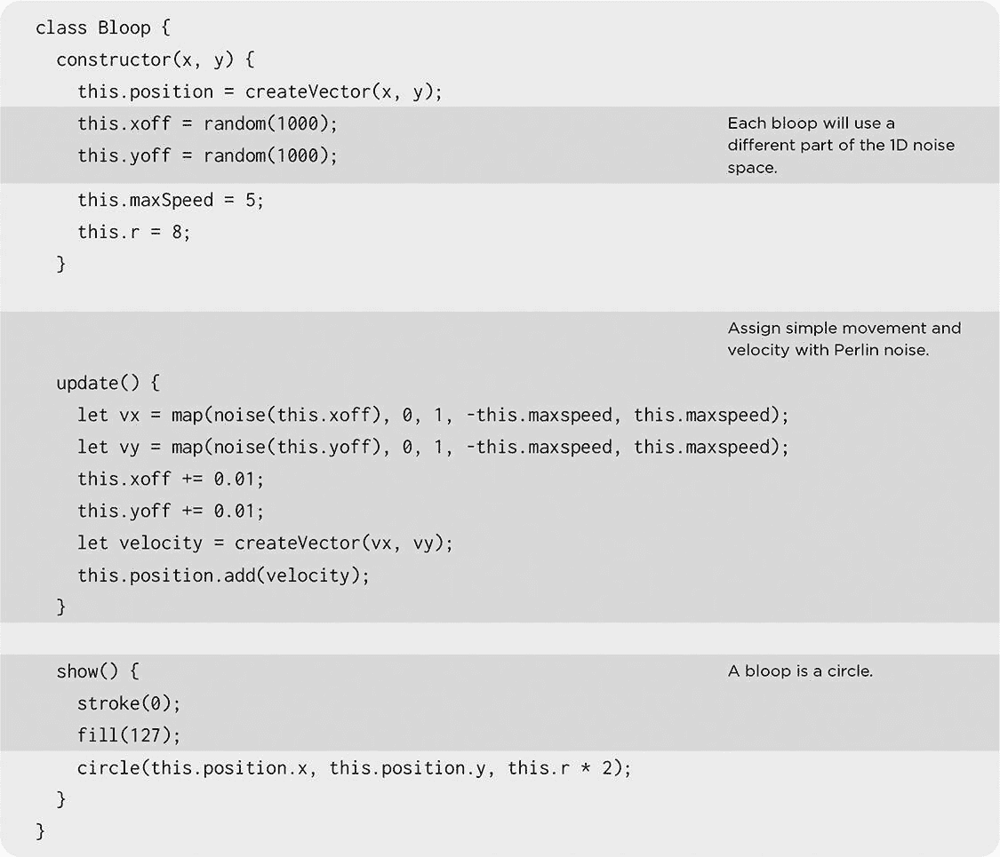

和往常一样，bloop 的种群可以存储在一个数组中，数组可以由一个名为`World`的类来管理：

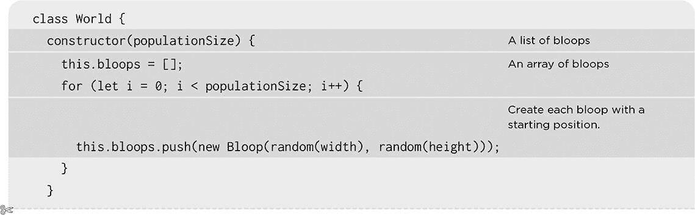

到目前为止，我只是在重复第四章中的粒子系统。我有一个名为`Bloop`的实体，它在画布上移动，还有一个名为`World`的类，管理这些实体的数量。为了将其转变为一个会进化的系统，我需要为我的世界添加两个额外的特性：

+   **Bloop 死亡。**

+   **Bloop 会诞生。**

Bloop 的死亡是我用来替代适应度函数和选择过程的方法。如果一个 bloop 死亡了，它就不能被选为父代，因为它不再存在！为了在世界中确保 bloop 死亡，我可以向`Bloop`类添加一个`health`变量：

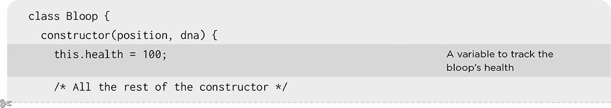

每次通过`update()`时，bloop 都会失去一些生命值：


如果`health`降到`0`以下，bloop 就会死亡：

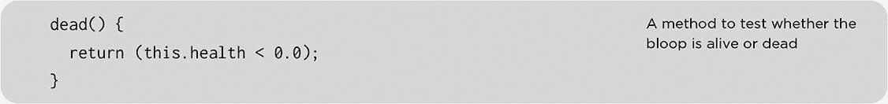

这一步是个不错的起点，但我还没有真正取得任何成就。毕竟，如果所有的 bloop 都从 100 生命值开始，并且以相同的速率失去生命值，那么所有 bloop 的寿命将是完全相同的，并且会一起死亡。如果每一个 bloop 都活得一样久，那么每个 bloop 都有相等的繁殖机会，因此不会发生进化变化。

你可以通过更复杂的世界设计实现不同的寿命长度。一种方法是引入捕食者来吃掉 bloop。更快的 bloop 更可能逃脱被吃掉的命运，从而导致越来越快的 bloop 进化。另一种方法是引入食物。当 bloop 吃掉食物时，它的生命值增加，从而延长其寿命。

假设我有一个名为`food`的向量位置数组。我可以测试每个 bloop 与每个食物位置的接近程度。如果 bloop 足够接近，它就会吃掉食物（然后食物从世界中移除），并增加它的生命值。

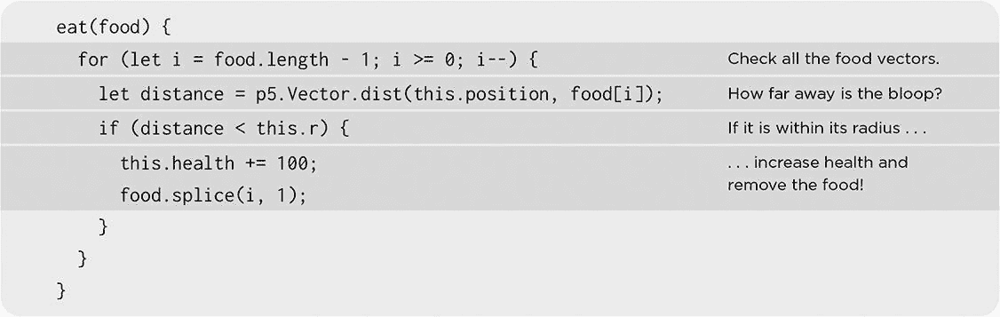

在这个场景中，吃得更多的“bloop”预期能活得更久，且更有可能繁殖。因此，系统应该进化出能够优化寻找和消费食物的“bloop”。

现在世界已经建立，接下来是添加进化所需的组件。第一步是确定基因型和表型。

#### **基因型与表型**

一个“bloop”寻找食物的能力与两个变量相关：大小和速度（见图 9.13）。更大的“bloop”更容易找到食物，因为它们的体积会让它们更频繁地与食物的位置相交。而更快的“bloop”会找到更多的食物，因为它们能够在更短的时间内覆盖更多的地面。

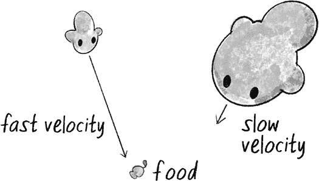

图 9.13：小型和大型“bloop”生物。示例将使用简单的圆形，但你可以更富有创意地设计！

由于大小与速度成反比（大型“bloop”动作慢，小型“bloop”动作快），我需要一个只有单一数字的基因型。


表型就是“bloop”本身，它的大小和速度是通过将一个`DNA`对象实例添加到`Bloop`类中来分配的：

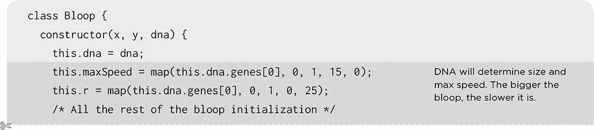

请注意，`maxSpeed`属性被映射到一个从`15`到`0`的范围内。一个基因值为`0`的“bloop”将以速度`15`移动，而基因值为`1`的“bloop”将完全不动（速度为`0`）。

#### **选择与繁殖**

现在我有了基因型和表型，接下来需要设计一个方法来选择“bloop”作为父母。我之前提到过，越长寿的“bloop”繁殖的机会就越多。一个“bloop”的寿命长短就是它的适应度。

一种选择是说每当两个“bloop”相互接触时，它们会生成一个新的“bloop”。一个“bloop”活得越久，它与另一个“bloop”接触的机会就越大。这也会影响进化结果，因为除了进食，繁殖的可能性还取决于“bloop”定位其他“bloop”的能力。

一个更简单的选择是让“bloop”自己克隆自己，而不需要伙伴“bloop”，立即创建一个拥有相同基因组成的新的“bloop”。比如，如果我说，在任何给定的时刻，一个“bloop”有 1%的概率进行繁殖，会怎么样？使用这个选择算法，一个“bloop”活得越久，它就越可能克隆自己。这相当于说，你买彩票的次数越多，你赢的机会就越大（尽管我很抱歉地说，你中彩票的机会仍然基本为零）。

为了实现这个选择算法，我可以在`Bloop`类中编写一个方法，每一帧都选择一个随机数。如果这个数小于 0.01（1%），就会诞生一个新的“bloop”：


那么，bloop 是如何繁殖的呢？在之前的例子中，繁殖过程涉及到调用`DNA`类中的`crossover()`方法，并根据生成的基因数组创建一个新对象。然而，在这个例子中，由于我是从一个父体中生成一个孩子，我将调用一个名为`copy()`的方法：

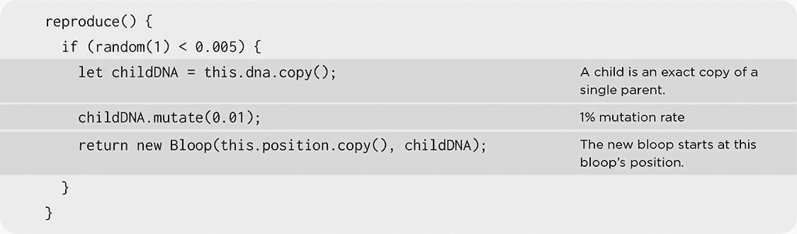

请注意，我已将繁殖概率从 1%降低到 0.05%。这个改变带来了显著差异；如果繁殖概率过高，系统将迅速过度拥挤。而如果概率太低，一切可能很快灭绝。

将`copy()`方法写入`DNA`类非常简单，使用 JavaScript 的数组方法`slice()`，这是一种标准的 JavaScript 方法，通过复制现有数组中的元素来创建一个新数组：

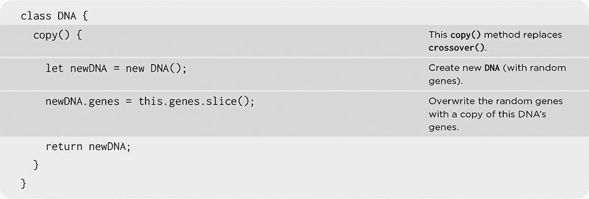

在选择和繁殖机制到位后，我可以最终确定`World`类，来管理所有`Bloop`对象的列表，以及一个`Food`对象，里面包含食物的位置列表（我会将其画成小方块）。

在运行这个例子之前，先花点时间猜测一下系统最终会进化出哪种大小和速度的 bloop。我会在代码之后讨论这些细节。

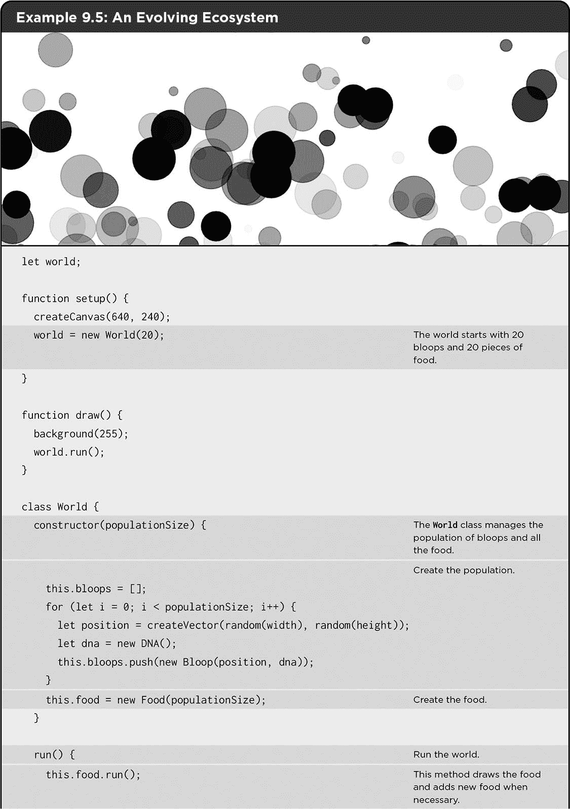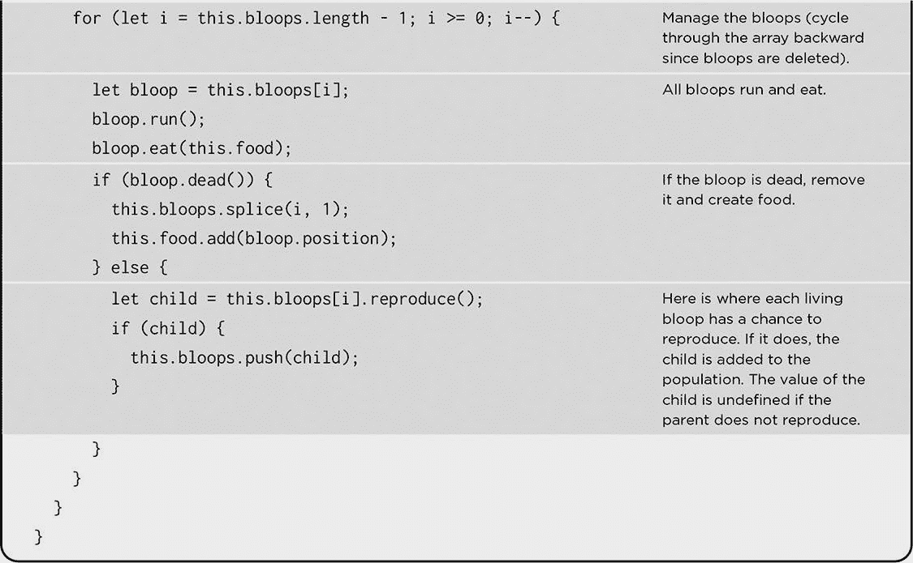

如果你猜测是中等大小的 bloop 以中等速度移动，你是对的。根据这个系统的设计，过大的 bloop 根本太慢，无法找到食物。而过快的 bloop 又太小，找不到食物。能够存活最久的 bloop 通常处于中间，既足够大，又足够快，能找到食物（但又不至于过大或过快）。当然，也存在一些异常情况。例如，如果一群大 bloop 恰好聚集在同一个位置（而且由于它们太大，几乎不动），它们可能会突然全部死掉，留下大量的食物供某个恰好在场的大 bloop 食用，从而让一个小规模的大 bloop 种群能够在某个位置上维持一段时间。

这个例子相当简单，因为它只有一个基因，并且是克隆而不是交叉。以下是一些建议，可以将 bloop 的例子应用于更复杂的生态系统模拟中。

 **生态系统项目**

向你的生态系统中添加进化机制，基于本章中的例子进行构建：

+   向你的生态系统中添加一群捕食者。捕食者与猎物（或寄生虫与宿主）之间的生物进化通常被称为*军备竞赛*，在这个过程中，生物体不断地适应和反适应对方。你能在多个生物体的系统中实现这种行为吗？

+   你会如何在一个模拟 bloop 的生态系统中实现交叉和突变呢？试着实现一个算法，使得当两个生物体在一定距离内时，它们可以交配。

+   尝试将多个引导力量的权重作为生物的 DNA。你能创造一个生物进化出相互合作的场景吗？

+   生态系统模拟中最大的挑战之一是实现平衡。你可能会发现，大多数尝试要么导致大规模人口过剩（随后是大规模灭绝），要么直接发生大规模灭绝。你可以采用哪些技术来实现平衡？考虑使用遗传算法（GA）来演化生态系统的最优参数。

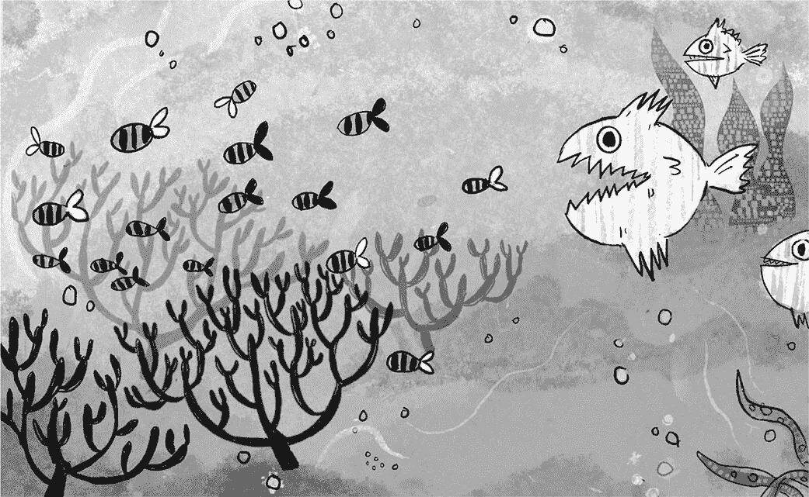
