## **10 神经网络**

*人类大脑有 1000 亿个神经元，每个神经元与其他 1 万个神经元相连。你肩膀上的东西是已知宇宙中最复杂的物体。*

—加贺美智夫

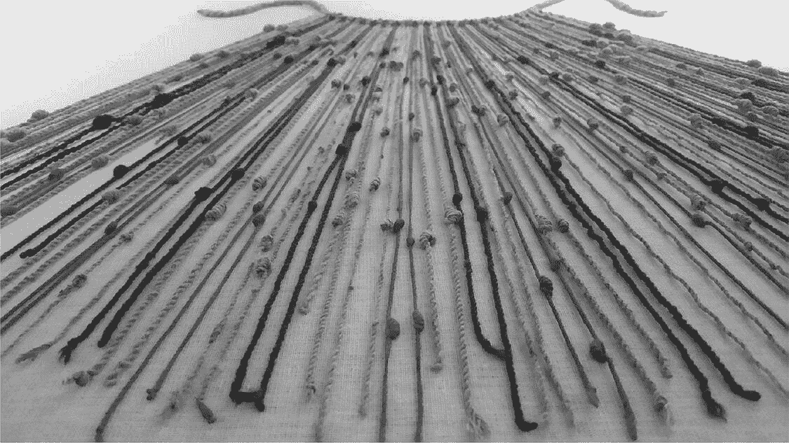

***马丘比丘博物馆展示的*基普*，位于秘鲁库斯科（照片由 Pi3.124 提供）***

*基普*（或*基普*）是古代印加文明用来记录和传递信息的工具。它由一套复杂的结绳系统构成，用来编码和传递信息。每条颜色不同的绳子、结的类型和样式都代表了特定的数据，如人口普查记录或日历信息。被称为*基普卡马约克*的解读者充当了一种会计人员的角色，将这些串联的故事解码成可理解的信息。

我从生活在力量世界中的无生命物体开始，赋予它们欲望、自治权以及根据规则系统采取行动的能力。接着，我让这些物体（现在称为*生物*）生活在一个群体中并随时间进化。现在我想问，是什么决定了每个生物的决策过程？它如何通过学习随时间调整其选择？一个计算实体能否处理它的环境并生成决策？

为了回答这些问题，我再次从自然界寻找灵感——具体来说，是人类的大脑。大脑可以被描述为一种生物学**神经网络**，这是一个相互连接的神经元网络，传递复杂的电信号模式。在每个神经元内部，树突接收输入信号，基于这些输入，神经元通过轴突发出输出信号（见图 10.1）。或者类似的东西。人类大脑究竟是如何工作的，这仍然是一个复杂且精细的谜团，肯定不是我在本章中打算严格详细解开的问题。

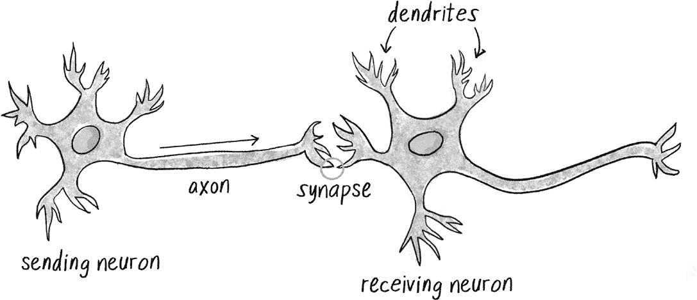

图 10.1：一个神经元，带有树突和与另一个神经元相连的轴突

幸运的是，正如你在本书中所见，开发引人入胜的动画系统并不需要严格的科学性或准确性。设计一枚智能火箭并不需要火箭科学，设计一个人工神经网络也不需要大脑科学。仅仅受到*大脑功能*这一*概念*的启发就足够了。

在本章中，我将首先概述神经网络的特性和功能，并构建一个最简单的神经网络示例，即由一个神经元组成的网络。然后，我将通过使用 ml5.js 库向您介绍更复杂的神经网络。这将为第十一章奠定基础，本书的高潮部分，我将在那里结合遗传算法与神经网络进行物理模拟。

### **介绍人工神经网络**

计算机科学家们长期受到人脑的启发。1943 年，神经科学家沃伦·S·麦卡洛克和逻辑学家沃尔特·皮茨开发了第一个人工神经网络的概念模型。在他们的论文《神经活动中固有思想的逻辑演算》中，他们将**神经元**描述为一个计算单元，生活在由多个细胞组成的网络中，接收输入、处理输入并生成输出。

他们的工作，以及许多后来的科学家和研究人员的工作，并不是为了准确描述生物大脑的工作原理。相反，*人工*神经网络（以下简称*神经网络*）旨在作为一个基于大脑的计算模型，设计来解决传统上对计算机来说很困难的某些问题。

一些问题对计算机来说非常简单，但对你我这样的普通人来说却很困难。例如，求 964,324 的平方根。只需一行简单的代码就能得出值 982，这个数字我的计算机不到一毫秒就能计算出来，但如果你让我自己计算，我得让你等上很久。另一方面，某些问题对你我来说非常简单，但对计算机来说却不那么容易。给任何一个幼儿看一张小猫或小狗的照片，他们能很快告诉你哪个是哪个。坐在嘈杂的咖啡馆里，专心听某个人的声音，你能轻松理解他们的讲话。但是，如果让机器执行这些任务呢？科学家们为此花费了大半生的时间，研究并实施复杂的解决方案，而神经网络就是其中之一。

以下是一些今天神经网络在软件中的“人类容易、机器难”的应用：

+   **模式识别：** 神经网络非常适合那些旨在检测、解释和分类数据集中各类特征或模式的问题。这包括从识别图像中的物体（如面部）到光学字符识别，再到更复杂的任务，如手势识别。

+   **时间序列预测与异常检测：** 神经网络既用于预测，如预测股市趋势或天气模式，也用于识别异常，这些可以应用于网络攻击检测和防止欺诈等领域。

+   **控制与自适应决策系统：** 这些应用从自动驾驶汽车和无人机等自主驾驶工具，到游戏玩法、定价模型以及媒体平台上的推荐系统等自适应决策系统不等。

+   **信号处理与软传感器：** 神经网络在耳蜗植入物和助听器等设备中起着至关重要的作用，通过过滤噪音并放大重要声音。它们还参与了*软传感器*的工作，即处理来自多个来源的数据，提供关于环境的全面分析的软件系统。

+   **自然语言处理（NLP）：** 近年来最大的进展之一就是神经网络在处理和理解人类语言方面的应用。它们被用于多种任务，包括机器翻译、情感分析和文本摘要，是许多数字助手和聊天机器人的核心技术。

+   **生成模型：** 新型神经网络架构的兴起使得生成新内容成为可能。这些系统能够合成图像、提高图像分辨率、在图像之间转移风格，甚至生成音乐和视频。

覆盖神经网络应用的所有领域可能需要一本完整的书（或一系列书籍），而且等到书出版时，它可能就已经过时了。希望这个列表能给你一个整体的概念，帮助你了解这些功能和可能性。

#### **神经网络的工作原理**

从某些方面来说，神经网络与其他计算机程序有很大的不同。我在本书中所写的计算系统都是**过程化**的：程序从第一行代码开始，执行完后继续执行下一行，按照线性顺序执行指令。与之相反，一个真正的神经网络并不会遵循线性路径。相反，信息是通过整个节点网络集体并行处理的，每个节点代表一个神经元。从这个意义上讲，神经网络被视为一种**连接主义**系统。

从某种意义上说，神经网络与你见过的一些程序并没有太大区别。神经网络展现了复杂系统的所有特征，类似于细胞自动机或鸟群。还记得每个个体鸟群（boid）是如此简单易懂，但通过遵循三条规则——分离、对齐、聚合——它却能产生复杂的行为吗？神经网络中的每个个体元素同样简单易懂。它读取输入（一个数字），处理它，并生成输出（另一个数字）。就这么简单，然而，由许多神经元组成的网络却能展现出极为丰富和智能的行为，回响着鸟群中所见的复杂动态。

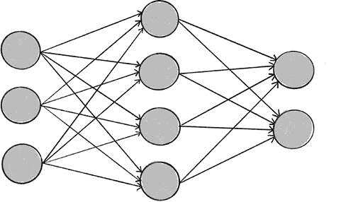

图 10.2：神经网络是由神经元和连接组成的系统。

实际上，神经网络不仅仅是一个复杂的系统，它还是一个复杂的*自适应*系统，这意味着它可以根据流经其中的信息改变其内部结构。换句话说，它具有学习的能力。通常，这是通过调整**权重**来实现的。在图 10.2 中，每个箭头表示两个神经元之间的连接，并指示信息流动的路径。每个连接都有一个权重，这是控制两个神经元之间信号的数字。如果网络产生了一个*好的*输出（我稍后会定义），则不需要调整权重。然而，如果网络产生了一个*差的*输出——可以说是一个错误——那么系统就会进行自我调整，改变权重，以期改进后续的结果。

神经网络可能会使用多种学习策略，本章将重点介绍其中的一种：

+   **监督学习：** 本质上，这种策略涉及一个比网络本身更聪明的教师。以人脸识别为例，教师向网络展示一组人脸，并且教师已经知道每张人脸对应的名字。网络进行猜测，然后教师提供正确的名字。网络可以将其答案与已知的正确答案进行比较，并根据错误进行调整。本章中的神经网络遵循这种模型。

+   **无监督学习：** 当你没有带有已知答案的示例数据集时，就需要使用这种技术。相反，网络会自主工作，发掘数据中的隐藏模式。其应用之一是聚类：一组元素根据一个未知模式被划分为不同的组。我不会展示无监督学习的实例，因为这种策略与本书的示例关系较小。

+   **强化学习：** 这一策略建立在观察基础上：学习代理做出决策，并根据其环境来查看结果。它因做出正确决策而获得奖励，因做出错误决策而受到惩罚，从而随着时间的推移学会做出更好的决策。我将在第十一章中更详细地讨论这一策略。

神经网络的学习能力，即随着时间推移对其结构进行调整的能力，是它在**机器学习**领域如此有用的原因。这个术语可以追溯到 1959 年发表的论文《使用跳棋进行机器学习的研究》，在这篇论文中，计算机科学家亚瑟·李·塞缪尔提出了一个用于下跳棋的“自学习”程序。使计算机在没有显式编程的情况下学习的算法概念是机器学习的基础。

想一想你在这本书中做了什么：编码！在传统的编程中，计算机程序接受输入，并根据你提供的规则生成输出。然而，机器学习却颠倒了这种方式。系统不是由你编写规则，而是给定示例输入和输出，并自行生成规则！可以用许多算法来实现机器学习，神经网络只是其中之一。

机器学习是**人工智能（AI）**这个广泛领域的一部分，尽管这两个术语有时可以互换使用。在 Mimi Onuoha 和 Diana Nucera（又名 Mother Cyborg）所著的友好入门书籍 *A People’s Guide to AI* 中，他们将 AI 定义为“能够执行通常需要人类智慧的任务的计算机系统的理论与发展”。机器学习算法是实现这些任务的一种方法，但并非所有的 AI 系统都具备自我学习的组件。

#### **机器学习库**

如今，在创意编码和互动媒体中利用机器学习不仅是可行的，而且越来越普遍，这得益于处理大量神经网络实现细节的第三方库。尽管绝大多数机器学习开发和研究都是用 Python 完成的，但在 Web 开发领域，基于 JavaScript 的强大工具也逐渐涌现。值得注意的两个库是 TensorFlow.js 和 ml5.js。

TensorFlow.js 是一个开源库，允许你使用 JavaScript 直接在浏览器中定义、训练和运行神经网络，而无需安装或配置复杂的环境。它是 TensorFlow 生态系统的一部分，由 Google 维护和开发。TensorFlow.js 是一个强大的工具，但其底层操作和高度技术化的 API 对初学者来说可能有些令人畏惧。这时，ml5.js 应运而生，它是建立在 TensorFlow.js 之上的库，专为与 p5.js 一起使用而设计。它的目标是让初学者更易上手，使机器学习变得更加亲民，面向广泛的艺术家、创意编码者和学生。我将在《使用 ml5.js 进行机器学习》一章中展示如何使用 ml5.js，具体内容见 第 521 页。

像 TensorFlow.js 和 ml5.js 这样的库的一个好处是，你可以用它们来运行预训练模型。一个机器学习**模型**是神经元和连接的特定配置，而**预训练**模型是已经为特定任务准备好的模型。例如，常见的预训练模型用于图像分类、识别身体姿势、识别面部标志或手部位置，甚至分析文本中的情感。你可以直接使用这样的模型，也可以将其作为进一步学习的起点（通常称为**迁移学习**）。

在我开始探索 ml5.js 库之前，我想先从零开始构建最简单的神经网络，只使用 p5.js，以此来说明神经网络和机器学习的概念是如何在代码中实现的。

### **感知机**

**感知机**是最简单的神经网络：一个单一神经元的计算模型。感知机是由 Frank Rosenblatt 于 1957 年在康奈尔航空实验室发明的，它由一个或多个输入、一个处理器和一个输出组成，如图 10.3 所示。

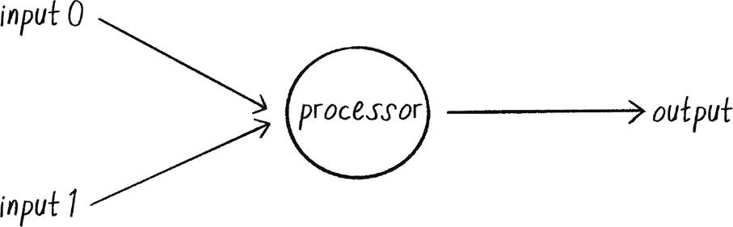

图 10.3：一个简单的感知机，具有两个输入和一个输出

感知机遵循**前馈**模型：数据在网络中单向流动。输入被送入神经元，经过处理后产生输出。这意味着在图 10.3 中描绘的单神经元网络是从左到右（前向）读取的：输入进来，输出出去。

假设我有一个感知机，两个输入值分别是 12 和 4。在机器学习中，通常用 *x* 来表示每个输入，所以我将这些输入命名为 *x*[0] 和 *x*[1]：

| **输入** | **值** |
| --- | --- |
| *x*[0] | 12 |
| *x*[1] | 4 |

#### **感知机步骤**

为了从这些输入得到一个输出，感知机遵循一系列步骤。

##### **步骤 1：加权输入**

每个输入进入神经元之前，必须先加权，也就是说它会与一个值相乘，通常这个值在–1 到+1 之间。在创建感知机时，输入通常会被赋予随机权重。我将我的权重命名为 *w*[0] 和 *w*[1]：

| **权重** | **值** |
| --- | --- |
| *w*[0] | 0.5 |
| *w*[1] | –1 |

每个输入需要与其对应的权重相乘：

| **输入** | **权重** | **输入 × 权重** |
| --- | --- | --- |
| 12 | 0.5 | 6 |
| 4 | –1 | –4 |

##### **步骤 2：求和输入**

然后将加权输入相加：

6 + −4 = 2

##### **步骤 3：生成输出**

感知机的输出是通过将总和传递通过一个**激活函数**生成的，这个激活函数将输出缩减为两个可能值中的一个。可以将这个二进制输出想象成一个 LED 灯，它只有*关闭*或*开启*两种状态，或者像大脑中的神经元，要么发射信号，要么不发射信号。激活函数决定了感知机是否应该“发射”信号。

激活函数可能有些复杂。如果你开始阅读人工智能教材，你可能很快就会想拿起微积分教材。然而，你的新朋友——简单的感知机提供了一个更容易理解的选项，同时仍能演示这个概念。我将激活函数定义为总和的符号。如果总和是正数，输出为 1；如果是负数，输出为–1：

sign(2) = +1

#### **将所有部分结合起来**

将前面提到的三部分结合起来，以下是**感知机算法**的步骤：

1.  对于每个输入，将该输入与它的权重相乘。

1.  对所有加权输入求和。

1.  通过将该和值传递给激活函数（和值的符号），计算感知器的输出。

我可以通过使用两个值数组来开始编写这个算法，一个用于输入，一个用于权重：

```
let inputs = [12, 4];
let weights = [0.5, -1];
```

步骤 1 中的“对于每个输入”意味着一个循环，将每个输入与其对应的权重相乘。为了获得和，可以在同一个循环中将结果相加：


有了和，我就可以计算输出：

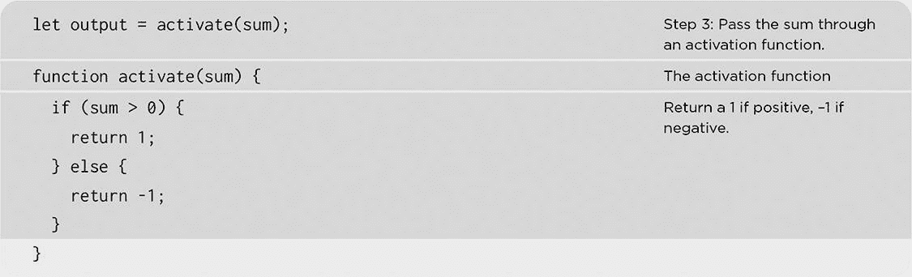

你可能会想，我是如何处理激活函数中的 0 值的。0 是正数还是负数？撇开这个问题的深刻哲学意义，我在这里选择任意将 0 返回为-1，但我也可以很容易地将`>`改为`>=`来改变方向。根据应用的不同，这个决定可能会很重要，但在这里为了演示的目的，我可以随便选一个。

现在我已经解释了感知器的计算过程，接下来让我们看一个实际应用的例子。

#### **使用感知器进行简单模式识别**

我提到过神经网络通常用于模式识别。前面描述的场景需要更复杂的网络，但即使是一个简单的感知器，也能演示一种基本的模式识别方法，其中数据点被分类为属于两个组中的一个。例如，假设你有一个植物数据集，并且想要将它们识别为*耐旱植物*（能够在水少、阳光多的环境中生存的植物，如沙漠）或*水生植物*（适应于生活在水中并且光线较弱的植物）。这就是我将在本节中使用感知器的方式。

对植物进行分类的一种方法是将它们的数据绘制在二维图表上，并将问题视为空间问题。在 x 轴上绘制植物每天接收到的阳光量，在 y 轴上绘制水分量。一旦所有数据都被绘制出来，就很容易在图表上画一条线，将所有耐旱植物放在一边，所有水生植物放在另一边，如图 10.4 所示。（这里我稍作简化，现实世界的数据可能更为复杂，画线会更难。）这样，每个植物就能被分类了。它在直线下方吗？那么它就是耐旱植物。它在直线上方吗？那么它就是水生植物。

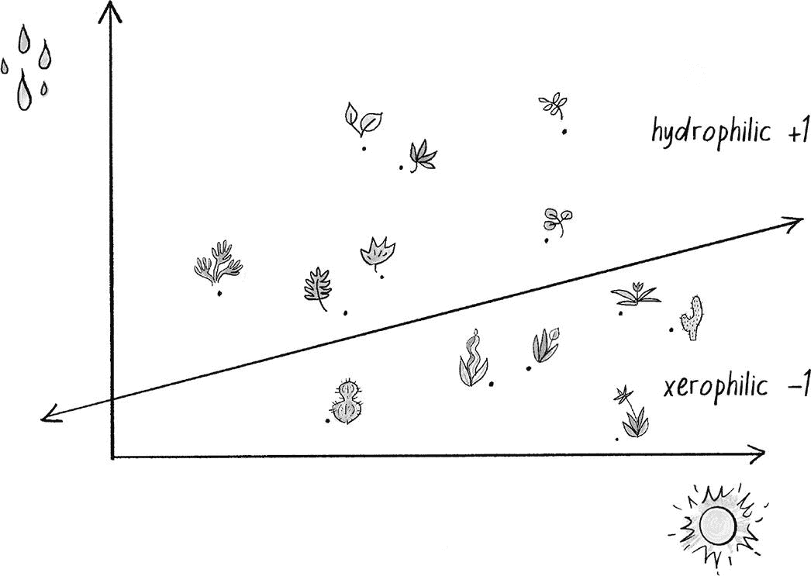

图 10.4：二维空间中的点集合，通过一条线将植物分类，表示根据它们的水分和阳光摄取量

事实上，我并不需要一个神经网络——甚至不需要一个简单的感知机——来告诉我一个点是在直线的上方还是下方。我可以用自己的眼睛看到答案，或者让计算机通过简单的代数来算出。但就像在第九章中通过已知答案“生存还是毁灭”来测试遗传算法一样，训练感知机来分类点是否位于直线的两侧，将是展示感知机算法并验证其正常工作的有价值的方式。

为了解决这个问题，我将给感知机两个输入：*x*[0]是一个点的 x 坐标，代表植物的阳光量，*x*[1]是该点的 y 坐标，代表植物的水量。感知机根据这些输入的加权和的符号来推测植物的分类。如果加权和为正，感知机输出+1，表示水生植物（在直线之上）。如果加权和为负，它输出-1，表示旱生植物（在直线之下）。图 10.5 展示了这个感知机（注意 *w*[0] 和 *w*[1] 是权重的简写）。


图 10.5：一个有两个输入（*x*[0] 和 *x*[1]）的感知机，每个输入都有一个权重（*w*[0] 和 *w*[1]），以及一个生成输出的处理神经元

然而，这个方案有一个相当显著的问题。假设我的数据点是(0, 0)，我将这个点作为输入 *x*[0] = 0 和 *x*[1] = 0 送入感知机。无论权重如何，0 乘以任何数都是 0。因此，加权输入仍然是 0，它们的和也将是 0。而 0 的符号是……嗯，又回到了那个深刻的哲学困境。无论我对它的感觉如何，点(0, 0)在二维世界中肯定可以位于不同的直线之上或之下。感知机应该如何准确地解释它呢？

为了避免这种困境，感知机需要一个第三个输入，通常称为**偏置**输入。这个额外的输入始终为 1，并且也有权重。图 10.6 展示了加入偏置后的感知机。

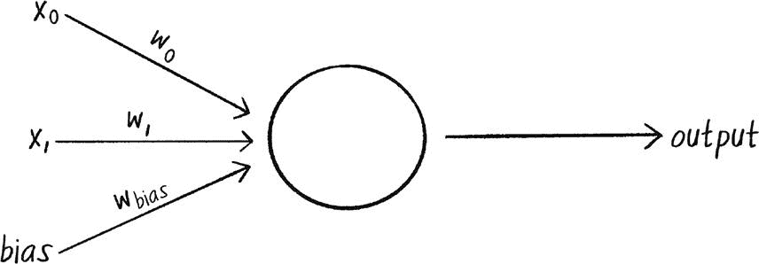

图 10.6：向感知机添加一个偏置输入及其权重

这如何影响点(0, 0)？

| **输入** | **权重** | **结果** |
| --- | --- | --- |
| 0 | *w[0]* | 0 |
| 0 | *w*[1] | 0 |
| 1 | *w*[bias] | *w*[bias] |

输出是加权结果的总和：0 + 0 + *w*[bias]。因此，偏置本身就回答了点(0, 0)相对于直线的位置。如果偏置的权重是正的，(0, 0)在直线之上；如果是负的，它就在直线之下。额外的输入及其权重对感知机理解直线相对于(0, 0)的位置产生了*偏置*！

#### **感知机代码**

我现在准备组装`Perceptron`类的代码了。感知器只需要跟踪输入权重，我可以使用数组来存储它们：


构造函数可以接收一个参数，指示输入的数量（在此案例中为三个：*x*[0]，*x*[1]，以及一个偏置），并相应地调整`weights`数组的大小，初始时填充随机值：

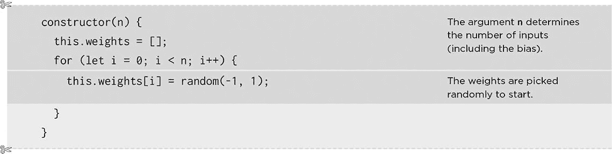

感知器的工作是接收输入并生成输出。这些需求可以打包在一个`feedForward()`方法中。在这个例子中，感知器的输入是一个数组（其长度应与权重数组相同），而输出是一个数字，+1 或 –1，作为激活函数根据和的符号返回的结果：

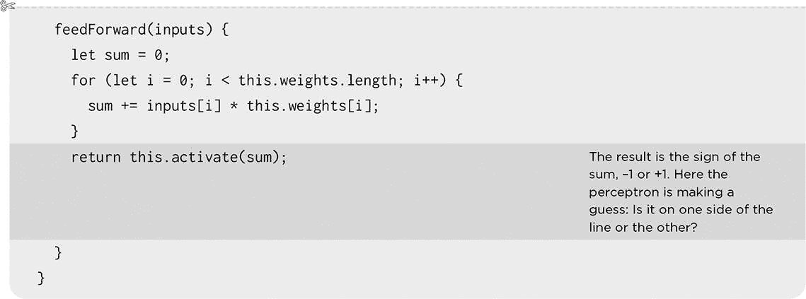

假设我现在可以创建一个`Perceptron`对象，并要求它对任何给定点进行预测，如图 10.7 所示。

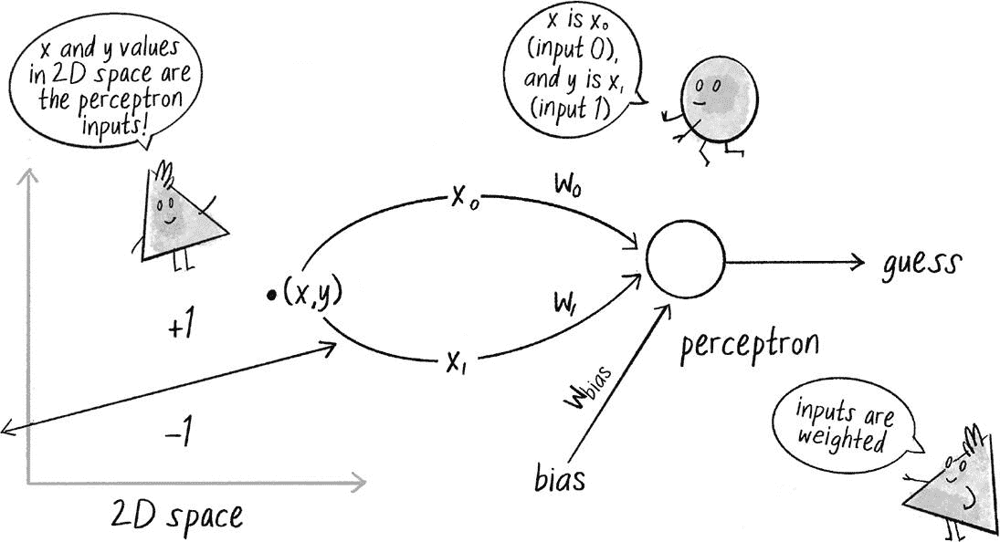

图 10.7：二维空间中的一个 (*x*, *y*) 坐标是感知器的输入。

这是生成预测的代码：

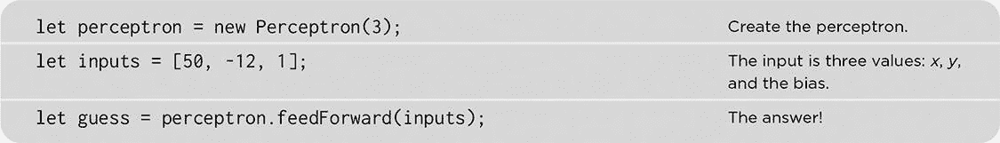

感知器猜对了吗？可能是，也可能不是。此时，感知器猜对的概率也就是 50/50，因为每个权重一开始都是随机值。神经网络并不是一个能自动正确猜测的魔法工具。我需要教它如何做到这一点！

为了训练神经网络正确回答，我将使用本章前面描述的监督学习方法。记住，这种方法涉及给网络提供带有已知答案的输入，使得网络能够检查自己是否做出了正确的预测。如果没有，网络可以从错误中学习并调整权重。这个过程如下：

1.  提供感知器已知答案的输入。

1.  让感知器进行一次预测。

1.  计算误差。（它猜对了吗？）

1.  根据误差调整所有权重。

1.  返回到第 1 步并重复！

这个过程可以打包成`Perceptron`类中的一个方法，但在编写之前，我需要更详细地检查步骤 3 和 4。我该如何定义感知器的误差？以及我应该如何根据这个误差调整权重？

感知器的误差可以定义为期望答案与预测答案之间的差异：

error = 期望输出 − 预测输出

这个公式看起来很熟悉吗？回想一下我在第五章中计算的车辆转向力公式：

steering = 期望速度 − 当前速度

这也是一种误差计算！当前速度作为预测值，而误差（转向力）则指示如何将速度调整到正确的方向。调整车辆的速度以跟随目标类似于调整神经网络的权重以接近正确答案。

对于感知机来说，输出只有两个可能的值：+1 或 –1。因此，只有三种误差是可能的。如果感知机猜测正确，猜测值等于期望输出，误差为 0。如果正确答案是–1，而感知机猜测为+1，则误差为–2。如果正确答案是+1，而感知机猜测为–1，则误差为+2。下面是该过程的总结表格：

| **期望** | **猜测** | **误差** |
| --- | --- | --- |
| –1 | –1 | 0 |
| –1 | +1 | –2 |
| +1 | –1 | +2 |
| +1 | +1 | 0 |

误差是决定感知机权重如何调整的关键因素。对于任何给定的权重，我需要计算的是权重的变化，通常称为Δweight（或*delta weight*，Δ为希腊字母 delta）：

新权重 = 权重 + Δweight

为了计算Δweight，我需要将误差与输入相乘：

Δweight = 误差 × 输入

因此，新的权重计算如下：

新权重 = 权重 + 误差 × 输入

要理解为什么这样有效，再次考虑一下引导。引导力本质上是速度的误差。通过将引导力作为加速度（或Δ速度）施加，速度就能调整到正确的方向。这正是我想要在神经网络的权重中做的。我想根据误差，将它们调整到正确的方向。

然而，在引导中，我还有一个额外的变量控制着车辆的转向能力：最大力。较高的最大力允许车辆快速加速和转弯，而较低的力则导致较慢的速度调整。神经网络将使用类似的策略，通过一个叫做**学习常数**的变量：

新权重 = 权重 + (误差 × 输入) × 学习常数

较高的学习常数会使权重变化更剧烈。这可能帮助感知机更快地找到解决方案，但也增加了超越最优权重的风险。较小的学习常数会使权重调整得更慢，需要更多的训练时间，但能够让网络进行小幅度调整，从而提高整体准确性。

假设向`Perceptron`类添加了一个`learningConstant`属性，我现在可以按照之前列出的步骤，编写一个感知机的训练方法：

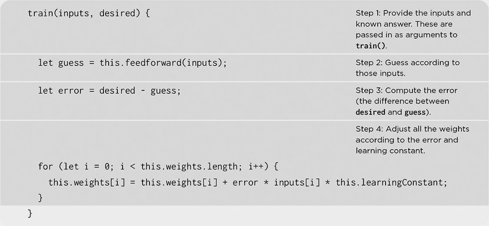

下面是整个`Perceptron`类：

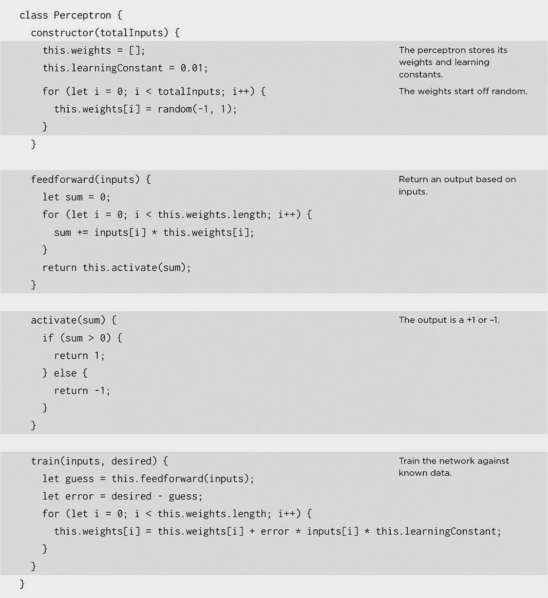

要训练感知机，我需要一组已知答案的输入。然而，我恰好没有现实世界的数据集（也没有时间去研究和收集一个）来用于干旱植物和水生植物的情境。事实上，这个演示的目的并不是告诉你如何分类植物。而是要展示感知机如何学习判断点在图表中是位于线的上方还是下方，因此任何一组点都可以用来做演示。换句话说，我可以随便编造数据。

我所描述的是一个**合成数据**的例子，合成数据是人工生成的数据，通常用于机器学习中，创建用于训练和测试的受控场景。在这种情况下，我的合成数据将由一组随机输入点组成，每个点都有一个已知的答案，指示该点是在线上方还是下方。为了定义这条直线并生成数据，我将使用简单的代数。这种方法使我能够清楚地演示训练过程，并展示感知机是如何学习的。

所以问题变成了，如何选择一个点并知道它是在直线的上方还是下方（也就是说，不使用神经网络）？一条直线可以描述为一组点，其中每个点的 y 坐标是其 x 坐标的一个函数：

*y* = *f*(*x*)

对于一条直线（特别是一个线性函数），它们之间的关系可以写成这样：

*y* = *mx* + *b*

这里 *m* 是直线的斜率，*b* 是当 *x* 为 0 时的 *y* 值（即 y 截距）。以下是一个具体的例子，以及图 10.8 中的对应图形。

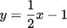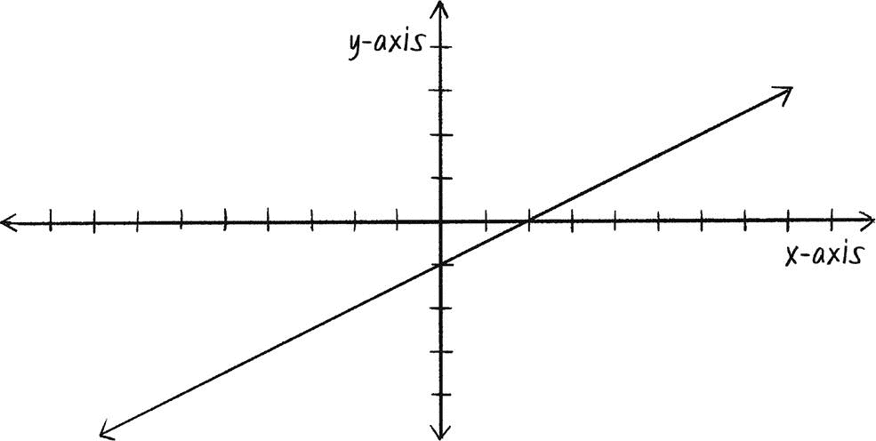

图 10.8：一个图表 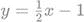

我将任意选择这个作为我的直线方程，并相应地编写一个函数：

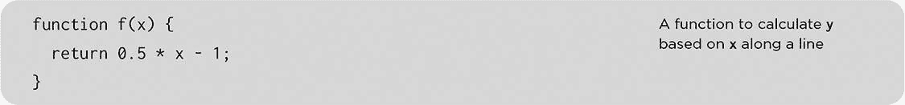

现在，p5.js 画布默认将 (0, 0) 放在左上角，且 y 轴指向下方。为了本次讨论，我假设我已经在代码中做了以下处理，以将画布重新定向以匹配更传统的笛卡尔坐标系。

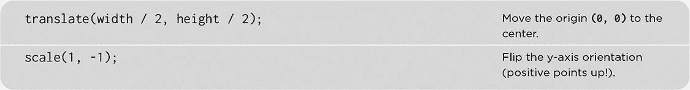

现在我可以在二维空间中选择一个随机点：

```
let x = random(-100, 100);
let y = random(-100, 100);
```

我如何知道这个点是在直线的上方还是下方呢？直线函数 *f*(*x*) 返回该 x 位置上的 *y* 值。我称之为 *y*[line]：


如果我检查的 *y* 值在直线之上，那么它会大于 *y*[line]，如图 10.9 所示。

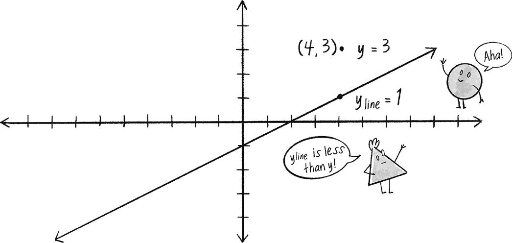

图 10.9：如果 *y*[line] 小于 *y*，则该点在直线之上。

以下是实现该逻辑的代码：

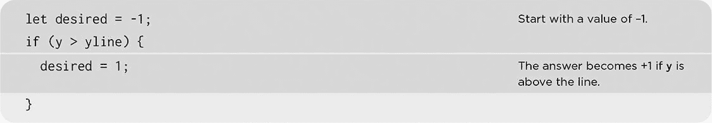

然后，我可以创建一个输入数组，并与 `desired` 输出一起使用：


假设我有一个 `perceptron` 变量，我可以通过提供输入和期望的答案来训练它：

```
perceptron.train(trainingInputs, desired);
```

如果我在每次通过 `draw()` 循环时都在一个新的随机点（及其答案）上训练感知机，它将逐渐提高对这些点是在线上方还是下方的分类能力。

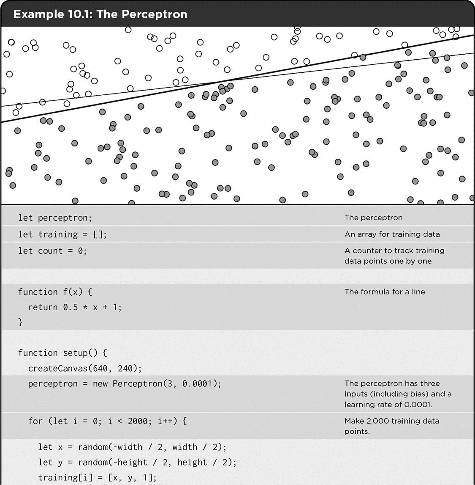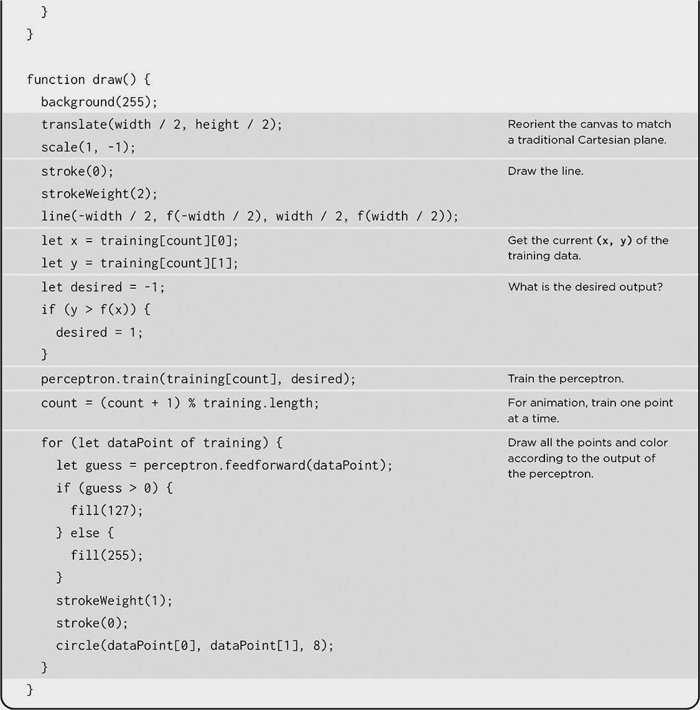

在 示例 10.1 中，训练数据与目标解线一起进行可视化展示。每个点代表一条训练数据，其颜色由感知器当前的分类决定——灰色代表 +1，白色代表 –1。我使用了一个小的学习常数（0.0001），以减缓系统在时间推移过程中对分类结果的调整。

这个示例的一个有趣之处在于感知器的权重与分割点的线特征之间的关系——特别是线的斜率和 y 截距（*m* 和 *b* 在 *y* = *mx* + *b* 中）。在这种情况下，权重并非只是任意的或“神奇”的数值；它们与数据集的几何形状有直接关系。在这里，我只使用了二维数据，但对于许多机器学习应用来说，数据通常存在于更高维的空间中。神经网络的权重有助于在这些空间中导航，定义 *超平面* 或决策边界，进而对数据进行分割和分类。

 **练习 10.1**

修改 示例 10.1 中的代码，在训练过程中绘制感知器当前的决策边界——它对分界线应该在哪的最佳猜测。提示：使用感知器当前的权重来计算这条线的方程。

尽管这个感知器示例提供了一个概念基础，但现实世界的数据集通常具有更多样化和动态的输入值范围。在这里的简化场景中，*x* 的值范围大于 *y*，因为画布的大小是 640×240。尽管如此，示例仍然有效——毕竟，符号激活函数并不依赖于特定的输入范围，而且这是一个简单的二元分类任务。

然而，现实世界中的数据通常具有更复杂的输入范围。为此，**数据标准化**是机器学习中的一个关键步骤。数据标准化涉及将训练数据映射到一个统一的范围——通常是 0 到 1，或可能是 –1 到 1。这一过程可以提高训练效率，并防止个别输入主导学习过程。在接下来的章节中，使用 ml5.js 库，我将把数据标准化纳入其中。

 **练习 10.2**

除了使用监督学习，你能否通过使用遗传算法（GA）训练神经网络来找到合适的权重？

 **练习 10.3**

将数据标准化纳入示例中。这是否能提高学习效率？

### **将“网络”放入神经网络中**

一个感知器可以有多个输入，但它仍然只是一个孤独的神经元。不幸的是，这限制了它能够解决的问题范围。神经网络的真正力量来自于 *网络* 部分。将多个神经元连接在一起，你就能够解决更为复杂的问题。

如果你阅读一本人工智能教材，会发现它说感知机只能解决**线性可分**的问题。如果数据集是线性可分的，你可以通过画一条直线将其在图上分类为两组（见图 10.10，左）。将植物分为耐旱植物或耐水植物就是一个线性可分的问题。

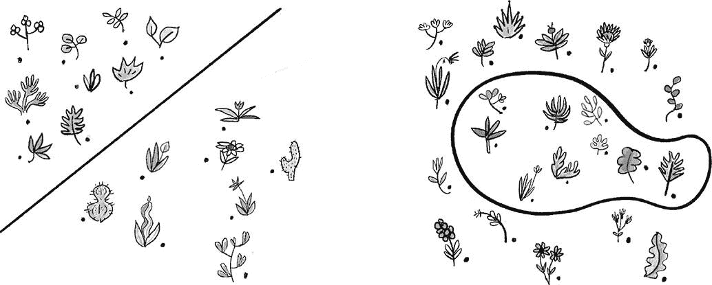

图 10.10：线性可分的数据点（左）和需要曲线来分离的数据点（右）

现在想象一下，你正在根据土壤酸度（x 轴）和温度（y 轴）对植物进行分类。一些植物可能在酸性土壤中茁壮成长，但仅在一个狭窄的温度范围内；而其他植物则更喜欢不太酸性的土壤，但能够适应更广泛的温度范围。两者之间存在更复杂的关系，因此无法通过一条直线将这两类植物——*酸性植物* 和 *碱性植物*（见图 10.10，右）分开。一个单一的感知机无法处理这种**非线性可分**的问题。（这里有个警告：我是在虚构这些情境。如果你恰好是植物学家，请告诉我我是否接近现实。）

非线性可分问题的一个最简单的例子就是 XOR（异或）。这是一种逻辑操作符，类似于更常见的 AND 和 OR。为了使 *A* AND *B* 为真，*A* 和 *B* 必须同时为真。而 OR 操作中，*A* 或 *B*（或两者）可以为真。这两个问题都是线性可分的。图 10.11 中的真值表展示了它们的解空间。表中的每个真值或假值展示了一个特定真值或假值输入组合的输出。看看你是否可以画一条直线将真值输出和假值输出分开？

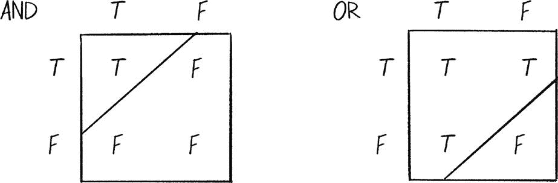

图 10.11：AND 和 OR 逻辑运算符的真值表。真值和假值输出可以用一条线来分隔。

XOR 操作符等同于 (OR) 和 (NOT AND)。换句话说，*A* XOR *B* 仅在其中一个输入为真时结果为真。如果两个输入都为假或都为真，输出为假。举个例子，假设你晚餐吃披萨。你喜欢披萨上放菠萝，也喜欢放蘑菇，但把它们放在一起——呕！而普通的披萨也不好吃！

图 10.12 中的 XOR 真值表不是线性可分的。试着画一条直线来将真值输出和假值输出分开——你做不到！

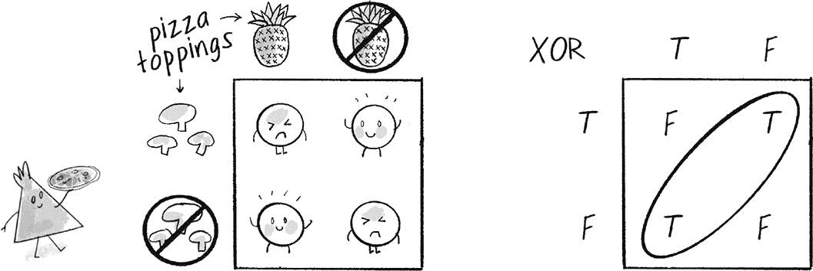

图 10.12：你是否想吃披萨（左）和 XOR（右）的真值表。注意如何真值和假值输出无法通过一条直线分隔。

一个感知器甚至不能解决像 XOR 这样简单的问题，这可能看起来非常有限。但如果我用两个感知器构建一个网络呢？如果一个感知器能够解决线性可分的 OR 问题，另一个感知器能够解决线性可分的 NOT AND 问题，那么两个感知器结合起来可以解决非线性可分的 XOR 问题。

当你将多个感知器结合在一起时，你就得到了**多层感知器**，这是一种由许多神经元组成的网络（参见图 10.13）。其中一些是输入神经元，接收初始输入，一些是**隐藏层**的一部分（因为它们既不直接与网络的输入相连，也不与输出相连），然后是输出神经元，从中读取结果。

直到现在，我一直在可视化一个单一的感知器，使用一个圆圈表示一个神经元处理它的输入信号。现在，当我转向更大的网络时，通常会将所有元素（输入、神经元、输出）表示为圆圈，使用箭头来指示数据流动的方向。在图 10.13 中，你可以看到输入和偏差流入隐藏层，然后再流向输出。

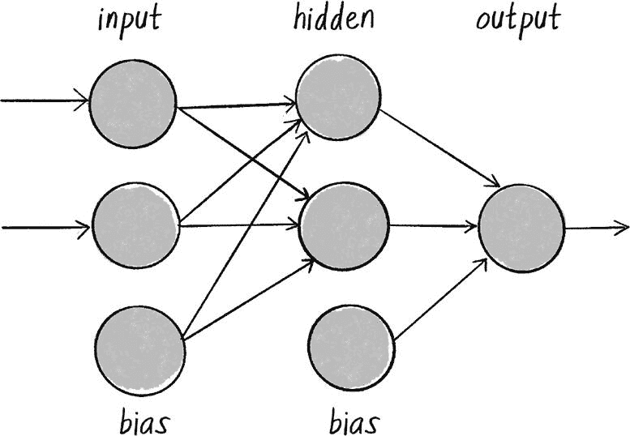

图 10.13：多层感知器与简单感知器具有相同的输入和输出，但现在它包括了一个隐藏层的神经元。

训练一个简单的感知器是相当直接的：你将数据传入并根据误差评估如何调整输入权重。然而，对于多层感知器来说，训练过程变得更加复杂。网络的整体输出仍然是以与之前基本相同的方式生成的：输入乘以权重后求和，并通过网络的各个层向前传播。你仍然使用网络的猜测值来计算误差（期望结果 - 猜测值）。但现在网络层之间有了如此多的连接，每个连接都有自己的权重。你如何知道每个神经元或连接在网络整体误差中的贡献，以及该如何调整它们？

优化多层网络权重的解决方案是**反向传播**。这个过程将误差传递回网络，通过这种方式，它可以根据每个连接对总误差的贡献程度调整所有连接的权重。反向传播的详细过程超出了本书的范围。该算法使用多种激活函数（其中一个经典例子是 sigmoid 函数）以及一些微积分。如果你有兴趣继续探索这个领域，了解更多关于反向传播是如何工作的内容，你可以在 Coding Train 网站找到我的“玩具神经网络”项目，并配有视频教程 (*[`thecodingtrain.com/neural-network`](https://thecodingtrain.com/neural-network)*)。这些教程会详细介绍如何使用多层前馈网络和反向传播解决 XOR 问题。然而，在本章中，我更希望得到一些帮助，打个电话给朋友。

### **使用 ml5.js 进行机器学习**

那个朋友就是 ml5.js。这个机器学习库能够处理复杂过程的细节，比如反向传播，这样你和我就不必担心这些问题。如本章早些时候所提到的，ml5.js 旨在为机器学习和神经网络的新手提供一个友好的入门点，同时仍然借助 Google 的 TensorFlow.js 在后台提供强大的功能。

要在草图中使用 ml5.js，你必须通过 `<script>` 元素将其导入到 *index.html* 文件中，正如你在第六章中做过的那样，导入 Matter.js 和 Toxiclibs.js：

```
<script src="https://unpkg.com/ml5@1/dist/ml5.min.js"></script>
```

本章剩下的目标是通过开发一个能够识别鼠标手势的系统来介绍 ml5.js。这将为你准备好第十一章，在该章节中，我将为一个自主导航代理添加一个神经网络“脑”，并将机器学习重新融入到本书的故事中。然而，首先我想更一般性地讲解使用监督学习训练多层神经网络模型的步骤。概述这些步骤将突出在开发学习模型之前你需要做出的一些重要决策，介绍 ml5.js 库的语法，并为你训练自己的机器学习模型提供必要的背景知识。

#### **机器学习生命周期**

机器学习模型的生命周期通常被分为七个步骤：

1.  **收集数据。** 数据是任何机器学习任务的基础。这个阶段可能包括运行实验、手动输入值、获取公共数据或采用各种其他方法（如生成合成数据）。

1.  **准备数据。** 原始数据通常不适合机器学习算法使用。它可能包含重复值或缺失值，或者包含偏离数据的异常值。这些不一致的地方可能需要手动调整。此外，正如我之前提到的，神经网络在标准化数据上表现最佳，即数据值经过缩放以适应标准范围。准备数据的另一个关键部分是将数据分成不同的集合：训练集、验证集和测试集。训练数据用于训练模型（步骤 4），而验证和测试数据（这两者的区别很微妙——稍后会详细讲解）则被保留并用于评估模型的表现（步骤 5）。

1.  **选择模型。** 设计神经网络的架构。不同的模型更适合某些类型的数据和输出。

1.  **训练模型。** 将数据的训练部分输入模型，并根据模型的错误调整神经网络的权重。这个过程被称为**优化**：模型调整权重，以使错误数量最少。

1.  **评估模型。** 记得在步骤 2 中留出的测试数据吗？因为这些数据没有用于训练，它为评估模型在新数据上的表现提供了依据。

1.  **调整参数。** 训练过程受一组参数（通常称为**超参数**）的影响，比如学习率，它决定了模型应该根据预测误差调整权重的程度。我在感知机示例中称其为`learningConstant`。通过微调这些参数，并重新审视步骤 4（训练）、步骤 3（模型选择）甚至步骤 2（数据准备），你通常可以改善模型的表现。

1.  **部署模型。** 一旦模型经过训练并且其性能得到了满意的评估，就可以将模型用于真实世界中的新数据！

这些步骤是监督式机器学习的基石。然而，尽管 7 是一个非常完美的数字，我觉得我漏掉了一个更关键的步骤。我将其称为步骤 0。

1.  **确定问题。** 这个初步步骤定义了需要解决的问题。目标是什么？你希望通过你的机器学习模型实现什么，或者预测什么？

这一步零定义了整个过程的其他步骤。毕竟，如果你不知道自己到底在做什么，怎么收集数据和选择模型呢？你是在预测一个数字？一个类别？一个序列？是二元选择，还是有很多选项？这些问题通常归结为在大多数机器学习应用中选择两种任务类型之一：分类和回归。

#### **分类与回归**

**分类**是一个机器学习问题类型，涉及预测数据的**标签**（也叫做**类别**或**类**）。如果这听起来很熟悉，那是因为它确实如此：示例 10.1 中的简单感知机被训练用于将点分类为位于直线之上或之下。举个例子，一个图像分类器可能会尝试猜测一张照片是猫还是狗，并为其分配相应的标签（见图 10.14）。

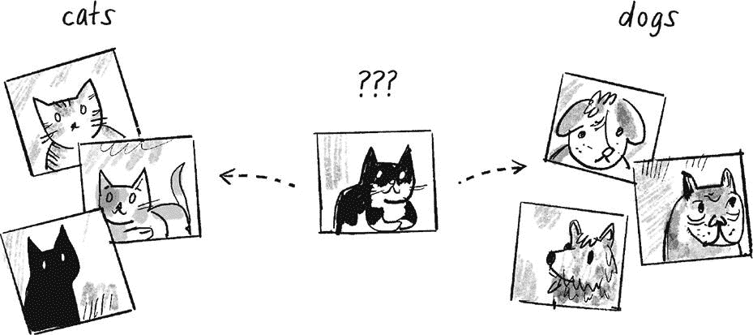

图 10.14：将图像标记为猫或狗

分类并非凭空发生。模型必须首先展示许多带有正确标签的狗和猫的样本，以便正确配置所有连接的权重。这是有监督学习中的训练部分。

经典的“Hello, world!”机器学习和有监督学习示例是一个 MNIST 数据集的分类问题。MNIST 是*修改版国家标准与技术研究院*的缩写，**MNIST**是由 Yann LeCun（纽约大学 Courant 研究所）、Corinna Cortes（谷歌实验室）和 Christopher J.C. Burges（微软研究院）收集和处理的数据集。该数据集在机器学习领域中广泛用于训练和测试，包含了 70,000 个手写数字，从 0 到 9；每个数字是一个 28×28 像素的灰度图像（参见图 10.15 中的示例）。每个图像都标注了对应的数字。

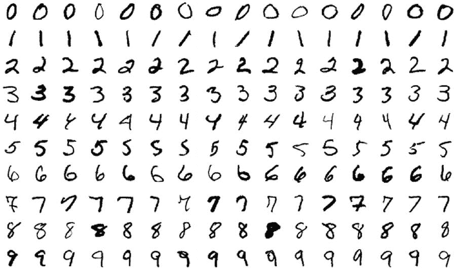

图 10.15：MNIST 数据集中手写数字 0–9 的选取样本（由 Suvanjanprasai 提供）

MNIST 是一个经典的图像分类训练数据集示例：该模型有一个离散的类别可供选择（准确来说是 10 个——不多也不少）。在模型经过 70,000 个标记图像的训练后，目标是让其对新图像进行分类，并分配适当的标签，即 0 到 9 之间的数字。

**回归**，另一方面，是一种机器学习任务，其预测结果是一个连续值，通常是一个浮动的数字。回归问题可以涉及多个输出，但从一个输出开始通常更为简单。例如，考虑一个机器学习模型，它根据房屋的入住人数、房屋大小和外部温度等输入因素来预测房屋的日常电力使用量（见图 10.16）。


图 10.16：天气、房屋大小和居住人数等因素可能会影响房屋的日常电力使用量。

与从离散的输出选项中选择不同，神经网络的目标是猜测一个数字——任何数字。那天这座房子会使用 30.5 千瓦时的电力吗？还是 48.7 千瓦时？或者 100.2 千瓦时？输出预测可能是一个连续范围内的任何值。

#### **网络设计**

知道你要解决的问题（第 0 步）对神经网络的设计有重要影响，特别是对其输入层和输出层的设计。我将用数据科学和机器学习领域的另一个经典“Hello, world!”分类示例来演示：鸢尾花数据集。这个数据集可以在加利福尼亚大学尔湾分校的机器学习库中找到，来源于美国植物学家埃德加·安德森（Edgar Anderson）的研究。

安德森在美国和加拿大的多个地区收集了多年的花卉数据。关于这个著名数据集的起源，详见安东尼·安温（Antony Unwin）和金·克莱因曼（Kim Kleinman）的《鸢尾花数据集：寻找*维吉尼卡*的来源》一文（* [`academic.oup.com/jrssig/article/18/6/26/7038520`](https://academic.oup.com/jrssig/article/18/6/26/7038520) *）。在仔细分析数据后，安德森构建了一个表格，将鸢尾花分为三种不同的物种：*鸢尾花雪絮种*、*鸢尾花变色种*和*鸢尾花维吉尼卡种*（见图 10.17）。

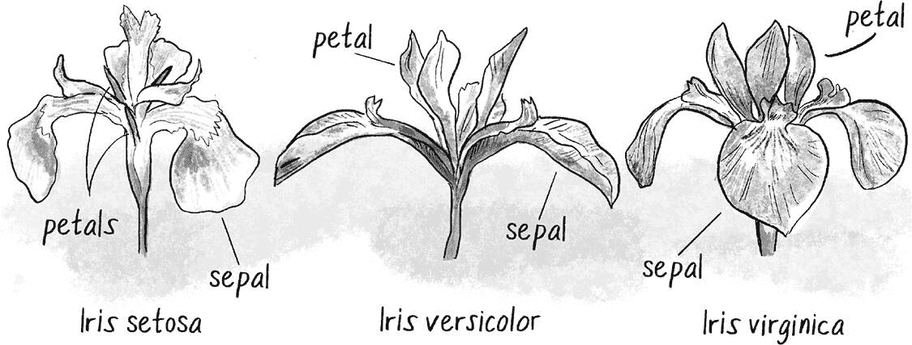

图 10.17：三种不同的鸢尾花物种

安德森为每朵花包括了四个数值属性：花萼长度、花萼宽度、花瓣长度和花瓣宽度，所有数据均以厘米为单位。（他还记录了颜色信息，但该数据似乎已丢失。）每条记录都会与适当的鸢尾花分类配对：

| **花萼长度** | **花萼宽度** | **花瓣长度** | **花瓣宽度** | **分类** |
| --- | --- | --- | --- | --- |
| 5.1 | 3.5 | 1.4 | 0.2 | *鸢尾花雪絮种* |
| 4.9 | 3.0 | 1.4 | 0.2 | *鸢尾花雪絮种* |
| 7.0 | 3.2 | 4.7 | 1.4 | *鸢尾花变色种* |
| 6.4 | 3.2 | 4.5 | 1.5 | *鸢尾花变色种* |
| 6.3 | 3.3 | 6.0 | 2.5 | *鸢尾花维吉尼卡种* |
| 5.8 | 2.7 | 5.1 | 1.9 | *鸢尾花维吉尼卡种* |

在这个数据集中，前四列（花萼长度、花萼宽度、花瓣长度、花瓣宽度）作为神经网络的输入。输出是第五列中提供的分类。图 10.18 展示了一个可以在此数据上训练的神经网络可能的架构。

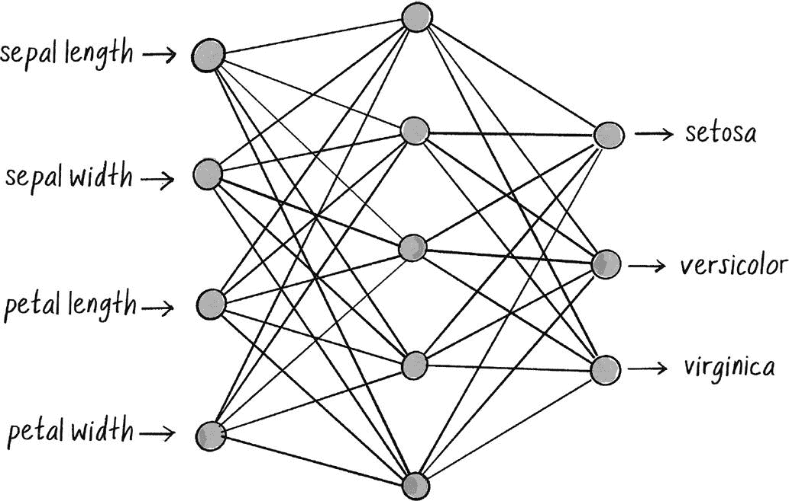

图 10.18：鸢尾花分类的可能网络架构

左侧是网络的四个输入，分别对应数据表的前四列。右侧是三个可能的输出，每个输出代表一种鸢尾花物种标签。中间是隐藏层，如前所述，它为网络架构增加了复杂性，这是处理非线性可分数据所必需的。隐藏层中的每个节点都与前后节点相连接。这通常被称为**全连接**层或**密集**层。

你也许会注意到，在这个图表中没有明确的偏置节点。虽然偏置在每个神经元的输出中起着重要作用，但它们通常在视觉表示中被省略，以保持图表的简洁并专注于主要的数据流。（ml5.js 库最终会在内部为我管理偏置。）

神经网络的目标是“激活”正确的输出，以适应输入数据，就像感知机会对其单一的二分类输出 +1 或 -1 一样。在这种情况下，输出值就像是信号，帮助网络决定要分配哪个鸢尾花物种标签。最高计算值的激活代表了网络对分类的最佳猜测。

这里的关键点是，分类网络应该有与数据集中每个项目的值相等的输入数目，并且输出的数目应该等于类别的数量。至于隐藏层，它的设计并不是固定的。图 10.18 中的隐藏层有五个节点，但这个数字完全是任意的。神经网络架构可以有很大的差异，隐藏节点的数量通常通过反复试验或其他有根据的猜测方法（称为*启发式方法*）来确定。在本书的上下文中，我将依赖于 ml5.js 来根据输入和输出数据自动配置架构。

那么在回归场景中，如我之前提到的家庭电力消耗的例子，输入和输出该如何处理呢？我将为这个场景编造一个数据集，包含居住人数、房屋面积、当天的温度，以及相应的电力使用量。这就像是一个合成数据集，考虑到它并非为真实世界情境收集的数据——但与自动生成的合成数据不同，在这里我正在手动输入我自己想象中的数字：

| **居住人数** | **面积 (m²)** | **外部温度 (°C)** | **电力使用 (kWh)** |
| --- | --- | --- | --- |
| 4 | 150 | 24 | 25.3 |
| 2 | 100 | 25.5 | 16.2 |
| 1 | 70 | 26.5 | 12.1 |
| 4 | 120 | 23 | 22.1 |
| 2 | 90 | 21.5 | 15.2 |
| 5 | 180 | 20 | 24.4 |
| 1 | 60 | 18.5 | 11.7 |

对于这个问题的神经网络，应该有三个输入节点，分别对应前面三列（居住人数、面积、温度）。与此同时，它应该有一个输出节点，表示第四列，即网络对电力使用量的预测。我随便说一下，网络的隐藏层应该有四个节点，而不是五个。图 10.19 展示了这种网络架构。

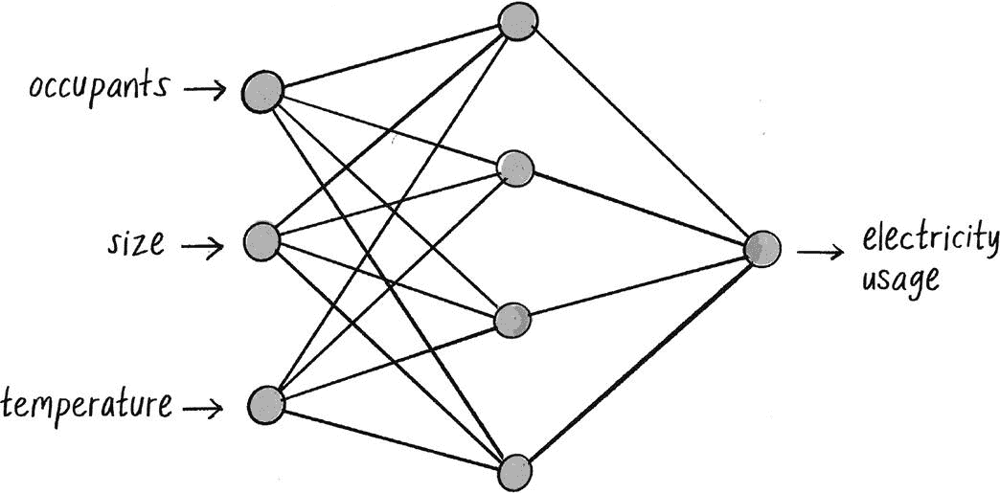

图 10.19：一个可能的网络架构，具有三个输入和一个回归输出

与鸢尾花分类网络不同，后者是从三个标签中选择，因此有三个输出，而这个网络试图预测一个数字，因此只有一个输出。然而，我需要指出的是，单一输出并不是回归的要求。机器学习模型也可以执行预测多个连续值的回归，在这种情况下，模型将有多个输出。

#### **ml5.js 语法**

ml5.js 库是一个集合，包含可以通过语法 `ml5.`functionName`() ` 访问的机器学习模型。例如，要使用一个预训练的模型来检测手部位置，可以使用 `ml5.handPose()`。要分类图像，可以使用 `ml5.imageClassifier()`。虽然我鼓励你探索 ml5.js 提供的所有功能（接下来的练习中我会提到一些这些预训练模型），但本章我将重点介绍 ml5.js 中的一个函数，`ml5.neuralNetwork()`，它为你创建一个空的神经网络供你训练。

要使用这个函数，首先必须创建一个 JavaScript 对象来配置正在创建的模型。此时，我刚才讨论的一些大局因素——这是一个分类任务还是回归任务？有多少个输入和输出？——开始发挥作用。我将首先指定模型要执行的任务（`"regression"` 或 `"classification"`）：

```
let options = { task: "classification" };
let classifier = ml5.neuralNetwork(options);
```

然而，这给 ml5.js 在设计网络架构时提供的信息很少。添加输入和输出将完成其余的工作。鸢尾花分类有四个输入和三个可能的输出标签。可以将其配置为 `options` 对象的一部分，其中包含一个整数表示输入数量，以及一个包含输出标签的字符串数组：

```
let options = {
  inputs: 4,
  outputs: ["iris-setosa", "iris-virginica", "iris-versicolor"],
  task: "classification",
};
let digitClassifier = ml5.neuralNetwork(options);
```

电力回归场景有三个输入值（居住者、大小、温度）和一个输出值（kWh 的使用量）。使用回归时，输出没有字符串标签，因此只需要一个整数来表示输出的数量：

```
let options = {
  inputs: 3,
 outputs: 1,
  task: "regression",
};
let energyPredictor = ml5.neuralNetwork(options);
```

你可以通过 `options` 对象设置模型的许多其他属性。例如，你可以指定输入和输出之间的隐藏层数量（通常有几个），每个层中的神经元数量，要使用的激活函数等等。然而，在大多数情况下，你可以省略这些额外的设置，让 ml5.js 根据任务和手头的数据猜测如何设计模型。

### **构建手势分类器**

我将通过一个非常适合 p5.js 的示例问题，带你走过机器学习生命周期的每个步骤，在此过程中使用 ml5.js 编写每一步的代码。我将从第 0 步开始，阐明问题。假设你正在开发一个响应手势的互动应用程序。也许这些手势最终是通过身体追踪记录的，但你想从一个更简单的开始——鼠标的单次点击（见图 10.20）。

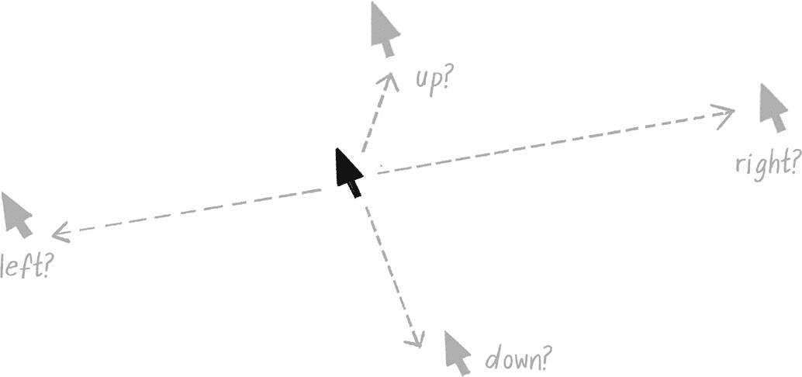

图 10.20：单一鼠标手势作为起点和终点之间的向量

每个手势都可以被记录为一个从起点到终点的鼠标移动向量。向量的 x 和 y 分量将作为模型的输入。模型的任务可能是预测该手势的四个可能标签之一：*上*、*下*、*左* 或 *右*。由于输出是有限的离散集，这听起来像是一个分类问题。这四个标签将是模型的输出。

就像在 第九章中的一些遗传算法示例——以及本章早些时候的简单感知器示例——我在这里选择的问题是一个已知的有解问题，并且可以在没有神经网络的情况下更轻松、高效地解决。通过 `heading()` 函数和一系列 `if` 语句，就可以对向量的方向进行分类！然而，通过使用这个看似微不足道的场景，我希望以一种易于理解且友好的方式来解释训练机器学习模型的过程。此外，这个示例将使得检查代码是否按预期工作变得简单。当我完成时，我将提供一些如何将分类器扩展到无法使用简单 `if` 语句的场景的想法。

#### **收集和准备数据**

确定问题后，我可以进入步骤 1 和 2：收集和准备数据。在现实世界中，这些步骤可能会很繁琐，特别是当你收集到的原始数据很杂乱，需要大量初步处理时。你可以把这看作是需要在做饭之前先整理、清洗和切割所有食材的过程。

为了简化，我更倾向于采取一种订购机器学习“餐包”的方法，所有食材（数据）都已分好份并准备好。这样，我就可以直接开始“烹饪”过程，即训练模型。毕竟，这其实只是对 第十一章的开胃菜，届时我将应用神经网络来引导代理。

有鉴于此，我将手动编写一些示例数据，并将其规范化到 –1 到 +1 之间。我会将数据组织成一个对象数组，配对向量的 x 和 y 分量与字符串标签。我选择的值明确指向一个特定的方向，并分配相应的标签——每个标签有两个示例：

```
let data = [
  { x: 0.99, y: 0.02, label: "right" },
  { x: 0.76, y: -0.1, label: "right" },
  { x: -1.0, y: 0.12, label: "left" },
  { x: -0.9, y: -0.1, label: "left" },
  { x: 0.02, y: 0.98, label: "down" },
  { x: -0.2, y: 0.75, label: "down" },
  { x: 0.01, y: -0.9, label: "up" },
  { x: -0.1, y: -0.8, label: "up" },
];
```

图 10.21 显示了以箭头形式表示的相同数据。

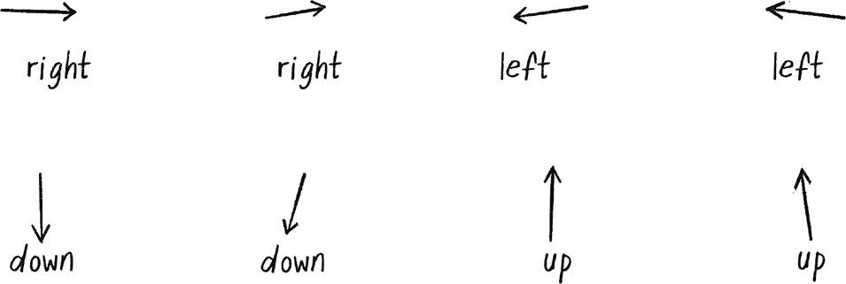

图 10.21：将输入数据可视化为向量（箭头）

在一个更现实的场景中，我可能会有一个更大的数据集，这些数据将从一个单独的文件加载，而不是直接写入代码中。例如，JavaScript 对象表示法（JSON）和逗号分隔值（CSV）是两种常见的数据存储和加载格式。JSON 以键值对的形式存储数据，遵循与 JavaScript 对象字面量完全相同的格式。CSV 是一种存储表格数据（如电子表格）的文件格式。根据你的需求和所使用的编程环境，你还可以使用许多其他数据格式。

在现实世界中，那个更大的数据集中的值实际上会来自某个地方。也许我会通过要求用户执行特定手势并记录他们的输入来收集数据，或者通过编写算法自动生成大量合成数据，这些数据代表我希望模型识别的理想化手势版本。无论哪种方式，关键是收集一个多样化的示例集，充分代表手势执行方式的不同变化。不过，现在让我们看看仅凭少量数据会怎样。

 **练习 10.4**

创建一个 p5.js 草图，收集用户的手势数据并将其保存到 JSON 文件中。你可以使用 `mousePressed()` 和 `mouseReleased()` 来标记每个手势的开始和结束，使用 `saveJSON()` 将数据下载到文件中。

#### **选择模型**

现在，我已经进入了机器学习生命周期的第 3 步，选择一个模型。在这一阶段，我将开始让 ml5.js 为我做繁重的工作。为了用 ml5.js 创建模型，我所需要做的就是指定任务、输入和输出：

```
let options = {
  task: "classification",
  inputs: 2,
  outputs: ["up", "down", "left", "right"],
  debug: true
};
let classifier = ml5.neuralNetwork(options);
```

就是这样！我完成了！多亏了 ml5.js，我可以绕过一堆复杂的工作，比如每层的神经元数、激活函数的种类，以及如何设置训练网络的算法。这个库会为我做出这些决定。

当然，默认的 ml5.js 模型架构可能并不适用于所有情况。我鼓励你阅读 ml5.js 的文档，了解如何自定义模型的更多细节。我还要指出的是，ml5.js 能够从数据中推断输入和输出，因此这些属性并不完全需要包含在 `options` 对象中。不过，为了清晰起见（并且因为后续示例中我需要指定它们），我在这里包含了这些属性。

当 `debug` 属性设置为 `true` 时，它会启动训练过程的可视化界面。这是一个有助于在训练过程中发现潜在问题，并更好地理解后台发生的事情的工具。你将在本章后面看到这个界面的样子。

#### **训练模型**

现在，我已经将数据存储在 `data` 变量中，并且在 `classifier` 变量中初始化了神经网络，我已经准备好训练模型。这个过程从将数据添加到模型开始。为了实现这一点，事实证明我还没有完全准备好数据。

目前，我的数据整齐地组织在一个对象数组中，每个对象包含一个向量的 x 和 y 组件以及一个相应的字符串标签。这是训练数据的典型格式，但 ml5.js 并不能直接使用它。（当然，我本可以一开始就将数据组织成 ml5.js 能识别的格式，但我之所以包括这个额外的步骤，是因为当你使用从其他地方收集或获取的数据集时，这个步骤可能是必需的。）为了将数据添加到模型中，我需要将输入数据与输出数据分开，以便模型理解哪些是输入，哪些是输出。

ml5.js 库在接受的格式方面提供了相当大的灵活性，但我选择使用数组——一个用于 `inputs`，一个用于 `outputs`。我可以使用循环来重新组织每个数据项并将其添加到模型中：

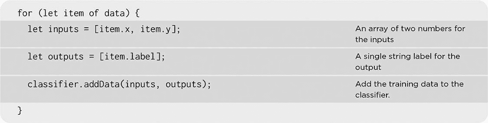

我在这里所做的是设置数据的**形状**。在机器学习中，这个术语描述了数据的维度和结构。它表示数据如何在行、列及可能更深的额外维度中组织。理解数据的形状至关重要，因为它决定了模型的结构方式。

在这里，输入数据的形状是一个包含两个数字的 1D 数组（代表 *x* 和 *y*）。输出数据同样是一个包含单个字符串标签的 1D 数组。所有进出网络的数据都会遵循这个模式。虽然这是一个小而简单的示例，但它很好地反映了许多现实世界场景，其中输入数据以数组的形式表示数字，输出则是字符串标签。

在将数据传递给 `classifier` 之后，ml5.js 提供了一个辅助函数来归一化数据。正如我之前提到的，归一化数据（调整数据的尺度至标准范围）是机器学习过程中至关重要的一步：


在这种情况下，手动编码的数据从一开始就被限制在 -1 到 +1 的范围内，因此在这里调用 `normalizeData()` 可能是多余的。然而，调用这个函数非常重要，因为它有助于演示。提前对数据进行归一化作为预处理步骤肯定是有效的，但 ml5.js 的自动归一化功能也非常有帮助！

现在是机器学习过程的核心：实际训练模型。这里是代码：

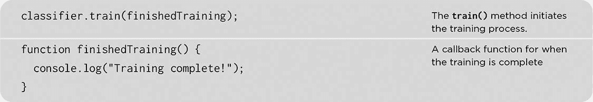

是的，就这样！毕竟，繁重的工作已经完成。数据已经收集、准备好，并输入到模型中。剩下的就是调用 `train()` 方法，坐下来，让 ml5.js 自动执行剩余的工作。

事实上，这并不是*那么*简单。如果我按原样运行代码然后测试模型，结果可能会不尽如人意。这时，机器学习中的另一个关键术语就派上用场了：**epochs（训练轮次）**。`train()`方法告诉神经网络开始学习过程。但是，它应该训练多久呢？你可以把一个 epoch 想象成一次练习，使用整个训练数据集来更新神经网络的权重。一般来说，经过的 epoch 越多，网络的表现会越好，但到了一定阶段，你会遇到收益递减的情况。epoch 的数量可以通过将`options`对象传递给`train()`来设置。

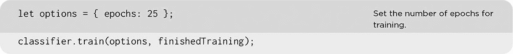

训练的 epoch 数量是超参数的一个例子，超参数是训练过程的全局设置。你可以通过`options`对象设置其他超参数（例如学习率），但我将使用默认设置。你可以在 ml5.js 文档中阅读更多关于自定义选项的信息。

`train()`的第二个参数是可选的，但最好包括一个。它指定了一个回调函数，该函数在训练过程完成时运行——在这种情况下是`finshedTraining()`。（有关回调函数的更多信息，请参见“回调函数”框。）这对于知道何时可以继续执行代码中的下一步非常有用。另一个可选的回调函数，我通常将其命名为`whileTraining()`，会在每个 epoch 之后触发。然而，就我的目的而言，知道训练何时完成就足够了！

 **回调函数**

JavaScript 中的**回调函数**是一种你并不会直接调用的函数。相反，你将它作为参数传递给另一个函数，目的是让它在稍后的某个时刻*自动调用*（通常与某个事件相关，比如鼠标点击）。你以前在第六章使用 Matter.js 时见过这种情况，你指定了一个函数，当检测到碰撞时会被调用。

回调函数在**异步**操作中是必需的，当你希望代码在等待另一个任务（比如训练机器学习模型）完成时，继续进行动画或其他操作。p5.js 中的经典例子是使用`loadJSON()`加载数据到草图中。

JavaScript 还提供了一种更现代的方法来处理异步操作，这就是**promise（承诺）**。通过 promise，你可以使用`async`和`await`等关键字，使你的异步代码看起来更像传统的同步代码。虽然 ml5.js 也支持这种风格，但为了与 p5.js 的风格保持一致，我还是会坚持使用回调函数。

#### **评估模型**

如果在初始调用`ml5.neuralNetwork()`时将`debug`设置为`true`，则在调用`train()`之后应该会出现一个视觉界面，覆盖大部分 p5.js 页面和画布（参见图 10.22）。这个界面被称为*Visor*，代表了评估步骤。

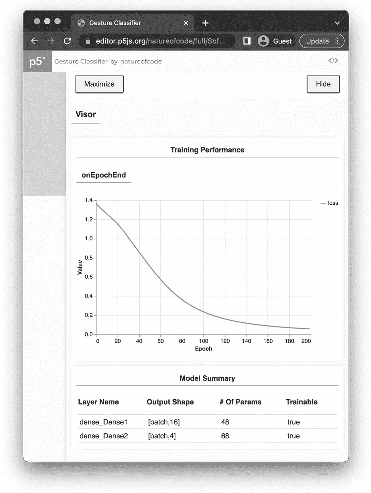

图 10.22：Visor，展示了损失函数图和模型细节

Visor 来自 TensorFlow.js（它是 ml5.js 的基础），包括一个图表，实时反馈训练进度。这个图表将模型的损失值绘制在 y 轴上，将训练周期数绘制在 x 轴上。**损失**是衡量模型预测与训练数据提供的正确输出之间差距的指标。它量化了模型的总误差。当训练开始时，损失通常较高，因为模型尚未学到任何东西。理想情况下，随着模型训练的进行，它的预测应该会变得更好，损失应该会减少。如果图表随着训练周期的增加而下降，那是一个好兆头！

对于图 10.21 中描述的 200 次训练周期，你可能会觉得有些过多。在一个现实世界的场景中，数据量更大的话，我可能会使用更少的周期，比如我在原始代码片段中指定的 25 次。然而，由于这里的数据集非常小，较多的周期有助于模型更充分地与数据进行训练。记住，这是一个示例，目的是让概念变得清晰，而不是为了生产一个复杂的机器学习模型。

在图表下方，Visor 显示了一个模型摘要表，包含了幕后创建的低级 TensorFlow.js 模型架构的详细信息。摘要包括每层的名称、每层的神经元数量（在输出形状列中）以及参数计数，参数计数是每个神经元连接之间的权重总数。在这种情况下，dense_Dense1 是具有 16 个神经元的隐藏层（这是 ml5.js 选择的数字），而 dense_Dense2 是具有 4 个神经元的输出层，每个神经元对应一个分类类别。（TensorFlow.js 并不把输入视为一个独立的层；它们只是数据流的起点。）输出形状列中的 *batch* 并不指代特定的数字，而是表示模型可以处理任意数量的训练数据（一个批次），用于单次模型训练周期。

在进入评估阶段之前，我有一个细节需要补充。当我首次概述机器学习生命周期的步骤时，我提到准备数据通常涉及将数据集分成三部分，以帮助评估过程：

+   **训练集：** 用于训练模型的主要数据集

+   **验证集：** 在训练过程中用于检查模型的数据子集，通常在每个训练周期结束时进行

+   **测试集：** 在训练过程中从未使用过的额外数据，用于在训练完成后确定模型的最终表现

你可能已经注意到，我并没有这样做。为了简化，我直接使用了整个数据集进行训练。毕竟，我的数据集只有八条记录；把它分成三组太小了！如果数据集更大，三分法则会更为合适。

然而，使用如此小的数据集会有导致模型**过拟合**数据的风险：模型会过度调整到训练数据的特定特性，以至于在处理新的、未见过的数据时效果大大下降。使用验证集的主要原因是监控模型在训练过程中的表现。随着训练的进行，如果模型在训练数据上的准确率提高，但在验证数据上的准确率下降，这通常是过拟合发生的强烈信号。（测试集严格保留用于最终评估，是训练完成后评估模型性能的最后一次机会。）

对于更现实的场景，ml5.js 提供了一种方法来拆分数据，并且自动化处理验证数据的功能。如果你有兴趣深入了解，可以在 ml5.js 网站上探索完整的神经网络示例 (*[`ml5js.org`](https://ml5js.org)*)。

#### **调优参数**

在评估步骤之后，通常会有一个迭代过程，即调整超参数并重新进行训练，以便从模型中获得最佳性能。虽然 ml5.js 提供了参数调优的功能（你可以在库的参考文档中了解更多），但它并不专门用于对模型进行低级、精细的调整。如果你希望更详细地探索这一步骤，直接使用 TensorFlow.js 可能是最好的选择，因为它提供了更广泛的工具集，并允许对训练过程进行更低级的控制。

在这种情况下，调整参数并非绝对必要。Visor 中的图表显示损失值已经降到 0.1，这对于我的目的来说已经足够准确了。我准备继续进行下一步。

#### **部署模型**

现在终于到了部署模型的时刻，看看所有辛勤工作的成果。这通常涉及将模型集成到一个独立的应用程序中，根据新的、以前未见过的数据做出预测或决策。为此，ml5.js 提供了一个方便的 `save()` 函数，可以将训练好的模型从一个草图下载到文件中，还提供了 `load()` 函数，可以将其加载到另一个完全不同的草图中使用。这样你就不必每次都从头开始重新训练模型。

尽管模型通常会部署到与训练时不同的草图中，但为了简化，我将把模型部署在同一个草图中。事实上，一旦训练过程完成，得到的模型本质上已经在当前草图中部署。它被保存在`classifier`变量中，并可以通过`classify()`方法向模型传入新数据来进行预测。传递给`classify()`的数据的形状应该与训练时使用的输入数据形状相匹配——在这个例子中，是两个浮点数，分别表示方向向量的 x 分量和 y 分量：

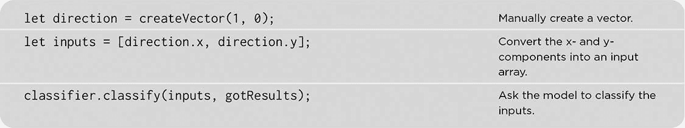

`classify()`的第二个参数是另一个回调函数，用于访问结果：

```
function gotResults(results) {
  console.log(results);
}
```

模型的预测结果会作为回调函数的参数返回，我在代码中称之为`results`。在其中，你会找到一个按**信心**排序的标签数组，信心值是模型为每个标签分配的概率值。这些概率值表示模型对特定预测的确定性。它们的范围从 0 到 1，值越接近 1 表示信心越高，而接近 0 则表示信心较低：

```
[
  {
    "label": "right",
    "confidence": 0.9669702649116516
  },
  {
    "label": "up",
    "confidence": 0.01878807507455349
  },
  {
    "label": "down",
    "confidence": 0.013948931358754635
  },
  {
    "label": "left",
    "confidence": 0.00029277068097144365
  }
]
```

在这个例子的输出中，模型对正确标签为“`right`”的信心非常高（约为 96.7%），而对“`left`”标签的信心极低（0.03%）。信心值经过归一化，所有值加起来总和为 100%。

接下来需要做的就是用代码填充草图，使模型能够接收来自鼠标的实时输入。第一步是向用户发出训练过程完成的信号，以便他们知道模型已经准备好了。我将包含一个全局`status`变量来跟踪训练过程，并最终在画布上显示预测标签。该变量初始化为`"training"`，但通过`finishedTraining()`回调函数更新为`"ready"`。

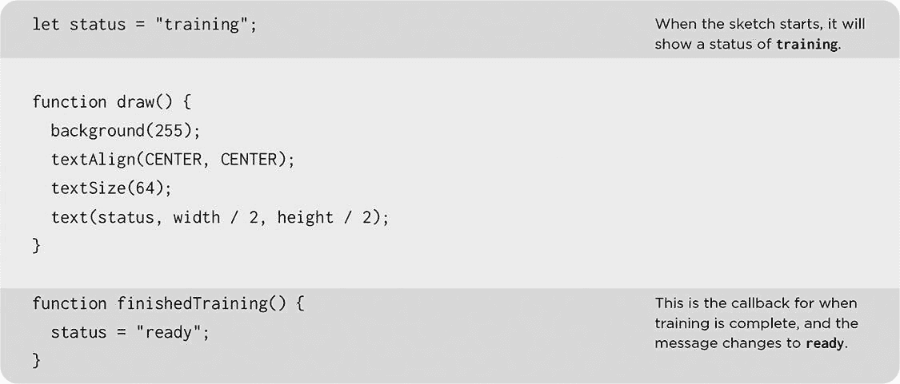

最后，我将使用 p5.js 的鼠标功能，在拖动鼠标时构建一个向量，并在点击鼠标时调用`classifier.classify()`对该向量进行分类。

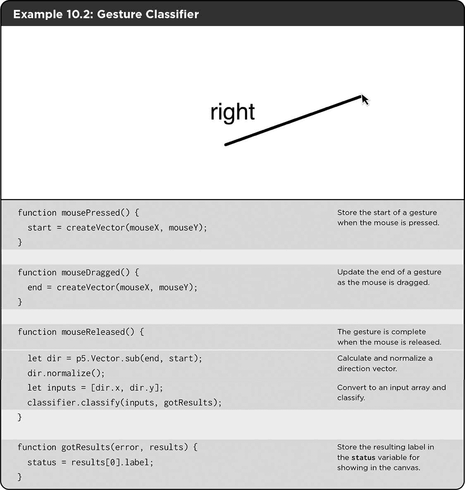

由于`results`数组是按信心排序的，如果我只想使用单一标签作为预测结果，我可以通过`results[0].label`访问数组的第一个元素，就像在示例 10.2 中的`gotResults()`函数一样。这个标签会传递给`status`变量，最终显示在画布上。

 **练习 10.5**

将示例 10.2 分为三个草图：一个用于收集数据，一个用于训练，另一个用于部署。使用`ml5.neuralNetwork`函数`save()`和`load()`分别保存和加载模型到文件中。

 **练习 10.6**

扩展手势识别模型以分类一系列向量，更准确地捕捉较长鼠标移动的路径。请记住，输入数据必须具有一致的形状，因此你需要决定使用多少个向量来表示一个手势，并为每个数据点存储相同数量的向量，既不多也不少。虽然这种方法可行，但其他机器学习模型（如递归神经网络）专门设计用于处理序列数据，可能提供更多的灵活性和潜在的准确性。

 **练习 10.7**

ml5.js 中的一个预训练模型叫做*Handpose*。该模型的输入是一张图片，预测结果是一个包含 21 个关键点——x 和 y 位置，也称为*地标*——的列表，描述了手部。

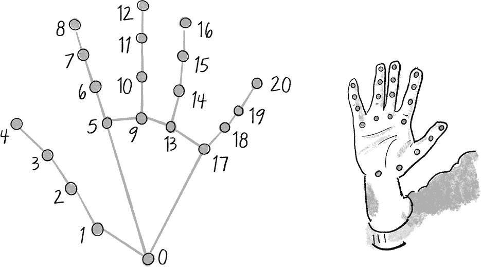

你能将`ml5.handpose()`模型的输出作为`ml5.neuralNetwork()`的输入，并分类各种手势（如竖大拇指或竖小拇指）吗？如果需要提示，你可以观看我在 Coding Train 网站上的视频教程，教程会引导你完成机器学习路径中的身体姿势分类过程 (*[`thecodingtrain.com/pose-classifier`](https://thecodingtrain.com/pose-classifier)*）。

 **生态系统项目**

将机器学习融入你的生态系统，以增强生物的行为。如何应用分类或回归方法？

+   你能将生态系统中的生物分类为多个类别吗？如果你使用初始种群作为训练数据集，并且随着新生物的诞生，系统根据它们的特征进行分类呢？你的系统的输入和输出是什么？

+   你能使用回归预测生物的寿命吗？考虑一下大小和速度如何影响第九章中的“bloop”生物的寿命。你能分析回归模型的预测结果与实际结果的对比吗？

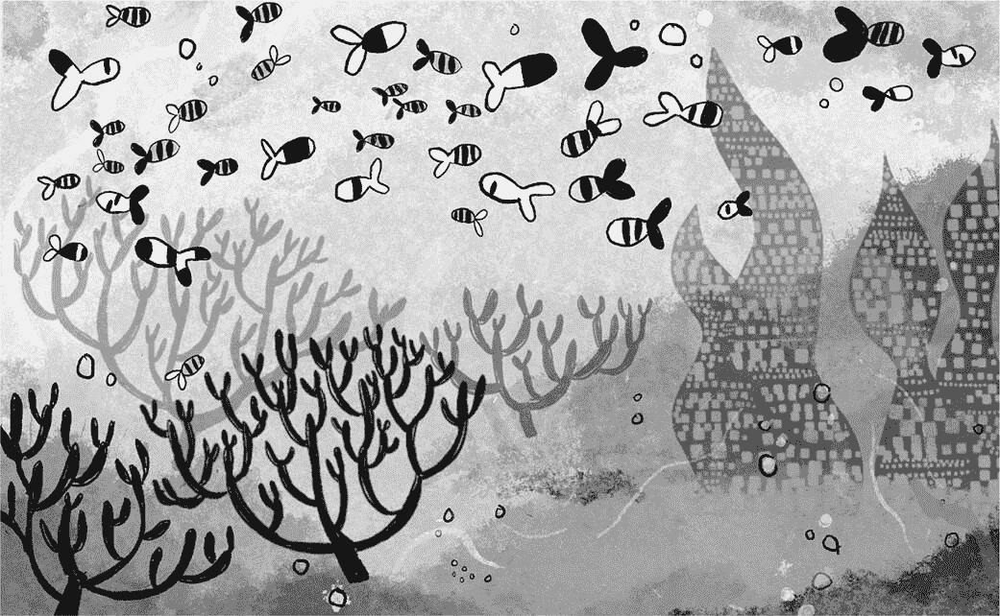
