## **11 神经进化**

*读关于大自然的书固然好，但如果一个人走进森林，仔细倾听，他们能学到比书本上更多的东西。*

—乔治·华盛顿·卡佛

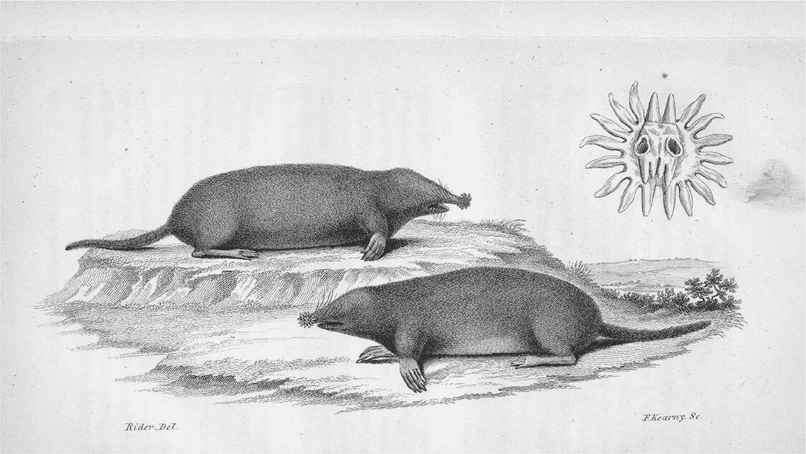

**星鼻鼹鼠（图片由纽约公共图书馆提供，约 1826–1828 年）**

星鼻鼹鼠（*Condylura cristata*）主要分布在美国东北部和加拿大东部，具有独特且高度专业化的鼻部器官。经过多代进化，它的鼻子由 22 个触角组成，拥有超过 25,000 个微小的感官受体。尽管鼹鼠功能性失明，这些触角使它们能够创建其周围环境的详细空间地图。它们可以在漆黑的地下栖息地中以惊人的精确度和速度导航，迅速识别并消耗可食用的物品，仅需毫秒级的时间。

恭喜！你已经完成了本书的最后一章。花点时间庆祝你所学到的一切。

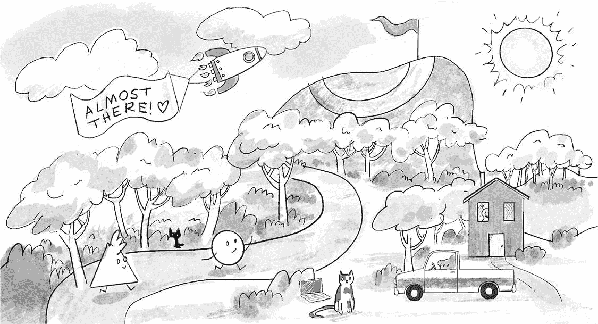

在本书中，你已经探讨了使用 p5.js 进行互动物理仿真的基本原理，深入了解了智能体和其他基于规则的行为的复杂性，并初步接触了激动人心的机器学习领域。你已经变得非常自然！

然而，第十章仅仅触及了数据和基于神经网络的机器学习的表面——这是一个广阔的领域，若要全面覆盖，将需要无数本续集来完成。我的目标从来不是深入探讨神经网络，而是简单地建立核心概念，为一个盛大的结局做准备，在这个结局中，我将找到将机器学习融入动画、互动 p5.js 草图的世界的方法，并为我们的*《代码的本质》*新朋友们带来最后的欢庆。

接下来的道路将穿过**神经进化**领域，这是一种将第九章中的遗传算法与第十章中的神经网络相结合的机器学习方法。神经进化系统利用达尔文进化原理，通过几代的试错学习来进化神经网络的权重（在某些情况下，甚至是网络结构本身）。在本章中，我将通过一个熟悉的游戏世界示例来演示如何使用神经进化。接着，我将通过神经进化来修改克雷格·雷诺兹在第五章中的转向行为。

### **强化学习**

神经进化与我在第十章中简要提到的另一种机器学习方法——**强化学习**有许多相似之处，后者将机器学习融入了一个模拟环境中。一个基于神经网络的智能体通过与环境互动，并通过奖励或惩罚的反馈来学习其决策。这是一种围绕观察建立的策略。

想象一只小鼠在迷宫里跑。如果它左转，它就能得到一块奶酪；如果它右转，它就会受到轻微的电击。（别担心，这只是只假装的小鼠。）可以假设，小鼠会随着时间的推移学会左转。它的生物神经网络做出决策并观察结果（左转或右转），如果观察结果是负面的，网络会调整权重，以便下次做出不同的决策。

在现实世界中，强化学习通常用于开发机器人，而不是用来折磨小动物。在时间 *t* 时，机器人执行任务并观察结果。它是否撞到墙壁或从桌子上掉下来，或者它是否没有受伤？随着时间的推移，机器人学会以最优的方式解读来自环境的信号，以完成任务并避免伤害。

现在，不是小鼠或机器人，想象一下本书早些时候提到的示例对象（行走者、移动者、粒子、车辆）。假设将一个神经网络嵌入到这些对象中的一个，并用它来计算一个力或其他动作。神经网络可以从环境中获取输入（例如到障碍物的距离），并输出某种决策。也许网络从一组离散选项中做出选择（向左或向右移动），或者选择一组连续值（转向力的大小和方向）。

这开始听起来有点熟悉吗？它和神经网络在第十章中的例子完全一样，接收输入并预测分类或回归！实际上，训练这些对象做出正确决策的过程，就是强化学习与监督学习方法的区别所在。为了更好地说明这一点，让我们从一个可能容易理解且可能熟悉的场景开始——游戏 *Flappy Bird*（见图 11.1）。

这个游戏看似简单。你控制一只小鸟，它不断地横向移动。每次点击或触摸，鸟儿就会拍动翅膀并向上飞升。挑战是什么呢？一系列不规则间隔的竖直管道从右侧出现。管道之间有间隙，你的主要目标是让小鸟安全地穿过这些间隙。如果撞到管道，就会游戏结束。随着游戏的进行，速度逐渐加快，你穿越的管道越多，得分也越高。

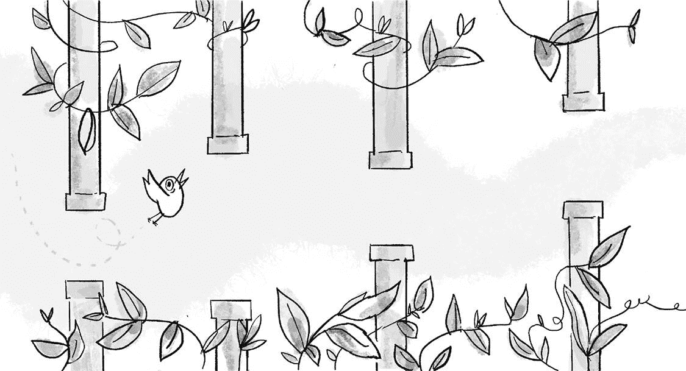

图 11.1: *Flappy Bird* 游戏

假设你想要自动化游戏玩法，而不是由人类点击，而是由神经网络决定是否要拍打翅膀。那么机器学习在这里能起作用吗？暂时跳过机器学习生命周期中的初始数据步骤，让我们来思考如何选择一个模型。神经网络的输入和输出是什么？

这是一个相当有趣的问题，因为至少在输入的情况下，并没有明确的答案。如果你对游戏了解不多，或者不想在识别哪些游戏方面重要时偏袒一方，那么让输入成为游戏屏幕的所有像素可能是最合适的做法。这种方法尝试将*游戏的一切*都输入到模型中，让模型自己决定什么是重要的。

然而，我已经玩过足够多的*Flappy Bird*，并且感觉我已经相当了解它。因此，我可以跳过将所有像素输入到模型的步骤，并将游戏的本质简化为仅几个必要的输入数据点，用于做出预测。这些数据点在机器学习中通常被称为**特征**，代表了对于预测最为重要的数据的独特特征。想象一下咬一口神秘多汁的水果——它的味道（甜！）、质地（脆！）和颜色（鲜红！）等特征帮助你把它识别为苹果。在*Flappy Bird*的情况下，最关键的特征列举如下：

1.  小鸟的 y 坐标

1.  小鸟的 y 速度

1.  下一个上方管道开口的 y 坐标

1.  下一个下方管道开口的 y 坐标

1.  到下一个管道的 x 距离

这些特性在图 11.2 中有说明。


图 11.2：*Flappy Bird* 输入特征用于神经网络

神经网络将有五个输入，每个特性对应一个输入，但输出呢？这是一个分类问题还是回归问题？在像*Flappy Bird*这样的游戏中提问这个问题似乎有些奇怪，但实际上它非常重要，并且与游戏的控制方式有关。点击屏幕、按下按钮或使用键盘控制都属于分类的例子。毕竟，玩家只有一个离散的选择集：点击或不点击；按下键盘上的 W、A、S 或 D。另一方面，使用模拟控制器如摇杆则更倾向于回归。摇杆可以在任何方向上以不同的角度倾斜，从而在水平和垂直轴上产生连续的输出值。

对于*Flappy Bird*，输出代表一个分类决策，只有两个选择：

+   拍打。

+   不要拍打。

这意味着网络应该有两个输出，建议采用类似于图 11.3 所示的整体网络架构。

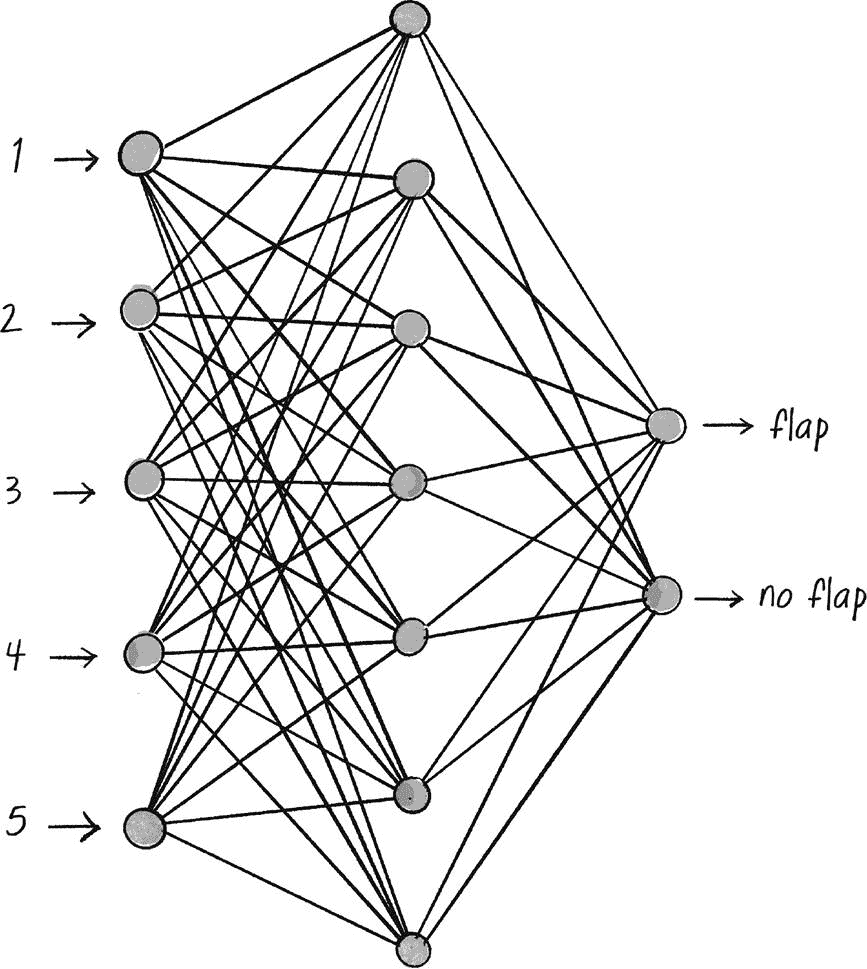

图 11.3：ml5.js 可能设计的*Flappy Bird*神经网络

现在，我拥有了配置模型并让 ml5.js 构建它所需的所有信息：

```
let options = {
  inputs: 5,
  outputs: ["flap", "no flap"],
  task: "classification"
};
let birdBrain = ml5.neuralNetwork(options);
```

接下来怎么办？如果我按照第十章中列出的步骤进行操作，我就必须回到机器学习过程的第 1 步和第 2 步：数据收集和准备。这里具体该怎么做呢？一个想法是可以去寻找地球上最伟大的*Flappy Bird*玩家，并记录他们连续玩几个小时。我可以记录下每一时刻的输入特征以及玩家是否按下了翅膀。将所有这些数据输入模型，进行训练，我已经能看到头条新闻了：“人工智能机器人打败了*Flappy Bird*。”

但等一下，计算机化的代理真的是自己学会了玩*Flappy Bird*，还是只是学会了模仿人类的游戏玩法？如果那个人错过了*Flappy Bird*策略的某个关键方面怎么办？自动化玩家永远无法发现这一点。更不用说收集所有这些数据将会非常繁琐。

这里的问题是，我已经回到了像第十章中的监督学习场景，但本节内容应该是关于强化学习的。与监督学习不同，在监督学习中，正确的答案是由训练数据集提供的，而在强化学习中，代理通过与环境互动并接受反馈，通过反复试验来学习答案——即最优决策。在*Flappy Bird*的情况下，代理每成功通过一个管道就能获得正奖励，但如果撞到管道或地面，则会得到负奖励。代理的目标是弄清楚哪些行为能够在时间上积累最多的奖励。

一开始，*Flappy Bird*代理并不知道什么时候是最好的翅膀挥动时机，这会导致许多碰撞。然而，随着它从无数次游戏中积累越来越多的反馈，它将开始优化自己的行动，并开发出最佳策略，以避免碰撞并顺利通过管道，从而最大化其总奖励。这种通过*实践学习*并基于反馈进行优化的过程就是强化学习的本质。

随着章节的推进，我将探讨这里概述的原理，但有个变化。传统的强化学习技术包括定义一个策略（称为**策略**）和相应的**奖励函数**，以便为调整策略提供反馈。然而，我不会走这条路，而是会转向本章的明星——神经进化。

### **进化神经网络真棒！**

神经进化（neuroevolution）通过应用遗传算法（GAs）和自然选择的原理来训练神经网络中的权重，而不是使用传统的反向传播、策略和奖励函数。这项技术能够同时将多个神经网络应用于一个问题。定期地，表现最好的神经网络会被“选择”，它们的“基因”（即网络连接权重）会被结合并发生突变，从而创造出下一代的网络。神经进化在学习规则不明确或任务复杂，且存在众多潜在解决方案的环境中，尤其有效。

神经进化的第一个示例之一可以在 1994 年 Edmund Ronald 和 Marc Schoenauer 的论文《Genetic Lander: An Experiment in Accurate Neuro-genetic Control》中找到（* [`doi.org/10.1007/3-540-58484-6_288`](https://doi.org/10.1007/3-540-58484-6_288)*）。在 1990 年代，传统的神经网络训练方法仍处于初期阶段，而这项工作探讨了一种替代方法。论文描述了如何通过在一个名为*Lunar Lander*的游戏中模拟航天器，使其学习如何安全降落并着陆。研究人员没有使用手工编写的规则或标注的数据集，而是选择使用遗传算法（GAs）对神经网络进行进化和训练，跨越多代进行演化。结果是成功的！

2002 年，Kenneth O. Stanley 和 Risto Miikkulainen 在其论文《Evolving Neural Networks Through Augmenting Topologies》中扩展了早期的神经进化方法（* [`doi.org/10.1162/106365602320169811`](https://doi.org/10.1162/106365602320169811)*）。与专注于进化神经网络权重的月球着陆者方法不同，Stanley 和 Miikkulainen 引入了一种方法，也进化了网络本身的结构！他们的 NEAT 算法——神经进化增强拓扑（NeuroEvolution of Augmenting Topologies）——从简单的网络开始，并通过进化逐步完善其拓扑结构。因此，NEAT 能够发现针对特定任务量身定制的网络架构，通常能够产生更优化、更有效的解决方案。

一个全面的 NEAT 实现需要深入了解神经网络架构，并直接使用 TensorFlow.js 进行工作。而我的目标是将 Ronald 和 Schoenauer 的原始研究成果，应用于现代的 Web 浏览器环境，并使用 ml5.js 来实现。与其使用*Lunar Lander*游戏，我决定尝试使用*Flappy Bird*。为此，我首先需要编写一个*Flappy Bird*的版本，以便我的神经进化网络能够在其中运行。

### **编程 Flappy Bird**

*Flappy Bird*由越南游戏开发者 Dong Nguyen 于 2013 年创建。2014 年 1 月，它成为苹果 App Store 上下载量最多的应用。然而，在同年 2 月 8 日，Nguyen 宣布他将撤下这款游戏，原因是其成瘾性。自那时以来，*Flappy Bird*成为历史上被克隆最多的游戏之一。

*Flappy Bird* 是诺兰定律的完美示例，这一格言归功于 Atari 创始人以及*Pong*的创造者诺兰·布什内尔：“所有最好的游戏都容易学习，却难以精通。”这也是一个非常适合初学者编写的游戏，可以作为学习练习，它与本书中的概念完美契合。

为了使用 p5.js 编写游戏，我将从定义一个`Bird`类开始。这可能会让你感到惊讶，但为了演示，我决定跳过使用`p5.Vector`，而是直接使用独立的`x`和`y`属性来表示鸟的位置。由于鸟在游戏中仅沿着垂直轴移动，`x`值保持不变！因此，`velocity`（以及所有相关的力）可以是单一的标量值，只用于 y 轴。

为了进一步简化代码，我会将所有的力直接添加到鸟的速度中，而不是将它们累积到`acceleration`变量中。除了常规的`update()`方法，我还会添加一个`flap()`方法，让鸟向上飞。`show()`方法不在这里包含，因为它只是画一个圆形。以下是代码：

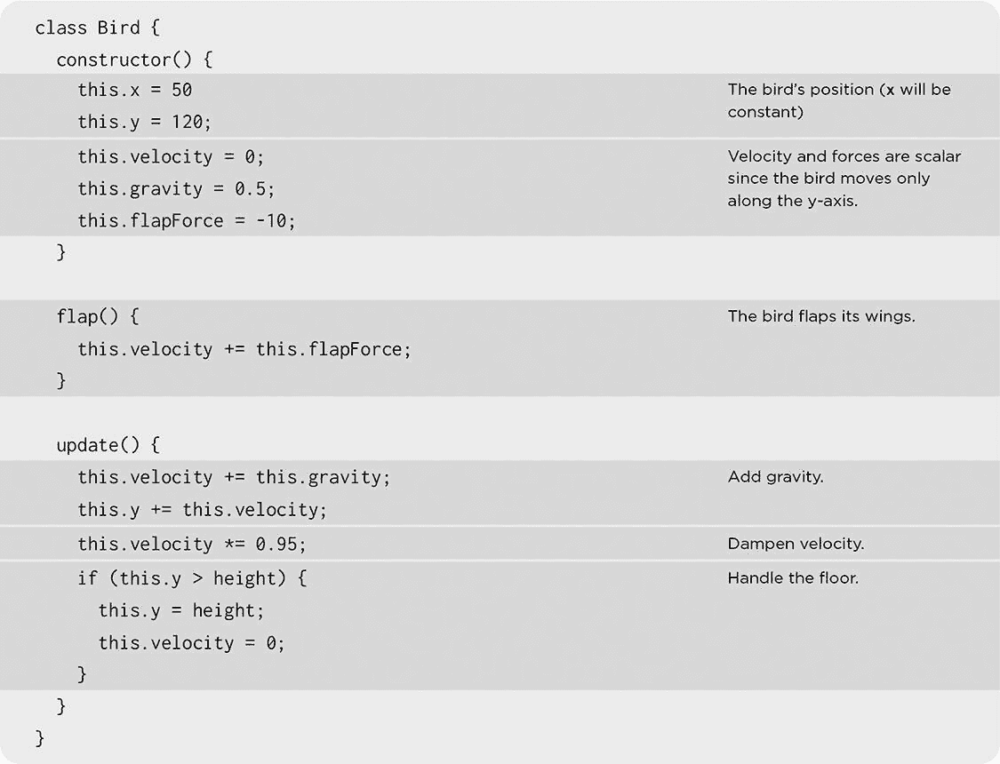

游戏的其他主要元素是鸟必须穿越的管道。我将创建一个`Pipe`类来描述一对矩形，一个从画布的顶部延伸，另一个从底部延伸。正如鸟仅沿垂直方向移动一样，管道也仅沿水平方向滑动，因此它们的属性可以是标量值而非向量。管道以恒定的速度移动，不受其他力的影响。

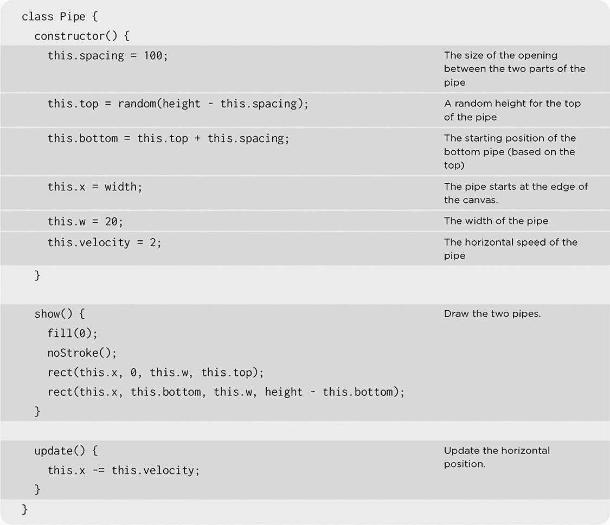

为了明确说明，这个游戏展示了一只鸟穿过管道——鸟在二维空间中移动，而管道保持静止。然而，更简单的做法是将鸟看作在水平方向上保持静止，管道在移动。

在编写了`Bird`和`Pipe`类后，我几乎可以开始运行游戏了。然而，缺少一个关键部分：碰撞检测。整个游戏的核心就是让鸟避免撞到管道！幸运的是，这对你来说并不陌生。你在本书中已经看到过许多对象检查其与其他对象的位置的例子。不过，我需要做一个设计选择。碰撞检测方法可以逻辑上放在`Bird`类中（用来检查鸟是否撞到管道），也可以放在`Pipe`类中（用来检查管道是否撞到鸟）。根据你的观点，任意一种方式都能找到合理的理由。

我会把这个方法放在`Pipe`类中并命名为`collides()`。这段代码比你初看时可能想的要复杂一些，因为该方法需要检查管道的上下两个矩形与鸟的位置的碰撞。我可以用多种方式来实现这一点。一种方法是先检查鸟是否在任意矩形的垂直范围内（即在上管道底部之上或下管道顶部之下）。但只有当鸟水平位于管道宽度的边界内时，鸟才与管道发生碰撞。一个优雅的写法是将这些检查通过逻辑*与*运算符结合起来：

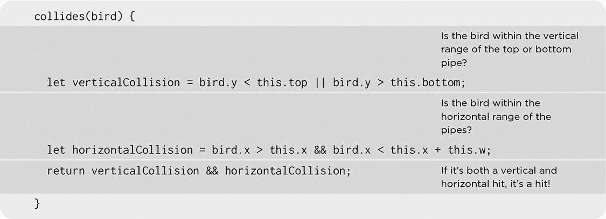

目前算法将鸟视为一个单一的点，并没有考虑它的大小。为了让游戏更具真实感，应该改进这一细节。

剩下的就是编写`setup()`和`draw()`函数。我需要一个表示鸟的变量和一个存储管道列表的数组。交互方式是点击鼠标一次，触发鸟的`flap()`方法。与其构建一个包含得分、结束屏幕和其他常规元素的完整游戏，不如通过在任何发生碰撞的管道附近绘制文本*OOPS!*来确保游戏机制正常工作。代码还假设`Pipe`类中有一个额外的`offscreen()`方法，用于处理管道移出画布左边缘的情况。

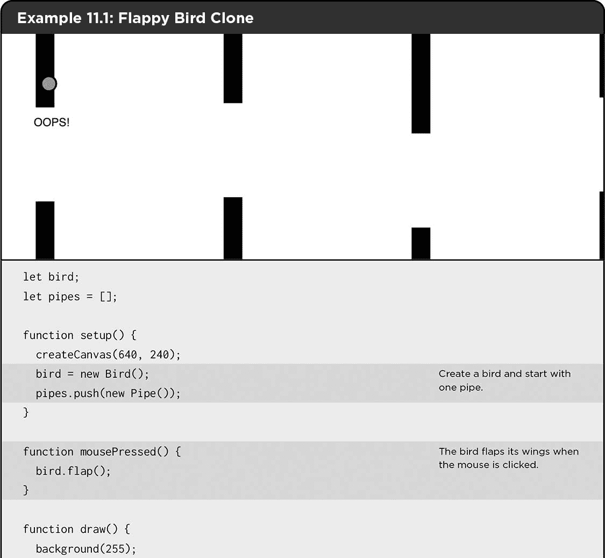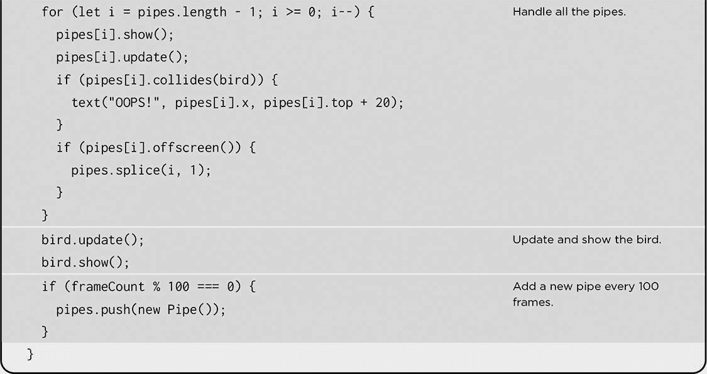

这段代码最棘手的部分在于使用`frameCount`变量和取模运算符在固定间隔内生成管道。在 p5.js 中，`frameCount`是一个系统变量，用于追踪自从草图开始以来已经渲染的帧数，并随着`draw()`循环的每次执行而递增。取模运算符（%）返回除法操作的余数。例如，`7 % 3`的结果是`1`，因为 7 除以 3 的商是 2，余数是 1。因此，布尔表达式`frameCount % 100 === 0`会检查当前的`frameCount`值是否能被 100 整除，余数为 0。这个条件在每 100 帧时为真，在这些帧上，会生成一个新的管道并将其添加到`pipes`数组中。

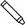 **练习 11.1**

实现一个得分系统，每成功穿过一组管道就为玩家奖励积分。你也可以为鸟、管道和环境添加你自己的视觉设计元素！

### **神经进化版 Flappy Bird**

我的*Flappy Bird*克隆游戏目前是通过鼠标点击来控制的。现在我想把游戏控制权交给计算机，并通过神经进化来教它如何玩。幸运的是，神经进化的过程已经集成在 ml5.js 中了，因此实现这一切相对简单。第一步是给鸟一个“大脑”，这样它就能自行决定是否拍动翅膀。

#### **鸟脑**

当我引入强化学习时，我建立了一份输入特征列表，应该用于鸟的决策过程。我将使用相同的列表，但做一个简化。由于管道之间的开口大小是恒定的，所以不需要包含顶部和底部的 y 坐标，任选其一即可。因此，输入特征如下：

1.  鸟的 y 坐标

1.  鸟的 y 方向速度

1.  下一个管道顶部（或底部！）开口的 y 坐标

1.  到下一个管道的 x 距离

这两个输出表示鸟的两个选择：是否拍打翅膀。设置好输入和输出后，我可以在鸟的构造函数中添加一个`brain`属性，用来保存一个配置合适的 ml5.js 神经网络。为了展示一种不同的编码风格，我将跳过包含一个单独的`options`变量，而是直接将属性作为对象字面量传递给`ml5.neuralNetwork()`函数。请注意，添加了一个`neuroEvolution`属性并设置为`true`。这是启用我将在后续代码中使用的一些功能所必需的。

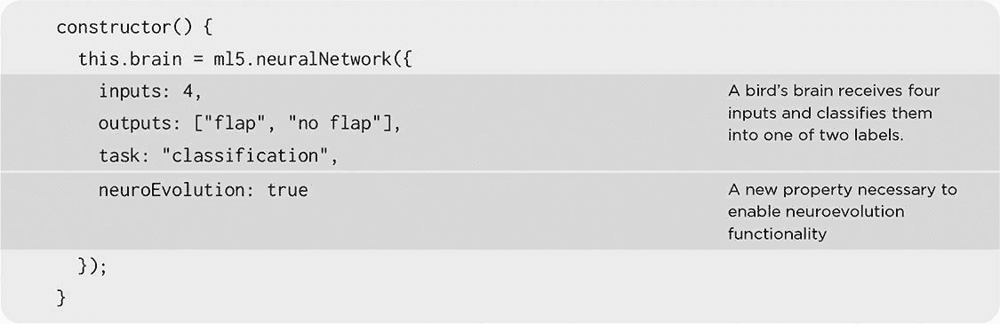

接下来，我将向`Bird`类添加一个名为`think()`的方法，用于计算鸟在每一时刻所需的所有输入。前两个输入很简单——它们只是鸟的`y`和`velocity`属性。然而，对于输入 3 和 4，我需要确定下一个管道是哪一个。

乍一看，似乎下一个管道总是数组中的第一个，因为管道是逐个添加到数组末尾的。然而，在管道通过鸟之后，它就不再相关了，并且在管道退出画布并从数组开头移除之间还有一段时间。因此，我需要找到数组中第一个右边缘（x 坐标加上宽度）大于鸟的 x 坐标的管道：

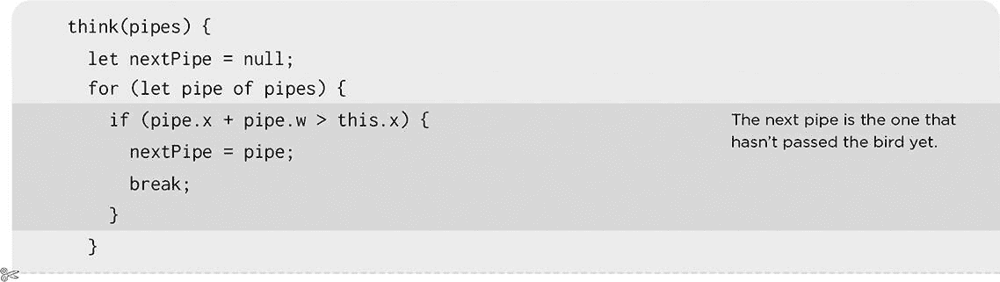

一旦我找到了下一个管道，就可以创建四个输入：

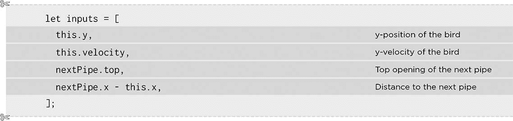

这已经很接近了，但我忘记了一个关键步骤。所有输入值的范围是由画布的尺寸决定的，但神经网络期望的是标准化范围内的值，比如 0 到 1。标准化这些值的一种方法是，将与垂直属性相关的输入除以`height`，而与水平方向相关的输入除以`width`：


拿到输入数据后，我准备将它们传递给神经网络的`classify()`方法。不过，我还有一个小问题：`classify()`是异步的，这意味着我必须在`Bird`类中实现一个回调函数来处理模型的决策。这会给代码增加显著的复杂性，但幸运的是，在这种情况下完全不需要这样做。ml5.js 的机器学习函数通常需要异步回调，因为模型处理大量数据需要时间。如果没有回调，代码可能会长时间等待结果，而如果模型在 p5.js 草图中运行，这种延迟可能会严重影响动画的流畅性。然而，这里的神经网络只有四个浮动输入和两个输出标签！它非常小，能够快速运行，因此没有必要使用异步代码。

为了完整性，我在书本网站上包括了一个实现神经进化与异步回调的示例版本。然而，在本讨论中，我将使用 ml5.js 的一个特性，它让我能够走捷径。方法`classifySync()`与`classify()`完全相同，但它是同步运行的，这意味着代码会停下来等待结果，再继续执行。使用这个版本的方法时要非常小心，因为它可能在其他上下文中引发问题，但在这个简单的场景下，它能很好地工作。下面是`think()`方法的结尾部分，使用了`classifySync()`：

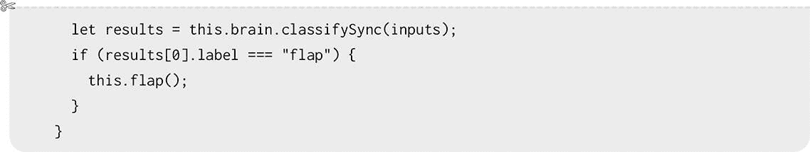

神经网络的预测格式与第十章中的手势分类器相同，可以通过检查`results`数组的第一个元素来做出决策。如果输出标签是`"flap"`，则调用`flap()`。

现在我已经完成了`think()`方法，真正的挑战可以开始了：教会鸟在正确的时刻通过扑翅膀来赢得游戏。此时，遗传算法（GA）再次成为关键。回想一下第九章的讨论，达尔文进化论的三个关键原则是：变异、选择和遗传。在我将 GA 的步骤应用于神经网络的全新背景时，我将依次回顾这些原则。

#### **变异：一群扑腾的小鸟**

一只随机初始化的神经网络鸟不太可能有任何成功。这只孤鸟很可能会不停地跳跃，飞出屏幕，或者坐在画布底部，等待与管道的每一次碰撞。这种反常且不合逻辑的行为提醒我们：一个随机初始化的神经网络没有任何知识或经验。鸟的行为本质上是在做胡乱的猜测，所以成功是非常罕见的。

这就是遗传算法（GA）中的第一个关键原则：**变异**。我们的期望是，通过引入尽可能多的不同神经网络配置，可能会有一些表现稍微优于其他的。变异的第一步是增加一个包含许多小鸟的数组（图 11.4）。

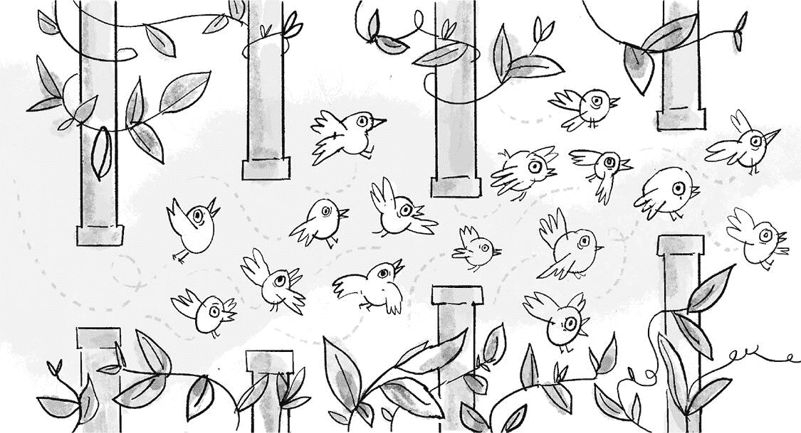

图 11.4：一群小鸟，每只小鸟都有独特的神经网络，在神经进化过程中穿越管道

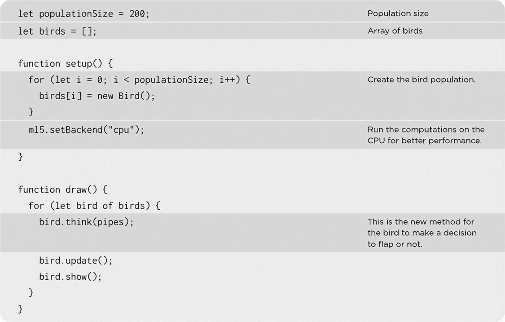

你可能会注意到一个出现在 `setup()` 函数中的特殊代码行：`ml5.setBackend("cpu")`。在运行神经网络时，很多繁重的计算任务通常会被卸载到 GPU 上。这是默认行为，对于 ml5.js 中包含的大型预训练模型尤其重要。

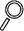 **GPU 与 CPU**

+   **图形处理单元（GPU）：** 最初设计用于渲染图形，GPU 擅长处理大量的并行运算。这使得它们在处理机器学习模型频繁执行的数学运算和计算时表现出色。

+   **中央处理单元（CPU）：** 通常被认为是计算机的大脑或通用心脏，CPU 处理的任务种类比专门的 GPU 更广泛，但它并不是为同时执行大量任务而设计的。

但有一个陷阱！将数据传输到 GPU 并从 GPU 传回会引入开销。在大多数情况下，GPU 的并行处理所带来的收益足以抵消这些开销，但对于像这里这样的小型模型，数据复制到 GPU 并返回实际上会减慢神经网络的速度。调用`ml5.setBackend("cpu")`告诉 ml5.js 将神经网络计算转移到 CPU 上运行。至少在这个简单的小鸟模型的案例中，这是更高效的选择。

#### **选择：Flappy Bird 适应度**

一旦我有了一个多样化的小鸟种群，每只小鸟都有自己的神经网络，遗传算法的下一步是 **选择**。哪些小鸟应该将它们的基因（在这里是神经网络权重）传递给下一代？在 *Flappy Bird* 的世界里，成功的标准是能够通过避开管道生存得更久。这就是小鸟的 *适应度*。能够避开更多管道的小鸟被认为比撞到第一个管道就挂掉的小鸟更具适应性。

为了跟踪每只小鸟的适应度，我将在 `Bird` 类中添加两个属性，`fitness` 和 `alive`：

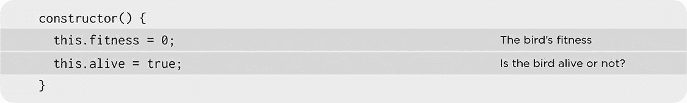

我将为适应度分配一个数值，这个数值在每次通过`draw()`时都会增加，前提是鸟还活着。存活时间更长的鸟应该有更高的适应度值。这种机制类似于强化学习中的奖励良好决策的技巧。然而，在强化学习中，智能体对每个决策都会收到即时反馈，从而能够相应地调整其策略。在这里，鸟的适应度是其整体成功的累计衡量标准，只会在遗传算法的选择步骤中使用。

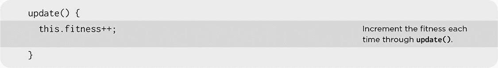

`alive`属性是一个布尔标志，初始值为`true`。当一只鸟与管道碰撞时，该属性会被设置为`false`。只有那些还活着的鸟会被更新并绘制到画布上。

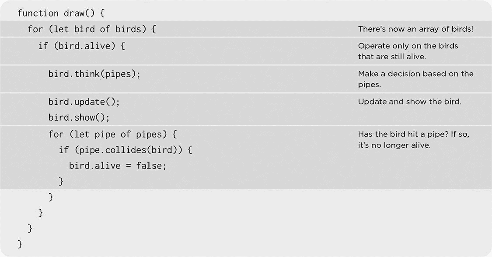

在第九章中，我演示了两种运行进化仿真技术。在智能火箭示例中，种群在每一代中都生活了固定的时间。相同的方法可能在这里也能奏效，但我希望让鸟类积累尽可能高的适应度值，而不是根据时间限制随意停止它们。第二种技术，在 bloops 示例中演示，完全取消了适应度分数，并为任何存活生物设定了一个随机克隆概率。对于*Flappy Bird*，这种方法可能会变得混乱，并有导致过度繁殖或所有鸟类完全死亡的风险。

我提议结合这两种方法的元素。我将允许一个世代继续，直到至少有一只鸟还活着。当所有鸟都死掉时，我将选择父母进行再生产步骤，并重新开始。我将先写一个函数来检查是否所有的鸟都已经死亡：

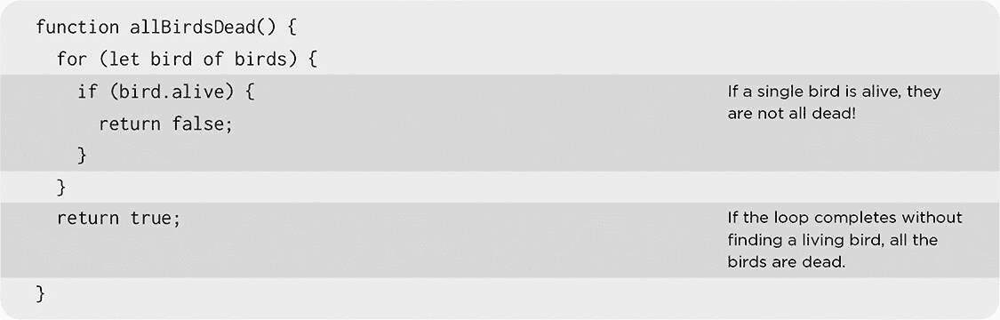

当所有鸟都死亡时，就到了选择的时候！在之前的遗传算法示例中，我演示了一种接力赛技术，旨在给种群中的所有成员一个公平的机会，同时仍然增加那些适应度较高的个体被选择的机会。我将在这里使用相同的`weightedSelection()`函数：

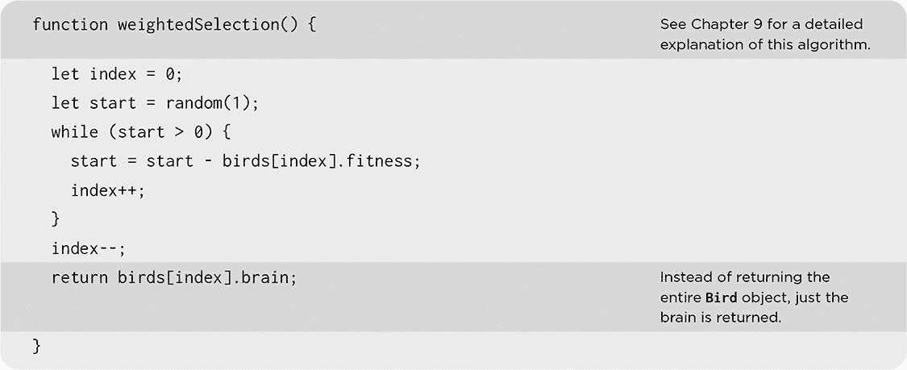

为了使这个算法正常运行，我需要首先规范化鸟的适应度值，使它们的总和为 1：

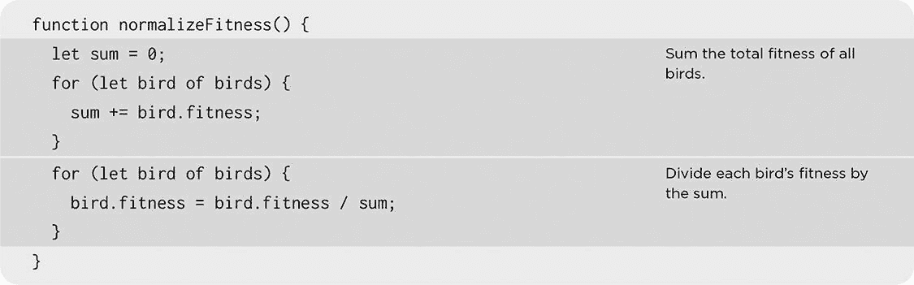

一旦标准化，每只鸟的适应度就等于它被选择的概率。

#### **遗传学：小鸟宝宝**

剩下的唯一一步是遗传算法中的再生产。在第九章中，我详细探讨了生成子元素的两步过程：交叉和变异。交叉是**遗传学**中的第三个关键原理：来自两个选择父代的 DNA 结合形成子代的 DNA。

一开始，发明一个用于两个神经网络的交叉算法可能看起来令人生畏，但实际上非常简单。可以把鸟类大脑的每个“基因”看作是神经网络中的权重。混合两个大脑的过程归结为创建一个新的神经网络，每个权重通过虚拟硬币投掷来选择——权重来自第一个或第二个父代：

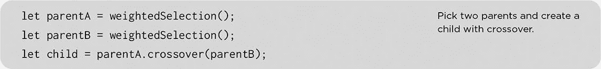

哇，今天真是我的幸运日！原来 ml5.js 包括一个`crossover()`方法，它管理着混合两个神经网络的算法。我可以高兴地进入变异步骤了：


我的运气真不错！ml5.js 库还提供了一个`mutate()`方法，它接受一个变异率作为主要参数。这个变异率决定了权重会被改变的频率。例如，0.01 的比率表示任何给定的权重有 1%的概率会发生变异。在变异过程中，ml5.js 会通过在权重上加一个小的随机数来稍微调整权重，而不是选择一个完全新的随机值。这种行为模拟了现实世界中的基因变异，通常是引入轻微的变化，而不是完全新的特征。尽管默认方法适用于许多情况，但 ml5.js 通过允许使用自定义变异函数作为`mutate()`的可选第二个参数，提供了对过程的更多控制。

交叉和变异步骤需要为种群的大小重复进行，以创建一个全新的鸟类世代。这是通过将一个空的本地数组`nextBirds`填充为新鸟类来实现的。一旦种群满员，全球的`birds`数组就会更新为这个新的世代：

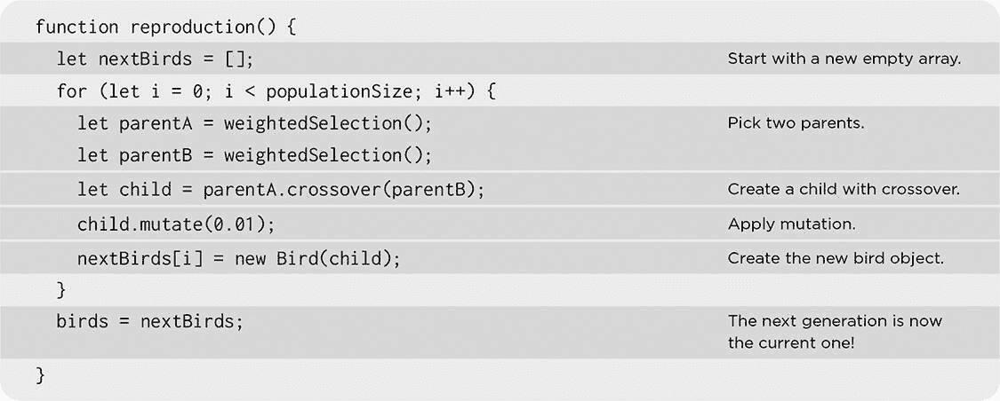

如果你仔细观察`reproduction()`函数，可能会注意到我悄悄加入了`Bird`类的另一个新特性：构造函数的一个参数。当我最初介绍鸟类大脑的概念时，每个新的`Bird`对象都会创建一个全新的大脑——一个由 ml5.js 提供的新神经网络。然而，现在我希望新的鸟类能够*继承*一个通过交叉和变异过程生成的子代大脑。为了实现这一点，我会巧妙地修改`Bird`构造函数，来查找一个名为`brain`的可选参数：

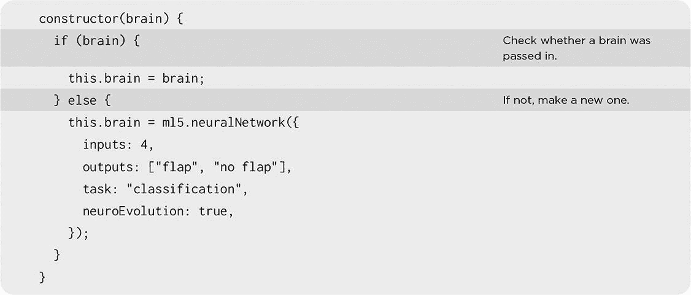

如果在创建新鸟时没有提供`brain`，那么`brain`参数将保持`undefined`。在 JavaScript 中，`undefined`被视为`false`。因此，`if (brain)`测试会失败，代码将跳转到`else`语句并调用`ml5.neuralNetwork()`。另一方面，如果传入了一个现有的神经网络，`brain`的值将为`true`，并直接赋值给`this.brain`。这个巧妙的技巧让一个构造函数能够处理多种场景。

到此为止，示例已经完成。剩下的就是在每一代的末尾，当所有鸟都死亡时，在`draw()`中调用`normalizeFitness()`和`reproduction()`。

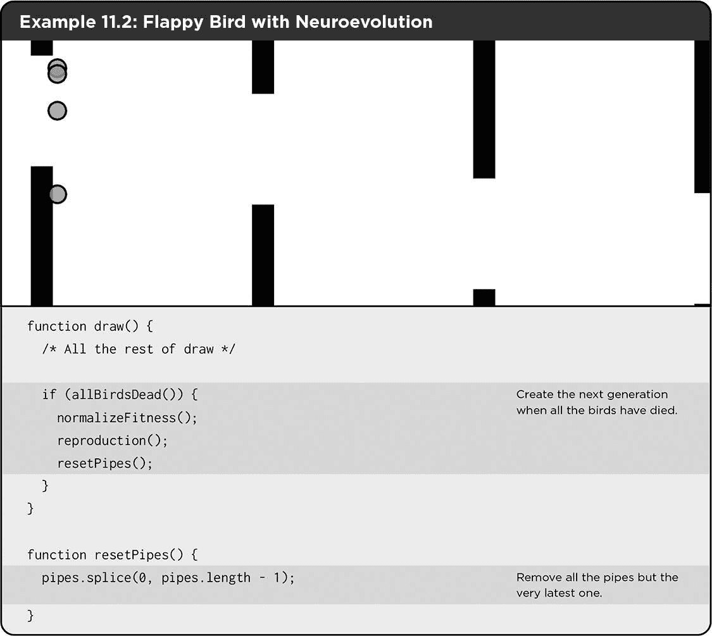

注意新增了一个`resetPipes()`函数。如果在开始新一代之前不移除管道，鸟可能会立即从与管道相撞的位置重新开始，在这种情况下，即使是最好的鸟也没有机会飞行！示例 11.2 的完整在线代码还调整了鸟的行为，使得它们在离开画布时死亡，无论是撞到地面还是飞得太高超出顶部。

 **习题 11.2**

示例 11.2 需要很长时间才能产生任何结果。你能否通过跳过游戏的每一帧绘制来“加速时间”，以更快地达到最优鸟？（解决方案在第 570 页的“加速时间”中提供。）此外，你能否添加一个叠加层，显示有关模拟状态的信息，例如仍在游戏中的鸟的数量、当前代数和最优鸟的寿命？

 **习题 11.3**

为了避免每次都从头开始神经进化过程，可以尝试使用 ml5.js 的神经网络`save()`和`load()`方法。你如何添加一个功能来保存最好的鸟模型，并提供加载先前保存模型的选项？

### **神经进化引导方式**

在探索了*Flappy Bird*的神经进化后，我希望将焦点转回到模拟领域，特别是第五章中介绍的引导代理。假设不是我来规定一个算法的规则来计算引导力，而是一个模拟生物能够进化出自己的策略呢？从 Reynolds 对栩栩如生和即兴行为的目标中汲取灵感，我的目标不是通过神经进化来创造一个完美的生物，它能完美地执行任务。相反，我希望创建一个迷人的模拟生命世界，在那里，进化的怪癖、细微差别和幸运的意外在画布上展开。

我将从第九章中适应智能火箭的示例开始。在该示例中，每个火箭的基因是一个向量数组：

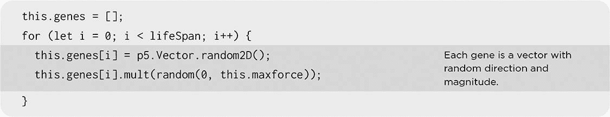

我提议调整这段代码，改为使用神经网络来预测向量或引导力，将`genes`转化为`brain`。向量可以具有连续的值范围，因此这是一个回归任务：

```
this.brain = ml5.neuralNetwork({
  inputs: 2,
  outputs: 2,
  task: "regression",
  neuroEvolution: true,
});
```

在原始示例中，来自`genes`数组的向量是顺序应用的，通过`counter`变量查询数组：

```
this.applyForce(this.genes[this.counter]);
```

现在，代替数组查找，我希望神经网络在每一帧动画中返回一个新的向量。对于 ml5.js 的回归任务，神经网络的输出是通过 `predict()` 方法接收的，而不是 `classify()`。在这里，我将使用 `predictSync()` 变体来简化代码，并允许模型在火箭的 `run()` 方法中同步输出数据：

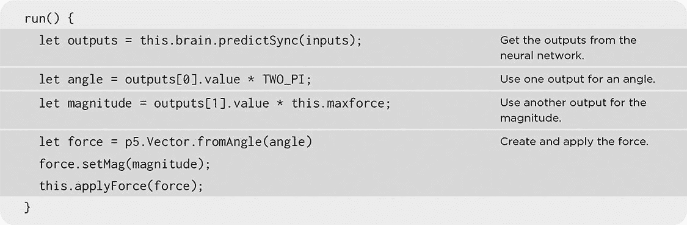

神经网络大脑输出两个值：一个是向量的角度，另一个是向量的大小。你可能会想到使用这些输出作为向量的 x 分量和 y 分量。然而，ml5.js 神经网络的默认输出范围是从 0 到 1，而我希望这些力能够指向正负两个方向。通过将第一个输出值乘以 `TWO_PI` 来映射角度，就可以实现完整的范围。

你可能已经注意到代码中有一个名为 `inputs` 的变量，我还没有声明或初始化它。定义神经网络的输入是作为系统设计者的你可以发挥最大创造力的地方。你需要考虑环境的特性，以及你的生物体模拟的生物学和能力，然后决定哪些特征最为重要。

作为第一次尝试，我将为输入分配一些基本的值，看看是否能工作。由于智能火箭的环境是静态的，障碍物和目标是固定的，那么如果大脑能够学习并估算一个流场来导航到达目标会怎么样？正如我在第五章中演示的，流场接收一个位置并返回一个向量，因此神经网络可以模仿这一功能，使用火箭当前的 x 和 y 位置作为输入。我只需要根据画布的尺寸标准化这些值：

```
let inputs = [this.position.x / width, this.position.y / height];
```

就是这样！几乎所有原始示例中的其他内容都可以保持不变：种群、适应度函数和选择过程。

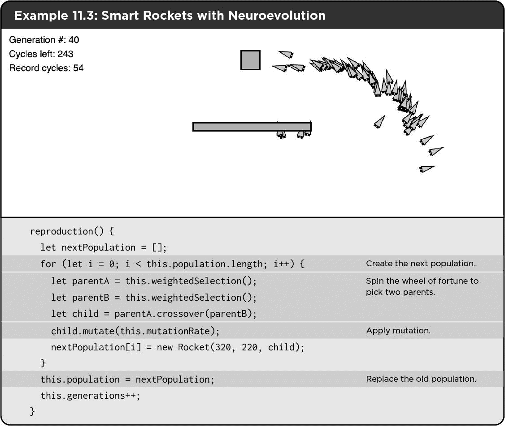

现在我正在使用 ml5.js，注意到我不再需要一个单独的 `DNA` 类来实现 `crossover()` 和 `mutate()` 方法了。相反，这些方法已经内置在 `ml5.neuralNetwork` 中，可以直接调用。

 **练习 11.4**

根据 Reynolds 的定义，转向力是一个代理期望速度与其当前速度之间的差异。那么这个进化系统如何模仿这种方法呢？如果你不只使用位置作为神经网络的输入，而是输入火箭的当前速度会怎样？你可以尝试使用 x 和 y 分量，或者向量的方向和大小。记得标准化这些值！

#### **应对变化**

在之前的示例中，环境是静态的，目标和障碍物都固定不动。这使得火箭仅通过位置作为输入就能轻松完成寻找目标的任务。然而，如果目标和火箭路径中的障碍物在移动呢？为了应对更复杂和变化的环境，我需要扩展神经网络的输入，考虑更多的环境特征。这类似于我在*Flappy Bird*中所做的，我识别了环境中的关键数据点来指导小鸟的决策过程。

我将从这个场景的最简单版本开始，几乎与原始的智能火箭示例相同，但移除了障碍物，并将固定目标替换为由 Perlin 噪声控制的随机行走者。在这个世界里，我将`Rocket`重命名为`Creature`，并将行走者改为一个表示温和漂浮光球的`Glow`类。想象一下，这个生物的目标是到达光源，并在它的光辉怀抱中尽可能长时间地舞动：

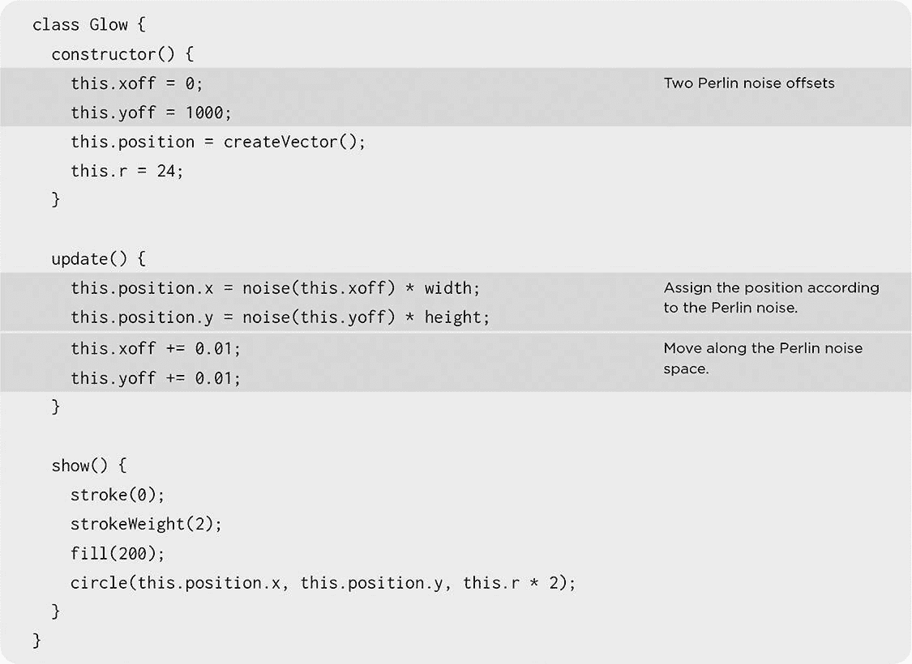

随着光源的移动，生物应该将光源的位置纳入其决策过程，作为输入到其大脑。然而，仅仅知道光源的位置是不够的；关键在于光源相对于生物自身的位置。一种很好的方式来综合这些信息作为输入特征，是计算一个从生物指向光源的向量。本质上，我在重新发明第五章中的`seek()`方法，使用神经网络来估算转向力：

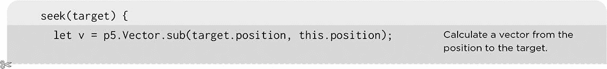

这是一个好的开始，但向量的分量没有落在标准化的输入范围内。我可以将`v.x`除以`width`，将`v.y`除以`height`，但由于我的画布不是完美的正方形，这可能会导致数据偏斜。另一种解决方案是标准化向量，但虽然这样可以保留从生物到光源的方向信息，但会消除任何关于距离的度量。这也不行——如果生物正坐在光源上方，它应该与远离光源时的行为不同。为了解决这个问题，我会在标准化向量之前将距离保存在一个单独的变量中。不过，为了让它作为输入特征有效，我仍然需要标准化范围。虽然这不是从 0 到 1 的完美标准化，但我将通过画布的宽度来进行除法，这样可以提供一种实用的标准化方式，保持相对的大小：

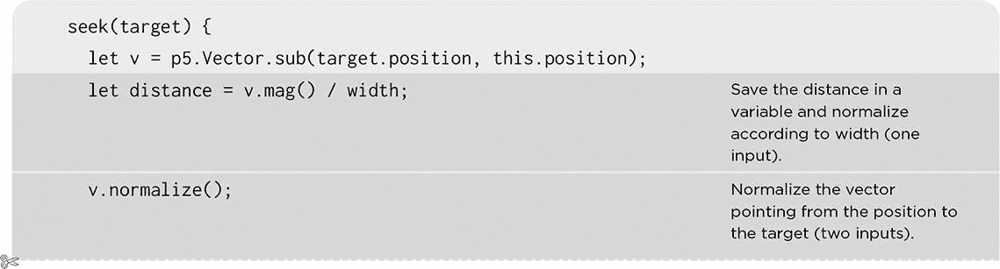

正如你可能记得的，Reynolds 的引导公式的一个关键元素是将期望速度与当前速度进行比较。车辆当前的运动状态在决定如何转向时起着重要作用！为了让生物将自己的速度作为决策的一部分，我还可以将速度向量作为神经网络的输入之一。为了规范化这些值，将向量的分量除以 `maxspeed` 属性效果非常好。这样既保留了向量的方向，也保留了相对大小。其余的 `seek()` 方法与之前的示例遵循相同的逻辑，神经网络的输出合成一个力，施加到生物身上：

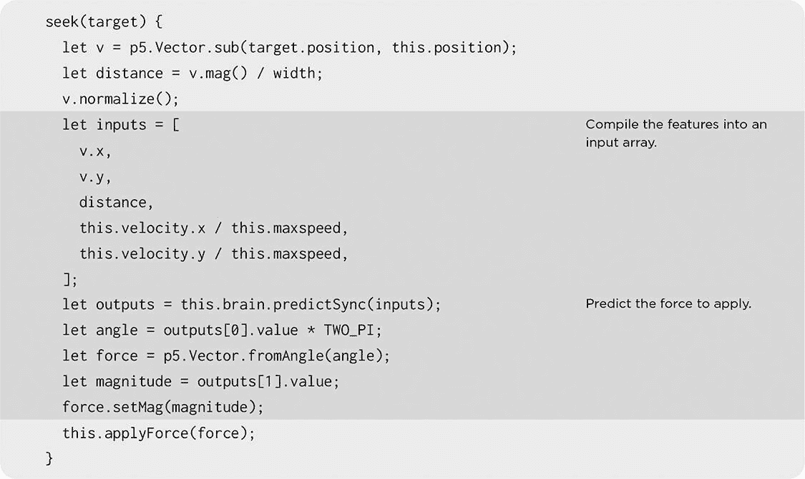

从火箭到生物的过渡中，已经发生了足够的变化，因此值得重新考虑适应度函数。以前，适应度是基于火箭每代结束时距离目标的*记录*距离来计算的。由于目标现在在移动，我更愿意将生物能够捕捉到光点的时间量作为适应度的衡量标准。这可以通过在 `update()` 方法中检查生物与光点之间的距离，并在它们相交时增加 `fitness` 值来实现：

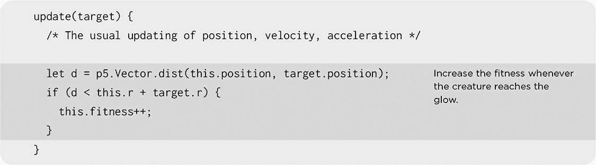

`Glow` 和 `Creature` 类都包括一个半径属性 `r`，我用它来判断是否发生相交。

#### **加速时间**

你可能注意到进化计算的一个特点，那就是测试代码是一项需要耐心的愉快练习。你必须看到仿真一代又一代地缓慢运行。这也是其中的一部分——我*想*看到这个过程！这也是一个很好的借口去休息一下，值得提倡。去外面走一走，享受一段不经过模拟的大自然，或者泡一杯舒缓的茶。然后再回到你的生物，看看它们的进展。安慰自己的是，你所需要等待的只是数十亿毫秒，而不是实际生物进化所需的数十亿年。

然而，为了使系统发展，没有固有的要求需要你绘制和动画化整个世界。如果你能够跳过渲染场景的所有时间，几百代可能会在眨眼间完成。或者，与你完全不渲染环境不同，你也可以选择仅仅*减少渲染的频率*。这样，你就不必每次更改一个小参数时都抓狂，等待看它是否对系统演化产生影响，仿佛等待了几个小时。

这里我可以使用 p5.js 的一个我最喜欢的功能：快速创建标准界面元素的能力。你之前在示例 9.4 中看到了这个功能，使用了`createButton()`。这次，我将创建一个滑块来控制`draw()`内部运行的`for`循环的迭代次数。`for`循环将包含更新（但不绘制）模拟的代码。循环重复的次数越多，动画看起来就越快。

这是这个新时间滑块的代码，省略了`setup()`中所有其他全局变量及其初始化。请注意，视觉效果的代码与物理代码分开，以确保每个`draw()`周期内的渲染仍然只发生一次：

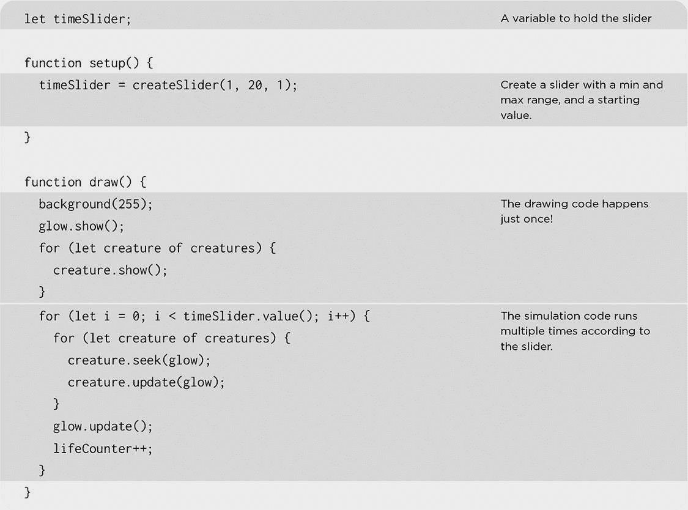

在 p5.js 中，滑块通过三个参数定义：最小值（滑块最左边时的值）、最大值（滑块最右边时的值）和初始值（页面首次加载时的值）。在这个案例中，滑块允许你以 20 倍速运行模拟，以更快地得到进化结果，然后将其慢速调整回 1 倍速，沉浸在智能行为展示的荣耀中。

这是最终版本的示例，包含一个新的`Creature`构造函数，用于创建神经网络。与应用 GA 步骤相关的其他部分与*Flappy Bird*示例代码保持一致。

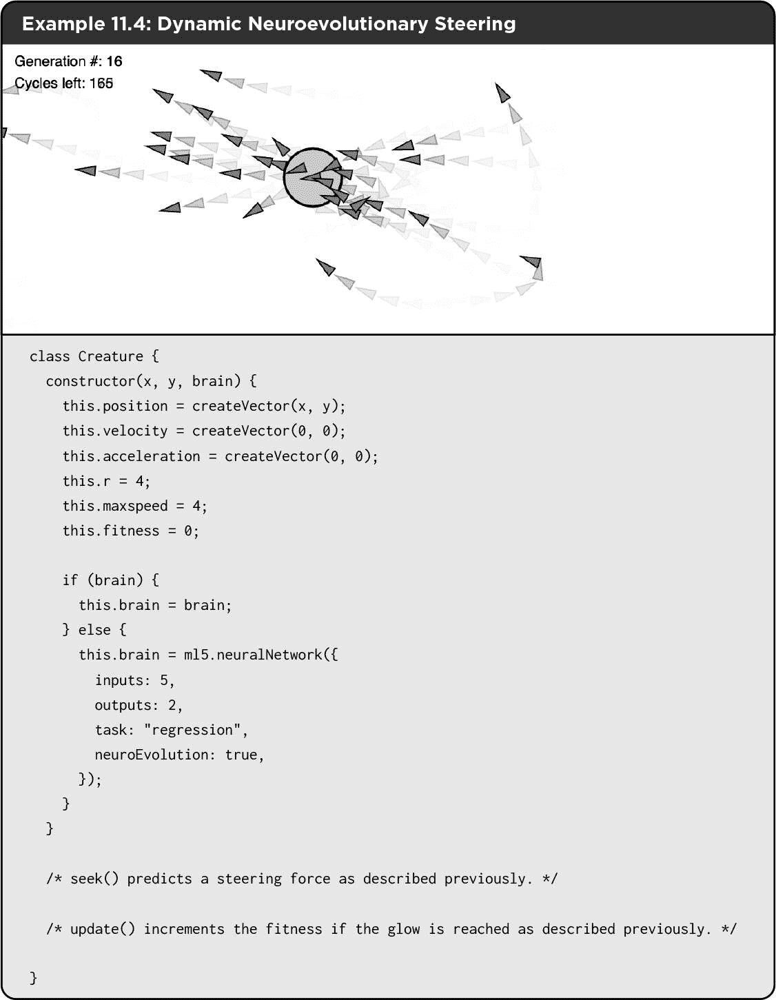

难以置信，但这本书的创作历程已经超过了 10 年。感谢亲爱的读者，感谢你一直陪伴。相信我，这不是一个无限循环。尽管它看起来像是在随意漫步，但我最终通过一个到达引导行为，达到了谜题的最后一块拼图，这是我试图将所有过去的探索汇聚到我自己版本的生态系统项目中的努力。

### **神经进化生态系统**

本章中的一些元素与我模拟自然生态系统的梦想不太契合。第一个问题可以追溯到我在第九章中提出的关于 bloop 生物的问题。一种所有生物共同生活和死亡、每一代都完全从头开始的生物系统——这并不是生物世界的运作方式！我想在本章的神经进化背景下重新审视这个困境。

第二点，可能更为重要的是，我从场景中提取特征以训练模型的方式存在一个重大缺陷。示例 11.4 中的生物是全知的。当然，合理的假设是生物能够感知其当前的速度，但我也允许每个生物知道光源的确切位置，无论它距离多远，或者有任何障碍物阻挡生物的视野或感官。这是远远不够的。它违背了我在第五章中介绍的自治代理的主要原则之一：一个代理应该具有*有限*的感知其环境的能力。

#### **感知环境**

模拟现实世界中的生物（或机器人）对其周围环境的有限感知的一种常见方法是为代理附加**传感器**。回想一下本章开头迷宫中的那只老鼠（希望它在通过奶酪作为奖励后过得很好），现在想象它必须在黑暗中穿越迷宫。它的触须可能充当接近传感器，来探测墙壁和转弯。老鼠的触须无法看到整个迷宫，只能感知周围的即时环境。另一个传感器的例子是蝙蝠利用回声定位导航，或者在弯曲的道路上，司机只能看到车前灯照射到的区域。

我想在这个触须（或更正式地说是*振须*）的概念上进一步发展，这种触须存在于老鼠、猫以及其他哺乳动物身上。在现实世界中，动物利用它们的振须来导航并探测附近的物体，特别是在黑暗或障碍重重的环境中（参见图 11.5）。我该如何将触须般的传感器附加到我的神经进化寻求生物上呢？

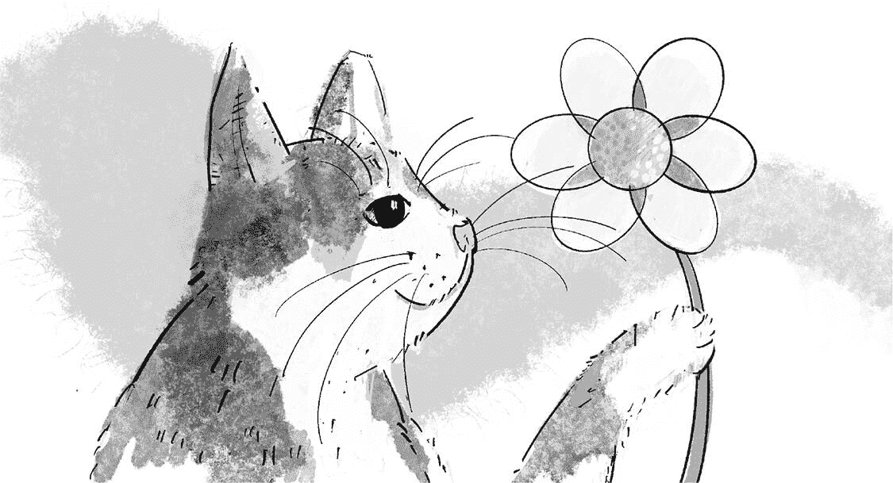

图 11.5：猫咪 Clawdius 用它的触须感知环境

我将保留通用类名`Creature`，但现在将其视为来自第九章的类似变形虫的“bloop”生物，增强了从其中心向四面八方发射的触须感应器：

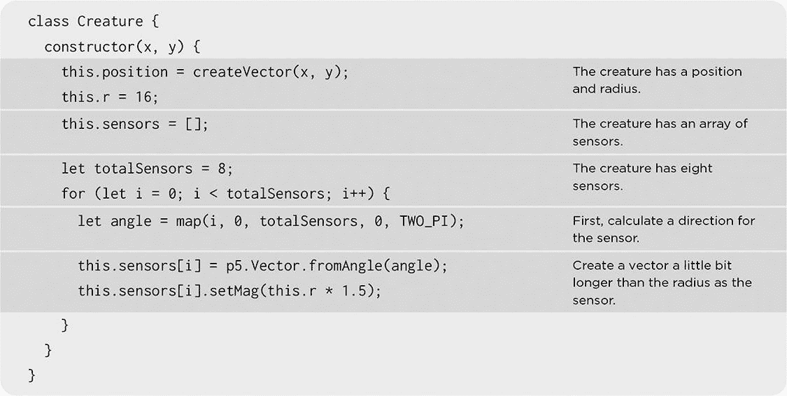

代码创建了一系列向量，每个向量描述了一个附加到生物上的触须传感器的方向和长度。然而，仅仅有向量是不够的。我希望传感器还包括一个`value`，这是它感知的数值表示。这个`value`可以类比于触觉的强度。就像猫咪 Clawdius 的触须可能感知到远处物体的轻微触碰，或者较近物体的强力推送，虚拟传感器的数值也可以反映接近度。

在我进一步讲解之前，我需要给这些生物提供一些感知的内容。如何为它们设计一个`Food`类，用来描述生物想要寻找的美味圆圈？每个`Food`对象将有一个位置和一个半径：

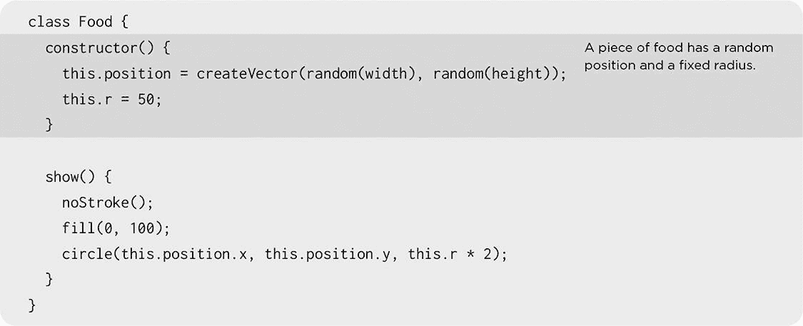

我怎么判断一个生物的传感器是否接触到食物呢？一种方法可能是使用**射线投射**。这种技术通常用于计算机图形学中，将直线（通常代表光束）从场景中的起点投射出去，以确定它们与哪些物体相交。射线投射对于可见性和碰撞检测非常有用，这正是我在这里做的！

射线投射（raycasting）虽然提供了一个稳健的解决方案，但它需要比我想在这里深入讨论的更多数学知识。对于感兴趣的人，可以在 Coding Train 网站的编码挑战#145 中找到解释和实现 (*[`thecodingtrain.com/raycasting`](https://thecodingtrain.com/raycasting)*)。对于这个例子，我将选择一个更简单的方法，检查传感器的端点是否位于食物圆圈内（见图 11.6）。

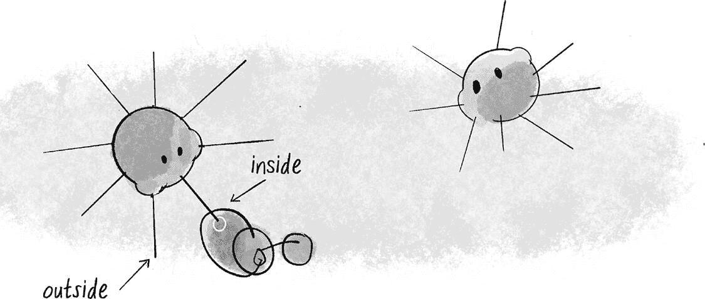

图 11.6：传感器的端点是否在食物内外，取决于它与食物中心的距离。

因为我希望传感器能够存储它的感知值以及感知算法，所以将这些元素封装到一个`Sensor`类中是有意义的：

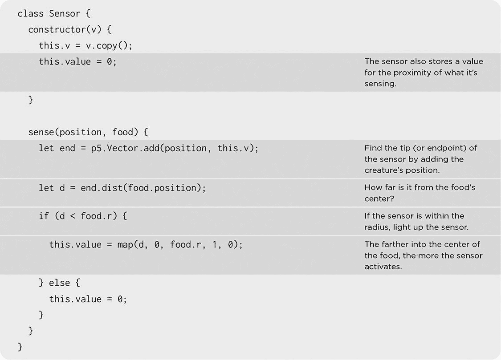

请注意，感知机制通过使用`map()`函数来衡量端点在食物半径内的深度。当传感器的端点刚好接触到食物的外边界时，`value`的值为 0。当端点逐渐接近食物中心时，`value`增加，最大值为 1。如果传感器完全没有接触食物，`value`保持为 0。这种反馈的梯度反映了现实世界中接触或压力的强度变化。

让我们通过一个简单的例子来测试这种传感器机制：一个由鼠标控制的 blooper 和一个放在画布中心的食物。当传感器接触到食物时，它们会亮起，并随着它们接近食物中心而变得更亮。

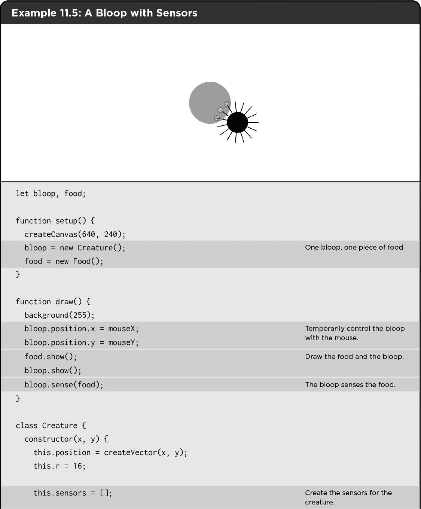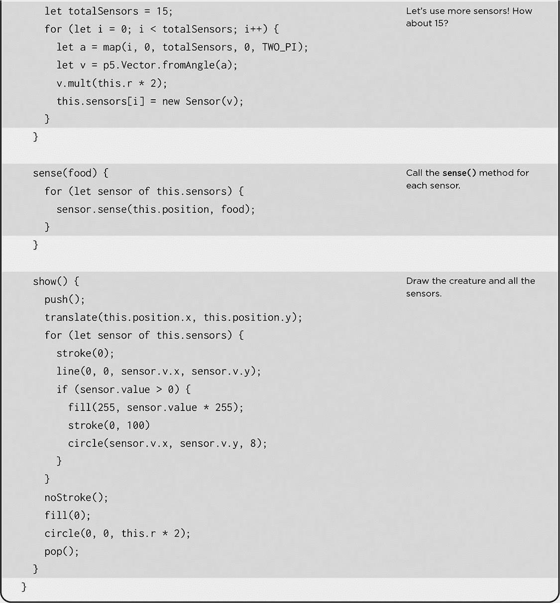

在这个例子中，生物的传感器以从中心延伸出去的线条形式绘制。当传感器探测到某物时（即`value`大于 0 时），一个圆圈会出现。为了可视化传感器读取的强度，我使用`value`来设置其透明度。

#### **从传感器中学习**

你在想我在想什么吗？如果一个生物的传感器的值是神经网络的输入呢？假设我重新赋予生物控制自己动作的能力，我可以编写一个新的`think()`方法，通过神经网络大脑处理传感器的值并输出转向力，就像前两个转向的例子一样：

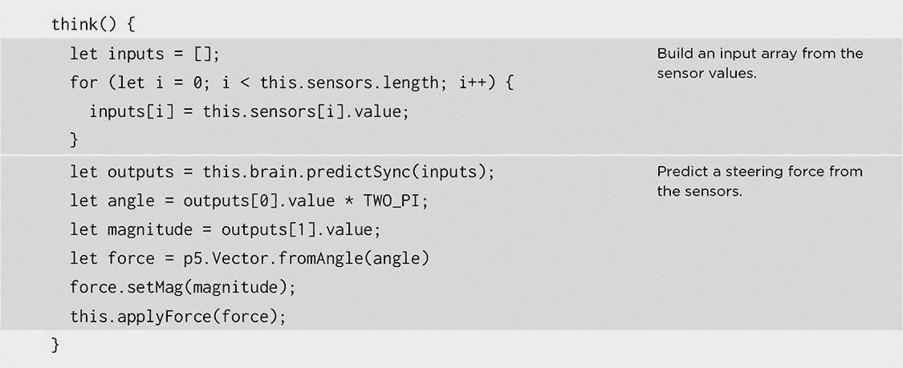

逻辑上的下一步可能是将所有常见的 GA（遗传算法）部分融入其中，编写一个适应度函数（每个生物吃了多少食物？），并在固定的世代时间后进行选择。但这是一个很好的机会，可以重新审视连续生态系统的原则，旨在为生物自身创造一个更复杂的环境和潜在行为模式。我将不再为每一代设置固定的生命周期，而是引入第九章的`health`（健康）评分。对于每一次通过`draw()`的周期，每个生物的健康都会稍微下降：

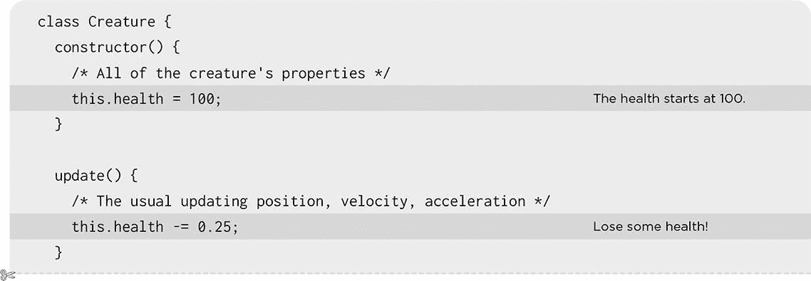

在`draw()`函数中，如果任何 bloop 的健康值降到 0 以下，它会死亡并从`bloops`数组中删除。而对于繁殖，bloop 不再一次性执行常规的交叉和变异，每个健康值大于 0 的 bloop 都有 0.1%的几率进行繁殖：

```
  function draw() {
    for (let i = bloops.length - 1; i >= 0; i--) {
      if (bloops[i].health < 0) {
        bloops.splice(i, 1);
 } else if (random(1) < 0.001) {
        let child = bloops[i].reproduce();
        bloops.push(child);
      }
    }
  }
```

在`reproduce()`函数中，我将使用`copy()`方法（克隆）而不是`crossover()`方法（交配），并采用比平常更高的变异率来帮助引入变异。（我鼓励你考虑使用交叉方法。）这是代码：

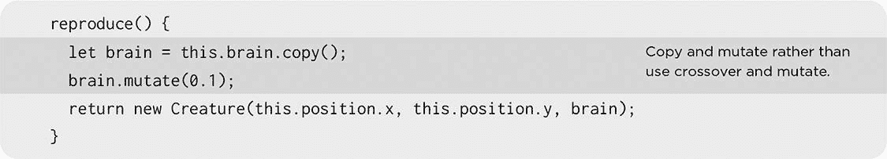

为了使其生效，某些 bloop 应该比其他 bloop 活得更久。通过食物的摄取，它们的健康会提高，从而给它们更多的时间来繁殖。我将在`Creature`类的`eat()`方法中管理这一过程：

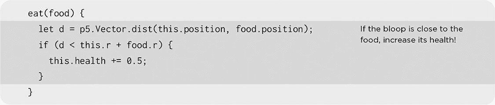

这就足够让系统进化并找到平衡了吗？我可以深入探讨，调整参数和行为，追求最终的进化系统。这个无限的兔子洞具有一种我无法轻易逃脱的魅力，但我将会在自己的时间里去探索。为了本书的目的，我邀请你运行这个示例，进行实验，并得出自己的结论。

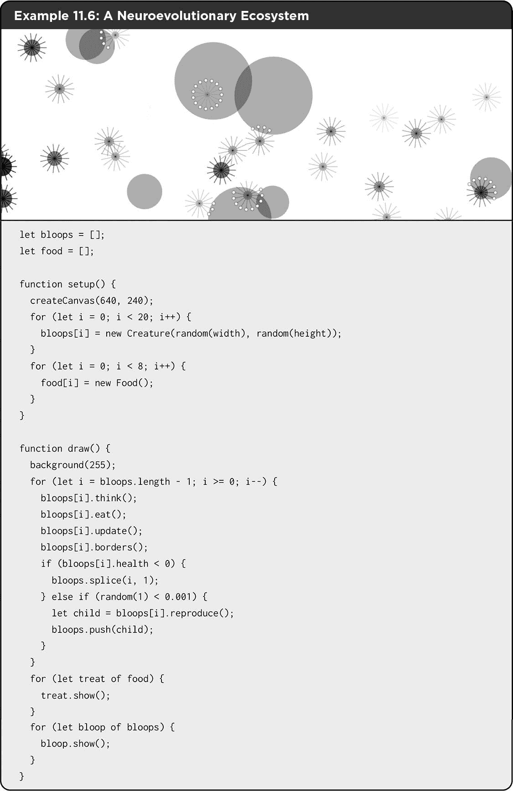

最后的示例还包括一些附加功能，你将在随附的在线代码中找到它们，例如食物数组会随着被吃掉而缩小（当食物耗尽时会重新生成）。此外，随着健康状况的恶化，bloops 也会缩小。

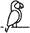 **生态系统项目**

尝试将“大脑”这一概念融入你世界中的生物！

+   不同的生物是否有不同的目标和动机？有些生物是否在寻找食物，而其他生物则寻求不同的资源？那么，避开掠食者或毒药等危险的生物呢？

+   每个生物的输入和输出是什么？

+   这些生物如何感知世界？它们是否能看到一切，还是仅限于某些传感器的范围？

+   你能采取哪些策略来建立并维持生态系统中的平衡？

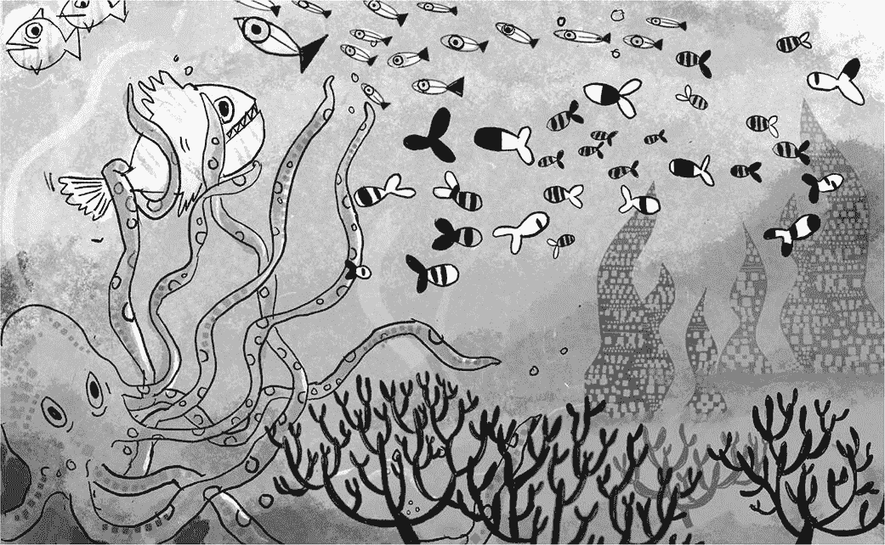

### **结束**

如果您还在阅读，感谢您！您已经读到了本书的结尾。尽管本书包含了大量内容，但我几乎只是触及了我们所居住的物理世界的表面，以及模拟该世界的技术。我希望这本书能作为一个持续进行的项目存在，我也希望继续向本书的网站添加新的教程和示例，并扩展和更新 Coding Train 网站上的配套视频教程。

非常感谢您的反馈，请通过电子邮件与我联系，地址是*(daniel@shiffman.net)*，或通过向 GitHub 仓库贡献代码来与我联系 (*[`github.com/nature-of-code`](https://github.com/nature-of-code)*)，以保持该项目的开源精神。分享您的作品，保持联系，让我们与自然同在。

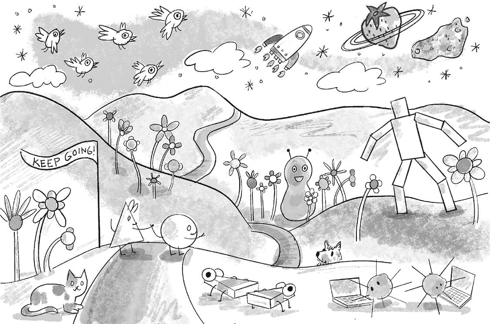
