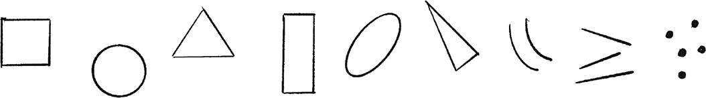
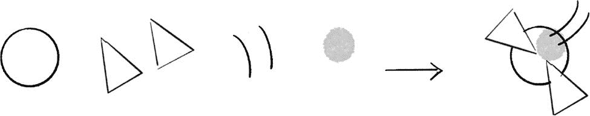
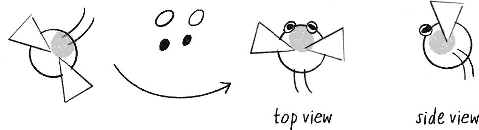
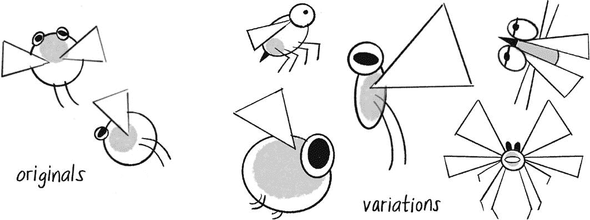
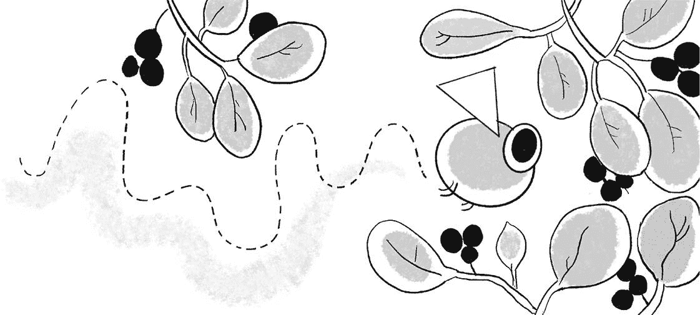

## **附录：生物设计**

*本指南由 Zannah Marsh 编写，她创作了你在这本书中看到的所有插图。*

如果你不确定如何开始生态系统项目中的生物设计任务，或者如果让多种生物在生态系统中共存让你感到有些畏惧，别担心！你可以通过使用一些视觉构建模块，比如基本形状和线条，来开始开发生物，并且可以将它们复用以得到不同的效果。这个设计任务类似于通过复用和重用代码来进行编程。

尽管 p5.js 可以轻松绘制形状和线条，我建议你先用纸和铅笔草绘设计。直接在纸上工作可以帮助你专注于设计，并快速评估和比较不同的版本。你不需要在视觉思考和输入代码之间来回切换。首先在纸上创建你的生物，然后再用代码复制它！

漫画家 Greg Stump 和 David Lasky 建议几乎所有东西都可以用九个元素来绘制；前六个被认为是基础元素，最后三个是附加元素：

+   正方形、圆形和三角形

+   矩形、拉长的椭圆形和高三角形

+   弯曲线、直线和点

开始时在纸上画出这九个元素（见图 A.1）。很简单，对吧？

图 A.1：从九个元素开始你的绘画

现在你可以开始将这些视觉元素组合起来，创建一个生物。你的生物将生活在 p5.js 画布的虚拟空间中，所以你不需要创造一个“真实”的生物；你可以发明一个全新的生物！

这是一个设计方案，对于地球上的居民来说非常熟悉：

+   一个身体

+   一对鳍、翅膀、手臂或腿

六种基本形状中的任何一种都可以作为角色的身体。图 A.2 中的极简例子就符合这个标准。

图 A.2：绘制一个简单的生物

你可能想让你的设计保持简单，就停在那里！但在你开始用代码重新创建你的图形之前，考虑一下你对生态系统的视角或视图。你是从上方看这个场景，就像在看一个池塘吗？还是从旁边看，穿越草地，或者进入一片森林？（想象一下顶视角的游戏和横版滚动游戏。）

生物的朝向也很重要，特别是当你要让它在场景中移动时。在图 A.2 中，这两条弯曲的线是代表腿还是触角？大多数生物是朝着头部方向移动的。但在这个例子中，头部在哪里？重新利用基本形状和附加元素来添加特征——例如嘴巴、眼睛、鼻子、耳朵、尾巴、触角和角——来明确你的生物朝向，就像在图 A.3 中所示。

图 A.3：添加细节以指示朝向

我们喜欢这些画吗？它们完美吗？嗯，也许不是。但*不要*擦掉你的作品，即使你不喜欢它。你将需要所有的画作为数据点，在迭代角色时进行参考。把生物设计看作是安排视觉元素的过程，并观察它们如何让你产生感受——你如何回应它们，以及它们给你带来了什么启示。

你可能会从非常简单的生物开始。然后，随着你向生态系统中添加更多元素，你会实现行为和互动。修改你生物的外观可以帮助你在视觉上组织和强调这些行为和互动——甚至可能激发它们。

尝试改变这些元素，如图 A.4 所示：

+   身体的大小、圆形或狭长形状

+   腿或翅膀的长度、形状或数量，以及它们之间的角度和距离

图 A.4：通过改变形状的各个方面来修改你的生物

想象一个熟悉的环境可能会有所帮助——比如草地、湖底，或者一个阴凉的热带树顶。例如，这些环境中可能需要什么特征呢？大眼睛？大翅膀？长而窄的身体？圆形、上下浮动的形状？伪装的图案？

在你草图的时候，你可能会发现你的生物的*形态*暗示了一种*行为或感觉*——这种行为或感觉你可以在代码中实现。你的生物是快速穿梭、爬行还是缓慢漂浮？它有一个大嘴巴可以吞下大餐，还是有一个小嘴巴来啃食小东西？它有巨大的眼睛来寻找美味的小吃，如图 A.5 所示，还是用来发现正在寻找小吃的捕食者？让你的画作激发你的代码，反之亦然。

图 A.5：将你生物的形态与环境相匹配

当你准备好用代码构建你的生物时，像 `translate()`、`rotate()`、`push()` 和 `pop()` 这样的函数将是你的好朋友，因为所有的角色特征都是相互关联的。记住，面向对象编程（OOP）当然能为你节省时间和麻烦。你可以快速地重用和修改模式。

从简单的开始，慢慢构建。这里有一些最后的建议，尤其是如果你有一段时间没有尝试画画的话：

+   就像我们很多人一样，你可能小时候喜欢画画，但当技能无法跟上想法时就放弃了。把这些画当作实验来进行吧！在探索过程中，没有对错之分。通过在废纸上画画，降低失败的风险。

+   如果你在开始之前感到紧张，通过在纸上画一些涂鸦或螺旋图形来放松自己。这就像运动前的热身一样；艺术家们也会做热身！

+   有很多出色的数字绘图工具可供使用，但要小心那些容易擦除和无尽的“撤销”功能。如果你把所有不喜欢的部分都擦掉，你就无法对比和学习。

所以，拿起笔和废纸，开始画画，准备好遇见一些生物吧！
