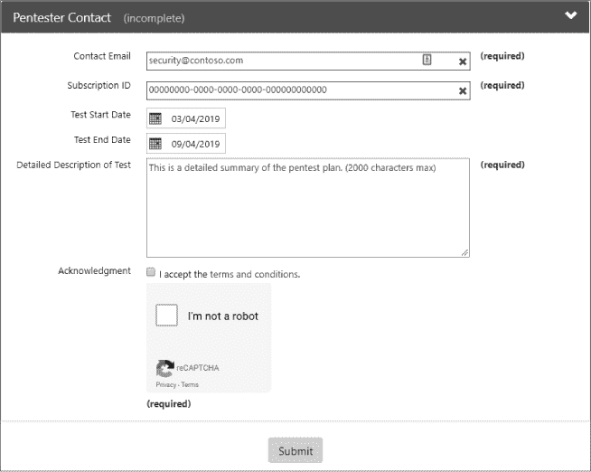

## 1

**准备工作**

规划、启动会议、合同。听起来有点平凡，对吧？我想不到有哪位渗透测试员会更喜欢工作中的文书部分而不是黑客部分。话虽如此，一些准备工作对于成功完成测试并避免陷入麻烦是必不可少的。如果没有适当的规划和通知，你的渗透测试可能会违反法律或法律协议，最终可能会结束你的信息安全职业生涯。我保证，少量的前期工作可以快速完成，并且会导致更高质量的渗透测试，这将巩固你在顶级安全专家中的地位——所以，朋友，继续阅读吧！

本章将重点介绍正确设计和启动云聚焦渗透测试所需的步骤。我们将从考虑项目范围应包括哪些内容以及为什么在涉及云服务（如 Azure）时，范围设定比以往任何时候都更重要开始。之后，我们将继续讨论获取许可和一些需要遵循的重要规则。

### 混合方法

随着越来越多的公司将其 IT 基础设施的一部分迁移到云端，区分内部应用与面向公众的服务变得越来越困难。作为一名在云计算公司工作的专业渗透测试员，我见过很多请求来评估一个新的云部署。每当我看到这样的请求时，我总是推动扩大测试范围，涵盖云部分及任何相关的本地组件，包括非云数据存储、为从事云项目的员工创建的用户账户、员工工作站和测试环境。

当我被允许查看一个团队的内部、外部和基于云的资产时，项目结束时发现的问题数量似乎呈指数级增长——有几个原因。

#### *团队并不总是拥有云计算经验*

对于许多 IT 专业人士和软件工程师来说，云计算是一个全新的世界。当然，许多服务看起来与以前公司内部运行的服务相似，但许多行为与用户习惯有所不同。当这些差异被忽视或误解时，可能会导致攻击者能够利用的漏洞。

此外，1990 年代和 2000 年代最常见的安全架构是将所有内容放在受信任的内部网络上，然后在周围设置所有的安全防护。这种布局看起来很像古老的城堡——就像城堡一样，随着技术的变化，它已经变得过时。当一半的服务都放在连接到互联网的共享服务器上时，周界安全就不再有效了。

为云环境设计安全是可能的，但这需要规划、前瞻性思维和经验，而许多工程师尚未具备这些知识。在缺乏这些知识的情况下，通常会遇到各种不完善的云部署。

#### *云默认情况下相对安全*

这在一本关于云服务渗透测试的书中看起来可能有些奇怪，但事实是：云默认情况下是相当安全的。当客户访问云服务提供商的门户并点击创建虚拟机（VM）的步骤时，生成的系统通常是被锁定的。提供商有基础镜像，其中包含已启用防火墙、预装防病毒软件和仅有一个管理员。作为渗透测试人员，这意味着如果要求您限制范围仅限于一个云托管服务器，并且不能包含测试中的其他内容，您可能会失败。只有扩展范围后，事情才变得有趣起来。

例如，也许该虚拟机的管理员在多个地方重复使用他们的密码。也许他们会点击钓鱼邮件。我个人最喜欢的是，管理员将用于连接到云平台的密码留在网络共享的文本文件中。问题在于，如果范围仅限于该云虚拟机，您无法测试其中任何内容。这种范围有限的评估会给请求测试的人错误的印象，即他们的云资产是无法渗透的。实际上，黑帽（恶意）攻击者会使用这些方法之一来获取所需的访问权限。

#### *一切都相互连接*

如约翰·邓恩提醒我们的那样，“没有人是孤岛”。换句话说，所有人类都是相互连接的。我们的企业网络、云服务和互联网也是如此。在我的测试中，我经常会利用企业工作站上的立足点来访问云服务。一旦进入云服务，我会找到一些能让我访问之前不知道或无法破解的其他企业资源的东西。利用这些链接是你的优势；一个真正的攻击者不会犹豫地这样做。

### 获得许可

确定评估范围后，下一步是获取所需的许可。毕竟，没有许可，渗透测试可能会被视为黑帽黑客行为。我不希望您被起诉、被解雇或进监狱！因此，遵循本节讨论的步骤非常重要。

#### *确定评估范围*

确定一个详细的*范围*，明确指定将会被攻击的系统、将要使用的方法以及评估将何时进行，并获得所有当事方的批准，对于任何渗透测试都是至关重要的。在传统的本地评估过程中，这一点非常重要，因为您可能不想浪费时间攻击即将在本周末被淘汰的一堆服务器，也不想让已知存在问题正在修复中的一个生产服务器停机。

也就是说，确定一个带有云组件的渗透测试范围是*极其*重要的。相比于在企业网络中工作时，你可能只会（直接）影响目标组织，在云环境中，范围规划不当可能会导致攻击波及到同一云服务提供商的其他客户，甚至是服务提供商本身！想象一下，发现你认为属于公司 Azure 订阅的互联网协议（IP）地址实际上是某个外国国家的外交部在使用——而且你刚刚发现并利用了他们系统中的一个漏洞。这听起来像是一起国际事件的开始，我当然非常希望避免这种情况。

因此，我建议放弃*黑箱测试*（测试人员在测试开始时对目标知之甚少或毫无了解）。相反，要求采取更开放的方法，至少向你提供以下内容：

+   目标订阅标识符

+   你要攻击的服务的任何 IP 地址或主机名

+   订阅中服务类型的列表以及它们映射到的 IP 地址

+   参与的目标和期望结果

**警告**

*某些服务会为你的目标分配专用的 IP 地址，但其他服务可能会在相同的基础设施上与多个客户共享这些地址。如果对这些 IP 地址进行广泛扫描将是明显的规则违反行为。*

在制定测试范围时，另一个重要的考虑因素是组织政策。对于外部测试人员来说，这包括你所在公司和目标组织的规则。一些大公司有内部程序，规定在安全测试中哪些内容是禁止的（有时也会规定哪些内容*必须*包括）。违反这些规定可能会导致你失去工作，甚至更糟。如果你发现某个方法或服务是禁止的，但你认为它对准确评估至关重要，请确保向管理层、公司律师和政策制定者提出你的担忧。你可能会得到豁免；最坏的情况是，你可以在最终报告中记录并解释这一遗漏。

#### *通知微软*

一旦范围确定，你可能需要云服务提供商的许可——在我们的案例中是微软。每个提供商都有一套规则，限制允许进行的渗透测试类型以及是否需要通知。微软实际上在允许客户对自己订阅的资源进行渗透测试方面相对宽松，但它确实希望提前通知。这也是为什么在云中黑箱测试不太实际的另一个原因：Azure 渗透测试通知表单要求提供一些评估细节，而这些细节在黑箱测试开始时是无法预知的。

**警告**

*云服务提供商的规则和要求随时可能发生变化。请始终检查提供商的网站以获取最新的政策。*

截至本文撰写时，建议提交通知表单并收到微软的确认，尽管这不是强制性的。使用商业漏洞扫描器，如 Qualys 的漏洞管理工具或 Tenable 的 Nessus 进行扫描时，无需任何正式通知。此外，如果只是扫描开放网页应用程序安全项目（OWASP）十大网络漏洞、进行模糊测试或对少数资源进行端口扫描，则可以不提交表单。对于所有其他测试，最好提交通知。

要提交通知表单，请访问 *[`portal.msrc.microsoft.com/en-us/engage/pentest`](https://portal.msrc.microsoft.com/en-us/engage/pentest)* 并提供以下信息：

+   用于登录 Azure 的电子邮件帐户

+   订阅 ID

+   联系信息

+   测试开始和结束日期

+   测试描述

+   条款和条件的确认

图 1-1 显示了此表单的示例。请注意，渗透测试的时间最长为六个月。对于更长的测试，表单需要重新提交。

*图 1-1：Azure 渗透测试通知表单*

表单还要求您确认并接受测试条款和条件。微软在 *[`portal.msrc.microsoft.com/en-us/engage/pentest#pentestterms`](https://portal.msrc.microsoft.com/en-us/engage/pentest#pentestterms)* 上发布了 Azure 渗透测试规则。以下是这些规则的一些要点：

**仅测试您已明确获得测试权限的订阅。**

仅对您或您的公司拥有的订阅进行测试，或者您已获得所有者明确许可的订阅进行测试。这个规则很容易遵守。只需确保有一个明确的范围协议，将测试范围通过表单发送给 Azure 安全团队，并遵循它！

**仅执行您在表单中描述的测试。**

在评估过程中，通常会有诱惑将新资源纳入范围，当您发现以前不知道的系统或服务时（这通常被称为*范围蔓延*）。然而，如果您没有提交更新的通知表单，这将给您带来麻烦。同样，不要急于使用刚找到的新工具；首先提供通知。

**不要以微软或其他客户的服务为目标。**

在编写范围文档时，您非常精确地仅列出了目标的资产，对吧？如果是这样，应该不会有问题。只需记住，在云环境中，资源可能是流动的：服务器可能是共享的，IP 地址也可能发生变化。如果有疑问，在继续之前，请确认目标是由您的雇主拥有，并再次检查是否已收到微软的确认。

**警告**

*对于平台即服务（PaaS）资源，如 Azure Web Apps，底层服务器可能为多个客户托管网站，因此不允许进行基于主机的攻击。这也是为什么在云环境中，确定攻击范围比在本地环境中要复杂得多的原因。*

**如果你发现了 Azure 本身的漏洞，请向微软报告。**

微软对最后这一点相当严格——你必须在 24 小时内报告任何已识别的 Azure Fabric 漏洞，并且在 90 天内不得将其泄露到其他地方。不过，也有一个亮点：你可以将这些发现提交给微软在线服务漏洞悬赏计划（只要它们符合该计划的要求）。发现此类漏洞意味着需要额外的工作，但也可能带来不错的回报，并获得微软的公开认可。想了解更多关于漏洞悬赏计划的信息，请参阅 *[`technet.microsoft.com/en-us/security/dn800983/`](https://technet.microsoft.com/en-us/security/dn800983/)*。

#### *获得一张“免监禁卡”*

借用桌游*Monopoly*中的一个术语，*免监禁卡*是一份文件，证明你被授权执行渗透测试所涉及的操作。信中应清楚说明测试人员是谁、你被授权执行的活动范围以及测试的开始和结束日期。信件应由渗透测试负责人、被评估公司的一位高级经理以及（如果渗透测试员是外部人员）执行测试的公司的经理签署。理想情况下，信中还应包含一些验证其合法性而非伪造的手段，例如经理的联系信息。（我听说过一些测试人员实际上携带着伪造和合法的信件，以确保有程序可以验证潜在攻击者的言辞。）

如果渗透测试人员被企业安全人员或蓝队成员询问，可以出示这封信。必要时，也可以出示给执法人员，尽管不要被名字误导——如果你被拘留，警察不太可能仅凭此文件就将你释放。虽然这些信件在评估物理安全时最为有用，但即使物理评估不在测试范围内，我也喜欢准备一封。这能证明我所采取的行动是被授权的，即使一颗流星不幸在我管理层参加外部会议时将他们压垮，我也能证明我上周的黑客行为不是恶意的。

如果你需要一个模板信函，渗透测试专家和 SANS 讲师 Ed Skoudis 在他的网站上提供了一个，地址是 *[`www.counterhack.net/permission_memo.html`](http://www.counterhack.net/permission_memo.html)*。Ed 还给他的学生提供了这个非常好的建议：让你的律师审查你的信函（以及任何与渗透测试相关的合同和协议）。对于一个组织在一个地方有效的做法，可能并不适用于你。如果你是公司内部的渗透测试员，你公司的法律团队可以提供帮助。如果你是独立承包商，请聘请律师为你提供法律支持。黑客攻击（即使是经过许可的）也是一项高风险的工作。

#### *注意并尊重当地法律*

说到咨询律师，与你的法律顾问合作，确定是否有任何国家、地区或地方的法律可能限制你在渗透测试中可以执行的活动，或者是否需要特别关注某些服务器或数据类型。例如，一些规定要求在财务或医疗记录被不当访问时，必须通知客户或患者。渗透测试者的访问是否需要符合这些披露要求？向律师咨询总比做出假设要好得多。

此外，不仅要关注渗透测试者的所在地，还要关注目标服务器、目标公司总部和分支机构的位置，以及（如果适用）进行测试的安全公司的位置。因为这些实体所在地的法律可能有所不同，所以了解每个评估地点的规则至关重要。尤其是在审视云资源时，这一点尤为复杂。毕竟，如果在测试过程中，服务器迁移到不同的区域怎么办？可能并不会显现出任何变化，但突然间，目标可能位于一个法律大不相同的国家。在制定测试范围时，一定要与客户讨论这个问题，确保你知道在评估窗口期间，服务可能会驻留在哪些地方。如果客户希望测试一个位于渗透测试法规不友好的国家的系统，客户甚至可能考虑在测试过程中将资源迁移到其他地区。只要确保在迁移过程中不改变服务的配置，否则可能导致错误的测试结果。

### 总结

在这一章中，我讨论了同时测试云服务和公司网络的重要性，以确保最好的覆盖范围。我还讨论了如何在进行渗透测试之前通知或获得所有相关方的许可，以及如何避免触犯刑事司法系统。

接下来，我们将探讨通过一些方法入侵目标的 Azure 订阅。
