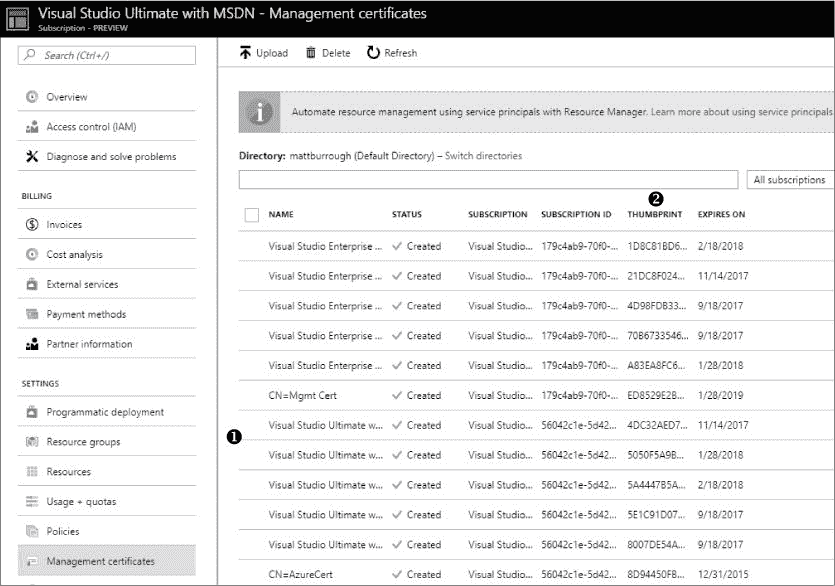
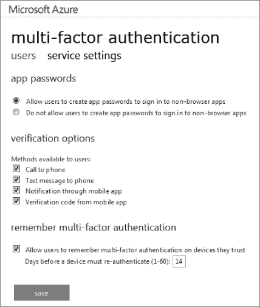

## 第二章：**访问方法**


一旦你手中拿到签署的范围协议并已通知微软，接下来就是获得对目标订阅的特权访问权限。本章重点介绍如何从合法用户或服务获取 Azure 订阅的凭证。我们首先了解 Azure 用来控制订阅访问的不同机制，以及如何管理部署和权限。接下来，我们会讨论常见的 Azure 凭证存放位置，并讲解如何获取它们。最后，我们会讨论可能用于为订阅提供额外保护的双因素认证，并探讨几种绕过它的方法。

### Azure 部署模型

在我们开始嗅探订阅的访问权限之前，让我们先讨论一下 Azure 的两种认证和权限模型。Azure 有一个遗留模型，*Azure 服务管理（ASM）*，它在 Azure 刚发布时被使用，另一个是更近期的基于角色的系统，*Azure 资源管理器（ARM）*。由于这两种模型仍然在使用中，因此了解每种模型的工作原理以及如何绕过它们非常重要。

虽然这两种模型可以在任何给定的订阅中共存，但特定订阅中的每个资源仅使用一种模型。因此，如果你通过传统门户进行认证，你将只能看到“经典” Azure 服务。同样，运行较新的 Azure PowerShell 命令通常只会让你访问现代资源。

结果是，黑客攻击一个用户账户可能只会提供对订阅下部分服务的访问权限。因此，尝试渗透目标订阅中的两种模型至关重要，以确保进行完整的测试。

#### *Azure 服务管理*

Azure 服务管理是部署和与 Azure 资源交互的最初设计。有时被称为“Azure 经典版”，ASM 最常与旧版 Azure 管理网站相关联，* [`manage.windowsazure.com/`](https://manage.windowsazure.com/) *。

ASM 包含许多不同的组件，包括以下内容：

+   一个应用程序编程接口（API），用于以编程方式管理资源

+   一组用于查询和与服务交互的 PowerShell 命令

+   用户名/密码认证支持

+   基于 X.509 证书的认证

+   用于控制资源的命令行界面

+   管理网站

每个组件都代表了渗透测试人员的潜在入口点或信息来源。

##### ASM 中的授权

Azure 服务管理模型使用一个简单的授权机制，只有三种可能的角色：*服务管理员*、*帐户管理员*和*共同管理员*。前两个角色每个订阅只能有一个。根据需要，可以将这两个角色分配给同一个用户。

服务管理员是主要的管理帐户。它可以对订阅的服务进行任何更改，并添加用户作为共同管理员。帐户管理员（也称为帐户所有者）可以更改账单详情以及分配给服务管理员角色的帐户，但无法修改服务。共同管理员拥有与服务管理员相同的权限，唯一的例外是无法更改其他用户的角色为服务管理员。

因为共同管理员与服务管理员基本等同，且两者对任何 ASM 创建的资源都有完全控制权，一旦你获得 Azure 订阅的 ASM 访问权限，所有 ASM 资源都完全由你控制。

用户或服务帐户可以使用用户名和密码对 ASM 进行身份验证，也可以使用 X.509 证书进行身份验证。订阅的所有者可以登录管理门户并向订阅添加用户。他们添加的帐户必须是 *Microsoft 帐户（MSA）*，即微软注册的电子邮件地址（以前称为 Live ID，甚至更早时是 Passport），或者是 *Azure Active Directory（AAD）* 中的帐户。添加到订阅后，该用户只需使用其电子邮件地址和为其 MSA 或 AAD 帐户设置的密码进行连接。

基于证书的身份验证是 ASM 特有的，并没有在 ARM 中（直接）实现，本章稍后会讨论。它在 ASM 中被称为*管理证书*，X.509 身份验证最初是为需要与 Azure 进行程序化交互的服务设计的。它也用于直接从 Visual Studio 部署代码到 Azure，并且在使用 PowerShell 管理订阅时，可以用来替代用户名/密码凭据。

这些都是合理的使用案例，理论上，证书在身份验证中应该比密码更安全。毕竟，证书不容易通过钓鱼攻击被用户泄露，不像密码那样容易受到猜测或字典攻击，而且几乎肯定比用户的密码拥有更多的熵。那么，为什么 Azure 不将它们应用到更现代的模型中呢？可能有许多原因，但我在渗透测试中最常遇到的问题是证书的可管理性。

##### ASM 中的证书管理

可管理性是 Azure 管理证书的最大问题。一些管理证书的问题包括确定证书的使用位置、证书名称的重复使用、缺乏吊销列表、存储不当以及不可否认性。

图 2-1 显示了 Azure 的管理证书设置页面，其中包括每个添加到订阅中的证书的详细信息，并允许管理员添加新证书或移除现有证书。



*图 2-1：Azure 管理证书设置*

让我们看看管理这些证书的一些难题，这些问题可能导致安全隐患。

**跨订阅跟踪证书**

当证书被添加到订阅中时，Azure 门户不会告诉你是谁创建了该证书或是谁上传的。（请注意图 2-1 中没有所有者或创建者列。）更为复杂的是，无法查找某个证书在哪些订阅中被授权。这意味着，如果网络防御团队收到某个证书被泄露的警报，他们不一定知道哪些订阅受到了影响。

**名称重用**

名称不当的证书是管理员在维护订阅时面临的另一个问题。由于证书是由各种工具（如 Visual Studio、PowerShell，甚至 Azure 门户本身）自动生成的，不同的证书经常使用相同的名称。例如，图 2-1 显示了多个由 Visual Studio 生成的证书，它们使用相同的名称——“Visual Studio Ultimate” ➊——仅通过指纹 ➋ 区分。

由于每个 Azure 订阅最多可以有 100 个管理证书，名称重用很快会使得确定哪个证书属于谁变得困难。如果管理员被解雇，剩下的管理员如何知道哪些证书必须被删除？

**吊销**

与大多数使用 X.509 证书的系统不同，Azure 并没有为管理证书实现*证书吊销列表（CRLs）*。证书吊销列表会在一个集中位置记录证书何时不再可信，服务可以检查该位置。例如，如果实现了 CRLs，管理员可以发布更新，声明“不再信任证书 X”，所有允许该证书的服务将自动阻止它。没有 CRLs 时，必须手动从每个订阅中删除受损的证书。然而，由于无法确定哪些订阅可以使用某个证书，因此常常会发现一些不良证书被无意中留在某些订阅中。

**存储**

管理证书的另一个关键问题是如何妥善、安全地存储证书。由于证书经常由像 Visual Studio 这样的工具生成，这些文件的位置通常是可预测的。事实上，它们常常可以在源代码库和用户的*下载*文件夹中找到，甚至可能直接从管理员计算机上的证书存储中导出。

**不可否认性**

*不可否认性*描述了系统能够明确声明某个操作是由特定用户执行的能力，从而确保该用户无法声称是其他人执行的操作。不可否认性在用户名和密码的使用中最为直观，且密码不应共享这一原则已被广泛认可。不幸的是，用户通常不像对待密码那样重视证书，团队成员常常共享一个证书来访问多个订阅。

这些问题使得管理证书的持续、彻底审核和清理变得困难。孤立的管理证书可能会使订阅易受攻击，遗忘的证书的使用可能长时间不被察觉。

#### *Azure 资源管理器*

在 Azure 最初发布后的几年，微软意识到需要改进 Azure 管理的多个方面。与其将这些更改整合到现有的 ASM 管理门户和 API 中，微软推出了 Azure 资源管理器作为替代。

ARM 最显著的变化是可通过* [`portal.azure.com/`](https://portal.azure.com/)*访问的门户，但这仅仅是模型中最直观的部分。按重要性顺序，ARM 中引入的显著变化包括：

+   基于角色的访问控制

+   移除管理证书

+   增加服务主体

+   能够将一组资源作为一个单元进行管理

+   新的 PowerShell cmdlet

+   快速部署复杂服务的模板

*基于角色的访问控制（RBAC）*为渗透测试人员带来了最大变化。与 ASM 仅提供有限角色不同，ARM 提供了大量角色，这些角色可以在订阅级别和每个资源基础上分配给用户。

最常见的角色包括所有者（完全控制）、贡献者（拥有除更改权限外的所有权利）、读者（只读控制）和用户访问管理员（仅能编辑权限）。其他服务特定角色，如 SQL 数据库贡献者和网站贡献者，允许所有者将数据库管理员的权限限制为仅能访问 SQL 服务器，同时允许网页开发人员仅修改网站。在危害订阅时，理想情况下，你会优先选择针对整个订阅的所有者用户。

另一个重要的变化是增加了*服务主体*。这些帐户类似于本地服务器中的服务帐户——如用于运行 Web 服务器的 Apache 守护进程和互联网信息服务（IIS）帐户。服务主体允许应用程序在与常规用户无关的帐户下运行，并且仍然能够访问其他云资源。例如，一家公司的 Azure 网站可能需要访问 Azure Active Directory（AAD）以查找员工信息。该网站需要某个帐户登录 AAD，但开发人员显然不希望该网站使用他们的用户凭据来执行这些查询。此时就需要使用服务主体。

因为服务主体用于软件、脚本和自动化，这些账户可以使用密码（自动生成并称为“客户端密钥”）或证书进行身份验证，尽管它们的配置和使用与 ASM 管理证书不同。遵循最小权限原则，服务主体通常仅通过 RBAC 被分配足够的访问权限来执行特定任务，因此即使一个服务主体被攻破，也只能提供访问订阅中一小部分资源的权限。

**DEFENDER’S TIP**

因为 ARM 相比 ASM 提供了多个安全优势，你应该将现有的基于 ASM 的服务迁移到 ARM。为此，从 GitHub 下载 MigAz 和 ASM2ARM 工具。微软也发布了几篇关于 ARM 迁移的文章，详见 *[`docs.microsoft.com/en-us/azure/virtual-machines/windows/migration-classic-resource-manager-overview/`](https://docs.microsoft.com/en-us/azure/virtual-machines/windows/migration-classic-resource-manager-overview/)*。

### 获取凭证

作为渗透测试员，我们必须收集凭证，以展示真实攻击者可能会如何利用访问客户资源的权限。我们的目标账户应当是一个能够提供管理员访问权限的账户，能够访问目标的 ASM 资源，拥有订阅中所有 ARM 资源的所有者权限，并且没有启用双因素认证（2FA）。这样的账户将能够创建、查看、修改或删除订阅中的任何服务，并且可以无需响应电话提示即可登录。在 Azure 上找到这样的账户，等同于在 Linux 中找到一个使用默认密码且可以远程登录的 root 账户。

寻找目标账户的第一步是定位一个使用用户名和密码登录的服务账户，并且该账户是目标订阅在 ASM 中的共同管理员。服务账户是理想的选择，因为它们很少启用双因素认证，密码不常更改，且密码经常保存在源代码中。如果没有这样的账户，一个人类管理员用户的账户（例如经理或首席开发人员）也可以，因为他们可能对所有资源拥有完全控制权，即使启用了双因素认证也不例外。作为最后的手段，可以考虑使用管理证书。尽管它们不能提供对 ARM 资源的访问，但通常很容易获得，并且不常更改或删除。

通过调查凭证，你将能够判断客户是否正确保护了这些关键的秘密，如果没有，你可以提供指导，帮助他们安全地保护这些秘密。让我们看看如何尝试获取这些凭证。

### Mimikatz

直接从用户的操作系统中获取凭据，应该是我最喜欢的渗透测试方法之一。这个概念非常简单：即使系统断开了网络，操作系统仍然需要跟踪用户的密码，以完成一些任务，比如验证密码，或者将密码转发给其他系统，这样用户就不必重新输入密码了，比如连接文件服务器时。

多年来，许多用于从操作系统的不同位置提取密码或密码哈希的工具一直存在。早期的工具，如 Cain & Abel，可以从 Windows 安全账户管理器（SAM）文件中提取密码，而 PwDump 也有多个不同版本，使用了不同的提取方法。然而，Benjamin Delpy 发布的 Mimikatz 彻底改变了这一局面，它允许直接从系统的内存中窃取密码。

#### *使用 Mimikatz*

Mimikatz 的主要功能是通过识别 Windows 系统上正在运行的本地安全认证子系统服务（LSASS），连接到该服务，并从其内存中提取秘密。尽管 Mimikatz 能够提取多种类型的秘密，我们这里只关注用户密码。

在使用 Mimikatz 之前，你需要先获得目标管理员使用的系统的管理员权限。在域环境中，这通常并不困难。例如，你可以通过钓鱼攻击终端服务器的管理员，该服务器也被目标用户使用，然后在该服务器上运行 Mimikatz，或者你可以通过社交工程攻击帮助台员工，获取一个在域中所有工作站上都有管理员权限的安全组账户。只需要在任何最近被帮助台处理过的系统上拥有管理员账户，就可以在该系统上执行 Mimikatz，获取帮助台的密码。

一旦你获得了系统的管理员权限，就可以从*[`github.com/gentilkiwi/mimikatz/`](https://github.com/gentilkiwi/mimikatz/)*下载 Mimikatz。如果下载被杀毒软件拦截，完全可以运行一个已经转换为 PowerShell 脚本的版本，该版本作为 PowerSploit 框架的一部分，可以从*[`github.com/PowerShellMafia/PowerSploit/`](https://github.com/PowerShellMafia/PowerSploit/)*下载。你也可以获取 Mimikatz 的源代码，进行一些小的修改，然后重新编译（并重命名二进制文件），以绕过任何基于签名的杀毒软件检测。（Mimikatz 的 GitHub 页面提供了详细的操作步骤。）

现在，在目标系统上启动一个提升权限的命令提示符，并根据操作系统架构执行 32 位或 64 位版本的*mimikatz.exe*。（如果不确定架构，可以运行 wmic OS get OSArchitecture 命令。）

#### *捕获凭据*

要捕获凭据，Mimikatz 需要调试权限。它使用这个权限来读取 LSASS 中的内存。为了赋予它这个权限，在 Mimikatz 提示符下输入 privilege::debug，如下所示：

```
mimikatz # privilege::debug
Privilege '20' OK
```

接下来，执行 sekurlsa::logonpasswords 命令以转储 Mimikatz 可以找到的所有密码和哈希值，如 清单 2-1 所示。

```
mimikatz # sekurlsa::logonpasswords
Authentication Id : 0 ; 249835 (00000000:0003cfeb)
Session           : Interactive from 1
User Name         : Administrator
Domain            : Corporation
Logon Server      : Workstation
Logon Time        : 11/1/2016 11:09:59 PM
SID               : S-1-5-21-2220999950-2000000220-1111191198-1001
        msv :
         [00000003] Primary
         * Username : TargetUser
         * Domain   : Corporation
       ➊ * NTLM     : 92937945b518814341de3f726500d4ff
         * SHA1     : 02726d40f378e716981c4321d60ba3a325ed6a4c
         [00010000] CredentialKeys
         * NTLM     : 92937945b518814341de3f726500d4ff
         * SHA1     : 02726d40f378e716981c4321d60ba3a325ed6a4c
       ➋ tspkg :
         * Username : TargetUser
         * Domain   : Corporation
         * Password : Pa$$w0rd
        wdigest :
         * Username : TargetUser
         * Domain   : Corporation
         * Password : Pa$$w0rd
        kerberos :
         * Username : TargetUser
         * Domain   : Corporation
         * Password : (null)
```

*清单 2-1：使用 Mimikatz 获取密码*

如你在输出中看到的，Mimikatz 成功找到了 TargetUser 的 NTLM 和 SHA1 哈希值 ➊。它还能够在 LSASS 中的 *tspkg* 和 *wdigest* 扩展中找到明文密码（非哈希版本） ➋。

#### *影响成功的因素*

有几个因素会影响 Mimikatz 获取密码的能力。最重要的因素是用户使用的操作系统版本。虽然 Mimikatz 支持从 Windows 2000 到 Windows 10 的所有版本，但较新的 Windows 版本在凭据存储方面有所改进。例如，在 Windows Vista 和 Windows Server 2008 中，即使用户已注销（只要系统未重启），获取明文密码是很常见的。而在 Windows 10 中，虽然仍然可以获取哈希值，但明文密码获取难度较大，仅在用户会话处于活动状态时才能成功获取。此外，Windows 10 企业版中的 Credential Guard 功能启用后，会将这些秘密信息移入一个独立的容器中，更加防范黑客工具的攻击。

Mimikatz 获取凭据的能力还取决于目标系统的配置和安装的应用程序。一些应用程序和 Windows 功能依赖于有一份用户凭据的副本，以便在每次建立远程连接时，用户无需重新输入密码。随着每个新版本的发布，Windows 删除了一些对明文密码的依赖关系，但微软无法控制第三方软件的行为，因此可能需要一段时间才能清除所有内存中的凭据。

Mimikatz 依赖于 Windows 中某些已知存储凭据的位置，且该程序会随着 Windows 的更新而演变。因此，如果目标系统运行的是某个不常见的 Windows 版本（例如技术预览版），Mimikatz 可能无法确定凭据在内存中的存储位置。

**DEFENDER’S TIP**

使用 Credential Guard 是保护用户凭据免受如 Mimikatz 等黑客工具攻击的最佳方法之一，但该功能在 Windows 10 或 Windows Server 2016 之前的操作系统中不可用。对于攻击者来说，这是一个最令人沮丧的安全功能。你可以通过访问 *[`technet.microsoft.com/en-us/itpro/windows/keep-secure/credential-guard/`](https://technet.microsoft.com/en-us/itpro/windows/keep-secure/credential-guard/)* 了解更多关于此 Windows 功能的信息。

### 最佳实践：用户名和密码

尽管密码已经使用了几十年，但弱密码选择仍然是安全漏洞的一个主要因素。虽然让所有用户都选择强密码可能很困难，但管理员和公司政策制定者可以通过消除导致弱密码构造的规则来帮助支持用户做出更好的密码选择。

例如，传统观点认为公司应该强制实施短期密码有效期，以便用户每隔几个月就需要更换密码。尽管这种做法确实有助于防止长密码的哈希破解，但这也意味着用户需要每年多次想出一个新的、复杂的密码，并且这个密码不基于过去使用的密码，而是能够记住的。实际上，这往往导致用户选择的密码仅勉强满足公司对密码长度的要求，并且包含一些可以预测的元素，如字典词汇或日期。

相反，美国国家标准与技术研究院（NIST）2017 年的《数字身份指南》现在建议不要强制频繁更改密码，以便让用户能够创建一个非常强大的密码并保持较长时间。该指南建议只有在凭证被确定已被泄露时，才强制要求更改密码。

公司还可以鼓励用户使用合适的密码管理器来生成和存储凭证。这些工具帮助确保用户为他们使用的每个系统、服务或网站选择强大且随机的密码。这大大提高了安全性，因为跨多个站点的密码重复使用意味着，如果任何一个站点被攻破，用户在其他服务中使用相同密码的安全性也会受到威胁。

此外，即使是强密码，如果用户容易受到钓鱼攻击，密码仍然可能被获取（更多内容请参见“钓鱼攻击”一节，第 19 页）。阻止钓鱼攻击的最有效方法之一是为服务启用多因素认证，例如要求用户在输入密码的同时，还需要输入从手机设备收到的验证码。这大大增加了攻击者发起攻击的复杂性。

最后，我们知道，使用基于密码的身份验证的面向网络的服务，常常成为密码猜测攻击的目标，正如在“猜测密码”一节中，第 21 页所描述的那样。为了减少这种风险，确保这些服务的所有管理员账户使用唯一的用户名，因为攻击者通常会尝试一些常见的用户名，如*administrator*、*admin*和*root*。

### 用户名和密码

当 Mimikatz 不可用时，你需要找到另一种方式来获取用户名和密码。这可以通过搜索未加密的文档、钓鱼攻击、查找已保存的认证令牌或利用教育性猜测来实现。每种方法都有其优缺点。

#### *搜索未加密文档*

企业渗透测试人员常常会发现大量密码就这样散落在外，供调查者轻易获取。尽管在一些公司里，贴在显示器上的便签上写着俗气的密码仍然是一个问题，但大多数渗透测试人员无法一间办公室一间办公室地寻找凭证。幸运的是，许多密码保存在未加密的文件中，攻击者可以轻松地远程访问。

如果你的目标是一个服务账户，你通常会在该服务使用的源代码和配置（*.config*）文件中找到该账户的密码。密码也可能出现在团队门户网站或文件共享中的设计文档里。

当你以寻找用户名和密码为目标时，可以在文本文件或电子表格中查找密码，这些文件通常位于用户的桌面或*文档*目录下。（当然，你需要访问该用户的 PC 或网络。）正如你所知道的，浏览器会主动为用户保存密码，而一旦进入系统，这些密码通常很容易恢复。

#### *钓鱼攻击*

一种出人意料的成功获取密码的方法是通过*钓鱼攻击*—或者更准确地说，*鱼叉式钓鱼攻击*。在钓鱼攻击中，你会通过电子邮件联系大量用户，试图欺骗他们采取某些行动，例如通过说服他们访问恶意网站，或者让他们安装恶意软件，从而泄露他们的用户名和密码。

**鱼叉式钓鱼攻击**（Spear phishing）实际上是**钓鱼攻击**（phishing）的一种更有针对性的变种：你通过电子邮件联系一个非常特定的群体，使用对目标来说熟悉的语言，并让邮件看起来像是来自一个合法或预期的地址。例如，通常的钓鱼邮件可能包含一个链接，指向一个所谓的贺卡，并发送给成千上万的用户，而鱼叉式钓鱼邮件可能看起来像是来自人力资源部门，仅发送给十几个人，并要求更新他们的联系方式。

作为一名安全专业人员，根据我的经验，许多鱼叉式钓鱼攻击模仿了用户通常期望的邮件类型，包括某些泄露的公司邮件的风格和语言。这些邮件通常来自一个听起来合法的地址，并包含一个看似合理的 URL 链接。例如，攻击者可能会注册一个与目标公司真实地址非常相近的域名—也许使用*.net*而不是*.com*，或者进行字符替换，例如将大写字母*I*替换为小写字母*l*。

最成功的钓鱼攻击往往利用人们的希望和恐惧。提供某种奖励的邮件，比如免费的活动门票或礼品卡，或者威胁取消某些员工福利或暂停用户账户，几乎总是能得到迅速的回应。

网络钓鱼邮件包含一个链接，旨在诱使用户点击该链接，将用户引导到一个网页，在该网页上用户被提示登录。成功的目标页面看起来与目标用户公司使用的真实页面一模一样。钓鱼页面会将密码保存到攻击者控制的安全日志或数据库中，然后将用户重定向到某个合理的地方，以避免引起怀疑，例如重定向到一个真实的登录页面、一个显示邮件中提到的促销活动已过期的页面，或者一个显示公司重新考虑并决定不再向员工收取复印机使用费的页面。

**警告**

*在设置凭证捕获系统时要格外小心。你应该遵循所有针对钓鱼网站和数据库的安全最佳实践，包括在传输过程中使用加密、静态加密以及使用强大的多因素身份验证来访问秘密。你的网站应进行代码审查以发现缺陷，底层服务/系统应完全修补。未能采取这些预防措施可能会使员工凭证面临更大的风险，违反目标公司政策，并导致实际的安全漏洞。*

然而，钓鱼攻击也不是没有缺点。首先，它只能用来攻击用户，而不是服务帐户。此外，只需一个用户识别出该邮件是钓鱼攻击并进行报告，就能使目标组织的安全团队介入，隔离邮件，列入钓鱼网站黑名单，并重置你已经获得的任何帐户密码。

#### *寻找保存的 ARM 配置文件令牌*

JavaScript 对象表示法（JSON）文件是另一种能够存储凭证的地方。由于开发人员在访问 ARM 资源时经常需要使用不同的帐户（可能是出于自动化或测试的目的），Azure 提供了一个 ARM PowerShell cmdlet，用于将 Azure 凭证保存为*配置文件*：`Save-AzureRmProfile`。这些配置文件只是 JSON 文件，开发人员可以选择将其存储在任何他们喜欢的位置。这些 JSON 文件中包含一个令牌，这是已保存凭证的存储表示。要使用它，只需运行 `Select-AzureRmProfile` cmdlet，并使用 `-Path` 参数指定 JSON 文件即可。

查找这些已保存的配置文件可能有些棘手，因为它们没有独特的扩展名（事实上，它们可以有任何扩展名，尽管大多数用户选择 *.json*，因为文档中使用了这个扩展名）。然而，你应该能够通过搜索包含配置文件中使用的关键字的文件来找到这些配置文件。搜索像*TokenCache*这样的术语，这是文件中存储实际凭证的变量。如果这在目标用户的系统中返回太多误报，可以尝试*Tenant*、*PublishSettingsFileUrl* 和 *ManagementPortalUrl*。这些关键字应该足以定位任何已保存的配置文件，并且误报最少。

#### *猜测密码*

获取账户密码的最终方式之一就是简单地猜测。没有受过教育的猜测不太可能有成果，但结合一些推理和研究，猜测是有可能成功的。

在尝试猜测密码时，首先应尝试找到组织的密码策略。如果所有密码都必须至少包含九个字符，并且包括字母和数字，那么仅仅尝试某人的生日肯定会失败。此外，知道是否有账户锁定政策至关重要，因为它决定了在账户被锁定之前，可以对单个账户进行多少次猜测，从而提醒用户这些尝试。

接下来，尝试收集目标用户的信息。配偶、孩子和宠物的名字非常有用，生日、纪念日和毕业日期也同样重要。甚至知道一个组织要求多久更换一次密码也可能很有用。必须每 30 天更换一次密码的用户常常在密码中使用月份的名字（或其数字等价物），这一点令人不安。

在猜测时，尝试找到一些可以验证用户凭证并快速报告结果的公共端点。企业的 Web 邮件站点和虚拟私人网络（VPN）端点可能是不错的选择。一个不限制登录尝试次数且不锁定用户账户的站点对攻击者来说非常有用。

**防御者提示**

在一定次数的登录尝试失败后实施自动账户锁定是一种流行的应对密码猜测攻击的方法；然而，这可能会导致意外的后果，阻止合法账户持有者在账户解锁之前访问网络资源。因此，基于源机器的 IP 地址或正在测试的账户限制登录尝试的速率，可能是更好的选择。无论采取何种方法，防御这种类型的攻击应当是系统管理员的优先事项。防御团队还应在适用的端点设置监控，以提高对正在发生的攻击的意识。

针对账户锁定策略，*密码喷射*已成为攻击者常用的技术。传统的*暴力破解*尝试会针对少数账户尝试许多不同的密码，而密码喷射则会针对许多不同的账户尝试少数常见的密码：这可以识别出所有使用相同弱密码的账户。即使这些账户没有访问目标资源的权限，它们也可以作为跳板，进入环境以攻击其他系统。这是渗透测试者常用的好方法，可以展示越来越常见的现实世界攻击，同时衡量目标组织的检测和响应能力。

Hydra（黑客之选，THC）是一个非常有用的密码猜测工具。你可以在 *[`github.com/vanhauser-thc/thc-hydra/`](https://github.com/vanhauser-thc/thc-hydra/)* 或 *[`www.thc.org/thc-hydra/`](https://www.thc.org/thc-hydra/)* 找到它。

### 最佳实践：管理证书

管理证书用于编程式地管理经典的基于 ASM 的资源。在 ARM（Azure 资源管理器）中，这是部署 Azure 资源的推荐方式，服务主体取代了管理证书。与管理证书相比，服务主体提供了许多优势——最显著的是能够指定细粒度的权限，从而减少被攻破的账户可能带来的损害。在可能的情况下，放弃管理证书，使用服务主体是更合理的选择。

然而，如果你必须维护现有服务的管理证书，还是有几个步骤可以采取以保护它们。这些步骤包括追踪管理证书的使用位置和所有者，安全存储证书，确保证书仅用于 Azure 管理，并在可能的情况下，逐步淘汰管理证书。

正如我之前提到的，管理管理证书的困难是它们最大的问题之一。我建议对你所有订阅中的证书进行详细的清单记录，包括证书的名称、指纹、所在订阅、以及如果可能的话，创建证书的人或使用证书的人和它们的用途。然后制定一项政策，要求所有新管理证书必须在添加前进行记录，未遵守此政策的证书将被移除。一旦建立了这个清单，定期审计以检查所有订阅中的证书列表是否有变化，并移除不再使用的证书。

此外，为了帮助追踪证书的使用，我建议为所有非自动生成的证书使用唯一的名称。你甚至可以考虑在每次审计时移除所有自动生成的证书——只要确保开发人员知道这是政策，避免他们期望这些证书会保留。

另一个问题是如何妥善保护管理证书。绝不要将证书提交到源代码管理中，因为这样会导致证书过于容易被共享。相反，应将证书像其他凭据一样对待，并将其存放在安全的位置。即便是临时存储私钥在安全性不当的工作站或硬盘中也是不可取的。此外，务必为包含管理证书私钥的*.pfx*文件设置强密码。

另一个常见的错误是将证书用于多个目的，比如使用相同的 SSL/TLS 证书既来保护网站流量，又用来管理托管该网站的订阅。不要这样做！以这种方式重复使用证书不仅容易引起混淆，还意味着如果某个证书在一个地方被泄露，所有使用该证书的系统都会受到影响。Azure 管理证书不需要是复杂、昂贵、被公开信任的证书；一个免费的自签名证书就足够了。

如果可能的话，私钥或密钥对应该在最终使用私钥的系统上生成。如果管理员经常在自己的工作站上为生产系统生成密钥对，那么这些私钥就不必要地暴露在单一系统上，从而使该系统成为一个高价值的攻击目标。

### 查找管理证书

回顾本章之前的内容，除了通过用户名和密码进行用户认证外，ASM 还支持使用证书。在本节中，我们将探讨如何使用证书访问发布设置文件中的管理证书、证书存储、配置文件和云服务包文件。

请记住，Azure 使用的是非对称 X.509 证书，这意味着每个证书都有公钥和私钥。获取证书的私钥部分非常重要，因为这是进行认证所需的组件。

虽然证书可以有多种文件扩展名（当证书没有嵌入其他文件中时，如下一节所述），但在 Windows 上最常见的两个扩展名是*.pfx*和*.cer*。通常，*.cer* 文件仅包含公钥，而 *.pfx* 文件还包含私钥。因此，攻击者通常会在目标机器的文件系统中搜索**.pfx*文件。

如果你发现一个*.pfx*文件被密码保护，可以查看同一目录下的文本文件。用户经常将密码保存在与证书本身位于同一目录中的纯文本文件中！

#### *发布设置文件*

*发布设置*文件是 XML 格式的文档，包含有关 Azure 订阅的详细信息，包括订阅的名称、ID，最重要的是一个 base64 编码的管理证书。这些文件通常可以通过它们那不太简洁的扩展名*.publishsettings*来识别。

发布设置文件旨在简化开发人员将项目部署到 Azure 的过程。例如，在 Visual Studio 中创建一个 Azure 网站后，发布向导会接受一个发布设置文件，用于认证到 Azure 并将解决方案推送到云端。由于这些文件是从 Azure 管理门户下载的，并且通常在 Visual Studio 中使用，因此它们通常可以在用户的*下载*目录中找到，或者与 Visual Studio 项目文件一起保存。

一旦你拥有发布设置文件，打开它并用文本编辑器查看，复制*ManagementCertificate*部分中引号之间的所有内容，将其粘贴到一个新文档中，并保存为*.pfx*扩展名的文件。请注意，这个*.pfx*文件没有密码，所以如果在使用时提示输入密码，只需点击“下一步”或“确定”即可。

#### *重用证书*

重用证书是管理证书的另一个意外来源。一些 IT 专业人员认为证书制作成本高或难以创建，因此他们会在各个地方重复使用相同的证书。（虽然用于面向公众网站的证书应来自受信任的公共证书颁发机构，并且可能需要付费，但自签名证书对于 Azure 管理来说完全足够——而且它们是免费的。）因此，你可能会发现用于公司网站的 SSL/TLS 证书的私钥也被用于公司的 Azure 订阅。

攻击者不能仅通过访问网站来获取网站证书的私钥；相反，必须先入侵 Web 服务器，并且必须破坏证书存储。一旦实现这一点，攻击者需要从服务器中提取证书。遗憾的是，对于渗透测试人员来说，大多数服务器将其证书标记为“不可导出”，这会防止证书被直接复制；然而，Mimikatz 可以提取受保护的证书。

要从服务器提取证书，请从管理员命令提示符运行 Mimikatz，然后执行以下命令：

```
mimikatz # crypto::capi
mimikatz # privilege::debug
mimikatz # crypto::cng
mimikatz # crypto::certificates /systemstore:local_machine /store:my /export
```

前三个命令授予 Mimikatz 访问证书的权限。最后一个命令从本地计算机存储的个人证书文件夹中导出所有证书，并将其保存为当前工作目录中的*.pfx*和*.cer*文件。（有关其他可能的`store`和`systemstore`值的名称，请参见*[`github.com/gentilkiwi/mimikatz/wiki/module-~-crypto/`](https://github.com/gentilkiwi/mimikatz/wiki/module-~-crypto/)*。）

#### *配置文件*

管理证书通常用于部署服务，或者在服务运行在 Azure 中后，供应用程序与资源交互。尽管发布设置文件负责服务部署，配置文件则可供连接到 Azure 服务的应用程序使用。*配置文件* 通常具有 *.config* 扩展名，且最常见的名称是 *app.config*（用于应用程序）或 *web.config*（用于 Web 服务）。配置文件的作用是将服务的详细信息从应用程序的代码中提取出来，并保存在一个用户可编辑的 XML 文件中。这样，如果服务移动或重命名，应用程序就不需要重新编译。例如，应用程序中无需硬编码 SQL 服务器的名称和连接信息，而是可以将这些信息以 XML 格式保存。由于开发人员在这些配置文件中包含了服务器地址和未加密的凭证，这种做法从安全角度来看存在缺陷。

最常见的凭证是用于 Azure SQL 数据库的连接字符串，其中包括明文的用户名和密码。其次常见的是用于与 Azure 存储账户交互的访问密钥，因为应用程序通常需要读取/写入存储中的数据。（我们将在第四章中详细介绍 Azure 存储。）

不太常见的是我们正在寻找的凭证类型：一个 base64 编码的管理证书。由于开发人员可以为配置文件中的变量使用任何名称，管理证书不会总是显而易见，但它们有一些特征，足以让我们识别。它们通常是配置文件中最长的字符串（稍超过 3000 个字符），以大写字母 *M* 开头，通常以一个或两个等号结尾，并且只包含 base64 字符（A–Z, a–z, 0–9, +, / 和 =）。

找到证书后，将其从文件中复制出来，并保存为 *.pfx* 扩展名。因为证书也可以用于与 Azure 无关的目的，所以可以通过查看配置文件中的订阅 ID 来判断。如果你找到了订阅 ID，那么该证书几乎肯定是用于 Azure 管理的，你至少知道一个证书应该有效的订阅。

#### *云服务包*

当开发人员创建一个应用程序并部署到 Azure 时，Visual Studio 会将整个部署打包成一个 *云服务包* (*.cspkg*) 文件。这些文件实际上就是 ZIP 文件，包含特定的元素，包括已编译的代码、配置文件、清单和依赖项。尽管这些文件中有些会有不常见的扩展名，但几乎每个文件都将是一个 ZIP 文件、XML 文件、纯文本文件或已编译的二进制文件。

每当你遇到云服务包时，审查其内容，并尝试在你喜欢的文本编辑器和文件压缩工具中打开嵌套的文件。由于 Azure 中的服务通常会调用其他 Azure 服务（例如，一个从 Azure 存储和 Azure SQL 获取内容的 Azure 网站），你有时会发现管理证书或其他凭证嵌入在.*cspkg*文件中。

### 最佳实践：保护特权账户

特权账户需要得到严格保护，以防止攻击者控制其管理的系统。实现这一目标的有效方法包括使用独立的凭证、凭证保管、特权访问工作站和及时管理。

保护这些凭证最重要的步骤是将其与正常的业务任务（如查看电子邮件和浏览网页）分开。与其为用户的标准账户授予敏感系统的管理权限（或在 Azure 中授予类似 Owner 的高级角色），不如为用户创建一个专门用于服务管理的账户。此外，确保该账户要求强身份验证，即强密码并启用多因素身份验证——或者更好的是，基于智能卡的身份验证。如果该账户使用密码，考虑要求使用安全的密码管理器或保管库，确保密码长度适当，定期更改，并且可审计。

即使实施了这些保护措施，如果在同一台系统上使用该账户进行网页浏览或打开标准账户中的文档，该账户仍然可能被攻破。相反，使用特权访问工作站（PAW）是减少敏感账户暴露的一个好方法，重点保护管理员使用的客户端。PAW 是一个专用的、经过硬化的工作站，管理员通过该工作站访问高价值系统，并且使用的是在其他系统上不使用的账户。

PAW 应该仅能通过特权账户访问；用户不应是本地管理员。此外，PAW 应强制执行预定义的软件和网站白名单，以便只能访问已批准的应用和网站（例如，Azure 门户）。你可以在*[`docs.microsoft.com/en-us/windows-server/identity/securing-privileged-access/privileged-access-workstations/`](https://docs.microsoft.com/en-us/windows-server/identity/securing-privileged-access/privileged-access-workstations/)*了解更多关于 PAW 的信息。

为了进一步减少这些账户被攻破的风险，可以考虑使用 *即时（JIT）管理* 或 *最小权限管理（JEA）*。使用 JIT 时，账户只有在用户需要执行管理任务时才会出现在高度特权的角色中。同样，使用 JEA 时，会仔细审查每个管理员的确切权限和责任，并仅授予执行工作所需的最小权限。Azure 通过使用特权身份管理（PIM）功能来支持 JIT。有关如何配置的更多信息，请参见 *[`docs.microsoft.com/en-us/azure/active-directory/active-directory-privileged-identity-management-configure/`](https://docs.microsoft.com/en-us/azure/active-directory/active-directory-privileged-identity-management-configure/)*。

### 遇到双重身份验证

为了增加防止凭证被窃取的安全性，一些公司采用 *双重身份验证（2FA）*，有时也称为 *多重身份验证（MFA）*。在登录时，用户不仅需要提供他们知道的东西（密码），还需要提供他们拥有的某种东西的证明（例如手机或智能卡）或他们本人的某种东西（生物识别验证）。

Azure 本身支持双重身份验证，管理员可以通过在 图 2-2 中显示的设置启用此功能，该设置可以在经典门户中找到，方法是选择 **Active Directory** 服务，点击 **多重身份验证提供程序**，然后点击 **管理**。



*图 2-2：Azure 多重身份验证设置*

如果启用了 MFA，在使用用户名和密码进行身份验证时，通常会遇到要求提供第二个身份验证因素的提示——通常是以下之一：

+   从用户注册的手机发送的短信验证码

+   来自一次性验证码生成应用（如 Microsoft Authenticator）的验证码

+   用户的智能卡及其关联的个人身份号码（PIN）

+   从已注册的移动应用接收来自用户智能手机的通知确认

+   电话呼叫，可能提供一个验证码或请求确认或 PIN 码

假设你没有用户的移动设备，这可能是一个需要克服的重大障碍。幸运的是，有几种方法可以绕过这个障碍。

#### *使用证书身份验证*

避免 2FA 的一种简单方法是使用管理证书而不是用户名和密码进行 Azure 身份验证。由于证书身份验证通常用于自动化，因此在没有用户输入令牌的情况下，证书通常不需要进行 2FA。尽管这可能是一个很好的选择，但证书仅限于 ASM 访问，因此你可能需要采用不同的绕过方法来访问 ARM 资源。

#### *使用服务主体或服务账户*

另一种尝试绕过 MFA 的方法是获取具有访问目标订阅权限的服务账户的凭证。服务账户通常是由服务用于在 Azure 中以编程方式完成操作，或者由公司中的一组人共享使用。无论是哪种情况，2FA 都不太可能被使用，因为服务没有手机，且群体共享 2FA 令牌也很困难。这意味着服务账户通常可以免除使用第二因素认证。

#### *访问 Cookies*

在 Azure 的多重身份验证设置页面底部，注意到图 2-2 中有一个选项，允许用户将设备标记为可信设备，持续一段时间。这个选项是为了缓解一个常见的关于双因素身份验证的抱怨：输入代码或插入智能卡非常繁琐，特别是在用户频繁登录的系统上。启用此设置后，用户可以在身份验证过程中勾选一个框，停止系统在一段时间内重复要求凭证或 2FA 令牌。此功能通过在用户的网页浏览器中保存带有令牌的 Cookie 来实现，前提是用户已经通过 2FA 成功认证。令牌是一个长且加密的字符串，持有该 Cookie 的用户可以立即访问 Azure。请注意，这种方法并非 Azure 独有，许多网站都采用了类似的方式。

由于 Cookie 存储通常并不是特别安全，渗透测试人员需要做的就是获得用户的工作站访问权限，复制 Cookie，然后将其放入自己系统的浏览器中。通常，这些令牌在不同主机上不会被阻止使用，因此一旦被获取，它们可以在任何地方使用。

获取 Cookie 的方法取决于目标用户选择的网页浏览器以及渗透测试人员对工作站的访问权限。如果渗透测试人员能够在用户的安全上下文中运行代码，导出 Cookie 可以像使用合适的后渗透框架一样简单。别忘了检查用户是否安装了 Cookie 管理器——就像真正的攻击者一样，你可能会发现所有你需要的工具已经安装好了。一些浏览器还会在文件系统中不加密地存储 Cookie，使得它们更容易被获取。

**DEFENDER’S TIP**

许多网站依赖包含加密令牌的 cookie 来验证用户在身份验证后（以及完成 2FA 验证时，如适用）发送的请求。如果没有这些，用户将被频繁要求重新输入凭证。由于这些 cookie 包含了作为该用户发出的请求所需的所有信息，因此不应随意留下它们。为了防止像 Azure Portal 这样的关键网站的 cookie 被窃取，用户在完成管理工作后应尽早退出，并清除他们的 cookie。（在这种情况下，我建议至少清除 *[microsoftonline.com](http://microsoftonline.com)* 和 *[azure.com](http://azure.com)* 域名的 cookie。）另外，大多数浏览器的“隐私”模式也可以使用，因为它们确保这些 cookie 在浏览器关闭后不会持续存在。

#### *通过用户浏览器代理流量*

使用 cookie 的替代方法是通过目标用户的网页浏览器转发 Web 请求，以便这些请求使用用户的会话令牌，并显示为来自他们的计算机。这个方法的操作可能会很复杂：在用户的系统上，您需要运行一个隐蔽的恶意应用程序，该应用程序能够监听来自您系统的请求，通过用户的浏览器转发这些请求，然后获取响应并将其返回给您。幸运的是，这个特定的场景已经集成到 Cobalt Strike 中，这是一款黑客命令与控制工具。

要创建代理，您需要运行一个 Cobalt Strike 服务器，并且将 Cobalt Strike 负载包（称为 Beacon）部署到用户的系统中。从这里，使用 Browser Pivot 命令来创建代理。

现在，代理正在运行，将您的浏览器设置为使用目标系统作为代理服务器。此时，来自您系统的 Web 请求将通过目标用户的浏览器转发（对用户完全不可见）。您的流量将继承用户的会话和凭证，绕过任何提示。使用这种方法可以向组织证明，工作站上的安全问题可能导致云资源的泄露。

**注意**

*您可以在此场景中找到更多详细信息，详见* [`blog.cobaltstrike.com/2013/09/26/browser-pivoting-get-past-two-factor-auth/`](http://blog.cobaltstrike.com/2013/09/26/browser-pivoting-get-past-two-factor-auth/)*。有关 Cobalt Strike 特定的说明，请参见* [`cobaltstrike.com/help-browser-pivoting`](https://cobaltstrike.com/help-browser-pivoting)*。*

**防御者提示**

浏览器代理攻击表明，保护重要服务的需求不仅限于运行它们的系统，而是扩展到整个环境，包括工程师的凭证和工作站。一旦攻击者进入用户的工作站，他们的活动可能很难被检测到，因为网络流量看起来是来自用户的正常计算机。然而，你可能能够检测到将请求和响应从工作站转发到攻击者系统的指挥与控制（C2）回传流量。对于 Web 流量代理攻击，这种流量通常会比正常的 C2 网络活动更大且更频繁。

#### *使用智能卡*

双重身份验证（2FA）的核心理念是，用户在认证过程中提供两项信息来证明自己的身份。第一项通常是密码——用户知道的东西。第二项要么验证“用户拥有的东西”（例如手机），要么验证“用户的身份特征”（例如指纹）。尽管最常见的第二因素是通过身份验证应用或短信验证登录者拥有正确的手机，但这并不是唯一的选择。一些组织使用*智能卡*（内嵌加密芯片的实体卡）来确认用户的身份。因此，如果使用智能卡，那么获取一张智能卡是绕过 2FA 的一个可能方法。有两种方法可以获取用户的智能卡。第一种是控制智能卡当前插入的系统，并从该系统使用它；第二种是物理获取用户的卡片。这两种方法各有其挑战。

如果你已经控制了目标系统，可以利用插入在不同系统中的智能卡。只需使用前一部分讨论的方法通过该主机传递请求即可。困难之处在于，你不仅需要访问目标用户的系统，还必须在用户插入智能卡并且已经输入 PIN 码（即 PIN 码已缓存）后进行请求。

当你窃取用户的物理智能卡时，主要的挑战实际上是如何获取卡片、避免被发现以及确定用户的 PIN 码。为了克服第一个挑战，你必须找到一种方法靠近用户并在他们没有注意到的情况下拿走他们的智能卡。这就引出了第二个问题：大多数用户会注意到他们的卡片不见了，特别是当他们依赖该卡登录计算机时。一些公司的智能卡还兼作员工徽章，并控制进出建筑物的权限，这种情况下，用户更有可能意识到发生了什么，并报告丢失事件。

另一个挑战是智能卡通常需要与之关联的 PIN 才能解锁并用于身份验证。您可以尝试猜测 PIN（例如，使用常见的数字模式或用户的生日），但智能卡可能会在指定的错误 PIN 尝试次数后锁定。更好的方法是直接获取用户的 PIN，例如通过在用户的系统上安装键盘记录器（无论是物理设备还是偷偷安装的应用程序）来尝试捕捉他们输入的 PIN。然而，通常更有效的方法是当智能卡正在使用时，从用户计算机的内存中获取 PIN。

Mimikatz 可以从内存中获取智能卡的 PIN，只要用户已登录，智能卡已插入系统，并且用户已经使用智能卡登录。如果满足这些条件，PIN 将出现在 Mimikatz 的输出中。

**防御者提示**

为了确保智能卡的安全，重要的是将发放智能卡证书的过程与其他基础设施隔离开来。此外，由于通常有许多不同的模板可供选择，且具有不同的敏感级别（例如虚拟智能卡、VPN 证书等），请确保适当地限制哪些模板可以用于满足您的 2FA 要求。对证书操作进行全面的审计、监控和警报。

此外，您必须确保用于连接敏感服务器的系统安全性，例如那些发放智能卡的服务器。在第 26 页的“最佳实践：保护特权账户”中讨论过的使用 PAW 是一种很好的方法，因为 PAW 不用于电子邮件或网页浏览，因此比管理员的主系统更不容易被攻击。

#### *偷窃手机或电话号码*

这可能是所有 2FA 绕过选项中最难的（也是在标准交战规则下最不可能被允许的），但如果您成功了，它的成功率很高。就像智能卡绕过一样，我们再次获得了某种提供身份验证第二因素的东西，只不过这次是用户的手机或控制他们手机号码的权限。

最直接的方法是简单地偷走目标用户的手机。如果 Azure 订阅支持使用短信进行身份验证，那就理想了。因为许多手机操作系统会将短信的第一行作为通知显示在锁屏上，您很可能在不解锁手机的情况下就能获得短信中的 2FA 验证码。当使用身份验证器应用生成的代码时，您需要某种方式猜测或获取手机的解锁码（如果设置了的话）。（这超出了本书的范围。）

另一个选项是获取用户的电话号码并通过短信认证选项进行身份验证。尽管大多数人认为手机及其号码是一个整体，但实际上，手机和号码是松散耦合的。最近的一些报告中，犯罪分子能够假冒客户进入当地手机商店并说服商店为他们提供手机升级（将新手机的账单计入真实客户账户）。因为 Azure 渗透测试员的目标并不是窃取最新的智能手机，另一种策略是告诉店员你更换了手机并需要一张新的用户身份识别模块（SIM）卡。离开商店后，只需将卡插入你的手机并进行认证。

该选项需要使用短信或电话认证，因为即使使用安装有用户电话号码的 SIM 卡，认证应用程序也无法与 2FA 后端注册。这通常需要一个带有额外验证的带外设置过程，以确认执行注册的用户确实是他们所声称的人。

**注意**

*除了可能被视为盗窃并潜在地违反电话提供商的服务条款外，这种做法非常危险。一旦为该用户账户发放了新手机或 SIM 卡，他们的现有号码将被转移至新卡，而用户原来的手机将被停用。大多数用户会在手机无法使用服务时迅速发现这一点，因此一旦盗窃发生，报告事件的时间极其有限。换句话说，你很可能会很快被抓住并从目标订阅中移除。将此选项作为最后手段，并在尝试之前务必咨询你的客户和律师！*

#### *提示用户进行 2FA 认证*

最后，可能通过*社会工程学*手段诱使用户放弃他们的 2FA 令牌，这一过程就是说服用户做出他们通常不会做的事情。这个方法可能是最不可能成功的，因为它依赖于用户没有察觉到异常，因此只有在绝望时才使用。如果用户在手机上设置了需要确认的弹出提醒，那么简单的做法可能就是触发认证请求并观察用户是否接受。虽然不太可能，但有些用户已经习惯于确认提示，即使他们并未预料到出现此类提示。当然，一个聪明的用户可能会将此事件报告给他们的安全团队。

这种方法的一个稍微高级的变体是尝试观察用户的活动，并在他们预期会看到此提示时发送消息。也许你怀疑这个用户总是在上班时登录 Azure 门户，你可以将提示的时机与此同步。或者，可能你注意到他们在咖啡店工作，并能看到他们何时登录，然后在这个时候发送请求。许多用户可能会认为他们的初始授权没有通过，系统可能只是再次提示他们。

如果用户依赖于从短信或身份验证器应用程序中输入代码，仍然有可能获得该代码。实现这一点的两种常见方式是通过钓鱼网站和电话。

为了演示攻击者如何通过钓鱼获取 2FA 代码，你首先需要按照我们在第 19 页中“钓鱼”部分的方式设置一个页面。接下来，你需要修改该网页，使其在提示输入用户名和密码后，要求输入用户的 2FA 代码。由于时间至关重要，你需要设计该页面，使得一旦这些信息提交后，网站会调用你机器上的脚本进行 Azure 身份验证，从而为你提供访问权限。如前面的示例所示，页面应将用户重定向到真实的登录页面，以便他们认为身份验证出现了问题。一旦网站功能正常，你可以像之前一样通过电子邮件发送链接给用户。

获取用户代码的另一种方式是给他们打电话并索要。为了使这种方法有效，你需要使用*借口*，即编造一个听起来合理的电话理由。例如，你可以声称自己是他们 IT 部门的工作人员，因用户数据库中出现数据损坏问题，你需要他们当前的代码来重新启用访问权限。这种方法可能和让你被举报一样有可能获得有效的代码，但它可以作为最后的手段使用。

**防御者提示**

尽管本节中描述的多因素身份验证存在一些弱点，但它仍然是最有效的方式之一，可以延缓或防止攻击者访问订阅。它大大增加了攻击者进行攻击的时间，尤其是当目标订阅的管理证书和服务账户较少时。鉴于 Azure 内置了多因素支持，启用起来相对容易。要开始使用，请访问 *[`azure.microsoft.com/en-us/documentation/articles/multi-factor-authentication/`](https://azure.microsoft.com/en-us/documentation/articles/multi-factor-authentication/)*。

### 总结

在这一章中，我们讨论了两种不同的 Azure 模式——Azure 服务管理和 Azure 资源管理——以及每种模式可能如何影响渗透测试。我演示了获取 Azure 凭据的多种方法，包括从纯文本文档中恢复密码、钓鱼攻击、利用内存，甚至猜测。接着，我们探讨了使用证书进行身份验证以及它们可能存在的位置，比如发布设置文件、证书存储中的回收证书、配置文件和云服务包。最后，我们检查了通过证书、服务账户、被盗的 cookies、被盗的电话号码和社会工程学绕过双因素认证的方法。

通过研究这些访问方法，我们识别了用户可能遗留下来的不再使用的旧凭据。清理这些项目可以减少客户订阅的攻击面。此外，测试账户的弱密码可以帮助在攻击者发现之前找到易受攻击的凭据，同时也可以帮助用户了解如何正确构建密码，前提是客户还没有为除主要用户账户以外的所有账户使用*高熵*（高度随机、不可预测）的计算机生成密码。最后，我们看到，当所有账户都一致使用多因素认证时，非法访问订阅变得更加困难。

在下一章中，你将探讨你在参与过程中所妥协的订阅，并对其中运行的服务进行高层次的了解。
