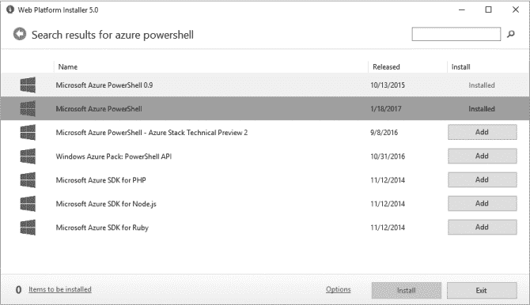
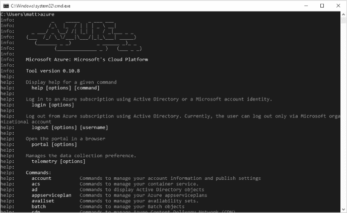

## 第三章：**侦察**


在本章中，我将展示如何搜索订阅中的有用数据，如使用的存储账户、SQL 数据库、虚拟机以及任何网络防火墙。

像其他大型云服务提供商一样，Azure 提供了越来越多的服务，涵盖从网站托管到数据库、密钥存储和机器学习等内容。由于服务种类繁多，很难确定特定客户正在使用哪些服务和功能，以及这些服务是否配置存在漏洞。

在本章中，我将演示如何使用 Azure 的 PowerShell cmdlet 和命令行工具快速检查订阅的内容。我们从在控制台中进行 Azure 身份验证开始。接下来，我们列举订阅的 web 服务，然后列出其虚拟机。然后，我们获取订阅的存储账户及其访问密钥，接着查看任何面向互联网的网络端口和防火墙。最后，我们查看 SQL 服务器和数据库。

通过列举这些服务，你将能够将所有客户的资源纳入渗透测试，确保没有遗漏任何内容。这一点非常重要，因为在请求评估时，客户可能会关注生产服务，却忘记提到测试资源，而这些资源的安全控制可能较为薄弱。同样，记录存储账户的内容有助于客户判断是否遵循了正确的数据分类和存储规范。

在回顾了几个常用 Azure 服务的强大命令后，我将展示一些理想的脚本，用于扫描你所渗透的任何新订阅。

### 安装 PowerShell 和 Azure PowerShell 模块

在开始之前，你需要从 Microsoft 安装一些免费的工具。在 Windows 上，PowerShell 和 Azure PowerShell 模块是收集订阅信息的最直接工具。另一个选择是 Azure 命令行界面（CLI）工具，它适用于 Windows、Linux 和 macOS。

#### *在 Windows 上*

你可以通过两种方式在 Windows 上安装这些工具。如果你想同时拥有 PowerShell cmdlet 和命令行界面，并能够在发布新版本时更新这些工具，可以使用 Microsoft Web Platform Installer (WebPI)。这个小型包管理器让你可以轻松安装多个 Microsoft 工具，包括用于管理 Azure 的工具。WebPI 还会检查是否缺少依赖项，如果你尚未安装 PowerShell，它会自动为你处理。

要使用 WebPI，只需从 *[`www.microsoft.com/web/downloads/platform.aspx`](https://www.microsoft.com/web/downloads/platform.aspx)* 下载安装程序并运行。一旦安装完成，搜索“Web Platform Installer”并启动应用程序。

你可以使用 WebPI 的搜索框来查找 Microsoft Azure PowerShell 和 Microsoft Azure 跨平台命令行工具（参见 图 3-1）。然后点击 **添加** 来下载并安装这些工具。如果返回了多个版本的工具，请选择最新发布的版本。（你可以再次启动 WebPI 来检查软件包的更新情况。）

安装完工具后，关闭任何打开的 PowerShell 和命令行窗口，以确保工具被正确识别。

#### *在 Linux 或 macOS 上*

如果你使用的是 Linux 或 macOS，你需要安装 Azure 命令行跨平台工具包。这个工具包有两个版本——一个是用 Node.js 编写的，另一个是用 Python 编写的。在我的示例中，我使用的是 Node.js 版本，但两个版本的语法类似，所以你可以任选其一。你可以在 *[`github.com/azure/azure-xplat-cli/`](https://github.com/azure/azure-xplat-cli/)* 上找到适用于 macOS 的 DMG 格式和适用于 Linux 的 TAR 格式的 Node.js 版本安装包。Python 版本可以从 *[`github.com/azure/azure-cli/`](https://github.com/azure/azure-cli/)* 下载。你可以像安装其他任何软件包一样安装它们。



*图 3-1：使用微软的 Web 平台安装程序查找和安装 Azure 工具*

#### *运行你的工具*

安装完工具后，启动它们。对于 PowerShell 模块，打开一个 PowerShell 窗口，并在提示符下运行 Import-Module Azure。对于命令行工具，打开一个终端窗口并输入 azure（如果使用 Python 版本，则输入 az）。如果命令行工具安装正确，你应该会看到像 图 3-2 中所示的帮助信息。



*图 3-2：Azure 命令行工具的帮助信息*

到这时，你应该已经拥有了开始连接到 Azure 所需的一切。让我们开始收集关于目标订阅及其服务的信息吧。

### 服务模型

回顾 第二章，微软在 Azure 中使用了两种不同的服务模型，每种模型都有自己的一组命令来查看或更改服务。在本章讨论的每个服务中，我都会提供查询 Azure 资源管理器（ARM）和 Azure 服务管理（ASM）两种模型的语法，除非某个服务仅适用于某一个模型。

PowerShell 模块包含了 ARM 和 ASM 的 cmdlet。为了保持组织性，ASM 服务的命令通常命名为 *Verb*-Azure*Noun*，例如 `Get-AzureVM`，而 ARM 命令则命名为 *Verb*-Azure**Rm***Noun*，例如 `Get-AzureRmVM`。

命令行工具采用不同的方法。你可以将 `azure` 可执行文件置于 ARM 或 ASM 模式，之后它将保持在该模式，直到你切换模式。

要确定当前选择的模式，请查看运行 `azure` 时输出的最后一行。要切换模式，请运行 azure config mode asm 来切换到 ASM 模型，或运行 azure config mode arm 来切换到 ARM 模型。示例 3-1 显示了 Azure CLI 切换模式时的输出，以及确认当前模式的 Azure 命令的最后一行。

```
C:\>azure config mode asm
info:    Executing command config mode
info:    New mode is asm
info:    config mode command OK

C:\>azure
--snip--
help:    Current Mode: asm (Azure Service Management)

C:\>azure config mode arm
info:    Executing command config mode
info:    New mode is arm
info:    config mode command OK

C:\>azure
--snip--
help:    Current Mode: arm (Azure Resource Management)
```

*示例 3-1：在 Azure CLI 中切换和验证模式*

### 最佳实践：PowerShell 安全性

自 2006 年正式发布以来，PowerShell 在流行度、功能和成熟度方面不断增长。最初作为一种脚本语言，用于执行基本的 Windows 管理，PowerShell 现在是管理各种 Microsoft 产品和服务的事实标准方法，当然也包括 Azure。由于它提供了许多功能，PowerShell 也成为了黑客的目标。作为系统管理员或防御者，您需要了解一些设置，以确保 PowerShell 在您的系统中保持安全。正如我们已经看到的，受损的工作站可能导致 Azure 订阅访问，因此保护端点非常重要！

首先，启用 PowerShell 日志记录，并确保将这些数据转发到您的安全审计解决方案。这不仅会提高检测攻击者在您的环境中利用 PowerShell 的速度，还能让防御者清楚地了解攻击者采取了哪些行动。转发事件还可以使攻击者更难篡改事件日志。

**注意事项**

*微软的 Lee Holmes 发表了一篇优秀的文章，介绍了 PowerShell 团队如何将蓝队功能集成到 PowerShell 中。您可以在* [`blogs.msdn.microsoft.com/powershell/2015/06/09/powershell-the-blue-team/`](https://blogs.msdn.microsoft.com/powershell/2015/06/09/powershell-the-blue-team/)*.* 

其次，请注意 PowerShell 支持远程会话和远程命令执行，使用 WS-Management 协议通过 TCP 端口 5985 和 5986。此外，由于 PowerShell 已被移植到 Linux，现在还可以通过 SSH（TCP 端口 22）执行远程 PowerShell 命令。PowerShell 远程通常在 Windows Server 安装中默认启用，但在工作站上默认禁用。所有形式的 PowerShell 远程都需要身份验证，通常需要一个属于管理员组的帐户才能连接。尽管远程 PowerShell 可以简化对大量远程系统的管理，但如果管理员帐户没有得到充分保护，或者远程权限设置得过于宽泛，也可能导致非法访问。有关 PowerShell 远程安全性的讨论，请参阅 *[`docs.microsoft.com/en-us/powershell/scripting/setup/winrmsecurity/`](https://docs.microsoft.com/en-us/powershell/scripting/setup/winrmsecurity/)*。

最后，考虑使用 PowerShell 安全功能，如受限语言模式。启用后，受限语言模式大大降低了在 PowerShell 中任意执行某些强大操作的能力，同时不会影响执行正确签名的脚本。这样，如果攻击者确实获得了系统上的 PowerShell 会话访问权限，他们将无法使用许多他们想要运行的工具或脚本。关于受限语言模式的一个很好的介绍可以通过 *[`blogs.msdn.microsoft.com/powershell/2017/11/02/powershell-constrained-language-mode/`](https://blogs.msdn.microsoft.com/powershell/2017/11/02/powershell-constrained-language-mode/)* 获得。

### 使用 PowerShell 模块和 CLI 进行身份验证

要收集有关 Azure 中任何服务的详细信息，首先需要进行身份验证。身份验证过程因凭据类型（用户名和密码、服务主体或管理证书）、服务模型和所使用的工具（Azure CLI 或 PowerShell）而异。表 3-1 显示了每种凭据类型下，可以使用哪些服务模型/工具组合进行身份验证。请注意，并不是所有这些选项的组合都是可能的。

**表 3-1：** 按服务模型和工具支持的认证方法

| **工具/接口** | **用户名和密码** | **管理证书** | **带密码的服务主体** | **带证书的服务主体** |
| --- | --- | --- | --- | --- |
| Azure CLI – ASM 模式 | 支持 | 部分支持 | 不支持 | 不支持 |
| Azure CLI – ARM 模式 | 支持 | 不支持 | 支持 | 支持 |
| Azure PowerShell ASM cmdlets | 支持 | 支持 | 不支持 | 不支持 |
| Azure PowerShell ARM cmdlets | 支持 | 不支持 | 支持 | 支持 |
| *[`portal.azure.com/`](http://portal.azure.com/)* | 支持 | 不支持 | 不支持 | 不支持 |
| *[`manage.windowsazure.com/`](http://manage.windowsazure.com/)* | 支持 | 不支持 | 不支持 | 不支持 |

如你所见，用户名和密码组合被每个 Azure 管理接口接受。使用用户名和密码进行身份验证还有其他几个优点。首先，一旦完成身份验证，你可能不需要知道某个用户可以访问哪些订阅，因为你可以使用他们的密码登录到任一 Azure Web 接口，以查看他们的订阅列表。相比之下，命令行接口在执行命令时需要你指定目标订阅。

用户名和密码比管理证书和服务主体更容易使用。每个工具都会显示一个登录提示，接受密码。如果用户没有启用多因素身份验证，那就可以顺利进行。使用管理证书或服务主体进行身份验证可能需要一系列命令。让我们看看如何使用它们进行身份验证。

### 使用管理证书进行身份验证

在使用管理证书进行身份验证时，你需要知道计划要针对的订阅 ID。正如你在第一章中的范围讨论中所知道的，这不应该是一个问题。

当然，为了成功进行身份验证，你的证书需要在目标订阅的管理证书列表中。确定给定证书可以使用的最佳方法是通过有根据的猜测和反复试验。换句话说，如果一个证书来自拥有某个订阅的开发者机器，或者证书被提交到一个你知道在目标订阅中运行的服务的代码库中，那么它很有可能会有效。幸运的是，尝试一个证书并发现它无效并不会带来什么负面影响。尽管失败的连接尝试可能会被记录到某个地方，但我还没有遇到过这样的日志，实际上，订阅所有者也从未检测到我因为尝试错误的证书而试图突破他们的订阅。

#### *安装证书*

要使用证书，首先需要将其安装到计算机的证书存储区。为此，双击证书文件并按照向导完成操作。证书的位置无关紧要，但如果你选择将其放入本地计算机存储区，则需要以管理员权限（用户帐户控制提升）运行后续命令。

#### *身份验证*

列表 3-2 中显示的 PowerShell 脚本使用证书对订阅进行身份验证。这允许你使用此证书作为凭据对订阅执行后续命令。

```
➊ PS C:\> $storeName = "My"
➋ PS C:\> $storeLocation = "LocalMachine"
➌ PS C:\> $certs = Get-ChildItem Cert:\$storeLocation\$storeName
➍ PS C:\> $certs
   Thumbprint                                Subject
   ----------                                -------
   8D94450FB8C24B89BA04E917588766C61F1981D3  CN=AzureCert

➎ PS C:\> $ azureCert = Get-Item Cert:\$storeLocation\$storeName\
       8D94450FB8C24B89BA04E917588766C61F1981D3
➏ PS C:\> $azureCert
   Thumbprint                                Subject
   ----------                                -------
   8D94450FB8C24B89BA04E917588766C61F1981D3  CN=AzureCert

➐ PS C:\> $azureCert.HasPrivateKey
   True

➑ PS C:\> Set-AzureSubscription -SubscriptionName 'Target' -SubscriptionId
       Subscription_ID -Certificate $azureCert
   PS C:\> Select-AzureSubscription -SubscriptionName 'Target'

➒ PS C:\> Get-AzureAccount
   Id                                         Type Subscriptions
   --                                         ---- -------------
   8D94450FB8C24B89BA04E91758...       Certificate Subscription_IDs
```

*列表 3-2：使用 PowerShell 中的管理证书对 Azure 进行身份验证*

以下是列表 3-2 中逐步发生的情况：

1.  要使用管理证书进行身份验证，我们需要从证书存储区中检索它。我们首先指定证书安装在*个人*目录（*我的*）➊中，位于`LocalMachine`存储区➋（而不是`CurrentUser`存储区）。如果你将其安装在其他位置，请务必使用该位置的编程名称，你可以在微软网站上找到该位置的相关信息，网址是 *[`msdn.microsoft.com/en-us/library/windows/desktop/aa388136(v=vs.85).aspx`](https://msdn.microsoft.com/en-us/library/windows/desktop/aa388136(v=vs.85).aspx)*。

1.  然后，我们请求该位置的证书列表，并将其放入变量`$certs` ➌。

1.  要查看可用证书的列表，我们执行该变量作为命令 ➍。输出会告诉我们唯一安装的证书是 *AzureCert*，并列出证书的 *指纹*（“8D9 . . . 1D3”）。指纹唯一标识一个证书。

1.  接下来，我们使用 `Get-Item` cmdlet 获取证书对象的引用，通过指纹选择正确的证书 ➎。

1.  要检查是否有可用的证书，请将证书变量名作为命令执行，以确保已检索到证书，如 ➏ 所示。如果您看到空响应，说明 `Get-Item` 命令出了问题，您应该重新检查是否正确输入了 ➎ 中的值。

1.  最后，我们检查找到的证书是否包含相关的私钥，使用 `HasPrivateKey` ➐。没有私钥，您将无法使用该证书连接到订阅。

#### *连接和验证访问*

证书准备好使用后，尝试连接到订阅。您可以通过使用两个命令来实现：`Set-AzureSubscription` 后跟 `Select-AzureSubscription`。在前一个命令中，您需要指定订阅的名称、订阅 ID 和证书变量 ➑。如果您不知道订阅名称，可以自己编一个。因为您可能有多个订阅，所以使用 `Select-AzureSubscription` cmdlet 来指定 PowerShell 后续命令要针对的订阅。请注意，这里的名称必须与 set 命令中指定的名称匹配。

此时，如果证书对该订阅有效，您应该可以访问。为确认，运行 Get-AzureAccount ➒。如果订阅列出，您现在应该能够对订阅运行其他任何 Azure ASM 命令，以查看和交互其 ASM 资源。

Azure CLI 在其 ASM 模式下技术上支持管理证书，但在实际操作中未能正确加载证书。解决方法是使用 *.publishsettings* 文件，而不是证书。

因为 *.publishsettings* 文件只是嵌入了 base64 编码的管理证书和订阅 ID 的 XML 文档（如 第二章 所讨论），您可以根据证书和订阅 ID 手动创建一个。创建过程稍微复杂些；幸运的是，软件开发人员和微软 MVP Gaurav Mantri 发布了自动化该过程的示例代码： *[`gauravmantri.com/2012/09/14/about-windows-azure-publish-settings-file-and-how-to-create-your-own-publish-settings-file/`](http://gauravmantri.com/2012/09/14/about-windows-azure-publish-settings-file-and-how-to-create-your-own-publish-settings-file/)*。

一旦您拥有 *.publishsettings* 文件，请运行以下命令将凭据添加到 Azure CLI：

```
C:\>azure account import "Path_to_.publishsettings_File"
```

接下来，运行一个命令来验证凭证是否有效，例如`azure vm list`。如果看到错误`We don't have a valid access token`，说明凭证无效。成功身份验证后，您应该看到`info: vm list command OK`，即使订阅中没有虚拟机。

### 最佳实践：服务主体

服务主体取代了管理证书，成为应用程序、脚本和服务以编程方式访问和管理 Azure 资源的首选方式。与管理证书相比，使用服务主体有多个安全优势。

服务主体的最大改进是它们能够拥有有限的权限范围。默认情况下，服务主体是为单个应用程序创建的，并可以授予它执行其功能所需的特定权限。遵循最小权限原则，测试您的应用程序实际需要哪些权限；不要仅仅授予它访问所有资源的权限，因为如果服务主体被攻破，攻击者就可以肆意破坏。

此外，服务主体可以使用长的、自动生成的密码（称为*客户端密钥*）或证书进行身份验证。当您使用密码创建服务主体时，客户端密钥值仅显示一次，并且在离开该页面后无法再次查看（但如果需要，可以重新生成）。因此，页面会提示您记录此值。请确保将此值存储在安全的地方，例如密钥保管库或密码管理器中。避免将其存储在源代码控制库中，因为这样会很难控制或追踪谁有权限访问以及谁查看过它，而且也很难从版本历史中移除。存储在源代码中的密钥是安全漏洞的常见来源。同样，绝对不要将这样的密钥存储在纯文本文件中，即使是暂时存储也不行。

最后，确保记录您创建的所有服务主体的目的，并定期审查具有资源访问权限的服务主体。随着应用程序的退役，容易忘记删除旧的服务主体；清理旧账户有助于减少订阅及其资源的攻击面。

### 使用服务主体进行身份验证

回想一下第二章，服务主体是 Azure 环境中类似于大多数公司域中的服务账户的角色。就像在本地环境中一样，当服务需要定期运行时（即独立于特定管理员账户时），这些账户就会被使用。

Azure 为这些帐户提供了两种身份验证选项：密码和证书。然而，服务主体比常规帐户或管理证书更具限制性。由于服务主体与特定应用程序绑定，它们通常只具有该应用程序需要访问的权限。此外，服务主体会检查密码是否过期或证书是否有效（取决于你使用的身份验证方法），因此被捕获的凭据不能无限期使用。

**DEFENDER'S TIP**

由于服务主体不能使用多因素身份验证，它们可能比标准的用户帐户更具风险，因为标准用户帐户在身份验证时使用第二个因素。尽管服务主体具有较长的自动生成密码或强大的基于证书的密钥，有助于缓解暴力破解和密码猜测攻击的风险，但为了安全起见，你应该确保服务主体仅具有执行其职能所需的最小权限。此外，最好使用多个服务主体，每个服务主体专注于执行特定任务并具有少量权限，而不是使用一个具有完全控制权限的服务主体来控制订阅中的所有内容。虽然最初的设置可能更复杂，但安全性方面的好处是值得的。

#### *使用密码的服务主体*

要作为服务主体使用密码进行连接，你需要服务主体的 GUID（通常称为客户端 ID 或应用程序 ID），其密码（在 Azure 门户中也称为 *密钥*）以及该服务主体定义的 Azure Active Directory 实例的租户 ID（另一个 GUID）。你很可能会在发现客户端 ID 和密码的地方找到租户 ID，因为任何使用服务主体的程序也需要此值。一旦你拥有这些值，你应该能够如下一步所述在 PowerShell 或 Azure CLI 中进行身份验证。

##### PowerShell

在 PowerShell 中，运行以下命令：

```
➊ PS C:\> $key = Get-Credential
➋ PS C:\> $tenant = Tenant_ID
➌ PS C:\> Add-AzureRmAccount -Credential $key -ServicePrincipal -TenantId $tenant

   Environment           : AzureCloud
   Account               : Service_Principal_ID
   TenantId              : Tenant_ID
   SubscriptionId        :
   SubscriptionName      :
   CurrentStorageAccount :
```

`Get-Credential` cmdlet 应该会弹出一个对话框，供你输入用户名和密码。将应用程序 ID 值作为用户名，密钥作为密码 ➊。在下一行，将租户 ID 保存为变量 ➋，然后将这两个值传递给 `Add-AzureRmAccount` ➌。如果有的话，你还可以使用 `Add-AzureRmAccount` 的 `-SubscriptionID` 参数指定一个订阅，但如果服务主体没有该订阅中的任何资源权限，这将返回错误。

##### Azure CLI

要在 Azure CLI 中使用基于密码的服务主体进行身份验证，请确保 Azure CLI 处于 ARM 模式，然后运行以下命令：

```
C:\>azure login --service-principal --username "Client_ID"
    --password "Key" --tenant "Tenant_ID"
```

该命令不会显示任何输出，因此使用 Azure 资源列表查看是否成功，并显示现有资源。如果凭据无效，它应该会显示一个错误。

**注意**

*通常，我会将传递给各种命令的参数值用双引号括起来，例如这里的用户名和密码值。如果输入值不包含空格，这并不是必需的；然而，由于 Azure 在许多字段中允许使用空格（如服务名称），因此假设输入中有空格并用双引号括起来是更安全的做法。*

#### *使用 X.509 证书进行身份验证*

服务主体也可以通过 X.509 证书进行身份验证。要在 PowerShell 中执行此操作，请运行以下命令：

```
➊ PS C:\> $thumbprint = Certificate_Thumbprint
➋ PS C:\> $appId = Service_Principal_ID
➌ PS C:\> $tenant = Tenant_ID
➍ PS C:\> Add-AzureRmAccount -ServicePrincipal -TenantId $tenant
       -CertificateThumbprint $thumbprint -ApplicationId $appId

   Environment           : AzureCloud
   Account               : Application_ID
   TenantId              : Tenant_ID
   SubscriptionId        : Subscription_ID
   SubscriptionName      :
   CurrentStorageAccount :
```

请务必指定您计划使用的证书的指纹 ➊，而不是密码，并在命令行中输入服务主体 ID（应用程序 ID） ➋，因为不会有凭据提示。在密码认证中，租户 ID ➌ 与密码认证中的相同。对于 `Add-AzureRMAccount` 命令，请将 `-Credential` 开关替换为 `-CertificateThumbprint` 开关 ➍。

### 最佳实践：订阅安全性

订阅所有者可以采取若干措施来减少订阅的攻击面，并提高他们对订阅中变化的敏感性。这包括将订阅中的高权限用户数量保持在最低限度，限制非人类账户的权限，启用审计，限制每个订阅中的服务范围，以及使用 JIT 和 Azure PIM（如在“最佳实践：保护特权账户”第 26 页中描述的）来保护剩余账户。

首先，订阅的安全性仅与其最薄弱的管理员一样强。因此，要求用户选择强密码并对所有订阅用户账户强制执行多重身份验证至关重要。限制具有订阅访问权限的用户数量还可以减少用户账户或计算机被攻破后被用于成功攻击订阅的概率。

接下来，查看具有订阅访问权限的非人类账户数量，包括管理证书、服务账户和服务主体。管理员通常对这些账户的责任感较弱，尤其是当这些账户被多个用户共享时。

此外，审计在跟踪订阅访问、识别异常和提供对订阅操作的问责方面发挥着关键作用。如果没有审计日志，防御者在发生安全事件时将很难确定入侵者是如何获得访问权限以及他们采取了哪些操作。微软提供了关于 Azure 中可用的日志类型及如何启用这些日志的详细文档，网址为 *[`docs.microsoft.com/en-us/azure/monitoring-and-diagnostics/monitoring-overview-activity-logs/`](https://docs.microsoft.com/en-us/azure/monitoring-and-diagnostics/monitoring-overview-activity-logs/)*。

另一个考虑因素是订阅中运行的服务范围。一些公司倾向于仅配置少数几个订阅，并在每个订阅中放置多个工作负载，但这可能会加剧管理员过多的问题。它还可能导致创建混乱的安全权限，以限制每个人只能访问他们自己的资源（更糟的是，创建允许所有人对订阅中的所有内容都拥有自由权限的权限）。我建议为每个主要项目使用一个单独的订阅，并且为开发、预生产和生产部署使用不同的订阅。对于特别敏感的资源，例如托管关键机密的密钥保管库，将其放在单独的订阅中可能是明智的。

为了帮助进行这些更改并确保订阅随着时间的推移不会再次陷入不安全状态，微软发布了一个名为 Secure DevOps Kit 的订阅和资源安全自动化工具包。我们将在第八章中深入讨论这一内容。

最后，考虑使用 Azure PIM（特权身份管理），使账户仅在需要时才能拥有订阅的管理员权限。PIM 还允许在这些权限被使用时进行额外的审计。有关更多详情，请参见 “最佳实践：保护特权账户” 第 26 页（page 26）。

### 收集订阅信息

登录后，你可以开始收集关于订阅及其服务的信息。你收集的数据将帮助你确定需要深入调查的领域。收集任何订阅时，首先要获取关于订阅本身的数据，比如订阅的名称以及哪些账户可以访问该订阅。这些信息通常能够帮助你了解订阅的用途，并为你提供如何切换到其他订阅的线索。

在收集这些数据时，从列出当前选定的订阅开始。该列表应提供当前订阅的名称和订阅 ID。订阅名称通常非常具有信息性。例如，它可能包含团队或项目名称，如“人力资源 – 生产站点”或“电子商务测试环境”。此外，确认订阅 ID 是你预期的，并且它在你的评估范围内。

要在 PowerShell 中列出当前的 ASM 订阅，请运行以下命令：

```
PS C:\> Get-AzureSubscription -Current

SubscriptionId            : d72ad5c5-835a-4908-8f79-b4f44e833760
SubscriptionName          : Visitor Sign-In Production
Environment               : AzureCloud
DefaultAccount            : admin@burrough.com
IsDefault                 : True
IsCurrent                 : True
TenantId                  : 7eb504c7-c387-4fb1-940e-64f733532be2
CurrentStorageAccountName :
```

该命令应返回一个 `PSAzureSubscription` 对象，并显示订阅名称、订阅 ID、Azure Active Directory 租户 ID 以及你连接的账户。它还应显示环境，即此订阅所托管的 Azure 云类型。例如，AzureCloud 是 Azure 的默认商业版，而 AzureUSGovernment 是仅供美国政府使用的独立 Azure 实例。

**注意**

*一些拥有独特隐私和数据法律的国家，例如德国和中国，拥有自己的云服务。你可以通过运行* Get-AzureEnvironment *命令找到云环境及其管理 URL 的列表。*

要查看 PowerShell 中的 ARM 订阅的当前订阅信息，你可以运行 `Get-AzureRmContext` cmdlet。该命令应返回一个 `PSAzureContext` 对象，这是一个容器，包含 `PSAzureRmAccount`、`PSAzureEnvironment`、`PSAzureSubscription` 和 `PSAzureTenant` 对象。换句话说，它的输出应该让你深入查看你正在使用的租户、订阅和帐户的具体信息。

在上下文命令前放置一个变量名称和等号，以便其输出将保存到一个你稍后可以引用的变量中，像这样：

```
PS C:\> $context = Get-AzureRmContext
```

接下来，再次输入变量名称，后跟一个点号，再后跟你想深入查看的数据（`Account`、`Environment`、`Subscription` 或 `Tenant`），以返回该对象的所有可用信息。例如，你可以运行以下命令：

```
PS C:\> $context.Account
```

**注意**

*记住在一个由变量表示的对象上可以使用的选项可能会有些棘手。幸运的是，PowerShell 具有自动补全功能。只需键入变量名称，后跟一个点号，然后按 TAB 键显示第一个可选项。继续按 TAB 键可以循环查看所有可能的选项。当你找到你想要的选项时，按 ENTER 键执行它。或者，你可以使用* Get-Member *cmdlet 查看所有可能的值。*

运行此 cmdlet 查看哪些用户具有 ARM 访问权限及其权限：

```
PS C:\> Get-AzureRmRoleAssignment
```

要查看所有可能的 ARM 角色，请运行以下命令：

```
PS C:\> Get-AzureRmRoleDefinition
```

如果你正在使用 Azure 命令行工具，请运行

```
C:\>azure account show
```

查看当前订阅。尽管 CLI 不会显示当前用户帐户，但它应该会显示订阅 ID 和名称，以及环境和租户 ID（如果可用）。它还应显示你是否通过证书连接。

你可以在 ARM 模式下使用 CLI 来显示具有访问权限的帐户：

```
C:\>azure role assignment list
```

你也可以显示所有可用的角色，如下所示：

```
C:\>azure role list
```

#### *查看资源组*

*资源组*是在 ARM 中添加的一种方式，用于将一组服务组合成一个包，以便于管理。例如，一个网站可能包括网页本身、用于存储用户资料的 SQL 数据库，以及一个 Application Insights 实例（应用程序的遥测服务）。在 ASM 中，每个项目都是单独管理的，通常很难判断哪些服务是相关的。资源组允许你监控所有相关服务，查看给定部署的运行成本，批量分配权限给组中的所有服务，甚至在一个地方删除组中的所有内容。（资源组还通过帮助你理解这些关系并评估给定服务的重要性，为侦察提供了一个起点。）

然而，资源组存在两个挑战。第一个是一些开发人员可能不理解如何使用资源组，干脆为每个服务创建一个新的组，即使是相关的服务。由于资源组只是管理上的便利，而非安全边界，因此没有任何措施阻止不同组中的服务相互交互。

第二，当你调查某个服务时，ARM PowerShell cmdlet 通常会要求提供资源组作为必需参数，Azure CLI 在 ARM 模式下也是如此。这可能会令人沮丧，因为你可能知道某个资源的名称，但不知道它位于哪个资源组。要确定这一点，你需要使用单独的命令来枚举各个资源组。

要使用 PowerShell 查看订阅中的资源组，请运行以下命令：

```
PS C:\> Get-AzureRmResourceGroup
```

在 Azure CLI 中，运行以下命令：

```
C:\>azure group list
```

每个命令会显示订阅中的所有资源组，但不会显示这些组中有哪些服务。在有数十个甚至上百个组的订阅上运行枚举命令可能会很繁琐。幸运的是，你可以在高层次上列出订阅中的所有 ARM 资源，以及它们的资源组和服务类型。要在 ARM PowerShell 中获取资源列表，请运行以下命令：

```
PS C:\> Get-AzureRmResource
```

在 Azure CLI 中，使用以下命令：

```
C:\>azure resource list
```

这些命令的输出可能会很难看，所以最好将其放入电子表格中，并作为指南，确保你的调查没有遗漏任何内容。

#### *查看订阅的应用服务（Web 应用）*

当公司决定将部分服务迁移到云时，网站通常是一个容易的第一步。毕竟，大部分甚至所有这些数据已经是公开的，因此与将数据存储在远程服务器上通常相关的机密性问题大大减少。此外，网站还可以利用平台即服务（PaaS）云提供商的自动扩展功能，在忙碌的时段（如新产品发布和假日购物）期间增加容量。

微软最初在旧管理界面中将这些站点称为*Web 应用*，但已经将它们的管理完全迁移到新的门户并重新命名为*应用服务*。新的门户还提供了一个预构建的 Web 服务模板库——从博客到电子商务平台一应俱全。迁移的一个好处是，即使是基于 ASM 模型部署的应用，也可以通过 ARM PowerShell cmdlet 和 CLI 的 ARM 模式进行查看。

##### 使用 PowerShell

要使用 PowerShell 查看订阅中的 Web 应用，请运行没有参数的 Get-AzureRmWebApp 命令。旧版的`Get-AzureWebsite`将返回站点列表。这两个命令都允许你传递站点名称作为参数，以获取更多细节。尝试使用 ASM 版本的命令，因为它返回了 ARM 版本在经典网站上遗漏的细节。列出 3-3 展示了这种输出的示例。

```
➊ PS C:\> Get-AzureWebsite
   Name       : anazurewebsite
   State      : Running
   Host Names : {anazurewebsite.azurewebsites.net}

➋ PS C:\> Get-AzureWebsite -Name anazurewebsite
   Instances                       : {d160 ... 0bb13}
   NumberOfWorkers                 : 1
   DefaultDocuments                : {Default.htm, Default.html, index.htm...}
➌ NetFrameworkVersion             : v4.0
➍ PhpVersion                      : 5.6
   RequestTracingEnabled           : False
   HttpLoggingEnabled              : False
   DetailedErrorLoggingEnabled     : False
➎ PublishingUsername              : $anazurewebsite
➏ PublishingPassword              : gIhh ... cLg8a
   --snip--
```

*列出 3-3：来自* Get-AzureWebsite *PowerShell cmdlet 的输出*

在获取任何 Azure 网站及其 URL 的名称之后➊，将你感兴趣的站点名称传递给`Get-AzureWebsite`，并使用`-Name` ➋。`Get-AzureWebsite` 提供的一些详细信息，而 `Get-AzureRmWebApp` 则省略了，包括站点运行的 .NET 版本 ➌ 和 PHP 版本 ➍，以及用于发布站点内容的账户的用户名 ➎ 和密码 ➏。这些信息对攻击者极具价值，因为它们可以帮助寻找已知的 PHP 和 .NET 漏洞，具体根据版本来判断。同时，它们还可以修改站点内容。

##### 在 ASM 中使用 CLI

你可以使用 CLI 获取类似的数据。在 ASM 模式下，使用命令 azure site list 查看所有订阅网站的列表，然后运行

```
C:\>azure site show "sitename"
```

查看给定站点的详细信息。与 PowerShell cmdlet 不同，详细输出并不那么全面，许多细节有自己单独的命令，例如

```
C:\>azure site appsetting list "sitename"
```

要查看所有这些选项，请运行 azure help site。

##### 在 ARM 中使用 CLI

在 ARM 模式下，CLI 要求你提供网站所在的资源组，即使你只是想列举站点列表。首先使用 azure group list 获取资源组列表。然后，在获得组列表后，针对每个资源组运行 azure webapp list "group_name"。接下来，运行以下命令查看详细信息：

```
C:\>azure webapp show "group_name" "app_name"
```

与 ASM CLI 一样，一些细节隐藏在附加的子命令后面。要查看这些选项，请输入 azure help webapp。

#### *收集虚拟机信息*

作为典型的 *基础设施即服务（IaaS）* 角色，虚拟机（VM）是 Azure 订阅中最常见的服务之一。在管理方面，Azure 实际上将虚拟机分解为多个组件，这些组件都通过不同的命令单独配置。我将讨论如何获取虚拟机容器本身的信息，然后向你展示如何获取虚拟机的硬盘镜像和网络设置。

##### 查看虚拟机列表

与应用服务不同，虚拟机按服务模型进行隔离，经典虚拟机仅出现在 ASM cmdlet 中，而 ARM 虚拟机仅出现在 ARM cmdlet 中。在 PowerShell 中运行`Get-AzureVM`会返回基于 ASM 的虚拟机列表，其中包括每个虚拟机的服务名称、名称和状态。要查看虚拟机的详细状态报告，请使用 cmdlet 的服务名称参数：

```
PS C:\> Get-AzureVM -ServiceName "service_name"
```

此报告应包括虚拟机的 IP 地址、DNS 地址、电源状态和虚拟机的“大小”等信息。

**虚拟机定价层揭示的目标信息**

虚拟机大小映射到特定的一组硬件配置和每月费用。例如，A0 虚拟机有 768MB 内存，20GB 硬盘空间，1 个 CPU 核心，和 1 个网络接口，而 D14 虚拟机有 112GB 内存，800GB SSD 存储，16 个 CPU 核心，和最多 8 个网络接口。每个层级的规格可以在 *[`docs.microsoft.com/en-us/azure/virtual-machines/virtual-machines-windows-sizes/`](https://docs.microsoft.com/en-us/azure/virtual-machines/virtual-machines-windows-sizes/)* 上找到，当前的定价可以通过 *[`azure.microsoft.com/en-us/pricing/details/cloud-services/`](https://azure.microsoft.com/en-us/pricing/details/cloud-services/)* 查看。

这些详细信息可能至关重要，因为它们提供了虚拟机的重要性、工作负载或价值的一些指示。测试虚拟机通常在 A0-A3 范围内，而生产虚拟机通常位于更高的 D 层级。此外，像 N 这样的特殊层级提供专用的硬件 Nvidia 图形处理单元（GPU），直接供虚拟机使用。这些通常用于计算密集型工作，例如渲染动画（或者对于我们渗透测试人员来说，用于破解密码）。

##### 在 PowerShell 中查看 ARM 虚拟机列表

要在 PowerShell 中获取 ARM 虚拟机的列表，使用没有参数的 `Get-AzureRmVM` cmdlet。这应该会返回订阅中的每个虚拟机，以及其资源组名称、区域和大小。

列表 3-4 显示了如何在 PowerShell 中获取 ARM 虚拟机的详细信息。

```
➊ PS C:\> $vm = Get-AzureRmVM -ResourceGroupName "resource_group" -Name "name"
➋ PS C:\> $vm
   ResourceGroupName   : resource_group
   ...
   Name                : VM_name
   Location            : centralus
   --snip--
   HardwareProfile     : {VmSize}
   NetworkProfile      : {NetworkInterfaces}
   OSProfile           : {ComputerName, AdminUsername, LinuxConfiguration, Secrets}
   ProvisioningState   : Succeeded
   StorageProfile      : {ImageReference, OsDisk, DataDisks}
➌ PS C:\> $vm.HardwareProfile
   VmSize
   ------
   Basic_A0
➍ PS C:\> $vm.OSProfile
   ComputerName         : VM_name
   AdminUsername        : Username
   AdminPassword        :
   CustomData           :
   WindowsConfiguration :
   LinuxConfiguration   : Microsoft.Azure.Management.Compute.Models.LinuxConfiguration
   Secrets              : {}
➎ PS C:\> $vm.StorageProfile.ImageReference
   Publisher Offer        Sku       Version
   --------- -----        ---       -------
   Canonical UbuntuServer 16.04-LTS latest
```

*列表 3-4：在 PowerShell 中获取 ARM 虚拟机的详细信息*

第一个命令获取虚拟机的详细信息并将其保存到变量 `$vm` ➊ 中。接下来，我们转储变量中的信息 ➋ 并显示虚拟机大小 ➌。这些信息可以在初始虚拟机枚举中通过 `Get-AzureRmVM` 获取，但将其与虚拟机的其他详细信息一起输出时，查看时会更加方便。

现在，我们转储操作系统配置块 ➍，其中包括管理员的用户名（遗憾的是，密码通常会被省略）。最后，我们显示存储配置文件中的镜像参考信息 ➎。这告诉我们虚拟机的基础镜像，通常包含版本信息——在本例中是 Ubuntu Server 16.04 长期支持（LTS）版本。

##### 通过 CLI 收集信息

要从 CLI 中收集 ASM 模式的信息，使用 `azure vm list` 列举订阅中的经典虚拟机，然后使用 `azure vm show "name"` 查看每个虚拟机的详细信息。

在 ARM 模式下使用 CLI 对虚拟机（VM）的操作几乎与其他方式相同——列举命令也是`azure vm list`。唯一的区别是，在显示虚拟机详细信息时，ARM 模式还需要提供资源组：

```
C:\>azure vm show "resource_group_name" "VM_name"
```

与 PowerShell 不同，这将一次性显示所有详细信息，包括用户名、虚拟机大小和操作系统版本。

#### *查找存储账户和存储账户密钥*

Azure 存储是微软云中存储数据的主要场所。存储账户提供四种类型的数据存储，任何给定的存储账户都可以同时使用这些类型中的任何一种或全部。*Blob 存储*用于存储非结构化数据，包括文件和大规模二进制流。*文件存储*与 Blob 存储类似，不同之处在于它提供直接的服务器消息块（SMB）文件访问。（这很方便，因为 Blob 存储传统上需要使用复杂的 API 或第三方工具来访问其内容。有关如何使用这些工具提取数据，我将在第四章中讲解。）*表格存储*是一个可扩展的 NoSQL 表格数据集容器。最后，*队列*用于存储用于有序、异步处理的瞬态消息。

许多其他服务依赖存储账户来托管其基础数据，包括虚拟机。虚拟机中使用的虚拟硬盘（VHD）文件作为块存储在这里。其他服务，如 Azure 网站、机器学习和活动日志，也可以使用存储账户来存储其日志文件。

你的侦察任务应回答有关存储账户的两个主要问题：

+   目标订阅中有哪些存储账户？

+   它们的密钥是什么？

第一个问题的答案很简单，只要记住经典（基于 ASM）存储账户和基于 ARM 的存储账户在 Azure 中是完全独立的，因此要记得同时查找这两种类型的账户。要在 PowerShell 中检查经典存储账户，使用`Get-AzureStorageAccount` cmdlet，不带任何参数来列出订阅中的所有 ASM 存储账户。Azure CLI 中等效的命令是`azure storage account list`。这两个命令都会显示存储账户的名称、类型（它的数据是冗余存储在一个数据中心、一个区域还是多个区域）以及位置（数据存储的具体数据中心，例如“美国中部”）。PowerShell 命令还提供一些额外的细节，如账户使用的 URL，但这些信息也可以通过 CLI 使用`azure storage account show "`account_name`"`命令获取。

检查 ARM 存储账户同样简单。在 CLI 中，你用于 ASM 的相同命令也适用于 ARM（只需切换 CLI 模式）。对于 PowerShell，命令是`Get-AzureRmStorageAccount`。

接下来，你需要存储账户的密钥才能访问 Azure 存储中的数据。Azure 为每个存储账户分配两个 base64 编码的 64 字节密钥。它们分别标记为“主密钥”和“辅助密钥”，但你可以使用任何一个。拥有两个密钥的好处是管理员可以通过以下步骤轮换密钥，而不会中断服务：

1.  更新服务的配置，从使用主密钥切换到辅助密钥

1.  使用 Azure 门户生成新的主密钥

1.  更新服务，将其从辅助密钥切换到新的主密钥

你不会遇到太多困难来获取这些密钥。由于每个访问该存储帐户的服务都使用相同的密钥（或相同的两把密钥），管理员需要一种简单的方式来一次又一次地检索密钥，每次他们添加或更新服务时。此外，由于密钥在任何地方都被使用，并且除非生成新密钥，否则密钥不会过期，因此大多数管理员从不更改它，因为对多个服务执行上述三个步骤可能会很繁琐。

**DEFENDER’S TIP（DEFENDER 提示）**

了解如何正确重置泄露或其他形式泄露的凭据，对于在安全事件发生时迅速进行补救至关重要。理解认证依赖关系同样重要，以便最大程度减少凭据更改可能引起的中断。因此，定期练习重置或“滚动”组织使用的任何类型凭据是明智的做法，并根据需要进行优化，以便在真实攻击中能够及时准确地重置凭据。存储密钥或 SSL 私钥也不例外——在开发和生产过程中，练习在所有服务中切换主密钥和次密钥，以确保你已经妥善记录了每个需要替换密钥的地方。

由于密钥需要能够检索，Azure 通过门户、PowerShell 和 CLI 提供它们。要在 PowerShell 中获取 ASM 存储帐户的主密钥和次密钥，请运行

```
PS C:\> Get-AzureStorageKey -StorageAccountName "Storage_Account_Name"
```

要在 ARM PowerShell 中执行相同操作，请使用以下命令：

```
PS C:\> Get-AzureRmStorageAccountKey -ResourceGroupName
    "Resource_Group_Name" -StorageAccountName
    "Storage_Account_Name"
```

在 CLI 中，获取 ASM 密钥很简单；只需执行以下命令：

```
C:\>azure storage account keys list "account_name"
```

出于某种原因，获取密钥的 ARM CLI 命令与所有其他 ARM CLI 命令行为不同。它需要存储帐户的资源组名称，但命令行不接受该组名称作为参数；因此，如同 ASM 模式一样，你需要运行以下命令：

```
C:\>azure storage account keys list "account_name"
```

运行此命令后，系统会提示你提供资源组名称。请输入该名称，密钥随后将显示出来。

### 收集网络信息

网络是 Azure 中较为复杂的部分之一，因为它涉及到 IP 地址分配、防火墙规则、虚拟网络以及虚拟私人网络（VPN）。它甚至可能涉及到企业与 Azure 之间的专用线路，这被称为 ExpressRoute。ExpressRoute 连接本质上是一个专用的广域网（WAN）连接，允许公司将 Azure 中运行的资源视为其内部企业网络的一部分。在这一阶段的操作中，我专注于简单列举常用的网络功能：网络接口（IP 地址）、端点（端口）和网络安全组（防火墙）。更高级的主题将在第六章中详细介绍。

#### *网络接口*

*网络接口* 是与基于 ARM 的虚拟机关联的虚拟网卡。在经典虚拟机中，它们仅被称为 *IP 地址*。每个虚拟机通常有两个 IP 地址——一个是内部的、非面向互联网的地址，用于连接订阅中的其他服务，另一个是面向互联网的公共 IP 或虚拟 IP 地址。从 Azure 直接获取这些 IP 对渗透测试者非常有利，因为这样可以进行端口扫描和其他针对虚拟机的定向攻击，而不需要扫描整个地址范围寻找设备。它还确保了扫描范围的准确性，因为 Azure 空间中的公共 IP 地址可能会动态重新分配给其他 Azure 客户。

**注意**

*如果你已经拥有 Azure 门户或 API 访问权限，为什么还需要对虚拟机的 IP 地址进行外部扫描？在渗透测试中，客户通常希望检查多个攻击向量，从内部威胁到基于互联网的“脚本小子”。虽然内部人员或国家级攻击者可能能够突破客户的网络并获得门户访问权限，但技能较低的攻击者可能做不到，因此，评估暴露在互联网上的任何内容进行传统的安全评估非常重要。此外，Azure 不提供从门户对虚拟机进行控制台类型的访问。对虚拟机的所有访问必须通过其网络接口使用远程管理服务，如远程桌面协议（RDP）或 SSH。*

**DEFENDER’S TIP**

互联网上的所有服务都面临着几乎不断的端口和漏洞扫描、暴力破解密码攻击以及其他类型的攻击。甚至像 Shodan (*[`www.shodan.io/`](https://www.shodan.io/)) 这样的站点，会索引端口扫描数据并使其可以公开搜索。尽可能地，通过关闭未使用的管理服务、通过 IP 限制访问这些服务，以及将虚拟机放置在私有 VLAN 中，避免其暴露在互联网上，可以帮助减轻这些攻击。

##### 列出经典虚拟机使用的内部 IP

要获取经典虚拟机使用的内部 IP 列表，只需运行 Get-AzureVM 或 azure vm show 命令。内部 IP 应该包含在这两个命令的 ASM 输出中。相反，ARM 的 CLI `vm show` 命令默认只显示公共 IP。表 3-2 描述了虚拟机命令显示的 IP。

**表 3-2：** 工具显示的 IP 地址

| **命令（模式）** | **内部 IP** | **公共 IP** |
| --- | --- | --- |
| `azure vm show` (ASM) | 显示 | 显示 |
| `azure vm show` (ARM) | 未显示 | 显示 |
| `Get-AzureVM` (ASM) | 显示 | 未显示 |
| `Get-AzureRmVM` (ARM) | 未显示 | 未显示 |

对于 ASM 虚拟机，CLI 的 `azure vm show` 命令是获取 IP 地址的一站式工具。要在 ARM 模式下使用 CLI 显示所有网络接口的列表，输入 `azure network nic list`。这将显示接口的名称、资源组、MAC 地址和位置。以下是如何使用它显示特定 NIC 的详细信息：

```
C:\>azure network nic show "resource_group_name" "NIC_name"
```

输出还应显示诸如 IP 地址、是否为静态或动态分配、以及关联的虚拟机或服务等详细信息。

为了从 ASM PowerShell cmdlet 获取指定虚拟机的动态分配公共 IP 信息，你需要列出虚拟机的端点，具体内容将在下一节中讨论。也就是说，如果订阅中有任何为 ASM 资源保留的（静态）公共 IP 地址，使用 `Get-AzureReservedIP` 命令（没有开关）应该能列出它们，以及它们绑定的服务。

最后，要查看 ARM 资源的 IP 地址，可以使用 `Get-AzureRmNetworkInterface` 来显示订阅中所有正在使用的 NIC，这将只显示私有 IP 地址。要查看公共 IP 地址，使用 `Get-AzureRmPublicIpAddress` cmdlet，它将显示使用公共 IP 的任何 ARM 资源、IP 地址，以及该地址是动态分配还是静态分配。

##### 使用 Azure 管理工具查询端点

一旦知道了订阅中的 IP 地址，你应该确定这些 IP 地址上可用的端口。在经典的 Azure 虚拟机中，网络端口被称为 *端点* —— 即在主机上运行的服务。对于 ARM 虚拟机，端口管理已整合到防火墙管理中，但 ASM 仍然将它们分开管理。我们来看看如何列举 ASM 端点。

虽然你可以使用端口扫描器（如 Nmap）来收集这些信息，但这样做有几个缺点：

+   基于 ASM 的虚拟机会将远程桌面协议（RDP）放置在随机的高端口号上，因此你需要扫描所有 65,535 个端口，以确保找到正确的端口。

+   由于扫描将通过互联网进行，它比在本地网络上进行类似的扫描要慢得多。

+   一个订阅可能有几十台，甚至上百台主机。

+   你只会找到允许通过防火墙的面向互联网的端口，而不会找到任何可能仅对订阅中的其他主机或 Azure 内部暴露的服务。

由于这些原因，直接使用 Azure 管理工具查询端口更快、更彻底。要在 PowerShell 中查询端点，使用 `Get-AzureEndpoint`，如 清单 3-5 所示。你必须对每个经典虚拟机运行此命令，并传递一个 PowerShell `IPersistentVM` 对象，而不是虚拟机的名称。`Get-AzureVM` cmdlet 返回的就是这种类型的对象。

```
➊ PS C:\> $vm = Get-AzureVM -ServiceName vmasmtest
➋ PS C:\> Get-AzureEndpoint -VM $vm
   LBSetName                :
   LocalPort                : 22 ➌
   Name                     : SSH ➍
   Port                     : 22 ➎
   Protocol                 : tcp
   Vip                      : 52.176.10.12 ➏
   --snip--
```

*清单 3-5：在 PowerShell 中获取 ASM 虚拟机的端点*

在➊，我们使用虚拟机的服务名称获取虚拟机对象，并将其存储在一个变量中。接下来，我们将该对象传递给`Get-AzureEndpoint` cmdlet ➋，它应该返回服务器监听的端口 ➌、端点的名称 ➍（通常是所使用的服务名称，如 SSH、RDP 或 HTTP）、暴露到互联网的端口（即转发到本地端口的端口） ➎，以及端点的虚拟 IP 地址 ➏。VIP 是虚拟机的公共 IP 地址。

Azure CLI 也允许你列出 ASM 模式下的端点。要获取具有特定虚拟机名称的端点列表，请运行以下命令：

```
C:\>azure vm endpoint list "VM_name"
```

你只需要为每个虚拟机运行此命令一次，以查看所有其端点。

#### *获取防火墙规则或网络安全组*

从 Azure 的防火墙规则中收集虚拟机网络设置信息非常有帮助，因为这些规则决定了哪些端口对于特定虚拟机是可访问的，以及从哪里可访问。这些规则与虚拟机操作系统级别的防火墙是分开的，并且像路由器上的端口转发设置一样工作。Azure 在 ARM 中称这些防火墙过滤器为*网络安全组（NSG）*，在 ASM 中称之为*经典网络安全组（NSG）*。

##### 使用 PowerShell 查看基于 ASM 的 NSG

由于各种原因，经典虚拟机通常不使用 NSG。然而，了解如何列出经典和基于 ARM 的 NSG 仍然是值得的，因为知道是否存在防火墙有助于避免不必要的端口扫描，甚至你可能会在报告中向客户报告防火墙缺失的情况。在 PowerShell 中，你可以通过不带任何参数的`Get-AzureNetworkSecurityGroup`命令列出经典 NSG 的名称和位置。要查看特定经典 NSG 中的规则，请使用以下命令：

```
PS C:\> Get-AzureNetworkSecurityGroup -Detailed -Name "NSG_Name"
```

要查看每个经典 NSG 的详细信息，请运行以下命令：

```
PS C:\> Get-AzureNetworkSecurityGroup -Detailed
```

不幸的是，这个命令的输出不能将 NSG 映射回虚拟机。为了实现这一点，获取目标虚拟机的虚拟机对象，然后运行以下命令来显示与该虚拟机关联的 NSG（如果虚拟机没有使用 NSG，你将看到一个错误）：

```
PS C:\> Get-AzureNetworkSecurityGroupAssociation -VM $vm
    -ServiceName $vm.ServiceName
```

##### 使用 CLI 查看基于 ASM 的 NSG

Azure CLI 还可以显示经典 NSG 设置。要查看 ASM 模式下的所有经典 NSG，请运行以下命令：

```
C:\>azure network nsg list
```

要查看 NSG 中的规则，请运行以下命令：

```
C:\>azure network nsg show "NSG_Name"
```

我还没有找到使用 CLI 映射 NSG 与虚拟机之间关联的方法。

##### 使用 PowerShell 查看基于 ARM 的 NSG

运行`Get-AzureRmNetworkSecurityGroup`命令以使用 PowerShell 查看基于 ARM 的 NSG。这将返回每个 ARM NSG 的名称、资源组、区域和规则。这些规则包括订阅管理员定义的规则，以及 Azure 自动创建的规则，如“允许所有虚拟机向互联网发送出站流量”。查看这些规则很有帮助（毕竟，移除“允许向互联网发送出站流量”的规则可能会阻止你在被攻陷虚拟机上的指挥控制流量），但如果你更倾向于，你可以使用`Get-AzureRmNetworkSecurityRuleConfig`命令仅查看某个特定 NSG 的自定义规则。

为了使用 PowerShell 获取 ARM 虚拟机与 ARM NSG 的映射，您需要查找所需虚拟机的接口，然后查找该接口的 NSG。您可以将以下所有命令嵌套成一行，但为了提高可读性并避免错误，我通常将其分解成一系列命令，如清单 3-6 所示。

```
➊ PS C:\> $vm = Get-AzureRmVM -ResourceGroupName "VM_Resource_Group_Name"
       -Name "VM_Name"
➋ PS C:\> $ni = Get-AzureRmNetworkInterface | where { $_.Id -eq
       $vm.NetworkInterfaceIDs }
➌ PS C:\> Get-AzureRmNetworkSecurityGroup | where { $_.Id -eq
       $ni.NetworkSecurityGroup.Id }
   Name                 : NSG_Name
   ResourceGroupName    : NSG_Resource_Group_Name
   Location             : centralus
   . . .
   SecurityRules        : 
                            {
                              "Name": "default-allow-ssh",
   --snip--
```

*清单 3-6：在 PowerShell 中查找给定虚拟机的网络安全组*

在 ➊，我们获取虚拟机对象并将其放入变量中。在 ➋，我们执行查找以获取该虚拟机的网络接口对象，使用虚拟机的网络接口 ID 属性。最后，我们使用存储在网络接口对象中的网络安全组标识符➌显示 NSG。除了在第一行替换虚拟机的资源组和名称，您可以像这里所示的那样运行其余命令。

##### 使用 CLI 查看基于 ARM 的 NSG

在 ARM 模式下查看 NSG 的 CLI 命令与 ASM 中几乎相同。唯一的区别是，显示特定 NSG 的 ARM 命令需要资源组名称：`azure network nsg show "`Resource_Group_Name`" "`NSG_Name`"`.

#### *查看 Azure SQL 数据库和服务器*

SQL 经常出现在 Azure 中，不仅因为许多基于 Azure 的网站需要它，还因为在本地服务器上安装 SQL 可能很慢，并且有数十个可能令人困惑的配置选项。然而，设置 Azure SQL（微软的基于云的 SQL 解决方案）只需要几分钟。

Azure SQL 被分为 SQL 服务器和 SQL 数据库。尽管数据库存在于 Azure SQL 服务器实例中，但这两个项目是分别管理的——这种分离可能会让经验丰富的 SQL 管理员感到惊讶。

##### 列出 Azure SQL 服务器

要列出订阅中的 SQL 服务器（包括数据库服务器名称、位置、管理员帐户的用户名和版本），请运行 Get-AzureSqlDatabaseServer 而不带参数。获取服务器信息后，运行

```
PS C:\> Get-AzureSqlDatabase -ServerName "Server_Name"
```

查看该服务器中每个数据库的名称、大小和创建日期。

##### 查看 Azure SQL 防火墙规则

要查看应用于 Azure SQL 的任何防火墙规则，请运行以下命令：

```
PS C:\> Get-AzureSqlDatabaseServerFirewallRule -ServerName "Server_Name"
```

默认情况下，Azure 阻止对 Azure SQL 服务器的访问，除了来自其他 Azure 服务的访问。虽然这对于安全性非常有益，但对于那些希望从工作站连接到数据库的开发者来说，这却非常令人沮丧。事实上，这个问题已经困扰了很长时间，以至于 SQL Server 管理工作室（用于管理 SQL 数据库的工具）在登录 Azure SQL 服务器时，添加了一个提示，自动将用户当前的 IP 地址添加到防火墙规则中。毫不奇怪的是，这让那些 IP 地址频繁变化的开发者感到恼火，因此你经常会发现 Azure SQL 中的防火墙规则允许来自全球任何 IP 地址的连接，或者至少允许来自公司网络内的任何地方的连接。检查防火墙，看看你可以使用哪些主机绕过防火墙，直接访问 SQL 服务器。

##### SQL ARM PowerShell Cmdlets

ARM PowerShell 扩展比 ASM PowerShell 拥有更多与 SQL 相关的命令，尽管大多数命令涉及的是不太常见的功能，或者对渗透测试人员来说并不相关。不过，使用 ARM 的最大障碍可能是 `Get-AzureRmSqlServer` cmdlet 的资源组字段是必需的。幸运的是，虽然这通常意味着你需要为每个订阅中的资源组运行命令才能看到所有的 SQL 服务器，但 PowerShell 提供了一个快捷方式。只需将 `Get-AzureRmResourceGroup` 的输出通过管道传递给 `Get-AzureRmSqlServer`，你就可以看到所有 SQL 服务器，如[清单 3-7 所示。

```
PS C:\> Get-AzureRmResourceGroup | Get-AzureRmSqlServer

ResourceGroupName        : Resource Group Name
ServerName               : Server Name
Location                 : Central US
SqlAdministratorLogin    : dba
SqlAdministratorPassword :
ServerVersion            : 12.0
Tags                     : {}
```

*清单 3-7：在 PowerShell 中查找基于 ARM 的 SQL 服务器*

##### 列出服务器中的数据库

PowerShell 提供了一个 ARM 命令，可以显示 SQL 服务器中的所有数据库，包括数据库的大小、创建日期和区域。要列出某个服务器中的数据库，请运行以下命令：

```
PS C:\> Get-AzureRmSqlDatabase -ServerName "Server_Name"
    -ResourceGroupName "Server_Resource_Group_Name"
```

要查看 ARM 的 SQL 防火墙规则，以及每个规则的起始和结束 IP 地址及其名称，请运行以下命令：

```
PS C:\> Get-AzureRmSqlServerFirewallRule -ServerName "Server_Name"
    -ResourceGroupName "Server_Resource_Group_Name"
```

最后，考虑运行以下命令，查看 Azure 的威胁检测工具是否在运行：

```
PS C:\> Get-AzureRmSqlServerThreatDetectionPolicy -ServerName "Server_Name"
    -ResourceGroupName "Server_Resource_Group_Name"
```

这个工具会监视如 SQL 注入等攻击。你需要知道它是否正在运行，以便在发起可能触发警报的测试之前了解情况。

**DEFENDER 提示**

一定要充分利用 Azure 的安全功能。定期检查，确保没有人向你的 SQL 防火墙添加允许所有连接的规则，并在新增安全功能时启用它们，例如 SQL 威胁检测 (*[`docs.microsoft.com/en-us/azure/sql-database/sql-database-threat-detection/`](https://docs.microsoft.com/en-us/azure/sql-database/sql-database-threat-detection/)* )。尽管没有任何功能能够保证系统的完全安全，但每增加一个控制措施，都会提供另一层保护，使得针对你的服务的攻击变得更加困难。让攻击者觉得足够麻烦，从而决定去攻击其他目标。

##### 使用 CLI 进行 Azure SQL 操作

你可以使用 CLI 来收集 Azure SQL 的信息，但请记住，在 ASM 模式下它只提供 SQL 命令。此外，列出 SQL 服务器实例中数据库的命令需要数据库账户凭据，而且没有命令可以查看 SQL 威胁检测的状态（或 ARM PowerShell 中可用的任何高级 SQL 命令）。

要使用 CLI 查看订阅中的 SQL 服务器，包括数据库名称和托管数据中心，运行`azure sql server list`。然后运行

```
C:\>azure sql server show "Server_Name"
```

要查看更多详细信息，例如数据库管理员用户名和服务器版本，最后要检查防火墙规则，输入`azure sql firewallrule list`。你可以使用以下命令显示特定的防火墙规则：

```
C:\>azure sql firewallrule show "Server_Name" "Rule_Name"
```

### 合并 PowerShell 脚本

在渗透测试期间，我通常时间有限，需要收集数据，可能是因为我有数十个订阅需要审查，或者因为我使用的是合法用户的系统或凭据，使用时间越长，被发现的概率越大。因此，我喜欢将所有需要的命令集中在一个地方，并使用易于运行的脚本。

在接下来的章节中，我将介绍 ASM PowerShell 和 ARM PowerShell 的脚本。掌握这两者都很重要，因为在一种订阅模型中有效的凭据可能在另一种中无效。而且，并非所有系统都会安装 ARM cmdlet。当不受任何限制时，我通常会运行这两个脚本。虽然有些重复，但获得更多信息总比错过什么要好。

我没有为 CLI 工具提供脚本，因为 PowerShell 的输出更易于以脚本形式处理。而且，如果你使用与你的目标相同的工具进行渗透测试，被发现的可能性会更低。大多数开发人员都会安装 Azure PowerShell 扩展；而安装 CLI 的人要少得多。

你可以从本书的官网* [`nostarch.com/azure/`](https://nostarch.com/azure/)*下载这两个脚本。当然，你可能需要根据你的特定情况对其进行自定义，添加身份验证等。（我发现最简单的方法是启动一个 PowerShell 窗口，使用我已获得的凭据进行身份验证，然后启动脚本。）如果你还没有在这个 PowerShell 窗口中这样做，你可能还需要运行`Set-ExecutionPolicy -Scope Process Unrestricted`命令，以便系统能够运行未签名的脚本。

#### *ASM 脚本*

在清单 3-8 中显示的脚本会遍历订阅中的常见 ASM 资源，然后显示有关这些服务的信息。它使用了本章讨论的所有 ASM PowerShell 命令。

```
# Requires the Azure PowerShell cmdlets be installed.
# See https://github.com/Azure/azure-powershell/ for details.

# Before running the script:
#   * Run: Import-Module Azure
#   * Authenticate to Azure in PowerShell
#   * You may also need to run: Set-ExecutionPolicy -Scope Process Unrestricted

# Show subscription metadata
Write-Output (" Subscription ","==============")
Write-Output ("Get-AzureSubscription -Current")
Get-AzureSubscription -Current

# Display websites
Write-Output ("", " Websites ","==========")
$sites = Get-AzureWebsite
Write-Output ("Get-AzureWebsite")
$sites
foreach ($site in $sites)
{
    Write-Output ("Get-AzureWebsite -Name " + $site.Name)
    Get-AzureWebsite -Name $site.Name
}

# View virtual machines
Write-Output ("", " VMs ","=====")
$vms = Get-AzureVM
Write-Output ("Get-AzureVM")
$vms
foreach ($vm in $vms)
{
    Write-Output ("Get-AzureVM -ServiceName " + $vm.ServiceName)
    Get-AzureVM -ServiceName $vm.ServiceName
}

# Enumerate Azure Storage
Write-Output ("", " Storage ","=========")
$SAs = Get-AzureStorageAccount
Write-Output ("Get-AzureStorageAccount")
$SAs
foreach ($sa in $SAs)
{
    Write-Output ("Get-AzureStorageKey -StorageAccountName" + $sa.StorageAccountName)
    Get-AzureStorageKey -StorageAccountName $sa.StorageAccountName
}

# Get networking settings
Write-Output ("", " Networking ","============")
Write-Output ("Get-AzureReservedIP")
Get-AzureReservedIP

Write-Output ("", " Endpoints ","===========")
# Show network endpoints for each VM
foreach ($vm in $vms)
{
    Write-Output ("Get-AzureEndpoint " + $vm.ServiceName)
    Get-AzureEndpoint -VM $vm
}

# Dump NSGs
Write-Output ("", " NSGs ","======")
foreach ($vm in $vms)
{
    Write-Output ("NSG for " + $vm.ServiceName + ":")
    Get-AzureNetworkSecurityGroupAssociation -VM $vm -ServiceName $vm.ServiceName
}

# Display SQL information
Write-Output ("", " SQL ","=====")
$sqlServers = Get-AzureSqlDatabaseServer
Write-Output ("Get-AzureSqlDatabaseServer")
$sqlServers
foreach ($ss in $sqlServers)
{
    Write-Output ("Get-AzureSqlDatabase -ServerName " + $ss.ServerName)
    Get-AzureSqlDatabase -ServerName $ss.ServerName
    Write-Output ("Get-AzureSqlDatabaseServerFirewallRule -ServerName " + $ss.ServerName)
    Get-AzureSqlDatabaseServerFirewallRule -ServerName $ss.ServerName
}
```

*清单 3-8：合并的 ASM PowerShell 侦察脚本*

#### *ARM 脚本*

清单 3-9 展示了清单 3-8 的 ARM 版本。它比 ASM 版本稍长，因为它收集了更多关于订阅、虚拟机和网络接口的细节。

```
# Requires the Azure PowerShell cmdlets be installed.
# See https://github.com/Azure/azure-powershell/ for details.

# Before running the script:
#   * Run: Import-Module Azure
#   * Authenticate to Azure in PowerShell
#   * You may also need to run Set-ExecutionPolicy -Scope Process Unrestricted

# Show details of the current Azure subscription
Write-Output (" Subscription ","==============")
Write-Output ("Get-AzureRmContext")
$context = Get-AzureRmContext
$context
$context.Account
$context.Tenant
$context.Subscription

Write-Output ("Get-AzureRmRoleAssignment")
Get-AzureRmRoleAssignment

Write-Output ("", " Resources ","===========")
# Show the subscription's resource groups and a list of its resources
Write-Output ("Get-AzureRmResourceGroup")
Get-AzureRmResourceGroup | Format-Table ResourceGroupName,Location,ProvisioningState
Write-Output ("Get-AzureRmResource")
Get-AzureRmResource | Format-Table Name,ResourceType,ResourceGroupName

# Display Web Apps
Write-Output ("", " Web Apps ","==========")
Write-Output ("Get-AzureRmWebApp")
Get-AzureRmWebApp

# List virtual machines
Write-Output ("", " VMs ","=====")
$vms = Get-AzureRmVM
Write-Output ("Get-AzureRmVM")
$vms
foreach ($vm in $vms)
{
    Write-Output ("Get-AzureRmVM -ResourceGroupName " + $vm.ResourceGroupName +
        "-Name " + $vm.Name)
    Get-AzureRmVM -ResourceGroupName $vm.ResourceGroupName -Name $vm.Name
    Write-Output ("HardwareProfile:")
    $vm.HardwareProfile
    Write-Output ("OSProfile:")
    $vm.OSProfile
    Write-Output ("ImageReference:")
    $vm.StorageProfile.ImageReference
}

# Show Azure Storage
Write-Output ("", " Storage ","=========")
$SAs = Get-AzureRmStorageAccount
Write-Output ("Get-AzureRmStorageAccount")
$SAs
foreach ($sa in $SAs)
{
    Write-Output ("Get-AzureRmStorageAccountKey -ResourceGroupName " + $sa.ResourceGroupName +
        " -StorageAccountName" + $sa.StorageAccountName)
    Get-AzureRmStorageAccountKey -ResourceGroupName $sa.ResourceGroupName -StorageAccountName
        $sa.StorageAccountName
}

# Get networking settings
Write-Output ("", " Networking ","============")
Write-Output ("Get-AzureRmNetworkInterface")
Get-AzureRmNetworkInterface
Write-Output ("Get-AzureRmPublicIpAddress")
Get-AzureRmPublicIpAddress

# NSGs
Write-Output ("", " NSGs ","======")
foreach ($vm in $vms)
{
    $ni = Get-AzureRmNetworkInterface | where { $_.Id -eq $vm.NetworkInterfaceIDs }
    Write-Output ("Get-AzureRmNetworkSecurityGroup for " + $vm.Name + ":")
    Get-AzureRmNetworkSecurityGroup | where { $_.Id -eq $ni.NetworkSecurityGroup.Id }
}

# Show SQL information
Write-Output ("", " SQL ","=====")
foreach ($rg in Get-AzureRmResourceGroup)
{
    foreach($ss in Get-AzureRmSqlServer -ResourceGroupName $rg.ResourceGroupName)
    {
        Write-Output ("Get-AzureRmSqlServer -ServerName" + $ss.ServerName +
            " -ResourceGroupName " + $rg.ResourceGroupName)
        Get-AzureRmSqlServer -ServerName $ss.ServerName -ResourceGroupName
            $rg.ResourceGroupName

        Write-Output ("Get-AzureRmSqlDatabase -ServerName" + $ss.ServerName +
            " -ResourceGroupName " + $rg.ResourceGroupName)
        Get-AzureRmSqlDatabase -ServerName $ss.ServerName -ResourceGroupName
            $rg.ResourceGroupName

        Write-Output ("Get-AzureRmSqlServerFirewallRule -ServerName" + $ss.ServerName +
            " -ResourceGroupName " + $rg.ResourceGroupName)
        Get-AzureRmSqlServerFirewallRule -ServerName $ss.ServerName -ResourceGroupName
            $rg.ResourceGroupName

        Write-Output ("Get-AzureRmSqlServerThreatDetectionPolicy -ServerName" +
            $ss.ServerName + " -ResourceGroupName " + $rg.ResourceGroupName)
        Get-AzureRmSqlServerThreatDetectionPolicy -ServerName
            $ss.ServerName -ResourceGroupName $rg.ResourceGroupName
    }
}
```

*清单 3-9：综合 ARM PowerShell 侦察脚本*

一定要查看本书的网站 (*[`nostarch.com/azure/`](https://nostarch.com/azure/)*) 获取这些脚本的更新版本。

### 总结

我已经涵盖了你可以用来了解 Azure 订阅使用情况的广泛命令。我解释了如何获取 Azure 的 PowerShell 和命令行工具。我讨论了基于你获取的凭据类型，应该使用的各种身份验证方法。我展示了如何在订阅中发现网站、虚拟机、存储帐户、网络设置和 SQL 数据库。最后，我提供了你可以用来快速查询这些服务的脚本。

我认为这些技术对于任何彻底的渗透测试都是不可或缺的，因为它们有助于更好地了解客户的整体攻击面：非生产系统往往可以作为跳板访问生产资源，但在风险评估中经常被忽视。通过将整个订阅纳入测试，而不仅仅是那些被认为最关键的资源，你可以显著提高对客户提供的价值。

在下一章，我将演示一些利用 Azure 存储帐户的实用技巧。
