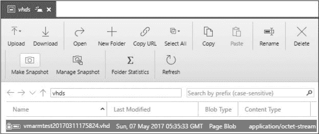
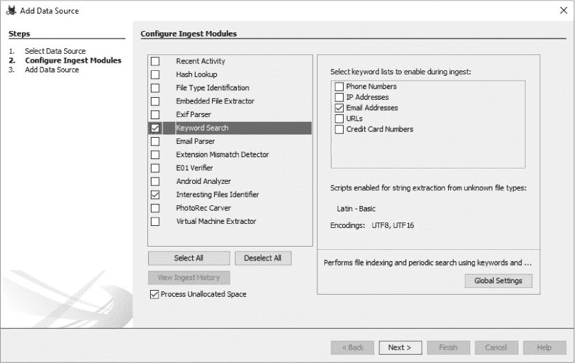
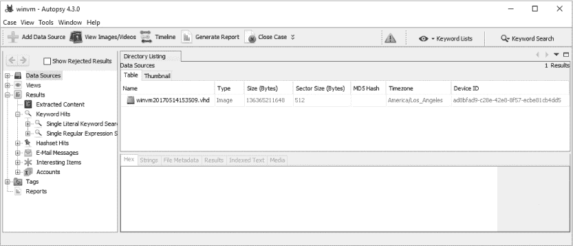
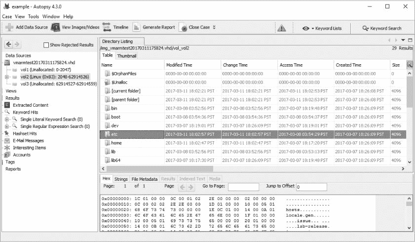
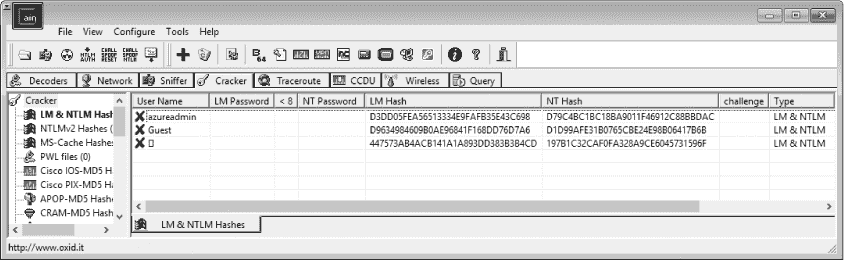
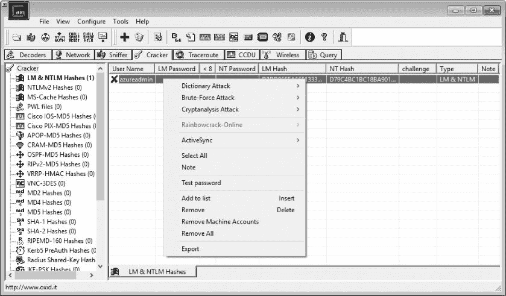
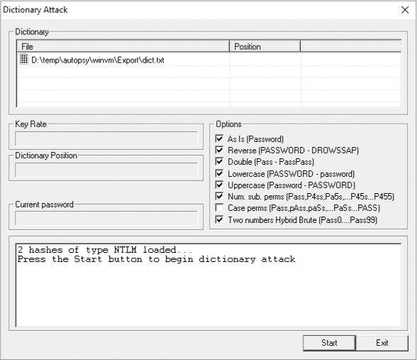
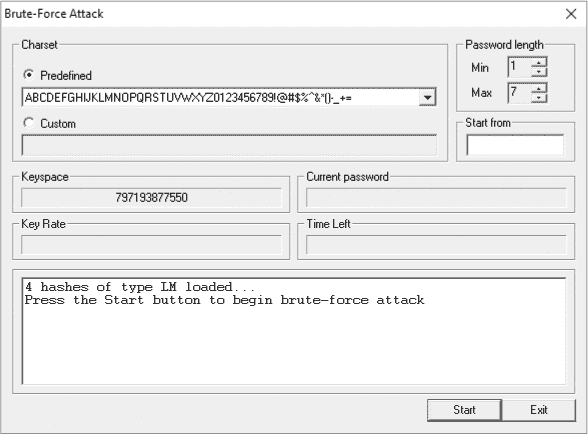
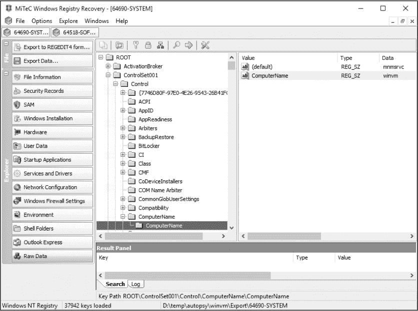
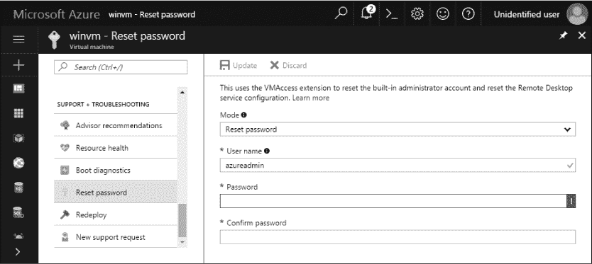

## **5**

**虚拟机目标**


每个渗透测试人员可能会遇到大量的 Azure 虚拟机（VM）。正如你将在本章中学习的那样，攻击者可以利用 Azure 存储作为窃取秘密并控制 Azure 虚拟机的途径。只要获得适当级别的访问权限，攻击者就能完全控制运行在虚拟机上的任何服务，并秘密收集连接到这些虚拟机的用户数据。

为了演示这一点，我首先展示如何在不访问 Azure 门户的情况下获取虚拟机的 *虚拟硬盘（VHD）* 镜像。一旦获得虚拟机的 VHD 副本，我将解释如何提取重要数据。最后，我将展示如何在 Azure 门户中利用虚拟机密码重置选项。

### **最佳实践：虚拟机安全**

虚拟机是最常见的云工作负载之一，因为它们允许企业快速将本地服务器迁移到云端。尽管虚拟机是利用云的好方式，且工程投入有限，但如果公司没有充分考虑因此类迁移可能遇到的新威胁，这种方式可能会带来安全问题。

最重要的是，内部服务器的管理员往往理所当然地认为公司网络边界上的防火墙和其他安全设备已经足够。默认情况下，云托管的虚拟机是面向互联网的，因此每个开放的端口都必须经过仔细考虑，只有最少数量的服务暴露出来，因为每个端口都可能成为攻击目标。除了虚拟机的主机防火墙外，还应使用网络安全组来限制对所有不需要的端口的访问。此外，对于那些只需要从其他云资源访问的虚拟机，考虑使用不面向互联网的虚拟网络。

如果你确实将管理服务暴露到互联网上，比如 RDP 或 SSH，可以通过确保系统上的用户账户使用不常见的账户名（避免使用常见的特权账户名，如*administrator*、*admin*和*root*）以及强密码，或者在可能的情况下使用基于证书或多因素身份验证，来降低成功进行密码喷射或暴力破解密码攻击的风险。鼓励使用密码管理器，以便用户不必担心记住奇怪的用户名和复杂的密码。

接下来，在可能的情况下，利用虚拟机的全盘加密来保护其上的任何数据。这可以防止离线分析 VHD，如在 “使用 Autopsy 探索 VHD” 第 95 页 中所述。Azure 磁盘加密是一种方便的加密 VHD 的方式。它利用密钥保管库来存储磁盘的加密密钥，因此你不需要担心管理这些密钥。这是 Azure 中的免费服务，适用于大多数虚拟机定价层。

最后，确保正在监控所有与 VM 相关的事件。启用 Azure 的 VM 日志并将其包含在你的蓝队安全日志分析工具中是一个好的开始。然而，使用 Azure 安全中心（ASC）和运营管理套件（OMS）可以检测更多事件。ASC 监控 VM 的已知威胁，而 OMS 为安装其代理的任何系统提供详细的日志。两种解决方案在第八章中有详细介绍。

### **虚拟硬盘盗窃与分析**

因为可以在没有完全访问订阅的情况下获取 Azure Storage 凭证（如第四章中所述），攻击者可能仅凭存储帐户密钥就能控制正在运行的 VM。为了做到这一点，攻击者需要获取 VHD，检索存储在 VHD 上的密码或证书，然后使用这些密钥访问 VM。让我们首先看看渗透测试人员如何获取 VM 的 VHD 副本。

#### ***下载 VHD 快照***

为了下载磁盘映像，你需要获取存储帐户的密钥，该帐户包含所需 VM 的 VHD。如果你有订阅权限，可以直接从 Azure 门户获取密钥，或者通过 Azure PowerShell 的`Get-AzureRmStorageAccountKey` cmdlet 获取。此外，如果你没有订阅权限，也可以使用第四章中描述的任何存储密钥恢复方法。一旦获得了存储凭证，启动 Microsoft Azure Storage Explorer 或 ClumsyLeaf CloudXplorer。这是能够创建 Azure Storage 中文件快照的唯一两个工具。我将展示如何使用 Microsoft Azure Storage Explorer，因为它是免费的选项。

**注意**

*如果你尝试从 Azure 下载一个正在使用中的文件，比如正在运行的 VM 使用的 VHD，下载将会中断，文件将损坏或不完整。快照 API 会创建一个一致的（即不损坏的）时间点副本，你可以复制它。因为你无法判断 VHD 是否正在使用，所以你应该始终假设它正在使用并创建快照。*

按照以下步骤在 Microsoft Azure Storage Explorer 中下载快照：

1.  点击你想复制的 VHD 文件，然后点击功能区菜单中的**创建快照**按钮，如图 5-1 所示。

    

    *图 5-1：在 Microsoft Azure Storage Explorer 中为 VHD 创建快照*

1.  点击**管理快照**按钮。你应该能在文件列表中看到所有选定文件的快照。它们的名称应以 VHD 的名称开始，后面跟着括号中的日期和时间。

1.  要将快照保存到你的 PC，选择快照并点击功能区中的**下载**按钮。

确保在下载完 VHD 快照后，从存储帐户中删除该快照。用户不仅可能注意到重复的文件，而且重复的文件还会占用额外的存储空间，导致订阅的月度账单产生额外费用。尽管在复制 VHD 时保留快照一两个小时可能不会被注意到，但一个月的费用，如果是数百 GB 的 Blob 存储量，对于一个精明的会计来说是显而易见的。

**DEFENDER’S TIP**

Azure 存储分析日志会记录 Azure 存储活动，包括 Blob、队列和表的操作。这包括成功和失败的身份验证尝试、上传、下载、删除和快照操作。务必启用此功能，并查看这些数据以识别异常活动。有关更多信息，请参见 *[`docs.microsoft.com/en-us/rest/api/storageservices/enabling-storage-logging-and-accessing-log-data/`](https://docs.microsoft.com/en-us/rest/api/storageservices/enabling-storage-logging-and-accessing-log-data/)*。

此外，账单数据可以是一个意外有用的工具，帮助你发现是否有人正在利用你的订阅。如果你预计订阅的使用情况从月到月保持不变，那么费用的突然变化就值得调查。原因可能是一些无害的因素，比如 Azure 费率的变化，但也有可能是有人在你的订阅中运行额外的服务，进行不正当的活动！

要在 Microsoft Azure Storage Explorer 中删除快照，点击文件列表中的快照以选中它，然后点击工具栏上的 **删除** 按钮。如果没有看到列出的快照，首先点击工具栏菜单中的 **管理快照**。

#### ***获取 VHD 的秘密***

一旦你在计算机上有了 VHD 的副本，可以查看其中有用的信息。需要查找的文件取决于客户操作系统，但目标是相同的：找出那些本身具有渗透测试价值的信息（例如，尚未发布的财务数据），或者那些可以帮助你进一步访问目标系统的信息（例如，密码）。

找到用于盗取 VHD 的同一虚拟机的密码是非常值得追求的。虽然拥有该凭证在手中有 VHD 后可能看起来没有意义，但一旦你找到了密码，你就可以在运行的虚拟机上执行许多有效的操作，而这些操作在静态的 VHD 副本上无法进行。例如，通过访问虚拟机，你可以运行 Mimikatz 查找尚未获得的凭证。你还可以修改虚拟机上的运行服务，秘密地将信息转发给你。你甚至可以用它发送钓鱼邮件，因为用户通常会更信任他们已经知道的服务器链接。可能性仅受限于你的想象力。

审查 VHD 文件的内容可能会成为一项漫长的计算机取证工作，具体取决于你获得的 VHD 数量。由于你可能没有时间逐一检查每个磁盘映像中的所有文件，因此让我们重点关注几个通常最有价值的关键领域。

### **使用 Autopsy 探索 VHD**

在你可以查看 VHD 内容之前，你必须找到一种方法来打开它。如果你使用的是 Windows 10，且目标虚拟机也运行 Windows 版本，你应该能够右键点击 VHD 并选择 **Mount**，将 VHD 作为一个新的虚拟磁盘挂载到 Windows 文件资源管理器中。如果你在运行 Linux，并且安装了 VHD 库，你应该能够使用 mount 命令来挂载 VHD。然而，我更喜欢使用像 Autopsy 这样的磁盘取证工具来探索 VHD。使用磁盘取证程序相对于原生挂载选项有几个优势：

**广泛的磁盘格式支持** Windows 只能挂载 NTFS 和 FAT 格式的磁盘映像，而取证工具可以打开多种格式——即使是在 Windows 上运行时。而在 Linux 上，取证工具通常比 Linux 本身更擅长读取不常见的格式。

**更好的恶意软件保护** 当你直接将一个不可信的文件系统挂载到你的系统中时，存在 VHD 上的任何恶意软件可能感染宿主系统的风险。通过使用取证工具只提取几个特定的感兴趣文件，你可以大大降低这个风险。

**VHD 完整性保护** 取证工具旨在以只读模式挂载磁盘映像，这样可以防止你意外修改或删除 VHD 中的文件。这不仅可以避免错误，还能帮助你在展示发现时消除怀疑。

**恢复删除文件的能力** 取证工具专门用于恢复用户已删除但尚未被新数据覆盖的磁盘映像中的文件。你可能会发现一些非常有趣的文件，这些文件在使用原生挂载命令时是看不到的。

我常用的取证工具是免费的开源软件 Autopsy (*[`www.sleuthkit.org/`](http://www.sleuthkit.org/)*)。它可以在 Windows、Linux 和 macOS 上运行。尽管它缺少一些商业取证程序的高级功能和打磨，但它对于渗透测试已经足够，并且避免了与小众商业工具相关的高成本。

#### ***导入 VHD***

无论你的计算机操作系统或 VHD 的操作系统是什么，使用 Autopsy 导入 VHD 进行检查的步骤如下：

1.  启动 Autopsy，并在欢迎界面上选择 **Create New Case**。

1.  为案件命名（使用虚拟机的名称），并选择一个目录以便 Autopsy 保存其工作文件。点击 **Next**。

1.  将 Case Number 和 Examiner 字段留空，然后点击 **Finish** 以打开 "Add Data Source Wizard"。

1.  在 "Add Data Source" 窗口中，浏览到下载的 VHD，选择它，然后点击 **Next**。

1.  配置导入模块屏幕，如图 5-2 所示，允许您选择 Autopsy 对 VHD 执行的后处理操作，例如创建搜索索引和所有图片的缩略图。做出选择后，点击**下一步**，然后在下一个屏幕上点击**完成**。



*图 5-2：在 Autopsy 中选择导入选项*

**注意**

导入*是取证软件用来自动扫描被检查磁盘内容的过程，并为检查员标出感兴趣的项目。Autopsy 提供了多种预配置的导入选项，如电子邮件和信用卡号识别以及照片提取。它还支持自定义过滤器，供检查员添加自己的过滤条件。*

此时，您应该已经进入了 Autopsy 的主界面，如图 5-3 所示。双击目录列表区域中的 VHD 文件，您将看到 VHD 内分区的列表，包括代表虚拟磁盘中未使用空间的未分配分区。



*图 5-3：使用 Autopsy 导航磁盘映像*

如果 Autopsy 无法加载 VHD，可能是 VHD 已损坏，应该重新下载，或者 VM 所有者启用了 Azure 磁盘加密，在这种情况下，您无法继续操作。要检查是否启用了加密，可以尝试在 Windows 系统上使用 PowerShell 挂载 VHD：

```
PS C:\> Mount-DiskImage -ImagePath C:\temp\file.vhdx -StorageType VHDX
    -Access ReadOnly
```

如果镜像已损坏，PowerShell 会显示错误`文件或目录已损坏，无法读取`。如果它被加密，则会打开一个新的 Windows 资源管理器窗口，尝试显示 VHD 的内容，但会报告驱动器无法访问。

**防御者小贴士**

Azure 磁盘加密允许您加密存储在 Azure 中的 VHD 内容。它利用 BitLocker 为 Windows 虚拟机和 DM-Crypt 为 Linux 虚拟机提供完整的磁盘加密，因此如果 VHD 从 Azure 中移除，您将无法读取其内容。VHD 的加密密钥存储在 Azure 密钥保管库中。请注意，要使用 Azure 磁盘加密，您必须使用标准或高级虚拟机，并且虚拟机必须基于 ARM 架构。您可以在*[`docs.microsoft.com/en-us/azure/security/azure-security-disk-encryption/`](https://docs.microsoft.com/en-us/azure/security/azure-security-disk-encryption/)*了解更多关于 Azure 磁盘加密的信息。

当 VHD 加载时，双击第一个未标记为*未分配*的分区。您应该看到 VHD 中的文件列表，如图 5-4 所示。



*图 5-4：在 Autopsy 中检查 VHD*

在此界面中，浏览文件系统以寻找感兴趣的文件。您可以使用屏幕下方的内置十六进制查看器预览文件。要进一步查看文件，选择该文件，右键点击它，然后选择**提取文件**将文件保存到您的主机系统中。

现在让我们看看在 Windows 和 Linux VHD 中最有趣的一些文件。

#### ***分析 Windows VHD***

当我分析虚拟机的磁盘时，我的首要任务是收集凭据。分析 Windows VHD 时，我首先从 *\Windows\System32\config\SAM* 中的 *Security Account Manager (SAM)* 数据库开始。SAM 存储所有本地非域用户的密码哈希，如本地管理员账户。Windows 使用一个加密密钥，称为 *Syskey*，来保护 SAM。你可以在 *\Windows\System32\config\SYSTEM* 中找到这个密钥。

下面是解密 SAM 文件并获取哈希的方法：

1.  使用 Autopsy 从 VHD 中提取 SYSTEM 和 SAM 注册表蜂巢文件到你的计算机中。

1.  启动 Cain & Abel（可从 *[`www.oxid.it/cain.html`](http://www.oxid.it/cain.html)* 获取）。

1.  点击 **Cracker** 选项卡。

1.  点击 **文件** ▸ **添加到列表**。

1.  选择 **从 SAM 数据库导入哈希** 选项。

1.  点击 SAM 文件名旁边的浏览按钮 (**...**)，选择提取的 SAM 文件。

1.  点击启动键旁边的浏览按钮，选择提取的 SAM 文件。

1.  在打开的 Syskey 解码器框中，点击浏览按钮并选择你提取的 SYSTEM 文件。

1.  高亮并复制显示的启动键。

1.  关闭 Syskey 解码器框，然后将密钥粘贴到启动键字段中。

1.  点击 **下一步**。

你应该能够看到系统中每个账户的哈希，如 图 5-5 所示。（我们将在 “密码哈希攻击工具” 一节中，讲解如何处理这些哈希，具体包括 Cain & Abel 如何利用它们获取明文密码，详见 第 103 页）



*图 5-5：Cain & Abel 中的哈希*

除了密码之外，在检查 VHD 时，我还对源代码、配置文件和文档感兴趣。你会找到什么取决于虚拟机的使用方式以及安装的软件。检查这些位置，如果存在的话，可能会找到有价值的内容：

+   *\InetPub* 目录用于存放网站源代码和配置文件（通常是 *web.config*）。这些文件可能包含密码和其他秘密信息。

+   每个用户在 *\Users* 下的主目录——特别是他们的 *Documents* 文件夹，用于存放关于目标环境的规格说明和部署文档；*Desktop* 文件夹，用于存放文档、密钥和笔记；*Downloads* 文件夹，用于提供关于在虚拟机上可能使用的工具的线索；以及 *AppData\Roaming* 文件夹，用于存放包含网页历史、Cookies 和保存的密码的 Internet Explorer、Firefox 和 Chrome 子目录。

+   SQL 使用的目录。

+   Azure 管理工具使用的任何目录。

+   用于输出计划任务、测试脚本和其他随机信息的临时目录。

+   包含备份的目录。

此外，还应在 VHD 中执行完整的扩展名搜索，查找像**.pfx*这样的证书私钥文件；**.doc*、**.docx*、**.xls*、**.xlsx*、**.ppt*和**.pptx*这些 Microsoft Office 文件；**.bak*用于备份；**.txt*用于笔记，这些文件有时包含密码。你可能还想搜索密码管理器使用的文件，如 KeePass 的**.kdx*和**.kdbx*、Password Safe 的**.psafe3*，以及 Dashlane 的**.dash*或**.dashlane*。最后，找到操作系统中没有包含的任何脚本文件，如从除*\Windows*外的任何目录中找到的**.bat*、**.cmd*和**.ps1*，看看它们的用途。

#### ***分析 Linux VHDs***

要从 Linux VHD 中提取密码哈希，可以导出*/etc/passwd*和*/etc/shadow*文件，以获取用户及其密码哈希的列表。复制*/etc/group*和*/etc/gshadow*也是个好主意，以确定用户账户的组成员资格和权限。

*/etc/samba*、*/etc/ssl*和*/etc/ssh*目录应包含系统使用的配置文件和证书。此外，*/etc/hostname*将包含虚拟机的名称，*/etc/fstab*将列出虚拟机中挂载的任何其他磁盘，*/etc/hosts*可能会显示虚拟机与其他服务器交互的静态名称到 IP 的映射。

尝试检索虚拟机上托管的任何网站的源代码和配置文件是个好主意，因为它们可能包含秘密。尤其是 Apache 的*.htpasswd*和*.htaccess*文件，它们控制对网页内容的访问。这些文件的常见位置包括*/var/www*、*/usr/share/nginx*和*/httpd*。

用户的主目录是另一个很好的信息来源；这些目录通常位于*/home*和*/root*下。保存的用于连接远程系统的安全外壳（SSH）密钥文件以及命令历史记录，通常名为*.bash_history*，尤其值得关注。命令历史记录通常会包含其他值得调查的服务器名称。查找像`ssh`、`telnet`、`scp`和`smbclient`这样的命令，以及这些系统的有效用户名。

虽然 Linux 不像 Windows 那样普遍使用文件扩展名，但你仍然应该在 Linux VHD 上执行文件扩展名搜索，因为许多用户和应用程序会使用扩展名。扫描与证书相关的文件（**.pfx*、**.p12*、**.jks*），以及 shell 脚本（**.sh*）和文本文件（**.txt*）。你可能还会在数据库文件中发现一些有趣的内容，如**.sql*、**.db*和**.myd*。

### **破解密码哈希**

一旦您成功地从 Linux 或 Windows 虚拟机中获取了密码哈希，您就需要恢复它们的明文值才能使用。哈希是*单向的*，这意味着您不应该仅凭哈希就能够确定实际的明文密码。但正如您在本节中将看到的那样，有几种可能的方式可以从哈希中恢复密码，包括字典攻击、暴力破解攻击、混合攻击和彩虹表攻击。

#### ***字典攻击***

在字典攻击中，攻击者编制一个常见单词或短语的列表，然后使用目标服务器密码系统所使用的相同哈希算法对列表中的每个项进行哈希处理。接着，攻击者将每个字典单词的哈希值与密码哈希列表进行比较，并显示匹配项。

如果您拥有目标组织常用的密码列表，或者您怀疑用户使用的是简单的单词密码，这些密码会出现在您编制的英语单词列表中，或者您拥有一个庞大的密码字典，那么字典攻击非常有效。通常可以在线找到这些庞大的字典，尤其是在犯罪分子入侵了一个流行网站并泄露了被盗的密码后。一个好的来源是*[`github.com/danielmiessler/SecLists/`](https://github.com/danielmiessler/SecLists/)*。

**警告**

*在使用泄露的密码列表之前，务必与您公司及目标公司中的法律团队进行核实。仅仅因为它们是公开可用的，并不意味着您可以自由使用它们。一些组织可能会认为这些文件是被盗的财产，并且视其为禁用文件。如果您打算使用这些列表，请考虑在您的规则中提到这一点。*

#### ***暴力破解攻击***

在暴力破解密码时，您会生成所有可能的字母、数字和特殊字符的密码组合，然后对其进行哈希处理，直到找到匹配项为止。此方法非常耗时，通常不适用于长度超过八个字符的密码，但它可能会找到一个短密码，这个密码是攻击者在典型字典中找不到的，比如*f8i!R+*。

#### ***混合攻击***

混合攻击将字典攻击和暴力破解攻击结合起来，试图快速恢复复杂密码。在这种方法中，攻击者将一个基础字典单词与一系列字符组合，测试结果与哈希值对比，然后继续下一个单词。例如，像*hippopotamus200*这样的密码可能不会出现在任何字典单词列表中，而暴力破解一个 15 个字符的密码则需要极其长的时间。然而，使用混合攻击的方法，先用一个英语单词，然后加上一个至四个数字，通常会在几小时或几天内找到这个密码。混合攻击的最大缺点是您需要对密码的格式有所了解。例如，“单词加上一到四个字符”的模式将无法成功找到*200hippopotamus*。

#### ***彩虹表攻击***

彩虹表攻击有点像暴力破解攻击，攻击者提前计算并存储所有的哈希值，以便与捕获的目标哈希值进行匹配。然而，真正存储所有可能的哈希值对于给定长度的密码来说需要巨大的存储空间，因而不切实际。为了避免这个问题，彩虹表的设计者执行一个复杂的加密操作（称为还原函数），将哈希值串联在一起，并且只存储每个链的开始和结束部分。（要了解具体方法，请参见 Philippe Oechslin 在*[`lasec.epfl.ch/pub/lasec/doc/Oech03.pdf`](https://lasec.epfl.ch/pub/lasec/doc/Oech03.pdf)*上发布的原始论文。）

为了让攻击者使用彩虹表，一个程序接收目标哈希，并开始通过还原函数将捕获的哈希值传递到预计算的彩虹表中进行计算，查看结果是否与某个链的结尾匹配。如果匹配，它就取出该链的起始值并开始从链的起点进行哈希计算和还原，直到找到创建原始哈希的值。如果捕获哈希的还原版本与任何链的结尾不匹配，它会通过哈希和还原函数再次循环执行，直到正确的链被识别出来。

攻击者优化彩虹表以追求速度或大小：较小的彩虹表将花费更长时间来返回密码（尽管它仍然比暴力破解要快得多），而较大的表则可以更快地返回结果，但会消耗更多的磁盘空间。

尽管彩虹表比本节讨论的其他攻击方式快得多，但它们有三个主要缺点。首先，你必须预先计算它们，因此它们比其他方法需要更多的规划和准备。其次，彩虹表仅适用于一种哈希格式，例如 MD5。这意味着你需要为遇到的每种哈希类型准备不同的彩虹表。至少，你可以在 Windows 上找到 LM 和 NTLM 哈希，而在 Linux 上则可能会遇到 MD5 和 SHA1 哈希。第三，它们对盐值哈希格式无效。

#### ***Windows 密码哈希的弱点***

对于基于 Azure 的 Windows 虚拟机，Azure 要求用户名不能是*admin*或*administrator*，密码长度必须在 12 到 123 个字符之间，并且密码必须包含至少四种字符类型中的三种：小写字母、大写字母、数字和符号。这通常会使暴力破解攻击变得不可行，除非 Windows 为了兼容性原因在 NTLM 和 LM 哈希格式中都存储密码。早期版本的 Windows 使用 LM 哈希格式，而较新的版本使用更安全的 NTLM 格式。LM 存在一些弱点：

+   密码会根据需要用空字符填充，直到总长度为 14 个字符，然后将其分成两部分。两部分分别进行哈希计算，然后连接起来形成最终的 LM 哈希值，因此攻击者只需攻击两个 7 字符字符串的哈希，这可以并行进行。

+   密码限制为 14 个字符。

+   密码中的字母在哈希之前会转换为大写字母，使得它们不区分大小写。

如果用户的密码在 Windows 中少于 15 个字符，它可能会以 NTLM 和 LM 格式同时存储在 SAM 中。当密码少于或等于七个字符时，LM 会将 LM 哈希的第二部分设置为 AAD3B435B51404EE（7 个空字节的哈希值），因此攻击者只需破解第一部分。对于超过 14 个字符的密码，Windows 不会存储 LM 哈希，而是存储默认值 AAD3B435B51404EEAAD3B435B51404EE。Windows 对于没有密码的账户使用相同的哈希值，因此如果你遇到这个值，尝试用空密码登录该账户，你可能会好运！

因为任何存储为 LM 哈希的密码本质上只是两个七个字符密码的哈希，并且由于这些哈希不包含小写字符，所以需要攻击的 LM 哈希的密钥空间相对较小。因此，攻击者可以非常快速地恢复任何存储为 LM 格式的密码。一旦攻击者破解了 LM 哈希，得到的密码可能不是账户的实际密码，因为 LM 哈希是不区分大小写的。因此，攻击者需要对该密码的每种大小写组合执行短时间的暴力破解测试，以便与 NTLM 哈希进行匹配，从而找出最终正确的密码。例如，如果 LM 哈希是密码*DOG*，用户的实际密码可能是*dog*、*Dog*、*dOg*、*doG*、*DOg*、*DoG*、*dOG*或*DOG*。

**DEFENDER’S TIP**

为了让你的密码更难被攻击，确保它们至少有 15 个字符，以便 Windows 不存储 LM 哈希。此外，确保你的密码包含大写字母、小写字母、符号和数字，并且不是基于词典中的单词。这类密码可能很难记住，因此可以考虑使用一个具有非常强大主密码的安全密码管理器！

### **密码哈希攻击工具**

你可能会使用两个工具之一来进行密码哈希攻击：Cain & Abel 或 hashcat。Cain & Abel 是一款多功能的安全工具，已成为业界标准多年。除了拥有众多功能外，它还具有易于学习的图形用户界面（GUI）。Hashcat 是渗透测试人员工具包中的一个新成员。它没有图形用户界面，只有一个功能：破解哈希。然而，hashcat 在易用性上有所欠缺，但在性能和对大量哈希类型的支持上弥补了这一点。作为渗透测试人员，了解如何使用这两款工具是很有用的。

#### ***使用 Cain & Abel 攻击哈希***

Cain & Abel 在“Cracker”标签页中提供哈希破解功能（与您在《分析 Windows VHDs》中第 98 页使用的相同标签）。加载哈希到 Cracker 标签页后，选择您要破解的哈希，然后右键点击所选哈希中的任意一个。上下文菜单应会显示三个破解选项：字典攻击、暴力破解攻击和密码分析攻击，如图 5-6 所示。



*图 5-6：Cain & Abel 哈希上下文菜单*

选择字典攻击后，将呈现一个屏幕，您可以在其中选择字典单词列表，并对字典词条进行一些有限的修改，例如尝试将每个单词转换为全大写或全小写，如图 5-7 所示。

暴力破解攻击选项会打开一个不同的窗口，您可以在其中输入要包含在攻击中的字符，以及尝试的密码长度，如图 5-8 所示。



*图 5-7：Cain & Abel 字典攻击窗口*



*图 5-8：Cain & Abel 暴力破解攻击窗口*

Cain & Abel 包含自动调整暴力破解选项的逻辑，具体取决于哈希类型。当您攻击 LM 哈希时，默认的密码空间不包括小写字符，并且预设密码长度为 1 到 7 个字符，这是 LM 哈希的已知限制。一旦攻击开始，Cain & Abel 会显示测试进度，包括每秒尝试的密码数和剩余总时间。

最后，密码分析攻击选项将对哈希进行彩虹表攻击。该攻击的选项窗口非常简单，只提供一个选择路径的选项，用于指定彩虹表的路径。与暴力破解攻击一样，它还会显示攻击的进度。

#### ***使用 hashcat 测试哈希***

Hashcat 是一个免费的开源跨平台密码哈希破解工具，经过优化，能够充分利用现代显卡的 GPU 处理能力以及 CPU 的处理能力。您可以从 *[`hashcat.net/hashcat/`](https://hashcat.net/hashcat/)* 下载 hashcat。

与 Cain & Abel 类似，hashcat 提供字典攻击和暴力破解选项，但它在混合模式下表现尤为出色。通过利用 GPU 的强大性能，hashcat 可以每秒测试大量密码组合——可以达到数百万、数十亿甚至数万亿次，具体取决于显卡和哈希类型。hashcat 还支持使用复杂的规则来控制密码生成，这在您能够确定目标公司的密码策略时非常有用。例如，如果您知道所有密码必须至少包含八个字符，并且必须包含数字和符号，您可以通过排除所有不符合这些条件的密码来开始测试。

Hashcat 支持多种哈希格式。与 Cain & Abel 只支持约 30 种哈希格式不同，hashcat 支持超过 200 种格式。如果你遇到一个运行某种操作系统或软件的虚拟机，这些系统或软件保存了自己的密码列表（例如 PeopleSoft、Lotus Notes 或 Joomla），那么这种广泛的支持将非常有用。

要了解如何使用 hashcat，我建议阅读 wiki，链接为*[`hashcat.net/wiki/`](https://hashcat.net/wiki/)*。请注意，配置错误的 hashcat 任务可能比正确配置的任务花费更长时间，尤其是当字典不合适或规则不正确时。更糟糕的是，匆忙创建的任务可能会无意中排除目标系统的合法密码。在渗透测试过程中，没有什么比因为命令行错误而意识到需要重新启动已经运行了几天的破解任务更令人痛苦的了！

**注意**

*如果你电脑中的 GPU 性能不强，你可能需要考虑在包含 NVIDIA GPU 的专用 Azure 虚拟机上运行 hashcat，这些虚拟机是为计算密集型任务设计的。不幸的是，长时间运行这些虚拟机的成本通常比构建和运行一台配备几块高端显卡的个人电脑要高。不过，在两种情况下，你可能会更倾向于使用 Azure GPU。第一种情况是你需要非常迅速地破解一个非常重要的密码。使用 Azure，你可以创建数十个这样的专用虚拟机，并为每个虚拟机分配不同的密钥空间子集进行测试。另一种情况是，如果你发现密码破解在你的渗透测试中是一个很少使用的技术。在这种情况下，使用 Azure 可能比在 GPU 硬件上进行初始资本投资更有意义。*

### **利用 VHD 的秘密对付虚拟机**

一旦你从 VHD 中恢复了用户名和密码，就可以开始评估 Azure 中运行的虚拟机了——但首先，你需要知道如何连接到虚拟机。为此，你需要知道虚拟机的主机名或 IP 地址，并且需要知道虚拟机上运行的远程管理服务及其端口。运行 Windows 的 Azure 虚拟机通常会提供远程桌面协议（RDP），而 Linux 虚拟机通常会开放安全外壳（SSH）。较少情况下，虚拟网络计算（VNC）协议或 telnet 协议会被暴露，但这些协议默认不加密，尤其是在互联网环境下不应使用。

#### ***确定主机名***

在主机名和 IP 地址之间选择时，我更倾向于使用主机名，因为 IP 地址可能会动态分配。默认情况下，Azure 会根据虚拟机的主机名命名其 VHD。例如，如果一个 VHD 文件名是*myazurevm20151231220005.vhd*，其主机名通常是*myazurevm.cloudapp.net*。

当然，VHD 可以被重命名，或者虚拟机（VM）可以被分配一个不同的主机名。如果你发现是这种情况，你可以尝试从 Azure 或 VHD 内部获取主机名信息。最简单的方法是使用 Azure PowerShell 和 `Get-AzureVM` cmdlet 来返回订阅中每个虚拟机的主机名，但这需要你拥有适当权限的账户。

或者，你可以直接查看 VHD 本身。Windows 将主机名存储在 SYSTEM 注册表区，我们在 “分析 Windows VHDs” 的 第 98 页 中已经导出过此信息。要查看此值，你需要将该文件加载到注册表查看器中。

##### **在 Windows 上恢复 VHD 中的主机名**

使用 Windows 内置的 `regedit` 工具从 VHD 恢复主机名时需要非常小心；因为很容易不小心将虚拟机的注册表值覆盖到你自己电脑的注册表中。一个更好的选择是使用 MiTeC 的 Windows 注册表恢复工具 (*[`www.mitec.cz/wrr.html`](http://www.mitec.cz/wrr.html)*)，操作如下。

1.  安装 Windows 注册表恢复工具后，点击 **文件**▸**打开**。

1.  选择从 VHD 导出的 *SYSTEM* 文件并点击 **确定**。

1.  点击左侧菜单中的 **原始数据** 选项（参见 图 5-9）。

1.  在中间窗格中，导航到 *ROOT\ControlSet001\Control\ComputerName\ComputerName*。

1.  在右侧窗格中的 ComputerName 字符串应包含主机名，如 图 5-9 所示。

1.  如果你看到名为 *ControlSet002* 或 *ControlSet003* 的目录位于 *ROOT* 下，一定要检查它们，因为主机名可能已更改。



*图 5-9：从 SYSTEM 注册表区查看主机名*

Windows 虚拟机的 VHD 中还有其他可能包含主机名的文件，但 SYSTEM 注册表区是获取主机名的最可靠方法。

##### **在 Linux 上恢复 VHD 中的主机名**

在 Linux 上恢复 VHD 中的主机名非常简单。只需定位到 */etc/hostname* 文件并显示它。文件中应包含虚拟机的主机名。

#### ***查找远程管理服务***

一旦你知道了主机名，就应该确定虚拟机是否有可访问的远程管理工具。虽然 RDP、SSH、VNC 和 Telnet 服务有默认端口，但目标虚拟机可能不会使用这些端口，因此你需要确定远程服务使用的是哪个端口。这可以通过使用订阅中的信息、检查已知端口或执行完整端口扫描来完成。

##### **使用 PowerShell**

查找虚拟机中任何可访问的远程端口的最佳方法是使用你在“网络信息收集”一节中学习到的 PowerShell 侦察技术，前提是你拥有适当的凭据。此数据将包含从`Get-AzureEndpoint`和`Get-AzureRmNetworkSecurityGroup` cmdlet 的输出中获取的允许通过防火墙的每个虚拟机的开放端口。查看此输出并将任何列出的开放端口与表 5-1 中列出的常见管理端口进行比较。

**表 5-1:** 常见管理端口

| **服务** | **TCP 端口** |
| --- | --- |
| RDP | 3389 |
| SSH | 22 |
| VNC | 5900 |
| telnet | 21 |
| Windows 远程管理（PowerShell 远程） | 5985, 5986 |

如果你发现任何匹配项，尝试使用该协议的客户端连接到虚拟机（VM）。例如，在 Windows 中，你可以使用内置的*mstsc.exe*应用程序连接到 RDP 端点，使用 PuTTY (*[`www.chiark.greenend.org.uk/~sgtatham/putty/latest.html`](https://www.chiark.greenend.org.uk/~sgtatham/putty/latest.html)*)连接 SSH 和 telnet，或使用 TightVNC (*[`tightvnc.net/`](http://tightvnc.net/))*连接 VNC 服务器。如果你在运行 Linux，通常内置有 SSH、VNC 和 telnet 的客户端。对于 RDP，freeRDP (*[`www.freerdp.com/`](http://www.freerdp.com/)*) 是一个流行的选择。

如果 Windows 远程管理可用，你可以通过 PowerShell 进行连接。为此，运行以下命令：

```
➊ PS C:\> $s = New-PSSessionOption –SkipCACheck –SkipCNCheck –SkipRevocationChecke
➋ PS C:\> $c = Get-Credential
➌ PS C:\> Enter-PSSession -Credential $c -ComputerName TARGET_IP -UseSSL -SessionOption $s
➍ [TARGET_IP]: PS C:\Users\Administrator\Documents> hostname
   WebhostSrv2012
   [TARGET_IP]: PS C:\Users\Administrator\Documents> exit
   PS C:\>
```

这将指示 PowerShell 跳过 SSL 证书验证➊（因为你的客户端不信任此主机），提示你输入目标机器的凭据➋，然后进行连接➌。如果连接成功，命令提示符将更改为显示你已连接到远程主机，并且现在可以在该机器上运行命令➍。

##### **测试默认端口**

如果无法访问订阅的 PowerShell，可以尝试测试表 5-1 中列出的每个服务的常见默认端口。这可以在 Windows 上使用内置的`Test-NetConnection` PowerShell cmdlet 快速执行，无需订阅访问权限。只需对每个需要测试的端口运行该命令：

```
➊ PS C:\> Test-NetConnection -ComputerName TARGET_IP -Port 3389
   ComputerName     : TARGET_IP
   RemoteAddress    : TARGET_IP
   RemotePort       : 3389
   InterfaceAlias   : Ethernet
   SourceAddress    : 192.168.0.114
➋ TcpTestSucceeded : True

➌ PS C:\> Test-NetConnection -ComputerName TARGET_IP -Port 21
   WARNING: TCP connect to (TARGET_IP : 21) failed
   WARNING: Ping to TARGET_IP failed with status: TimedOut

   ComputerName           : TARGET_IP
   RemoteAddress          : TARGET_IP
   RemotePort             : 21
   InterfaceAlias         : Ethernet
   SourceAddress          : 192.168.0.114
   PingSucceeded          : False
   PingReplyDetails (RTT) : 0 ms
➍ TcpTestSucceeded       : False
```

在此示例中，尝试连接到端口 3389➊并成功连接➋，而连接端口 21➌失败➍。因为 3389 是 RDP 的端口，我接下来会尝试使用*mstsc.exe*连接到此虚拟机。

##### **端口扫描**

如果测试默认端口失败且你没有适当的 PowerShell 访问权限，则继续进行虚拟机的完整 TCP 端口扫描。这可能需要几分钟，具体取决于你的网络连接速度和虚拟机的当前负载，但它将可靠地确定每个可用的端口，这些端口既在虚拟机上开放，又能从你的 PC 访问。

最适合此任务的端口扫描工具是 Nmap（*[`nmap.org/`](https://nmap.org/)*）。它可以安装在 Windows 或 Linux 上，但我推荐尽可能在 Linux 上使用，因为它在 Linux 上运行更快。安装 Nmap 后，打开命令提示符并运行以下命令：

```
# nmap -Pn -p 0-65535 -sV hostname

Starting Nmap 7.01 ( https://nmap.org )
Nmap scan report for hostname (IP)
Host is up (0.041s latency).
Not shown: 65534 filtered ports
PORT     STATE SERVICE            VERSION
3389/tcp open  ssl/ms-wbt-server?
5986/tcp open  ssl/http           Microsoft HTTPAPI httpd 2.0 (SSDP/UPnP)
Service Info: OS: Windows; CPE: cpe:/o:microsoft:windows

Service detection performed. Please report any incorrect results at https://nmap.org/submit/.
Nmap done: 1 IP address (1 host up) scanned in 10081.46 seconds
```

`-Pn`选项告诉 Nmap 即使主机没有响应 ping 请求，也要继续扫描。`-p`选项告诉 Nmap 要扫描哪些端口（在这种情况下，是所有可能的 TCP 端口）。最后，`-sV`指示 Nmap 尝试确定它找到的任何开放端口上运行的服务。根据这些结果，你应该能够了解目标虚拟机上哪些远程管理服务可用以及它们运行的端口。

这些技术可能会失败，原因有三种可能：虚拟机当前已关闭，所有管理服务已被禁用（或其端口已被防火墙限制），或者主机名或 IP 地址不正确。在这种情况下，唯一的选择是稍后再试，或者放弃并转向渗透测试的其他部分。

### **重置虚拟机凭据**

如前所述，将 VHD 取证与密码破解相结合，是从虚拟机获取凭据的强大方式，但仅限于在未启用 Azure 磁盘加密的情况下，并且攻击者有足够时间破解管理员密码。如果你设法获得了订阅的管理员权限，你可以使用另一种更快速的方法，这种方法不依赖于从磁盘中获取信息：你可以重置虚拟机的管理员密码。虽然这种方法既快速又可靠，但它也有较高的被检测到的可能性，因此我将其作为最后的手段。

#### ***如何重置虚拟机凭据***

为了避免当用户忘记密码时永久锁定虚拟机，Azure 门户提供了虚拟机密码重置选项，如图 5-10 所示。要访问目标虚拟机的密码重置选项，请登录到门户，点击**虚拟机**部分，选择目标虚拟机，然后点击**重置密码**。

这个表单有一些不错的功能。首先，它显示了虚拟机的内置管理员或根账户名（此例中为*azureadmin*），即使它已被更改。即使你不打算执行密码重置，这也非常有用，因为它可以帮助你确定一个有效的账户名，用于字典攻击等操作。其次，当密码过于简单时，密码框右侧会出现一个红色的感叹号。如果你将鼠标悬停在感叹号上，你将能够看到有关密码复杂度要求的提示信息。这将是用来配置 hashcat 规则的完美信息。



*图 5-10：Azure 虚拟机的重置密码界面*

要实际完成密码重置并更改管理员密码，只需在“密码”字段中输入所需的密码并点击**更新**。如果修改了“用户名”字段，管理员账户的名称也应该被更改。此外，如果内置管理员账户被禁用，密码重置选项应该会重新启用它。

此表单还包含一个在“模式”下拉菜单中的选项，用于重置远程访问配置。该选项将保留原始密码不变，但会启用虚拟机上的 RDP（Windows）或 SSH（Linux），以恢复远程连接能力。此功能旨在恢复管理员在配置错误后重新连接虚拟机的能力，但对于渗透测试人员而言，它可以重新开启在已加固的虚拟机上的远程访问服务。

#### ***密码重置的缺点***

即使密码重置是一种相对可靠的方式来访问虚拟机，它也有一些缺点。最重要的是，当通过门户成功更改密码时，你将无法确定之前的密码是什么。这意味着密码不能恢复到原来的值，而你现在是唯一拥有凭据的人。当然，这也意味着，一旦虚拟机管理员账户的合法用户尝试连接虚拟机，他们会意识到出了问题。他们不一定会被阻止访问虚拟机，因为他们可以自己执行密码重置（假设他们有 Azure 门户访问权限），但即使是没有经验的用户，也很可能会意识到发生了安全事件，并开始进行调查或向安全监控团队报告。

其次，尽管你将拥有凭据，但你可能对目标虚拟机的配置了解甚少。如果虚拟机中运行的软件正在使用你重置的账户，重置密码可能会导致其他服务出现意外中断，这些服务可能需要不同的密码。

最后，这种方法有一些技术限制。虚拟机（VM）必须处于运行状态，才能启用密码重置选项。此外，Azure VM 代理软件必须已安装在虚拟机上。Azure 中的默认操作系统镜像通常已经安装了该代理，但某些虚拟机可能被管理员移除了该代理，可能正在运行不太常见的旧版操作系统，且没有代理可用，或者可能是从非标准镜像构建的。

### **总结**

在本章中，我们讨论了攻击者如何从 Azure 存储中创建并下载虚拟机磁盘镜像的快照，然后使用法医恢复工具（如 Autopsy）从中恢复密码哈希和其他敏感数据。接着，我们检查了如何在 Cain & Abel 或 hashcat 中破解这些哈希，以确定原始的明文密码。之后，我们使用 PowerShell 或端口扫描确定虚拟机上可访问的管理服务。最后，我们利用破解的密码连接回虚拟机。

在那之后，我们查看了 Azure 的虚拟机密码重置选项。你可以使用此选项在门户中访问的任何虚拟机上获得管理员级别的访问权限，而无需了解虚拟机的配置。最后，我们考虑了此攻击可能存在的一些限制。

在下一章中，我们将探讨 Azure 网络，以检查如何定位面向互联网的虚拟机，以及企业网络中的系统如何与 Azure 服务进行交互。
