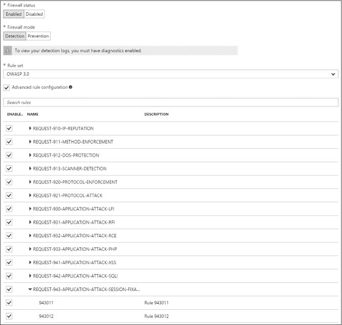
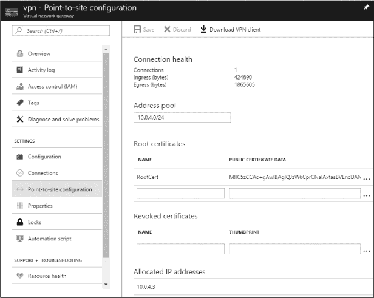
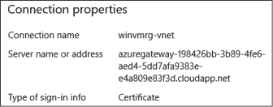
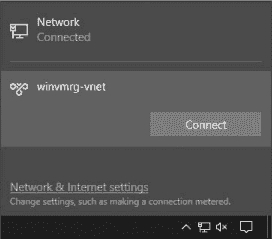
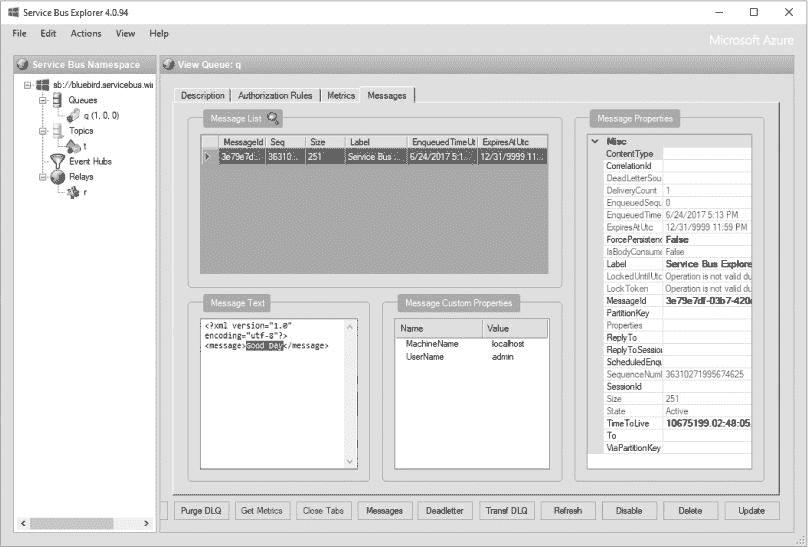
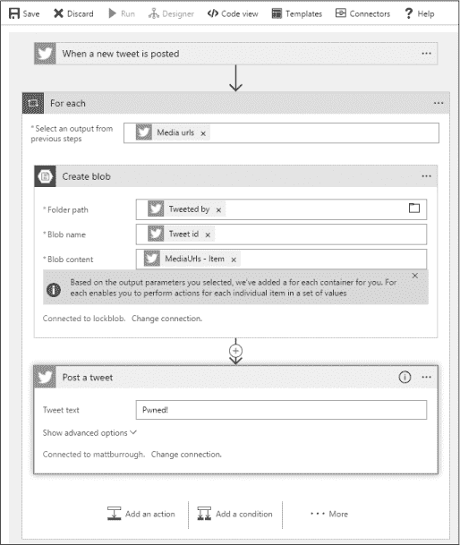

## 第六章：**调查网络**


从根本上讲，云是一个大规模的计算和数字存储资源的集合，供租用使用。这种商业模式依赖于互联网，允许云的用户将数据进出提供商的系统，管理远程系统，并使网站、电子邮件服务器等服务面向终端用户。

由于连接性对云的整体成功至关重要，Azure 为用户提供了多种网络设置。默认情况下，Azure 使服务面向互联网，从而允许任何人访问。然而，Azure 还提供了其他网络选项，用于在内部公司网络和 Azure 服务之间建立连接。这两种连接对于 Azure 能够满足客户工作负载和需求至关重要，但这也意味着配置错误可能会导致安全灾难。

本章将讨论防火墙中常见的配置快捷方式如何使服务容易受到攻击。我们还将探讨攻击者如何利用 Azure 的隧道来破坏公司网络。

### 最佳实践：网络安全

在保护云中资源时，首先要做的防御工作之一就是适当的网络配置。毕竟，如果恶意流量永远无法到达服务，漏洞被利用的风险就会大大降低。我给客户的一些常见建议包括创建小型专用虚拟网络、使用网络安全组，以及避免不小心将公司网络桥接到互联网。

首先，为你在云中运行的每个服务定义独立的 Azure 虚拟网络。通过创建一个仅供提供某个服务所需资源的网络，你可以将网络配置为仅允许最小程度的访问，从而使该服务能够正常工作。如果网络中包含多个用于不同项目的资源，那么管理起来就会变得更加困难。

接下来，使用 Azure 网络安全组（NSG），正如在“收集网络信息”一文的第 56 页中首次讨论的那样。将虚拟机的流量限制为仅需要的部分，如果当前没有进行虚拟机的管理任务，则禁止访问远程管理服务——如果需要进行更改，你可以稍后临时添加一条规则，允许从你的 IP 地址访问这些端口。另外，考虑修改默认规则。例如，如果某个服务不需要进行外部互联网连接，就将其阻止。这可以大大增加攻击者在成功入侵虚拟机后，无法通过恶意软件与攻击者的系统回连的难度。

最后，Azure 提供了几项服务，可以在 Azure 与你公司网络之间建立链接，我在“云到企业网络桥接”一节中有讨论，见第 123 页。这些功能非常适合实现混合 IT，即在本地运行的服务与云中的服务无缝连接，但它们也可能导致一个不希望出现的情况：如果一个具有此连接性的 Azure 虚拟网络还托管了面向公网的服务，那么这些服务中的任何一个被攻击者攻破，都可能为攻击者提供一条直接返回公司网络的路径。因此，非常重要的一点是要将需要访问公司网络的服务与需要公开暴露的服务分开。我建议将它们放在完全不同的订阅中，以避免意外的桥接。如果某些服务需要两种类型的访问权限，务必非常小心地设计，并花费大量时间进行威胁建模，以尽可能识别并解决所有潜在的危险。当然，也要确保对其进行渗透测试，以验证其安全性！

Azure 中的网络是一个广泛的话题，因此有许多功能可能会对你的使用场景有所帮助，但我无法在这里一一覆盖。幸运的是，Azure 网络安全有着一些最全面的文档。请参阅*[`docs.microsoft.com/zh-cn/azure/best-practices-network-security/`](https://docs.microsoft.com/en-us/azure/best-practices-network-security/)*，了解详细的威胁模型，并参考*[`docs.microsoft.com/zh-cn/azure/security/azure-security-network-security-best-practices/`](https://docs.microsoft.com/en-us/azure/security/azure-security-network-security-best-practices/)*，讨论可以使你的链接更安全的功能。

### 避免使用防火墙

Azure 为其多个服务提供防火墙。它们最常用于保护虚拟机、SQL 服务器和应用服务。对于虚拟机和 SQL，防火墙默认启用，并且与各自的服务一起使用是免费的。对于应用，Azure 提供了一个付费的 Web 应用防火墙选项。了解每个防火墙的功能和默认设置，可以帮助渗透测试人员更好地了解哪些方法可能有效，以及哪些耗时的扫描应该避免。

#### *虚拟机防火墙*

防火墙是虚拟机对抗基于网络攻击的首要防线，而且通常是唯一的防线。在撰写本文时，管理员可用于保护虚拟机的入侵防御虚拟设备选项很少。同时，他们也无法创建高级路由规则，以便在流量到达虚拟机之前进行拦截。因此，管理员在设置防火墙时必须格外小心。

几乎所有的操作系统都包含主机防火墙，允许系统管理员配置哪些端口和服务应该从网络上进行访问。然而，这些原生防火墙存在一些问题：

**复杂性和不一致性** 每种操作系统配置防火墙的方法不同，使用的命令也不同，有时甚至术语也各不相同。管理员可能在某种类型的防火墙上有经验，但在为不太熟悉的操作系统配置防火墙时，可能会无意中犯下关键错误。

**无计划的变化** 主机防火墙配置可能在开始时是安全的，但随着时间的推移，可能会在无人察觉的情况下变得更弱。例如，安装新的软件包或更新时，可能会向防火墙添加新的例外规则，而没有任何警告，比如一个包含网页界面的程序，它会开放 TCP 端口 80 和 443，允许外部流量进入。

**漏洞** 防火墙软件通常经过非常严格的测试，但总是有可能出现漏洞，导致数据包意外通过，甚至崩溃整个虚拟机。事实上，安全软件中的漏洞，诸如防火墙和杀毒软件，往往是最严重的。这不仅仅是因为利用这些漏洞可以绕过软件本应提供的安全控制，还因为这些软件始终在运行，几乎存在于每个系统中，拥有系统级别的权限，并且暴露于潜在的恶意输入中。例如，2017 年，谷歌的安全工程师发现了微软杀毒软件扫描引擎中的一个漏洞，攻击者可以通过发送一封恶意电子邮件来控制计算机，而用户甚至不需要打开这封邮件。这个漏洞很快得到了修复，但同年，其他厂商的安全产品也发现了类似问题，且很可能还有更多漏洞尚未被发现。

**负载** 基于主机的防火墙会分析操作系统内的数据包，这意味着每一个被检查的数据包都会瞬间消耗处理器周期和内存。在负载过重时，尤其是在遭遇拒绝服务（DoS）攻击时，这种额外的压力可能会阻止服务器执行正常工作。这甚至可能对云环境造成财务影响，因为 Azure 的自动扩展功能可以配置为在负载暂时增加时自动上线更多资源或将虚拟机升级到更高的定价层，而这些升级会计入虚拟机的订阅费用。

**订阅与虚拟机管理** 虚拟机的管理员（可能与订阅管理员不同）控制基于主机的防火墙。这意味着管理员可能会将系统暴露于攻击之下，如果该虚拟机被攻破，攻击者可能会利用该系统攻击 Azure 中更多受限的虚拟机或服务。考虑到许多公司允许用户成为自己工作站的本地管理员，但很少允许这些用户将工作站直接暴露于互联网。Azure 也应当以同样的方式对待。

为了解决这些问题，Azure 提供了虚拟机的防火墙，除了主机级防火墙选项之外，提供了经典 Azure 服务管理（ASM）虚拟机中的端点规则和 Azure 资源管理器（ARM）虚拟机中的网络安全组（NSG）。这些规则易于配置，并且无论虚拟机的操作系统是什么，都能有效工作——只有具有正确订阅权限的人才能禁用或重新配置这些防火墙。

**注意**

*微软允许其他安全公司向客户提供* 下一代防火墙 *服务，在 Azure 市场上进行销售。这些“防火墙即服务”解决了本节讨论的问题，并且可能还提供额外的独特保护措施，如深度数据包检查或内容过滤。由于这些防火墙在不同供应商之间差异较大，我们无法在此覆盖它们。如果你在评估过程中遇到一个，请查看其功能，并确保它已正确配置，以确保客户服务的安全。*

然而，这种看似坚固的防御体系中也存在一些漏洞。为了便于管理，每个新虚拟机都会应用几个默认规则。这些规则会根据虚拟机中使用的操作系统开放不同的端口。作为渗透测试人员，了解 Azure 默认开放的端口非常重要。用户通常不会更改这些规则，这意味着这些端口对互联网上的任何人都开放。

对于 Windows 服务器，Azure 开放了端口 3389，用于 TCP 和 UDP 的入站流量，用于远程桌面协议（RDP）。此外，默认情况下，入站的 TCP 端口 5986 也对外开放，用于 Windows 远程管理（WinRM），其中，PowerShell 用于远程连接虚拟机。对于较旧的虚拟机，Azure 将 RDP 移动到 49152 到 65535 之间的随机端口。尽管新建的经典虚拟机不再使用这种方式，但你仍然可能会发现一些较旧的虚拟机使用这种安全通过模糊化的方法。

对于 Linux，端口列表要小得多；默认情况下，只有 TCP 端口 22 对外开放。这个端口用于安全外壳协议（SSH），即加密的基于控制台的远程管理服务。根据选择的 Linux 镜像和用户的偏好，SSH 可能被配置为使用基于证书的身份验证或传统的用户名和密码。

当然，所有这些协议都有身份验证，因此你不能仅仅连接到端口并控制虚拟机。然而，如果攻击者找到了有效的凭证，成功进行了字典攻击或暴力破解，或者发现了这些服务的身份验证绕过漏洞，那么他们将能够访问系统。

**防御者提示**

为了帮助防止攻击者通过防火墙中允许的入站连接访问管理接口，您可以更改防火墙规则，仅允许来自特定 IP 地址的连接，例如来自公司网络出口点的地址。或者，您可以阻止来自互联网的端口访问，并设置一个强化的虚拟机，允许来自有限 IP 地址范围的入站 RDP 连接，该虚拟机充当*跳板服务器*。通过这个跳板服务器，您可以通过一个仅从订阅内访问的虚拟网络，访问所有其他服务的管理接口。

默认情况下，Azure 虚拟机允许所有出站流量。订阅管理员可以更改这一点，但这种情况很少发生。渗透测试人员可以从这个允许所有的规则中受益。首先，如果攻击者获得了对系统的访问权限，则没有规则限制数据的外泄。其次，像 Metasploit 这样的工具可以利用反向 TCP shell 连接回攻击者的指挥控制服务器，接收指令。最后，系统上的攻击者可以从任何地方下载他们需要的工具。

#### *Azure SQL 防火墙*

Azure SQL 服务器也有自己的防火墙，但与虚拟机防火墙不同，它们不是可选的；默认情况下它们是开启的，任何人都无法禁用它们。然而，攻击者仍然可以使用一些技巧绕过防火墙，直接攻击 SQL 服务器。

首先，您可能还记得在第三章中提到，开发人员有时会向 SQL 防火墙中添加允许任何地方连接的规则。攻击者可以很容易在 Azure 门户中的数据库防火墙页面上发现这些规则，因为这些规则允许来自大量 IP 地址范围的连接，例如 0.0.0.0 到 255.255.255.255。虽然防火墙在技术上仍然运行，但此类规则使其不再过滤任何连接，因此攻击者可以从互联网上的任何地方连接到 SQL 服务器，并尝试进行如密码暴力破解等攻击。

其次，即使没有设置允许所有连接的规则，攻击者仍然可能建立连接。一些数据库服务器有许多授权用户，这些用户经常从各种网络位置连接，例如总部、分公司、企业 VPN、家庭，甚至是咖啡馆和机场航站楼的移动网络。当用户可以从多种位置访问服务器时，防火墙规则可能包含至少几个允许的范围；例如，防火墙可能允许来自公司网络的任何连接。这意味着，攻击者如果获得了任何公司系统的访问权限，就可以利用该机器作为攻击 SQL 服务器的跳板。如果攻击者能够访问 Azure 门户，但无法访问具有先前授予 IP 规则的机器，攻击者可能会成功地为其 IP 地址添加新规则。而且，由于用户经常为 SQL 防火墙添加新规则——有时候一个数据库可能会有十几个或更多的条目——因此不太可能有人注意到再添加一个规则。如果你添加了新规则，确保你的规则名称与其他合法规则相似，以便更好地融入。另外，确保你记录并跟踪任何此类修改，以便在项目结束时与你的客户共享一份清单，验证这些修改是否已被移除。请注意，真正的攻击者可能会利用你所创造的任何新漏洞——这是一个非常不希望发生的情况。

**防御者提示**

你应该定期检查防火墙规则的变化。保持一个列出所有依赖 SQL 服务器的服务所需规则的清单是个好主意；这样，你可以删除随着时间推移而逐渐增多的多余规则。例如，如果某个已删除的规则曾用于开发人员工作站，当开发人员重新连接时，他们可以通过 Azure 门户或 SQL Server 管理工作室轻松地再次添加该规则。如果没有偶尔的清理，旧规则会逐渐积累，从而增加服务器暴露风险，并且很难发现恶意规则的添加。你可以通过 Azure PowerShell 的 Get-AzureSqlDatabaseServerFirewallRule cmdlet 自动检测非法规则。

最后一个可能的弱点是，SQL 防火墙规则是在服务器级别配置的，而不是每个数据库单独配置的。因此，如果一个服务器有 20 个数据库，每个数据库由不同的团队使用，则同一套规则会应用于所有这些数据库。因此，攻击者可能会破坏一个使用不良安全习惯的团队所用的工作站，这台工作站访问的是一个不重要的 Azure SQL 数据库；然后，攻击者可以利用同一台系统来攻击另一个更重要的数据库，该数据库由安全性更强的团队使用。

#### *Azure Web 应用防火墙*

Web 应用防火墙（WAF）与传统防火墙不同，后者基于端口和 IP 地址的规则来决定是否允许流量通过。相反，WAF 位于 Web 应用程序前面，专门寻找恶意请求。当 WAF 识别到可疑模式时，它可以报告事件或直接阻止流量。因此，WAF 更像入侵检测系统（IDS）或入侵防御系统（IPS），而不是 IP 防火墙。WAF 已经足够普及，从 2017 年起，流行的开放 Web 应用程序安全项目（OWASP）十大 Web 漏洞列表将缺乏 WAF 本身视为一个安全隐患。

紧跟行业趋势，Azure 现在提供了一个 WAF，用户可以将其部署在 Azure 网站和应用程序前面。微软还允许其他供应商为 Azure 客户提供 WAF。大多数 WAF 的功能类似，因此我们将重点讨论微软的 WAF，它是 Azure 中最常用的。

要启用微软的 WAF，客户必须创建一个 Azure 应用程序网关，这是一个负载均衡服务，将 HTTP 和 HTTPS 请求分配给一组 Azure 服务器。在 Azure 应用程序网关的配置阶段，用户可以选择是否在网关上启用 WAF。在配置 WAF 时，用户可以选择防火墙是仅检测并记录威胁，还是直接阻止威胁。后者选项可以提高 WAF 保护的站点的安全性，但如果某条规则过于宽泛，可能会导致阻止有效流量的风险。

Azure 的 WAF 使用 OWASP 在其 ModSecure Core Rule 项目中定义的规则。网站管理员可以选择使用 OWASP 2.29 或 OWASP 3.0 规则集。除了移除一些常见的误报并调整一些规则的严重性评分外，OWASP 3.0 的最大变化是新增了 IP 否认规则。这些规则可以阻止来自已知恶意发送者的请求，以及来自某些国家/地区 IP 地址的请求。渗透测试人员应该注意 OWASP 的否认规则，因为 WAF 可能会根据这些规则阻止测试人员的主机，从而导致他们误以为服务器不易受到某个攻击的影响，但实际上，该攻击从其他 IP 地址发起时是有效的，这可能会导致报告中出现严重的漏报（false negative）。

Azure 的 WAF 一个主要的弱点是其配置能力有限。管理员可以手动启用或禁用单个 WAF 规则或一类规则，但无法调整规则以适应特定场景。因此，如果某条规则可能产生大量误报，管理员可能会禁用该规则。此外，许多规则的描述较为模糊，配置 WAF 的用户可能会关闭比实际需要更多的规则，以便使网站正常运行。为了让你更好地理解规则列表，WAF 配置页面如图 6-1 所示。

渗透测试人员如果想绕过 WAF，并没有一个明确的解决方案。相反，如果你怀疑客户使用的 WAF 阻止了某个攻击，最好的办法是在线查找该漏洞的资料，看看是否有人找到了绕过 WAF 的方法。否则，可以尝试修改攻击中使用的代码——也许一些微小的变化就能绕过 WAF 规则的模式。



*图 6-1：选择了 OWASP 3.0 规则的 Azure WAF 配置*

**DEFENDER'S TIP**

WAF 并非万无一失。像任何基于模式的安全产品一样，它们可能会漏掉新型攻击，攻击者可以通过巧妙地重写已知的漏洞来绕过 WAF。尽管存在漏洞，WAF 仍然提供了额外的保护层，这是构建更安全系统的关键部分。

此外，WAF 往往会引入人为风险。开发人员常常容易认为 WAF 会阻止任何恶意行为，因此他们认为可以不受惩罚地部署包含安全漏洞的代码。这就相当于 IT 专业人员认为只要安装了防病毒软件，就可以跳过安全更新的安装。显然，这两种想法都是错误的！即使在使用 WAF 时，也要保持警惕；否则，WAF 可能会导致你的整体安全性*下降*。

### 云与企业网络桥接

当公司将云计算作为 IT 战略的一部分开始采用时，可以选择迁移现有工作负载或构建专门为云设计的新服务。无论选择哪种方式，将数据在企业系统和云提供商之间传输都会带来挑战。为了解决这个难题，微软提供了两种不同的连接方式，连接客户环境和 Azure。

对于从企业环境迁移的系统，Azure 允许用户在其订阅和公司网络之间创建直接连接，使 Azure 资源与原始公司网络共享相同的 IP 地址空间；这种直接连接被称为 Azure 虚拟网络。公司可以通过两种不同的 Azure 服务之一来实现 Azure 虚拟网络连接：虚拟私人网络或 ExpressRoute。我们将在下一节中讨论这两种服务。

Azure 虚拟网络对于云迁移非常方便，但对于某些工作负载来说，它有些过于复杂。对于许多使用场景——例如为云环境设计的服务——简单的消息传递系统可能已经足够。例如，一个 Azure 网站可能完全在云中运行，但需要在新订单生成时向本地数据库插入一条记录。对于这些场景，Azure 提供了 Service Bus 和 Logic Apps。

#### *虚拟私人网络*

虚拟专用网络（VPN）连接是企业 IT 世界中成熟的技术。许多公司使用 VPN 使员工能够在家工作或旅行时工作。VPN 会在客户端与公司运行的 VPN 网关之间，通过互联网创建一个加密隧道。VPN 可以隧道化所有网络流量，或者仅隧道化目的地为办公室的流量。VPN 最常用于客户端计算机与企业网络之间，偶尔也用于连接两个不同的企业位置，甚至是将技术精通的消费者的智能手机连接到他们的家庭网络。

Azure 提供几种不同形式的 VPN 连接：

**点对站点** 连接单个客户端系统到 Azure 虚拟网络的隧道

**站点对站点** 企业网络与 Azure 虚拟网络之间的连接

**多站点** 多个企业网络全部连接到同一个 Azure 虚拟网络

**VNet 对 VNet** 两个 Azure 虚拟网络之间的隧道

Azure 提供这些选项，使得订阅中的 Azure 服务能够与其他系统、网络或订阅进行通信，而无需让连接的任一方或双方暴露于互联网。这对渗透测试人员意味着两件事：首先，可能有一些服务是评估范围内的，但只能通过连接到这些 VPN 隧道的系统访问。其次，攻破一个 Azure 服务或订阅可能会提供一个直接通往企业网络或服务的连接，这些网络或服务本身并未暴露。

**警告**

*VPN 连接可能将目标的资源连接到合作伙伴公司的网络，这可能不在你评估的约定范围内。发现任何新系统时，请务必先确认它们是否属于评估范围，然后再继续。*

要利用这些连接，攻击者需要知道如何识别每种形式的 VPN 连接以及每种连接如何执行身份验证。确定这些属性的方式因连接类型的不同而有所不同。让我们来逐一分析。

##### 连接到点对站点 VPN

点对站点连接要求客户端使用基于证书的身份验证。为了设置 VPN，管理员需要在 Azure 中创建一个虚拟网络，并为该网络定义一个私有 IP 地址范围，如 10.0.0.0/16。接下来，他们创建一个 VPN 网关服务实例，并为其分配一个虚拟网络中的子网范围。最后，管理员创建一个自签名证书，作为受信任的根证书来验证客户端请求，并将证书的公钥部分保存到 VPN 网关配置中。

为了允许客户端连接，管理员需要从 Azure 门户下载 VPN 客户端软件并将其安装到客户端机器上。管理员还必须使用先前生成的证书作为根证书，生成一个新证书，并将该证书的私钥安装到客户端的证书存储中。

要确定是否正在使用点对站点 VPN，你可以通过 Azure 门户在订阅中检查，或者检查你怀疑使用 VPN 的客户端机器。在 Azure 门户中，打开虚拟网络网关 *blade*——Azure 对服务配置页面的术语——并查看是否列出了任何类型为 VPN 的网关。如果有，点击每个网关，然后点击每个网关的 **Point-to-site configuration** 选项，这将打开一个类似于 图 6-2 的页面。

此窗口向管理员显示有关所选网关的点对站点连接的所有信息：活动连接的数量和总带宽使用情况、分配给 VPN 的地址空间、用于验证客户端证书的根证书的 base64 编码公钥部分、任何已撤销的客户端证书的指纹，以及当前连接的 VPN 客户端的 IP 地址。如你所见，关于连接的客户端的唯一信息是正在使用的 IP 地址。这意味着，如果你能够创建一个非法连接到 VPN，管理员将无法获得有关你系统的详细信息。



*图 6-2：Azure VPN 点对站点配置*

在 Windows 10 客户端机器上，你可以通过按 WINDOWS-R 并输入 ms-settings:network-vpn 来检查 VPN，这将打开 VPN 设置页面。在早期版本的 Windows 中，改为输入 control netconnections。检查是否列出了任何 VPN 连接；如果有，选择一个连接并点击 **Advanced Options**。Azure VPN 连接的服务器地址将以 *azuregateway* 开头并以 *cloudapp.net* 结尾，如 图 6-3 所示。



*图 6-3：Windows 10 上的 Azure VPN 连接详细信息*

如果你发现某个客户端具有此类 VPN 连接，你可以利用该机器对虚拟网络范围内的其他地址进行网络扫描——但这可能会引起系统所有者的警觉。相反，只要你拥有系统的管理员权限，我建议你从客户端获取连接详情和证书，然后从任何其他 Windows 主机连接到 VPN。

在客户端系统中，打开 *%appdata%\Microsoft\Network\Connections\**Cm* 目录。该目录应包含一个 *.cmp* 文件和一个子目录，两个名称都使用相同的 GUID。将 *.cmp* 文件和 GUID 子目录中的所有文件复制到你自己计算机上的一个文件夹中，例如 *C:\vpn*。

接下来，导出 VPN 根证书的公钥。为此，打开 PowerShell 窗口并运行 清单 6-1 中的脚本。

```
   $path = "$env:appdata\Microsoft\Network\Connections\Cm"
➊ $cmsFiles = Get-ChildItem -Path $path -Filter *.cms -Recurse
   foreach ($file in $cmsFiles)
   {
    ➋ $match = Select-String -pattern "CustomAuthData1=" $file
       $thumbprint = $match.Line.Split('=')[1].Substring(0,40)
       $cert = (Get-ChildItem -Path "cert:\CurrentUser\Root\$thumbprint")
    ➌ Export-Certificate -Cert $cert -FilePath "$thumbprint.cer"
   }
```

*清单 6-1：用于导出 VPN 连接所使用根证书的 PowerShell 脚本*

该脚本递归检查 *Network\Connections* 目录中的 *.cms* 配置文件 ➊，提取连接的根证书指纹 ➋，然后将该证书导出到当前目录 ➌。将任何导出的证书复制到您的计算机并将其导入到 *当前用户\受信任根证书颁发机构* 存储区。

从目标系统中，最后需要的就是用于认证 VPN 连接的证书的私钥。它位于 *当前用户\个人* 证书存储区，但很可能被标记为不可导出。幸运的是，Mimikatz 可以导出这些受保护的证书。要提取证书，请从管理员命令提示符运行 Mimikatz，然后执行以下命令：

```
mimikatz # crypto::capi
mimikatz # privilege::debug
mimikatz # crypto::cng
mimikatz # crypto::certificates /store:my /export
```

这将把所有用户的个人证书导出到当前目录。您之前导出的根证书将是用于 Azure VPN 认证的证书路径的根。将导出的 PFX 文件复制到您的系统，然后将其导入到 *当前用户\个人* 证书存储区。

**注意**

*通过 Mimikatz 导出的 PFX 文件的默认密码是* mimikatz*。

最后，您需要运行一个命令，在您的计算机上创建 VPN 连接。打开命令提示符，导航到您复制文件所在的目录（例如 *C:\vpn*），然后运行命令

```
C:\vpn> cmstp.exe /s /su /ns GUID.inf
```

其中 GUID 是从目标系统复制的 *.inf* 文件的名称。这将把 VPN 连接添加到您的系统；现在，您应该能够通过单击通知区的网络图标，然后单击 **连接** 按钮，在飞出菜单中连接到 Azure 虚拟网络，正如 图 6-4 所示。



*图 6-4：带有 Azure VPN 连接的网络飞出菜单*

##### 连接到站点到站点 VPN

单点 VPN 连接将单个客户端连接到远程网络，而站点到站点 VPN 将整个网络段桥接到另一个远程网络。在 Azure 中，这些连接用于将部分企业网络连接到 Azure 虚拟网络。使用站点到站点 VPN 允许位于本地数据中心的服务器组直接与 Azure 资源（如虚拟机）连接，而无需在每台服务器上安装 VPN 客户端。这是许多逐步迁移服务器到云的公司中常见的配置，但仍然需要访问他们的企业网络。

要创建这样的连接，企业网络必须具有支持站点到站点 VPN 的本地网络设备，如路由器或 VPN 网关设备。然后，管理员在 Azure 门户和本地网络设备上配置 VPN。接着，他们为连接的每一端配置对方的公共 IP 地址，以及每个 VPN 网关后面代表的私有网络 IP 范围，这允许网关判断是否应通过该连接路由流量。为了验证连接，双方还需要使用相同的共享密钥。

由于管理员可以在各种设备上设置 VPN 的企业网络部分，确定哪个设备负责某个特定连接是很困难的，因此描述可能的攻击方式并不现实。因此，对于站点到站点的 VPN，重点放在连接的 Azure 端。

如果你可以获得 Azure 订阅的管理员访问权限，你可以使用 PowerShell 显示 VPN 连接的详细信息。示例 6-2 中的脚本将列出每个连接并显示其重要详细信息。

```
➊ $connections = Get-AzureRmResourceGroup | `
       Get-AzureRmVirtualNetworkGatewayConnection

   foreach ($connection in $connections)
   {
    ➋ Get-AzureRmVirtualNetworkGatewayConnection -ResourceGroupName `
           $connection.ResourceGroupName -Name $connection.Name

    ➌ Get-AzureRmLocalNetworkGateway -ResourceGroupName `
          $connection.ResourceGroupName | `
          Where {$_.Id -eq ($connection.LocalNetworkGateway2.Id)}

       Write-Output "========================================================="
   }
```

*示例 6-2：用于导出站点到站点 VPN 连接详细信息的 PowerShell 脚本*

该脚本将获取订阅中每个资源组中的每个虚拟网络网关的列表 ➊，然后显示有关连接的详细信息 ➋ 和与 VPN 连接的远程站点的信息 ➌。对于订阅中的每个 VPN 连接，脚本输出的内容应如下所示：

```
➊ Name                     : VPN_Name
   ResourceGroupName        : Resource_Group
   Location                 : centralus
   Id                       : /. . ./Microsoft.Network/connections/VPN_Name
   Etag                     : W/"GUID"
   ResourceGuid             : GUID
   ProvisioningState        : Succeeded
   Tags                     :
   AuthorizationKey         :
➋ VirtualNetworkGateway1   : "/. . ./virtualNetworkGateways/Gateway_Name"
   VirtualNetworkGateway2   :
➌ LocalNetworkGateway2     : "/. . ./localNetworkGateways/Remote_Network"
   Peer                     :
   RoutingWeight            : 0
➍ SharedKey                : MySuperSecretVPNPassword!
➎ ConnectionStatus         : Connected
   EgressBytesTransferred   : 0
   IngressBytesTransferred  : 0
   TunnelConnectionStatus   : []
➏ GatewayIpAddress         : 203.0.113.17
   LocalNetworkAddressSpace : Microsoft.Azure.Commands.Network.Models.PSAddressSpace
   ProvisioningState        : Succeeded
   BgpSettings              :
➐ AddressSpaceText         : {
                                "AddressPrefixes": [
                                  "192.168.200.0/24"
                                ]
                              }
   --snip--
```

输出首先显示站点到站点连接的名称 ➊，这可能会告诉你连接的目的，Azure VPN 网关设备的名称 ➋ 和本地网络 ➌ 也可能给出一些线索——这些都是用户选择的。`SharedKey` 值是用于验证一个站点与另一个站点的秘密 ➍；通过获取 `SharedKey`，你可能能够根据配置的 IP 范围建立到企业 VPN 网关的连接。`ConnectionStatus` 显示 VPN 链接是否已建立 ➎。最后，`GatewayIpAddress` 是企业 VPN 网关的公共 IP 端点 ➏，而 `AddressSpaceText` 是客户端网络上用于 VPN 的私有网络 IP 范围 ➐。

**DEFENDER 的提示**

你需要采取两个重要步骤来避免恶意连接到你的站点到站点 VPN。首先，确保选择一个复杂的共享密钥，使攻击者无法猜测；这样，你的对手就必须破坏你的 VPN 网关设备或 Azure 订阅来获取该密钥。其次，配置你的 VPN 设置和防火墙，仅允许在你预期的 IP 地址之间建立站点到站点的连接（以及通过它们路由的网络流量）。

##### 连接到多站点 VPN

多站点 VPN 允许多个站点互相连接，可以采用网状拓扑（每个分支与其他分支相连）或中心-辐射设计（分支与中央办公室通信）。多站点 VPN 对于有许多小型分支办公室的公司非常有用，例如银行、保险公司和政治竞选活动。

Azure 通过允许每个 Azure VPN 网关同时拥有多个站点到站点的连接来处理多站点 VPN。因此，上一节中的所有信息也适用于多站点配置。列表 6-2 中的脚本旨在处理所有类型的 VPN 部署，因此你也可以将它用于多站点 VPN。

##### 连接 VNet 到 VNet 的 VPN

对于需要在两个不同 Azure 虚拟网络中运行的资源进行通信，微软提供了 VNet 到 VNet 的 VPN 连接。管理员可以使用这些 VPN 连接来连接位于不同区域或甚至不同订阅中的其他虚拟网络。它们与站点到站点的 VPN 几乎具有相同的所有属性，不同之处在于，VNet 到 VNet 的 VPN 连接在连接的一端使用的是另一个 Azure VPN 网关实例，而不是客户网络设备。

作为渗透测试人员，你可以选择将 VPN 网关添加到你自己的订阅中，然后尝试将其与目标的虚拟网络配对。这是一个相当显眼的操作，因为 VPN 连接会在 Azure 门户中明显可见，但它提供了一种新的方式，帮助你在订阅中维持持久访问虚拟机，直到连接被发现。如果你尝试这样做，建议在一个较少使用的订阅中进行，因为目标的管理员将能直接访问你的系统——毕竟，VNet 到 VNet 的 VPN 是双向的。

为了使其正常工作，目标订阅中必须已经有一个 VPN 网关。从这个网关，你需要获取网关的名称和 ID（例如，*/subscriptions/Subscription_Id/resourceGroups/Resource_Group/**providers**/Microsoft.Network/virtualNetworkGateways/Gateway_Name)*。你可以使用 PowerShell 命令，并通过管理员权限访问目标订阅来获取这两个值：

```
PS C:\> Get-AzureRmResourceGroup | Get-AzureRmVirtualNetworkGateway
```

你还需要在自己的订阅中拥有一个 VPN 网关，并且需要获取自己的网关的相同信息。拥有这些数据后，你可以在自己的订阅中运行以下命令：

```
$myGateway = Get-AzureRmVirtualNetworkGateway -Name "Local_Gateway_Name" `
    -ResourceGroupName "Local_Gateway_Resource_Group"
$remoteGateway = New-Object Microsoft.Azure.Commands.Network.Models.PSVirtualNetworkGateway
$remoteGateway.Name = "Target_Gateway_Name"
$remoteGateway.Id   = "Target_Gateway_ID"
New-AzureRmVirtualNetworkGatewayConnection -Name "V2V" -ResourceGroupName `
    $myGateway.ResourceGroupName -VirtualNetworkGateway1 $myGateway -VirtualNetworkGateway2 `
    $remoteGateway -Location $myGateway.Location -ConnectionType Vnet2Vnet -SharedKey "Key"
```

你可以替换网关连接名称（此处为 V2V）和共享密钥（Key）为任何想要的值。然后，你可以在目标订阅中运行此命令，将目标网关的值替换为你网关的详细信息。此时，VPN 连接应该已经建立并准备好使用。

#### *ExpressRoute*

站点到站点的 VPN 对于许多客户来说效果很好，但它们仍然依赖于公司与 Azure 数据中心之间的基础互联网连接。这条路径可能需要经过多个不同的网络提供商，因此链接的延迟和带宽无法保证。对于一些关键任务应用程序，这种不确定性是不可接受的；在这些情况下，ExpressRoute 提供了一个可行的替代方案。

ExpressRoute 是微软的一项服务，允许客户在其公司和微软的云服务之间建立专用电路。这些连接使用私有线路而非互联网构建，具有稳定的延迟和带宽，并提供服务级别协议（SLA）。它们的速度范围从 50MBps 到 10GBps 不等。

因为这些连接需要客户、创建链接的网络提供商和微软之间的特定协议，并且需要高级的网络知识来配置，所以通常只有在大型企业和机构中才能找到这些类型的连接。由于这些要求，你通常无法直接访问 ExpressRoute 连接本身；然而，你可能可以利用该连接访问原本无法访问的系统。

要确定目标是否正在使用 ExpressRoute，你可以使用 PowerShell（如果你有订阅访问权限），如下所示：

```
   PS C:\> Get-AzureRmExpressRouteCircuit
➊ Name                             : Express_Route_Circut_Name
   ResourceGroupName                : Express_Route_Resource_Group
➋ Location                         : westus
   Id                               : /. . ./Express_Route_Circut_Name
   Etag                             : W/"Id"
   ProvisioningState                : Succeeded
➌ Sku                              : {
                                        "Name": "Standard_MeteredData",
                                        "Tier": "Standard",
                                        "Family": "MeteredData"
                                         }
   CircuitProvisioningState         : Enabled
   ServiceProviderProvisioningState : NotProvisioned
   ServiceProviderNotes             :
   ServiceProviderProperties        : {
                                       ➍ "ServiceProviderName": "ISP",
                                       ➎ "PeeringLocation": "Silicon Valley",
                                       ➏ "BandwidthInMbps": 200
                                         }
➐ ServiceKey                       : GUID
   Peerings                         : []
```

该命令将返回当前订阅中的所有 ExpressRoute 电路，包括它们的名称 ➊、数据中心区域 ➋、连接是否按数据量（计量）收费或是无限流量 ➌、哪个网络提供商运行该链接 ➍、链接位置 ➎，以及带宽 ➏。此外，还提供了一个`ServiceKey`，其他命令可以使用它来查看或更改连接的设置 ➐。

如果你获得了 ExpressRoute 连接系统的访问权限，了解通过该链接可以访问的内容是很有帮助的。ExpressRoute 可以在企业和微软数据中心之间传输流量，目的地可以是三种不同类型的服务：Azure 私有系统、Azure 公共 IP 和微软公共 IP。

私有对等互联是公司服务器与在 Azure 中运行且连接到 Azure VPN 的资源之间的双向链接（例如，虚拟机）。这相当于站点到站点的 Azure VPN 连接。因此，如果你妥协了一个连接到 ExpressRoute 网络的 Azure 虚拟机，你将直接访问链接另一端的企业网络，反之亦然。

Azure 公共对等互联是一种单向的公司到 Azure 的链接，连接到 Azure 公开暴露的服务（例如，Azure 存储）。对于这种流量，公司网络可以向这些服务发出请求，但服务不能主动与公司进行通信。流量仍然通过专用链接传输。

Microsoft 公共对等连接是用于其他公开暴露的 Microsoft 服务的双向链路，例如 Office 365、Exchange Online 和 Skype。由于这些服务是为了直接从互联网使用而设计的，Microsoft 不鼓励通过 ExpressRoute 路由此类流量，并要求希望路由此类流量的客户与 Microsoft 账户代表合作以启用此功能。因此，你不太可能遇到这种配置。

你可以通过运行这些 PowerShell 命令，使用 `Get-AzureRmExpressRouteCircuit` cmdlet 返回的服务密钥，来确定为给定 ExpressRoute 启用的路由类型：

```
PS C:\> Import-Module 'C:\Program Files (x86)\Microsoft SDKs\Azure\PowerShell\
           ServiceManagement\Azure\ExpressRoute\ExpressRoute.psd1'
PS C:\> Get-AzureBGPPeering -AccessType Private -ServiceKey "Key"
PS C:\> Get-AzureBGPPeering -AccessType Public -ServiceKey "Key"
PS C:\> Get-AzureBGPPeering -AccessType Microsoft -ServiceKey "Key"
```

第一行导入了 ExpressRoute PowerShell cmdlet，这些 cmdlet 不会随着其他 cmdlet 自动加载。每个 `Get-AzureBGPPeering` cmdlet 将返回指定路由的状态——启用或禁用——以及与该连接关联的网络子网。

**DEFENDER 提示**

使用 ExpressRoute 连接的最大风险是，连接到 ExpressRoute 虚拟网络的 Azure 虚拟机可能会被攻击，并用来攻击企业网络上的资源。避免这种攻击的最佳方法是确保虚拟网络中的虚拟机没有分配公共 IP 地址。如果虚拟机不是面向公众的，那么它只能从订阅内部或企业网络内部受到攻击，这大大降低了泄露的风险。为了确保不会创建互联网到 ExpressRoute 再到企业的桥接，良好的做法是将 ExpressRoute 连接和所有使用它们的资源放入自己的订阅中；这样，公共资源就无法意外地添加到 ExpressRoute 虚拟网络中。另一个选项是启用强制隧道，它会将系统上的所有流量通过 VPN 连接进行路由。更多信息请参考 *[`docs.microsoft.com/en-us/azure/vpn-gateway/vpn-gateway-about-forced-tunneling/`](https://docs.microsoft.com/en-us/azure/vpn-gateway/vpn-gateway-about-forced-tunneling/)*。

#### *服务总线*

VPN 和 ExpressRoute 提供的全面网络连接适用于使用大量协议的复杂环境，但并非每个场景都需要如此大带宽的云与公司之间的连接。对于范围较小的项目，Azure 服务总线可能是一个更好的解决方案。通过服务总线，开发人员可以在 Azure 中创建一个服务端点，服务可以通过这个端点进行通信，然后在公司网络上运行一个小型代理应用程序，该应用程序向 Azure 发起请求以接收传入的工作。采用这种设计，管理员无需在公司防火墙上打开任何入站端口，因为连接是从内部网络发起的。

Service Bus 提供两种不同的操作模式：*经纪人消息传递*是一种拉取机制，它会将传入的消息缓存到 Azure，直到代理应用程序调用并获取任何待处理的工作。*Azure Relay* 在 Azure 和代理之间保持一个持久连接，因此工作会立即通过管道推送，并且没有任何缓存。这两种机制都使用相同的 Service Bus 资源；开发者可以选择接收哪一方的消息。

通过 Service Bus 传递的消息完全由使用该服务的开发者自行决定；就像邮局一样，Service Bus 仅负责正确交付数据包，而不关心其内容。由于 Service Bus 非常灵活，管理员必须为管道的消息生产端和消费端编写自定义代码，以创建、解释并处理消息。因此，Azure 门户和 Azure PowerShell cmdlet 仅显示 Service Bus 资源的管理详细信息（例如，待处理消息数量和最后接收到的消息日期），而不显示消息本身的任何详细信息。然而，你可以使用开源工具来检查这些消息。

##### 获取 Service Bus 管理详细信息

每个 Service Bus 实例都有一些对渗透测试者有用的属性：实例名称、资源组、URL 和访问密钥。要获取这些信息，请首先打开 PowerShell 命令提示符，连接到 Azure 订阅，然后运行以下命令：

```
   PS C:\> Get-AzureRmServiceBusNamespace

➊ Name               : name
   Id                 : /. . ./ resourceGroups/sbrg➋/. . ./namespaces/name
➌ Location           : West US
   Sku                :
   ProvisioningState  : Succeeded
   Status             : Active
   CreatedAt          : 6/24/2019 2:02:22 PM
   UpdatedAt          : 6/24/2019 3:01:00 PM
➍ ServiceBusEndpoint : https://name.servicebus.windows.net:443/
   Enabled            : True
```

这应该显示当前订阅中的每个 Service Bus 资源，包括其名称 ➊、资源组 ➋（嵌套在 `Id` 字段中）、地理位置 ➌ 和 URL ➍。每个 Service Bus 也可以有多个访问密钥。每个密钥与一个*授权规则*相关联，该规则决定了密钥是否可以用于发送消息（发送权限）、接收消息（接收权限）、对队列执行管理操作（管理权限）或这些操作的组合。默认情况下，每个 Service Bus 都有一个主密钥和一个副密钥，这些密钥可以执行任何操作。

要查看给定实例使用的授权规则，请运行以下命令：

```
   PS C:\> Get-AzureRmServiceBusNamespaceAuthorizationRule 
       -ResourceGroup resource_group -NamespaceName name

   Id       : /. . ./namespaces/name/AuthorizationRules/RootManageSharedAccessKey
   Type     : Microsoft.ServiceBus/Namespaces/AuthorizationRules
➊ Name     : RootManageSharedAccessKey
   Location :
   Tags     :
➋ Rights   : {Listen, Manage, Send}
```

这应该提供每个规则的名称 ➊ 以及它授予的权限 ➋。你可以在 *[`docs.microsoft.com/en-us/azure/service-bus-messaging/service-bus-sas#rights-required-for-service-bus-operations`](https://docs.microsoft.com/en-us/azure/service-bus-messaging/service-bus-sas#rights-required-for-service-bus-operations)* 上找到有关每个权限的详细信息。

一旦你有了规则名称，你可以运行以下命令来获取与该规则相关联的访问密钥：

```
PS C:\> Get-AzureRmServiceBusNamespaceKey -ResourceGroup resource_group 
    -NamespaceName name -AuthorizationRuleName RootManageSharedAccessKey

PrimaryConnectionString   : Endpoint=sb://name.servicebus.windows.net/;
    SharedAccessKeyName=RootManageSharedAccessKey;SharedAccessKey=Base64_Value
SecondaryConnectionString : Endpoint=sb://name.servicebus.windows.net/;
    SharedAccessKeyName=RootManageSharedAccessKey;SharedAccessKey=Base64_Value
PrimaryKey                : Base64_Value
SecondaryKey              : Base64_Value
KeyName                   : RootManageSharedAccessKey
```

使用这些密钥中的任何一个，你应该能够像开发者的应用程序一样与 Service Bus 实例交互。

##### 与 Service Bus 消息交互

一旦你拥有了一个 Service Bus 实例的访问密钥，你应该检查通过该通道传输的消息内容。根据你看到的消息，你可能会采取以下几种行动之一：

+   如果消息包含敏感数据，如电子邮件地址或信用卡号码，这就是一个需要报告的发现。

+   对于看起来会触发某些操作的消息，例如订单处理，检查插入恶意消息是否会导致某些操作，如在未付款的情况下发货。

+   发送包含无效值的消息，看看接收应用是否容易受到常见软件错误的影响，例如远程代码执行、拒绝服务和 SQL 注入。

当然，以上每个操作都需要一个可以与 Service Bus 交互的程序。由于没有本地的 Azure 工具可以做到这一点，因此你有两个选择：尝试修改开发者的代码，或者使用一个独立的工具。如果你在参与过程中已经找到了开发者的源代码（或者你有他们应用程序的副本并且具备逆向工程技能），第一种选择可能是最好的。这将使你能够准确理解该 Service Bus 处理的消息类型，并检查接收者的代码，寻找可利用的错误，例如不充分的消息验证检查。此外，你可能只需要进行少量修改就可以创建测试消息。

然而，在许多情况下，你可能找不到开发者的代码副本。在这种情况下，Service Bus Explorer (*[`github.com/paolosalvatori/ServiceBusExplorer/`](https://github.com/paolosalvatori/ServiceBusExplorer/)*) 是你最好的选择。Service Bus Explorer 是一个免费的开源工具，用于检查待处理消息、发送测试消息以及执行 Service Bus 上的管理任务。图 6-5 显示了 Service Bus Explorer 查看来自队列的未检索的经纪消息。



*图 6-5：Service Bus Explorer 界面*

对于特别繁忙的队列，Service Bus Explorer 提供了创建队列监听器的选项；你可以通过右键单击队列名称来访问它。这会打开一个窗口，能够在消息进入队列时进行记录，并显示关于消息处理的数量、大小和速度的统计信息。在查看了若干消息之后，你可以使用同一菜单中的发送消息选项，测试接收者对恶意指令的处理。

关于 Service Bus Explorer 还有一件事需要了解，那就是它如何缓存其凭证。与第四章中讨论的存储工具类似，Service Bus Explorer 允许用户保存他们使用的任何连接字符串。因此，如果你发现它已安装在你攻破的系统上，请检查是否有保存的凭证。这些凭证存储在与 Service Bus Explorer 应用相同的目录下，文件名为 *ServiceBusExplorer.exe.Config*；这是一个 XML 文件，凭证位于 `<serviceBusNamespaces>` 部分。

#### *Logic Apps*

Logic Apps 是跨网络通信领域的最新参与者，它允许开发人员和代码新手创建事件触发器，触发 Azure 或第三方服务中的一个事件，进而引发一系列其他事件。例如，Logic App 可以监控 Twitter，查找包含公司名称的推文，并将它们记录到 SQL 数据库中。同一个应用还可以发送电子邮件给 CEO，并发布到市场团队的 Slack 频道。

与 Service Bus 依赖开发人员决定如何处理传入消息并编写相应代码不同，Logic Apps 完成了将不同服务连接在一起的所有后台工作。用户只需要通过简单的 GUI 创建一个工作流。

作为其他服务的中介，Logic Apps 的攻击面并不大。它们不会保存它们路由的数据的副本，因此目标服务决定如何处理数据。但有一个渗透测试人员关注的领域：服务凭证。由于能够读取或发布从 Adobe Creative Cloud 到 Zendesk 的所有内容，Logic Apps 有能力缓存大量的凭证或访问令牌，无论是 Microsoft 还是第三方服务。然而，所有的凭证都是只写的；一旦提交，密钥可以被覆盖，但不会再向用户透露。

尽管该设计确实可以防止攻击者窃取服务凭证并在其他地方使用它们，但攻击者仍然可以利用这些凭证进行不法行为。一旦凭证被存储，它就可以在该特定的 Logic App 中访问，并用于与该服务相关的所有操作。换句话说，如果一个 Logic App 包含从 Twitter 读取数据的操作，渗透测试人员可以在该应用中添加一个操作，从同一账户发布推文，而无需额外授权，如图 6-6 所示。

作为渗透测试人员，如果你有权限访问 Azure 门户中的 Logic App，你可以修改它，执行针对该应用已经使用的相同服务的新操作。我建议在门户中执行此操作，因为 Logic Apps 是通过基于 GUI 的编辑器创建的；因此，Logic Apps 的 PowerShell cmdlet 功能有限。



*图 6-6：Logic App 设计器显示添加发布推文操作*

### 总结

在本章中，我们讨论了在 Azure 中建立和保护网络的各种方法，以及如何在渗透测试中利用这些技术。我们从内置于 Azure 中的防火墙开始，包括用于虚拟机、SQL 服务器和 Web 应用程序的防火墙。接着，我们了解了 Azure 中可用的 VPN 选项，包括点对站点、站点对站点、多站点和 VNet 对 VNet，以及攻击者如何尝试渗透这些连接。然后，我们讨论了 ExpressRoute，一种类似于 VPN 的专用电路技术，大型公司使用它来直接连接到 Azure。

最后，我们介绍了两种将非 Azure 服务连接到 Azure 的技术：Service Bus 为开发人员提供了一个接收来自云端信息的消息通道，而 Logic Apps 旨在让非开发人员在 Azure、其他服务提供商和企业系统之间构建工作流。在审核网络组件时要格外小心；尽管这些技术都包含了安全机制，但如果配置不当，可能会导致 Azure 虚拟网络、企业网络或第三方服务中的账户被攻破。
