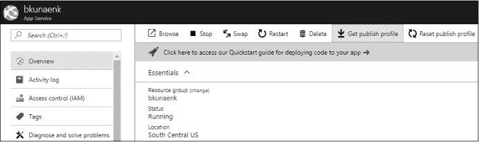
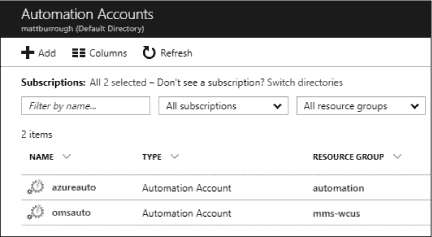
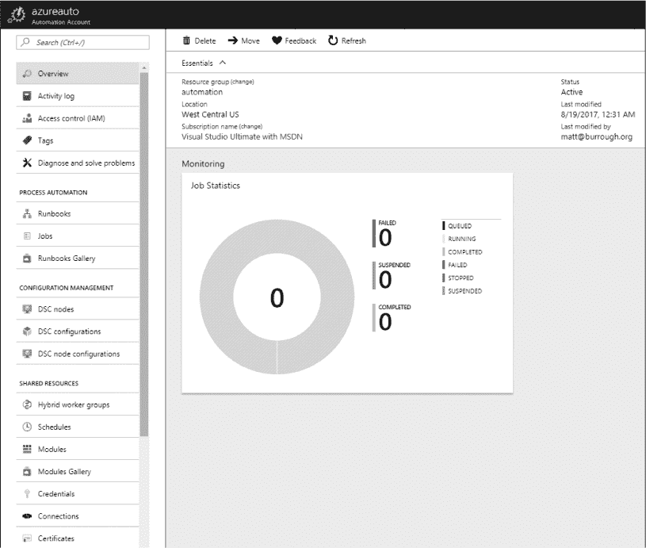
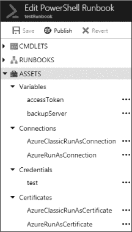
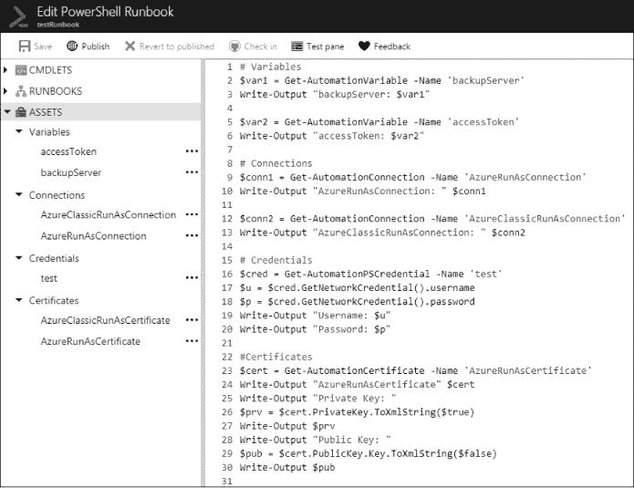
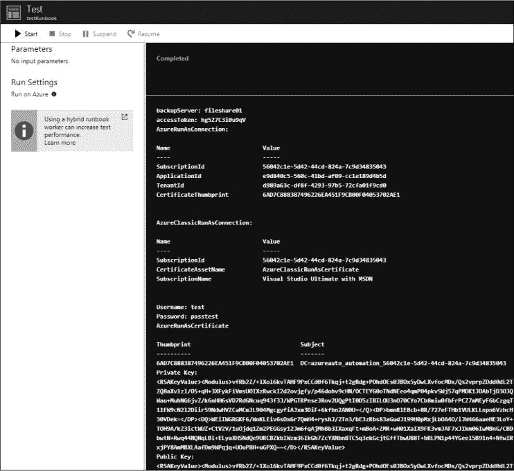
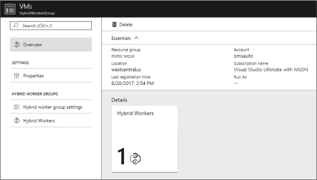
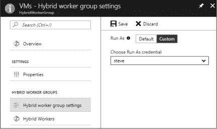
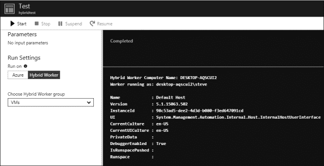

## 7

**其他 Azure 服务**


曾几何时，软件发布的时间表大致与奥运会相吻合——你最喜欢的操作系统、生产力套件或游戏的新版本大约每两年发布一次。尽管可能会有一些临时更新和服务包来修复漏洞，但急切渴望新功能的用户必须等待几个月，直到他们可以排队购买一个装满磁盘或 CD 的纸箱。然而，世界已经脱离了这种范式，发布周期大幅缩短，分发方式发生了变化，甚至公司盈利产品的方式也变了。

这一新模式在 Azure 中尤为明显，新的服务不断上线。在前面的章节中，我专注于任何采用 Azure 的企业可能会使用的核心服务。在这一章中，我们将探讨一些较新的、较少使用的或更具特色的 Azure 服务，并从安全角度审视一些有趣的服务。

我们首先来看看 Key Vault，这是一个用于在云中安全存储和检索凭证（如密码和证书）的机制。然后，我们讨论 Azure 应用服务中的 Web 应用功能，这是发布网站的一个特性。最后，我们将介绍 Azure 自动化服务，这是一个用于在云端和企业网络上自动化管理任务的服务。

### 最佳实践：密钥库

在 Key Vault 中存储秘密时，你可以采取几种措施来增加额外的安全层次，例如严格控制访问、预加密秘密和使用日志记录。这些措施使得一个本已强大的服务更加难以攻击。

首先，任何秘密存储解决方案的安全性都取决于拥有最弱安全实践的用户。因此，限制能够访问密钥库的人员数量至关重要。通过基于角色的访问控制（RBAC），可以为密钥库及其内容授予非常具体、细粒度的权限。然而，即使对密钥库的权限设置非常严格，如果密钥库位于一个有几十个拥有所有者权限且不需要访问密钥库的用户的订阅中，这也帮助不大。毕竟，这些用户中的任何人都可以利用他们的订阅权限授予自己访问密钥库的权限。为了防止这种情况，我建议你考虑为你的密钥库创建一个单独的订阅，特别是当它存储特别敏感的秘密时。有关密钥库强化的更多细节，请访问 *[`docs.microsoft.com/en-us/azure/key-vault/key-vault-secure-your-key-vault/`](https://docs.microsoft.com/en-us/azure/key-vault/key-vault-secure-your-key-vault/)*。

如果你使用 Key Vault 存储不会被其他云服务直接使用的机密，可能值得考虑在将机密放入 Key Vault 之前先进行本地加密。当然，Key Vault 会将所有数据以加密格式存储；然而，如果攻击者破坏了用于检索机密的帐户，他们可以获取解密后的机密。如果你在上传之前对机密进行本地加密（并将解密密钥存储在离线位置），即使攻击者获得了有访问权限的帐户，他们也只能拉取加密后的值，而无法获得明文机密。

与其他服务一样，Key Vault 的日志记录也非常重要。启用后，日志包含诸如密钥枚举、创建、读取、写入和删除等信息。这些日志包含有助于识别非法访问的详细信息，如调用者的 IP 地址和发起请求的帐户。有关 Key Vault 审计日志的更多细节可以在 *[`docs.microsoft.com/en-us/azure/key-vault/key-vault-logging/`](https://docs.microsoft.com/en-us/azure/key-vault/key-vault-logging/)* 中找到。

### 审查 Azure Key Vault

Azure Key Vault 是一项服务，允许开发者将密码、连接字符串、存储密钥、证书等安全地存储起来，以便在其他 Azure 服务中使用。作为渗透测试人员，我喜欢 Key Vault，因为我可以将其作为解决许多常见渗透测试问题的建议。而且，如果用户错误配置了 Key Vault 实例，它还可以成为进一步访问目标环境的凭证来源。

说我在大多数报告中将 Key Vault 作为潜在解决方案是毫不夸张的。在“获取凭证”的第 15 页，我演示了如何轻松地在源代码库、错误的配置文件甚至开发者工作站上发现密码和其他机密信息。Key Vault 提供了一个 API——大多数主要编程语言都有库和示例代码——使开发者能够轻松地将这些敏感信息存储在一个安全、受控访问、可审计的位置。尽管 Key Vault 并不能防止所有开发者的错误，但它在解决机密信息清理问题上表现优秀。

Key Vault 中提供了三种不同类型的存储：机密、密钥和证书。每种存储为渗透测试人员提供了不同的机会，详细内容将在以下各节中说明。

#### *显示机密*

机密是由名称和文本值组成的键值对；文本值可以大到 25KB，并支持版本历史。你可以在门户中、使用 API 或 PowerShell 查看机密的文本值——前提是你的账户具有正确的权限。因为机密可以被检索，微软的文档建议在保存机密到 Azure 之前，特别敏感的机密应先用公钥加密。解密机密的私钥将存储在 Key Vault 的 HSM 存储中，从而保护私钥和机密不被未经授权访问。

如果你怀疑某个账户可能有权限访问 Key Vault 实例及其机密，使用 PowerShell 一次性列出所有这些信息。为此，请运行清单 7-1 中显示的脚本。

```
PS C:\> ➊ $keyvaults = Get-AzureRmKeyVault
PS C:\> foreach ($keyvault in $keyvaults)
>> {
>>     $vault = $keyvault.VaultName
>>  ➋ $secrets = Get-AzureKeyVaultSecret –VaultName $vault
>>     foreach ($secret in $secrets)
>>     {
>>         $value = Get-AzureKeyVaultSecret –VaultName $vault -Name $secret.Name
>>      ➌ Write-Output "$vault`: $($secret.Name) = $($value.SecretValueText)"
>>     }
>> }

shhh: BackendDbConStr = Server=mydb;Database=prod;User ID=admin;Password=1234
shhh: password = MyB@dPassw0rd
```

*清单 7-1：显示 Key Vault 机密*

脚本首先获取订阅中 Key Vault 实例的列表 ➊。然后，在每个实例中检索所有机密的列表 ➋。最后，对于每个机密，它以 Vault 名称`:` 机密名称 `=` 机密值的格式输出该机密 ➌。

#### *显示密钥*

密钥存储允许用户将 RSA 非对称密钥生成或上传到 Key Vault。在 Vault 内部，这些密钥可以用于执行加密操作，如签名、验证、加密和解密，使用 Azure 的 API。密钥上传后，Azure 不允许用户导出它们，除非以加密备份的形式，这种备份仅能用于将密钥恢复到 Azure 中。

由于没有人可以导出密钥，Key Vault 的密钥存储部分对渗透测试者来说相较于机密存储稍显乏味。然而，如果你可以访问一个有权限调用加密 API 的账户，你仍然可能能够利用这些密钥。但在你能利用这些密钥之前，你需要知道每个密钥的使用方式。

Azure 要求每个密钥必须有一个名称，这个名称可能暗示其用途。它还允许用户为每个密钥关联最多 15 个*标签*（或 256 字符的名称-值对）。组织可以选择如何使用这些标签，这些标签可能会提供有关密钥用途的额外信息。清单 7-2 展示了如何使用 PowerShell 显示订阅中每个 Vault 的每个密钥的详细信息。

```
   PS C:\> $keyvaults = Get-AzureRmKeyVault
   PS C:\> foreach($keyvault in $keyvaults)
   >> {
   >>     $vault = $keyvault.VaultName
   >>  ➊ $keys = Get-AzureKeyVaultKey –VaultName $vault
   >>     foreach ($key in $keys)
   >>     {
   >>         Write-Output $key
   >>      ➋ Get-AzureKeyVaultKey –VaultName $vault -KeyName $key.Name
   >>     }
   >> }

➌ Vault Name     : shhh
➍ Name           : key1
   Version        :
   Id             : https://shhh.vault.azure.net:443/keys/key1
   Enabled        : True
➎ Expires        :
   Not Before     :
   Created        : 8/12/2018 4:54:07 AM
   Updated        : 8/13/2018 6:09:15 AM
   Purge Disabled : False
➏ Tags           : Name       Value
                    CreatedBy  Matt

   Attributes : Microsoft.Azure.Commands.KeyVault.Models.KeyAttributes
   Key        : {"kid":"https://shhh.vault.azure.net/keys/key1/Version",
                 "kty":"RSA",➐"key_ops":["sign","verify","wrapKey",
                       "unwrapKey","encrypt","decrypt"],"n":"4vaUgZCV3OG...",
                       "e":"AQAB"}
   VaultName  : shhh
   Name       : key1
   Version    : ed2ebbdc51754d45b69bd6551d2d2052
   Id         : https://shhh.vault.azure.net:443/keys/key1/Version
```

*清单 7-2：显示 Key Vault 密钥信息*

与机密检索脚本类似，密钥脚本从遍历 Key Vault 实例开始。在每个实例中，首先检索到密钥列表 ➊，然后打印每个密钥的详细信息 ➋。输出包括 Vault 实例名称 ➌、密钥名称 ➍、密钥有效期 ➎、标签 ➏ 以及密钥可执行的操作 ➐。

一旦确定了密钥的用途，你可能会将其用于相同的目的。例如，如果密钥用于签署文件以证明真实性，你可能会生成伪造文件。或者，如果它用于加密文件，你可以解密这些文件。在 PowerShell 中没有简单的方法来做到这一点，但 Microsoft 确实提供了`KeyVaultClient`类，它在`KeyVault`库中支持这些操作，并且可以在 .NET 和 Java 中使用。你可以在* [`www.microsoft.com/en-us/download/details.aspx?id=45343`](https://www.microsoft.com/en-us/download/details.aspx?id=45343)*找到示例代码。

#### *显示证书*

证书存储是 Key Vault 中“秘密”类别下的一个特殊类别。用户可以上传 PFX 文件，或者让 Key Vault 生成自签名证书或证书请求。然后，他们可以使用这些证书，例如，用于保护用户与自定义 Azure 应用程序之间的通信。Key Vault 的密钥和证书功能都涉及非对称加密，但它们的预期用途略有不同。密钥用于提交加密操作，并通过安全存储中的私钥执行操作。证书可以在不同的应用程序中使用，例如，用于加密的同时确认站点名称（以及其他属性和预期用途）的站点证书，因此即使在 Azure 外部也能使用。

Key Vault 会遵循添加到其中的证书的导出标志。因此，如果用户导入一个标记为不可导出的证书，攻击者将无法恢复它。但如果密钥标记为可导出，它就可以像其他 Key Vault 秘密一样被检索。事实上，如果用户在创建 Key Vault 证书时没有指定导出策略，它默认为可导出。列表 7-3 演示了如何列出 Key Vault 中的证书、查看其详细信息并获取公钥，以及（如果可访问）私钥。

```
PS C:\temp> $keyvaults = Get-AzureRmKeyVault
PS C:\temp> foreach ($keyvault in $keyvaults)
>> {
>>     $vault = $keyvault.VaultName
>>     $certs = Get-AzureKeyVaultCertificate –VaultName $vault
>>     foreach ($cert in $certs)
>>     {
>>         $cn = $cert.Name
>>      ➊  $c = Get-AzureKeyVaultCertificate –VaultName $vault -Name $cn
>>         $x509 = $c.Certificate
>>         Write-Output $c
>>      ➋  $privkey = (Get-AzureKeyVaultSecret -VaultName $vault 
                   -Name $cn).SecretValueText
>>         Write-Output "Private Key:"
>>         Write-Output $privkey
>>         Write-Output ""
>>         Write-Output "Exporting Public Key to $cn.cer..."
>>      ➌  Export-Certificate -Type CERT -Cert $x509 -FilePath "$cn.cer"
>>         Write-Output "Exporting Private Key to $cn.pfx..."
>>         $privbytes = [Convert]::FromBase64String($privkey)
>>      ➍  [IO.File]::WriteAllBytes("$pwd\$cn.pfx", $privbytes)
>>         Write-Output "----------------------------------------------"
>>     }
>> }

Name        : devcertificate
Certificate : [Subject]
                CN=test.burrough.org
              [Issuer]
                CN=test.burrough.org
              [Serial Number]
                72AF4152C9F54651B9AE039730FB1AAD
              [Not Before]
                8/13/2018 11:06:23 PM
              [Not After]
                8/13/2019 11:16:23 PM
              [Thumbprint]
                9C5A0E244E353369560EFBE4EDB015D3FDE54635

Id          : https://shhh.vault.azure.net:443/certificates/devcertificate/Id
KeyId       : https://shhh.vault.azure.net:443/keys/devcertificate/Id
SecretId    : https://shhh.vault.azure.net:443/secrets/devcertificate/Id
Thumbprint  : 9C5A0E244E353369560EFBE4EDB015D3FDE54635
Tags        :
Enabled     : True
Created     : 8/14/2018 6:16:23 AM
Updated     : 8/14/2018 6:16:23 AM

Private Key:
MIIKTAIBAzCCCgwGCSqGSIb3DQEHAaCCCf0Eggn5MIIJ9TCCBhYGCSqGSIb3DQEHAaCCBgcEggYD
--snip--
Exporting Public Key to devcertificate.cer...
LastWriteTime : 8/14/2018 9:23:48 PM
Length        : 834
Name          : devcertificate.cer

Exporting Private Key to devcertificate.pfx...
----------------------------------------------
```

*列表 7-3：显示 Key Vault 证书*

这个最终的 Key Vault 枚举脚本与其他脚本一样开始——通过遍历 Key Vault 实例，然后是证书。对于每个证书，你需要两次调用 Azure 才能获取其详细信息。第一次调用`Get-AzureKeyVaultCertificate`会检索关于证书的公共信息，包括主题、指纹、有效期和公钥 ➊。然后，调用`Get-AzureKeyVaultSecret`获取证书的私钥部分（如果可用） ➋。接下来，脚本将公钥值导出到当前工作目录中的证书文件（*证书名称.cer*） ➌。最后，创建一个包含公钥数据和私钥信息（如果可导出的）的 PFX 文件 ➍。

**DEFENDER’S TIP**

如果你不打算将证书用于 Key Vault 之外的地方，务必将其标记为不可导出。为此，在创建证书时，将 -KeyNotExportable 选项传递给 New-AzureKeyVaultCertificatePolicy cmdlet。如果你有非常敏感的证书或密钥，可以考虑 Key Vault 的物理硬件安全模块（HSM）选项。虽然这个选项比基于软件的 HSM 版本更昂贵，但证书被存放在行业标准的加密设备中，这些设备旨在防止私钥在添加到设备后被提取。

#### *通过其他 Azure 服务访问 Key Vault*

用户可以在 Azure 门户的高级访问策略设置中配置 Key Vault 实例，允许虚拟机、Azure 资源管理器和 Azure 磁盘加密访问，如 图 7-1 所示。


*图 7-1：Azure Key Vault 的高级访问策略——允许其他服务访问*

这些设置各有其用途：虚拟机可以在 Key Vault 中存储和访问 SSL 证书，Azure 资源管理器可以创建和部署需要机密的模板（例如虚拟机模板的本地管理员密码），Azure 磁盘加密使用 Key Vault 的机密存储来保存虚拟硬盘（VHD）的加密密钥。这些都是 Key Vault 的非常好的使用场景，比将这些机密提交到源代码管理系统要安全得多。然而，这也意味着具有管理虚拟机或修改和部署模板权限的用户，可能能够访问他们本不应查看的 Key Vault 数据。

**DEFENDER’S TIP**

因为高级访问策略是在 Key Vault 实例级别设置的，所以实例中的所有机密都遵循相同的策略。因此，最好创建多个密钥库，并限制每个库的访问权限，仅允许特定的服务访问。每个密钥库应仅包含那些所有拥有访问权限的服务所需要的机密。

### 针对 Web 应用的攻击

Azure 应用服务中的一部分子集，Web 应用是设计用于在 Azure PaaS（平台即服务）上运行的网站。开发人员可以使用多种语言编写 Web 应用——例如 ASP.NET、PHP、JavaScript、Node.js 和 Python——并在 Windows 或 Linux 容器中运行它们。识别这些网站通常很容易，因为它们默认的 URL 为 *<网站名称>.azurewebsites.net*，但如果在非免费服务层中部署，开发人员可以为 Web 应用设置自定义域名。

Web 应用是一个有趣的攻击目标，原因有几个：

+   它们是面向公众（互联网）的，因此篡改可能会对客户造成声誉损害。

+   它们使用的部署帐户可能会在开发人员工作站上被攻击者发现。

+   它们是 Azure 的热门功能，并被许多企业使用。

+   免费套餐中的站点通常是开发者测试站点，安全规划较少，但它们可能包含生产站点的机密信息。

+   他们的代码有时包含访问其他服务的凭证，例如 Azure SQL。

基于这些原因，渗透测试人员在 Azure 评估中应始终包括 Web 应用。

#### *部署方法*

当开发人员想将他们最新的站点版本发布到 Azure 时，他们必须做出两个选择：使用什么部署方法以及使用什么凭证进行身份验证。Web 应用支持几种不同的方式将代码加载到站点中：

+   FTP/FTPS

+   WebDeploy

+   Git 仓库（本地或在 GitHub 上）

+   来自外部服务的部署，例如 OneDrive、Dropbox 或 Bitbucket

熟悉这些方法是很有好处的；当你获得开发者工作站的访问权限时，这将帮助你识别哪些工具可能缓存了凭证或保存了源代码副本。

Web 开发者传统上使用 *文件传输协议*（*FTP*）将网站推送到服务器，尽管这不是一个好的选择，因为用户的凭证和文件内容是未加密发送的。如果你发现开发者使用 FTP，这本身就是一个问题！

幸运的是，Azure 也支持 *FTP Secure*（*FTPS*），它是加密的，也是一个可接受的选择。在任何找到已保存连接的地方，查看协议部分（位于服务器地址之前）以确定正在使用的连接类型。连接到 FTP 的用户会看到以 *ftp://* 开头的连接，而安全连接则会使用 *ftps://*。

另一种常见的部署方法是 WebDeploy，也叫做 MSDeploy，它可以通过 Visual Studio 或 *msbuild.exe*/*msdeploy.exe* 编译工具管道来发布编译后的项目。WebDeploy 最初不是用来发布到 Azure，而是开发者将站点部署到 Microsoft IIS Web 服务器时使用的。因此，我并不惊讶它似乎在使用 Microsoft ASP.NET 语言编写的站点中被广泛使用。WebDeploy 仅在 Windows 客户端上可用。你也可能遇到一个名为 *WAWSDeploy.exe* 的工具，它是 WebDeploy 的一个封装工具，简化了其使用。

对于使用 git 管理源代码的开发者而言，直接从 git 客户端进行部署是非常方便的。鉴于 git 的流行程度不断增长，我预计使用这种方法的开发者数量将显著增加。使用这种方法时，开发者只需从 Azure 门户获取部署凭证和 git 仓库 URL，然后使用 git 将站点推送到远程主分支。开发者不需要在工作站上安装任何特殊的工具或库。

Azure 还支持越来越多的外部服务，开发人员可以利用这些服务为 Web 应用阶段性地准备内容，例如 Visual Studio Team Server、OneDrive、Bitbucket 和 Dropbox。此功能通常被称为*云同步*，与前面讨论的其他方法不同。所有其他部署方法都在开发人员的系统上运行，使用从 Azure 获得的凭证，将内容推送到 Azure；但云同步则采用拉取模型。开发人员授权 Azure 访问他们的在线存储提供商，然后 Azure 从外部服务的指定文件夹中拉取内容到 Web 应用。

#### *获取部署凭证*

除了云同步以外的每种部署方法，Web 应用开发人员在上传文件到他们的网站时必须提供用户名和密码。这些部署凭证不同于用户的 Azure 门户登录信息——该账户无法用于部署网站。相反，开发人员可以选择使用用户特定的部署账户或站点特定的账户。无论哪种账户类型，都可以用于 FTP、WebDeploy 和 git 部署；两种凭证的区别在于它们的共享对象以及可以在哪里找到。

##### 用户部署凭证

每个 Azure 用户可以创建一个部署账户，用于添加、删除或更改他们有权限修改的任何网站上的文件，适用于他们可以访问的所有订阅。要创建此账户或重置其密码，用户必须执行以下操作：

1.  登录到 Azure 门户并导航到 **应用服务**。

1.  选择他们订阅中的任何 Web 应用（如果没有现有的，可以创建一个新的）。

1.  点击 **部署凭证**。

1.  指定用户名和密码。

账户创建后，账户持有者可以在他们的任何 Web 应用中使用该账户，站点之间只有轻微的差异。要连接到每个网站，用户必须以 *<网站名称>\<用户名>* 格式输入用户名，并指定他们的密码。例如，假设开发人员选择了用户名 *webadmin*，并指定 *Awe5omeDev#* 作为他们（相对较弱的）密码。要管理网站 *[`azweb8426.azurewebsites.net/`](http://azweb8426.azurewebsites.net/)*，开发人员将在他们选择的部署工具中输入 `azweb8426\`webadmin` 作为用户名，并输入 `Awe5omeDev#` 作为密码。如果开发人员之后想要在 *[`bkunaenk.azurewebsites.net/`](http://bkunaenk.azurewebsites.net/)* 上工作，他们将输入 `bkunaenk\webadmin` 作为用户名，并输入 `Awe5omeDev#` 作为密码。

由于相同的凭证被广泛用于所有站点，攻击者如果破坏了它，就可以修改任何该开发人员有权限访问的站点——甚至是一些与该开发人员无关的站点，只要它们位于同一个订阅中，并且权限设置过于宽泛。假设有一个拥有 50 名管理员的订阅，每个管理员都拥有并管理一个站点，但他们都没有更改自己站点的所有者或贡献者权限——因此，任何拥有订阅访问权限的人都可以修改该站点。一个仅有个人博客的开发人员可能不会特别关注保护自己的凭证，而另一个负责公司主页的开发人员则可能会非常小心地保护自己的密码。在这种情况下，第一个开发人员的凭证就可以对第二个开发人员的站点进行修改！这同样适用于一个开发人员拥有多个 Web 应用的情况，其中只有部分应用是重要的。

那么，在哪里可以找到用户的部署凭证呢？这取决于用户，但通常你可以在 FTP 客户端、密码管理器或用户主目录中的 git 凭证存储文件（如 *.git-credentials*）中找到它们。但如果用户通过 Visual Studio 使用 WebDeploy 或 FTP，你可能就没戏了。Visual Studio 会将用户的密码保存在一个加密的 Blob 中，存储在名为 *<Website>-<Method>.pubxml.user* 的 XML 文件里，例如 *bkunaenk-FTP.pubxml.user*。此外，这个 Blob 还包含与之关联的工作站和用户的详细信息，因此你无法在其他用户的会话或不同的电脑上使用它。

**注意**

*你可以在 Azure 门户中重置部署账户，而无需知道当前密码，因此，如果你有门户访问权限，你可以随时将密码更改为不同的值。然而，如果账户突然无法使用预期密码，用户可能会注意到。还需要注意的是，部署账户本身并不授予门户访问权限，只是能够更改 Web 应用文件的权限。*

##### 应用部署凭证

另一种部署凭证是应用特定的。每个 Web 应用都有一个单独的部署凭证，该凭证在该站点的所有开发人员之间共享，并且可以在与用户部署账户相同的地方使用：FTP、WebDeploy 和 git。

这种类型的账户比用户部署凭证具有稍低的风险，因为如果凭证泄露，攻击者只能修改单一站点。然而，凭证的安全性取决于持有它的开发人员的安全意识最差的情况。此外，如果攻击者破坏了多个用户可以访问的凭证，那么可能很难确定漏洞发生的具体位置。最后，共享账户在员工离职、被解雇或角色变动时往往不会重置，因此用户的访问权限可能会比预期的持续更长时间。

Azure 门户不会显示应用部署凭证。相反，开发人员可以通过在 Azure 门户中导航到 Web 应用，然后点击概览标签上的 **获取发布配置文件** 按钮，如 图 7-2 所示，来获取凭证。如果管理员担心账户已被泄露，他们可以使用相同工具栏上的 **重置发布配置文件** 按钮重置凭证。



*图 7-2：获取 Web 应用的发布配置文件*

**获取发布配置文件** 按钮会启动一个下载，下载的文件名为 *<App Name>.publishsettings*。你可能记得发布设置文件来自 第二章（第 23 页），它们是包含订阅管理证书的 XML 文件。这些发布设置文件也是 XML 文档，但在这种情况下，它们包含有关 Web 应用的详细信息，而不是订阅信息。每个 Web 应用的发布设置文件包含以下内容：

+   Web 应用目标 URL

+   用于 WebDeploy 和 FTP 部署的 URL

+   应用部署用户名，始终为 *<App Name>\<App Name>$*

+   应用部署密码，它是一个明文的、60 字符的字母数字字符串

文件中还可能包含一些可选数据，例如应用所依赖的数据库的连接字符串以及 Azure 门户的 URL。

因为此账户的密码没有加密，其他用户可以复制 Web 应用的发布设置文件，并从另一台计算机使用它。所以，如果你能够访问开发工作站或代码仓库，请查找这些文件，因为它们将包含连接到 Web 应用服务器所需的所有信息。

#### *在 Web 应用服务器上创建和搜索工件*

一旦你访问了应用服务器，你可能需要做一些事情。首先，如果你需要向客户证明你已访问服务器，可以考虑放置一个小的文本文件，文件扩展名为 *.config*，声明你曾经在那里。这种标记比公开可见的更改要好得多，而且因为应用服务器不会将 *.config* 文件暴露给网页浏览器，网站的用户无法看到它；只有登录到服务器的管理员才能看到。

你还可以使用服务器尝试捕获凭证，通过修改 Web 应用隐秘地将登录信息以安全的方式存储下来。或者，你可以向网站添加一个页面，用于网络钓鱼，因为用户可能会信任这个页面，因为它托管在一个合法的网站上。

**警告**

*在修改或添加公共网站页面之前，一定要确保你的参与规则允许进行此类活动——特别是当你添加代码以外泄用户信息或凭证时。这通常在渗透测试中是禁止的！如果有任何疑虑，请与客户和律师确认。像往常一样，你还应该确保记录并跟踪你所做的任何更改，以便在参与结束时完全撤销所有更改。*

我在入侵 Web 服务器时最喜欢做的事情之一是寻找不向站点用户暴露的机密。例如，*.config*、*.asp*、*.aspx* 和 *.php* 文件通常不会直接返回给用户请求的内容。因为 *config* 文件通常包含机密信息，所以它们根本不会返回，而 ASP 和 PHP 文件会首先在服务器上呈现，然后只返回客户端准备好的结果。通过 FTP 访问这些文件，你可以查看原始代码，保留任何嵌入的机密信息。然后，你通常可以进一步访问数据库服务器或其他后端系统。

除了未提供服务的文件，应用服务器可能还包含一些难以找到的文件。例如，开发人员可能会将页面上传到服务器，但延迟在站点的其他页面上链接它们，直到某个特定的时间，比如新产品发布时。有些开发人员可能会创建仅供那些知道如何找到它们的人访问的页面，例如管理员登录表单。发现这些文件可能会被视为一个发现点，如果这些信息在公开时会对客户造成伤害，或者如果该信息依赖于“通过模糊性实现安全”来保护。机密数据不应在面向公众的网站上可以访问，即使它不容易被发现。

### 最佳实践：Automation

Azure Automation 是一个强大的工具，用于自动化云端和本地的重复任务。然而，它能够执行多种任务，也使其在被恶意行为者使用时成为一个安全隐患。以下是一些帮助保持 Azure Automation 作业安全的步骤。

开始时要小心你在 Azure Automation 的变量存储中放置了哪些值或 *资产*。Automation 允许用户存储像凭证这样的东西，凭证可以被作业用来访问它们执行工作所需的资源。资产是加密存储的，但由于运行中的作业需要使用它们，因此解密密钥存储在可以访问 Automation 的 Key Vault 中。这意味着任何可以创建并运行作业的人，都能够获取任何资产的明文值，正如在“获取 Automation 资产”一节中，位于第 152 页所描述的那样。如果你存储凭证作为资产，请确保这些凭证拥有完成任务所需的最少权限。

接下来，如果你计划让自动化在你的企业环境中启动任务，你需要设置混合工作者，这涉及到在本地系统上安装一个代理，详细内容见第 157 页。默认情况下，这些代理将在这些服务器上使用本地系统帐户运行作业，这意味着作业将具有对运行它们的服务器的完全管理员访问权限。因此，你绝不应该将敏感系统配置为混合工作者。尽管混合工作者及其运行的作业肯定需要某种程度的资源访问权限才能完成任务，但请确保创建一个良好的威胁模型，并考虑到这种云到企业访问可能带来的任何风险。

### 利用 Azure 自动化

另一个值得讨论的最终服务是 Azure 自动化，它本质上是云中的一个复杂任务调度程序。管理员使用 PowerShell 或 Azure 门户中的图形编辑器创建 *运行簿*，即任务的工作流。运行簿可以执行多种多样的操作。例如，它可以每五分钟解析一次日志文件，然后在发生严重错误时向管理员发送警报。如果某个任务是重复性的，使用云资源，并且可以用 PowerShell 脚本化，那么它是自动化的一个良好候选项。

尽管 Azure 自动化是一个功能复杂的服务，具有许多功能，但有两个组件对安全专业人员尤为重要：资产和混合工作者。自动化资产是 Azure 中的另一个位置，用户可以在其中存储机密，类似于一个 Key Vault 实例。混合工作者允许运行簿使用本地资源执行任务，这与第六章中某些网络桥接技术类似。

#### *获取自动化资产*

任何曾在系统管理中工作过的人，可能都写过数十个，甚至数百个脚本，以提高工作效率并减少繁琐的工作。尽管这些脚本在作者、组织和目标平台之间差异很大，但几乎每个脚本都有变量和输入数据。通常，这包括脚本应该使用的帐户、目标系统的列表以及记录任何输出的位置。

Azure 自动化需要允许这种输入，以便其运行簿能够提供比最基本功能更多的功能。但与传统脚本不同，运行簿是由 Azure 执行的，而不是由用户从命令行执行。为了弥补这一差距，Azure 自动化允许用户在自动化服务中声明并保存变量、凭据、连接和证书——统称为 *资产*。运行簿可以引用这些资产，但它们不是特定于运行簿的；它们在一个自动化帐户内的所有运行簿之间共享。尽管一个订阅可能有多个自动化帐户，但资产在这些帐户之间是不可共享的。

让我们讨论四类资产，它们相似但有微妙的区别：

**变量**

在定义变量时，开发人员提供名称、数据类型、值和可选描述，并指定是否应加密存储值。如果设置了加密标志，Azure 门户将不会显示该变量的数据类型，并且值字段将显示为星号。然而，由于运行簿需要能够使用该值，用户可以通过在运行簿中使用 `Get-AutomationVariable` cmdlet 来显示变量，无论它们的加密状态如何。

**连接**

连接用于在运行簿中登录到 Azure 订阅。用户可以使用 `Get-AutomationConnection` cmdlet 检索连接，它返回一个哈希表，其中包含以下键的值：`SubscriptionId`、`ApplicationId`、`TenantId` 和 `CertificateThumbprint`。通常，这些值会在随后的调用中用于 `Add-AzureRMAccount` 以连接到所需的订阅。连接对象本身不包含任何机密数据。

**凭据**

在 Azure 自动化中，凭据存储在 `PSCredential` 对象中，包含对象名称、用户名、密码和可选描述。与加密变量类似，凭据在 Azure 门户中被加密，以保护其密码。即使使用 `Get-AutomationPSCredential` cmdlet 来检索凭据，Azure 也不会显示值，因为它期望开发人员将返回的整个 `PSCredential` 对象传递给任何需要该账户的系统。然而，用户可以通过调用 `PSCredential` 对象上的 `GetNetworkCredential` 函数来显示密码和用户名。

**证书**

用户可以以 *.cer*（仅公钥）或 *.pfx*（公钥和私钥）形式将 X.509 证书上传到 Azure 自动化。当创建自动化帐户时，Azure 提供了一个选项，可以自动填充证书存储，其中包含两个可以用于管理 ASM 和 ARM 资源的证书：`AzureClassicRunAsCertificate` 和 `AzureRunAsCertificate`。如果用户拒绝此选项，Azure 会第二次提示用户确认，因为这些证书对于完成 Azure 中的任务非常有用。因此，您应该期望在几乎所有遇到的自动化帐户中看到这些证书。尽管用户可以上传用于任何目的的证书，但自动化中的证书通常与连接一起使用，以管理其他 Azure 资源。您可以使用 `Get-AutomationCertificate` cmdlet 检索证书，它将检索证书的详细信息、公钥和私钥（如果存在）。

使用刚才讨论过的 cmdlet 和函数，您可以创建一个 runbook 来收集可能有助于进一步渗透客户端环境的资产值。首先打开 Azure 门户，从服务列表中选择 Azure 自动化。在**自动化帐户**窗口中，检查是否有现有的自动化帐户，如图 7-3 所示。



*图 7-3：Azure 自动化帐户列表*

如果没有列出任何项，则目标订阅没有使用自动化，您可以跳过此部分。如果列出了多个帐户，您需要对每个帐户执行本节中的步骤。点击某个自动化帐户的名称以打开它。接下来，您应该看到类似于图 7-4 的视图。

一旦显示出特定帐户，您可以浏览查看自动化的使用情况。点击**Runbooks**并查看脚本的名称。如果有任何看起来有趣的，点击它们，然后点击**编辑**查看其源代码——只是确保不要保存任何更改。您还可以通过点击左侧菜单中**共享资源**部分下的各种标签，快速浏览可用的资产，如图 7-4 所示，但 Azure 不会显示任何机密值。

要显示所有资产，包括密码、加密变量和证书私钥，点击**Runbooks**，然后点击页面顶部的**添加 runbook**。在出现的菜单中，点击**创建新的 runbook**，然后为 runbook 提供一个名称，并选择**PowerShell**作为 runbook 类型。最后，点击**创建**。



*图 7-4：自动化帐户的主视图*

一个空白的 runbook 将出现。在左侧，树状视图提供了可用的 PowerShell cmdlet、其他 runbook，以及最重要的，可以使用的资产列表。展开**资产**对象以及每个嵌套项，如图 7-5 所示。

对于每个听起来有趣的资产，您可以点击资产名称旁边的省略号菜单，然后点击**添加到画布**。这将向 runbook 中添加一行新代码，用于检索该资产。对于变量和连接，这足以显示这些元素中有趣的部分。然而，对于凭证和证书，您需要添加几行额外的代码来获取密码和私钥。



*图 7-5：runbook 可用资产列表*

对于密码，将`Get-AutomationPSCredential`凭证的输出存储在一个变量中，然后使用`GetNetworkCredential()`获取用户名和密码值，如下所示：

```
$cred = Get-AutomationPSCredential -Name 'credential_name'
$cred.GetNetworkCredential().username
$cred.GetNetworkCredential().password
```

查看证书时，我喜欢显示证书的名称和指纹，以及其公钥和私钥的 XML 格式。这应该足以将证书导入到不同的系统中，以便在 Azure 外部使用。要做到这一点，请在 runbook 中输入以下内容：

```
➊ $cert = Get-AutomationCertificate -Name 'certificate_name'
➋ $cert
➌ $cert.PrivateKey.ToXmlString($true)
➍ $cert.PublicKey.Key.ToXmlString($false)
```

这将把证书对象保存到变量 ➊ 中，显示其指纹和主题 ➋，并输出其私钥 ➌ 和公钥 ➍。图 7-6 显示了准备执行的完整 Runbook。



*图 7-6：完成的 Runbook 用于检索资产*

一旦您对您的 Runbook 感到满意，点击**保存**，然后点击**测试窗格**。这将打开一个新视图，在该视图中您可以点击**开始**来执行 Runbook。运行结束后，任何输出将以白色显示，如图 7-7 所示。如果您的 Runbook 出现异常，错误信息将以红色显示在输出区域。



*图 7-7：带有输出的 Runbook 测试窗格*

在测试窗格中，您可以看到完成的 Runbook 执行情况，以及变量值、连接详情、凭据用户名和密码、证书详情，以及您请求的公钥和私钥。然后，您可以利用这些信息进入之前可能无法访问的订阅、服务或系统。

#### *混合工作节点*

除了能够在云中自动化任务外，Azure 自动化还能够在公司网络上执行任务。Azure 提供了一个软件包，管理员可以将其安装在多个本地系统上。这些机器随后成为*混合工作节点*，接收来自 Azure 自动化的命令并在公司网络上执行。这类似于第六章中讨论的网络桥接技术；不过，那些服务是为在公司与云之间传输数据而设计的，而混合工作节点则用于向公司系统发送管理命令。

##### 混合工作节点机制

设置混合工作节点并不简单。管理员需要在*[`mms.microsoft.com/`](https://mms.microsoft.com/)*创建一个操作管理套件（OMS）账户，在 OMS 门户中启用自动化解决方案，在他们希望作为混合工作节点的机器上下载并安装一个名为 Microsoft 管理代理的程序，然后在这些系统上运行*New-OnPremiseHybridWorker**.ps1*脚本，指定工作节点应使用的订阅和自动化账户。因此，您不太可能在每个自动化账户中找到一个混合工作节点，但那些有混合工作节点的账户很可能正在使用它。对于渗透测试人员来说，这是个好消息，因为这意味着混合工作节点系统通常是在线的，并且可以访问公司网络上的有趣账户和系统。

安装后，混合工作者通过运行名为*MonitoringHost.exe*的系统中心管理服务主机进程来操作，该进程通过 HTTPS 与*azure-automation.net*服务器进行通信，查找任务。一旦找到任务，它会生成一个*Orchestrator.Sandbox.exe*实例，该实例随后运行运行簿脚本。如果需要，*Orchestrator.Sandbox.exe*可以启动*conhost.exe*进程来执行非 PowerShell 命令。默认情况下，所有这些进程都以*NT AUTHORITY\SYSTEM*账户运行，这意味着运行簿具有对充当混合工作者的系统的管理权限，但它们不会自动访问域上的其他系统。此时，*凭证资产*—即存储在 Azure 自动化中的凭证供运行簿使用—就派上用场了；如果运行簿需要访问公司域上的其他系统（例如，从网络共享复制文件），则需要使用具有这些权限的账户。运行簿开发人员可以通过`Get-AutomationPSCredential` cmdlet 直接在脚本中使用凭证，或者可以设置混合工作者以凭证资产的身份运行所有脚本。无论哪种方式，开发人员都必须将凭证存储在自动化账户中。

##### 识别混合工作者

判断一个自动化账户是否包含混合工作者很简单：在 Azure 门户中，导航到一个自动化账户实例，然后点击账户菜单中的**混合工作者组**。可能会列出一个或多个工作者组；每个组是一个可以分配工作的一个或多个混合工作者的池。要查看某个组中有哪些机器，请点击组名。这将打开该组，如图 7-8 所示。



*图 7-8：混合工作者组面板*

在此面板中，您可以通过点击**混合工作者**图标来查看此组中各个服务器的名称。您还可以通过点击**混合工作者组设置**来查看该组中的工作者是否以默认的本地系统账户运行，或是否使用凭证资产，如图 7-9 所示。



*图 7-9：展示使用自定义凭证的混合工作者组设置*

给定组中的所有混合工作者都使用相同的凭证运行。

##### 使用混合工作者

当我找到一个带有 Hybrid Workers 的自动化账户时，我立刻好奇我能用它做什么。如果你是一个外部人员，通过自动化作为进入网络的入口点，你可能完全不知道 Hybrid Worker 服务器或凭据资产可以访问哪些内容。一个好的入门方法是查看账户中现有的任何运行手册。通过这种方式，你将了解订阅是如何使用自动化的，并且至少了解一些可以使用凭据资产的系统。为此，选择 Azure 门户中自动化账户的**运行手册**标签；然后点击任意运行手册并点击**编辑**按钮。这将显示源代码。

在自动化账户面板中，你可能还想查看活动日志和调度标签。活动日志标签让你查看最近运行的任何任务，以及是否有人对运行手册、Hybrid Worker 组或资产进行了更改。调度标签显示任何即将执行的运行手册，这在你计划修改现有运行手册并需要知道下一个将执行的是哪个时非常有用。

一旦你对自动化账户有了一些了解，你可能会创建或修改一个运行手册，以便在 Hybrid Worker 上运行代码。为此，按照我们在“获取自动化资产”中所做的相同步骤来创建一个运行手册，详见第 152 页。一个好的初始测试运行手册可能是这样的：

```
Write-Output "Hybrid Worker Computer Name: $env:COMPUTERNAME"
Write-Output "Worker running as: $(whoami)"
Write-Output $host
```

这个运行手册显示了分配的工作者的名称，脚本以哪个账户运行，以及一些关于主机进程的信息。

一旦运行手册完成并且你打开测试面板，你将看到一个标有*运行在*的选项。选择**Hybrid Worker**按钮，而不是 Azure，然后从**选择 Hybrid Worker 组**下拉列表中，选择你想执行代码的组。你不能为运行手册选择特定的工作者；自动化将根据其调度器分配任务。一旦点击**开始**，任务将被发送到一个工作者，结果将在测试面板中显示——就像运行手册在 Azure 上运行时一样，如图 7-10 所示。



*图 7-10：在 Hybrid Worker 上完成的运行手册执行*

此时，你已经有了一个相当理想的渗透测试设置。你有一个可以访问私有网络的外部入口点，拥有该网络的凭据，并且有现有的脚本作为起点。从这里，你可以使用你最喜欢的 PowerShell 命令进行后期利用，探索网络，切换到其他系统，收集战利品，等等。

### 总结

在本章中，我们介绍了三个 Azure 独有的服务：Key Vault、Web Apps 和 Azure Automation。每个服务都对信息安全专业人员提出了挑战，同时也带来了机会。Key Vault 可以解决渗透测试人员发现的许多问题，但如果配置错误，也可能会有自身的问题。Web Apps 使得新网站的开发和部署变得非常简单，但也存在一些凭证管理的问题风险。而 Azure Automation 尽管是一个学习起来较为复杂的服务，从安全角度来看，最有趣的组件与 Azure 中其他部分使用的概念相似，如 Key Vault 和 Service Bus，具有类似的风险和威胁模型。

在下一章，我们将转换话题，探讨 Azure 的安全监控功能如何检测并警告非法活动。
