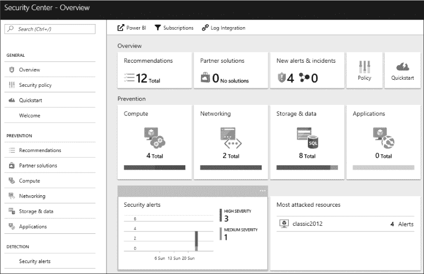
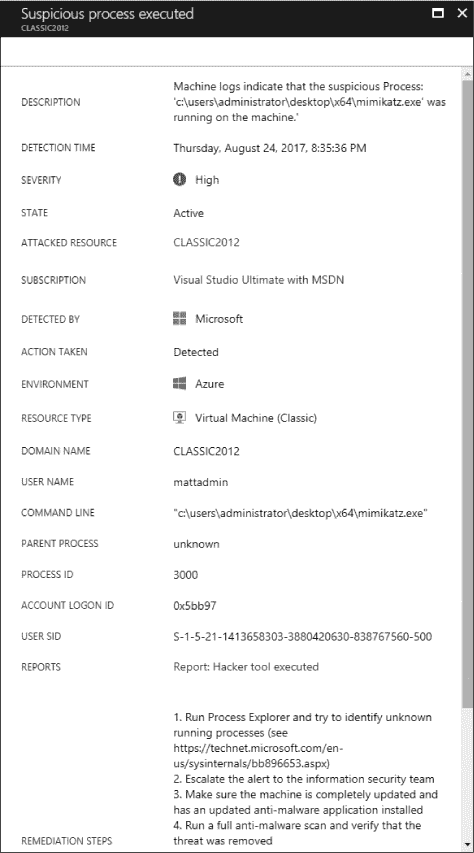
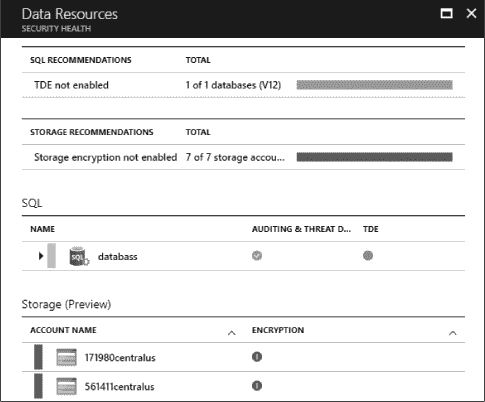
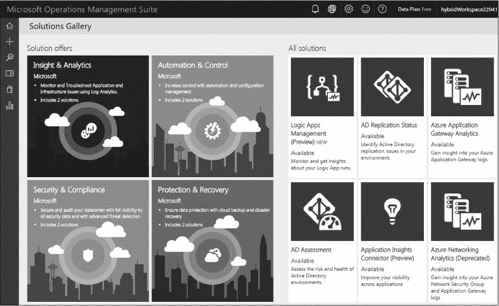
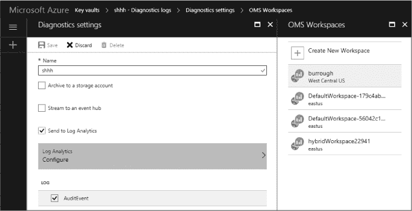
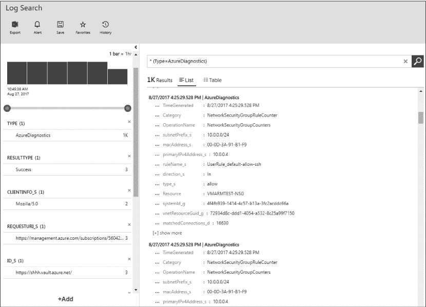
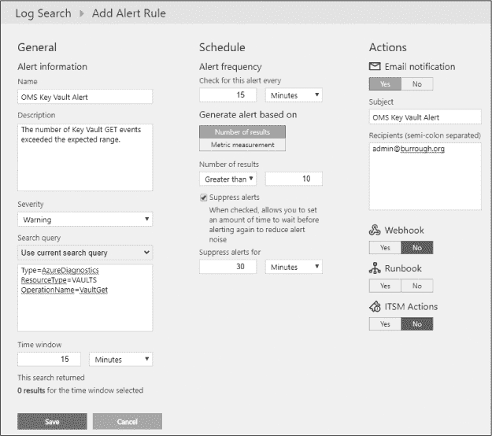
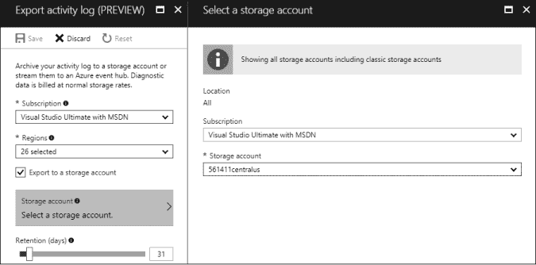

## 8

**监控、日志和警报**


渗透测试人员面临一个悖论，我们常常在尽力规避检测的同时，也希望防御者能够及时阻止我们的行动。进攻性安全专业人员的工作不仅仅是发现和解释客户系统中的漏洞，还包括帮助负责监控和保护企业的人员提升他们的技能。渗透测试可以帮助确定防御者规则和警报中的漏洞，同时保持防御者的敏锐度和实战经验，以备真实对手的到来。

本章与前几章中介绍的渗透测试技巧和工具有所不同。我将介绍防御者应当审查的监控工具、日志和警报，以便检测本书其余部分描述的攻击者行为。如果蓝队在使用这些资源，攻击者将更难在不被发现和驱逐的情况下取得进展。

我从 Azure 安全中心（ASC）开始介绍，它是一个将来自不同服务和系统的安全建议和事件汇总的 Azure 特性。接着，我将介绍操作管理套件（OMS），它收集事件并提供 Azure、企业网络及其他云提供商系统的集中管理。然后，我将介绍安全 DevOps 工具包，它是一个用于保护订阅、启用重要警报并提供持续保障的脚本包。最后，我们将讨论如何收集 Azure 服务日志，超出管理工具的范围。

### Azure 安全中心

Azure 安全中心是 Azure 中的一项服务，它将关键信息汇总到一个视图中。通过整合这些数据，安全中心使得没有全职安全人员支持的管理员能够快速验证他们服务的安全性。即使是包含防御人员的团队，也可以覆盖更多的订阅，并释放员工投入更多时间进行主动防御。如果在订阅中没有启用 Azure 安全中心，这本身就已经是渗透测试人员的一个发现。

虽然最初仅限于来自 Azure 服务的安全事件，安全中心自 2017 年中期起开始接收来自非 Azure 系统的事件。这被称为*混合安全*，并且对 Azure 安全中心付费服务的用户开放。Azure 安全中心分析从外部系统导入到 OMS 工作区的日志，这些工作区在“设置 OMS”中的 第 169 页有详细描述。

安全中心有两个主要组件：检测和预防。*检测*标记针对订阅资源的潜在非法活动，*预防*检查服务配置，以识别缺失的安全控制措施。让我们更深入地了解这两者。

#### *利用安全中心的检测功能*

对于任何防御者来说，一个关键要求是威胁检测和警报。安全中心通过查看日志并在虚拟机上安装小型监控代理来监控虚拟机和 SQL 数据库。当安全中心检测到异常时，它会在 Azure 门户的安全中心面板中生成一个警报，如图 8-1 所示。可选地，安全中心可以生成并将电子邮件发送给指定的安全联系人或订阅所有者。

**注意**

*威胁检测功能仅对使用付费（标准）版本的安全中心客户启用，该版本根据订阅中虚拟机和数据库的数量按月收费。安全中心的版本设置在订阅级别，因此无法单独为资源启用或禁用该服务。如果客户希望为生产工作负载启用威胁检测，但又不想为测试系统支付安全中心的费用，可以考虑将资源拆分到两个订阅中——一个使用安全中心的付费选项，另一个使用免费版。理想情况下，安全中心会监控所有节点，但安全建议往往需要与预算现实进行竞争。*



*图 8-1：Azure 安全中心主视图，带有警报*

安全中心会对多种威胁发出警报，从基于主机的检测到网络事件。以下是一些可用警报的列表：

+   对远程桌面的暴力破解登录尝试

+   对 SSH 的暴力破解登录尝试

+   存在一个名称与已知恶意软件匹配的二进制文件

+   执行具有已知恶意软件签名的二进制文件

+   当二进制文件执行可疑操作时（通过启发式方法确定）

+   对数据库的 SQL 注入攻击

除了记录触发警报的资源外，安全中心还提供关于事件的详细信息和修复问题的建议，如图 8-2 所示。在这里，管理员可以看到可疑程序的名称、运行该程序的位置、执行者、为什么认为该程序有危险以及如何解决问题的步骤。



*图 8-2：Azure 安全中心检测警报*

在云中运行服务的一个常被忽视的安全优势是，云提供商可以观察所有服务中的趋势。然后，他们可以利用这些信息更好地检测针对客户资源的威胁。例如，微软追踪已知网络犯罪团伙的 IP 地址，并监控 Azure 虚拟机的出站流量，以检测攻击者的指挥与控制通信。通过 Azure 安全中心，微软可以随着新的黑客攻击和检测技术的出现，随时添加新的警报，这些更新会立即生效，Azure 客户无需任何干预。

#### *利用安全中心的预防功能*

除了警报外，安全中心还为多种服务提供主动的安全建议。这些建议不是对适当规划、威胁建模和安全评估的替代，而是一些预防性建议，旨在帮助消除一些最常见的安全错误。预防性建议包括在安全中心的免费和付费版中。

例如，安全中心会检查以确保虚拟机已完全打补丁并运行端点保护软件。它还会建议对虚拟机应用 Azure 磁盘加密，这可以防止第五章中描述的离线 VHD 分析攻击。在虚拟机之外，安全中心将检查是否启用了 Azure SQL 数据库和存储账户的加密，以保护静态数据，如图 8-3 所示。



*图 8-3：Azure 安全中心关于 SQL 和存储的预防性建议*

此外，预防警报可以帮助确保随着用户部署新资源或服务进行维护，安全性不会随着时间的推移而退化。如果管理员忽视虚拟机（VM）并未安装补丁，这将变得非常明显，因为在 Azure 安全中心页面的计算状态面板上会显示红色警报。如果工程师为故障排除暂时禁用了防火墙，这也会触发警报。但最重要的是，如果 Azure 添加了客户端之前未使用过的新安全功能，安全中心会提醒客户端，他们的服务未能充分利用所有可用的保护功能。鉴于 Azure 更新的快速节奏，跟上所有当前最佳实践是很困难的，但 Azure 安全中心可以帮助管理员将这项任务从工作负担中剔除。

如果在评估过程中发现有未解决的预防警报，您应该与客户讨论这个问题。以下是客户可能提供的一些解释：

+   他们不愿意或没有时间查看安全中心。

+   他们认为某个警报不重要或不适用，或者他们通过其他控制措施解决了这个问题。

+   他们觉得解决警报的成本太高，或者修复措施与他们的部署不兼容。

+   他们认为 Azure 触发了一个误报。

进行更深入的对话，以真正了解任何这些情况中发生的事情。如果客户完全忽略安全中心，我会担心他们没有正确地将安全放在优先位置。安全中心是市场上最容易使用的安全工具之一，他们应该使用它。如果他们认为已经通过其他方式解决了警报，你应该确认他们的修复确实解决了警报所暗示的威胁。如果客户已经进行过成本效益评估，并决定解决标记的风险的解决方案太昂贵，这可能很难争辩，但在这种情况下，确保客户了解他们所接受的威胁的具体性质。

最后，如果警报是误报，告诉客户他们可以点击警报并选择**忽略**以将其隐藏。他们还可以通过访问安全中心，选择**安全策略**，点击订阅名称，点击**预防策略**，然后将任何规则集切换为**关闭**来禁用订阅中的整个预防策略类别。然而，他们应该完全确定这确实是误报。在这种情况下，他们也可以考虑向微软提交反馈。截至目前，我还没有遇到过安全中心的预防规则集中真正的误报。

### 操作管理套件

Azure 安全中心旨在为 IT 管理员提供其服务中的安全相关问题视图。尽管这对于以一个视图查看威胁的汇总信息非常有用，但这意味着团队需要在其他地方查看与安全无关的事件或执行与安全无关的管理任务。为了应对跨多个环境管理系统的难题，微软提供了云平台——操作管理套件（OMS），该平台可以汇聚来自本地和云托管系统与服务的日志、警报和自动化信息。

**注意**

*微软已经将许多最初仅限于 OMS 的安全功能添加到 Azure 安全中心，包括从 Azure 以外的系统查询日志的功能。这使得防御者能够使用单一的控制面板来监控整个环境。然而，这些功能仍然可以通过 OMS 访问，并且两个系统使用相同的 OMS 工作区。*

OMS 允许用户启用各种解决方案或模块，以提供特定的功能。其中一个核心解决方案是安全性与合规性，它监控主机上的反恶意软件服务状态、系统面临的威胁以及补丁级别。OMS 还提供其他可以增强安全意识的解决方案，例如活动目录健康检查、Azure 网络安全组分析、SQL 服务器评估和密钥保管库分析。OMS 中还有与安全无关的解决方案，例如用于启用 Azure 自动化混合工作者的自动化组件，您在第七章中看到过。

#### *设置 OMS*

由于 OMS 将多个环境的管理连接在一起，它需要进行一些设置。要使用 OMS 来监控服务，请执行以下步骤：

1.  在*[`mms.microsoft.com/`](https://mms.microsoft.com/)*创建一个 OMS 工作区。

1.  在 OMS 工作区启用所需的任何解决方案。

1.  启用 OMS 将监控的任何 Azure 服务的日志分析。

1.  在任何需要监控的非 Azure 服务器上安装代理。

首先，管理员创建一个*工作区*，它是 OMS 相当于 Azure 订阅的存在。多个人员可以共享一个工作区，企业可以选择拥有多个工作区，以便将不同系统的管理分配给不同的人组。

第二步，管理员需要将*解决方案*添加到他们的工作区。每个解决方案代表 OMS 可以使用的不同类型的日志、代理或服务。在订阅内，有一个*画廊*，它由一个购物袋图标表示，包含了几十个可用的解决方案。OMS 用户可以点击任何一个解决方案，获取更详细的功能描述及相关费用（如果有的话），或者在他们的工作区启用该解决方案。工作区可以包含用户所需的任意数量的解决方案。图 8-4 展示了画廊中的一些提供内容。

第三步，服务日志需要转发到 OMS，以便管理员启用任何特定于 Azure 的解决方案。为了让 OMS 能够分析日志，它需要访问这些日志，但 Azure 的日志并不会自动提供给 OMS。相反，具有必要权限的管理员必须登录 Azure 门户，在 Azure 订阅和 OMS 工作区中启用每个资源的日志转发。尽管在首次配置 OMS 时这可能有些繁琐，但它允许管理员选择订阅中各个服务的实例进行监控；这可以避免数据过度共享，使不同的服务可以将日志发送到不同的工作区（例如，测试服务日志发送到一个工作区，而生产日志发送到另一个工作区），并防止 OMS 被不需要跟踪的资源日志所杂乱。



*图 8-4：运营管理套件画廊*

为了启用这些日志，管理员执行以下步骤：

1.  导航到 Azure 中与已启用 OMS 解决方案相对应的服务。

1.  选择该服务的一个实例，然后点击**诊断日志**标签。

1.  如果尚未开启，启用诊断日志。

1.  为日志指定一个名称—通常是资源的名称。

1.  勾选**发送到日志分析**选项。

1.  点击**日志分析配置**按钮，然后选择列表中的某个 OMS 工作区。

1.  勾选任何表示需要收集的日志类型的框，如审计日志。

1.  点击**保存**。

此时，日志应该开始流入 OMS，OMS 会在短暂的延迟后开始分析它们并显示结果。启用将日志转发到 OMS 的示例，针对 Key Vault 实例，见图 8-5。



*图 8-5：为 Key Vault 资源启用日志分析*

设置 OMS 的最后一步是启用来自非 Azure 系统的数据收集。这包括本地服务器和在其他云提供商上运行的虚拟机。对于这些系统，Azure 提供了 Windows 和 Linux 代理应用程序，这些应用程序作为服务运行，并将任何相关数据转发到 OMS 进行分析和警报。OMS 用户可以通过点击 OMS 中的**设置**按钮，选择**连接源**，然后在 Windows 服务器和 Linux 服务器标签页中点击**下载代理**按钮来下载这些代理。页面还提供了代理 ID 值和 OMS 密钥，这些在代理安装过程中用于将日志定向到正确的工作区。

除了代理，OMS 用户还可以从连接源页面下载 OMS 网关应用程序。该应用程序允许安装在服务器上的代理——在没有出站互联网访问的受限网络环境中——将其日志转发到一个中央网关，然后将日志传递到 OMS。您可以在 *[`docs.microsoft.com/en-us/azure/log-analytics/log-analytics-oms-gateway/`](https://docs.microsoft.com/en-us/azure/log-analytics/log-analytics-oms-gateway/)* 查找有关 OMS 连接要求的更多信息。

#### *在 OMS 中查看警报*

一旦完全配置并接收日志数据，OMS 应该开始在工作区主页上显示日志状态。这对于查看有多少主机正在检查很有用，但对于追踪事件来说，这并不是最佳视图。为此，OMS 还有两个面板：我的仪表板和日志搜索。

我的仪表板面板允许用户选择已启用解决方案中提供的各个指标，并将其添加到仪表板。用户可以重新排列它们，并为数据选择不同的可视化方式，如条形图、折线图或计数图。通过这种方式，OMS 用户可以确定对他们来说哪些特定事件是重要的，并仅在门户中查看相关数据。用户还可以共享仪表板或使用 OMS 中的视图设计器页面创建多个仪表板。

日志搜索是所有传入 OMS 工作区数据的汇总，允许用户搜索特定事件。搜索面板使用 Microsoft 的 Azure Log Analytics 查询语言，用户可以根据资源、事件类型、时间范围、平台等进行查询。幸运的是，对于那些不想学习新语言的用户，OMS 提供了结果左侧的过滤选项，进一步缩小数据范围——就像消费者在购物网站上筛选产品属性一样。用户可以从通配符搜索（*）开始，显示所有记录，然后通过 GUI 进一步筛选，如图 8-6 所示。



*图 8-6：OMS 中的日志搜索与过滤*

**注意**

*日志搜索还可以通过点击左侧菜单栏中的**搜索**，在 Azure 安全中心访问。OMS 和安全中心都包含相同的工作区和事件，并且使用相同的查询语言，因此无论通过何种方式访问日志搜索，您都应该获得相同的结果。*

虽然 OMS 门户是监控各个环境趋势的好地方，但安全人员需要知道何时发生攻击，即使他们不在屏幕前。因此，OMS 具备在某个事件发生或某个度量值超出指定阈值时执行操作的功能。这些操作包括发送电子邮件、触发 webhook 调用 API 到另一个服务，以及在流行的 IT 服务管理（ITSM）工具中创建工单，如 ServiceNow、System Center Service Manager、Provance 和 Cherwell。

要创建警报，OMS 用户可以在日志搜索中创建一个查询，匹配警报的所需条件。或者，他们可以点击仪表板中的任何图表，然后点击顶部菜单中的**警报**按钮。这将打开一个警报规则创建窗口，允许用户指定警报的确切条件以及应采取的操作，如图 8-7 所示。



*图 8-7：在 OMS 中创建警报*

创建规则的用户可以指定他们认为警报的严重性。他们还可以设置冷却期，以防止规则持续触发。在自定义仪表板、查询和警报选项之间，OMS 用户可以随时了解其环境中的事件和趋势。

### 安全 DevOps 工具包

安全 DevOps 工具包是一组脚本，旨在帮助开发人员以高效、一致的方式启用关键安全控制。这些脚本是在微软 IT 组织内创建的，经过其云安全团队的广泛研究和测试。该工具包是用 PowerShell 编写的，要求运行它的工作站已安装 Azure PowerShell 工具。要获取工具包，请打开 PowerShell 提示符并运行以下命令：

```
PS C:\> Install-Module AzSK -Scope CurrentUser
```

下载工具包完成后，运行 cmdlet `Get-AzSKSubscriptionSecurityStatus`，并指定一个订阅 ID。它将检查指定订阅中的多个属性，例如订阅管理员的数量、未解决的 ASC 警报、经典资源的使用情况，以及是否已提供该订阅的指定安全联系人。清单 8-1 显示了在订阅上运行 `Get-AzSKSubscriptionSecurityStatus` 的情况。

```
PS C:\> Get-AzSKSubscriptionSecurityStatus -SubscriptionId ID
================================================================================
Method Name: Get-AzSKSubscriptionSecurityStatus
Input Parameters:
Key            Value
---            -----
SubscriptionId ID
================================================================================
Running AzSK cmdlet using a generic (org-neutral) policy...
================================================================================
Starting analysis: [FeatureName: SubscriptionCore] [SubscriptionName: Sub] [SubscriptionId: ID]
--------------------------------------------------------------------------------
Checking: [SubscriptionCore]-[Minimize the number of admins/owners]
Checking: [SubscriptionCore]-[Justify all identities that are granted with admin/owner access]
Checking: [SubscriptionCore]-[Mandatory central accounts must be present on the subscription]
Checking: [SubscriptionCore]-[Deprecated/stale accounts must not be present]
Checking: [SubscriptionCore]-[Do not grant permissions to external accounts]
Checking: [SubscriptionCore]-[There should not be more than 2 classic administrators]
Checking: [SubscriptionCore]-[Use of management certificates is not permitted]
Checking: [SubscriptionCore]-[Azure Security Center (ASC) must be correctly configured]
Checking: [SubscriptionCore]-[Pending Azure Security Center (ASC) alerts must be resolved]
Checking: [SubscriptionCore]-[Service Principal Names should not be Owners or Contributors]
Checking: [SubscriptionCore]-[Critical resources should be protected using a resource lock]
Checking: [SubscriptionCore]-[ARM policies should be used to audit or deny certain activities]
Checking: [SubscriptionCore]-[Alerts must be configured for critical actions]
Checking: [SubscriptionCore]-[Do not use custom-defined RBAC roles]
Checking: [SubscriptionCore]-[Do not use any classics resources on a subscription]
Checking: [SubscriptionCore]-[Do not use any classic virtual machines on your subscription.]
Checking: [SubscriptionCore]-[Verify the list of public IP addresses on your subscription]
--------------------------------------------------------------------------------
Completed analysis:[FeatureName: SubscriptionCore] [SubscriptionName: Sub] [SubscriptionId: ID]
================================================================================
Summary Total Critical High Medium
------- ----- -------- ---- ------
Passed      7        1    3      3
Failed      8        0    5      3
Verify      2        0    1      1
Manual      1        0    1      0
Total      18        1   10      7
================================================================================
Status and detailed logs have been exported to path - AppData\Local\Microsoft\AzSKLogs\
================================================================================
```

*清单 8-1：安全 DevOps 工具包检查订阅的安全设置*

该命令将列出正在运行的测试以及通过、失败或需要手动验证的测试数量，并提供输出日志的路径。结果会被记录到 CSV 文件中，文件包含每个控制项的通过/失败状态以及可以采取的推荐步骤以确保符合安全要求。例如，如果没有启用关键警报通知，结果将建议运行 `Set-AzSKAlerts` 来启用它们。

接下来，运行 Get-AzSKAzureServicesSecurityStatus cmdlet。该命令与 `Get-AzSKAzureSubscriptionSecurityStatus` cmdlet 的作用相同，不同之处在于，它检查的是每个在订阅中运行的服务的安全性，而不是订阅配置的安全性。结果会显示在屏幕上，并写入 CSV 文件，就像订阅安全检查一样。

尽管这些对 Azure 设置的一次性检查是一个不错的起点，但订阅及其服务随着时间推移可能会变得不那么安全。这可能发生在管理员意外禁用某个安全设置、部署了新的资源但未设置监控，或者 Azure 添加了新的安全功能但未能回溯应用到现有资源的情况下。为了解决这些问题，Secure DevOps Kit 还提供了 Continuous Assurance 组件。

Continuous Assurance 使用 Azure Automation 创建一个运行簿，每天验证一次指定资源组的安全性。结果会存储在 OMS 工作区中，管理员可以随时追踪其资源的安全态势。要启用 Continuous Assurance，请运行以下命令：

```
PS C:\> Install-AzSKContinuousAssurance -SubscriptionId ID -OMSWorkspaceId Workspace `
    -OMSSharedKey Key -ResourceGroupNames "Group1,Group2"
```

请确保指定一个已存在的 OMS 工作区及其关联的访问密钥，以及任何需要监控的资源组。命令执行完毕后，自动化任务将在几小时内生成结果并显示在 OMS 中。

根据您的客户环境，Secure DevOps Kit 中的其他功能也可能非常有用。更多信息，请参阅 *[`github.com/azsk/DevOpsKit-docs/`](https://github.com/azsk/DevOpsKit-docs/)*。

### 自定义日志处理

OMS 和安全中心都是寻求使用 Microsoft 第一方解决方案来管理和监控服务的客户的不错选择，但这些解决方案可能并不适合每个客户。有些企业可能希望将日志集成到他们已经使用的其他监控工具中；这样，他们可以将所有内容集中在一个地方。或者他们可能以新颖的方式使用某项服务，或者有特定的威胁担忧，这些担忧是任何商业产品中没有考虑到的——需要在自定义解决方案中解决的事件。有些客户可能希望监控新发布的 Azure 服务，而这些服务在 OMS 中尚无相应的解决方案。而其他客户则可能有独特的合规要求，需要保留较长时间的日志数据。对于这些客户，Azure 确实提供了几乎所有服务的日志保存能力，通常是保存到存储账户中。

服务日志通常默认是关闭的。用户必须在 Azure 门户中逐个资源启用它们。这样做是为了节省客户开支，因为日志会写入存储账户，而存储账户按使用的空间量收费。该设置的位置因服务而异；对于支持 OMS 日志转发的服务，选项应在同一诊断日志页面上。对于其他服务，有时标签为诊断、警报、度量、日志记录或活动日志。

在大多数这些设置页面中，有一个复选框可以将日志保存到存储账户中，勾选后会显示一个下拉菜单供选择所需的存储账户——非常类似于为 OMS 配置 Log Analytics。对于某些服务，如虚拟机，你需要先在该服务的活动日志页面查看日志，点击**导出**，然后选择目标存储账户，如图 8-8 所示。



*图 8-8：将虚拟机日志导出到 Azure 存储*

在各种服务的日志保存到存储账户后，用户可以使用 PowerShell、存储账户库或在第四章中讨论的任何存储账户客户端应用程序来检索它们。许多服务将日志作为平面文件写入 Blob 存储，尽管有些服务使用表存储保存记录。不幸的是，并不是所有服务都使用一致的格式，因此开发人员需要解析感兴趣服务的日志，并根据组织的需求创建自定义解决方案。

渗透测试人员应该偶尔查看执行操作或使用新工具前后的日志，以更好地了解当前记录和检测到的活动量。如果你发现一些事件出现在日志中，但没有在 Azure 安全中心或 OMS 中显示，请让你的客户意识到这个差距，并通知 Microsoft。你可以通过*[`feedback.azure.com/`](https://feedback.azure.com/)*或者通过 Azure 门户中的产品支持链接进行反馈。如果你的客户是高级客户，他们可以通过他们的技术账户经理提交反馈。

### 总结

在本章中，我们回顾了客户如何配置 Azure 中的安全事件警报，并审计其资源以确保遵循最佳实践。我们首先介绍了 Azure 安全中心，这是一个专注于 Azure 安全的好选择，因为它为多种 Azure 服务提供了警报和配置建议。对于希望管理多个环境的用户，我们探索了操作管理套件，它也可以对安全事件发出警报，但与安全中心不同，它能够执行健康检查、监控本地服务器，甚至自动化服务器上的管理任务。接下来，你了解了如何使用安全 DevOps 工具包验证 Azure 订阅是否正确配置了关键的安全设置。最后，我们考察了如何从 Azure 中检索日志，供开发人员手动查看或用于自定义管理工具。

感谢你和我一起走过这片云。愿你的参与合法、愉快、受到赞赏，并且难度越来越大。
