## 第一章 设置您的虚拟实验室

在本书的学习过程中，您将通过在 VMware 虚拟化软件中运行的虚拟实验室中实践渗透测试的不同工具和技术。我将引导您设置实验室，以便在您的基础操作系统中运行多个操作系统，从而仅用一台物理机器模拟整个网络。我们将利用这个实验室来攻击本书中的目标系统。

## 安装 VMware

设置虚拟实验室的第一步是下载并安装一个桌面 VMware 产品。VMware Player 提供了适用于 Microsoft Windows 和 Linux 操作系统的个人免费版本（* [`www.vmware.com/products/player/`](http://www.vmware.com/products/player/) *）。VMware 还为 Windows 和 Linux 提供 VMware Workstation（* [`www.vmware.com/products/workstation/`](http://www.vmware.com/products/workstation/) *），该版本包含额外的功能，比如能够拍摄虚拟机快照，万一操作失误可以恢复到先前状态。VMware Workstation 提供 30 天免费试用，但过后需要购买，或者切换回使用 VMware Player。

Mac 用户可以免费试用 VMware Fusion（* [`www.vmware.com/products/fusion/`](http://www.vmware.com/products/fusion/) *）30 天，之后只需约 $50。作为一名 Mac 用户，我将在整本书中使用 VMware Fusion，但也提供了 VMware Player 的设置说明。

下载与您的操作系统和架构（32 位或 64 位）匹配的 VMware 版本。如果在安装 VMware 时遇到任何问题，您可以在 VMware 网站上找到丰富的支持资源。

## 设置 Kali Linux

Kali Linux 是一个基于 Debian 的 Linux 发行版，预装了多种安全工具，我们将在本书中使用这些工具。本书是基于 Kali 1.0.6 版本编写的，这是写作时的最新版本。您可以在本书网站上找到包含 Kali 1.0.6 版本的种子链接（* [`nostarch.com/pentesting/`](http://nostarch.com/pentesting/) *）。随着时间的推移，Kali 会发布更新的版本。如果您愿意，您可以从 * [`www.kali.org/`](http://www.kali.org/) * 下载 Kali Linux 的最新版本。然而，请记住，我们在本书中使用的许多工具仍在积极开发中，因此如果您使用更新版本的 Kali，某些练习可能与本书中的操作步骤有所不同。如果您希望一切如书中所述运行，我建议使用种子中提供的 Kali 1.0.6 版本（一个名为 *kali-linux-1.0.6-vm-i486.7z* 的文件），这是一个预构建的 VMware 镜像，已使用 7-Zip 压缩。

### 注意

您可以在 * [`www.7-zip.org/download.html`](http://www.7-zip.org/download.html) * 找到适用于 Windows 和 Linux 平台的 7-Zip 程序。对于 Mac 用户，我推荐从 * [`ez7z.en.softonic.com/mac/`](http://ez7z.en.softonic.com/mac/) * 下载 Ez7z。

1.  一旦 7-Zip 归档文件解压完成，在 VMware 中转到**文件** ▸ **打开**，并指向解压后的*Kali Linux 1.0.6 32 位*文件夹中的*Kali Linux 1.0.6 32 bit.vmx*文件。

1.  一旦虚拟机启动，点击**播放**按钮，并在如图 1-1 所示的提示下，选择**我复制了它**。

1.  当 Kali Linux 启动时，您将看到如图 1-2 所示的提示。选择顶部（默认）高亮显示的选项。

    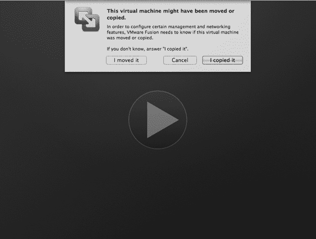图 1-1. 打开 Kali Linux 虚拟机 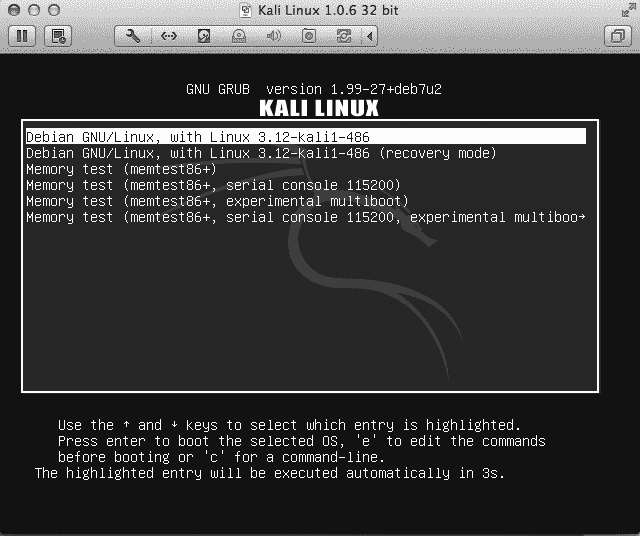图 1-2. 启动 Kali Linux

1.  一旦 Kali Linux 启动，您将看到一个如图 1-3 所示的登录屏幕。

    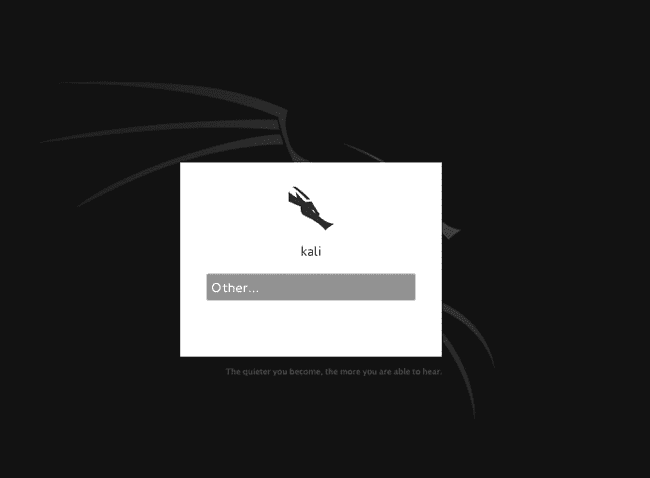图 1-3. Kali 登录屏幕

1.  点击**其他**，并输入 Kali Linux 的默认凭据，*root:toor*，如图 1-4 所示。然后点击**登录**按钮。

    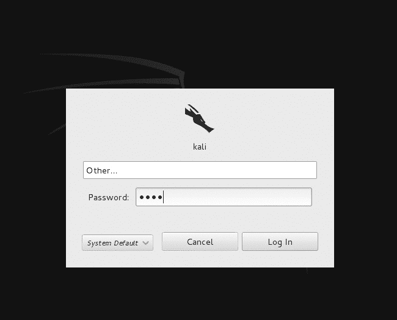图 1-4. 登录到 Kali

1.  您将看到如图 1-5 所示的屏幕。

    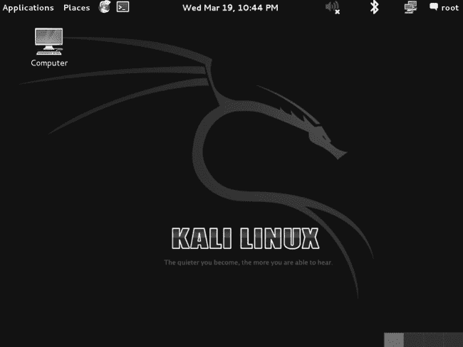图 1-5. Kali Linux 图形用户界面

### 配置虚拟机的网络

因为我们将使用 Kali Linux 通过网络攻击我们的目标系统，所以我们需要将所有虚拟机放置在同一个虚拟网络中（我们将在第十三章中看到如何在网络之间移动的示例，该章节讲解了后期利用）。VMware 提供了三种虚拟网络连接选项：桥接、NAT 和仅主机。你应该选择桥接选项，以下是每种选项的一些信息：

+   *桥接网络*使用与主机系统相同的连接，将虚拟机直接连接到本地网络。就本地网络而言，我们的虚拟机只是网络上的另一个节点，拥有自己的 IP 地址。

+   *NAT*，即*网络地址转换*，在主机机器上设置一个私有网络。私有网络将虚拟机的外发流量转换为本地网络的流量。在本地网络中，虚拟机的流量将显示为来自主机机器的 IP 地址。

+   *仅主机* 网络将虚拟机限制在主机上的局部私有网络中。虚拟机可以与主机仅限网络中的其他虚拟机以及主机本身进行通信，但不能与本地网络或互联网进行任何数据交换。

### 注意

因为我们的目标虚拟机存在多个已知的安全漏洞，在将它们连接到本地网络时需要小心，因为该网络上的其他人也可能攻击这些机器。因此，我不建议在不信任其他用户的公共网络上通过本书进行操作。

默认情况下，Kali Linux 虚拟机的网络适配器设置为 NAT。以下是如何在 Windows 和 Mac OS 中更改该选项的方法。

#### Microsoft Windows 上的 VMware Player

要在 Windows 上的 VMware Player 中更改虚拟网络，启动 VMware Player 然后点击你的 Kali Linux 虚拟机。选择 **编辑虚拟机设置**，如图 1-6 所示。（如果你仍在 VMware Player 中运行 Kali Linux，选择 **播放器** ▸ **管理** ▸ **虚拟机设置**。）

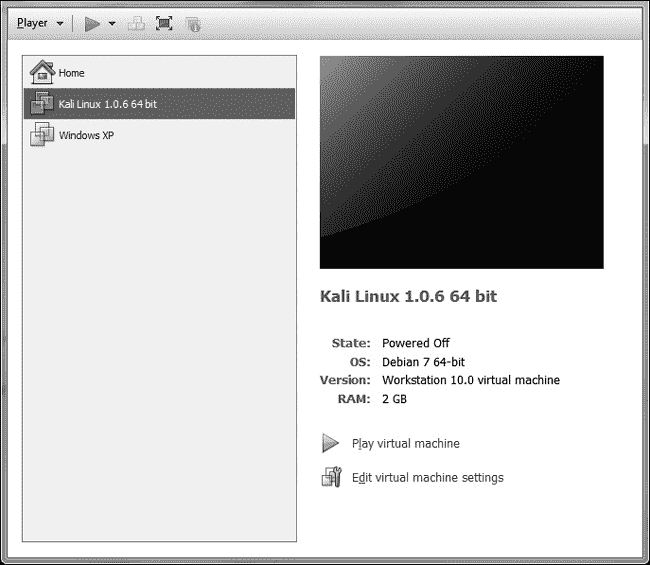图 1-6. 更改 VMware 网络适配器

在下一个屏幕上，选择硬件标签中的 **网络适配器**，然后在 **网络连接** 部分选择 **桥接** 选项，如图 1-7 所示。

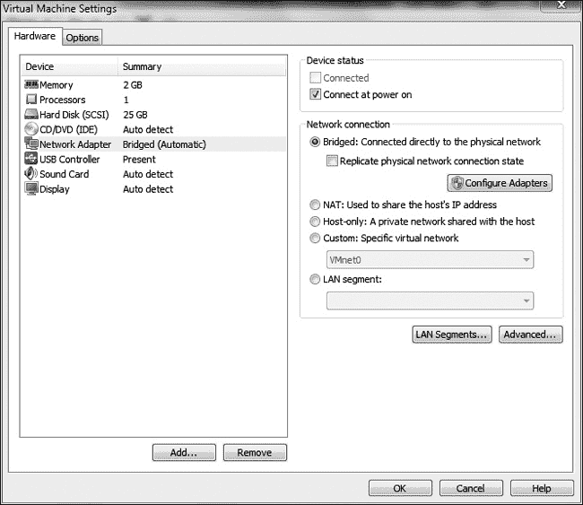图 1-7. 更改网络适配器设置

现在点击 **配置适配器** 按钮，并勾选你在主机操作系统中使用的网络适配器。如图 1-8 所示，我仅选择了 Realtek 无线适配器。做出选择后，点击 **确定**。

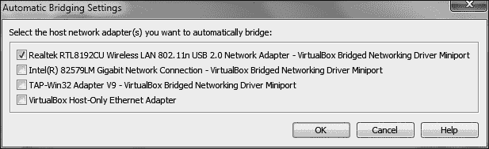图 1-8. 选择网络适配器

#### Mac OS 上的 VMware Fusion

要在 VMware Fusion 中更改虚拟网络连接，进入 **虚拟机** ▸ **网络适配器**，并将设置从 NAT 更改为桥接（如图 1-9 所示）。

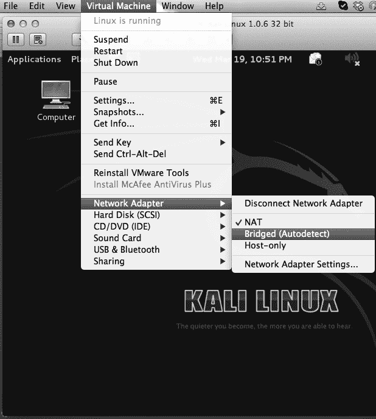图 1-9. 更改网络适配器

#### 连接虚拟机到网络

一旦切换，Kali Linux 应该会自动从桥接网络中获取 IP 地址。要验证你的 IP 地址，点击 Kali 屏幕左上方的终端图标（一个带有符号 >_ 的黑色矩形，或选择 **应用程序** ▸ **附件** ▸ **终端**）打开 Linux 终端。然后运行命令 `ifconfig` 查看你的网络信息，如示例 1-1 中所示。

示例 1-1。网络信息

```
root@kali:~# ifconfig
eth0      Link encap:Ethernet  HWaddr 00:0c:29:df:7e:4d
          inet addr:**192.168.20.9**  Bcast:192.168.20.255  Mask:255.255.255.0
          inet6 addr: fe80::20c:29ff:fedf:7e4d/64 Scope:Link
--*snip*--
```

### 注意

提示符 `root@kali:~#` 是超级用户（root）提示符。我们将在第二章中学习更多关于这个提示符以及我们在设置过程中使用的其他 Linux 命令。

这台虚拟机的 IPv4 地址是 192.168.20.9，如示例 1-1 中加粗标出的那样。（你的机器的 IP 地址可能会有所不同。）

#### 测试你的互联网访问

现在，让我们确保 Kali Linux 可以连接到互联网。我们将使用 ping 网络工具检查是否能够访问 Google。确保你的计算机已经连接到互联网，打开 Linux 终端并输入以下内容。

```
root@kali:~# ping www.google.com
```

如果你看到类似以下的响应，说明你已经联网。（我们将在第三章中进一步了解 `ping` 命令。）

```
PING www.google.com (50.0.2.221) 56(84) bytes of data.
64 bytes from cache.google.com (50.0.2.221): icmp_req=1 ttl=60 time=28.7 ms
64 bytes from cache.google.com (50.0.2.221): icmp_req=2 ttl=60 time=28.1 ms
64 bytes from cache.google.com (50.0.2.221): icmp_req=3 ttl=60 time=27.4 ms
64 bytes from cache.google.com (50.0.2.221): icmp_req=4 ttl=60 time=29.4 ms
64 bytes from cache.google.com (50.0.2.221): icmp_req=5 ttl=60 time=28.7 ms
64 bytes from cache.google.com (50.0.2.221): icmp_req=6 ttl=60 time=28.0 ms
--*snip*--
```

如果没有收到回应，请确保你的网络适配器已设置为桥接模式，Kali Linux 已经获取到 IP 地址，并且你的主机系统当前已连接到互联网。

### 安装 Nessus

尽管 Kali Linux 几乎包含了我们所需的所有工具，但我们仍然需要安装一些额外的程序。首先，我们将安装 Tenable Security 的 Nessus Home 漏洞扫描器。此扫描器仅限家庭使用（你将在 Nessus 网站上看到相关的限制描述）。请注意，Nessus 在不断积极开发，因此当前的版本以及其图形用户界面（GUI）可能与本书出版时有所不同。

使用以下步骤从 Kali 内部安装 Nessus Home：

1.  打开 **应用程序** ▸ **互联网** ▸ **Iceweasel Web 浏览器**，并在地址栏中输入 *[`www.tenable.com/products/nessus-home/`](http://www.tenable.com/products/nessus-home/)*。完成注册获取激活码的相关信息后，点击 **注册**。（请使用真实的电子邮件地址——稍后你会需要激活码。）

1.  一旦进入下载页面，选择适用于 Linux Debian 32 位平台的最新版本 Nessus（截至目前是 *Nessus-5.2.5-debian6_i386.deb*），并将其下载到你的根目录（默认的下载位置）。

1.  打开 Linux 终端（点击 Kali 屏幕顶部的终端图标）以打开 root 提示符。

1.  输入 **`ls`** 查看根目录中的文件列表。你应该能看到刚刚下载的 Nessus 文件。

1.  输入 **`dpkg -i`**，后面跟上你下载的文件名（你可以输入文件名的第一个字母并按 Tab 键进行自动补全），然后按回车键开始安装过程。安装可能需要一段时间，因为 Nessus 需要处理各种插件。进度通过一行哈希符号（`#`）来显示。

    ```
    Selecting previously unselected package nessus.
    (Reading database ... 355024 files and directories currently installed.)
    Unpacking nessus (from Nessus-5.2.5-debian6_amd64.deb) ...
    Setting up nessus (5.2.5) ...
    nessusd (Nessus) 5.2.5 [build N25109] for Linux
    Copyright (C) 1998 - 2014 Tenable Network Security, Inc

    Processing the Nessus plugins...
    [###########                                                ]
    ```

1.  一旦你返回到根提示符且没有错误，Nessus 应该已经安装完成，你应该会看到类似下面的信息。

    ```
    All plugins loaded
    Fetching the newest plugins from nessus.org...
    Fetching the newest updates from nessus.org...
    Done. The Nessus server will start processing these plugins within a minute
    nessusd (Nessus) 5.2.5 [build N25109] for Linux
    Copyright (C) 1998 - 2014 Tenable Network Security, Inc

    Processing the Nessus plugins...
    [##################################################]

    All plugins loaded

     - You can start nessusd by typing /etc/init.d/nessusd start
     - Then go to https://kali:8834/ to configure your scanner
    ```

1.  现在输入以下命令启动 Nessus。

    ```
    root@kali:~# /etc/init.d/nessusd start
    ```

1.  在 Iceweasel 浏览器中打开网址 *https://kali:8834/*。你应该会看到一个 SSL 证书警告，类似于图 1-10 中的警告。

    ### 注意

    如果你从 Kali 中的 Iceweasel 浏览器以外的地方访问 Nessus，你需要改为访问 *https://<ipaddressofKali>:8834*。

    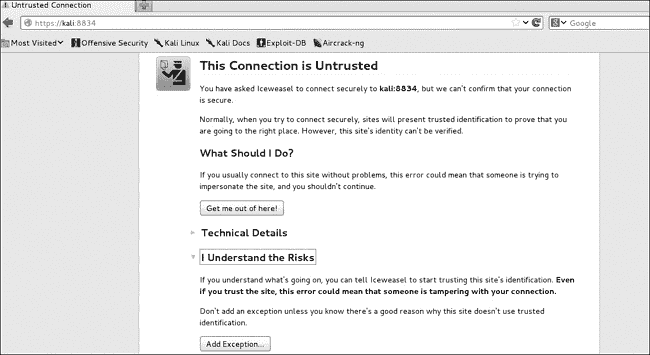图 1-10. 无效的 SSL 证书警告

1.  展开 **我理解风险** 并点击 **添加例外**。然后点击 **确认安全例外**，如图 1-11 所示。

    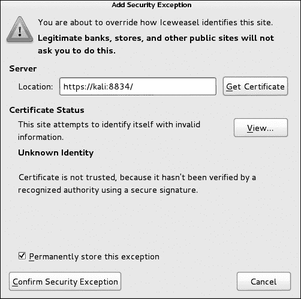图 1-11. 确认安全例外

1.  在打开的 Nessus 页面左下角点击 **开始使用**，然后在接下来的页面输入用户名和密码。我在示例中选择了 *georgia:password*。如果你选择了其他内容，记得保存，因为我们将在第六章中使用 Nessus。（请注意，我在本书中使用了简单的密码，就像你遇到的许多客户一样。在生产环境中，你应该使用比 *password* 更强的密码。）

1.  在下一页，输入你通过电子邮件从 Tenable Security 获得的激活码。

1.  注册 Tenable Security 后，选择下载插件的选项（下载将需要一些时间）。一旦 Nessus 处理完插件，它将进行初始化。

当 Nessus 下载完插件并配置好软件后，你应该会看到 Nessus 登录屏幕，如图 1-12 所示。你应该能使用在设置过程中创建的账户凭证进行登录。

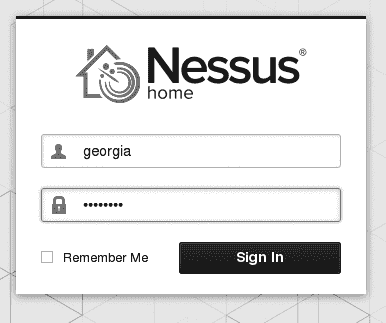图 1-12. Nessus 网页界面的登录屏幕

要关闭 Nessus，只需关闭浏览器中的标签页即可。我们将在第六章中再次使用 Nessus。

### 安装额外的软件

我们还没有完成。请按照这些说明完成 Kali Linux 的安装。

#### Ming C 编译器

我们需要安装一个交叉编译器，以便将 C 代码编译为可在 Microsoft Windows 系统上运行的程序。Ming 编译器包含在 Kali Linux 仓库中，但默认情况下未安装。使用此命令安装它。

```
root@kali:~# apt-get install mingw32
```

#### Hyperion

我们将使用 Hyperion 加密程序绕过防病毒软件。Hyperion 当前未包含在 Kali 仓库中。使用`wget`下载 Hyperion，解压并使用在上一步安装的 Ming 跨编译器进行编译，如示例 1-2 所示。

示例 1-2. 安装 Hyperion

```
root@kali:~# wget http://nullsecurity.net/tools/binary/Hyperion-1.0.zip
root@kali:~# unzip Hyperion-1.0.zip
Archive:  Hyperion-1.0.zip
   creating: Hyperion-1.0/
   creating: Hyperion-1.0/FasmAES-1.0/
root@kali:~# i586-mingw32msvc-c++ Hyperion-1.0/Src/Crypter/*.cpp -o hyperion.exe
--*snip*--
```

#### Veil-Evasion

Veil-Evasion 是一个生成有效载荷可执行文件的工具，你可以用它绕过常见的防病毒解决方案。首先使用命令 `wget` 下载 Veil-Evasion Kali（参见示例 1-3）。接下来，解压下载的文件 *master.zip*，并切换到 *Veil-master/setup* 目录。最后，输入 **`./setup.sh`** 并按照默认提示进行操作。

示例 1-3. 安装 Veil-Evasion

```
root@kali:~# wget https://github.com/ChrisTruncer/Veil/archive/master.zip
--2015-11-26 09:54:10--  https://github.com/ChrisTruncer/Veil/archive/master.zip
--*snip*--
2015-11-26 09:54:14 (880 KB/s) - `master.zip' saved [665425]

root@kali:~# unzip master.zip
Archive:  master.zip
948984fa75899dc45a1939ffbf4fc0e2ede0c4c4
   creating: Veil-Evasion-master/
--*snip*--
  inflating: Veil-Evasion-master/tools/pyherion.py
root@kali:~# cd Veil-Evasion-master/setup
root@kali:~/Veil-Evasion-master/setup# ./setup.sh
=========================================================================
 [Web]: https://www.veil-evasion.com | [Twitter]: @veilevasion
=========================================================================

 [*] Initializing Apt Dependencies Installation
--*snip*—
Do you want to continue? [Y/n]? **Y**
--*snip*--
root@kali:~#
```

#### Ettercap

Ettercap 是一个用于执行中间人攻击的工具。在第一次运行它之前，我们需要对其配置文件 /*etc/ettercap/etter.conf* 进行一些修改。从 Kali root 提示符下用 nano 编辑器打开其配置文件。

```
root@kali:~# nano /etc/ettercap/etter.conf
```

首先将 `userid` 和 `groupid` 值更改为 **`0`**，以便 Ettercap 可以使用 root 权限运行。向下滚动，直到看到文件中的以下行。将等号（`=`）后面的任何值替换为 `0`。

```
[privs]
ec_uid = **0**                # nobody is the default
ec_gid = **0**                # nobody is the default
```

现在向下滚动到文件的 `Linux` 部分，在示例 1-4 中，取消注释（去掉前面的 `#` 字符）❶ 和 ❷ 所示的两行，以设置 Iptables 防火墙规则以重定向流量。

示例 1-4. Ettercap 配置文件

```
#---------------
#     Linux
#---------------

# if you use ipchains:
   #redir_command_on = "ipchains -A input -i %iface -p tcp -s 0/0 -d 0/0 %port -j REDIRECT %rport"
   #redir_command_off = "ipchains -D input -i %iface -p tcp -s 0/0 -d 0/0 %port -j REDIRECT %rport"

# if you use iptables:
   ❶ redir_command_on = "iptables -t nat -A PREROUTING -i %iface -p tcp --dport %port -j
     REDIRECT    --to-port %rport"
   ❷ redir_command_off = "iptables -t nat -D PREROUTING -i %iface -p tcp --dport %port -j
     REDIRECT    --to-port %rport"
```

按下 ctrl-X 然后按 Y 保存更改并退出文件。

### 设置 Android 模拟器

现在我们将在 Kali 上设置三个 Android 模拟器，用于第二十章的移动测试。首先，我们需要下载 Android SDK。

1.  从 Kali 中打开 Iceweasel 浏览器，访问 *[`developer.android.com/sdk/index.html`](https://developer.android.com/sdk/index.html)*。

1.  下载当前版本的适用于 32 位 Linux 的 ADT 包并保存到根目录。

1.  打开终端，列出其中的文件（`ls`），并使用 unzip 解压刚刚下载的压缩文件（*x* 代表你的文件名，因为版本可能在写作时已经发生变化）。

    ```
    root@kali:~# unzip adt-bundle-Linux-x86-*xxxxxxxxxxx***.zip**
    ```

1.  现在使用 `cd` 进入新目录（文件名相同，去掉 *.zip* 扩展名）。

    ```
    # cd sdk/tools
    # ./android
    ```

1.  Android SDK 管理器应该会打开，如图 1-13 所示。

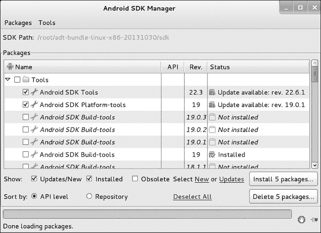图 1-13. Android SDK 管理器

我们将下载 Android SDK 工具和 Android SDK 平台工具的所有更新（默认已选中），以及 Android 4.3 和几个具有特定漏洞的旧版本 Android，即 Android 2.2 和 Android 2.1。选中每个 Android 版本左侧的框。然后（保持 Updates/New 和 Installed 选中）点击 **Install packages**，如 图 1-14 所示。接受许可协议，Android SDK 应该会下载并安装所选的包。安装过程可能需要几分钟。

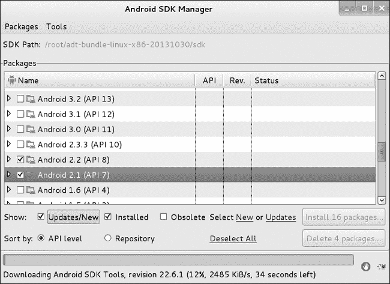图 1-14. 安装 Android 软件

现在是时候设置我们的 Android 虚拟设备了。打开 Android SDK 管理器，选择 **Tools** ▸ **Manage AVDs**。你应该能看到如 图 1-15 所示的窗口。

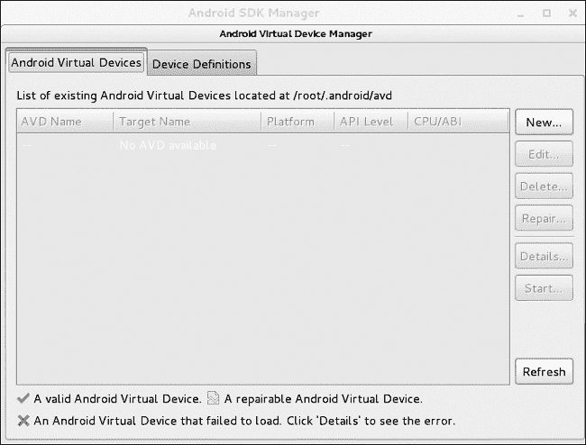图 1-15. Android 虚拟设备管理器

我们将基于 Android 4.3、2.2 和 2.1 创建三个 Android 模拟器，如 图 1-16 所示。使用图中显示的每个模拟器的值，但将目标的值设置为你希望构建的 Android 版本（Android 4.3 的 Google API 版本 18，2.2 的 Google API 版本 8，和 2.1 的 Google API 版本 7）。在 AVD 名称字段中填入一个描述性值。添加一个较小的 SD 卡值（100MB 应该足够），以便你可以将文件下载到 Android 模拟器中。将设备设置为 **Nexus 4**，并将皮肤设置为 **具有动态硬件控制的皮肤**。其余选项保持默认值。

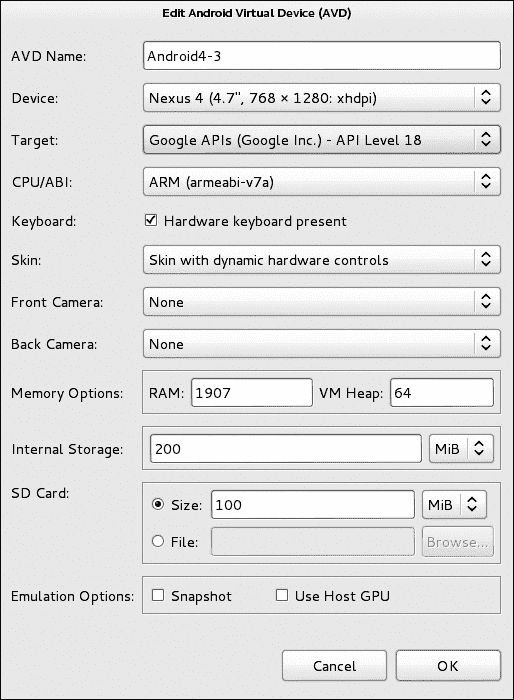图 1-16. 创建 Android 模拟器

一旦你构建了所有三个模拟器，你的 AVD 管理器应该如下所示 图 1-17（设备名称当然可能不同）。

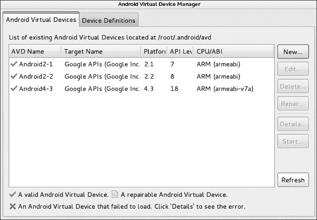图 1-17. 在 Android 虚拟设备管理器中创建的 Android 模拟器

要启动模拟器，选中它并点击 **Start**。然后在弹出的窗口中点击 **Launch**，如 图 1-18 所示。

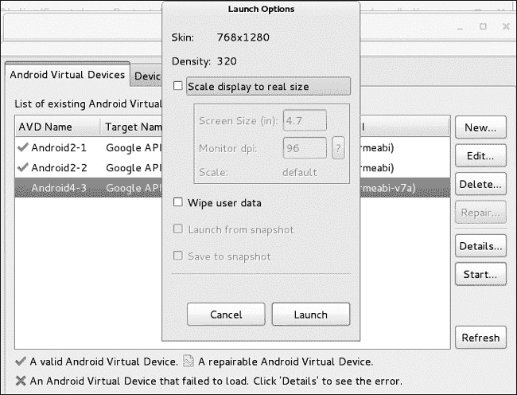图 1-18. 启动 Android 模拟器

模拟器第一次启动可能需要几分钟时间，但一旦启动，你应该能看到和感觉到像一个真实的 Android 设备一样的界面。图 1-19 中展示了 Android 4.3 模拟器。

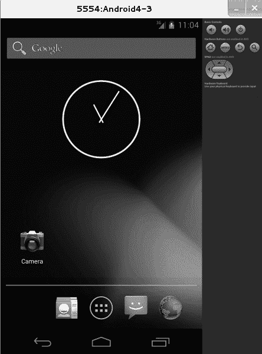图 1-19. Android 4.3 模拟器

### 注意

要在 Kali 中运行 Android 模拟器，你可能需要通过增加虚拟机的内存和 CPU 核心数来提高其性能。我能够在分配给 Kali 的 3GB 内存和两个 CPU 核心的情况下运行所有三个模拟器。你可以在 VMware 产品的虚拟机设置中进行这些更改。你能给 Kali 分配的资源量，当然取决于主机计算机上可用的资源。作为替代方案，除了在 Kali Linux 上运行 Android 模拟器，你还可以在主机系统或甚至本地网络中的其他系统上安装 Android 和模拟器。第二十章中的练习只要模拟器能够与 Kali 通信就可以运行。

### 智能手机渗透框架

接下来，下载并安装智能手机渗透框架（SPF），我们将用它进行移动攻击。使用`git`下载源代码。切换到已下载的*Smartphone-Pentest-Framework*目录，如下所示。

```
root@kali:~# git clone -b SPFBook https://github.com/georgiaw/Smartphone-Pentest-Framework.git
root@kali:~# cd Smartphone-Pentest-Framework
```

现在在 nano 文本编辑器中打开文件*kaliinstall*。前几行如示例 1-5 所示。注意其中提到的*/root/adt-bundle-linux-x86-20131030/sdk/tools/android*行。如果你的 ADT 包文件夹名称不同（由于发布了后续版本），请将该值更改为你在上一节中安装 Android ADT 的正确位置。

示例 1-5. 安装智能手机渗透框架

```
root@kali:~/Smartphone-Pentest-Framework# nano kaliinstall
#!/bin/sh
## Install needed packages
echo -e "$(tput setaf 1)\nInstallin serialport, dbdpg, and  expect for perl\n"; echo "$(tput sgr0)"
echo -e "$(tput setaf 1)#########################################\n"; echo "$(tput sgr0)"
echo $cwd;
#apt-get -y install libexpect-perl libdbd-pg-perl libdevice-serialport-perl;
apt-get install ant
/root/adt-bundle-linux-x86-20131030/sdk/tools/android update sdk --no-ui --filter android-4 -a
/root/adt-bundle-linux-x86-20131030/sdk/tools/android update sdk --no-ui --filter addon-google_apis-google-4 -a
/root/adt-bundle-linux-x86-20131030/sdk/tools/android update sdk --no-ui --filter android-14 -a
/root/adt-bundle-linux-x86-20131030/sdk/tools/android update sdk --no-ui --filter addon-google_apis-google-14 -a
--*snip*--
```

现在运行*kaliinstall*脚本，如下所示。

```
root@kali:~/Smartphone-Pentest-Framework# ./kaliinstall
```

这将设置 SPF，我们将在第二十章中使用它。

最后，我们需要对 SPF 的配置文件进行最后一次更改。切换到*Smartphone-Pentest-Framework/frameworkconsole*目录，并在 nano 中打开*config*文件。查找选项`#LOCATION OF ANDROID` `SDK`。如果自本文编写时以来你的 ADT 包文件夹名称发生了变化，请在以`ANDROIDSDK=`开头的行中相应地更改它。

```
root@kali:~/Smartphone-Pentest-Framework# cd frameworkconsole/
root@kali:~/Smartphone-Pentest-Framework/frameworkconsole# nano config
--*snip*--
#LOCATION OF ANDROID SDK
ANDROIDSDK = /root/adt-bundle-linux-x86-20131030/sdk
--*snip*--
```

## 目标虚拟机

我们将使用三台定制的目标机器来模拟客户端环境中常见的漏洞：Ubuntu 8.10、Windows XP SP3 和 Windows 7 SP1。

您可以在 *[`www.nostarch.com/pentesting/`](http://www.nostarch.com/pentesting/)* 上找到包含 Ubuntu 虚拟机的 torrent 链接。目标系统使用 7-Zip 压缩包，密码为 *1stPentestBook?!*，可以使用 7-Zip 程序在所有平台上打开压缩包。对于 Windows 和 Linux 版本，请访问 *[`www.7-zip.org/download.html`](http://www.7-zip.org/download.html)*；对于 Mac OS，请使用 Ez7z，下载链接为 *[`ez7z.en.softonic.com/mac/`](http://ez7z.en.softonic.com/mac/)*。解压后即可开始使用该压缩包。

要设置 Windows 虚拟机，您需要安装并配置 Windows XP SP3 和 32 位 Windows 7 SP1。安装介质的来源包括 TechNet 和 MSDN（Microsoft 开发者网络）等。（您应该能够在没有许可证密钥的情况下，试用 Windows 虚拟机 30 天。）

## 创建 Windows XP 目标

您的 Windows XP 目标应该是一个基础安装的 Windows XP SP3，并且没有额外的安全更新。（更多关于如何找到 Windows XP 复制版本的信息，请访问我的网站 *[`www.bulbsecurity.com/`](http://www.bulbsecurity.com/)*。）一旦您拥有了 Windows XP SP3 的副本，下面是如何在 Microsoft Windows 或 Mac OS 上安装它。

### VMware Player 在 Microsoft Windows 上

要在 VMware Player for Windows 上安装 Windows XP：

1.  在 VMware Player 中选择 **创建一个新虚拟机**，并将新虚拟机向导指向 Windows XP 安装光盘或 ISO 镜像。根据您的源光盘或镜像，您可能会看到一个选项，允许您使用 Easy Install（如果您安装的是带有许可证密钥的版本），或者您可能会看到一个黄色三角形警告，“无法检测此光盘映像中的操作系统。您需要指定将安装哪个操作系统。” 在后者的情况下，直接点击 **下一步**。

1.  在选择客户操作系统对话框中，在客户操作系统部分选择 **Microsoft Windows**，并在下拉框中选择您的 Windows XP 版本，如 图 1-20 所示，然后点击 **下一步**。

    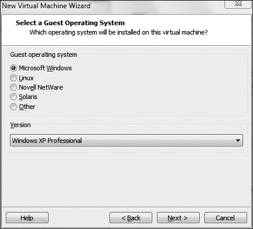图 1-20. 选择您的 Windows XP 版本

1.  在下一个对话框中，输入 **`Bookxp XP SP3`** 作为虚拟机的名称，然后点击 **下一步**。

1.  在指定磁盘容量对话框中，接受为您的虚拟机推荐的 40GB 硬盘大小，并勾选 **将虚拟磁盘存储为一个单一文件**，如 图 1-21 所示，然后点击 **下一步**。

    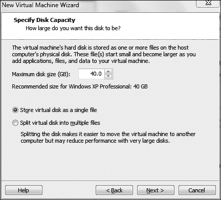图 1-21. 指定磁盘容量

    ### 注意

    虚拟机不会占用整个 40GB 的空间；它只会根据需要占用硬盘空间。这只是一个最大值。

1.  在准备创建虚拟机对话框中，如图 1-22 所示，点击**自定义硬件**。

    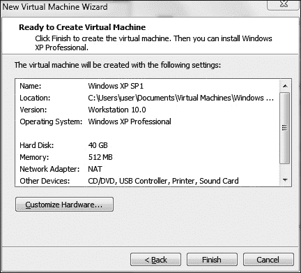图 1-22. 自定义硬件

1.  在硬件对话框中，选择**网络适配器**，然后在出现的网络连接字段中选择**桥接：直接连接到物理网络**。接下来，点击**配置适配器**并选择您用来连接互联网的适配器，如图 1-23 所示。然后按**确定**、**关闭**和**完成**。

图 1-23. 将网络适配器配置为桥接模式

现在，您应该能够启动您的 Windows XP 虚拟机。继续查看安装和激活 Windows 中的安装和激活 Windows XP 的说明。

### 在 Mac OS 上的 VMware Fusion

在 VMware Fusion 中，转到**文件** ▸ **新建** ▸ **从磁盘或镜像导入**，并将其指向 Windows XP 安装光盘或镜像，如图 1-24 所示。

按照提示创建一个全新的 Windows XP SP3 安装。

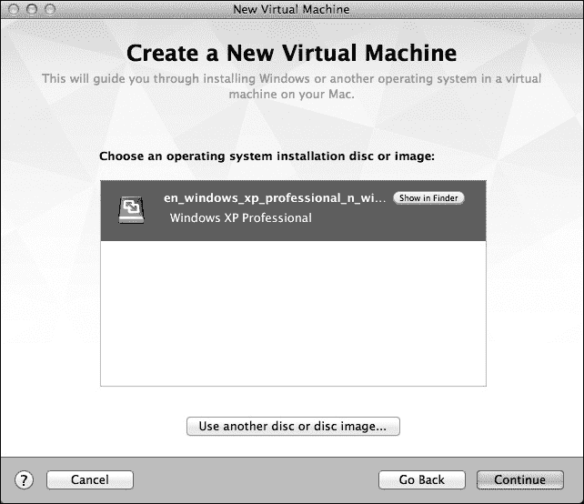图 1-24. 创建新虚拟机

### 安装和激活 Windows

作为安装过程的一部分，系统会提示您输入 Windows 许可证密钥。如果您有密钥，请在此输入。如果没有，您应该能够在 30 天的试用期内使用虚拟机。要继续而不输入许可证密钥，请在提示输入密钥时点击**下一步**。弹出窗口将警告您建议输入许可证密钥，并询问您是否希望现在输入，如图 1-25 所示。只需点击**否**。

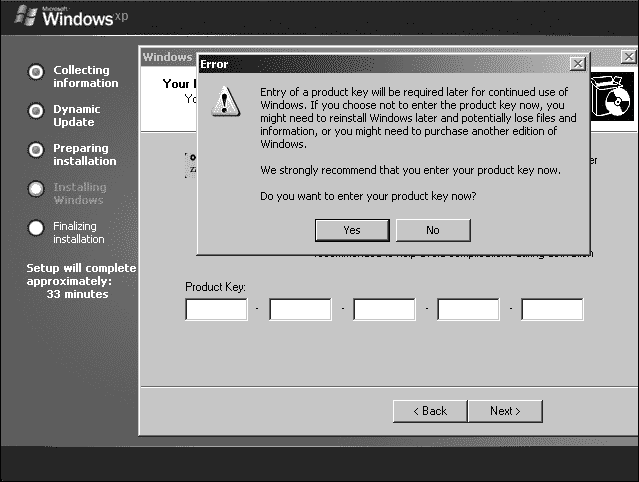图 1-25. 许可证密钥对话框

如图 1-26 所示，系统提示时，将**计算机名称**设置为**`Bookxp`**。将**管理员密码**设置为**`password`**。

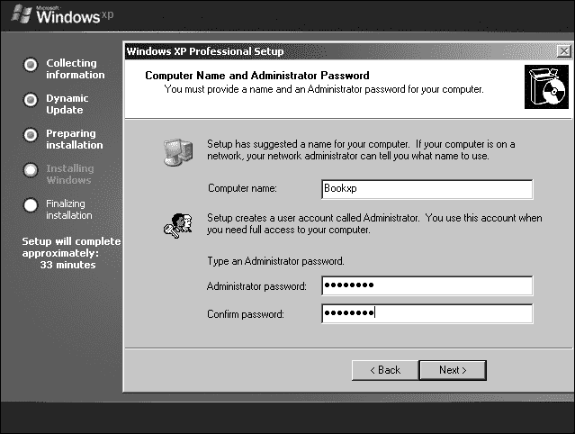图 1-26. 设置计算机名称和管理员密码

在提示时，你可以保持日期/时间和 TCP/IP 设置为默认值。同样，保持 Windows XP 目标为工作组 WORKGROUP 的一部分，而不是将其加入域，如图 1-27 所示。

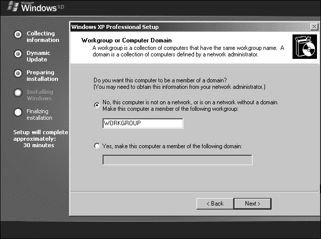图 1-27。工作组设置

如图所示，告诉 Windows 不要自动安装安全更新，图 1-28。这一步很重要，因为我们将运行的某些漏洞依赖于缺失的 Windows 补丁。

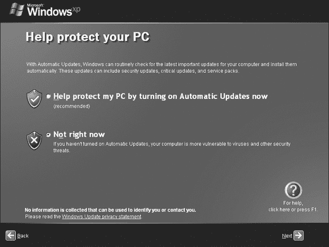图 1-28。关闭自动安全更新

然后，系统会提示你激活 Windows。如果你已输入许可证密钥，继续激活。如果没有，你可以选择**否，每隔几天提醒我一次**，如图 1-29 所示。

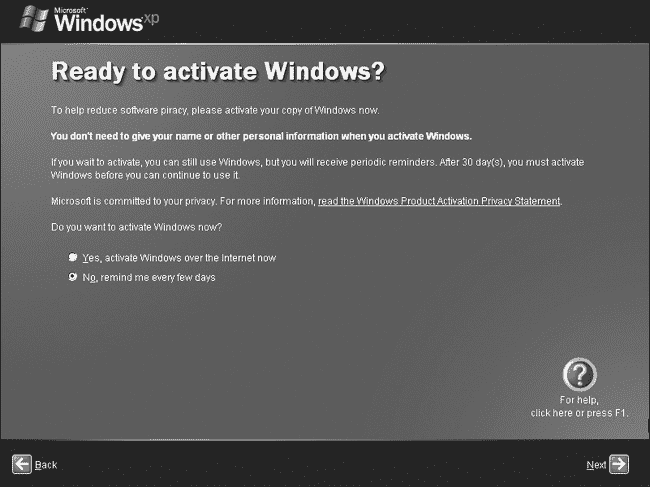图 1-29。激活 Windows

现在创建用户账户*georgia*和*secret*，如图 1-30 所示。我们将在设置完成后为这些用户创建密码。

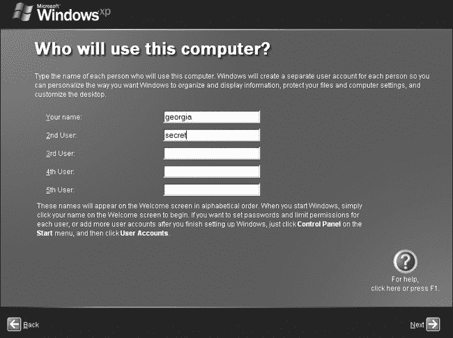图 1-30。添加用户

当 Windows 启动时，以用户*georgia*身份登录，无需密码。

### 安装 VMware 工具

现在安装 VMware 工具，这将使你更容易使用虚拟机，例如，允许你从宿主系统将程序复制/粘贴或拖放到虚拟机中。

#### 在 Microsoft Windows 上使用 VMware Player

在 VMware Player 中，从**播放器** ▸ **管理** ▸ **安装 VMware 工具**安装 VMware 工具，如图 1-31 所示。VMware 工具安装程序应该会在 Windows XP 中自动运行。

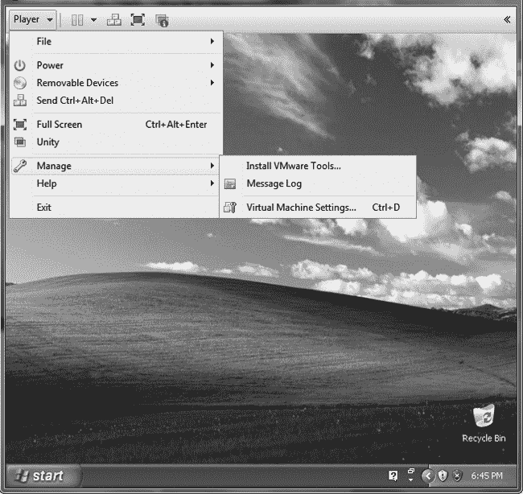图 1-31。在 VMware Player 中安装 VMware 工具

#### 在 Mac OS 上的 VMware Fusion

从**虚拟机** ▸ **安装 VMware 工具**安装 VMware 工具，如图 1-32 所示。VMware 工具安装程序应该会在 Windows XP 中自动运行。

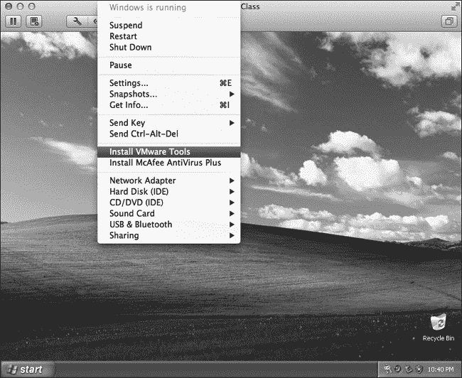图 1-32。在 VMware Fusion 中安装 VMware 工具

### 关闭 Windows 防火墙

现在从 Windows 开始菜单打开控制面板。点击**安全中心** ▸ **Windows 防火墙**来关闭 Windows 防火墙，如图 1-33 所示。

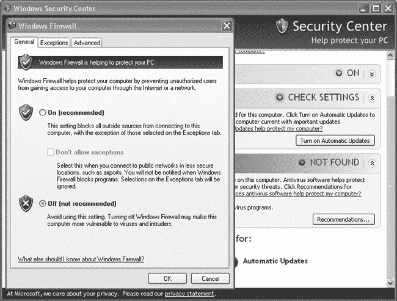图 1-33. 关闭 Windows 防火墙

### 设置用户密码

再次进入控制面板，点击“用户账户”。点击用户**georgia**，然后选择**创建密码**。将*georgia*的密码设置为**`password`**，如图 1-34 所示。对用户*secret*进行相同操作，但将*secret*的密码设置为**`Password123`**。

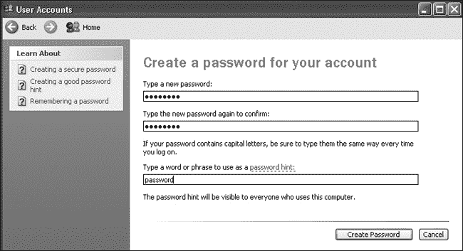图 1-34. 设置用户密码

### 设置静态 IP 地址

接下来，设置一个静态 IP 地址，这样在你继续阅读本书时，网络信息就不会发生变化。但首先我们需要找出默认网关的地址。

确保你的 Windows XP 系统在 VMware 中设置为使用桥接网络。默认情况下，你的虚拟机会使用 DHCP 自动获取 IP 地址。

要查找默认网关，请通过点击**开始** ▸ **运行**，输入**`cmd`**并点击**确定**来打开 Windows 命令提示符。在命令提示符中，输入**`ipconfig`**。这将显示网络信息，包括默认网关。

```
C:\Documents and Settings\georgia>**ipconfig**

Windows IP Configuration

Ethernet adapter Local Area Connection:

        Connection-specific DNS Suffix  . : XXXXXXXX
        IP Address. . . . . . . . . . . . : 192.168.20.10
        Subnet Mask . . . . . . . . . . . : 255.255.255.0
        Default Gateway . . . . . . . . . : 192.168.20.1

C:\Documents and Settings\georgia>
```

在我的情况下，IP 地址是 192.168.20.10，子网掩码是 255.255.255.0，默认网关是 192.168.20.1。

1.  在控制面板中，进入**网络和互联网连接**，并点击屏幕底部的**网络连接**。

1.  右键点击**本地连接**，然后选择**属性**。

1.  高亮显示**互联网协议（TCP/IP）**并选择**属性**。现在输入一个静态 IP 地址，并将子网掩码和默认网关设置为与你通过`ipconfig`命令找到的数据匹配，如图 1-35 所示。将首选 DNS 服务器设置为你的默认网关。

现在是时候检查我们的虚拟机是否能够通信了。一旦确认设置匹配，返回到 Kali 虚拟机（如果已经关闭，请启动它），并输入**`ping <`**`你 Windows XP 虚拟机的静态` `IP 地址`**`>`**，如图所示。

### 注意

我的 IP 地址是 192.168.20.10。在本书中，你应该将这个值替换为你系统的 IP 地址。

```
root@kali:~# ping 192.168.20.10

PING 192.168.20.10 (192.168.20.10) 56(84) bytes of data.
64 bytes from 192.168.20.10: icmp_req=1 ttl=128 time=3.06 ms
**^C**
```

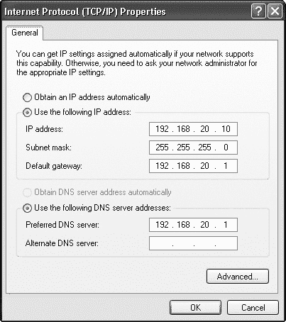图 1-35. 设置静态 IP 地址

输入 ctrl-C 停止`ping`命令。如果你看到以`64 bytes from <`*`XP 的 IP 地址`*`>` 开头的输出，如前所示，说明你的虚拟机能够通信。恭喜！你已经成功设置了虚拟机网络。

如果你看到包含`Destination Host` `Unreachable`的消息，请排查网络问题：确保虚拟机处于相同的桥接虚拟网络中，检查默认网关是否正确等。

### 让 XP 像 Windows 域成员一样工作

最后，我们需要修改 Windows XP 中的一个设置，使其表现得像是 Windows 域的成员，因为你的许多客户端将会是域成员。我并没有要求你在这里设置整个 Windows 域，但在后期的利用过程中，几个练习将模拟域环境。返回到你的 XP 虚拟机，并按照以下步骤操作。

1.  选择**开始** ▸ **运行**，然后输入**`secpol.msc`**以打开本地安全设置面板。

1.  展开左侧的**本地策略**，然后双击右侧的**安全选项**。

1.  在右侧窗格中的策略列表中，双击**网络访问：本地帐户的共享和安全模型**，然后从下拉列表中选择**经典 - 本地用户以其自身身份进行身份验证**，如图 1-36 所示。

    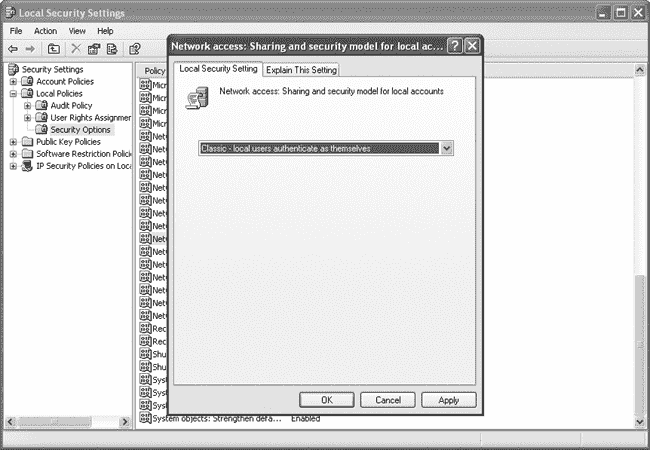图 1-36. 更改本地安全设置，使目标像 Windows 域的成员一样工作

1.  点击**应用**，然后点击**确定**。

1.  关闭虚拟机中任何打开的窗口。

### 安装脆弱软件

在本节中，我们将会在 Windows XP 虚拟机上安装一些脆弱的软件。在后续章节中，我们将会攻击这些软件。打开你的 Windows XP 虚拟机，并在仍然以用户*georgia*身份登录的情况下，按照以下步骤安装此处列出的每个软件包。

#### Zervit 0.4

从*[`www.exploit-db.com/exploits/12582/`](http://www.exploit-db.com/exploits/12582/)*下载 Zervit 0.4 版本。（点击“Vulnerable App”选项下载文件。）解压下载的压缩包，双击 Zervit 程序以打开并运行它。然后在软件启动时，在控制台中输入端口号**`3232`**。如图 1-37 所示，回答**`Y`**以允许目录列表。Zervit 在你重新启动 Windows XP 后不会自动重启，所以如果重启系统，你需要手动重启它。

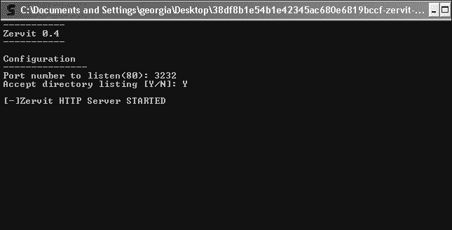图 1-37. 启动 Zervit 0.4

#### SLMail 5.5

从*[`www.exploit-db.com/exploits/638/`](http://www.exploit-db.com/exploits/638/)*下载并运行 SLMail 5.5 版本，在提示时使用默认选项。所有选项直接点击**下一步**，不要更改任何设置。如果你收到有关域名的警告，直接忽略它并点击**确定**。我们这里不需要发送任何电子邮件。

安装完 SLMail 后，重启虚拟机。然后打开**开始** ▸ **所有程序** ▸ **SL 产品** ▸ **SLMail** ▸ **SLMail 配置**。在用户标签页（默认）中，右键点击**SLMail 配置**窗口，选择**新建** ▸ **用户**，如图 1-38 所示。

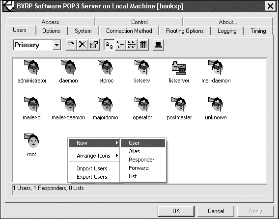图 1-38. 在 SLMail 中添加用户

点击新创建的用户图标，输入用户名**georgia**，并填写该用户的信息，如图 1-39 所示。邮箱名应为*georgia*，密码为*password*。保持默认设置，完成后点击**确定**。

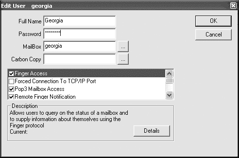图 1-39. 在 SLMail 中设置用户信息

#### 3Com TFTP 2.0.1

接下来，从*【http://www.exploit-db.com/exploits/3388/](http://www.exploit-db.com/exploits/3388/)*下载 3Com TFTP 版本 2.0.1 的压缩文件。解压文件并将*3CTftpSvcCtrl*和*3CTftpSvc*复制到目录*C:\Windows*，如图 1-40 所示。

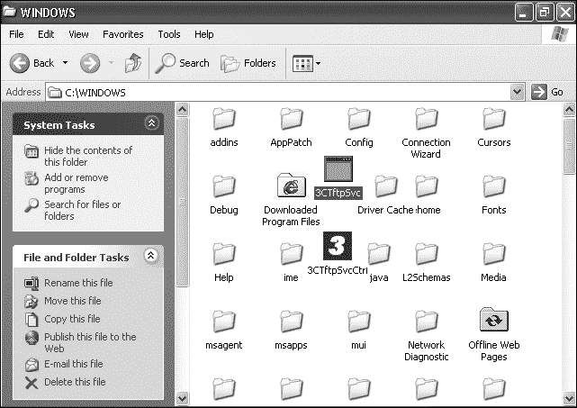图 1-40. 将 3Com TFTP 复制到 C:\Windows

然后打开*3CTftpSvcCtrl*（蓝色的*3*图标），点击**安装服务**，如图 1-41 所示。

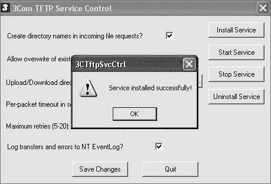图 1-41. 安装 3Com TFTP

点击**启动服务**以第一次启动 3Com TFTP。从此以后，每次开机时它将自动启动。点击**退出**以退出。

#### XAMPP 1.7.2

现在，我们将从*【http://www.oldapps.com/xampp.php?old_xampp=45/](http://www.oldapps.com/xampp.php?old_xampp=45/)*安装 XAMPP 软件的旧版本 1.7.2。（Windows XP 上的旧版 Internet Explorer 似乎有些问题无法打开此页面。如果遇到问题，可以从主机系统下载软件并将其复制到 Windows XP 的桌面上。）

1.  运行安装程序，并接受默认选项。当安装完成后，选择**`1. 启动 XAMPP 控制面板`**，如图 1-42 所示。

    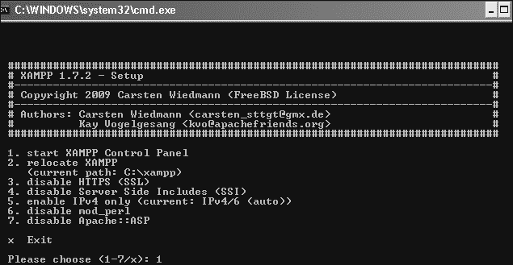图 1-42. 启动 XAMPP 控制面板

1.  在 XAMPP 控制面板中，安装 Apache、MySQL 和 FileZilla 服务（选中服务名称左侧的**Svc**复选框）。然后点击每个服务的**Start**按钮。你的屏幕应与图 1-43 中的界面相同。

    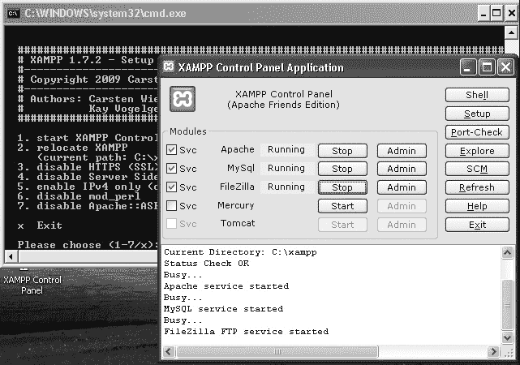图 1-43. 安装和启动 XAMPP 服务

1.  点击**Admin**按钮，进入 XAMPP 控制面板中的 FileZilla 管理界面。管理员面板如图 1-44 所示。

    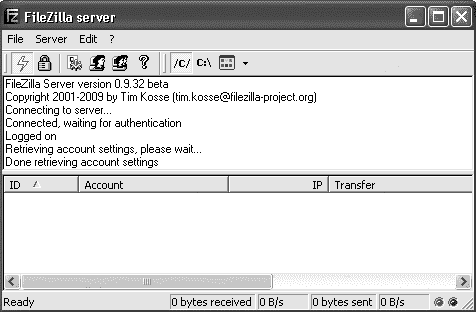图 1-44. FileZilla 管理面板

1.  进入**编辑** ▸ **用户**以打开用户对话框，如图 1-45 所示。

1.  点击对话框右侧的**Add**按钮。

1.  在添加用户账户对话框中，输入**`georgia`**并按**OK**。

    图 1-45. 添加 FTP 用户

1.  在*georgia*高亮状态下，选中账户设置中的**Password**复选框并输入**`password`**。

点击**OK**。当提示你共享文件夹时，浏览到 Windows 上的*georgia*的*Documents*文件夹并选择共享，如图 1-46 所示。对于其他所有复选框，保持默认设置，如图所示。完成后点击**OK**并退出所有打开的窗口。

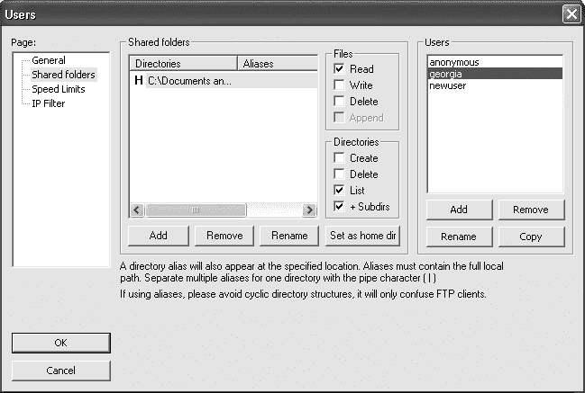图 1-46. 通过 FTP 共享文件夹

#### Adobe Acrobat Reader

现在，我们将从*[`www.oldapps.com/adobe_reader.php?old_adobe=17/`](http://www.oldapps.com/adobe_reader.php?old_adobe=17/)*下载并安装 Adobe Acrobat Reader 8.1.2 版本。按照默认提示进行安装，完成后点击**Finish**。（在这里，你可能需要先将文件下载到主机系统，然后将其复制到 Windows XP 的桌面上。）

#### War-FTP

接下来，从*[`www.exploit-db.com/exploits/3570/`](http://www.exploit-db.com/exploits/3570/)*下载并安装 War-FTP 1.65 版。将可执行文件从*exploit-db.com*下载到*georgia*的桌面上，并运行该可执行文件进行安装。你无需启动 FTP 服务；我们将在第十六章至第十九章讨论漏洞开发时开启它。

#### WinSCP

从*[`winscp.net/`](http://winscp.net/)*下载并安装最新版本的 WinSCP。选择**典型安装**选项。你可以取消选择附加的插件。安装完成后点击**Finish**。

### 安装 Immunity Debugger 和 Mona

现在我们将通过安装调试器来完成 Windows XP 虚拟机的设置，调试器是一个帮助检测计算机程序错误的工具。我们将在漏洞开发章节中使用调试器。访问 Immunity Debugger 注册页面 *[`debugger.immunityinc.com/ID_register.py`](http://debugger.immunityinc.com/ID_register.py)*。完成注册后，点击 **Download** 按钮，运行安装程序。

当系统询问你是否要安装 Python 时，点击 **Yes**。接受许可协议，并按照默认的安装提示进行操作。关闭安装程序时，Python 安装会自动运行。使用默认的安装值。

一旦安装了 Immunity Debugger 和 Python，下载 *mona.py* 文件，地址为 *[`redmine.corelan.be/projects/mona/repository/raw/mona.py/`](http://redmine.corelan.be/projects/mona/repository/raw/mona.py/)*。将 *mona.py* 复制到 *C:\Program Files\Immunity Inc\Immunity Debugger\PyCommands*，如 图 1-47 所示。

打开 Immunity Debugger，在窗口底部的命令提示符下，输入 **`!mona config -set workingfolder c:\logs\%p`**，如 图 1-48 所示。此命令告诉 Mona 将其输出日志记录到 *C:\logs\<program name>*，其中 *<program name>* 是 Immunity Debugger 当前正在调试的程序。

现在我们的 Windows XP 目标已设置完成，可以开始使用。

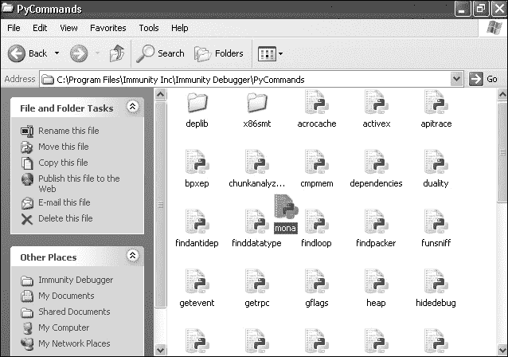图 1-47. 安装 Mona 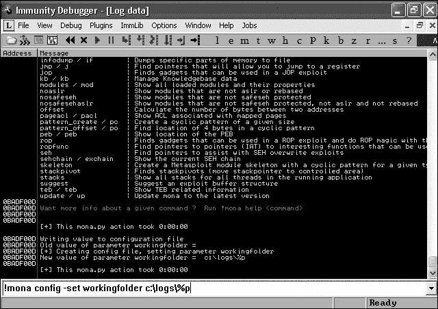图 1-48. 设置 Mona 的日志

## 设置 Ubuntu 8.10 目标

由于 Linux 是开源的，你可以直接下载本书的 torrent 文件中的 Linux 虚拟机。解压 *BookUbuntu.7zip* 压缩文件，使用密码 *1stPentestBook?!* 解开压缩文件。在 VMware 中打开 *.vmx* 文件。如果系统提示虚拟机正在使用中，点击 **Take Ownership**，并与 Kali 一样选择 **I copied it**。虚拟机的用户名和密码是 *georgia:password*。

当你加载好 Ubuntu 虚拟机后，确保在 VMware 中将网络接口设置为桥接模式，并点击屏幕右上方的网络图标（两个计算机图标），将虚拟机连接到网络。如果有提示不要安装任何更新。与 Windows XP 一样，我们将在此系统上利用过时的软件。现在，这个虚拟机已完全设置好。（我将在第二章中向你展示如何在 Linux 中设置静态 IP 地址。）

## 创建 Windows 7 目标

与 Windows XP 一样，你需要通过加载镜像或 DVD 在 VMware 中安装 Windows 7 SP1 的副本。32 位 Windows 7 Professional SP1 的 30 天试用版可以正常使用，但如果你希望继续使用它，30 天后需要激活。要获取合法的 Windows 7 SP1 版本，可以尝试以下方式：

+   访问*[`www.softpedia.com/get/System/OS-Enhancements/Windows-7.shtml`](http://www.softpedia.com/get/System/OS-Enhancements/Windows-7.shtml)*。

+   访问*[`technet.microsoft.com/en-us/evalcenter/dn407368`](http://technet.microsoft.com/en-us/evalcenter/dn407368)*。

### 注意

你的学校或工作场所可能有访问 DreamSpark 或 BizSpark 等项目的权限，这些项目可以让你访问 Windows 操作系统。你还可以查看我的网站(*[`www.bulbsecurity.com/`](http://www.bulbsecurity.com/)*)，获取更多资源。

### 创建用户账户

安装完 Windows 7 Professional SP1 后，选择不进行安全更新，并创建用户*Georgia Weidman*，设置为管理员，并使用*password*作为密码，如图 1-49 和图 1-50 所示。

再次选择不自动更新。当提示时，将计算机的当前位置设置为工作网络。安装完成后，登录账户*Georgia Weidman*。保持启用 Windows 防火墙。VMware 会在安装过程中多次重启 Windows 7。

现在按照你在 Windows XP 部分中的步骤告诉 VMware 安装 VMware 工具。指示 VMware 在虚拟机中安装 VMware 工具后，如果安装程序没有自动运行，请转到“我的电脑”，并从虚拟机的 DVD 驱动器运行 VMware 工具安装程序，如图 1-51 所示。

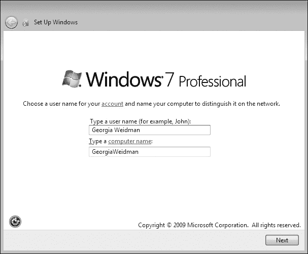图 1-49. 设置用户名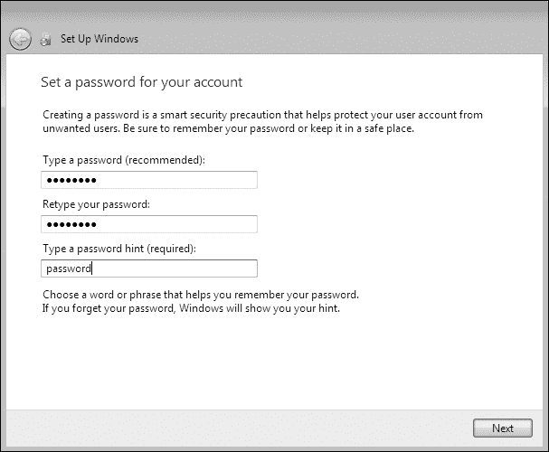图 1-50. 为用户 Georgia Weidman 设置密码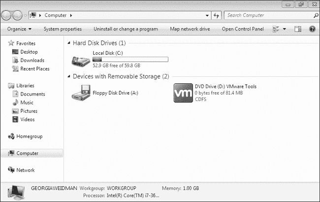图 1-51. 安装 VMware 工具

### 选择不进行自动更新

尽管我们对 Windows 7 的攻击主要依赖于第三方软件中的漏洞，而非 Windows 缺失的补丁，但我们仍然需要再次选择不进行 Windows 更新。为此，请进入**开始** ▸ **控制面板** ▸ **系统和安全**。然后在 Windows 更新下，点击**启用或禁用自动更新**。将重要更新设置为**从不检查更新（不推荐）**，如图 1-52 所示。点击**确定**。

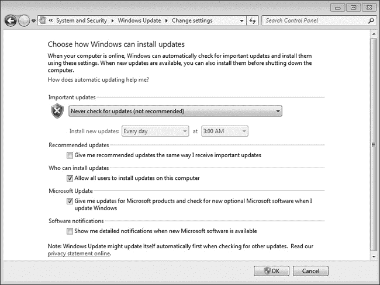图 1-52. 取消自动更新

### 设置静态 IP 地址

通过选择 **Start** ▸ **Control Panel** ▸ **Network and Internet** ▸ **Network and Sharing Center** ▸ **Change Adapter Settings** ▸ **Local Area Network** 来设置静态 IP 地址。现在右键点击并选择 **Properties** ▸ **Internet Protocol Version 4 (TCP/IPv4)** ▸ **Properties**。按照你为 Windows XP 设置静态 IP 地址的方式（在设置静态 IP 地址中讨论），但使用不同的 Windows 7 IP 地址，如图 1-53 所示。如果询问是否将此网络配置为家庭、工作还是公共网络，选择 **Work**。（确保你的虚拟机网络设置已配置为使用桥接适配器。）

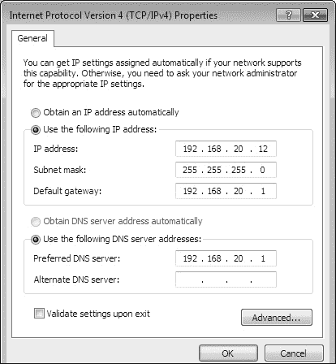图 1-53. 设置静态 IP 地址

由于 Windows 防火墙已启用，Windows 7 不会响应来自我们 Kali 系统的 ping 请求。因此，我们将从 Windows 7 向 Kali 系统发送 ping 请求。启动你的 Kali Linux 虚拟机，在你的 Windows 7 虚拟机中点击 **Start** 按钮。然后在运行对话框中输入 **`cmd`** 打开 Windows 命令提示符。在提示符下输入以下命令。

```
**ping <**IP Address of Kali**>**
```

如果一切正常，你应该能看到 ping 请求的回复，如设置静态 IP 地址中所示。

### 添加第二个网络接口

现在关闭你的 Windows 7 虚拟机。我们将为 Windows 7 虚拟机添加第二个网络接口，使 Windows 7 系统能够连接到两个网络。在后期利用这个设置，我们将模拟在第二个网络上攻击其他系统。

在 Microsoft Windows 上的 VMware Player 中，选择 **Player** ▸ **Manage** ▸ **Virtual Machine Settings** ▸ **Add**，选择 **Network Adapter**，然后按 **Next**。这个适配器将是网络适配器 2。在 Mac OS 上的 VMware Fusion 中，进入 **Virtual Machine Settings**，选择 **Add a Device**，然后选择网络适配器。将这个新适配器设置为 Host Only 网络。按 **OK**，虚拟机应会重启。（我们不需要为网络适配器 2 设置静态 IP 地址。）当虚拟机重启后，再次打开 Virtual Machine Settings，你应该能看到列出的两个网络适配器。只要计算机启动，它们应该都已连接。

### 安装额外的软件

现在，在你的 Windows 7 虚拟机中安装以下软件，保持默认设置。

+   从 *[`www.oldapps.com/java.php?old_java=8120/`](http://www.oldapps.com/java.php?old_java=8120/)* 下载一个过时的 Java 7 Update 6 版本。

+   从*[`www.oldapps.com/winamp.php?old_winamp=247/`](http://www.oldapps.com/winamp.php?old_winamp=247/)*下载 Winamp 版本 5.55。 (取消更改搜索引擎等设置。)

+   从*[`www.mozilla.org/`](http://www.mozilla.org/)*下载最新版本的 Mozilla Firefox。

+   从*[`windows.microsoft.com/en-us/windows/security-essentials-download/`](http://windows.microsoft.com/en-us/windows/security-essentials-download/)*下载微软安全防护软件。 (下载最新的病毒定义，确保下载适用于你 32 位 Windows 系统的版本。不要启用自动提交样本或安装时扫描。此外，现在暂时禁用实时保护。我们将在第十二章学习如何绕过杀毒软件时启用此功能。此设置可以在“设置”选项卡下的“实时保护”中找到。取消选中**启用实时保护（推荐）**，如图 1-54 所示。点击**保存更改**。)

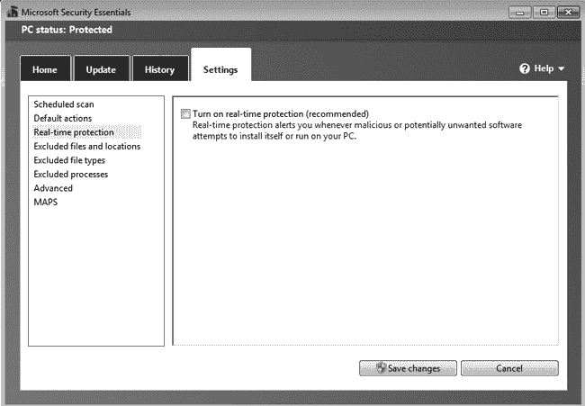图 1-54. 关闭实时保护

最后，安装从本书的种子中找到的*BookApp*自定义 Web 应用程序。(*1stPentestBook?!* 是该压缩包的密码。）将*BookApp*文件夹拖放到 Windows 7 虚拟机中。然后按照*InstallApp.pdf*中的说明安装 BookApp。以下是安装步骤的高层次概览。

1.  以管理员身份运行*Step1-install-iis.bat*，通过右键点击*.bat*文件并选择**以管理员身份运行**。（安装完成后，你可以关闭任何仍然打开的 DOS 窗口。）

1.  导航到*SQL*文件夹并运行*SQLEXPRWT_x86_ENU.EXE*。详细的安装说明和截图已包含在 InstallApp PDF 中。

1.  通过运行*SQLServer2008SP3-KB2546951-x86-ENU.exe*安装服务包 3。当出现已知兼容性问题的警告时，点击**确定**以运行该程序并完成安装。选择接受所有更改。

1.  使用 SQL Server 配置管理器启用**命名管道**。

1.  返回主应用程序文件夹，以管理员身份运行*Step2-Modify-FW.bat*。

1.  使用*sqlxml_x86-v4.exe*安装 MS SQL 的 XML 支持，文件在 SQL 文件夹中。

1.  从主应用程序文件夹中以管理员身份运行*Step3-Install-App.bat*。

1.  使用 MS SQL 管理工作室运行 SQL 文件夹中的*db.sql*，具体细节参见 InstallApp PDF。

1.  最后，修改书籍应用文件夹中*AuthInfo.xml*文件的用户权限，给予 IIS_USERS 完全权限。

## 总结

我们设置了虚拟环境，下载并定制了用于攻击的 Kali Linux，配置了虚拟网络，并配置了我们的目标操作系统——Windows XP、Windows 7 和 Ubuntu。

在下一章中，我们将习惯于使用 Linux 命令行，并且我们将开始学习如何使用本书中的许多渗透测试工具和技术。
