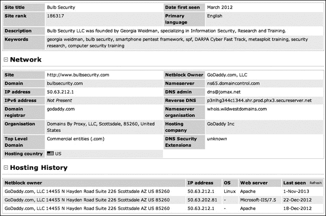
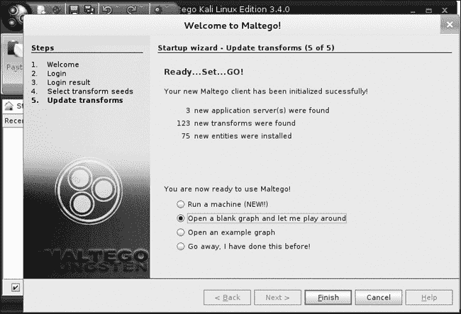
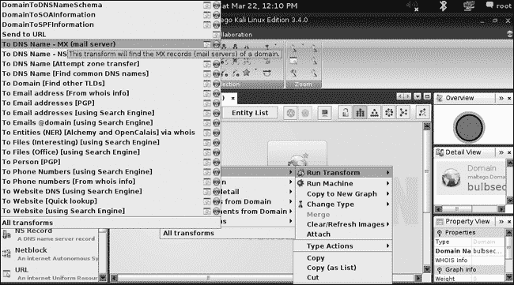
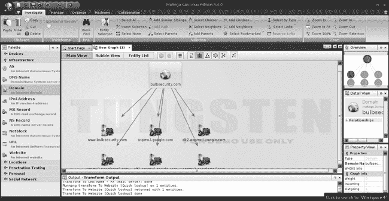
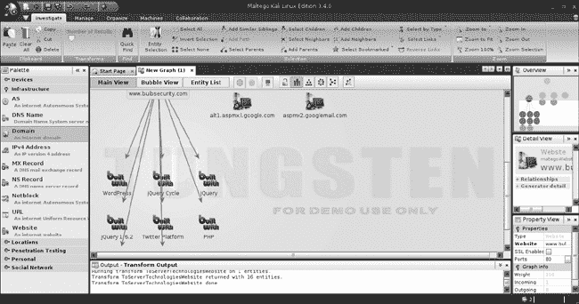
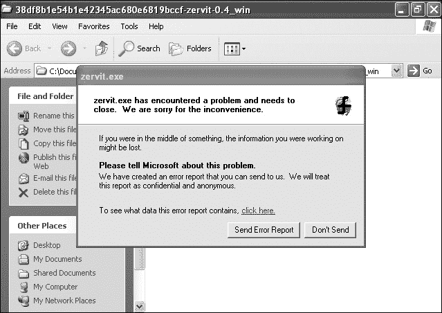

## 第五章 信息收集

本章我们将开始渗透测试的信息收集阶段。这个阶段的目标是尽可能多地了解我们的客户。首席执行官是否在推特上泄露了太多信息？系统管理员是否在归档的邮件列表中询问如何保护 Drupal 安装？他们的网页服务器运行的是什么软件？面向互联网的系统是否监听了超过应有的端口？或者，如果这是一次内部渗透测试，域控制器的 IP 地址是什么？

我们还将开始与目标系统进行互动，在不主动攻击的情况下尽可能多地了解它们。我们将在这一阶段获得的知识基础上，进入威胁建模阶段，在该阶段我们像攻击者一样思考，并根据收集到的信息制定攻击计划。基于我们所揭示的信息，我们将主动寻找并验证漏洞，使用漏洞扫描技术，这将在下一章中介绍。

## 开源情报收集

在发送任何数据包之前，我们可以了解客户的组织和基础设施的很多信息，但信息收集仍然有点像一个动态的目标。研究每个员工的在线活动是不可行的，而且在收集到大量信息后，很难从杂音中辨别出重要数据。如果首席执行官在推特上频繁发布关于某个喜爱运动队的信息，那么该队的名称可能是她的网页邮件密码的依据，但也可能完全无关紧要。其他时候，发现一些关键的信息会更容易。例如，如果客户发布了寻找熟悉某些软件的系统管理员的职位招聘信息，那么这些平台很可能已经在客户的基础设施中部署。

与从垃圾捡拾、数据库泄露和社会工程等隐秘来源获得的情报不同，*开源情报*（或 *OSINT*）是从合法来源，如公共记录和社交媒体中收集的。渗透测试的成功往往依赖于信息收集阶段的结果，因此在这一部分，我们将探讨一些工具，以从这些公共来源获取有价值的信息。

### Netcraft

有时，网页服务器和网页托管公司收集并公开的信息可以揭示很多关于一个网站的细节。例如，一家公司叫做 Netcraft，它记录网站的正常运行时间并查询其底层软件。（这些信息公开可查，地址为 *[`www.netcraft.com/`](http://www.netcraft.com/)*。）Netcraft 还提供其他服务，其中他们的反钓鱼服务特别引起信息安全领域的关注。

例如，图 5-1 显示了我们查询 *[`www.netcraft.com/`](http://www.netcraft.com/)* 和 *[`www.bulbsecurity.com`](http://www.bulbsecurity.com)* 时的结果。如你所见，*bulbsecurity.com* 最早出现在 2012 年 3 月。它通过 GoDaddy 注册，IP 地址为 50.63.212.1，运行的是 Linux 操作系统，并且使用 Apache Web 服务器。

拥有这些信息后，当我们对 *bulbsecurity.com* 进行渗透测试时，可以从排除只影响 Microsoft IIS 服务器的漏洞开始。或者，如果我们想尝试社交工程学来获取网站的凭据，我们可以写一封看似来自 GoDaddy 的邮件，要求管理员登录并检查一些安全设置。

图 5-1. Netcraft 对 bulbsecurity.com 的结果

### Whois 查找

所有域名注册商都会保留他们托管的域名记录。这些记录包含关于所有者的信息，包括联系信息。例如，如果我们在 Kali 机器上运行 Whois 命令行工具查询 *bulbsecurity.com* 的信息，如 示例 5-1 所示，我们看到我使用了私密注册，所以我们不会学到太多信息。

示例 5-1. bulbsecurity.com 的 Whois 信息

```
root@kali:~# **whois bulbsecurity.com**
  Registered through: GoDaddy.com, LLC (http://www.godaddy.com)
   Domain Name: BULBSECURITY.COM
      Created on: 21-Dec-11
      Expires on: 21-Dec-12
      Last Updated on: 21-Dec-11

   Registrant: ❶
   Domains By Proxy, LLC
   DomainsByProxy.com
   14747 N Northsight Blvd Suite 111, PMB 309
   Scottsdale, Arizona 85260
   United States

   Technical Contact: ❷
      Private, Registration  BULBSECURITY.COM@domainsbyproxy.com
      Domains By Proxy, LLC
      DomainsByProxy.com
      14747 N Northsight Blvd Suite 111, PMB 309
      Scottsdale, Arizona 85260
      United States
      (480) 624-2599      Fax -- (480) 624-2598

   Domain servers in listed order:
      NS65.DOMAINCONTROL.COM ❸
      NS66.DOMAINCONTROL.COM
```

该网站有私密注册，因此注册人 ❶ 和技术联系人 ❷ 都是代理域名。代理域名提供私密注册，隐藏你拥有的域名的个人信息。不过，我们确实可以看到 *bulbsecurity.com* 的域名服务器 ❸。

对其他域名进行 Whois 查询会显示更多有趣的结果。例如，如果你对 *georgiaweidman.com* 进行 Whois 查找，你可能会看到一些有趣的过去信息，包括我大学时的电话号码。

### DNS 勘察

我们还可以使用域名系统（DNS）服务器来了解更多关于一个域名的信息。DNS 服务器将人类可读的 URL *[www.bulbsecurity.com](http://www.bulbsecurity.com)* 转换为 IP 地址。

#### Nslookup

例如，我们可以使用如 示例 5-2 所示的命令行工具，如 Nslookup。

示例 5-2. www.bulbsecurity.com 的 Nslookup 信息

```
root@Kali:~# **nslookup www.bulbsecurity.com**
Server:    75.75.75.75
Address:   75.75.75.75#53

Non-authoritative answer:
www.bulbsecurity.com    canonical name = bulbsecurity.com.
Name:    bulbsecurity.com
Address: 50.63.212.1 ❶
```

Nslookup 返回了 *[www.bulbsecurity.com](http://www.bulbsecurity.com)* 的 IP 地址，如 ❶ 所示。

我们还可以通过查找 MX 记录（DNS 中表示电子邮件的术语），告诉 Nslookup 查找同一网站的邮件服务器，如 示例 5-3 所示。

示例 5-3. bulbsecurity.com 的邮件服务器的 Nslookup 信息

```
root@kali:~# **nslookup**
> **set type=mx**
> **bulbsecurity.com**
Server:    75.75.75.75
Address:   75.75.75.75#53

Non-authoritative answer:
bulbsecurity.com    mail exchanger = 40 ASPMX2.GOOGLEMAIL.com.
bulbsecurity.com    mail exchanger = 20 ALT1.ASPMX.L.GOOGLE.com.
bulbsecurity.com    mail exchanger = 50 ASPMX3.GOOGLEMAIL.com.
bulbsecurity.com    mail exchanger = 30 ALT2.ASPMX.L.GOOGLE.com.
bulbsecurity.com    mail exchanger = 10 ASPMX.L.GOOGLE.com.
```

Nslookup 显示*bulbsecurity.com*正在使用 Google Mail 作为其电子邮件服务器，这是正确的，因为我使用的是 Google Apps。

#### Host

另一个用于 DNS 查询的工具是 Host。我们可以使用`host -t ns` *`domain`*命令询问 Host 该域名的名称服务器。一个很好的域名查询示例是*zoneedit.com*，这是一个演示区域传输漏洞的域名，如下所示。

```
root@kali:~# **host -t ns zoneedit.com**
zoneedit.com name server ns4.zoneedit.com.
zoneedit.com name server ns3.zoneedit.com.
--*snip*--
```

该输出展示了所有*zoneedit.com*的 DNS 服务器。自然地，由于我提到这个域名是用来演示区域传输的，所以接下来我们要做的就是进行区域传输。

#### 区域传输

DNS 区域传输允许名称服务器复制一个域的所有条目。在设置 DNS 服务器时，通常会有一个主名称服务器和一个备份服务器。最好的方法就是通过查询主服务器的所有条目，将所有条目填充到备份 DNS 服务器中。

不幸的是，许多系统管理员没有安全地设置 DNS 区域传输，使得任何人都可以转移域的 DNS 记录。*zoneedit.com*就是这样一个例子，我们可以使用`host`命令下载它的所有 DNS 记录。使用`-l`选项来指定要传输的域，并从之前的命令中选择一个名称服务器，如示例 5-4 所示。

示例 5-4. *zoneedit.com*的区域传输

```
root@kali:~# **host -l zoneedit.com ns2.zoneedit.com**
Using domain server:
Name: ns2.zoneedit.com
Address: 69.72.158.226#53
Aliases:

zoneedit.com name server ns4.zoneedit.com.
zoneedit.com name server ns3.zoneedit.com.
zoneedit.com name server ns15.zoneedit.com.
zoneedit.com name server ns8.zoneedit.com.
zoneedit.com name server ns2.zoneedit.com.
zoneedit.com has address 64.85.73.107
www1.zoneedit.com has address 64.85.73.41
dynamic.zoneedit.com has address 64.85.73.112
bounce.zoneedit.com has address 64.85.73.100
--*snip*--
mail2.zoneedit.com has address 67.15.232.182
--*snip*--
```

*zoneedit.com*的 DNS 条目有很多，这为我们在寻找渗透测试中的漏洞时提供了一个很好的起点。例如，*mail2.zoneedit.com*可能是一个邮件服务器，因此我们应该寻找可能在典型电子邮件端口上运行的易受攻击的软件，例如 25 端口（简单邮件传输协议）和 110 端口（POP3）。如果我们能找到一个 Web 邮件服务器，任何找到的用户名都可能帮助我们朝正确的方向前进，从而猜测密码并访问公司敏感的电子邮件。

### 搜索电子邮件地址

外部渗透测试通常发现暴露的服务比内部渗透测试要少。一个好的安全做法是只暴露那些必须远程访问的服务，比如 Web 服务器、邮件服务器、VPN 服务器，可能还有 SSH 或 FTP，并且只暴露那些对任务至关重要的服务。像这样的服务是常见的攻击面，除非员工使用双因素认证，否则如果攻击者能猜测有效的凭据，访问公司 Web 邮件可能非常简单。

查找用户名的一个好方法是通过在互联网上寻找电子邮件地址。你可能会惊讶地发现，一些公司电子邮件地址公开列在家长-教师协会的联系信息、体育团队名单上，当然，还有社交媒体。

你可以使用一个名为 theHarvester 的 Python 工具，快速扫描数千条搜索引擎结果，寻找可能的电子邮件地址。theHarvester 可以自动化搜索 Google、Bing、PGP、LinkedIn 等平台上的电子邮件地址。例如，在示例 5-5 中，我们将查看所有搜索引擎中的前 500 条结果，关于 *bulbsecurity.com*。

示例 5-5. 使用 theHarvester 扫描 bulbsecurity.com

```
root@kali:~# **theharvester -d bulbsecurity.com -l 500 -b all**

*******************************************************************
*                                                                 *
* | |_| |__   ___    /\  /\__ _ _ ____   _____  ___| |_ ___ _ __  *
* | __| '_ \ / _ \  / /_/ / _` | '__\ \ / / _ \/ __| __/ _ \ '__| *
* | |_| | | |  __/ / __  / (_| | |   \ V /  __/\__ \ ||  __/ |    *
*  \__|_| |_|\___| \/ /_/ \__,_|_|    \_/ \___||___/\__\___|_|    *
*                                                                 *
* TheHarvester Ver. 2.2a                                          *
* Coded by Christian Martorella                                   *
* Edge-Security Research                                          *
* cmartorella@edge-security.com                                   *
*******************************************************************

Full harvest..
[-] Searching in Google..
    Searching 0 results...
    Searching 100 results...
    Searching 200 results...
    Searching 300 results...
--*snip*--

 [+] Emails found:
------------------
georgia@bulbsecurity.com

[+] Hosts found in search engines:
------------------------------------
50.63.212.1:www.bulbsecurity.com

--*snip*--
```

对于 *bulbsecurity.com*，没有找到太多信息，但 theHarvester 确实找到了我的电子邮件地址 *georgia@bulbsecurity.com*，以及网站 *[www.bulbsecurity.com](http://www.bulbsecurity.com)*，还有我与之共享虚拟主机的其他网站。如果你对你的组织进行扫描，可能会找到更多结果。

### Maltego

Paterva 的 Maltego 是一款数据挖掘工具，旨在可视化开源情报收集。Maltego 有商业版和免费社区版。我们在本书中使用的免费 Kali Linux 版本返回的结果有所限制，但我们仍然可以非常快速地收集大量有趣的信息。（付费版提供更多结果和功能。要在渗透测试中使用 Maltego，你需要购买付费许可证。）

### 注意

随时可以使用 Maltego 来研究其他互联网足迹，包括你自己的、你公司的、你高中时的死敌的等等。Maltego 使用公开可用的互联网信息，因此对任何实体进行侦察都是完全合法的。

要运行 Maltego，请在命令行中输入 **`maltego`**。Maltego 的图形界面应该会启动。你将被提示在 Paterva 网站上创建一个免费账户并登录。一旦登录，选择 **打开一个空白图表并让我玩一下**，然后点击 **完成**，如图 5-2 所示。

图 5-2. 打开一个新的 Maltego 图表

现在从左侧边栏选择 **调色板** 选项。如你所见，我们可以收集各种实体的信息。

我们从 *bulbsecurity.com* 域名开始，如图 5-3 所示。从调色板（位于 Maltego 窗口的左侧）中展开“基础设施”选项，并将一个“域名”实体从调色板拖动到新的图表中。默认情况下，域名是 *paterva.com*。要将其更改为 *bulbsecurity.com*，可以双击文本或更改屏幕右侧的文本字段。

图 5-3. 将实体添加到图表

一旦设置好域名，你可以在其上运行转换（Maltego 中用于查询的术语），指示 Maltego 搜索有趣的信息。让我们从几个简单的转换开始，你可以通过右键点击域名图标并选择**运行转换**来查看这些转换，如图 5-4 所示。

在图中，我们可以看到所有可用于域名实体的转换。随着你使用不同的实体，转换选项也会不同。让我们查找*bulbsecurity.com*域名的 MX 记录，从而找出邮件服务器的位置。在**所有转换**下，选择**到 DNS 名称 – MX（邮件服务器）**转换。

正如我们之前研究的预期，Maltego 返回了 Google Mail 服务器，表明*bulbsecurity.com*使用 Google Apps 作为邮件服务。我们可以运行简单的**到网站 [快速查找]**转换，获取*bulbsecurity.com*的官网地址。有关这一转换以及之前转换的结果，请参见图 5-5。

图 5-4. Maltego 转换图 5-5. 转换结果

Maltego 正确地找到了*[www.bulbsecurity.com](http://www.bulbsecurity.com)*。攻击 Google Mail 服务器可能超出了任何渗透测试的范围，但更多关于* [www.bulbsecurity.com](http://www.bulbsecurity.com)*网站的信息无疑会很有用。我们可以对图表上的任何实体运行转换，所以选择网站*[www.bulbsecurity.com](http://www.bulbsecurity.com)*来收集有关它的数据。例如，我们可以运行**到服务器技术网站**转换，查看*[www.bulbsecurity.com](http://www.bulbsecurity.com)*正在运行什么软件，如图 5-6 所示。

图 5-6. [www.bulbsecurity.com](http://www.bulbsecurity.com) 软件

Maltego 发现*[www.bulbsecurity.com](http://www.bulbsecurity.com)*是一个 Apache web 服务器，运行 PHP、Flash 等，同时安装了 WordPress。WordPress 作为一个常用的博客平台，有着一长串的安全问题（就像许多软件一样）。我们将在第十四章中探讨如何利用网站漏洞。（希望我一直在保持我的 WordPress 博客更新，否则我可能某天醒来会发现我的网站被篡改了。真是太尴尬了！）

你可以在 *[`www.paterva.com/`](http://www.paterva.com/)* 上找到更多关于 Maltego 的信息和教程。花点时间使用 Maltego 的变换功能，查找有关你组织的有趣信息。在熟练的操作下，Maltego 能够将几小时的侦察工作缩短到几分钟，而且结果的质量不打折。

## 端口扫描

当你开始渗透测试时，潜在的测试范围几乎是无限的。客户可能运行着多种存在安全问题的程序：他们的基础设施可能存在配置错误，导致系统可能被攻破；弱密码或默认密码可能会将安全的系统轻松攻陷；等等。渗透测试通常会将测试范围缩小到特定的 IP 范围，仅此而已。如果客户没有使用易受攻击的软件，那么你通过开发针对最新最强大服务器端漏洞的有效利用工具并不会帮助他们。我们需要了解哪些系统是活跃的，以及我们可以与哪些软件进行交互。

### 手动端口扫描

例如，在上一章中，我们看到利用 MS08-067 漏洞对攻击者和渗透测试人员来说都是一次轻松的胜利。为了利用这个漏洞，我们需要找到一台运行 Windows 2000、XP 或 2003 的机器，且该机器的 SMB 服务器缺少 MS08-067 补丁，并且该机器在网络上可访问。通过映射网络范围并查询系统的监听端口，我们可以对网络攻击面有一个很好的了解。

我们可以通过手动连接端口来实现这一点，使用像 telnet 或 Netcat 这样的工具并记录结果。我们来用 Netcat 连接到 Windows XP 机器上的端口 25，这是简单邮件传输协议（SMTP）的默认端口。

```
root@kali:~# **nc -vv 192.168.20.10 25**
nc: 192.168.20.10 (192.168.20.10) 25 [smtp]❶ open
nc: using stream socket
nc: using buffer size 8192
nc: read 66 bytes from remote
220 bookxp SMTP Server SLmail 5.5.0.4433 Ready
ESMTP spoken here
nc: wrote 66 bytes to local
```

结果发现，这台 Windows XP 机器在端口 25 ❶ 上运行着一个 SMTP 服务器。我们连接后，SMTP 服务器自我介绍为 `SLMail -version 5.5.0.4433`。

现在，请记住，管理员可以更改这种横幅信息，让其显示任何内容，甚至将攻击者和渗透测试人员引导到一场无意义的追逐中，研究一个未部署的产品的漏洞。然而，在大多数情况下，软件横幅中的版本号通常是相对准确的，直接连接到端口并查看横幅信息为我们的渗透测试研究提供了一个起点。通过网络搜索 `SLMail version 5.5.0.4433` 可能会得到一些有趣的结果。

另一方面，连接到单台计算机上的每一个可能的 TCP 和 UDP 端口并记录结果可能会非常耗时。幸运的是，计算机在执行这种重复性任务时表现出色，我们可以使用端口扫描工具，如 Nmap，来帮我们找到监听端口。

### 注意

到目前为止，我们在本章中所做的一切都是完全合法的。但一旦我们开始主动查询系统，就进入了法律灰色地带。未经许可尝试闯入计算机在许多国家是非法的。尽管隐蔽的扫描流量可能不会引起注意，但你应该只在你的目标虚拟机或其他你拥有或已获得书面许可进行测试的系统上练习本章（以及本书其余部分）所学习的技能（业内称为“免死金牌”）。

### 使用 Nmap 进行端口扫描

Nmap 是行业标准的端口扫描工具。仅关于使用 Nmap 就有整本书籍，手册页面可能看起来有些令人生畏。我们将在这里介绍端口扫描的基础知识，并在后续章节中再次回到该工具。

配备入侵检测和防御系统的防火墙在检测和阻止扫描流量方面取得了显著进展，因此你可能会运行 Nmap 扫描，却没有得到任何结果。尽管你可能被聘请对没有活动主机的网络范围执行外部渗透测试，但更有可能是你的扫描被防火墙阻挡了。另一方面，如果你的 Nmap 结果显示每个主机都处于活动状态，并且如果扫描被检测到，所有端口都会处于监听状态。

#### SYN 扫描

让我们开始对目标机器执行 SYN 扫描。*SYN 扫描*是一种 TCP 扫描，它不会完成 TCP 握手。TCP 连接从三次握手开始：SYN ▸ SYN-ACK ▸ ACK，如图 5-7 所示。

图 5-7. TCP 三次握手

在 SYN 扫描中，Nmap 发送 SYN 包并等待 SYN-ACK 响应，如果端口开放，但永远不会发送 ACK 以完成连接。如果 SYN 包没有收到 SYN-ACK 响应，则该端口不可用；它要么是关闭的，要么是连接被过滤了。通过这种方式，Nmap 可以在不完全连接到目标机器的情况下判断端口是否开放。SYN 扫描的语法是`-sS`标志。

接下来，正如你在示例 5-6 中看到的，我们指定要扫描的 IP 地址或地址范围。最后，我们使用`-o`选项将 Nmap 结果输出到文件。`-oA`选项告诉 Nmap 以所有格式记录结果：*.nmap*、*.gnmap*（可用 grep 搜索的 Nmap 格式）和 XML 格式。Nmap 格式类似于示例 5-6 中 Nmap 输出到屏幕的结果，格式清晰且易于阅读。Greppable Nmap（顾名思义）格式化为可以与`grep`工具一起使用，以便查找特定信息。XML 格式是用于将 Nmap 结果导入其他工具的标准格式。示例 5-6 展示了 SYN 扫描的结果。

### 注意

记录下我们在渗透测试过程中做的每一件事总是一个好主意。像 Dradis 这样的工具是专门用来跟踪渗透测试数据的，但只要你在报告阶段有记录下所有的操作，你就没问题了。我个人更倾向于使用笔和纸，或者至多是在 Word 文档中创建一份长长的结果记录。用于跟踪结果的方法因渗透测试人员而异。将 Nmap 的扫描结果输出到文件是一种确保你有扫描记录的好方法。另外，你可以使用 Linux 命令 `script` 来记录终端输出的一切——这也是一种很好的方式来追踪你所做的所有操作。

示例 5-6. 运行 Nmap SYN 扫描

```
root@kali:~# **nmap -sS 192.168.20.10-12 -oA booknmap**
Starting Nmap 6.40 ( http://nmap.org ) at 2015-12-18 07:28 EST
Nmap scan report for 192.168.20.10
Host is up (0.00056s latency).
Not shown: 991 closed ports
PORT     STATE SERVICE
21/tcp   open  ftp ❷
25/tcp   open  smtp ❺
80/tcp   open  http ❸
106/tcp  open  pop3pw ❺
110/tcp  open  pop3 ❺
135/tcp  open  msrpc
139/tcp  open  netbios-ssn ❹
443/tcp  open  https ❸
445/tcp  open  microsoft-ds ❹
1025/tcp open  NFS-or-IIS
3306/tcp open  mysql ❻
5000/tcp open  upnp
MAC Address: 00:0C:29:A5:C1:24 (VMware)

Nmap scan report for 192.168.20.11
Host is up (0.00031s latency).
Not shown: 993 closed ports
PORT     STATE SERVICE
21/tcp   open  ftp ❷
22/tcp   open  ssh
80/tcp   open  http ❸
111/tcp  open  rpcbind
139/tcp  open  netbios-ssn ❹
445/tcp  open  microsoft-ds ❹
2049/tcp open  nfs
MAC Address: 00:0C:29:FD:0E:40 (VMware)

Nmap scan report for 192.168.20.12
Host is up (0.0014s latency).
Not shown: 999 filtered ports
PORT     STATE SERVICE
80/tcp   open  http ❶
135/tcp  open  msrpc
MAC Address: 00:0C:29:62:D5:C8 (VMware)

Nmap done: 3 IP addresses (3 hosts up) scanned in 1070.40 seconds
```

如你所见，Nmap 在 Windows XP 和 Linux 机器上返回了一些端口。随着我们在接下来的章节中深入了解，你会发现几乎所有这些端口都包含漏洞。希望在你的渗透测试中不会出现这种情况，但为了让你了解在实际工作中可能遇到的各种漏洞，我们的渗透测试实验室已浓缩为这三台机器。

话虽如此，端口开放并不意味着存在漏洞。它只是让我们有可能在这些端口上运行着易受攻击的软件。我们的 Windows 7 机器仅在端口 80 ❶（HTTP 网络服务器的传统端口）和端口 139（远程过程调用端口）上监听。可能有可利用的软件监听那些没有通过 Windows 防火墙的端口，也可能有易受攻击的软件在本地运行，但目前我们不能直接在网络上尝试利用任何东西，除了 Web 服务器。

这个基础的 Nmap 扫描已经帮助我们集中渗透测试的精力。Windows XP 和 Linux 目标都在运行 FTP 服务器 ❷、Web 服务器 ❸ 和 SMB 服务器 ❹。Windows XP 机器还运行着一个邮件服务器，打开了几个端口 ❺，并且有一个 MySQL 服务器 ❻。

#### 版本扫描

我们的 SYN 扫描很隐蔽，但它并没有告诉我们监听端口上实际运行的软件是什么。与通过 Netcat 连接到端口 25 获取的详细版本信息相比，SYN 扫描的结果显得有些平淡。我们可以使用完整的 TCP 扫描（`nmap -sT`）或进一步使用 Nmap 的版本扫描（`nmap -sV`）来获取更多数据。在示例 5-7 中展示的版本扫描，Nmap 完成连接后会尝试确定运行的软件是什么，并且如果可能的话，获取版本信息，采用的技术包括横幅抓取等。

示例 5-7. 运行 Nmap 版本扫描

```
root@kali:~# **nmap -sV 192.168.20.10-12 -oA bookversionnmap**

Starting Nmap 6.40 ( http://nmap.org ) at 2015-12-18 08:29 EST
Nmap scan report for 192.168.20.10
Host is up (0.00046s latency).
Not shown: 991 closed ports
PORT     STATE SERVICE      VERSION
21/tcp   open  ftp          FileZilla ftpd 0.9.32 beta
25/tcp   open  smtp         SLmail smtpd 5.5.0.4433
79/tcp   open  finger       SLMail fingerd
80/tcp   open  http         Apache httpd 2.2.12 ((Win32) DAV/2 mod_ssl/2.2.12 OpenSSL/0.9.8k
                              mod_autoindex_color PHP/5.3.0 mod_perl/2.0.4 Perl/v5.10.0)
106/tcp  open  pop3pw       SLMail pop3pw
110/tcp  open  pop3         BVRP Software SLMAIL pop3d
135/tcp  open  msrpc        Microsoft Windows RPC
139/tcp  open  netbios-ssn
443/tcp  open  ssl/http     Apache httpd 2.2.12 ((Win32) DAV/2 mod_ssl/2.2.12 OpenSSL/0.9.8k
                              mod_autoindex_color PHP/5.3.0 mod_perl/2.0.4 Perl/v5.10.0)
445/tcp  open  microsoft-ds Microsoft Windows XP microsoft-ds
1025/tcp open  msrpc        Microsoft Windows RPC
3306/tcp open  mysql        MySQL (unauthorized)
5000/tcp open  upnp         Microsoft Windows UPnP
MAC Address: 00:0C:29:A5:C1:24 (Vmware)
Service Info: Host: georgia.com; OS: Windows; CPE: cpe:/o:microsoft:windows

Nmap scan report for 192.168.20.11
Host is up (0.00065s latency).
Not shown: 993 closed ports
PORT     STATE SERVICE              VERSION
21/tcp   open  ftp                  vsftpd 2.3.4 ❶
22/tcp   open  ssh                  OpenSSH 5.1p1 Debian 3ubuntu1 (protocol 2.0)
80/tcp   open  http                 Apache httpd 2.2.9 ((Ubuntu) PHP/5.2.6-2ubuntu4.6 with
                                      Suhosin-Patch)
111/tcp  open  rpcbind (rpcbind V2) 2 (rpc #100000)
139/tcp  open  netbios-ssn          Samba smbd 3.X (workgroup: WORKGROUP)
445/tcp  open  netbios-ssn          Samba smbd 3.X (workgroup: WORKGROUP)
2049/tcp open  nfs (nfs V2-4)       2-4 (rpc #100003)
MAC Address: 00:0C:29:FD:0E:40 (VMware)
Service Info: OSs: Unix, Linux; CPE: cpe:/o:linux:kernel

Nmap scan report for 192.168.20.12
Host is up (0.0010s latency).
Not shown: 999 filtered ports
PORT     STATE SERVICE        VERSION
80/tcp   open  http           Microsoft IIS httpd 7.5
135/tcp  open  msrpc          Microsoft Windows RPC
MAC Address: 00:0C:29:62:D5:C8 (VMware)

Service detection performed. Please report any incorrect results at http://nmap.org/submit/ .
Nmap done: 3 IP addresses (3 hosts up) scanned in 20.56 seconds
```

这一次，我们获得了更多关于 Windows XP 和 Linux 目标的信息。例如，我们知道 Linux 机器上有一个 FTP 服务器，但现在我们有了合理的证据，证明该 FTP 服务器是非常安全的 FTP 版本 2.3.4❶。我们将在下一章中使用此输出搜索潜在的漏洞。至于我们的 Windows 7 系统，我们只发现它正在运行 Microsoft IIS 7.5，这是一个相当更新的版本。尽管在 Windows 7 上可以安装 IIS 8，但它并不被官方支持。该版本本身不会引起我的任何警觉。我们将在第十四章中发现，安装在此 IIS 服务器上的应用程序才是实际的问题。

### 注意

请记住，在某些情况下，Nmap 可能会报告错误的版本（例如，如果软件已经更新，但欢迎横幅没有作为补丁的一部分进行编辑），但至少它的版本扫描为我们提供了一个很好的起点，进一步的研究可以从这里开始。

#### UDP 扫描

Nmap 的 SYN 扫描和版本扫描都是 TCP 扫描，无法查询 UDP 端口。由于 UDP 是无连接的，扫描逻辑有所不同。在 UDP 扫描（`-sU`）中，Nmap 向端口发送一个 UDP 数据包。根据端口的不同，发送的数据包是协议特定的。如果收到响应，则该端口被视为开放。如果端口关闭，Nmap 将收到 ICMP 端口不可达消息。如果 Nmap 完全没有收到响应，则可能是端口开放，但正在监听的程序未响应 Nmap 的查询，或者流量被过滤。因此，Nmap 并不总是能够区分开放的 UDP 端口和被防火墙过滤的端口。请参见示例 5-8，了解 UDP 扫描的示例。

示例 5-8. 执行 UDP 扫描

```
root@kali:~# **nmap -sU 192.168.20.10-12 -oA bookudp**

Starting Nmap 6.40 ( http://nmap.org ) at 2015-12-18 08:39 EST
Stats: 0:11:43 elapsed; 0 hosts completed (3 up), 3 undergoing UDP Scan
UDP Scan Timing: About 89.42% done; ETC: 08:52 (0:01:23 remaining)
Nmap scan report for 192.168.20.10
Host is up (0.00027s latency).
Not shown: 990 closed ports
PORT     STATE         SERVICE
69/udp   open|filtered tftp ❶
123/udp  open          ntp
135/udp  open          msrpc
137/udp  open          netbios-ns
138/udp  open|filtered netbios-dgm
445/udp  open|filtered microsoft-ds
500/udp  open|filtered isakmp
1026/udp open          win-rpc
1065/udp open|filtered syscomlan
1900/udp open|filtered upnp
MAC Address: 00:0C:29:A5:C1:24 (VMware)

Nmap scan report for 192.168.20.11
Host is up (0.00031s latency).
Not shown: 994 closed ports
PORT     STATE         SERVICE
68/udp   open|filtered dhcpc
111/udp  open          rpcbind
137/udp  open          netbios-ns
138/udp  open|filtered netbios-dgm
2049/udp open          nfs ❷
5353/udp open          zeroconf
MAC Address: 00:0C:29:FD:0E:40 (VMware)

Nmap scan report for 192.168.20.12
Host is up (0.072s latency).
Not shown: 999 open|filtered ports
PORT     STATE         SERVICE
137/udp  open          netbios-ns
MAC Address: 00:0C:29:62:D5:C8 (VMware)

Nmap done: 3 IP addresses (3 hosts up) scanned in 1073.86 seconds
```

例如，在 Windows XP 系统上，TFTP 端口（UDP 69）可能是开放的或被过滤的❶。在 Linux 目标上，Nmap 能够发现网络文件系统端口正在监听❷。由于只有两个 TCP 端口在 Windows 7 计算机上响应，因此可以合理推测存在防火墙，在这种情况下是内置的 Windows 防火墙。同样，Windows 防火墙过滤了除了一个 UDP 端口以外的所有流量。（如果没有 Windows 防火墙，我们的 UDP 扫描可能会提供更多的信息。）

#### 扫描特定端口

默认情况下，Nmap 只扫描它认为最“有趣”的 1,000 个端口，而不是 65,535 个可能的 TCP 或 UDP 端口。默认的 Nmap 扫描会捕获常见的运行服务，但在某些情况下，它可能会遗漏一个或两个监听端口。要扫描特定端口，可以使用 `-p` 标志与 Nmap 一起使用。例如，要扫描 Windows XP 目标上的 3232 端口，请参见示例 5-9。

示例 5-9. 执行针对特定端口的 Nmap 扫描

```
root@Kali:~# **nmap -sS -p 3232 192.168.20.10**

Starting Nmap 6.40 ( http://nmap.org ) at 2015-12-18 09:03 EST
Nmap scan report for 192.168.20.10
Host is up (0.00031s latency).
PORT     STATE SERVICE
3232/tcp open  unknown
MAC Address: 00:0C:29:A5:C1:24 (VMware)
```

确实，当我们告诉 Nmap 扫描 3232 端口时，它返回了`open`，这表明除了默认的 Nmap 扫描端口外，这个端口值得进一步检查。然而，如果我们尝试通过版本扫描更具攻击性地探测该端口（参见示例 5-10），监听该端口的服务会崩溃，如图 5-8 所示。

### 注意

一个好的经验法则是在进行渗透测试时指定端口 1 到 65535，确保这些“无趣”端口上没有监听的服务。

示例 5-10. 针对特定端口进行版本扫描

```
root@kali:~# **nmap -p 3232 -sV 192.168.20.10**
Starting Nmap 6.40 ( http://nmap.org ) at 2015-04-28 10:19 EDT
Nmap scan report for 192.168.20.10
Host is up (0.00031s latency).
PORT     STATE SERVICE VERSION
3232/tcp open  unknown
1 service unrecognized despite returning data❶. If you know the service/version, please submit the following fingerprint at http://www.insecure.org/cgi-bin/servicefp-submit.cgi : ❷
SF-Port3232-TCP:V=6.25%I=7%D=4/28%Time=517D2FFC%P=i686-pc-linux-gnu%r(GetR
SF:equest,B8,"HTTP/1\.1\x20200\x20OK\r\nServer:\x20Zervit\x200\.4\r\n❸X-Pow
SF:ered-By:\x20Carbono\r\nConnection:\x20close\r\nAccept-Ranges:\x20bytes\
SF:r\nContent-Type:\x20text/html\r\nContent-Length:\x2036\r\n\r\n<html>\r\
SF:n<body>\r\nhi\r\n</body>\r\n</html>");
MAC Address: 00:0C:29:13:FA:E3 (VMware)
```

图 5-8. Zervit 服务器在 Nmap 扫描时崩溃。

在崩溃监听服务的过程中，Nmap 无法弄清楚正在运行的是什么软件，如❶所示，但它确实成功获得了该服务的指纹。根据指纹中的 HTML 标签，❷ 这个服务似乎是一个 Web 服务器。根据 `Server:` 字段，它是一个名为 Zervit 0.4 的服务 ❸。

到此为止，我们已经让服务崩溃，可能再也无法在我们的渗透测试中看到它，因此任何潜在的漏洞都可能变得无关紧要。当然，在我们的实验室中，我们可以切换到 Windows XP 目标并重新启动 Zervit 服务器。

### 注意

虽然希望你在渗透测试中不会让任何服务崩溃，但总是有可能碰到一个特别敏感的服务，它的编程并没有接受除了预期输入以外的任何输入，因此即使是像 Nmap 扫描这样的看似无害的流量也会导致它崩溃。SCADA 系统尤其以这种行为而著称。你总是需要向客户解释这一点。在处理计算机时，没有任何保证。

我们将在下一章回到 Nmap 工具，当时我们将使用 Nmap 脚本引擎（NSE）来了解目标系统的详细漏洞信息，准备开始漏洞利用。

## 总结

在本章中，我们通过使用公开可用的资源和端口扫描工具迅速覆盖了大量内容。我们使用了 theHarvester 和 Maltego 等工具在互联网上查找信息，如电子邮件地址和网站。我们使用 Nmap 端口扫描工具找出了在目标虚拟机上监听的端口。根据我们发现的输出，我们现在可以研究已知的漏洞，开始像攻击者一样思考，并积极寻找系统中的可利用漏洞。在下一章中，我们将介绍渗透测试中的漏洞分析阶段。
