## 第七章 捕获流量

在我们进入利用阶段之前，我们将使用 Wireshark 监控工具以及其他工具来嗅探和操控流量，以从本地网络中的其他机器中获取有用的信息。在一次内部渗透测试中，当我们模拟内部威胁或攻击者突破防线时，捕获网络中其他系统的流量可以为我们提供额外的有趣信息（甚至可能是用户名和密码），帮助我们进行进一步的利用。问题在于，捕获流量可能会产生大量潜在有用的数据。仅仅捕获家用网络上的所有流量就可能迅速填满多个 Wireshark 窗口，而且发现哪些流量对渗透测试有用可能会很困难。在本章中，我们将探讨几种操控网络以获取我们本不该能看到的流量的方法。

## 捕获流量的网络设置

如果你发现自己处于一个使用集线器而不是交换机的网络中，捕获不属于你机器的流量将变得非常容易，因为当网络集线器接收到一个数据包时，它会将其在所有端口上重新广播，由每个设备决定该数据包属于谁。在一个使用集线器的网络中，捕获其他系统的流量就像在 Wireshark 中选择“在所有接口上使用混杂模式”一样简单。这会告诉我们的网络接口控制器（NIC）抓取它看到的所有内容，而在集线器网络中，这将是每个数据包。

与集线器不同，交换机会将流量仅发送到目标系统，因此在交换机网络中，我们将无法看到例如域控制器的所有进出流量，除非通过某种方式让网络将这些流量发送给我们。你在渗透测试中遇到的大多数网络可能都是交换机网络；即使是一些标榜为集线器的老旧网络硬件，也可能具备交换机的功能。

虚拟网络看起来像是集线器，因为你所有的虚拟机共享一个物理设备。如果你在虚拟网络中以混杂模式捕获流量，即使你在环境中使用的是交换机而不是集线器，你也可能能够看到来自每个虚拟机以及主机的流量。为了模拟一个非虚拟化的网络，我们将在 Wireshark 中关闭“在所有接口上使用混杂模式”，这意味着我们需要更加努力地捕获目标虚拟机的流量。

## 使用 Wireshark

Wireshark 是一个图形化网络协议分析工具，可以让我们深入查看在网络中流动的每一个数据包。Wireshark 可以用于捕获以太网、无线、蓝牙以及其他多种类型的流量。它可以解码它所看到的不同协议，因此你可以重建例如语音传输协议（VoIP）电话通话的音频。让我们来看看使用 Wireshark 捕获和分析流量的基础。

### 捕获流量

让我们先用 Wireshark 捕获本地网络上的流量。在 Kali 中启动 Wireshark，如图所示。点击任何有关以 root 用户身份使用 Wireshark 的警告提示。

```
root@kali:~# **wireshark**
```

告诉 Wireshark 在本地网络接口（eth0）上捕获流量，方法是选择 **Capture** ▸ **Options**，然后选择 **eth0** 选项，如 图 7-1 中所示。记得取消勾选“在所有接口上使用混杂模式”选项，这样捕获的结果将类似于物理交换网络，而不是 VMware 网络。退出选项菜单。最后，点击 **Capture** ▸ **Start** 开始捕获流量。

你应该开始看到传入的流量，并且能够捕获所有发往 Kali 机器的流量以及任何广播流量（发送到整个网络的流量）。

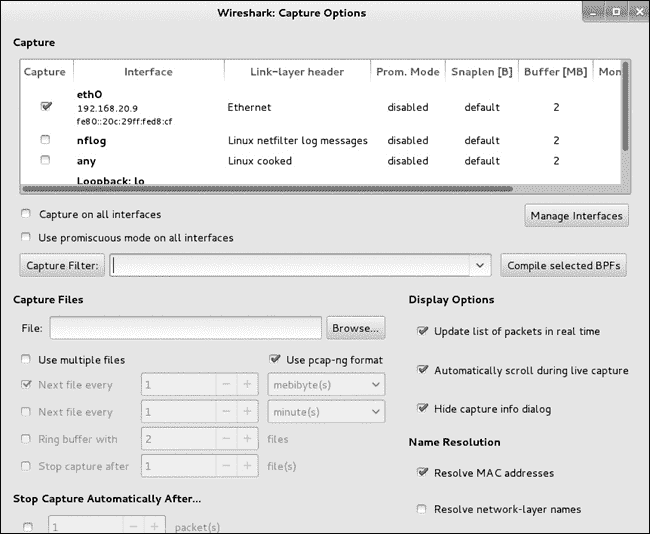图 7-1. 开始 Wireshark 捕获

为了说明我们可以在交换网络中捕获的流量，让我们从 Kali 机器通过 FTP 联系 Windows XP 目标机器。按照 示例 7-1 中的步骤以 *anonymous* 身份登录，以查看在 Wireshark 中捕获的流量。（在上一章中，我们发现 *anonymous* 用户在 Windows XP 目标机器上是被允许的。尽管 *anonymous* 需要输入密码，但密码无关紧要。传统上，它是一个电子邮件地址，但 FTP 服务器会接受你输入的任何内容。）

示例 7-1. 通过 FTP 登录

```
root@kali:~# **ftp 192.168.20.10**
Connected to 192.168.20.10.
220-FileZilla Server version 0.9.32 beta
220-written by Tim Kosse (Tim.Kosse@gmx.de)
220 Please visit http://sourceforge.net/projects/filezilla/
Name (192.168.20.10:root): **anonymous**
331 Password required for anonymous
Password:
230 Logged on
Remote system type is UNIX.
ftp>
```

你应该在 Wireshark 中看到来自 IP 地址 192.168.20.9 到 192.168.20.10 以及反方向的封包，协议字段显示为 FTP。Wireshark 正在捕获从我们的 Kali 机器进出流量。

切换到你的 Ubuntu Linux 目标机器，并登录到 Windows XP 目标上的 FTP 服务器。在 Kali 的 Wireshark 中，你应该看到没有捕获到额外的 FTP 封包。在我们模拟的交换网络中，任何不针对 Kali 机器的流量都不会被网络接口看到，因此也不会被 Wireshark 捕获。（我们将在 ARP 缓存中毒 中学习如何解决这个问题并捕获其他系统的流量。）

### 过滤流量

Wireshark 捕获的网络流量量庞大，可能会让人感到有些不知所措，因为除了我们的 FTP 流量外，所有进出 Kali 系统的数据包都会被捕获。为了找到特定的有趣数据包，我们可以使用 Wireshark 的过滤器。过滤器字段位于 Wireshark 界面左上方。作为第一个简单的 Wireshark 过滤示例，我们可以查找所有使用 FTP 协议的流量。在过滤器字段中输入**`ftp`**并点击**应用**，如图 7-2 所示。

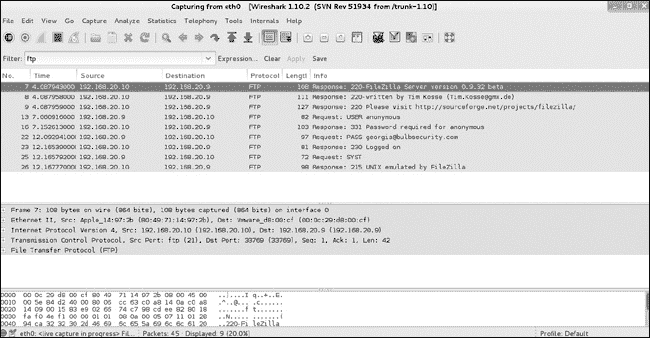图 7-2. 在 Wireshark 中过滤流量

正如预期的那样，Wireshark 会过滤捕获的数据包，仅显示使用 FTP 协议的数据包。我们可以看到整个 FTP 会话，包括明文的登录信息。

我们可以使用更高级的过滤器来进一步调整返回的数据包。例如，我们可以使用过滤器*ip.dst==192.168.20.10*来只返回目标 IP 地址为 192.168.20.10 的包。我们甚至可以将过滤器链在一起使用，例如使用过滤器*ip.dst==192.168.20.10 and ftp*来查找仅针对 192.168.20.10 的 FTP 流量。

### 跟踪 TCP 流

即使在过滤流量之后，仍然可能在相同时间段内捕获到多个 FTP 连接，因此可能仍然难以了解发生了什么。但一旦我们找到一个有趣的数据包，比如 FTP 登录的开始，我们可以通过右键单击数据包并选择**跟踪 TCP 流**来深入查看会话，如图 7-3 所示。

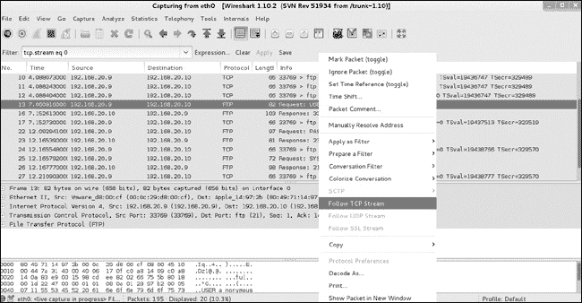图 7-3. 在 Wireshark 中跟踪 TCP 流

结果界面会显示我们整个 FTP 连接的内容，包括其中的明文凭据，如示例 7-2 所示。

示例 7-2. FTP 登录对话

```
220-FileZilla Server version 0.9.32 beta
220-written by Tim Kosse (Tim.Kosse@gmx.de)
220 Please visit http://sourceforge.net/projects/filezilla/
USER anonymous
331 Password required for anonymous
PASS georgia@bulbsecurity.com
230 Logged on
SYST
215 UNIX emulated by FileZilla
```

### 解剖数据包

通过选择特定的捕获数据包，我们可以获得有关捕获数据的更多信息，如图 7-4 所示。在 Wireshark 界面底部，你可以看到所选数据包的详细信息。在一点点引导下，Wireshark 会为你分解数据。例如，我们可以通过选择 TCP 条目并查找目标端口（Destination port）轻松找到 TCP 目标端口，如图中高亮显示的部分。当我们选择这个字段时，数据包原始字节中的对应条目也会被高亮显示。

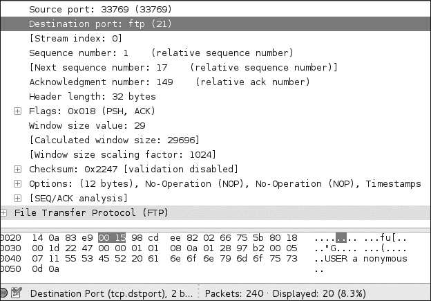图 7-4. Wireshark 中的数据包详情

## ARP 缓存中毒

虽然看到我们自己流量的详细信息很不错，但对于渗透测试目的来说，最好看到那些不打算发送到我们 Kali 系统的流量。也许我们能够捕获另一个用户的登录会话，该会话使用的是除*匿名*之外的帐户登录；这将为我们提供 FTP 服务器的有效凭据，并且可能会有一组凭据可以在环境中的其他地方被重用。

为了捕获不打算发送到 Kali 系统的流量，我们需要找到一种方法将相关数据发送到我们的 Kali 系统。由于网络交换机会只发送属于我们的数据包，我们需要欺骗目标机器或交换机（或者最好是两者），让它们相信这些流量属于我们。我们将执行一种所谓的中间人攻击，这将允许我们在将数据包转发到正确的目的地之前，重定向并拦截两个系统之间的流量（不包括我们自己的系统）。一种经验证有效的技术是伪装成网络上的其他设备，这被称为*地址解析协议（ARP）缓存投毒*（也叫*ARP 欺骗*）。

### ARP 基础

当我们连接到本地网络上的另一台机器时，通常会使用它的主机名、完全限定域名或 IP 地址。（我们将在 DNS 缓存投毒中讨论域名服务器缓存投毒。）在数据包从我们的 Kali 机器发送到 Windows XP 目标之前，Kali 必须将 XP 目标机器的 IP 地址映射到网络接口卡（NIC）的媒体访问控制（MAC）地址，以便 Kali 知道将数据包发送到网络的哪个位置。为此，它使用 ARP 广播“谁拥有 IP 地址 192.168.20.10？”在本地网络上。拥有 IP 地址 192.168.20.10 的机器回复：“我有 192.168.20.10，我的 MAC 地址是 00:0c:29:a9:ce:92。”在我们的案例中，这将是 Windows XP 目标。我们的 Kali 系统将在其 ARP 缓存中存储从 IP 地址 192.168.20.10 到 MAC 地址 00:0c:29:a9:ce:92 的映射。

当它发送下一个数据包时，我们的机器将首先查找其 ARP 缓存中是否有 192.168.20.10 的条目。如果找到，它将使用该条目作为目标地址，而不是发送另一个 ARP 广播。（ARP 缓存条目会定期被清除，因为网络拓扑可能随时发生变化。）因此，系统会定期发送 ARP 广播，因为它们的缓存会被清空。这个过程将在我们下一节进行 ARP 缓存投毒时派上用场。ARP 过程在图 7-5 中进行了说明。

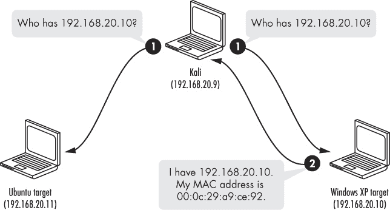图 7-5. ARP 解析过程

要查看 Kali 机器中的 ARP 缓存，输入**`arp`**。目前，它只知道 192.168.20.1（默认网关）和 192.168.20.10（我们在上一个练习中使用的 Windows XP 机器）这两个 IP 地址到 MAC 地址的映射。

```
root@kali:~# **arp**
Address                  HWtype  HWaddress           Flags Mask            Iface
192.168.20.1             ether   00:23:69:f5:b4:29   C                     eth0
192.168.20.10            ether   00:0c:29:05:26:4c   C                     eth0
```

现在重新启动 Wireshark 捕获，并使用*匿名*登录再次与 Ubuntu 目标的 FTP 服务器交互。接下来，使用*arp*过滤器，如图 7-6 所示，查看来自 Kali 机器的 ARP 广播以及来自 Ubuntu 目标的带有其 MAC 地址的应答。

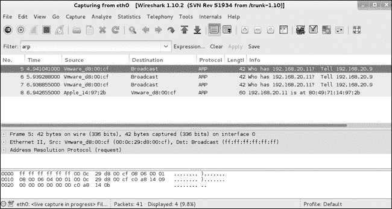图 7-6。ARP 广播和应答

再次检查你的 Kali Linux 的 ARP 缓存。你应该能看到 192.168.20.10 的条目。

```
root@kali:~# **arp**
Address                  HWtype  HWaddress           Flags Mask            Iface
192.168.20.1             ether   00:23:69:f5:b4:29   C                     eth0
192.168.20.10            ether   00:0c:29:05:26:4c   C                     eth0
192.168.20.11            ether   80:49:71:14:97:2b   C                     eth0
```

依赖 ARP 进行地址解析的问题在于，无法保证你得到的 IP 地址与 MAC 地址的映射是正确的。任何机器都可以回应 192.168.20.11 的 ARP 请求，即使那台机器的实际 IP 地址是 192.168.20.12 或其他任何地址。目标机器会接受这个应答，无论其是否正确。

这就是 ARP 缓存中毒的基本原理。我们发送一系列的 ARP 应答，告诉目标我们是网络中的另一台机器。因此，当目标机器发送本应发送给那台机器的流量时，它将把数据包直接发送给我们，由我们的流量嗅探器捕获，如图 7-7 所示。

回想一下第七章中，我们从 Ubuntu 目标机器发起了一个 FTP 连接到 Windows XP 目标机器，但该连接中的流量并未被 Wireshark 在我们的 Kali 系统上捕获。通过使用 ARP 缓存中毒攻击，我们可以欺骗这两台系统，将它们的流量发送到我们的 Kali 机器，从而在 Wireshark 中捕获。

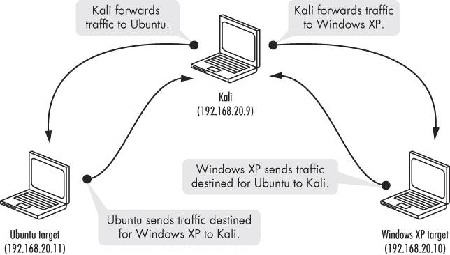图 7-7。ARP 缓存中毒通过 Kali 重定向流量。

### IP 转发

但是在我们能够欺骗 Linux 目标将 FTP 服务器的凭证发送给我们之前，我们需要启用 IP 转发，告诉我们的 Kali 机器将它接收到的任何额外数据包转发到正确的目的地。如果没有 IP 转发，我们将会在网络上创建*拒绝服务（DoS）*状态，导致合法客户端无法访问服务。例如，如果我们在没有 IP 转发的情况下使用 ARP 缓存中毒，将 Linux 目标的流量重定向到我们的 Kali 机器，原本应发送到 Windows XP 目标的流量，Windows XP 机器上的 FTP 服务器将永远无法接收到来自 Linux 机器的数据包，反之亦然。

Kali 中 IP 转发的设置在*/proc/sys/net/ipv4/ip_forward*。我们需要将此值设置为**`1`**。

```
root@kali:~# **echo 1 > /proc/sys/net/ipv4/ip_forward**
```

在开始 ARP 缓存中毒之前，请注意 Linux 目标 ARP 缓存中 Windows XP 目标（192.168.20.10）的条目。开始 ARP 缓存中毒后，这个值将更改为 Kali 机器的 MAC 地址。

```
georgia@ubuntu:~$ **arp -a**
? (192.168.20.1) at 00:23:69:f5:b4:29 [ether] on eth2
? (192.168.20.10) at 00:0c:29:05:26:4c [ether] on eth0
? (192.168.20.9) at 70:56.81:b2:f0:53 [ether] on eth2
```

### 使用 Arpspoof 进行 ARP 缓存中毒

一个易于使用的 ARP 缓存中毒工具是 Arpspoof。使用 Arpspoof 时，我们需要告诉它使用哪个网络接口、ARP 缓存中毒攻击的目标是什么，以及我们想要伪装成的 IP 地址。（如果你不指定目标，它将中毒整个网络。）在我们的示例中，为了让 Linux 目标误以为我们是 Windows XP 机器，我将**`-i`**选项设置为 eth0 以指定接口，将**`-t`**选项设置为 192.168.20.11 来指定目标为 Linux 机器，将 192.168.20.10 设置为我想要伪装成的 Windows XP 机器。

```
root@kali:~# **arpspoof -i eth0 -t 192.168.20.11 192.168.20.10**
```

Arpspoof 立即开始向 Linux 目标发送 ARP 响应，通知它 Windows XP 机器位于 Kali 机器的 MAC 地址上。（ARP 缓存条目的更新时间在不同实现中有所不同，但等待一分钟是一个安全的时间。）

为了捕获对话的另一端，我们需要让 Windows XP 机器也将原本应发送到 Linux 目标的流量发送到 Kali 机器。启动另一个 Arpspoof 实例，这次将目标设置为 Windows XP 机器，接收方设置为 Linux 机器。

```
root@kali:~#  **arpspoof -i eth0 -t 192.168.20.10 192.168.20.11**
```

一旦开始 ARP 缓存中毒，再次检查 Linux 目标的 ARP 缓存。请注意，Windows XP 目标关联的 MAC 地址已经更改为 70:56:81:b2:f0:53\。Linux 目标应该会将所有原本应发送到 Windows XP 目标的流量发送到 Kali 机器，我们可以在 Wireshark 中捕获这些流量。

```
georgia@ubuntu:~$ **arp -a**
? (192.168.20.1) at 00:23:69:f5:b4:29 [ether] on eth0
? (192.168.20.10) at 70:56:81:b2:f0:53 [ether] on eth0
```

现在，从 Linux 目标使用另一个账户登录 Windows XP 目标的 FTP 服务器（参见示例 7-3）。 （如果你按照我在第一章中的说明设置了*georgia:password*，那么这个账户可以使用。如果你设置了其他凭据，请使用那些凭据。）

示例 7-3. 使用用户账户从 Ubuntu 目标登录 Windows XP 的 FTP

```
georgia@ubuntu:~$ **ftp 192.168.20.10**
Connected to 192.168.20.10.
220-FileZilla Server version 0.9.32 beta
220-written by Tim Kosse (Tim.Kosse@gmx.de)
220 Please visit http://sourceforge.net/projects/filezilla/
Name (192.168.20.10:georgia): georgia
331 Password required for georgia
Password:
230 Logged on
Remote system type is UNIX.
```

因为我们启用了 IP 转发，所以从用户的角度来看，一切似乎都正常。回到 Wireshark，我们看到这次我们能够捕获 FTP 流量并读取明文登录凭证。Wireshark 显示的输出（见图 7-8）确认我们的 Kali 机器正在转发两台目标之间的 FTP 流量。在每个 FTP 数据包后面，都有一个重传数据包。

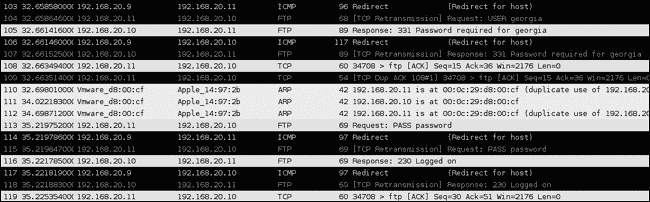图 7-8. Wireshark 捕获登录信息。

### 使用 ARP 缓存中毒来冒充默认网关

我们还可以使用 ARP 缓存中毒来冒充网络上的默认网关，访问进出网络的流量，包括目标是互联网的流量。停止你正在运行的 Arpspoof 进程，然后尝试通过冒充默认网关，欺骗 Linux 目标将所有流量路由到 Kali 机器，如下所示。

```
root@kali:~# **arpspoof -i eth0 -t 192.168.20.11 192.168.20.1**
```

```
root@kali:~# **arpspoof -i eth0 -t 192.168.20.1 192.168.20.11**
```

如果我们从 Linux 目标开始浏览互联网，我们应该能看到 Wireshark 捕获的 HTTP 数据包。即使敏感信息使用 HTTPS 加密，我们仍然可以看到用户访问的站点以及任何通过 HTTP 发送的其他信息。例如，如果我们运行一个 Google 查询，查询的明文内容将被 Wireshark 捕获，如 图 7-9 所示。

### 注意

如果你使用 ARP 缓存中毒让一个大型网络误认为你的渗透测试机器是默认网关，你可能会不自觉地引发网络问题。所有经过一个笔记本电脑（或者更糟，一个虚拟机）的网络流量，可能会导致某些情况下的服务拒绝，甚至让网络速度变得非常缓慢。

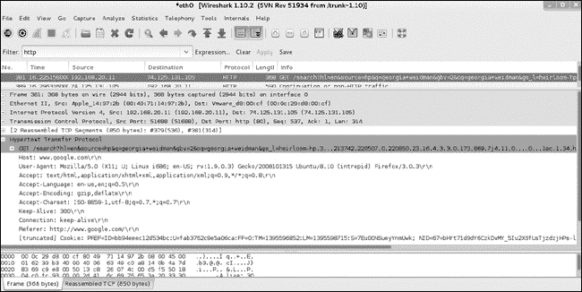图 7-9. 查询被 Wireshark 捕获

## DNS 缓存中毒

除了 ARP 缓存中毒，我们还可以中毒域名服务（DNS）缓存条目（即从域名到 IP 地址的映射），将原本应该访问其他网站的流量引导到我们控制的网站。就像 ARP 将 IP 地址解析为 MAC 地址以正确路由流量一样，DNS 将域名（例如 *[www.gmail.com](http://www.gmail.com)*）解析为 IP 地址。

为了访问互联网上或本地网络中的另一个系统，我们的机器需要知道要连接的 IP 地址。如果我们想访问我们的网页邮件账户，记住 URL *[www.gmail.com](http://www.gmail.com)* 很容易，但记住一堆 IP 地址就很困难，而且这些地址可能会定期更改。DNS 解析将人类可读的域名转换为 IP 地址。例如，我们可以使用工具 Nslookup 将 *[www.gmail.com](http://www.gmail.com)* 转换为 IP 地址，如 示例 7-4 所示。

示例 7-4. Nslookup DNS 解析

```
root@kali~# **nslookup www.gmail.com**
Server: 75.75.75.75
Address: 75.75.75.75#53

Non-authoritative answer:
www.gmail.com canonical name = mail.google.com.
mail.google.com canonical name = googlemail.l.google.com.
Name:     googlemail.l.google.com
Address: 173.194.37.85
Name:     googlemail.l.google.com
Address: 173.194.37.86
```

如你所见，Nslookup 将* [www.gmail.com](http://www.gmail.com) *转换为多个 IP 地址，包括 173.194.37.85 和 173.194.37.86，我们可以使用这些地址访问 Gmail。为了执行 DNS 解析（图 7-10），我们的系统查询其本地 DNS 服务器以获取有关特定域名的信息，如* [www.gmail.com](http://www.gmail.com) *。如果 DNS 服务器有该地址的缓存条目，它会返回正确的 IP 地址。如果没有，它会联系互联网上的其他 DNS 服务器寻找正确的信息。

当返回正确的 IP 地址时，DNS 服务器会将正确的 IP 地址解析结果写回我们的机器，对于* [www.gmail.com](http://www.gmail.com) *，我们的系统随后将* [www.gmail.com](http://www.gmail.com) *转换为 173.194.37.85，如示例 7-4 所示。用户然后可以通过名称访问* [www.gmail.com](http://www.gmail.com) *，无需使用 IP 地址。

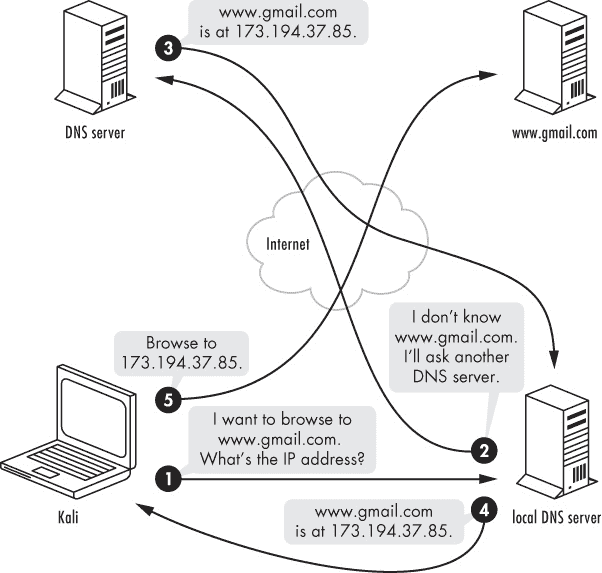图 7-10. DNS 解析

### 入门

DNS 缓存中毒的工作原理类似于 ARP 缓存中毒：我们发送一系列虚假的 DNS 解析回复，将域名指向错误的 IP 地址。

现在确保 Apache 服务器正在运行，使用命令`service apache2 start`。

```
root@kali:~# **service apache2 start**
 * Starting web server apache2                                           [ OK ]
```

在使用 DNS 缓存中毒工具之前，我们需要创建一个文件，指定我们希望伪造的 DNS 名称以及流量的发送位置。例如，让我们告诉任何进行 DNS 解析的系统，对于* [www.gmail.com](http://www.gmail.com) *，该域名的 IP 地址是我们的 Kali 机器，通过将条目`192.168.20.9 www.gmail.com`添加到一个名为*hosts.txt*的新文件中。（你可以随意命名文件。）

```
root@kali:~# **cat hosts.txt**
192.168.20.9 www.gmail.com
```

### 使用 Dnsspoof

在 Linux 目标机和默认网关之间重新启动 Arpspoof，反之亦然，正如使用 ARP 缓存中毒伪装默认网关中所讨论的那样。现在我们可以开始使用 Dnsspoof DNS 伪造工具发送 DNS 缓存中毒尝试，如下所示。

```
root@kali:~# **dnsspoof -i eth0**❶ **-f hosts.txt**❷
dnsspoof: listening on eth0 [udp dst port 53 and not src 192.168.20.9]
192.168.20.11 > 75.75.75.75.53:  46559+ A? www.gmail.com
```

我们指定要使用的网络接口❶，并将 Dnsspoof 指向我们刚刚创建的文件（*hosts.txt*）❷，告诉它需要伪造哪些值。

一旦 Dnsspoof 运行，当我们在 Linux 目标机上执行`nslookup`命令时，返回的 IP 地址应该是我们的 Kali 机器的地址，如示例 7-5 所示。这显然不是 Gmail 的真实 IP 地址。

示例 7-5. 攻击后的 Nslookup

```
georgia@ubuntu:~$ **nslookup www.gmail.com**
Server: 75.75.75.75
Address: 75.75.75.75#53

Non-authoritative answer:
Name:     www.gmail.com
Address: 192.168.20.9
```

为了演示这个攻击，设置一个网站来引导流量。Kali 中的 Apache 服务器默认会为任何访问者提供一个 “It Works” 页面。我们可以更改文件夹 */var/www* 中 *index.html* 文件的内容，但默认的 “It Works” 文本对于我们的目的来说已经足够。

现在，如果我们从 Ubuntu 目标浏览 *[`www.gmail.com/`](http://www.gmail.com/)*，网址栏应该显示 *[`www.gmail.com/`](http://www.gmail.com/)*，但实际上我们访问的是 Kali 机器的网页服务器，如 图 7-11 所示。我们甚至可以通过克隆实际的 Gmail 网站（或攻击者选择的任何其他网站），让用户无法察觉差异，从而使这个攻击更加有趣。

图 7-11. 这不是 Gmail。

## SSL 攻击

到目前为止，我们已经能够拦截加密流量，但还无法从加密连接中获取任何敏感信息。对于下一个攻击，我们将依赖用户愿意点击通过 SSL 证书警告，执行中间人攻击并从 SSL 连接中获取明文，而 SSL 连接用于加密流量，以防止被窃听者读取。

### SSL 基础

SSL 的目标是提供合理的保障，确保在用户的浏览器与服务器之间传输的任何敏感信息（如凭证或信用卡号码）都是安全的——在传输过程中不会被恶意实体读取。为了证明连接是安全的，SSL 使用证书。当你浏览到一个启用了 SSL 的网站时，浏览器会要求该网站用 SSL 证书来证明其身份。该网站提供证书，浏览器进行验证。如果浏览器接受证书，它会通知服务器，服务器会返回一个数字签名的确认，然后 SSL 安全通信开始。

一个 SSL 证书包括一对加密密钥以及标识信息，如域名和拥有该网站的公司名称。服务器的 SSL 证书通常由证书颁发机构（CA）如 VeriSign 或 Thawte 进行认证。浏览器预装了一个受信任的 CA 列表，如果服务器的 SSL 证书得到受信任 CA 的认证，浏览器就可以建立安全连接。如果证书不被信任，用户将看到一个警告，基本意思是：“连接可能是安全的，但也可能不是。请自行决定是否继续。”

### 使用 Ettercap 进行 SSL 中间人攻击

在我们的 ARP 缓存中毒攻击中，我们将 Windows XP 和 Ubuntu 目标之间的流量进行了中间人攻击（以及 Ubuntu 目标和互联网之间的流量）。这些系统仍然能够相互通信，但我们的 Kali 系统能够捕获这些流量。我们可以对 SSL 流量执行相同的攻击。我们可以通过将流量重定向到*`[www.facebook.com](http://www.facebook.com)`*，使其从我们的 Kali 系统发送和接收，从而打破安全的 SSL 连接，这样我们就能拦截敏感信息。

在这个例子中，我们将使用 Ettercap，这是一款多功能的中间人攻击套件，除了能够进行 SSL 攻击外，还可以完成我们之前使用 Arpspoof 和 Dnsspoof 所执行的所有攻击。启动 Ettercap 之前，请关闭其他的欺骗工具。有关配置说明，请参见 Ettercap。

Ettercap 有多个界面，但在这个例子中我们将使用`-T`选项来选择基于文本的界面。使用`-M`选项，配合`arp:remote /` *`gateway`*`/ /`*`target`*`/`，可以在默认网关和 Linux 目标之间设置 ARP 缓存中毒攻击，如下所示。实际攻击与我们之前使用 Arpspoof 的操作方式相同。

```
root@kali:~# **ettercap -Ti eth0 -M arp:remote /192.168.20.1/ /192.168.20.11/**
```

运行 Ettercap 后，我们只需等待用户开始与基于 SSL 的 Web 服务器进行交互。切换到你的 Linux 目标，尝试使用 SSL 登录到一个网站。你应该会看到类似图 7-12 中的证书警告。

由于这是一个中间人攻击，SSL 会话的安全性无法得到验证。Ettercap 所提供的证书对于*`[www.facebook.com](http://www.facebook.com)`*无效，因此信任被破坏，如图 7-13 所示。

但安全警告并不会阻止所有用户。如果我们点击通过警告并输入凭据，Ettercap 会在将凭据转发到服务器之前以明文形式抓取它们，如下所示：

```
HTTP : 31.13.74.23:443 -> USER: georgia  PASS: password  INFO: https://www.facebook.com/
```

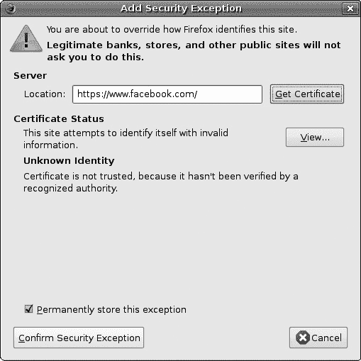图 7-12。Facebook 无法验证。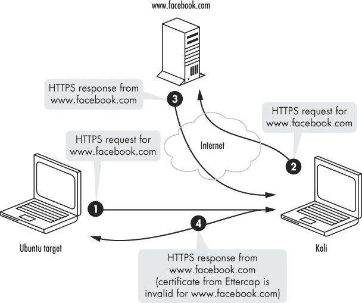图 7-13。SSL 中间人攻击

## SSL 剥离

当然，SSL 中间人攻击的问题在于用户必须点击通过 SSL 证书警告。根据浏览器的不同，这可能是一个繁琐的过程，用户很难忽视，有时甚至无法忽视。大多数读者可能会想到自己曾在某个时候点击通过了安全警告，尽管内心有更好的判断力仍然继续浏览页面。（比如我们的默认 Nessus 安装使用了 Tenable 的自签名证书，当你浏览到 Web 界面时会弹出证书错误。如果你选择按照该例子操作，你很可能决定点击通过该警告。）

很难说证书警告在阻止用户访问没有有效证书的 HTTPS 网站方面的效果如何。我曾进行过一些使用自签名 SSL 证书的社会工程学测试，成功率明显低于使用有效证书或者根本不使用 HTTPS 的情况。尽管有些用户确实点击通过并访问了这些网站，但更复杂的攻击可以让我们在不触发 SSL 连接被破坏的明显警告的情况下捕获明文信息。

使用 SSL 剥离时，我们通过中间人攻击拦截 HTTP 连接， 在重定向到 SSL 之前，加入 SSL 功能，然后将数据包发送到 web 服务器。当 web 服务器回复时，SSL 剥离再次拦截流量，并移除 HTTPS 标签，然后将数据包发送到客户端。这个技术在图 7-14 中有示意。

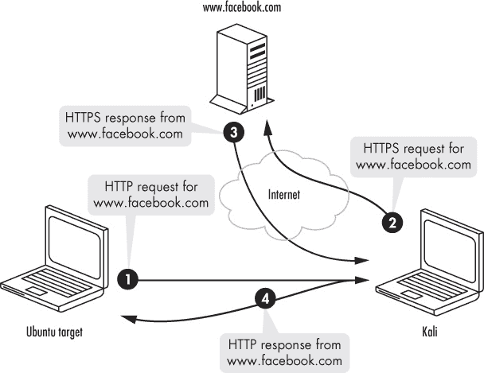图 7-14. SSL 剥离攻击

SSLstrip 的作者 Moxie Marlinspike 将证书警告称为 *负面反馈*，与会显示 HTTPS 在浏览器 URL 栏中时，表示会话有效的 *正面反馈* 相对。避免这种负面反馈对攻击的成功比包含正面反馈要重要得多，因为用户自然不太可能注意到 URL 显示 HTTP 而不是 HTTPS，而更容易注意到需要主动点击跳过的巨大证书警告。SSL 剥离通过再次进行中间人攻击来避免证书警告。

用户通常通过点击链接或 HTTP 302 重定向来遇到 HTTPS。大多数用户不会直接在浏览器中输入 *[`www.facebook.com`](https://www.facebook.com)* 或 *[`www.facebook.com`](http://www.facebook.com)*；他们通常输入 *[www.facebook.com](http://www.facebook.com)*，有时甚至只是输入 *facebook.com*。这就是为什么这种攻击可能发生的原因。SSLstrip 会自动添加 HTTPS，因此 Facebook 和 Kali 之间的 SSL 连接是有效的。SSLstrip 只是将连接切换回 HTTP，然后发送给原始请求者。没有证书警告。

### 使用 SSLstrip

工具 SSLstrip 实现了 SSL 剥离。在开始之前，我们需要设置一个 Iptables 规则，将发送到 80 端口的流量通过 SSLstrip。接下来，我们将在 8080 端口运行 SSLstrip，如下所示，然后重新启动 Arpspoof 并伪造默认网关。（详细步骤请参见使用 ARP 缓存投毒伪造默认网关。）

```
root@kali:# **iptables -t nat -A PREROUTING -p tcp --destination-port 80 -j REDIRECT --to-port 8080**
```

现在启动 SSLstrip，并通过 `-l` 标志告诉它监听 8080 端口。

```
root@kali:# **sslstrip -l 8080**
```

接下来，从你的 Linux 目标机浏览一个使用 SSL 的网站（尝试任何需要登录凭证的互联网网站），例如图 7-15 所示的 Twitter 登录页面。正如你所见，地址栏中的 HTTPS 已经被 HTTP 替换。

当你登录时，你的凭证会被 SSLstrip 以明文报告。（不，我的 Twitter 密码真的不是“password”。）

这个攻击比直接的 SSL 中间人攻击更加复杂。我们能够避免证书警告，因为服务器实际上是与 SSLstrip 完成 SSL 连接，而不是与浏览器连接。

```
2015-12-28 19:16:35,323 SECURE POST Data (twitter.com):
session%5Busername_or_email%5D=georgiaweidman&session%5Bpassword%5D=password&scribe_log=&redirect_after_login=%2F&authenticity_token=a26a0faf67c2e11e6738053c81beb4b8ffa45c6a
```

正如你所见，SSLstrip 报告了输入的凭证（*georgiaweidman: password*）为明文。

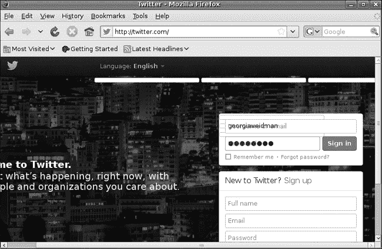图 7-15. 启动 SSLstrip 的 Twitter 登录页面

## 总结

在本章中，我们通过操作网络流量，创造了一些有趣的结果。使用各种工具和技术，我们能够拦截在交换机网络中本不该看到的流量。我们利用 ARP 缓存中毒将交换机网络中的流量重定向到我们的 Kali 系统，并通过 DNS 缓存中毒将用户重定向到我们的 Web 服务器。我们使用 Ettercap 自动化了 SSL 中间人攻击，并且（假设用户点击通过警告）捕获明文中的敏感信息。最后，我们通过使用 SSL 剥离技术，使攻击更加复杂，避免了无效证书警告。

从本地网络捕获流量可以为我们的渗透测试提供有用的信息。例如，我们能够捕获 FTP 服务器的有效凭证，用于后续的攻击。

说到利用，开始吧。
