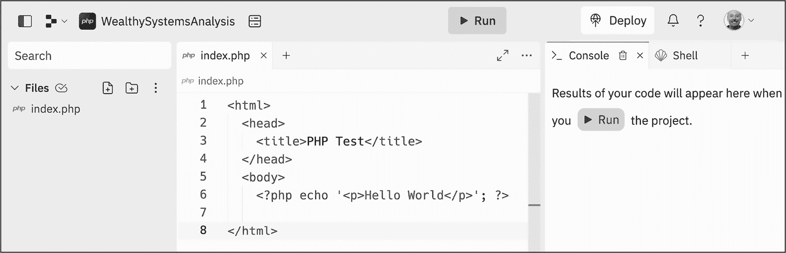
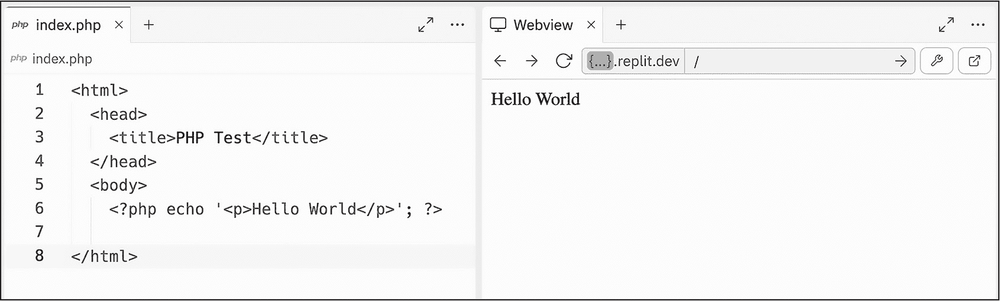
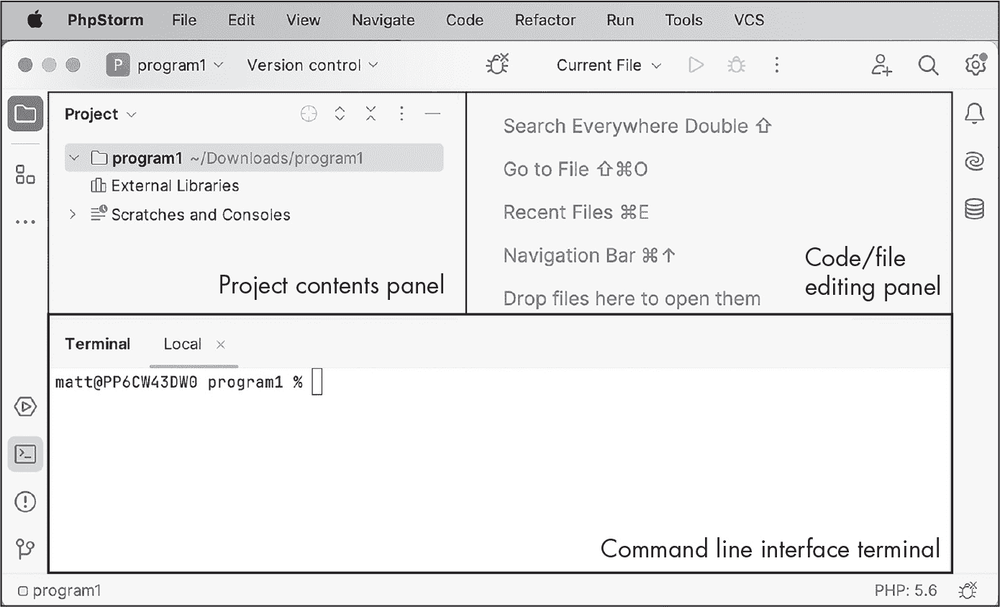
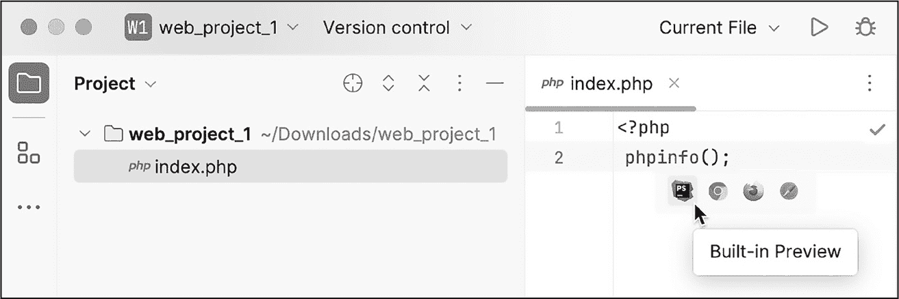
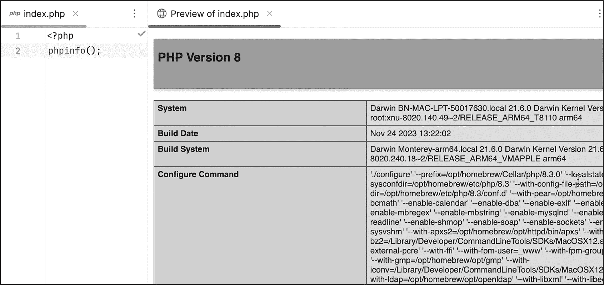

## 第一章：1 PHP 程序基础


本章将介绍两种创建和运行 PHP 程序的方法：使用在线编码环境和使用本地安装的编辑器。我们将尝试这两种方法，以练习一些关键的编程任务，比如打印文本消息、给变量赋值以及处理不同类型的数据。我们还将探索 PHP 语言的核心特性，包括注释、常量和表达式。

### 运行 PHP 的两种方法

通常，学习编程语言的最简单方法是使用一个已经为你配置好的在线环境。这样你可以立刻开始编码并实时查看结果，而不需要安装和配置语言引擎、代码编辑器、网络服务器或其他工具。另一方面，一些人更喜欢自己计算机上安装的编程环境，因为它提供了更多的自定义和控制。

在本节中，你将探索这两种方法，并写出你的第一个 PHP 程序。然后，你可以使用任意一种方法来跟随本书中的示例。

#### Replit 在线编码环境

有多个在线平台可以支持交互式 PHP 开发，并且可以为你运行 PHP 网络服务器。我们将重点介绍 Replit (*[`replit.com`](https://replit.com)*)，这是一个广受欢迎的服务，适合初学者的免费项目。要试用它，请访问 Replit 网站并创建一个账户。

> 注意

*Replit 的名称源自* 读-评估-打印循环（REPL），*这是一种计算机环境，在这种环境中，程序员输入一个表达式，系统立即执行它，打印出响应并等待下一个输入。命令行终端就是一种 REPL，程序员输入单行命令，终端执行这些命令。*

Replit 提供了两种官方的、预配置的模板来创建 PHP 项目：PHP CLI（即*命令行界面*）和 PHP Web 服务器。前者适用于仅在命令行终端窗口输出文本或处理数据文件的项目，而后者则用于 web 开发。我们来看看这两个模板，以便在学习 PHP 程序工作原理的过程中获得一些了解。

##### 创建命令行界面项目

要创建一个 PHP 命令行界面项目，首先进入 Replit 账户的主页，然后点击 **Create Repl**。这将弹出一个窗口，你可以在其中搜索项目模板。在搜索框中输入 **PHP**。结果中应包括 Replit 的 PHP CLI 和 PHP Web 服务器模板。（在这些官方的 Replit 模板下，你还可能看到一些由 Replit 用户创建并标注为 PHP 语言的其他模板。）选择 **PHP CLI**，并为你的项目输入一个名称，或者使用默认的随机单词名称。然后点击 **Create Repl** 来启动项目。

网站将花费一些时间来设置你的新项目，包括创建文件和文件夹结构，并启动一个云虚拟机来运行它。当项目加载时，你将看到如图 1-1 所示的三列屏幕。


图 1-1：新 PHP CLI 项目屏幕，带有默认的“Hello, world!”脚本

左侧列显示项目的文件和文件夹，中间列是一个在线代码编辑器，右侧列是命令行终端输出（称为*控制台*）和 Replit 创建的虚拟计算机的交互式终端（称为*Shell*）。屏幕顶部的运行按钮会运行项目，此时所有输出将显示在控制台中。

一个典型的 PHP 项目包含一个或多个文件，称为*脚本*，并以.*php* 文件扩展名保存。在这种情况下，Replit PHP CLI 项目会自动启动一个名为*main.php*的预编写文件。该文件包含 PHP 代码，用于在控制台输出消息“Hello, world!”。编写一个显示此消息的程序是学习新语言时的一项传统。除了有趣，它还提供了一个机会，学习如何命名包含程序的文本文件，如何编写有效的语句，以及如何执行程序。更重要的是，“Hello, world!”脚本作为计算机系统上语言工具的基本测试：如果程序运行并成功输出“Hello, world!”消息，那么 PHP 就正常工作了。

清单 1-1 显示了 Replit 提供的默认“Hello, world!”脚本，它位于*main.php*中。

```
<?php
echo "Hello, world!\n";
```

清单 1-1：main.php 中的“Hello, world!”程序

脚本开头的<?php 是一个开头的 PHP 标签。此标签表示接下来的内容是 PHP 代码。在这个例子中，代码使用 echo 命令在控制台中打印出文本“Hello, world!”，后面跟着一个换行符（\n）。请注意，要打印的文本被双引号括起来。这些引号表示文本是一个*字符串*，它是一种由一系列字符组成的数据类型。我们将在第三章中详细讨论字符串和特殊字符，如 \n。

echo 语句是一条*语句*的例子，它是一个指示计算机执行某个任务的单一命令（在本例中是显示某些文本）。每个 PHP 语句必须以分号（;）结束，以表示命令结束，就像这个 echo 语句一样。可以把分号看作是句子结尾的句号；没有它，语句被认为是不完整的。

##### 运行 main.php 脚本

点击绿色的**运行**按钮来运行*main.php*脚本。你应该会看到控制台打印出“Hello, world!”消息。恭喜你，你刚刚运行了第一个 PHP 程序！但是，当你点击“运行”时，实际上发生了什么呢？

PHP 是一种*脚本化*编程语言。这意味着一个名为*解释器*的程序会在执行 PHP 文件时将其内容翻译成机器代码。其他脚本化语言包括 Python 和 JavaScript。脚本化语言不同于 *编译型* 编程语言，如 C、C++ 和 Swift，这些语言的翻译过程发生在执行之前的独立步骤中。在这个额外的步骤中，所有程序文件都会被编译并优化为一个或多个可执行文件。

将 PHP 脚本转换为可执行代码的解释器通常被称为*PHP 引擎*。当你点击 Replit 的运行按钮来运行 *main.php* 文件时，Replit 调用 PHP 引擎，PHP 引擎随后读取文件内容并解释执行其中的代码行。对于简单的 PHP 脚本（例如我们的 Replit *main.php*），这些脚本仅由一个或多个按顺序执行的语句组成，整个过程相对简单。然而，几乎所有程序都涉及更复杂的决策逻辑，需要进行测试，以便代码能够动态响应事件并确定执行哪些语句以及按照什么顺序执行。PHP 引擎决定接下来做什么的方式被称为*控制流程*。我们将在讨论第四章和第六章中的条件语句和循环时进一步探讨这个概念。

点击 Replit 的运行按钮并不是执行 PHP 脚本的唯一方式。你还可以通过命令行调用 PHP 引擎，使用 php 命令并跟上你想要执行的脚本的名称。要尝试这个方法，切换到 Replit 项目右侧栏的 Shell 标签页，以打开交互式命令行终端。然后在 $ 提示符后输入以下内容：

```
$ **php main.php**
Hello, world!
```

php main.php 命令指示 PHP 引擎执行 *main.php* 脚本。像以前一样，这会输出 "Hello, world!" 消息。你可以使用相同的方法在本地计算机的命令行上执行 PHP 文件，在这种情况下，你不一定能够使用 Replit 方便的运行按钮。

##### 创建 Web 服务器项目

PHP 主要用于开发 web 应用程序，因此现在让我们尝试通过使用 Replit 的 PHP Web 服务器模板来创建一个基本的基于 Web 的 PHP 项目。返回你的 Replit 主页，创建一个新项目，这次在模板搜索框中输入 **PHP** 后，选择 **PHP Web Server** 模板。你的新项目应该类似于图 1-2。



图 1-2：新的 PHP Web 服务器模板项目屏幕

左栏中显示的唯一文件是一个模板 *index.php* 文件。像这样的 *index* 文件具有特殊的意义：它代表着当你访问一个网站的首页时，默认显示的文件。（我们将在第三部分中详细讨论这如何工作。）该文件的内容显示在中间栏。右栏是控制台和终端标签，这里也是当我们运行 Web 服务器以显示渲染后的网页时，Webview 标签会出现的地方。

*index.php* 文件应包含 列表 1-2 中显示的代码。

```
<html>
  <head>
    <title>PHP Test</title>
  </head>
  <body>
  ❶ <?php echo '<p>Hello World</p>'; ?>

</html>
```

列表 1-2：index.php 中的 Web 服务器脚本

该文件的大部分内容不是 PHP 代码，而是创建通用网页所需的超文本标记语言（HTML），这一点可以通过文件开头和结尾的 <html> 和 </html> 标签看到。正如我们在 第 13 页 的《模板文本与 PHP 代码》中将进一步讨论的，许多 PHP 脚本将动态的 PHP 代码（用于即时解释和执行）与 HTML 这种静态文本混合在一起。在这个例子中，唯一的 PHP 代码是一个 echo 语句，用来显示文本 Hello World ❶。这些文本被包裹在 HTML 的 <p> 标签中，这意味着它将在渲染后的网页中作为一个正文段落显示，而整个 echo 语句被 PHP 标签（开头的 <?php 标签和结尾的 ?> 标签）包围，以表明它是实际的 PHP 代码，不同于周围的 HTML。

##### 运行 Web 服务器项目

点击 **运行** 按钮，Replit 将启动一个 Web 服务器，托管 *index.php* 文件并运行 PHP 引擎来解释文件中的 PHP 代码。这一次，你不应在控制台标签中看到文本，而应在 Webview 标签中看到作为基本网页显示的 Hello World（参见 图 1-3）。



图 1-3：在 Replit Webview 面板中查看 index.php 脚本输出

在运行 Web 服务器时，Replit 会将临时页面发布到 *replit.dev* 域名。这意味着它提供了公共的网页，你可以在一个独立的浏览器标签中查看和交互，而不仅仅是通过 Replit 网站本身。要尝试此操作，请点击 Webview 面板中绿色的 *{...}.replit.dev* URL 地址栏。然后复制弹出窗口中显示的 URL，并将其粘贴到浏览器中新标签页中。你应该会看到相同的 Hello World 消息被渲染为一个独立的网页，与 Replit 界面分开。恭喜你，你已经发布了第一个 PHP 网站！

> 注意

*如果你选择使用 Replit 跟随本书进行学习，你将需要做额外的配置来处理后续章节中的一些更复杂的项目。详情请参见 附录 C。*

#### 本地 PHP 安装

像 Replit 这样的在线编辑器非常好用，但它们在免费计划下可能会比较慢并受到限制，并且需要稳定快速的互联网连接。许多开发者更喜欢在自己的机器上进行本地开发。要做到这一点，第一步是安装 PHP。如果你还没有安装，请按照附录 A 中的指南，安装适合你操作系统的最新版本的 PHP。

一旦 PHP 安装完成，你将需要一个*集成开发环境（IDE）*来编写代码。IDE 是一个强大的文本编辑器，包含了许多有用的编程工具，如终端、复杂的查找和替换功能、代码拼写检查，甚至为常见任务自动生成代码。

本节将重点介绍使用 PhpStorm 进行本地 PHP 开发，PhpStorm 是 JetBrains 出品的一款流行 IDE。任何人都可以免费使用 30 天，之后许多人（如学生、教师、编程训练营的学员、用户组成员以及开源项目的参与者）可以获得免费许可证。访问 *[`www.jetbrains.com/phpstorm/`](https://www.jetbrains.com/phpstorm/)* 下载 PhpStorm，并按照安装说明进行操作。

> 注意

*如果你不想使用 PhpStorm，其他免费 IDE 也提供了辅助 PHP 编程的插件，包括 Visual Studio Code、Eclipse 和 Apache NetBeans。*

##### 使用 PhpStorm 创建“Hello, world!”

让我们用 PhpStorm 创建一个“Hello, world!”项目，类似于 Replit 的 PHP CLI 模板中的默认脚本。打开 PhpStorm IDE，点击**新建项目**，从可能的模板列表中选择**PHP 空项目**。选择项目的位置，并将*未命名*的默认名称更改为你希望的项目名称。确保在项目名称的路径前加上正斜杠，如*/program1*。然后点击**创建**。

PhpStorm 会在你选择的项目名称下，在指定位置创建一个新文件夹。所有的项目文件都将包含在这个文件夹中；更复杂的项目可能还会有子文件夹，用于组织数据、程序文件、配置文件等。文件夹创建后，PhpStorm 会加载到项目编辑视图，如图 1-4 所示。



图 1-4：PhpStorm 的三个主要面板

PhpStorm 的左上面板显示项目文件夹及其内容。右上面板是用来编辑代码和数据文件的地方。点击应用程序窗口左侧列中的终端（**>_**）图标，在应用程序窗口底部打开命令行终端，在这里你可以输入命令并查看程序的文本输出。这个终端会自动打开到项目文件夹的位置。

我们准备向项目中添加一个基础的“Hello, world!”脚本。在应用窗口的左上面板中选择你的项目文件夹，然后从顶部菜单中选择 **文件** ▸ **新建** ▸ **PHP 文件**。输入 **hello** 作为文件名（PhpStorm 会自动为你添加 .*php* 文件扩展名），然后点击 **确定**。你应该能在项目内容面板中看到这个新建的 *hello.php* 文件，并且该文件应该会在代码编辑面板中打开，文件中已经包含了指定文件内容为 PHP 代码所需的 PHP 开始标签（<?php）。现在编辑文件，使其与 列表 1-3 中的代码匹配。

```
<?php
print "Hello, world!\n";
```

列表 1-3：我们在 hello.php 中的 “Hello, world!” 程序

和我们在 Replit 命令行程序中一样，这段代码仅仅是打印出文本 Hello, world!，后面跟着一个换行符（\n）。注意，这次语句使用的是 print 而不是 echo 来显示文本。二者大致可以互换；关于更多信息，请参见下面的“print 还是 echo？”框。

要运行你的脚本，请打开终端面板（如果还没打开的话），然后在命令行中输入以下内容：

```
% **php hello.php**
Hello, world!
```

你应该能在终端的下一行看到 Hello, world! 消息。

另一种在 PhpStorm 中运行脚本的方法是点击绿色的运行按钮（位于绿色“bug”按钮旁边），该按钮位于应用窗口的右上角。这将执行当前正在编辑的文件。如果点击按钮后出现一个下拉菜单，提供 PHP 和 JS（JavaScript）两种运行脚本的方式，选择 PHP 选项。

如果你以这种方式执行脚本，屏幕底部应该会弹出一个运行面板，显示你正在使用的 PHP 引擎以及正在执行的脚本的位置。如果你在一台计算机上有多个 PHP 引擎版本，这些信息非常有用，能够帮助你测试脚本与不同引擎的兼容性。下面应该显示运行程序的输出，后面跟着一个退出代码 0，表示程序成功完成了执行。

##### 在本地运行 PHP Web 服务器

安装 PHP 后，它会自带一个内置的 Web 服务器，用于在你的系统上本地测试 Web 开发项目。你可以通过使用 phpinfo() 函数来查看有关此 Web 服务器的信息（并验证它是否正常工作）。该函数生成一串很长的 HTML 文本，报告有关当前 PHP 安装的详细信息。运行一个调用此函数的脚本是测试任何 PHP 系统用于 Web 开发时的有用第一步，无论是在本地计算机上还是在托管的 Web 服务器上。

使用 PhpStorm（或你选择的其他 IDE），在名为 *web_project_1* 的文件夹中创建一个新项目。然后为该项目创建一个名为 *index.php* 的新文件。如前所述，*index* 这个名称表示这是 Web 服务器托管项目时会返回的默认文件。编辑文件，使其与 列表 1-4 中的内容一致。

```
<?php
phpinfo();
```

列表 1-4：我们在 index.php 中的 info Web 应用

在必需的 PHP 开始标签后，你使用语句 print phpinfo(); 来显示调用 phpinfo() 函数后生成的报告。你可以通过在网页浏览器中执行脚本来查看这个报告，它会以格式化良好的网页形式呈现。在 PhpStorm 中，选择 **视图** ▸ **在浏览器中打开** ▸ **内置预览**，或者在文件编辑面板中，将鼠标放在 PhpStorm 图标上并点击（参见图 1-5）。



图 1-5：使用 PhpStorm 的网页预览

启动内置预览应该会运行 PHP 网页服务器，并在 PhpStorm 中的示例浏览器窗口中显示 *index.php* 脚本的结果，如图 1-6 所示。



图 1-6：PhpStorm 预览中的 phpinfo() 函数输出

你可能希望滚动浏览此网页，了解更多关于系统 PHP 设置的信息。你将找到 PHP 引擎的版本、*php.ini* 配置文件的位置、启用的数据库扩展（如果有的话）、PHP 语言的主要贡献者名称等信息。

你也可以在真实的网页浏览器中查看 *index.php* 脚本的结果，比如 Google Chrome 或 Mozilla Firefox，而不是在 PhpStorm 中查看。（如果你使用的是其他 IDE，这可能是你唯一的选择。）首先，打开 IDE 的终端并输入以下命令：

```
% **php -S localhost:8000**
```

这条命令告诉 PHP 启动其内置的网页服务器，并使当前项目在*localhost:8000*上可用。这里，*localhost* 指代你的本地计算机系统，而 *8000* 设置了端口号。每个需要通过互联网发送和接收消息的应用程序都需要一个唯一的端口号；你可以把这些端口想象成同一地点的不同邮箱。用于测试目的的网页服务器通常使用 8000 或 8080 端口，而生产（线上）网页服务器通常使用 80 端口。就个人而言，我在本地开发时总是使用 8000 端口。

在网页服务器运行时，打开网页浏览器并在地址栏中输入 **localhost:8000**。你应该会看到与之前相同的 PHP 脚本输出。当你完成时，回到终端并按 CTRL-C 终止网页服务器。

请注意，要在浏览器中查看一个不是 *index.php* 命名的脚本，你需要将脚本的文件名附加到浏览器地址栏 URL 的末尾。例如，要将列表 1-3 中的 *hello.php* 脚本作为网页查看，你首先需要运行命令 php -S localhost:8000 启动 PHP 网页服务器，然后在浏览器中访问 *localhost:8000/hello.php*。

### 模板文本与 PHP 代码

PHP 是一种流行的网页开发语言，因为 PHP 脚本可以轻松地输出 HTML（或 CSS 或 JavaScript），以便在网页浏览器中显示。输出的某些部分通常是不变的*模板文本*，而其他部分则通过执行 PHP 程序语句动态生成。静态的模板文本和动态的代码生成文本的结合构成了几乎所有互动网站的基础。

举个例子，想象一下在一个在线零售网站查看购物车。网页设计师不需要为展示每种可能的购物车物品配置编写单独的脚本。他们只需编写一个脚本，将任何购物车中都会出现的元素的通用模板文本（如隐藏的 HTML 头元素、导航栏、公司标志等）与动态填写每个具体购物车项目的名称、价格、数量等细节所需的 PHP 代码混合在一起。

将模板文本与 PHP 代码混合的能力是我们为什么至今需要在脚本中加入开头的<?php 标签，以及为什么有时需要结束的?>标签。任何在这些标签外的部分都被视为模板文本并将逐字输出；任何在这些标签内的部分都会被解析为 PHP 代码并相应执行。如果脚本完全由 PHP 代码组成，如列表 1-1、1-3 和 1-4 中所示，那么只需要开头的<?php 标签；如果 PHP 代码后面有模板文本，如列表 1-2 所示，那么也需要闭合的?>标签。

为了澄清模板文本和 PHP 代码之间的区别，我们来编写一个将两者结合的示例脚本。创建一个新项目（可以在线使用 Replit，或者在本地使用 PhpStorm），在该项目中创建一个名为*hello2.php*的新文件。编辑文件，使其完全匹配列表 1-5 的内容。

```
I am template text, not PHP code.
print "Hello, world!\n";
I am more template text.
```

列表 1-5：hello2.php 脚本，包含没有 PHP 代码块标签的模板文本

这个脚本的第一行和第三行是模板文本，执行脚本时应直接输出。中间一行是 PHP 代码，用于输出“Hello, world!”并换行。或者是吗？尝试在命令行终端输入`php hello2.php`运行这个脚本，看看结果：

```
% **php hello2.php**
I am template text, not PHP code.
print "Hello, world!\n";
I am more template text.%
```

输出会逐字复制文件中的三行文本，正如它们在文件中显示的那样。特别是中间那一行，包括了像`print`关键字、引号和分号等 PHP 代码元素，它们本不应显示。问题在于我们没有加上任何标识 PHP 代码的开闭标签，所以整个脚本被当作模板文本直接输出。

还注意到，输出的最后一行以新的终端提示符（此时是百分号符号）结束。这是因为，当它们出现在 PHP 脚本标签之外作为模板文本时，空格、制表符和换行符会被精确复制。因此，终端会立即接上新的提示符，输出从中断处继续，而不会额外添加换行符。如果我们在*hello2.php*脚本的末尾添加了一个空行，新的终端提示符将出现在自己的新行上。

让我们更新脚本，解决这两个问题。清单 1-6 显示了修订后的*hello2.php*版本，并且变更部分已加粗。

```
I am template text, not PHP code.
**<?php**
print "Hello, world!\n";
**?>**
I am more template text.
```

清单 1-6：修复 hello2.php，区分模板文本与 PHP 代码

我们在 print 语句前添加了一个打开的<?php 标签，并在其后添加了一个关闭的?>标签。这告诉 PHP 解释器，标签之间的内容应作为 PHP 代码进行解释和执行。我们还在脚本末尾添加了一个空行。

如果你重新运行这个脚本，PHP 引擎现在应该会找到包裹在 print "Hello, world!\n";语句前后的起始和结束 PHP 程序标签，因此，除了输出这些标签外，它还会执行那行代码，打印出“Hello, world!”以及换行符。以下是再次执行脚本后的结果：

```
% **php hello2.php**
I am template text, not PHP code.
Hello, world!
I am more template text.
%
```

这次注意到脚本的第一行和最后一行已原样输出为模板文本，而中间一行仅包含“Hello, world!”消息，表明它已成功作为 PHP 代码被解释执行。由于我们在清单 1-6 的脚本末尾添加了一个空行，新的终端提示符现在也出现在自己的新行上。

### 注释

*注释*是任何编程语言中有用的功能。它们是一种告诉 PHP 引擎忽略 PHP 代码块内某些文本的方式，因此这些文本既不会被输出，也不会被解释为应执行的代码。

注释在计算机程序中可以发挥多个作用。首先，它们是将人类可读的注释嵌入代码中的一种方式，例如对某个功能的解释，或者为什么以某种方式编写代码的原因，或者提醒自己需要做的事情。其次，将一行或多行代码变为注释是调试或尝试其他方法时暂时禁用该代码的一种好方法，而不需要完全删除代码。最后，注释还可以包含特殊内容，供预处理工具（如文档生成器或代码测试工具）使用。

和大多数语言一样，PHP 提供了几种定义注释的方式。单行注释以两个正斜杠（//）开头，格式如下：

```
// I am a comment and will be ignored.
```

斜杠后面的所有内容都会被视为注释，在执行代码时会被忽略。这意味着你可以在程序语句后面加注释，且程序语句本身仍会被执行，如下所示：

```
print 2 + 2; // Should print 4
```

在这里，执行 2 + 2 将会输出 4，但 PHP 引擎会忽略行尾的 // 应输出 4 注释。

以 /* 开头并以 */ 结尾的注释可以跨越多行。列表 1-7 展示了这种多行注释的语法。

```
/*
I
am
a multiline
comment.
*/
```

列表 1-7：多行注释示例

这种注释风格特别有用，尤其是当你有一段较长的代码块，希望临时禁用或*注释掉*时。

> 注意

*如果你处理或维护的是多年前编写的遗留代码，你可能还会遇到较老的 shell 风格单行注释，它以*#*字符开头，而不是两个斜杠。尽管这些 shell 风格的注释在 PHP 程序中仍然有效，但*// *语法是现代 PHP 编程中首选的单行注释风格。*

### 变量

计算机程序的一个显著特点是它们是*动态的*，这意味着它们的行为每次执行时会根据不同的数据和事件发生变化。程序的核心就在于使用*变量*，即在代码中引用数据的命名值或引用。变量使你能够存储值并使用有意义的名称（*标识符*）引用它们。

它们被称为变量，因为它们所指的值在每次程序执行时可能会变化。例如，一个变量可能代表当前的日期或时间，而程序可能有逻辑根据该变量的值执行某些特定的操作。也许它会在用户生日时显示问候语，或者每天早上 6 点触发一个警报。另一个变量可能表示日志文件的大小，当该文件的大小超过某个阈值时，程序可能会自动备份该文件的内容并开始一个新的文件。

变量的值不仅会在程序的每次运行中发生变化；它们还可以在程序执行的*过程中*发生变化。例如，表示在线购物车总金额的变量将从 0 开始，并在添加或移除物品时进行更新。一个存储系统中同时登录用户数的变量也会随着程序的运行而变化。在繁忙时段，如果该值非常高，可能需要向系统添加更多的内存或磁盘空间。

#### 创建变量

你可以通过给变量命名并为其赋值来创建一个 PHP 变量。例如，在这里，我们创建了一个名为 $age 的变量，并为其赋值 21：

```
$age = 21;
```

PHP 变量名必须以美元符号 ($) 开头，这是 PHP 代码与几乎所有其他编程语言的一个区别。给变量赋值是通过等号 (=) 完成的，这个等号在这里被称为*赋值运算符*。变量名放在等号的左边，值放在右边。由于设置变量值是一种语句，整个过程以分号结束。

赋值运算符右侧的代码是一个表达式。*表达式* 是一种能够产生单一值或可以被计算为单一值的东西。最简单的表达式就是一个字面量值，就像这个例子中的数字 21。*字面量* 是指以其本身的形式表达的值。例如 21（整数二十一）、3.5（浮点数三点五）、true（布尔值 true）和 "Matt Smith"（文本字符串 Matt Smith）都是字面量。

其他表达式更为复杂。它们可能涉及数学计算，包含其他变量，甚至如你在第五章中看到的那样，可能会调用一个函数。在这些情况下，表达式必须被 *计算*，也就是说，必须先确定其结果值，然后才将该值赋给变量。清单 1-8 展示了一些赋值语句的示例。

```
<?php
$username = "matt";            // A string literal
$total = 3 + 5;                // A calculated expression
$numSlices = $numPizzas * 8;   // A calculation with another variable
$timestamp = time();           // A function that returns a value
```

清单 1-8：将表达式的值赋给变量的示例

我们首先将字符串字面量 "matt" 赋值给 $username 变量。变量可以存储表示多种数据类型的值，我们将在第二章中详细讨论。接着，我们将 $total 变量赋值为计算结果 3 + 5。因此，该变量将存储数字 8。对于 $numSlices 变量的值，我们将另一个变量 $numPizzas 的值乘以 8（在 PHP 中，* 符号表示乘法）。最后，我们将 $timestamp 变量设置为调用 time() 函数得到的值。（你将在第五章中了解更多关于如何从函数中获取值的内容。）

如果你尝试执行清单 1-8 中的代码，它将无法正常工作。PHP 会产生类似以下的警告信息：

```
PHP Warning: Undefined variable $numPizzas in main.php on line 4
```

这里的问题是 $numPizzas 变量是 *未定义的*，意味着它还没有被赋值。在你第一次使用变量之前，始终为其赋值非常重要。 #### 使用变量

一旦你创建了一个变量，就可以在需要引用该变量值的任何地方使用它的名称。例如，清单 1-9 展示了一个程序，演示了如何使用变量来计算并打印给定披萨数量时的总披萨片数。创建一个包含此清单内容的 *pizza.php* 文件。

```
<?php
$numPizzas = 1;
$numSlices = $numPizzas * 8;
print $numSlices;
print "\n";

$numPizzas = 3;
$numSlices = $numPizzas * 8;
print $numSlices;
print "\n";
```

清单 1-9：在 pizza.php 中使用变量

首先，我们将数字值 1 赋给 $numPizzas 变量。然后，我们将 $numPizzas 的值乘以 8，赋给 $numSlices 变量。记住，变量必须以美元符号开始；随着你编写更多 PHP 代码，你会很快习惯这个规则。接着，我们使用打印语句显示 $numSlices 里的值，然后再使用另一个打印语句并加上 \n 换行符来创建一个换行。

如前所述，变量的值可以在程序运行时改变，因此接下来我们将 $numPizzas 变量的值从 1 更新为 3。然后我们再次通过将 $numPizzas 乘以 8 来更新 $numSlices 的值，并打印出新值。以下是命令行执行该程序的结果：

```
% **php pizza.php**
8
24
```

注意到 $numSlices 的值在程序执行过程中从 8 变为 24。这些值是基于 $numPizzas 变化的值计算得出的。你可以尝试自己修改 $numPizzas 变量中的数字，看看能得到多少片不同的披萨。

#### 变量命名

在 PHP 中有一些命名变量的规则和约定。首先，如我们之前讨论的那样，所有变量名必须以美元符号开始。如果在引用变量时忘记加上美元符号，PHP 通常会报告一个未定义常量的致命错误，程序将崩溃。（我们将在下一节讨论常量。）

变量名中的第一个字符（即美元符号后的字符）必须是字母（或在某些情况下是下划线）。按照约定，这个字母应该是小写字母。虽然技术上可以使用大写字母，但通常首字母大写是保留给类名而非变量名的。（你将在第 V 部分中开始学习类和面向对象编程。）变量名中的其余符号可以是字母、数字或下划线。

单词变量名通常应该全部小写，例如 $name 或 $total。对于多词变量名，我们有两种常见的命名约定。一种是 *蛇形命名法*：所有字母小写，单词之间用下划线分隔，例如 $game_lives_remaining 或 $customer_number。另一种是 *小驼峰命名法*：第一个单词全部小写，后续单词的首字母大写，例如 $gameLivesRemaining 或 $customerNumber。

最重要的原则是，无论选择哪种命名约定，都要保持一致，尽可能遵循 PHP 的风格建议，最重要的是，选择能够清楚传达变量表示内容的名称。像 $customerNumber 这样的名称比像 $custNo 这样缩写的名称更清晰，当然也比像 $x 或 $variable 这样没有意义的变量名更好。

请记住，PHP 变量名是区分大小写的，因此像 $username 和 $userName 这样的标识符会被视为不同的变量。如果你在引用变量时大小写写错了（或其他地方输入错误的变量名），PHP 将不知道你指的是什么。列表 1-10 展示了一个示例。

```
<?php
$username = "matt";
print $userName;
```

列表 1-10: 拼写错误的变量名

我们将值 "matt" 分配给 $username 变量，然后尝试打印该变量的值。然而，由于 $userName 的大小写错误，在命令行执行这个脚本时会显示如下警告信息：

```
PHP Warning:  Undefined variable $userName in main.php on line 3
```

因为 PHP 变量区分大小写，所以 PHP 引擎将 `$userName` 视为一个完全不同的变量，它之前并未赋值。在 PHP 看来，这与在示例 1-8 中未定义 `$numPizzas` 变量就尝试使用它是同一个问题。

请记住，虽然 PHP 中的某些部分（如变量名）区分大小写，但语言中的其他部分是大小写不敏感的，意味着大小写不会影响。例如关键字如 if、for、switch 和 print；数据类型如 int 和 string；值如 true 和 false；以及函数和方法名。因此，通常的做法是对语言关键字和数据类型使用小写，对函数和方法名使用小驼峰式命名法。本章末的练习建议了一种编码风格指南，帮助你了解更多关于这些约定的信息。

### 常量

有些值永远不会改变，例如 *π*（总是 3.14）或 pH 值的中性值（总是 7）。在代码中引用这些值时，最好使用 *常量* 而非变量。与变量不同，一旦常量被定义，它的值就不能被更新。按照惯例，常量的名称采用 *大写蛇形命名法*，即所有字母大写，单词之间用下划线连接，如 MAX_PROJECTS 或 NEUTRAL_PH。与变量不同，常量不以美元符号（$）开头。

一些常量是内建于 PHP 语言中的。表 1-1 列出了几个示例。

表 1-1：内建 PHP 常量示例

| 常量 | 描述 | 值 |
| --- | --- | --- |
| M_PI | π，圆周率与直径的比值 | 3.1415926535898 |
| M_E | e，欧拉常数 | 2.718281828459 |
| PHP_INT_MAX | 系统支持的最大整数值 | 对于 64 位系统，通常是 9223372036854775807 |

你也可以通过使用 `define()` 函数来创建自己的自定义常量。示例 1-11 中的脚本展示了一个例子。

```
<?php
define("MAX_PROJECTS", 99);
print "The maximum number of projects is: ";
print MAX_PROJECTS;
print "\n";
```

示例 1-11：定义和打印常量

我们调用 `define()` 函数来创建一个名为 MAX_PROJECTS 的常量，其值为 99。这样常量在代码中的任何地方都可以使用。接着，我们将常量的值作为消息的一部分打印出来。（如果多个打印语句连续执行且不包含换行符，它们会输出到同一行；最后的打印 "\n" 会添加换行符，确保下一次输出——在本例中是下一个命令行提示符——会出现在新的一行上。）运行此脚本的输出应该如下所示：

```
The maximum number of projects is: 99
```

请注意，当我们使用 define() 函数创建常量时，常量的名称必须用引号括起来。如果没有这些引号，创建常量将失败。例如，如果你写 define(MAX_PROJECTS, 99) 而没有引号，PHP 会将 MAX_PROJECTS 视为对一个先前定义的常量的引用，并报错。然而，一旦定义了常量，在引用时就不需要引号了。

> 注意

*PHP 文档中令人困惑的是，将数值和布尔字面量称为* 常量 *，虽然它也使用了* 字符串字面量 *这个术语。在阅读文档时，区分简单常量（字面值本身）和命名常量（例如通过* define() *函数创建的常量）是很有用的。*

### 运算符和操作数

*运算符* 是我们在编程语言中用来操作数据的符号，比如加号（+）用于数值加法，等号（=）用于给变量赋值。*操作数* 是运算符操作的数据（字面量、变量或复杂表达式）。例如，数值加法运算符需要两个操作数：加号左边的一个数字和右边的另一个数字，像 2 + 2 或 $price + $salesTax。

PHP 有不同的运算符用于处理不同类型的数据。在本节中，我们将主要关注用于数值的运算符。在后面的章节中，我们还会考虑其他运算符，例如用于比较值的运算符（第二章）和用于操作逻辑真假值的运算符（第四章）。

#### 算术运算符

PHP 有 *算术运算符* 用于基本的数学计算，例如加法（+）、减法（-）、乘法（*）和除法（/）。这些都是 *二元运算符*，意味着它们需要两个操作数。PHP 还提供了 ** 运算符用于将数字提高到给定的幂次，以及取余运算符（%），它将一个数字除以另一个数字并返回余数。表 1-2 总结了这些运算符。

表 1-2：六个二元（两个操作数）算术运算符

| 运算符 | 描述 | 示例表达式 | 表达式值 |
| --- | --- | --- | --- |
| 加法 | 返回两个操作数的和 | 3 + 1 | 4 |
| 减法 | 返回两个操作数的差值 | 10 - 2 | 8 |
| 乘法 | 返回两个操作数的乘积 | 2 * 3 | 6 |
| 除法 | 返回两个操作数的商 | 8 / 2 | 4 |
| 取余 | 返回第一个操作数除以第二个操作数的余数 | 8 % 3 | 2 |
| 指数运算 | 返回第一个操作数的第二个操作数次方 | 2 ** 3 | 8 |

就像数学运算一样，这些运算符有一个*优先级顺序*，它决定了当表达式包含多个运算时，如何对其进行求值。乘法、除法和取模的算术运算符具有较高的优先级，而加法和减法的运算符优先级较低。因此，在算术表达式 1 + 2 * 3 中，2 * 3 部分会先被计算出 6，然后 1 + 6 再进行计算，所以整个表达式的结果是 7。你可以使用括号强制优先级；例如，表达式(1 + 2) * 3 的结果是 9，而不是 7，因为括号强制加法部分先被计算为 3，再进行乘法计算。

> 注意

*查看 PHP 文档中的完整运算符优先级列表*，[`www.php.net/manual/en/language.operators.precedence.php`](https://www.php.net/manual/en/language.operators.precedence.php) *以获取所有 PHP 运算符的优先级顺序。*

#### 组合算术赋值运算符

我们已经讨论过基础的=赋值运算符，它将一个值赋给一个变量。其他赋值运算符，如+=和-=，将赋值与算术操作结合起来。这些组合运算符的存在，是因为通常我们需要获取变量中的值，进行计算后将结果重新存储回同一个变量，替换掉之前的值。

举个例子，假设我们有一个$total 变量，用于跟踪在线购物车中商品的总成本。每次用户添加或移除购物车中的商品时，我们都想通过该商品的成本来改变$total 的值。我们可以使用常规的=运算符，通过编写类似$total = $total + 25 或$total = $total - 15 来实现。然而，使用组合算术赋值运算符，我们可以通过更简洁的语法完成相同的任务：$total += 25 或$total -= 15。这些语句指示 PHP 引擎通过将 25 加到之前的值上，或将 15 从之前的值中减去，来更新$total 变量的值。

类似的算术赋值运算符也用于其他算术操作。例如，*=运算符将一个变量乘以一个给定值。其他运算符，如/=、%=和**=，分别用于除法、取模和指数运算，但这些运算符的使用频率较低。

#### 增量和减量运算符

数字也可以通过特殊运算符进行*递增*（增加 1）或*递减*（减少 1）：使用双加号（++）进行递增，使用双减号（--）进行递减。与结合的算术赋值运算符类似，++和--提供了更加简洁的语法，用于完成常见的编程任务。例如，要向$age 变量的现有值添加 1，我们可以使用基本的赋值运算符并写成$age = $age + 1，或者使用算术赋值运算符并写成$age += 1。然而，使用递增运算符时，我们只需写$age++。同样，$age--会从$age 的值中减去 1。这些是*一元运算符*的例子，意味着它们只需要一个操作数。

当你想在表达式中使用递增或递减操作的结果时，运算符在值之前或之后的位置很重要。假设$age 包含整数值 21。表达式$age++将返回$age 的当前值（21），然后递增该变量。另一方面，++$age 将首先应用递增操作，然后返回变量的新值（22）。示例 1-12 说明了这一区别。

```
<?php
$person1Age = 21;
print "Person 1 age = ";
❶ print ++$person1Age;
print "\nPerson 1 age (after increment) = ";
print $person1Age;

$person2Age = 21;
print "\nPerson 2 age = ";
❷ print $person2Age++;
print "\nPerson 2 age (after increment) = ";
print $person2Age;
```

示例 1-12：演示前后递增运算符的区别

在这里，我们将$person1Age 和$person2Age 都设置为 21，然后使用++递增每个人的年龄。然而，由于在一种情况下使用了++$person1Age ❶，而在另一种情况下使用了$person2Age++ ❷，所以打印出的结果不同，正如脚本输出所示：

```
Person 1 age = 22
Person 1 age (after increment) = 22
❶ Person 2 age = 21
Person 2 age (after increment) = 22
```

每次打印$person1Age 时，我们都会在输出中看到 22。这是因为将++运算符放在变量前面，确保它的值在第一次打印之前从 21 递增到 22。相反，将++运算符放在$person2Age 后面，则会先看到它原始的值 21 ❶，因为它强制递增操作发生在变量值在表达式中使用之后。

为了避免关于是否使用递增前后值的混淆，许多程序员选择使用两行代码：一行用于递增变量的值，另一行用于使用该新值，如示例 1-13 所示。

```
$person1Age = 21;
$person1Age++;
print $person1Age;
```

示例 1-13：将递增操作与打印语句分开

在这里，我们使用一个语句只对$person1Age 进行递增，另一个语句只打印该变量的值。这明确确保了最终输出将是 22。

### 摘要

本章中我们介绍了一些重要的 PHP 编程基础知识。我们探讨了两种创建和运行 PHP 程序的方式：使用 Replit 在线环境和在本地计算机上使用 PhpStorm IDE。我们涵盖了语句、表达式、变量、常量和运算符，这些都是计算机程序的关键构建块，并讨论了如何使用注释来帮助使代码对人类更易读，并在开发和调试程序时暂时禁用代码块。我们还首次了解了如何将 PHP 程序语句与不变的模板文本交织在一起，这是创建能够动态定制返回给用户网页的 web 应用程序的基本技术。

### 练习

1.   访问 PHP 网站，*[`www.php.net`](https://www.php.net)*，并了解该语言文档页面的布局。在你编写 PHP 程序时，这些文档将是一个很好的参考。

2.   访问另一个实用的在线 PHP 资源，PHP the Right Way (*[`phptherightway.com`](https://phptherightway.com)*)。这个网站汇集了 PHP 编程社区中的最佳实践。如今，社区中的几乎每个人都遵循相同的代码风格规范，这使得不同程序员的 PHP 代码易于阅读、理解和贡献。你可以在 *[`phptherightway.com/#code_style_guide`](https://phptherightway.com/#code_style_guide)* 上阅读这些规范，同时你还可以找到来自 PHP Framework Interop Group（PHP-FIG）的特定风格推荐链接，PHP-FIG 是一个由国际 PHP 专业人士组成的非正式小组，致力于推动语言的编码标准。

3.   使用注释禁用以下代码中的部分行，使得只有 Cat、Dog 和 Helicopter 被打印出来：

```
<?php
print "Cat\n";
print "Elephant\n";
print "Dog\n";
print "Helicopter\n";
print "Bus\n";
print "Spacecraft\n";
```

4.   编写一个脚本，创建一个包含你名字的 `$name` 变量，并使用该变量打印出“我的名字是你的名字”，然后加上换行符。
