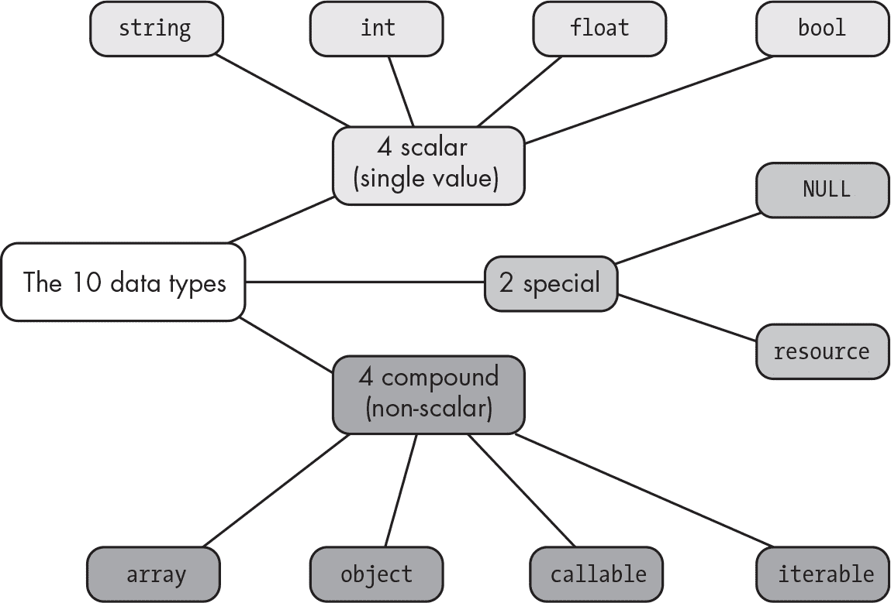

## 第二章：2 种数据类型


在本章中，我们将探讨 PHP 中可用的数据类型。我们还将考虑如何强制将一个值转换为指定的数据类型（*类型转换*），以及 PHP 在何种情况下会自动尝试转换数据类型，以便让表达式的各个部分能够协同工作（*类型自动转换*）。

*数据类型*是程序中值的分类，用于指定 PHP 引擎如何解释该值，从而确定可以对其应用哪些操作。例如，如果一个值是整数，PHP 引擎知道可以进行加法和乘法等操作，而且这些操作的结果仍然是整数；同时，PHP 引擎知道，整数除法的结果可能是另一个整数或浮动小数（十进制）数值。

了解哪些数据类型可用——以及何时和如何改变一个值的数据类型——在处理输入、执行计算和输出数据时至关重要。如果你不了解正在操作的数据类型，或者不知道这些数据在执行不同操作时如何反应，你可能会得到意外的结果。

### PHP 数据类型

在第一章中，我们将单词“matt”存储在一个变量中，并将数字 99 赋值给一个常量。这些值属于不同的数据类型：一个是字符串，另一个是整数。总的来说，PHP 有 10 种内置数据类型，分为三类，如图 2-1 所示。



图 2-1：PHP 数据类型

目前，我们主要关注四种*标量*数据类型，它们一次只能保存一个值。我们还会关注一下特殊的 NULL 数据类型。在后面的章节中，你将学习两种*复合*数据类型——数组（在第八章和第九章中）和对象（在第 V 部分中），它们可以存储和操作多个值的集合。资源特殊类型以及可调用和可迭代的复合类型仅用于复杂和特殊的场景，在本书中不会讨论。

#### 标量数据类型

四种标量（单值）数据类型分别是字符串、整数、浮点数和布尔值。字符串类型用于文本，整数类型用于整数，浮点数类型用于浮动小数（十进制）数字，而布尔值类型则用于布尔真/假值。

让我们使用 PHP 的*交互模式*来探索标量数据类型。该模式允许你在命令行中输入单个 PHP 语句并立即查看结果。我们将在接下来的章节中使用交互模式来快速演示基本概念并获取即时反馈，而不需要编写完整的 PHP 脚本。只需在命令行中输入 `php -a` 启动交互模式，然后输入以下内容：

```
php > **$username = "matt";**
php > **print gettype($username);**
string
```

在这里，我们再次将“matt”赋值给$username 变量。然后我们使用 PHP 内置的 gettype()函数打印出变量的类型。输出确认$username 包含的是字符串。

如果你之前看过或者写过像 Java 或 C#这样的强类型语言的代码，你可能已经注意到，在给变量赋值时不需要指定数据类型。PHP 是一种*宽松类型*的语言，这意味着相同的变量可以在不同的时间存储不同数据类型的值，而 PHP 引擎会自动推断表达式的数据类型。

> 注意

*我们也可以在 PHP 中显式声明数据类型，稍后在第五章中，我们将开始编写函数时这样做。不过现在，当我们处理简单的变量时，我们将让解释器推断数据类型。*

在$唯一用户名（$username）变量的例子中，值“matt”被推断为字符串。我们可以类似地为变量赋予数字值，无论是否有小数，PHP 会根据情况将其解释为整数或浮动数：

```
php > **$age = 21;**
php > **print gettype($age);**
integer
php > **$price = 9.99;**
php > **print gettype($price);**
double
```

在这里，我们看到变量$age 的值是整数，因此它被解释为一个整数，而$price 的值包含小数，所以它被解释为…一个*双精度浮点数*？尽管文档中将浮动值称为 float 数据类型，但出于历史原因（PHP 是一种古老的语言！），当在浮动值上使用 gettype()函数时，它返回 double——这是指用于存储浮动值的双精度格式。然而，PHP 只有一种浮动点数据类型，因此尽管其他编程语言可能对浮动数、双精度数、实数等有不同的精度和内存表示，但在 PHP 中，所有浮动点值都是 float 数据类型（无论 gettype()函数怎么说）。

接下来，我们尝试创建一个布尔类型的变量。请输入以下代码：

```
php > **$isDutyFree = true;**
php > **print gettype($isDutyFree);**
boolean
php > **print $isDutyFree;**
1
```

当我们在$isDutyFree 变量上使用 gettype()时，我们看到输出为布尔值。这是 PHP 中 bool 类型的别名；两者通常可以互换使用，但为了避免一些别名不起作用的情况，请始终在代码中使用 bool（在本书中我也会这样做）。

更有趣的是，注意当我们尝试打印$isDutyFree 的值时，我们在输出中看到的数字是 1，而不是 true。这并不是错误。这与布尔值如何被转换或*转换成字符串*有关。print 命令期望一个字符串，因此无论我们在 print 关键字后提供什么，PHP 引擎都会将其自动转换为字符串表达式。对于布尔类型，true 会被转换为字符串“1”，而 false 会被转换为空字符串（即一个没有内容的字符串，表示为一对空的引号：“”）。我们将在本章稍后讨论通过手动强制转换和自动类型转换进行的类型转换。

要查看$ isDutyFree 的实际布尔值，请使用内置的 var_dump()函数，而不是 print。这个有用的函数会输出有关变量的信息。当学习 PHP 和调试时，知道变量在代码执行的某一时刻的值非常有帮助：

```
php > **$isDutyFree = true;**
php > **var_dump($isDutyFree);**
bool(true)
```

var_dump()的输出确认$ isDutyFree 的数据类型是 bool，并且其值为 true。

#### 特殊的 NULL 类型

PHP 有一种特殊的数据类型，用常量 NULL 或 null（不区分大小写）表示。在三种情况下，一个变量是 NULL。第一种情况是，变量从未被赋值，如此处所示：

```
php > **var_dump($lastName);**
Warning: Undefined variable $lastName in php shell code on line 1
NULL
```

当我们尝试对$ lastName 使用 var_dump()而没有为该变量赋值时，首先会收到一个警告，表示$ lastName 未定义。然后我们会看到该变量因为没有被赋值而评估为 NULL。

其次，如果一个变量显式地将常量 NULL 赋值给它，那么它的值就是 NULL：

```
php > **$firstName = NULL;**
php > **var_dump($firstName);**
NULL
```

在这里，我们看到一个重要的区别，即一个变量从未被赋值（如前面示例所示），与一个变量包含 NULL 值之间的差异。在前一种情况，var_dump()会产生警告，而在这种情况下我们不会收到警告；我们只会看到变量的值（NULL）被打印出来。将 NULL 赋给一个变量是可以的，就像给变量赋其他值一样。

最后，如果一个变量被*unset*，即使用内置的 unset()函数清除了其值，那么它将变为 NULL：

```
php > **$lastName = "Smith"**
php > **var_dump($lastName);**
string(5) "Smith"
php > **unset($lastName);**
php > **var_dump($lastName);**
Warning: Undefined variable $lastName in php shell code on line 1
NULL
```

在这里，我们为$ lastName 赋一个值，然后使用 unset()将其值删除。当我们尝试在 unset 之后对$ lastName 使用 var_dump()时，我们会收到与之前相同的警告，并看到它的值为 NULL。删除变量就像从未给它赋过值一样。

在更复杂的程序中处理变量和数据项时，有时需要设计逻辑来处理遇到 NULL 的情况。例如，如果你在创建数据库连接时遇到问题，连接变量将被设置为 NULL。在另一个例子中，如果你期望传递一个对象的引用（例如，已登录的用户），但没有这样的对象存在，那么该变量将为 NULL。我们将在第五部分和第六部分中讨论面向对象编程和数据库时，探讨这些情况。

#### 测试数据类型的函数

PHP 有许多函数根据提供的变量或表达式是否属于某种数据类型来返回 true 或 false。这些函数包括 is_string()、is_int()、is_float()、is_bool()和 is_null()。这些函数非常有用，如果你需要在操作变量之前确认它是某种特定类型，或者反之，你需要检查变量是否不是 NULL。以下是这些函数的示例：

```
php > **$gpa = 3.5;**
php > **var_dump(is_string($gpa));**
bool(false)
php > **var_dump(is_int($gpa));**
bool(false)
php > **var_dump(is_float($gpa));**
bool(true)
php > **$middleName = NULL;**
php > **var_dump(is_bool($middleName));**
bool(false)
php > **var_dump(is_null($middleName));**
bool(true)
```

我们的变量$ gpa 包含一个小数值，因此只有 is_float()为 true。同样，$ middleName 包含 NULL，因此将其传递给 is_null()会返回 true。

PHP 的一些类型检查函数适用于更广泛的数据类型。例如，is_numeric()函数对 int 或 float 类型的变量返回 true：

```
php > **$gpa = 3.5;**
php > **$age = 21;**
php > **var_dump(is_numeric($gpa));**
bool(true)
php > **var_dump(is_numeric($age))**;
bool(true)
```

在这里，我们看到十进制值 3.5 和整数值 21 都通过了 is_numeric()测试。对于仅包含数字字符的字符串，is_numeric()同样返回 true，但如果混入了非数字字符，则返回 false：

```
php > **$price = "9.99";**
php > **var_dump(is_numeric($price));**
bool(true)
php > **$price = "9.99 dollars";**
php > **var_dump(is_numeric($price));**
bool(false)
```

当$price 包含字符串"9.99"时，is_numeric()返回 true。然而，当我们在字符串末尾添加*美元*这个词时，is_numeric()变为 false。

### 类型转换

在某些情况下，PHP 引擎会自动将一个值从一种数据类型转换为另一种数据类型。这被称为*类型转换*。请看这个示例：

```
php > **$answer = "1" + 3;**
php > **var_dump($answer);**
int(4)
```

在这里，我们尝试将字符串"1"和整数 3 相加。当 PHP 引擎计算这个表达式并将结果存储到$answer 时，它会看到加号运算符（+），并假设进行的是数值加法。因此，PHP 引擎会检查这两个操作数（加号两边的值），并尝试将它们解释为数字（浮动数或整数）。3 已经是一个整数，但字符串"1"会被转换（转换）成一个整数，以允许加法操作进行。最终，我们得到整数 4 作为答案。

在六种情况下，PHP 会自动将表达式转换为不同的类型：数值上下文、字符串上下文、比较上下文、逻辑上下文、函数上下文和位运算（整数和字符串）上下文。接下来我们将讨论其中的一些上下文。

#### 数值上下文

当一个表达式包含算术运算符时，PHP 会尝试将操作数转换为整数或浮动数。这通常发生在一个或多个操作数是字符串的情况下，正如我们刚才看到的"1" + 3 示例。我们将在第五章中看到一个示例，说明函数参数如何被强制转换为整数。布尔值也可以转换为整数；true 变为整数 1，false 变为整数 0。

在数值上下文中，有两个重要的问题：结果会变成整数（int）还是浮动数（float），当字符串同时包含数字和非数字字符时会发生什么？

##### 整数与浮动数

如果算术表达式中的任一操作数是浮动数（或不能解释为整数），则两个值都会被转换为浮动数，并执行浮动数运算。否则，两个值都会被转换为整数，并执行整数运算。例如，当两个操作数都是整数时，结果是整数：

```
php > **$answer = (1 + 1);**
php > **var_dump($answer);**
int(2)
```

当一个操作数是整数，另一个操作数是能转换为整数的数值字符串时，两个操作数都会变成整数，结果也是整数：

```
php > **$answer = (1 + "1");**
php > **var_dump($answer);**
int(2)
```

在将字符串转换为数字时，会忽略前导和尾随的空白字符，因此如果我们在字符串的两端添加空格，仍然会得到相同的结果：

```
php > **$answer = (1 + "  1 ");**
php > **var_dump($answer);**
int(2)
```

请注意，字符串中“1”字符前后多余的空格没有影响，字符串仍然会转换为整数 1。

当两个操作数都是数字且其中一个操作数是浮动数时，两个操作数都会转换为浮动数，结果也是浮动数：

```
php > **$answer = (1.5 + 1);**
php > **var_dump($answer);**
float(2.5)
```

为了得到 2.5 的结果，整数 1 会在幕后被转换为浮动数，然后才进行加法运算。当一个操作数是整数，另一个是可评估为浮动数的数字字符串时，也会发生相同的过程。两个操作数都会转换为浮动数，结果是浮动数：

```
php > **$answer = (1 + "9.9");**
php > **var_dump($answer);**
float(10.9)
```

简而言之，如果需要浮动数运算，PHP 会使用浮动数运算。否则，使用整数运算。

##### 数字、前导数字和非数字字符串

PHP 区分*数字字符串*（其内容完全评估为整数或浮动数）和*前导数字字符串*（以数字字符开头，但也包括非数字字符，如字母或特殊符号）。当前导数字字符串被转换为整数或浮动数时，从第一个非数字字符开始的部分会被丢弃。如果一个字符串*以非数字字符*开头，那么整个字符串被视为*非数字*，即使它也包含数字，也无法转换为数字。

> 注意

*关于字符串以非数字字符开头的规则的例外是以空格开头并后跟数字字符的特殊情况。这样的字符串会被视为数字字符串，因为前导（或尾随）空格会被忽略。*

让我们尝试使用一个前导数字字符串进行数字加法，该字符串评估为整数：

```
php > **$answer = (1 + "1 dollar");**
Warning:  A non-numeric value encountered in php shell code on line 1
php > **var_dump($answer);**
int(2)
```

这里“1 dollar”是一个前导数字字符串。当用于算术表达式时，开头的“1”会转换为整数，而结尾的“ dollar”会被忽略。请注意，PHP 会对此发出警告，但仍然进行类型转换。由于两个操作数都可以转换为整数，结果是整数。

带有前导数字字符串的加法（该字符串可评估为浮动数）也以相同的方式工作：

```
php > **$answer = (1 + "9.99 dollars");**
Warning:  A non-numeric value encountered in php shell code on line 1
php > **var_dump($answer);**
int(10.99)
```

在这种情况下，“9.99 dollars”是一个前导数字字符串，其开头评估为浮动数 9.99。由于两个操作数都可以转换为浮动数，因此结果是浮动数。同样，由于前导数字字符串，PHP 会发出警告。

相反，如果你尝试在算术表达式中使用非数字字符串，将会得到一个类型错误，意味着无法使用给定的数据类型执行操作。这会中断代码的执行。下面是一个示例：

```
php > **$answer = (1 + "April 1");**
Warning: Uncaught TypeError: Unsupported operand types: int + string in
php shell code:1
Stack trace:
#0 {main}
  thrown in php shell code on line 1
```

这里“April 1”是一个非数字字符串，因为它以字母开头，而不是数字。该字符串无法评估为数字，因此会触发错误。如果我们使用空字符串（""）也会发生相同的错误：

```
php > **$answer = (1 + "");**
Warning: Uncaught TypeError: Unsupported operand types: int + string in
php shell code:1
Stack trace:
#0 {main}
  thrown in php shell code on line 1
```

空字符串*不*像其他一些语言那样评估为 0。它是一个非数字字符串，因此在算术表达式中会导致类型错误。

#### 字符串上下文

在某些情况下，PHP 会自动将值转换为字符串。首先，涉及打印或回显语句的表达式会被转换为字符串，因为这些命令期望后续的内容是字符串。例如，您已经看到，当布尔类型的值作为打印语句的一部分时，它们会被转换为字符串 "1"（表示 true）或 ""（表示 false）。类似地，数字也会转换为其字符串等价物。

其次，涉及字符串连接运算符（.）的表达式也会被转换为字符串，就像在字符串内部解析的表达式一样。我们将在第三章中讨论这些主题。

#### 比较上下文

类型转换还会发生在比较两种不同数据类型的值时。比较表达式会评估为布尔值 true 或 false，通常您将其用于决策逻辑（如我们将在第四章中讨论的）。当 PHP 引擎看到一个*比较运算符*，例如 ==（表示*等于*）或 >（表示*大于*）时，它会知道这是一个比较表达式。PHP 有规则来确定这些表达式如何根据涉及的数据类型进行转换和评估。

##### 相同值与相等值

PHP 在相同值和相等值之间做出了重要区分。只有当两个表达式在*类型转换之前*是相同的数据类型并且包含相同的值时，它们才被视为*相同*。相比之下，两个表达式如果在*类型转换之后*包含相同的值，则被视为*相等*。

我们使用不同的运算符来测试身份和相等性。三重等号 (===) 是 *相同运算符*，而双等号 (==) 是 *等于运算符*。考虑以下比较字符串 "1" 和整数 1 的示例：

```
php > **var_dump("1" === 1);**
bool(false)
php > **var_dump("1" == 1);**
bool(true)
```

首先，我们尝试使用相同运算符进行比较。由于操作数的数据类型不同，因此评估结果为 false。接下来，我们尝试使用等于运算符进行比较。这一次，结果为 true，因为 PHP 会在进行比较之前将字符串 "1" 转换为整数。

PHP 还有用于“不相同” (!==) 和“不等于” (!=) 的运算符。考虑这些整数和浮点数之间的比较：

```
php > **var_dump(1 !== 1.0);**
bool(true)
php > **var_dump(1 != 1.0);**
bool(false)
```

使用不相同运算符时，比较结果为 true，因为值的类型不同。使用不等于运算符时，数字首先被转换为相同类型。这样它们就具有相同的值，因此不等于比较结果为 false。

> 注意

*PHP* <> *运算符等价于* != *运算符；两者都表示“不同”。就个人而言，我总是使用* != *运算符，因为感叹号（*!*）在其他上下文中也表示“不是”。*

##### 字符串与数字

自 PHP 8.0 起，当将字符串与数字进行比较时，如果该字符串是数字字符串，则进行数字比较。否则，进行字符串比较。我们在测试整数 1 和数字字符串"1"的相等性时看到过数字比较。如果我们尝试使用一个以数字开头的字符串进行相同的比较，结果将为假：

```
php > **var_dump(1 == "1 dollar");**
bool(false)
```

尽管"1 dollar"以数字开始，但它不是一个完全的数字字符串。因此，PHP 将整数 1 转换为字符串"1"并进行字符串比较。这两个字符串不相等，因此结果为假。

仅使用数字比较完全数字字符串有两个重要的影响，即任何前导或尾部的空格会被忽略，并且空字符串*不*被认为是数字字符串，因此它不等于数字 0，如下所示：

```
php > **var_dump(0 == "");**
bool(false)
```

在这个比较中，由于空字符串不是数字，整数 0 被转换成字符串"0"。然后，字符串"0"和""被比较并发现它们不相等。

##### 小于和大于

在处理数字时，使用小于(<)、大于(>)、小于或等于(<=)或大于或等于(>=)运算符是直接的，因为是否一个数字小于、等于或大于另一个数字非常清晰。以下是一些例子：

```
php > **var_dump(1 < 2);**
bool(true)
php > **var_dump(1 <= 1.01)**
bool(true)
php > **var_dump(2 >= 2);**
bool(true)
php > **var_dump(2 > 2);**
bool(false)
```

你也可以将这些运算符用于非数字数据类型，在这种情况下，PHP 有多种规则来评估比较。例如，布尔值 true 被认为大于 false，也大于 NULL：

```
php > **var_dump(true > false);**
bool(true)
php > v**ar_dump(true > NULL);**
bool(true)
```

字符串之间是逐个字符进行比较的，字母表中后面的字母被认为大于前面的字母：

```
php > **var_dump("abc" < "acb");**
bool(true)
```

小写字母被认为大于大写字母，但是：

```
php > **var_dump("a" > "B");**
bool(true)
```

字符串通常被认为大于任何数字，如以下情况所示：

```
php > **var_dump("abc" > 123);**
bool(true)
php > **var_dump("one" > 1000000);**
bool(true)
```

然而，存在一些对这些通用规则的例外。如我们之前讨论过的，当完全数字的字符串与数字进行比较时，字符串会先转换为数字，然后进行数字比较。例如，字符串"15"会变为整数 15 用于比较：

```
php > **var_dump("15" < 19);**
bool(true)
```

另一个例外是以特殊字符开头的字符串，如：! # $ % & ' () * + , - . /。这种字符串总是被认为小于数字：

```
php > **var_dump("*77" < 5);**
bool(true)
```

如果一个数字与一个以数字开头但包含其他字符的字符串进行比较，数字会被转换为字符串，字符串逐字符比较：

```
php > **var_dump("1a" > 10);**
bool(true)
php > **var_dump("1a" > 20);**
bool(false)
```

在第一个例子中，整数 10 在与字符串"1a"比较之前被转换为字符串"10"。第一个字符相同，但字符 a（字母）被认为大于字符 0（数字）。在第二个例子中，字符串"20"中的数字 2（经过转换）被认为大于字符串"1a"中的数字 1，因此该表达式为假。

了解这些字符串-数字和布尔比较规则是有用的，但依赖它们可能是危险的。最好使用验证逻辑先将字符串转换为数字，然后进行简单的数字比较。例如，我们将在第十二章中测试从网页表单接收的价格是否为数字。

##### 飞船操作符

PHP 语言中相对较新的一个特性是*飞船操作符*（<=>）。与 true 或 false 不同，使用该操作符时，根据比较的两个表达式，会返回 0、1 或-1 的整数值。如果两个表达式相同（经过任何类型转换后），该操作符返回 0；如果第一个表达式大于第二个，返回 1；如果第二个表达式大于第一个，返回-1。例如：

```
php > **var_dump(11 <=> 22);**
int(-1)
php > **var_dump(55 <=> 22);**
int(1)
php > **var_dump("22" <=> 22);**
int(0)
```

在第一个案例中，我们看到输出是-1，因为 11 小于 22。在第二个案例中，我们看到输出是 1，因为 55 大于 22。在最后一个案例中，我们看到输出是 0，因为"22"和 22 经过类型转换后是相同的。

飞船操作符可能看起来像是小于、大于和等于操作符的奇怪结合。然而，它在将数据集合排序为所需的顺序时特别有用，因为某些排序函数需要这种 0、1 或-1 的编码方案。

#### 逻辑和其他上下文

当期望逻辑值为真或假时，PHP 将把其他类型的值转换为布尔类型。这三种逻辑类型转换上下文如下：

+   逻辑操作符，如 AND (&&) 和 OR (||)

+   三元操作符（?）

+   条件语句，如 if 和 switch

我们将在第四章中讲解所有这些逻辑上下文。

类型转换也可能发生在函数上下文和位运算上下文中。我们将在第五章探讨函数上下文（即在函数签名中评估参数）。位运算上下文在网页应用中很少使用，超出了本书的范围。

### 类型转换

*类型转换*是指显式地将一个表达式或变量转换为所需的数据类型。手动类型转换与 PHP 引擎自动执行的类型转换相对立。要将表达式的值转换为特定类型，只需在表达式前加上括号并指定新数据类型。例如，(float)21 确保值 21 被处理为浮动数，而不是整数。以下是转换各种标量数据类型的示例：

```
php > **$age = (int)20.5;**
php > **var_dump($age);**
❶ int(20)
php > **$price = (string)9.99;**
php > **var_dump($price);**
string(4) "9.99";
php > **$inventory = (bool)0;**
php > **var_dump($inventory);**
❷ bool(false)
```

请注意，从浮动数转换为整数时，会截断小数点后的所有内容，实际上是向下舍入到最接近的整数 ❶。当从数字转换为布尔值时，0 变为 false ❷，而任何其他数字值（包括负数！）都变为 true。

类型转换是 PHP 中较少使用的特性之一。它的一个使用示例是轻松获取浮动数的整数部分，例如在比较两个时间戳时，获取秒数的整数部分。

### 总结

本章向你介绍了 PHP 的四种标量数据类型，以及特殊的 NULL 类型。你了解了包含 NULL 的变量与因未定义或未设置而评估为 NULL 的变量之间的区别，并且通过使用像 is_int()和 is_null()这样的函数，练习了测试变量是否为特定类型。稍后，这将帮助你编写代码，仔细测试值以应对从用户或外部数据源（如数据库）接收输入时可能出现的情况。

本章还向你展示了表达式的数据类型如何变化，可以通过类型转换自动或手动地进行。你学习了类型转换可能发生的上下文，以及评估不同数据类型的表达式的规则。理解何时以及如何进行类型转换将帮助你避免在处理混合类型数据时出现意外的结果。

### 练习

1.   编写一个脚本，使用整数转换将浮动数字向下取整。执行以下操作：

a.   创建一个包含 55.9 的$scoreFloat 变量。

b.   创建第二个变量$scoreInt，将$scoreFloat 转换为整数并赋值给它。

c.   打印出$scoreFloat 的类型，然后是它的值，再输出一个换行符。

d.   打印出$scoreInt 的类型，然后是它的值，再输出一个换行符。

你的程序输出应如下所示：

```
double scoreFloat = 55.9
integer scoreInt = 55
```

将$age 变量赋值为整数 21，并使用`var_dump`输出其值。然后将该变量赋值为 NULL，再次使用`var_dump`输出。最后，使用`unset`删除该变量，再次使用`var_dump`输出。请注意，当变量赋值为 NULL 与被 unset 时，输出结果是不同的。
